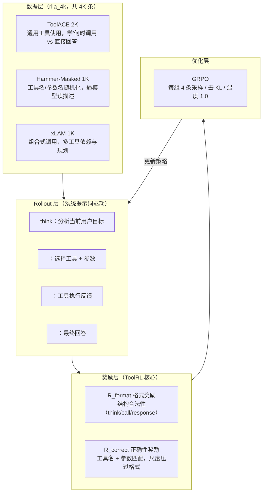

> **TL;DR**
>
> * **ToolRL 回答了 Agent 时代的一个核心问题**：大模型 SFT 学出来的工具调用能力泛化差，换一批 API、换一种组合就露馅；而用 RL 学工具调用，奖励怎么设计是成败关键——论文提出了一套「格式奖励 + 正确性奖励」双层分解方案，用 GRPO 在 Qwen-2.5 / Llama-3.2 系列上把 BFCL V3 成绩做到 **61.31%（1.5B 满血 GRPO vs 30.65% 原始模型 / 53.60% SFT）**，相较基座平均提升 17%、相较同数据量 SFT 提升 15%。
> * **三个反直觉结论**：① 给思考长度发奖励（length reward）不但没用，还可能**伤害**小模型——工具使用任务里「想得长」不等于「做得好」；② 正确性奖励的**归一化尺度必须压过**格式奖励，否则模型会退化成「格式正确、调用全错」的 reward hacking；③ 细粒度的**逐步中间奖励**比只看最终结果的粗奖励训练更稳。
> * **定位**：ToolRL（UIUC，[arXiv:2504.13958](https://arxiv.org/abs/2504.13958)）是工具选择与调用领域**第一篇系统研究奖励设计**的 RL 工作，代码基于 veRL + TinyZero 开源。它和 RAGEN / Search-R1 / Agent-R1 / OpenManus-RL 一起构成了 2025-2026 年「Agentic RL」开源版图的骨干。



---

## 1. 背景：SFT 学工具调用，卡在哪了？

让 LLM 用工具（Tool-Integrated Reasoning，TIR）是 Agent 范式的技术底座。行业里最主流的做法是 **SFT**：攒一批「用户问题 → 工具调用序列 → 最终答案」的轨迹，在基础模型上做有监督微调。这条路线催生了 ToolBench、ToolACE、xLAM 等一批数据工程，也催生了 Gorilla、ToolLLM 等一批模型。

但 SFT 有几个结构性缺陷，在真实 Agent 场景里逐渐暴露：

1. **泛化差**：SFT 学的是「训练分布里的调用模式」。换一个没见过的新 API、换一套参数 schema、换一种多工具组合，模型就开始胡编工具名或参数（业界俗称 hallucinated tool call）。
2. **不会自我纠错**：训练轨迹是静态的，模型从没学会「看 `obs` 反馈 → 发现调用失败 → 换一个工具重试」这条闭环。
3. **数据天花板**：高质量轨迹靠人工或昂贵模型蒸馏，规模上不去，而且 SFT 的下限是「复读训练数据」，上限也高不到哪去。

与此同时，DeepSeek-R1 证明了另一条路：**RL 能把模型从「会模仿」推到「会推理与泛化」**。R1 之后，社区很快意识到：推理任务能 RL，工具调用为什么不能 RL？这就是 ToolRL 论文的出发点。论文原文的表述是：

> "Recent advancements in reinforcement learning, particularly with R1-like models, have demonstrated promising reasoning and generalization abilities. Yet, reward design for tool use presents unique challenges."

**RL 做工具调用的独特难点在哪？** 推理任务（如数学）的奖励是「最终答案对不对」，简单粗暴但有效。工具调用不一样：

- 一个**动作空间巨大**：成百上千个工具，每个工具几十个参数，正确的 (tool, params) 组合是稀疏的；
- **奖励信号是混合的**：格式（结构合法）+ 语义（调用正确）+ 最终结果（任务完成），三层目标纠缠在一起；
- **中间步骤也有对错**：第 2 步的坏工具选择，可能被第 5 步的补救掩盖，也可能直接带崩整个轨迹——只看最终答案的粗奖励（coarse reward）给不出细粒度反馈。

所以 ToolRL 把问题收敛成一句话：**奖励是工具学习的全部（Reward is All Tool Learning Needs）**——先别急着堆数据和算力，把奖励设计研究明白。

## 2. 方法全景：一条 ToolRL 训练管线

### 2.1 训练数据：4K 条的「小而精」混合集

ToolRL 的 RL 训练数据只有 **4K 条**（`rlla_4k`），由三块拼成，刻意兼顾广度与难度：

| 数据源 | 数量 | 设计意图 |
|---|---|---|
| **ToolACE** | 2K | 通用工具使用场景，覆盖「该调工具时调、不该调时直接答」的决策边界 |
| **Hammer（Masked）** | 1K | 把工具名和参数名**随机打码**，逼模型靠工具描述而非死记名字做选择，抗过拟合 |
| **xLAM** | 1K | 组合式场景，单轮内要串联调用多个工具，练工具依赖与多步规划 |

值得注意的细节：**SFT 阶段的 thought 是从 DeepSeek-R1 蒸馏出来的真实推理过程，而 RL 阶段的 thought 字段是占位符**——RL 就是要让模型自己在探索中长出推理，而不是继续抄老师。

### 2.2 Rollout：让模型在系统提示词约束下自由发挥

训练时的 rollout 用一套固定的系统提示词驱动，定义了模型输出的三段式结构：

```
1. Think：回顾上下文，分析当前用户目标
2. Decide on Tool Usage：如果需要工具，指明工具名和参数
3. Respond Appropriately：给出最终结构化回答
```

模型输出必须使用三个特殊 token 包装：`` `think` ``（推理）、`<tool_call>`（工具调用）、`<response>`（最终回答）。工具执行结果以 `<obs>` 反馈回对话历史，形成多轮闭环。这个设计同时服务两个目的：**给奖励判定提供明确的结构锚点**，以及**让 rollout 阶段就能拿到真实工具执行的反馈**。

### 2.3 奖励设计：论文的心脏（3.3 节）

ToolRL 的奖励是经典的两层分解：

$$R_{\text{final}} = R_{\text{format}} + R_{\text{correct}}$$

**① 格式奖励 `R_format`**：检查输出是否符合预期结构——有没有按规定用 `think` / `<tool_call>` / `<response>`、tool_call 是否是合法 JSON、有没有该调用的位置调用、不该调用的位置乱调。

**② 正确性奖励 `R_correct`**：评估每一次工具调用的「语义正确性」——工具名选对没有、参数填对没有。它的归一化形式是：

$$R_{\text{correct}} = \frac{2 \cdot R_{max}}{S_{max}} - 1 \in [-1, 1]$$

其中 `S_max` 是单条样本能达到的最大正确性得分。**关键设计是正确性奖励的最终尺度（reward scale）必须大于格式奖励**——这一点论文专门做了 ablation 验证（见 5.2 节），是防 reward hacking 的核心手段。

### 2.4 优化器：GRPO + 激进探索

- **算法**：Group Relative Policy Optimization（GRPO），每组 4 条采样，相对组内均值归一化 advantage，不需要价值网络；
- **Batch**：512 条 / step；
- **Epochs**：15；
- **策略**：**去掉 KL 正则、生成温度 1.0** —— 论文明确说这是为了「鼓励更广的策略探索」（broader policy exploration）。对工具调用这种动作空间巨大的任务，探索不够就是困在 SFT 的局部最优里。

## 3. 实验结果：主战场 BFCL V3

评估覆盖三个 benchmark：**BFCL V3**（伯克利函数调用榜，含单步/多步/实时执行/无关工具拒答/多工具并行等多种挑战）、**API-Bank**（73 个 API 工具、三级多轮对话难度）、**Bamboogle**（只看最终答案正确率的 QA 型测试）。主结果（BFCL V3，Accuracy）：

| 模型 | Overall | Level 1 | Level 2 | Level 3 |
|---|---|---|---|---|
| Qwen2.5-1.5B-Instruct（Raw） | 30.65% | 28.32% | 35.82% | 35.11% |
| Qwen2.5-1.5B-Instruct（SFT-400） | 53.60% | 57.14% | 50.75% | 44.27% |
| Qwen2.5-1.5B-Instruct（SFT-4k） | 47.07% | 52.88% | 52.24% | 26.72% |
| Qwen2.5-1.5B-Instruct（SFT-400 + PPO） | 57.12% | 60.9% | 50.75% | 48.85% |
| **Qwen2.5-1.5B-Instruct（SFT-400 + GRPO）** | **61.31%** | **64.16%** | **58.21%** | **54.20%** |

几个读表要点：

1. **小数据 SFT + GRPO > 大数据纯 SFT**：SFT-400 + GRPO（61.31%）吊打 SFT-4k（47.07%）。RL 用 400 条初始化数据打出了比 10 倍数据 SFT 更好的效果——「SFT 是起点、RL 是放大器」的模式在工具任务上同样成立。
2. **GRPO 比 PPO 更适合这个场景**：同是 SFT-400 起步，GRPO（61.31%）> PPO（57.12%）。无价值网络 + 组内归一化在动作空间大、奖励稀疏的任务上更稳。
3. **难度最高的 Level 3 提升最明显**：Raw 35.11% → 61.31% 全程的 Level 3 是 54.20%，而 SFT-4k 在 Level 3 只有 26.72% 甚至**倒退**。复杂场景恰恰是 RL 泛化优势最能兑现的地方。
4. **模型规模影响**：Qwen-2.5 系（1.5B/3B）GRPO 收益显著（相对同数据量 SFT 约 +10 个点 absolute）；Llama-3.2-3B 提升较小，论文归因于「Llama 对 GRPO 式泛化的适应性较弱」——同样是 Instruct 模型，底座的对齐方式会影响 RL 的胃口。

摘要里的「平均 +17%（对基座）、+15%（对 SFT）」就是跨模型跨 benchmark 汇总出的总体提升幅度。

## 4. 深度剖析：奖励设计的三块基石

这一节是论文最值钱的部分——第五章的系列消融，回答「什么样的奖励对工具学习是好的」。

### 4.1 长度奖励：反直觉的 Takeaway 1

R1 之后社区有个惯性：**想让模型变聪明，就给思考长度发奖励**（`R_length` 与 think 字段长度成正比）。ToolRL 专门做了这个实验，结论很打脸：

> **Takeaway 1**：While length rewards encourage longer reasoning traces, they do not consistently improve task performance and may even harm it in smaller models.

论文观察到加了固定长度奖励（WITHLENGTH）和动态退火长度奖励（SCHEDULELENGTH）之后，模型的 think 长度确实稳步增长——**但是成绩不涨，小模型甚至掉点**。原因也不难理解：工具调用任务里，正确性取决于「选对工具、填对参数、读懂 obs」，而不是「想得够长」。模型如果发现「想得长 = 拿分」，就会把计算花在无意义的推理膨胀上，挤压真正有用的探索。

**实操启示**：给 Agent 做 RL，别把「思维链长度」当奖励信号。要奖励的是**结果达成 + 过程合法性**，不是修辞学的丰富程度。

### 4.2 奖励尺度：正确性必须压过格式（防 reward hacking）

格式奖励存在天然的 hack 风险：模型可以不学任何语义，只把输出结构调整得漂漂亮亮，就有稳定收益。ToolRL 的做法是让**正确性奖励的尺度严格大于格式奖励**——相当于告诉模型「格式是入场券，正确调用才是得分项」。

论文的 ablation 很干净：把正确性奖励的归一化范围改成 `[-1, 1]`，与格式奖励**等尺度**，性能立刻下降。这验证了 prior work（Xie et al. 2025; Jin et al. 2025）的观察：模型对正确性奖励的响应比对格式奖励更敏感，而这一点必须被显式编码进奖励尺度里，否则就会被 exploit。

**实操启示**：任何工具 RL 项目，奖励函数的第一条军规就是「语义正确性 > 格式合法性」的尺度分层。如果格式和正确性权重平级，训练曲线再漂亮都是假象。

### 4.3 奖励粒度：中间步骤就该有中间反馈

论文观察到工具选择/应用任务和 QA 任务的一个本质差别：**工具任务每步都有真实的中间反馈**（这一步的 tool_call 对不对、obs 里有没有报错），而 QA 只有最终答案。从这个观察出发，ToolRL 验证了奖励粒度的三个层次：

- **粗奖励（COARSEREWARD）**：只看最终结果，中间一概不管——信号稀疏，长轨迹上 credit assignment 困难；
- **细粒度奖励（REFINEDREWARD / INTERMEDIATEREWARD）**：逐步给工具调用打分（选对工具 + 参数匹配 + 对 obs 的利用），训练更稳定、更高效；
- 论文结论：**细粒度奖励分解带来更稳定有效的学习**——注意这里说的不是引入 PRM 之类的学习型过程奖励模型，而是用**规则可判定的逐步信号**（GT 在数据里，每一步的对错是可计算的）。

### 4.4 奖励代码长什么样（参考 veRL 插件结构）

ToolRL 的奖励实现在 `verl/utils/reward_score/rlla.py`，核心逻辑（示意，非逐行原文）：

##### 变量映射表（数学 ↔ 代码）

| 数学符号 | 插件/框架变量 | Shape / 类型 | 含义 |
|---|---|---|---|
| $$r_{format}$$ | `format_score` | 标量 | 格式合规分项 |
| $$r_{correct}$$ | `correctness` | 标量 | 工具执行正确性分项 |
| $$R_i$$ | `reward = w_f·format + w_c·correct − len_pen` | 标量 | 第 $$i$$ 条样本加权总奖励 |
| $$\hat{A}_i=\frac{R_i-\mathrm{mean}}{\mathrm{std}+\epsilon}$$ | `advantages` | `(K,)` | GRPO 组相对优势 |

`rewards/r` 为规则奖励标量、`advantages` 为组内标准化后的优势、`ratio/logp/old_logp`
为 token 级重要性比率三件套、`format_score/correctness` 类为分项奖励。若与具体框架
命名有出入，以你所用版本的 reward_score 插件签名为准。


```python
def compute_tool_reward(prompt, response, target, **kwargs):
    # parse model output: <think> ... <tool_call>... <response>...
    thoughts, tool_calls, final = parse_structured(response)

    # ① format reward: structure legality, 小尺度
    r_format = check_format(thoughts, tool_calls, final)   # ∈ [-1, 0]

    # ② correctness reward: 逐步匹配 tool name + args, 主尺度
    r_correct = 0.0
    for call, gt_call in zip(tool_calls, target["expected_calls"]):
        r_correct += (
            0.5 * (call["name"] == gt_call["name"])        # 工具名
            + 0.5 * args_match(call["parameters"], gt_call["parameters"])  # 参数
        )
    r_correct = normalize(r_correct)                        # 归一化到主尺度

    return preprocess_data(r_format + r_correct)            # R_final
```

论文在代码仓库里用环境变量把各种奖励变体做成了可开关的模块：

```bash
export WITHLENGTH=1        # 加固定长度奖励（验证 Takeaway 1 的负面效果）
export SCHEDULELENGTH=1    # 动态退火长度奖励
export CORRECTMAX1=1       # 正确性/格式等尺度（验证 4.2 的 hack 风险）
export MAX1STEP30MAX3=1    # 两阶段尺度调度
export SCHEDULEREWARD=1    # 平滑动态尺度
export REFINEDREWARD=1     # 细粒度奖励
export INTERMEDIATEREWARD=1 # 逐步中间奖励
export COARSEREWARD=1      # 只看最终结果
```

想复现任意奖励假说的对比实验，开一个环境变量就行——这种「奖励即配置」的工程化思路本身就很值得抄。

## 5. 生态地图：ToolRL 在 Agentic RL 版图里的位置

ToolRL 不是孤岛。2025-2026 年，「用 RL 训练 Agent」从论文变成了开源运动，ToolRL 是其中「工具调用 + 奖励设计」这一支的代表。横向看一圈：

| 项目 | 年份 | 定位 | 与 ToolRL 的关系 |
|---|---|---|---|
| **ToolRL** | 2025.04 | 工具选择/调用的奖励设计 + GRPO | 本尊，聚焦「奖励怎么设」 |
| **RAGEN / StarPO** | 2025.01 | 多轮轨迹级 Agent RL 框架（10 个内置环境） | 更通用：MDP 视角统一 think/action，支持 PPO+GRPO |
| **Search-R1** | 2025 | 用 RL 教模型「调用搜索引擎 + 推理」 | 单工具场景验证了 RL 学检索式推理的可行性 |
| **Agent-R1** | 2025 | 端到端 RL 训练通用 Agent | 把 RL 推到完整 agent loop，而非单轮工具调用 |
| **OpenManus-RL** | 2025 | 对开源 Agent 框架（OpenManus）做 RL 微调 | 工业界视角：已有 Agent 产品怎么叠加 RL |
| **veRL** | — | 火山引擎开源 RL 框架 | ToolRL / RAGEN 的公共底座 |
| **ROLL / VAGEN / ZeroSearch / s3** | 2026 | 阿里 RL 扩缩库 / 视觉 Agent RL / 免搜索指令 / 高效搜索 Agent | RAGEN 生态的衍生 |

几组值得点名的方法论传承：

**RAGEN（StarPO）** 把 ToolRL 的「单轮工具调用」推广到了完整 MDP：状态-思考-动作-奖励的统一格式（`think... <ans>action</ans>`），支持轨迹级整条优化或 turn-wise 训练。它的 2026 版（RAGEN-2）进一步捅破了一层窗户纸——**推理坍缩（template collapse）**：模型推理「看起来多样」但「跨输入毫无区分度」，本质是奖励信号噪声导致模板复制。它用互信息 I(X;Z) 做诊断、用基于奖励方差的 SNR-Adaptive Filtering 做干预。这提醒我们：ToolRL 验证的「正确奖励」只是必要条件，**奖励信号的信噪比**同样决定训练成败。

**Search-R1 / WebRL** 证明 RL 学工具的收益能跨域迁移：工具从「函数调用」换成「搜索引擎」，RL 依然能让模型学会「何时搜、搜什么、怎么用结果」。

**Kimi K2 的工业验证**：闭源侧，Moonshot 的 Kimi K2 用大规模 RL（可验证奖励为主）直接训练 Agent 能力，1T 参数商用模型把「RL 教工具使用」从论文变成了产品底座。ToolRL 这类小规模开源研究提供的正是这套配方里「奖励函数怎么写」的精确答案。

一句话定位：**ToolRL 是「奖励设计」这一层的权威说明书，RAGEN 是「轨迹框架」的通用底盘，Search-R1 是「单工具泛化」的验证样板，Kimi K2 是「大规模落地」的工业 proof。**

## 6. 实战建议：在真实 Agent 产品里做 Tool RL

结合 ToolRL 的结论和 veRL/RAGEN 的工程经验，如果要在自己的 Agent 上跑工具 RL，这份 checklist 可以直接抄：

**① 数据（先小后大）**
- 起步 2-4K 条足够验证奖励设计（ToolRL 的 4K 就是证明）；
- 混合「通用工具」+「打码抗过拟合」+「组合多工具」三类数据，别只喂一种；
- SFT 初始化用 400 条就够起跳，不要迷信大数据 SFT——RL 会自己放大。

**② 奖励（按优先级排序）**
1. 正确性奖励（工具名 + 参数 + 对 obs 的利用）为主尺度；
2. 格式奖励做入场券，尺度必须低于正确性；
3. 有中间反馈就给逐步奖励，不要懒到只看最终结果；
4. **不要加长度奖励**——这是 ToolRL 用实验换来的教训；
5. 全程监控 reward hacking 信号：正确率不涨但格式分猛涨 = 模型在 hack。

**③ 训练配置**
- GRPO 优先于 PPO（无价值网络、更稳）；
- 去 KL 正则 + 温度 1.0 鼓励探索（但如果你的 base 很容易乱，可以适度加回一点 KL）；
- 每步监控：轨迹长度分布、工具调用成功率的**逐步**曲线（只看最终 accuracy 会漏掉中间步骤退化）。

**④ 验证**
- 测试集必须包含训练分布之外的**新工具**（Mask 版本数据就是为此生的）；
- 多轮闭环场景单独测——单轮调用对和完整任务完成是两回事。

## 7. 批判与展望：奖励还不是全部

ToolRL 的价值是「把奖励从玄学变成工程」，但它的边界也要说清楚：

1. **奖励依赖标注**：逐步正确性奖励需要每步的 GT 工具调用，这意味着数据要标注到「动作级」。真实产品的日志里有轨迹，但未必有动作级标签——如何从弱监督（只有最终结果，或只有 user 反馈）里长出细粒度奖励，是下一个问题。
2. **规则奖励的天花板**：ToolRL 的奖励全是规则可判定的。一旦工具输出是开放式的（自由文本、不可结构化比对），规则奖励就失灵。**学习型奖励模型（PRM）** 在工具场景的回归，几乎是必然。
3. **从「调用对」到「任务成」**：BFCL 测的是调用准确率，真实 Agent 的 KPI 是任务完成率。ToolRL 的 Bamboogle 实验（只看最终答案）已经迈出半步，但「最终结果奖励」与「每步正确性奖励」如何组合到最优，还没有定论。
4. **推理坍缩与新范式**：RAGEN-2 证明模板坍缩是 agentic RL 的隐形杀手，信噪比过滤（SNR-Adaptive Filtering）这类干预会越来越主流。奖励设计之外，**样本筛选与训练动力学诊断**正在成为第二战场。

展望一条主线：**ToolRL（单轮工具奖励）→ RAGEN（多轮轨迹 MDP）→ 带学习型过程奖励的 Agent RL → 与世界交互的完整闭环**。奖励设计的原则（尺度分层、粒度匹配、防 hack）会贯穿始终——这才是这篇文章真正想沉淀的东西。

> 🧪 **动手练习**：① 调整格式/正确性奖励权重比，找到格式开始崩坏的临界点，验证"正确性必须压过格式"；② 仿照 `rlla.py` 插件结构给你的自定义工具写一个奖励函数，跑通一组 4-sample 组相对优势。

## 参考与延伸阅读

- 论文：Cheng Qian et al., *ToolRL: Reward is All Tool Learning Needs*, [arXiv:2504.13958](https://arxiv.org/abs/2504.13958)（UIUC）
- 代码：[qiancheng0/ToolRL](https://github.com/qiancheng0/ToolRL) （veRL + TinyZero 底座，奖励模块 `verl/utils/reward_score/rlla.py`）
- 数据：ToolACE (Liu et al., 2024) / Hammer (Lin et al., 2024) / xLAM (Zhang et al., 2024)
- RAGEN：*Understanding Self-Evolution in LLM Agents via Multi-Turn RL*, [arXiv:2504.20073](https://arxiv.org/abs/2504.20073)；RAGEN-2: *Reasoning Collapse in Agentic RL*, arXiv:2604.06268
- veRL：[volcengine/verl](https://github.com/volcengine/verl) ；TinyZero：[Jiayi-Pan/TinyZero](https://github.com/Jiayi-Pan/TinyZero)
- Benchmark：BFCL V3（gorilla.cs.berkeley.edu）、API-Bank (Li et al., 2023)、Bamboogle (Press et al., 2022)
- 延伸：Search-R1 / Agent-R1 / OpenManus-RL / WebRL / Kimi K2 技术报告
- 中文社区视角：《大模型Agent技术路线解析:模块化vs端到端,强化学习工具调用指南!》（知乎）https://zhuanlan.zhihu.com/p/1955641191589720532
