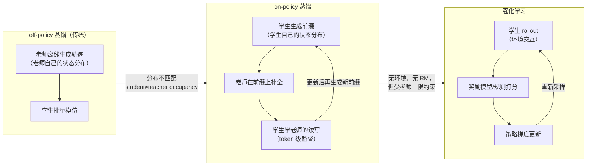

> **TL;DR**
>
> * **OPD 回答了 post-training 的成本问题**：Agentic RL 贵在「多轮 rollout × 环境交互 × 奖励模型」三件套。On-Policy Distillation 把探索外包给老师——**学生自己走前缀（on-policy 状态分布），老师在前缀上补全并提供逐 token 监督**。学生学到的是「在我自己会遇到的状态下，老师会怎么做」，而不是「老师在它的状态分布里怎么做」——这是它与传统蒸馏的本质区别。
> * **两个反直觉发现**（清华 OPD，arXiv:2604.13016）：① 弱到强反向蒸馏实验显示，同家族的 1.5B 和 7B 老师，从学生视角看**分布上不可区分**——「更聪明的老师」未必是更好的蒸馏源；② 成功的 OPD 本质是**高概率 token 的渐进对齐**，一个小的共享 token 集合集中了 97%-99% 的概率质量——OPD 的"免费午餐"（dense token 级奖励）有隐性代价，能否扩展到长视野蒸馏存疑。
> * **Agent 场景的落地**（ReOPD，arXiv:2607.04763）：多轮 OPD 有「前缀陷阱」——让历史更贴近学生，会让学生在老师**目标不可靠**的位置上查询老师。ReOPD 用预收集的教师轨迹做 **prefix replay**（采样位置 $p_t \propto \kappa^t$，$\kappa=0.6$），实现**零环境交互、4-9× 更快的 rollout**，准确率不降反升。与 ToolRL（工具奖励）、Search RL（搜索动作）一起，构成 2025-2026 Agentic RL 训练的第三条技术路线。



---

## 1. 背景：Agentic RL 的成本困境

前两篇我们拆了 ToolRL（工具调用奖励设计）和 Search RL（搜索动作的 RL）。它们都属于同一条主线——**用 RL 训练 agent 与环境交互**。但这条主线有一个绕不开的现实问题：**贵**。

- **多轮 rollout**：一个 agent 轨迹动辄 4-8 轮工具调用，每轮都要模型生成 + 环境执行；
- **环境交互**：搜索 API、代码解释器、网页环境，延迟从几百 ms 到几秒，还有限流、不稳定、需要 mock；
- **奖励模型**：开放式任务没有规则奖励，需要训练 RM 或 LLM-as-judge，本身就是噪声源。

2025-2026 年，一个替代思路迅速成为 post-training 的核心技术（MiniCPM5、veRL 都把它写进官方管线）：**不让学生自己探索，让一个更强的老师替它探索**——这就是 On-Policy Distillation（OPD）。

## 2. 核心概念：什么让 OPD 是 "on-policy" 的

蒸馏（Distillation）不是新东西：小模型学大模型的输出，知识蒸馏 2015 年就有了。**OPD 的特殊之处在"on-policy"三个字上**——它指的是**学生从自己的状态分布出发**。

### 2.1 传统蒸馏的病：分布不匹配

Off-policy 蒸馏的做法：老师（或老师的推理引擎）批量生成轨迹 → 学生做 SFT 模仿。问题在于：

- 老师的状态分布（老师会遇到的 prompt/上下文/中间步骤）**≠** 学生的状态分布；
- 学生学到的是「老师在它的世界里怎么做」，但学生自己生成的轨迹会**漂移到老师没见过的区域**，那里的模仿信号是错的；
- 越小的学生漂移越严重（capacity gap + 自回归误差累积）。

### 2.2 OPD 的机制：学生走前缀，老师补全

OPD 的流程（以 RL 风格描述）：

```
1. 学生从 prompt 生成一段前缀（prefix，比如前 128 个 token）
2. 老师读「prompt + 学生前缀」，续写后续内容（补全，completion）
3. 学生在「prompt + 学生前缀」上，最大化老师补全内容的概率
4. 更新学生，回到第 1 步
```

关键在**第 2 步的输入是学生的前缀，不是老师自己的前缀**。这样：

- 学生学习的都是**自己会访问的状态**（on-policy occupancy）——分布匹配问题被绕开；
- 老师的续写提供了**逐 token 的稠密监督**（dense supervision），相当于免费的 token 级奖励信号，不需要奖励模型、不需要环境。

OPD 的损失函数就是标准的 teacher-forcing 交叉熵（或 KL）：

$$\mathcal{L}_{\mathrm{OPD}}(\theta) = -\mathbb{E}_{x\sim\mathcal{D}}\left[\sum_{t=1}^{T}\log \pi_{\theta}\left(y_t \mid x \oplus \underbrace{\pi_{\theta_{\mathrm{old}}}(x)}_{\text{学生前缀}} \oplus y_{<t}\right)\right]$$

其中 $y$ 是老师在学生前缀上补全的内容。**注意监督的分布是 $\pi_{\theta_{\mathrm{old}}}(x)$（学生刚采样的前缀），而概率是在新参数 $\theta$ 下计算的**——和 RL 的 on-policy 更新是同构的：旧策略采样、新策略更新。

### 2.3 与 RL 的关系：免费的稠密奖励？

OPD 常被描述为「把 RL 的探索替换成老师监督」。两者对比如下：

| 维度 | RL | OPD |
|---|---|---|
| 探索 | 学生自己探索（奖励稀疏、方差大） | 老师补全（探索外包，信号稠密） |
| 奖励 | 环境/RM 打分（可能噪声） | 老师 token 概率（确定性，但受老师上限约束） |
| 环境 | 必需 | **不需要**（ReOPD 做到零环境交互） |
| 上限 | 理论无上限 | **学生的能力上限 ≤ 老师**（除非用 G-OPD 的 reward extrapolation） |

这就是清华论文标题里的"免费午餐"质疑：**dense token 级奖励让训练又快又稳，但学生永远学不到老师没展示过的东西**——而 RL 的价值恰恰在于发现超越老师/超越数据的策略。

## 3. 机制拆解：OPD 什么时候成功、什么时候失败（清华 OPD，arXiv:2604.13016）

清华这篇（2026-04，ICML 2026 FoGen Workshop）是 OPD 的第一篇系统性机制研究。核心结论是两个**成败条件**：

### 条件一：师生思考模式必须兼容

> (i) the student and teacher should share compatible thinking patterns

如果学生的"思考模式"（推理风格、格式、token 习惯）和老师不一致，OPD 会失败——学生在自己的前缀上，老师续写的内容对学生来说是"外星语言"，学不动。

### 条件二：老师必须提供"真正的新能力"

> (ii) even with consistent thinking patterns and higher scores, the teacher must offer genuinely new capabilities beyond what the student has seen during training

老师分数更高**不等于**蒸馏有效。如果老师只是在学生已见过的模式上做得更好，学生早已饱和，学无可学。

### 3.1 验证方法：弱到强反向蒸馏

作者用一个巧妙的实验验证这两个条件——**反向蒸馏**（让学生教老师，看哪个方向有效）：

- 同家族的 1.5B 和 7B 模型互相蒸馏；
- 从学生的视角看，**1.5B 和 7B 老师"分布上不可区分"**——即 7B 老师比 1.5B 老师多出来的能力，落在学生从未访问的状态上，学生根本接触不到；
- 这解释了为什么「用更大模型做老师」不是银弹：**老师的有效信息 = 老师能力 ∩ 学生会访问的状态**。

### 3.2 Token 级机制：高概率 token 的渐进对齐

- 成功的 OPD 表现为：在**学生访问的状态**上，学生和老师的高概率 token 集合逐步对齐；
- 一个关键数字：**97%-99% 的概率质量集中在一个很小的共享 token 集合**上——即学生与老师一致的部分是高度集中的，对齐过程本质上是「把共享 token 集合的概率调准」，而不是全面逼近老师的分布。

### 3.3 两个实用的失败恢复策略

1. **Off-policy cold start**：先用离线蒸馏（老师轨迹 SFT）把学生预热到"会说老师的语言"，再做 OPD——先解决思考模式兼容性问题；
2. **Teacher-aligned prompt selection**：选择老师擅长的 prompt 分布做蒸馏，避免在老师也会翻车的区域硬学。

## 4. Agent 场景：ReOPD 与前缀陷阱（arXiv:2607.04763）

清华的研究是单轮/短视野的。多轮 agent 场景（工具调用、搜索、网页）里，OPD 有一个**全新的问题**——ReOPD 论文称之为 prefix trap（前缀陷阱）。

### 4.1 前缀陷阱：双面分布偏移

多轮 OPD 的师生交互发生在**对话历史**上。这里有两股相反的力量：

- **往 on-policy 拉**：历史越贴近学生自己生成的轨迹，学生学得越相关（occupancy 匹配）；
- **往 reliable 拉**：但越贴近学生的历史，越可能是老师**没见过/不擅长**的历史——老师在那些位置的目标（续写）不可靠。

这就是论文说的 *"making histories more student-on-policy improves relevance to the student, but can query the teacher on histories where its target is unreliable"*——**两难**。完全 online 的 OPD 每一步都重新 rollout 学生 + 查询老师，成本高且每一步都踩在这个两难上。

### 4.2 ReOPD 的解法：prefix replay + 位置加权

ReOPD 的改动非常工程化：

1. **离线 prefix 池**：用领域老师（如 ReTool 训练的数学 agent、搜索 agent）在 RL 过程中**顺手收集**轨迹，切成「前缀 + 监督目标」存进池子——收集几乎零成本（老师 RL 本来就要 rollout）；
2. **学生只做"受监督的一步"**：从池子里采样前缀，学生在前缀上续写，老师的目标作为 dense 监督，**全程零环境调用**；
3. **位置加权采样**：多轮轨迹越靠后的位置偏移越大（学生的轨迹漂移随轮次累积），所以按 $p_t \propto \kappa^{t}$（$\kappa=0.6$）采样，**偏向早期、低偏移的前缀**——损失的公式不变，只是数据采样概率变了。

效果（论文报告）：**零工具调用、4-9× 更快的 rollout，准确率匹配甚至超过 online OPD**。另一个附带好处：离线池把**环境与训练解耦**——不同环境（数学、搜索、网页）的轨迹由各自的领域老师收集，合并进一个池子，单个学生可以联合蒸馏，不需要把所有环境同时在线。

## 5. 生态全景：OPD 的 2025-2026

| 工作 | 定位 | 亮点 |
|---|---|---|
| **thunlp/OPD**（arXiv:2604.13016） | 机制研究 | 成败条件、token 级分析、恢复策略；top-k overlap 诊断已合入 veRL（`distillation/overlap_ratio`） |
| **ReOPD**（arXiv:2607.04763） | 多轮 agent | prefix replay、零环境交互、4-9× 加速；框架基于 THUDM slime |
| **G-OPD**（RUCBM） | 超越老师 | *Learning beyond Teacher*：奖励外推（reward extrapolation），试图突破"学生 ≤ 老师"的天花板 |
| **RLCSD**（THU-BPM） | 自蒸馏变体 | 对比式 on-policy self-distillation，学生向**自己**蒸馏 |
| **CaOPD**（Salesforce） | 校准感知 | 让学生继承老师的校准特性（calibration-aware） |
| **MiniCPM5-1B** | 工业落地 | 官方管线明确采用 "RL + OPD" 组合——1B 模型靠 OPD 学大模型能力 |
| **veRL PR #6469** | 框架集成 | OPD overlap 诊断指标进入 veRL 官方（`overlap_ratio` / `overlap_token_advantage`） |

还有三份 Awesome 列表（thinkwee/AwesomeOPD 820⭐、chrisliu298 653⭐、nick7nlp 509⭐）和一篇综述（arXiv:2604.00626，OPDHub）——一个 2025 年还不存在的方向，2026 年已经长成完整的生态。

## 6. 工程骨架：最小 OPD 实现

### 6.1 Online OPD（单轮，核心就三行）

```python
# opd.py —— online OPD：学生走前缀，老师补全，学生学补全
def opd_step(student, teacher, prompt: str, prefix_len: int, teach_len: int):
    # 1. 学生生成前缀（学生自己的状态分布 —— on-policy 的关键）
    prefix = student.generate(prompt, max_new_tokens=prefix_len,
                              sampling_params={"temperature": 0.7})

    # 2. 老师在「prompt + 学生前缀」上补全（dense 监督）
    completion = teacher.generate(prompt + prefix, max_new_tokens=teach_len)
    completion = completion[len(prompt) + len(prefix):]

    # 3. 学生在自己的前缀上最大化老师续写的概率（teacher-forcing CE）
    logits = student(prompt + prefix, completion)          # 前向
    loss = cross_entropy(logits, completion_tokens)        # token 级监督
    loss.backward(); student.step()
```

**唯一容易错的地方**：第 2 步老师的输入必须是 `prompt + 学生前缀`，不是 `prompt + 老师自己生成的前缀`——写错就退化成 off-policy 蒸馏，distribution mismatch 会回来。

### 6.2 ReOPD：离线 prefix 池

```python
# reOPD.py —— prefix replay：零环境交互
# 池子里的每条：{"prefix": 老师轨迹的前 t 个 token, "targets": 第 t+1 步及之后的 token}
# 收集方式：老师 RL 时顺手存（零成本）

def reOPD_step(student, pool, kappa: float = 0.6):
    # 位置加权采样：p_t ∝ kappa^t，偏向早期低偏移前缀
    batch = weighted_sample(pool, weight_fn=lambda item: kappa ** item["turn_index"])

    for item in batch:
        logits = student(item["prefix"])            # 学生只做受监督的一步
        loss = cross_entropy(logits, item["targets"])  # 老师的 dense 监督
    loss.backward(); student.step()
    # 全程没有环境调用、没有老师在线推理
```

### 6.3 与 veRL 结合

veRL 的 OPD 支持（v0.7.0+）：rollout 用学生权重采样 prefix，teacher 作为另一个 actor 补全，loss 走 `distillation` 模式；训练时用 `distillation/overlap_ratio`（师生 top-k token 重叠率）和 `overlap_token_advantage`（重叠 token 的优势贡献）诊断——这两个指标是清华论文的 token 级分析直接落地的。

## 7. 调优清单与陷阱

1. **先验思考模式兼容性**：OPD 前先做短实验看师生 top-k 重叠率（overlap_ratio）。如果 <30%，大概率思考模式不兼容，先 off-policy cold start 或用同家族老师；
2. **别迷信"更大的老师"**：弱到强反向蒸馏说明，老师的有效信息 = 能力 ∩ 学生会访问的状态。学生太小/太弱时，换 70B 老师不如换一个**思考风格更贴近**的老师；
3. **监控 prefix 漂移**：多轮场景每轮学生轨迹都会漂移（prefix trap 的早期信号），ReOPD 的 $\kappa$ 就是漂移速度的旋钮——$\kappa$ 太小浪费数据（只用早期），太大踩进不可靠区；
4. **OPD 不是 RL 的免费替代**：OPD 学不到老师没见过的东西。需要**超越老师**时用 G-OPD 式奖励外推，或回到 RL 本体；
5. **长视野衰减**：清华论文的开放问题——OPD 的 dense token 监督在长轨迹上会稀释（后面的 token 学不动），long-horizon OPD 是当前没有定论的边界；
6. **日志监控**：除了 loss，记录师生重叠率、prefix 长度分布、学生独立 rollout 的准确率（防止"蒸馏过头"——学生只会模仿不会自己决策）。

## 8. 批判与展望

1. **免费午餐的代价**：OPD 的稠密监督来自老师，本质是**把探索风险从学生转移到老师的选择上**。老师的选择受限于它的训练分布——OPD 适合"把已验证的能力下放"，不适合"发现新能力"。
2. **学生 ≤ 老师的铁律正在被打破**：G-OPD 的 reward extrapolation、RLCSD 的自蒸馏，都在试图突破这个上限；但机制研究（清华）表明突破的路径必须绕开"学生访问不到老师的有效状态"这个结构性障碍。
3. **与 RL 的合流不是二选一**：MiniCPM5-1B 的管线是 "RL + OPD" 组合——OPD 做能力下放和冷启动，RL 做最后的超越与对齐。ToolRL（奖励设计）解决"RL 怎么学工具"，Search RL（搜索动作）解决"学什么"，OPD 解决"能不能便宜地学"——三者拼起来，才是完整的 Agentic post-training 版图。
4. **诊断工具会越来越重要**：OPD 的成败在 token 级（97-99% 概率质量集中），肉眼不可见。veRL 把 overlap 指标做成框架级诊断，说明这个领域正在从"玄学"走向"工程"——这和 ToolRL 把奖励设计工程化是同一个趋势。

## 参考与延伸阅读

- 论文：Yaxuan Li et al., *Rethinking On-Policy Distillation of Large Language Models: Phenomenology, Mechanism, and Recipe*, arXiv:2604.13016（清华 NLP，ICML 2026 FoGen）
- 论文：Baohao Liao et al., *Multi-Turn On-Policy Distillation with Prefix Replay*, arXiv:2607.04763（ReOPD，2026-07）
- 论文：Jiazhan Feng et al., *ReTool: Reinforcement Learning for Strategic Tool Use in LLMs*, arXiv:2504.11536（ReOPD 的 math 环境基础）
- 综述：*A Survey of On-Policy Distillation for Large Language Models*, arXiv:2604.00626（OPDHub）
- 代码：https://github.com/thunlp/OPD （veRL v0.7.0 底座）；https://github.com/BaohaoLiao/ReOPD （slime 底座，含 math/search 两环境评估）
- 生态：G-OPD（RUCBM，reward extrapolation）、RLCSD（THU-BPM）、CaOPD（Salesforce）、MiniCPM5-1B（OpenBMB）、veRL PR #6469（overlap 诊断）
- 系列前篇：本站《ToolRL 深度剖析》（2026-08-10）、《Search RL 深度剖析》（2026-08-11）
