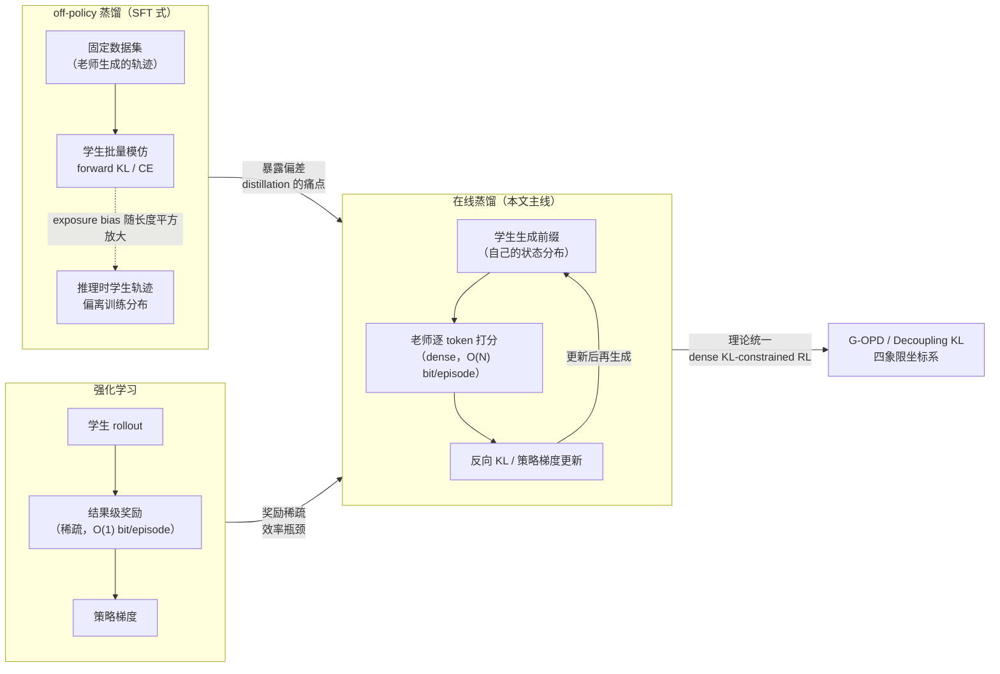

> **TL;DR**
>
> * **在线蒸馏（On-Policy Distillation, OPD）的定义很朴素**：学生从**自己的分布**采样轨迹，老师对轨迹上的**每个 token** 提供监督信号。与之相对：off-policy 蒸馏在固定老师轨迹上做 SFT 模仿，RL 在结果级稀疏奖励上做策略梯度。OPD 恰好站在两者中间——**on-policy 的相关性 + dense 的监督密度**。
> * **为什么非 on-policy 不可**：off-policy 蒸馏的 exposure bias 会随序列长度近似**平方级**放大（Tencent Survey 的结论）——学生训练时只见过老师"完美"的前缀，推理时却要面对自己犯错后越走越偏的轨迹。误差一旦开始累积，模仿信号就失效了。
> * **方法谱系有一条清晰的收敛线**：MiniLLM（2023，反向 KL + 策略梯度）→ GKD（ICLR 2024，把 on-policy 变成插值旋钮）→ **理论统一**：G-OPD 证明 OPD 是 dense KL-constrained RL 的特例（奖励外推 ExOPD 甚至能超越老师）；Decoupling KL 论文把 SFT / DAgger / 离线 RL 蒸馏 / OPD 放进"前缀来源 × KL 方向"的同一张四象限表。2026 年的 OPD 已经不是"一种技巧"，而是一个有坐标系的方法族。
> * **工业端已经全面采用**：Qwen3 的 post-training 标配 OPD；Thinking Machines Lab 复现 Qwen3 配方，**7-10× 更少的梯度步、50-100× 的计算效率**（dense 监督 ≈ 每 token 一个 bit，RL 每 episode 只有 O(1) bit）；MiniCPM5-1B 走 "RL + OPD" 组合；verl 已内置 OPD 训练与 overlap 诊断指标。
> * **机制与边界**（清华 THUNLP，arXiv:2604.13016）：OPD 成功需要两个条件——师生**思考模式兼容** + 老师拥有**真新知识**（同家族 1.5B/7B 老师从学生视角看分布上不可区分）；dense token 奖励随轨迹深度衰减，**长视野蒸馏是当前没有定论的边界**。

---

## 1. 背景：蒸馏为什么需要 "on-policy" 这三个字

知识蒸馏（KD）2015 年就有了（Hinton et al.），2023 年 Alpaca 把"LLM 老师生成数据 → 学生 SFT"变成工业默认动作，OpenThoughts 之类的蒸馏数据集动辄百万级。但这条 off-policy 路线有两个结构性问题，随着任务变长、推理变深而愈发致命：

**问题一：Exposure bias（暴露偏差）随长度平方级放大。** 学生在训练时看到的上下文，全是老师生成的"完美"前缀；推理时学生自己生成，任何一个小错都会让后续状态偏离训练分布，而且偏离会自我累积——这正是 Bengio 2015 年在 sequence prediction 里描述的 exposure bias。Tencent 的 OPD 综述（arXiv:2604.00626）给出一个量化视角：**这个误差近似随序列长度的平方增长**。短任务（分类、抽取）问题不大，长推理（CoT、agent 多轮）直接踩爆。

**问题二：模仿风格 ≠ 模仿事实。** "The False Promise of Imitating Proprietary LLMs"（Gudibande et al., 2023）早就指出：学生可以学会老师的口吻和自信，但学不会老师的正确率。off-policy 蒸馏本质是让学生拟合"老师在老师自己的状态分布下的输出"，而不是"老师在我（学生）的状态下的行为"。

要同时解决这两个问题，直觉很简单：**让学生在它自己会访问的状态上，接受老师的监督**。这个直觉 2010 年 DAgger 就给出了雏形——把学生自己的轨迹喂给老师打分再迭代训练，是模仿学习里对抗复合误差的标准手段。LLM 时代的 OPD，就是 DAgger 直觉 + 老师 logprob 稠密监督 + 策略梯度优化三者的结合。

## 2. 形式化：在线蒸馏的数学与三种监督粒度

令学生为 $\pi_\theta$，老师为 $\pi_T$。给定 prompt $x$，学生自回归采样一条轨迹 $\hat y=(\hat y_1,\ldots,\hat y_T) \sim \pi_\theta(\cdot \mid x)$。在每一步 $t$，师生在**学生生成的前缀** $\hat y_{<t}$ 上各有一个 next-token 分布：$p_t=\pi_\theta(\cdot \mid x,\hat y_{<t})$ 与 $q_t=\pi_T(\cdot \mid x,\hat y_{<t})$。

OPD 的标准目标是序列级**反向 KL**：

$$\mathcal{L}_{\mathrm{OPD}}(\theta)=\mathbb{E}_{x\sim\mathcal{D}_x}\Big[D_{\mathrm{KL}}\big(\pi_\theta(\cdot\mid x)\;\|\;\pi_T(\cdot\mid x)\big)\Big]$$

利用自回归分解，它精确等于学生轨迹上的逐 token 反向 KL 之和：

$$\mathcal{L}_{\mathrm{OPD}}(\theta)=\mathbb{E}_{x\sim\mathcal{D}_x,\;\hat{y}\sim\pi_\theta(\cdot\mid x)}\left[\sum_{t=1}^{T}D_{\mathrm{KL}}(p_t\;\|\;q_t)\right]$$

这个公式是整篇文章的地基，值得拆出三个层次：

1. **期望内层是 $\hat{y}\sim\pi_\theta$**——"on-policy"三个字的全部含义。数据分布随学生更新而移动（和 RL 的 on-policy 完全同构）。
2. **目标是反向 KL $D_{\mathrm{KL}}(p_t\|q_t)$**——mode-seeking。学生把概率质量收敛到老师的高概率区域，而不是摊开去覆盖老师的所有模式（这正是 forward KL 的毛病：学生表达力不足时会把质量摊到老师认为不可能的区域）。
3. **求和覆盖每个 token**——dense。每个位置都有监督信号，这是与结果级 RL 奖励的本质区别。

**梯度形式**：反向 KL 对 $\theta$ 的梯度可以写成策略梯度形式——每个 token 的"奖励"就是师生 log-ratio：

$$\nabla_\theta \mathcal{L}_{\mathrm{OPD}} \propto \mathbb{E}_{\hat{y}\sim\pi_\theta}\left[\sum_{t=1}^{T}\underbrace{\log\frac{\pi_\theta(\hat{y}_t\mid x,\hat{y}_{<t})}{\pi_T(\hat{y}_t\mid x,\hat{y}_{<t})}}_{\text{token 级优势}}\nabla_\theta\log\pi_\theta(\hat{y}_t\mid x,\hat{y}_{<t})\right]$$

所以 OPD 在工程上就是"把 RL 的 reward 换成一个稠密 token 级 log-ratio"，Decoupling KL 论文（arXiv:2605.16826）把这个等价性严格化：**reverse KL + student prefix = dense-reward REINFORCE**。

**三种监督粒度**（THUNLP 论文的分类，verl 都支持）：

| 粒度 | 计算方式 | 特点 |
|------|---------|------|
| Full-vocabulary | 直接算式 (2) 的逐 token KL | 最精确，但每步要老师全词表 logprob，贵 |
| Sampled-token | 每步只采学生分布里的一个 token，用 $\log p_t(\hat y_t)-\log q_t(\hat y_t)$ 作为该 token 的奖励 | 无偏 MC 估计，**最便宜**，实践中够用 |
| Top-k | 每步取学生/老师 top-k token 集合上的 KL 近似 | 折中；k 的默认值 16 附近即可，Top-1 会崩（见 §7） |

## 3. 第一站：MiniLLM —— 为什么是反向 KL

MiniLLM（Gu et al., arXiv:2306.08543，2023）是第一个把 on-policy 反向 KL 系统化用于 LLM 蒸馏的工作，它的动机今天看来依然成立：

- **forward KL 的病**：$D_{\mathrm{KL}}(q\|p)$（老师→学生）是 zero-avoiding / mode-covering。学生会把概率质量分配给老师认为**不可能**的区域（low-probability region），表现为"学生输出比老师更发散、更不精确"。
- **反向 KL 的药**：$D_{\mathrm{KL}}(p\|q)$（学生→老师）是 mode-seeking，学生只在高概率模式上贴近老师，天然抑制低概率区域的过度自信。

MiniLLM 的另一个关键设计是 **on-policy 优化**：直接用策略梯度在采样轨迹上优化这个目标（而不是像传统 KD 那样在老师数据上做回归）。它证明了"目标函数换成反向 KL"和"数据从学生自己采"这两个改动缺一不可——只换目标不换数据，exposure bias 依然在。

## 4. GKD：把 on-policy 变成旋钮

GKD（Agarwal et al., arXiv:2306.13649，ICLR 2024）把 MiniLLM 的直觉泛化成一个统一框架，两个贡献：

**贡献一：on-policy 比例 λ 可调。** GKD 的损失在"固定数据集蒸馏"与"学生自生成数据蒸馏"之间插值：

$$\mathcal{L}_{\mathrm{GKD}}(\theta) = (1-\lambda)\cdot\underbrace{\mathbb{E}_{(x,y)\sim\mathcal{D}_{T}}\left[\sum_t D(p_t\|q_t)\right]}_{\text{off-policy：老师数据}}+\lambda\cdot\underbrace{\mathbb{E}_{x\sim\mathcal{D}_x,\;y\sim\pi_\theta}\left[\sum_t D(p_t\|q_t)\right]}_{\text{on-policy：学生自生成}}$$

$\lambda=0$ 退化为传统 off-policy 蒸馏，$\lambda=1$ 是纯 on-policy。实践中 $\lambda$ 通常取 0.5-1.0，保留一部分固定数据防止 on-policy 分布坍缩。

**贡献二：散度自由选择。** 当学生表达力不足（capacity gap）时，反向 KL 的 mode-seeking 行为可能让学生"只学一个模式"，GKD 允许换 forward KL、skew KL（介于两者之间，可调 skewness）等任意 $f$-divergence——这是针对"学生学不动老师全分布"场景的工程弹性。

**与 RLHF 的衔接**：GKD 的训练循环与 RLHF 几乎同构（采样 → 打分 → 策略梯度），可以直接把 PPO 的 KL 正则项替换成蒸馏损失，实现"蒸馏与 RL 的 seamless integration"。这个性质后来被 TML 推到极致：**OPD 可以是一行代码改动**（把 RL 的 regularizer model 换成老师，见 §8）。

## 5. 理论统一：OPD 到底在优化什么

2025-2026 年有两篇工作把 OPD 从"一种技巧"变成了"坐标系里的一点"。

### 5.1 G-OPD：OPD = dense KL-constrained RL 的特例

G-OPD（Yang et al., arXiv:2602.12125，人大 RUCBM）首先在理论上证明：**OPD 是 dense KL-constrained RL 的特殊情形**——其"奖励函数"（师生 log-ratio）与 KL 正则项总是等权加权（权重恒为 1），而 reference model 可以任意选。

于是它把目标泛化为带独立奖励缩放因子 $\gamma$ 和 KL 权重 $\beta$ 的形式：

$$\mathcal{J}(\theta)=\mathbb{E}_{\hat{y}\sim\pi_\theta}\left[\sum_{t=1}^{T}\gamma\cdot\log\frac{\pi_T(\hat{y}_t\mid\cdot)}{\pi_{\mathrm{ref}}(\hat{y}_t\mid\cdot)}-\beta\cdot\log\frac{\pi_\theta(\hat{y}_t\mid\cdot)}{\pi_{\mathrm{ref}}(\hat{y}_t\mid\cdot)}\right]$$

- $\gamma=\beta=1$、$\pi_{\mathrm{ref}}=\pi_\theta$（旧策略）时还原为标准 OPD；
- **$\gamma>\beta$（奖励外推，ExOPD）时，可以推着学生超越老师**——因为学生不再被"贴近老师分布"约束，而是在老师偏好方向上走得更远。论文在 math 推理和代码生成上验证：ExOPD 跨多种师生尺寸组合一致优于标准 OPD。这是"学生 ≤ 老师"铁律的第一个系统性突破。

### 5.2 Decoupling KL and Trajectories：四象限坐标系

这篇（arXiv:2605.16826，EIT Ningbo / HK PolyU / HKUST / SJTU）指出：off-policy 与 on-policy 蒸馏其实**隐式耦合了两个正交选择**——前缀来源（prefix source：老师轨迹 vs 学生轨迹）× KL 方向（forward vs reverse）。解耦后得到一张非常干净的表格：

| | **forward KL（模仿式）** | **reverse KL（策略梯度式）** |
|---|---|---|
| **老师前缀** | SFT（off-policy 蒸馏）：CE + 老师软标签 | offline-RL 式蒸馏：reverse KL 但数据固定 |
| **学生前缀** | **DAgger**：on-policy SFT（学生轨迹 + 老师标签） | **OPD**：on-policy 蒸馏 = dense-reward REINFORCE |

两个梯度级恒等式：

- forward KL 的梯度 = SFT 式的交叉熵匹配（老师软标签作为回归目标）；
- reverse KL 的梯度 = RL 式策略梯度（dense teacher-student log-ratio 作为奖励）。

这意味着 SFT、DAgger、离线 RL 蒸馏、OPD 不是四个无关方法，而是同一坐标系里的四个格子——**选择"蒸馏"其实是在选前缀从哪来 + 梯度往哪去**。论文在 math reasoning 上做了四格对照实验，验证了各自的适用场景。这篇文章的实操价值在于：如果你的目标函数与数据来源不匹配（比如在老师数据上做 reverse KL），你实际在优化一个"非标准格"，行为会偏离直觉。

## 6. 自蒸馏（OPSD）：当老师消失以后

OPD 需要一个比学生强的独立老师，这限制了它的使用场景。2026 年初出现的 **On-Policy Self-Distillation（OPSD）** 把老师去掉了：**同一个模型既当学生又当老师，老师条件上加一个特权上下文（privileged context）**。

Self-Distilled Reasoner（Zhao et al., arXiv:2601.18734）是命名 OPSD 的工作：在推理数据集中，老师上下文是 $x \oplus c$，其中 $c$ 是特权信息（如**真值答案**或**执行反馈**），学生上下文只有 $x$。目标仍然是学生自己采样轨迹上的反向 KL，但老师分布来自"开了上帝视角的自己"：

$$\mathcal{L}_{\mathrm{OPSD}}(\theta)=\mathbb{E}_{x\sim\mathcal{D}_x,\;\hat{y}\sim\pi_\theta(\cdot\mid x)}\left[\sum_{t=1}^{T}D_{\mathrm{KL}}\big(\pi_\theta(\cdot\mid x,\hat{y}_{<t})\;\|\;\pi_\theta(\cdot\mid x\oplus c,\hat{y}_{<t})\big)\right]$$

这个范式的意义和风险并存：

- **意义**：特权上下文提供了"真新信息"（答案本身），同时思考模式天然 100% 兼容（老师就是自己）——恰好命中 THUNLP 说的两个成功条件。后续 RLCSD、Self-Distilled RLVR、迭代自举（iterative self-bootstrapping）都是这个方向的扩展，"RL via self-distillation"（Hübotter et al., 2026）甚至把它做成无 RM 的 RL 替代。
- **风险**：最新研究（Rethinking OPSD for Thinking Models, arXiv:2607.05184）给出尖锐的负面结果——**特权自蒸馏会让所有被测的思考模型退化**，机制是"fork suppression"（学生过早收敛到老师给出的分支，抑制了自己的探索）。2026 年中的"Self-Distillation 何时有效"之争（另一个视角见 Kim et al., arXiv:2603.24472）还没有定论。

## 7. 失败模式与修复：工程现实

OPD 不是免费的。2026 年出现了大量失败模式分析，核心几条：

**7.1 Sampled-token OPD 有偏但方差更紧（Revisiting OPD, CASIA, arXiv:2603.25562）。** token 级 OPD 相对序列级反向 KL 是有偏的，但最坏情况方差界更紧；合成实验显示"未来奖励耦合越强，梯度方差越大、训练越不稳"。工程上识别出三个失败模式：token 级监督失衡、学生访问状态上老师指引不可靠、以及长 rollout 前缀漂移后老师信号失效。

**7.2 两个成功条件（THUNLP, arXiv:2604.13016）**——这是上一篇文章《On-Policy Distillation 深度剖析》的核心，这里只列结论：
1. **思考模式兼容**：师生 top-k token 分布要有足够重叠（overlap_ratio）。老师更强但思考模式不同 → 蒸馏信号弱，且早期损失不可恢复；
2. **真新知识**：老师必须有学生训练中没见过的东西。弱到强反向蒸馏实验显示：**同家族 1.5B 和 7B 老师从学生视角看分布上不可区分**——"更大的老师"不等于"更好的蒸馏源"。
对应两个修复配方：**off-policy cold start**（先用老师 rollout 做 SFT 暖机，抬高初始 overlap）和 **teacher-aligned prompt selection**（用老师 post-training 数据里的 prompt，但注意混合 OOD prompt 防止熵坍缩）。

**7.3 长轨迹奖励衰减（THUNLP §6）**：响应长度存在甜点区（3K-7K token），10K-15K 时训练后期坍缩——不稳定从**尾部 token 开始**再往前传播；老师"从学生前缀续写"的优势从 +0.37（1K 前缀）单调掉到 +0.02（16K 前缀）。dense 监督的可靠性随深度衰减，是 OPD 向长视野/agentic 扩展的硬边界。

**7.4 支持集大小：Top-1 崩，sampled-token 够用（THUNLP §6.3）**。Top-1 每次只取 argmax token，策略微小扰动就会翻转 rank-1，奖励信号不稳定且不随时间平均；sampled-token 虽然每步只用一个 token，但按学生分布采样提供无偏覆盖，效果与 Top-16/64 相当。**结论：k 不是关键设计变量，避开 Top-1 即可**——这对算力敏感的生产环境是好消息。

## 8. 工业实践：从论文到管线

**Qwen3（2025）**：第一个把 OPD 写进生产 post-training 的大型技术报告。Qwen3 的配方成为后续所有复现的基准（"Read §4"是 AwesomeOPD 列表给新人的第一建议）。

**Thinking Machines Lab（2025.10）**：用 Tinker SDK 复现 Qwen3 配方，量化了 OPD 的效率账：

- **7-10× 更少梯度步、50-100× 计算效率**：Qwen3-8B-Base + LoRA(rank 128) 上，OPD 从 RL 训练出的老师（DeepMath）蒸馏回 base，AIME 分数 10 步内恢复，而 RL 要 70 步；
- **为什么快**：RL 每 episode 只教 O(1) bit（结果对错），OPD 每 episode 教 O(N) bit（每个 token 一个信号）。信息论视角下 dense 监督的效率优势是结构性的；
- **更小的 batch 就能稳**（64 prompts × 4 samples），短上下文也能学（没有"轨迹必须采完"的硬截断），不需要额外 RM/labeler——老师的 compute_logprobs 一次前向即可；
- 工程上几乎是白嫖：**把 RL 脚本的 KL 正则模型换成老师，就是 OPD**（one-line change）；损失取 discount=0 的逐 token 反向 KL，无需未来回报；
- 连数据效率都更好：同一个 prompt 多 epoch 训练不会像 RL 那样退化成答案记忆——单 prompt、20 步、每步 256 条 rollout（共 5120 条），就能接近老师的 AIME'24 水平。

**MiniCPM5-1B（OpenBMB）**：管线是 "RL + OPD" 组合——OPD 做能力下放与冷启动，RL 做最后的超越与对齐。GLM-5、MiMo 的技术报告也都把 OPD 列入 post-training。

**verl 落地**：THUNLP 的 OPD 实现基于 verl v0.7.0（`ADV_ESTIMATOR=token_reward_direct`），其 top-k overlap 诊断（`distillation/overlap_ratio`、`distillation/overlap_token_advantage`）已合入 verl 主线（PR #6469）。训练时监控这两个指标 + 熵差，比盯 loss 可靠得多——OPD 的成败在 token 级，肉眼不可见。

## 9. 决策指南：什么时候用哪个

| 场景 | 推荐方法 | 理由 |
|------|---------|------|
| 大模型压小模型，任务短（摘要/抽取） | off-policy SFT 蒸馏即可 | exposure bias 不致命，简单直接 |
| 长推理蒸馏（math/code CoT） | **OPD（sampled-token 或 top-k=16）** | dense 监督在长序列上的收益最大 |
| 师生思考模式差异大 | **off-policy cold start + OPD** | SFT 暖机抬高 overlap，再上 on-policy |
| 学生表达力不足（capacity gap 大） | GKD 调 skew KL / forward KL | 反向 KL mode-seeking 可能学不全 |
| 想超越老师 | **G-OPD / ExOPD（γ>β 奖励外推）** | 标准 OPD 上限是老师分布 |
| 没有可用老师，但有真值/反馈 | **OPSD 自蒸馏**（注意 fork suppression 风险） | 特权上下文 = 真新信息 + 100% 思考兼容 |
| 与 RL 混合 | RL 前 OPD 冷启动，RL 后 OPD 巩固 | MiniCPM5 已验证的工业组合 |
| 多轮 agent 场景 | 见上一篇：ReOPD prefix replay | 在线 OPD 的环境交互成本不可承受 |

## 10. 开放问题

1. **Realizability 之争**：Tsinghua/CMU/Berkeley/Harvard 的《When Does Online Imitation Learning Help in LLM Post-Training?》（arXiv:2606.30445）挑战"OPD 靠纠错累积误差取胜"的故事——在 **realizability** 条件下（目标策略在可实现类里），OPD 相比 SFT 没有增益；online 收益的真正来源是 non-realizability。这直接关系到"什么时候值得为 on-policy 数据付钱"。
2. **长视野蒸馏**：dense 奖励随轨迹深度衰减（§7.3）意味着 OPD 不能直接外推到长 CoT 与 agentic 多轮。混合方案（短段 dense + 长段稀疏结果奖励）和 curriculum 是明确的下一步。
3. **超越老师的机制**：G-OPD 的奖励外推能做，但 THUNLP 的机制研究提示"学生访问不到老师有效状态"是结构性障碍；OPSD 的 fork suppression 又说明自蒸馏可能过拟合特权信号。两条路都还没走通。
4. **几何视角**：HKUST 等的《On the Geometry of On-Policy Distillation》（arXiv:2606.07082）发现 OPD 的参数更新稀疏度（51.6%）介于 SFT（8.1%）与 RLVR（77.2%）之间，且早期会锁定到低秩更新通道——"OPD 学什么"的答案可能藏在参数空间里。

## 参考与延伸阅读

- 论文：Yaxuan Li et al., *Rethinking On-Policy Distillation of Large Language Models: Phenomenology, Mechanism, and Recipe*, arXiv:2604.13016（清华 THUNLP；本篇 §2/§5/§7 的机制与配方来源）
- 论文：Rishabh Agarwal et al., *GKD: On-Policy Distillation of Language Models*, arXiv:2306.13649（ICLR 2024；TRL 有 `GKDTrainer`）
- 论文：Yuxian Gu et al., *MiniLLM: Knowledge Distillation of Large Language Models*, arXiv:2306.08543
- 论文：Wenkai Yang et al., *Learning beyond Teacher: Generalized On-Policy Distillation with Reward Extrapolation*（G-OPD/ExOPD）, arXiv:2602.12125
- 论文：*Decoupling KL and Trajectories: A Unified Perspective for SFT, DAgger, Offline RL, and OPD*, arXiv:2605.16826
- 论文：Siyan Zhao et al., *Self-Distilled Reasoner: On-Policy Self-Distillation for LLMs*（OPSD）, arXiv:2601.18734
- 论文：Yuqian Fu et al., *Revisiting On-Policy Distillation: Empirical Failure Modes and Simple Fixes*, arXiv:2603.25562（CASIA）
- 综述：Mingyang Song & Mao Zheng, *A Survey of On-Policy Distillation for LLMs*, arXiv:2604.00626（腾讯）
- 博客：Kevin Lu et al., *On-Policy Distillation*, Thinking Machines Lab, 2025.10（50-100× 效率数据的出处）
- 代码：https://github.com/thunlp/OPD（verl 底座）；https://github.com/thinking-machines-lab/tinker-cookbook（TML 参考实现）；TRL `experimental/`（GKD 等 Trainer）
- 生态索引：https://github.com/thinkwee/AwesomeOPD（820+ star 的 OPD 方法图谱）
- 系列前篇：本站《On-Policy Distillation 深度剖析》（2026-08-11，Agentic RL 视角 + ReOPD）；《ToolRL 深度剖析》（2026-08-10）；《Search RL 深度剖析》（2026-08-11）
