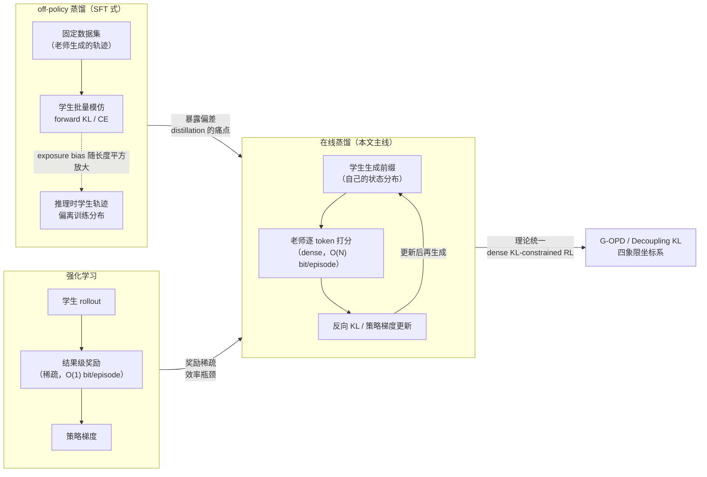

> **TL;DR**
>
> * **在线蒸馏（On-Policy Distillation, OPD）的定义很朴素**：学生从**自己的分布**采样轨迹，老师对轨迹上的**每个 token** 提供监督信号。与之相对：off-policy 蒸馏在固定老师轨迹上做 SFT 模仿，RL 在结果级稀疏奖励上做策略梯度。OPD 恰好站在两者中间——**on-policy 的相关性 + dense 的监督密度**。
> * **为什么非 on-policy 不可**：off-policy 蒸馏的 exposure bias 会随序列长度近似**平方级**放大（Tencent Survey 的结论）——学生训练时只见过老师"完美"的前缀，推理时却要面对自己犯错后越走越偏的轨迹。误差一旦开始累积，模仿信号就失效了。
> * **方法谱系有一条清晰的收敛线**：MiniLLM（2023，反向 KL + 策略梯度）→ GKD（ICLR 2024，把 on-policy 变成插值旋钮）→ **理论统一**：G-OPD 证明 OPD 是 dense KL-constrained RL 的特例（奖励外推 ExOPD 甚至能超越老师）；Decoupling KL 论文把 SFT / DAgger / 离线 RL 蒸馏 / OPD 放进"前缀来源 × KL 方向"的同一张四象限表。2026 年的 OPD 已经不是"一种技巧"，而是一个有坐标系的方法族。
> * **工业端已经全面采用**：Qwen3 的 post-training 标配 OPD；Thinking Machines Lab 复现 Qwen3 配方，**7-10× 更少的梯度步、50-100× 的计算效率**（dense 监督 ≈ 每 token 一个 bit，RL 每 episode 只有 O(1) bit）；MiniCPM5-1B 走 "RL + OPD" 组合；verl 已内置 OPD 训练与 overlap 诊断指标。
> * **机制与边界**（清华 THUNLP，[arXiv:2604.13016](https://arxiv.org/abs/2604.13016)）：OPD 成功需要两个条件——师生**思考模式兼容** + 老师拥有**真新知识**（同家族 1.5B/7B 老师从学生视角看分布上不可区分）；dense token 奖励随轨迹深度衰减，**长视野蒸馏是当前没有定论的边界**。



---

## 1. 背景：蒸馏为什么需要 "on-policy" 这三个字

知识蒸馏（KD）2015 年就有了（Hinton et al.），2023 年 Alpaca 把"LLM 老师生成数据 → 学生 SFT"变成工业默认动作，OpenThoughts 之类的蒸馏数据集动辄百万级。但这条 off-policy 路线有两个结构性问题，随着任务变长、推理变深而愈发致命：

**问题一：Exposure bias（暴露偏差）随长度平方级放大。** 学生在训练时看到的上下文，全是老师生成的"完美"前缀；推理时学生自己生成，任何一个小错都会让后续状态偏离训练分布，而且偏离会自我累积——这正是 Bengio 2015 年在 sequence prediction 里描述的 exposure bias。Tencent 的 OPD 综述（[arXiv:2604.00626](https://arxiv.org/abs/2604.00626)）给出一个量化视角：**这个误差近似随序列长度的平方增长**。短任务（分类、抽取）问题不大，长推理（CoT、agent 多轮）直接踩爆。

**问题二：模仿风格 ≠ 模仿事实。** "The False Promise of Imitating Proprietary LLMs"（Gudibande et al., 2023）早就指出：学生可以学会老师的口吻和自信，但学不会老师的正确率。off-policy 蒸馏本质是让学生拟合"老师在老师自己的状态分布下的输出"，而不是"老师在我（学生）的状态下的行为"。

要同时解决这两个问题，直觉很简单：**让学生在它自己会访问的状态上，接受老师的监督**。这个直觉 2010 年 DAgger 就给出了雏形——把学生自己的轨迹喂给老师打分再迭代训练，是模仿学习里对抗复合误差的标准手段。LLM 时代的 OPD，就是 DAgger 直觉 + 老师 logprob 稠密监督 + 策略梯度优化三者的结合。

## 2. 形式化：在线蒸馏的数学与三种监督粒度

令学生为 \(\pi_\theta\)，老师为 \(\pi_T\)。给定 prompt \(x\)，学生自回归采样一条轨迹 \(\hat y=(\hat y_1,\ldots,\hat y_T) \sim \pi_\theta(\cdot \mid x)\)。在每一步 \(t\)，师生在**学生生成的前缀** \(\hat y_{<t}\) 上各有一个 next-token 分布：\(p_t=\pi_\theta(\cdot \mid x,\hat y_{<t})\) 与 \(q_t=\pi_T(\cdot \mid x,\hat y_{<t})\)。

OPD 的标准目标是序列级**反向 KL**：

$$\mathcal{L}_{\mathrm{OPD}}(\theta)=\mathbb{E}_{x\sim\mathcal{D}_x}\Big[D_{\mathrm{KL}}\big(\pi_\theta(\cdot\mid x)\;\|\;\pi_T(\cdot\mid x)\big)\Big]$$

利用自回归分解，它精确等于学生轨迹上的逐 token 反向 KL 之和：

$$\mathcal{L}_{\mathrm{OPD}}(\theta)=\mathbb{E}_{x\sim\mathcal{D}_x,\;\hat{y}\sim\pi_\theta(\cdot\mid x)}\left[\sum_{t=1}^{T}D_{\mathrm{KL}}(p_t\;\|\;q_t)\right]$$

这个公式是整篇文章的地基，值得拆出三个层次：

1. **期望内层是 \(\hat{y}\sim\pi_\theta\)**——"on-policy"三个字的全部含义。数据分布随学生更新而移动（和 RL 的 on-policy 完全同构）。
2. **目标是反向 KL \(D_{\mathrm{KL}}(p_t\|q_t)\)**——mode-seeking。学生把概率质量收敛到老师的高概率区域，而不是摊开去覆盖老师的所有模式（这正是 forward KL 的毛病：学生表达力不足时会把质量摊到老师认为不可能的区域）。
3. **求和覆盖每个 token**——dense。每个位置都有监督信号，这是与结果级 RL 奖励的本质区别。

**梯度形式**：反向 KL 对 \(\theta\) 的梯度可以写成策略梯度形式——每个 token 的"奖励"就是师生 log-ratio：

$$\nabla_\theta \mathcal{L}_{\mathrm{OPD}} \propto \mathbb{E}_{\hat{y}\sim\pi_\theta}\left[\sum_{t=1}^{T}\underbrace{\log\frac{\pi_\theta(\hat{y}_t\mid x,\hat{y}_{<t})}{\pi_T(\hat{y}_t\mid x,\hat{y}_{<t})}}_{\text{token 级优势}}\nabla_\theta\log\pi_\theta(\hat{y}_t\mid x,\hat{y}_{<t})\right]$$

所以 OPD 在工程上就是"把 RL 的 reward 换成一个稠密 token 级 log-ratio"，Decoupling KL 论文（[arXiv:2605.16826](https://arxiv.org/abs/2605.16826)）把这个等价性严格化：**reverse KL + student prefix = dense-reward REINFORCE**。

**三种监督粒度**（THUNLP 论文的分类，verl 都支持）：

| 粒度 | 计算方式 | 特点 |
|------|---------|------|
| Full-vocabulary | 直接算式 (2) 的逐 token KL | 最精确，但每步要老师全词表 logprob，贵 |
| Sampled-token | 每步只采学生分布里的一个 token，用 \(\log p_t(\hat y_t)-\log q_t(\hat y_t)\) 作为该 token 的奖励 | 无偏 MC 估计，**最便宜**，实践中够用 |
| Top-k | 每步取学生/老师 top-k token 集合上的 KL 近似 | 折中；k 的默认值 16 附近即可，Top-1 会崩（见 §7） |

### 2.1 推导一：反向 KL 的梯度 = 策略梯度（证明）

上面"梯度形式"那个公式不是猜的，值得完整推一遍——它揭示了 OPD 和 RL 的同一个数学根源：**只要目标函数的期望依赖于 \(\theta\)，就必然出现策略梯度**。

序列级目标 \(\mathcal{L}(\theta) = D_{\mathrm{KL}}(q_\theta \| p_T)\) 对 \(\theta\) 求导，乘积法则拆成两项：

$$\nabla_\theta \mathcal{L} = \underbrace{\sum_y \nabla_\theta q_\theta(y)\log\frac{q_\theta(y)}{p_T(y)}}_{\text{① 分布项}} + \underbrace{\sum_y q_\theta(y)\nabla_\theta \log\frac{q_\theta(y)}{p_T(y)}}_{\text{② 概率项}}$$

- ① 用 \(\nabla_\theta q_\theta(y) = q_\theta(y)\nabla_\theta \log q_\theta(y)\)（score function 恒等式）变成期望；
- ② 里 \(p_T\) 与 \(\theta\) 无关，\(\nabla_\theta\log p_T(y)=0\)，剩下 \(\sum_y \nabla_\theta q_\theta(y) = \nabla_\theta \sum_y q_\theta(y) = \nabla_\theta 1 = 0\)——**这一项整项消零**。

于是只剩 ①：

$$\nabla_\theta \mathcal{L} = \mathbb{E}_{y\sim q_\theta}\Big[\underbrace{\log\frac{q_\theta(y)}{p_T(y)}}_{\text{log-ratio = token 级奖励}}\; \nabla_\theta\log q_\theta(y)\Big]$$

这就是 REINFORCE：奖励 \(\log(q_\theta/p_T)\)、策略梯度 \(\nabla\log q_\theta\)。**OPD 不是在"模仿 RL"，OPD 就是 RL**——只是把环境的稀疏结果奖励换成了老师的稠密 logprob。工程上 log-ratio 必须 `.detach()` 当常数奖励（它是"奖励"不是"目标"，期望层面它的梯度贡献合计为 0，逐样本保留只增大方差）。

自回归展开后，序列级 log-ratio 拆成逐 token 求和，按策略梯度定理整理成 reward-to-go 形式（动作 \(y_t\) 不影响它之前的奖励，未来奖励归到当前 token）：\(R_t=\sum_{t'\ge t} r_t\)，\(r_t = \log\frac{q_\theta(y_t \mid x,y_{<t})}{p_T(y_t \mid x,y_{<t})}\)：

$$\nabla_\theta \mathcal{L} = \mathbb{E}_{y\sim q_\theta}\Big[\sum_{t=1}^{T} R_t\; \nabla_\theta\log q_\theta(y_t \mid x,y_{<t})\Big], \qquad R_t = \sum_{t'=t}^{T}\log\frac{q_\theta(y_{t'} \mid x,y_{<t'})}{p_T(y_{t'} \mid x,y_{<t'})}$$

**MiniLLM 的变体**（论文 Eq. 8-12）：完整 \(R_t\) 梯度方差高（reward 在整条序列上累积），MiniLLM 把单步质量 \(r_t\) 从 \(R_t\) 中拆出来单独优化，得到"Single-step"梯度 \((\nabla\mathcal{L})_{\mathrm{Single}} = -\mathbb{E}\big[\sum_t r_t\nabla\log q_\theta(y_t\mid\cdot)\big]\)（原文符号取 \(\log(p_T/q_\theta)\) 所以带负号，等价）——**这就是后来 TML 的 discount=0**：每个 token 只用自己位置的 log-ratio 当奖励，方差显著更低。

### 2.2 推导二：forward KL 的梯度 = SFT 交叉熵（证明）

off-policy 蒸馏的目标是正向 KL \(D_{\mathrm{KL}}(p_T \| q_\theta)\)，求导：

$$\nabla_\theta D_{\mathrm{KL}}(p_T\|q_\theta) = -\mathbb{E}_{y\sim p_T}\big[\nabla_\theta\log q_\theta(y)\big] = -\mathbb{E}_{y\sim p_T}\Big[\sum_t \nabla_\theta\log q_\theta(y_t \mid x,y_{<t})\Big]$$

关键：**期望在 \(p_T\) 上、与 \(\theta\) 无关**，所以没有策略梯度问题，梯度就是"在老师生成的轨迹上做 teacher-forcing 最大似然"（MLE）——这就是为什么 off-policy 蒸馏在工程上等价于在固定老师数据集上跑 SFT。soft label 版（老师全词表概率做回归目标）是它的无偏形式，hard label 版（argmax token 的 CE）是它的随机近似。**公式 (1) 和 (2) 之间的全部差别，就是期望里 \(y \sim q_\theta\) 还是 \(y \sim p_T\)**——一个决定是否需要策略梯度，另一个决定学的是"老师在它的世界里"还是"学生在学生会遇到的世界里"。

### 2.3 机制：mode-seeking 藏在梯度权重里

同样看梯度式子，mode-seeking 不是玄学，是反向 KL 的权重结构：

- **反向 KL**（学生 \(\to\) 老师）：权重 \(\log\frac{q_\theta(y_t)}{p_T(y_t)}\) 在 \(q_\theta > p_T\)（学生自信区）为正、在 \(q_\theta < p_T\)（学生低估区）为负。梯度方向 = **强化学生已经擅长的 token + 压制学生回避的 token**，质量向"师生共识的高概率模式"集中。学生容量不足时它宁可丢掉老师的次要模式（zero-avoiding：避免在老师低概率处放质量）。
- **forward KL**（老师 \(\to\) 学生）：梯度无权重，老师分布里每个高概率 token 都被推着学，容量不足时只能"摊开"覆盖所有模式（zero-forcing），甚至把质量放到老师认为几乎不可能的区域——表现为学生输出发散、幻觉。
- **JSD(β)**（GKD 的旋钮）在两者之间插值：\(\mathcal{D}_{\mathrm{JSD}(\beta)}(P\|Q) = \beta D_{\mathrm{KL}}(P\|\beta P+(1-\beta)Q) + (1-\beta)D_{\mathrm{KL}}(Q\|\beta P+(1-\beta)Q)\)，\(\beta\to 0\) 时按比例逼近 forward KL、\(\beta\to 1\) 时逼近 reverse KL（Huszár 2015：\(\lim_{\beta\to 0} \mathcal{D}_{\mathrm{JSD}(\beta)}(P\|Q)/\beta = D_{\mathrm{KL}}(P\|Q)\)）。

GKD 的实验结论与机制一致：temperature sampling 评估下，mode-seeking 散度（reverse KL / JSD(0.9)）普遍优于 forward KL；greedy 评估时差别小。**选散度 = 选"学生学老师多少模式"的立场**。

## 3. 第一站：MiniLLM —— 为什么是反向 KL

MiniLLM（Gu et al., arXiv:2306.08543，2023）是第一个把 on-policy 反向 KL 系统化用于 LLM 蒸馏的工作，它的动机今天看来依然成立：

- **forward KL 的病**：\(D_{\mathrm{KL}}(q\|p)\)（老师→学生）是 zero-avoiding / mode-covering。学生会把概率质量分配给老师认为**不可能**的区域（low-probability region），表现为"学生输出比老师更发散、更不精确"。
- **反向 KL 的药**：\(D_{\mathrm{KL}}(p\|q)\)（学生→老师）是 mode-seeking，学生只在高概率模式上贴近老师，天然抑制低概率区域的过度自信。

MiniLLM 的另一个关键设计是 **on-policy 优化**：直接用策略梯度在采样轨迹上优化这个目标（而不是像传统 KD 那样在老师数据上做回归）。它证明了"目标函数换成反向 KL"和"数据从学生自己采"这两个改动缺一不可——只换目标不换数据，exposure bias 依然在。

### 3.1 MiniLLM 的完整训练算法：策略梯度 + 三件套

MiniLLM 的目标就是 §2.1 推的那个 \(\mathcal{L}(\theta) = \mathrm{KL}[q_\theta \| p]\)，梯度按策略梯度定理展开（论文 Eq. 8-9）：

$$(\nabla\mathcal{L})_{\mathrm{Long}} = -\mathbb{E}_{y\sim q_\theta}\Big[\sum_{t=1}^{T} R_t\, \nabla\log q_\theta(y_t \mid y_{<t}, x)\Big], \qquad R_t=\sum_{t'=t}^{T}\log\frac{p(y_{t'} \mid y_{<t'}, x)}{q_\theta(y_{t'} \mid y_{<t'}, x)}$$

**问题：方差太高，训练不稳定。** 论文为此上了三个稳定技巧（MiniLLM 论文 Section 2.2），这也是"为什么后来的 OPD 实现大多没直接用 MiniLLM 原版"的原因：

1. **Single-step decomposition**：\(R_t\) 把未来所有 token 的 log-ratio 都算进当前 token 的"奖励"，但生成质量在序列前端最敏感（前部 token 的误差沿序列累积放大）。所以把 \(r_t\) 从 \(R_t\) 中拆出来单独算梯度 \((\nabla\mathcal{L})_{\mathrm{Single}} = -\mathbb{E}[\sum_t r_t \nabla\log q_\theta(y_t\mid\cdot)]\)，等价于**只看当前 token 的奖励**——这就是 TML 后来直接定义为 discount=0 的东西；
2. **Teacher-mixed sampling**：从 \(\tilde p_t = (1-\alpha) q_\theta(\cdot\mid y_{<t}) + \alpha p(\cdot\mid y_{<t})\) 采样，用老师帮学生压制低质量生成、缓解 reward hacking（学生钻"老师说好但实际错"的 token 的空子）；
3. **Importance sampling 校正**：因为实际从 \(\tilde p\) 采样而非 \(q_\theta\)，梯度要乘 IS 权重 \(\frac{q_\theta(y_t\mid\cdot)}{\tilde p(y_t\mid\cdot)}\) 保持无偏（论文 Eq. 13-15）。

训练流程是**两阶段**（Algorithm 1）：

```
Phase 1（暖机）: 学生在指令数据集 D 上 SFT 3 epochs，选验证 loss 最低的 checkpoint ——
                 保证后续 PG 时学生"会说人话"，采样轨迹不至于全是噪声
Phase 2（蒸馏）:  循环 {
    学生采样响应 y ~ q_theta(·|x)            # on-policy 数据
    老师给逐 token logprob p(y_t|y_<t,x)     # 一次前向
    loss = -Σ_t R_t·log q_theta(y_t|·)       # 或 Single 版：-Σ_t r_t·log q_theta(y_t|·)
    loss += beta·L_PT(x)                     # 混入预训练 LM loss，防止灾难性遗忘
    策略梯度更新
}
```

超参（论文报告）：lr 按规模 5e-4~5e-6 搜索（≤1.3B 用 5e-4/1e-4/5e-5，更大模型 5e-5/1e-5/5e-6），batch 32-64，小模型 20 epochs / 大模型 10 epochs。**注意 MiniLLM 是三年前的"第一版"，它的三件套后来被 GKD 的"不通过采样回传"和 OPD 的 discount=0 大幅简化了**——要复现现代 OPD 别直接抄 MiniLLM 的完整算法。

## 4. GKD：把 on-policy 变成旋钮

GKD（Agarwal et al., arXiv:2306.13649，ICLR 2024）把 MiniLLM 的直觉泛化成一个统一框架，两个贡献：

**贡献一：on-policy 比例 λ 可调。** GKD 的损失在"固定数据集蒸馏"与"学生自生成数据蒸馏"之间插值：

$$\mathcal{L}_{\mathrm{GKD}}(\theta) = (1-\lambda)\cdot\underbrace{\mathbb{E}_{(x,y)\sim\mathcal{D}_{T}}\left[\sum_t D(p_t\|q_t)\right]}_{\text{off-policy：老师数据}}+\lambda\cdot\underbrace{\mathbb{E}_{x\sim\mathcal{D}_x,\;y\sim\pi_\theta}\left[\sum_t D(p_t\|q_t)\right]}_{\text{on-policy：学生自生成}}$$

\(\lambda=0\) 退化为传统 off-policy 蒸馏，\(\lambda=1\) 是纯 on-policy。实践中 \(\lambda\) 通常取 0.5-1.0，保留一部分固定数据防止 on-policy 分布坍缩。

**贡献二：散度自由选择。** 当学生表达力不足（capacity gap）时，反向 KL 的 mode-seeking 行为可能让学生"只学一个模式"，GKD 允许换 forward KL、skew KL（介于两者之间，可调 skewness）等任意 \(f\)-divergence——这是针对"学生学不动老师全分布"场景的工程弹性。

**与 RLHF 的衔接**：GKD 的训练循环与 RLHF 几乎同构（采样 → 打分 → 策略梯度），可以直接把 PPO 的 KL 正则项替换成蒸馏损失，实现"蒸馏与 RL 的 seamless integration"。这个性质后来被 TML 推到极致：**OPD 可以是一行代码改动**（把 RL 的 regularizer model 换成老师，见 §8）。

### 4.1 GKD 的训练流程：不通过采样回传 + λ 旋钮

GKD 与 MiniLLM 最关键的工程分水岭是**不通过采样过程回传梯度**（no backprop through sampling，论文 3.2 节明确写了这一点）：on-policy 只决定"数据从哪来"（学生自己采样），但更新方式是监督式的散度最小化，采样路径本身不参与梯度。这让 GKD 的训练稳定性和 SFT 一样高，不需要 MiniLLM 那三件套——论文里点名说 MiniLLM "relies on a number of stabilizing tricks"。

训练流程：

```
前置：学生必须先 SFT 过（能生成有质量、可被老师反馈的序列），类似 RLHF 的两阶段
循环 {
    1. 采样两条数据流：
       a) 固定数据流：(x, y) ~ D_T（老师生成的离线数据或标注数据）
       b) on-policy 流：x ~ D_x，学生采样 y ~ p_S(·|x)，温度 γ=1（鼓励多样性）
    2. 老师在两个流的序列上给逐 token 概率分布 p_T(·|y_<n, x)（soft target）
    3. loss = (1-λ)·L_SD + λ·L_OD，D 可选 forward KL / reverse KL / JSD(β)
       对 on-policy 流的采样路径 stop-gradient（不通过采样回传）
    4. 更新学生
}
```

超参（论文报告）：lr 默认 3e-4（T5-base/large；T5-small 用 1e-3；**reverse KL 对高 lr 更敏感，统一 3e-4 更稳**）；学生采样温度 γ=1；老师 softmax 温度 1.0（greedy 评估）/ 0.1（温度采样评估的报告口径）；λ ∈ {0, 0.5, 1}，on-policy 与 mixed 一致优于纯 supervised（λ=0）。

TRL 里开箱即用（`GKDTrainer`）：

##### 变量映射表（数学 ↔ 代码）

| 数学符号 | 代码变量 | Shape / 类型 | 含义 |
|---|---|---|---|
| 反向 KL 梯度权重 \(r_t=\log\pi_S-\log\pi_T\) | `r_t`（teacher 侧 detach） | `(T,)` | mode-seeking 来源 |
| 前向 KL（表征级） | `mse(logits_S, logits_T)` | `(B,T,V)` | 覆盖教师全分布 |
| \(\lambda\) 内插旋钮 | `loss = λ·fwd + (1-λ)·rev` | 标量 | GKD 的 on-policy 程度 |


`rewards/r` 为规则奖励标量、`advantages` 为组内标准化后的优势、`ratio/logp/old_logp`
为 token 级重要性比率三件套、`format_score/correctness` 类为分项奖励。若与具体框架
命名有出入，以你所用版本的 reward_score 插件签名为准。


```python
from trl import GKDTrainer, GKDConfig

config = GKDConfig(
    per_device_train_batch_size=16,
    learning_rate=3e-4,                 # reverse KL 别加高
    frac_student_samples=1.0,           # λ：on-policy 学生数据占比（0.5~1.0 常见）
    divergence_type="reverse",          # reverse / forward / jsd
    teacher_temperature=1.0,            # 老师分布温度
    temperature=1.0,                    # 学生采样温度
    num_epochs=3,
)
trainer = GKDTrainer(
    model=student,                      # 需先 SFT 过
    teacher_model=teacher,
    args=config,
    train_dataset=prompts_only_dataset, # λ=1 时只需要 prompts；λ<1 时给 (x,y) 对
    processing_class=tokenizer,
)
trainer.train()
```

（字段名以 TRL 版本为准。）

## 5. 理论统一：OPD 到底在优化什么

2025-2026 年有两篇工作把 OPD 从"一种技巧"变成了"坐标系里的一点"。

### 5.1 G-OPD：OPD = dense KL-constrained RL 的特例

G-OPD（Yang et al., arXiv:2602.12125，人大 RUCBM）首先在理论上证明：**OPD 是 dense KL-constrained RL 的特殊情形**——其"奖励函数"（师生 log-ratio）与 KL 正则项总是等权加权（权重恒为 1），而 reference model 可以任意选。

于是它把目标泛化为带独立奖励缩放因子 \(\gamma\) 和 KL 权重 \(\beta\) 的形式：

$$\mathcal{J}(\theta)=\mathbb{E}_{\hat{y}\sim\pi_\theta}\left[\sum_{t=1}^{T}\gamma\cdot\log\frac{\pi_T(\hat{y}_t\mid\cdot)}{\pi_{\mathrm{ref}}(\hat{y}_t\mid\cdot)}-\beta\cdot\log\frac{\pi_\theta(\hat{y}_t\mid\cdot)}{\pi_{\mathrm{ref}}(\hat{y}_t\mid\cdot)}\right]$$

- \(\gamma=\beta=1\)、\(\pi_{\mathrm{ref}}=\pi_\theta\)（旧策略）时还原为标准 OPD；
- **\(\gamma>\beta\)（奖励外推，ExOPD）时，可以推着学生超越老师**——因为学生不再被"贴近老师分布"约束，而是在老师偏好方向上走得更远。论文在 math 推理和代码生成上验证：ExOPD 跨多种师生尺寸组合一致优于标准 OPD。这是"学生 ≤ 老师"铁律的第一个系统性突破。

**GRPO 的实现级同构**（把"OPD 是 RL"落实到最后一行代码）。GRPO（DeepSeekMath）的逐 token KL 正则项用的是无偏估计：

$$\widehat{\mathrm{KL}}_{i,t} = \frac{\pi_{\mathrm{ref}}(o_{i,t}\mid q,o_{i,<t})}{\pi_\theta(o_{i,t}\mid q,o_{i,<t})} - \log\frac{\pi_{\mathrm{ref}}(o_{i,t}\mid q,o_{i,<t})}{\pi_\theta(o_{i,t}\mid q,o_{i,<t})} - 1$$

GRPO 的目标是

$$\mathbb{E}\Big[\frac{1}{\lvert o_i \rvert}\sum_{t}\big(A_{i,t}\log\pi_\theta(o_{i,t}\mid q,o_{i,<t}) - \beta\, \widehat{\mathrm{KL}}_{i,t}\big)\Big]$$

现在做三处替换：**reference model 换成老师**（\(\pi_{\mathrm{ref}} \to \pi_T\)）、**奖励项归零**（\(A_{i,t} = 0\)）、**去掉组内归一化**（\(n=1\)）——GRPO 的 loss 就变成了 OPD 的蒸馏 loss，训练循环完全不用重写。verl 的 `ADV_ESTIMATOR=token_reward_direct` 就是把这个同构做成配置：优势函数直接设成逐 token 的 teacher−student log-ratio。所以 G-OPD 说的"OPD 是 dense KL-constrained RL 的特例"不是理论修辞，是**训练框架里的一个配置组合**。

### 5.2 Decoupling KL and Trajectories：四象限坐标系

这篇（arXiv:2605.16826，EIT Ningbo / HK PolyU / HKUST / SJTU）指出：off-policy 与 on-policy 蒸馏其实**隐式耦合了两个正交选择**——前缀来源（prefix source：老师轨迹 vs 学生轨迹）× KL 方向（forward vs reverse）。解耦后得到一张非常干净的表格：

| | **forward KL（模仿式）** | **reverse KL（策略梯度式）** |
|---|---|---|
| **老师前缀** | SFT（off-policy 蒸馏）：CE + 老师软标签 | offline-RL 式蒸馏：reverse KL 但数据固定 |
| **学生前缀** | **DAgger**：on-policy SFT（学生轨迹 + 老师标签） | **OPD**：on-policy 蒸馏 = dense-reward REINFORCE |

两个梯度级恒等式：

- forward KL 的梯度 = SFT 式的交叉熵匹配（老师软标签作为回归目标）；
- reverse KL 的梯度 = RL 式策略梯度（dense teacher-student log-ratio 作为奖励）。

这意味着 SFT、DAgger、离线 RL 蒸馏、OPD 不是四个无关方法，而是同一坐标系里的四个格子——**选择"蒸馏"其实是在选前缀从哪来 + 梯度往哪去**。论文在 math reasoning 上做了四格对照实验，验证了各自的适用场景。这篇文章的实操价值在于：如果你的目标函数与数据来源不匹配（比如在老师数据上做 reverse KL），你实际在优化一个"非标准格"，行为会偏离直觉。

## 6. 自蒸馏（OPSD）：当老师消失以后

OPD 需要一个比学生强的独立老师，这限制了它的使用场景。2026 年初出现的 **On-Policy Self-Distillation（OPSD）** 把老师去掉了：**同一个模型既当学生又当老师，老师条件上加一个特权上下文（privileged context）**。

Self-Distilled Reasoner（Zhao et al., arXiv:2601.18734）是命名 OPSD 的工作：在推理数据集中，老师上下文是 \(x \oplus c\)，其中 \(c\) 是特权信息（如**真值答案**或**执行反馈**），学生上下文只有 \(x\)。目标仍然是学生自己采样轨迹上的反向 KL，但老师分布来自"开了上帝视角的自己"：

$$\mathcal{L}_{\mathrm{OPSD}}(\theta)=\mathbb{E}_{x\sim\mathcal{D}_x,\;\hat{y}\sim\pi_\theta(\cdot\mid x)}\left[\sum_{t=1}^{T}D_{\mathrm{KL}}\big(\pi_\theta(\cdot\mid x,\hat{y}_{<t})\;\|\;\pi_\theta(\cdot\mid x\oplus c,\hat{y}_{<t})\big)\right]$$

这个范式的意义和风险并存：

- **意义**：特权上下文提供了"真新信息"（答案本身），同时思考模式天然 100% 兼容（老师就是自己）——恰好命中 THUNLP 说的两个成功条件。后续 RLCSD、Self-Distilled RLVR、迭代自举（iterative self-bootstrapping）都是这个方向的扩展，"RL via self-distillation"（Hübotter et al., 2026）甚至把它做成无 RM 的 RL 替代。
- **风险**：最新研究（Rethinking OPSD for Thinking Models, arXiv:2607.05184）给出尖锐的负面结果——**特权自蒸馏会让所有被测的思考模型退化**，机制是"fork suppression"（学生过早收敛到老师给出的分支，抑制了自己的探索）。2026 年中的"Self-Distillation 何时有效"之争（另一个视角见 Kim et al., arXiv:2603.24472）还没有定论。

## 7. 失败模式与修复：工程现实

OPD 不是免费的。2026 年出现了大量失败模式分析，核心几条：

**7.1 Sampled-token OPD 有偏但方差更紧（Revisiting OPD, CASIA, arXiv:2603.25562）。** token 级 OPD 相对序列级反向 KL 是有偏的，但最坏情况方差界更紧；合成实验显示"未来奖励耦合越强，梯度方差越大、训练越不稳"。工程上识别出三个失败模式：token 级监督失衡、学生访问状态上老师指引不可靠、以及长 rollout 前缀漂移后老师信号失效。

**7.2 两个成功条件（THUNLP, arXiv:2604.13016）**——这是上一篇文章《On-Policy Distillation 深度剖析》的核心，这里只列结论：
1. **思考模式兼容**：师生 top-k token 分布要有足够重叠（overlap_ratio）。老师更强但思考模式不同 → 蒸馏信号弱，且早期损失不可恢复；
2. **真新知识**：老师必须有学生训练中没见过的东西。弱到强反向蒸馏实验显示：**同家族 1.5B 和 7B 老师从学生视角看分布上不可区分**——"更大的老师"不等于"更好的蒸馏源"。
对应两个修复配方：**off-policy cold start**（先用老师 rollout 做 SFT 暖机，抬高初始 overlap）和 **teacher-aligned prompt selection**（用老师 post-training 数据里的 prompt，但注意混合 OOD prompt 防止熵坍缩）。

**7.3 长轨迹奖励衰减（THUNLP §6）**：响应长度存在甜点区（3K-7K token），10K-15K 时训练后期坍缩——不稳定从**尾部 token 开始**再往前传播；老师"从学生前缀续写"的优势从 +0.37（1K 前缀）单调掉到 +0.02（16K 前缀）。dense 监督的可靠性随深度衰减，是 OPD 向长视野/agentic 扩展的硬边界。

**7.4 支持集大小：Top-1 崩，sampled-token 够用（THUNLP §6.3）**。Top-1 每次只取 argmax token，策略微小扰动就会翻转 rank-1，奖励信号不稳定且不随时间平均；sampled-token 虽然每步只用一个 token，但按学生分布采样提供无偏覆盖，效果与 Top-16/64 相当。**结论：k 不是关键设计变量，避开 Top-1 即可**——这对算力敏感的生产环境是好消息。

## 8. 工业实践：从论文到管线

**Qwen3（2025）**：第一个把 OPD 写进生产 post-training 的大型技术报告。Qwen3 的配方成为后续所有复现的基准（"Read §4"是 AwesomeOPD 列表给新人的第一建议）。

**Thinking Machines Lab（2025.10）**：用 Tinker SDK 复现 Qwen3 配方，量化了 OPD 的效率账：

- **7-10× 更少梯度步、50-100× 计算效率**：Qwen3-8B-Base + LoRA(rank 128) 上，OPD 从 RL 训练出的老师（DeepMath）蒸馏回 base，AIME 分数 10 步内恢复，而 RL 要 70 步；
- **为什么快**：RL 每 episode 只教 O(1) bit（结果对错），OPD 每 episode 教 O(N) bit（每个 token 一个信号）。信息论视角下 dense 监督的效率优势是结构性的；
- **更小的 batch 就能稳**（64 prompts × 4 samples），短上下文也能学（没有"轨迹必须采完"的硬截断），不需要额外 RM/labeler——老师的 compute_logprobs 一次前向即可；
- 工程上几乎是白嫖：**把 RL 脚本的 KL 正则模型换成老师，就是 OPD**（one-line change）；损失取 discount=0 的逐 token 反向 KL，无需未来回报；
- 连数据效率都更好：同一个 prompt 多 epoch 训练不会像 RL 那样退化成答案记忆——单 prompt、20 步、每步 256 条 rollout（共 5120 条），就能接近老师的 AIME'24 水平。

**MiniCPM5-1B（OpenBMB）**：管线是 "RL + OPD" 组合——OPD 做能力下放与冷启动，RL 做最后的超越与对齐。GLM-5、MiMo 的技术报告也都把 OPD 列入 post-training。

**verl 落地**：THUNLP 的 OPD 实现基于 verl v0.7.0（`ADV_ESTIMATOR=token_reward_direct`），其 top-k overlap 诊断（`distillation/overlap_ratio`、`distillation/overlap_token_advantage`）已合入 verl 主线（PR #6469）。训练时监控这两个指标 + 熵差，比盯 loss 可靠得多——OPD 的成败在 token 级，肉眼不可见。

### 8.1 训练实现速查：四种方法的配置总表

把本文所有方法的训练配置收拢成一张表，选型时直接对照：

| | **MiniLLM** | **GKD** | **OPD（狭义，TML/veRL）** | **OPSD 自蒸馏** |
|---|---|---|---|---|
| 目标函数 | 序列级 reverse KL | 插值散度 \((1-\lambda)L_{SD}+\lambda L_{OD}\) | 逐 token reverse KL（discount=0） | 学生→"特权上下文自己"的 reverse KL |
| 数据流 | 学生采样完整轨迹 | 固定数据 + 学生采样混合 | 学生采样轨迹，老师只打分 | 学生采样轨迹，老师=带特权上下文的自己 |
| 更新方式 | 策略梯度（三件套稳定） | **监督式散度最小化**（不通过采样回传） | 带权 REINFORCE（r_t·∇log π） | 同 OPD |
| 老师角色 | 给 logprob 当奖励 | 给逐 token soft target | 给 logprob 当稠密奖励 | 给"上帝视角"logprob |
| 关键超参 | lr 5e-4~5e-6，batch 32-64 | lr 3e-4，λ 0.5-1.0，温度 γ=1 | lr 1e-6（全参）/1e-4~3e-4（LoRA），prefix 128 | 同 OPD + 特权上下文构造 |
| 稳定技巧 | 需要（Single/teacher-mix/IS） | 不需要（天然稳定） | detach log-ratio + discount=0 | 需防 fork suppression |
| 代表实现 | MiniLLM 官方 | TRL `GKDTrainer` | thunlp/OPD（verl v0.7.0+）、tinker-cookbook | Self-Distilled Reasoner |

**一句话选型**：想省事用 GKD（稳定、有 TRL 现成 Trainer）；想要最前沿效果用 OPD 的 discount=0 + sampled-token（Qwen3/TML 已验证）；要在 agent 多轮场景零环境交互用 ReOPD（见系列前篇）；没有外部老师但有真值/反馈再考虑 OPSD。

### 8.2 可直接跑的 OPD 训练循环（工程版）

与系列前篇的教学版循环互补，这里补上工程细节：老师前向缓存、loss 位置 mask、log-ratio 的 detach 位置。

```python
# opd_train.py —— 现代 OPD 工程版（sampled-token reverse KL，TML/verl 风格）
# 数学（§2.1）：min E[Σ_t r_t·log π_θ(y_t|x,y_<t)]，r_t = log π_θ(y_t|·) − log π_T(y_t|·)（detach）
import torch

def train_step(student, teacher, tokenizer, prompts, args):
    # 1. on-policy 采样：学生完整生成（含前缀），温度 0.7~1.0
    xb, seq, attn_mask = rollout(student, tokenizer, prompts,
                                 max_new_tokens=args.response_len,
                                 temperature=args.temperature, top_p=0.9)
    # seq = [prompt | response]；loss 只算 response 段（去掉 prompt 部分）

    # 2. 老师打分：一次前向给全序列逐 token logprob（T=1.0），no_grad + 可缓存
    with torch.no_grad():
        t_logp = teacher.compute_logprobs(seq, attn_mask)          # log π_T(y_t|x,y_<t)

    # 3. 学生前向（要梯度）+ 构造稠密奖励
    s_logp = student.compute_logprobs(seq, attn_mask)              # log π_θ(y_t|x,y_<t)
    r_t = (s_logp - t_logp).detach()                               # ★ 奖励，不是目标

    # 4. 带权 REINFORCE：loss = mean(r_t · log p)，只统计 response 段
    response_mask = attn_mask.clone()
    response_mask[:, :prompt_len] = 0                              # 不监督 prompt 段
    loss = (r_t * s_logp * response_mask).sum() / response_mask.sum()
    loss.backward()
    torch.nn.utils.clip_grad_norm_(student.parameters(), 1.0)
    return loss.item()
```

**三个工程细节**（踩坑实录）：

1. **log-ratio 必须 detach，loss 不加负号**——\(r_t\) 自带符号：学生比老师更自信的 token 被强化，学生回避的 token 被压低（§2.3 的 mode-seeking 机制）。加负号会反转成"学老师低概率区域"，训练直接崩；
2. **老师打分必须和学生前向用同一个序列**——老师输入是"prompt + 学生生成的响应"，不是老师自己采样的响应，否则 log-ratio 在错误状态上计算（暴露偏差原地复活）；
3. **loss mask 只算 response 段**——prompt 段是输入不是输出，计入 loss 会把"复述 prompt"当成学习目标。

## 9. 决策指南：什么时候用哪个

| 场景 | 推荐方法 | 理由 |
|------|---------|------|
| 大模型压小模型，任务短（摘要/抽取） | off-policy SFT 蒸馏即可 | exposure bias 不致命，简单直接 |
| 长推理蒸馏（math/code CoT） | **OPD（sampled-token 或 top-k=16）** | dense 监督在长序列上的收益最大 |
| 师生思考模式差异大 | **off-policy cold start + OPD** | SFT 暖机抬高 overlap，再上 on-policy |
| 学生表达力不足（capacity gap 大） | GKD 调 skew KL / forward KL | 反向 KL mode-seeking 可能学不全 |
| 想超越老师 | **G-OPD / ExOPD（γ>β 奖励外推）** | 标准 OPD 上限是老师分布 |
| 没有可用老师，但有真值/反馈 | **OPSD 自蒸馏**（注意 fork suppression 风险） | 特权上下文 = 真新信息 + 100% 思考兼容 |
| 与 RL 混合 | RL 前 OPD 冷启动，RL 后 OPD 巩固 | MiniCPM5 已验证的工业组合 |
| 多轮 agent 场景 | 见上一篇：ReOPD prefix replay | 在线 OPD 的环境交互成本不可承受 |

## 10. 开放问题

1. **Realizability 之争**：Tsinghua/CMU/Berkeley/Harvard 的《When Does Online Imitation Learning Help in LLM Post-Training?》（arXiv:2606.30445）挑战"OPD 靠纠错累积误差取胜"的故事——在 **realizability** 条件下（目标策略在可实现类里），OPD 相比 SFT 没有增益；online 收益的真正来源是 non-realizability。这直接关系到"什么时候值得为 on-policy 数据付钱"。
2. **长视野蒸馏**：dense 奖励随轨迹深度衰减（§7.3）意味着 OPD 不能直接外推到长 CoT 与 agentic 多轮。混合方案（短段 dense + 长段稀疏结果奖励）和 curriculum 是明确的下一步。
3. **超越老师的机制**：G-OPD 的奖励外推能做，但 THUNLP 的机制研究提示"学生访问不到老师有效状态"是结构性障碍；OPSD 的 fork suppression 又说明自蒸馏可能过拟合特权信号。两条路都还没走通。
4. **几何视角**：HKUST 等的《On the Geometry of On-Policy Distillation》（arXiv:2606.07082）发现 OPD 的参数更新稀疏度（51.6%）介于 SFT（8.1%）与 RLVR（77.2%）之间，且早期会锁定到低秩更新通道——"OPD 学什么"的答案可能藏在参数空间里。

> 🧪 **动手练习**：① 在 GKD 的 λ 旋钮上取 {0, 0.5, 1} 三点（纯 reverse / 混合 / 纯 forward），对比模式覆盖；② 去掉教师做 OPSD 自蒸馏，复现 §7 的失败模式之一。

## 参考与延伸阅读

- 论文：Yaxuan Li et al., *Rethinking On-Policy Distillation of Large Language Models: Phenomenology, Mechanism, and Recipe*, arXiv:2604.13016（清华 THUNLP；本篇 §2/§5/§7 的机制与配方来源）
- 论文：Rishabh Agarwal et al., *GKD: On-Policy Distillation of Language Models*, arXiv:2306.13649（ICLR 2024；TRL 有 `GKDTrainer`）
- 论文：Yuxian Gu et al., *MiniLLM: Knowledge Distillation of Large Language Models*, arXiv:2306.08543
- 论文：Wenkai Yang et al., *Learning beyond Teacher: Generalized On-Policy Distillation with Reward Extrapolation*（G-OPD/ExOPD）, arXiv:2602.12125
- 论文：*Decoupling KL and Trajectories: A Unified Perspective for SFT, DAgger, Offline RL, and OPD*, arXiv:2605.16826
- 论文：Siyan Zhao et al., *Self-Distilled Reasoner: On-Policy Self-Distillation for LLMs*（OPSD）, arXiv:2601.18734
- 论文：Yuqian Fu et al., *Revisiting On-Policy Distillation: Empirical Failure Modes and Simple Fixes*, arXiv:2603.25562（CASIA）
- 综述：Mingyang Song & Mao Zheng, *A Survey of On-Policy Distillation for LLMs*, arXiv:2604.00626（腾讯）
- 博客：Kevin Lu et al., *On-Policy Distillation*, Thinking Machines Lab, 2025.10（50-100× 效率数据的出处）
- 代码：[thunlp/OPD](https://github.com/thunlp/OPD)（verl 底座）；[thinking-machines-lab/tinker-cookbook](https://github.com/thinking-machines-lab/tinker-cookbook)（TML 参考实现）；TRL `experimental/`（GKD 等 Trainer）
- 生态索引：[thinkwee/AwesomeOPD](https://github.com/thinkwee/AwesomeOPD)（820+ star 的 OPD 方法图谱）
- 系列前篇：本站《On-Policy Distillation 深度剖析》（2026-08-11，Agentic RL 视角 + ReOPD）；《ToolRL 深度剖析》（2026-08-10）；《Search RL 深度剖析》（2026-08-11）
* 2026-08 新作速览："Step-Level On-Policy Distillation" ([arXiv:2608.16333](https://arxiv.org/abs/2608.16333)，SFT↔OPD 光谱插值)；"Group-Calibrated OPD for Long-Context Reasoning" ([arXiv:2608.19181](https://arxiv.org/abs/2608.19181))；"Open-MOPD 多教师能力失衡诊断" ([arXiv:2608.19098](https://arxiv.org/abs/2608.19098))；"OPD 泛化性的双刃剑" ([arXiv:2608.16647](https://arxiv.org/abs/2608.16647))
* 生态索引持续更新：[AwesomeOPD](https://github.com/thinkwee/AwesomeOPD)（2026-07-23 版新增审读 191 条，覆盖白盒/黑盒教师、OPSD、OPD-RL 混合、Agent OPD 等分类）
* 系列延伸（象限Ⅱ）：《[逆强化学习五十年](/2026/08/22/irl-fifty-years-from-demonstrations/)》 · 《[正向学策略，反向学奖励：IRL 在 LLM 对齐里的复活](/2026/08/22/irl-renaissance-in-llm-alignment/)》（X-KD 一节与本篇直接相关）
