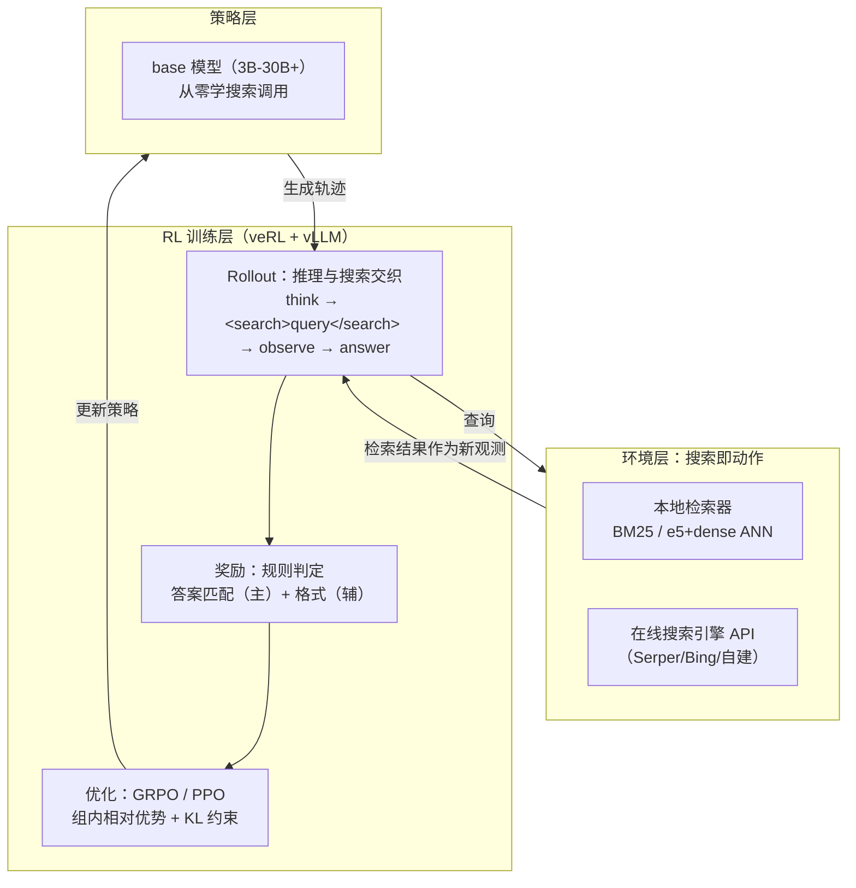

> **TL;DR**
>
> * **Search RL 回答了推理模型的最后一公里问题**：R1 式 RL 把模型的推理能力拉满，但事实性与时效性仍然依赖参数记忆——知识截止、幻觉、多跳事实推理差。Search RL 把「搜索引擎/检索器」变成 RL 的动作空间，让模型在训练中自己学会**何时搜索、搜什么、怎么用检索结果**，推理与搜索在轨迹层面交织（reasoning-search interleaved）。
> * **一个反直觉的结论**：Search-R1 用 **3B 的 base 模型 + 纯规则奖励**，就能从零长出「搜索调用」能力——不需要 SFT 教它用搜索工具，Qwen2.5-7B-base 甚至自主学会了**多轮搜索**（搜→读→再搜→答）。奖励只有「最终答案对不对 + 格式对不对」，搜索行为是 RL 自发涌现的。
> * **定位**：Search-R1（[arXiv:2503.09516](https://arxiv.org/abs/2503.09516) / 2505.15117）是「搜索增强 RL」的开源奠基工作，基于 veRL，支持 PPO/GRPO/reinforce、本地检索器（BM25 / dense+ANN）与在线搜索引擎；2025-2026 已被 veRL 官方集成、被 SkyRL 支持、被 Thinking Machines Lab 的 Tinker 收录。它与 ToolRL（工具调用奖励设计）、RAGEN（多轮轨迹 MDP）、WebRL（网页 Agent）一起构成 Agentic RL 的开源版图。



---

## 1. 背景：推理模型的知识天花板

DeepSeek-R1 证明了 RL 能把模型从「会模仿」推到「会推理」：纯 RL 下，base 模型在数学、代码等任务上涌现出长链推理。但 R1 式 RL 有一个结构性盲区——**它优化的只是「用参数里已有的知识进行推理」**。三个问题随之暴露：

1. **知识截止**：训练数据是静态的，模型不知道今天发生了什么。你问它「昨天发布的芯片」它只能编。
2. **幻觉**：推理链越长，模型越容易把「推理流畅」当作「事实正确」，自信地给出错误的事实性答案（OpenAI 自己的研究也证实：长思维链在数学上提升准确率，在纯事实题上反而可能增加幻觉）。
3. **多跳事实推理弱**：需要把多个事实拼接的题目（如「A 的创始人是谁创建的公司的总部在哪」），参数记忆往往只覆盖单跳。

RAG 是第一个补救方案：**固定流程**——检索器先搜，把结果塞进上下文，模型再生成。但 RAG 有两个毛病：检索与推理是**解耦**的（搜什么由外部流程决定，模型没有话语权），而且**没有反馈**（检索结果不好，模型也不会换一种搜法）。

Search RL 的思路完全不同：**把「搜索」变成模型自己的动作**，让 RL 的探索过程教会模型一套完整的搜索策略——包括要不要搜、搜什么、搜完怎么用。检索不再是外挂，而是策略的一部分。

## 2. 概念地图：三条「搜索+LLM」路线

| 路线 | 搜索时机 | 搜索由谁决定 | 是否有训练信号 | 代表 |
|---|---|---|---|---|
| **RAG** | 生成前一次性检索 | 外部流程（固定） | 无 | LangChain 全家桶 |
| **测试时搜索** | 推理时（MCTS / 回溯 / 多轮） | 推理算法（tree search） | 无（搜索算法不更新） | OpenAI o 系列、推理时 scaling |
| **训练时 Search RL** | 推理时（策略采样） | **模型自己（RL 学出来的）** | 有（奖励驱动策略更新） | Search-R1、Kimi K2、Deep Research |

三条路线的核心区别在最后一列：**谁在学**。RAG 和测试时搜索都是「模型不动、外围想办法」；Search RL 是**模型本身在学习如何搜索**——这是它和其余两者的本质差异。

> **搜索 RL 与 ToolRL 的关系**：搜索调用本质上是一种「工具调用」，ToolRL 研究的是通用工具（动作空间 = 成百上千个 API）的奖励设计；Search RL 聚焦搜索这一个动作——动作空间极小（一个查询字符串），但**状态空间巨大**（检索结果动辄几十上百条）且**噪声高**（搜索引擎返回的内容不一定对）。这带来完全不同的工程挑战，见第 5 节。

## 3. Search-R1 深度拆解：开源奠基工作

Search-R1（[arXiv:2503.09516](https://arxiv.org/abs/2503.09516)）是搜索增强 RL 的开源奠基工作，作者明确把它定位为 **OpenAI Deep Research 的开源替代方案**：Deep Research 的产品效果依赖大量未公开的工程细节，Search-R1 把整套训练管线开源，让社区能复现「推理+搜索」的 RL 训练。

### 3.1 核心思路：在 R1 公式里插入搜索动作

R1 式 RL 的范式是：给模型一个提示，模型生成一段思维链 + 最终答案，规则奖励判定对错。Search-R1 的改动只有一个点——**允许模型在思维链中间调用搜索引擎**：

```
问题：谁赢得了 2025 年温网男单冠军？
模型：<think> 这需要最新信息，我的训练数据可能没有……先搜一下。
      <search>2025 Wimbledon men's singles champion</search>
观测：<检索结果1> Alcaraz defeated ... </检索结果1>
      <think> 好，检索结果明确，Alcaraz 夺冠。
      <answer> Carlos Alcaraz </answer>
```

关键设计决策：

- **多轮搜索交互（multi-turn search）**：模型不是「搜一次就答」，而是可以「搜 → 读结果 → 决定再搜还是作答」，搜索查询由模型按需生成，一次可以生成多个查询（如同时搜英文和中文关键词）。
- **rule-based 奖励**：奖励函数只有「最终答案与 ground truth 匹配 + 输出格式合法」，没有搜索质量奖励（v0.2 论文专门研究了这一点）。**搜索行为本身不直接受奖励约束**——它是模型在探索中自发涌现的中间策略。
- **base 模型直接训练**：不做 SFT 预热。llama3.2-3B-base、Qwen2.5-7B-base 从「不会调用任何工具」的裸模型开始，纯 RL 训出搜索能力。

### 3.2 工程架构：veRL + vLLM + 检索器服务

Search-R1 基于 veRL，训练架构分三层：

| 组件 | 选型 | 职责 |
|---|---|---|
| **策略 rollout** | veRL + vLLM（多机支持 30B+） | 生成推理+搜索交织的轨迹；训练中策略更新后重新采样 |
| **检索服务** | 独立进程（FastAPI）：pyserini(BM25) / e5 + faiss ANN / 在线搜索 API | 接收查询 → 返回 top-k 文档；**冻结**，不参与梯度 |
| **奖励** | 规则判定（答案匹配 + 格式） | 为轨迹打分，驱动 GRPO/PPO 更新 |

数据格式（veRL 生态标准，后续工作都沿用它）：

##### 变量映射表（数学 ↔ 代码）

| 数学符号 | 环境/奖励变量 | Shape / 类型 | 含义 |
|---|---|---|---|
| \(a_t\): `<search>q</search>` | `action`（`env.step` 输入） | str | 搜索动作空间 |
| \(O_t\)（检索观测） | `observation` 拼接进轨迹 | str | top-k 文档注入 |
| \(R = \mathrm{EM/F1} - \alpha\cdot\mathbb{1}[格式违规]\) | `compute_score(ans, gold, fmt_ok)` | 标量 | 结果 + 格式惩罚 |
| \(\hat{A}_i\) | `advantages` | `(K,)` | 组内标准化优势 |

`rewards/r` 为规则奖励标量、`advantages` 为组内标准化后的优势、`ratio/logp/old_logp`
为 token 级重要性比率三件套、`format_score/correctness` 类为分项奖励。若与具体框架
命名有出入，以你所用版本的 reward_score 插件签名为准。


```python
data = {
    "data_source": "nq",                     # 数据集来源
    "prompt": [{"role": "user", "content": question}],   # 问题
    "ability": "fact-reasoning",             # 能力标签
    "reward_model": {"style": "rule", "ground_truth": solution},  # 规则奖励 + 标准答案
    "extra_info": {"split": "train", "index": idx},
}
```

### 3.3 实验发现

- llama3.2-3B-base：通过 RL 学会「单次搜索 → 作答」，NQ/HotpotQA 上显著超过不搜索的 baseline；
- Qwen2.5-7B-base：学会**多轮**搜索（搜→读→再搜→答），说明 base 模型具备涌现复杂搜索策略的潜力；
- **模型需要「搜索接口」以可学习的方式暴露**：直接 prompt 高级模型在推理时用搜索往往效果不佳（论文摘要原话：*the LLM might not fully possess the capability on how to interact optimally with the search engine*）——搜索交互能力必须通过 RL 学，而不是靠提示词。

### 3.4 v0.2：系统化经验研究

第二篇论文（[arXiv:2505.15117](https://arxiv.org/abs/2505.15117)，2025-05）把问题从「能不能训」推进到「怎么训最优」，系统研究了三个因素：

1. **奖励公式（reward formulation）**：答案级奖励 vs 搜索级奖励如何组合；稀疏的答案奖励是否足够引导搜索行为。
2. **底层 LLM 的选择与特性**：不同规模、不同基座对搜索策略学习的影响（3B 与 7B 涌现的能力不同）。
3. **搜索引擎在 RL 中的角色**：检索器冻结与否、检索质量对训练信号的影响——这是搜索 RL 特有的问题：**环境的不可靠性会直接污染 RL 的训练信号**（见第 5 节）。

## 4. 与 ToolRL 的对照：搜索 RL 的独特难点

ToolRL 文章里我们讨论过工具调用的奖励设计。搜索 RL 与通用工具 RL 看似同源，但工程挑战差异很大：

| 维度 | ToolRL（通用工具） | Search-R1（搜索） |
|---|---|---|
| 动作空间 | 大：成百上千工具 × 参数 | 小：一个查询字符串 |
| 状态空间 | 工具返回的结构化结果 | 检索结果：**几十条、噪声高、可能互相矛盾** |
| 奖励 | 格式 + 调用正确性（可规则判定） | 只有最终答案可判定；**搜索过程无法直接判定好坏** |
| 探索难点 | 选哪个工具 | **怎么构造查询**（同义改写、多语言、多轮递进） |
| 主要风险 | 格式正确但调用错误的 reward hacking | **照抄检索结果**——检索到错误内容就直接写进答案（搜索版 reward hacking） |

最后一个风险特别值得展开：**搜索结果本身就是「外部的错误源」**。推理 RL 里模型只能靠自己的推理犯错；搜索 RL 里，模型会学到「搜到内容就引用」的偷懒策略——如果检索器返回一个看似相关实则错误的片段，模型可能直接照抄，而答案奖励（如果 ground truth 判定宽松）甚至可能奖励这种偷懒。v0.2 的研究表明，**搜索引擎的质量和检索结果的一致性，直接影响 RL 能学到的上限**——环境噪声是搜索 RL 独有的第一性约束。

## 5. 产业格局 2025-2026：从论文到产品

Search RL 是少数「论文发出来当年就产品化」的方向：

- **OpenAI Deep Research**（2025-02）：Anthropic 的评价是「Deep Research 本质是 search RL 的产物」——不是简单的 RAG 套壳，而是把搜索训练进了策略。它证明了搜索 RL 的产品价值：能完成多轮、跨源、需要实时信息的研究型任务。
- **Kimi K2 / K2.5**（月之暗面）：K2 技术报告明确披露其训练包含「搜索增强的强化学习」，K2.5（2026 年）进一步强化了搜索与多模态能力。
- **智谱 GLM-4.5 / GLM-5**：GLM-4.5 主打「搜索增强」，宣传点之一是模型能自主决定何时调用搜索引擎；GLM-5 于 2026 年发布，延续 Agentic 路线。
- **开源生态**：Search-R1 2025-06 被 veRL 官方集成（多轮搜索示例进入官方文档）；2025-07 被 SkyRL 支持；2025-10 被 Thinking Machines Lab（Mira Murati 的公司）的首个产品 **Tinker** 收录为 tool-use 食谱。WebRL（THUDM）则把同样思路拓展到完整网页环境。
- **DeepSeek**：推理模型接入联网搜索能力，搜索与推理的融合成为国产模型的标配能力。

## 6. 工程骨架：最小 Search-R1 风格训练循环

完整训练需要 veRL + vLLM + 检索服务三件套，但核心逻辑可以压缩成下面的骨架——它展示了搜索 RL 与普通 RL 唯一的、也是最关键的差异：**多轮环境交互发生在 rollout 内部**。

### 6.1 搜索环境封装

```python
# search_env.py —— 把任意检索器包成 RL 环境
class SearchEnv:
    """动作 = 查询字符串，观测 = 检索结果列表"""
    def __init__(self, retriever, top_k: int = 5):
        # retriever: callable(query) -> list[(title, text, score)]
        self.retriever = retriever
        self.top_k = top_k

    def search(self, query: str) -> str:
        """返回格式化后的观测文本（塞进上下文）"""
        hits = self.retriever(query)[: self.top_k]
        blocks = []
        for i, (title, text, score) in enumerate(hits):
            blocks.append(f"[{i}] {title}\n{text[:500]}")
        return "\n\n".join(blocks)
```

### 6.2 Rollout：推理与搜索交织

```python
# rollout.py —— 一轮多轮搜索轨迹（vLLM 采样 + 环境交互）
def rollout_one(actor, question: str, env: SearchEnv, max_steps: int = 6):
    conversation = [{"role": "user", "content": question}]
    final_answer, trajectory = None, []

    for step in range(max_steps):
        out = actor.generate(conversation, sampling_params={"temperature": 1.0})
        text = out[0]["outputs"][0]["text"]
        conversation.append({"role": "assistant", "content": text})
        trajectory.append(text)

        if "<search>" in text:                       # 模型决定：搜索
            query = extract_between(text, "<search>", "</search>")
            obs = env.search(query)                  # 环境返回新观测
            conversation.append({"role": "user", "content": f"<obs>\n{obs}\n</obs>"})
        elif "<answer>" in text:                     # 模型决定：作答
            final_answer = extract_between(text, "<answer>", "</answer>")
            break
    return final_answer, trajectory
```

### 6.3 奖励与 GRPO 更新

```python
# reward.py —— 规则奖励：答案匹配为主 + 格式惩罚
def rule_reward(final_answer: str, ground_truth: str, trajectory) -> float:
    if final_answer is None:
        return -1.0                                # 没有给出答案：重罚
    reward = 0.0
    if final_answer == ground_truth:
        reward += 1.0
    elif ground_truth in final_answer or final_answer in ground_truth:
        reward += 0.5                              # 部分匹配（模糊匹配）
    if not trajectory or "<search>" not in "".join(trajectory):
        reward -= 0.1                              # 需要搜索的事实题却没搜：轻微惩罚
    return reward
```

GRPO 的更新与普通推理 RL 完全一致——组内相对优势 + 裁剪 + KL 约束：

$$\mathcal{L}_{\mathrm{GRPO}}(\theta)=-\mathbb{E}\!\left[\frac{1}{G}\sum_{i=1}^{G}\min\!\left(\rho_i A_i,\ \operatorname{clip}(\rho_i,1-\epsilon,1+\epsilon)\,A_i\right)-\beta\,D_{\mathrm{KL}}(\pi_\theta\|\pi_{\mathrm{ref}})\right]$$

其中 \(\rho_i=\pi_\theta(o_i\mid q)/\pi_{\theta_{\mathrm{old}}}(o_i\mid q)\)，\(A_i=(r_i-\mathrm{mean}(\mathbf{r}))/\mathrm{std}(\mathbf{r})\) 是组内相对优势。**注意：搜索查询、检索观测全部包含在轨迹 \(o_i\) 里参与概率计算**——这正是「搜索策略可学习」的机制：模型提高/降低的不仅是答案的概率，还有搜索查询、甚至「是否搜索」这个决策的概率。

## 7. 调优清单与陷阱

1. **检索结果必须进入「模型自己的上下文」且参与 rollout 概率**：检索观测是状态的一部分，必须随轨迹一起存 buffer；最隐蔽的 bug 是观测只用于答案生成、没进 buffer 导致策略梯度丢失搜索决策信息。
2. **冻结检索器 + 缓存命中**：检索服务在训练中不更新，但同一查询会被不同轨迹重复发出——加一层查询级缓存能省 30-50% 检索延迟，显著加速 rollout。
3. **上下文爆炸**：多轮搜索每轮塞 top-5 文档，轨迹长度轻松到 8-16K tokens。vLLM 的 prefix caching 和 chunked prefill 是必需品；必要时对文档截断（如 500 字符）并做去重。
4. **奖励标度**：答案匹配奖励的尺度必须压过格式/惩罚项（ToolRL 的教训在搜索场景同样成立），否则模型会退化成「格式完美、答案全错」。
5. **监控「搜索行为指标」而不只是 accuracy**：查询长度分布、平均搜索轮数、检索结果引用率、以及**「搜了但答案还是错」的比例**（这是检索噪声污染的早期信号）。
6. **多轮搜索的探索塌缩**：RAGEN 在通用 agentic RL 里发现的模板坍缩，在搜索场景表现为「所有问题都搜同一个查询模板」——需要用查询多样性（entropy）做监控。

## 8. 批判与展望

Search RL 已经证明了「模型可以学会搜索」，但还有几个明确的边界：

1. **规则奖励的天花板**：Search-R1 的奖励只认最终答案，这意味着它只能用于「有标准答案」的任务。真实研究型任务（Deep Research 的场景）答案是开放式的——**学习型过程奖励（PRM）在搜索场景的回归是必然方向**，但 PRM 如何不被检索噪声带偏，尚无定论。
2. **搜索引擎是第三方的黑盒**：线上搜索 API 的排序、过滤、去重策略不透明且会变。训练时依赖的检索分布与部署时不匹配（检索器漂移），是搜索 RL 产品化最容易被忽视的坑。
3. **成本结构**：多轮搜索 RL 的 rollout 成本是普通 RL 的数倍（检索延迟 + 长上下文）。效率方向（如 distill 搜索策略到小模型、共享检索缓存）会是下一个竞争点。
4. **与通用 Agentic RL 的合流**：搜索只是工具的一种。当 ToolRL（奖励设计）、RAGEN（轨迹动力学）、WebRL（网页环境）与 Search-R1（检索策略）这些碎片拼在一起，我们看到的是一条主线：**把「与环境交互」本身变成 RL 可优化的对象**。search RL 是这个方向第一个被产品验证的子集，不会是最后一个。

> 🧪 **动手练习**：① 把检索 top-k 从 3 提到 5，对比 EM/F1 与平均轮数的变化；② 将格式惩罚系数翻倍，观察模型搜索行为是变规范还是直接摆烂。

## 参考与延伸阅读

- 论文：Bowen Jin et al., *Search-R1: Training LLMs to Reason and Leverage Search Engines with Reinforcement Learning*, [arXiv:2503.09516](https://arxiv.org/abs/2503.09516)（2025-03）
- 论文：Bowen Jin et al., *An Empirical Study on Reinforcement Learning for Reasoning-Search Interleaved LLM Agents*, [arXiv:2505.15117](https://arxiv.org/abs/2505.15117)（2025-05）
- 代码：[PeterGriffinJin/Search-R1](https://github.com/PeterGriffinJin/Search-R1) （veRL + vLLM 底座，支持 PPO/GRPO/reinforce，多机 30B+）
- 生态：veRL 多轮搜索官方示例 / SkyRL 的 skyrl-train/examples/search / Thinking Machines Lab Tinker 的 tool_use/search 食谱
- 网页 Agent：THUDM/WebRL（*Building Open LLM Web Agents with Self-Evolving Online Curriculum RL*）
- 相关：Satori（ICML 2025，Chain-of-Action-Thought RL）、RAGEN（arXiv:2504.20073 多轮轨迹 MDP）、ToolRL（arXiv:2504.13958 工具奖励设计，见本站同系列文章）
- 产品：OpenAI Deep Research（2025-02）、Kimi K2/K2.5 技术报告、智谱 GLM-4.5/GLM-5
- 中文社区视角：《【LLM技术论文】《Search-o1:具有主动搜索增强功能的大规模推理模型》》（知乎）https://zhuanlan.zhihu.com/p/18162015488
