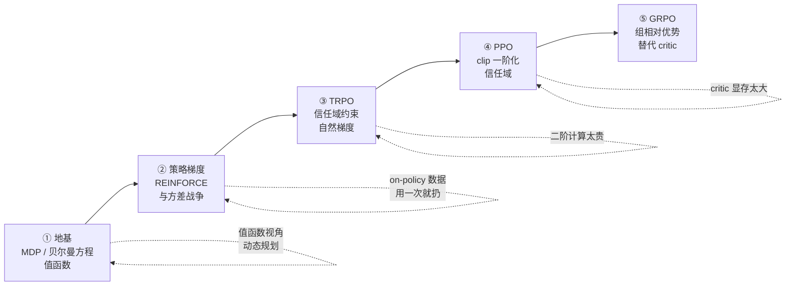

> **TL;DR**
>
> * **这是「从 MDP 到 GRPO」系列的第一篇**。这条链路的终点 GRPO（DeepSeek-R1 背后的 RL 算法）看起来是个 2025 年的新发明，但拆开看，它的每一个组件——baseline、ratio clipping、KL 罚项——都能沿着 MDP → 贝尔曼方程 → 策略梯度 → 信任域这条 70 年的老路找到根。第一篇的任务是把地基打牢：**符号字典 + MDP/MRP/贝尔曼方程/值函数**，后续四篇全部复用这一篇的记号。
> * **一个核心直觉**：整个 RL 的优化对象只有一句话——**最大化期望折扣回报** $\mathbb{E}[G_t]$。贝尔曼方程把这个期望变成递归，动态规划用递归解小状态空间，策略梯度绕开递归直接对参数求导，TRPO/PPO 管住每步更新的步长，GRPO 用组内统计替代价值网络。**每一步演化都是在解决上一步的具体痛点**。
> * **给大模型读者的锚点**：语言生成天然就是一个 MDP——状态是已生成的前缀，动作是词表里的 token，回合是一条完整回答。把这张映射表装进脑子，第五篇看 GRPO 的 loss 会非常通透。



---

## 1. 为什么要从 MDP 讲起

如果你是从 DeepSeek-R1、RLVR、Agentic RL 这些热点倒着找过来的，很可能已经见过 GRPO 的 loss 函数：组采样、减均值除标准差、clip、KL 罚项。直接看它也能抄出代码，但会有几个问题挥之不去：

* 为什么"减均值除标准差"是合法的？它到底在估计什么？
* 为什么 clip 掉 ratio 就能"防止训崩"？
* 为什么还要留一个对 reference model 的 KL 罚项？

这三个问题的答案分别在 1988 年（baseline 方差缩减）、2002 年（信任域理论）、1992 年（策略 KL 正则）就写好了。**不理解来路，就只能当调参侠**；理解了来路，你才能判断 2025-2026 层出不穷的 GRPO 变体（DAPO、Dr.GRPO、GSPO……）哪些是真改进、哪些是补丁摞补丁。

所以这个系列选择从最老的地方开始走一遍完整链条：

$$\text{MDP / 贝尔曼方程} \;\to\; \text{策略梯度 / REINFORCE} \;\to\; \text{TRPO} \;\to\; \text{PPO} \;\to\; \text{GRPO}$$

本篇不涉及任何神经网络，全部结论在表格型（tabular）世界里就能讲清楚——但它们是后面所有算法的"宪法"。

## 2. 符号字典：本系列的公共 API

RL 论文最劝退的一点是符号不统一。这里固定本系列五篇共用的记号，后面不再重复定义：

| 符号 | 名称 | 含义 |
|:---|:---|:---|
| $s \in \mathcal{S}$ | 状态 | 环境的完整描述 |
| $a \in \mathcal{A}$ | 动作 | 智能体的选择 |
| $r$ | 奖励 | 标量信号，常写作 $r(s,a)$ 或 $r(s,a,s')$ |
| $p(s' \mid s, a)$ | 状态转移函数 | 在 $s$ 执行 $a$ 后落到 $s'$ 的概率 |
| $\gamma \in [0, 1]$ | 折扣因子 | 未来奖励的"汇率" |
| $\pi(a \mid s)$ | 策略 | 状态到动作的（随机）映射 |
| $\tau$ | 轨迹 | 一条完整序列 $(s_0, a_0, r_1, s_1, a_1, r_2, \ldots)$ |
| $\rho_0$ | 初始状态分布 | 回合从哪里开始 |
| $G_t$ | 回报（return） | 从 $t$ 时刻起累计的折扣奖励 |
| $V^\pi(s)$ | 状态值函数 | 从 $s$ 出发、跟随 $\pi$ 的期望回报 |
| $Q^\pi(s, a)$ | 动作值函数 | 从 $s$ 执行 $a$ 后、跟随 $\pi$ 的期望回报 |
| $A^\pi(s, a)$ | 优势函数 | $Q^\pi(s,a) - V^\pi(s)$，动作比平均好多少 |
| $d^\pi(s)$ | （折扣）状态访问分布 | 跟随 $\pi$ 时状态的（折扣）频率 |
| $\theta$ | 策略参数 | 神经网络参数，策略写作 $\pi_\theta$ |
| $\epsilon$ | clip 半径 | PPO/GRPO 中 ratio 的裁剪范围（第四篇起） |

两个约定：**大写 $S_t, A_t$ 表示随机变量，小写 $s, a$ 表示具体取值**（Sutton & Barto 记号）；"回报 return"永远指 $G_t$ 这个随机变量，"奖励 reward"指单步的 $r$——中文语境里这两个词极易混用。

## 3. Agent 与环境：决策问题的最小完备模型

RL 的世界观只有一张图：智能体在离散时间步上与环境交互。

$$s_0 \sim \rho_0 \;,\quad a_t \sim \pi(\cdot \mid s_t)\;,\quad s_{t+1} \sim p(\cdot \mid s_t, a_t)\;,\quad r_{t+1} = R(s_t, a_t, s_{t+1})$$

如果这个交互过程满足**马尔可夫性质**——未来只通过当前状态与历史发生联系：

$$p(s_{t+1} \mid s_0, a_0, \ldots, s_t, a_t) = p(s_{t+1} \mid s_t, a_t)$$

它就是一个**马尔可夫决策过程（MDP）**，由五元组 $\langle \mathcal{S}, \mathcal{A}, P, R, \gamma \rangle$ 完全刻画。

马尔可夫性质为什么重要？因为它保证了两件事：

1. **值函数只依赖当前状态**。$V^\pi(s)$ 是良定义的——不需要维护历史窗口，一个 $s$ 对应一个值。
2. **递归成立**。下一节你会看到，整个动态规划大厦建立在"可以把期望回报拆成 *这一步的奖励 + 下一状态的值*"上。没有马尔可夫性，$G_t$ 的递归展开就是非法的。

实践中"状态"往往不是天然给定的，而是**设计出来的**：Atari 游戏用最近 4 帧（为了包含速度信息）、LLM 生成用整个已生成前缀（token 生成天然马尔可夫，因为前缀就是全部历史）。**把问题整理成马尔可夫的，是 RL 工程里最值钱的隐性工作**。

## 4. 回报与折扣：把"长期好不好"变成一个数

策略好不好，不看单步奖励，看**回报**（return）——从当前时刻起、未来所有折扣奖励之和：

$$G_t \;=\; r_{t+1} + \gamma\, r_{t+2} + \gamma^2\, r_{t+3} + \cdots \;=\; \sum_{k=0}^{\infty} \gamma^k\, r_{t+k+1}$$

这个定义有一个漂亮的递归形式，后面所有推导的种子就是它：

$$G_t \;=\; r_{t+1} + \gamma\, G_{t+1}$$

为什么需要折扣因子 $\gamma$？三个理由，从数学到工程：

1. **数学收敛**。若奖励有界（$\lvert r \rvert \le r_{\max}$），则 $\lvert G_t \rvert \le r_{\max} \sum_k \gamma^k = \frac{r_{\max}}{1 - \gamma}$，无穷回合的期望回报也有限。$\gamma = 1$ 只在回合保证终止（episodic 任务）时安全。
2. **不确定性加权**。未来的奖励要打折扣——就像钱的时间价值，也像"十年后的工资对今天择业决策的影响应该衰减"。
3. **控制有效视野**。$\gamma$ 直接决定策略"看多远"：$\gamma = 0.99$ 时有效视野约 $\frac{1}{1-\gamma} = 100$ 步。RLHF/RLVR 里奖励在几千个 token 之后才出现，$\gamma$ 通常取 1.0（靠 KL 罚项和优势估计来稳定），这是一个重要的实践分歧点，第五篇会回到这里。

## 5. 给状态打分：值函数与贝尔曼方程

### 5.1 给定策略后，MDP 塌缩成 MRP

MDP 里环境 dynamics 和策略是两个随机源。**固定一个策略 $\pi$ 之后**，动作的不确定性被吸收进策略本身，整个系统退化成一个带奖励的马尔可夫链（Markov Reward Process, MRP）——只剩一个随机源了。这时可以问：**这个策略在状态 $s$ 上值多少分？**

$$V^\pi(s) \;=\; \mathbb{E}_{\pi}\left[\, G_t \mid S_t = s \,\right]$$

这就是**状态值函数**：从 $s$ 出发、此后一直跟随 $\pi$，期望能拿到多少折扣回报。同理，**动作值函数**固定了第一步动作：

$$Q^\pi(s, a) \;=\; \mathbb{E}_{\pi}\left[\, G_t \mid S_t = s,\, A_t = a \,\right]$$

### 5.2 贝尔曼期望方程：把"无限求和"变成"一步递归"

$V^\pi$ 的定义里藏着对无限长轨迹求期望，直接算不可行。救星是 $G_t$ 的递归形式。把定义展开：

$$V^\pi(s) = \mathbb{E}_{\pi}\left[\, r_{t+1} + \gamma\, G_{t+1} \mid S_t = s \,\right]$$

对"本步动作 → 转移"两层随机源使用全期望公式（先对 $a$ 平均，再对 $s'$ 平均），并把条件期望 $\mathbb{E}[\, G_{t+1} \mid S_{t+1} = s' \,]$ 认出来就是 $V^\pi(s')$（按定义，跟随 $\pi$ 时它正是 $s'$ 的值）：

$$\boxed{\;V^\pi(s) \;=\; \sum_{a} \pi(a \mid s) \sum_{s'} p(s' \mid s, a)\,\Big[\, r(s, a, s') + \gamma\, V^\pi(s') \,\Big]\;}$$

这就是**贝尔曼期望方程**。它的读法非常自然：**一个状态的值 = 所有可行动作的（概率加权）平均，其中每个动作的值 = 即时奖励 + 下一状态值的折扣**。注意这是关于 $V^\pi$ 的线性方程组（$\lvert\mathcal{S}\rvert$ 个方程 $\lvert\mathcal{S}\rvert$ 个未知数），表格情形可以直接解：

$$V^\pi = (I - \gamma P^\pi)^{-1} R^\pi$$

其中 $P^\pi$ 是吸收了策略后的转移矩阵。但矩阵求逆是 $O(n^3)$，状态一多就得换迭代法（见第 7 节）。

$Q$ 的贝尔曼方程少一层动作平均（因为动作已被指定）：

$$Q^\pi(s, a) = \sum_{s'} p(s' \mid s, a)\,\Big[\, r(s,a,s') + \gamma\, V^\pi(s') \,\Big]$$

### 5.3 V、Q、A：三个函数，一个家族

三者关系是后面所有算法的语法：

$$V^\pi(s) = \sum_a \pi(a \mid s)\, Q^\pi(s, a) \qquad\qquad A^\pi(s, a) \;=\; Q^\pi(s, a) - V^\pi(s)$$

**优势函数** $A^\pi$ 值得单独强调：它衡量"在 $s$ 选 $a$，比 $\pi$ 的平均水准好多少"。$A > 0$ 说明这个动作该加强，$A < 0$ 该抑制。它把回报的绝对尺度（往往很大、方差很高）平移成了"相对平均"的小尺度——**第二篇会证明，策略梯度里减掉的 baseline 只要与动作无关就不改变期望，而 $V^\pi(s)$ 恰是最常用的 baseline；第五篇会看到 GRPO 的"组内减均值"本质上就是给 $A$ 找了一个免训练的估计**。这条暗线贯穿全系列。

## 6. 最优性：贝尔曼最优方程与压缩映射

值函数回答"这个策略多好"，紧接着的问题是"**最好的策略有多好**"。定义最优值函数：

$$V^\ast(s) \;=\; \max_\pi V^\pi(s)$$

把期望方程里的"平均"换成"取 max"，就得到**贝尔曼最优方程**：

$$V^\ast(s) = \max_a \sum_{s'} p(s' \mid s, a)\,\Big[\, r(s,a,s') + \gamma\, V^\ast(s') \,\Big] \qquad Q^\ast(s,a) = \sum_{s'} p(s' \mid s, a)\,\Big[\, r + \gamma \max_{a'} Q^\ast(s', a') \,\Big]$$

三个关键事实（Sutton & Barto 第 4 章，证明略去、只给直觉）：

1. **存在性**：$V^\ast$ 存在且唯一。贝尔曼最优算子 $\mathcal{T}V(s) = \max_a \sum_{s'} p(s' \mid s,a) [r + \gamma V(s')]$ 在无穷范数下是 $\gamma$-压缩的：

   $$\lVert \mathcal{T}V_1 - \mathcal{T}V_2 \rVert_\infty \;\le\; \gamma\, \lVert V_1 - V_2 \rVert_\infty$$

   直觉：两边最大的差异最多把"差一个 $V$"放大 $\gamma < 1$ 倍。压缩映射由 Banach 不动点定理保证唯一不动点，且**从任何初始 $V_0$ 反复迭代 $\mathcal{T}$ 都几何速度收敛到它**。
2. **贪心即最优**：对 $V^\ast$ 贪心（每步选 $\arg\max_a$）的策略 $V^\ast$ 就是全局最优策略。确定性环境里最优策略必然存在；随机环境里"确定性最优策略"也总是存在（随机化从不带来额外好处——这是 MDP 与博弈论的分野）。
3. **$Q^\ast$ 的妙用**：拿到 $Q^\ast$ 后最优策略无需再迭代——$\pi^\ast(a \mid s) = \mathbb{1}[a = \arg\max_{a'} Q^\ast(s, a')]$。这就是 Q-learning 一族"学 Q 就够"的理论根基。

## 7. 动态规划：表格世界的解法

有了不动点方程，最朴素的算法就是**值迭代**：反复施加贝尔曼最优算子直到收敛。

##### 变量映射表（数学 ↔ 代码）

| 数学符号 | 代码变量 | Shape / 类型 | 含义 |
|---|---|---|---|
| $\gamma$ | `GAMMA` | 标量 | 折扣因子（episodic 任务取 1.0） |
| $V^*(s)$ | `V` | `(N, N)` ndarray | 最优值函数（迭代收敛后） |
| $\theta$（收敛阈值） | `theta` | 标量 | 贝尔曼残差停止条件 |
| $p(s',r\mid s,a)$ | 由 `ACTIONS` 与网格结构隐式给出 | — | 确定性转移 |
| $\pi^*(a\mid s)$ | `np.argmax(vals)` 贪心提取 | `(N, N)` | 由 $V^*$ 恢复最优策略 |


```python
import numpy as np

# 4x4 GridWorld（Sutton & Barto 例 4.1）：左上/右下为终点，每走一步奖励 -1
N = 4
TERMINAL = {(0, 0), (N - 1, N - 1)}
GAMMA = 1.0                      # episodic 任务，不折扣
ACTIONS = [(-1, 0), (1, 0), (0, -1), (0, 1)]   # 上、下、左、右

V = np.zeros((N, N))
theta = 1e-4                     # 收敛阈值
sweeps = 0
while True:
    delta = 0.0
    sweeps += 1
    for i in range(N):
        for j in range(N):
            if (i, j) in TERMINAL:
                continue
            v_old = V[i, j]
            vals = []
            for di, dj in ACTIONS:
                # 走出边界会被"撞回来"：状态转移仍是确定性的
                ni, nj = min(max(i + di, 0), N - 1), min(max(j + dj, 0), N - 1)
                vals.append(-1.0 + GAMMA * V[ni, nj])      # r = -1
            V[i, j] = max(vals)                            # 贝尔曼最优算子
            delta = max(delta, abs(v_old - V[i, j]))
    if delta < theta:
        break

np.set_printoptions(precision=1, suppress=True)
print(f"收敛用了 {sweeps} 次 sweep")
print(V)
```

真实运行结果（每格的值 = 到最近终点的最短步数的相反数，符合直觉）：

```
收敛用了 4 次 sweep
[[ 0. -1. -2. -3.]
 [-1. -2. -3. -2.]
 [-2. -3. -2. -1.]
 [-3. -2. -1.  0.]]
```

它的兄弟**策略迭代**（评估当前策略 → 贪心改进 → 循环）在策略评估那步解的是期望方程而非最优方程。两者都必然收敛到 $\pi^\ast$，区别只是迭代的是值还是策略。**这一对算法是后面所有 actor-critic 结构的精神原型**：策略迭代里"评估"对应 critic（学值函数），"改进"对应 actor（更新策略）。

## 8. 表格法撞墙：为什么需要策略梯度

值迭代这么优雅，为什么还要后面三篇？因为表格动态规划有三堵墙：

| 墙 | 表现 | 突破口 |
|:---|:---|:---|
| **状态空间爆炸** | 围棋 $10^{170}$ 个状态，表格放不下；LLM 的状态是所有可能前缀，连续且无限 | 函数近似：用 $\hat{v}(s; w)$ 泛化 |
| **需要环境模型** | $p(s' \mid s, a)$ 未知时，$\max_a \sum_{s'}$ 这一步算不了 | 无模型方法：从采样数据估计 |
| **策略是隐式的** | 值函数只给"每步取 max"，连续动作空间上 $\arg\max_a$ 本身就是难题；也学不出"随机最优"（石头剪刀布） | 直接参数化策略 $\pi_\theta(a \mid s)$，对 $\theta$ 求梯度 |

第二篇的策略梯度选择的是第三行的路：**跳过值函数这个中间商，直接对策略参数求导**。但请记住，即便走这条路，第一篇的内容也不是"用完即扔"——优势函数、折扣回报、贝尔曼方程作为"值函数怎么指导策略改进"的语言，贯穿后面每一篇。

## 9. LLM 视角：语言生成就是一个 MDP

把自回归生成翻译成第一篇的语言，映射关系严丝合缝：

| RL 语言 | LLM 生成中的对应物 |
|:---|:---|
| 初始状态分布 $\rho_0$ | prompt 数据集的分布 |
| 状态 $s_t$ | prompt + 已生成的 token 前缀 |
| 动作 $a_t$ | 词表中的一个 token（10 万维离散空间） |
| 策略 $\pi(a \mid s)$ | 语言模型 $\pi_\theta(y_t \mid x, y_{<t})$（softmax 输出） |
| 状态转移 $p$ | 确定性拼接：append 一个 token |
| 回合 | 生成到 EOS 或 max_new_tokens |
| 奖励 $r$ | 常常只在回合末尾给一个标量（答案对不对/格式对不对），**极度稀疏** |
| 有效视野 | 数百到数千 token，$\gamma$ 常取 1.0 |

这张表解释了 LLM 时代 RL 算法的三个"口味变化"：

1. **状态无限、动作巨大** → 表格法彻底出局，值函数/策略都必须用同一个 Transformer 来近似；
2. **奖励在句末** → credit assignment（哪个 token 该记功）成为核心矛盾，优势估计从单步 TD 转向序列级回报；
3. **采样极贵**（一条轨迹 = 一次完整前向解码）→ 样本效率压倒一切，on-policy 数据必须想办法复用——这正是 TRPO/PPO/GRPO 这条演化线的原始驱动力。

第五篇会回到这张表，把 GRPO 的每一项放回对应的位置上。

## 10. Takeaway

本篇只需要带走四句话：

1. **RL 的目标函数只有一句话**：最大化期望折扣回报 $\mathbb{E}[G_t]$，$G_t = r_{t+1} + \gamma G_{t+1}$ 的递归形式是所有推导的种子。
2. **贝尔曼方程把无限问题变递归**：$V^\pi(s) = \sum_a \pi(a \mid s) \sum_{s'} p(s' \mid s, a) [r + \gamma V^\pi(s')]$；最优版本把平均换成 max，压缩映射保证唯一解与迭代收敛。
3. **V、Q、A 一家亲**：$V$ 是期望、$Q$ 是指定首步的期望、$A = Q - V$ 是"比平均好多少"。**优势函数是贯穿到 GRPO 的暗线**。
4. **语言生成天然是 MDP**：状态 = 前缀，动作 = token，奖励稀疏在句末，采样昂贵——这决定了 LLM 时代 RL 算法的全部演化方向。

**下一篇预告**：值函数是"评价"，但我们要的是"改进"。策略梯度定理将给出 RL 里最重要的一个恒等式——$\nabla_\theta J(\theta) = \mathbb{E}\left[\nabla_\theta \log \pi_\theta(a \mid s) \, A^\pi(s, a)\right]$，并从 REINFORCE 出发，展开贯穿全系列的第二主线：**方差战争**。

---

**系列导航**

1. **从 MDP 到 GRPO（一）：强化学习的地基——MDP、贝尔曼方程与值函数**（本篇）
2. [从 MDP 到 GRPO（二）：策略梯度——REINFORCE 与方差的战争](/2026/08/21/mdp-to-grpo-02-policy-gradient-reinforce/)
3. [从 MDP 到 GRPO（三）：TRPO——信任域，让更新别摔死](/2026/08/21/mdp-to-grpo-03-trpo-trust-region/)
4. [从 MDP 到 GRPO（四）：PPO——用一阶方法驯服策略更新](/2026/08/21/mdp-to-grpo-04-ppo-clipped-surrogate/)
5. [从 MDP 到 GRPO（五）：GRPO——组相对优势与大模型时代的 RL](/2026/08/21/mdp-to-grpo-05-grpo-group-relative/)

> 🧪 **动手练习**：① 把 `GAMMA` 改成 0.9 重跑值迭代，观察最优策略是否改变并解释原因；② 任选一格手工由 $V^*$ 计算 $Q^*(s,a)$，验证 $V^*(s)=\max_a Q^*(s,a)$。

## 参考与延伸阅读

* Sutton & Barto, *Reinforcement Learning: An Introduction* (2nd ed.), Ch. 3–4 —— MDP、贝尔曼方程、动态规划的权威表述
* David Silver, UCL RL Course, Lecture 1–3 —— 与本篇结构最接近的视频课程
* OpenAI Spinning Up, "Kinds of RL Algorithms" —— 值函数方法 vs 策略梯度方法的分类视角
* DeepSeek-AI, "DeepSeekMath: Pushing the Limits of Mathematical Reasoning" ([arXiv:2402.03300](https://arxiv.org/abs/2402.03300)) —— GRPO 的原始出处，第五篇的主角
- 中文社区视角：《【强化学习课程笔记 二】马尔可夫决策过程(下)(周博磊老师课程)》（知乎）https://zhuanlan.zhihu.com/p/168768560
