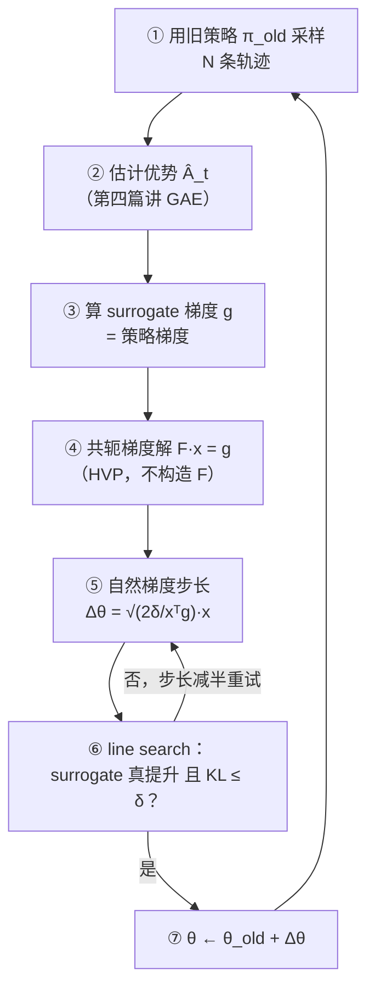

> **TL;DR**
>
> * **RL 的更新和监督学习的更新有一个本质区别**：监督学习里一次坏更新可以靠下一个 batch 挽回，RL 里策略变差 → 采到的数据变差 → 下一次更新更差，**一步走崩可能永远回不来**。TRPO（2015）给出的解法是信任域：每次更新前给新旧策略的距离（平均 KL 散度）设一个硬上界，保证性能单调不降。
> * **全部理论建立在一个恒等式上**（performance difference lemma）：$J(\pi') - J(\pi)$ 恰好等于"新策略轨迹下 $\sum_t A^\pi(s_t, a_t)$ 的期望"。它精确但不可算（期望在新策略的状态分布下），TRPO 用旧分布替换它得到 surrogate 目标——**这个替换在局部成立、全局会漂移，所以必须配 KL 约束**。
> * **工程上的精髓是三个"不求"**：不求目标函数的二阶近似矩阵的逆（共轭梯度）、连 Fisher 信息矩阵本身都不显式构造（Fisher-向量积）、更新方向算出来还要 line search 兜底。这套"理论保证 + 工程打折"的组合拳，正是后来 PPO 与 GRPO 的设计范式。



---

## 1. 为什么 RL 需要"信任域"

监督学习的损失面是固定的：今天这步 SGD 走坏了，明天换个 batch 还能走回来。RL 不是——**训练数据是策略自己生产的**：

$$\text{策略变差} \;\Rightarrow\; \text{采到的轨迹变差} \;\Rightarrow\; \text{下一轮梯度信号更差} \;\Rightarrow\; \text{策略更差}$$

这是一个正反馈的死亡螺旋。做过 LLM RL 训练的人对"训崩"都有肌肉记忆：某个 checkpoint 之后 reward 均值断崖下跌、熵塌缩、模型开始输出乱码且再也救不回来。根源往往就是某一步更新把策略推离了数据分布的支持范围。

经典优化里的应对方案叫**信赖域方法**（trust region）：在当前点周围划一个"模型近似可信"的小区域，只在区域内做外推。TRPO（Schulman et al., 2015）把这套思想搬进 RL，并且给出了 RL 版本独有的理论支撑。要理解它，只需要一个恒等式。

## 2. 地基：性能差异恒等式

**定理（Kakade & Langford, 2002）**：对任意两个策略 $\pi$ 和 $\pi'$：

$$J(\pi') \;=\; J(\pi) \;+\; \mathbb{E}_{\tau \sim \pi'}\left[\; \sum_{t=0}^{\infty} \gamma^t\, A^\pi(s_t, a_t) \;\right]$$

推导思路（两步，细节可跳过）：先把 $J(\pi)$ 写成"每个时刻的优势在 $(s_t, a_t)$ 上的期望"沿时间求和；关键在于**优势函数 $A^\pi$ 是定义在旧策略 $\pi$ 上的**，所以这一项对任何新策略都良定义；再把"新策略下的折扣状态访问分布"吸收进期望的上标，就得到上式。

证明梗概：

$$J(\pi') - J(\pi) = \sum_{t=0}^{\infty} \gamma^t\, \mathbb{E}_{s_t \sim d_t^{\pi'}}\left[\; \mathbb{E}_{a_t \sim \pi'}\big[\, A^\pi(s_t, a_t) \,\big] \;\right]$$

其中 $d_t^{\pi'}$ 是跟随 $\pi'$ 时 $t$ 时刻的状态分布。合并两层期望并定义折扣访问分布 $d^{\pi'}$，即得恒等式。

这个式子精确回答了"换策略能带来多少提升"。但它**不可计算**：期望是对 $\tau \sim \pi'$ 取的——而 $\pi'$ 正是我们想评估的对象，它的状态分布 $d^{\pi'}$ 无从得知（这正是第一篇说过的"分布漂移"问题的精确形态）。

## 3. Surrogate：用一个可算的目标偷换不可算的目标

既然 $d^{\pi'}$ 拿不到，就用旧策略的访问分布 $d^{\pi}$ 替换它，得到 **surrogate 目标**：

$$L_{\pi}(\pi') \;=\; \mathbb{E}_{s \sim d^{\pi},\; a \sim \pi'}\Big[\, A^{\pi}(s, a) \,\Big]$$

再用重要性采样把动作那一层也换回旧策略（注意这里只对一个动作换，不是整条轨迹连乘——第二篇末尾的"除非"在这里兑现了）：

$$L_{\pi}(\pi') \;=\; \mathbb{E}_{s \sim d^{\pi},\; a \sim \pi}\left[\; \frac{\pi'(a \mid s)}{\pi(a \mid s)}\; A^{\pi}(s, a) \;\right]$$

记比率 $r(\theta) = \frac{\pi_\theta(a \mid s)}{\pi_{\theta_{\mathrm{old}}}(a \mid s)}$，这就是**贯穿后两篇的主角**：PPO 和 GRPO 的 loss 里都有它。

$L$ 与真实改进 $J(\pi') - J(\pi)$ 的关系有两个精确性质：

1. **一阶处完全一致**：$\pi' = \pi$ 时两者相等，且对 $\pi'$ 的梯度也相等。所以在旧策略附近，$L$ 的上升方向就是 $J$ 的上升方向；
2. **远处必然漂移**：$d^{\pi'} \ne d^{\pi}$ 后，$L$ 的提升不再保证 $J$ 的提升。极端例子：某次更新让策略几乎不再经过某些状态，surrogate 上看损失没变（那些状态的项权重趋零），真实性能却已经崩了。

## 4. 从漂移到保险：KL 上界定理

TRPO 论文引用的 Kakade-Langford 定理给出了定量保险：存在常数 $C$（只依赖 $\gamma$ 和奖励界，具体数值如 $C = \frac{4\,\epsilon\,\gamma}{(1-\gamma)^2}$ 不重要），使得：

$$J(\pi') \;\ge\; J(\pi) \;+\; L_{\pi}(\pi') \;-\; C\, \max_{s}\; D_{\mathrm{KL}}\big(\pi(\cdot \mid s)\,\|\,\pi'(\cdot \mid s)\big)$$

读法：**只要新旧策略在每个状态上的 KL 散度足够小，surrogate 的提升就是真实提升的下界**。KL 散度在这里扮演"距离表"的角色——它衡量两个策略在同一状态下行为分布的差异。

于是优化问题从"最大化 surrogate"变成带约束的版本（把 max 松弛为平均，实践更好估）：

$$\max_{\theta}\; L_{\theta_{\mathrm{old}}}(\theta) \qquad \text{s.t.}\quad \mathbb{E}_{s \sim d^{\theta_{\mathrm{old}}}}\Big[\, D_{\mathrm{KL}}\big(\pi_{\theta_{\mathrm{old}}}(\cdot \mid s)\,\|\,\pi_\theta(\cdot \mid s)\big) \,\Big] \le \delta$$

这个可行域就是**信任域**：$\delta$ 划定了"surrogate 近似可信"的邻域半径。两种设计取舍：

| 方案 | 形式 | 问题 |
|:---|:---|:---|
| 惩罚式 | $\max\; L - \beta \cdot \mathrm{KL}$ | $\beta$ 极难调：太小等于没有约束，太大一步挪不动 |
| 约束式（TRPO 选择） | $\max\; L \;\;\text{s.t.}\; \mathrm{KL} \le \delta$ | $\delta$ 语义直观（"每步最多偏离这么多"），跨任务好迁移 |

## 5. 实用化：三个"不求"

约束优化看着吓人，TRPO 的工程智慧在于把它化简到能跑。设当前参数为 $\theta_k$，更新量 $\Delta\theta = \theta - \theta_k$。

### 5.1 局部线性化 + KL 的二阶近似

在 $\theta_k$ 附近做泰勒展开：surrogate 取一阶（梯度 $g$），KL 取二阶（一阶为零，因为 $\theta = \theta_k$ 时 KL 最小）：

$$L_{\theta_k}(\theta) \;\approx\; g^{\top} \Delta\theta \qquad\qquad \bar{D}_{\mathrm{KL}} \;\approx\; \frac{1}{2}\, \Delta\theta^{\top}\, F\, \Delta\theta$$

其中 $g = \nabla_\theta L_{\theta_k}(\theta)\,\big\vert_{\theta = \theta_k}$——**算出来恰好就是第二篇的策略梯度**（乘了优势的 log-prob 求和）；而 $F$ 是 KL 散度在 $\theta_k$ 处的 Hessian，也就是统计学里大名鼎鼎的 **Fisher 信息矩阵**：

$$F \;=\; \mathbb{E}_{a \sim \pi_{\theta_k}}\Big[\, \nabla_\theta \log \pi_\theta(a \mid s)\; \nabla_\theta \log \pi_\theta(a \mid s)^{\top} \,\Big]$$

（对离散动作，$F = \mathbb{E}\big[\nabla \log \pi \, \nabla \log \pi^{\top}\big]$，期望取自 $s \sim d,\; a \sim \pi$；连续动作同理。）

### 5.2 解析解：自然梯度

代入后的近似问题是教科书级的二次规划：

$$\max_{\Delta\theta}\; g^{\top} \Delta\theta \qquad \text{s.t.}\quad \frac{1}{2}\, \Delta\theta^{\top} F\, \Delta\theta \;\le\; \delta$$

拉格朗日乘子法：最优方向必满足 $\Delta\theta \propto F^{-1} g$，再由约束定出步长，得到闭式解：

$$\boxed{\;\Delta\theta^{*} \;=\; \sqrt{\frac{2\,\delta}{\;g^{\top} F^{-1} g\;}}\; F^{-1} g\;}$$

$F^{-1} g$ 这个方向叫**自然梯度**（Amari, 1998）：普通梯度在参数空间里找最陡方向，自然梯度在**分布空间**里找最陡方向——它自动对"参数动一点、输出分布抖很多"的方向施加阻尼。这也解释了为什么信任域约束天然适合神经网络策略：参数空间的欧氏距离和策略空间的 KL 距离严重不成比例，Fisher 矩阵正是两者的"汇率"。

### 5.3 但 $F^{-1}$ 不能真的去求

神经网络千万级参数，构造 $F$（$n \times n$ 矩阵）再求逆是天文数字。TRPO 的做法：

1. **共轭梯度（CG）解 $F x = g$**：只需要"矩阵 × 向量"，不需要矩阵本身；
2. **Fisher-向量积（HVP）**：$F v$ 可以用有限差分或双重反向传播算出，代价约等于两次梯度反传：

   $$F v \;=\; \nabla_\theta \Big[\, \big(\nabla_\theta\, \bar{D}_{\mathrm{KL}}(\theta_k, \theta)\big)^{\top} v \,\Big]\Big|_{\theta = \theta_k}$$

3. **line search 兜底**：泰勒近似只是局部的，算出的 $\Delta\theta^\ast$ 先试原步长，若 surrogate 没真提升或 KL 超标就减半重试，直到满足为止。**理论上界 + 实践兜底**，双保险。

完整伪码：

```
初始化策略 π_θ、值函数 V（用于估计优势）
repeat:
    # 采样阶段（on-policy）
    用 π_θold 采 N 条轨迹
    用 GAE/蒙特卡洛估计每步优势 Â_t

    # 更新阶段
    g  ← ∇θ [ mean( r_t(θ) · Â_t ) ]  在 θ = θold 处     # 第二篇的策略梯度
    x  ← 共轭梯度解 F x = g                              # ~10 次 CG 迭代
    Δθ ← √( 2δ / (xᵀ g) ) · x                           # 自然梯度 + 步长
    while not ( surrogate(θold + Δθ) 提升 且 KL(θold, θold+Δθ) ≤ δ ):
        Δθ ← Δθ / 2                                     # line search
    θ ← θold + Δθ
until 收敛
```

## 6. TRPO 的遗产：贡献与痛点

| 维度 | 评价 |
|:---|:---|
| **理论保证** | 首个带"性能单调不降"性质的深度 RL 算法，KL 约束的合法性有定理背书 |
| **稳定性** | 大幅缓解训崩，超参比朴素 PG 鲁棒得多 |
| **计算开销** | CG + 多重反向传播 + line search 内多次前向，单次更新昂贵 |
| **实现复杂度** | HVP、CG、双循环，开源实现之间结果差异大；难以和 RNN、共享参数（policy/value 共底座）优雅结合 |
| **二阶必要性存疑** | 后见之明：大部分收益来自"限制步长"本身，而非精确的自然梯度方向 |

最后一条是关键伏笔：如果"限制步长"才是本质，那能不能**放弃二阶计算，用一阶方法近似同一个效果**？2017 年 Schulman 给出了答案——不显式解约束优化，而是把约束"烤进"目标函数里：超出信任域的更新，其目标值直接被裁掉。这就是 PPO 的 clipped surrogate，下一篇的主角。

## 7. Takeaway

1. **RL 更新的死亡螺旋**：策略差 → 数据差 → 更新差。信任域 = 给新旧策略的 KL 距离设硬上界，换取性能单调性。
2. **性能差异恒等式**是全部理论的根：$J(\pi') - J(\pi)$ 等于新策略轨迹下 $\sum_t A^\pi(s_t, a_t)$ 的期望；surrogate 把不可算的 $d^{\pi'}$ 换成 $d^{\pi}$，KL 约束负责兜住替换引入的漂移。
3. **比率 $r(\theta) = \pi_\theta / \pi_{\theta_{\mathrm{old}}}$ 在这里首次登场**——单动作层面的重要性采样，无长连乘，PPO/GRPO 直接继承。
4. **TRPO 的工程哲学**：理论给保证（KL 上界定理），工程打折扣（CG、HVP、line search）。当折扣打得足够狠，就有了 PPO。

**下一篇预告**：PPO 用一个 `min` 和一个 `clip` 把信任域装进了三行 PyTorch 代码，成为 RLHF 时代之前应用最广的 RL 算法。我们会完整推导 clip 为什么能近似信任域，以及 GAE 如何在偏差与方差之间精确定价。

---

**系列导航**

1. [从 MDP 到 GRPO（一）：强化学习的地基——MDP、贝尔曼方程与值函数](/2026/08/21/mdp-to-grpo-01-mdp-bellman-foundation/)
2. [从 MDP 到 GRPO（二）：策略梯度——REINFORCE 与方差的战争](/2026/08/21/mdp-to-grpo-02-policy-gradient-reinforce/)
3. **从 MDP 到 GRPO（三）：TRPO——信任域，让更新别摔死**（本篇）
4. [从 MDP 到 GRPO（四）：PPO——用一阶方法驯服策略更新](/2026/08/21/mdp-to-grpo-04-ppo-clipped-surrogate/)
5. [从 MDP 到 GRPO（五）：GRPO——组相对优势与大模型时代的 RL](/2026/08/21/mdp-to-grpo-05-grpo-group-relative/)

**参考与延伸阅读**

* Schulman et al., "Trust Region Policy Optimization" (arXiv:1502.05477, ICML 2015) —— 本篇主角
* Kakade & Langford, "Approximately Optimal Approximate RL" (ICML 2002) —— 性能差异恒等式与 CPI 算法的源头
* Schulman et al., "Optimizing Expectations" (PhD thesis, 2016) —— TRPO 推导最完整的版本
* Amari, "Natural Gradient Works Efficiently in Learning" (1998) —— 自然梯度的信息几何起源
* John Schulman 的 Berkeley CS294 演讲 "Deep RL Bootcamp Lecture 6: Nuts and Bolts of Deep RL Experimentation" 与 TRPO 讲义 —— 工程视角的最佳补充
