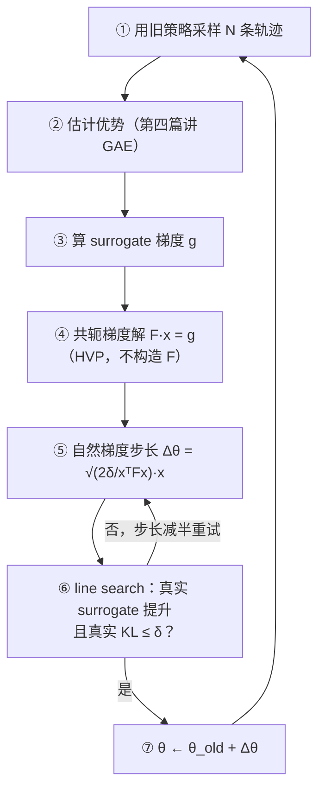
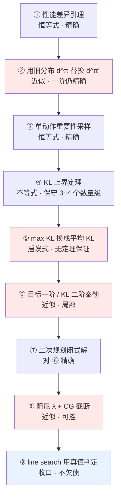

> **TL;DR**
>
> * **全部理论建立在一个恒等式上**（性能差异引理，PDL）：$$J(\pi') - J(\pi)$$ 恰好等于“新策略轨迹下 $$\sum_t \gamma^t A^\pi(s_t, a_t)$$ 的期望”。本篇把它完整推一遍——它就是值函数差的一次 telescoping 展开，**没有任何近似**。它精确但不可算：期望挂在新策略的状态分布 $$d^{\pi'}$$ 上，而 $$\pi'$$ 正是待评估的对象。
> * **TRPO 全程只有两处实质性近似**：① 用旧分布 $$d^\pi$$ 替换 $$d^{\pi'}$$（surrogate）；② 用泰勒二次型替换真实 KL 约束。其余环节——重要性采样、Fisher 定义、二次规划闭式解、Hessian-向量积——都是恒等变换或对近似问题的精确解。**真正的近似只有三处半**：加上“max KL 换成平均 KL”这个没有定理背书的启发式。§6 有一张完整的账。
> * **KL 上界定理给出的是定性保险，不是可用常数**：$$J(\pi') \ge L_\pi(\pi') - C\,D^{\max}_{\mathrm{KL}}$$ 成立，但实测中 $$C\,D^{\max}_{\mathrm{KL}}$$ 比真实漂移大 3～4 个数量级。所以 TRPO 只借它的结论（“KL 小 ⇒ 漂移可控”），$$C = \frac{4\,\epsilon_A\,\gamma}{(1-\gamma)^2}$$ 从不进代码。
> * **工程上的精髓是“近似提方案、真值做判决”**：共轭梯度、阻尼、泰勒展开只负责**提议**一个步长，接不接受由 line search 用**真实的** surrogate 和**真实的** KL 判定。这个分工是 TRPO 稳定性的真正来源。


```mermaid
flowchart TD
    S["① 用旧策略采样 N 条轨迹"] --> A["② 估计优势（第四篇讲 GAE）"]
    A --> G["③ 算 surrogate 梯度 g"]
    G --> CG["④ 共轭梯度解 F·x = g<br/>（HVP，不构造 F）"]
    CG --> NG["⑤ 自然梯度步长 Δθ = √(2δ/xᵀFx)·x"]
    NG --> LS["⑥ line search：真实 surrogate 提升<br/>且真实 KL ≤ δ？"]
    LS -->|"否，步长减半重试"| NG
    LS -->|"是"| U["⑦ θ ← θ_old + Δθ"]
    U --> S
```

---

## 1. 为什么 RL 需要“信任域”

监督学习的损失面是固定的：今天这步 SGD 走坏了，明天换个 batch 还能走回来。RL 不是——**训练数据是策略自己生产的**：

$$\text{策略变差} \;\Rightarrow\; \text{采到的轨迹变差} \;\Rightarrow\; \text{下一轮梯度信号更差} \;\Rightarrow\; \text{策略更差}$$

做过 LLM RL 训练的人对“训崩”都有肌肉记忆：某个 checkpoint 之后 reward 均值断崖下跌、熵塌缩、模型开始输出乱码且再也救不回来。经典优化里的应对方案叫**信赖域方法**（trust region）：在当前点周围划一个“模型近似可信”的小区域，只在区域内做外推。TRPO（Schulman et al., 2015）把这套思想搬进 RL，并且给出了 RL 版本独有的理论支撑。要理解它，只需要一个恒等式。

先固定记号（沿用第一篇）：$$J(\pi) = \mathbb{E}_{\tau \sim \pi}\big[\sum_t \gamma^t r(s_t, a_t)\big] = \mathbb{E}_{s_0 \sim \rho_0}[V^\pi(s_0)]$$；$$\rho^\pi(s) = \sum_{t=0}^{\infty} \gamma^t\, P(s_t = s \mid \pi)$$ 是**未归一化**的折扣访问分布（总质量 $$\frac{1}{1-\gamma}$$），$$d^\pi(s) = (1-\gamma)\,\rho^\pi(s)$$ 是归一化后的版本。两种写法后面都会用到，对照关系是 $$\rho^\pi = \frac{1}{1-\gamma} d^\pi$$。

## 2. 地基：性能差异引理（完整推导）

### 2.1 定理

**定理（性能差异引理，Kakade & Langford, 2002）**：对任意两个策略 $$\pi$$ 和 $$\pi'$$：

$$J(\pi') \;-\; J(\pi) \;=\; \sum_{t=0}^{\infty} \gamma^t\; \mathbb{E}_{s_t \sim d_t^{\pi'}}\Big[\; \mathbb{E}_{a_t \sim \pi'}\big[\, A^{\pi}(s_t, a_t) \,\big] \;\Big] \;=\; \sum_{s} \rho^{\pi'}(s) \sum_{a} \pi'(a \mid s)\, A^{\pi}(s, a)$$

归一化写法（用 $$d^{\pi'} = (1-\gamma)\rho^{\pi'}$$）：

$$J(\pi') \;-\; J(\pi) \;=\; \frac{1}{1-\gamma}\; \mathbb{E}_{s \sim d^{\pi'},\; a \sim \pi'}\big[\, A^{\pi}(s, a) \,\big]$$

注意优势函数是**定义在旧策略 $$\pi$$ 上的**，这对任意新策略 $$\pi'$$ 都良定义——这是整个推导能走通的前提。

### 2.2 推导：四步，全是恒等变形

**第 1 步：把性能差写成初始状态上的值函数差。**

$$J(\pi') - J(\pi) = \mathbb{E}_{s_0 \sim \rho_0}\big[\, V^{\pi'}(s_0) - V^{\pi}(s_0) \,\big]$$

**第 2 步：把 $$V^{\pi'}$$ 拆成“优势 + 新策略的 Q”。** 对任意状态 $$s$$：

$$V^{\pi'}(s) - V^{\pi}(s) \;=\; \mathbb{E}_{a \sim \pi'}\big[\, Q^{\pi'}(s,a) \,\big] \;-\; V^{\pi}(s)$$

在中间插入 $$\mathbb{E}_{a \sim \pi'}[Q^{\pi}(s,a)]$$：

$$\;=\; \underbrace{\mathbb{E}_{a \sim \pi'}\big[\, Q^{\pi}(s,a) \,\big] - V^{\pi}(s)}_{\text{第一项}} \;+\; \underbrace{\mathbb{E}_{a \sim \pi'}\big[\, Q^{\pi'}(s,a) - Q^{\pi}(s,a) \,\big]}_{\text{第二项}}$$

第一项就是 $$\mathbb{E}_{a \sim \pi'}[A^{\pi}(s,a)]$$（因为 $$A^\pi = Q^\pi - V^\pi$$，而 $$V^\pi(s)$$ 与 $$a$$ 无关）。这里有个容易看漏的细节：$$\mathbb{E}_{a \sim \pi}[Q^\pi(s,a)] = V^\pi(s)$$，但期望换成 $$\pi'$$ 后不再等于 $$V^\pi$$——**多出来的那部分正好就是优势的均值**，它不凭空消失，只是被定义吸收了。

**第 3 步：第二项递归到下一状态。** 展开 $$Q$$ 的定义，即时奖励项 $$r(s,a)$$ 直接相消：

$$Q^{\pi'}(s,a) - Q^{\pi}(s,a) \;=\; \gamma\; \mathbb{E}_{s' \sim p(\cdot \mid s, a)}\big[\, V^{\pi'}(s') - V^{\pi}(s') \,\big]$$

**第 4 步：迭代展开（telescoping）。** 记 $$\Delta V(s) = V^{\pi'}(s) - V^{\pi}(s)$$，$$\bar{A}(s) = \mathbb{E}_{a \sim \pi'}[A^{\pi}(s,a)]$$，并记 $$\pi'$$ 诱导的状态转移 $$P_{\pi'}(s' \mid s) = \mathbb{E}_{a \sim \pi'}[p(s' \mid s, a)]$$。把第 2、3 步合起来得到一个**自洽的线性方程**：

$$\Delta V(s) \;=\; \bar{A}(s) \;+\; \gamma\; \mathbb{E}_{s' \sim P_{\pi'}(\cdot \mid s)}\big[\, \Delta V(s') \,\big] \qquad\Longleftrightarrow\qquad \Delta V \;=\; \bar{A} + \gamma\, P_{\pi'}\, \Delta V$$

解出 $$\Delta V = (I - \gamma P_{\pi'})^{-1} \bar{A} = \sum_{t=0}^{\infty} \gamma^t P_{\pi'}^{\,t}\, \bar{A}$$。对 $$s_0 \sim \rho_0$$ 取期望，并注意到 $$\rho_0^\top P_{\pi'}^{\,t}$$ 正是 $$t$$ 时刻的状态分布 $$d_t^{\pi'}$$：

$$J(\pi') - J(\pi) \;=\; \rho_0^{\top} (I - \gamma P_{\pi'})^{-1} \bar{A} \;=\; \sum_{t=0}^{\infty} \gamma^t\, \mathbb{E}_{s_t \sim d_t^{\pi'}}\big[\, \bar{A}(s_t) \,\big] \;=\; \rho^{\pi' \top} \bar{A}$$

**收敛性**：奖励有界（$$\lvert r \rvert \le r_{\max}$$）时 $$\lvert \bar A \rvert$$ 有界，级数按 $$\gamma^t$$ 几何衰减。∎

**这四步里没有一步是近似。** 唯一的“代价”是：它把未知量从 $$V^{\pi'}$$ 搬到了 $$d^{\pi'}$$。

### 2.3 实测：这条恒等式精确到机器精度

表格 MDP 上 $$V, Q, A, \rho^\pi$$ 都能解析算出，于是可以直接对账（[`ipynbs/experiments/rl/trpo-pdl/trpo_pdl_lab.py`](https://github.com/lrypcy/ipynbs/blob/a1a206aefd13577ea2afdca95e77fa91cfe980ff/experiments/rl/trpo-pdl/trpo_pdl_lab.py)，锁定 commit，$$\lvert\mathcal{S}\rvert = 8,\ \lvert\mathcal{A}\rvert = 4,\ \gamma = 0.9$$）：

```text
seed   J(pi')-J(pi)     sum_t gamma^t E    残差
0      -0.917993984     -0.917993984      0.00e+00
1      -0.810580309     -0.810580309      2.22e-16
2      -0.337578074     -0.337578074      3.89e-16
3      -1.755835111     -1.755835111      4.44e-16
4       1.168084275      1.168084275      2.22e-16
5       0.604665436      0.604665436      3.33e-16

最大残差 = 5.551e-16
```

截断到第 $$T$$ 项的部分和 $$S_T$$ 与真值之差，衰减速度和 $$\gamma^T$$ 一致：

```text
T      S_T             S_T - 真值     gamma^T
0      -0.046832256    8.71e-01      1.00e+00
10     -0.609372055    3.09e-01      3.49e-01
50     -0.913432280    4.56e-03      5.15e-03
200    -0.917993984    6.24e-10      7.06e-10
```

### 2.4 它精确，但不可算

问题出在 $$d^{\pi'}$$：它是**跟随待评估策略 $$\pi'$$ 时**的状态分布。想知道换策略能带来多少提升，就得先跟着新策略跑一遍环境——而 $$\pi'$$ 还没定下来。这正是第一篇说的“分布漂移”的精确形态。下一节的处理方式，是 TRPO 全程唯一一处**实质性近似**。

## 3. Surrogate：用可算的目标替换不可算的目标

### 3.1 定义与一处符号差异

把 $$d^{\pi'}$$ 换成旧策略的 $$d^{\pi}$$：

$$L_{\pi}(\pi') \;=\; \frac{1}{1-\gamma}\; \mathbb{E}_{s \sim d^{\pi},\; a \sim \pi'}\big[\, A^{\pi}(s, a) \,\big] \;=\; \sum_{s} \rho^{\pi}(s) \sum_{a} \pi'(a \mid s)\, A^{\pi}(s,a)$$

> **符号提示**：TRPO 原文的 $$L_{\pi}(\tilde\pi)$$ 定义为 $$\eta(\pi) + \sum_s \rho_\pi(s)\sum_a \tilde\pi(a\mid s)A_\pi(s,a)$$，**含**常数项 $$J(\pi)$$。本篇把 $$L$$ 记成“改进量”，两者只差一个与优化无关的常数，梯度完全相同。

### 3.2 一阶精确性：为什么在 $$\pi'=\pi$$ 处不会走偏

$$L$$ 与真实改进的一阶行为完全一致，不是巧合，可以严格证明。由 PDL 直接对 $$\theta$$ 求导：

$$\nabla_\theta\big[\,J(\pi_\theta) - J(\pi)\,\big] \;=\; \underbrace{\sum_s \nabla_\theta \rho^{\pi_\theta}(s)\;\cdot\; \bar{A}_\theta(s)}_{\text{(i)}} \;+\; \underbrace{\sum_s \rho^{\pi_\theta}(s)\;\nabla_\theta \bar{A}_\theta(s)}_{\text{(ii)}}$$

在 $$\theta = \theta_{\mathrm{old}}$$ 处取值：

* **(i) 恒为零。** 因为 $$\bar{A}_{\theta_{\mathrm{old}}}(s) = \sum_a \pi_{\theta_{\mathrm{old}}}(a \mid s)\, A^{\pi_{\theta_{\mathrm{old}}}}(s,a) = 0$$——**优势在自身策略下的条件均值恒等于零**。这是同一个事实的第二次出场：第二篇里它保证了“减 baseline 不改变期望”，这里它保证了 surrogate 的一阶精确性。
* **(ii) 正好是 $$\nabla_\theta L$$。**

于是 $$\nabla_\theta J\,\big\vert_{\theta_{\mathrm{old}}} = \nabla_\theta L\,\big\vert_{\theta_{\mathrm{old}}}$$，也就是第二篇推导出的策略梯度。**结论：在旧策略的无穷小邻域内，surrogate 的上升方向就是真实性能的上升方向，误差是二阶的。** 实测（有限差分核对 $$\nabla J$$）：

```text
||∇J − ∇L||_inf = 3.949e-10     ||∇L||_inf = 3.438e-01     相对误差 = 1.149e-09
```

### 3.3 重要性采样这一步是**精确**的，不是近似

为了能用旧数据算期望，把动作那层也换回旧策略：

$$\sum_a \pi'(a \mid s)\, A^{\pi}(s,a) \;=\; \mathbb{E}_{a \sim \pi}\Big[\; \underbrace{\frac{\pi'(a \mid s)}{\pi(a \mid s)}}_{r_t(\theta)}\; A^{\pi}(s,a) \;\Big]$$

这是**恒等变形**，条件是支撑集包含（$$\pi'(a\mid s) > 0 \Rightarrow \pi(a\mid s) > 0$$），神经网络/softmax 策略天然满足。关键在于**只对单个动作做比值，不是整条轨迹连乘**——第二篇末尾留下的那个“除非”在这里兑现：策略层的重要性采样没有 $$\prod_t$$ 的方差爆炸问题。

记 $$r_t(\theta) = \frac{\pi_\theta(a_t \mid s_t)}{\pi_{\theta_{\mathrm{old}}}(a_t \mid s_t)}$$（注意与单步奖励 $$r(s,a)$$ 区分），它就是**贯穿后两篇的主角**。

### 3.4 二阶之后就开始漂移

沿策略梯度方向走 $$\alpha$$ 步（$$\lVert \Delta\theta \rVert = \alpha$$），把 surrogate 承诺的提升 $$L$$ 和真实兑现的 $$\Delta J$$ 放在一起：

```text
alpha    L（承诺）      ΔJ（兑现）     L−ΔJ        兑现率    平均 KL
0.01     0.0085611     0.0085600     1.10e-06    0.9999    0.0000
0.10     0.0857510     0.0856401     1.11e-04    0.9987    0.0002
0.50     0.4301735     0.4273243     2.85e-03    0.9934    0.0046
2.00     1.6463577     1.6017710     4.46e-02    0.9729    0.0732
8.00     3.7896757     3.5604956     2.29e-01    0.9395    0.8631
```

步长小时几乎无损，$$\alpha = 8$$ 时已经打了 6% 的折扣——**而且这个方向还是“最好”的方向（策略梯度方向）**。视野更长时绝对漂移按 $$\frac{1}{1-\gamma}$$ 放大（$$\gamma$$ 从 0.80 到 0.99，绝对漂移从 $$1.86\times10^{-2}$$ 涨到 $$4.69\times10^{-1}$$，约 25 倍），LLM RL 里 $$\gamma = 1.0$$ 是常态，这一点值得记着。

### 3.5 反例：surrogate 说涨，真实性能说跌

上面的数字只是“打折”，还不够吓人。随机搜索一步就能找到**符号都相反**的更新（$$\gamma = 0.99$$，4000 次随机试探命中 25 次）：

```text
L = +0.109059（承诺上涨）    ΔJ = -0.529014（实际下跌）    平均 KL = 0.1283
```

平均 KL 只有 0.13，看起来是“温和”的一步，真实性能却掉了 0.53。**surrogate 自身完全拦不住这种更新**——这就是必须额外加 KL 约束的理由。

## 4. 从漂移到保险：KL 上界定理（推导）

### 4.1 定理

**定理（TRPO, Theorem 1）**：记 $$\alpha = D^{\max}_{\mathrm{TV}}(\pi_{\mathrm{old}}, \pi_{\mathrm{new}}) = \max_{s} D_{\mathrm{TV}}\big(\pi_{\mathrm{old}}(\cdot \mid s) \,\big\|\, \pi_{\mathrm{new}}(\cdot \mid s)\big)$$，$$\epsilon_A = \max_{s,a} \big\lvert A^{\pi_{\mathrm{old}}}(s,a) \big\rvert$$。则

$$J(\pi_{\mathrm{new}}) \;\ge\; L_{\pi_{\mathrm{old}}}(\pi_{\mathrm{new}}) \;-\; \frac{4\,\epsilon_A\,\gamma}{(1-\gamma)^2}\; \alpha^{2}$$

再由 TV 与 KL 的关系 $$D_{\mathrm{TV}}(p \| q)^2 \le D_{\mathrm{KL}}(p \| q)$$ 直接得到

$$J(\pi_{\mathrm{new}}) \;\ge\; L_{\pi_{\mathrm{old}}}(\pi_{\mathrm{new}}) \;-\; C\; D^{\max}_{\mathrm{KL}}(\pi_{\mathrm{old}}, \pi_{\mathrm{new}}), \qquad C = \frac{4\,\epsilon_A\,\gamma}{(1-\gamma)^2}$$

> 这里的 $$\epsilon_A$$ 是 TRPO 论文的优势上界记号，**与第四篇 PPO 的 clip 半径 $$\epsilon$$ 同名但无关**。

### 4.2 推导：常数 $$C$$ 是怎么凑出来的

把 PDL 与 surrogate 的定义并排放在一起，二者的差就是“访问分布换权”这一项：

$$J(\pi') - L_{\pi}(\pi') \;=\; \sum_{t=0}^{\infty} \gamma^{t} \Big(\; \mathbb{E}_{s_t \sim d_t^{\pi'}}\big[\bar{A}(s_t)\big] \;-\; \mathbb{E}_{s_t \sim d_t^{\pi}}\big[\bar{A}(s_t)\big] \;\Big)$$

对每一项取绝对值，会出现**两个一阶的 $$\alpha$$**：

* **因子一：$$\lvert \bar{A}(s) \rvert \le 2\alpha\epsilon_A$$。** 因为 $$\sum_a \pi(a\mid s)A^\pi(s,a) = 0$$（§3.2 那个恒等式），可以写成
  $$\bar{A}(s) = \sum_a \big(\pi'(a\mid s) - \pi(a\mid s)\big)\, A^{\pi}(s,a)$$，于是
  $$\lvert \bar{A}(s) \rvert \le \epsilon_A \sum_a \big\lvert \pi'(a\mid s) - \pi(a\mid s) \big\rvert = 2\,\epsilon_A\, D_{\mathrm{TV}} \le 2\,\epsilon_A\,\alpha$$。
* **因子二：访问分布偏差 $$\le 2\,t\,\alpha$$。** 用耦合论证：在每个状态上，总存在一种联合采样使得 $$\pi$$ 与 $$\pi'$$ 选中同一动作的概率为 $$1 - D_{\mathrm{TV}}$$，因此两条轨迹前 $$t$$ 步完全重合的概率 $$\ge (1-\alpha)^t$$。于是对任意有界 $$f$$：
  $$\Big\lvert\, \mathbb{E}_{d_t^{\pi'}}[f] - \mathbb{E}_{d_t^{\pi}}[f] \,\Big\rvert \;\le\; 2\,\lVert f \rVert_{\infty}\,\big(1 - (1-\alpha)^t\big) \;\le\; 2\,\lVert f \rVert_{\infty}\, t\,\alpha$$（最后一步是 Bernoulli 不等式）。

把两个因子代回求和，并用 $$\sum_{t \ge 0} \gamma^t t = \frac{\gamma}{(1-\gamma)^2}$$：

$$\big\lvert\, J(\pi') - L_{\pi}(\pi') \,\big\rvert \;\le\; \sum_{t=0}^{\infty} \gamma^{t} \cdot 2 \cdot (2\,\epsilon_A\,\alpha) \cdot (t\,\alpha) \;=\; \frac{4\,\epsilon_A\,\gamma}{(1-\gamma)^2}\; \alpha^{2}$$

∎

### 4.3 为什么是 $$\alpha^2$$：两个一阶因子缺一不可

这是整个定理最值得品味的地方。**漂移是二阶的，因为两个一阶因子会同时消失**：

* 若 $$\pi' = \pi$$，则 $$\bar{A} \equiv 0$$（因子一为零）；
* 若环境一步就结束（$$\gamma = 0$$），则状态分布不会被改写（因子二为零）。

换句话说：**只要策略没动，或者策略动了对状态分布毫无影响，surrogate 就是精确的。** 这条性质和 §3.2 的一阶精确性是同一件事的两面——后者是它的无穷小版本，前者是它的定量版本。也正因如此，TRPO 敢把一个“替换掉真实目标”的 surrogate 当成优化对象：**误差不是 $$O(\alpha)$$ 而是 $$O(\alpha^2)$$，控制在小邻域内就够用了**。

### 4.4 实测：不等式成立，但保守到没法直接用

```text
seed  步长   L          ΔJ         |L−ΔJ|      C·D_maxTV²   C·D_maxKL
0     2.00   0.127345   0.132649   5.30e-03    1.396e+01    3.640e+01
1     2.00   0.432299   0.409190   2.31e-02    2.241e+01    5.178e+01
3     2.00   0.040365   0.014275   2.61e-02    1.740e+01    3.867e+01
5     2.00   0.983837   0.993706   9.87e-03    1.688e+01    4.371e+01

18 组随机试验无一违反。|漂移| / 定理上界：TV 版均值 6.34e-04，KL 版均值 2.82e-04，最大 8.08e-04
```

定理稳稳成立，但它给出的惩罚项比真实漂移**大 3～4 个数量级**。这解释了 TRPO 的一个设计选择：**只借定理的定性结论（KL 小 ⇒ 漂移可控），常数 $$C$$ 从不进代码**——真按 $$C$$ 去罚，每一步允许的位移会小到无法训练。

### 4.5 约束形式：硬约束还是罚项

有了“KL 小则安全”的结论，优化问题变成：

$$\max_{\theta}\; L_{\theta_{\mathrm{old}}}(\theta) \qquad \text{s.t.}\quad \mathbb{E}_{s \sim d^{\theta_{\mathrm{old}}}}\Big[\, D_{\mathrm{KL}}\big(\pi_{\theta_{\mathrm{old}}}(\cdot \mid s)\,\|\,\pi_\theta(\cdot \mid s)\big) \,\Big] \le \delta$$

| 方案 | 形式 | 取舍 |
|:---|:---|:---|
| 惩罚式 | $$\max\; L - \beta \cdot \mathrm{KL}$$ | $$\beta$$ 极难调：太小等于没有约束，太大一步挪不动；且没有定理能指出 $$\beta$$ 该取多少 |
| 约束式（TRPO 选择） | $$\max\; L \;\;\text{s.t.}\; \mathrm{KL} \le \delta$$ | $$\delta$$ 语义直观（“每步最多偏离这么多”），跨任务好迁移；代价是要解约束优化 |

$$\delta$$ 划定的可行域就是**信任域**。下面看 TRPO 怎么把它算出来——以及每一步算的时候，又欠了哪些近似债。

## 5. 实用化：把约束问题化到能算，并逐笔记账

设当前参数为 $$\theta_k$$，更新量 $$\Delta\theta = \theta - \theta_k$$。

### 5.1 局部线性化（近似 ①②）

在 $$\theta_k$$ 附近做泰勒展开：surrogate 取一阶，KL 取二阶：

$$L_{\theta_k}(\theta) \;\approx\; g^{\top} \Delta\theta \qquad\qquad \bar{D}_{\mathrm{KL}}(\theta_k, \theta) \;\approx\; \frac{1}{2}\, \Delta\theta^{\top}\, F\, \Delta\theta$$

* **近似 ①**：目标丢掉二阶及更高项；
* **近似 ②**：KL 丢掉三阶及更高项。它的一阶项为零（$$\theta = \theta_k$$ 时 KL 取最小），实测 $$\nabla \mathrm{KL}\big\vert_{\theta_k} = 0$$（严格为零，不是数值巧合）。

其中 $$g = \nabla_\theta L_{\theta_k}(\theta)\,\big\vert_{\theta = \theta_k}$$ 算出来恰好就是第二篇的策略梯度；$$F$$ 是 KL 在 $$\theta_k$$ 处的 Hessian，也就是**Fisher 信息矩阵**：

$$F \;=\; \mathbb{E}_{s \sim d^{\theta_k},\; a \sim \pi_{\theta_k}}\Big[\, \nabla_\theta \log \pi_\theta(a \mid s)\; \nabla_\theta \log \pi_\theta(a \mid s)^{\top} \,\Big]$$

**这个定义本身是精确的**：表格 MDP 上把 $$F$$ 的解析式和有限差分求出的 KL Hessian 对比，最大元素差 $$8.10\times10^{-13}$$。

### 5.2 二次规划的闭式解（对近似问题**精确**）

代入后的近似问题是教科书级的二次规划：

$$\max_{\Delta\theta}\; g^{\top} \Delta\theta \qquad \text{s.t.}\quad \frac{1}{2}\, \Delta\theta^{\top} F\, \Delta\theta \;\le\; \delta$$

拉格朗日函数 $$\mathcal{L} = -g^\top\Delta\theta + \mu\big(\tfrac12 \Delta\theta^\top F \Delta\theta - \delta\big)$$，令梯度为零得 $$\Delta\theta = \frac{1}{\mu}F^{-1}g$$；再令约束取等 $$\frac{1}{2\mu^2} g^\top F^{-1} g = \delta$$ 定出 $$\mu$$：

$$\boxed{\;\Delta\theta^{*} \;=\; \sqrt{\frac{2\,\delta}{\;g^{\top} F^{-1} g\;}}\; F^{-1} g\;}$$

$$F^{-1} g$$ 就是**自然梯度**（Amari, 1998）：普通梯度在参数空间里找最陡方向，自然梯度在**分布空间**里找最陡方向——它对“参数动一点、输出分布抖很多”的方向自动施加阻尼。从信息几何的角度看：参数空间的欧氏距离和策略空间的 KL 距离严重不成比例，Fisher 矩阵正是两者之间的“汇率”。

注意**这一步对 5.1 的近似问题是精确解**——误差全部来自泰勒展开，不来自求解。

### 5.3 $$F$$ 是奇异的：阻尼是论文里没写的第三个近似（近似 ③）

神经网络千万级参数，构造 $$F$$ 再求逆是天文数字。但先不管规模——$$F$$ 本身**根本不可逆**。softmax 策略在参数上有冗余（每个状态的 logits 整体平移不改变策略），这个冗余直接映射成 $$F$$ 的零特征值：

```text
n = 32（|S|×|A|），特征值小于 1e-10 的个数 = 8（正好等于 |S|，每个状态一个冗余方向）
```

所以每个实现都必须加阻尼，解 $$(F + \lambda I)\,x = g$$ 而不是 $$Fx = g$$。而阻尼**不只是数值稳定**，它实质改变答案：

```text
lambda    ||x_λ − x_{λ→0}|| / ||x||    s = √(2δ / xᵀFx)
1e-01     8.013e-01                    0.12668369
1e-02     3.274e-01                    0.04294444
1e-03     5.249e-02                    0.03325070
1e-04     5.651e-03                    0.03218843
```

$$\lambda = 0.01$$ 时解向量与无阻尼解相差 33%，$$\lambda = 0.1$$ 时相差 80%。**$$\lambda$$ 是 TRPO 论文 Algorithm 1 里没有、但每个开源实现都有的隐藏近似**（常见默认 0.1 或 0.01），它直接决定步长大小。

顺带一个可核验的细节：因为 $$F x = g - \lambda x$$ 而非 $$= g$$，闭式步长的两种写法不再严格相等——$$\sqrt{2\delta/(x^\top F x)}$$ 与 $$\sqrt{2\delta/(x^\top g)}$$ 的差在 $$\lambda = 0.01$$ 时约 13%，$$\lambda = 0.1$$ 时约 48%。**应当用 $$x^\top F x$$（HVP 那一版），它才对应真实的二阶型。**

### 5.4 共轭梯度：只做矩阵-向量积（近似 ④）

有了阻尼，$$(F+\lambda I)x = g$$ 用共轭梯度迭代求解，只需要“矩阵 × 向量”：

```text
k（CG 迭代数）    ||x_k − x*|| / ||x*||    cos 夹角
1                 3.189e-01                0.95070701
3                 3.029e-02                0.99954273
10                2.192e-06                1.00000000
20                7.437e-15                1.00000000
```

TRPO 默认约 10 次迭代，误差 $$10^{-6}$$ 量级——**这笔债还得起，而且可以精确控制**。注意 $$F$$ 的条件数越差，需要的迭代越多；这也是实践中阻尼取大一点、CG 反而更快的反直觉现象的来源。

### 5.5 Fisher-向量积是**精确**的，不是有限差分

$$F v$$ 通过双重反向传播算出，代价约等于两次梯度反传：

$$F v \;=\; \nabla_\theta \Big[\, \big(\nabla_\theta\, \bar{D}_{\mathrm{KL}}(\theta_k, \theta)\big)^{\top} v \,\Big]\Big\vert_{\theta = \theta_k}$$

**这一步没有近似**，它给出的就是真实的 Hessian-向量积。只有用有限差分去估 $$Fv$$ 才是近似（且会被步长选择污染）。这一点常被误解——TRPO “贵”是贵在每步要多次反传，不是贵在算得不准。

### 5.6 max KL → 平均 KL：没有定理背书的第 3.5 个近似

定理给的是 $$\max_s D_{\mathrm{KL}}$$，TRPO 实际用的是访问加权平均 $$\mathbb{E}_s[D_{\mathrm{KL}}]$$。论文自己承认这是启发式。两者不是等价变形：

```text
seed   max KL      平均 KL      比值
0      0.143277    0.019484    7.35
1      0.130757    0.016766    7.80
2      0.063099    0.012074    5.23
3      0.081941    0.015741    5.21
```

最坏情况能差 7.8 倍。平均 KL 的好处是方差小、好估（尤其是采样估计时），代价是**丢掉了定理的保证**：一个平均 KL 很小的更新，完全可能在某个低访问但关键的状态上偷偷走很远。

### 5.7 line search：唯一用真值判决的环节

泰勒近似只负责**提议**步长，接不接受由回溯线搜索用**真实的** surrogate 和**真实的** KL 判定：

```text
给定 θ_old、信任域半径 δ、CG 迭代数 k、阻尼 λ、最大回溯次数 J

1. 用 π_old 采样一批轨迹，估计 Â_t（GAE，见第四篇）
2. g ← ∇_θ [ mean( r_t(θ)·Â_t ) ] |_{θ=θ_old}        # 策略梯度，与第二篇一致
3. 定义 HVP：v ↦ F v + λ v                            # 不构造 F，双重反向传播
4. x ← CG(F + λI, g, k)                               # 近似解，k ≈ 10
5. s ← sqrt( 2δ / (xᵀ F x) )                          # 闭式步长（对二次近似精确）
6. for j = 0, 1, ..., J:                              # line search：真值判决
       θ ← θ_old + (0.5)^j · s · x
       if  L(θ) ≥ L(θ_old)  且  KL̄(θ_old, θ) ≤ δ:  接受，跳出
7. θ_old ← θ
```

第 6 步里的 $$L$$ 和 $$\mathrm{KL}$$ 都是**重新前向算出来的真值**，不是二次近似的预测值。实测中真实 KL 系统性地**小于**二阶预测（三阶项为负），且 $$\delta$$ 越大差得越多：

```text
delta    二阶预测的 KL   真实 KL      相对误差    预测 L 提升   真实 L 提升
1e-03    0.00100000     0.00099936   6.41e-04    0.1957185    0.1955648
1e-02    0.01000000     0.00995370   4.63e-03    0.6189164    0.6143492
1e-01    0.10000000     0.09621064   3.79e-02    1.9571854    1.8298231
3e-01    0.30000000     0.27096337   9.68e-02    3.3899445    2.8417099
```

$$\delta \le 10^{-2}$$ 时二阶近似误差不到 0.5%，$$\delta = 0.3$$ 时接近 10%。**泰勒近似偏保守（真实 KL 更小），但仅凭它无法保证 KL ≤ $$\delta$$**——这就是必须留 line search 的原因。

## 6. 总账：TRPO 里哪些是精确的，哪些是近似的


```mermaid
flowchart TD
    A["① 性能差异引理<br/>恒等式 · 精确"] --> B["② 用旧分布 d^π 替换 d^π'<br/>近似 · 一阶仍精确"]
    B --> C["③ 单动作重要性采样<br/>恒等式 · 精确"]
    C --> D["④ KL 上界定理<br/>不等式 · 保守 3~4 个数量级"]
    D --> E["⑤ max KL 换成平均 KL<br/>启发式 · 无定理保证"]
    E --> F["⑥ 目标一阶 / KL 二阶泰勒<br/>近似 · 局部"]
    F --> G["⑦ 二次规划闭式解<br/>对 ⑥ 精确"]
    G --> H["⑧ 阻尼 λ + CG 截断<br/>近似 · 可控"]
    H --> I["⑨ line search 用真值判定<br/>收口 · 不欠债"]
    style B fill:#ffe8e8
    style E fill:#ffe8e8
    style F fill:#ffe8e8
    style H fill:#ffe8e8
    style I fill:#e8f3ff
```

| # | 环节 | 性质 | 依据 / 误差量级 |
|:---|:---|:---|:---|
| ① | 性能差异引理 | **恒等式** | 实测残差 $$5.55\times10^{-16}$$ |
| ② | 用 $$d^{\pi}$$ 替换 $$d^{\pi'}$$ | **近似**（一阶精确） | 实测梯度相对误差 $$1.15\times10^{-9}$$；误差为 $$O(\alpha^2)$$ |
| ③ | 单动作重要性采样 | **恒等式** | 只需支撑集包含，无连乘 |
| — | 用 $$\hat A$$ 代替 $$A^\pi$$ | **估计**（偏差+方差） | 与信任域独立，第四篇 GAE 处理 |
| — | 有限 batch 代替期望 | **估计** | 采样噪声 |
| ④ | KL 上界定理 | **不等式**（保守） | 实测惩罚项比真实漂移大 3～4 个数量级 |
| ⑤ | max KL → 平均 KL | **启发式** | 实测两者相差 5.2～7.8 倍，无定理保证 |
| ⑥ | 目标一阶 / KL 二阶泰勒 | **近似**（局部） | $$\delta = 10^{-2}$$ 时误差 0.46%，$$\delta = 0.3$$ 时 9.7% |
| ⑦ | 二次规划闭式解 | **对 ⑥ 精确** | 拉格朗日法，误差全来自泰勒 |
| ⑧ | 阻尼 $$\lambda$$ | **近似**（论文未提） | $$\lambda = 0.01$$ 时解向量偏差 33% |
| ⑧ | CG 截断（$$k \approx 10$$） | **近似**（可控） | 实测相对误差 $$2.19\times10^{-6}$$ |
| — | Hessian-向量积 | **精确** | 双重反向传播；有限差分版才是近似 |
| ⑨ | line search | **真值判决** | 用真实 $$L$$ 与真实 KL，不欠近似债 |

一句话总结这套设计哲学：**近似只用来提方案，真值只用来做判决。** 中间环节（泰勒、CG、阻尼）怎么打折都不致命，因为最后一道闸门用的是不打折的数。

## 7. TRPO 的遗产：贡献与痛点

| 维度 | 评价 |
|:---|:---|
| **理论保证** | 首个带“性能单调不降”性质的深度 RL 算法，KL 约束的合法性有定理背书 |
| **稳定性** | 大幅缓解训崩，超参比朴素 PG 鲁棒得多 |
| **计算开销** | CG + 多重反向传播 + line search 内多次前向，单次更新昂贵 |
| **实现复杂度** | HVP、CG、双循环 + 隐藏的阻尼系数，开源实现之间结果差异大；难以和 RNN、共享参数（policy/value 共底座）优雅结合 |
| **二阶必要性存疑** | 后见之明：大部分收益来自“限制步长”本身，而非精确的自然梯度方向 |

最后一条是关键伏笔：如果“限制步长”才是本质，那能不能**放弃二阶计算，用一阶方法近似同一个效果**？2017 年 Schulman 给出了答案——不显式解约束优化，而是把约束“烤进”目标函数里：超出信任域的更新，其目标值直接被裁掉。这就是 PPO 的 clipped surrogate，下一篇的主角。

## 8. Takeaway

1. **性能差异引理是全部理论的根，而且是恒等式**：$$J(\pi') - J(\pi) = \sum_t \gamma^t\,\mathbb{E}_{d_t^{\pi'},\,\pi'}[A^\pi]$$。推导只有四步（值差 → 优势 + 新 Q → 递归到下一状态 → telescoping 解线性方程），无一处近似。
2. **surrogate 是唯一的实质性近似**，且只在二阶之后才出错：一阶精确的原因，是优势在自身策略下的条件均值恒为零（$$\bar A \equiv 0$$），这让 PDL 求导后的第一项整体消失。
3. **KL 上界定理的常数 $$C$$ 是凑出来的**：两个一阶因子（$$\lvert\bar A\rvert \le 2\alpha\epsilon_A$$ 与访问分布偏差 $$\le 2t\alpha$$）相乘给出 $$\alpha^2$$，再对 $$\sum_t \gamma^t t$$ 求和得到 $$\frac{4\epsilon_A\gamma}{(1-\gamma)^2}$$。定理对但极保守，所以它只提供定性背书，不进代码。
4. **TRPO 全程真正欠的近似债只有四笔**：surrogate 替换、泰勒展开、阻尼、CG 截断；外加一个无背书的启发式（max KL → 平均 KL）。**重要性采样、Fisher 定义、HVP、二次规划闭式解都是精确的**。
5. **工程哲学是“近似提方案、真值做判决”**：line search 用真实的 surrogate 与真实的 KL 收口，这是 TRPO 稳定性的真正来源。

**下一篇预告**：PPO 用一个 `min` 和一个 `clip` 把信任域装进了三行 PyTorch 代码，成为 RLHF 时代之前应用最广的 RL 算法。我们会完整推导 clip 为什么能近似信任域，以及 GAE 如何在偏差与方差之间精确定价。

---

**系列导航**

1. [从 MDP 到 GRPO（一）：强化学习的地基——MDP、贝尔曼方程与值函数](/2026/08/21/mdp-to-grpo-01-mdp-bellman-foundation/)
2. [从 MDP 到 GRPO（二）：策略梯度——REINFORCE 与方差的战争](/2026/08/21/mdp-to-grpo-02-policy-gradient-reinforce/)
3. **从 MDP 到 GRPO（三）：TRPO——信任域，让更新别摔死**（本篇）
4. [从 MDP 到 GRPO（四）：PPO——用一阶方法驯服策略更新](/2026/08/21/mdp-to-grpo-04-ppo-clipped-surrogate/)
5. [从 MDP 到 GRPO（五）：GRPO——组相对优势与大模型时代的 RL](/2026/08/21/mdp-to-grpo-05-grpo-group-relative/)

##### 变量映射表（数学 ↔ 代码）

TRPO 没有官方最小实现，这里给出核心三件套的等价 PyTorch 骨架：

```python
logp  = dist.log_prob(act)
ratio = torch.exp(logp - old_logp)                  # r_t(θ)
surr  = (ratio * adv).mean()                        # max_θ  L(θ)
kl    = (old_logp.exp() * (old_logp - logp)).mean() # E[KL(π_old ‖ π_θ)] ≤ δ

# g = ∇_θ surr
# Fx = Fisher-vector product（双重反向传播得到，不构造 F）
# 阻尼 λ 只加在 CG 求解时：(F + λI) x = g
# 步长 s = sqrt(2δ / (xᵀ F x))，再经 backtracking 用真实 surr / kl 判决
```

| 数学符号 | 代码变量 | Shape / 类型 | 含义 |
|---|---|---|---|
| $$L(\theta)$$ | `surr` | 标量 | 代理目标 |
| $$r_t(\theta)$$ | `ratio` | `(B,)` | 单动作重要性比（精确，非连乘） |
| $$\delta$$ | `kl ≤ delta` | 标量 | 信任域半径 |
| $$F$$（Fisher） | fisher-vector product | `(n,)` | 自然梯度度量（CG 求解，不显式化） |
| $$\lambda$$ | `cg_damping` | 标量 | 阻尼（论文未提，实现必需） |
| $$\alpha$$ | backtracking 步长 | 标量 | 线搜索系数 |

> 本篇所有实测数字出自 [`ipynbs/experiments/rl/trpo-pdl/`](https://github.com/lrypcy/ipynbs/blob/a1a206aefd13577ea2afdca95e77fa91cfe980ff/experiments/rl/trpo-pdl/)（[`trpo_pdl_lab.py`](https://github.com/lrypcy/ipynbs/blob/a1a206aefd13577ea2afdca95e77fa91cfe980ff/experiments/rl/trpo-pdl/trpo_pdl_lab.py) 锁定 commit；表格 MDP 上 $$V/Q/A/\rho^\pi/F$$ 全部解析可算，因此能直接和真值对账，README 含结论与运行说明）。分组运行：`python3 trpo_pdl_lab.py 1 2`。

> 🧪 **动手练习**：① 在表格 MDP 上验证 PDL 恒等式到机器精度（脚本第 1 组），改 $$\gamma = 0.99$$ 看部分和要多少项才收敛；② 把你实现的 Fisher-vector product 与有限差分 Hessian 对账；③ 扫 $$\delta \in \{10^{-3}, 10^{-2}, 10^{-1}\}$$，统计 line search 触发次数与真实 KL 相对二阶预测的偏差。

## 参考与延伸阅读

* Schulman et al., “Trust Region Policy Optimization” ([arXiv:1502.05477](https://arxiv.org/abs/1502.05477), ICML 2015) —— 本篇主角，Theorem 1 见 §3，Algorithm 1 见 §5
* Kakade & Langford, “Approximately Optimal Approximate Reinforcement Learning” (ICML 2002) —— 性能差异引理与 CPI 算法的源头
* Schulman, “Optimizing Expectations” (PhD thesis, 2016) —— TRPO 推导最完整的版本，Theorem 1 的耦合论证见附录
* Amari, “Natural Gradient Works Efficiently in Learning” (Neural Computation, 1998) —— 自然梯度的信息几何起源
* Pollard, “A User’s Guide to Measure Theoretic Probability” —— $$D_{\mathrm{TV}}^2 \le D_{\mathrm{KL}}$$ 的出处（TRPO 引作 Pollard 2000, Ch. 3）
* OpenAI Spinning Up, “Part 3: Intro to Policy Optimization” —— PDL 与 TRPO 推导的另一套讲法，符号略有差异
- 中文社区视角：《凸优化中,信任域方法有什么优势?》（知乎）https://www.zhihu.com/question/58100346
