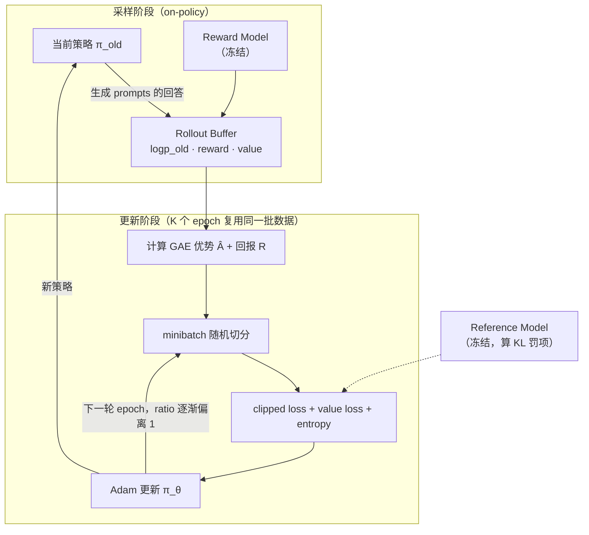
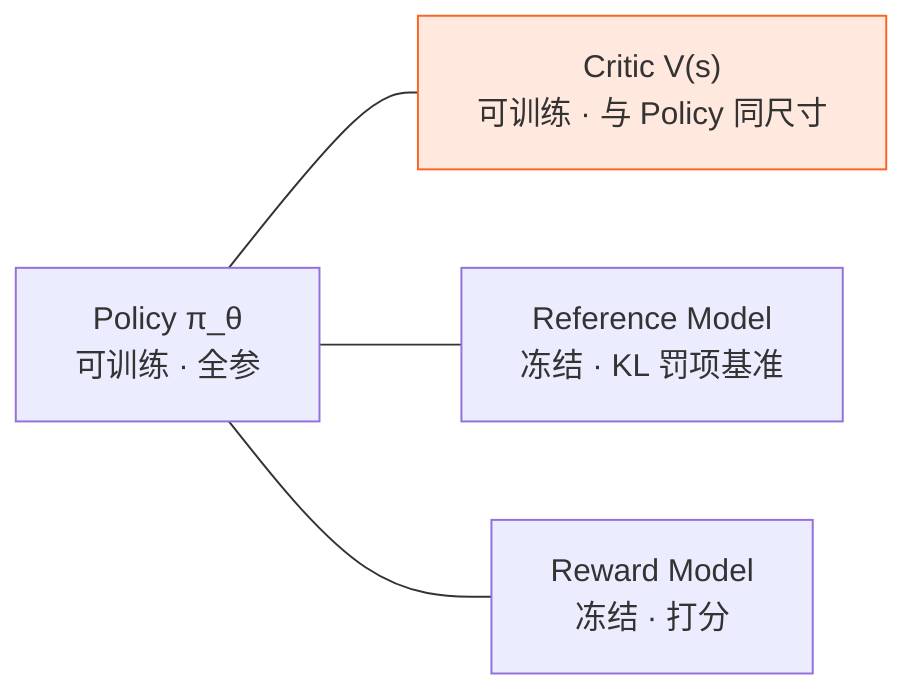

> **TL;DR**
>
> * **PPO 的洞察是：信任域的收益来自"限制步长"，而不是来自精确解**。它把 TRPO 的硬约束优化换成一行 `min(r·A, clip(r, 1±ε)·A)`——当某个动作已经被推得够远（ratio 出界）且方向不变时，**梯度直接归零**。三行 PyTorch 就能实现的"穷人版信任域"，却成了 2017 年之后应用最广的 RL 算法。
> * **GAE 是 PPO 的另一半**：优势函数在实践里只能靠估计，$\hat A_t^{\mathrm{GAE}} = \sum_l (\gamma\lambda)^l \delta_{t+l}$ 用一个参数 $\lambda$ 在"偏差（信 TD）"与"方差（信蒙特卡洛）"之间连续定价。理解 GAE 才能理解为什么 PPO 训得稳。
> * **PPO 统治了 RLHF，也暴露了它的天花板**：policy + critic + reward model + reference model 四个模型同台，critic 与 policy 同尺寸导致显存翻倍——这正是第五篇 GRPO 下手的第一个目标。



---

## 1. 承接：TRPO 的"最后一公里"问题

第三篇结尾留了一个伏笔：TRPO 的收益主要来自"限制步长"这个思想本身，而不是自然梯度的精确性。那么二阶计算（Fisher 矩阵、共轭梯度、HVP）就是纯粹的实现负担：

* 单次更新的计算量数倍于普通梯度法；
* 代码复杂到开源实现之间都能跑出不同结果；
* 与现代深度学习的"标配"冲突：策略和价值网络共享底座时，KL 和 Fisher 的定义都变得含糊。

PPO（Schulman et al., 2017）的设计哲学一句话说完：**保留"别走太远"的灵魂，把肉身换成一阶方法**。它最终只用了两个机制：clipped surrogate objective（管住策略）和 GAE（管住优势估计的质量）。

## 2. Clipped Surrogate Objective：把约束烤进损失里

### 2.1 从 TRPO 的 surrogate 出发

第三篇已经得到带比率的代理目标（比率 $r_t(\theta) = \frac{\pi_\theta(a_t \mid s_t)}{\pi_{\theta_{\mathrm{old}}}(a_t \mid s_t)}$，优势 $\hat A_t$ 按旧策略固定不动）：

$$L^{\mathrm{PG}}(\theta) \;=\; \mathbb{E}_t\big[\, r_t(\theta)\, \hat A_t \,\big]$$

它的毛病：**没有任何东西阻止 $r_t$ 飞走**。若某样本 $\hat A_t > 0$，loss 对 $r_t$ 单调递减，梯度会一直把该动作的概率往上推——推过头的代价（其他动作被挤压、状态分布漂移）这个一阶目标完全看不见。TRPO 用 KL 约束拦住它，PPO 用更粗暴的方式：

$$\boxed{\;L^{\mathrm{CLIP}}(\theta) \;=\; \mathbb{E}_t\Big[\, \min\big(\; r_t(\theta)\, \hat A_t,\;\; \mathrm{clip}\big(r_t(\theta),\, 1-\epsilon,\, 1+\epsilon\big)\; \hat A_t \,\big)\Big]\;}$$

### 2.2 逐格分析：min 和 clip 如何配合

$\epsilon$ 通常取 0.2，即允许 ratio 在 $[0.8, 1.2]$ 内自由移动。分四种情形看目标函数的行为：

| 情形 | ratio 区间 | 目标取值 | 梯度行为 |
|:---|:---|:---|:---|
| $\hat A_t > 0$（好动作） | $r_t < 1+\epsilon$ | $r_t \hat A_t$ | 正常上升该动作概率 |
| $\hat A_t > 0$ | $r_t \ge 1+\epsilon$ | $(1+\epsilon)\hat A_t$（常数） | **梯度为 0：不再奖励过度提升** |
| $\hat A_t < 0$（坏动作） | $r_t > 1-\epsilon$ | $r_t \hat A_t$ | 正常压低该动作概率 |
| $\hat A_t < 0$ | $r_t \le 1-\epsilon$ | $(1-\epsilon)\hat A_t$（常数） | **梯度为 0：不再惩罚过度压低** |

两个细节值得咀嚼：

1. **为什么是 `min`？** 它取的是未裁剪目标与裁剪目标的**悲观下界**。ratio 在界内时两者相同；出界后取常数那一支。这样目标函数是"保守版本"——最大化它绝不会高估真实改进。
2. **clip 是单向闸门，不是对称牢笼**。注意 $r_t$ 出界后如果**往回走**（比如 $\hat A_t > 0$、$r_t > 1+\epsilon$ 时把 $r_t$ 拉回 $1+\epsilon$ 以内），梯度恢复流动。所以 clip 不禁止修正错误，只禁止"在同一个方向上无限加码"。这是它与简单正则化的本质区别。

### 2.3 这凭什么算"信任域"？

严格说，clip 给出的不是 TRPO 那样的硬保证，而是一个经验上有效的**软约束**：ratio 被夹在 $[1-\epsilon, 1+\epsilon]$ 附近，意味着每个样本对策略的推动幅度有界，多轮 epoch 累计下来策略也不会偏离采样点太远。原论文还实验了显式的自适应 KL 惩罚版（KL 超标就加大 $\beta$），结论是 **clip 版更简单也更稳**——又一个"理论有损、实践无敌"的例子。

## 3. GAE：给优势估计精确定价

以上都假设优势 $\hat A_t$ 是白给的。实际上它是估出来的，而且**怎么估直接影响训练稳定性**。

### 3.1 TD 误差：优势的无偏积木

定义 TD 误差：

$$\delta_t \;=\; r_t + \gamma V(s_{t+1}) - V(s_t)$$

对它取期望（$V$ 收敛到 $V^\pi$ 时）：$\mathbb{E}[\delta_t] = Q^\pi(s_t, a_t) - V^\pi(s_t) = A^\pi(s_t, a_t)$。所以**单个 TD 误差是优势的无偏估计**，但它是"一步回看"的——方差小，偏差大（依赖 $V$ 估得准不准）。另一端是蒙特卡洛：整条回报减去基线 $G_t - V(s_t)$，无偏但方差巨大。

### 3.2 k 步估计与 λ 加权

介于两者之间的是 k 步估计：$\hat A_t^{(k)} = \sum_{l=0}^{k-1} \gamma^l \delta_{t+l}$（用 $k$ 步真实奖励，之后全信 $V$）。GAE 把所有 k 步估计做指数加权平均，权重由单一参数 $\lambda$ 控制：

$$\hat A_t^{\mathrm{GAE}(\gamma, \lambda)} \;=\; \sum_{l=0}^{\infty} (\gamma \lambda)^l\, \delta_{t+l}$$

两个极端立刻读出来：

| $\lambda$ | 名称 | 偏差 | 方差 | 适用 |
|:---|:---|:---|:---|:---|
| $0$ | TD(0)：只用 $\delta_t$ | 高（全信 $V$） | 低 | $V$ 很准、环境噪声大 |
| $1$ | 蒙特卡洛：$G_t - V(s_t)$ | 无偏 | 极高 | 回合短、奖励干净 |
| $0.9 \sim 0.99$ | GAE 默认区间 | 可调 | 可调 | 实践甜点 |

一个重要的实践直觉：**$\lambda$ 应该和"值网络的可信度"联动**。训练初期 $V$ 很烂，调高 $\lambda$ 多信真实回报；训练后期 $V$ 变准，调低 $\lambda$ 换方差。LLM RL 里奖励只在句末出现，序列级稀疏奖励让"多信蒙特卡洛"（大 $\lambda$ 甚至 $\lambda = 1$）成为常见选择——第五篇讲 GRPO 时这条会再次出现。

## 4. 完整算法与实现

### 4.1 总目标函数

actor-critic 双头网络，总 loss 三件套（策略 clip 项 + 值函数回归 + 熵奖励）：

$$L(\theta) \;=\; \mathbb{E}_t\Big[\, L_t^{\mathrm{CLIP}}(\theta) \;-\; c_1\, \big(L_t^{VF}(\theta)\big)^2 \;+\; c_2\, S\big[\pi_\theta\big](s_t) \Big]$$

熵项 $S$ 鼓励探索、防止过早确定性塌缩；值函数项让共享底座学出 $V$，供下一轮 GAE 使用。

### 4.2 PyTorch 骨架

```python
import torch
from torch.distributions import Categorical

def ppo_update(policy, opt, batch, clip_eps=0.2, vf_coef=0.5, ent_coef=0.01, epochs=4):
    # batch: 一次 rollout 的全部数据（on-policy 采集，随后复用 epochs 轮）
    obs, act   = batch["obs"], batch["act"]
    old_logp   = batch["logp"].detach()      # 旧策略的 log π(a|s)，全程冻结
    adv        = batch["adv"]                # GAE 优势，已按 batch 归一化
    ret        = batch["ret"]                # GAE 回归目标
    old_value  = batch["value"].detach()

    for _ in range(epochs):                  # ★ 数据复用：REINFORCE 做不到的事
        for idx in iterate_minibatches(len(obs), shuffle=True):
            logits, value = policy(obs[idx])
            dist  = Categorical(logits=logits)
            logp  = dist.log_prob(act[idx])

            ratio = torch.exp(logp - old_logp[idx])          # r_t(θ)
            s1    = ratio * adv[idx]
            s2    = torch.clamp(ratio, 1 - clip_eps, 1 + clip_eps) * adv[idx]
            pi_loss = -torch.min(s1, s2).mean()              # 悲观下界，取负进 loss

            v_clip  = old_value[idx] + torch.clamp(value - old_value[idx],
                                                   -clip_eps, clip_eps)
            vf_loss = 0.5 * torch.max((value - ret[idx]) ** 2,
                                      (v_clip  - ret[idx]) ** 2).mean()  # value 也 clip
            entropy = dist.entropy().mean()

            loss = pi_loss + vf_coef * vf_loss - ent_coef * entropy
            opt.zero_grad(); loss.backward()
            torch.nn.utils.clip_grad_norm_(policy.parameters(), 0.5)  # 梯度也剪一刀
            opt.step()
```

★ 标注的那行是 PPO 相对 REINFORCE 的质变：**同一批数据可以安全地过 3~10 个 epoch**。合法性正是 clip 给的——随着参数更新，ratio 会慢慢偏离 1，一旦某样本出界，它的梯度自动归零，相当于"这份数据对这个样本的贡献已被用尽"。重要性采样的偏差被限制在了 clip 半径之内。

### 4.3 工程坑清单（每一条都对应一类训崩）

| 坑 | 症状 | 对策 |
|:---|:---|:---|
| 优势没归一化 | loss 尺度漂移，学习率失灵 | 每个 minibatch 对 $\hat A$ 做 z-score |
| 忘记 detach 旧 logp/ratio | 反传穿过旧策略图，梯度错 + 显存爆 | `old_logp.detach()`，rollout 时 no_grad |
| value loss 爆炸 | critic 学飞，GAE 全盘污染 | value clipping + 限制 reward 尺度 + $c_1$ 调小 |
| 熵塌缩 | 策略过早确定，探索死亡 | 熵系数 $c_2$、监控熵曲线 |
| KL 无监控 | 数据复用过久，静默 off-policy 化 | 记录 $\bar D_{KL}(\theta_{old}, \theta)$，超阈值提前终止 epoch |
| 学习率恒定 | 后期震荡不收敛 | 线性退火到 0 |

## 5. PPO 统治 RLHF，然后撞墙

InstructGPT（2022）确立了 RLHF 三阶段范式：SFT → 训练奖励模型 → PPO 优化。此后几乎所有对齐工作默认 PPO。但把 PPO 放进 LLM 场景，第三篇以来的所有"贵"都被放大了：



四个模型的账本（以 7B 全参为例，粗略量级）：

| 模型 | 角色 | 显存构成 | 量级 |
|:---|:---|:---|:---|
| Policy | 被优化的语言模型 | 权重 + 梯度 + Adam 状态 | 最重的一块 |
| Critic | 逐 token 价值头 | 与 Policy 同尺寸，同样带优化器状态 | **几乎再翻一倍** |
| Reference | 冻结副本 | 仅权重（推理） | 中等 |
| Reward Model | 冻结打分器 | 仅权重（推理） | 中等 |

除了显存，还有三个 LLM 特有的痛点：

1. **critic 冷启动**：随机初始化的 $V$ 要在"奖励只在句末"的稀疏信号里学会逐 token 打分，训练初期 GAE 信号极脏；
2. **流水线复杂**：rollout 引擎（推理）、policy/critic 训练、ref/RM 推理四种角色来回切换权重，工程框架（veRL 等）一半复杂度在这；
3. **credit assignment 困难**：千 token 序列只有句末一个标量奖励，逐 token 的 critic 优势估计未必比"整条回答一个分数"更有信息量。

第 1、2 条催生了各种 critic 减负方案；而 DeepSeek 在 2024 年干脆问了一句：**既然 baseline 只需要"与动作无关"，为什么还要训练一个和网络本体一样大的 critic？** 组内平均就是现成的 baseline——GRPO 登场，系列收官。

## 6. Takeaway

1. **Clipped surrogate**：$\min\big(r\hat A, \mathrm{clip}(r, 1\pm\epsilon)\hat A\big)$。单向闸门——出界即停梯度，回头即恢复；用悲观下界的思路把信任域装进了三行代码。
2. **GAE**：$\hat A_t = \sum_l (\gamma\lambda)^l \delta_{t+l}$，$\lambda$ 是偏差-方差的定价旋钮；$\lambda$ 该跟着"值网络可信度"走，稀疏奖励场景偏向大 $\lambda$。
3. **数据复用的合法性来自 clip**：ratio 出界的样本梯度归零，天然限制了重要性采样的偏差累积。
4. **PPO 在 LLM 上的账单**：critic 显存翻倍、冷启动困难、四模型流水线昂贵——这三张欠条，下一篇由 GRPO 来还。

**下一篇预告**：GRPO 将同时兑现本系列的三大暗线——用组内统计替代 critic（第二篇的 baseline 战争）、保留 clip（第四篇）、保留对 ref model 的 KL（第三篇的信任域余晖）。以及最重要的：它为什么恰好适配"答案对不对"这种规则奖励（RLVR）。

---

**系列导航**

1. [从 MDP 到 GRPO（一）：强化学习的地基——MDP、贝尔曼方程与值函数](/2026/08/21/mdp-to-grpo-01-mdp-bellman-foundation/)
2. [从 MDP 到 GRPO（二）：策略梯度——REINFORCE 与方差的战争](/2026/08/21/mdp-to-grpo-02-policy-gradient-reinforce/)
3. [从 MDP 到 GRPO（三）：TRPO——信任域，让更新别摔死](/2026/08/21/mdp-to-grpo-03-trpo-trust-region/)
4. **从 MDP 到 GRPO（四）：PPO——用一阶方法驯服策略更新**（本篇）
5. [从 MDP 到 GRPO（五）：GRPO——组相对优势与大模型时代的 RL](/2026/08/21/mdp-to-grpo-05-grpo-group-relative/)

**参考与延伸阅读**

* Schulman et al., "Proximal Policy Optimization Algorithms" (arXiv:1707.06347) —— 本篇主角，全文仅 8 页
* Schulman et al., "High-Dimensional Continuous Control Using Generalized Advantage Estimation" (arXiv:1506.02438) —— GAE 的偏差-方差分析
* Ouyang et al., "Training language models to follow instructions with human feedback" (arXiv:2203.02155) —— InstructGPT，PPO 进驻 RLHF 的标志
* Engstrom et al., "Implementation Matters in Deep RL: A Case Study on PPO and TRPO" (ICLR 2020) —— 证明 PPO≈TRPO+若干实现细节，"实现细节考古"必读
* veRL (ByteDance) / OpenRLHF 文档 —— LLM 场景下 PPO 的工程形态
