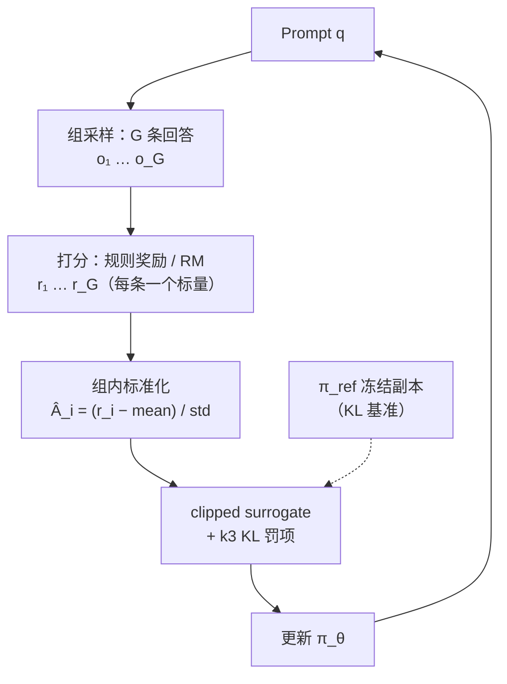

> **TL;DR**
>
> * **GRPO 不是新算法，而是本系列三条老暗线的会师**：用"同一道题采 $G$ 条回答、组内减均值除标准差"替代 critic（第二篇的 baseline 战争，$\bar r$ 与动作无关所以期望不变），保留 PPO 的 clip（第四篇），保留对 reference model 的 KL 罚项（第三篇信任域的余晖）。DeepSeekMath 论文里它就叫 "Group Relative Policy Optimization"——**名字里写满了它的出身**。
> * **它赢在工程账而非理论创新**：LLM 场景下 critic 与 policy 同尺寸，显存直接翻倍；而"答案对不对"这种 outcome reward 天然适合按题分组打分——baseline 免费拿，critic 整个砍掉。这个匹配正是 RLVR（可验证奖励）时代 GRPO 成为事实标准的原因。
> * **它也有欠条**：std 归一化引入题目难度偏差、token 级平均引入长度偏差（Dr.GRPO 的批评）、clip 高估低概率 token（DAPO 的 clip-higher）、token 级 ratio 噪声（GSPO 的序列级修正）。2025-2026 的 GRPO 变体大战，本质是这些欠条的分期偿还。



---

## 1. 地形：LLM 里的 RL 长什么样

第一篇第 9 节给过那张映射表，这里把它和第四篇的三张欠条放在一起，就是 GRPO 的全部动机：

| LLM RL 的现实 | 后果 |
|:---|:---|
| 动作空间 = 词表（约 10 万维），一条轨迹几百到几千步 | 策略网络本身就是那个大模型 |
| 奖励只在句末（答案对不对/格式对不对） | credit assignment 极难，逐 token critic 学不到多少额外信息 |
| 采样贵（一次 rollout = 完整解码） | on-policy 数据必须复用 → 需要 PPO 式的比率机制 |
| **critic 与 policy 同尺寸** | 显存翻倍、优化器状态翻倍、流水线更复杂 |

第四篇结尾的三张欠条——critic 显存、冷启动、四模型流水线——前两张都指向同一个器官：**value network**。GRPO 的手术刀就落在这里。

## 2. 推导：从 PPO 到 GRPO 只有两步

### 2.1 第一步：把优势换成"组内相对分"

PPO 的目标是 $\min(r_t \hat A_t,\, \mathrm{clip}(r_t, 1\pm\epsilon)\hat A_t)$ 的期望，其中优势靠 critic + GAE 逐 token 估计。GRPO 问：**这个 $\hat A$ 能不能不学？**

回忆第二篇的 baseline 定理：任何与动作无关的量都可以从优势里减掉而不改变梯度期望。那么对一个 prompt $q$，采样一组 $G$ 条回答 $\{o_1, \ldots, o_G\}$，各自拿到奖励 $r_1, \ldots, r_G$——**组内均值 $\mathrm{mean}(\mathbf r)$ 就是一个现成的、免训练的 baseline**：它与"某条回答里的某个 token"显然无关。

再顺手做尺度归一化（对应第二篇的回报标准化），得到 GRPO 的优势定义：

$$\hat A_{i,t} \;=\; \tilde r_i \;=\; \frac{r_i - \mathrm{mean}(\mathbf r)}{\mathrm{std}(\mathbf r)} \qquad \text{对回答 } o_i \text{ 中的所有 } t \text{ 相同}$$

注意两个设计决定：

1. **整条回答共享一个优势**（outcome supervision 版）：句末的一个标量奖励，平摊给这条回答的每个 token。没有 critic 的逐 token 细粒度，但也没有 critic 的冷启动噪声；
2. **信号完全来自组内对比**：一道题如果 $G$ 条回答全对或全错，$\mathrm{std} = 0$，这组数据梯度为零——GRPO 天然只从"有分歧"的题目里学习。

### 2.2 第二步：套上 PPO 的壳

把 $\hat A_{i,t}$ 代回 clipped surrogate，加上 reference model 的 KL 罚项，就是完整的 GRPO 目标：

$$J_{\mathrm{GRPO}}(\theta) \;=\; \mathbb{E}\left[\; \frac{1}{G} \sum_{i=1}^{G} \frac{1}{\lvert o_i \rvert} \sum_{t=1}^{\lvert o_i \rvert} \Big( \min\big[\, r_{i,t}(\theta)\, \hat A_{i,t},\; \mathrm{clip}\big(r_{i,t}(\theta),\, 1-\epsilon,\, 1+\epsilon\big)\, \hat A_{i,t} \,\big] \;-\; \beta\, D_{\mathrm{KL}}\big[\pi_\theta \,\|\, \pi_{\mathrm{ref}}\big] \Big) \right]$$

其中 token 级比率原封不动继承自 PPO：

$$r_{i,t}(\theta) \;=\; \frac{\pi_\theta(o_{i,t} \mid q,\, o_{i,<t})}{\pi_{\theta_{\mathrm{old}}}(o_{i,t} \mid q,\, o_{i,<t})}$$

对照检查本系列的三大暗线：**clip 在**（第四篇）、**组内 baseline 在**（第二篇）、**KL 罚项在**（第三篇）。GRPO 的全部新颖性就是那个 $\tilde r_i$——但正如系列一路展示的，找到"哪个部件可以换掉"恰恰需要理解每个部件为什么在那里。

## 3. KL 项的细节：k3 无偏估计器

GRPO 保留 $\pi_{\mathrm{ref}}$ 有两层用意：一是第三篇说的"别离初始能力太远"（防 reward hacking、防语言能力崩坏），二是实践中它兼任正则项——KL 以逐 token 的方式加进目标，相当于每生成一个 token 都付一点"偏离税"，抑制答案突然变长的投机策略。

但两个分布的 KL 没法精确算（需要对整个词表求和），只能蒙特卡洛估计。常用三种估计器（记 $u = \log \frac{\pi_{\mathrm{ref}}}{\pi_\theta}$）：

| 估计器 | 表达式 | 问题 |
|:---|:---|:---|
| k1 | $-u$ | 单样本期望等于 KL，但**取值可为负**，做罚项会出现"负税" |
| k2 | $\frac{1}{2} u^2$ | 恒非负，但期望是 KL 的二阶近似，**系统性低估** |
| k3（GRPO 采用） | $e^{u} - u - 1$ | **无偏且恒非负**，凸性保证方差性质良好 |

k3 的验证只要一行泰勒展开：$e^u - u - 1 = \frac{u^2}{2} + \frac{u^3}{6} + \cdots$，而 $\mathbb{E}[u] + \frac{1}{2}\mathbb{E}[u^2] + \cdots$ 恰好重组出 $\mathbb{E}[e^u] - \mathbb{E}[u] - 1 = D_{KL} - 0 - 1 + 1$……严格证明见 Schulman 博客 "Approximating KL Divergence"（2016），结论：**k3 对任意样本非负、期望恰为真 KL**。这是"逐 token 可算 + 数值稳定"的最优折中，后来几乎所有 GRPO 变体都沿用了它。

## 4. 两种监督粒度：Outcome vs Process

DeepSeekMath 给了两种变体，区别只在 $\hat A$ 怎么填：

| | Outcome Supervision GRPO | Process Supervision GRPO |
|:---|:---|:---|
| 奖励来源 | 结果奖励模型（ORM），每条回答一个分 | 过程奖励模型（PRM），每步一个分 |
| 优势填充 | 整条回答共享 $\tilde r_i$ | 每步分数减去该步组内均值后归一化 |
| 特点 | 简单、稀疏 | 信号密、但 PRM 本身要训，且易被 hack |

实践主流是 outcome 版——尤其当奖励可以由**规则**给出时。

## 5. RLVR：GRPO 与 DeepSeek-R1 的互相成就

R1-Zero 的实验把这套机器推到了极致：**完全不要奖励模型，奖励全部来自规则**（accuracy：答案抽取后比对；format：强制 think/answer 标签），直接在 base 模型上做纯 RL。这就是 **RLVR（Reinforcement Learning with Verifiable Rewards）**——数学题有标准答案、代码能跑测试、格式能用正则查，验证器即奖励。

报告里最著名的现象是 **aha moment**：训练中途模型自发学会在长思考中自我怀疑和回头重推（"wait, wait, wait..."），平均回答长度随反思行为自然增长。这不是 prompt 出来的，是"答对才给分"的压力下涌现的策略改进——用第一篇的语言说：策略在巨大的动作空间里找到了提高期望回报的新模式。

同时也暴露了纯 outcome reward 的脆弱性：R1-Zero 出现中英混杂，最终 R1 不得不往奖励里加回语言一致性项。**奖励即目标**——规则奖励定义的目标函数有任何缝隙，策略都会钻进去，这是 RLVR 的基本纪律。

## 6. 批判与演进：GRPO 的欠条清单

GRPO 成名之后，2025-2026 出现了一整族修正。挑四个最有代表性的：

| 变体 | 修的问题 | 核心改动 |
|:---|:---|:---|
| **Dr.GRPO** | ① 除以 $\mathrm{std}$ 引入难度偏差：越难的题组内方差越大，优势被系统性压小，模型学会"挑软柿子"；② $\frac{1}{\lvert o_i\rvert}$ 的 token 平均让错误的长回答单 token 惩罚更轻，变相鼓励废话 | 去掉 std 归一化、去掉长度归一化（回到常数除数） |
| **DAPO** | ① clip 对低概率 token 过狠：好答案里的罕见词一旦概率抬过 $1+\epsilon$ 就断粮，探索枯竭；② 全对/全错组浪费算力 | clip-higher（上界放宽为 $1+\epsilon_{high}$）、动态采样（过滤零方差组）、token 级 loss、超长惩罚塑形 |
| **GSPO** | token 级 ratio 逐点噪声大，MoE 上尤甚 | 序列级比率（几何平均），clip 作用在整条回答上 |
| **RLOO / ReMax** | GRPO 还是太复杂（clip + KL 都可以不要） | 回到第二篇的 REINFORCE with baseline：留一作 baseline，极简复活 |

值得停下来体会的是 Dr.GRPO 的批评：**"减均值除标准差"这个看似无害的统计操作，本身就在改写优化目标**——它隐含假设了"每道题的重要性应该与其难度成反比"。第二篇说过 batch 统计量是有偏的方差缩减，这里是一个放大版教训：**baseline 必须与动作无关，但"怎么归一化"依然是一门手艺**。

## 7. 工程视角：GRPO 系统的真实形态

算法只占 LLM RL 工程量的一半，另一半在系统侧。一套典型 GRPO 训练集群的数据流：

```
                    ┌────────────────────────────────────────┐
                    │           Hybrid Controller            │
                    └──────┬───────────────────┬─────────────┘
        权重同步（每步）     │                   │  生成请求（batch prompts）
                ┌──────────▼─────────┐  ┌──────▼───────────────┐
                │  Trainer（FSDP /   │  │  Rollout 引擎         │
                │  Megatron 并行）    │  │  （vLLM / SGLang）    │
                │  π_θ 训练 + 优化器  │  │  大 batch 解码 G×N 条  │
                └──────────▲─────────┘  └──────┬───────────────┘
                           │    轨迹 + logp     │
                ┌──────────┴───────────────────▼───────────────┐
                │  Reward（规则验证器 / RM）＋ Reference 打分     │
                └──────────────────────────────────────────────┘
```

几个决定成败的工程点：

1. **Rollout 引擎就是推理引擎**。vLLM/SGLang 的 continuous batching、prefix caching（同题 $G$ 条回答共享 prompt KV cache）直接决定吞吐——这也是推理部署经验和 RL 训练经验高度互通的地方；
2. **权重同步是隐藏大头**。训练侧（FSDP/Megatron 分片）与推理侧（vLLM worker）的参数布局完全不同，每一步都要 reshard + 广播；同步策略（同步/异步、部分滚动更新）是 veRL、AReal 这类框架的核心卖点；
3. **异步化是趋势**：严格 on-policy 要求"采完这一批再更新"，但训练等解码、解码等权重的串行气泡极大；允许轻微 off-policy 的异步 rollout 用第四篇的知识就能分析——ratio 偏离被 clip 兜住，代价可控；
4. **监控面板**：reward 均值/方差、response 长度分布、熵、组内通过率分布、KL——其中"组内全对/全错比例"直接告诉你有多少算力在做无用功（DAPO 动态采样针对的就是它）。

## 8. 全系列总结：从贝尔曼到组相对优势

回头看这条链，每一步都是"解决上一代的具体痛点，同时留下新的欠条"：

| 阶段 | 解决的问题 | 留下的欠条 |
|:---|:---|:---|
| MDP / 贝尔曼（第一篇） | 把"长期决策"变成可递归计算的数学对象 | 表格法撑不住真实世界 |
| 策略梯度 / REINFORCE（第二篇） | 免模型、直接微分策略，支持随机策略 | 方差爆炸、数据一次性 |
| TRPO（第三篇） | 更新稳定性：KL 信任域 + 单调性保证 | 二阶计算昂贵、实现复杂 |
| PPO（第四篇） | 一阶化信任域：clip + GAE + 数据复用 | LLM 场景 critic 太贵、四模型流水线 |
| GRPO（第五篇） | 砍掉 critic：组内统计当 baseline，贴合 RLVR | 难度/长度偏差、超参敏感、变体混战 |

而 GRPO 本体，用一句话收束全系列：

$$\text{GRPO} \;=\; \underbrace{\text{REINFORCE with baseline}}_{\text{第二篇：组均值就是 baseline}} \;+\; \underbrace{\text{PPO clip}}_{\text{第四篇：限制步长}} \;+\; \underbrace{\beta \cdot D_{KL}(\pi_\theta \| \pi_{ref})}_{\text{第三篇：信任域余晖}}$$

七十年从贝尔曼方程走到这里，变的只是"哪些部件用学习来换、哪些用统计来省"。

## 9. Takeaway

1. **GRPO 的本质**：$\hat A_{i,t} = \frac{r_i - \mathrm{mean}(\mathbf r)}{\mathrm{std}(\mathbf r)}$ 替代 critic + GAE。合法性来自第二篇 baseline 定理（均值与动作无关），经济性来自"outcome reward 天然按题分组"。
2. **KL 罚项用 k3 估计器**（$e^u - u - 1$，无偏恒正），reference model 同时扮演信任域锚点和逐 token 正则。
3. **RLVR 是 GRPO 的最佳拍档**：可验证奖励天然产出组内分数，R1-Zero 证明了纯规则奖励能涌现反思行为——但奖励缝隙必被钻空。
4. **变体大战的读法**：Dr.GRPO 修归一化偏差、DAPO 修探索与算力浪费、GSPO 修 ratio 噪声——每一篇都在偿还"统计替代学习"欠下的债。判断新变体的标准不是论文曲线，而是它明确指认并修复了哪条欠条。

**系列完结**。从下一篇开始，可以带着这张地图去读 DAPO、GSPO、VAPO 或任何 2026 年的新算法论文——你会发现它们全部站在本系列画好的坐标系里。

---

**系列导航**

1. [从 MDP 到 GRPO（一）：强化学习的地基——MDP、贝尔曼方程与值函数](/2026/08/21/mdp-to-grpo-01-mdp-bellman-foundation/)
2. [从 MDP 到 GRPO（二）：策略梯度——REINFORCE 与方差的战争](/2026/08/21/mdp-to-grpo-02-policy-gradient-reinforce/)
3. [从 MDP 到 GRPO（三）：TRPO——信任域，让更新别摔死](/2026/08/21/mdp-to-grpo-03-trpo-trust-region/)
4. [从 MDP 到 GRPO（四）：PPO——用一阶方法驯服策略更新](/2026/08/21/mdp-to-grpo-04-ppo-clipped-surrogate/)
5. **从 MDP 到 GRPO（五）：GRPO——组相对优势与大模型时代的 RL**（本篇，完结）

**参考与延伸阅读**

* Shao et al., "DeepSeekMath: Pushing the Limits of Mathematical Reasoning in Open Language Models" (arXiv:2402.03300) —— GRPO 原始出处，第 4 节推导与本篇第 2-3 节对应
* DeepSeek-AI, "DeepSeek-R1: Incentivizing Reasoning Capability in LLMs via Reinforcement Learning" (arXiv:2501.12948) —— R1-Zero、aha moment、RLVR
* Liu et al., "Understanding R1-Zero-Like Training: A Critical Perspective" (arXiv:2503.20783) —— Dr.GRPO，对 std/长度归一化的批判
* Yu et al., "DAPO: An Open-Source LLM RL System at Scale" (arXiv:2503.14476) —— clip-higher、动态采样
* Zheng et al., "Group Sequence Policy Optimization" (arXiv:2507.18071) —— GSPO，序列级比率
* Ahmadian et al., "Back to Basics: Revisiting REINFORCE-style Optimization" (arXiv:2402.14740) —— RLOO，极简路线
* Schulman, "Approximating KL Divergence" (blog, 2016) —— k1/k2/k3 估计器的原始分析
* veRL (ByteDance)、AReal、OpenRLHF —— hybrid engine 与异步 rollout 的工程实现
