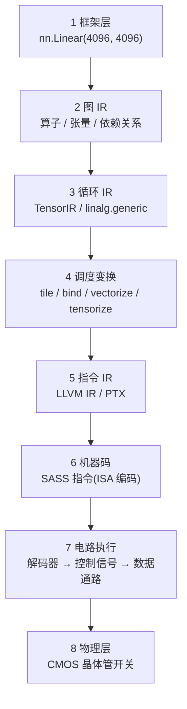
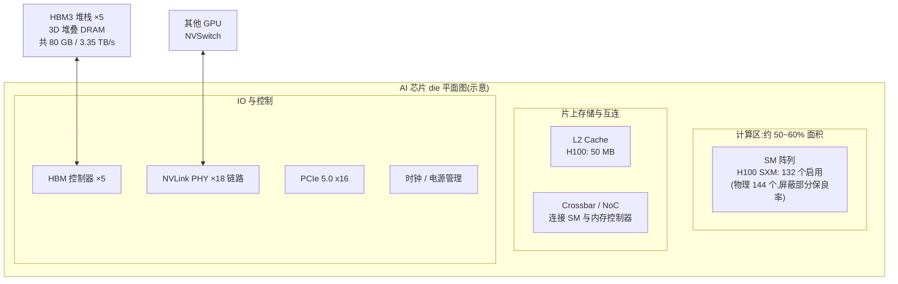
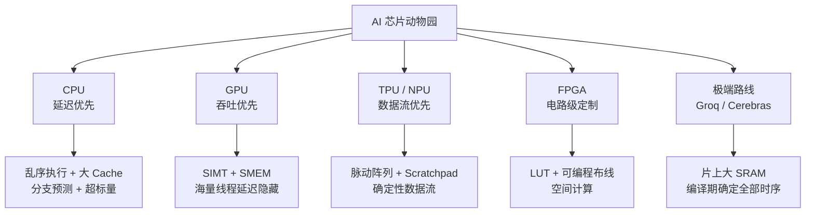
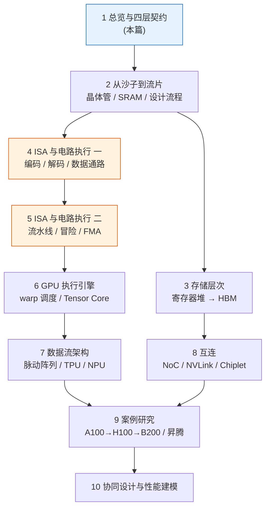

> **TL;DR**
>
> * **这是「给 AI 编译器工程师的芯片课」系列的第一篇**。你已经在 TVM/MLIR/Triton 里写过 schedule、调过 tile、看过 PTX,但有没有想过:schedule 原语到底作用在什么物理实体上?为什么 shared memory 是 164 KB 而不是 1 GB?为什么一条 FMA 的延迟恰好是 4 个周期?为什么 Tensor Core 的形状是 16×8×16?这些问题的答案不在编译器论文里,而在电路里。
> * **一个核心观点**:编译器几乎不改变计算量,它改变的是**数据移动的距离**和**等待的时间**。而"距离"和"时间"由芯片的物理结构决定--所以芯片知识不是编译器工程师的选修课,是地基。
> * **本篇任务**:建立全系列的心智模型--**完整抽象栈 → 芯片解剖图 → 四层契约 → PPA 物理三角 → 芯片动物园**。后续九篇就是把这张图逐层放大。

---

## 1. 为什么编译器工程师必须懂芯片

先看一张表。左列是你在 TVM/Triton 里每天写的东西,右列是它们真正作用的物理实体:

| 你写过的 Schedule / 代码 | 作用的物理实体 | 背后的物理约束 | 详见本系列 |
|:---|:---|:---|:---|
| `split` / tiling | Shared Memory(一块 6T SRAM macro) | SRAM 每比特约 6 个晶体管,片上面积预算有限 | 02 / 03 |
| `cache_read`(global→shared) | LSU、`cp.async`、TMA 异步硬件队列 | HBM 带宽、L2 bank 端口数 | 03 / 06 |
| `vectorize` | SIMD 数据通路 + 向量加载指令 | 寄存器堆读端口数、ALU 位宽 | 04 |
| `bind(threadIdx.x)` | warp 调度器 + SIMT 执行 lane | 每周期指令发射宽度 | 06 |
| `tensorize` | Tensor Core 的 MAC 阵列 | 阵列规模、流水线深度、累加精度 | 06 / 07 |
| `unroll` + `reorder` | 指令调度窗口、流水线填充 | 流水线深度、寄存器数量、冒险 | 05 / 06 |
| double buffering | SMEM 双 buffer + 异步 DMA | SMEM 容量 ×2、同步原语成本 | 06 |

> 💡 **关键认知**:编译器优化的本质是**把计算映射到物理资源上**。tile size 选 64 还是 128,本质上是在问"这块 SRAM macro 有多大、读端口有几个";要不要 double buffer,本质上是在问"SMEM 容量够不够换延迟隐藏"。**不懂芯片的编译器工程师,只能背调优经验;懂了芯片,才能推导出调优经验。**

## 2. 从 PyTorch 一行代码到晶体管开关:完整抽象栈

你在 Python 里写 `nn.Linear(4096, 4096)`,到硅片上几十亿个晶体管改变开关状态,中间要经过八层抽象:



每一层抽象都在做同一件事:**保留编译下一步需要的信息,丢弃其余**。

| 层 | 保留的信息 | 丢弃的信息 | 芯片侧对应物 |
|:---|:---|:---|:---|
| 1 框架层 | 数学语义(Y = XW+b) | 一切执行细节 | -- |
| 2 图 IR | 算子类型、shape、依赖 | 循环结构 | 整颗芯片的粗粒度分工 |
| 3 循环 IR | 循环嵌套、buffer 访存模式 | 具体指令 | SM / 计算单元的粒度 |
| 4 调度 | 并行策略、数据复用方式 | 指令序列 | SMEM 容量、warp 数量 |
| 5 指令 IR | 寄存器级操作 | 电路时序 | ISA(指令集架构) |
| 6 机器码 | ISA 编码 | -- | 解码器的输入 |
| 7 电路执行 | 控制信号、数据流 | -- | 数据通路、流水线 |
| 8 物理层 | -- | -- | CMOS 晶体管 |

> 💡 **ISA 是软硬件的分界线**:56 层的 ISA(如 PTX/SASS)是**编译器可见的最后 abstraction**;78 层(微架构与电路)对编译器不可见,却决定了 ISA 的每一个行为特征(延迟、吞吐、约束)。**本系列的核心任务,就是把 78 层打开给你看。**

## 3. 解剖一颗 AI 芯片

以 H100 级别的数据中心 GPU 为例,一颗 die 上大致分布着四类东西:



以晶体管预算来看(数字来自官方白皮书,B200 为公开报道口径):

| 芯片 | 晶体管 | 制程 | SM | L2 | HBM | 片间带宽 |
|:---|:---|:---|:---|:---|:---|:---|
| A100 (2020) | 542 亿 | TSMC 7nm | 108 | 40 MB | HBM2e 80 GB / 2.04 TB/s | NVLink3 600 GB/s |
| H100 SXM (2022) | 800 亿 | TSMC 4N | 132 / 物理 144 | 50 MB | HBM3 80 GB / 3.35 TB/s | NVLink4 900 GB/s |
| B200 (2024) | 2080 亿(双 die) | TSMC 4NP | 两个 compute die | -- | HBM3e 192 GB / ~8 TB/s | NVLink5 1.8 TB/s |

> 注:B200 为双 die 封装(chiplet),参数以 NVIDIA 官方发布为准;表中数字为量级参考,发布前建议核对最新 datasheet。

几个值得记住的比例感:

* **计算区占 die 面积一半以上**--这就是为什么"算力便宜、带宽贵"。
* **L2 只有几十 MB**--因为片上 SRAM 每比特 6 个晶体管,50 MB L2 的晶体管开销已经以十亿计。
* **HBM 在 die 旁边而非 die 上面**--DRAM 工艺和逻辑工艺不兼容,只能封装级组合(2.5D CoWoS),这是第 08 篇的主题。

## 4. 四层契约:芯片递给编译器的"API"

编译器要为一块芯片生成代码,双方必须约定四层接口(我们在[《AI 编译器工程实战问答》](../engineering_field_guide/ai_compiler_engineering_qa.md)里从软件视角讲过,本系列补上硬件视角的"为什么"):

### Layer 1:计算原语--"你能算什么"

芯片能执行的原子操作集合:标量 `add/mul/fma`、向量 SIMD、矩阵 `mma`、特殊函数 `exp/rsqrt`。

**为什么 AI 芯片的原子操作是 FMA(乘加)?** 因为神经网络的计算量 95% 以上是矩阵乘,矩阵乘的原子操作是 \(a \times b + c\)。把"乘+加"融合成一条指令、一个电路单元,晶体管效率和数值精度(中间不落寄存器、不舍入)都最优。第 05 篇会拆开 FMA 单元的电路看它如何流水化。

**为什么数据类型有 FP32/TF32/FP16/BF16/FP8/INT8 这么多?** 因为乘法器面积大约随位宽平方增长--FP8 乘法器面积约为 FP16 的 1/4,同面积下吞吐翻 4 倍。数据类型谱系本质上是**精度-面积-带宽的交换曲线**(FP16 带宽减半、FP8 再减半,这正是 LLM 推理量化的物理动机)。

### Layer 2:内存层次--"数据放哪多快"

| 层级 | A100 容量 | 延迟(量级) | 带宽(全片聚合) | 物理实现 |
|:---|:---|:---|:---|:---|
| Register File | 256 KB/SM | ~0-1 cycle | 数十 TB/s | 多端口 SRAM |
| Shared Memory / L1 | 164 KB/SM(可配置) | ~20-30 cycle | ~19 TB/s | 6T SRAM macro |
| L2 Cache | 40 MB | ~200 cycle | ~4-5 TB/s | SRAM 阵列 |
| HBM2e | 40/80 GB | ~400-800 cycle | 2.04 TB/s | 3D 堆叠 DRAM |

**带宽逐层上升、容量逐层下降**,这不是设计品味,是物理定律:SRAM 快但贵(6T/bit),DRAM 便宜但慢(1T1C + 电容充放电 + 必须刷新)。编译器全部内存优化的目标可以压缩成一句话:**让数据在被计算消费时,离计算单元尽量近**。第 03 篇逐层拆解。

### Layer 3:执行模型--"怎么并行"

同一份 matmul,GPU 用 SIMT(成千上万线程走同一指令流),TPU 用脉动阵列(数据在 MAC 阵列中波浪式流动),CPU 用乱序超标量。执行模型决定了编译器调度空间的**形状**:

* SIMT → 编译器要管 tiling + 线程映射 + 同步
* 脉动阵列 → 编译器要管数据布局 + 时间节拍(几乎"编程"的是数据流)
* 乱序 CPU → 编译器只管生成合理的指令流,硬件自己调度

第 06、07 篇分别展开。

### Layer 4:运行时接口--"怎么加载执行"

Kernel launch(gridDim/blockDim)、内存分配、Stream/Queue 异步语义、二进制格式(cubin/自定义)。这一层最"软",但 launch 开销(~3-8 μs)和异步语义直接决定了 CUDA Graph、continuous batching 这类系统级优化的存在。

### 契约填错的代价

| 填错的参数 | 后果 |
|:---|:---|
| SMEM 容量填大 | 生成的 kernel 加载即失败,或 fallback 到 global memory,性能崩盘 |
| warp 大小填错(32 vs 64) | 向量化访存错位,带宽利用率掉一半 |
| FMA 延迟填错 | 软件流水排错拍,流水线断流,性能掉 30%+ |
| 带宽填错 | cost model 全错,autotuning 选中"理论上最优实际最慢"的调度 |

## 5. 物理底座:频率、面积、功耗三角

四层契约不是凭空设计的,它们都被同一个三角约束:**PPA(Performance-Power-Area)**。

### 5.1 功耗公式:一切的起点

CMOS 电路的总功耗:

$$P_{total} = \underbrace{\alpha C V^2 f}_{\text{动态功耗}} + \underbrace{I_{leak} V}_{\text{静态漏电}}$$

**变量映射表**:

| 符号 | 含义 | 直觉 |
|:---:|:---|:---|
| \(\alpha\) | 活动因子 | 平均每周期发生翻转的门占比 |
| \(C\) | 负载电容 | 被驱动导线的总电容 |
| \(V\) | 电源电压 | -- |
| \(f\) | 时钟频率 | 每秒翻转节拍 |
| \(I_{leak}\) | 漏电流 | 晶体管关不干净的漏电 |

**推导直觉**(第 02 篇从电路层面重推一遍):给电容 \(C\) 充电到电压 \(V\),电源付出能量 \(CV^2\),一半存在电容里、一半在导通管上烧掉;放电时存储的一半也烧掉。所以每个 0↔1 翻转消耗 \(CV^2\),每秒翻转 \(\alpha f\) 次,即 \(P = \alpha CV^2 f\)。

这个公式解释了 AI 芯片史上的几乎所有大事:

* **\(V\) 不能无限降**(阈值电压有下限,再降漏电指数上升)→ **Dennard Scaling 在 ~2005 年终结**,频率停在 GHz 量级(Pentium 4 时代 ~3.8 GHz,20 年后的今天 boost 也不过 2-4 GHz)。
* 晶体管密度还在涨(摩尔定律惯性)→ **多出来的晶体管开不满**(dark silicon)→ 只能堆成并行结构:多核 → GPU → 领域专用架构(DSA)。
* 功耗封顶(A100 400W → H100 700W → B200 ~1000W)→ **算力增长必须靠"每瓦每毫米的效率"** → Tensor Core、FP8、脉动阵列都是这个压力的产物。

### 5.2 算力公式与内存墙

芯片峰值算力可以分解为:

$$\text{FLOPS} = \underbrace{\text{计算单元数}}_{\text{面积}} \times \underbrace{f}_{\text{频率}} \times \underbrace{\text{每周期每单元 FLOPs}}_{\text{并行度}}$$

A100 FP16 Tensor Core:432 个 TC × 1.41 GHz × 每 TC 每周期 512 FLOP(16×8×16×2/4 周期流水)≈ 312 TFLOPS。三个因子中,频率被功耗锁死,面积被良率锁死,**唯一能大幅提升的是并行度**--这就是为什么每代硬件都在加宽 MAC 阵列、加新数据类型。

而带宽的增长远慢于算力:

$$\text{Roofline 拐点} = \frac{\text{峰值算力}}{\text{带宽}} \quad \Rightarrow \quad \begin{cases} \text{A100 FP32: } 19.5/2.04 \approx 9.6 \text{ FLOPs/byte} \\ \text{A100 FP16 TC: } 312/2.04 \approx 153 \text{ FLOPs/byte} \\ \text{H100 FP16 TC: } 989.5/3.35 \approx 295 \text{ FLOPs/byte} \end{cases}$$

拐点一代比一代高,意味着**模型必须表现出更高的计算强度才能喂饱算力**--这正是算子融合、FlashAttention、tiling 这些编译器技术存在的根本理由。这个"内存墙"从 1995 年(Wulf & McKee)喊到今天,只会越来越陡。

## 6. 芯片动物园:按架构哲学分类

所有 AI 芯片可以按“如何对待延迟与吞吐”分成几大流派。无论你是在用 [Triton](https://triton-lang.org/) 写 kernel、在 [TVM](https://tvm.apache.org/docs/) 里调 schedule、还是在给 [MLIR](https://mlir.llvm.org/) 写 lowering，先看清目标硬件属于哪个流派，编译策略会完全不同：



| 流派 | 代表 | 存储哲学 | 执行哲学 | 编译器栈 | 关键编译问题 |
|:---|:---|:---|:---|:---|:---|
| CPU | x86 / ARM / 鲲鹏 | 硬件管理多级 Cache | 乱序、分支预测 | LLVM + Autovectorizer | 向量化对齐、cache blocking |
| GPU | NVIDIA / AMD / 摩尔线程 | SMEM 软件管理 + L2 硬件 | SIMT、延迟隐藏 | Triton / TVM / TensorRT | tiling、occupancy、融合、异步拷贝 |
| TPU/NPU | TPU / 昇腾 / 寒武纪 | Scratchpad(无硬件 Cache 或很少) | 数据流 / 脉动 | XLA / 厂商工具链(CANN 等) | 布局、padding、对齐到阵列尺寸 |
| FPGA | Xilinx / Altera | 片上 BRAM 自由分配 | 空间并行电路 | HLS(Vitis 等) | 数据流综合、流水线 initiation interval |
| 极端路线 | Groq LPU / Cerebras WSE | 全片 SRAM(230 MB / 44 GB) | 确定性调度 / 晶圆级 | 自研全栈编译器 | 编译期排布每个周期每条线 |

**一个统一的视角**:从 CPU 到 Groq,硬件对"执行时序"的承诺越来越强,**编译器的责任越来越大**--CPU 硬件自己调度(编译器轻松、性能不可预测),Groq 编译器排布每个周期(编译器极重、性能完全确定)。**AI 编译器的复杂度,本质上是把调度责任从硬件转移到软件的代价。**

## 7. 本系列地图



三条阅读主线:

* **电路线**(2345):从晶体管到流水线,回答"指令如何变成开关";
* **架构线**(678):从 GPU 到数据流芯片到互连,回答"并行如何组织";
* **系统线**(910):从真实芯片到协同设计,回答"编译器和芯片如何互相成就"。

## 8. 小结、局限与动手实验

**本篇的局限**:die 解剖图和晶体管预算是量级示意,同一代产品不同 SKU 的具体数字以官方 datasheet 为准;四层契约的划分是教学抽象,真实工具链(如 NVIDIA 的 ptxas 与驱动栈)边界更模糊。

**本篇带走三句话**:

1. 编译器的每个优化决策都是对芯片物理资源的一次映射,schedule 原语 ↔ 电路实体一一对应。
2. 芯片递给编译器的 API 是四层契约:计算原语、内存层次、执行模型、运行时接口。
3. PPA 三角(尤其功耗墙)是所有架构决策的物理起点;内存墙是所有编译器优化的存在理由。

### 动手实验(Lab)

读者可以自己跑以下三个小实验验证本篇观点(每个不超过 20 行代码):

```python
# 环境:任意 PyTorch + CUDA;无 GPU 也可读输出字段含义
import torch
p = torch.cuda.get_device_properties(0)
print(p)
# 逐字段对照本篇:
# multi_processor_count        -> SM 数量(A100: 108, H100: 132)
# total_memory                 -> HBM 容量
# max_threads_per_multi_processor -> 每 SM 线程槽位(A100/H100: 2048,第 06 篇讲它如何限制 occupancy)
# max_threads_per_block        -> 执行模型契约 Layer 3 的参数
```

### Lab 2:亲手测一次 Kernel Launch 开销

```python
import torch, time

torch.cuda.synchronize()
x = torch.zeros(1, device="cuda")
start = time.perf_counter()
N = 10000
for _ in range(N):
    x = x + 1          # 极小的 elementwise kernel
torch.cuda.synchronize()
per_op = (time.perf_counter() - start) / N * 1e6
print(f"每次 op 端到端: {per_op:.2f} us")
# 对照本篇数字(~3-10 us)。再试 torch.cuda.graphs 捕获后重放,
# 观察 launch 开销被压缩--这就是 CUDA Graph 存在的理由。
```

### Lab 3:用 ncu 把契约参数"测"出来

```bash
# 对一个 saxpy kernel 采集硬件计数器
ncu --set basic python saxpy.py
# 看三个数:SM 频率、DRAM 吞吐占比、已达到 FLOPs--
# 分别对应 PPA 三角、内存墙、算力公式。第 10 篇会系统讲计数器映射。
```

## 参考文献

| 主题 | 链接 |
|:---|:---|
| NVIDIA A100 白皮书/Datasheet | <https://www.nvidia.com/content/dam/en-zz/Solutions/Data-Center/a100/pdf/nvidia-a100-datasheet-us-nvidia-1758950-r4-web.pdf> |
| NVIDIA H100 产品页 | <https://www.nvidia.com/en-us/data-center/h100/> |
| TPU v1 论文（ISCA'17，脉动阵列数据流的经典读本） | [arXiv:1704.04760](https://arxiv.org/abs/1704.04760) |
| Dennard Scaling 原始论文(1974) | Dennard et al., "Design of Ion-Implanted MOSFET's with Very Small Physical Dimensions", IEEE JSSC(论文较老,可搜标题获取) |
| Memory Wall(Wulf & McKee, 1995) | "Hitting the Memory Wall: Implications of the Obvious", ACM Computer Architecture News(未验证链接,可搜标题) |
| Dark Silicon(ISCA'12) | Esmaeilzadeh et al., "Dark Silicon and the End of Multicore Scaling"(未验证链接,可搜标题) |
| 本系列工程侧姊妹篇 | 《AI 编译器工程实战问答》第 5 节:编译器与后端芯片的接口设计 |
| 中文社区解读 | 知乎「老石谈芯」专栏:先进制程与 AI 芯片的系列科普(可站内搜索) |

> 下一篇:[《从沙子到流片:晶体管、SRAM 电路与芯片设计流程》](02_from_sand_to_tapeout.md)--我们钻进电路,看一个 CMOS 反相器如何工作、6T SRAM 为什么是 6 个管子、一条关键路径如何决定主频。
