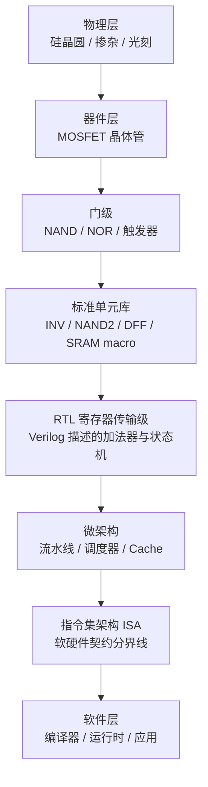
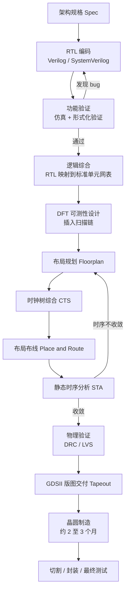

> **TL;DR**
>
> * **这是「给 AI 编译器工程师的芯片课」第二篇**。第一篇建立了"四层契约"的全景,本篇往下钻一层:芯片到底是用什么造出来的。核心链条只有一句话--**CMOS 开关搭出逻辑门 → 逻辑门拼成标准单元 → 单元组成 SRAM、加法器、乘法器 → 时钟节拍下这些电路每周期动一次 → 主频被最长路径锁死**。
> * **两个对编译器最值钱的结论**:1 你在 target 描述里填的每条指令延迟,来自电路的关键路径和流水线切分;2 同架构不同 SKU(132 SM vs 114 SM)来自良率 binning--这就是为什么 target 探测必须在运行时做。
> * **本篇动手实验**:用开源工具链(iverilog)从零写一个加法器电路并仿真,亲眼看布尔表达式变成仿真波形。

## 1. 数字芯片的本体:一层一层的开关

把一颗 AI 芯片不断放大,你会看到这样的层级结构:



每一层都对上层隐藏复杂性、提供抽象。**编译器工作在第 7~8 层,但性能由第 1~6 层决定**。本篇的任务就是把 1~6 层各打开一条缝。

## 2. MOSFET 与 CMOS 反相器:数字世界的原子

### 2.1 晶体管是电压控制的开关

现代芯片用的是 MOSFET(金属-氧化物-半导体场效应晶体管)。对数字设计者来说,它就是一个三端开关:

| 类型 | 栅极电压 | 行为 | 直觉 |
|:---|:---|:---|:---|
| NMOS | 高电平 | 导通 | "1 号令开门" |
| NMOS | 低电平 | 截止 | -- |
| PMOS | 低电平 | 导通 | "0 号令开门",与 NMOS 相反 |
| PMOS | 高电平 | 截止 | -- |

栅极和沟道之间隔着一层绝缘体(氧化物),**栅极靠电场而非电流控制开关**--这就是"场效应"名字的由来,也是 CMOS 静态功耗几乎为零的原因。

### 2.2 CMOS 反相器:用两种开关互为镜像

把一个 PMOS 放在上拉位、一个 NMOS 放在下拉位、栅极并联,就得到 CMOS 反相器(NOT 门):

```
            VDD
             │
        ┌────┴────┐
 IN ────┤  PMOS   │   低电平导通:IN=0 时把 OUT 拉到 VDD
        └────┬────┘
             ├──────── OUT
        ┌────┴────┐
 IN ────┤  NMOS   │   高电平导通:IN=1 时把 OUT 拉到 GND
        └────┬────┘
             │
            GND
```

| IN | PMOS | NMOS | OUT |
|:--:|:----:|:----:|:--:|
| 0 | 导通 | 截止 | **1** |
| 1 | 截止 | 导通 | **0** |

关键性质:**任何稳态下,两个管子恰有一个截止**,从 VDD 到 GND 没有直通路径 → 静态功耗 ≈ 0(只剩微小漏电)。功耗只发生在输出翻转的瞬间。

### 2.3 动态功耗公式:AI 芯片一切故事的起点

给负载电容 \(C\) 充电到 \(V\) 的过程:电源搬运电荷 \(Q = CV\),做功 \(W = QV = CV^2\);其中一半 \(\frac{1}{2}CV^2\) 存进电容,另一半在导通的 PMOS 上烧掉。放电时,电容里存的 \(\frac{1}{2}CV^2\) 又在 NMOS 上烧掉。所以**每个完整的 0↔1 翻转循环消耗 \(CV^2\)**。

若时钟频率为 \(f\)、平均每个周期有比例 \(\alpha\) 的门翻转,就得到第一篇引用过的公式:

$$P_{dynamic} = \alpha C V^2 f$$

**变量映射表**:

| 数学符号 | 物理量 | 典型量级(7nm 级) | 维度/单位 |
|:---:|:---|:---:|:---|
| \(\alpha\) | 活动因子 | 0.05 ~ 0.3 | 无量纲 |
| \(C\) | 单个门的负载电容 | 1 ~ 50 fF | 法拉 |
| \(V\) | 电源电压 | 0.6 ~ 0.8 | 伏特 |
| \(f\) | 时钟频率 | 1 ~ 2 GHz | 赫兹 |

做个量级 sanity check:取 \(C=10\,\text{fF}\)、\(V=0.75\,\text{V}\)、\(f=1.5\,\text{GHz}\)、\(\alpha=0.1\):

$$P = 0.1 \times 10\times10^{-15} \times 0.75^2 \times 1.5\times10^{9} \approx 0.84\,\mu W \text{/门}$$

单颗芯片有数千万到上亿个这样的门,乘起来就是几十到几百瓦--A100 400W、H100 700W 的功耗预算就是这么来的。

> 💡 **编译器关联**:\(V^2\) 是平方项,所以降压(undervolting)省电最狠;频率和电压又互相耦合(降频可以同时降压)。GPU 的 DVFS 和热节流直接改变 \(f\)--**autotuning 测量不锁频,代价模型学到的就是噪声**(本篇 Lab 2 亲手验证)。

## 3. 从开关到标准单元:NAND 与单元库

### 3.1 NAND2:四个管子的万能积木

CMOS 的套路是固定的:**PMOS 组上拉网络,NMOS 组下拉网络,两者互补**。NAND2(二输入与非门):

```
             VDD
              │
         ┌────┴────┐
    A ───┤ PMOS A  │
    B ───┤ PMOS B  │     上拉网络:两管并联
         └────┬────┘
              ├────────── OUT
         ┌────┴────┐
    A ───┤ NMOS A  │
         │ NMOS B  │     下拉网络:两管串联
    B ───┤         │
         └────┬────┘
              │
             GND
```

| A | B | OUT | 通路的管子 |
|:--:|:--:|:--:|:---|
| 0 | 0 | 1 | 两个 PMOS 并联通路,OUT 接 VDD |
| 0 | 1 | 1 | PMOS A 通路 |
| 1 | 0 | 1 | PMOS B 通路 |
| 1 | 1 | 0 | 两个 NMOS 串联通路,OUT 接 GND |

NAND(以及 NOR)是**通用门**:任何布尔函数都能只用 NAND 搭出来。反相器 = NAND 两输入短接;AND = NAND + NOT;加法器 = 一堆 NAND/NOR 的组合。

### 3.2 标准单元库:把电路变成货架商品

晶圆厂(Foundry)把常用电路做成**标准单元库**交付给设计公司:

* 组合逻辑:INV、NAND2/3/4、AOI、XOR、MUX......每种还有多个驱动强度版本(X1/X2/X4)
* 时序逻辑:D 触发器(DFF)、锁存器
* 存储宏单元:单端口/双端口 SRAM macro、寄存器堆 macro、ROM

同一功能往往有多个版本可选:高阈值电压(HVT)管子慢但漏电小,低阈值(LVT)快但漏电大--综合工具会按时序/功耗目标混着挑。这套"货架"连同器件模型、设计规则一起打包成 **PDK(工艺设计包)**,是 Foundry 与 Fabless 之间的核心接口。

## 4. 存储电路的分水岭:6T SRAM 与 1T1C DRAM

我们在 TVM 文章里已经拆过 [6T SRAM 单元](../TVM/01_relax_architecture.md):两个交叉耦合反相器(4 管)双稳态锁存 1 bit,外加两个访问晶体管(共 6 管)。这里补上它的对手--DRAM,两者对比是整个存储层次存在的物理根源。

### 4.1 DRAM:一个电容的生意

DRAM 单元只有 **1 个晶体管 + 1 个电容**:

* 存 1 = 电容充了电,存 0 = 没充电
* 电容会漏电 → 必须周期性**刷新**(DDR 标准约每 64 ms 全部行刷一遍),刷新期间 bank 不能服务读写
* 读出是**破坏性的**:电荷冲进位线后原值没了,要靠灵敏放大器(sense amp)检测微小电压差并回写

| 维度 | SRAM(6T) | DRAM(1T1C) |
|:---|:---|:---|
| 单元晶体管数 | 6 | 1 |
| 密度 | 低(同容量面积约 6~8 倍) | 高 |
| 速度 | 快(ns 级,1 cycle 可达) | 慢(数十 ns 起) |
| 需要刷新 | 否 | 是 |
| 工艺 | 与逻辑同工艺,可放 die 上 | 专用工艺,只能封装在一起 |
| 用途 | 寄存器 / SMEM / L1/L2 Cache | HBM / DDR 主存 |

**这个表就是存储层次的原型**:SRAM 贵而快所以小而近,DRAM 便宜而慢所以大而远。编译器眼里的 `shared memory 164KB` 不是魔法数字,是一块物理 SRAM macro 在面积预算里能给出的份额。

### 4.2 多端口寄存器堆:GPU 最贵的存储

CPU/GPU 的寄存器堆要求一个周期能读多个操作数、写回多个结果--**多端口 SRAM**。每个端口都要额外的字线/位线和访问管,面积随端口数超线性增长(近似端口数的平方)。GPU 的解法是把寄存器堆切成多个 **bank**,每个 bank 少量端口,靠吞吐叠加凑出总带宽--bank 冲突就是两条请求撞进同一个 bank 被迫排队,这是第 03、06 篇的主角。

> 💡 **一句话总结**:寄存器堆不是"更快的内存",它是**为多读多写定制了端口结构的 SRAM 阵列**,其面积成本决定了 GPU 每线程可用寄存器的上限(255 个),进而决定了 occupancy。

## 5. 时钟、触发器与关键路径:主频从哪里来

### 5.1 D 触发器:同步电路的心跳瓣膜

数字芯片是**同步电路**:所有状态变化都发生在时钟边沿。承担"边沿采样"职责的是 D 触发器(DFF,也是标准单元的一员):时钟上升沿时刻,把输入 D 的值锁存到输出 Q,其余时间 Q 保持不变。

时序约束有三个特征参数:

* **t_clk-q**:时钟沿到 Q 更新的延迟
* **t_setup**(建立时间):数据必须在时钟沿**之前**稳定多久
* **t_hold**(保持时间):时钟沿之后数据还得再稳定多久

### 5.2 关键路径决定 f_max

两级触发器之间隔着一段组合逻辑。下一个时钟沿要正确采到新数据,必须满足:

$$T_{clk} \geq t_{pcq} + t_{pd} + t_{setup}$$

**变量映射表**:

| 符号 | 名称 | 示例取值 | 含义 |
|:---:|:---|:---:|:---|
| \(T_{clk}\) | 时钟周期 | ≥ 0.90 ns | 决定主频 \(f_{max} = 1/T_{clk}\) |
| \(t_{pcq}\) | clk-to-Q 延迟 | 0.15 ns | 触发器自身开销 |
| \(t_{pd}\) | 两级间最长组合逻辑延迟 | 0.60 ns | **关键路径** |
| \(t_{setup}\) | 建立时间 | 0.15 ns | 采样裕量 |

代入示例数字:\(f_{max} = 1/0.90\,\text{ns} \approx 1.11\,\text{GHz}\)。**主频不是"设计出来的目标",是被最长那条组合逻辑路径卡出来的结果。**

### 5.3 流水线:切短关键路径换频率

把 0.60 ns 的逻辑从中间插一级触发器切成两段 0.30 ns:

$$T_{clk} \geq 0.15 + 0.30 + 0.15 = 0.60\,\text{ns} \Rightarrow f_{max} \approx 1.67\,\text{GHz}$$

吞吐率提升 1.5 倍,代价是指令延迟从一个周期变两个周期、面积增加一级触发器、且两段之间不能有反馈依赖。**整条指令流水线(取指→译码→执行→写回)本质上就是反复应用这招。**

> 💡 **编译器关联(本篇最重要的结论)**:你在 CUDA 性能表里读到的"FMA 延迟 4 cycle、吞吐每周期 2 条"不是文档作者的偏好,而是 **FMA 电路的关键路径被切成了 4 段流水线**。软件流水(software pipelining)、unroll、double buffering 这些 schedule 技巧的全部意义,就是让连续指令错开进入这条流水线、别让它断流。第 05 篇正式推导冒险与调度。

## 6. 制程节点的真相与 Dennard Scaling 的终结

### 6.1 "7nm/5nm/3nm"到底是什么

历史上节点名等于晶体管栅长(250nm 时代),现在**节点名是营销标签**,真实指标是栅极间距、金属间距和集成密度:

| 节点名(营销) | 量产年份 | 逻辑密度 MTr/mm2(近似) | HD SRAM 单元(近似) | 关键光刻技术 |
|:---:|:---:|:---:|:---:|:---|
| N7 | 2018 | ~91 | 0.027 μm2 | DUV 多重曝光 |
| N5 | 2020 | ~130~170 | 0.021 μm2 | EUV 引入 |
| N3 | 2022 | ~200~290 | 0.0199 μm2 | EUV |

> 数字为公开报道口径的近似值,未逐一验证,以 TSMC/Samsung 官方技术简报为准。

**EUV(极紫外光刻)**用 13.5nm 波长光源替代 193nm 浸没式 DUV,一次曝光顶过去多重曝光的四五次,是 7nm+ 节点能继续缩放的关键设备(也是 ASML 垄断全球的原因)。

### 6.2 缩放的终结:为什么 2005 年后 CPU 不再飙频

Dennard Scaling(1974):晶体管等比缩小 k 倍,电压电容同比缩小,功率密度保持不变--**晶体管白送,不用多付电费**。这个红利让频率从 MHz 冲到 GHz。

~2005 年它失效了:电压降到 1V 附近后无法继续等比下降(阈值电压有地板,再降漏电流指数上升),**功耗密度开始随密度一起涨**。于是:

1. 频率平台期(Pentium 4 卡在 ~3.8GHz,20 年后的 GPU boost 也不过 2~4 GHz)
2. 晶体管还在变多变便宜(摩尔定律惯性)→ **开不满的晶体管**(dark silicon)
3. 多出来的晶体管只能用于并行结构:多核 → GPU → 领域专用架构(第一篇的主线在这里接上)

漏电(\(I_{leak}V\) 那一项)从此成为一等公民:FinFET(22nm 起)到 GAA 环栅(3nm 级)的晶体管结构演进,本质都是在跟漏电作斗争。

## 7. 设计流程:从 RTL 到 GDSII

一颗芯片从想法到交付制造的全流程:



几个关键站点的人话解释:

* **综合(Synthesis)**:把 Verilog 描述的 `a + b` 自动翻译成几千个标准单元的组合,工具在"快单元贵/漏电大 vs 慢单元省电"之间做权衡
* **静态时序分析(STA)**:不跑仿真,穷举所有触发器到触发器的路径,报告哪些违反了第 5 节的约束(setup/hold violation)
* **DRC/LVS**:物理版图是否违反制造规则 / 是否与网表电路一致
* **流片(Tapeout)**:版图交付工厂制版生产。先进节点一套光罩数百万美元起、含全套设计的 NRE 以亿美元计--**芯片试错的单位是"次流片",没有 try-catch**(数字为公开报道量级,未精确核实)

这条流程的工具链长期被 Synopsys/Cadence/Siemens 三巨头垄断。开源替代正在成熟:[SkyWater PDK](https://github.com/google/skywater-pdk) 提供真实可流片的 130nm 工艺包,[OpenROAD](https://github.com/The-OpenROAD-Project/OpenROAD) 覆盖布局布线到时序签核,[Yosys](https://github.com/YosysHQ/yosys) 负责综合,[iverilog](https://github.com/steveicarus/iverilog) 做仿真--本篇 Lab 就用它们。

## 8. 制造、良率与 Binning:SKU 差异的来源

### 8.1 良率的简化模型

晶圆上不可能颗颗完好。用泊松模型近似(忽略缺陷聚集效应):

$$Y \approx e^{-AD}$$

**变量映射表**:

| 符号 | 名称 | 示例取值 | 说明 |
|:---:|:---|:---:|:---|
| \(Y\) | 良率 | -- | 完好 die 占比 |
| \(A\) | die 面积 | 见下表 | cm2 计 |
| \(D\) | 缺陷密度 | 0.1 /cm2 | 先进工艺爬坡期常见量级 |

| die 面积 | 300mm 晶圆可得 die 数(粗估) | 良率 \(Y=e^{-AD}\) |
|:---:|:---:|:---:|
| 100 mm2 | ~600 | ~90% |
| 400 mm2 | ~160 | ~67% |
| 800 mm2(A100/H100 量级) | ~80 | ~45% |

**die 越大面积呈指数惩罚**--这一条经济学规律,比任何论文都更能解释行业为什么转向 chiplet(第 08 篇展开)。

### 8.2 Binning:把坏的部分屏蔽掉再卖

良率的副产品是**binning(分档)**:die 上有局部缺陷时,屏蔽掉对应单元、降档销售:

* GH100 完整 die 有 144 个 SM,H100 SXM5 启用 132 个(PCIe 版启用 114 个)
* RTX 3080 的 GA102 只启用 68/84 个 SM
* 显存同理:HBM 堆栈内置冗余行/列,测试时修复;修不好的堆栈减配出货(A100 40GB vs 80GB 的差异之一)

> 💡 **编译器关联**:**同一 ISA、同一代架构,SM 数量、缓存大小、带宽都可能在 SKU 间不同**--target 信息只能在运行时探测(`cudaGetDeviceProperties`),编译期硬编码必然踩坑。autotuning 数据库按"架构名"复用调优结果时也要小心:同为 sm_80,40GB 与 80GB 版带宽差 30%。

## 9. 产业链四种角色:Fabless / Foundry / IDM / OSAT

| 角色 | 干什么 | 代表 |
|:---|:---|:---|
| IDM | 自己设计 + 自己制造 | Intel、Samsung、TI、士兰微 |
| Fabless | 只设计(无厂) | NVIDIA、AMD(制造外包)、海思、寒武纪、韦尔股份 |
| Foundry | 只代工制造 | TSMC、中芯国际、华虹、GlobalFoundries |
| OSAT | 封装与测试 | 日月光 ASE、长电科技、通富微电 |

设计一家 AI 芯片公司不再需要拥有工厂--这正是过去十年全球(尤其中国)AI 芯片创业爆发的产业结构前提。12 大领域中国 Fabless 公司的逐家分析见[《中国 IC 设计(Fabless)公司全景研究》](../ic_design/chinese_fabless_companies.md)。知乎「老石谈芯」专栏对先进制程与 chiplet 产业逻辑有一系列通俗解读,适合作为本节的延伸阅读。

## 10. 收官小结:给编译器工程师的五条收获

1. **指令延迟表的出处**:FMA 延迟 4 cycle = 乘法器关键路径被切成 4 段流水线。schedule 的 unroll/reorder/软件流水都是在伺候这条流水线。
2. **容量参数的出处**:`164KB shared memory` = 面积预算内能给的 SRAM macro 份额;`255 regs/thread` = 多端口寄存器堆的成本上限。
3. **SKU 差异的出处**:良率 binning 让同架构芯片规格不同 → target 探测必须运行时做。
4. **chiplet 的动机**:良率随 die 面积指数衰减 → 大芯片拆成小 die → 引入 NUMA 与放置问题(第 08 篇)。
5. **测量方法论**:DVFS/热节流直接改写 \(f\) → autotuning 与 benchmark 报告前必须锁频。

## 局限与展望

本篇是行为级描述：跳过了时钟树偏差（skew）、电源网络 IR-drop、信号完整性等物理设计深水区，也未展开 FinFET/GAA 器件结构；良率模型忽略缺陷聚集，实际良率介于泊松与 Murphy 模型之间。展望侧，背面供电（BSPDN）、CFET 等器件创新将继续改写功耗曲线，而 chiplet 化正在把“一颗芯片的设计流程”重组为“一组小芯片的系统集成流程”——后者对编译器的影响会在第 08 篇量化。

## 参考文献

| 主题 | 链接 |
|:---|:---|
| Nand2Tetris:从门到操作系统的免费课程(本文第 2~5 节的最佳配套) | <https://www.nand2tetris.org/> |
| SkyWater PDK:开源可流片 130nm 工艺包 | <https://github.com/google/skywater-pdk> |
| OpenROAD:开源 RTL-to-GDSII 全流程 | <https://github.com/The-OpenROAD-Project/OpenROAD> |
| Yosys:开源逻辑综合器 | <https://github.com/YosysHQ/yosys> |
| Icarus Verilog:轻量 Verilog 仿真器 | <https://github.com/steveicarus/iverilog> |
| Weste & Harris, *CMOS VLSI Design*(教材,第 2/5 节深度参考) | 可搜书名获取版本信息 |
| Dennard et al., 1974(Dennard Scaling 原始论文) | IEEE JSSC, Vol. SC-9 No.5(可搜标题获取) |
| 本系列前篇 | 《给 AI 编译器工程师的芯片课(一)》 |

> 下一篇:[《存储层次:从寄存器堆到 HBM》](03_memory_hierarchy.md)--沿着"数据住得离计算多远"这条主线,拆 bank conflict、cache 组织与 HBM 的物理原理,并把 Roofline 拐点的算法写成可执行代码。
