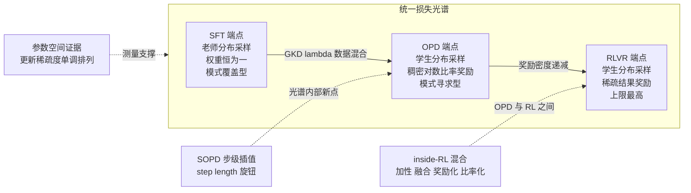
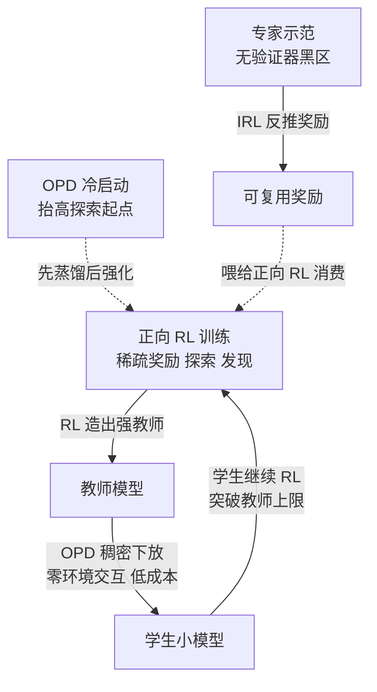

> **TL;DR 三连**
>
> - **核心论点**：SFT、（on-policy）蒸馏、RLVR 不是四个方法，是同一个 REINFORCE 家族目标 $\mathcal{L}(\theta)=\lambda\mathcal L_{SFT}+(1-\lambda)\mathcal L_{OPD}+\mu\mathcal L_{RL}$ 在两个坐标轴——**采样分布**（老师分布 → 学生分布）与**信号密度**（逐 token 稠密 → 整条稀疏）——上的插值点。OPD 端点的本质是"教师 logp 当稠密奖励的策略梯度"（《On-Policy Distillation 深度剖析》§2.4 已证：反向 KL 的梯度 = REINFORCE，log-ratio 即逐 token 奖励）。
> - **反直觉发现**：光谱两端点的统计性质几乎处处互换——SFT 梯度方差最低但模式覆盖最差（exposure bias 随长度平方放大）；RLVR 模式覆盖最自由但方差最高、每条轨迹只教 O(1) bit。OPD 在两轴各取中间不是修辞而是测量事实：参数空间诊断显示三者的更新稀疏度分别为 8.1% / 51.6% / 77.2%，恰好单调排列。
> - **定位**：本篇是四象限地图的"统一场论"篇，把象限Ⅰ（蒸馏）与象限Ⅲ（RLVR）焊在同一个损失函数上；Step-Level OPD 给出光谱内部新点的第一个系统构造，AwesomeOPD 收录的 50 条 OPD-RL 混合（TGPO、OPD+、ATOD……）则是工程界自发长出的连续插值器。



## 1. 问题陈述：四个名字，一个损失

本站此前的文章各自为政：《从 MDP 到 GRPO》五篇讲正向 RL（REINFORCE → TRPO → PPO → GRPO），《On-Policy Distillation 深度剖析》与《在线蒸馏方法全景》讲蒸馏。但把两条线的梯度公式并排放好，会发现一件让人坐立不安的事——**它们是同一个式子的三次取值**。

回忆三条已有结论：

1. **off-policy SFT 蒸馏 = 老师分布上的最大似然**（《在线蒸馏方法全景》§2.2）：$\nabla_\theta\mathcal L_{SFT}=-\mathbb E_{y\sim\pi_T}\big[\sum_t\nabla_\theta\log\pi_\theta(y_t\mid x,y_{<t})\big]$——期望在老师分布 $\pi_T$ 上，与 $\theta$ 无关，所以没有策略梯度问题；
2. **OPD = 反向 KL 的策略梯度形式**（OPD 篇 §2.4 两步证明）：score function 技巧拆出 $\nabla_\theta\pi_\theta(y)=\pi_\theta(y)\nabla_\theta\log\pi_\theta(y)$，另一项因 $\sum_y\nabla_\theta\pi_\theta(y)=0$ 整项消零，只剩 $\nabla_\theta\mathcal L_{OPD}=\mathbb E_{y\sim\pi_\theta}\big[\sum_t r_t\,\nabla_\theta\log\pi_\theta(y_t\mid\cdot)\big]$，其中 $r_t=\log\frac{\pi_\theta(y_t\mid\cdot)}{\pi_T(y_t\mid\cdot)}$ detach 后就是逐 token 奖励；
3. **GRPO = 组内基线的 REINFORCE 加 PPO 壳**（GRPO 篇）：$\nabla$ 的权重是整条回答共享的组相对优势 $\hat A_i=(r_i-\mathrm{mean})/\mathrm{std}$。

三个梯度全部形如 $\mathbb{E}\big[\sum_t w_t\,\nabla_\theta\log\pi_\theta(y_t\mid\cdot)\big]$——**带权 score function**。差别只有两个自由度：

- **期望放在哪个分布上**（$\pi_T$ 还是 $\pi_\theta$）：采样分布轴；
- **权重 $w_t$ 长什么样**（常数 1 → 逐 token log-ratio → 整条一个标量）：信号密度轴。

于是可以写下贯穿全文的统一目标：

$$\mathcal{L}(\theta;\lambda,\mu)\;=\;\underbrace{\vphantom{\sum_t}\lambda\,\mathcal L_{SFT}}_{\text{老师轨迹上的 MLE}}\;+\;\underbrace{(1-\lambda)\,\mathcal L_{OPD}}_{\text{学生轨迹 + 稠密 log-ratio}}\;+\;\underbrace{\mu\,\mathcal L_{RL}}_{\text{学生轨迹 + 稀疏结果奖励}}$$

这不是发明新方法，而是给已有方法画坐标系。《Decoupling KL and Trajectories》已经证明 off-policy 蒸馏与 OPD 隐式耦合了"前缀来源 × KL 方向"两个正交选择，并把 SFT、DAgger、离线 RL 蒸馏、OPD 放进同一张四象限表（[arXiv:2605.16826](https://arxiv.org/abs/2605.16826)）——那是光谱的 2×2 离散化。G-OPD 则从另一头逼近：理论上证明 **OPD 是 dense KL-constrained RL 的特例**——奖励项与 KL 正则恒等权、reference model 可任取，把 GRPO 训练脚本的 reference model 换成老师、奖励归零、去掉组归一化，GRPO 就变成了 OPD（[arXiv:2602.12125](https://arxiv.org/abs/2602.12125)）。本篇做的事，是把这张离散地图连续化，并检查每个插值点上梯度的统计性质。

## 2. 核心推导：三个端点的梯度形态

### 2.1 统一代码骨架

先给可执行的定义——一个训练循环，三个端点只是配置：

```python
# spectrum.py —— 一个训练循环覆盖三个端点：SFT / OPD / RLVR
# 统一损失：L = lam * L_SFT + (1 - lam) * L_OPD + mu * L_RL
import torch

def spectrum_step(student, teacher, x, rewards, cfg, opt):
    # ---- 采样分布旋钮（光谱第一轴）：数据从哪个分布来 ----
    y_t = teacher.generate(x, temperature=1.0)          # 老师轨迹（固定分布）
    y_s = student.generate(x, temperature=cfg.temp)     # 学生轨迹（随 theta 移动）

    # ---- 端点一 SFT：老师分布上的 MLE，权重恒为 1，无策略梯度 ----
    sft_loss = -student.logp(x, y_t).mean()

    # ---- 端点二 OPD：学生轨迹上的带权 REINFORCE，权重 = 逐 token log-ratio ----
    s_logp = student.logp(x, y_s)
    with torch.no_grad():
        r_t = s_logp - teacher.logp(x, y_s)             # 稠密奖励，必须 detach
    opd_loss = (r_t * s_logp).mean()                    # 注意：不加负号

    # ---- 端点三 RLVR：组相对稀疏优势的 REINFORCE，权重整条共享 ----
    adv = (rewards - rewards.mean()) / (rewards.std() + 1e-8)
    rl_loss = -(adv.unsqueeze(-1) * s_logp).mean()      # GRPO 去壳版

    loss = cfg.lam * sft_loss + (1 - cfg.lam) * opd_loss + cfg.mu * rl_loss
    opt.zero_grad(); loss.backward()
    torch.nn.utils.clip_grad_norm_(student.parameters(), 1.0)
    opt.step()
```

##### 变量映射表（数学 ↔ 代码）

| 数学符号 | 代码变量 | Shape / 类型 | 含义 |
|---|---|---|---|
| $\lambda$ | `cfg.lam` | 标量 | SFT↔OPD 数据混合比（GKD 旋钮） |
| $\mu$ | `cfg.mu` | 标量 | RL 项权重 |
| $y_T\sim\pi_T(\cdot\mid x)$ | `y_t` | `(B,T)` | 老师轨迹（SFT 项的期望分布） |
| $y\sim\pi_\theta(\cdot\mid x)$ | `y_s` | `(B,T)` | 学生轨迹（on-policy 项的期望分布） |
| $r_t=\log\frac{\pi_\theta}{\pi_T}$ | `r_t` | `(B,T)` | token 级稠密奖励（detach 当常数） |
| $\hat A_i=\frac{r_i-\mathrm{mean}}{\mathrm{std}+\epsilon}$ | `adv` | `(B,)` 广播到 `(B,T)` | 组相对稀疏优势 |
| $\mathcal L_{SFT},\mathcal L_{OPD},\mathcal L_{RL}$ | `sft_loss` 等 | 标量 | 三个端点损失 |

### 2.2 极端点统计性质对比表

把三个端点放回同一张表，光谱就不是修辞了：

| 统计性质 | SFT 端点 | OPD 端点 | RLVR 端点 |
|---|---|---|---|
| 采样分布 | $\pi_T$（固定，与 $\theta$ 无关） | $\pi_\theta$（移动，on-policy） | $\pi_\theta$（移动，on-policy） |
| 权重 $w_t$ 形态 | 常数 1 | 逐 token log-ratio（稠密、有符号） | 整条一个组相对优势（稀疏） |
| **梯度方差** | 最低——无策略梯度、无探索噪声 | 中——有 PG 但稠密奖励压低方差 | 最高——稀疏奖励叠加探索噪声 |
| **模式覆盖** | mode-covering（摊开覆盖老师全部模式） | mode-seeking（向师生共识模式集中） | 无分布约束（奖励定义一切，自由度最大） |
| **信用分配粒度** | 逐 token（但状态分布是老师的） | 逐 token（且状态分布是学生的） | 每条轨迹 O(1) bit |
| **样本效率** | 数据便宜但 exposure bias 随长度平方放大 | 最高——7-10× 更少梯度步即可恢复成绩 | 低——探索成本高，70 步才抵 OPD 10 步 |
| 能力上限 | ≤ 老师 | ≤ 老师（ExOPD 奖励外推可破） | 理论无上限 |
| 典型失效 | 长序列误差累积、学风格不学正确率 | 思考模式不兼容、长视野信号衰减 | reward hacking、熵坍缩 |

表里每一格都有出处：方差与模式行为来自两个 KL 梯度的权重结构（《在线蒸馏方法全景》§2.3），效率数字来自 Thinking Machines Lab 对 Qwen3 配方的复现（工业博客，非论文；下同），失效模式来自清华 THUNLP 的机制研究（[arXiv:2604.13016](https://arxiv.org/abs/2604.13016)）。值得停下来的是**对角线上的互换**：你不可能同时占有左下角的"数据便宜"和右下角的"上限无封顶"——这正是光谱存在的意义，每个点都是一组统计性质的打包报价。

### 2.3 插值旋钮盘点：λ 不是唯一的插值方式

统一损失里有三个字面上的系数（$\lambda,\mu$ 和隐含的 $1-\lambda$），但光谱上真实的插值机制至少有四种，互不可替代：

1. **数据混合比 λ**（GKD）：$\mathcal L_{GKD}=(1-\lambda)\mathbb E_{\mathcal D_T}+\lambda\mathbb E_{\pi_\theta}$，在老师数据与学生自生成数据之间插值，实践中取 0.5–1.0 防止 on-policy 分布坍缩（[arXiv:2306.13649](https://arxiv.org/abs/2306.13649)）；
2. **散度插值 JSD(β)**（同为 GKD）：$\beta\to 0$ 逼近 forward KL、$\beta\to 1$ 逼近 reverse KL——在"模式覆盖 vs 模式寻求"这条轴上连续滑动；
3. **监督粒度 step length**（SOPD，§4）：token 级碎片修正 ↔ 序列级完整修复路径；
4. **时间调度退火**（ATOD，§5）：训练早期 OPD 主导、后期 RL 主导——不是在空间一点取值，而是规划一条穿过光谱的路径。

注意一个容易糊掉的区别：$\mathcal{L}=\lambda\mathcal L_{SFT}+(1-\lambda)\mathcal L_{OPD}$ 里 λ 是**损失的凸组合**，而 GKD 的 λ 是**数据的混合比**——两者在随机mini-batch意义上近似等价，但语义不同：前者假设你可以同时算两项（两次前向、两个分布的样本），后者只是每个 batch 选一条数据流。工程实现几乎都是后者。

## 3. 光谱不是比喻：三组独立证据

**参数空间几何**。《On the Geometry of On-Policy Distillation》用一套参数空间诊断把三种后训练的更新轨迹放在显微镜下：以更新的稀疏度计，SFT 只动 8.1% 的权重、OPD 动 51.6%、RLVR 动 77.2%；OPD 处于"松弛的离主成分"区间——比 SFT 更分散、又比 RLVR 更收敛，且早期就锁定进低秩更新通道（[arXiv:2606.07082](https://arxiv.org/abs/2606.07082)）。三个方法在权重空间的位置严格沿光谱排序——**这是对"中间点"存在性的直接测量，而非概念 convenience**。

**信息论账本**。RL 每 episode 的监督只有结果对错一个 bit（O(1)），OPD 每 episode 有 T 个 token 各一份 log-ratio 信号（O(N)）。TML 的复现给出兑换率：同样的 AIME 成绩恢复，OPD 用 7–10× 更少的梯度步、约 50–100× 的计算效率——dense 监督的优势是结构性的，不依赖实现技巧。而 CASIA 的理论补丁提醒这账单有小字：sampled-token 的 token 级 OPD 相对序列级反向 KL 是**有偏**的，换来的是更紧的最坏情况方差界（[arXiv:2603.25562](https://arxiv.org/abs/2603.25562)）——光谱上每个点的"偏差-方差定价"不同，没有免费的中间点。

**何时值得离开 SFT 端点**。《When Does Online Imitation Learning Help?》给出迄今最锋利的回答：online 交互的收益不来自"纠错累积误差"，而来自 **realizability 与否**——若学生策略类能表示专家策略，offline IL 已经匹配专家，online 白花钱；收益集中在 non-realizable（误设）场景（[arXiv:2606.30445](https://arxiv.org/abs/2606.30445)）。翻译成光谱语言：**采样分布轴上的移动只在模型类误设时有正收益**——这给"什么时候该为 on-policy 付钱"提供了第一个可检验判据。

## 4. SOPD：光谱内部的第一个系统构造

统一光谱提出后立刻面对一个问题：两个极端点之外，有没有人**故意构造**中间点？2026 年 8 月的 Step-Level OPD 是第一个正面回答。

**动机直指 OPD 端点的结构缺陷**：token 级 OPD 只能在错误的学生轨迹上提供**碎片化修正**，无法展开一条完整正确的修复路径——学生在第 20 步走错后，OPD 的监督是"这个 token 该换什么"，而不是"从这里开始整段应该怎么走"。这正是信号密度轴上"过密反而碎"的困境。

**SOPD 的机制一句话说完**：把监督单元从 token 升级为 step——老师在**学生生成的完整轨迹**上按步补全，提供步级监督。它同时占住两轴的中间位置：

- 相比 SFT：老师响应**条件在学生轨迹上**，贴合学生实际会访问的状态（采样分布轴向学生侧移动）；
- 相比 OPD：提供**更长视野的修正**而非逐 token 碎片（信号密度轴向序列级移动）。

论文证明了插值的两个极限：step 长度取不同极限时，SOPD **还原为 SFT 或逼近 OPD**——step length 就是光谱坐标系的第三个显式旋钮。实验横跨推理与 agent 任务：ALFWorld 平均成功率超 vanilla OPD 13.4 个百分点（[arXiv:2608.16333](https://arxiv.org/abs/2608.16333)）。与本站此前讲过的 ReOPD 对照很有意思：ReOPD 用离线 prefix replay 解决多轮 agent 的环境交互成本（[arXiv:2607.04763](https://arxiv.org/abs/2607.04763)），SOPD 则重新设计监督粒度——两者从工程和损失两个方向逼近同一个"多轮 OPD 不稳"的问题，说明光谱中间点的需求是真实痛点驱动的。

顺带一提同期新作的方向感：Group-Calibrated OPD 发现长上下文里 token 级教师支持会偏爱"局部通顺但漏证据"的回答，改用响应级分组校准（[arXiv:2608.19181](https://arxiv.org/abs/2608.19181)）——同样是在修"逐 token 信号粒度不对"的病。

## 5. Inside-RL OPD：工程界自发长出的连续插值器

如果说 SOPD 是光谱理论的自觉产物，那 AwesomeOPD 生态索引里 **OPD-RL Hybrids 一节的 50 条工作**就是无组织的自发秩序：2025 到 2026 年间，几十个团队不约而同地把教师信号塞进 RL 目标内部。归纳下来是清晰的三分法：

| 范式 | 教师信号进入 RL 的方式 | 代表工作 | 关键机制与数字 |
|---|---|---|---|
| **加性融合** | 蒸馏项与 RL 损失并列相加，配静态或退火权重 | KDRL、ATOD、HDPO、CADENCE、SDPG | ATOD：$A_t=\kappa(s)\cdot A_t^{OPD}+\rho(s)\cdot A_t^{GRPO}$，退火调度让稠密教师引导主导早期、奖励驱动主导后期，多轮 agent 上报告超过其自身教师 +2.16（[arXiv:2606.27814](https://arxiv.org/abs/2606.27814)）；KDRL 把反向 KL 与规则奖励装进一个联合目标（[arXiv:2506.02208](https://arxiv.org/abs/2506.02208)） |
| **奖励化** | 教师散度本身被当作（稠密）奖励或过程奖励 | OPD+、TGPO、RG-OPD、PASS、Group-Calibrated OPD | OPD+ 把 OPD 形式化为 f-divergence 奖励的 RL，并证明常用的 stop-gradient 优势估计**有偏**、给出修正估计量（[arXiv:2606.01039](https://arxiv.org/abs/2606.01039)）；TGPO 专攻大师生差距场景——RL 探索产出落在教师分布外的轨迹时反馈全是无效负信号，改为教师条件在学生上下文上直接引导生成，再与 RLVR 轨迹奖励融合（[arXiv:2605.13230](https://arxiv.org/abs/2605.13230)）；RG-OPD 用验证器奖励做门控，仅当奖励与师生似然差方向一致时才保留蒸馏（[arXiv:2607.04037](https://arxiv.org/abs/2607.04037)）；PASS 把任意步级过程信号接进 GRPO 的优势流，其 OPD 实例化即稠密蒸馏信号（[arXiv:2606.29296](https://arxiv.org/abs/2606.29296)） |
| **比率化 / 优势整形** | 教师信号作为乘性比率或权重作用在 RL 优势上 | Distilled RL、CPO、RLAD、LUFFY、NPO | Distilled RL 干脆删掉 KL 损失，把教师做成优势上的**反向重要性比率**，配负样本重置与序列级几何归一化防止教师重缩放整条回答（[arXiv:2607.17247](https://arxiv.org/abs/2607.17247)）；CPO 用对比分歧整形优势，并**证明 OPD 的反向 KL 是它的特例**（教师即后验）（[arXiv:2607.14614](https://arxiv.org/abs/2607.14614)）；LUFFY 把离策略教师轨迹混入 RLVR 的 rollout 突破初始能力（[arXiv:2504.14945](https://arxiv.org/abs/2504.14945)）；NPO 把教师换成"训练后期附近的自己"，兼顾足够强与分布够近（[arXiv:2604.20733](https://arxiv.org/abs/2604.20733)） |

三分法背后是同一个判断的三种实现：**纯 OPD 会饱和（学生逼近教师后增益归零），纯 RL 太慢（稀疏奖励起步阶段浪费算力），所以把光谱上相邻两点焊在一个目标里**。ATOD 的摘要把这话说得最白：OPD 提供稠密教师引导、早期提升快但学生接近教师后饱和；RL 直接优化环境奖励、天花板更高但稀疏延迟的反馈让早期效率远低于 OPD。

还有一条重要的**反向证据线**：教师信号并非总是对的。SG-OPD 发现 OPD 隐含假设"轨迹级对齐 + token 级教师偏好一致可靠"，两者在实践中频繁破裂，于是用验证器符号做门控——共识 token 外推、冲突 token 软化（[arXiv:2606.09304](https://arxiv.org/abs/2606.09304)）；更妙的是 Rebellious Student：在学生偏离特权教师**却仍然成功**的轨迹上，把自蒸馏信号反过来读，放大而非抑制学生的分歧，Qwen3-4B-Base 上 avg@16 提升 18%（[arXiv:2605.10781](https://arxiv.org/abs/2605.10781)）。这些工作共同宣示：光谱的教师端不是金标准，它只是一个**可能被验证器纠正的先验**。

最后是 Sparse-to-Dense 原则——50 条混合里最像"定律"的一条：在可验证标注数据稀缺时，**稀疏序列级奖励应该用在上游最强模型上做 RL 探索，再把成型的行为以稠密教师监督压缩到下游部署小模型**；四阶段管线（教师 RL → 密集桥接 → 可选回归稀疏 RL）在 MATH 上 79.3% 对直接 GRPO 的 75.9%（[arXiv:2605.12483](https://arxiv.org/abs/2605.12483)）。这句话等于给整个光谱写下了资源分配法则：**稀疏端点负责发现，稠密端点负责压缩**。

## 6. 正向 RL 与蒸馏的供需关系

把 §5 的观察抽掉细节，剩下的骨架是一条双向供需链：



**RL 供给蒸馏**：最好的蒸馏源往往是 RL 训出来的。TML 的演示堪称教科书——用 RL 训练出的 DeepMath 教师把 Qwen3-8B-Base 蒸回 AIME 水平只要 10 步；Sparse-to-Dense 的第一性原理更是明说"稀缺标注数据应先花在最强的上游教师身上"。RL 是能力的**生产端**，蒸馏是能力的**分销端**。

**蒸馏供给 RL**：反向同样成立。THUNLP 的失败恢复配方第一条就是 off-policy cold start——先用教师轨迹 SFT 暖机再上 OPD，本质是为 RL 抬高探索起点；MiniCPM5-1B 的官方管线明确采用 "RL + OPD" 组合（工业技术报告，非论文）；HDPO 处理"悬崖 prompt"——全错的题组 RL 梯度精确为零，用特权自蒸馏兜底注入学习信号（[arXiv:2603.23871](https://arxiv.org/abs/2603.23871)）；LUFFY 的动机也是 RLVR 困在自身初始能力内，需要离策略指导带来新行为。**蒸馏解决 RL 的冷启动与样本效率，RL 解决蒸馏的上限**。

第三条边来自象限Ⅱ：在数学与代码之外的黑区（开放写作、长程 agent），验证器缺位使 RLVR 熄火，示范却俯拾皆是——IRL 从示范反推可检查、可复用的隐式奖励（PARED，[arXiv:2607.24900](https://arxiv.org/abs/2607.24900)；RARO 仅凭示范学会强推理，[arXiv:2511.21667](https://arxiv.org/abs/2511.21667)），提取出的奖励仍要交回正向 RL 执行。至此四象限闭合成一张供需网：**RL 生产行为与教师，蒸馏分销能力，IRL 在无奖励区给 RL 供货**。X-KD 甚至把"让学生在教师的原始学习环境中学习"形式化，用 AVRIL 逆 RL 框架同时建模奖励与策略（[arXiv:2602.12674](https://arxiv.org/abs/2602.12674)）——象限Ⅰ与象限Ⅱ在方法论上也接通了。

## 7. 批判与展望

**批判一：统一损失是代数便利，不是几何定理。** $\lambda\mathcal L_{SFT}+(1-\lambda)\mathcal L_{OPD}+\mu\mathcal L_{RL}$ 写起来漂亮，但三个端点的**采样分布不可凸组合**——你不能采样"半个老师半个学生"的轨迹。真实系统里的插值都是数据层面的离散混合（GKD 的 λ）或调度层面的时序路径（ATOD 的退火），没有任何结果保证凸组合损失的极小点是好的光谱中间点。统一框架的解释力远强于预测力。

**批判二：stop-gradient 之争悬而未决。** 光谱中段的核心技巧——把 log-ratio detach 成常数奖励——被 OPD+ 证明对一般 f-divergence 是有偏的优势估计，CASIA 又说有偏但方差界更紧。到底哪个估计器在哪个区域最优，目前只有拼图没有定论；这意味着 §2 的统一代码骨架在 OPD 端点附近仍是"经验最优"而非"原理最优"。

**批判三：教师端可靠性假设正在瓦解。** 统一光谱默认教师 logp 是可用的稠密金标准，但 2026 年夏天密集出现的三种门控（RG-OPD 的验证器门、SG-OPD 的符号门、CRAFT 的反事实信用）加上 Rebellious Student 的信号反转共同表明：**教师信号的价值随学生成长衰减甚至变号**。光谱上不存在静态最优点——最优点本身在漂移，这解释了为什么退火调度（ATOD、CADENCE）正在取代静态混合比。

**批判四：自蒸馏端点目前是坏的。** 把教师换成"带特权上下文的自己"看似免掉了教师依赖，但 Rethinking OPSD 发现在长推理链上特权自蒸馏让五个被测思考模型全部退化，机制是 fork suppression——过早收敛到教师分支、扼杀自己的探索（[arXiv:2607.05184](https://arxiv.org/abs/2607.05184)）；CriPO 更是实测单独使用自蒸馏会灾难性退化，因此所有最新混合都坚持"RL 当主干、自蒸馏当辅食"（[arXiv:2607.18082](https://arxiv.org/abs/2607.18082)）。光谱的学生端点还没有独立站住。

**展望**：① **光谱动力学**——给定师生差距、验证器质量与算力预算，能否推出穿过光谱的最优训练路径？ATOD 的退火曲线是目前唯一的数据点；② **估计器统一**——把 MiniLLM 的 single-step 分解、TML 的 discount=0、OPD+ 的修正估计放进同一个偏差-方差坐标系，回答"中间点的正确梯度是什么"；③ **与 IRL 的合流**——当教师信号不可靠时，与其门控不如反推教师的隐式奖励（X-KD 已经开路），光谱的第Ⅱ象限化可能是下一个主战场。

## 8. Takeaway

- **解决了什么**：把 SFT、OPD、RLVR 统一进一个带权 score function 家族（$\mathcal{L}=\lambda\mathcal L_{SFT}+(1-\lambda)\mathcal L_{OPD}+\mu\mathcal L_{RL}$），两个坐标轴（采样分布 × 信号密度）解释全部差异；用参数空间测量（8.1%/51.6%/77.2%）、信息论账本（O(N) vs O(1) bit）、realizability 判据三组证据把光谱钉成事实。
- **致命局限**：统一损失的插值语义混乱（损失凸组合 ≠ 数据混合 ≠ 分布插值）；stop-gradient 估计器的最优性未决；教师可靠性假设在学生逼近教师时系统性失效。
- **如何引出下一篇**：光谱目前只画了半张——从示范到奖励的逆方向（象限Ⅱ）如何在同一框架下参数化，是四象限统一场论的最后一公里。

## 参考与延伸阅读

**光谱主线（OPD / 蒸馏）**

* Gu et al., "MiniLLM: On-Policy Distillation of Large Language Models" ([arXiv:2306.08543](https://arxiv.org/abs/2306.08543)) —— 反向 KL + 策略梯度的开山之作
* Agarwal et al., "GKD: On-Policy Distillation of Language Models: Learning from Self-Generated Mistakes" ([arXiv:2306.13649](https://arxiv.org/abs/2306.13649)) —— λ 混合比与 JSD(β) 两个插值旋钮
* Yang et al., "Learning beyond Teacher: Generalized On-Policy Distillation with Reward Extrapolation" ([arXiv:2602.12125](https://arxiv.org/abs/2602.12125)) —— G-OPD，OPD ⊂ dense KL-constrained RL 的证明
* "Decoupling KL and Trajectories: A Unified Perspective for SFT, DAgger, Offline RL, and OPD in LLM Distillation" ([arXiv:2605.16826](https://arxiv.org/abs/2605.16826)) —— 前缀来源 × KL 方向四象限
* Li et al., "Rethinking On-Policy Distillation of Large Language Models" ([arXiv:2604.13016](https://arxiv.org/abs/2604.13016)) —— THUNLP 机制研究：两大成败条件
* Liao et al., "A Survey of On-Policy Distillation for Large Language Models" ([arXiv:2604.00626](https://arxiv.org/abs/2604.00626)) —— exposure bias 平方放大等量化视角
* "Multi-Turn On-Policy Distillation with Prefix Replay" (ReOPD) ([arXiv:2607.04763](https://arxiv.org/abs/2607.04763))
* Fu et al., "Revisiting On-Policy Distillation: Empirical Failure Modes and Simple Fixes" ([arXiv:2603.25562](https://arxiv.org/abs/2603.25562)) —— token 级 OPD 有偏但方差更紧
* Zhao et al., "Self-Distilled Reasoner: On-Policy Self-Distillation for Large Language Models" ([arXiv:2601.18734](https://arxiv.org/abs/2601.18734)) —— OPSD 起点
* "On the Geometry of On-Policy Distillation" ([arXiv:2606.07082](https://arxiv.org/abs/2606.07082)) —— 参数空间三档稀疏度
* "When Does Online Imitation Learning Help in LLM Post-Training? The Role of (Non-)Realizability Beyond Horizon" ([arXiv:2606.30445](https://arxiv.org/abs/2606.30445))
* "Beyond Teacher Likelihood: Group-Calibrated On-Policy Distillation for Long-Context Reasoning" ([arXiv:2608.19181](https://arxiv.org/abs/2608.19181))

**光谱主角与混合范式**

* "Step-Level On-Policy Distillation: Interpolating Between On-Policy Distillation and Supervised Fine-Tuning" ([arXiv:2608.16333](https://arxiv.org/abs/2608.16333)) —— §4 主角，step length 插值
* "Teacher-Guided Policy Optimization for On-Policy Reasoning Distillation under Large Policy Divergence" (TGPO) ([arXiv:2605.13230](https://arxiv.org/abs/2605.13230))
* "OPD+: Rethinking the Advantage Design for On-Policy Distillation" ([arXiv:2606.01039](https://arxiv.org/abs/2606.01039)) —— f-divergence 奖励化与 stop-gradient 偏差修正
* "ATOD: Annealed Turn-Aware On-Policy Distillation for Multi-Turn Agentic Tasks" ([arXiv:2606.27814](https://arxiv.org/abs/2606.27814)) —— 退火调度的代表
* "KDRL: Post-Training Reasoning LLMs via Unified Knowledge Distillation and Reinforcement Learning" ([arXiv:2506.02208](https://arxiv.org/abs/2506.02208))
* "Learning to Reason under Off-Policy Guidance" (LUFFY) ([arXiv:2504.14945](https://arxiv.org/abs/2504.14945))
* "Beyond GRPO and On-Policy Distillation: An Empirical Sparse-to-Dense Reward Principle for Language-Model Post-Training" ([arXiv:2605.12483](https://arxiv.org/abs/2605.12483))
* "Distilled Reinforcement Learning for LLM Post-training" ([arXiv:2607.17247](https://arxiv.org/abs/2607.17247)) —— 反向重要性比率化
* "Process Advantage Signal Shaping: A Paradigm-Agnostic Middleware for Process-Supervised RL in LLM Reasoners" (PASS) ([arXiv:2606.29296](https://arxiv.org/abs/2606.29296))
* "Reward-Gated On-Policy Distillation" (RG-OPD) ([arXiv:2607.04037](https://arxiv.org/abs/2607.04037))
* "Beyond Entropy: Correctness-Aware Advantage Shaping via Contrastive Policy Optimization" (CPO) ([arXiv:2607.14614](https://arxiv.org/abs/2607.14614))
* "Reinforcement-aware Knowledge Distillation for LLM Reasoning" (RLAD) ([arXiv:2602.22495](https://arxiv.org/abs/2602.22495))
* "HDPO: Hybrid Distillation Policy Optimization via Privileged Self-Distillation" ([arXiv:2603.23871](https://arxiv.org/abs/2603.23871))
* "Near-Future Policy Optimization" (NPO) ([arXiv:2604.20733](https://arxiv.org/abs/2604.20733))
* "SG-OPD: Sign-Gated On-Policy Distillation via Sign-Consistency Gating and Phased Teacher Sampling" ([arXiv:2606.09304](https://arxiv.org/abs/2606.09304))
* "Rebellious Student: Reversing Teacher Signals for Reasoning Exploration with Self-Distilled RLVR" ([arXiv:2605.10781](https://arxiv.org/abs/2605.10781))

**RL 主线与象限Ⅱ**

* Schulman et al., "Proximal Policy Optimization Algorithms" ([arXiv:1707.06347](https://arxiv.org/abs/1707.06347)) · "High-Dimensional Continuous Control Using Generalized Advantage Estimation" ([arXiv:1506.02438](https://arxiv.org/abs/1506.02438))
* Ouyang et al., "Training language models to follow instructions with human feedback" ([arXiv:2203.02155](https://arxiv.org/abs/2203.02155))
* Shao et al., "DeepSeekMath: Pushing the Limits of Mathematical Reasoning in Open Language Models" ([arXiv:2402.03300](https://arxiv.org/abs/2402.03300)) —— GRPO 出处 · DeepSeek-AI, "DeepSeek-R1" ([arXiv:2501.12948](https://arxiv.org/abs/2501.12948))
* Ho & Ermon, "Generative Adversarial Imitation Learning" ([arXiv:1606.03476](https://arxiv.org/abs/1606.03476))
* "Inverse RL Helps Align AI by Imitating Humans" (PARED) ([arXiv:2607.24900](https://arxiv.org/abs/2607.24900)) · "Escaping the Verifier: Learning to Reason via Demonstrations" (RARO) ([arXiv:2511.21667](https://arxiv.org/abs/2511.21667)) · "$\mathcal{X}$-KD: General Experiential Knowledge Distillation for Large Language Models" ([arXiv:2602.12674](https://arxiv.org/abs/2602.12674))
* "Rethinking On-Policy Self-Distillation for Thinking Models" ([arXiv:2607.05184](https://arxiv.org/abs/2607.05184)) —— fork suppression · "CriPO: Enhancing Rubric-based RL via Self-Distillation" ([arXiv:2607.18082](https://arxiv.org/abs/2607.18082))

**非论文资源（工业产品与生态）**

* Thinking Machines Lab, "On-Policy Distillation"（工业博客，非论文）—— 7-10× 梯度步、50-100× 计算效率数据的出处
* [AwesomeOPD](https://github.com/thinkwee/AwesomeOPD)（GitHub 生态索引，非论文）—— OPD-RL Hybrids 节 50 条是 §5 三分法的原始素材
* veRL（开源框架）、TRL `GKDTrainer`（开源框架）—— OPD/GKD 的工程载体；Qwen3、MiniCPM5-1B、GLM 系列（工业技术报告，非论文）
* 中文社区视角：《[一文搞懂DPO、PPO和GRPO；附代码理解](https://zhuanlan.zhihu.com/p/27332009509)》（知乎）

* 本站系列互引：《[On-Policy Distillation 深度剖析](/2026/08/11/on-policy-distillation-deepdive/)》（OPD 篇 §2.4 的证明是本文地基） · 《[在线蒸馏方法全景](/2026/08/11/online-distillation-methods/)》 · 《[GRPO：组相对优势与大模型时代的 RL](/2026/08/21/mdp-to-grpo-05-grpo-group-relative/)》 · 《[PPO：用一阶方法驯服策略更新](/2026/08/21/mdp-to-grpo-04-ppo-clipped-surrogate/)》 · 《[逆强化学习五十年](/2026/08/22/irl-fifty-years-from-demonstrations/)》 · 《[正向学策略，反向学奖励：IRL 在 LLM 对齐里的复活](/2026/08/22/irl-renaissance-in-llm-alignment/)》

> 🧪 **动手练习**：① 把 §2.1 的 `spectrum.py` 骨架接到任意 toy 任务上，固定总预算扫 $(\lambda,\mu)\in\{0,0.5,1\}\times\{0,0.5,1\}$ 九宫格，记录每个格点的梯度方差（对同一 batch 做 100 次重复采样的 loss 标准差）与最终成绩——验证 §2.2 表格里"方差随 μ 上升、样本效率峰值在中段"的排序；② 复现 SOPD 的插值思想：把现有 OPD 训练循环的监督粒度从逐 token 改为每 k∈{1,8,64} 个 token 补全一次，画出成绩-k 曲线的两个极限端，确认 k→∞ 时行为趋近 SFT、k=1 时趋近 OPD。
