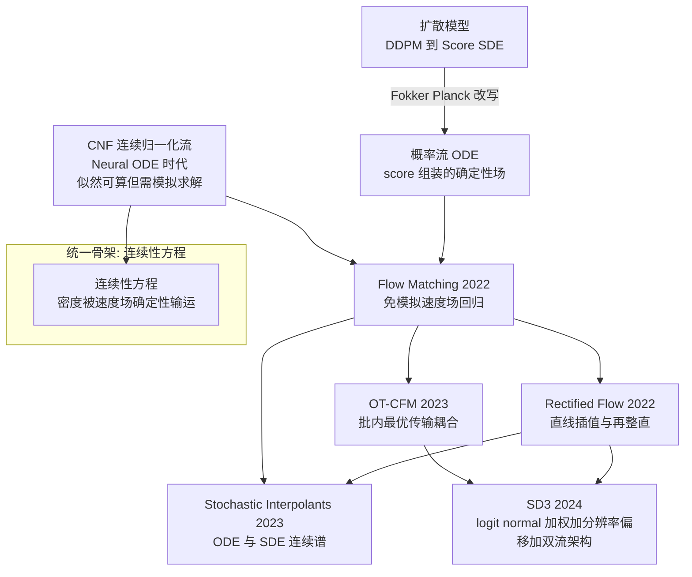
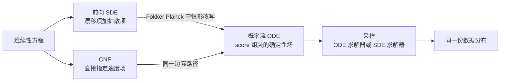

> **TL;DR 三连**
>
> - **核心结论**：扩散模型、CNF、Flow Matching 是同一个数学骨架——连续性方程——的三种参数化。FM（arXiv:2210.02747）证明了「回归条件向量场」与「回归不可观测的边际向量场」梯度严格相等（CFM 定理），从而把生成建模变成一个免模拟的监督回归；而这条回归目标与 score matching 只差一个时间加权 $$w(t)=b^2(t)$$，三条路线在损失层面完全汇合。
> - **反直觉发现**：SD3 用数十种公式的大规模消融证明，决定 RF 训练成败的往往不是"用哪个路径公式"，而是 **timestep 采样分布 π(t)**——把均匀采样换成 logit-normal 就能稳定超越 EDM 与经典 LDM 公式；高分辨率还要再叠加一个 shift 重映射。所谓"噪声调度"，其实是概率路径、时间分布、输出参数化三个正交旋钮的组合。
> - **定位**：本篇是 Flow Matching 系列的开篇，沿"统一视角 → CFM 完整推导 → 与 score matching 等价 → Rectified Flow / Stochastic Interpolants / 批内 OT 耦合三大变体 → SD3 工业实践 → 训练坑清单"的脉络一次讲透算法发展史。所有论文摘要均经 arXiv 原文核实。



## 1. 引言：三条路线的汇流与一个反问

过去十年深度生成模型沿四条彼此独立的路线演化，各有各的账本：

| 路线 | 训练信号 | 采样方式 | 主要痛点 |
|---|---|---|---|
| GAN 对抗路线 | 判别器的对抗梯度 | 单步前传 | 训练不稳定、模式坍缩 |
| VAE 变分路线 | ELBO 变分下界 | 解码器单步 | 后验近似导致样本模糊 |
| 自回归路线 | 逐步极大似然 | 序列化解码 | 高维连续数据推理成本高 |
| 迭代精化路线 | 去噪/score 回归 | 多步迭代 | 采样步数多、设计空间杂乱 |

迭代精化路线内部发生过两次关键的"语法重构"。第一次，Sohl-Dickstein 等人用非平衡热力学提出"前向缓慢破坏结构、反向学习恢复结构"的原始框架（[arXiv:1503.03585](https://arxiv.org/abs/1503.03585)）；Ho 等人的 DDPM 以加权变分下界把它做成可规模化的图像生成器，并点破了它与去噪 score matching 的联系（[arXiv:2006.11239](https://arxiv.org/abs/2006.11239)）。第二次，Song 等人把离散加噪链改写成随机微分方程，指出反向 SDE 只依赖扰动数据分布的 score 函数，且存在与之边际等价的神经 ODE（[arXiv:2011.13456](https://arxiv.org/abs/2011.13456)）；Karras 等人的 EDM 进一步把整个设计空间剥离成"概率路径 + 预处理 + 采样调度"三个正交选择并刷新 CIFAR-10 记录（[arXiv:2206.00364](https://arxiv.org/abs/2206.00364)）。

到这一步，一个自然的反问浮出水面：如果生成过程本质上只是**把一个简单分布连续变形为数据分布**，那"扩散"这个物理意象以及它绑定的特定噪声调度还是必要的吗？Flow Matching 给出了否定回答——它绕开加噪去噪叙事，直接以连续性方程为骨架学习速度场。这个转向在 2023–2024 年迅速成为工业界默认选项：Stable Diffusion 3 在大规模系统对比后选定 Rectified Flow 形式的 FM 训练（[arXiv:2403.03206](https://arxiv.org/abs/2403.03206)）；语音侧 Meta 的 Voicebox 明确以 flow-matching 模型做语音补全，训练数据超过五万小时（[arXiv:2306.15687](https://arxiv.org/abs/2306.15687)）；SiT 则在 DiT 骨架上系统验证插值框架全面超越对应扩散配置（[arXiv:2401.08740](https://arxiv.org/abs/2401.08740)）。

理解 FM 因此不再是"又一种生成模型"，而是读懂当前主流生成系统的共同底层语法。全文记号约定如下：$$x_1\sim q$$ 表示数据端点、$$x_0\sim\mathcal N(0,I)$$ 表示噪声端点、$$t\in[0,1]$$ 从噪声流向数据、$$p_t$$ 为边际概率路径、$$u_t(x)$$ 为边际向量场、$$u_t(x\mid x_1)$$ 为条件向量场、$$v_\theta(t,x)$$ 为神经网络预测的速度场。

## 2. 统一概率视角：扩散模型就是一种 CNF

### 2.1 CNF 与瞬时变量替换公式

**定义 2.1（CNF）** 设 $$v_\theta:[0,1]\times\mathbb R^d\to\mathbb R^d$$ 光滑，考虑 ODE $$\frac{d}{dt}\psi_t(x)=v_\theta(t,\psi_t(x)),\ \psi_0=\mathrm{id}$$。若 $$v_\theta$$ 对 $$x$$ Lipschitz，则流映射 $$\psi_t$$ 是微分同胚；给定基分布 $$p_0$$，模型分布为推前 $$p_1={\psi_1}_\# p_0$$。

朴素似然计算需要逐点 Jacobian 行列式，代价 $$O(d^3)$$。Neural ODE 给出瞬时变量替换公式，将对数行列式换成迹的时间积分（[arXiv:1806.07366](https://arxiv.org/abs/1806.07366)）：

$$
\log p_1\big(\psi_1(x)\big) = \log p_0(x) - \int_0^1 \mathrm{tr}\!\left(\frac{\partial v_\theta}{\partial x}\big(t,\psi_t(x)\big)\right)dt .
$$

**推导**：对局部流 $$\phi_{t+\epsilon,t}(z)=z+\epsilon v_\theta(t,z)+O(\epsilon^2)$$，其 Jacobian 为 $$I+\epsilon A+O(\epsilon^2)$$（$$A=\partial_x v_\theta$$），利用特征值一阶展开 $$\det(I+\epsilon A)=1+\epsilon\,\mathrm{tr}(A)+O(\epsilon^2)$$，取对数得 $$\epsilon\,\mathrm{tr}(A)+O(\epsilon^2)$$，对区间积分即得。$$\blacksquare$$

问题在于训练时每一项似然都要反解 ODE 或用 adjoint 回传，FFJORD 用 Hutchinson 随机迹估计器把迹的计算降为无偏估计、放开了网络结构限制，但"训练循环里嵌套 ODE 求解器"的本质开销没有消失（[arXiv:1810.01367](https://arxiv.org/abs/1810.01367)）。这正是 CNF 长期无法规模化的原因，也是 FM 的出发点：**绕开似然，只做采样导向的速度场回归**。

### 2.2 从离散加噪到连续 SDE

DDPM 前向过程是马尔可夫链 $$q(x_k\mid x_{k-1})=\mathcal N(\sqrt{1-\beta_k}\,x_{k-1},\beta_k I)$$。当步数趋于无穷、$$\beta_k=\beta(k/K)\Delta t$$ 时收敛到 Itô SDE $$dx=f_t(x)\,dt+g_t\,dw$$：VP-SDE 取 $$f_t=-\frac12\beta(t)x,\ g_t=\sqrt{\beta(t)}$$，VE-SDE 取 $$f_t=0,\ g_t=\sqrt{d\sigma^2/dt}$$。密度演化由 Fokker–Planck 方程刻画：

$$
\frac{\partial p_t}{\partial t} = -\nabla\cdot(f_t\,p_t) + \frac{g_t^2}{2}\Delta p_t .
$$

无论加噪多么随机，密度的演化是一个完全确定的 PDE 动力学。

### 2.3 概率流 ODE：把随机性收进速度场

利用 $$\Delta p_t=\nabla\cdot(p_t\nabla\log p_t)$$（因为 $$\nabla\log p_t=\nabla p_t/p_t$$），Fokker–Planck 右端第二项可改写为守恒形式，合并两项：

$$
\frac{\partial p_t}{\partial t} = -\nabla\cdot\Big(\big[\,f_t-\tfrac{g_t^2}{2}\nabla\log p_t\,\big]p_t\Big).
$$

这正是一个连续性方程，对应的确定性 ODE 称为**概率流 ODE**：

$$
\frac{dx}{dt}=u_t^{\mathrm{PF}}(x),\qquad u_t^{\mathrm{PF}}(x)=f_t(x)-\frac{g_t^2}{2}\nabla_x\log p_t(x).
$$

Song et al. 的原文明确给出"与反向 SDE 采样同分布的等价神经 ODE"（[arXiv:2011.13456](https://arxiv.org/abs/2011.13456)）。含义极其深刻：**每一个扩散模型内在地都是一个 CNF**，其速度场由漂移项与 score 共同组装；DDIM 本质上就是这个 ODE 的离散近似。至此三条线在数学上完全汇合：



### 2.4 连续性方程：统一的骨架

**引理 2.2** 设光滑速度场 $$u_t$$ 诱导流 $$\psi_t$$，$$p_t={\psi_t}_\#p_0$$，则 $$\partial_t p_t+\nabla\cdot(p_t u_t)=0$$。

**推导**：对任意紧支撑测试函数 $$\varphi$$，由推前定义与流的可逆性交换积分次序：$$\int\varphi\,dp_t=\int\varphi(\psi_t(z))\,dp_0(z)$$。对 $$t$$ 求导并用链式法则得 $$\int\nabla\varphi\cdot u_t\,p_t dx$$；分部积分（边界项消失）化为 $$-\int\varphi\,\nabla\cdot(u_t p_t)dx$$，由 $$\varphi$$ 的任意性得证。$$\blacksquare$$

这个方程给出三点结构性认识：其一，任何确定性传输方案都唯一对应一对 $$(p_t,u_t)$$；其二，给定两端固定（$$p_0=\mathcal N(0,I)$$、$$p_1=q$$）的光滑路径族，至少存在一个速度场生成它，且在 $$p_t>0$$ 处几乎处处唯一；其三，于是"学生成模型"可以重述为纯粹的**回归问题**——找到 $$\hat u_t$$ 使其诱导路径逼近指定传输。下一章的全部内容就是把第二点和第三点变成可执行算法。

## 3. Flow Matching 完整推导：把生成变成回归

以下推导完整复现 Lipman 等人的核心定理链（[arXiv:2210.02747](https://arxiv.org/abs/2210.02747)）。该文摘要自述其为"基于回归固定条件概率路径之向量场的免模拟 CNF 训练方法"，且其高斯路径族涵盖既有扩散路径为特例——下面逐条兑现这句话。

### 3.1 问题设定

数据分布记 $$q(x_1)$$，先验取标准高斯 $$p_0=\mathcal N(0,I)$$。目标：找速度场 $$v_\theta$$ 使其 ODE 流把 $$p_0$$ 推前为 $$q$$。与 CNF 的差别在于**不再计算似然**，转而构造一条参考路径 $$p_t$$ 并直接回归其速度场。

### 3.2 条件概率路径与边际化

FM 的关键构件是**条件概率路径** $$p_t(x\mid x_1)$$：一族以单个数据点 $$x_1$$ 为条件的密度，满足边界条件 $$p_0(x\mid x_1)$$ 与 $$x_1$$ 无关（取 $$\mathcal N(0,I)$$）、$$p_1(x\mid x_1)\approx\delta(x-x_1)$$（用小方差高斯近似）。对其做混合得到**边际概率路径**：

$$
p_t(x) = \int p_t(x\mid x_1)\,q(x_1)\,dx_1 .
$$

两个边界自动成立：$$p_0=\mathcal N(0,I)$$（因为条件分布与 $$x_1$$ 无关）、$$p_1\approx q$$（方差趋零时混合趋向经验分布）。注意 $$p_t$$ 完全由设计决定，不需要任何扩散过程的反演。

### 3.3 定理一：边际向量场

每个条件路径都有生成它的条件向量场 $$u_t(x\mid x_1)$$（满足关于 $$p_t(x\mid x_1)$$ 的连续性方程）。定义**边际向量场**：

$$
u_t(x) \;:=\; \mathbb E_{q}\big[\,u_t(x\mid x_1)\;\big\vert\;x_t=x\,\big] = \frac{1}{p_t(x)}\int u_t(x\mid x_1)\,p_t(x\mid x_1)\,q(x_1)\,dx_1 .
$$

**定理一**：$$u_t$$ 生成边际路径 $$p_t$$，即 $$\partial_t p_t+\nabla\cdot(p_t u_t)=0$$，且 $$p_0,p_1$$ 边界如上。

**证明**：条件密度满足 $$\partial_t p_t(x\mid x_1)=-\nabla\cdot(p_t(x\mid x_1)u_t(x\mid x_1))$$。两边乘 $$q(x_1)$$ 积分：左端由控制收敛交换求导与积分得 $$\partial_t p_t(x)$$；右端散度算子提出积分号，得 $$-\nabla\cdot\int p_t(x\mid x_1)u_t(x\mid x_1)q(x_1)dx_1$$，再按定义恰好等于 $$-\nabla\cdot(p_t(x)u_t(x))$$。$$\blacksquare$$

唯一性说明：凡生成同一路径的速度场彼此只差一个与 $$p_t$$ 正交的无旋分量，在 $$p_t>0$$ 处几乎处处唯一——所以"这条路径的唯一速度场"是有良定意义的对象。

### 3.4 FM 损失的不可直接优化性

最朴素的回归目标是

$$
\mathcal L_{\mathrm{FM}}(\theta)=\mathbb E_{t,\,x_1\sim q,\,x\sim p_t}\big\|v_\theta(t,x)-u_t(x)\big\|^2 .
$$

它是良定的，却**不可计算**：$$u_t(x)$$ 里藏着 Bayes 后验 $$p_t(x_1\mid x)/q$$，和 score 一样属于"知道答案也写不出来"的量。这与 score matching 当年的困境一模一样，解法也一样——用条件量做蒙特卡洛代理。

### 3.5 定理二：Conditional Flow Matching 的梯度恒等

定义**CFM 损失**：

$$
\mathcal L_{\mathrm{CFM}}(\theta)=\mathbb E_{t,\,x_1\sim q,\,x\sim p_t(\cdot\mid x_1)}\big\|v_\theta(t,x)-u_t(x\mid x_1)\big\|^2 ,
$$

其中 $$x\sim p_t(\cdot\mid x_1)$$ 可以解析采样（见 §3.6），$$u_t(x\mid x_1)$$ 有闭式解。

**定理二**：对所有 $$\theta$$，$$\nabla_\theta\mathcal L_{\mathrm{FM}}=\nabla_\theta\mathcal L_{\mathrm{CFM}}$$。

**证明**（展开技巧）：将 $$\mathcal L_{\mathrm{CFM}}$$ 按平方拆成三项。第一项 $$\mathbb E\|v_\theta\|^2$$ 中，先采 $$x_1$$ 再采 $$x\sim p_t(\cdot\mid x_1)$$ 的复合分布恰是边际 $$p_t$$，故该项等于 $$\mathbb E_{t,x\sim p_t}\|v_\theta\|^2$$。交叉项中固定 $$x$$ 对 $$x_1$$ 取期望：

$$
-2\,\mathbb E_{x_1}\big[\langle v_\theta,u_t(x\mid x_1)\rangle\big] = -2\,\langle v_\theta,\ \mathbb E[u_t(x\mid x_1)\mid x]\rangle = -2\langle v_\theta, u_t(x)\rangle,
$$

末步正是 §3.3 边际向量场的定义。第三项 $$\mathbb E\|u_t(x\mid x_1)\|^2$$ 不含 $$\theta$$。于是

$$
\mathcal L_{\mathrm{CFM}}(\theta)=\underbrace{\mathbb E_{t,x\sim p_t}\big[\|v_\theta\|^2-2\langle v_\theta,u_t\rangle\big]}_{\text{与 } \mathcal L_{\mathrm{FM}} \text{ 的 } \theta\text{-依赖部分逐项相同}} + C ,
$$

两者只差与 $$\theta$$ 无关的常数 $$C$$，梯度恒等。$$\blacksquare$$

这就是全部魔法：**优化一个每项都可采样的监督回归，等价于优化那个永远写不出来的目标**。训练时甚至不需要知道 $$C$$ 是多少。

### 3.6 高斯条件路径实例化：解析条件场的推导

取高斯条件路径 $$p_t(x\mid x_1)=\mathcal N(\alpha_t x_1,\sigma_t^2 I)$$，即样本 $$X_t=\alpha_t x_1+\sigma_t\varepsilon$$。对时间求导 $$\frac{d}{dt}X_t=\dot\alpha_t x_1+\dot\sigma_t\varepsilon$$，而给定 $$X_t$$ 可反解 $$\varepsilon=(X_t-\alpha_t x_1)/\sigma_t$$，代入并取条件期望得**条件向量场闭式解**：

$$
u_t(x\mid x_1) = \Big(\dot\alpha_t-\frac{\dot\sigma_t}{\sigma_t}\alpha_t\Big)x_1 + \frac{\dot\sigma_t}{\sigma_t}\,x .
$$

Lipman 等的具体选择是 $$\alpha_t=t$$、$$\sigma_t=1-(1-\sigma_{\min})t$$（$$\sigma_{\min}$$ 小正数防端点奇异），代入化简（利用 $$\sigma_t+t(1-\sigma_{\min})=1$$）：

$$
u_t(x\mid x_1) = \frac{x_1-(1-\sigma_{\min})\,x}{1-(1-\sigma_{\min})\,t} .
$$

当 $$\sigma_{\min}\to 0$$ 这正是"从当前点以恒定速率直线走向 $$x_1$$"的速度场——线性插值 $$x_t=(1-t)x_0+t x_1$$ 的速度 $$x_1-x_0=(x_1-x_t)/(1-t)$$ 与之完全吻合。FM 论文的摘要强调用最优传输位移插值构造条件路径能带来更快的训练与采样、更好的泛化，这一选择后来被批内 OT 耦合进一步强化（§7）。

### 3.7 训练与采样算法

训练：重复 (i) 采 $$x_1\sim q$$、$$x_0\sim\mathcal N(0,I)$$；(ii) 采 $$t\sim\pi(t)$$（先均匀，见 §8 的改进）；(iii) 构造 $$x_t=\alpha_t x_1+\sigma_t x_0$$；(iv) 回归 $$v_\theta(t,x_t)\approx u_t(x_t\mid x_1)$$。采样：从 $$x_0\sim\mathcal N(0,I)$$ 出发用 Euler 或更高阶格式积分 ODE 至 $$t=1$$。完整的可运行骨架见 §9.5。

## 4. CFM 与 Score Matching 的精确等价

### 4.1 DSM 一侧的目标

去噪 score matching 利用 Tweedie 公式把 score 回归变成同样可采样的形式：

$$
\mathcal L_{\mathrm{DSM}}(\theta)=\mathbb E_{t,\,x_1\sim q,\,x\sim p_t(\cdot\mid x_1)}\big\|s_\theta(t,x)-\nabla_x\log p_t(x\mid x_1)\big\|^2,\qquad \nabla_x\log p_t(x\mid x_1)=\frac{\alpha_t x_1-x}{\sigma_t^2}.
$$

DDPM 的成功正是因为加权变分下界与 DSM 的联系（[arXiv:2006.11239](https://arxiv.org/abs/2006.11239)）。表面上看，score（指向密度上升方向的 $$d$$ 维场）与 velocity（密度被输运的方向）是两种动物——下面的主换算公式说明它们是同一个量的两种坐标。

### 4.2 主换算公式

对高斯路径，条件 score 即 $$s_t(x\mid x_1)=(\alpha_t x_1-x)/\sigma_t^2$$，边际 score 为 $$s_t(x)=\mathbb E[s_t(x\mid x_1)\mid x]=(\alpha_t\mathbb E[x_1\mid x]-x)/\sigma_t^2$$，反解出 $$\mathbb E[x_1\mid x]=(x+\sigma_t^2 s_t(x))/\alpha_t$$。将其代入 §3.6 条件场的边际化 $$\mathbb E[u_t(x\mid x_1)\mid x]=u_t(x)$$，整理后得到本文最重要的恒等式：

$$
\boxed{\; u_t(x) = a(t)\,x + b(t)\,s_t(x),\qquad a(t)=\frac{\dot\alpha_t}{\alpha_t},\quad b(t)=\frac{(\dot\alpha_t\sigma_t-\alpha_t\dot\sigma_t)\,\sigma_t}{\alpha_t} \;}
$$

**推导核对**：$$u_t=(\dot\alpha-\dot\sigma\alpha/\sigma)(x+\sigma^2 s)/\alpha+(\dot\sigma/\sigma)x$$，$$x$$ 的系数合并为 $$[(\dot\alpha\sigma-\dot\sigma\alpha)+\dot\sigma\alpha]/(\alpha\sigma)\cdot\sigma=\dot\alpha/\alpha=a(t)$$；$$s$$ 的系数为 $$(\dot\alpha\sigma-\dot\sigma\alpha)\sigma/\alpha=b(t)$$。$$\blacksquare$$

### 4.3 三条经典路径的显式验证

| 路径 | $$\alpha_t$$ | $$\sigma_t$$ | $$a(t)$$ | $$b(t)$$ | 速度场形态 |
|---|---|---|---|---|---|
| OT 线性插值 | $$t$$ | $$1-(1-\sigma_{\min})t$$ | $$1/t$$ | $$\sigma_t/t$$ | $$u_t=(x+\sigma_t^2 s_t)/t$$ |
| VE | $$1$$ | $$t$$ | $$0$$ | $$-t$$ | $$u_t=-t\,s_t$$ |
| VP（$$\beta$$ 常数） | $$e^{-\beta t/2}$$ | $$\sqrt{1-e^{-\beta t}}$$ | $$-\beta/2$$ | $$-\beta/2$$ | $$u_t=-\frac{\beta}{2}(x+s_t)$$ |

三行都可以独立交叉验证：VE 行与 Song 等的概率流 ODE $$u=f-\frac{g^2}{2}s$$（此时 $$f=0,g^2=2t$$）完全一致；VP 行与 $$f=-\frac\beta2x,g^2=\beta$$ 的概率流 ODE 完全一致——这不是巧合，而是恒等式正确性的强证据。

### 4.4 等价性的真正含义

由于 $$u=ax+bs$$ 逐点成立，若令网络经参数化 $$s_\theta=v_\theta/b(t)$$ 预测 score，则 $$\|v_\theta-u\|^2=b^2(t)\,\|s_\theta-s\|^2$$ 逐点成立。于是：

- **最优解集合相同**：CFM 与 DSM 的总体最优都是真值；
- **经验损失只差时间加权**：CFM ≡ 权重为 $$b^2(t)$$ 的 DSM（反之 DSM 是权重 $$1/b^2$$ 的 CFM）。VP 常数 $$\beta$$ 时 $$b\equiv-\beta/2$$ 与 $$t$$ 无关，两损失只差全局常数因子，这是"严格等价"的特例；
- **工程推论**：换输出参数化（noise/x0/velocity/score 四选一）从不改变最优解，改变的只是有效权重曲线与不同时刻的信噪比——这正是 §8 timestep 分布实验的理论注脚，也是 EDM"预处理与调度解耦"思想（[arXiv:2206.00364](https://arxiv.org/abs/2206.00364)）在 FM 语言下的重现。

一张表总结三种身份："学 score 的模型"、"学 velocity 的模型"、"学去噪器的模型"是同一个函数经过 $$a,b$$ 线性重组后的三个名字。

## 5. Rectified Flow：直线路径与再整直

Liu 等人几乎同时提出的 Rectified Flow 把"线性插值"推向极致（[arXiv:2209.03003](https://arxiv.org/abs/2209.03003)）。设定 $$z_t=t\,x_1+(1-t)\,x_0$$（注意该文记号方向与 FM 相反：$$\pi_0$$ 是噪声、$$\pi_1$$ 是数据——纯约定差异），训练目标是最小二乘：

$$
\min_v\ \mathbb E_{t,\,(x_0,x_1)\sim\pi}\big\|v(z_t)-(x_1-x_0)\big\|^2 .
$$

**核心定理**：总体最小二乘解为条件期望 $$v^\*(z)=\mathbb E[x_1-x_0\mid z_t=z]$$，它生成的 ODE 保持每个时刻的边际分布不变。证明思路与 FM 定理一的"条件期望技巧"完全同源——两篇文章殊途同归地发现了同一个结构。摘要的自述非常克制：直线路径之所以特殊是因为两点间最短、且可以在不做时间离散化的情况下精确模拟；整流（rectification）过程能把任意耦合转化为新的确定性耦合，且凸传输代价可证单调不增。

ReFlow 迭代是该文最有辨识度的贡献：用当前模型跑 ODE 生成新配对 $$(x_0',x_1')$$（这同时把任意耦合变成了确定性耦合），再用直线目标重训。每一次迭代轨迹更直，少步 Euler 采样的误差随之下降，逼近单步生成。值得强调的是：**RF 的"域迁移"视角把 $$(x_0,x_1)$$ 的语义泛化了**——两端不必是"噪声和数据"，可以是两张不同域的图像，这使同一套算法同时覆盖生成式建模与图像翻译。

与 FM 的关系一句话说清：RF 的线性插值就是 FM 高斯路径族在 $$\alpha_t=t,\sigma_t=1-t$$（即 $$\sigma_{\min}=0$$ 极限）的成员；差异不在目标而在叙事重心——FM 强调路径与耦合的设计空间，RF 强调迭代整直与少步采样。

## 6. Stochastic Interpolants：ODE 与 SDE 的连续谱

Albergo、Boffi 与 Vanden-Eijnden 的 Stochastic Interpolants 把视野进一步拉宽（[arXiv:2303.08797](https://arxiv.org/abs/2303.08797)）。他们考虑的**随机插值**是一大类连续时间过程：组合两端密度中的数据点与一个额外的隐变量来灵活塑形桥，典型线性形式为

$$
x_t = b(t)\,x_0 + a(t)\,x_1 + \gamma(t)\,z,\qquad z\sim\mathcal N(0,I),
$$

要求 $$b(0)=a(1)=\gamma(0)=\gamma(1)=0$$ 且端点处分别还原 $$x_0,x_1$$。$$\gamma\equiv 0$$ 时退化为确定性插值（RF/FM 的直线、三角函数插值等）；$$\gamma(t)=\sqrt{t(1-t)}$$ 一类的桥式噪声则让中间时刻携带额外随机性——原文的线性插值速查表里，VP 型（$$\sqrt{1-t^2},t$$）、三角型（$$\cos\frac\pi2 t,\sin\frac\pi2 t$$）、编码解码型等悉数在列。

该框架的三个支柱性结果：其一，插值过程的密度同时满足一阶输运方程**和**一族带可调扩散系数的正反向 Fokker–Planck 方程——这意味着同一个训练好的模型既能驱动确定性概率流 ODE，也能驱动噪声水平任意的生成式 SDE，ODE 与 SDE 从"二选一"变成了连续谱上的旋钮；其二，漂移系数（速度场与 score）都是简单二次目标的唯一极小者，其中一个是对 score 的新目标函数，且随机动力学的似然可控而确定性动力学的要求更苛刻；其三，若对插值函数本身做优化，可以恢复两端密度间的薛定谔桥——摘要还明确列出该框架统一了 score-based 扩散、随机定位、概率去噪与 rectifying flows。SiT 提供了视觉领域的系统实证：在 DiT 骨架、同等参数量与计算量下，插值框架配合扩散系数调节在 ImageNet 256/512 上全面超越对应扩散基线（[arXiv:2401.08740](https://arxiv.org/abs/2401.08740)）。

对实践者的翻译：SI 告诉你"训练目标"与"采样动力学"应当解耦——先用回归把桥上的漂移学出来，再自由选择用多少噪声、走 ODE 还是 SDE 到达终点。这与 EDM 的解耦精神一致，但把自由度从调度扩展到了插值函数本身。

## 7. Minibatch OT 耦合：把弯路掰直

以上方法默认配对方式是**独立耦合** $$\pi=p_0\otimes q$$。Tong 等人指出这是被忽视的自由度（[arXiv:2302.00482](https://arxiv.org/abs/2302.00482)）：独立耦合会让大量条件路径互相穿越，边际速度场被迫绕行，轨迹弯曲、离散化误差大。他们的 generalized CFM 家族有一个重要性质：**不要求源分布是高斯，也不要求评估其密度**——这在单细胞动力学推断这类源分布未知的场景是刚需。

OT-CFM 的改动只有一处：每个 minibatch 内先用最优传输计划（Kantorovich 或 Sinkhorn，代价常取平方欧氏距离）重排 $$(x_0,x_1)$$ 配对，再做 CFM 回归。摘要给出的理论承诺相当精确：OT-CFM 产生更简单、训练更稳、推理更快的流；当真实 OT 计划可得时，该方法逼近**动态最优传输**。代价与权衡同样真实：

| 维度 | 独立耦合 | 批内 OT 耦合 |
|---|---|---|
| 实现成本 | 一行 `randn` 配对 | 每 batch 加一次 OT 求解 |
| 轨迹形状 | 大量交叉、弯曲 | 显著变直、离散化友好 |
| 边缘保真 | 天然保持 | 低成本配对可能压制多样性 |
| batch 敏感性 | 无 | 匹配质量受 batch 大小制约 |
| 适用场景 | 通用默认 | 少步采样、科学计算传输 |

实践建议：默认独立耦合起步；若目标是少步采样或轨迹本身有意义（细胞轨迹、分子构象过渡），再上批内 OT，并同时监控生成多样性与边缘统计。同组的后续会议版本以 Multisample Flow Matching 的名义细化了这一方向。

## 8. 从理论到工业标准：SD3 的三个决定

Stable Diffusion 3 的技术报告做了三件影响整个行业的事（[arXiv:2403.03206](https://arxiv.org/abs/2403.03206)）。

**决定一：选 Rectified Flow 作为底层公式。** 报告开展了覆盖数十种扩散与流式公式的大规模系统研究，结论是只有改了 timestep 采样的 RF 变体才能稳定超越 EDM 与经典的 LDM-Linear（eps/linear）公式。

**决定二：logit-normal 时间加权。** 直觉是中间信噪比时刻最难也最重要，应多采样。logit-normal 密度为

$$
\pi_{\mathrm{ln}}(t;m,s)=\frac{1}{s\sqrt{2\pi}}\cdot\frac{1}{t(1-t)}\exp\!\Big(-\frac{(\mathrm{logit}(t)-m)^2}{2s^2}\Big),
$$

采样实现极其简单：先采 $$u\sim\mathcal N(m,s)$$ 再过 logistic 函数。消融显示 $$m=0,s=1.00$$ 的组在各种采样步数设置下排名 consistently 最优，且 logit-normal 整体优于均匀 RF、EDM 与 LDM-Linear；报告同时测试了端点非零的重尾 mode 采样作为对照。各种时间分布的对比如下：

| 时间分布 $$\pi(t)$$ | 端点密度 | 加权倾向 | SD3 实验结论 |
|---|---|---|---|
| 均匀 | 处处相等 | 无 | 经典 RF 默认，被显著超越 |
| logit-normal | 两端为零 | 中间集中 | $$m{=}0,s{=}1.0$$ 组排名 consistently 最优 |
| mode 重尾 | 端点非零 | 中间集中带重尾 | 用于检验端点欠拟合风险 |

**决定三：分辨率相关的 shift 调度。** 高分辨率图有更多像素，需要更强噪声才能摧毁信号；直接沿用低分辨率的等效噪声水平会系统性欠噪。SD3 的做法是把 timestep 做重映射

$$
t_m=\frac{\sqrt{m/n}\;t_n}{1+(\sqrt{m/n}-1)\,t_n},
$$

其中 $$n=H\cdot W$$ 是像素数、$$m$$ 是参照分辨率像素数。人类偏好实验显示 shift 大于 1.5 后质量显著偏好、继续增大收益递减，最终 1024×1024 分辨率训练与采样均采用 $$\alpha=\sqrt{m/n}=3.0$$。此外架构上提出 MM-DiT：文本与图像 token 各持一套独立权重、在联合注意力中双向交互（可选 QK RMSNorm 稳定训练），改善了文本理解与排版能力；并以验证损失的 scaling 曲线作为下游质量的可靠代理指标，趋势未见饱和。

## 9. 训练实践坑清单

### 9.1 "噪声调度"其实是三个旋钮

传统扩散语境的"schedule"在 FM 语言下分解为三个正交选择：(i) 概率路径 $$(\alpha_t,\sigma_t)$$；(ii) timestep 采样分布 $$\pi(t)$$；(iii) 网络输出参数化。三者通过 §4 主换算公式互相换算——任何一个的改动都等价于给损失乘一条时间加权曲线 $$w(t)$$。坑在于：很多论文的"新方法"只是悄悄动了其中一个旋钮而不自知。自查清单：报告实验时把三个旋钮写全；复现他人结果先对齐三者的等效权重。

### 9.2 数值与端点坑

$$\sigma_{\min}$$ 过大导致终点分布模糊（模型永远在猜一个小方差高斯的均值），过小则 $$t\to1$$ 处除零放大数值噪声；logit-normal 两端密度为零，极端时刻欠采样可能造成首尾质量退化，必要时换端点非零的重尾分布；高分辨率训练忘加 shift 是"放大就糊"的经典根因；EMA 与非 EMA 权重的选择足以改变消融排名顺序（SD3 特意对两者取平均排名）。

### 9.3 耦合策略坑

见表三（§7）。补充两条容易踩的：批内 OT 与后续蒸馏管线的交互尚缺系统研究，整直带来的好处可能被蒸馏重新洗牌；OT 耦合压多样性的风险在高熵数据集上更明显，务必监控召回类指标而非只看 FID。

### 9.4 架构选择坑

U-Net 成熟稳妥，DiT/MM-DiT 类纯 transformer 扩展性更好——SD3 的证据是验证损失 scaling 与下游指标强相关且未见饱和。时间条件注入推荐调制式（adaLN 风格的 modulation linear，作用于每个块的 norm 与门控），输出层零初始化让残差块初始为恒等映射，是 velocity 目标下被反复验证的稳定化技巧；文本条件走联合注意力（双流权重）优于简单 cross-attention 拼接。

### 9.5 可运行骨架与变量映射表

```python
# 极简 Flow Matching 训练步 + Euler 采样（PyTorch 风格）
import torch, torch.nn.functional as F

def fm_loss(model, x1, sig_min=1e-5, ot_coupler=None):
    # x1: (B, d) 真实数据批次；x0 为同形状高斯噪声
    x0 = torch.randn_like(x1)                       # 先验噪声端点
    if ot_coupler is not None:                      # 可选: 批内最优传输重配对
        x0 = ot_coupler(x0, x1)                     # OT-CFM 的唯一改动点
    t = torch.rand(x1.size(0), 1, device=x1.device) # 均匀时间采样; 可换 logit-normal
    alpha_t = t                                     # OT 路径: alpha_t = t
    sigma_t = 1 - (1 - sig_min) * t                 # OT 路径: sigma_t = 1-(1-sig_min)t
    xt = alpha_t * x1 + sigma_t * x0                # 条件路径样本
    target = (x1 - (1 - sig_min) * xt) / sigma_t    # 解析条件向量场
    v = model(t, xt)                                # 网络预测速度场
    return F.mse_loss(v, target)

@torch.no_grad()
def euler_sample(model, n, dim, steps=64):
    x = torch.randn(n, dim)
    ts = torch.linspace(0.0, 1.0, steps + 1)
    for i in range(steps):
        t = ts[i].expand(n, 1)
        x = x + (ts[i + 1] - ts[i]) * model(t, x)   # 显式 Euler 积分
    return x
```

##### 变量映射表（数学 ↔ 代码）

| 数学符号 | 代码变量 | Shape / 类型 | 含义 |
|---|---|---|---|
| $$x_1\sim q$$ | `x1` | `(B, d)` | 数据端点（条件变量） |
| $$x_0\sim\mathcal N(0,I)$$ | `x0` | `(B, d)` | 先验噪声端点 |
| $$t\in[0,1]$$ | `t` | `(B, 1)` | 插值时间 |
| $$\alpha_t,\ \sigma_t$$ | `alpha_t, sigma_t` | `(B, 1)` | 高斯路径系数 |
| $$x_t$$ | `xt` | `(B, d)` | 路径中间样本 |
| $$u_t(x\mid x_1)$$ | `target` | `(B, d)` | 条件向量场回归目标 |
| $$v_\theta(t,x)$$ | `v` / `model` | `(B, d)` | 网络速度预测 |
| $$\sigma_{\min}$$ | `sig_min` | 标量 | 端点正则，防除零 |

读者可以把 `fm_loss` 里的 `target` 换成 $$(x_1-x_0)/(1-t)$$（$$\sigma_{\min}=0$$ 的 RF 目标）做对照实验，确认两者在 $$\sigma_{\min}\to0$$ 时数值一致。

## 10. 全景对照表

| 方法 | 年份 | 训练目标 | 设计自由度 | 采样器 | 一句话局限 |
|---|---|---|---|---|---|
| DDPM（[arXiv:2006.11239](https://arxiv.org/abs/2006.11239)） | 2020 | 加权 VLB ≈ DSM | 固定 VP 链 | ancestral 多步 | 调度与目标纠缠 |
| Score SDE（[arXiv:2011.13456](https://arxiv.org/abs/2011.13456)） | 2021 | score 回归 | 漂移与扩散自由 | SDE 或概率流 ODE | 仍以"加噪"为中心叙事 |
| Neural ODE / FFJORD（[arXiv:1806.07366](https://arxiv.org/abs/1806.07366)、[1810.01367](https://arxiv.org/abs/1810.01367)） | 2018–19 | 极大似然（迹积分） | 任意速度场 | ODE | 训练需嵌套 ODE 求解 |
| Flow Matching（[arXiv:2210.02747](https://arxiv.org/abs/2210.02747)） | 2022 | CFM 速度回归 | 高斯路径族＋OT 路径 | ODE | 耦合默认独立 |
| Rectified Flow（[arXiv:2209.03003](https://arxiv.org/abs/2209.03003)） | 2022 | 直线 LS＋ReFlow | 直线＋任意耦合 | ODE 少步 | 单步质量仍靠蒸馏 |
| OT-CFM（[arXiv:2302.00482](https://arxiv.org/abs/2302.00482)） | 2023 | CFM＋批内 OT 计划 | 耦合自由、源分布任意 | ODE | batch 敏感、多样性风险 |
| Stochastic Interpolants（[arXiv:2303.08797](https://arxiv.org/abs/2303.08797)） | 2023 | 二次目标双回归 | 插值函数族＋可调扩散 | ODE 或 SDE 连续谱 | 概念负担最高 |
| SD3 实践（[arXiv:2403.03206](https://arxiv.org/abs/2403.03206)） | 2024 | RF＋logit-normal＋shift | 同 RF＋时间分布 | 少步 ODE | 工业配方仍在快速演进 |

读法提示：纵向看"设计自由度"一列从固定到自由的单向放开——这正是"算法发展"的主线；横向看"训练目标"一列，DDPM 之后所有方法本质上都是 §4 意义下的同一回归目标的不同加权。

## 11. 批判与展望

**名词通胀与等价性内卷。** FM、RF、I-CFM、SB-CFM、SI 共享同一回归骨架，大量"新方法"实为更换 §9.1 三旋钮之一的重新包装。等价性是福也是祸：它降低了理解成本，也拉低了部分工作的信息增量。社区急需跨论文可比的标准基准（统一数据集、步数协议与指标），否则 w(t) 微调就能刷出的提升会持续污染信号。

**"直线"不等于"最优"。** 线性插值的边际路径并不是最优传输映射——直的条件路径与直的边际流是两回事，后者只有在耦合合适时才近似成立。批内 OT 只是动态 OT 的粗代理，原文的理论承诺也严格限定在"真实 OT 计划可得"的前提下。"越直越好"目前更多是经验结论而非定理，直度与样本多样性的量化 tradeoff 仍是空白。

**单步生成的承诺折扣。** ReFlow 的凸代价单调不增保证了"不会更差"，但从"接近直线"到"单步 SOTA"之间隔着一整个蒸馏工业（产品线的少步模型几乎都靠蒸馏补课）。把 rectification 直接当作蒸馏替代品的预期应当校准。

**理论假设与高维现实的裂缝。** 光滑性、Lipschitz 速度场、$$\sigma_{\min}$$ 端点近似这些假设在文本 token 离散域如何迁移仍是开放问题；离散域的 flow matching（mask 型、token 流型）正在快速演化，本篇的连续理论不能照搬。

**展望。** 三条值得押注的方向：其一，把时间分布与耦合当成可学习对象，延续 EDM 式"设计空间自动化搜索"的精神；其二，流形与非欧域上的 FM（蛋白质 SE(3) 结构生成、分子构象）——SI 框架在此最有表达力；其三，ODE/SDE 连续谱与蒸馏的结合：既然漂移已知，正向与反向 SDE 的噪声水平可以随意设定，这为一致性类蒸馏提供了比 DDPM 时代干净得多的操作面。

## Takeaway

- **解决了什么**：把 CNF、扩散、FM 收进连续性方程的统一骨架；完整给出 FM 的路径构造、边际场定理与 CFM 梯度恒等证明；证明 CFM 与 score matching 仅差时间加权 $$b^2(t)$$ 并给出三条经典路径的显式核对；拆解 RF、SI、批内 OT 三大变体各自真正新增的自由度。
- **致命局限**：本文是算法层面的梳理——各方法的超参敏感性、失效边界与硬件级实现细节需要回到原论文与开源实现复核；"越直越好"的经验规律缺乏定量理论。
- **系列预告**：下一篇进入工程纵深——采样器选择、蒸馏与少步生成，以及离散域 flow matching 的最新进展。

## 参考与延伸阅读

* Sohl-Dickstein et al., "Deep Unsupervised Learning using Nonequilibrium Thermodynamics" ([arXiv:1503.03585](https://arxiv.org/abs/1503.03585)) —— 扩散范式的热力学起源，§1
* Ho et al., "Denoising Diffusion Probabilistic Models" ([arXiv:2006.11239](https://arxiv.org/abs/2006.11239)) —— DDPM 与 DSM 的连接，§4.1
* Song et al., "Score-Based Generative Modeling through Stochastic Differential Equations" ([arXiv:2011.13456](https://arxiv.org/abs/2011.13456)) —— SDE 统一与概率流 ODE，§2.2–2.3
* Karras et al., "Elucidating the Design Space of Diffusion-Based Generative Models" ([arXiv:2206.00364](https://arxiv.org/abs/2206.00364)) —— 设计空间解耦思想，§1、§4.4
* Chen et al., "Neural Ordinary Differential Equations" ([arXiv:1806.07366](https://arxiv.org/abs/1806.07366)) —— CNF 与瞬时变量替换，§2.1
* Grathwohl et al., "FFJORD: Free-form Continuous Dynamics for Scalable Reversible Generative Models" ([arXiv:1810.01367](https://arxiv.org/abs/1810.01367)) —— Hutchinson 迹估计，§2.1
* Liu et al., "Flow Straight and Fast: Learning to Generate and Transfer Data with Rectified Flow" ([arXiv:2209.03003](https://arxiv.org/abs/2209.03003)) —— 直线插值与 ReFlow，§5
* Lipman et al., "Flow Matching for Generative Modeling" ([arXiv:2210.02747](https://arxiv.org/abs/2210.02747)) —— CFM 核心定理，§3 全章
* Tong et al., "Improving and generalizing flow-based generative models with minibatch optimal transport" ([arXiv:2302.00482](https://arxiv.org/abs/2302.00482)) —— 批内 OT 耦合，§7
* Albergo et al., "Stochastic Interpolants: A Unifying Framework for Flows and Diffusions" ([arXiv:2303.08797](https://arxiv.org/abs/2303.08797)) —— ODE/SDE 连续谱与薛定谔桥，§6
* Ma et al., "SiT: Exploring Flow and Diffusion-based Generative Models with Scalable Interpolant Transformers" ([arXiv:2401.08740](https://arxiv.org/abs/2401.08740)) —— 插值框架的系统实证，§6
* Esser et al., "Scaling Rectified Flow Transformers for High-Resolution Image Synthesis" ([arXiv:2403.03206](https://arxiv.org/abs/2403.03206)) —— Stable Diffusion 3 技术报告，logit-normal 与 shift 调度出处，§8
* Le et al., "Voicebox: Text-Guided Multilingual Universal Speech Generation at Scale" ([arXiv:2306.15687](https://arxiv.org/abs/2306.15687)) —— 语音域 flow matching 代表作，§1
* Black Forest Labs, Flux.1（2024，工业产品非论文）—— FM 团队创始成员的产品化延续，无对应论文
* 中文社区讨论：知乎 Flow Matching 主题检索（含多篇中文解读与代码复盘）（[知乎检索](https://www.zhihu.com/search?type=content&q=Flow%20Matching%20%E6%B5%81%E5%8C%B9%E9%85%8D)）—— 入门互补视角
* 本系列姊妹篇：[Flow Matching 系列之二：应用篇——从 SD3 到蛋白质设计，速度场如何接管生成产线](/2026/08/22/flow-matching-02-applications/)

> 🧪 **动手练习**：① 试试在二维双月环数据上跑通 §9.5 代码骨架，分别用独立耦合与批内 OT 耦合各训一个模型，统计噪声到数据轨迹的平均累计转角，验证耦合策略对曲率的影响；② 读者可以用一维混合高斯验证 §4 主换算公式：用核密度估计数值求 $$s_t(x)$$，检查 $$(u_t-a(t)x)/b(t)$$ 与之逐点一致（容差 < 1e-3），再画出 $$b^2(t)$$ 曲线解释"logit-normal 为什么把权重押在中间时刻"。
