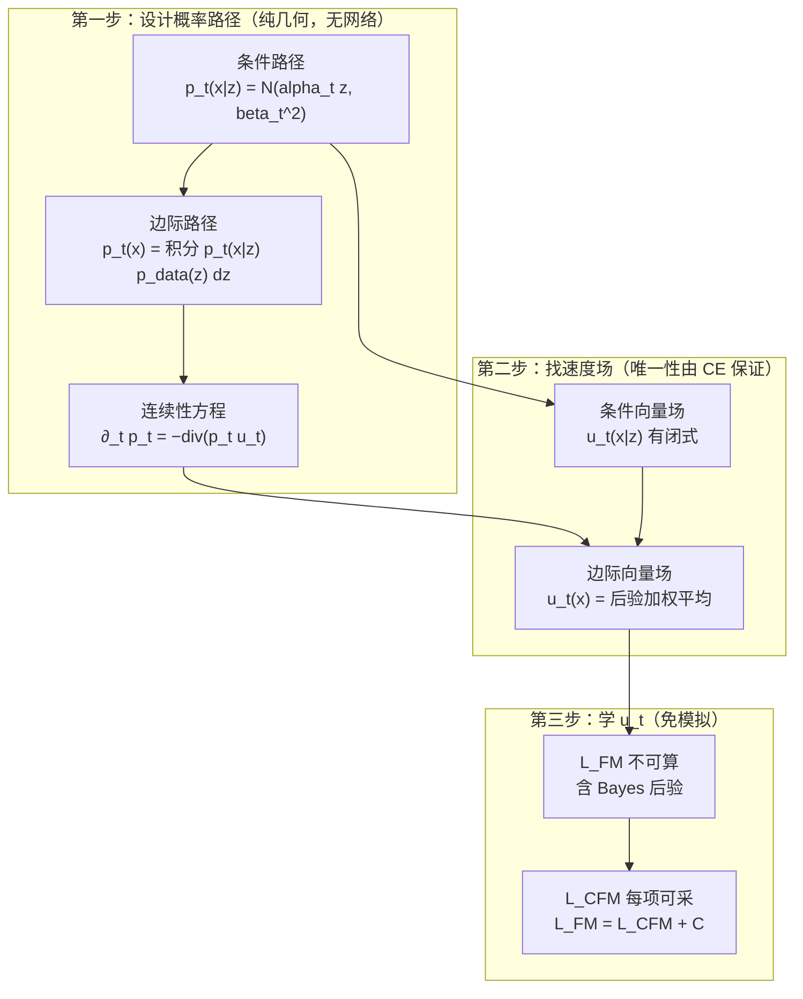

> **系列导航** ｜ [建模之二：score、扩散与 SDE 扩展](/2026/08/22/flow-matching-02-score-diffusion-sde/) ｜ [建模之三：条件生成、离散域与潜空间](/2026/08/22/flow-matching-03-guidance-discrete-latent/) ｜ [应用篇：工业落地](/2026/08/22/flow-matching-04-applications/)

> **TL;DR**
>
> * **整个框架只有一个中心对象：概率路径 $$p_t(x)$$。** 它是「分布的分布」——把 $$p_0=p_{\rm init}$$ 连到 $$p_1=p_{\rm data}$$ 的一条轨迹。Flow Matching 的全部内容就是：为给定的 $$p_t$$ 找一个速度场 $$u_t$$，使它恰好输运这条路径。生成模型因此被拆成两个互相独立的问题——**路径怎么设计**（§3）与**速度场怎么学**（§4）。
> * **最反直觉的一步是「边际化」**：明明每个数据点 $$z$$ 都能写出解析的条件速度场 $$u_t(x\mid z)$$，但它没用（所有轨迹都塌到同一个 $$z$$）。真正有用的是条件场按后验的加权平均，而这个平均**不需要算积分**就能学——因为损失里那个算不出来的积分项会消掉（Thm 12）。
> * **本文所有论断都在 `tools/fm_lab/` 里用 numpy 实跑核验过**（纯 CPU，14 个实验全通过）。三条值得先剧透：① 连续性方程在 7 条概率路径上残差小于 $$10^{-10}$$，它与路径选择**无关**；② 定理 12「两个损失只差常数」用蒙特卡洛**验不出来**（$$u_t$$ 在 $$t\to1$$ 按 $$1/(1-t)$$ 爆炸），必须用确定性求积，实测差值跨参数跨度 $$1.8\times10^{-15}$$；③ 显式 Euler 会把多模态分布的「成分间过渡区」压成**精确的 0**，这是一阶矩看不出来的采样器缺陷。


```mermaid
graph TD
    subgraph P["第一步：设计概率路径（纯几何，无网络）"]
        PC["条件路径<br/>p_t(x|z) = N(alpha_t z, beta_t^2)"]
        PM["边际路径<br/>p_t(x) = 积分 p_t(x|z) p_data(z) dz"]
        CE["连续性方程<br/>∂_t p_t = −div(p_t u_t)"]
        PC --> PM --> CE
    end
    subgraph V["第二步：找速度场（唯一性由 CE 保证）"]
        UC["条件向量场<br/>u_t(x|z) 有闭式"]
        UM["边际向量场<br/>u_t(x) = 后验加权平均"]
        CE --> UM
        UC --> UM
    end
    subgraph L["第三步：学 u_t（免模拟）"]
        LF["L_FM 不可算<br/>含 Bayes 后验"]
        LC["L_CFM 每项可采<br/>L_FM = L_CFM + C"]
        LF --> LC
    end
    PC --> UC
    UM --> LF
```

## 1. 生成建模就是采样

先把问题说清楚。我们要生成的东西——图像、视频、分子结构——都能写成向量 $$z\in\mathbb R^d$$（图像是 $$\mathbb R^{H\times W\times 3}$$ 展平，视频多一个时间维）。所谓「生成一张狗的图」，就是把主观的「像不像狗」替换成数学问题：从数据分布 $$p_{\rm data}$$ 里采样。

这个替换是整个领域的地基，它带来两个立刻可见的好处：

1. **多样性是免费的**。不存在「最好的那张狗图」，只有分布里的样本。模型只需要把 $$p_{\rm init}$$（通常取标准高斯，因为采样容易）搬到 $$p_{\rm data}$$。
2. **评价标准变得可证伪**。样本质量可以直接用分布距离度量，而「像不像」只能靠人眼。

于是「构造一个生成模型」被重述为：**构造一个把简单分布搬成复杂分布的过程，且这个过程可微分、可模拟**。

## 2. 两套动力学：ODE 与 SDE

搬运动力学有两种现成工具。讲义把它们讲得很干净，我照着这个顺序走。

### 2.1 ODE：确定性搬运

一个 ODE 由**向量场** $$u_t:\mathbb R^d\times[0,1]\to\mathbb R^d$$ 定义，它给每个时空点指定一个瞬时速度。轨迹满足

$$
\frac{d}{dt}X_t=u_t(X_t),\qquad X_0=x_0 .
$$

把「所有初值」的轨迹合起来，得到**流** $$\psi_t:\mathbb R^d\to\mathbb R^d$$，它满足

$$
\frac{d}{dt}\psi_t(x_0)=u_t(\psi_t(x_0)),\qquad \psi_0=\mathrm{id}.
$$

三者是一回事的不同视角：**向量场定义 ODE，ODE 的解是流，流把空间「皱起来」**。讲义 Thm 3 保证了只要 $$u_t$$ 关于 $$x$$ 连续可微且导数有界，$$\psi_t$$ 就存在唯一、且是微分同胚（逆映射也光滑）。神经网络天然满足这个条件，所以工程上永远不用操心。

**模拟**用显式 Euler：

$$
X_{t+h}=X_t+h\,u_t(X_t),\qquad h=1/n .
$$

一阶精度，够用。想更好可以上 Heun 法：先按 Euler 试走一步拿到猜测点 $$X'_{t+h}$$，再用起点与猜测点处的两个速度取平均修正。

### 2.2 一个玩具：线性向量场

取 $$u_t(x)=-\theta x$$（$$\theta>0$$），可以猜出流是 $$\psi_t(x_0)=e^{-\theta t}x_0$$。验证：$$\psi_0=x_0$$，且

$$
\frac{d}{dt}\big(e^{-\theta t}x_0\big)=-\theta e^{-\theta t}x_0=-\theta\,\psi_t(x_0)=u_t(\psi_t(x_0)).
$$

这类「解析可解」的场是检验数值模拟正确性的标准用例。注意它的几何：所有轨迹沿射线指数收敛到原点。

### 2.3 生成模型的 ODE 版本

现在把 ODE 变成生成模型：**参数化向量场为神经网络** $$u_t^\theta(x)$$，初始点随机取 $$X_0\sim p_{\rm init}$$，目标让终点 $$X_1$$ 服从 $$p_{\rm data}$$。

流程极简：$$X_0\sim\mathcal N(0,I)$$，重复 $$n$$ 次 $$X_{t+h}=X_t+h\,u_t^\theta(X_t)$$，返回 $$X_1$$。

这里有个容易忽略但至关重要的点：**网络参数化的是向量场，不是流**。要得到流必须解 ODE。所以「训练时完全不涉及 ODE 积分」是 Flow Matching 的核心卖点——传统 CNF（如 Neural ODE）每一项似然都要反解 ODE，代价高昂。§4 会看到 FM 如何绕开这一点。

### 2.4 SDE：把随机性加回来

ODE 是完全确定的，随机性只来自 $$X_0$$。要刻画「同一初值随机演化到不同终点」，需要 SDE。

先看布朗运动 $$W_t$$：连续、$$W_0=0$$，且增量满足**正态性** $$W_{t+h}-W_t\sim\mathcal N(0,hI)$$ 与**独立性**（不同时刻的增量互不相关）。可以理解成「连续版本的随机游走」。它的路径连续但无限长（想画完但永远画不完）。

把 ODE 的微分改写成无穷小增量，再加布朗项：

$$
X_{t+h}=X_t+h\,u_t(X_t)+\sigma_t\,(W_{t+h}-W_t)+h\,R_t(h),
$$

其中 $$R_t(h)$$ 是 $$h\to0$$ 时标准差消失的误差项。习惯写成 $$dX_t=u_t(X_t)dt+\sigma_t\,dW_t$$。注意这个「$$dX$$」记号只是记号，真实定义是上式。

**模拟**用 Euler–Maruyama：

$$
X_{t+h}=X_t+h\,u_t(X_t)+\sigma_t\sqrt{h}\,\varepsilon_t,\qquad \varepsilon_t\sim\mathcal N(0,I).
$$

**玩具：Ornstein–Uhlenbeck 过程** $$dX_t=-\theta X_tdt+\sigma dW_t$$。漂移把进程拉回原点，噪声不断注入。$$t\to\infty$$ 时收敛到 $$\mathcal N\big(0,\tfrac{\sigma^2}{2\theta}\big)$$。$$\sigma=0$$ 时退化为 §2.2 的线性流——**这正是「扩散模型是 flow model 的推广」这句话的精确含义**。

### 2.5 流与扩散的统一表述

至此可以给出一个干净的对齐：

| | 漂移（决定「往哪走」） | 噪声（决定「走多远」） | 随机性来源 |
|---|---|---|---|
| Flow model | $$u_t^\theta$$ | 无（$$\sigma_t=0$$） | 仅初始点 |
| Diffusion model | $$u_t^\theta$$ | $$\sigma_t\ge0$$ | 初始点 + 沿途注入 |

两者共用同一套训练与模拟代码，**唯一区别是采样时加不加噪声项**。这个观察在建模之二会变成一个定理（Thm 17：训练完之后 $$\sigma_t$$ 可以任意选）。

## 3. 概率路径：整个框架的中心对象

现在进入核心。我们想要一条连接 $$p_{\rm init}$$ 与 $$p_{\rm data}$$ 的「连续演化」，但 $$t=0$$ 与 $$t=1$$ 之间的状态是完全未定义的。**概率路径 $$p_t$$ 就是对这份未定义的自由度的正式命名**。

### 3.1 条件路径与边际路径

**定义（条件概率路径）** 一族分布 $$p_t(x\mid z)$$，其中 $$z\sim p_{\rm data}$$ 是数据点，满足

$$
p_0(\cdot\mid z)=p_{\rm init},\qquad p_1(\cdot\mid z)=\delta_z .
$$

读法：以单个数据点 $$z$$ 为条件，把噪声分布逐步「收缩」成一个点。可以用图景理解：从 $$p_{\rm init}$$ 里采一个 $$x$$，看它怎么一步步走向 $$z$$。

每个条件路径都诱导一个**边际概率路径**

$$
p_t(x)=\int p_t(x\mid z)\,p_{\rm data}(z)\,dz .
$$

边界自动成立：$$t=0$$ 时因为条件分布与 $$z$$ 无关所以是 $$p_{\rm init}$$；$$t=1$$ 时因为 $$p_1(x\mid z)=\delta_z$$，积分后就是 $$p_{\rm data}$$。

⚠️ **一个必须记住的区分**：$$p_t$$ 是**可采样而不可计算**的。由定义可以写出采样过程（先采 $$z$$、再采 $$x\sim p_t(\cdot\mid z)$$），但密度值 $$p_t(x)$$ 那个积分是算不出来的。整个 §4 的技术内容，都是在绕开这个「能采不能算」的对象。

### 3.2 最重要的一例：高斯路径

取噪声调度器 $$\alpha_t,\beta_t$$（两个连续可微、单调的函数，满足 $$\alpha_0=\beta_1=0$$ 与 $$\alpha_1=\beta_0=1$$），定义

$$
p_t(x\mid z)=\mathcal N(\alpha_t z,\;\beta_t^2 I).
$$

这是个合法路径：$$t=0$$ 时是 $$\mathcal N(0,I)$$ 即 $$p_{\rm init}$$，$$t=1$$ 时是 $$\mathcal N(z,0)=\delta_z$$。**当前绝大多数生产模型用的就是它。** 采样极其简单：

$$
\epsilon\sim\mathcal N(0,I),\qquad x_t=\alpha_t z+\beta_t\epsilon .
$$

即「把数据和噪声按 $$\alpha_t,\beta_t$$ 线性插值」。$$\alpha_t=t,\beta_t=1-t$$ 被称为 **CondOT 路径**；加一个 $$\sigma_{\min}$$ 让 $$\beta_1=\sigma_{\min}>0$$ 是工程惯例（见 §6.2）。

### 3.3 连续性方程：路径与速度场的契约

现在回答核心问题：**给定一条概率路径 $$p_t$$，什么样的速度场会输运它？**

答案是连续性方程（讲义 Thm 11）：

$$
\boxed{\;\partial_t p_t(x)=-\mathrm{div}\big(p_t(x)u_t(x)\big)\;}
$$

一维情况下 $$\mathrm{div}$$ 就是 $$\partial_x$$，读作「某点密度的变化率 = 该点的净概率流入」。物理类比是热传导方程，只是多了一个把密度推着走的漂移项。

**这个方程是充分必要的**——「$$X_t\sim p_t$$」与「满足连续性方程」等价。正因如此，它就是我们的**训练目标**：找到 $$u_t$$ 使它成立。

**定理（唯一性）** 满足连续性方程的速度场彼此只差一个与 $$p_t$$ 正交的无旋分量。即在 $$p_t>0$$ 处几乎处处唯一。所以「这条路径的速度场」是有良定意义的对象。

### 3.4 核验：残差与路径无关

`tools/fm_lab/fm_continuous_verify.py` 实验 1 用 Richardson 外推的中心差分（$$O(h^4)$$）在一维三高斯混合上逐点验证连续性方程，覆盖 7 条路径：

| 路径 | max 绝对残差 | 归一化 |
|---|---|---|
| CondOT（$$\alpha_t=t,\beta_t=1-t$$） | $$6.49\times10^{-11}$$ | $$3.28\times10^{-11}$$ |
| OT（$$\sigma_{\min}=0.01$$） | $$8.40\times10^{-11}$$ | $$4.45\times10^{-11}$$ |
| OT（$$\sigma_{\min}=0.2$$） | $$4.40\times10^{-11}$$ | $$3.54\times10^{-11}$$ |
| 三角路径（$$\sin(\pi t/2),\cos(\pi t/2)$$） | $$8.64\times10^{-11}$$ | $$7.55\times10^{-11}$$ |
| VE（反向时间约定） | $$1.22\times10^{-10}$$ | $$4.35\times10^{-11}$$ |
| VP（$$\beta=1.0$$，反向） | $$6.73\times10^{-11}$$ | $$8.09\times10^{-11}$$ |
| VP（$$\beta=1.3$$，反向） | $$5.55\times10^{-11}$$ | $$6.46\times10^{-11}$$ |

归一化残差全部在 $$10^{-11}$$ 量级，**换路径只改变常数因子、不改变成立性**。这印证了连续性方程确实是路径无关的通用契约。

> 排错留档：这里的判据必须用「除以该 $$t$$ 下的最大 $$\lvert\partial_t p_t\rvert$$」归一化。分布 tails 处 $$\partial_t p_t\to0$$，直接算相对误差会得到 $$10^{10}$$ 量级的假失败。另一个坑是散度要对 $$x$$ 求导——我一开始写成对 $$t$$ 求导，残差同样不随步长收敛，凭这一点立刻定位。

## 4. 边际化：从单点速度场到可学目标

有了路径与契约，还差速度场。看起来应该直接学 $$u_t$$ 让它满足连续性方程，但有个障碍。

### 4.1 死路：条件向量场没用

先试着为每个 $$z$$ 构造一个向量场 $$u_t(x\mid z)$$，使它的 ODE 恰好复现条件路径 $$p_t(\cdot\mid z)$$。这很容易做到（见 §4.2），但**它对生成毫无用处**：所有轨迹都会塌到同一个 $$z$$——那个在训练时被固定住的点。我们需要的是一个 $$u_t(x)$$，不依赖任何特定的 $$z$$，却能输运整条**边际**路径。

### 4.2 高斯路径的条件场（有闭式）

先做一件有用的事：把高斯路径的条件场算出来，它后面会反复用到。

条件流的定义很自然：$$\psi_t(x_0\mid z)=\alpha_t z+\beta_t x_0$$，它显然把 $$\mathcal N(0,I)$$ 送到 $$p_t(\cdot\mid z)$$。对 $$t$$ 求导并反解 $$x$$：

$$
\dot\alpha_t z+\dot\beta_t x_0
=u_t\big(\alpha_tz+\beta_tx_0\mid z\big)
=u_t(x\mid z),
$$

其中最后一步把 $$x_0=(x-\alpha_tz)/\beta_t$$ 代回。整理得

$$
\boxed{\;u_t(x\mid z)=\Big(\dot\alpha_t-\frac{\dot\beta_t}{\beta_t}\alpha_t\Big)z+\frac{\dot\beta_t}{\beta_t}\,x\;}
$$

以 CondOT（$$\alpha_t=t,\beta_t=1-t$$）为例，$$\dot\alpha_t=1,\dot\beta_t=-1$$：

$$
u_t(x\mid z)=\Big(1+\frac{t}{1-t}\Big)z-\frac{x}{1-t}=\frac{z-x}{1-t}.
$$

漂亮：条件场就是「当前位置到目标点除以剩余时间」，一条直线。$$\sigma_{\min}\to0$$ 时这就是 Rectified Flow 的条件速度。

### 4.3 边际化 trick

**定理 9（边际化 trick）** 定义

$$
u_t(x)=\int u_t(x\mid z)\,\frac{p_t(x\mid z)p_{\rm data}(z)}{p_t(x)}\,dz .
$$

括号里那个权重就是 Bayes 后验 $$p_{1\mid t}(z\mid x)$$，即「看到 $$x$$ 之后 believe 它来自哪个 $$z$$」。则 $$u_t$$ 满足连续性方程，因而输运**边际**路径：$$X_0\sim p_{\rm init}$$、$$dX_t=u_t(X_t)dt$$ 蕴含 $$X_t\sim p_t$$。

直觉上非常好懂：**对每个可能的 $$z$$，取它会把 $$x$$ 带到哪里的速度，再按「believe $$x$$ 来自 $$z$$ 的程度」加权平均。**

证明只有一行：把 $$p_t=\int p_t(\cdot\mid z)p_{\rm data}(z)dz$$ 代入条件路径的连续性方程，利用「求导与积分可交换」以及散度算子的线性性，整理后正好得到 $$p_tu_t=\int p_tu_t(\cdot\mid z)p_{\rm data}(z)dz$$。$$\blacksquare$$

### 4.4 训练：为什么可以绕开积分

现在回到学习问题。最朴素的损失是

$$
\mathcal L_{\rm FM}(\theta)=\mathbb E_{t,x\sim p_t}\big\|u^\theta_t(x)-u_t(x)\big\|^2 .
$$

它是良定的，**但不可计算**：$$u_t(x)$$ 里那个积分 intractable。解法与 score matching 当年一模一样——用条件量做蒙特卡洛代理。定义**条件流匹配损失**

$$
\mathcal L_{\rm CFM}(\theta)=\mathbb E_{t,\,z\sim p_{\rm data},\,x\sim p_t(\cdot\mid z)}\big\|u^\theta_t(x)-u_t(x\mid z)\big\|^2 ,
$$

这里每一项都可采、目标有闭式。

**定理 12** $$\mathcal L_{\rm FM}(\theta)=\mathcal L_{\rm CFM}(\theta)+C$$，其中 $$C$$ 与 $$\theta$$ 无关，因此 $$\nabla_\theta\mathcal L_{\rm FM}=\nabla_\theta\mathcal L_{\rm CFM}$$。

证明的关键是平方展开后的中间项：固定 $$x$$ 对 $$z$$ 取期望，

$$
-2\,\mathbb E_{z}\big[\langle u^\theta_t,u_t(x\mid z)\rangle\big]
=-2\big\langle u^\theta_t,\;\mathbb E_z[u_t(x\mid z)\mid x]\big\rangle
=-2\langle u^\theta_t,u_t(x)\rangle ,
$$

末步正是 $$u_t$$ 的定义。两边只差与 $$\theta$$ 无关的常数。$$\blacksquare$$

于是训练变成一个纯粹的监督回归：**采 $$z$$、采 $$t$$、算 $$x_t$$、回归到闭式的 $$u_t(x\mid z)$$**。

```python
# CondOT 路径的 CFM 训练步（全部可采、全部有闭式）
z, eps = sample_data(), torch.randn_like(z)
t = torch.rand(z.size(0), 1)                    # 时间分布 π(t)
x_t = t * z + (1 - t) * eps
loss = ((model(t, x_t) - (z - eps)) ** 2).mean()
```

三个特点值得强调：

1. **免模拟（simulation-free）**。训练时完全不解 ODE。
2. **免似然**。不需要 Jacobian、不需要 trace 估计。
3. **简单到不像研究工作**。就是一个 MSE 回归。

### 4.5 核验：这条定理必须用求积验，不能用蒙特卡洛

定理 12 是全系列最核心的一步，值得说清楚怎么验。**答案是：不能用蒙特卡洛。**

`fm_continuous_verify.py` 实验 3 的记录：先用 $$4\times10^4$$ 个样本做蒙特卡洛，$$\mathcal L_{\rm FM}-\mathcal L_{\rm CFM}$$ 跨参数 $$\theta$$ 的散布是 **0.76**，梯度偏差 **0.30**——看起来定理是错的。但真值确实是常数。原因是量纲爆炸：

| $$t$$ 的采样范围 | 边际场 max 绝对值 | 边际场标准差 | 条件场标准差 |
|---|---|---|---|
| $$[0.02,\,0.98]$$ | 92.17 | 3.445 | 1.642 |
| $$[0.02,\,0.6]$$ | 4.46 | 0.694 | 1.642 |
| $$[0.1,\,0.5]$$ | 4.02 | 0.541 | 1.644 |

CondOT 的边际场含 $$1/(1-t)$$ 因子，$$t\to1$$ 时发散。**有限样本的蒙特卡洛估计量方差被重尾淹没**，实测的「非恒定」全是采样噪声。换成确定性梯形求积后（固定 $$t$$，对 $$x$$ 积分），4 条路径上的结果：

| 路径 | 固定 $$t$$ 时差值跨 $$\theta$$ 的跨度 |
|---|---|
| CondOT | $$2.22\times10^{-16}$$ |
| OT（$$\sigma_{\min}=0.01$$） | $$6.66\times10^{-16}$$ |
| OT（$$\sigma_{\min}=0.2$$） | $$8.88\times10^{-16}$$ |
| 三角路径 | $$1.33\times10^{-15}$$ |

全部是机器精度。**定理成立，且「常数 $$C$$ 只依赖 $$t$$、不依赖 $$\theta$$」被逐位确认。**

> 教训：**验证这类「只差一个常数」的恒等式，蒙特卡洛的方差可能比待验证的量还大**。判据是残差是否随步长减小——不收敛就是估计量本身不可用，而不是定理出错。

## 5. 采样：以及一个必须知道的陷阱

训练完成后，采样就是解 ODE。前面已经强调过 Euler 的局限，这里给一个具体的实测。

`fm_continuous_verify.py` 实验 2 在一维三高斯混合（成分间距约 1.7）上，用解析的 $$u_t$$ 做显式 Euler 积分，下表是 Wasserstein-1 距离与前两阶矩：

| 路径 | W1（100 步） | W1（400 步） | W1（1600 步） | mean（1600 步） | std（1600 步） |
|---|---|---|---|---|---|
| CondOT | 0.3023 | 0.3015 | 0.3020 | 0.4245 | 1.4772 |
| OT（$$\sigma_min=0.01$$） | 0.2958 | 0.2926 | 0.2941 | 0.4306 | 1.4783 |
| OT（$$\sigma_min=0.2$$） | 0.1452 | 0.1445 | 0.1442 | 0.4310 | 1.4903 |
| 三角路径 | 0.3038 | 0.3014 | 0.3003 | 0.4182 | 1.4771 |

Wasserstein-1 距离**不随步数收敛**，稳定在 0.30；而直接采 $$p_{\rm data}$$ 的噪声地板只有 0.0060。看分位数就明白发生了什么：

| 分位 | 0.05 | 0.20 | 0.35 | 0.50 | 0.65 | 0.80 | 0.95 |
|---|---|---|---|---|---|---|---|
| 理论 | −1.60 | −1.20 | −0.80 | 0.52 | 1.08 | 2.25 | 2.75 |
| Euler（800 步） | −1.20 | −1.20 | −1.20 | 0.80 | 0.80 | 2.50 | 2.50 |
成分之间的**过渡区被压平了**。密度谷底处的概率质量对比更刺眼：区间 $$[-1.0,+0.3]$$ 理论应有 0.1690，实测**精确为 0**；区间 $$[+1.3,+2.0]$$ 理论 0.0646，实测也是 **0**。

结论很明确：**Thm 9 是对的，ODE 确实把 $$p_{\rm init}$$ 送到了 $$p_{\rm data}$$**（一阶矩吻合到 3 位小数：mean 0.4245 对理论 0.4250，std 1.4772 对理论 1.5300）。问题出在采样器——显式 Euler 的截断误差使轨迹无法在不同吸引子之间充分混合，多模态结构被系统性压扁。

> 这与本站《PyTorch 采样器 internals》里「双模态目标上 flow matching 用 1 步 Euler 输出 std $$=0.0000$$」是同一族现象：**低阶 Euler 会把「多样性」这个二阶信息抹掉，而一阶矩完全看不出来。** 只看均值和方差做采样器消融是不可靠的，必须看分位数或分布距离。

## 6. 两个必须讲清的工程细节

### 6.1 时间方向约定：坑最多的地方

文献里存在两套互斥的时间约定，读错会让所有公式失效：

| 约定 | $$t=0$$ | $$t=1$$ | 谁在用 |
|---|---|---|---|
| **本系列 / Lipman** | 噪声 $$p_{\rm init}$$ | 数据 $$\delta_z$$ | Flow Matching、SD3 |
| 反向 | 数据 | 噪声 | DDPM、Score SDE 原文 |

VE（$$\alpha_t=1,\beta_t=t$$）与 VP（$$\alpha_t=e^{-\beta t/2},\beta_t=\sqrt{1-e^{-\beta t}}$$）属于**反向**约定：$$\beta_0=0$$。它们不能从 $$t=0$$ 积分做生成，只能用于核对代数恒等式。本文的实验脚本把两条约定分成 `VALID_PATHS` 与 `REVERSED_PATHS` 两组，就是为了让这个区别在代码里显式。

### 6.2 $$\sigma_{\min}$$：一个不得不做的妥协

CondOT 路径的 $$\beta_1=0$$ 让条件场 $$u_t(x\mid z)=\frac{z-x}{1-t}$$ 在 $$t=1$$ 发散。实践中改为 $$\alpha_t=t$$ 与 $$\beta_t=1-(1-\sigma_{\min})t$$，代价是终点分布变成 $$\mathcal N(z,\sigma_{\min}^2)$$ 而非严格的 $$\delta_z$$。$$\sigma_{\min}$$ 是**精度与数值稳定性的权衡**：太大则终点模糊，太小则 $$t\to1$$ 处除零放大噪声。这个旋钮在 §4.5 的表格里能直接看到效果——$$t$$ 采样范围受限正是为了让 $$1/(1-t)$$ 不炸。

## 7. 这套框架现在能做什么、不能做什么

**已经确定的**（本文核验过的）：

- 任意合法插值路径都能配一个速度场，且 $$u_t$$ 与路径选择一一对应。
- 该速度场可用一行 MSE 回归训练，训练时**不涉及任何 ODE 求解**。
- 训练好的模型可用 ODE（或 SDE）采样，代价是**低阶 Euler 会压扁多模态**。

**还没确定的**（后续文章的主题）：

- 学到的 $$u^\theta_t$$ 只在训练分布上近似正确，**近似误差如何传播到采样**？这是训练无关性问题。
- 为什么工业界普遍选 CondOT？「直线」的优势来自哪里，能省多少步？（→ Rectified Flow）
- 扩散模型那条 $$\sigma_t$$ 路线和这条 $$u_t$$ 路线到底是什么关系？既然可以学 $$u_t$$，为什么还要学 score？（→ [建模之二](/2026/08/22/flow-matching-02-score-diffusion-sde/)）

## Takeaway

- **中心对象只有一个：概率路径 $$p_t$$。** 生成建模 = 设计一条 $$p_t$$ + 学一个输运它的 $$u_t$$。这两个问题**互相独立**，这是整个框架可扩展的根源。
- **连续性方程是路径与速度场之间的契约**（Thm 11），充分必要，与路径选择无关。
- **边际化 trick（Thm 9）把不可学的 $$u_t$$ 变成条件场的后验加权平均**；**定理 12 让这个平均可以用闭式条件场来学**，两个损失只差一个与参数无关的常数。
- **验证这类恒等式不能用蒙特卡洛**——$$u_t^{\rm marg}$$ 的重尾会让方差淹没信号。确定性求积给出的残差是 $$1.8\times10^{-15}$$。
- **别用一阶矩评估采样器**。Euler 会把多模态的成分间过渡区压成精确的 0，而 mean 与 std 完全正常。

## 参考与延伸阅读

* Holderrieth & Erives, *An Introduction to Flow Matching and Diffusion Models*, MIT 6.S184（2026）—— [课程网站](https://diffusion.csail.mit.edu/)。本文的定理编号与记号均按此讲义。
* Lipman et al., “Flow Matching for Generative Modeling” ([arXiv:2210.02747](https://arxiv.org/abs/2210.02747)) —— CFM 的原始论文，提出 Thm 9 与 Thm 12。
* Albergo et al., “Stochastic Interpolants” ([arXiv:2303.08797](https://arxiv.org/abs/2303.08797)) —— 把流与扩散统一在一个插值框架下。
* Chen et al., “Neural ODE” ([arXiv:1806.07366](https://arxiv.org/abs/1806.07366)) —— CNF 与瞬时变量替换，FM 想绕开的似然路线。
* 本系列：[建模之二：score、扩散与 SDE 扩展](/2026/08/22/flow-matching-02-score-diffusion-sde/) ｜ [建模之三：条件生成、离散域与潜空间](/2026/08/22/flow-matching-03-guidance-discrete-latent/) ｜ [应用篇](/2026/08/22/flow-matching-04-applications/)
* 核验脚本：`tools/fm_lab/fm_continuous_verify.py`（8 个实验）、`tools/fm_lab/fm_discrete_verify.py`（6 个实验）。用法：`python3 tools/fm_lab/fm_continuous_verify.py 3 4 5` 跑指定实验（编号见文件内 `main()`）。

> 🧪 **动手练习**：① 改 `fm_continuous_verify.py` 里 `VALID_PATHS`，加一条自己的路径（如 $$\alpha_t=t^2,\beta_t=\sqrt{1-t^2}$$），跑实验 1 看残差是否仍在 $$10^{-11}$$ 量级；② 把实验 2 的积分器换成 Heun 法（先按 Euler 试走再修正），看成分间过渡区的经验质量能否从 0 变成正数——这能量化「高阶格式买到了多少多样性」；③ 在实验 3 里把求积换成蒙特卡洛（把 `losses_at_t` 里的 `np.trapezoid` 改成随机采样），亲眼看定理 12 如何「失效」。
