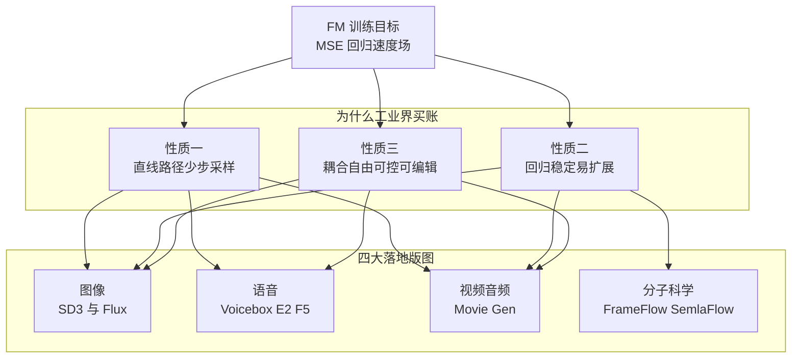

> **TL;DR 三连**
>
> - **核心结论**：2023–2024 年，图像（Stable Diffusion 3、Flux）、语音（Voicebox、E2-TTS、F5-TTS）、视频音频（Movie Gen）、分子与蛋白质设计（FrameFlow、FoldFlow、SemlaFlow）四大域的大规模生成系统不约而同把训练目标换成了同一行损失——速度场回归。FM 赢的方式不是某个单点 SOTA，而是把「概率路径与耦合分布」从扩散调度的束缚里解放出来，变成显式工程自由度。
> - **关键实证**：同架构对照下 FM 与扩散的差距是可测的——FrameDiff→FrameFlow 只换训练范式：采样步数少 5 倍、设计性好 2 倍；SD3 内部研究中 25 步以下 Rectified Flow 公式全面占优；F5-TTS 推理 RTF 0.15 大幅优于 SOTA 扩散 TTS；Movie Gen 消融显示 FM 损失对噪声调度选择更鲁棒且天然满足零终端 SNR。
> - **定位**：本篇是系列一《Flow Matching 深度解析》的应用落地篇——不再推导 CFM≡FM 的梯度等价性，只回答一个问题：**每个场景为什么偏偏是 FM 合适**。所有引用论文均经 arXiv 摘要逐篇核实，工业产品注明非论文出处。



## 1. 为什么值得单独写一篇应用篇

系列一《Flow Matching 深度解析》把理论骨架搭完了：连续性方程统一 CNF 与扩散、CFM 与 score matching 的梯度等价、OT-CFM / Rectified Flow / Stochastic Interpolants 三大变体。文末的应用清单只有一行字。这一行字背后其实是过去两年生成模型工业史上最大规模的一次「训练目标集体迁移」，值得用整篇展开，因为它能回答三个理论篇回答不了的问题：

1. **迁移是真实的吗？**——打开 SD3、F5-TTS、Movie Gen 的论文翻到训练目标一节，你看到的几乎是同一行公式：$$\mathcal{L} = \mathbb{E}\|v_\theta(t, x_t) - u_t\|^2$$。四个互不相干的行业在两年内收敛到同一个目标函数，这在深度学习史上不多见；
2. **每个场景的理由一样吗？**——不一样，而且差异本身就是信息。图像看中的是扩展性，语音看中的是填充式条件注入，视频看中的是采样成本与调度鲁棒性，分子看中的是流形上的等变结构。逐域拆解才是本篇的正餐；
3. **证据有多硬？**——本文只引两类证据：经 arXiv 摘要核实的论文原话（每条给出处），以及同架构对照实验的数字（最干净的因果证据）。跨论文的横向对比表会明确标注其不可比性。

先给一张速览表，后面每章展开「为什么」：

| 应用域 | 代表系统 | 训练范式 | 为什么是 FM（一句话） | 关键实证数字 |
|---|---|---|---|---|
| 图像 | Stable Diffusion 3 | RF + logit-normal 时间采样 | 少步区间全面占优 + scaling 可预测 | 25 步以下 RF 公式优于全部对照 |
| 图像 | Flux.1 系列（非论文） | flow matching 工业产品化 | 原班人马用脚投票的路线表态 | 12B 参数，三档变体 |
| 语音 | Voicebox | 非自回归 FM 语音填充 | 填充任务天然匹配耦合自由度 | 比 VALL-E 快至 20 倍，WER 1.9% vs 5.9% |
| 语音 | F5-TTS | FM + DiT 极简声学模型 | 训练定路径、推理调步长，解耦速度-质量 | RTF 0.15，大幅优于 SOTA 扩散 TTS |
| 视频/音频 | Movie Gen | Transformer + FM | 零终端 SNR 天然成立 + 消融胜扩散损失 | 30B 视频 / 13B 音频一个目标函数 |
| 分子/蛋白 | FrameFlow 等 | SE(3)/E(3) 流形上的 FM 变体 | 对称性等变 + 模拟自由训练 | 步数少 5 倍，设计性好 2 倍 |

## 2. 论证基座：FM 的三个工程性质

后面每个域的「为什么」都是这三个性质的组合。先把性质本身讲清楚，避免每章重复论证。

### 2.1 性质一：直线路径让少步采样成为一等公民

Rectified Flow 的插值路径 $$x_t = (1-t)\,x_0 + t\,x_1$$ 对应的条件速度场是常数 $$x_1 - x_0$$——回归目标不再随信噪比剧烈变化，学出的边际轨迹也倾向于更直（[arXiv:2209.03003](https://arxiv.org/abs/2209.03003)）。轨迹越直，欧拉法的大步长积分误差越小，「少步采样」从蒸馏技巧变成训练目标的自然属性。

两个独立来源的证据：

- **InstaFlow** 把 Stable Diffusion 用 reflow 直化轨迹后再蒸馏，得到功能可用的单步文生图模型——此前纯蒸馏路线始终做不出可用的一步模型，reflow「拉直轨迹、精化噪声-图像耦合」是成功的关键前提（[arXiv:2309.06380](https://arxiv.org/abs/2309.06380)）；
- **SD3 的大规模研究**直接画出了结论：*“Rectified Flows perform better than other formulations when sampling fewer steps. For 25 and more steps, only rf/lognorm remains competitive to eps/linear”*（Figure 3，[arXiv:2403.03206](https://arxiv.org/abs/2403.03206)）。翻译过来：**低步数区间是 RF 的主场，25 步以上优势才收窄到持平**。

### 2.2 性质二：MSE 回归目标是规模化友好的训练动力学

Lipman 等人在 FM 原始论文里的卖点就是 "simulation-free" 地 "train CNFs at unprecedented scale"（[arXiv:2210.02747](https://arxiv.org/abs/2210.02747)）。这句话在当时听着像口号，两年后变成了两条硬证据：

- SD3 报告了**可预测的 scaling 趋势**，且验证损失与人评指标相关——更低验证损失的检查点在人类评估中更好（[arXiv:2403.03206](https://arxiv.org/abs/2403.03206)）；
- Movie Gen 团队在大规模预训练中发现 *“validation loss is well correlated with human evaluation results”*，于是把 FM 验证损失当作开发期的人评代理指标（[arXiv:2410.13720](https://arxiv.org/abs/2410.13720)，工业报告）。

这解释了一个现象：最先整体切换到 FM 的全是 10B+ 参数系统。参数规模上去之后，训练目标的方差行为和可监控性是生死问题，而「稳定的 MSE 回归 + 损失与人评相关」恰好是大团队敢押注的前提。

### 2.3 性质三：耦合与条件注入的自由度，让填充/编辑变成原生能力

CFM 框架里有两个被扩散叙事掩盖的自由度（系列一 §5）：概率路径 $$p_t$$ 怎么选、耦合分布 $$\pi(x_0, x_1)$$ 怎么选。一旦允许 $$x_1$$ 端不是「干净数据」而任意的上下文，**infilling（补全）就成了零成本的原生操作**——Voicebox 的整个任务族都建立在这上面（§4）。小批量最优传输耦合还能进一步拉直轨迹、减少推理积分步数（[arXiv:2302.00482](https://arxiv.org/abs/2302.00482)），不过这个「免费午餐」在条件设置下有陷阱，留给 §9 批判。

三个性质合起来，就是四大域共同的选型逻辑：

| 性质 | 机制来源 | 直接受益方 | 论文级证据 |
|---|---|---|---|
| 直线路径 → 少步采样 | RF 插值 + reflow | 图像、视频（推理成本敏感） | SD3 Figure 3；InstaFlow 单步生成 |
| MSE 目标 → 规模化友好 | simulation-free 回归 | 全部 10B+ 系统 | SD3/MovieGen 验证损失与人评相关 |
| 耦合自由 → 填充原生 | $$\pi(x_0,x_1)$$ 显式可选 | 语音、媒体编辑 | Voicebox 任务族；Movie Gen 编辑 |

## 3. 图像：SD3 与 Flux——Rectified Flow 成为默认选项

### 3.1 SD3：一场关于「怎么走直线」的系统研究

Stable Diffusion 3 的论文标题就叫《Scaling Rectified Flow Transformers for High-Resolution Image Synthesis》（[arXiv:2403.03206](https://arxiv.org/abs/2403.03206)）。它对 FM 社区最大的贡献不是某个新组件，而是把「RF 该怎么配时间步采样」做成了大规模对照实验。

**为什么 FM 适合图像？三条理由：**

1. **高分辨率下的容量预算问题**。朴素 RF 训练均匀采时间步，但感知上重要的中间尺度区域分配到的梯度太少。SD3 的解法是 logit-normal 分布——*“a distribution that puts more weight on intermediate steps”*，把训练预算偏向中间时间步。注意这里的论证结构：**正因为 FM 把「时间步分布」暴露成了显式超参数，这种偏置才可能**；在 DDPM 叙事里它藏在噪声调度 $$\{\beta_k\}$$ 中，很难单独拿出来扫；
2. **少步区间的压倒性优势**（§2.1 的 Figure 3 证据）。消费级部署的推理预算紧张，低步数区间的质量差距直接决定商用可行性。更有趣的是 Table 6 的发现：*更大的模型反而需要更少的采样步数到达性能峰值*——作者归因于大模型更贴合直线路径目标、路径长度更短。**这意味着 FM 的少步红利随规模增长而非衰减**，对 scaling 路线是关键正反馈；
3. **scaling 可预测且损失可监控**（§2.2）。SD3 同时给出了 MM-DiT 架构——图文两种模态分开的权重加双向注意力流，改善文本理解与排版能力。架构改进与训练目标正交，但它们共同支撑了「验证损失降 → 人评升」的可信链条。

### 3.2 Flux：一次用产品形态完成的路线表态

需要首先声明：**Flux 不是论文**，没有任何同行评审文献，本节事实全部来自 Black Forest Labs 官方发布公告。但它的入选理由恰恰是身份本身——BFL 的创始团队是 VQGAN、Latent Diffusion、Stable Diffusion 系列的原作者，他们在公告中明确写道 FLUX.1 全系基于「multimodal 与 parallel diffusion transformer block 的混合架构」，扩展到 12B 参数，并且 *“building on flow matching, a general and conceptually simple method for training generative models, which includes diffusion as a special case”*。

发明扩散 latent 文生图的人，在新公司把默认训练目标换成了 FM——这是比任何消融实验都直白的行业信号。产品线分三档：FLUX.1 [pro]（最强提示词跟随）、[dev]（开放权重、guidance 蒸馏、非商用）、[schnell]（轻量快速档）。「旗舰靠 guidance 蒸馏压步数、轻量档主打快」的产品分层，说明少步化已经从论文卖点变成了商业定价维度。

## 4. 语音：Voicebox → E2-TTS → F5-TTS 的演化线

### 4.1 Voicebox：填充任务与耦合自由度的天作之合

Voicebox 的摘要自我定义非常精确：*“a non-autoregressive flow-matching model trained to infill speech, given audio context and text, trained on over 50K hours of speech”*（[arXiv:2306.15687](https://arxiv.org/abs/2306.15687)）。

**为什么 FM 适合语音？核心是任务形态与框架的结构对应：**

1. **语音生成的自然形态就是条件填充**。给定说话人的上下文音频 + 文本，补出中间那段 mel 谱——零样本 TTS、降噪、内容编辑、风格转换、多样性采样，全都是同一个 infilling 问题的不同切法。在 CFM 视角里这只是把耦合的一端从纯噪声换成上下文拼接；而 DDPM 式固定高斯先验没有这个表达，做同样的任务要么重训、要么构造逆问题近似求解器。Voicebox 一个模型通吃上述全部任务，正是 §2.3 性质三的直接变现；
2. **非自回归并行解码的速度红利**。整段谱图同时积分 ODE，没有 AR 的串行瓶颈——Voicebox 在 intelligibility（WER 1.9% 对 5.9%）和音频相似度（0.681 对 0.580）双杀当时最强的 AR 系统 VALL-E 的同时，还**快至 20 倍**（摘要原文数字）。注意 VALL-E 是自回归基线而非扩散，这条对比证明的是「FM 并行性 > AR 串行」；FM 对扩散的对比由 F5-TTS 补上；
3. **数据规模不设上限**。50K 小时未过滤语音直接喂——FM 训练不需要精确对齐标注，为后续 E2/F5 把数据推到 100K 小时铺平了路。

### 4.2 F5-TTS：把「速度-质量权衡」做成推理期旋钮

F5-TTS 是 FM 声学模型演化的完成态（[arXiv:2410.06885](https://arxiv.org/abs/2410.06885)）。它继承 E2 TTS（[arXiv:2406.18009](https://arxiv.org/abs/2406.18009)）的激进极简主义——不要时长模型、不要文本编码器、不要音素对齐，文本用填充字符补齐到语音等长直接做去噪——然后用两个改动修掉 E2 收敛慢、鲁棒差的毛病：ConvNeXt 精炼文本表示，以及推理期的 **Sway Sampling**。

Sway Sampling 值得单独讲，因为它是本文主题的最佳注脚：**对流步的时间轴做非均匀重分配，让 ODE 积分把预算花在最需要的区段**。论文强调三点——它在推理期生效（训练照旧均匀采样）；显著提升性能与效率；可以不经重训直接套用到任何已训好的流匹配模型上。配合最终 0.15 的推理 RTF（相对实时率），论文的措辞是 *“greatly improved compared to state-of-the-art diffusion-based TTS models”*——这才是干净的 FM vs 扩散对比。

这就是标题所说的「FM 声学模型的速度-质量权衡论证」的完整形态：**训练阶段用路径设计锁定质量上限，推理阶段用步长分布调度在速度-质量曲线上自由滑动，两者彻底解耦**。扩散 TTS 想做同样的事，得同时动调度、求解器、蒸馏三件套，牵一发动全身。中文社区对这个权衡有很好的实操向解读，包括 16–32 步达到扩散千步量级质量的工程经验（参见 [火山引擎开发者社区的 F5-TTS 深度解析](https://developer.volcengine.com/articles/7542491710064951306) 与 [掘金上的 DeepMind 等价性译文](https://juejin.cn/post/7447746778558595111)）。

三代系统的演化链一图流：


## 5. 视频/世界模型：Movie Gen——一个目标函数统一视频与音频

先注明出处性质：Movie Gen 是 Meta 发布的**工业技术报告**（[arXiv:2410.13720](https://arxiv.org/abs/2410.13720)），非传统单点论文。规格：最大视频基础模型 Movie Gen Video 30B 参数、73K 视频token 上下文、生成 1080p HD 16 秒 16fps 视频；配套的视频转音频模型 Movie Gen Audio 13B；覆盖文生视频、个性化、指令编辑、视频转音频、文本转音频五项任务并报告 SOTA。

正文对训练目标有一段罕见的直白陈述：他们发现 *“a simple Transformer-based model trained with Flow Matching (Lipman et al., 2023)”* 就能随数据、算力、参数扩展产出高质量视频或音频生成器；并给出三条采用理由——*“our Flow Matching implementation naturally ensures zero terminal SNR”*；*“Flow Matching was more robust to the exact choice of noise schedules and it outperforms diffusion losses”*（消融节 3.6.2）；最终总结 *“we adopt Flow Matching for its simplicity and high performance”*。

**为什么 FM 适合视频？把这四点拆开：**

1. **推理成本是数量级问题**。一段 16 秒 1080p 视频是数万 token 的联合采样，每多一步 ODE 都是全模型前向。确定性 ODE + 直线路径 + 可蒸馏（§2.1）在这里不是锦上添花，是账面盈亏线；
2. **零终端 SNR 免费拿**。视频生成对起点噪声的「纯净度」高度敏感，标准扩散噪声调度不保证零终端 SNR、必须手工修改，而 FM 的线性插值调度天然满足——少一类要调的超参；
3. **对调度选择鲁棒**。视频系统的噪声调度空间远比图像复杂（时空 latent、多分辨率），一个「换调度不掉性能」的训练目标大幅降低了系统工程的搜索空间；
4. **一个目标函数吃下两个模态**。视频与音频两个基础模型共用同一套 FM 目标与训练基建——对工业界来说，这是能把图像域经验直接平移的「工程复利」。

至于「世界模型」：Movie Gen 展示的指令编辑与个性化只是序章。当条件从文本换成动作序列与环境状态，FM 学到的速度场本质上就是潜空间动力学——这条线的展开放在 §9 展望。

开源侧同样热闹：腾讯混元开源的 HunyuanVideo 以 13B+ 参数成为彼时最大的开源视频生成模型，官方报告其性能与闭源头部可比（[arXiv:2412.03603](https://arxiv.org/abs/2412.03603)）。开源生态跟进的速度本身就说明：FM 已经从「前沿选择」沉淀为「社区默认」。

## 6. 分子与科学计算：把流搬到流形上

### 6.1 为什么科学计算需要 FM 变体而不是直接套用

分子与蛋白质世界有两条硬约束，欧氏空间高斯路径全都违反：

1. **对称性**。分子构象在平移旋转群 E(3) 下等价，蛋白质骨架由刚体帧构成、生活在特殊欧氏群 SE(3) 上。在笛卡尔坐标上跑普通高斯插值，等于强迫网络用数据量去补对称性——生成结果会「学歪」；
2. **模拟开销**。经典流形上的 CNF 训练要么需要模拟、要么要算散度，在高维分子系统上不可承受。

Riemannian Flow Matching 给了这两条约束一个统一解法：在流形上直接指定测地线插值的条件路径，目标向量场闭式可写、无需散度计算、简单几何上模拟自由（[arXiv:2302.03660](https://arxiv.org/abs/2302.03660)）。加上 §2.3 的耦合自由度——FoldFlow 系列用黎曼最优传输改写耦合来加速训练（FoldFlow-Base 确定性动力学，FoldFlow-OT 引入 Riemannian OT）（[arXiv:2310.02391](https://arxiv.org/abs/2310.02391)）——科学计算域拿到的是一套「即插即用的流形生成框架」。

### 6.2 FrameFlow：全文最干净的对照实验

FrameFlow 的实验设计堪称 FM vs 扩散之争的「受控试验」：把 SOTA 扩散蛋白骨架模型 **FrameDiff 原封不动改成 FM 训练范式**，其余架构不动。结果：*“Compared to FrameDiff, FrameFlow requires five times fewer sampling timesteps while achieving two fold better designability”*（[arXiv:2310.05297](https://arxiv.org/abs/2310.05297)）。

**采样步数少 5 倍、设计性指标好 2 倍**——变量隔离之后，差距只能归因于训练目标本身。这是本文所有证据里因果最干净的一条，也是 §7 对比表的锚点。

### 6.3 变体全景

| 方法 | 流形/对称性 | 生成对象 | 相对基线的实证差异 | 出处 |
|---|---|---|---|---|
| Riemannian FM | 一般黎曼流形 | 流形上的 CNF 训练框架 | 简单几何上模拟自由、无散度计算、闭式目标场 | [arXiv:2302.03660](https://arxiv.org/abs/2302.03660) |
| FrameFlow | SE(3) 刚体帧 | 蛋白质骨架 | 对 FrameDiff：步数少 5 倍、设计性好 2 倍 | [arXiv:2310.05297](https://arxiv.org/abs/2310.05297) |
| FoldFlow 系列 | SE(3) 刚体运动群 | 蛋白质骨架（Base/OT 递进） | Riemannian OT 耦合加速训练 | [arXiv:2310.02391](https://arxiv.org/abs/2310.02391) |
| RNA-FrameFlow | SE(3) 刚体帧 | 3D RNA 骨架（首个） | 13 原子/核苷酸的更大更柔骨架建模 | [arXiv:2406.13839](https://arxiv.org/abs/2406.13839) |
| SemlaFlow | E(3) 等变消息传递 | 原子类型+坐标+键+形式电荷联合分布 | 直指前人慢采样与低化学效度痛点 | [arXiv:2406.07266](https://arxiv.org/abs/2406.07266) |

SemlaFlow 单独说一句：它的动机句是 *“Current approaches, however, often suffer from very slow sampling times or generate molecules with poor chemical validity”*——慢采样与低化学效度，恰好分别对应扩散方法的两大老毛病。等变 FM 联合生成原子类型、坐标、键型与形式电荷的完整分子表示，是「FM 化」从骨架走向全分子的一步。RNA-FrameFlow 则证明了这套范式可以跨物种分子类型复制——从蛋白 4 原子/残基到 RNA 13 原子/核苷酸，框架不变，只换几何参数。

## 7. FM vs 扩散：把实证摆上桌

汇总各域的正面证据。**再次强调**：各行来自不同论文、不同协议、不同基线，不能当成同一张排行榜读；真正同台较量的只有标了「同架构对照」的三行。

| 场景 | 扩散侧基线 | FM 侧方案 | 步数/效率差异 | 质量/鲁棒性差异 | 证据强度 | 出处 |
|---|---|---|---|---|---|---|
| 文生图（内部大研究） | eps-pred + linear 调度等一批公式 | rf + logit-normal 时间采样 | 低步数区间 RF 全面占优，25 步以上收窄至持平 | 高分辨率 T2I 整体占优，scaling 更可预测 | 同框架对照 | [arXiv:2403.03206](https://arxiv.org/abs/2403.03206) |
| 文生图（单步极限） | SD 多步采样 + 失败的纯蒸馏 | InstaFlow：reflow 直化 + 蒸馏 | 数十步 → 单步 | 功能可用的一步模型首次实现 | 方法级对照 | [arXiv:2309.06380](https://arxiv.org/abs/2309.06380) |
| 零样本 TTS | SOTA 扩散 TTS | F5-TTS（FM + DiT） | RTF 0.15，大幅改进 | 自然度/相似度保持 SOTA 级 | 同赛道对比 | [arXiv:2410.06885](https://arxiv.org/abs/2410.06885) |
| 蛋白骨架（同架构对照） | FrameDiff | FrameFlow（仅换训练范式） | 采样步数少 5 倍 | 设计性好 2 倍 | **最干净** | [arXiv:2310.05297](https://arxiv.org/abs/2310.05297) |
| 视频生成（工业消融） | 扩散损失族 | FM 损失 | ——（未报步数对比） | 对噪声调度更鲁棒，消融胜出，零终端 SNR 天然成立 | 同系统消融 | [arXiv:2410.13720](https://arxiv.org/abs/2410.13720) |

**可控性维度的差异**常被步数叙事遮蔽，其实同样是结构性的：

| 可控性表现 | 依赖的 FM 性质 | 代表证据 |
|---|---|---|
| 一个模型通吃 TTS/降噪/编辑/风格转换 | 耦合自由 → infilling 原生 | Voicebox 任务族（[arXiv:2306.15687](https://arxiv.org/abs/2306.15687)） |
| 推理期语速控制、无需韵律重训 | 训练定路径与推理调度解耦 | F5-TTS 的 speed control efficiency（[arXiv:2410.06885](https://arxiv.org/abs/2410.06885)） |
| 精确指令级视频编辑与个性化 | 条件注入进速度场 | Movie Gen 编辑/个性化任务（[arXiv:2410.13720](https://arxiv.org/abs/2410.13720)） |
| 文本理解与排版提升 | 双向注意力（与 FM 协同的架构层） | SD3 MM-DiT（[arXiv:2403.03206](https://arxiv.org/abs/2403.03206)） |

最后泼一盆必要的冷水：Google DeepMind 的技术博客（中文社区见 [掘金译文](https://juejin.cn/post/7447746778558595111)、另有一篇广为流传的 [CSDN 流匹配长文](https://blog.csdn.net/v_JULY_v/article/details/136318383)）系统论证过：**在高斯基底下，扩散与 FM 在数学上高度重叠**——DDIM 与流匹配采样器可以互相重参数化得到，训练加权也能互相转换。所以这张表里的胜利，多数不属于「新数学」，而属于**更好的工程默认值**：直线插值、显式时间步分布、可选拉直的耦合。认清这一点才能正确预期 FM 的边界。

## 8. 五分钟代码骨架：CFM 训练与少步采样

把全文反复出现的那个损失写成代码——40 行以内，含 NFE 可调的欧拉采样器：

```python
# 最小 CFM 骨架：直线插值路径 + 速度场 MSE 回归 + Euler 少步采样
import torch
import torch.nn as nn

class VelocityNet(nn.Module):
    """生产系统中即 MM-DiT / DiT 主干；这里用 MLP 保持骨架最小"""
    def __init__(self, dim, hidden=256):
        super().__init__()
        self.net = nn.Sequential(
            nn.Linear(dim + 1, hidden), nn.SiLU(),
            nn.Linear(hidden, hidden), nn.SiLU(),
            nn.Linear(hidden, dim),
        )

    def forward(self, x, t):                    # t 拼进输入即可，无需特殊层
        return self.net(torch.cat([x, t[:, None]], dim=-1))

def cfm_loss(model, x1):
    b, d = x1.shape                             # 数据端 batch
    x0 = torch.randn_like(x1)                   # 噪声端（耦合 = 独立配对）
    t = torch.rand(b, device=x1.device)         # U[0,1]；SD3 换 logit-normal
    xt = (1 - t[:, None]) * x0 + t[:, None] * x1   # 直线插值 x_t
    target = x1 - x0                            # 条件速度场：线性路径下是常数
    return (model(xt, t) - target).pow(2).mean()   # 全部魔法就这一行 MSE

@torch.no_grad()
def sample(model, n, d, nfe=8, device="cpu"):
    """nfe = Number of Function Evaluations；nfe=1 即单步生成"""
    x = torch.randn(n, d, device=device)
    ts = torch.linspace(0, 1, nfe + 1, device=device)
    for i in range(nfe):
        t = ts[i].expand(n)
        x = x + (ts[i + 1] - ts[i]) * model(x, t)  # Euler 积分一步
    return x                                    # 近似数据分布样本
```

##### 变量映射表（数学 ↔ 代码）

| 数学符号 | 代码变量 | Shape / 类型 | 含义 |
|---|---|---|---|
| $$x_1 \sim q$$ | `x1` | `(B, D)` | 数据批（图像域即 VAE latent） |
| $$x_0 \sim \mathcal{N}(0,I)$$ | `x0` / `x` | `(B, D)` | 噪声端，采样的出发点 |
| $$t \in [0,1]$$ | `t` | `(B,)` | 插值时间：0 为噪声、1 为数据 |
| $$x_t = (1-t)x_0 + t x_1$$ | `xt` | `(B, D)` | 当前插值状态（线性路径） |
| $$u_t(x \mid x_0,x_1) = x_1 - x_0$$ | `target` | `(B, D)` | 条件速度场——线性路径下是常数，这是 RF 的全部简洁性所在 |
| $$v_\theta(t, x)$$ | `model(xt, t)` 输出 | `(B, D)` | 网络预测的速度场 |
| $$\mathcal{L}_{\mathrm{CFM}}$$ | `cfm_loss(...)` 返回值 | 标量 | 速度场 MSE 回归损失 |
| NFE | `nfe` | 标量整数 | 采样函数评估次数；SD3 Figure 3 与 F5 的速度故事都发生在调这个旋钮 |

三个可以直接动手验证的观察：把 `nfe` 从 32 降到 1，观察质量衰减曲线的形状——衰减越缓说明轨迹越直，这正是 reflow（InstaFlow）和 OT 耦合（OT-CFM）要优化的东西；把 `torch.rand` 换成偏向中间的 logit-normal，复现 SD3 的第一处改进；把 `target` 改成 VP 型扩散路径对应的条件场，体会「路径即设计自由度」这句话的分量。

## 9. 批判与展望

### 9.1 四个清醒剂

1. **等价性的阴影**。§7 结尾说过：高斯基底下 FM 与扩散可以互相重参数化，DDIM 与流匹配采样器等价。所以「FM 全面取代扩散」是个坏叙事，准确的说法是：**FM 把扩散藏在调度里的设计维度显式化了，然后工业界在这些维度上找到了更好的默认值**。代价是这些默认值（直线插值、独立耦合）未必处处最优——它们只是在已验证的大规模场景里赢了；
2. **OT 耦合的条件陷阱**。「minibatch OT 让轨迹更直」的无条件结论很漂亮，但 Curse of Conditions 一文指出：默认的最优传输映射无视条件信息，导致训练时的先验分布被条件性扭曲，而测试时只能从未扭曲的完整先验采样——这个 train/test 缺口带来严重后果（[arXiv:2503.10636](https://arxiv.org/abs/2503.10636)）。换句话说，§2.3 那个「免费午餐」在有条件生成的真实系统里并不免费，条件感知的耦合设计仍是开放问题；
3. **少步叙事的边界**。SD3 自己的数据显示 25 步以上 eps/linear 就追平了 RF；InstaFlow 的一步生成依赖 reflow 加蒸馏两段工序；Flux [dev] 的少步能力来自 guidance 蒸馏。「FM = 少步」的公众印象需要打折——直线路径给了少步化更好的起点，但终点往往仍要蒸馏来接棒；
4. **评测协议碎片化**。RTF、NFE、designability、化学效度各自成体系，跨论文数字不可横比（本文表格反复标注的原因）。更深一层：蛋白质的 designability 高不等于湿实验折叠成功率高，分子化学效度高不等于生物活性好——科学计算域的计算指标与实验闭环之间还有很大的空隙。

### 9.2 展望三条

1. **从媒体生成到世界模型**。当视频生成器的条件从文本提示换成动作序列与状态观测，FM 学到的速度场就变成了潜空间的动力学模型——「下一步会发生什么」与「下一帧长什么样」在数学上是同一个积分问题。Movie Gen 展示的编辑与个性化只是这条路的起点；
2. **单步化的极限在哪**。少步化的终极形态是一步生成。当前主流是「先训多步再蒸馏」，但平均速度场类方法试图绕过 teacher 直接学全程平均速度——如果这条路走通，「训练即蒸馏」会再次改写产线结构；
3. **科学发现的闭环**。FM 在科学域目前止步于「生成候选」。真正的想象空间在闭环：生成器提出结构、预测器打分、结果反哺耦合设计——而这一切的吞吐前提恰恰是 FM 的少步采样。生成模型从判别模型的配角变成实验设计的引擎，可能比想象中近。

## 10. Takeaway

- **解决了什么**：拆解了 FM 在图像（SD3/Flux）、语音（Voicebox/E2/F5）、视频音频（Movie Gen）、分子科学（FrameFlow/FoldFlow/RNA-FrameFlow/SemlaFlow）四大域落地的真实理由——三个工程性质（直线路径少步采样、MSE 目标易扩展、耦合自由可编辑）的不同组合；并用同架构对照证据（FrameDiff→FrameFlow 步数少 5 倍质量好 2 倍）钉死了「训练目标本身有价值」这件事。
- **致命局限**：本文是摘要与关键正文级的核实，各系统内部消融的完整细节需读原文复核；跨论文数字协议不同不可横比；高斯基底下与扩散的数学重叠意味着多数胜利属于「更好的默认值」而非新原理。
- **如何引出下一篇**：既然少步化是所有场景的共同刚需、而蒸馏又是少步化的临门一脚——系列之三顺理成章的主题是「少步化专题：Reflow、一致性蒸馏与平均速度场」。

## 参考与延伸阅读

**理论与方法基座**

* Lipman et al., "Flow Matching for Generative Modeling" ([arXiv:2210.02747](https://arxiv.org/abs/2210.02747)) —— FM 原始论文，simulation-free 训练 CNF
* Liu et al., "Flow Straight and Fast: Learning to Generate and Transfer Data with Rectified Flow" ([arXiv:2209.03003](https://arxiv.org/abs/2209.03003)) —— 直线路径与 reflow，SD3 的方法源头
* Tong et al., "Improving and generalizing flow-based generative models with minibatch optimal transport" ([arXiv:2302.00482](https://arxiv.org/abs/2302.00482)) —— OT-CFM，耦合自由度的系统化
* Chen & Lipman, "Flow Matching on General Geometries" ([arXiv:2302.03660](https://arxiv.org/abs/2302.03660)) —— 流形版 FM，科学计算域的方法基座
* 条件耦合的陷阱警示：Cheng & Schwing, "The Curse of Conditions" ([arXiv:2503.10636](https://arxiv.org/abs/2503.10636)) —— minibatch OT 在条件设置下的 train/test 缺口

**图像**

* Esser et al., "Scaling Rectified Flow Transformers for High-Resolution Image Synthesis" (Stable Diffusion 3, [arXiv:2403.03206](https://arxiv.org/abs/2403.03206)) —— logit-normal 时间采样、MM-DiT、少步区间对照
* Liu et al., "InstaFlow: One Step is Enough" ([arXiv:2309.06380](https://arxiv.org/abs/2309.06380)) —— reflow + 蒸馏的单步文生图
* Black Forest Labs, "Announcing Black Forest Labs"（官方公告页，**非论文**）—— Flux.1 12B、混合架构、pro/dev/schnell 三变体的产品出处

**语音**

* Le et al., "Voicebox: Text-Guided Multilingual Universal Speech Generation at Scale" ([arXiv:2306.15687](https://arxiv.org/abs/2306.15687)) —— FM 语音填充，比 VALL-E 快至 20 倍
* "E2 TTS: Embarrassingly Easy Fully Non-Autoregressive Zero-Shot TTS" ([arXiv:2406.18009](https://arxiv.org/abs/2406.18009)) —— 字符填充极简范式的可行性证明
* Chen et al., "F5-TTS: A Fairytaler that Fakes Fluent and Faithful Speech with Flow Matching" ([arXiv:2410.06885](https://arxiv.org/abs/2410.06885)) —— Sway Sampling 与 RTF 0.15

**视频/音频**

* Meta AI, "Movie Gen: A Cast of Media Foundation Models" ([arXiv:2410.13720](https://arxiv.org/abs/2410.13720)，工业技术报告) —— 30B 视频 + 13B 音频共用 FM 目标
* Tencent, "HunyuanVideo: A Systematic Framework For Large Video Generative Models" ([arXiv:2412.03603](https://arxiv.org/abs/2412.03603)，工业技术报告) —— 开源侧 13B+ 代表

**分子与科学计算**

* "Fast protein backbone generation with SE(3) flow matching" (FrameFlow, [arXiv:2310.05297](https://arxiv.org/abs/2310.05297)) —— 对 FrameDiff 步数少 5 倍、设计性好 2 倍
* "SE(3)-Stochastic Flow Matching for Protein Backbone Generation" (FoldFlow, [arXiv:2310.02391](https://arxiv.org/abs/2310.02391)) —— Base/OT 系列递进
* "RNA-FrameFlow: Flow Matching for de novo 3D RNA Backbone Design" ([arXiv:2406.13839](https://arxiv.org/abs/2406.13839)) —— 首个 3D RNA 骨架生成模型
* "SemlaFlow -- Efficient 3D Molecular Generation with Latent Attention and Equivariant Flow Matching" ([arXiv:2406.07266](https://arxiv.org/abs/2406.07266)) —— E(3) 等变 FM 全分子生成

**中文社区**

* 掘金：《[扩散模型=流匹配？谷歌 DeepMind 博客深度详解这种惊人的等价性](https://juejin.cn/post/7447746778558595111)》—— §7 冷水与 §9.1 的出处之一
* CSDN：v_JULY_v，《[一文通透流匹配 Flow Matching](https://blog.csdn.net/v_JULY_v/article/details/136318383)》—— 中文世界的系统性长文
* 火山引擎开发者社区：《[F5-TTS：用 Flow Matching 玩转语音](https://developer.volcengine.com/articles/7542491710064951306)》—— 语音域的工程视角解读

* 本站姊妹篇：[Flow Matching 系列之一：算法发展篇——从 CNF 与扩散的统一到 SD3 的工业标准](/2026/08/22/flow-matching-01-algorithm-evolution/)· 《正向学策略，反向学奖励：IRL 在 LLM 对齐里的复活》

> 🧪 **动手练习**：① 取 §8 代码骨架，把均匀时间采样 `torch.rand` 换成 logit-normal（试 σ ∈ {0.5, 1.0, 2.0}），在二维螺旋数据上对比 nfe = 1, 2, 4, 8 的样本质量衰减曲线，验证「训练时间步分布」这个 SD3 关键改动在玩具规模是否可见；② 从 F5-TTS 论文抄出 Sway Sampling 的定义式并在 `sample()` 的步长序列上实现，画 s ∈ {-2, -1, 0, 1} 下 ODE 步位置的直方图，确认 s=0 退化为均匀采样、并观察 nfe=8 时合成质量的变化——体会「训练定路径、推理调步长」的解耦设计。
