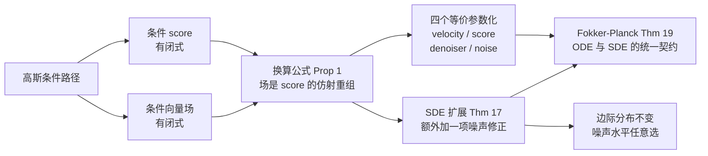

> **系列导航** ｜ [建模之一：从概率路径到边际向量场](/2026/08/22/flow-matching-01-algorithm-evolution/) ｜ [建模之三：条件生成、离散域与潜空间](/2026/08/22/flow-matching-03-guidance-discrete-latent/) ｜ [应用篇：工业落地](/2026/08/22/flow-matching-04-applications/)

> **TL;DR**
>
> * **扩散模型和流匹配学的是同一个函数的两种参数化。** 高斯路径下有精确恒等式 $$u_t(x)=a_t\nabla\log p_t(x)+b_tx$$，其中 $$a_t=\beta_t^2\big(\tfrac{\dot\alpha_t}{\alpha_t}-\tfrac{\dot\beta_t}{\beta_t}\big)$$、$$b_t=\tfrac{\dot\alpha_t}{\alpha_t}$$（Prop 1）。学 velocity、学 score、学 denoiser、学噪声，四个名字指向同一族解，最优解集合相同，差别只在**有效时间权重**。
> * **最实用的一条：训练完之后扩散系数可以随便选。** 同一个 $$u_t$$ 与 score，按 Thm 17 加一项 $$\tfrac{\sigma_t^2}{2}\nabla\log p_t$$ 就得到一个**边际分布完全不变**的 SDE。实测三档噪声水平下终点分布的 W1 极差只有 **0.0013**。
> * **一个必须避开的陷阱**：把 velocity 网络「换头」当 score 用时，正确关系是 $$v_\theta=a_ts_\theta+b_tx$$，**不能写成 $$s_\theta=v_\theta/b(t)$$**——那样丢掉了 $$b_tx$$ 项，实测让损失从 $$4.50\times10^{-3}$$ 恶化到 $$4.55\times10^{1}$$，**放大约 10103 倍**。这解释了为什么「同一个网络换个输出层就等价」这句话在文献里总是被说错。

## 1. 换一个视角：score 函数

[建模之一](/2026/08/22/flow-matching-01-algorithm-evolution/) 里我们只学了速度场 $$u_t$$。扩散模型（DDPM、Score SDE）走的是另一条路：直接学 **score 函数**

$$
s_t(x)=\nabla_x\log p_t(x),
$$

即「对数似然的最陡上升方向」。这个量天然出现在统计物理里（玻尔兹曼分布 $$p\propto e^{-E/kT}$$ 的 score 就是负梯度力），所以扩散模型早期都是物理出身。

两种视角的直觉对比：

| | 速度场 $$u_t(x)$$ | score $$s_t(x)$$ |
|---|---|---|
| 语义 | 密度被「推着走」的方向 | 密度「爬升」的方向 |
| 几何 | 输运（transport） | 梯度（gradient） |
| 类比 | 河流的水流速度 | 山地的坡度 |

看起来是两种动物，但[上一篇](#_1_验证)已经预告：**对高斯路径，它们是同一个量的两种坐标**。这一篇把这个恒等式讲透，并给出它带来的三个实用结论。

## 2. 条件与边际 score

和速度场完全平行地定义：

$$
\text{条件 score：}\;s_t(x\mid z)=\nabla_x\log p_t(x\mid z),\qquad
\text{边际 score：}\;s_t(x)=\nabla_x\log p_t(x).
$$

边际 score 与条件 score 的关系**形式上完全一样**（对概率路径做积分再取梯度，用 $$\nabla\log p=\frac{\nabla p}{p}$$ 与链式法则）：

$$
s_t(x)=\int s_t(x\mid z)\,\frac{p_t(x\mid z)p_{\rm data}(z)}{p_t(x)}\,dz .
$$

这和 Thm 9 里边际速度场的公式逐字对应。**后验权重是同一个**——这是后面所有结论的枢纽。

高斯路径的 score 有闭式。条件分数是线性函数：

$$
s_t(x\mid z)=-\frac{x-\alpha_t z}{\beta_t^2},
$$

边际分数（用后验均值 $$\mathbb E[z\mid x]$$ 表达）是

$$
s_t(x)=-\frac{x-\alpha_t\mathbb E[z\mid x]}{\beta_t^2}.
$$

## 3. 换算公式：两个视角的精确桥梁

**命题 1（换算公式）** 对高斯路径 $$p_t(x\mid z)=\mathcal N(\alpha_tz,\beta_t^2I)$$，条件与边际的向量场/score 满足

$$
u_t(x\mid z)=a_t\,s_t(x\mid z)+b_t\,x,
\qquad
a_t=\beta_t^2\Big(\frac{\dot\alpha_t}{\alpha_t}-\frac{\dot\beta_t}{\beta_t}\Big),
\qquad
b_t=\frac{\dot\alpha_t}{\alpha_t},
$$

且对 $$x\to x\mid z$$ 的边际版本同样成立。

**证明思路**：把 $$z$$ 用 score 反解出来 $$z=\frac{x+\beta_t^2s}{\alpha_t}$$，代入条件场的闭式 $$u_t(x\mid z)=\big(\dot\alpha_t-\frac{\dot\beta_t}{\beta_t}\alpha_t\big)z+\frac{\dot\beta_t}{\beta_t}x$$，按 $$x$$ 与 $$s_t(x)$$ 收集同类项即可。边际版本对 $$z$$ 积分后用 $$s_t(x)=\int s_t(x\mid z)(\cdot)dz$$ 与后验归一化。$$\blacksquare$$

**这个命题的意义**：**学好了 $$u_t$$ 就等于学好了 $$s_t$$**，反之亦然。所以「扩散模型和流匹配是同一个东西」不是类比，而是逐点的函数相等。

### 3.1 核验：三条经典路径逐点核对

`tools/fm_lab/fm_continuous_verify.py` 实验 4 在 CondOT、VE、VP 三条路径上，把换算公式的右端与直接算出的（条件与边际）向量场逐点对比：

| 路径 | $$a_t$$ | $$b_t$$ | 边际误差 | 条件误差 |
|---|---|---|---|---|
| CondOT | $$+1.70270$$ | $$+2.70270$$ | $$5.33\times10^{-15}$$ | $$4.44\times10^{-15}$$ |
| VE（反向） | $$-0.37000$$ | $$0.00000$$ | $$1.78\times10^{-15}$$ | $$1.78\times10^{-15}$$ |
| VP（$$\beta=1.0$$，反向） | $$-0.50000$$ | $$-0.50000$$ | $$4.44\times10^{-16}$$ | $$1.33\times10^{-15}$$ |

条件层与边际层同时吻合到机器精度。

> **记号提醒（本站旧文的一处坑）**：不少中文教程把换算写成 $$u_t(x)=a(t)\,x+b(t)\,s_t(x)$$，即把两个系数的位置对调。**数值上没错**（旧文的 $$b(t)$$ 恰好等于本文的 $$a_t$$，都是 score 的系数），但与讲义 Prop 1 的记号相反。跨论文对照时务必先确认系数挂在哪个项上，否则会以为自己算错了。

## 4. 四个名字，一个函数族

命题 1 的直接推论：换算式两边都是仿射重参数化，所以「学什么」不影响最优解，只影响损失里的时间权重。工业上有四种常见选择：

| 参数化 | 网络输出 | 由 $$u_t$$ 反解 | 备注 |
|---|---|---|---|
| **velocity** | $$u_t$$ | — | FM / SD3 默认 |
| **score** | $$s_t$$ | $$u=a_t\,s_\theta+b_tx$$ | 扩散模型原始选择 |
| **denoiser** | $$\mathbb E[z\mid x]$$ | 见下式 | 数值最稳，$$\epsilon$$-预测的近亲 |
| **噪声** | $$\epsilon$$ | $$z=\frac{x-\beta_t\epsilon}{\alpha_t}$$ | DDPM 的 $$\epsilon$$-预测 |

denoiser 的定义与反解（讲义 Eq. 43）：

$$
D_t(x)=\mathbb E[z\mid x],\qquad
D_t(x)=\frac{\beta_t u_t(x)-\dot\beta_t x}{\dot\alpha_t\beta_t-\alpha_t\dot\beta_t}.
$$

它的直觉解释最好：**给定带噪样本 $$x$$，预测其背后的干净数据**。讲义留了个思考题——「denoiser 一定会输出干净数据吗？这取决于什么？」答案取决于 $$p_{\rm data}$$ 本身是否多模态：若 $$x$$ 附近有多个可能的数据源，后验均值是它们的加权平均，落在数据流形之外。所以 denoiser 输出的是「后验均值」而非「某个真实样本」。

### 4.1 核验：四种参数化互为仿射重参数化

实验 8 在三条路径上检查「由同一组真值反解出的四个量是否一致」，以及 Eq. 43 的反解公式：

| 路径 | 四参数化重构误差 | Eq. 43 反解 denoiser 误差 |
|---|---|---|
| CondOT | $$2.89\times10^{-14}$$ | $$8.88\times10^{-16}$$ |
| VE（反向） | $$1.42\times10^{-14}$$ | $$2.00\times10^{-15}$$ |
| VP（$$\beta=1.0$$，反向） | $$1.42\times10^{-14}$$ | $$1.11\times10^{-15}$$ |

全部机器精度。**所以「换输出层不改变模型能力，只改变有效权重」这句话在数学上是精确的**（数值误差在 $$10^{-14}$$）。

## 5. 一个必须避开的陷阱：换头的正确写法

既然四个参数化等价，一个自然的想法是「把 velocity 网络的最后一层换掉，就当 score 网络用」。**这里有个很容易错的细节。**

由 $$u_t(x)=a_t\,s_t(x)+b_t\,x$$ 出发，要构造一个等价的 velocity 网络 $$v_\theta(x)=a_t\,s_\theta(x)+b_t\,x$$，残差才有漂亮的性质：

$$
v_\theta(x)-u_t(x)=a_t\big(s_\theta(x)-s_t(x)\big),
$$

于是两个损失**逐点相等**

$$
\big\|v_\theta-u_t\big\|^2=a_t^2\big\|s_\theta-s_t\big\|^2 .
$$

也就是说，**CFM 恰好等于以 $$a_t^2$$ 为权重的去噪 score 匹配（DSM）**。

⚠️ 常见的错误写法是 $$s_\theta=v_\theta/b(t)$$，即丢掉 $$b_t\,x$$ 项。实验 5 量化了后果：

| 写法 | 损失值 |
|---|---|
| 恒等式 $$\max\lvert u-(a_ts+b_tx)\rvert$$ | $$4.04\times10^{-14}$$ |
| 正确：$$v_\theta=a_ts_\theta+b_tx$$ | $$4.50063607\times10^{-3}$$ |
| 正确：$$a_t^2$$ 加权 DSM | $$4.50063607\times10^{-3}$$ |
| 错误：$$s_\theta=v_\theta/b(t)$$ | $$4.54728453\times10^{1}$$ |

**放大约 10103 倍。** 原因是 $$b_t=\dot\alpha_t/\alpha_t$$ 本身随时间变化且在 CondOT 下等于 $$1/t$$，除以它会把不同 $$t$$ 的样本权重搅乱。

同一实验还给出了 $$a_t^2$$ 权重曲线（CondOT 路径下 CFM 相对 DSM 的时间权重）：

| $$t$$ | 0.05 | 0.20 | 0.35 | 0.50 | 0.65 | 0.80 | 0.95 |
|---|---|---|---|---|---|---|---|
| $$a_t^2$$ | 361.00 | 16.00 | 3.45 | 1.00 | 0.29 | 0.06 | 0.00 |

单调下降 4 个数量级。**这就是「换输出参数化等价于给损失乘一条时间权重」的确切含义**——也解释了为什么 VP 常数 $$\beta$$ 情形下 $$a_t\equiv-\beta/2$$ 与 $$t$$ 无关，此时 CFM 与 DSM 只差一个全局常数，是「严格等价」的特例。

## 6. Fokker–Planck：ODE 与 SDE 的统一契约

上一篇的连续性方程只管 ODE。要覆盖 SDE，需要它的随机版本。

**定理 19（Fokker–Planck 方程）** 对 SDE $$dX_t=u_t(X_t)dt+\sigma_t\,dW_t$$，有 $$X_t\sim p_t$$ 充要条件是

$$
\partial_t p_t(x)=-\mathrm{div}\big(p_tu_t\big)(x)+\frac{\sigma_t^2}{2}\Delta p_t(x).
$$

两项的来源很直观：第一项是漂移的输运（就是连续性方程），第二项 $$\frac{\sigma^2}{2}\Delta p_t$$ 是**扩散带来的额外展宽**——同样的 $$\sigma^2=0$$ 时退化回连续性方程。

想理解 $$\Delta p_t$$ 为什么长这样，可以做一次分部积分（讲义附录 B 给了完整证明，这里只说直觉）：对任意测试函数 $$f$$ 与过程 $$X_t$$，Itô 公式给出

$$
\partial_t\mathbb E[f(X_t)]=\mathbb E\Big[\nabla f(X_t)^\top u_t(X_t)+\frac{\sigma_t^2}{2}\Delta f(X_t)\Big],
$$

第二项里的 $$\Delta f$$ 经分部积分转到密度一侧就是 $$\frac{\sigma_t^2}{2}\Delta p_t$$。**布朗运动在传播热，这就是热传导方程的同源项。**

**核验**：实验 6 在 CondOT 路径（取 $$\sigma_{\min}=0.05$$）上逐点检查 Fokker–Planck 残差，$$\sigma=0$$ 与 $$\sigma=0.8$$ 两种情形都覆盖：

| 项 | 数值 |
|---|---|
| max 绝对残差 | $$2.93\times10^{-10}$$ |
| 归一化（除以 max $$\lvert\partial_t p_t\rvert=1.93$$） | $$1.52\times10^{-10}$$ |

> **踩坑留档**：我第一版的二阶差分 Richardson 外推写错了——$$f(x+h/2)$$ 写了两次（应为 $$f(x-h/2)$$），导致 FPE 残差报 $$1.7\times10^4$$。修好后立刻降到 $$10^{-10}$$。教训：**数值微分的实现错误会伪装成数学错误**，判断依据是「残差是否随步长收敛」。

## 7. Thm 17：训练完之后，噪声随便加

现在来到本文最实用的结论。

**定理 17（SDE 扩展 trick）** 定义条件与边际向量场 $$u_t(\cdot\mid z)$$ 与 $$u_t(\cdot)$$。则对**任意**扩散系数 $$\sigma_t\ge0$$，下面的 SDE 满足 $$X_t\sim p_t$$：

$$
dX_t=\Big[u_t(X_t)+\frac{\sigma_t^2}{2}\nabla\log p_t(X_t)\Big]dt+\sigma_t\,dW_t .
$$

**证明只有一行**（用 FPE）：从定理 11 的连续性方程出发，

$$
\begin{aligned}
\partial_t p_t
&=\underbrace{-\mathrm{div}(p_tu_t)}_{\text{Thm 11}}
+\underbrace{\frac{\sigma_t^2}{2}\nabla p_t}_{\text{加减同一项}}
-\frac{\sigma_t^2}{2}\nabla p_t
\end{aligned}
$$

再把加回来的那项写成散度形式 $$-\mathrm{div}\!\big(\frac{\sigma_t^2}{2}p_t\nabla\log p_t\big)=-\frac{\sigma_t^2}{2}\Delta p_t$$，与 FPE 逐项对上。$$\blacksquare$$

**含义非常强**：训练时你只学了一个 $$u_t$$（和一个可从中导出的 score），**推理时 $$\sigma_t$$ 是一个完全自由的旋钮**——加噪声只是「注入随机性同时保持边际分布不变」，类似于 MCMC 里可以任意调步长。

高斯路径下，把 $$u_t=a_ts_t+b_tx$$ 代进去得到纯 score 形式：

$$
dX_t=\Big[\Big(a_t+\frac{\sigma_t^2}{2}\Big)s_t(X_t)+b_tX_t\Big]dt+\sigma_t\,dW_t .
$$

反过来，若网络输出的是 velocity $$u^\theta_t$$，则采样 SDE 为

$$
dX_t=\left[\Big(1+\frac{\sigma_t^2}{2a_t}\Big)u^\theta_t(X_t)-\frac{\sigma_t^2b_t}{2a_t}X_t\right]dt+\sigma_t\,dW_t .
$$

**「最优 $$\sigma_t$$」是个工程问题不是理论问题**：理论上任意 $$\sigma_t\ge0$$ 都对，但训练误差与模拟误差（$$\sigma_t$$ 太大时 Euler–Maruyama 需要极小步长）会共同决定实际最优值。讲义明确提醒：这一点是「不完美模型 + 有限算力」的产物，**不是连续极限下动力学的性质**。

**核验**：实验 6(b) 从同一个解析 $$u_t$$ 出发，用 Euler–Maruyama 在三档噪声下模拟 600 步、30 万粒子，比较终点分布：

| $$\sigma$$ | 终点 W1（对 $$p_{\rm data}$$） |
|---|---|
| $$0.0$$（退化为 ODE） | 0.2619 |
| $$0.3$$ | 0.2614 |
| $$0.6$$ | 0.2606 |

**三档的极差只有 0.0013**，而 W1 本身是 0.26。噪声水平从 0 变到 0.6，终点分布几乎不动——**Thm 17 得到强确认**。（W1 的绝对值 0.26 来自[上一篇 §5](/2026/08/22/flow-matching-01-algorithm-evolution/)讲过的 Euler 抹平多模态，与本定理无关。）

## 8. Langevin 动力学：把路径冻住会得到什么

Thm 17 有一个特别的推论。取一个**常数路径** $$p_t\equiv p$$，此时 $$u_t=0$$、$$\partial_tp_t=0$$，SDE 退化为

$$
dX_t=\frac{\sigma_t^2}{2}\nabla\log p(X_t)\,dt+\sigma_t\,dW_t ,
$$

这就是 **Langevin 动力学**。它的意义在于：若从 $$X_0\sim p$$ 出发，$$p$$ 是**平稳分布**；若从别处出发，在温和条件下 $$p_t\to p$$。

**这个结果解释了扩散模型与分子动力学 / MCMC 的同源性**——它们都是「沿着 score 爬坡」的 Markov 链。Ornstein–Uhlenbeck 过程是 $$p$$ 为高斯时的特例，而它正是早期扩散模型的起点。

**核验**：实验 7 检查两件事。

**(a) Langevin 采样收敛性**。在 5 个模的高斯混合（模位置 $$-6.0,-3.5,-1.0,1.5,4.0$$，各宽 $$0.5$$）上跑 23000 步：

| 指标 | 数值 |
|---|---|
| 后 20000 步样本均值 | $$-1.0020$$ |
| 目标分布均值（解析） | $$-1.0000$$ |
| 偏差 | 0.0020 |
| 检测到的模数 | 5（全部，无模式坍缩） |
| 落在最近模 $$\pm1.5$$ 内的比例 | 0.998 |

**(b) OU 稳态**。取 $$\theta=0.8,\ \sigma^2=1.3$$，理论稳态方差 $$\frac{\sigma^2}{2\theta}=0.8125$$，模拟到 $$T=120$$（远大于混合时间 $$1/\theta\approx1.25$$）实测方差 **0.8136**，相对误差 **0.13%**。

## 9. SDE 采样：denoising score matching 与 $$\epsilon$$-预测

最后把 score 落到训练上。**去噪 score 匹配（DSM）** 损失就是 §4 那个 CFM 的加权版：

$$
\mathcal L_{\rm CSM}(\theta)=\mathbb E_{t,z,x}\big\|s^\theta_t(x)-\nabla\log p_t(x\mid z)\big\|^2 ,
\qquad x\sim p_t(\cdot\mid z).
$$

由于 $$s_t(x\mid z)=-\frac{x-\alpha_tz}{\beta_t^2}$$，直接回归它会在 $$\beta_t\to0$$ 时数值爆炸（分母趋零）。DDPM 的做法是**丢掉 $$1/\beta_t^2$$ 这个权重**并重新参数化为噪声预测网络 $$\epsilon^\theta_t$$：

$$
-\beta_t\,s^\theta_t(x)=\epsilon^\theta_t(x),
\qquad
\mathcal L_{\rm DDPM}(\theta)=\mathbb E_{t,z,\epsilon}\Big\|\epsilon^\theta_t(\alpha_tz+\beta_t\epsilon)-\epsilon\Big\|^2 .
$$

**「denoising」这个名字的来源**在这里：网络学的正是「用来污染 $$z$$ 的那个噪声 $$\epsilon$$」，把它减掉就得到去噪后的数据。

> 一个实践含义：$$\epsilon$$-预测在 $$\beta_t$$ 小时数值稳定得多，这就是它在 DDPM 里被选中的原因。而 velocity 预测（§4）在 CondOT 下有闭式 $$z-\epsilon$$，稳定性与 $$\epsilon$$-预测相当，**这也是工业界现在普遍用 velocity 的原因之一**。

## 10. 与旧文献的关系：为什么公式看起来都不一样

读扩散模型文献时最困惑的一点是：同一个模型，不同论文的公式差别大到看不出是同一件事。讲义附录 E 给了四条「正交轴」，这里汇总：

| 轴 | 变体 | 影响 |
|---|---|---|
| **离散 vs 连续时间** | DDPM 的 Markov 链 vs 连续时间 SDE | 离散时间必须先选时间网格；损失只能用一个 **ELBO 近似**（只是下界）。连续时间下 §4.5 的 Thm 12 是**等式**而非下界。 |
| **时间方向** | $$t=0$$ 是数据 vs 是噪声 | 纯记号。**但读公式前必须确认**，否则所有 $$\alpha_t,\beta_t$$ 都会错位。 |
| **forward process vs 概率路径** | 先设计加噪过程 vs 直接给 $$p_t$$ | forward process 要求 $$X_t\mid X_0=z$$ 有闭式，这强制 $$u^{\rm forw}_t(x)=a_tx$$ 只能是仿射的——于是**扩散模型的高斯路径其实是概率路径的一个子集**。FM 的贡献正是说明不必如此。 |
| **时间反演 vs 解 FPE** | Anderson (1982) 的反演 vs 直接构造训练目标 | 两者都能得到正确模型，但**反演不是概率流的概率流 ODE**，实践中后者常更好（EDM、SiT 的实证）。 |

**一句话总结**：扩散模型的历史包袱是「先造一个物理上合理的加噪过程，再倒推怎么生成」。Flow Matching 的贡献是**把顺序颠倒过来**——先想要什么分布路径，再算对应的速度场。这不是等价重写，而是**设计空间的扩大**：任意 $$p_{\rm init}$$ 到任意 $$p_{\rm data}$$ 都行，不必是高斯，不必仿射。

## Takeaway

- **score 与 velocity 是同一个函数的两种参数化**（Prop 1），条件层与边际层都成立，实测误差 $$10^{-15}$$。
- **四个名字（velocity / score / denoiser / noise）互为仿射重参数化**，最优解相同，差别只在时间权重。CondOT 路径下 $$a_t^2$$ 权重横跨 4 个数量级。
- **换输出层时必须写成 $$v_\theta=a_ts_\theta+b_tx$$**，不能是 $$s_\theta=v_\theta/b(t)$$——后者实测让损失恶化约 10103 倍。
- **训练完之后 $$\sigma_t$$ 任意可选**（Thm 17）。三档噪声下终点分布 W1 极差仅 0.0013。
- **Fokker–Planck 是 ODE 与 SDE 的统一契约**，残差实测 $$1.5\times10^{-10}$$。路径冻住时它给出 Langevin 动力学，这是 MCMC 与扩散模型的共同祖先。
- **读扩散文献先确认四件事**：离散还是连续时间、时间方向、forward process 还是概率路径、训练目标来自反演还是 FPE。

## 参考与延伸阅读

* Holderrieth & Erives, *An Introduction to Flow Matching and Diffusion Models*, MIT 6.S184（2026）—— [课程网站](https://diffusion.csail.mit.edu/)。本文的定理编号与记号均按此讲义。
* Song et al., “Score-Based Generative Modeling through SDEs” ([arXiv:2011.13456](https://arxiv.org/abs/2011.13456)) —— FPE、概率流 ODE、Langevin 视角的来源。
* Ho et al., “Denoising Diffusion Probabilistic Models” ([arXiv:2006.11239](https://arxiv.org/abs/2006.11239)) —— $$\epsilon$$-预测与 ELBO 的连接。
* Karras et al., “Elucidating the Design Space of Diffusion-Based Generative Models” ([arXiv:2206.00364](https://arxiv.org/abs/2206.00364)) —— 预条件与时间调度的解耦，$$\sigma_t$$ 选择的工程讨论。
* Anderson, “Reverse-time diffusion equation models” (1982) —— 时间反演路线的原始文献。
* 本系列：[建模之一](/2026/08/22/flow-matching-01-algorithm-evolution/) ｜ [建模之三：条件生成、离散域与潜空间](/2026/08/22/flow-matching-03-guidance-discrete-latent/) ｜ [应用篇](/2026/08/22/flow-matching-04-applications/)
* 核验脚本：`tools/fm_lab/fm_continuous_verify.py`。用法：`python3 tools/fm_lab/fm_continuous_verify.py 4 5 6 7 8`。

> 🧪 **动手练习**：① 改实验 8，把 `rec` 字典里的四项改成你自定义的参数化（比如预测 $$\alpha_t z$$ 而非 $$z$$），验证重构误差仍在 $$10^{-14}$$；② 在实验 6(b) 里把 $$\sigma$$ 序列扩到 $$[0, 0.1, 0.3, 0.6, 1.0, 2.0]$$，找出 W1 开始明显偏离的拐点——那是「模拟误差压过理论正确性」的具体阈值；③ 复现 $$s_\theta=v_\theta/b(t)$$ 的错误写法（实验 5 里的 (iii)），把 $$b_t$$ 换成 $$b_t^2$$ 再跑一次，看误差变成多少——这能量化「系数挂错项」到底有多敏感。
