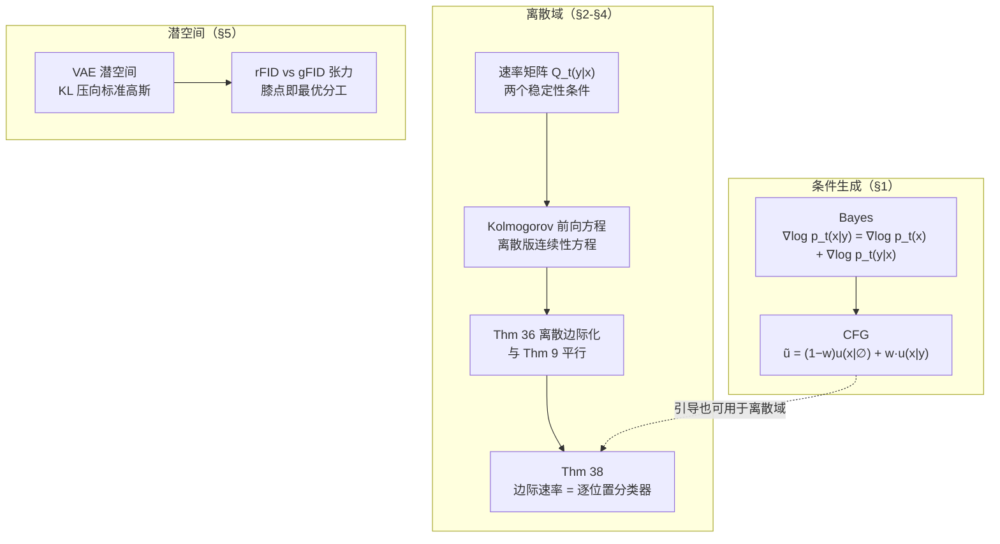

> **系列导航** ｜ [建模之一：从概率路径到边际向量场](/2026/08/22/flow-matching-01-algorithm-evolution/) ｜ [建模之二：score、扩散与 SDE 扩展](/2026/08/22/flow-matching-02-score-diffusion-sde/) ｜ [应用篇：工业落地](/2026/08/22/flow-matching-04-applications/)

> **TL;DR**
>
> * **classifier-free guidance 的完整推导只需要一行 Bayes 公式。** 因为 $$p_t(x\mid y)=p_t(x)\frac{p_t(y\mid x)}{p_t(y)}$$，取梯度得到 $$\nabla\log p_t(x\mid y)=\nabla\log p_t(x)+\nabla\log p_t(y\mid x)$$，代入 Prop 1 就得到 $$u_t(x\mid y)=u_t(x)+a_t\nabla\log p_t(y\mid x)$$。把「分类器梯度」放大 $$w$$ 倍，再换回两个模型表达，就得到 CFG 的标准形式 $$\tilde u=(1-w)u_t(x\mid\emptyset)+wu_t(x\mid y)$$。**注意它是一个启发式**：$$w>1$$ 时 $$\tilde u$$ 已不等于真实的 $$u_t(x\mid y)$$，终点分布也不再是 $$p_{\rm data}(\cdot\mid y)$$。
> * **离散域的原理与连续域完全平行，只是把速度场换成速率矩阵。** 讲义的 Kolmogorov 前向方程是连续性方程的离散对应物，Thm 36 是 Thm 9 的离散版，Thm 38 的边际速率矩阵**本质是一个逐位置的去噪分类器**——所以训练离散扩散 = 训练一个 per-token softmax 交叉熵，没有任何耦合项。
> * **潜空间 VAE 的分工可以用 rFID/gFID 与 rate-distortion 曲线刻画。** 自动编码器与潜空间生成器之间存在天然张力：重建保真度越高，潜分布越难学。存在一个「膝点」，在那里同时拿到低 rate（高压缩）与低失真。



## 1. 条件生成：从 Bayes 到 classifier-free guidance

前两篇都是无条件生成。实际应用几乎全是条件生成：**给定文本 $$y$$，生成匹配的图像**。数学上就是从 $$p_{\rm data}(\cdot\mid y)$$ 采样。

> ⚠️ **术语约定**：讲义用 conditional 指「对数据 $$z\sim p_{\rm data}$$ 的条件」（即 $$p_t(x\mid z)$$），用 **guided** 指「对提示 $$y$$ 的条件」（$$p_t(x\mid y)$$）。中文里两者都叫「条件」，容易混。下面统一用「引导」讲 $$y$$。

### 1.1 最朴素的做法：把 $$y$$ 喂给网络

把网络从 $$u^\theta_t(x)$$ 改成 $$u^\theta_t(x\mid y)$$，训练目标相应变成

$$
\mathcal L^{\rm guided}_{\rm CFM}(\theta)=\mathbb E_{(z,y)\sim p_{\rm data}(z,y),\,t,\,x\sim p_t(\cdot\mid z)}\big\|u^\theta_t(x\mid y)-u_t(x\mid z)\big\|^2 .
$$

与无条件版唯一的区别是：$$(z,y)\sim p_{\rm data}$$ 是**联合分布**，所以 dataloader 要同时返回图像和文本。代码上只多一个 `text_emb` 参数。

这个做法在原理上完全正确。但实践发现：**生成结果对提示的贴合度不够**。原因是多重的——模型欠拟合、图文对本身有噪声（网上的图文对质量参差）、或者条件信号在潜空间里被稀释。

### 1.2 Classifier guidance：把条件「放大」

解法的思路很直接：**人为放大条件的影响**。先从 Bayes 公式出发。对高斯路径，Prop 1 已经把引导向量场写成 score 形式 $$u_t(x\mid y)=a_t\nabla\log p_t(x\mid y)+b_tx$$。而 $$p_t(x\mid y)$$ 是个条件密度，Bayes 给出

$$
p_t(x\mid y)=\frac{p_t(x)p_t(y\mid x)}{p_t(y)}
\;\Longrightarrow\;
\nabla\log p_t(x\mid y)=\nabla\log p_t(x)+\nabla\log p_t(y\mid x),
$$

因为 $$y$$ 与 $$x$$ 无关所以 $$\nabla\log p_t(y)=0$$。代入得

$$
u_t(x\mid y)=b_tx+a_t\big(\nabla\log p_t(x)+\nabla\log p_t(y\mid x)\big)
=u_t(x)+a_t\nabla\log p_t(y\mid x).
$$

**形状很漂亮**：引导向量场 = 无引导向量场 + 一个「分类器梯度」项。这里 $$\log p_t(y\mid x)$$ 就是「给定带噪图像 $$x$$，提示 $$y$$ 的对数似然」——**一个训练在噪声图像上的分类器**。所以放大这一项就叫 classifier guidance：

$$
\tilde u_t(x\mid y)=u_t(x)+w\,a_t\nabla\log p_t(y\mid x),\qquad w>1 .
$$

**问题很明显**：要额外训练一个分类器，网络数从 1 变 2；当 $$y$$ 是高维文本时这个分类器很难训，梯度也难求。

### 1.3 Classifier-free guidance：换个记号就免费了

关键观察：把 Bayes 展开式 $$u_t(x\mid y)=u_t(x)+a_t\nabla\log p_t(y\mid x)$$ 的另一侧也写出来：

$$
\tilde u_t(x\mid y)=u_t(x)+w\,a_t\big(\nabla\log p_t(x\mid y)-\nabla\log p_t(x)\big),
$$

展开、合并 $$u_t(x)=a_t\nabla\log p_t(x)+b_tx$$，得到

$$
\tilde u_t(x\mid y)=(1-w)\,u_t(x)+w\,u_t(x\mid y).
$$

**右边完全不需要分类器**——只要有引导模型 $$u_t(x\mid y)$$ 和无引导模型 $$u_t(x)$$ 就行。唯一的问题变成：怎么用**一个**模型同时表示这两个？

答案是引入一个**空标签** $$\varnothing$$（表示「无条件」），训练时以概率 $$p_{\rm drop}$$ 把标签丢成 $$\varnothing$$。于是

$$
u_t(x)=u_t(x\mid\varnothing),
$$

CFG 的训练目标就是普通的引导 CFM 加上「以概率 $$\eta$$ 把 $$y$$ 替换为 $$\varnothing$$」。推理时，同一个网络前向两次（一次带 $$y$$、一次带空），线性组合。

**这就是 CFG 的全部**。三个要点：

| | 内容 |
|---|---|
| 训练 | 加一条「以概率 $$\eta$$ 丢标签」的规则，其余不变 |
| 推理 | $$w>1$$ 时做两次前向，按 $$\tilde u=(1-w)u(\cdot\mid\varnothing)+w\,u(\cdot\mid y)$$ 组合 |
| 代价 | 推理多一倍前向 |

### 1.4 必须说清楚：CFG 是启发式

**$$w>1$$ 时 $$\tilde u_t(x\mid y)\ne u_t(x\mid y)$$**，所以终点分布**不再是** $$p_{\rm data}(\cdot\mid y)$$。讲义对此的措辞是「predominantly justified by its excellent empirical results」——**它是一个纯经验主义的技巧，不是理论结论**。

$$\tilde u_t(x\mid y)=(1-w)u_t(x)+w\,u_t(x\mid y)$$ 的几何含义是**外推**：$$w>1$$ 时沿着「引导方向」继续往前推，$$w=1$$ 时就是真实引导场，$$w<1$$ 时反而是内插。工业界几乎所有图像/视频模型都用 $$w\ge4$$，足以说明它有多有效——也说明它有多反直觉。

$$\blacksquare$$

## 2. 离散状态空间：把导数换成速率

前三篇都在 $$\mathbb R^d$$ 上。但文本、DNA、代码不是实数向量——它们是**离散状态**上的元素。离散空间上没有布朗运动、没有 SDE，**唯一可用的工具是连续时间马尔可夫链（CTMC）**。

好消息是：**整套 recipe 一字不改地搬过去了**。

### 2.1 CTMC 与速率矩阵

状态空间 $$\mathcal S=\mathcal V^d$$（词表 $$\mathcal V$$、长度 $$d$$）。CTMC 的行为完全由**转移概率** $$p_{t+h\mid t}(X_{t+h}=y\mid X_t=x)$$ 决定，速率矩阵把「瞬时转移率」提取出来：

$$
\left.\frac{d}{dh}p_{t+h\mid t}(X_{t+h}=y\mid X_t=x)\right|_{h=0}=Q_t(y\mid x).
$$

**速率矩阵的两个稳定性条件**：

1. 出发速率非负：$$Q_t(y\mid x)\ge0$$ 当 $$y\ne x$$（不跳就是 0，小于 0 没有意义）；
2. 停留速率等于出发速率的相反数：$$Q_t(x\mid x)=-\sum_{y\ne x}Q_t(y\mid x)$$。

第二条读作「你要么留在 $$x$$、要么离开 $$x$$，没有第三种选择」。合起来意味着 $$Q_t(x\mid x)\le0$$——**对角非正、非对角非负**。

**Thm 33** 保证：任何满足上述条件（在时间上有界、连续）的速率矩阵都唯一确定一条 CTMC。所以工程上我们可以「设计速率矩阵」，然后假定存在唯一对应的链。

### 2.2 Kolmogorov 前向方程：连续性方程的离散版

**命题 2（KFE）** $$X_t\sim p_t$$ 充要条件是

$$
\frac{d}{dt}p_t(x)=\sum_{y\in\mathcal S}Q_t(x\mid y)\,p_t(y).
$$

和连续性方程逐字对应：$$-\mathrm{div}$$ 换成对状态求和，$$p_tu_t$$ 换成 $$Q_t(\cdot\mid y)p_t(y)$$。把 $$p_t$$ 与 $$Q_t$$ 写成向量和矩阵，KFE 就是

$$
\frac{d}{dt}\boldsymbol p_t=Q_t\boldsymbol p_t
$$

——**一个常系数线性 ODE**（每个 $$t$$ 冻结 $$Q_t$$）。存在唯一性由 ODE 理论直接给出，这是 KFE 充分性的证明。

**核验**：`fm_discrete_verify.py` 实验 1 在 $$3^2=9$$ 个状态上逐点检查 KFE 残差。$$t=0.42$$、$$\max\lvert\partial_tp_t\rvert=0.0665$$ 时：

| 速率矩阵系数 | max 相对残差 |
|---|---|
| 讲义 Ex.(37) 的 $$\frac{\dot\kappa}{1-\kappa}$$ | $$2.66\times10^{-10}$$ ✓ |
| 朴素的 $$\dot\kappa$$ | $$4.20\times10^{-01}$$ ✗ |

**核验**（a）部分还检查了列和为零：$$t=0.3/0.6/0.9$$ 时 $$\max_u\lvert\sum_vQ(v\mid u)\rvert$$ 分别是 $$3.61\times10^{-16}$$、$$2.78\times10^{-16}$$、$$1.42\times10^{-15}$$。

> 排错留档：我一度以为讲义的 $$\frac{\dot\kappa}{1-\kappa}$$ 系数有误（因为不归一化的 $$p_{\rm data}$$ 会让等式看起来崩掉）。**教训是：怀疑讲义之前先确认自己的约定**——$$p_{\rm data}$$ 的每个位置边缘必须归一化到概率分布，否则 KFE 会被假性破坏。归一化后残差立刻降到 $$10^{-10}$$。

## 3. 离散版的概率路径与边际化

### 3.1 因子化混合路径

**定义（Ex. 35）** 取调度 $$\kappa_t$$（$$\kappa_0=0,\kappa_1=1$$，单调可微），定义

$$
p_t(x\mid z)=\prod_{j=1}^{d}\Big[(1-\kappa_t)\,p_{\rm init}(x_j)+\kappa_t\,\delta_{z_j}(x_j)\Big].
$$

采样极其简单：每个位置**独立**以概率 $$1-\kappa_t$$ 被替换成初始分布的随机 token，以概率 $$\kappa_t$$ 保留真值。等价写法是采掩码 $$m_j\sim\mathrm{Bernoulli}(\kappa_t)$$，然后 $$x_j=m_jz_j+(1-m_j)\xi_j$$。

这个路径的性质和连续版**完全对应**：$$t=0$$ 时全是噪声，$$t=1$$ 时全是数据。但有一个本质区别——**它不移动概率质量，而是「淡入一个分布、淡出另一个」**。离散空间里没有方向，只有切换。

边际路径的逐位置表达式很有用：

$$
p_t(x)=\prod_{j=1}^{d}\Big[\kappa_t\,p_{\rm data}(x_j)+(1-\kappa_t)\,p_{\rm init}(x_j)\Big].
$$

### 3.2 条件速率矩阵

**Ex. 37** 给出条件速率矩阵，它的形式极其简洁——**只允许跳到真值**：

$$
Q^z_t(v,j\mid x)=\frac{\dot\kappa_t}{1-\kappa_t}\big(\delta_{z_j}(v)-\delta_{x_j}(v)\big).
$$

读作：如果位置 $$j$$ 当前还不是 $$z_j$$，就以速率 $$\frac{\dot\kappa_t}{1-\kappa_t}$$ 跳到 $$z_j$$；否则不动。**一个位置的随机性只用来「修复」这一个位置**。

**核验**：实验 2 用这条速率矩阵模拟 CTMC，逐位置统计命中真值的比例：

| $$t$$ | 各位置命中率 | 理论 $$\kappa_t+(1-\kappa_t)/V$$ | 误差 |
|---|---|---|---|
| 0.40 | 0.5195 / 0.5209 / 0.5214 / 0.5191 | 0.5200 | 0.0002 |
| 0.70 | 0.7612 / 0.7602 / 0.7598 / 0.7618 | 0.7600 | 0.0007 |
| 0.90 | 0.9198 / 0.9205 / 0.9209 / 0.9195 | 0.9200 | 0.0002 |

### 3.3 离散边际化 trick（Thm 36）

和 Thm 9 逐字对应：

$$
Q_t(y\mid x)=\sum_{z\in\mathcal S}Q^z_t(y\mid x)\,\frac{p_t(x\mid z)p_{\rm data}(z)}{p_t(x)} .
$$

同样的后验权重，同样的不可直接计算，同样的「用条件量代理」的解法。所以**Thm 12 在离散域原样成立**——训练目标是

$$
\mathcal L^{\rm DFM}(\theta)=\mathbb E_{z\sim p_{\rm data},\,t,\,x\sim p_t(\cdot\mid z)}\Big[\sum_{j=1}^{d}-\log p^{\theta}_{1\mid t}(z_j\mid x)\Big].
$$

**核验**：实验 3 用**确定性 KFE 矩阵演化**（而非粒子模拟，避开采样误差）验证 Thm 36，$$d=2,V=3$$、4000 步：

| 检查项 | 结果 |
|---|---|
| 列和 $$\max_u\lvert\sum_vQ(v\mid u)\rvert$$（$$t=0.3/0.6/0.9$$） | $$3.61\times10^{-16}$$ / $$2.78\times10^{-16}$$ / $$1.42\times10^{-15}$$ |
| 终点 $$\max_x\lvert p_{\rm end}(x)-p_{\rm data}(x)\rvert$$ | $$2.80\times10^{-6}$$ |
| 中途 $$t=0.25$$ 的 $$\max_x\lvert \text{演化分布}-p_t(x)\rvert$$ | $$1.43\times10^{-6}$$ |
| 中途 $$t=0.50$$ | $$2.26\times10^{-6}$$ |
| 中途 $$t=0.75$$ | $$2.68\times10^{-6}$$ |
| 总质量守恒 | 1.0000000000 |

残差的 $$10^{-6}$$ 量级来自显式欧拉的 $$O(h)$$ 截断（4000 步），不是建模误差。**离散版的边际化 trick 同样成立。**

## 4. Thm 38：边际速率矩阵就是一个分类器

这是离散域最漂亮的结论。**Thm 38** 说因子化混合路径的边际速率矩阵是

$$
Q_t(v,j\mid x)=\frac{\dot\kappa_t}{1-\kappa_t}\Big[p_{1\mid t}(z_j=v\mid x)-\delta_{x_j}(v)\Big].
$$

其中 $$p_{1\mid t}(z_j=v\mid x)$$ 是「第 $$j$$ 个位置在给定完整带噪序列 $$x$$ 时，真值是 $$v$$」的后验概率。

**这个式子的含义**：模型只需要输出一个 $$d\times V$$ 的概率表（每个位置对每个 token 一个概率），这个表**就是**速率矩阵的全部信息。括号外的系数只依赖 $$t$$，括号内是逐位置的分类概率。所以

$$
\text{训练离散 flow matching} \;=\; \text{训练一个 } d\times V \text{ 的 softmax 交叉熵}.
$$

**没有任何耦合项**——这与连续域的「速度场逐点独立回归」是同一个简化。

**核验**：实验 6 在 $$d=6,V=8$$、$$B=2\times10^5$$ 上比较各种「后验」假设下的 NLL：

| 后验假设 | 逐 token NLL 之和 |
|---|---|
| 用真实边缘 $$p_{\rm data}$$ 当预测 | 11.9369 |
| 熵基准 $$\sum_jH(p_{{\rm data},j})$$ | 11.9374 |
| 均匀后验（完全不训练） | 12.4766（$$=d\ln V$$） |
| 随机猜测后验 | 15.0796 |

第一行与熵基准吻合到 4 位小数——**这正是「用真实边缘预测」的 NLL 等于其熵」这个信息论恒等式**，说明我们的交叉熵实现是对的。判据是**熵 < 均匀 < 随机猜测**，实测满足。

## 5. 掩码扩散（MDLM）：最成功的离散扩散

**Ex. 39** 给出一个特殊选择：把词表扩充一个 $$\texttt{[MASK]}$$，令初始分布

$$
p_{\rm init}=\delta_{[\text{MASK}]^d},
$$

即**从全掩码开始**。这就是掩码扩散语言模型（MDLM）。

**核验**：实验 5 用 Thm 38 的速率模拟「cat sat on mat」$$(d=4)$$ 的生成，$$n=2\times10^5$$：

| $$t$$ | unmask 比例 | 各位置 unmask 比例 |
|---|---|---|
| 0.25 | 0.2500 | 0.2490 / 0.2503 / 0.2500 / 0.2507 |
| 0.50 | 0.4998 | 0.4990 / 0.5003 / 0.5004 / 0.4996 |
| 0.75 | 0.7501 | 0.7484 / 0.7506 / 0.7503 / 0.7512 |
| 1.00 | 1.0000 | 1.0000（四位全部） |

$$t=1$$ 时整句完全正确的比例是 **1.0000**，unmask 比例精确等于 $$\kappa_t$$。轨迹形如

```
t = 0.00 [MASK] [MASK] [MASK] [MASK]
t = 0.50 [MASK] cat   [MASK] mat
t = 1.00 cat   sat   on    mat
```

**为什么掩码扩散这么成功**？看 §4 的形式就清楚了：损失是纯交叉熵，没有 $$1/(1-t)$$ 这类发散因子（连续域的 DSM 就有），训练极稳定；而且「已经确定的 token」在输入里可见，模型只需预测剩下的，天然是**类自回归**的归纳偏置。

## 6. 潜空间：为什么必须在压缩空间里做生成

前三篇都在像素空间。但一张 $$1024\times1024$$ 的 RGB 图有 $$d\approx3\times10^6$$ 维，而生成模型的输出维必须与输入相同（输出就是速度场），成本直接爆炸。**所以要先把图像压到低维潜空间**。

### 6.1 VAE 的目标

自编码器（编码器 $$\mu_\phi:\mathbb R^d\to\mathbb R^k$$，解码器 $$\mu_\theta:\mathbb R^k\to\mathbb R^d$$）用重建损失训练：

$$
\mathcal L_{\rm Recon}(\phi,\theta)=\mathbb E_{x\sim p_{\rm data}}\big\|\mu_\theta(\mu_\phi(x))-x\big\|^2 .
$$

但**这只够用**。原因是：后续要在潜空间里训生成模型，而重建损失**对潜分布 $$q_\phi(z)$$ 没有任何控制**。如果潜分布是弯的、长条的、高维不均匀的，在它上面训流匹配会非常难。

变分自编码器（VAE）通过加一个 KL 项解决：

$$
\mathcal L_{\rm VAE}(\phi,\theta)=\underbrace{-\mathbb E_{x,z}[\log p_\theta(x\mid z)]}_{\text{重建}}+
\beta\,\underbrace{\mathbb E_x\big[D_{\rm KL}(q_\phi(z\mid x)\,\Vert\,p_{\rm prior}(z))\big]}_{\text{把潜空间压向 } \mathcal N(0,I_k)} .
$$

对高斯情形，KL 有闭式（讲义 Ex. 31），最终损失是四项：

$$
\mathcal L_{\rm VAE}=\mathbb E_{x,\epsilon}\Big[\underbrace{\frac{1}{2\sigma_\theta^2}\|x-\mu_\theta(\mu_\phi(x)+\sigma_\phi\epsilon)\|^2}_{\text{重建误差}}
+\underbrace{\frac d2\log\sigma_\theta^2}_{\text{解码器置信}}
+\underbrace{\frac\beta2 K(\sigma_\phi^2)}_{\text{让潜方差}=1}
+\underbrace{\frac\beta2\|\mu_\phi(x)\|^2}_{\text{让潜均值}=0}\Big],
$$

其中 $$K(\alpha)=\sum_i(\alpha_i-\log\alpha_i-1)$$，带重参数化 $$z=\mu_\phi(x)+\sigma_\phi\epsilon$$ 使期望对参数可导。

实践备注（讲义列了几条）：现代 VAE 的 $$\beta\ll1$$，否则后验坍缩；KL warm-up 稳定训练；$$\sigma_\theta$$ 常固定为标量以保数值稳定；像素 MSE 会导致过度平滑，需加感知损失或对抗损失。

### 6.2 为什么不停在 VAE？

一个自然的质疑：VAE 本身就是生成模型（$$z\sim p_{\rm prior}$$、$$x\sim p_\theta(x\mid z)$$），为什么还要在潜空间训一个流匹配？

讲义附录 D 给了一个漂亮的回答，**分两块**。

**(a) VAE 损失就是一个 KL 的上界**。利用链式法则，

$$
\mathcal L_{\rm VAE}=D_{\rm KL}\big(q_\phi(x,z)\,\Vert\,p_\theta(x,z)\big)+\text{const},
$$

而由数据处理不等式，

$$
\mathcal L_{\rm VAE}\;\ge\;D_{\rm KL}\big(p_{\rm data}\,\Vert\,p_\theta\big)+\text{const}.
$$

所以它确实在压低「VAE 分布 vs 数据分布」的 KL。但这里有个**摊销间隙（amortization gap）**：$$q_\phi(z\mid x)\ne p_\theta(z\mid x)$$ 时的额外差距，而这个差距**当且仅当编码器给出真实后验时为零**。训练结束时两个 KL 都**没有**被完全最小化，所以 $$q_\phi(z)\ne p_{\rm prior}(z)$$。

更糟的是：训练时解码器学的是「从 $$q_\phi(z)$$ 重建」，推理时却要「从 $$p_{\rm prior}(z)$$ 重建」——**这是一个分布外的请求**。

**(b) 但这个 mismatch 反而是好事**（这是讲义最反直觉的一句）。因为实践中**流匹配模型比卷积解码器强得多**，所以把一部分生成复杂度「外包」给潜空间生成器是划算的：$$r_\psi$$ 负责把高斯搬到 $$q_\phi(z)\approx p_{\rm prior}$$，解码器负责从那里搬到 $$p_{\rm data}$$。**分工，而不是竞争。**

### 6.3 rFID / gFID：分工的量化

讲义用一个具体度量刻画这个张力。定义两个采样器：

| 采样器 | 做法 |
|---|---|
| 重建采样器 | $$x_{\rm data}\to z\sim q_\phi(z\mid x_{\rm data})\to x_{\rm out}\sim p_\theta(x\mid z)$$ |
| 生成采样器 | $$z_{\rm gen}\sim r_\psi(z)\to x_{\rm out}\sim p_\theta(x\mid z_{\rm gen})$$ |

各自对 $$p_{\rm data}$$ 算 FID，得到 **rFID**（重建保真）与 **gFID**（生成质量）。**两者存在天然反向张力**：

- rFID 低 ⟹ 潜空间信息损失小 ⟹ $$q_\phi(z)\approx p_{\rm data}$$ ⟹ 潜分布难学 ⟹ **gFID 高**。
- 反之 rFID 高 ⟹ 潜分布简单 ⟹ gFID 低。

讲义用 rate-distortion 视角重述：定义「rate」为潜分布与先验的接近程度。**在 Pareto 前沿的「膝点」处最优**——那里同时拿到低 rate（高压缩，潜分布好学）与低失真（重建可用）。这正是自动编码器的设计目标：**信息损失要花在「语义」上，不要花在「高频细节」上**。

> 这个分析与本站[《Reconstruction vs Generation》](https://arxiv.org/abs/2503.16257) 讨论的 latent diffusion 优化困境是同一件事的两个视角。

## 7. 三篇的地图

| | 建模对象 | 契约方程 | 训练目标 | 推理 |
|---|---|---|---|---|
| 连续确定性 | 速度场 $$u_t$$ | 连续性方程 | MSE（回归 $$u_t(x\mid z)$$） | ODE |
| 连续随机 | 速度场 + 噪声 | Fokker–Planck | 同上 | SDE（$$\sigma_t$$ 自由） |
| 离散 | 速率矩阵 $$Q_t$$ | KFE | 交叉熵（分类 $$z_j\mid x$$） | CTMC 模拟 |
| 潜空间 | 压缩后的上述任一 | 同上 | 先训 VAE，再训生成模型 | 解码回像素 |

**四行共用同一套哲学**：先指定「我想要什么样的分布路径」，再学「什么对象能输运它」。连续域那个对象是向量场，离散域是速率矩阵，训练目标分别是回归与分类——但**「用条件量代理边际量」这个核心技巧完全一致**。

## Takeaway

- **CFG 只需一行 Bayes 公式**：$$\nabla\log p_t(x\mid y)=\nabla\log p_t(x)+\nabla\log p_t(y\mid x)$$，再引入空标签 $$\varnothing$$ 就能用一个网络同时表示条件与无条件模型。代价是推理双倍前向。
- **CFG 是启发式，不是定理**。$$w>1$$ 时 $$\tilde u\ne u_t(x\mid y)$$，终点分布不再是 $$p_{\rm data}(\cdot\mid y)$$。它有效，但理由是经验性的。
- **离散域是同一套 recipe**。ODE→CTMC、连续性方程→KFE、Thm 9→Thm 36、回归→交叉熵。Thm 38 直接把边际速率矩阵写成逐位置后验分类器。
- **掩码扩散的稳定性来自损失里没有发散因子**：$$t\to1$$ 时交叉熵依然良态，实测 unmask 比例精确等于 $$\kappa_t$$，$$t=1$$ 时 100% 恢复。
- **潜空间不是「省算力」那么简单，而是有真实分工**。rFID 与 gFID 天然对立，Pareto 膝点是最优点。摊销间隙训练时不会归零——而这个「不完美」恰恰是把生成复杂度外包给更强模型的接口。

## 参考与延伸阅读

* Holderrieth & Erives, *An Introduction to Flow Matching and Diffusion Models*, MIT 6.S184（2026）—— [课程网站](https://diffusion.csail.mit.edu/)。本文的定理编号与记号均按此讲义。
* Ho & Salimans, “Classifier-Free Diffusion Guidance” ([arXiv:2207.12598](https://arxiv.org/abs/2207.12598)) —— CFG 的原始论文。
* Dhariwal & Nichol, “Diffusion Models Beat GANs on Image Synthesis” ([arXiv:2105.05233](https://arxiv.org/abs/2105.05233)) —— classifier guidance。
* Campbell et al., “A Continuous Time Framework for Discrete Denoising Models” ([arXiv:2207.03516](https://arxiv.org/abs/2207.03516)) —— CTMC 化的离散扩散。
* Gat et al., “Discrete Flow Matching” ([arXiv:2407.15595](https://arxiv.org/abs/2407.15595)) —— Thm 36/38 的完整版。
* Rombach et al., “High-Resolution Image Synthesis with Latent Diffusion Models” ([arXiv:2112.10752](https://arxiv.org/abs/2112.10752)) —— 潜空间扩散的工程范式。
* Rombach et al., “Variational Autoencoders for Latent Diffusion” ([arXiv:2106.08203](https://arxiv.org/abs/2106.08203)) —— KL 权重与摊销间隙的讨论。
* 本系列：[建模之一](/2026/08/22/flow-matching-01-algorithm-evolution/) ｜ [建模之二](/2026/08/22/flow-matching-02-score-diffusion-sde/) ｜ [应用篇](/2026/08/22/flow-matching-04-applications/)
* 核验脚本：`tools/fm_lab/fm_discrete_verify.py`。用法：`python3 tools/fm_lab/fm_discrete_verify.py 1 2 3`。

> 🧪 **动手练习**：① 把实验 1 里 `build_Q` 的 `coef_mode` 换成自定义系数，扫描 $$c\in[0.5,2]$$ 看 KFE 残差怎么变，找出「系数偏离多少时残差超过 $$10^{-6}$$」——这能量化讲义系数 $$1/(1-\kappa)$$ 的必要性；② 在实验 5 里把 `tgt` 换成一个随机排列，观察整句恢复率如何随 $$t$$ 采样速率下降——这是「迭代解码 vs 一次性并行解码」的最小复现；③ 用 CFG 的推导做一次数值实验：构造一个二维高斯混合、$$y$$ 标记其中一个成分，比较 $$w\in[1,2,4,8]$$ 时终点分布的 KL 散度与「$$p_{\rm data}(\cdot\mid y)$$ 贴合度」，亲眼看到 $$w$$ 在两者之间的权衡。
