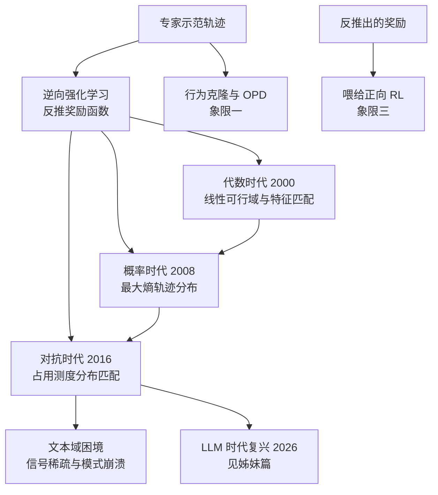

> **TL;DR 三连**
>
> - **核心结论**：逆强化学习（IRL）把强化学习倒过来——正向 RL 从奖励学策略，IRL 从专家示范反推奖励函数。它是 RLHF 奖励建模、偏好优化这些 LLM 后训练组件的共同数学祖先。
> - **反直觉发现**：IRL 的解天然不唯一——给任意奖励加一个势函数整形项，最优策略纹丝不动；线性情形下解集是一个凸多面体。五十年方法论史不是在"修 bug"，而是在解空间上不断换先验。
> - **定位**：本篇补齐本站后训练四象限地图的第 Ⅱ 象限（示范→奖励），是《从 MDP 到 GRPO》系列（象限 Ⅲ）与 OPD 系列（象限 Ⅰ）的姊妹篇。姊妹篇《[IRL 复活：LLM 对齐里的逆向强化学习](/2026/08/22/irl-renaissance-in-llm-alignment/)》讲它在 LLM 时代的复活。



## 1. 定位：把强化学习倒过来读

正向 RL 的问题陈述是：**给定奖励函数 $$r(s,a)$$，求最优策略 $$\pi^*$$**。《从 MDP 到 GRPO》系列五篇讲的全部是这个方向。

但现实里更常见的窘境恰恰相反：你有一批专家示范——围棋名局、人类驾驶记录、客服对话日志——却说不出奖励到底是什么。"什么样的奖励函数能解释这些示范？"这就是逆强化学习（Inverse RL, IRL），也叫模仿目标下的奖励反演。

用本站的四象限地图定位：

| | 学策略 | 学奖励 |
|---|---|---|
| **信号 = 示范** | 象限Ⅰ：SFT / 行为克隆 / OPD 蒸馏 | **象限Ⅱ：IRL（本篇）** |
| **信号 = 奖励** | 象限Ⅲ：正向 RL（REINFORCE → GRPO） | 象限Ⅳ：RLAIF / 自改进循环 |

为什么需要绕这一道弯、不直接克隆示范？三个理由，一个比一个根本：

1. **外推性**：示范只覆盖专家走过的轨迹流形，奖励却能对任意 $$(s,a)$$ 赋值——学到的 $$r$$ 可以喂给任何正向 RL 算法在全新状态空间继续优化，行为克隆永远给不出分布外的行为；
2. **可审计性**：奖励是一个低维、可检查、可解释的对象，策略权重不是；
3. **信号密度**：一条示范轨迹是上万 token 的序列，压成一个标量奖励后反而成为 RL 可用的稠密信用来源（这句话在 LLM 时代会反复回响）。

## 2. 第一定理：解不唯一，且不唯一得很彻底

### 2.1 问题形式化

给定专家轨迹集 $$\{\tau_1,\dots,\tau_N\}$$，$$\tau = (s_0,a_0,s_1,a_1,\dots)$$，$$a_t \sim \pi_E(\cdot\mid s_t)$$。IRL 求解：

$$
\text{找 } r(s,a) \quad \text{使得} \quad \pi_E = \arg\max_\pi \mathbb{E}_\pi\left[\sum_t \gamma^t r(s_t,a_t)\right]
$$

### 2.2 整形不变性：一整类奖励互相等价

**定理（Ng et al., 1999）**：设 $$\Phi: \mathcal{S} \to \mathbb{R}$$ 为任意势函数，定义整形奖励

$$
r'(s,a) = r(s,a) + \gamma \Phi(s') - \Phi(s)
$$

则对任意策略，两个奖励下的累积回报满足恒等关系：

$$
\mathbb{E}\left[\sum_t \gamma^t r'(s_t,a_t)\right] = \mathbb{E}\left[\sum_t \gamma^t r(s_t,a_t)\right] + \gamma^{T}\Phi(s_T) - \Phi(s_0)
$$

推导只需逐项展开 telescoping 求和：

$$
\sum_{t=0}^{T-1} \gamma^t\left[\gamma\Phi(s_{t+1})-\Phi(s_t)\right] = \sum_{t=1}^{T} \gamma^{t}\Phi(s_t) - \sum_{t=0}^{T-1} \gamma^{t} \Phi(s_t) = \gamma^{T}\Phi(s_T) - \Phi(s_0)
$$

中间项两两相消，只剩首尾。于是对有限 horizon，两个奖励下的最优策略完全相同（$$\gamma<1$$ 且 $$\Phi$$ 有界时末项趋零，结论保持）。

**一个最小数值直觉**：在 $$4\times4$$ GridWorld（本站 MDP 篇 §7 的环境）里取 $$\Phi(s)$$ = 该格到终点的曼哈顿距离的负值。整形后的每步奖励随位置变化，轨迹的"分步得分"完全不同——但贪心最短路一模一样。**分步奖励是表征，不是本质**。

### 2.3 不可辨识性的完整刻划

整形不变性只是冰山一角。线性情形（$$r_w = w^\top\phi$$）下，Ng & Russell 证明了更结构性的结论：

- **解集是凸多面体**：约束 $$w^\top(f_E - f_\pi) \ge 0$$ 对每个候选策略 $$\pi$$ 都是一条半空间，交集即解集——凸的；
- **平移不变**：$$w \to w + c\cdot\mathbf{1}$$ 不改变任何策略排序，解集至少沿全 1 方向无界；
- **退化轴**：若某特征 $$\phi_j$$ 在专家轨迹上恒为常数，$$w_j$$ 完全不可辨识。

所以 IRL 的真解不是单个 $$r$$，而是一个等价类。**后续五十年的每个方法，本质上都是在等价类上施加不同先验去挑一个代表元**——线性特征是先验，最大熵是先验，对抗博弈还是先验。这句话是全文的纲。

## 3. 代数时代：线性可行域（Ng & Russell 2000; Abbeel & Ng 2004）

### 3.1 特征期望匹配

最早的严格处理假设奖励可写成 $$k$$ 维特征的线性组合 $$r_w(s,a) = w^\top \phi(s,a)$$。定义策略 $$\pi$$ 的**特征期望向量**：

$$
f_\pi = \mathbb{E}_\pi\left[\sum_{t=0}^{\infty} \gamma^t \phi(s_t,a_t)\right] \in \mathbb{R}^k
$$

注意一个漂亮的恒等式：$$w^\top f_\pi = \mathbb{E}_\pi[\sum_t \gamma^t r_w]$$ ——**特征期望的内积就是值函数**。于是"$$\pi_E$$ 在 $$r_w$$ 下最优"可以改写为：

$$
w^\top f_E \;\ge\; w^\top f_\pi \quad \forall\, \pi \in \Pi
$$

即专家的特征期望要在任意权重下不输给任何别的策略。

### 3.2 Margin 规划：从可行域里挑代表元

可行域里有无穷多 $$w$$，需要一个挑选准则。Ratliff 等人后来的 margin 形式成为标准写法：对一组采样策略 $$\{\pi_1,\dots,\pi_m\}$$（通常含均匀随机策略与当前最优近似），解

$$
\max_{w,\;t_1,\dots,t_m} \;\sum_i t_i - \lambda \|w\|_1 \quad \text{s.t.} \quad w^\top (f_E - f_{\pi_i}) \ge t_i,\;\; t_i \ge 0
$$

每个 $$t_i$$ 是对策略 $$\pi_i$$ 的"超越裕度"，线性规划一次解出。**Abbeel & Ng 2004 的 Apprenticeship Learning** 换了个更工程的目标：不求恢复 $$w$$，只找混合策略使 $$f_{\hat\pi}$$ 与 $$f_E$$ 的 $$\ell_\infty$$ 距离小于 $$\epsilon$$——直升机特技飞行就是这么飞起来的。

**三大痛点埋下伏笔**：① 特征 $$\phi$$ 要手调，换一个领域推倒重来；② 可行域里无穷多 $$w$$，任何挑法都是偷运先验；③ 特征期望匹配是**矩匹配**——一阶矩对上了，轨迹分布未必对上（两条不同路线可以有相同期望特征）。

## 4. 概率时代：MaxEnt IRL（Ziebart, 2008）

### 4.1 先验的选择：最坏情况噪声下最合理的示范

既然解不唯一，就换一个问题："哪个 $$r$$ 让示范成为**最不意外**的行为？"假设人类演示叠加了与奖励幅度成正比的观测噪声（Laplace 噪声假设下可严格导出），示范轨迹的条件分布为指数族：

$$
P(\tau \mid w) = \frac{1}{Z(w)} \exp\left( r_w(\tau) \right), \qquad r_w(\tau) = \sum_t r_w(s_t,a_t)
$$

高奖励的轨迹指数级更可能出现，但**任何轨迹都有非零概率**——这自动处理了"专家也会失误"的现实。配分函数 $$Z(w)=\int e^{r_w(\tau)}d\tau$$ 对所有可能轨迹求和，是唯一的计算障碍。

### 4.2 软值函数：把配分函数变成动态规划

表格情形下定义**软贝尔曼算子**（$$\log\sum\exp$$ 取代 $$\max$$）：

$$
V_{soft}(s) = \log \sum_a \exp\big(Q_{soft}(s,a)\big), \qquad Q_{soft}(s,a) = r_w(s,a) + \gamma \,\mathbb{E}_{s'}\left[V_{soft}(s')\right]
$$

两个关键性质，都值得手推一遍：

**性质一（退火极限）**：温度 $$\beta \to \infty$$（即除以趋于零的温度）时，$$\log\sum_a e^{\beta Q_a}/\beta \to \max_a Q_a$$，软贝尔曼方程退回确定性最优贝尔曼方程——MaxEnt 是 Q-learning/值迭代的严格光滑化。

**性质二（配分函数闭合）**：对 $$V_{soft}$$ 的递归做归纳展开：

$$
e^{V_{soft}(s_0)} = \sum_{a_0} e^{r_0} \cdot \mathbb{E}\left[e^{V_{soft}(s_1)}\right] = \sum_{a_0,s_1,\dots} e^{r_0+r_1+\cdots} = Z(w)
$$

即 $$Z(w) = e^{V_{soft}(s_0)}$$——**配分函数这个"对所有轨迹的积分"被一步动态规划吃掉了**。这是 MaxEnt IRL 在表格情形可解的根本原因，也是它区别于暴力枚举的分水岭。

### 4.3 梯度：一步到位的漂亮结果

对数似然 $$\mathcal{L}(w) = \sum_{\tau\in\mathcal{D}} \log P(\tau\mid w)$$ 求导。单条轨迹：

$$
\frac{\partial}{\partial w}\log P(\tau\mid w) = \phi(\tau) - \frac{\partial}{\partial w}\log Z(w) = \phi(\tau) - \mathbb{E}_{\tau'\sim P(\cdot\mid w)}\left[\phi(\tau')\right]
$$

其中 $$\partial \log Z/\partial w = \mathbb{E}_{P}[\phi]$$ 是指数族的标配性质。合批得到全文最优雅的公式：

$$
\nabla_w \mathcal{L} = \underbrace{\mathbb{E}_{\tau\sim \mathcal{D}}\left[\phi(\tau)\right]}_{\text{专家特征期望 } f_E} - \underbrace{\mathbb{E}_{\tau\sim P(\cdot\mid w)}\left[\phi(\tau)\right]}_{\text{软模型特征期望 } f_\pi}
$$

**梯度为零当且仅当 $$f_E = f_\pi$$**——第 3 节那个"必要条件"在这里升格为极大似然驻点。但注意升级了什么：匹配的不再是特征期望这一个矩，而是整条指数族分布 $$P(\tau\mid w)$$；特征期望相等只是它的驻点条件。

**$$f_\pi$$ 怎么算**：不需要采样轨迹。由 $$P(a\mid s) = \exp(Q_{soft}(s,a) - V_{soft}(s))$$（softmax 形式）做**前向消息传递**，递推期望状态访问频率 $$d_t(s)$$，$$f_\pi = \sum_{s,a} d(s,a)\,\phi(s,a)$$——一次前向-后向扫过，复杂度与值迭代同阶。

##### 变量映射表（数学 ↔ 代码）

| 数学符号 | 代码变量 | Shape / 类型 | 含义 |
|---|---|---|---|
| $$r_w(\cdot)$$ | `w @ phi_sa.T` | `(nS·nA,)` | 线性奖励（按状态-动作摊平） |
| $$\phi(s,a)$$ | `phi_sa` | `(nS·nA, k)` | 特征表 |
| $$f_E$$ | `f_expert` | `(k,)` | 专家批特征均值 |
| $$V_{soft}(s)$$ | `V_soft` | `(nS,)` | 软值函数（log-sum-exp 递归） |
| $$\pi_{soft}(a\mid s)$$ | `np.exp(Q - V_soft[:,None])` | `(nS, nA)` | 软策略 |
| $$d(s,a)$$ | `d_visit` | `(nS·nA,)` | 期望状态-动作访问频率 |

```python
# MaxEnt IRL 表格版核心循环（numpy 骨架）
for it in range(n_iters):
    # ① 软贝尔曼反向递归
    Q = r_w.reshape(nS, nA) + gamma * (P.transpose(1, 0) @ V_soft)   # (nS, nA)
    V_soft = np.log(np.exp(Q).sum(axis=1))                           # log-sum-exp
    # ② 软策略 + 前向消息传递得到期望访问频率（代替不可解析的轨迹积分）
    pi_soft = np.exp(Q - V_soft[:, None])                            # (nS, nA)
    d = forward_message(pi_soft, P, horizon=T_H)                     # (nS*nA,)
    f_model = (d.reshape(nS, nA) * phi_sa).sum(axis=0)               # (k,)
    grad = f_expert - f_model                                        # ∇w L
    w += lr * grad                                                   # 梯度上升
```

### 4.4 三种"模仿"的对照

| 方法 | 匹配对象 | 奖励是否显式 | 失效场景 |
|---|---|---|---|
| 行为克隆 | 每步动作的条件分布 | 否 | 复合误差（covariate shift） |
| 特征期望匹配（§3） | 特征一阶矩 | 是（线性） | 高阶矩丢失 |
| MaxEnt IRL | 指数族轨迹分布 | 是（任意可参数化） | 配分函数估计（大空间） |

## 5. 对抗时代：GAIL 把"学奖励"绕了过去

### 5.1 占用测度：模仿问题的正确状态空间

定义策略的**占用测度** $$\rho_\pi(s,a) = \pi(a\mid s)\sum_t \gamma^t P(s_t=s)$$——策略与轨迹分布的信息在此一一对应（$$\rho$$ 相同当且仅当策略相同，折扣情形下）。于是"模仿专家"有一个干净的目标：

$$
\min_\pi \; D_{JS}\big(\rho_\pi \,\|\, \rho_E\big)
$$

行为克隆的复合误差、特征匹配的高阶矩丢失，在这里都被"整个分布对齐"的目标取代。

### 5.2 GAIL = 对抗式分布匹配（Ho & Ermon, 2016）

直接最小化 JS 散度没有梯度通路（$$\rho_\pi$$ 依赖采样），GAIL（[arXiv:1606.03476](https://arxiv.org/abs/1606.03476)）用 GAN 的标准技巧把它变成极小极大博弈：

$$
\min_\pi \max_D \;\; \mathbb{E}_{\rho_\pi}[\log D(s,a)] + \mathbb{E}_{\rho_E}[\log(1-D(s,a))]
$$

**最优判别器分析**：固定 $$\pi$$，$$D^*(s,a) = \frac{\rho_E(s,a)}{\rho_E(s,a)+\rho_\pi(s,a)}$$。代回目标可得博弈值 $$= 2\,D_{JS}(\rho_E\|\rho_\pi) - 2\log 2$$——**判别器在估计当前策略与专家的 JS 散度**，生成器（策略）则沿 $$-\log D$$ 的梯度把占用测度推向专家。隐式奖励因此可读出：

$$
r_{implicit}(s,a) = -\log D(s,a)
$$

判别器越分不清真假，奖励越平；哪里假得明显，哪里奖励梯度越大——一个自动聚焦误差区域的奖励整形器。

**与 MaxEnt 的精确关系**：GAIL 相当于把 MaxEnt IRL 里的"显式 $$r_w$$ + 配分函数"替换成"对抗学出的 $$-\log D$$"，分布匹配的目标不变、计算方式改变。代价是奖励只在训练中隐式存在，训完拿不走。**AIRL**（Adversarial IRL, [arXiv:1804.10690](https://arxiv.org/abs/1804.10690)）修补了这一点：把判别器重参数化为 $$D(s,a) = \frac{e^{f(s,a)}}{e^{f(s,a)} + \pi(a\mid s)}$$ 并令 $$f$$ 分解为"奖励项 + 整形项"，在环境动力学变化下仍能恢复**可迁移的显式奖励**——对抗时代给自己补上了"奖励可带走"的短板。

## 6. 为什么 GAIL 在文本上失败了

把 GAIL 直接搬到语言序列上的尝试（seq-GAN 一族）几乎全军覆没。四个结构性原因，按严重程度排序：

1. **序列太长，信号太稀**：一句 500 token 的回答只有一个真假标签，JS 散度的信用分配粒度粗到无法训练——对比 MaxEnt 表格版每步都有 $$d(s,a)$$ 级别的监督信号；
2. **离散 token 无梯度直传**：生成器只能走 REINFORCE，方差问题撞上判别器的高频震荡，双不稳定叠加；
3. **模式崩溃被放大**：判别器稍微变强，生成器立刻收缩到少数安全模式——JS 散度的 mode-seeking 性质（与反向 KL 同款病，本站蒸馏篇 §2.3 分析过）在开放生成场景是致命的；
4. **奖励拿不走**：即使训成，$$-\log D$$ 也无法复用于下游 RL 管线（AIRL 式修补在文本上没人跑通规模）。

文本社区的实际替代路线恰好是四象限的另外两条边：**教师 logit 匹配（OPD，象限Ⅰ）**把对抗信号换成 token 级稠密 KL 回归信号；**偏好学习（RM/DPO，象限Ⅱ的现代形态）**把单点真假判别换成成对相对比较。这两条线的展开见姊妹篇。

## 7. 三代方法总对照与批判

| 维度 | 代数时代（2000-04） | 概率时代（2008-） | 对抗时代（2016-） |
|---|---|---|---|
| 先验 | 线性特征 + margin | 最大熵轨迹分布 | 占用测度分布匹配 |
| 奖励 | 显式线性 | 显式（任意参数化） | 隐式（$$-\log D$$，AIRL 可恢复） |
| 计算瓶颈 | LP 规模随策略采样数爆炸 | 配分函数/软动态规划 | 对抗训练稳定性 |
| 大空间可行性 | 否 | 需重要性采样（GCL） | 是（深度网络） |
| 文本域可行性 | 否 | 被 RM/DPO 间接继承 | 失败（§6 四因） |

**批判与展望——三大遗留问题，五十年未竟**：

1. **不可辨识性**：解集结构性巨大。MaxEnt 挑了"最软"的代表，对抗法挑了"最可分"的代表，但"人类真实奖励"没有任何方法保证收敛到——这个问题在 LLM 时代升级为"RM 的 prompt 敏感与分数漂移"，贝叶斯后验式审计（见姊妹篇 §4.4）是当前最认真的回应；
2. **样本与计算效率**：配分函数估计昂贵、对抗训练脆弱。LLM 大规模预训练充当了通用特征提取器 $$\phi$$——这是 IRL 此刻能在对齐领域复兴的根本物质条件；
3. **奖励误设**：分布外区域学到的 $$r$$ 被 reward hacking 利用。语言条件消歧与失败样本迭代（姊妹篇 §4.3、§4.5）在对症下药，但猫鼠游戏没有终局。

**展望**：LLM 把 IRL 从"小状态空间的工程活"变成"高维语义空间的可行任务"。2025-2026 年 IRL 论文在对齐领域的密集回归不是偶然，具体战报见姊妹篇《[IRL 复活：LLM 对齐里的逆向强化学习](/2026/08/22/irl-renaissance-in-llm-alignment/)》。

## 8. Takeaway

- **解决了什么**：给"从示范恢复价值标准"建立了形式化与三代可运行算法（代数可行域 → MaxEnt 似然 → 对抗分布匹配），并证明了它们共享同一根骨架——在不可辨识解集上施加先验。
- **致命局限**：解不唯一是定理不是缺陷；所有"恢复的奖励"都只是等价类的一个代表元，分布外行为无保证。
- **如何引出下一篇**：MaxEnt 的指数族结构在成对偏好数据上退化成一个 logistic 回归——这恰好就是 RLHF 奖励模型的训练目标。IRL 与 LLM 后训练的血缘关系，下一篇用推导说话。

> 🧪 **动手练习**：① 在 $$3\times3$$ 玩具网格上用有限差分验证 $$\partial \log Z(w)/\partial w = f_\pi$$（数值 vs 解析，容差 < 1e-6）；② 给学到的奖励加任意势函数整形项 $$\Phi(s)$$ 重跑求解器，逐格对比新旧贪心策略——复现 §2 的整形不变性定理。

## 参考与延伸阅读

* Ng, Harada & Russell, "Policy invariance under reward transformations: Theory and application to reward shaping" (ICML 1999) —— §2 定理出处
* Ng & Russell, "Algorithms for Inverse Reinforcement Learning" (ICML 2000) —— 线性代数时代开山，解集凸性
* Abbeel & Ng, "Apprenticeship Learning via Inverse Reinforcement Learning" (ICML 2004) —— 特征期望匹配与直升机控制
* Ratliff, Bagnell & Zinkevich, "Maximum Margin Planning" (ICML 2006) —— §3.2 margin 规划形式
* Ziebart et al., "Maximum Entropy Inverse Reinforcement Learning" ([AAAI 2008](https://www.aaai.org/Papers/AAAI/2008/AAAI08-227.pdf)) —— 概率时代奠基
* Ho & Ermon, "Generative Adversarial Imitation Learning" ([arXiv:1606.03476](https://arxiv.org/abs/1606.03476)) —— 对抗时代奠基
* Finn, Levine & Abbeel, "Guided Cost Learning" ([arXiv:1603.00448](https://arxiv.org/abs/1603.00448)) —— 深度 MaxEnt 与重要性采样
* Fu, Luo & Levine, "Learning Robust Rewards with Adversarial Inverse Reinforcement Learning" ([arXiv:1804.10690](https://arxiv.org/abs/1804.10690)) —— AIRL，奖励可恢复性修补
* Sutton & Barto, *Reinforcement Learning: An Introduction* (2nd ed.), [免费全文](http://incompleteideas.net/book/the-book-2nd.html) —— 本系列公共底座
* 本站《从 MDP 到 GRPO》系列（象限Ⅲ）：[一](/2026/08/21/mdp-to-grpo-01-mdp-bellman-foundation/) · [二](/2026/08/21/mdp-to-grpo-02-policy-gradient-reinforce/) · [三](/2026/08/21/mdp-to-grpo-03-trpo-trust-region/) · [四](/2026/08/21/mdp-to-grpo-04-ppo-clipped-surrogate/) · [五](/2026/08/21/mdp-to-grpo-05-grpo-group-relative/)
* 本站《On-Policy Distillation 深度剖析》（象限Ⅰ）：[/2026/08/11/on-policy-distillation-deepdive/](/2026/08/11/on-policy-distillation-deepdive/)
