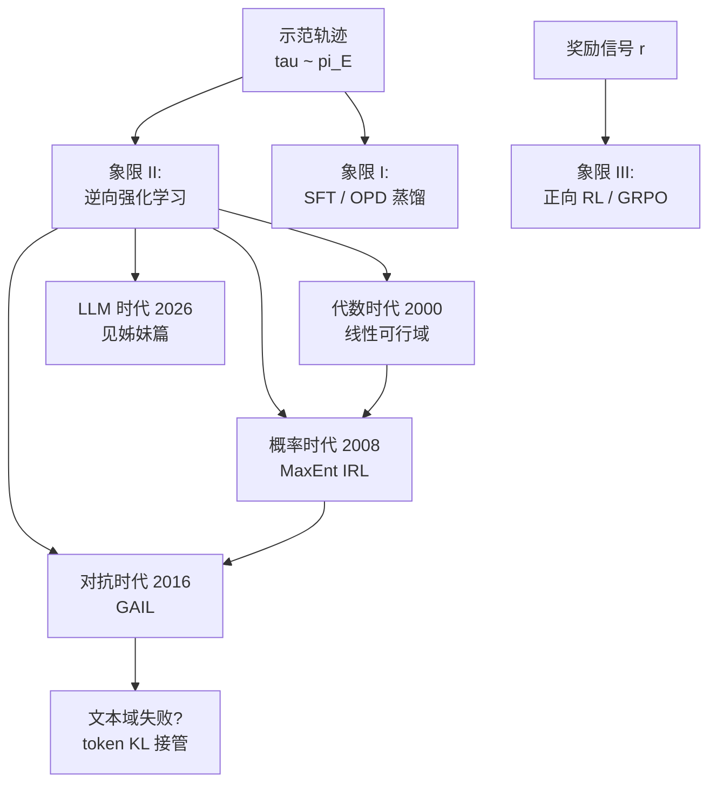

> **TL;DR 三连**
>
> - **核心结论**：逆强化学习（IRL）把强化学习倒过来——正向 RL 从奖励学策略，IRL 从专家示范反推奖励函数。它是 RLHF 奖励建模、偏好优化这些 LLM 后训练组件的共同数学祖先。
> - **反直觉发现**：IRL 的解天然不唯一——给任意奖励加一个势函数整形项，最优策略纹丝不动。这不是 bug 而是定理，整个五十年方法论史就是在"解空间"上不断加不同先验的历史。
> - **定位**：本篇补齐本站后训练四象限地图的第 Ⅱ 象限（示范→奖励），是《从 MDP 到 GRPO》系列（象限 Ⅲ）与 OPD 系列（象限 Ⅰ）的姊妹篇。姊妹篇《[IRL 复活：LLM 对齐里的逆向强化学习](/2026/08/22/irl-renaissance-in-llm-alignment/)》讲它在 LLM 时代的复活。



## 1. 定位：把强化学习倒过来读

正向 RL 的问题陈述是：**给定奖励函数 $r(s,a)$，求最优策略 $\pi^*$**。《从 MDP 到 GRPO》系列五篇讲的全部是这个方向。

但现实里更常见的窘境恰恰相反：你有一批专家示范——围棋名局、人类驾驶记录、客服对话日志——却说不出奖励到底是什么。"什么样的奖励函数能解释这些示范？"这就是逆强化学习（Inverse RL, IRL），也叫模仿目标下的奖励反演。

用本站的四象限地图定位：

| | 学策略 | 学奖励 |
|---|---|---|
| **信号 = 示范** | 象限Ⅰ：SFT / 行为克隆 / OPD 蒸馏 | **象限Ⅱ：IRL（本篇）** |
| **信号 = 奖励** | 象限Ⅲ：正向 RL（REINFORCE → GRPO） | 象限Ⅳ：RLAIF / 自改进循环 |

为什么需要绕这一道弯、不直接克隆示范？因为**示范只覆盖专家走过的路，奖励却能外推到没走过的路**。一个学到的 $r$ 可以喂给任何正向 RL 算法在全新状态空间里继续优化——这是行为克隆永远给不了的东西。

## 2. 第一定理：解不唯一

### 2.1 问题形式化

给定专家轨迹集 $\{\tau_1,\dots,\tau_N\}$，$\tau = (s_0,a_0,s_1,a_1,\dots)$，$a_t \sim \pi_E(\cdot\mid s_t)$。IRL 求解：

$$
\text{找 } r(s,a) \quad \text{使得} \quad \pi_E = \arg\max_\pi \mathbb{E}_\pi\left[\sum_t \gamma^t r(s_t,a_t)\right]
$$

### 2.2 整形不变性：一整类奖励互相等价

**定理（Ng et al., 1999）**：设 $\Phi: \mathcal{S} \to \mathbb{R}$ 为任意势函数，定义整形奖励

$$
r'(s,a) = r(s,a) + \gamma \Phi(s') - \Phi(s)
$$

则对任意策略，两个奖励下的累积回报满足恒等关系：

$$
\mathbb{E}\left[\sum_t \gamma^t r'(s_t,a_t)\right] = \mathbb{E}\left[\sum_t \gamma^t r(s_t,a_t)\right] + \gamma^{T}\Phi(s_T) - \Phi(s_0)
$$

推导只需逐项展开 telescoping 求和：$\sum_t \gamma^t[\gamma\Phi(s_{t+1})-\Phi(s_t)] = \sum_t [\gamma^{t+1}\Phi(s_{t+1}) - \gamma^t \Phi(s_t)]$，中间项两两相消，只剩首尾。对有限 horizon（或 $\gamma<1$ 且 $\Phi$ 有界）末项趋零，于是**两个奖励诱导同一个最优策略排序**。

**推论**：IRL 的真解不是单个 $r$，而是一个等价类。后续五十年的每个方法，本质上都是在等价类上施加不同的先验去挑一个代表元——线性特征是一种先验，最大熵是一种先验，对抗博弈也是一种先验。

## 3. 代数时代：线性可行域（Ng & Russell 2000; Abbeel & Ng 2004）

最早的严格处理假设奖励可写成特征的线性组合：

$$
r_w(s,a) = w^\top \phi(s,a), \qquad w \in \mathbb{R}^k
$$

其中 $\phi$ 是手工设计的特征（车速、车道偏移、棋子数……）。最优性条件翻译成**特征期望匹配**：

$$
w^\top f_E \;\ge\; w^\top f_\pi \quad \forall\, \pi, \qquad f_\pi = \mathbb{E}_\pi\left[\sum_t \gamma^t \phi(s_t,a_t)\right]
$$

即专家的特征期望要在任意权重下不输给任何别的策略。这给出一个线性可行域（可用 LP 求解 margin 最大化的 $w$）。

**Apprenticeship Learning**（Abbeel & Ng, 2004）把它做成算法：不求精确恢复 $r$，只找一个策略使其特征期望贴近专家——直升机特技飞行就是这么学出来的。

**三大痛点埋下伏笔**：① 特征要手调；② 可行域里无穷多 $w$，LP 只挑一个没有理由的代表；③ 特征期望匹配是必要非充分——匹配了均值不代表轨迹分布对上了。

## 4. 概率时代：MaxEnt IRL（Ziebart, 2008）

### 4.1 先验的选择：最坏情况噪声下最合理的示范

既然解不唯一，就换一个问题："哪个 $r$ 让示范成为**最不意外**的行为？"假设人类演示带有与幅度成正比的随机噪声，由最大熵原理可推出轨迹的条件分布为指数族：

$$
P(\tau \mid w) = \frac{1}{Z(w)} \exp\left( r_w(\tau) \right), \qquad r_w(\tau) = \sum_t r_w(s_t,a_t)
$$

配分函数 $Z(w)=\int e^{r_w(\tau)}d\tau$ 是难点——它要对所有可能轨迹积分。

### 4.2 软值函数：把配分函数变成动态规划

表格情形下定义软贝尔曼算子（log-sum-exp 取代 max）：

$$
V_{soft}(s) = \log \sum_a \exp\big(Q_{soft}(s,a)\big), \qquad Q_{soft}(s,a) = r_w(s,a) + \gamma \,\mathbb{E}_{s'}\left[V_{soft}(s')\right]
$$

注意 $\max$ 与 $\log\sum\exp$ 的差别只在温度：温度 $\to 0$ 时退回确定性最优贝尔曼方程，温度越大示范越"允许犯错"。配分函数恰好等于起始状态的 $e^{V_{soft}}$，动态规划一次算完。

### 4.3 梯度：一步到位的漂亮结果

对数似然对 $w$ 求导，配分函数那一项正好产生模型侧的特征期望：

$$
\nabla_w \mathcal{L} = \underbrace{\mathbb{E}_{\tau\sim \mathcal{D}}\left[\phi(\tau)\right]}_{\text{专家特征期望 } f_E} - \underbrace{\mathbb{E}_{\tau\sim P(\cdot\mid w)}\left[\phi(\tau)\right]}_{\text{采样器特征期望 } f_\pi}
$$

**梯度为零当且仅当两个特征期望相等**——第 3 节那个"必要条件"在这里变成了极大似然的驻点条件，且现在匹配的是整条指数族分布而非单个均值。

##### 变量映射表（数学 ↔ 代码）

| 数学符号 | 代码变量 | Shape / 类型 | 含义 |
|---|---|---|---|
| $r_w(\cdot)$ | `reward_fn` 或 `w @ phi` | 标量 / `(k,)`·`(k,)` 内积 | 线性奖励 |
| $\phi(\tau)$ | `feat_traj` | `(k,)` | 单条轨迹特征和 |
| $f_E$ | `f_expert` | `(k,)` | 专家批特征均值 |
| $V_{soft}(s)$ | `V_soft` | `(nS,)` | 软值函数（log-sum-exp 递归） |
| $f_\pi$ | `f_model` | `(k,)` | 软策略采样特征均值 |

```python
# MaxEnt IRL 表格版核心循环（numpy 骨架）
for it in range(n_iters):
    # ① 软贝尔曼反向递归：E[Q] 用当前策略的占用率加权
    Q = r_w.reshape(nS, nA) + gamma * (P.transpose(1, 0) @ V_soft)   # (nS, nA)
    Z_per_s = np.log(np.exp(Q).sum(axis=1))                          # log-sum-exp
    V_soft = Z_per_s                                                 # 软值
    # ② 前向消息传递得到 soft 占用率 d(s,a)，代替不可解析的 E_tau[phi]
    d = forward_message(Q)                                           # (nS*nA,) 期望状态访问频率
    f_model = (d.reshape(nS, nA) * phi_sa).sum(axis=0)               # (k,)
    grad = f_expert - f_model                                        # ∇w L
    w += lr * grad                                                   # 梯度上升
```

## 5. 对抗时代：GAIL 把"学奖励"绕了过去

### 5.1 占用测度：模仿问题的正确状态空间

定义策略的占用测度 $\rho_\pi(s,a) = \pi(a\mid s)\sum_t \gamma^t P(s_t=s)$——轨迹分布的全部信息压进这个对象。于是"模仿专家"有一个干净的目标：

$$
\min_\pi \; JS\big(\rho_\pi \,\|\, \rho_E\big)
$$

### 5.2 GAIL = 对抗式分布匹配（Ho & Ermon, 2016）

GAIL（Generative Adversarial Imitation Learning, [arXiv:1606.03476](https://arxiv.org/abs/1606.03476)）指出上式可以不改环境地用对抗训练逼近：

$$
\min_\pi \max_D \;\; \mathbb{E}_{\rho_\pi}[\log D(s,a)] + \mathbb{E}_{\rho_E}[\log(1-D(s,a))]
$$

判别器 $D$ 的最优解给出隐式奖励 $r_{implicit}(s,a) = -\log D(s,a)$——这正是 GAN 判别器的 logit 反读。与 MaxEnt 的关系：**GAIL 在占用测度空间做分布匹配，绕过了显式的 $r$ 与配分函数计算**；代价是奖励只在训练过程中隐式存在，训完拿不走。深度版 MaxEnt（Guided Cost Learning, [arXiv:1603.00448](https://arxiv.org/abs/1603.00448)）则保留显式神经奖励 $r_\theta$，用重要性采样近似配分函数——两条路同源而异归。

## 6. 为什么 GAIL 在文本上失败了

把 GAIL 直接搬到语言序列上的尝试（seq-GAN 一族）几乎全军覆没。四个结构性原因：

1. **序列太长，信号太稀**：一句 500 token 的回答只有一个真假标签，JS 散度的信用分配粒度粗到无法训练；
2. **离散 token 无梯度直传**：生成器只能走 REINFORCE，方差问题撞上判别器的高频震荡，双不稳定叠加；
3. **模式崩溃被放大**：判别器稍微变强，生成器立刻收缩到少数安全模式——与开放生成的要求背道而驰；
4. **奖励拿不走**：即使训成，$-\log D$ 也无法复用于下游 RL 管线。

文本社区的实际替代路线恰好是四象限的另外两条边：**教师 logit 匹配（OPD，象限Ⅰ）**用 token 级 KL 把对抗信号换成稠密回归信号；**偏好学习（RM/DPO，象限Ⅱ的现代形态）**用成对比较取代单点真假判别。这两条线的展开见姊妹篇。

## 7. 批判与展望

**三大遗留问题，五十年未竟**：

| 问题 | 内容 | 当前缓解手段 |
|---|---|---|
| 不可辨识性 | 整形不变性 + 特征冗余导致解集巨大 | MaxEnt 先验、贝叶斯后验（LLM 时代审计框架，见姊妹篇） |
| 样本效率 | 配分函数估计昂贵，对抗训练脆弱 | LLM 大规模预训练充当通用特征提取器 |
| 奖励误设 | 学到的 $r$ 在分布外被 reward hacking 利用 | 语言条件消歧、失败样本迭代（见姊妹篇 §4） |

**展望**：LLM 把 IRL 从"小状态空间的工程活"变成"高维语义空间的可行任务"——预训练模型天生就是 $\phi$ 的万能实现，示范数据（人类偏好对、强模型轨迹）在 LLM 语境里俯拾皆是。2025-2026 年 IRL 论文在对齐领域的密集回归不是偶然，具体战报见姊妹篇《[IRL 复活：LLM 对齐里的逆向强化学习](/2026/08/22/irl-renaissance-in-llm-alignment/)》。

## 8. Takeaway

- **解决了什么**：给"从示范恢复价值标准"建立了形式化与三代可运行算法（代数可行域 → MaxEnt 似然 → 对抗分布匹配）。
- **致命局限**：解不唯一是定理不是缺陷修复目标；所有方法都在解空间上加先验，区别只在先验是什么。
- **如何引出下一篇**：MaxEnt 的指数族结构在成对偏好数据上退化成一个 logistic 回归——这恰好就是 RLHF 奖励模型的训练目标。IRL 与 LLM 后训练的血缘关系，下一篇用推导说话。

> 🧪 **动手练习**：① 把 MaxEnt 软贝尔曼的温度调到趋近 0，验证 $V_{soft}$ 退化为标准最优贝尔曼方程；② 给奖励加任意势函数整形项 $\Phi(s)$ 重跑求解器，逐格对比新旧策略——复现 §2 的整形不变性定理。

## 参考与延伸阅读

* Ng, Harada & Russell, "Policy invariance under reward transformations: Theory and application to reward shaping" (ICML 1999) —— §2 定理出处
* Ng & Russell, "Algorithms for Inverse Reinforcement Learning" (ICML 2000) —— 线性代数时代开山
* Abbeel & Ng, "Apprenticeship Learning via Inverse Reinforcement Learning" (ICML 2004) —— 特征期望匹配与直升机控制
* Ziebart et al., "Maximum Entropy Inverse Reinforcement Learning" ([AAAI 2008](https://www.aaai.org/Papers/AAAI/2008/AAAI08-227.pdf)) —— 概率时代奠基
* Ho & Ermon, "Generative Adversarial Imitation Learning" ([arXiv:1606.03476](https://arxiv.org/abs/1606.03476)) —— 对抗时代奠基
* Finn, Levine & Abbeel, "Guided Cost Learning" ([arXiv:1603.00448](https://arxiv.org/abs/1603.00448)) —— 深度 MaxEnt 与重要性采样
* Sutton & Barto, *Reinforcement Learning: An Introduction* (2nd ed.), [免费全文](http://incompleteideas.net/book/the-book-2nd.html) —— 本系列公共底座
* 本站《从 MDP 到 GRPO》系列（象限Ⅲ）：[一](/2026/08/21/mdp-to-grpo-01-mdp-bellman-foundation/) · [二](/2026/08/21/mdp-to-grpo-02-policy-gradient-reinforce/) · [三](/2026/08/21/mdp-to-grpo-03-trpo-trust-region/) · [四](/2026/08/21/mdp-to-grpo-04-ppo-clipped-surrogate/) · [五](/2026/08/21/mdp-to-grpo-05-grpo-group-relative/)
* 本站《On-Policy Distillation 深度剖析》（象限Ⅰ）：[/2026/08/11/on-policy-distillation-deepdive/](/2026/08/11/on-policy-distillation-deepdive/)
