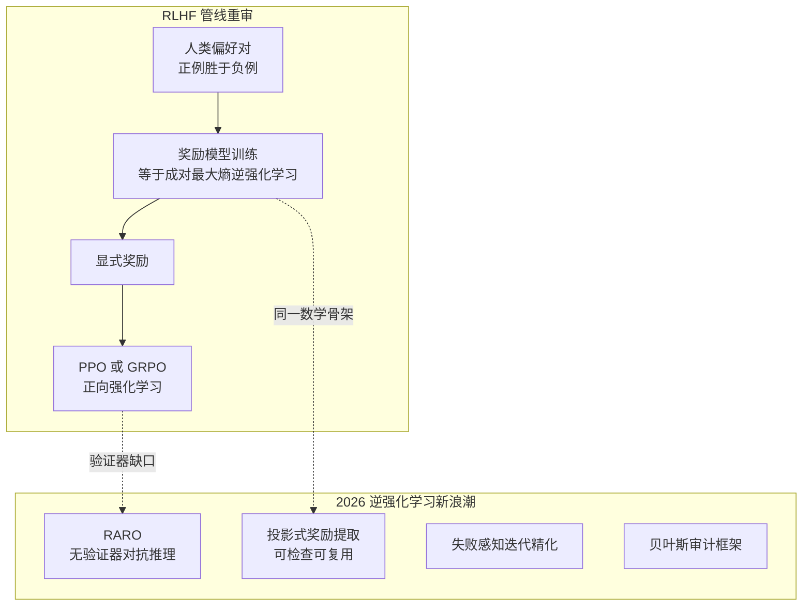

> **TL;DR 三连**
>
> - **核心结论**：RLHF 里训练奖励模型这一步，数学上就是成对偏好版的 MaxEnt 逆强化学习——配分函数在两条候选回答上塌缩成一个 sigmoid。IRL 不是新东西，而是 LLM 后训练被遗忘的姓氏。2025-10 到 2026-07，它以可解释审计、无验证器推理、失败样本学习三张面孔密集回归。
> - **反直觉发现**：DPO 同时在学策略和隐式奖励，是四象限里罕见的 Ⅱ/Ⅲ 混合体——"DPO 算不算 IRL"取决于你把闭式奖励提取算在哪一侧；而这个区分在审计场景有真金白银的差别。
> - **定位**：本篇填上后训练四象限地图的最后一块（象限Ⅱ的现代形态），前置阅读：《[逆强化学习五十年](/2026/08/22/irl-fifty-years-from-demonstrations/)》。



## 1. 问题陈述：验证器缺口

《从 MDP 到 GRPO》系列讲到的 RLVR（可验证奖励 RL）有个隐含前提：**你得先有一个便宜的、不可欺骗的奖励来源**。这就是为什么 RL 恰恰在数学与代码两个领域一飞冲天（DeepSeek-R1 的 aha moment 都出自这里）——把"哪些领域被 RL 点亮了、哪些还黑着"列成表，缺口一目了然：

| 领域 | 自动验证器 | 专家示范 | RLVR 现状 |
|---|---|---|---|
| 竞赛数学 | ✅ 答案核对 | 中 | 已起飞 |
| 代码生成 | ✅ 单元测试 | 多 | 已起飞 |
| 格式/工具调用 | ✅ 规则解析 | 多 | 已起飞（本站 ToolRL） |
| 开放写作 | ❌ | 多 | 黑区 |
| 长程 Agent 任务 | ❌（奖励稀疏+延迟） | 中 | 半黑区（本站 Search RL 是特例） |
| 科研辅助 / 决策 | ❌ | 多 | 黑区 |

黑区的共同点：**示范数据俯拾皆是，奖励却无处可寻**。正向 RL 在这里熄火，IRL 的老命题——"从示范反推奖励"——正好对着这个缺口。这不是类比修辞：下面的推导说明 RM 训练本来就是 IRL。

## 2. 核心推导：奖励建模就是成对 MaxEnt IRL

### 2.1 从轨迹似然到成对比较

MaxEnt IRL 给出轨迹分布 $$P(\tau\mid w)\propto \exp(r_w(\tau))$$（《[前篇](/2026/08/22/irl-fifty-years-from-demonstrations/)》§4）。人类标注者很少给完整轨迹打绝对分，更多给出**成对偏好** $$y_w \succ y_l$$（$$y_w$$ 胜 $$y_l$$）。

关键一步：把"回答空间"收缩为仅有的两个候选 $$\{y_w, y_l\}$$，配分函数从"对所有轨迹积分"塌缩为两项之和：

$$
P(y_w \succ y_l \mid x) = \frac{e^{r_\phi(x,y_w)}}{e^{r_\phi(x,y_w)} + e^{r_\phi(x,y_l)}} = \sigma\big(r_\phi(x,y_w) - r_\phi(x,y_l)\big)
$$

**配分函数的难，难在对无限轨迹类求和；成对比较把它砍成两项**——这就是偏好学习在工程上碾压轨迹级 IRL 的根本原因。取负对数似然，得到熟悉的 Bradley-Terry 损失：

$$
\mathcal{L}_{BT}(\phi) = -\log \sigma\big(r_\phi(x,y_w) - r_\phi(x,y_l)\big)
$$

**这正是 InstructGPT 以来所有 RM 的训练目标**（[arXiv:2203.02155](https://arxiv.org/abs/2203.02155)）。每次你训 RM，你都在做 IRL——只不过教科书没这么叫。顺带一提，RM 的长度偏置（长回答系统性高分）在 IRL 视角下也有解释：$$r_\phi$$ 作为黑箱"特征提取器"，长度是最容易抓到的判别特征——这正是前篇 §2 特征不可辨识性问题的现代症状。

### 2.2 要素对照表

| 经典 IRL 要素 | LLM 对齐对应物 | 变化点 |
|---|---|---|
| 专家轨迹 $$\tau \sim \pi_E$$ | 人类偏好对 $$(y_w, y_l)$$ | 全序 → 成对比较 |
| 特征 $$\phi(s,a)$$ 手工设计 | 奖励模型 $$r_\phi$$ 整体为黑箱 NN | 特征工程消失（也失去可解释性） |
| 轨迹级指数族似然 | 成对 Bradley-Terry | 配分函数塌缩成一对比值 |
| 学到 $$r$$ 后跑正向 RL | RM 打分喂 PPO/GRPO | 完全同构 |
| 不可辨识性定理 | RM 的 prompt 敏感 / 长度偏置 / 分数漂移 | 同一病的新症状 |

### 2.3 代码等价性一瞥

```python
# 同一个损失的两个名字
import torch.nn.functional as F
# 成对 MaxEnt IRL：两候选回答上的指数族似然取 NLL
loss_irl = F.softplus(-(r(x, yw) - r(x, yl)))       # -log sigmoid(Δr)
# RLHF 的 RM 训练目标（InstructGPT 式）
loss_rm  = -F.logsigmoid(rm(x, yw) - rm(x, yl))     # 逐字相同
```

##### 变量映射表（数学 ↔ 代码）

| 数学符号 | 代码变量 | Shape / 类型 | 含义 |
|---|---|---|---|
| $$r_\phi(x,y)$$ | `rm(x, y)` | 标量 | 回答级奖励 |
| $$y_w \succ y_l$$ | `yw, yl` | batch of str | 偏好对 |
| $$\Delta r$$ | `rm(x,yw) - rm(x,yl)` | `(B,)` | 奖励差 |
| $$\mathcal{L}_{BT}$$ | `-F.logsigmoid(delta).mean()` | 标量 | 成对 MaxEnt NLL |

## 3. DPO 的 IRL 视角：闭式奖励提取

### 3.1 两步推导，看清配分函数去哪了

经典 IRL 是两段式：先恢复 $$r$$，再用正向 RL 优化。DPO（[arXiv:2305.18290](https://arxiv.org/abs/2305.18290)）的出发点是把奖励**参数化进策略**：

$$
r(x,y) = \beta \log \frac{\pi_\theta(y\mid x)}{\pi_{ref}(y\mid x)}
$$

代入 BT 目标后，唯一的麻烦仍是配分函数 $$Z(x) = \sum_y \exp(r(x,y))$$——对回答空间求和不可算。DPO 的关键操作是**用 $$\pi_{ref}$$ 归一化重写指数**：

$$
e^{r(x,y)} = \left(\frac{\pi_\theta(y\mid x)}{\pi_{ref}(y\mid x)}\right)^\beta = \frac{1}{Z(x)}\left(\frac{\pi_\theta(y\mid x)}{Z(x)^{1/\beta}\,\pi_{ref}(y\mid x)}\right)^\beta \cdot Z(x)
$$

整理时把 $$Z(x)$$ 从每个候选中提出，BT 的比值里它**分子分母直接相消**（对同一 prompt 的两个回答，$$Z(x)$$ 相同）：

$$
P(y_w \succ y_l\mid x) = \sigma\left(\beta \log \frac{\pi_\theta(y_w\mid x)}{\pi_{ref}(y_w\mid x)} - \beta \log \frac{\pi_\theta(y_l\mid x)}{\pi_{ref}(y_l\mid x)}\right)
$$

于是最优策略有闭式解 $$\pi^*(y\mid x) \propto \pi_{ref}(y\mid x)e^{r(x,y)/\beta}$$，损失里不再出现任何需要求和的 $$Z$$——**奖励被解析地吸收进策略本身**，一步梯度直达策略，无需显式 RM。

### 3.2 这算不算 IRL？——血统上是，形态上不是

支持"是"：DPO 优化的目标函数恰是 IRL 的偏好似然；隐式奖励 $$r=\beta\log(\pi_\theta/\pi_{ref})$$ 在参考模型给定的"规范"（gauge）下与 BT 拟合的奖励等价——这正是前篇"解等价类"概念的再现：$$\pi_{ref}$$ 的选择相当于在等价类里选了一个坐标规范。

支持"不是"：IRL 的交付物是一个**可检查、可复用、可迁移**的显式奖励函数；DPO 训完只剩策略权重，奖励锁死在权重里。这个区分在三个场景有真金白银的差别：

| 场景 | 显式奖励（RM 型） | 隐式奖励（DPO 型） |
|---|---|---|
| 审计（奖励到底学了什么） | 可以逐样本打分检查 | 只能靠行为探测 |
| 复用（奖励喂给别的 RL 管线/别的模型） | 直接可用 | 需重新训练 |
| 在线监控（reward hacking 预警） | 分数漂移可观测 | 无信号 |

所以 2026 年 IRL 复兴的一个核心动机就是把"可带走的奖励"重新变成一等公民——见 §4.2。

中文社区对 DPO/PPO/GRPO 三个目标的对照速览见《[一文搞懂DPO、PPO和GRPO；附代码理解](https://zhuanlan.zhihu.com/p/27332009509)》（知乎）。

## 4. 2026 新浪潮：五篇论文逐一拆解

以下方法描述基于各论文 arXiv 摘要原文，实验细节以原文为准。

### 4.1 Escaping the Verifier → RARO（arXiv:[2511.21667](https://arxiv.org/abs/2511.21667)）

针对 §1 表格里"推理任务缺验证器但有大量专家示范"的空白，提出 **RARO（Relativistic Adversarial Reasoning Optimization）**：在策略模型与一个 **relativistic critic** 之间建立对抗博弈，仅凭专家示范通过 IRL 学会强推理。

**机制拆解**：普通 GAIL 判别器给绝对真假分，校准困难且一强就崩（前篇 §6）；RARO 的 critic 只做**相对判断**（这对样本谁更好），绝对分数被差分化消掉。这与 GRPO 的组相对优势是同构思想——**都放弃绝对标尺、只保留排序信息**，GRPO 在正向 RL 里干掉了 value network，RARO 在逆向侧干掉了绝对判别器。两条线在"相对化"上会师，这不是巧合：绝对奖励恰恰是 IRL 不可辨识性最难恢复的部分。

### 4.2 Inverse RL Helps Align AI by Imitating Humans（arXiv:[2607.24900](https://arxiv.org/abs/2607.24900)）

纲领性工作。追问：**能否仅凭示范得到一个可检查（inspectable）、可复用（reusable）、并且能直接用于在策略优化的隐式奖励？** 三个形容词分别对应 §3.2 表格的三行——审计、迁移、RM-free RL。提出投影式奖励提取的对齐管线，把 IRL 的交付物重新变成一等公民，与 DPO"奖励锁进权重"的路线形成正面对照。若此路线成立，§3.2 表格里隐式奖励的三行劣势将被逐行填平。

### 4.3 Failure-Aware Inverse RL（arXiv:[2510.06092](https://arxiv.org/abs/2510.06092)）

观察：已有"从 RLHF 行为提取潜在激励"的工作对所有偏好对一视同仁，但信息量极度不均——**被判错或近分的对才是硬信号**。定义 failures = 提取的奖励模型 misclassify 或两侧打分几乎相等的样本，迭代聚焦失败对精化奖励。机制上是一个 EM 式循环：E 步用当前奖励给偏好对按"意外程度"加权，M 步重训奖励——把主动学习注入 IRL 提取。对本站读者的接口：这相当于给 §2 的 BT 损失加了一个动态样本权重 $$w_i = g(\Delta r_i)$$，近分对（$$\Delta r_i \approx 0$$）权重最高。

### 4.4 The Alignment Auditor（arXiv:[2510.06096](https://arxiv.org/abs/2510.06096)）

直面不可辨识性定理：单点奖励估计必然过度自信（前篇 §2.3 的凸多面体解集，挑哪个代表都无理）。把奖励推断从"估计问题"重构为"**验证过程**"：贝叶斯框架输出奖励后验，后验的宽度本身成为诊断量——后验宽说明示范不足以确定目标（欠定警示），后验窄则可对 LLM 隐式目标做可证伪的核查。这是前篇"三大遗留问题"之首在 LLM 时代的第一个正面解法。

### 4.5 Masked IRL（arXiv:[2511.14565](https://arxiv.org/abs/2511.14565)）与 X-KD（arXiv:[2602.12674](https://arxiv.org/abs/2602.12674)）

Masked IRL 处理 IRL 的老毛病——示范只展示"怎么做"不展示"什么重要"，奖励过拟合到无关状态特征。方案：自然语言指令引导 LLM **掩蔽无关维度**，在多个与示范一致的候选奖励中消歧。本质是给 IRL 注入结构先验的新通道——语言取代了经典时代的特征工程。

X-KD 把"让学生在**教师原始环境**中学习"形式化为经验蒸馏框架，灵感明确标注来自 IRL。与本站 OPD 两篇的关系一张表看清：

| | OPD（本站已有） | X-KD |
|---|---|---|
| 匹配对象 | 教师在学生轨迹上的 logit 分布 | 教师的学习环境与经历 |
| 信号形态 | token 级 KL 回归 | 环境交互 + 经验回放 |
| IRL 视角 | 只学"教师的行为" | 连"塑造教师的环境奖励"一起学 |
| 适用前提 | 有教师 logit 访问权 | 有可交互环境 |

## 5. 正向 RL vs 逆向 RL：对偶总表

把两条线放在一张表里对峙（这是"正向/反向"主题的正面回答）：

| 维度 | 正向 RL（象限Ⅲ） | 逆向 RL（象限Ⅱ） |
|---|---|---|
| 已知 → 未知 | 奖励已知 → 求策略 | 示范已知 → 求奖励 |
| 优化目标 | $$\max_\pi \mathbb{E}[\sum\gamma^t r]$$ | $$\max_r \; P(\text{示范}\mid r)$$ |
| 信息来源 | 奖励信号（每个 $$(s,a)$$ 可查询） | 示范分布（只覆盖专家流形） |
| 核心困难 | 探索、信用分配 | 不可辨识性、分布外误设 |
| 失效模式 | reward hacking 奖励漏洞 | 奖励欠定 / 过拟合表面特征 |
| LLM 时代代表 | RLVR + GRPO | RM / DPO / RARO / 审计框架 |
| 互相需要 | 需要 IRL 供奖励（黑区） | 需要 forward RL 消费奖励 |

最后一行是对偶的实践意义：**两条线互为供需**。RLVR 黑区（无验证器）缺奖励，IRL 供；IRL 提取的奖励要产生行为，还得交回正向 RL 执行。2026 年的对齐前沿本质上是这条供需链的工程化。

## 6. 四象限闭环：本站内容焊接图

至此四象限在本站全部落位：象限Ⅰ（[OPD](/2026/08/11/on-policy-distillation-deepdive/)、[在线蒸馏](/2026/08/11/online-distillation-methods/)）、象限Ⅱ（本篇 + [IRL 五十年](/2026/08/22/irl-fifty-years-from-demonstrations/)）、象限Ⅲ（[mdp-to-grpo 系列](/2026/08/21/mdp-to-grpo-05-grpo-group-relative/)、[ToolRL](/2026/08/10/toolrl-reward-is-all-deepdive/)、[Search RL](/2026/08/11/search-rl-deepdive/)）。缺的只有象限Ⅳ（RLAIF/自改进循环）——留作下个坑位。

## 7. 批判与展望

**老三样复发风险评估**：

1. **不可辨识性**：LLM 域反而更凶——RM 的长度偏置、prompt 敏感都是解集巨大这一老病的现代症状。Auditor 的贝叶斯后验是正确方向，但"后验多宽算危险"没有公认阈值，距离工程化审计还有距离；
2. **计算成本**：预训练模型充当万能特征提取器，经典 IRL 的最大痛点被大幅缓解——这是 IRL 此刻能复兴的根本物质条件；但 RARO 式对抗博弈在 100B+ 模型上的训练稳定性尚无公开证据；
3. **误设与 hacking**：Masked IRL 的语言消歧、Failure-Aware 的迭代纠错都在对症下药，但 reward hacking 是猫鼠游戏，没有终局。

**开放问题**：① 隐式奖励（DPO 型）与显式奖励（RM 型）的可审计性差距如何量化？② RARO 的相对化判据能否推广到多智能体/多教师场景？③ 四象限的第Ⅳ象限——奖励的自我改进——何时需要引入 IRL 来给自改进装刹车？

## 8. Takeaway

- **解决了什么**：证明了 RM 训练 ⊂ 成对 MaxEnt IRL（配分函数塌缩是全部魔法的来源），把 DPO 定位为 Ⅱ/Ⅲ 混合体，并拆解了 2026 年 IRL 复兴的五篇代表作。
- **致命局限**：摘要级拆解——各方法的实验细节、消融、失效边界需读原文 PDF 复核；不可辨识性的工程化审计仍不成熟。
- **如何引出下一篇**：象限Ⅳ（RLAIF 与自改进）是四象限最后一块拼图，也是 reward hacking 最凶险的战场。

## 参考与延伸阅读

* Ouyang et al., "Training language models to follow instructions with human feedback" ([arXiv:2203.02155](https://arxiv.org/abs/2203.02155)) —— RLHF 标准 pipeline，§2 的 RM 训练出处
* Rafailov et al., "Direct Preference Optimization" ([arXiv:2305.18290](https://arxiv.org/abs/2305.18290)) —— §3 闭式奖励提取
* "Inverse RL Helps Align AI by Imitating Humans" ([arXiv:2607.24900](https://arxiv.org/abs/2607.24900)) —— §4.2
* "Escaping the Verifier: Learning to Reason via Demonstrations (RARO)" ([arXiv:2511.21667](https://arxiv.org/abs/2511.21667)) —— §4.1
* "Learning from Failures: Failure-Aware Inverse RL" ([arXiv:2510.06092](https://arxiv.org/abs/2510.06092)) —— §4.3
* "The Alignment Auditor: A Bayesian Framework" ([arXiv:2510.06096](https://arxiv.org/abs/2510.06096)) —— §4.4
* "Masked IRL: LLM-Guided Reward Disambiguation" ([arXiv:2511.14565](https://arxiv.org/abs/2511.14565)) —— §4.5
* "$$\mathcal{X}$$-KD: General Experiential Knowledge Distillation" ([arXiv:2602.12674](https://arxiv.org/abs/2602.12674)) —— §4.5
* DeepSeek-AI, "DeepSeekMath" ([arXiv:2402.03300](https://arxiv.org/abs/2402.03300)) / "DeepSeek-R1" ([arXiv:2501.12948](https://arxiv.org/abs/2501.12948)) —— GRPO 与 RLVR 主线
* 中文社区视角：《[一文搞懂DPO、PPO和GRPO；附代码理解](https://zhuanlan.zhihu.com/p/27332009509)》（知乎）
* 本站姊妹篇：《[逆强化学习五十年](/2026/08/22/irl-fifty-years-from-demonstrations/)》 · 《[On-Policy Distillation 深度剖析](/2026/08/11/on-policy-distillation-deepdive/)》 · 《[GRPO：组相对优势与大模型时代的 RL](/2026/08/21/mdp-to-grpo-05-grpo-group-relative/)》

> 🧪 **动手练习**：① 用 §2.3 的代码骨架在一个 toy RM 上验证 BT 损失的梯度与成对 MaxEnt IRL 解析梯度逐元素相等（容差 < 1e-6）；② 取一份开源 RM，构造 20 个近分偏好对，观察其分数差的方差是否显著小于随机对——复现 §4.3 定义 failures 的动机；③ 手推 §3.1 的 $$Z(x)$$ 相消过程，确认每一步没有偷换求和范围。
