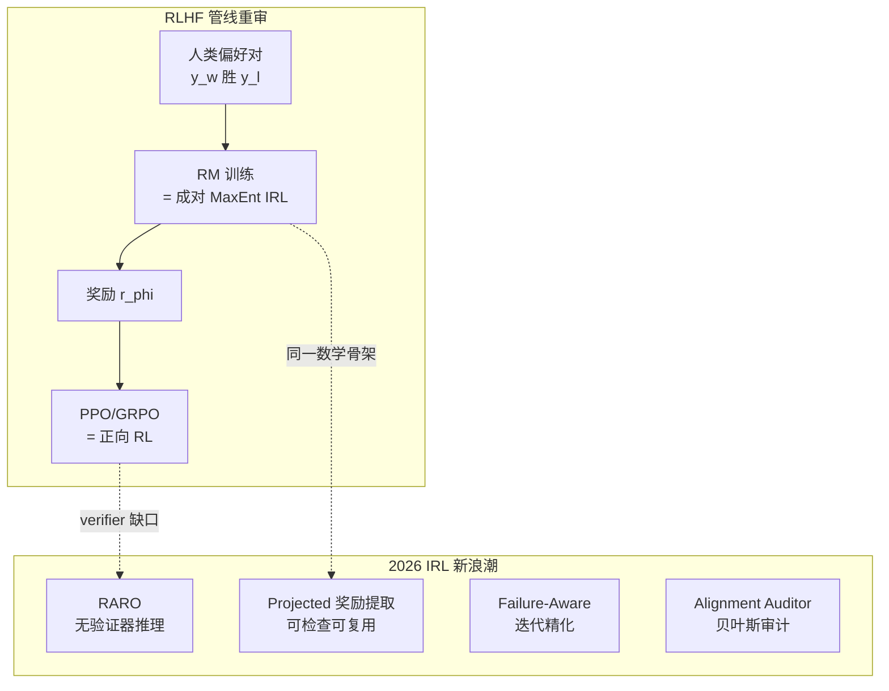

> **TL;DR 三连**
>
> - **核心结论**：RLHF 里训练奖励模型这一步，数学上就是成对偏好版的 MaxEnt 逆强化学习——IRL 不是新东西，而是 LLM 后训练被遗忘的姓氏。2025-10 到 2026-07，它以可解释审计、无验证器推理、失败样本学习三张面孔密集回归。
> - **反直觉发现**：DPO 同时在学策略和隐式奖励，是四象限里罕见的 Ⅱ/Ⅲ 混合体——"DPO 算不算 IRL"取决于你把闭式奖励提取算在哪一侧。
> - **定位**：本篇填上后训练四象限地图的最后一块（象限Ⅱ的现代形态），前置阅读：《[逆强化学习五十年](/2026/08/22/irl-fifty-years-from-demonstrations/)》。



## 1. 问题陈述：验证器缺口

《从 MDP 到 GRPO》系列讲到的 RLVR（可验证奖励 RL）有个隐含前提：**你得先有一个便宜的、不可欺骗的奖励来源**。数学有答案核对，代码有单元测试——所以这两个领域 RL 一飞冲天。但开放写作、长程 agent 任务、科研辅助……这些恰恰是示范数据俯拾皆是、而验证器无处可寻的地带。

正向 RL 在这里熄火，示范却大量闲置。IRL 的老命题——"从示范反推奖励"——正好对着这个缺口。这不是类比修辞：下面的推导说明 RM 训练本来就是 IRL。

## 2. 核心推导：奖励建模就是成对 MaxEnt IRL

### 2.1 从轨迹似然到成对比较

MaxEnt IRL 给出轨迹分布 $P(\tau\mid w)\propto \exp(r_w(\tau))$（《[前篇](/2026/08/22/irl-fifty-years-from-demonstrations/)》§4）。人类标注者很少给完整轨迹打分，更多给出**成对偏好** $y_w \succ y_l$（$y_w$ 胜 $y_l$）。把两条候选回答视为仅有的两个"动作"，MaxEnt 分布直接给出：

$$
P(y_w \succ y_l \mid x) = \frac{e^{r_\phi(x,y_w)}}{e^{r_\phi(x,y_w)} + e^{r_\phi(x,y_l)}} = \sigma\big(r_\phi(x,y_w) - r_\phi(x,y_l)\big)
$$

取负对数似然，得到熟悉的 Bradley-Terry 损失：

$$
\mathcal{L}_{BT}(\phi) = -\log \sigma\big(r_\phi(x,y_w) - r_\phi(x,y_l)\big)
$$

**这正是 InstructGPT 以来所有 RM 的训练目标**（[arXiv:2203.02155](https://arxiv.org/abs/2203.02155)）。也就是说：每次你训 RM，你都在做 IRL——只不过教科书没这么叫。

### 2.2 要素对照表

| 经典 IRL 要素 | LLM 对齐对应物 | 变化点 |
|---|---|---|
| 专家轨迹 $\tau \sim \pi_E$ | 人类偏好对 $(y_w, y_l)$ | 全序 → 成对比较 |
| 特征 $\phi(s,a)$ 手工设计 | 奖励模型 $r_\phi$ 整体为黑箱 NN | 特征工程消失 |
| 轨迹级指数族似然 | 成对 Bradley-Terry | 配分函数塌缩成一对比值 |
| 学到 $r$ 后跑正向 RL | RM 打分喂 PPO/GRPO | 完全同构 |
| 不可辨识性定理 | RM 的 prompt 敏感 / 分数漂移 | 同一病的新症状 |

### 2.3 代码等价性一瞥

```python
# 同一个损失的两个名字
import torch.nn.functional as F
# 成对 MaxEnt IRL：轨迹特征线性奖励下的负对数似然
loss_irl   = F.softplus(-(r(yw) - r(yl)))          # -log sigmoid(Δr)
# RLHF 的 RM 训练目标（InstructGPT 式）
loss_rm    = -F.logsigmoid(rm(x, yw) - rm(x, yl))  # 逐字相同
```

##### 变量映射表（数学 ↔ 代码）

| 数学符号 | 代码变量 | Shape / 类型 | 含义 |
|---|---|---|---|
| $r_\phi(x,y)$ | `rm(x,y)` / `r(...)` | 标量 | 轨迹级（或回答级）奖励 |
| $y_w \succ y_l$ | `yw, yl` | batch of str | 偏好对 |
| $\Delta r$ | `rm(x,yw) - rm(x,yl)` | `(B,)` | 奖励差 |
| $\mathcal{L}_{BT}$ | `-F.logsigmoid(delta).mean()` | 标量 | 成对 MaxEnt NLL |

## 3. DPO 的 IRL 视角：闭式奖励提取

经典 IRL 流程是两段式：先恢复 $r$，再用正向 RL 优化。DPO（[arXiv:2305.18290](https://arxiv.org/abs/2305.18290)）指出：如果奖励参数化成参考模型的 log-ratio，

$$
r(x,y) = \beta \log \frac{\pi_\theta(y\mid x)}{\pi_{ref}(y\mid x)}
$$

则把它代回上面的 BT 目标时，配分函数有闭式解，**奖励被解析地吸收进策略本身**——无需显式训练 RM，一步梯度直达策略。这就是 DPO 的全部魔法。

用四象限的语言说：DPO 从示范型信号（偏好对）出发，同时完成"提奖励"与"改策略"，是象限Ⅱ与Ⅲ的混合体。它算不算 IRL？严格说它跳过了显式的奖励表示（IRL 的交付物），但它优化的目标函数正是 IRL 的似然——**血统上是，形态上不是**。这个区分在审计场景很重要：显式奖励可以被检查、复用、迁移，DPO 的隐式奖励则锁死在权重里。

中文社区对这三个目标的对照速览见《[一文搞懂DPO、PPO和GRPO；附代码理解](https://zhuanlan.zhihu.com/p/27332009509)》（知乎）。

## 4. 2026 新浪潮：五篇论文逐一拆解

以下方法描述基于各论文 arXiv 摘要原文。

### 4.1 Escaping the Verifier → RARO（arXiv:[2511.21667](https://arxiv.org/abs/2511.21667)）

针对"推理任务缺验证器但有大量专家示范"的空白，提出 **RARO（Relativistic Adversarial Reasoning Optimization）**：在策略模型与一个 relativistic critic 之间建立对抗博弈，**仅凭专家示范**通过 IRL 学会强推理能力——判别器提供相对优劣信号而非绝对打分，绕开绝对奖励缺失的问题。这是 §1 验证器缺口的最直接回应，也是 GAIL 思想在推理域的复活（但用了相对论判据规避 §6 of 前篇的崩溃问题）。

### 4.2 Inverse RL Helps Align AI by Imitating Humans（arXiv:[2607.24900](https://arxiv.org/abs/2607.24900)）

纲领性工作。追问：**能否仅凭示范得到一个可检查、可复用、并且能在策略优化中使用的隐式奖励？** 提出从示范中做投影式奖励提取的对齐管线，让 IRL 的交付物重新成为一等公民——与 DPO 把奖励锁进权重的路线形成鲜明对照。

### 4.3 Failure-Aware Inverse RL（arXiv:[2510.06092](https://arxiv.org/abs/2510.06092)）

观察：已有"从 RLHF 行为中提取潜在激励"的工作对所有偏好对一视同仁，浪费了最有信息的信号。定义 **failures** = 被当前提取出的奖励模型判错、或两侧打分几乎相等的样本，迭代聚焦这些失败对来精化奖励——把主动学习思想注入 IRL 提取循环。

### 4.4 The Alignment Auditor（arXiv:[2510.06096](https://arxiv.org/abs/2510.06096)）

直面不可辨识性定理：单点奖励估计必然过度自信。把奖励推断从"估计问题"重构为"**验证过程**"——贝叶斯框架输出奖励后验，用于核查并精化 LLM 隐式优化的目标。这是前篇 §7 "三大遗留问题"之首在 LLM 时代的正面解法。

### 4.5 Masked IRL（arXiv:[2511.14565](https://arxiv.org/abs/2511.14565)）与 X-KD（arXiv:[2602.12674](https://arxiv.org/abs/2602.12674)）

Masked IRL 处理 IRL 的老毛病——示范只展示"怎么做"不展示"什么重要"，导致奖励过拟合到无关状态特征。方案是用自然语言指令引导 LLM 掩蔽无关维度，消歧多个与示范一致的候选奖励。X-KD 则把"让学生在教师原始环境中学习"形式化为经验蒸馏框架，灵感明确来自 IRL——它与本站 OPD 两篇的关系：OPD 匹配教师分布，X-KD 匹配教师的环境经历，后者多补了一层因果。

## 5. 无验证器领域的补位路线图

| 路线 | 代表 | 输入 | 输出 | 适用 | 证据强度 |
|---|---|---|---|---|---|
| Ⅰ→Ⅱ→Ⅲ 三段式 | RM/DPO + RLVR | 偏好对/示范 | 显式奖励再 RL | 有标注预算 | 高（InstructGPT 起的标准件） |
| 对抗全程 | RARO | 仅示范 | 策略 | 无标注、有强示范 | 中（单篇验证） |
| 投影提取复用 | 2607.24900 | 仅示范 | 可检查隐式奖励 | 审计+复用诉求 | 中（新范式） |
| 失败迭代 | 2510.06092 | 偏好对+已训 RM | 精化奖励 | 对齐诊断 | 中 |
| 环境经历蒸馏 | X-KD | 教师+环境 | 学生 | 有交互环境 | 早期待验 |

## 6. 四象限闭环：本站内容焊接图

至此四象限在本站全部落位：象限Ⅰ（[OPD](/2026/08/11/on-policy-distillation-deepdive/)、[在线蒸馏](/2026/08/11/online-distillation-methods/)）、象限Ⅱ（本篇 + [IRL 五十年](/2026/08/22/irl-fifty-years-from-demonstrations/)）、象限Ⅲ（[mdp-to-grpo 系列](/2026/08/21/mdp-to-grpo-05-grpo-group-relative/)、[ToolRL](/2026/08/10/toolrl-reward-is-all-deepdive/)、[Search RL](/2026/08/11/search-rl-deepdive/)）。缺的只有象限Ⅳ（RLAIF/自改进循环）——留作下个坑位。

## 7. 批判与展望

**老三样复发风险评估**：

1. **不可辨识性**：LLM 域反而更凶——奖励模型对 prompt 格式、长度偏置敏感都是它的现代症状。Alignment Auditor 的贝叶斯后验是正确方向，但距离工程化审计还有距离；
2. **计算成本**：预训练模型充当万能特征提取器，经典 IRL 的最大痛点被大幅缓解——这是 IRL 此刻能复兴的根本原因；
3. **误设与 hacking**：Masked IRL 的语言消歧、Failure-Aware 的迭代纠错都在对症下药，但 reward hacking 是猫鼠游戏，没有终局。

**开放问题**：① 隐式奖励（DPO 型）与显式奖励（RM 型）在可审计性上的差距如何量化？② RARO 式对抗推理在 100B+ 模型上是否还稳定？③ 四象限的第Ⅳ象限——奖励的自我改进——何时需要引入 IRL 来给自改进装刹车？

## 8. Takeaway

- **解决了什么**：证明了 RM 训练 ⊂ 成对 MaxEnt IRL，把散落的 LLM 后训练技术放回五十年 IRL 谱系；拆解了 2026 年 IRL 复兴的五篇代表作。
- **致命局限**：摘要级拆解——各方法的实验细节、消融、失效边界需读原文 PDF 复核；不可辨识性的工程化审计仍不成熟。
- **如何引出下一篇**：象限Ⅳ（RLAIF 与自改进）是四象限最后一块拼图，也是 reward hacking 最凶险的战场。

## 参考与延伸阅读

* Ouyang et al., "Training language models to follow instructions with human feedback" ([arXiv:2203.02155](https://arxiv.org/abs/2203.02155)) —— RLHF 标准 pipeline，§2 的 RM 训练出处
* Rafailov et al., "Direct Preference Optimization" ([arXiv:2305.18290](https://arxiv.org/abs/2305.18290)) —— §3 闭式奖励提取
* "Inverse RL Helps Align AI by Imitating Humans" ([arXiv:2607.24900](https://arxiv.org/abs/2607.24900)) —— §4.2
* "Escaping the Verifier: Learning to Reason via Demonstrations (RARO)" ([arXiv:2511.21667](https://arxiv.org/abs/2511.21667)) —— §4.1
* "Learning from Failures: Failure-Aware Inverse RL" ([arXiv:2510.06092](https://arxiv.org/abs/2510.06092)) —— §4.3
* "The Alignment Auditor: A Bayesian Framework" ([arXiv:2510.06096](https://arxiv.org/abs/2510.06096)) —— §4.4
* "Masked IRL: LLM-Guided Reward Disambiguation" ([arXiv:2511.14565](https://arxiv.org/abs/2511.14565)) —— §4.5
* "$\mathcal{X}$-KD: General Experiential Knowledge Distillation" ([arXiv:2602.12674](https://arxiv.org/abs/2602.12674)) —— §4.5
* DeepSeek-AI, "DeepSeekMath" ([arXiv:2402.03300](https://arxiv.org/abs/2402.03300)) / "DeepSeek-R1" ([arXiv:2501.12948](https://arxiv.org/abs/2501.12948)) —— GRPO 与 RLVR 主线
* 中文社区视角：《[一文搞懂DPO、PPO和GRPO；附代码理解](https://zhuanlan.zhihu.com/p/27332009509)》（知乎）
* 本站姊妹篇：《[逆强化学习五十年](/2026/08/22/irl-fifty-years-from-demonstrations/)》 · 《[On-Policy Distillation 深度剖析](/2026/08/11/on-policy-distillation-deepdive/)》 · 《[GRPO：组相对优势与大模型时代的 RL](/2026/08/21/mdp-to-grpo-05-grpo-group-relative/)》

> 🧪 **动手练习**：① 用 §2.3 的代码骨架在一个 toy RM 上验证 BT 损失的梯度与成对 MaxEnt IRL 解析梯度逐元素相等（容差 < 1e-6）；② 取一份开源 RM，构造 20 个近分偏好对，观察其分数差的方差是否显著小于随机对——复现 §4.3 定义 failures 的动机。
