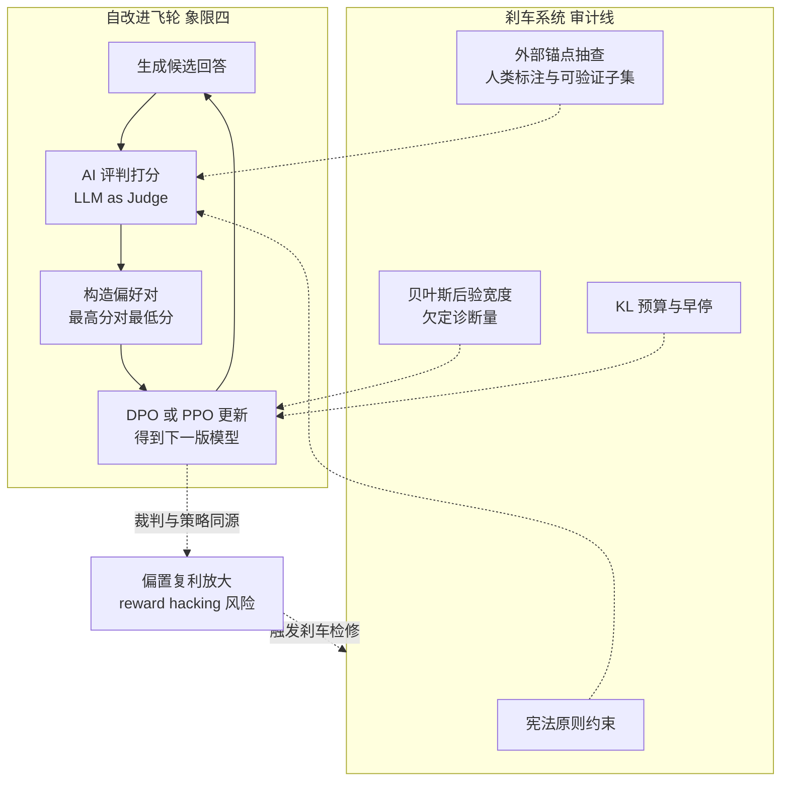
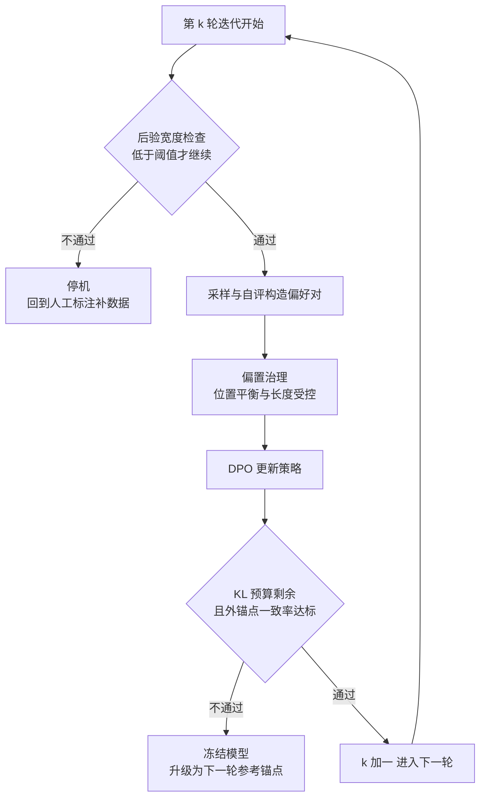

> **TL;DR 三连**
>
> - **核心结论**：象限Ⅳ把"奖励从哪来"这个问题也交给了模型——AI 给 AI 打偏好标签（RLAIF），按人类写定的原则打（Constitutional AI），干脆自己给自己打（Self-Rewarding）。三支柱共享同一个循环骨架：生成候选 → AI 评判 → 构造偏好对 → 训练 → 迭代。奖励从固定外部锚点变成了被优化的对象本身，这是四象限里唯一一个"学奖励"与"用奖励"同时发生的象限。
> - **反直觉发现**：自改进回路里最危险的不是某一次评分错误，而是**裁判与选手同源之后的误差自相关**——自我偏好、长度偏置、位置偏置在静态评测里只是常数项噪声，进了迭代循环就变成每轮都朝同一方向踩的梯度。Gao 等人的奖励过优化缩放律在本象限获得新的时间维度：proxy 奖励与 gold 奖励的裂口不再由单次训练的 KL 预算封顶，而是随迭代轮数复利。
> - **定位**：四象限收官篇，回收《[IRL 复活](/2026/08/22/irl-renaissance-in-llm-alignment/)》§7 开放问题③——"何时需要给自改进装刹车"。前置阅读：《[逆强化学习五十年](/2026/08/22/irl-fifty-years-from-demonstrations/)》《[GRPO：组相对优势与大模型时代的 RL](/2026/08/21/mdp-to-grpo-05-grpo-group-relative/)》。本文的答案落在一条贯穿全站的审计线上：贝叶斯后验宽度当诊断量。



## 1. 问题陈述：奖励的供给侧危机

《[IRL 复活](/2026/08/22/irl-renaissance-in-llm-alignment/)》§1 给过那张 RLVR 黑区表：竞赛数学、代码、格式调用已被验证器点亮，开放写作与长程 Agent 任务仍是黑区——示范俯拾皆是，奖励无处可寻。但即便在"有奖励"的亮区，还有一个更隐蔽的瓶颈：**奖励的供给端握在人类手里**。RLHF 需要成千上万条高质量成对偏好标注，贵、慢、且有一个硬上限——标注者自己得看得懂回答。《Self-Rewarding Language Models》把这两条瓶颈说得很直白：人类偏好训出的奖励模型被人类水平卡住上限，而且这个 RM 一旦冻结就无法随策略一起继续变好（[arXiv:2401.10020](https://arxiv.org/abs/2401.10020)）。

把本站四象限地图再摆一次，本篇补的是最后一块：

| | 学策略 | 学奖励 |
|---|---|---|
| **信号 = 示范** | 象限Ⅰ：SFT / 行为克隆 / [OPD 蒸馏](/2026/08/11/on-policy-distillation-deepdive/) | 象限Ⅱ：IRL / RM / DPO（《[IRL 五十年](/2026/08/22/irl-fifty-years-from-demonstrations/)》《[IRL 复活](/2026/08/22/irl-renaissance-in-llm-alignment/)》） |
| **信号 = 奖励** | 象限Ⅲ：正向 RL（《[MDP 到 GRPO 系列](/2026/08/21/mdp-to-grpo-05-grpo-group-relative/)》） | **象限Ⅳ：RLAIF / 自改进循环（本篇）** |

象限Ⅳ的独特之处在于箭头方向：它不学策略也不从示范恢复奖励，而是**让奖励信号本身经历版本迭代**。"哪些回答更好"这个判断，从人类手里逐步移交给了模型。三篇支柱论文代表了这次移交的三个阶段：

| 支柱 | 反馈来源 | 人类的角色 | 奖励形态 | "自"的程度 |
|---|---|---|---|---|
| RLAIF（Google） | 现成 LLM 打偏好标签 | 只出任务与预算 | 显式 RM（或 d-RLAIF 免 RM） | 标注外包 |
| Constitutional AI（Anthropic） | 按宪法原则自我批评+互评 | 写一份原则清单 | SL 修订数据 + RL 偏好模型 | 监督压缩成文本 |
| Self-Rewarding（Meta） | 模型以 LLM-as-a-Judge 自评 | 只提供种子数据 | 判断力内化于模型权重 | 裁判选手一体 |

## 2. 三支柱拆解

以下机制描述均基于各论文 arXiv 摘要页原文核实，实验细节以原文为准。

### 2.1 RLAIF：把标注员换成现成 LLM（arXiv:[2309.00267](https://arxiv.org/abs/2309.00267)）

RLAIF 的出发点是 RLHF 最贵的那个环节：收集高质量人类偏好标签。论文的做法是用一个**现成的（off-the-shelf）LLM**生成偏好标签，再用这些标签训练奖励模型。三个任务上的结论：摘要、有用对话、无害对话生成上，RLAIF 与 RLHF 表现相当。更有意思的是它朝"self-improvement"迈的一步——**即使 AI 标注器与策略模型同尺寸、甚至就是初始策略的同一个 checkpoint，RLAIF 仍能跑赢 SFT baseline**：裁判不需要比选手强很多，只需要在"哪条更好"这个更简单的判断任务上有信息量。

工程上更激进的是 **direct-RLAIF（d-RLAIF）**：绕过 RM 训练，在 RL 过程中直接向现成 LLM 要奖励，实测优于先训 RM 再做 RL 的 canonical RLAIF。这与《IRL 复活》§3.2 那张显式/隐式奖励对照表呼应：d-RLAIF 为了省掉 RM 这个中间商，牺牲了奖励的可检查性——而可检查性恰恰是后面刹车设计的物质基础。

### 2.2 Constitutional AI：监督压缩成一份宪法（arXiv:[2212.08073](https://arxiv.org/abs/2212.08073)）

CAI 回答的问题是：能否训练无害助手而完全不需要人类标注"哪条回复有害"？论文的唯一人类监督是一份规则/原则清单——宪法。流程分两段：

- **SL 阶段**：从初始模型采样回答 → 模型依据宪法原则生成**自我批评** → 据此**修订**回答 → 在修订后的回答上微调原模型；
- **RL 阶段**：从微调后模型采样成对回答 → 用模型评估哪条更好 → 用这批 AI 偏好训练偏好模型 → 以其为奖励信号做 RL，即 RLAIF。

两个细节值得圈出来。其一，产物是"无害但不回避"（harmless but non-evasive）：面对有害请求不装死，而是解释自己为什么不配合——这缓解了有用与无害的经典冲突。其二，SL 与 RL 两段都能利用思维链式推理来提升人类评审眼中的表现与决策透明度；论文的整体承诺是"更少的人类标签、更精确的行为控制"。宪法在这里的角色是给裁判装了一个**不可学习的先验**——原则清单不由训练改写，这为 §4 的刹车设计埋下第一颗钉子。

### 2.3 Self-Rewarding：裁判权完全下放（arXiv:[2401.10020](https://arxiv.org/abs/2401.10020)）

第三根柱子走得更远：语言模型自己通过 **LLM-as-a-Judge** 提示在训练中给自己发奖励。动机承接 §1 的两条瓶颈——人类偏好有水平天花板，冻结的 RM 不能跟着变强。做法是把"当裁判"也当成一种指令遵循能力：模型为每个 prompt 采样多条候选回答并打分，最高分与最低分构成偏好对，喂给 DPO 得到下一代模型，整个流程迭代三轮。

关键实证发现是**双轴共进**：迭代 DPO 训练不仅提升指令遵循能力，也提升了模型给自己提供高质量奖励的能力。Llama-2-70B 三轮迭代后在 AlpacaEval 2.0 榜单上超过包括 Claude 2、Gemini Pro 与 GPT-4 0613 在内的许多现有系统。论文自己也留了余地："这种改进在真实场景中大概率会饱和"——这句话是理解 §4 的钥匙：饱和之前的那段曲线，正是偏置复利生长的窗口。

### 2.4 三支柱的光谱读法

三篇论文表面是三个方法，实际是同一场权力移交的三个刻度：

| 刻度 | 谁出 prompt | 谁出候选 | 谁当裁判 | 裁判是否更新 | 外部锚点 |
|---|---|---|---|---|---|
| RLHF（参照系） | 人/系统 | 策略模型 | 人类 | — | 全程人类 |
| RLAIF | 系统 | 策略模型 | 现成 LLM | 冻结 | LLM 本身 |
| CAI | 系统 | 策略模型 | 宪法约束下的模型 | 冻结（RM 由 AI 偏好训出） | 宪法原则清单 |
| Self-Rewarding | 模型自造 | 策略模型 | 模型自身 | **每轮随策略更新** | 仅种子数据 |

裁判越靠近策略，反馈越便宜、迭代越快——同时反馈与策略的**独立性**越差。这条独立性光谱就是象限Ⅳ全部风险的来源，§3 先把它拆成三种具体偏置。

## 3. AI 反馈的三种系统性偏置与治理

LLM-as-a-Judge 够不够格当裁判？MT-Bench 论文给过一个乐观基准：GPT-4 级裁判与人类偏好的一致率超过 80%，达到人与人之间一致率的水平（[arXiv:2306.05685](https://arxiv.org/abs/2306.05685)）。但同一篇论文同时点名了三种系统性偏置：**位置、冗长、自我增强**。理解象限Ⅳ风险的关键区分是：一致率是平均统计量，偏置是系统性分量——前者够格当评测指标，后者在训练回路里会变成梯度偏差。

### 3.1 三种偏置的来源机制

**位置偏置（position bias）**：评委倾向偏爱特定位置上的回答。《Large Language Models are not Fair Evaluators》证明仅交换候选回答的出现顺序就能操纵评审结果——用 ChatGPT 当评委时，Vicuna-13B 靠换序在 80 个测试问题里的 66 个上击败了 ChatGPT 本尊；论文提出的校准框架包含三招：多证据校准（先产多份评估证据再打分）、平衡位置校准（跨顺序聚合结果）、人机协同校准（用位置多样性熵衡量样例难度，难例转人工）（[arXiv:2305.17926](https://arxiv.org/abs/2305.17926)）。

**长度偏置（verbosity / length bias）**：更长的回答系统性获得更高偏好分。Length-Controlled AlpacaEval 把它当成一个可回归掉的混杂变量：先以长度差等特征拟合 GLM 预测有偏自动标注器的偏好，再把"长度差为零"代入反事实预测，得到长度受控的偏好——与 Chatbot Arena 的 Spearman 相关从 0.94 提到 0.98，且对模型刻意啰嗦刷分的操纵更鲁棒（[arXiv:2404.04475](https://arxiv.org/abs/2404.04475)）。（AlpacaEval 与 Chatbot Arena 均为评测产品而非论文，此处引其对应方法论文。）

**自我偏好（self-preference / self-enhancement）**：评委给自己生成的输出打高分。《LLM Evaluators Recognize and Favor Their Own Generations》追问了一个更深的问题：这是巧合还是模型认出了自己？结论：GPT-4 与 Llama-2 开箱即有非平凡的自我识别准确率，且微调实验显示**自我识别能力与自我偏好强度呈线性相关**，控制实验排除了常见混淆因素（[arXiv:2404.13076](https://arxiv.org/abs/2404.13076)）。这一条对 Self-Rewarding 是结构性打击：裁判与选手不仅同源，而且同源程度随迭代加深。

### 3.2 从评测噪声到训练梯度：放大机制

静态评测里，三种偏置的危害封顶于"榜不准"。进了自改进飞轮，危害换了性质：

1. **偏置进入数据分布**。Self-Rewarding 每轮的偏好对由当前模型的判断构成——位置偏置让"排在后面的候选"系统性地沦为 rejected，长度偏置让啰嗦候选系统性地成为 chosen，自我偏好让模型自己的风格系统性胜出。DPO 不分辨这些相关性与"真实质量"的区别，照单全收；
2. **下一轮裁判继承上一轮的偏置**。CAI 的 RM 是冻结的，偏置是常数项；Self-Rewarding 的裁判每轮更新，上一轮学到的偏置成为下一轮评分的先验——误差不再独立同分布，而是自相关累积；
3. **没有外部信号纠偏**。RLHF 里人类标注是独立于模型的锚点；象限Ⅳ的深水区里，唯一的独立性来自种子数据与宪法文本，而它们的影响每轮被稀释。

一张治理对照表收拢本节：

| 偏置 | 机制根源 | 静态评测危害 | 回路中的放大形态 | 治理手段（已验证出处） |
|---|---|---|---|---|
| 位置偏置 | 注意力/上下文位置敏感性 | 排行可被换序操纵 | 偏好对的 rejected 侧被位置锁定 | 平衡位置校准、多证据校准（FairEval） |
| 长度偏置 | 冗长与信息量的混淆 | 啰嗦模型刷榜 | chosen 侧系统性变长，策略学会灌水 | GLM 反事实去混杂（Length-Controlled AlpacaEval） |
| 自我偏好 | 自我识别与风格亲和 | 自评分数虚高 | 裁判-选手同源度随迭代加深 | 外部裁判混入、宪法约束、人审抽查 |

## 4. Reward hacking 的复利与刹车设计

### 4.1 静态基线：过优化的缩放律

Reward hacking 在单次 RLHF 里的定量刻画来自 OpenAI 的缩放律实验：用一个固定"gold 标准奖励模型"扮演人类，用它出的标签训一个 proxy RM，再观察优化 proxy 时 gold 分数怎么走。结论符合 Goodhart 定律——gold 分数先升后降；以 $$d = \sqrt{D_{KL}(\pi \,\|\, \pi_{init})}$$ 为优化距离坐标，两种优化方式的 gold 分数服从不同的函数形式，且系数随 proxy RM 参数量、数据集规模与 KL 罚系数平滑缩放（[arXiv:2210.10760](https://arxiv.org/abs/2210.10760)）：

$$
R_{BoN}(d) = d\left(\alpha_{bon} - \beta_{bon}\,d\right), \qquad
R_{RL}(d) = d\left(\alpha_{rl} - \beta_{rl}\,\log d\right)
$$

两个形式都在大 $$d$$ 处掉头向下——proxy 上那部分"虚胖收益"在 gold 上现出原形。静态世界里这至少是个有界灾难：一次训练、一份冻结 RM、一个 KL 预算，峰值过后停下就是。

### 4.2 回路里发生了什么变化

把这条曲线放进 Self-Rewarding 式飞轮，两个下标变了含义：

- **$$\beta$$ 项的时间化**。静态情形 $$\beta_{rl}$$ 度量的是"这份 RM 有多容易钻空子"；回路里每一轮都用新裁判重估偏好，而新裁判继承了旧偏置并叠上新偏置——等效于 $$\beta$$ 随迭代轮数增长。同样的 KL 步长，第十轮踩出的 hacking 深度大于第一轮；
- **峰值的移动**。缩放律里加大 RM 规模或数据量可以把峰值推远；回路里恰恰相反——裁判与策略的同源度随轮数上升，独立性下降，等效于 RM 数据的信息量在萎缩。峰值不是被推远了，而是被拉回来了。

这不是对原文结论的外推声明，而是把原文函数形式套进迭代设定后的自然推论——它给出了象限Ⅳ刹车设计的全部着力点：**压住 $$d$$ 的增长速度（KL 预算）、压住 $$\beta$$ 的增长速度（偏置治理与外部锚点）、以及最关键的——知道自己在曲线的哪一段（诊断量）**。

### 4.3 刹车系统四件套



**① KL 锚点（压 $$d$$）**：《GRPO》篇的 $$\pi_{ref}$$ 冻结副本与 k3 罚项 $$e^u - u - 1$$ 是现成部件——每生成一个 token 都付偏离税。R1-Zero 的教训反向印证了它的必要性：纯规则奖励下策略钻进中英混杂的缝隙，最终版 R1 得把语言一致性显式加回奖励（《[GRPO](/2026/08/21/mdp-to-grpo-05-grpo-group-relative/)》§5）。在自改进回路里，KL 预算应按**整条迭代链**而非单轮来分配。

**② 宪法式不可学习先验（压 $$\beta$$）**：CAI 最深的洞察不是省标签，而是把监督中**不该被优化的部分**固化成文本——原则清单不参与梯度更新，因此不会被自我偏好腐蚀。代价是宪法的覆盖面有限且由人维护；收益是裁判至少有一块不会漂移的地基。

**③ 外部锚点抽查（测裂口）**：overoptimization 曲线的纵轴是 gold 分数——现实里它就是"一小撮人类标注或可验证子集上的得分"。工程含义：每轮固定抽一批锚点样本让人或可验证器复核，监控 AI 判断与锚点的一致率，一致率下滑就是 gold-proxy 裂口张开的直接读数。RLAIF 论文的对比实验之所以能宣称"与 RLHF 相当"，靠的正是保留了一份人类评估当尺子。

**④ 贝叶斯后验宽度当诊断量（定位峰值）**：这是全站审计线的收官落子。《IRL 五十年》证明了奖励解集天然巨大，《IRL 复活》§4.4 介绍了贝叶斯审计框架——把奖励推断从点估计改成后验分布，**后验的宽度本身就是欠定警示**：宽说明当前示范不足以确定目标，窄才能对隐式目标做可证伪核查。把它装进自改进回路：每轮迭代前，用当前偏好数据做奖励后验推断，宽度超阈值就说明这一轮的偏好对携带的信息量不足——裁判要么已被腐蚀要么已饱和，此时继续训练等于在峰值右侧加码。后验宽度由此从审计指标升格为**停机信号**。

### 4.4 带刹车的自改进循环骨架

```python
# 自改进飞轮 + 四件刹车（骨架，非可运行实现）
judge = sft_model                       # M1: 种子模型兼任裁判
ref_logp = frozen_copy(judge)           # 刹车①: KL 锚点（k3 罚项基准）
anchor = human_labeled_pairs[:200]      # 刹车③: 外部锚点（人类/可验证子集）

for k in range(max_iters):
    width = posterior_width(judge, anchor)          # 刹车④: 后验宽度诊断
    if width > W_MAX:                               #    欠定警示 -> 停机补数据
        break
    pairs = build_pairs(model, judge)               # 生成候选 + LLM as Judge 打分
    pairs = debias(pairs, mode="position+length")   # 刹车②: 宪法/校准类治理
    model = dpo_step(model, pairs,
                     ref_logp=ref_logp, kl_budget=KL_TOTAL / max_iters)
    agree = anchor_agreement(judge, anchor)         # 刹车③: 锚点一致率
    if agree < A_MIN:                               #    gold-proxy 裂口张开 -> 冻结
        freeze(model); break
    judge = model                                   # 裁判权移交: 同源度 +1

##### 变量映射表（数学 ↔ 代码）

| 数学符号 | 代码变量 | Shape / 类型 | 含义 |
|---|---|---|---|
| $r_{\hat\phi}(x,y)$ | `judge(x, y)` | 标量 | 当前裁判给出的偏好分 |
| $d=\sqrt{D_{KL}(\pi\Vert\pi_{init})}$ | `kl_budget` 监控量 | 标量 | 优化距离（缩放律横轴） |
| $u=\log\frac{\pi_{ref}}{\pi_\theta}$ | `ref_logp - logp` | `(B, T)` | k3 罚项的自变量 |
| $\mathcal{W}(r\mid\mathcal{D})$ | `posterior_width(...)` | 标量 | 奖励后验宽度（欠定诊断） |
| $(y_w, y_l)$ | `pairs` | list of tuple | 去偏后的偏好对 |
| 一致率 $\mathrm{acc}_{anchor}$ | `anchor_agreement(...)` | 标量 | 裁判与外锚点的吻合度 |
```

四件刹车的分工可以用一句话说清：①管住每一步别迈太大，②管住每一步的方向别歪，③随时测量实际裂口，④在看不见裂口的时候告诉你"现在数据不足以看清"。它们分别对着缩放律的一个自由参数——这不是拼凑，是对症。

## 5. 四象限闭环：地图、回路与本站索引

### 5.1 回路总装

把四个象限拼起来，得到一条完整的后训练生产线：

| 象限 | 问题形式 | 交付物 | 本站文章 | 在回路中的角色 |
|---|---|---|---|---|
| Ⅰ：示范→策略 | 给专家行为，学执行 | 会干活的初始模型 | [On-Policy Distillation 深度剖析](/2026/08/11/on-policy-distillation-deepdive/) · [在线蒸馏方法](/2026/08/11/online-distillation-methods/) | 冷启动与能力搬运 |
| Ⅱ：示范→奖励 | 给专家行为，反推标准 | 显式/隐式奖励 | [IRL 五十年](/2026/08/22/irl-fifty-years-from-demonstrations/) · [IRL 复活](/2026/08/22/irl-renaissance-in-llm-alignment/) | 奖励的生产与审计 |
| Ⅲ：奖励→策略 | 给标准，学最优行为 | 对齐后的策略 | [mdp-to-grpo 系列（一至五）](/2026/08/21/mdp-to-grpo-05-grpo-group-relative/) · [ToolRL](/2026/08/10/toolrl-reward-is-all-deepdive/) · [Search RL](/2026/08/11/search-rl-deepdive/) | 奖励的消费 |
| Ⅳ：奖励→奖励 | 给裁判，升级标准本身 | 更强的偏好判断力 | **本篇** | 奖励的自我迭代 |

象限Ⅳ之所以能闭环其余三者：Ⅱ 生产的奖励在 Ⅲ 被消耗并暴露缝隙（reward hacking 是消费端的质量投诉），Ⅰ 提供每一代的冷启动底座，而 Ⅳ 把投诉变成下一代奖励的改进依据。《IRL 复活》§5 那句"两条线互为供需"在这里扩展成全图：**四象限互为供需，自改进循环是让这条供应链开始自我更新的机制**。

### 5.2 审计线的收官

全站埋了三篇的审计线索在此合流：《IRL 五十年》证明了奖励解集结构性巨大（不可辨识性是定理不是 bug）；《IRL 复活》§4.4 引入贝叶斯审计框架，把后验宽度变成诊断量；本篇把它推进一步——在自改进回路里，后验宽度不再是事后审计工具，而是**每轮迭代的前置闸门**。对《IRL 复活》§7 开放问题③"何时需要给自改进装刹车"，本篇的回答是：**从裁判与策略共享权重的那一轮起**。RLAIF 阶段裁判是冻结的外部模型，风险有界；CAI 有宪法当地基；Self-Rewarding 式裁判权下放则是临界点——四件刹车应在此时全部上线。

### 5.3 站内阅读路径

按依赖顺序推荐两条路线：算法向——《[GRPO](/2026/08/21/mdp-to-grpo-05-grpo-group-relative/)》→ 本篇 §2/§4 → 《[ToolRL](/2026/08/10/toolrl-reward-is-all-deepdive/)》（验证器侧的奖励设计）；审计向——《[IRL 五十年](/2026/08/22/irl-fifty-years-from-demonstrations/)》→ 《[IRL 复活](/2026/08/22/irl-renaissance-in-llm-alignment/)》§4 → 本篇 §3/§4.3。中文社区视角可对照知乎上的 CAI 宪法长文解读《[详读 2 万 3 千字的新「AI 宪法」之后，我理解了 Anthropic 的痛苦](https://zhuanlan.zhihu.com/p/2010410084392519293)》。

## 6. 批判与展望

**摘要级拆解的天花板**：本文对三支柱的机制描述以 arXiv 摘要页与公开正文为据，各方法的消融、失效边界与超参敏感度需读原文复核——这是本站的诚实惯例，不是谦辞。

**双轴共进可能是重参数化幻觉**：Self-Rewarding 报告指令遵循与奖励能力同步提升，但"当裁判"与"当选手"用的是同一份权重——两个指标可能只是同一能力在两套评测下的读数。论文自己承认改进大概率饱和；饱和点在哪、饱和后曲线是平台还是回落，摘要级证据无法回答。

**监督被压缩，没有被消除**：CAI 的宪法由人撰写并维护，有用性数据仍来自人类偏好标注，最终"无害但不回避"的效果评估也靠人审。"更少的人类标签"是准确的，"无需人类监督"不是。宪法本身成为一个新的攻击面：原则的选择与措辞成为未被形式化的价值注入通道。

**偏置治理全是补丁**：位置校准、长度受控、证据聚合都是事后修正，没有一条是定理级保证。自我偏好的研究只确立了"自我识别与自我偏好线性相关"，因果机制仍未打开——在裁判每轮更新的设定下，任何静态校准都可能被下一轮的策略适应绕开。

**刹车④的工程化缺口**：后验宽度作为停机信号在概念上干净，但"多宽算危险"至今没有公认阈值（《IRL 复活》§7 已指出）；本文骨架里的 W_MAX 只能靠锚点数据校准。此外贝叶斯推断本身的开销在大模型上不便宜，宽度估计的代理指标（如 RM 集成方差）与其真值的差距缺乏系统研究。

**开放问题**：① 元评审（judge 评 judge）能否打破同源腐化，还是只会把二阶偏置引入回路？② 可验证奖励的地盘随 RLVR 扩张，AI 反馈的适用边界最终落在哪类判断上？③ 当后验宽度持续收窄且锚点一致率不降时，我们有资格说"奖励已超越人类反馈的上限"吗——还是那只是过拟合到裁判自身分布的另一种表述？

## 7. Takeaway

- **解决了什么**：把象限Ⅳ拆成三支柱（RLAIF 外包标注 → CAI 压缩监督 → Self-Rewarding 下放裁判权），给出偏置三分类及其回路放大机制，并把全站审计线落成四件刹车的工程清单。
- **致命局限**：摘要级拆解；"双轴共进"的独立性存疑；后验宽度阈值没有公认标准，刹车④目前是方向正确但刻度未标的仪表盘。
- **如何使用这张地图**：四象限至此全部落位——Ⅰ 冷启动、Ⅱ 生产奖励、Ⅲ 消费奖励、Ⅳ 迭代奖励。读任何新对齐论文，先问它站在哪个象限、动的是哪条边、有没有给裁判留外部锚点。

## 参考与延伸阅读

* Lee et al., "RLAIF vs. RLHF: Scaling Reinforcement Learning from Human Feedback with AI Feedback" ([arXiv:2309.00267](https://arxiv.org/abs/2309.00267)) —— §2.1，现成 LLM 打标签 + d-RLAIF
* Bai et al., "Constitutional AI: Harmlessness from AI Feedback" ([arXiv:2212.08073](https://arxiv.org/abs/2212.08073)) —— §2.2，SL 自我批评修订 + RLAIF 两阶段
* Yuan et al., "Self-Rewarding Language Models" ([arXiv:2401.10020](https://arxiv.org/abs/2401.10020)) —— §2.3，LLM-as-a-Judge 自奖励 + 迭代 DPO
* Zheng et al., "Judging LLM-as-a-Judge with MT-Bench and Chatbot Arena" ([arXiv:2306.05685](https://arxiv.org/abs/2306.05685)) —— §3，位置/冗长/自我增强三偏置命名出处（MT-Bench 与 Chatbot Arena 为其配套基准与平台，非论文本体）
* Gao, Schulman & Hilton, "Scaling Laws for Reward Model Overoptimization" ([arXiv:2210.10760](https://arxiv.org/abs/2210.10760)) —— §4.1，gold-proxy 缩放律函数形式出处
* Wang et al., "Large Language Models are not Fair Evaluators" ([arXiv:2305.17926](https://arxiv.org/abs/2305.17926)) —— §3.1，位置偏置与三重校准
* Dubois et al., "Length-Controlled AlpacaEval: A Simple Way to Debias Automatic Evaluators" ([arXiv:2404.04475](https://arxiv.org/abs/2404.04475)) —— §3.1，GLM 反事实去长度混杂（AlpacaEval 为评测产品，此处指其方法论文）
* Panickssery et al., "LLM Evaluators Recognize and Favor Their Own Generations" ([arXiv:2404.13076](https://arxiv.org/abs/2404.13076)) —— §3.1，自我识别与自我偏好的线性相关
* 中文社区视角：《[详读 2 万 3 千字的新「AI 宪法」之后，我理解了 Anthropic 的痛苦](https://zhuanlan.zhihu.com/p/2010410084392519293)》（知乎）
* 本站四象限系列：《[逆强化学习五十年](/2026/08/22/irl-fifty-years-from-demonstrations/)》 · 《[IRL 复活：LLM 对齐里的逆向强化学习](/2026/08/22/irl-renaissance-in-llm-alignment/)》 · 《[GRPO：组相对优势与大模型时代的 RL](/2026/08/21/mdp-to-grpo-05-grpo-group-relative/)》 · 《[On-Policy Distillation 深度剖析](/2026/08/11/on-policy-distillation-deepdive/)》

> 🧪 **动手练习**：① 复现过优化缩放律的最小版本——自造一个 8 维特征的线性 gold 奖励，只用 200 条它产出的偏好标注训一个 4 特征 proxy RM，对 best-of-n 的 n 从 1 扫到 1024，画出 proxy 分数与 gold 分数两条曲线，观察 gold 峰值位置随标注量减半如何移动；② 给一个 toy Self-Rewarding 回路装刹车④——用 bootstrap 重采样把每轮偏好对训成 k=8 个小 RM，以 k 个模型在锚点集上方差的中位数作为后验宽度的代理，跑三轮迭代画出宽度走势，再手动把第 2 轮偏好对的 20% 换成自我偏好污染样本，看刹车能否在污染扩散前触发。


