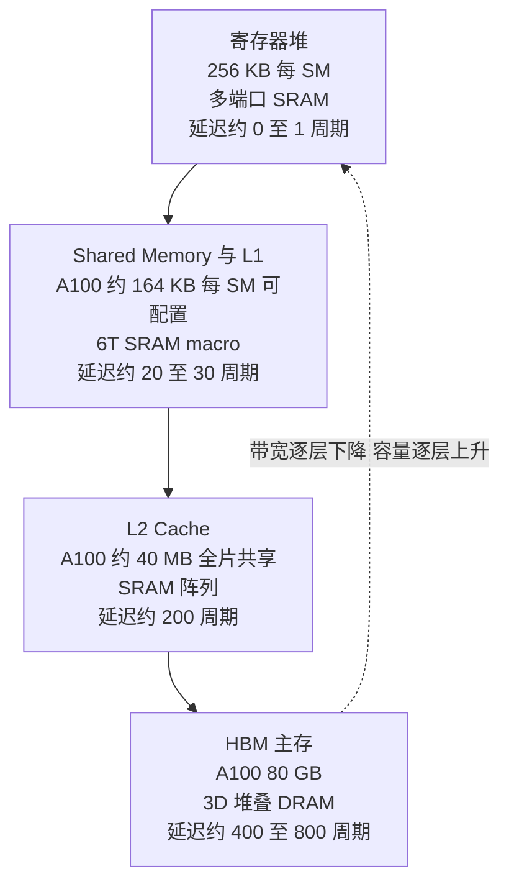
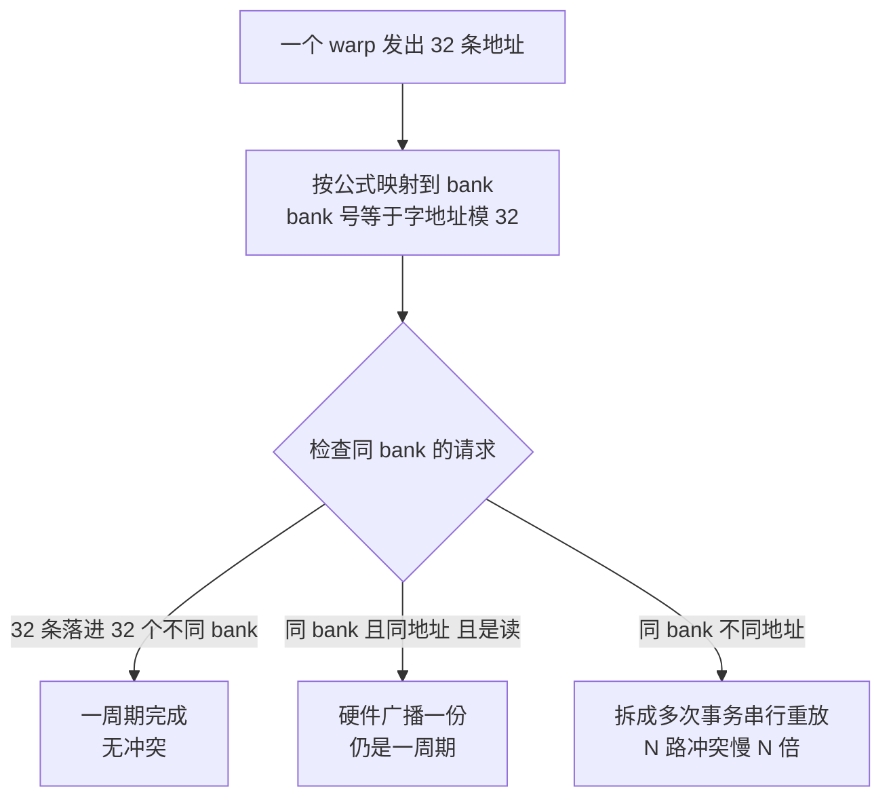
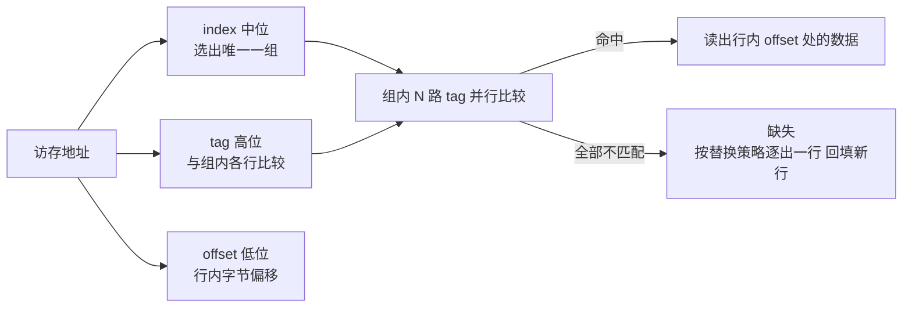
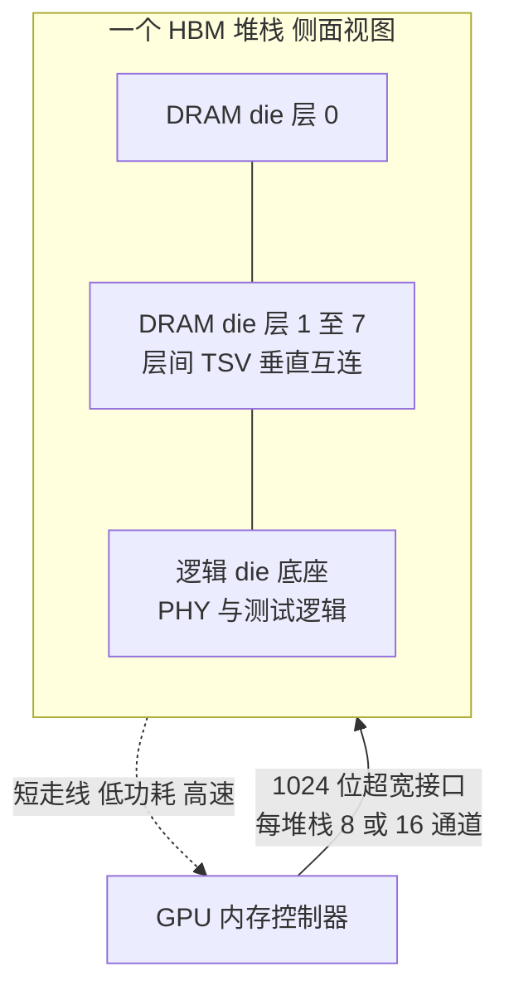
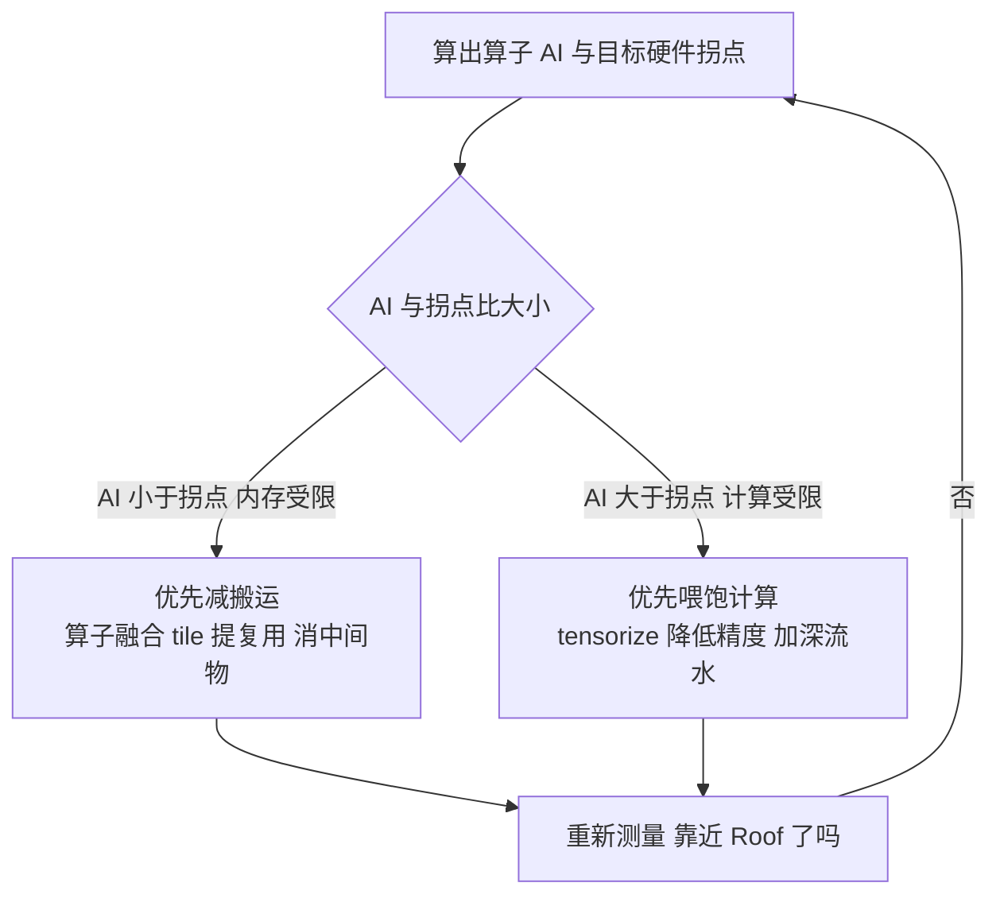

> **TL;DR**
>
> * **这是「给 AI 编译器工程师的芯片课」第三篇**。前两篇建立了四层契约全景、拆开了 SRAM/DRAM 电路，本篇沿着"数据住得离计算多远"这条主线走一遍存储层次：**寄存器堆(多端口 SRAM) → SMEM(bank conflict 的电路根源) → L1/L2 cache(tag/index/offset 数学) → HBM(3D 堆叠 DRAM)**。
> * **三个对编译器最值钱的结论**：1 bank conflict 不是玄学，是"每 bank 每周期一次访问"的电路约束，$冲突度 = \gcd(stride, 32)$ 一行公式算尽;2 HBM 十年把带宽翻了几倍但延迟几乎没动，Little 定律告诉你 kernel 必须同时保持约 1 MB 数据"在飞";3 Roofline 拐点 = 峰值算力/带宽，A100 FP16 TC 是 153 FLOPs/byte--这个数字决定你的算子该做融合还是做 tensorize。
> * **本篇动手实验**：纯 Python 写一个 bank conflict 模拟器和 Roofline 计算器(无需 GPU)，再用 ncu 把真实硬件的冲突计数器读出来对照。

## 1. 存储层次：一座用妥协搭起来的金字塔

第 01 篇给过一张内存层次的契约表，本篇把它拆开看每一层是怎么造出来的：



| 层级 | A100 容量 | 延迟(量级) | 物理实现 | 谁来管理 |
|:---|:---|:---|:---|:---|
| Register File | 256 KB/SM | ~0-1 cycle | 多端口 SRAM | 编译器(寄存器分配) |
| Shared Memory / L1 | 164 KB/SM(可配置) | ~20-30 cycle | 6T SRAM macro | **软件**(显式搬运) |
| L2 Cache | 40 MB | ~200 cycle | SRAM 阵列 | 硬件(自动缓存) |
| HBM2e | 80 GB | ~400-800 cycle | 3D 堆叠 DRAM | 硬件+控制器 |

> 数字为 A100 公开口径，不同 SKU 有差异，以官方 datasheet 为准。

为什么必须分这么多层?第 02 篇给过电路根源：SRAM 一个 bit 要 6 个晶体管，快但贵;DRAM 一个 bit 只要 1 管 1 电容，便宜但要刷新、读出破坏性。**没有一种存储技术能同时做到快、大、便宜**，唯一的工程解就是金字塔。而编译器的全部访存优化可以压缩成一句话：**在每一层的容量预算内，最大化数据的复用次数**。tile size、double buffer、融合、布局变换，全是这句话的具体化。下面逐层看"容量预算"和"访问代价"由什么物理结构决定。

## 2. 寄存器堆：GPU 上最贵的一块 SRAM

### 2.1 为什么必须是多端口

一条 FMA 指令 $a \leftarrow a \times b + c$ 对每个数据 lane 要求**同一周期读两个源操作数、写回一个结果**。A100 每个 SM 有 4 个调度分区、每周期各发射一条 warp 指令，折算下来每个 SM 每周期的操作数流量在 KB 量级--而普通单端口 SRAM 一个周期只让碰一次。最直接的想法是把端口数堆上去：**多端口寄存器堆(multi-port register file)**。

### 2.2 面积模型：端口数的平方诅咒

多端口不是免费的。回忆第 02 篇：每次加一个读写端口，都要穿过整个单元阵列再拉一套字线+位线，且 n 个端口的金属线要在每个单元处互相避让，走线轨道随端口数增长。工程界常用的粗估模型是单元面积近似随端口数的平方膨胀：

$$A_{RF} \approx N_{cell} \times \big(a_0 + k \cdot (R + W)^2\big)$$

**变量映射表**：

| 符号 | 含义 | 示例取值(A100 量级) | 维度/单位 |
|:---:|:---|:---|:---|
| $A_{RF}$ | 寄存器堆总面积 | -- | μm² |
| $N_{cell}$ | 寄存器单元总数 | 65536 个 32-bit /SM | 个 |
| $k$ | 每端口面积增量系数 | 工艺相关，未验证具体值 | μm²/端口² |
| $R+W$ | 读端口数 + 写端口数 | 每分区 2 读 + 1 写起步 | 个 |

平方项的含义：$R+W$ 从 3 加到 6(翻倍)，面积贡献涨到约 4 倍。**这就是为什么 GPU 每线程寄存器上限卡在 255 个**--RF 面积在 die 预算里多占一寸，FMA 阵列就得少一寸。

### 2.3 GPU 的解法：bank 化 + operand collector

真把几十个端口堆上去太贵，GPU 用两招组合：**把 RF 切成多个单端口 bank 靠并行凑带宽**;再用 **operand collector(操作数收集器)**--一个交叉开关网络，把各 bank 读出的字路由到正确的 lane，撞同一个 bank 的请求硬件自动推迟一周期重放(replay)。这套机制对软件完全不可见，但它解释了指令延迟表里"寄存器读取"那几个周期，以及某些指令组合被静默插 replay 的现象([arXiv:1804.06826](https://arxiv.org/abs/1804.06826) 用微基准系统测过)。

现在算一笔 occupancy 账。A100 每 SM 的 RF 是 256 KB = 65536 个 32 位寄存器，驻留上限 2048 线程：

| 每线程寄存器数 | 能驻留线程数(= 65536 除以它) | 占满 2048 线程槽位的比例 |
|:---:|:---:|:---:|
| 32 | 2048 | 100% |
| 64 | 1024 | 50% |
| 128 | 512 | 25% |
| 255(架构上限) | ~257 | ~12.5% |

> 💡 **编译器关联**：kernel 里多活一个局部变量、unroll 深一点、`num_stages` 多一级，都会推高每线程寄存器占用，**用 occupancy 换 ILP**。ptxas 的 `-maxrregcount`、`__launch_bounds__`、Triton 的 warps/stages 配置，本质都是在 RF 这块 256 KB 地皮上做租户管理。寄存器溢出到 local memory(HBM)一次，代价几百个周期--比任何调度损失都狠。

## 3. Shared Memory：bank conflict 的电路根源

### 3.1 Scratchpad 哲学

SMEM 和 cache 的区别一句话：**cache 由硬件决定数据放哪，SMEM 由软件显式决定**。没有 tag、没有替换算法、没有预取器，换来的是延迟确定(~20-30 周期、无缺失惊喜)。代价是搬运和布局全要自己排--于是有了下面这个大坑。

### 3.2 为什么有 bank：单端口 macro 的并行化

SMEM 本体是一批 6T SRAM macro，单个 macro 单周期只能服务一次访问，而 SIMT 要求**每周期喂饱一个 warp 的 32 个 lane**。解法和寄存器堆一样：切 bank。NVIDIA 切成 **32 个 bank、每 bank 宽 4 字节**，32 条请求只要落进 32 个不同 bank 就能一周期全部完成。地址到 bank 的映射(CUDA 官方手册口径)：

$$bank\_id = \big\lfloor byte\_addr / 4 \big\rfloor \bmod 32$$

**变量映射表**：

| 符号 | 含义 | 示例取值 | 维度/单位 |
|:---:|:---|:---|:---|
| $byte\_addr$ | 线程访问的字节地址 | 连续 float 数组即 0， 4， 8 ... | 字节 |
| $\lfloor \cdot /4 \rfloor$ | 换算成 4 字节字下标 | 第 i 个 float 就是 i | 无量纲 |
| $bank\_id$ | 该请求落入的 bank 号 | 0 到 31 | 无量纲 |

一个 warp 的请求若撞进同一 bank 会怎样?电路层面只有一个答案：**排队**。那个 bank 的字线/位线一周期只能激活一次，硬件只能把冲突事务拆成一拍一拍的重放，N 路冲突慢 N 倍。



注意广播例外：**所有线程读同一个地址不冲突**(灵敏放大器读一次广播结果);写操作没有广播，照样冲突。

### 3.3 冲突度公式与 padding 解法

设 warp 中第 $t$ 个线程($t=0..31$)访问的字下标为 $t \times s$($s$ 为 stride)，其 bank 号为 $ts \bmod 32$。所有线程覆盖的不同 bank 数为 $32/\gcd(s,32)$，**最大冲突度为**：

$$C(s) = \gcd(s, 32)$$

推导直觉：$ts \bmod 32$ 是以 $s$ 为步长在模 32 环上的等差圈，圈长 $32/\gcd(s,32)$，剩余线程均匀重复踩已走过的 bank，每个 bank 被 $\gcd(s,32)$ 个线程命中。代入验证：

| stride(float 个数) | gcd(s， 32) | 冲突情况 |
|:---:|:---:|:---|
| 1 | 1 | 无冲突(连续访问，理想情况) |
| 2 | 2 | 2 路：偶数 bank 各被踩两次，奇数 bank 全空 |
| 3 | 1 | 无冲突(奇数步长反而安全) |
| 16 | 16 | 16 路 |
| 32 | 32 | 32 路：全 warp 挤一个 bank，慢 32 倍 |

经典踩坑现场：**矩阵转置或按列遍历行主序矩阵**。宽 32 列的 float 矩阵按列访问，stride 正好 32 → 32 路冲突。解法叫 **padding(补边)**：声明 `[N][N+1]`，行距挪成非 2 的幂，$\gcd(33,32)=1$，瞬间无冲突。更系统的做法是 **swizzle(XOR 交织)**：读写时对 bank 地址位做异或扰动，不改物理布局就打散冲突(cuBLAS/CUTLASS 内部大量使用，Triton 编译器也会自动插入)。

> 💡 **编译器关联**：bank conflict 是编译器**可以静态消灭**的性能杀手--前提是知道目标硬件的 bank 数和宽度。这就是 Target 描述里"shared memory 分多少 bank"这个参数存在的原因;layout 变换的正确性判据就是上面那条 gcd 公式。第 10 篇会用 ncu 冲突计数器回来验证。

## 4. Cache：硬件管理的自动版

### 4.1 地址翻译三段论与 AMAT

L2(以及 GPU 上可配置成 cache 模式的部分 L1)由硬件管理。一块容量 $C$、相联度 $N$、行大小 $B$ 字节的 cache，组数 $S = C/(N \times B)$;物理地址切成三段：index($\log_2 S$ 位)选出唯一一组，组内 $N$ 个 tag 并行比较，offset($\log_2 B$ 位)在行内选字节。



教学例：1 MB、8 路、64B 行 → 组数 2048 → index 11 位、offset 6 位、tag 15 位(32 位地址)。衡量这层性价比的标准公式是平均访问时间：

$$AMAT = T_{hit} + R_{miss} \times T_{miss}$$

代入 GPU 量级感受一下：L1 命中 ~30 cycle、缺失率 5%、缺失去 L2 花 ~200 cycle，则 AMAT = 30 + 0.05×200 = 40 cycle;两级嵌套时对下一层再套一层(L2 自己的缺失率乘 HBM 的 400-800 周期)。**缺失率是指数敏感项**--命中率从 95% 掉到 90%，AMAT 直接翻倍。这就是 loop blocking/tiling 的全部数学动机：把工作集压进某一层，把那一层的 $R_{miss}$ 打到接近零。

### 4.2 GPU 的 cache 与 CPU 教科书的三点差异

1. **L1 与 SMEM 共享同一块 SRAM**(A100 合计 192 KB，划分可配置，以官方文档为准)--"缓存多大、scratchpad 多大"本身是编译期决策。
2. **L1 不跨 SM 保持一致**：SM 0 的 L1 不知道 SM 1 改了什么，跨 SM 通信必须过 L2 或显式同步。"全局变量在两个 block 间隐式传值"在 GPU 上是正确性 bug，不只是性能 bug。
3. **传输粒度按 sector**：L1↔L2 以 32 字节 sector 为粒度(Ampere 白皮书口径)。warp 连续读 32 个 float = 128 字节 = 4 个 sector，一次搞定;跳着读则每线程独占一个 sector，**有效带宽最多跌到 1/32**。这就是 coalescing 的物理依据，也是编译器坚持向量化加载(`ld.global.v4`)和检查对齐的原因。

> 💡 **编译器关联**：CPU 上 autovectorizer 主要操心对齐和别名;GPU 上还要操心"warp 内 32 条地址流是否连续"。TVM/Triton 的分析 pass 沿循环推导每个 thread 的地址表达式判断 coalescing，不成立时宁可插入 shared memory 中转也要把全局访问排成连续的。

## 5. HBM：把 DRAM 摞起来换带宽

### 5.1 DRAM 内部：row buffer 才是真正的 cache line

第 02 篇讲过 DRAM 单元是 1T1C、读出破坏性、要刷新。往上一层，DRAM 的组织是四级目录：**channel → rank → bank → row/column**，每个 bank 内有一整行(row buffer，量级 KB，具体值未验证)作为当前"打开"的行：row hit 直接放大输出最快;row miss 要先 precharge 再 activate(tRCD 量级十几 ns);refresh 每 64 ms 每行至少一遍(JEDEC 口径)，期间 bank 不服务。DRAM 也偏爱顺序访问--和 cache line 同构的逻辑，只是这次没人替你排地址流。

### 5.2 3D 堆叠：TSV 换来的超宽接口

传统 GDDR 的问题：芯片只有四周出引脚，总线卡死在 32 bit/颗粒。HBM 的思路是**从底下走**：把多层 DRAM die 堆起来，层间 TSV(硅通孔)垂直互连，底下垫一层逻辑 die 做 PHY，整体经硅中介层贴着 GPU 放(2.5D 封装，第 08 篇展开)：



效果立竿见影：接口宽度 ×32，即使每引脚速率不高，总带宽也碾压 GDDR：

| 芯片 | 显存 | 接口总带宽 | 备注 |
|:---|:---|:---|:---|
| A100 (HBM2e) | 80 GB | 2.04 TB/s | 5 堆栈 × 1024 bit |
| H100 (HBM3) | 80 GB | 3.35 TB/s | 5 堆栈 |
| B200 (HBM3e) | 192 GB | ~8 TB/s | 8 堆栈，公开报道口径 |

> 以上为官方发布口径的量级参考，不同 SKU/频率档有差异，以官方 datasheet 为准。

### 5.3 十年之痒：带宽翻倍，延迟原地踏步

一个对编译器至关重要的不对称：**HBM 每代都在涨带宽，但访问延迟基本不动**。原因很物理：延迟下限由电容充放电 + 灵敏放大 + 走线传播决定，HBM 缩短的是引脚走线，DRAM 核心阵列的物理过程一点没变;带宽靠的是并行度(更多通道、更宽接口、更高速率)，不是更快完成单次访问。从 DDR 到 HBM3e，带宽涨了一个数量级以上，典型延迟仍停在数百 ns(400-800 cycle @ 1.4 GHz，量级示意)。[AI and Memory Wall](https://arxiv.org/abs/2406.01828) 把这件事量化了：1995 年预警的内存墙在 AI 时代不但没消失，反而因为算力涨得比带宽快而持续恶化--第 01 篇 Roofline 拐点一代比一代高，说的就是它。

## 6. 带宽-延迟鸿沟：Little 定律算给你看

### 6.1 一行排队论推导

排队论的 Little 定律：$L = \lambda W$(平均请求数 = 到达速率 × 平均逗留时间)，搬到访存系统：

$$\text{在飞字节数 } N = BW \times Latency$$

**变量映射表**：

| 符号 | 含义 | 示例取值(A100) | 维度/单位 |
|:---:|:---|:---|:---|
| $BW$ | 目标带宽 | 2.04 TB/s | 字节/秒 |
| $Latency$ | 一次访问往返延迟 | ~500 ns | 秒 |
| $N$ | 同时"在路上"的数据量 | ≈ 1 MB | 字节 |

含义直白得可怕：**要让 HBM 持续吐 2 TB/s，kernel 必须任何时刻都有约 1 MB 数据处于"已发请求、还没拿到"的状态**。摊到 108 个 SM，每个 SM 平均养 ~10 KB 在飞数据。凑不够，HBM 就在干等，kernel 是 memory-latency-bound 而非 memory-bandwidth-bound。

### 6.2 凑够在飞量的三种手段

| 手段 | 电路机制 | 对应编译器决策 |
|:---|:---|:---|
| 更多驻留线程 | warp 切换掩盖访存停顿 | 提高 occupancy(受 2.3 节 RF 预算反制) |
| 更深的 unroll / MLP | 单线程发出多条独立 load | 循环展开、多缓冲指针 |
| 异步拷贝流水 | cp.async/TMA 后台搬数进 SMEM | double/multi buffering，`num_stages`(第 06 篇) |

三条路殊途同归：**用并发换延迟**。这也解释了为什么"低 occupancy 但深流水"和"高 occupancy 浅流水"都能跑满带宽--Little 定律只看乘积，不看构成。autotuner 里 `num_stages`、unroll factor 的搜索上限，正是由"在飞 ≥ BW×latency"反推最小流水深度，再被 SMEM 容量和 RF 预算截断。

## 7. Roofline：把整篇压缩成一个公式

### 7.1 两堵墙夹出的性能上界

定义算子的**算术强度(arithmetic intensity, AI)** = 总浮点运算数 ÷ 总访存字节数(FLOPs/byte)，则可达算力受两堵墙限制：

$$P_{achieved} = \min\big(P_{peak}, \ AI \times BW\big)$$

**变量映射表**：

| 符号 | 含义 | 示例取值(A100 FP16 TC) | 维度/单位 |
|:---:|:---|:---|:---|
| $P_{peak}$ | 峰值算力 | 312 TFLOPS | FLOP/s |
| $BW$ | 供数带宽(通常指 HBM) | 2.04 TB/s | byte/s |
| $AI$ | 算术强度 | 待计算的算子属性 | FLOP/byte |
| $P_{achieved}$ | 性能上界(Roof) | -- | FLOP/s |

两墙交点即**拐点(ridge point)**：$AI^* = P_{peak}/BW$。口径沿用第 01 篇(峰值算力存在稠密/稀疏两种口径，以官方 datasheet 为准)：

$$AI^*_{A100, FP32} = \frac{19.5}{2.04} \approx 9.6, \quad AI^*_{A100, FP16TC} = \frac{312}{2.04} \approx 153, \quad AI^*_{H100, FP16TC} = \frac{989.5}{3.35} \approx 295$$

拐点一代比一代高的含义：**硬件越来越挑食**，算子必须有更高的计算密度才配得上算力。

### 7.2 三个算子当场分类

| 算子 | FLOPs | 最少访存字节 | AI | 对照拐点 153 | 结论 |
|:---|:---|:---|:---:|:---:|:---|
| saxpy(y=ax+y，FP32，n 元素) | 2n | 12n | 1/6 | 远低于 | 内存受限，方向=减搬运 |
| naive softmax(FP32，4 趟扫描) | ~5n | ~20n | ~1/4 | 远低于 | 内存受限，融合省一半以上流量 |
| GEMM(n=4096, FP16) | $2n^3$ | $6n^2$ | $n/3 \approx 1365$ | 远高于 | 计算受限，方向=tensorize/降精度 |

GEMM 那行的 AI 是**算法下限**(compulsory traffic：每个输入字节至少读一次，假设复用完美)。真实 kernel 的实测 AI 总是更低，差额来自容量缺失、冲突缺失和冗余搬运。**编译器的工作就是把实测 AI 推向算法下限**(fusion 消中间张量、tiling 消容量缺失、layout 消 bank/sector 浪费)，再看推完之后落在拐点哪一侧：



> 💡 **编译器关联**：Roofline 是 cost model 的第一块积木--只用两个常数就把搜索空间砍掉一半(内存受限算子不必浪费时间搜 tensorize 配置)。第 10 篇扩展成带层级带宽的多层 roofline 和 ncu 计数器校准版。

## 8. 编译器启示汇总

把本篇五个硬件事实与对应的编译器决策钉在同一张表上：

| 硬件事实(电路根源) | 物理参数 | 编译器决策 |
|:---|:---|:---|
| RF 端口面积平方增长 | 65536 reg/SM，255/thread | 寄存器分配与 occupancy 权衡;spill 是最后手段 |
| SMEM 每 bank 每周期一次访问 | 32 bank × 4B，padding/swizzle | layout 变换消除 bank conflict，gcd 公式是判据 |
| cache 按 line/sector 搬运 | 32B sector(Ampere 口径) | coalescing 检查;tiling 对齐 line;避免 false sharing |
| DRAM row buffer 与刷新 | row hit 快 / miss 慢 | 连续地址流;跨 kernel 地址布局规划 |
| HBM 延迟降不动 | ~500ns，BW×latency ≈ 1MB | 异步拷贝深度、double buffer、MLP 下限推导 |
| 算力增速 > 带宽增速 | 拐点 9.6 → 295 | fusion 与 tensorize 分流判据;autotuner 剪枝 |

一句话收束：**存储层次不是背景知识，它是编译器每一个 schedule 原语的定价表**。你写下的每次 `cache_read`、每个 tile size、每段 pipeline stage，都在为"字节移动的距离 × 等待的时间"付费，而价目表每一栏都来自本篇的某块电路。

## 9. 收官小结与局限

**带走四句话**：

1. 寄存器堆是为多读多写定制端口结构的 SRAM，端口面积平方诅咒决定了 255/thread 天花板，进而牵动 occupancy。
2. bank conflict = 同 bank 不同地址被迫串行，$C=\gcd(stride, bank数)$;padding 和 swizzle 是编译器的静态解法。
3. cache 的 tag/index/offset 数学 + AMAT 公式解释了 tiling 为什么有效;$R_{miss}$ 是指数敏感项。
4. HBM 带宽靠堆叠并行硬抬、延迟纹丝不动，Little 定律给出"在飞 1 MB"硬指标;Roofline 拐点是 fusion 与 tensorize 的分流闸口。

**本篇的局限**：延迟与带宽均为公开资料的量级示意，同代不同 SKU、不同频率档差异显著，以官方 datasheet 为准;operand collector 仲裁细节与 DRAM 时序参数族(tRCD/CL/tRP)未展开，留待第 06 篇结合执行引擎补齐;Roofline 只考虑 HBM 单层供数，分层 roofline 见第 10 篇。展望：HBM3e/CXL 内存池化和近存计算落地后，"数据移动的距离"正在被重新定价，编译器 cost model 也要跟着改写。

## 动手实验(Lab)

读者可以自己跑以下三个小实验验证本篇观点(前两个不需要 GPU)：

### Lab 1：纯 Python 复现 bank conflict

```python
# 环境:任意 Python3。模拟 NVIDIA SMEM 的 32 bank x 4B 组织。
from collections import defaultdict

def waves(word_addrs):
    """返回该 warp 访问需要的事务波数(1 即无冲突)。"""
    per_bank = defaultdict(set)
    for w in word_addrs:
        per_bank[w % 32].add(w)
    return max((len(v) for v in per_bank.values()), default=1)

for s in [1, 2, 3, 4, 8, 16, 31, 32, 33]:
    addrs = [t * s for t in range(32)]
    print(f"stride={s:>2} -> {waves(addrs)} 波")
# 对照正文公式 gcd(s,32):stride=32 应打印 32 波,
# padding 成 33 后回到 1 波。试试把 32 换成你矩阵的真实宽度。
```

### Lab 2：Roofline 计算器

```python
# 环境:任意 Python3。输入硬件常数,给算子分类并算性能上界。
def roof(peak_tflops, bw_tbs, flops, bytes_moved):
    ai = flops / bytes_moved                    # FLOPs per byte
    ridge = peak_tflops * 1e12 / (bw_tbs * 1e12)
    perf = min(peak_tflops, ai * bw_tbs)        # TFLOPS 上界
    kind = "compute-bound" if ai > ridge else "memory-bound"
    print(f"AI={ai:8.1f} ridge={ridge:6.1f} -> {kind:<13} cap={perf:7.1f} TFLOPS")

roof(312, 2.04, 2 * 4096**3, 6 * 4096**2)   # FP16 GEMM 4096: 计算受限
roof(19.5, 2.04, 4096, 3 * 4 * 4096)         # FP32 elementwise: 内存受限
# 试试换成你自己算子的 FLOPs 和字节数,对照 7.2 节的分类。
```

### Lab 3：用 ncu 把冲突计数器读出来

```bash
# 环境:NVIDIA GPU + ncu(Nsight Compute)
# 1) 写一个 stride=32 的 SMEM 写 kernel 和 padding 版本,对比:
ncu --metrics l1tex__data_bank_conflicts_pipe_lsu_mem_shared_op_ld,l1tex__data_bank_conflicts_pipe_lsu_mem_shared_op_st python bench.py
# 2) 对照全局访存的 sector 效率(coalescing):
ncu --metrics l1tex__average_t_sectors_per_request_pipe_lsu_mem_global_op_ld python bench.py
# 计数器名称随架构/ncu 版本可能变化,以本地 ncu --query-metrics 输出为准。
```

## 参考文献

| 主题 | 链接 |
|:---|:---|
| CUDA C++ Programming Guide(shared memory/bank、compute capability 参数官方出处) | <https://docs.nvidia.com/cuda/cuda-c-programming-guide/> |
| CUDA Best Practices Guide(coalescing 与访存优化官方建议) | <https://docs.nvidia.com/cuda/cuda-c-best-practices-guide/index.html> |
| NVIDIA A100 白皮书/Datasheet(层次容量与带宽口径) | <https://www.nvidia.com/content/dam/en-zz/Solutions/Data-Center/a100/pdf/nvidia-a100-datasheet-us-nvidia-1758950-r4-web.pdf> |
| Dissecting the NVIDIA Volta GPU Architecture via Microbenchmarking(RF/operand collector 微基准实证) | [arXiv:1804.06826](https://arxiv.org/abs/1804.06826) |
| Williams et al.， Roofline： An Insightful Visual Performance Model(ISCA'09/CACM 经典原文) | <https://crd.lbl.gov/departments/computer-science/PAR/research/roofline/> |
| AI and Memory Wall(内存墙在 AI 时代的量化更新) | [arXiv:2406.01828](https://arxiv.org/abs/2406.01828) |
| FlashAttention(IO-aware 融合提升 AI 的代表作) | [arXiv:2205.14135](https://arxiv.org/abs/2205.14135) |
| JEDEC HBM2/HBM3 标准(JESD229-2/JESD238，通道与接口规格权威来源) | <https://www.jedec.org/> |
| Hennessy & Patterson， Computer Architecture： A Quantitative Approach(AMAT/Bandwidth 深水区教材) | 可搜书名获取最新版 |
| 中文社区解读 | 知乎站内搜「GPU shared memory bank conflict」「HBM 原理」有多篇图解文章(质量参差，建议对照本文公式阅读) |

> 下一篇：[《指令集与电路执行(一)：ISA 编码、解码器与数据通路》](04_isa_datapath.md)--存储的故事讲完，镜头转向计算：一条 ISA 指令如何从编码变成控制信号，解码器电路长什么样，Booth 乘法器如何在门级完成一次乘法。
