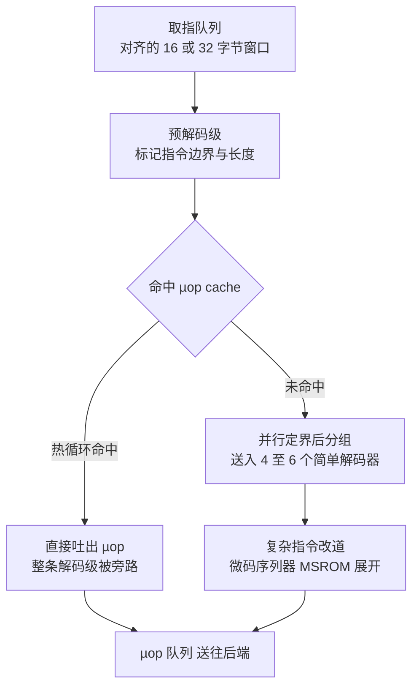

> **TL;DR**
>
> * **这是「给 AI 编译器工程师的芯片课」第四篇**。前三篇回答了"芯片怎么造出来""数据住在哪里"，本篇回答最核心的一个问题：**一行机器码如何变成晶体管的开关动作**。主线一句话——**编码格式决定解码器形态 → 解码器吐出控制信号 → 控制信号驱动数据通路 → 数据通路里的加法器和乘法器决定每条指令的延迟**。
> * **三个对编译器最值钱的结论**：1 指令编码位宽是稀缺资源——寄存器编号几位就决定有几个寄存器，opcode 几位就决定解码器多大；2 性能表里"FMA 延迟约 4 cycle"这类数字不是文档作者的偏好，是 CLA 进位前缀 + Booth 编码 + Wallace 压缩树这条算术电路的流水线切分；3 PTX 不是执行的真相，SASS 才是——性能归因和双发射检查都要对着反汇编做。
> * **本篇动手实验**：纯 Python 手搓一个 Booth 编码乘法模拟器（无需任何硬件），再用 cuobjdump 和 llvm-mca 把真实芯片的指令流解剖给你自己看。

---

## 1. ISA：软硬件之间的一张契约纸

第 01 篇把抽象栈摊开过：ISA(Instruction Set Architecture，指令集架构)站在第 6~7 层交界处，是编译器可见的最后一级抽象。它的定义朴素得容易让人轻视：**软硬件共同认可的契约**——可见的体系结构状态（通用寄存器、PC、标志位、内存模型），每条指令对这些状态的语义承诺，外加异常行为。契约之外的一切——流水线几级、缓存多大、解码器几路宽——都属于微架构，硬件设计师随时可以推翻重来。

| ISA 承诺的 | ISA 不承诺的 | 后果 |
|:---|:---|:---|
| 指令语义（`add` 就是加） | 每条指令几个周期 | 延迟表要靠实测/微基准补齐 |
| 可见状态与编码格式 | 流水线深度、发射宽度 | 同一 ISA 不同代性能差数倍 |
| 异常与内存模型 | 缓存大小、µop 划分 | cost model 不能只看 ISA 文档 |

这张表解释了一个日常现象：LLVM 的 target 描述分两层，`TargetInstrInfo` 描述 ISA 层（语义、编码、寄存器类），`MCInstLayout/SchedMachineModel` 描述微架构层（延迟、吞吐、端口）。**ISA 是契约，调度模型是契约之外的灰色地带**——本系列后面几篇就是在给灰色地带补光。

一条指令从内存里的比特到驱动开关，完整路径如下：


本篇沿这条路径走一遍，每一站都问同一个问题：**这里的电路长什么样，它给编译器留下了什么约束**。流水线冒险与 forwarding 留给第 05 篇，今天先走通"快乐路径"。

## 2. 三种编码哲学：RISC、CISC 与 VLIW

### 2.1 定长与变长：一场信息论的交换

指令集设计的第一道选择题：每条指令多长？从信息论视角看，这是一个变长前缀码 vs 定长码的经典权衡。设各指令出现概率为 $p_i$、编码长度 $\ell_i$，平均码长：

$$\bar{L} = \sum_{i} p_i \cdot \ell_i$$

**变量映射表**：

| 符号 | 含义 | 示例取值 | 维度/单位 |
|:---:|:---|:---|:---|
| $p_i$ | 第 i 类指令的出现频率 | mov 约 0.4、add 约 0.3（示意分布） | 无量纲 |
| $\ell_i$ | 该类指令的编码长度 | 变长码按频率分配 1~4 字节 | 字节或比特 |
| $\bar{L}$ | 平均指令长度 | 定长必须覆盖全集，变长贴着频率走 | 比特 |

做个 toy 计算：假设某架构有 16 种常用指令，定长编码需要 $\log_2 16 = 4$ bit；若频率分布为 40%、30%、20%、10%，最优前缀码的平均长度只有约 1.9 bit——**省一半以上的程序体积**。这是 x86 坚持变长的历史理由：1978 年内存贵得离谱，代码密度就是钱。代价立刻显现在解码侧：**边界取决于内容**，不解析完这一条就不知道下一条在哪——解码天然串行化，第 04 节看工业界怎么补偿。

RISC 阵营选了另一头：所有指令一律 32 位（RISC-V 另有 16 位压缩扩展做混合）。密度吃亏，但换来两个白送的电路性质：

* **边界免费**：边界 = f(PC)，地址对齐即知，取指队列可以无脑并行切分；
* **字段定位免费**：每个字段永远躺在固定的比特区间，提取 = 直接连线，无需移位对齐。

VLIW(Very Long Instruction Word)则是第三种答案：干脆放弃"单条指令"的概念，把多条操作捆成一个超长字（Itanium 每 128 bit 捆 3 条，TI C6000 每 256 bit 一束），**依赖检查和时序安排全部外包给编译器**，硬件只管按槽位发射。这是第 01 篇"调度责任转移轴"上最极端的一格。

### 2.2 三种哲学对照表

| 维度 | RISC（定长） | CISC（变长） | VLIW（超长） |
|:---|:---|:---|:---|
| 代表 | RISC-V、AArch64、GPU SASS | x86/x86-64 | Itanium、TI C6000、Hexagon、Groq LPU |
| 单条长度 | 固定 32 bit | 1~15 字节 | 一个 bundle 数十至数百 bit |
| 解码复杂度 | 低：组合逻辑一次切完 | 高：先定边界再拆字段 | 中：字段多但槽位整齐 |
| 代码密度 | 低 | 高 | 最低（nop 填槽） |
| 硬件互锁 | 有（现代 RISC 全带） | 极强（乱序重排） | 弱或没有：正确性靠编译器保证 |
| 调度责任 | 软硬折中 | 硬件为主 | **软件为主** |

> 💡 **编译器关联**：VLIW 的本质是把微码序列器从硬件搬回软件——**微码是藏在 ROM 里的"硬件编译产物"，VLIW 是把它归还给编译器的运动**。你在 Triton 里写的 `num_stages`、TVM 里做的软件流水（software pipelining），血统上都是 VLIW 思想：既然硬件不肯排时序，编译器就得亲自排。GPU 的 SIMT warp 指令流虽属 RISC 家族，但 Tensor Core 的 `mma` 多周期指令和确定性调度的数据流芯片（Groq 官方技术资料口径）都带着浓重的 VLIW 基因。TPU v1 则自述采用 CISC 风格指令（[arXiv:1704.04760](https://arxiv.org/abs/1704.04760)），由硬件解释——动物园里三种哲学都有后代。

## 3. 指令编码格式：位宽是稀缺资源

### 3.1 字段划分：一条指令的解剖图

以 [RISC-V RV32I](https://github.com/riscv/riscv-isa-manual) 为例，32 位被切成六个字段：

| 格式 | 31~25 | 24~20 | 19~15 | 14~12 | 11~7 | 6~0 | 用途 |
|:---|:---:|:---:|:---:|:---:|:---:|:---:|:---|
| R 型 | funct7 | rs2 | rs1 | funct3 | rd | opcode | 寄存器运算 add/sub |
| I 型 | imm[11:0] | | rs1 | funct3 | rd | opcode | 加立即数、load |
| S 型 | imm[11:5] | rs2 | rs1 | funct3 | imm[4:0] | opcode | store |
| B 型 | imm[12\|10:5] | rs2 | rs1 | funct3 | imm[4:1\|11] | opcode | 条件分支 |
| U 型 | imm[31:12] | | | | rd | opcode | 高位常量 lui |
| J 型 | imm[20\|10:1\|11\|19:12] | | | | rd | opcode | 远跳转 jal |

注意一个容易被略过的细节：**rs1 永远钉死在 [19:15]、rs2 在 [24:20]，六种格式无一例外**。这不是强迫症，是关键路径优化：寄存器堆读取只需要 rs1/rs2 两个字段，而它们的位置与指令类型无关——于是**读寄存器堆可以和解码同时开工**，两条本来串行的延迟叠成了并行的。字段位置即电路布线，编码规范就是数据通路的施工图。

### 3.2 位宽的经济学：每个字段都是面积预算

字段宽度直接换算成资源上限：

$$N_{reg} = 2^{b_{rd}}, \qquad N_{opcode} = 2^{b_{op}}$$

**变量映射表**：

| 符号 | 含义 | 示例取值 | 维度/单位 |
|:---:|:---|:---|:---|
| $b_{rd}$ | 目的寄存器编号位宽 | RISC-V 为 5 | bit |
| $N_{reg}$ | 可寻址的架构寄存器数 | $2^5=32$ | 个 |
| $b_{op}$ | 主操作码位宽 | RISC-V 为 7 | bit |
| $N_{opcode}$ | 主操作类别上限 | $2^7=128$ | 类 |

三个真实案例把这个公式讲透：

* **x86-64 的 16 个通用寄存器**：8086 只留了 3 位编号，x86-64 靠 REX 前缀挤出第 4 位才到 16 个，AVX-512 再用 EVEX 给向量寄存器 5 位扩到 32 个——**寄存器是一次次前缀"赎"回来的**。
* **AArch64 的 31+1**：5 位编号里特意留出 `11111` 不当寄存器用，复用为零寄存器/SP——32 个名额一个不浪费。
* **GPU 的 255/thread**：SASS 给寄存器编号预留了 8 位量级的字段（社区逆向口径，未验证），对应每线程 255 个寄存器的上限。回忆第 03 篇：RF 面积随容量线性涨、随端口平方涨——**编号每加一位地皮翻一倍，寄存器分配器省下的每个寄存器，都在替 die 面积说话**。

### 3.3 变长解剖：手解一条 x86 指令

x86 的一般结构是：前缀（0~4 字节）+ 操作码（1~3 字节）+ ModRM/SIB（寻址描述）+ 位移量 + 立即数，全长不超过 15 字节（Intel SDM 口径）。手工解一条真实的指令：

```text
48 83 C0 04    ; add rax, 4
│  │  │  └─ imm8 = 4
│  │  └─ ModRM = C0 = 11 000 000 : mod=11(寄存器寻址) reg=/0(ADD组) rm=000(EAX)
│  └─ opcode 83 = 组指令 ADD r/m32, imm8
└─ REX.W 前缀 = 48 : 把 32 位操作提升为 64 位
```

四字节表达一句"加个 4"，其中还包含一次组操作码的二级查表（83 → ADD 组 /0 扩展）。对比 RISC-V 的 `addi`：字段位置固定、一步到位。**变长的灵活性由解码器的串行化买单**：ModRM 决定后面还有没有 SIB/位移/立即数，不解析完就不知道这条指令到底几个字节——这正是第 4 节预解码机制存在的全部理由。

> 💡 **编译器关联**：同一语义常有多种编码，性能却不同。`inc eax` 比 `add eax, 1` 短一字节，但历史上会留下 partial flags 依赖拖慢后续指令（微架构相关，逐代表现见 [Agner Fog 微架构手册](https://www.agner.org/optimize/)，未逐代验证）——所以主流编译器宁可多花一个字节也要发 `add 1`。指令选择（instruction selection）从来不只是选语义，还是在选编码。

## 4. 解码器电路：从比特流到控制信号

### 4.1 定长世界的解码：一棵纯组合逻辑树

解码的本质是把 k 位操作码翻译成 $2^k$ 根控制线（one-hot），电路就是一个 N 选一的译码阵列：每根输出线是一个 k 输入 AND 门。门数与深度的粗估：

$$G_{dec} \approx k \cdot 2^{k}, \qquad D_{dec} \approx \lceil \log_2 k \rceil + 1$$

**变量映射表**：

| 符号 | 含义 | 示例取值 | 维度/单位 |
|:---:|:---|:---|:---|
| $k$ | 参与译码的操作码位宽 | 7（RISC-V 主操作码） | bit |
| $G_{dec}$ | 译码阵列门数 | $7\times128 \approx 900$ | 门 |
| $D_{dec}$ | 逻辑深度 | 约 4 级门 | 级 |

CMOS 门扇入有限，7 输入 AND 实际会切成两级（如 4+3），但总归是**常数深度、无迭代、无状态**的组合逻辑。GPU 更是把这套红利吃到极致：Volta 之后每条 SASS 指令固定占一个槽位（物证见第 8 节），解码结果对整个 warp 的 32 个 lane 复用一份——**解码功耗和面积被 SIMD 宽度摊薄 32 倍**。

### 4.2 变长世界的解码：边界是一道前缀题

变长指令流的麻烦在于：不知道边界在哪。从窗口起点出发，"读一条 → 算长度 → 跳到下一条起点"是一条串行链，最坏情况整个 fetch 窗口都要链式扫一遍。工业界的解法分两步：

1. **预解码(predecode)**：I-cache 里给每个字节附带一位"可能是指令首字节"的标记，装入时一次算好、每次取指直接复用（P6 世代起公开文献口径）。
2. **并行前缀折叠**：把"起点＋累计长度"封装成满足结合律的二元组，链式扫描就能像进位一样折进前缀树，$O(\log W)$ 步定位全部边界（教学抽象，工业细节见公开专利与教材，未逐一验证）。

熟悉吗？第 7 节你会看到一模一样的数学再次登场——**可结合算子的前缀折叠是数字电路的万能杠杆**，既能压平 64 级串行进位，也能压平变长边界的链式扫描。

现代 x86 前端的三级流水如下：



µop cache（Sandy Bridge 引入，容量千条量级，以官方优化手册为准）命中的意义不只是快：**整个变长解码森林被跳过，前端功耗大幅下降**。热循环能不能塞进 µop cache，成了 x86 上真实的性能悬崖。

> 💡 **编译器关联**：循环体对齐（loop alignment）是给这套前端喂饭的动作——把循环入口对齐到 32/64 字节边界，预解码窗口利用率最高、µop cache 行不被截断。GCC 的 `-falign-loops`、LLVM 的 loop alignment pass 都在做这件事；PGO 的块重排（hot code layout）本质上也是在帮取指单元缩短有效工作集。**这些 pass 的物理动机不在编译器论文里，在这棵解码树上。**

## 5. 硬连线控制与微码：谁来生成 µop

### 5.1 两种控制信号发生器

解码器的输出是控制信号：写使能、ALU 操作码、访存读写、分支方向……生成它们的电路有两代方案：

* **硬连线(hardwired)**：控制信号 = f(操作码，状态) 的组合逻辑，综合成门阵即可。快，但指令越怪逻辑网越乱——RISC 与 GPU 的主力路线。
* **微码(microcode)**：把复杂指令展开成一段存在控制 ROM 里的内部微指令序列，由微型序列器逐条执行。灵活可改，慢在多周期串行——CISC 传统艺能，Wilkes 1951 年的发明。

现代 x86 是两者的混合体：绝大多数常用指令走硬连线的 fast path，直接产出 1~4 个 µop；少数复杂指令（字符串操作、部分 AVX 形式）改道微码序列器 MSROM 展开。微码至今仍是流片后唯一的"软件修复通道"——CPU 出 bug 时通过固件下发微码补丁（近年 Spectre 系列缓解措施就是这么发布的），相当于给 RTL 打热更新。

### 5.2 µop 拆分：复杂指令的真面目

CISC 指令进入后端之前会被拆成类 RISC 的 µop。典型拆分（数量随微架构代际浮动，以 Agner Fog 实测表为准）：

| x86 指令 | 拆出的 µop | 备注 |
|:---|:---|:---|
| `add rax, rbx` | 1 | fast path，寄存器到寄存器 |
| `add rax, [mem]` | load + add（融合域计 1~2） | 内存操作数不免费 |
| `add [mem], rax` | load + add + store | 读改写三连，典型 slow path |
| `cmp+jcc` | 1（宏融合 macro-fusion） | 相邻配对才融合，中间隔指令就散伙 |
| `rep movsb` | 微码序列 | 整段循环下沉到微码引擎 |

规律清晰可见：**凡是让硬件多做一次"猜"或者多碰一次内存的语法糖，都会在 µop 层现出原形**。编译器的指令选择如果对着这份表挑形式，等于免费过了一遍微架构审查。

GPU 侧没有公开的微码层：SASS 就是最终真相，控制逻辑全硬连线。但内部仍有序列化——MUFU 内部跑多项式序列、`mma` 占多周期，都是"对外一条、对内一段"（无公开资料，未验证）；CUDA 整数除法慢同理：硬件没除法器，ptxas 展开成一长串移位减法。

## 6. 数据通路：一条指令的一生

把前面所有部件接起来，就是教科书级的五段数据通路（Patterson & Hennessy 经典模型）：

| 阶段 | 主要电路 | 关键物理约束 | 编译器可见后果 |
|:---:|:---|:---|:---|
| IF 取指 | PC 寄存器、I-cache、取指队列 | 对齐与带宽；定长则边界免费 | 代码布局、循环对齐 |
| ID 解码 | 译码阵列、立即数生成 | 组合逻辑深度（第 4 节） | 指令形式选择 |
| RF 读 | 多端口寄存器堆 | 端口面积平方模型（第 03 篇） | 寄存器分配压力 |
| EX 执行 | ALU/MUL/AGU | 关键路径 = 加乘电路深度（第 7 节） | **延迟表的来源** |
| MEM 访存 | LSU、D-cache | sector 粒度搬运（第 03 篇） | coalescing、向量化 |
| WB 写回 | 写端口仲裁 | 写口数量有限 | WAW/WAR 冒险（第 05 篇） |

单周期设计要把这六站塞进一个时钟周期，$T_{clk}$ 长得没法看；第 02 篇的关键路径公式在这里兑现：**流水化就是把六站切成六段，每段的组合逻辑深度决定主频**。五段流水是最小配置——真实 GPU 的执行分区里，取指到发射之间的级数更多，且每级都在为"喂饱后面的执行阵列"服务。

GPU 版数据通路的特殊之处只有两处，其余同构：

* **RF 读取走 operand collector**：一个 warp 要在同一周期拿到 32 lane × 2~3 个操作数，撞 bank 的请求硬件自动推迟重放（第 03 篇已展开其电路，此处引用结论）；这也解释了某些指令组合被静默插入 replay 的现象。
* **解码与控制信号全 warp 共享**：SIMT 的本质是"一份解码输出驱动 32 份数据通路"，warp divergence 的电路根源要到第 06 篇才算真正打开。

> 💡 **编译器关联**：数据通路的分段就是延迟表的行号——文档里每条"FMA 吞吐每 SM 每周期 128 个"，对应的都是 EX 段算术树的深度与切分。下面就把这棵树拆开。

## 7. 算术单元的数学：CLA、Booth 与 Wallace 树

### 7.1 行波进位的教训：串行是一切之恶

32 位加法的最笨做法是行波进位(Ripple-Carry)：每一位的全加器等着上一位的进位。第 i 位的进位输出 $c_{i+1}$ 依赖 $c_i$，32 位就要串行等 32 步——放在 02 篇的关键路径公式里，这段逻辑单独就能吃掉大半个时钟周期。必须把串行链压扁。

### 7.2 CLA：把进位变成前缀问题

观察到每位有两个本地属性：**生成(generate)** $g_i = a_i b_i$（两位都是 1，无论低位来什么进位我都会产生进位）和**传播(propagate)** $p_i = a_i \oplus b_i$（恰有一位是 1，我会把低位进位放行）。于是：

$$c_{i+1} = g_i + p_i c_i$$

递归代入两层即见模式：

$$c_2 = g_1 + p_1 g_0 + p_1 p_0 c_0$$

完全展开后每位进位都变成两级逻辑，但扇入随位数线性膨胀，物理上不可持续。工程解法是**分组的结合律折叠**：定义组内 (generate, propagate) 二元组，两段拼接满足：

$$\big(G_{hi}, P_{hi}\big) = \big(G_2 + P_2 \cdot G_1,\;\; P_2 \cdot P_1\big)$$

**变量映射表**：

| 符号 | 含义 | 物理直觉 | 维度/单位 |
|:---:|:---|:---|:---|
| $g_i$ | 第 i 位生成 | 本地自带进位源 | 无量纲 |
| $p_i$ | 第 i 位传播 | 进位的"放行闸门" | 无量纲 |
| $c_i$ | 进入第 i 位的进位 | 链式依赖的元凶 | 无量纲 |
| $\big(G,P\big)$ | 一段区间的组属性 | 区间整体"会不会生进位/放进位" | 无量纲 |

拼接算子满足结合律，于是 32 位可以组织成 Kogge-Stone 型前缀树，$\lceil \log_2 32\rceil = 5$ 级折完所有进位——**串行 32 步 → 并行 5 级**，代价是布线暴涨（Kogge-Stone 布线 O(n log n)，Brent-Kung 少布线换稍深层级），加法器设计的艺术就是在"深度 vs 面积"曲线上挑点。原始文献：Weinberger & Smith 1958、Kogge & Stone 1973（见参考）。

### 7.3 Booth 编码：先把乘法变小

$n \times n$ 乘法朴素做法要产生 n 个部分积再加起来。Booth 编码(radix-4 版)利用二进制的一条恒等式——连续 1 串可以用借位差表示，例如 $0111 = 1000 - 0001$——把乘数每两位重编码成一个五值数字 $d_i \in \{0,\pm1,\pm2\}$：

$$X = \sum_{i} d_i \cdot 4^{i}, \qquad d_i \in \{-2,-1,0,+1,+2\}$$

重编码规则查重叠三元组 $(b_{i+1}, b_i, b_{i-1})$：

| 三元组 | $d_i$ | 操作 | 三元组 | $d_i$ | 操作 |
|:---:|:---:|:---|:---:|:---:|:---|
| 000 | 0 | +0 | 100 | -2 | -2B |
| 001 | +1 | +B | 101 | -1 | -B |
| 010 | +1 | +B | 110 | -1 | -B |
| 011 | +2 | +2B | 111 | 0 | +0 |

效果：n 位乘法只需 **n/2 个部分积**（±2B 免费来自移位，负项来自取反加一，符号扩展有标准修正技巧）。部分积砍半，后面压缩树的深度直接浅一层。原始文献：Booth 1951《A Signed Binary Multiplication Technique》。

### 7.4 Wallace 树：log 时间压完所有部分积

部分积阵列高度为 h 时，用 **3:2 压缩器**(carry-save adder，就是全加器)把同一列的 3 个比特压成 2 个（本列 sum + 向高列 carry）——关键是**进位不横向传播**，各位独立处理，单层延迟恒定。每压一层高度变为原来的约 2/3：

$$h' = \left\lceil \tfrac{2}{3}h \right\rceil \;\Rightarrow\; d \approx \lceil \log_{1.5} m \rceil$$

**变量映射表**：

| 符号 | 含义 | 示例取值 | 维度/单位 |
|:---:|:---|:---|:---|
| $m$ | Booth 重编码后的部分积行数 | 16 位乘法为 8 | 行 |
| $d$ | 压缩层数 | $8\to6\to4\to3\to2$，约 4 层 | 层 |
| $h$ | 当前最大列高 | 逐层下降 | bit |

压缩到只剩两行后，最后一步才用真正的进位传播加法器收尾——而它正是 7.2 节的 CLA。整条乘法链路的延迟账：

| 步骤 | 逻辑深度（量级） | 说明 |
|:---|:---:|:---|
| Booth 重编码 | ~1 级 | 三元组查表 |
| 部分积生成与符号修正 | 1~2 级 | AND 阵列 + 修正位 |
| Wallace 压缩（radix-4 后） | ~4 层 CSA | 每层深度恒定 |
| 最终 CLA 与舍入规格化 | 十几级 | 浮点还要对阶、规格化、舍入 |
| **合计** | 几十级门 | 1 GHz 预算装不下 → **切流水** |

现在可以兑现第 02 篇的承诺了："FP32 FMA 依赖链延迟约 4 cycle"（Volta 微基准实测口径，[arXiv:1804.06826](https://arxiv.org/abs/1804.06826)；Ampere 同量级，[arXiv:2208.11174](https://arxiv.org/abs/2208.11174)，具体以实测为准）——**就是上面那张表被触发器切成四段的结果**。而 FMA 之所以比"先乘后加"更准也更快：加数 $c$ 直接并入同一个压缩树，全程只在出口舍入一次，省掉一次独立的 CLA 和一次中间舍入（数值语义的完整讨论留给第 05 篇）。

> 💡 **编译器关联**：三个推论。1 **低精度为什么又快又省**：尾数位宽减半 → Booth 数字减半 → 压缩树面积按平方缩小（呼应第 01 篇 FP8 面积论），延迟还更短；2 **fast-math 的合法性边界**：`fmul+fadd → fma` 合并（LLVM 的 FP contract、`#pragma STDC FP_CONTRACT`）改变舍入次数，严格 IEEE 语义下不可默认开启；3 **整数除法为什么慢**：没有对应的树形电路，只能靠指令序列迭代模拟——cost model 里它是几十条指令的成本，不是一条。

## 8. SASS 实例解码分析：对着真机验货

### 8.1 反汇编：编译器后端的验收测试

工具链自带验货设备：`nvcc` 编译出 cubin 后，[cuobjdump/nvdisasm](https://docs.nvidia.com/cuda/cuda-binary-utilities/) 可以反汇编出 SASS。一个 elementwise kernel 的典型片段（节选改排的示意，实际输出随架构与编译器版本变化）：

```text
        /*0040*/                   MOV R1, c[0x0][0x28] ;
        /*0050*/                   S2R R0, SR_CTAID.X ;
        /*0060*/                   IMAD.MOV.U32 R4, RZ, RZ, RZ ;
        /*0070*/                   LDG.E.128 R8, [R2] ;
        /*0080*/               @P0 FFMA R4, R8, R5, R6 ;
        /*0090*/                   STG.E [R2], R4 ;
```

不用官方文档也能当场读出三条编码事实：

* **地址步进恒为 0x10**：每条指令固定占 16 字节槽位——定长编码的直接物证（Volta 之后的社区普遍口径，官方从未正式发布 SASS 编码规范，位级划分均为社区逆向，未验证）。
* **谓词字段**：`@P0` 是条件执行守卫，分支被 if-conversion 成谓词后，控制依赖变成了数据通路上的一位开关。
* **伪指令无处不在**：`MOV R4, RZ` 被 ptxas 发成整数单元的 `IMAD.MOV.U32`——真实 ISA 没有"干净的 move"，寄存器移动借用功能单元搭车。

常见 SASS 指令族与本篇内容的对应关系：

| SASS 指令族 | 功能 | 数据通路落点 | 编译器相关性 |
|:---|:---|:---|:---|
| FFMA/FMUL/HADD2 | 标量/半精度乘加 | EX 段算术树（第 7 节） | 延迟与吞吐表的实体 |
| LDG/STG/LDS/STS | 全局/共享访存 | LSU + coalescer（第 03 篇） | 向量化宽度 `.128` 即 128 bit |
| IMAD/IADD3 | 整数乘加 | 整数 ALU | 地址算术的主力 |
| MUFU | 特殊函数 exp/rsqrt | SFU 多周期序列 | fast-math 内建函数的落点 |
| BRA/@P0 BSSY | 分支与屏障同步 | 控制流 | divergence 分析对象（第 06 篇） |

### 8.2 双发射与控制码：藏在暗处的调度提示

Ampere 一类架构上，nvdisasm 会把可并发的两条独立指令显示在同一槽位（社区口径，未验证）——ptxas 指令调度的直接产出，PTX 里看不到。控制码视图还暴露 wait barrier、yield、寄存器 reuse 标志等调度元数据：reuse 告诉操作数收集器"这个源从 reuse cache 拿，别去挤 RF bank"——第 03 篇 operand collector 在这里露出软件可见的一角。

> 💡 **编译器关联**：三层结论。1 **PTX 不是执行的真相**：Triton/TVM 用户看到的 PTX 还要经 ptxas 做寄存器分配、调度、swizzle 才变成 SASS，性能归因必须落到 SASS 级；2 **ncu 的指令计数器对应的是 SASS 指令而非 PTX 指令**，两者粒度不同，别拿 PTX 数量估算吞吐；3 NVIDIA 不公开 SASS 编码规范本身就是一种生态策略——ISA 与解码器布线绑得过紧，公开即承诺永久兼容。想深挖的读者可以看社区逆向项目（如 GitHub 上的 maxas 系列）与 [arXiv:1804.06826](https://arxiv.org/abs/1804.06826) 的微基准实证。

## 9. 编译器启示汇总

把本篇八个硬件事实与对应的编译器决策钉在同一张表上：

| 硬件事实 | 电路根源 | 编译器决策 |
|:---|:---|:---|
| 定长编码边界免费 | 字段位置恒定 | 宽发射友好；代价是 I-cache 密度，嵌入式目标慎选 |
| 变长编码密度高 | 内容决定边界 | µop cache 友好的循环体大小；`inc/add` 类形式选择 |
| rs1/rs2 跨格式钉死 | 读 RF 可与解码并行 | （硬件视角）高频的秘密之一；ISA 设计即布线设计 |
| 寄存器编号位宽 = RF 规模 | $N=2^{b}$，面积随容量与端口涨 | 寄存器分配是在花 die 上的面积 |
| VLIW 无硬件互锁 | 时序承诺外包 | 软件流水成为必需品；确定性调度的远祖 |
| µop 拆分与宏融合 | fast path 表 | 指令选择偏向单 µop 形式；融合机会保持相邻 |
| Booth+Wallace 深度 O(log n) | 压缩树层级 | 延迟表出处；II 推导依据（第 05 篇） |
| 谓词字段存在 | 分支转条件执行 | if-conversion 合法性判据；divergence 前置话题 |

一句话收束：**ISA 不是一张抽象的功能清单，它是一份带尺寸标注的施工图——每个字段位宽、每种编码格式、每条 fast path，都是解码器与数据通路上真实存在的导线。编译器的每一次指令选择，都是在给这张施工图填砖。**

## 10. 收官小结与局限

**带走四句话**：

1. 编码格式是软硬件契约的第一层：定长买解码速度，变长买代码密度，VLIW 干脆把调度责任整个签给编译器。
2. 固定的字段位置让"读寄存器堆"与"解码"并行开工；寄存器编号位宽直接换算成 RF 面积——ISA 规范就是数据通路的施工图。
3. 加法靠前缀树、乘法靠 Booth + Wallace，两者都是 O(log n)：性能表里每个周期数，都是某棵逻辑树的深度被触发器切开的样子。
4. SASS 是编译器的最后一份产出、芯片的第一份输入：读懂它的字段与控制码，就读懂了这条契约的落款处。

**本篇的局限**：x86 各代 µop 划分变化频繁，本文只给结构性结论，逐代数据以官方优化手册与 Agner Fog 实测为准；SASS 位级编码非官方公开，字段划分为社区逆向口径（未验证）；CLA/Kogge-Stone 的物理延迟取决于工艺库，正文只比较逻辑层级而非纳秒数字。展望：CXL 与 chiplet 让"指令从哪片硅上来"成为新问题，ISA 契约正被 UCIe 一类 die 间协议重新谈判——第 08 篇展开。

## 动手实验(Lab)

读者可以自己跑以下三个小实验验证本篇观点（第一个不需要任何硬件）：

### Lab 1：纯 Python 手搓 Booth 编码乘法

```python
# 环境:任意 Python3。radix-4 Booth 重编码 + 部分积求和,对照直接乘法。
import random

def booth_digits(x, w=16):
    """返回 d_i 序列,满足 x = sum(d_i * 4^i)。"""
    xs = x & ((1 << w) - 1)
    table = {0: 0, 1: 1, 2: 1, 3: 2, 4: -2, 5: -1, 6: -1, 7: 0}
    ds = []
    for i in range(0, w, 2):
        trip = ((xs >> (i - 1)) if i else (xs << 1)) & 0b111
        ds.append(table[trip])
    return ds

for _ in range(10000):
    a, b = random.randrange(-2**15, 2**15), random.randrange(-2**15, 2**15)
    assert sum(d * (a * (1 << 2 * i)) for i, d in enumerate(booth_digits(b))) == a * b
print("Booth 重编码恒等于直接乘法:10000 组随机测试通过")
# 观察 booth_digits(b) 的输出:非零项大约只有一半,
# 这就是"部分积减半 → Wallace 树浅一层"的全部含义。
```

### Lab 2：用 cuobjdump 验证定长编码

```bash
# 环境:NVIDIA GPU + CUDA toolkit
cat > tiny.cu <<'EOF'
__global__ void saxpy(float* y, const float* x, float a, int n) {
    int i = blockIdx.x * blockDim.x + threadIdx.x;
    if (i < n) y[i] = a * x[i] + y[i];
}
EOF
nvcc -arch=sm_80 -cubin tiny.cu -o tiny.cubin
cuobjdump -sass tiny.cubin | grep -E '/\*[0-9a-f]+\*/'
# 看第一列地址:步进是否恒为 0x10(16 字节)?
# 再找找 @P0 开头的谓词指令和分号并列的双发射对。
```

### Lab 3：用 llvm-mca 对照延迟表

```bash
# 环境:LLVM 工具链。llvm-mca 基于调度模型推演吞吐与端口占用,
# 正是本篇"微架构模型 = 契约之外的灰色地带"的活例子。
cat > loop.s <<'EOF'
loop:
  vaddps %ymm0, %ymm1, %ymm2
  vfmadd231ps %ymm2, %ymm3, %ymm4
  subq $8, %rdi
  jnz loop
EOF
llvm-mca -mcpu=znver3 loop.s
# 对照输出里的 Block Cycles 与端口压力表:
# FMA 占哪个端口?与 vaddps 抢不抢?换个 mcpu 再跑一遍,看模型怎么变。
```

## 参考文献

| 主题 | 链接 |
|:---|:---|
| RISC-V 非特权级规范（RV32I 编码格式官方出处） | <https://github.com/riscv/riscv-isa-manual> |
| Intel 64 and IA-32 Architectures SDM（x86 编码与长度上限权威出处） | <https://www.intel.com/sdm> |
| Agner Fog 优化手册（µop 划分/融合/延迟的逐代实测事实标准） | <https://www.agner.org/optimize/> |
| Dissecting the NVIDIA Volta GPU Architecture via Microbenchmarking（FFMA 延迟等微基准实证） | [arXiv:1804.06826](https://arxiv.org/abs/1804.06826) |
| Demystifying the Nvidia Ampere Architecture（Ampere 微基准与 SASS 统计） | [arXiv:2208.11174](https://arxiv.org/abs/2208.11174) |
| TPU v1 论文（CISC 风格指令的自述出处） | [arXiv:1704.04760](https://arxiv.org/abs/1704.04760) |
| Weinberger & Smith, 1958（进位前瞻/superposition 原始论文） | "A Logic for High-Speed Addition", NBS Circ. 591（可搜标题获取） |
| Kogge & Stone, 1973（并行前缀算法奠基论文） | IEEE Trans. Computers, Vol. C-22 No.8（可搜标题获取） |
| Booth, 1951（Booth 编码原始论文） | "A Signed Binary Multiplication Technique", Q. J. Mech. Appl. Math.（可搜标题获取） |
| Wallace, 1964（压缩树原始论文） | "A Suggestion for a Fast Multiplier", IEEE Trans. Electronic Computers（可搜标题获取） |
| CUDA Binary Utilities（cuobjdump/nvdisasm 官方文档） | <https://docs.nvidia.com/cuda/cuda-binary-utilities/> |
| llvm-mca 文档（基于调度模型的静态性能推演工具） | <https://llvm.org/docs/CommandGuide/llvm-mca.html> |
| Hennessy & Patterson, *Computer Architecture: A Quantitative Approach*（ISA/RISC 史观教材） | 可搜书名获取最新版 |
| Weste & Harris, *CMOS VLSI Design*（加法器/乘法器电路章节） | 可搜书名获取版本信息 |
| 中文社区解读 | 知乎站内搜「RISC CISC 指令编码」「Booth 乘法器 图解」「Wallace 树」有多篇图解文章（质量参差，建议对照本文公式阅读） |

> 下一篇：[《指令集与电路执行（二）：流水线、冒险与 FMA 单元》](05_pipeline_fma.md)——本篇走通了快乐路径，下一篇给它装上刹车与红绿灯：结构/数据/控制冒险如何逼出 forwarding 与分支预测，FMA 单元如何流水化，以及 VLIW 软件流水的电路动机。
