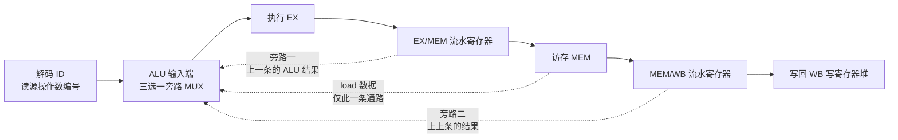
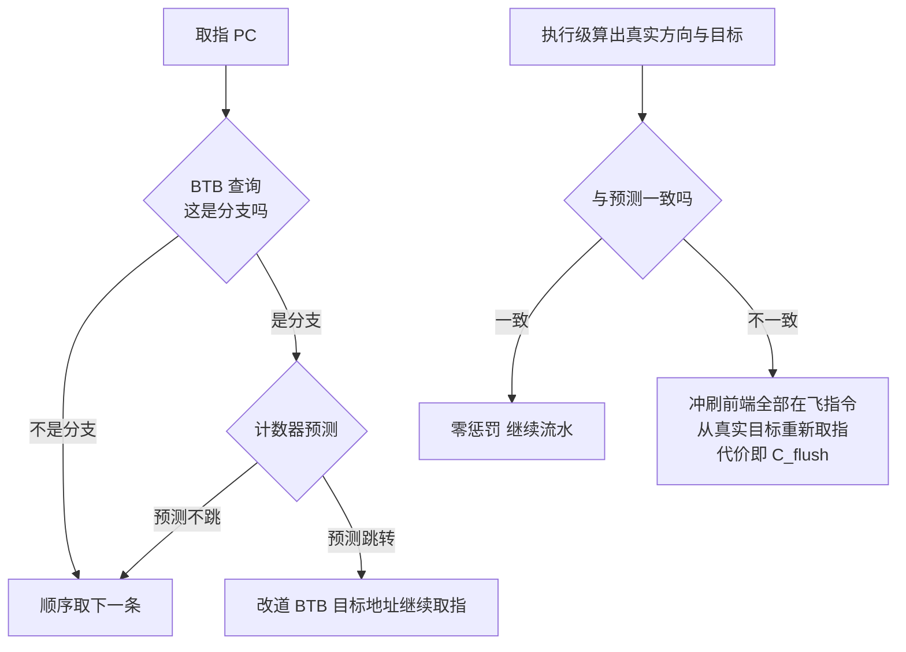

> **TL;DR**
>
> * **这是「给 AI 编译器工程师的芯片课」第五篇**。第四篇走通了“编码 → 解码 → 控制信号 → 数据通路”的快乐路径——但那条路径上一次只有一条指令。本篇把六站数据通路叠起来跑：**流水线让五、六条指令同时在场，吞吐率翻数倍，而重叠本身制造了新的故障模式**。主线一句话——**流水线切分决定延迟与吞吐 → 重叠执行制造结构/数据/控制三类冒险 → forwarding 与分支预测用电路填平冒险 → FMA 把乘加焊进同一棵压缩树并只舍入一次 → VLIW 干脆把排时序的责任整个交给编译器**。
> * **三个对编译器最值钱的结论**：1 延迟表必须读出两个数字——FFMA 延迟约 4 cycle 说的是依赖链长度，吞吐每周期 1 条说的是流水线启动间隔 II；软件流水的 II 下界取资源约束与依赖环约束中较大者，一行公式算尽 unroll 与 `num_stages` 的下限；2 load-use 永远要停一拍——旁路网络救不了 MEM 段结束才有数据的指令，指令调度的全部意义就是往这道缝里塞独立工作；3 FMA 的单次舍入不只是精度红利，是数值语义契约——`fmul+fadd` 能不能合并成 `fma`，由舍入次数是否改变决定，这就是 `-ffast-math` 合法性边界的电路出处。
> * **本篇动手实验**：纯 Python 手搓一个带 forwarding 的五级流水线模拟器和 2-bit 饱和计数分支预测器（无需任何硬件），再用 llvm-mca 读出真实硬件上循环的启动间隔。

---

## 1. 流水线：不加速单条指令的加速术

第 02 篇第 5 节给过流水线的第一性推导：主频被最长组合逻辑路径卡死（$T_{clk} \geq t_{pcq} + t_{pd} + t_{setup}$），切短关键路径可以换频率，代价是指令延迟变长。第 04 篇第 6 节又把数据通路摊开成六站：IF 取指 → ID 解码 → RF 读寄存器 → EX 执行 → MEM 访存 → WB 写回。本篇把两者接起来——**流水化就是把六站之间各插一级触发器，让六条指令像流水线上的工件一样错位前进**：


每一级流水寄存器都是第 02 篇的 D 触发器：时钟沿一到，上一站的全部结果（含控制信号）瞬间变成下一站的输入。n 条指令走过 k 级流水的总时间与理想加速比为：

$$T_{total}(n) = (k + n - 1)\,\tau, \qquad S = \frac{n\,k\,\tau}{(k+n-1)\,\tau} = \frac{nk}{k+n-1} \xrightarrow{\;n \to \infty\;} k$$

**变量映射表**：

| 符号 | 含义 | 示例取值 | 维度/单位 |
|:---:|:---|:---|:---|
| $k$ | 流水线级数 | 教学模型 6；Pentium 4 约 20~31 级（公开报道口径） | 级 |
| $n$ | 指令条数 | 典型热循环 $10^3$ 以上 | 条 |
| $\tau$ | 单级时钟周期 | 切分后每级的组合逻辑深度决定 | 秒 |
| $S$ | 加速比 | $n$ 足够大时趋近 $k$ | 无量纲 |

代入感受一下：$k=6$、$n=1000$ 时 $S = 6000/1005 \approx 5.97$，几乎吃满理论上限。经典五级的时空图如下——注意**对角线**：稳态下每个周期都有一条指令完成、一条新指令进入：

| 指令 ↓ / 周期 → | 1 | 2 | 3 | 4 | 5 | 6 | 7 | 8 | 9 | 10 |
|:--|:--:|:--:|:--:|:--:|:--:|:--:|:--:|:--:|:--:|:--:|
| I1 | IF | ID | RF | EX | MEM | WB | | | | |
| I2 | | IF | ID | RF | EX | MEM | WB | | | |
| I3 | | | IF | ID | RF | EX | MEM | WB | | |
| I4 | | | | IF | ID | RF | EX | MEM | WB | |
| I5 | | | | | IF | ID | RF | EX | MEM | WB |

但要看清这张图卖的是什么：I1 的单条延迟仍是 6 个周期，**一点没变短**。流水线提升的是吞吐率（每周期完成一条），不是延迟。这个区分是整个 GPU 架构哲学的起点——既然单条延迟降不动，那就别在“让一条指令快点完”上花钱，把晶体管拿去同时跑几千条指令的吞吐（第 01 篇的调度责任轴、第 06 篇 warp 调度都建立在这个选择上）。

理想时空图还有一个隐含假设：六站互不打架、后一条不依赖前一条的结果、PC 永远顺序前进。三个假设各自破灭一次，就得到一类冒险。顺带对齐口径：经典教科书模型是五级（IF、ID、EX、MEM、WB），本系列沿用第 04 篇的六站划分，把读寄存器单独成站——两者只差一次切分粒度，本篇全部结论在两种口径下同构。

## 2. 三类冒险：重叠执行的三盏红灯

冒险（hazard）的定义很物理：**下一拍想做的事，硬件资源还没准备好**。按“没准备好的东西”分类，恰好三类：

| 冒险类型 | 没准备好的是什么 | 经典案例 | 硬件对策 | 编译器能做什么 |
|:---|:---|:---|:---|:---|
| 结构冒险 structural | 部件本身被占着 | IF 与 MEM 同周期抢一个存储器端口 | 分离 I/D cache；多端口 RF（第 03 篇）；重放 replay | 避开双发射限制的指令配对 |
| 数据冒险 data | 操作数还没算出来 | 后一条要用前一条的 ALU 结果 | forwarding 旁路；停顿；乱序执行 | 指令重排填缝；unroll 断依赖环 |
| 控制冒险 control | 还不知道下一条在哪 | 分支要到 EX 才改写 PC | 分支预测 + BTB；冲刷 flush | `__builtin_expect`、块布局、谓词化 |

三类的处理成本天差地别，这个排序值得记住：**结构冒险用面积买（加端口/复制部件），数据冒险用导线买（旁路网络），控制冒险用概率买（预测器）**。下面逐个拆。

## 3. Forwarding：用导线消灭等待

### 3.1 结果早就有了，只是还没到家

看最典型的 RAW（Read After Write）场景：`add` 写 R1，紧跟的 `sub` 读 R1。逐周期追踪会发现一件尴尬的事——`add` 的结果在第 4 周期 EX 段末尾就已经躺在 EX/MEM 流水寄存器里了，但它要等第 8 周期才从 WB 段正式写进寄存器堆。**数据早就在通路上，只是寄存器堆还没更新**。

那为什么非要等它“到家”？把 EX/MEM 流水寄存器的输出直接拉一根导线回喂到 ALU 输入端就行。这就是**旁路网络（forwarding/bypass network）**：



什么时候启用哪条旁路？一组组合比较器当场判断：

$$fwd_{rs} = \big(\text{EX/MEM.regWrite} \wedge \text{EX/MEM.rd} = \text{ID/EX.rs}\big) \;\vee\; \big(\text{MEM/WB.regWrite} \wedge \text{MEM/WB.rd} = \text{ID/EX.rs}\big)$$

**变量映射表**：

| 符号 | 含义 | 物理直觉 | 维度/单位 |
|:---:|:---|:---|:---|
| $\text{EX/MEM.rd}$ | 正在 EX 后一级的指令的目的寄存器号 | 结果“在路上”的主人 | 寄存器编号 |
| $\text{ID/EX.rs}$ | 正在 EX 的指令的源寄存器号 | 谁在等这份数据 | 寄存器编号 |
| $fwd_{rs}$ | 该源是否改从旁路取数 | MUX 的选择信号 | 布尔量 |
| $r0$ 守卫 | 零寄存器永不旁路 | 它恒为 0，无需等 | 布尔量 |

两个工程细节：一是比较器只比 5 位编号、深度一两级门，完全塞得进一个周期；二是零寄存器（RISC-V 的 x0、AArch64 的 ZR，见第 04 篇 3.2 节）必须排除在外——它永远读 0，不需要等谁写。

### 3.2 load-use：旁路网络的死角

forwarding 能救 ALU 结果，救不了 load。原因一眼可见：load 的数据要到 MEM 段**末尾**才从存储器出来，而紧跟着的使用者在下一个周期就要进入自己的 EX 段——就算把 MEM/WB 直连 ALU 也晚了一拍。唯一的办法是**插一个气泡（bubble）**，让使用者晚一拍进 EX，再从 MEM/WB 旁路取数：

| 情形 | 序列 | 停顿 |
|:---|:---|:---:|
| ALU→ALU | add R1…; sub …,R1,… | 0（EX 旁路） |
| load→use | lw R1; sub …,R1,… | 1（无法消除） |
| store→load | sw [R1]; lw …,[R1] | 取决于 cache 命中（第 03 篇 AMAT） |

检测逻辑同样是一组比较器：$\text{stall} = \text{ID/EX.memRead} \wedge (\text{ID/EX.rd} = \text{IF/ID.rs}_1 \vee \text{ID/EX.rd} = \text{IF/ID.rs}_2)$。命中就冻结 PC 和 IF/ID 寄存器一拍，并向 EX 注入气泡。

> 💡 **编译器关联**：教学模型里这道缝只有一拍，真实 GPU 上把它放大了几十倍——LDG 全局加载延迟数百周期（第 03 篇口径），意味着**一个 load 之后需要几十条无关指令才能把它的延迟完全藏掉**。ptxas/Triton/TVM 的指令调度器做的核心事情之一就是把 load 尽量提前发射、用别的迭代的计算填这段空窗。你在 Triton 里看到的 `num_stages=3~4` 自动生成的预取序列，本质就是编译器替你手工排布“load 先行 N 拍”的时间表——§7 给出这个 N 的推导公式。

## 4. 记分板与停顿：硬件什么时候举手投降

### 4.1 从一张记账表说起

旁路解决的是“相邻几条指令”的数据传递，一旦指令间隔拉开或涉及多发射，硬件需要一本账：**哪个寄存器即将被谁写入、哪些源还欠着数**。这本账就是记分板（scoreboard），CDC 6600（1964 年，Thornton）首次系统化。教科书版记分板维护三张状态表（指令状态 / 功能单元状态 / 目的寄存器状态），发射前检查三条规则：

| 规则 | 检查内容 | 违反后果 |
|:---|:---|:---|
| 结构检查 | 目标功能单元是否空闲 | 停顿到单元释放 |
| RAW 检查 | 源寄存器是否将被更早指令写入 | 停顿到数据就绪 |
| WAW/WAR 检查 | 目的寄存器是否与更早指令冲突 | 停顿（顺序机器的保守解法） |

顺序五级流水线里 WAW/WAR 其实不会发作——寄存器堆约定“前半周期写、后半周期读”，写和读天然错开。它们只有在**乱序或多发射**打乱了指令的先后节奏之后，才从纸面风险变成真问题，届时靠寄存器重命名（把架构寄存器动态映射到更大的物理寄存器池）一次性消灭。

### 4.2 乱序执行的硬件代价清单

把记分板思想推到极致就是乱序超标量：Tomasulo 算法（1967，IBM System/360 Model 91）用保留站+隐式重命名让指令“数据一到就走”，ROB（Reorder Buffer）保证提交仍按程序序。这套机制的性能收益巨大，硬件账单也巨大：

| 部件 | 干什么 | 成本去向 |
|:---|:---|:---|
| ROB | 记录在飞指令的程序序，支持投机与精确异常 | 数百项的 CAM/队列，现代大核量级（以官方优化手册为准） |
| 物理寄存器堆 + 重命名映射表 | 消灭 WAW/WAR，支撑投机执行 | 远多于架构数量的物理寄存器 + 每周期更新的映射逻辑 |
| 唤醒-选择电路 | 就绪指令广播唤醒、仲裁挑选 | 在飞窗口 $w$ 上的连线近似 $O(w^2)$ 增长（文献共识口径），前端功耗大头 |
| 投机恢复机制 | 分支猜错的现场回收 | checkpoint 或整队冲刷，深流水放大其代价 |

其中唤醒-选择的超线性增长是关键瓶颈：窗口越大越聪明，但每加一条在飞指令都要和所有其他指令连线互相唤醒。这条曲线解释了两件事——**为什么 CPU 发射窗口停在几百条就不再扩张**，以及**为什么 GPU 根本不走这条路**。

GPU 的替代答案是把“找并行”的任务从硬件挪回软件：与其用乱序硬件在几百条指令里挖 ILP，不如直接给硬件几百个线程（warp），调度器只需要在每分区十几个就绪 warp 里挑一个（优先编码器，线性复杂度）——**用线程级并行（TLP）整体替换了指令级乱序（ILP）硬件**。省下的 ROB/重命名/唤醒网络的面积功耗，全部换成更多的 SM 和更宽的 RF（第 03 篇的 256 KB/SM 就是这么挤出来的）。代价则是把调度责任推给了编译器与程序员——这正是第 01 篇“调度责任转移轴”上 GPU 所在的那一格。

> 💡 **编译器关联**：目标是无序 CPU 时，编译器只需生成“平均合理”的代码，硬件会兜底重排；目标是 GPU 时，**SASS 里排好的顺序就是最终时序**（第 04 篇 8.2 节的控制码即 ptxas 调度的落款），编译器调度从“建议”升级成“承诺”。顺带一提，第 03 篇讲过的 operand collector 重放（replay）在本篇的分类学里找到了位置——它就是结构冒险的标准处理：bank 撞车，硬件自动推迟一拍重试，软件不可见但计入延迟表。

## 5. 控制冒险与分支预测：赌对了白赚，赌错了还债

### 5.1 一条分支值多少个周期

分支在 EX 段才解开方向之谜，此时它后面已经塞进了两三条错误路径上的指令（教学模型冲刷 2~3 条）。现代 CPU 流水线深得多、发射宽得多，误预测惩罚普遍在 15~20 cycle 量级（Agner Fog 微架构手册逐代表格口径），而且宽发射下一次冲刷浪费的是多个发射槽。把期望代价写成公式：

$$\Delta CPI = f_{br} \times p_{miss} \times C_{flush}$$

**变量映射表**：

| 符号 | 含义 | 示例取值 | 维度/单位 |
|:---:|:---|:---|:---|
| $f_{br}$ | 分支指令占比 | 0.15~0.25（典型整数代码） | 无量纲 |
| $p_{miss}$ | 误预测率 | 0.05 vs 0.01（好预测器的差距所在） | 无量纲 |
| $C_{flush}$ | 单次冲刷代价 | 约 15~20（深流水 x86 口径） | 周期 |
| $\Delta CPI$ | 每条指令平均额外周期 | 见下文计算 | 周期/条 |

代入算一笔账就知道预测器为什么值得堆晶体管：$f_{br}=0.2$ 时，误预测率 5% 花 $0.2\times0.05\times16 = 0.16$ 周期/条（IPC 直接掉 16%）；压到 1% 就只剩 0.03。**分支预测准确率每挤出一个点，都是全线程免税**。

### 5.2 从静态到动态：预测器的进化树

| 方案 | 思想 | 硬件代价 | 局限 |
|:---|:---|:---|:---|
| 静态 BTFN | 向后跳预测 taken（多半是循环），向前 not-taken | 几乎为零 | 对数据依赖型分支无能为力 |
| 编译器 hint | `__builtin_expect` 把概率写进编码/布局 | 零（软件侧完成） | 只对可静态判断的概率有效 |
| 1-bit 计数器 | 上次方向即预测 | 每 PC 一 bit | 循环出口必错两次（离开+再进入） |
| 2-bit 饱和计数器 | 错两次才翻转方向 | 每 PC 两 bit | 别名冲突（不同分支共享一项） |
| gshare / 两级自适应 | 全局历史 XOR 索引大表（Yeh & Patt；McFarling 组合） | KB 量级 SRAM | 需要训练，冷启动慢 |
| TAGE | 多组带 tag、几何递增长历史长的表竞争 | 数十 KB（未验证具体值） | 复杂，但是现代主力（公开文献口径） |

2-bit 计数器的状态机值得单独看一眼——它是所有动态预测器的细胞：


BTB（Branch Target Buffer）则补上另一半：预测“跳不跳”之外还要预测“跳到哪”。BTB 是一块用 PC 索引的小 cache，存着“这个地址是分支 + 目标地址”，取指当拍就能重定向；间接调用（函数指针、C++ 虚调用）另有间接目标预测器。整套前端的工作流：



> 💡 **编译器关联**：三层。1 `__builtin_expect`/`[[likely]]` 不是玄学：它把分支布局成热路径直落（fall-through），帮 BTB 冷启动和取指队列保持满载——PGO 的 hot/cold splitting 是同一件事的系统版；2 循环出口的固定误预测（每次退出错一次）解释了“小循环展开后反而更快”的一部分来源——少进一次预测器的训练期；3 GPU 上这套机器退居二线：SIMT 的主要武器是把分支变成谓词（第 04 篇 `@P0`，if-conversion 消灭控制冒险本身），消灭不掉的长分歧留给第 06 篇的 divergence 分析。

## 6. FMA 单元：融合、流水化与单次舍入

### 6.1 融合的三重收益

第 04 篇第 7 节已经把算术电路拆到底：Booth 重编码砍半部分积 → Wallace 树 $\log_{1.5}m$ 层压平 → 最终 CLA 收尾，整条链几十级门，“FP32 FFMA 延迟约 4 cycle”就是这条链被触发器切成四段的结果（Volta/Ampere 微基准口径，[arXiv:1804.06826](https://arxiv.org/abs/1804.06826)、[arXiv:2208.11174](https://arxiv.org/abs/2208.11174)）。现在补上最后一块拼图：**为什么要把乘法和加法焊死在同一条链里**？

对比两种做法的资源账：

| 做法 | 电路路径 | 发射次数 | 舍入次数 | 中间产物 |
|:---|:---|:---:|:---:|:---|
| 分离 mul + add | 完整乘法器（含 CLA 收尾）+ 完整加法器 | 2 | 2 | 乘积落一次寄存器堆（读+写端口各一次） |
| FMA | Booth 部分积与加数 c 并入同一棵压缩树，出口一次 CLA | 1 | 1 | 无中间落盘 |

三重收益一目了然：**性能**（少一次发射、少一次寄存器往返）、**面积功耗**（共享一棵压缩树，省一套独立 CLA）、**精度**（乘积以远超最终精度的内部位宽直接参与加法，全程只在出口舍入一次）。神经网络 95% 以上的计算量是矩阵乘，矩阵乘的原子操作就是 $a\times b+c$——这就是第 01 篇 Layer 1 “AI 芯片的原子操作是 FMA”承诺的完整答案。

### 6.2 单次舍入的数学：误差界的差别

设单位舍入误差 $u = 2^{-24}$（FP32）或 $2^{-53}$（FP64），IEEE 754 定义下：

$$fl(a\times b + c) = (a\times b + c)(1+\epsilon_1), \quad |\epsilon_1| \le u$$

分离式则有两层误差叠加：

$$fl\big(fl(a\times b) + c\big) = \big(ab(1+\epsilon_2) + c\big)(1+\epsilon_3), \quad |\epsilon_2|, |\epsilon_3| \le u$$

展开误差项：$ab\,\epsilon_2 + (ab+c)\,\epsilon_3$。平时两者相差不过一两个 $u$，无伤大雅；但在**抵消场景**（$ab \approx -c$，真实结果远小于中间量）里，$ab\,\epsilon_2$ 这一项相对于微小结果会被急剧放大——中间舍入的噪声以相对形式无限膨胀，FMA 则因为 $c$ 全精度参与、只舍一次而天然免疫。一个可以在任何 Python 3.13+ 里复现的极端例子放在 Lab 2。反过来，FMA 也是构造高精度算法的原材料：经典的 Kahan 补偿求和与 twoProd 技巧（用 `fma(a,b,-a*b)` 提取乘法的精确余项）都靠这一特性吃饭。

### 6.3 流水化的 FMA：延迟 4 与吞吐 1 是两个数字

四段切分的示意（对应第 04 篇那张延迟表的物化）：


关键概念区分（延迟表必须这样读）：

| 参数 | 语义 | 由什么决定 | 制约什么 |
|:---|:---|:---|:---|
| 延迟 latency ≈ 4 cycle | 一条 FMA 从发射到结果可用 | 算术树的逻辑深度 ÷ 流水级切分 | 依赖链上的循环下界 |
| 吞吐 throughput 1/cycle（II=1） | 新 FMA 每周期都能进 | 流水段是否 fully pipelined | 无依赖时的峰值算力 |

fully pipelined 意味着 II（initiation interval，启动间隔）=1：四条 FMA 可以同时在飞，每拍收一个结果。**但这四个在飞槽位必须来自四条相互独立的依赖链**——如果是 `acc = acc + a[i]*b[i]` 这种单累加器归约，第 i+1 条 FMA 要等第 i 条的结果，II 被依赖链钉死在 4，单元利用率只有 25%。解法是累加器拆分：4 个独立累加器轮转，最后求和——unroll×4 的全部电路依据就在这里（第 02 篇埋的伏笔在此兑现）。

> 💡 **编译器关联**：三条。1 LLVM 的 FP contract 与 CUDA 默认开启的 `-fmad=true` 会自动把 `fmul+fadd` 合并成 FMA——这改变了舍入次数，严格 IEEE 位级复现的场景必须显式关闭（`-ffp-contract=off` / `-fmad=false`），fast-math 的合法性边界正是由“舍入次数是否变化”划定的；2 cost model 里 FMA 必须同时携带延迟和吞吐两个参数——LLVM `SchedMachineModel` 的 `Latency` 与 `MicroOpBufferSize/ResourceCycles` 分开建模就是在编码这两个数字；3 归约类算子（sum/dot/softmax 的分母）生成代码时要做累加器拆分，深度由 §7 的 II 公式给出下界。

## 7. VLIW 与 ILP：软件流水的电路动机

### 7.1 ILP 从哪里来，到哪里去

单条指令流的并行度上限由依赖 DAG 决定：关键路径多长，多久才能出一条结果；DAG 有多宽，才能同时发射多少条。硬件可以用乱序窗口动态挖掘（§4 的昂贵方案），VLIW 则选择了另一头（第 04 篇 2.2 节）：**没有硬件互锁，正确性与时序全由编译器静态保证**——编译器不仅要找出并行度，还得保证任何两条指令在时间上不打架。这就把一个“优化问题”升级成了“正确性问题”，于是有了模调度（modulo scheduling）。

### 7.2 软件流水与 II 下界公式

软件流水的目标：让循环的第 $i+k$ 条迭代与第 $i$ 条迭代重叠执行，每隔 II 周期启动一个新迭代。II 的下界由两类约束取 max：

$$II^{*} = \max\Big(\underbrace{ResMII}_{\text{资源约束}},\ \underbrace{\max_{c \in \text{环}} \Big\lceil \tfrac{\sum_{e \in c} d_e}{\sum_{e \in c} \delta_e} \Big\rceil}_{\text{RecMII 依赖环约束}}\Big), \qquad ResMII = \max_r \lceil o_r / r_{avail,r} \rceil$$

**变量映射表**：

| 符号 | 含义 | saxpy 示例取值 | 维度/单位 |
|:---:|:---|:---|:---|
| $II$ | 相邻迭代启动间隔 | 目标 1 | 周期 |
| $o_r$ | 每迭代占用资源 r 的次数 | FFMA 1 次、LSU 各 1 次 | 次/迭代 |
| $r_{avail,r}$ | 资源 r 每周期能服务几次 | 各为 1（单发口径） | 次/周期 |
| $d_e$ | 依赖边上的延迟 | FFMA 边为 4 | 周期 |
| $\delta_e$ | 依赖边跨越的迭代距离 | 同迭代为 1，跨 k 次拆分后为 k | 迭代 |
| $c$ | 依赖图中的环 | 累加器自环 | -- |

用 saxpy（`y[i] = a*x[i] + y[i]`）验证公式的两个走向：

| 场景 | ResMII | RecMII | $II^*$ | 结论 |
|:---|:---:|:---:|:---:|:---|
| 迭代间无依赖（saxpy 本体） | 1 | 无环 → 1 | 1 | 天然可满速流水 |
| 单累加器点积 `s += a[i]*b[i]` | 1 | $\lceil 4/1\rceil = 4$ | 4 | 依赖环锁死，利用率 25% |
| 点积拆 4 个累加器 | 1 | $\lceil 4/4\rceil = 1$ | 1 | 环距离稀释，恢复满速 |

第三行就是 §6.3 末尾那个问题的定量答案。而一个 $II=1$ 的 saxpy 模调度长这样——注意三种操作错峰的深度由两级延迟决定：**load 延迟决定 FFMA 的起点，FMA 延迟决定 ST 的起点**：

| 周期 → | 1 | 2 | 3 | 4 | 5 | 6 | 7 | 8 |
|:--|:--:|:--:|:--:|:--:|:--:|:--:|:--:|:--:|
| LD（取数） | $i$ | $i{+}1$ | $i{+}2$ | $i{+}3$ | $i{+}4$ | $i{+}5$ | $i{+}6$ | $i{+}7$ |
| FFMA（计算） | $i{-}2$ | $i{-}1$ | $i$ | $i{+}1$ | $i{+}2$ | $i{+}3$ | $i{+}4$ | $i{+}5$ |
| ST（写回） | $i{-}6$ | $i{-}5$ | $i{-}4$ | $i{-}3$ | $i{-}2$ | $i{-}1$ | $i$ | $i{+}1$ |

时序假设：load 延迟 2 拍、FFMA 延迟 4 拍、三类端口各每拍服务一条。逐格可验：FFMA($i$) 在第 3 拍，恰好吃到第 1 拍 LD($i$) 的数据；ST($i$) 在第 7 拍，恰好隔开 FFMA($i$) 的 4 拍延迟。稳态下每个周期同时有 LD、FFMA、ST 各一条分属不同迭代，**在飞指令横跨十余个迭代**——这些在飞指令的源寄存器和目的寄存器全部活着，寄存器分配器必须为此预留空间。这就是“unroll 深度 × `num_stages` 推高寄存器压力”（第 03 篇 occupancy 账）的时序侧原因，两侧在这里合上了。

工业实现：Rau 的迭代模调度（iterative modulo scheduling）是事实标准算法，LLVM 的 MachinePipeliner（Swing Modulo Scheduling 变体）服务于 Hexagon 等 VLIW 后端；Triton 的 `num_stages`、TVM 的 software pipelining 是同一思想的 GPU 化身；而 Groq 一类确定性架构干脆把“编译器排出每一个周期”推到极致（第 01 篇动物园的右端）。当依赖环无法满足 II 时还有模变量扩展（modulo variable expansion）/residue theorem 一族技术做缓冲（教学抽象，细节见 Rau 1994 原文）。

> 💡 **编译器关联**：本节就是“软件流水的电路动机”本体。硬件互锁缺失或昂贵（VLIW/GPU 顺序核）→ 时序必须在编译期定死 → II 公式给出 unroll 与流水级数的下界 → 下界又被寄存器预算（第 03 篇）与 SMEM 容量封顶。autotuner 搜索 `num_stages` 时撞到的天花板，全是这几篇电路参数的最小值函数。

## 8. 编译器启示汇总

把本篇九个硬件事实与对应的编译器决策钉在同一张表上：

| 硬件事实 | 电路根源 | 编译器决策 |
|:---|:---|:---|
| 流水线只提吞吐不降延迟 | 六站重叠、单条仍走全程 | 优化目标是 IPC/吞吐；延迟敏感路径另算 |
| 结构冒险用面积买 | 多端口 RF、分离 I/D cache | 双发射配对检查（第 04 篇）；replay 即 bank 冲突 |
| RAW 可被 forwarding 消灭 | EX/MEM→MUX 旁路导线 | 相邻依赖不付代价；隔条调度无收益时不折腾 |
| load-use 固有一坑 | 数据 MEM 段末尾才出得来 | load 提前 N 拍；独立指令填缝；`num_stages` 下界 |
| 乱序硬件近似平方增长 | 唤醒-选择 $O(w^2)$ 连线 | GPU 上放弃幻想：ILP 全靠编译器静态排布 |
| 深×宽放大分支代价 | 冲刷 $C_{flush}$ 15~20 拍 × 发射宽度 | `__builtin_expect`、PGO 布局、if-conversion 谓词化 |
| FMA 单次舍入 | 加数并入压缩树、出口唯一 CLA | FP contract 开关即精度契约开关；bit-exact 场景显式关 |
| 延迟 4 ≠ 吞吐 1 | fully pipelined 四段切分 | 依赖链 II≥4 → 累加器拆分 ≥4 路 |
| II ≥ max(ResMII, RecMII) | 资源占用与依赖环延迟 | unroll 深度/`num_stages` 的解析下界，autotuner 起点 |

一句话收束：**冒险不是流水线的缺陷，而是重叠执行的价目表——forwarding 定价数据依赖，预测器定价控制依赖，II 公式定价资源与环路；编译器的指令调度，就是拿着这张价目表把程序重排成“最少停顿”的样子，而在 VLIW 与 GPU 上，这份重排从优化变成了义务。**

## 9. 收官小结与局限

**带走四句话**：

1. 流水线卖吞吐不卖延迟：时空图的斜率才是 IPC，三类冒险分别是“部件没空”“操作数没到”“方向没定”。
2. forwarding 用几根导线消灭相邻 RAW，但 load-use 固有停顿——把 load 提前发射是指令调度存在的理由。
3. 分支预测是用概率买控制冒险：$\Delta CPI = f_{br}\cdot p_{miss}\cdot C_{flush}$，预测器准确率是全线程免税的杠杆。
4. FMA 延迟 4、吞吐 1 是两个独立参数；II ≥ max(资源， 依赖环) 一行公式给出 unroll 与 `num_stages` 的下界——软件流水不是风格偏好，是 VLIW/GPU 无互锁硬件的正确性要求。

**本篇的局限**：六段流水线是教学模型，真实 GPU 执行分区中取指到发射的级数官方未公开（未验证）；分支误预测代价与预测器容量随代际浮动，以 Agner Fog 表与官方优化手册为准；II 公式忽略发射端口的细粒度占用（真实 ModuloScheduler 还要处理资源向量的逐拍分布）；FMA 误差分析只到一阶项，完整误差理论见 Higham《Accuracy and Stability of Numerical Algorithms》。展望：以上一切都在单条指令流的视角内——GPU 真正的执行引擎是 64 个 warp 在同一套流水线上的交织，dual-issue、Tensor Core 的多周期 mma 流水与 cp.async 异步队列会把本篇的“冒险”概念推向 SIMT 形态，第 06 篇展开。

## 动手实验(Lab)

读者可以自己跑以下三个小实验验证本篇观点（前两个不需要任何硬件）：

### Lab 1：纯 Python 手搓带 forwarding 的五级流水线

```python
# 环境:任意 Python3。五级流水(IF ID EX MEM WB),统计 forwarding 与 stall。
def simulate(prog):
    """prog: [(op, dst, src...)] op 为 alu/load;返回总周期与停顿数。"""
    ready = {}          # 寄存器 -> 何周期可用(EX 末=产生后 1 拍, MEM 末=2 拍)
    cycles, stalls = 0, 0
    for op, *args in prog:
        dst, srcs = args[0], args[1:]
        dep = max((ready.get(s, 0) for s in srcs), default=0)
        issue = max(cycles + 1, dep)          # forwarding 后最早可用 EX 拍
        stalls += issue - (cycles + 1)
        lat = 2 if op == "load" else 1        # load 数据 MEM 末才出 -> 多等 1 拍
        ready[dst] = issue + lat              # 该寄存器何拍起可直接旁路
        cycles = issue
    return cycles, stalls

p1 = [("alu", "r1", "r2", "r3"), ("alu", "r4", "r1", "r5")]        # ALU 链
p2 = [("load", "r1", "addr"), ("alu", "r4", "r1", "r5")]           # load-use
for name, p in [("ALU 链", p1), ("load-use", p2)]:
    print(name, "->", simulate(p))
# 对照正文:ALU 链 0 停顿(forwarding 全包);load-use 多 1 拍(旁路死角)。
# 再试试把 p1 手工插入一条无关指令,看总周期怎么变。
```

### Lab 2：单次舍入 vs 双次舍入的可复现差异

```python
# 环境:Python 3.13+(math.fma)。抵消场景下单次舍入完胜双次舍入。
import math
a = 1.0 + 2.0**-52            # 双精度下精确可表示
c = -(1.0 + 2.0**-51)
exact = 2.0**-104             # a*a + c 的精确数学值
print(a*a + c)                # 分离式:先舍入乘积 -> 0.0,相对误差 100%
print(math.fma(a, a, c))      # 融合式:单次舍入 -> 精确命中 exact
print(math.fma(a, a, c) == exact)
# 这就是 -ffast-math/-fmad 改变数值结果的微观机理:
# contract 一旦发生,误差谱系整个换掉。
```

### Lab 3：用 llvm-mca 读出依赖环的 II

```bash
# 环境:LLVM 工具链。llvm-mca 按调度模型推演吞吐,
# 对照正文 II 公式:单累加器 II 应约为 4(FMA 延迟),四累加器应回到 1 量级。
cat > acc1.s <<'EOF'
loop:
  vfmadd231ps %ymm0, %ymm1, %ymm0
  subq $1, %rdi
  jnz loop
EOF
cat > acc4.s <<'EOF'
loop:
  vfmadd231ps %ymm0, %ymm1, %ymm0
  vfmadd231ps %ymm2, %ymm1, %ymm2
  vfmadd231ps %ymm3, %ymm1, %ymm3
  vfmadd231ps %ymm4, %ymm1, %ymm4
  subq $4, %rdi
  jnz loop
EOF
llvm-mca -mcpu=znver3 acc1.s
llvm-mca -mcpu=znver3 acc4.s
# 对比两份输出:acc1 的 Block RThroughput 应贴近 FMA 延迟(依赖环下界),
# acc4 应明显更低(瓶颈转移到 FMA 吞吐端)。换 -mcpu=skylake-avx512 或 znver4 再跑,
# 看微架构模型怎么改写答案。
```

## 参考文献

| 主题 | 链接 |
|:---|:---|
| Hennessy & Patterson, *Computer Architecture: A Quantitative Approach*（流水线冒险/记分板/Tomasulo/分支预测的系统教材，附录 C 与第 3 章） | 可搜书名获取最新版 |
| Thornton, "Parallel Operation in the Control Data 6600"（记分板原始文献，1964 AFIPS） | 可搜标题获取 |
| Tomasulo, "An Efficient Algorithm for Exploiting Multiple Arithmetic Units"（IBM Journal of R&D, 1967，乱序执行奠基） | 可搜标题获取 |
| Smith, "A Study of Branch Prediction Strategies"（ISCA'81，静态与计数器预测的开山综述） | 可搜标题获取 |
| Yeh & Patt, "Two-Level Adaptive Training Branch Prediction"（MICRO'91，两级自适应预测） | 可搜标题获取 |
| McFarling, "Combining Branch Predictors"（WRL Technical Note TN-36, 1993，gshare 出处） | 可搜标题获取 |
| Seznec & Michaud, "A Case for (Partial) TAGEed-Bi-Modal Branch Prediction"（JILP 2006，现代主力预测器 TAGE） | 可搜标题获取 |
| Rau, "Iterative Modulo Scheduling"（International Journal of Parallel Programming, 1994，模调度事实标准） | 可搜标题获取 |
| Lam, "Software Pipelining: An Effective Scheduling Technique for VLIW Machines"（PLDI'88，软件流水奠基） | 可搜标题获取 |
| Montoye et al., "Design of the IBM RISC System/6000 Floating-Point Execution Unit"（IBM JRD 1990，第一条硬件 FMA 的实现报告） | 可搜标题获取 |
| IEEE 754-2019 浮点标准（fusedMultiplyAdd 的语义定义） | <https://ieeexplore.ieee.org/document/8766229> |
| Dissecting the NVIDIA Volta GPU Architecture via Microbenchmarking（FFMA 延迟 4 cycle 的微基准实证） | [arXiv:1804.06826](https://arxiv.org/abs/1804.06826) |
| Demystifying the Nvidia Ampere Architecture（Ampere 微基准与延迟口径） | [arXiv:2208.11174](https://arxiv.org/abs/2208.11174) |
| Agner Fog 优化手册（各代分支误预测代价与前端结构的实测事实标准） | <https://www.agner.org/optimize/> |
| LLVM LangRef: Floating-Point Semantics（fp-contract 语义官方出处）/ MachinePipeliner 源码文档 | <https://llvm.org/docs/LangRef.html> |
| CUDA C++ Programming Guide（`__fmaf_*` 内建与 `-fmad` 默认行为官方说明） | <https://docs.nvidia.com/cuda/cuda-c-programming-guide/> |
| 中文社区解读 | 知乎站内搜「流水线冒险 forwarding 图解」「分支预测 TAGE」「软件流水 modulo scheduling」有多篇文章（质量参差，建议对照本文公式阅读） |

> 下一篇：[《GPU 执行引擎：warp 调度、Tensor Core 流水线与异步执行》](06_gpu_execution_engine.md)——单条指令流的流水线讲完了，下一篇把它放大 32 倍：64 个 warp 如何在同一套电路上交织，operand collector 与 dual-issue 怎么落地，Tensor Core 的 mma 多周期流水如何喂饱，以及 cp.async 异步队列如何把“load 提前”从编译器义务变成硬件服务。
