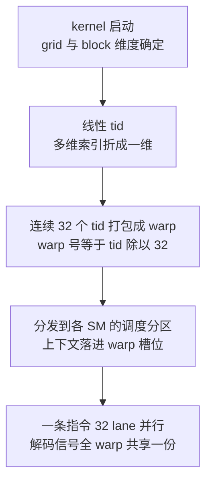
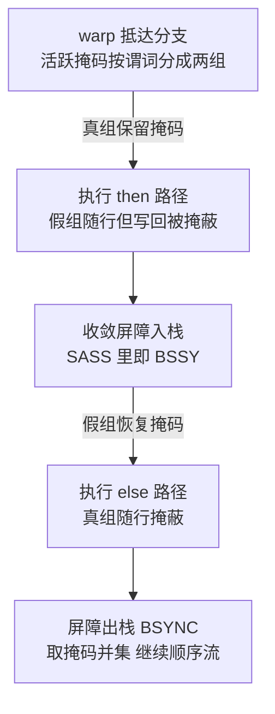
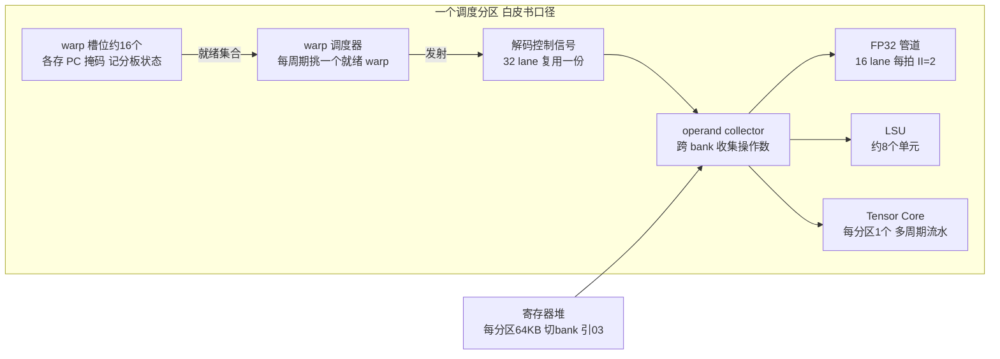
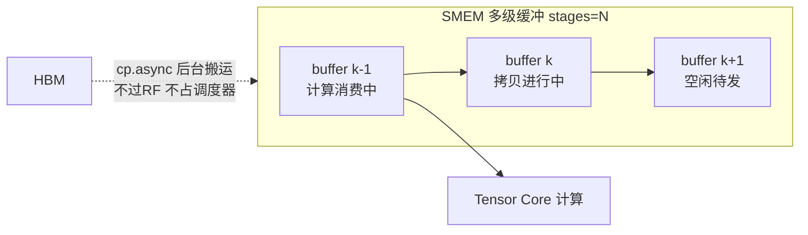

> **TL;DR**
>
> * **这是「给 AI 编译器工程师的芯片课」第六篇**。前五篇攒齐了全部积木：五段流水线与冒险（05）、FMA 算术树（04）、多端口寄存器堆与 operand collector（03）、SASS 解码（04）。本篇把它们组装成 GPU 的执行引擎——**warp 把 32 个线程捆成一个调度单位 → 每个调度分区每周期的全部工作就是“挑一个就绪 warp 发射” → operand collector 用 bank 化与 replay 喂饱 32 个 lane → Tensor Core 把一条 mma 展开成多周期宽阵列流水 → cp.async/TMA 把 load 从指令流里摘出去变成后台队列 → occupancy 三约束给交织深度封顶**。
> * **三个对编译器最值钱的结论**：1 divergence 的代价不是“慢一点”，而是两路**串行**执行的确定性惩罚——if-conversion 的判据就是两路代价之和与单路代价的比较，嵌套发散才是真正的乘法陷阱；2 喂饱 FP32 流水线只需 $\lceil 4/2\rceil=2$ 条独立链，喂饱 HBM 却要 $BW\times latency\approx 1$ MB 的在飞字节——前者 unroll 就够，后者必须靠 occupancy 或异步拷贝队列，Little 定律是两者之间的换算器；3 mma 的延迟与启动间隔之差比标量 FMA 放大了一个数量级，累加器拆分从优化技巧升级为跑满 Tensor Core 的前提；而 occupancy 的三条约束（寄存器、SMEM、warp slot）全是面积账——`__launch_bounds__`、`num_warps`、`num_stages` 都是在三块地皮之间搬租户。
> * **本篇动手实验**：纯 Python 手搓一个多 warp 交织调度模拟器和 occupancy 三约束计算器（无需任何硬件），再用 cuobjdump 认一认 SASS 里的 LDSM/LDGSTS 异步指令，用 ncu 读出 achieved occupancy 对照正文公式。

---

## 1. 从线程到 warp：SIMT 的打包术

### 1.1 launch 时刻：warp 是硬件的分法

第 01 篇把执行模型契约写成了 Layer 3 的一句话：“怎么并行”。GPU 的答案从 kernel 启动那一刻开始兑现：grid 与 block 的维度折算成全局线程号后，**硬件按连续 32 个线程打包成一个 warp**（warp 号 = tid ÷ 32，CUDA C Programming Guide 口径）——注意这个动作完全绕过编译器，你在 Triton 里写的 `num_warps` 只决定 block 里有多少个 warp，不决定谁跟谁一伙。打包之后：



一个 warp 在硬件里的全部家当是一份**程序计数器 PC、一份活跃掩码 active mask、一套记分板状态位**（每个 warp slot 一份，第 7 节算这笔面积账），外加 RF 里每线程私有的寄存器。前两件是 warp 级共享的——这正是 SIMT 名字的来源：**单指令流，多数据 lane**。第 04 篇埋过一句“解码功耗和面积被 SIMD 宽度摊薄 32 倍”，本篇补上另一半：摊薄的代价是 32 个 lane 从此被一根缰绳拴住，走哪条路径由掩码投票决定。

学术上存在另一种活法：让硬件在运行时把分歧的线程重新编组（Dynamic Warp Formation，[Fung et al., MICRO 2007](https://ieeexplore.ieee.org/document/4418589)）——但商用 GPU 至今没有这么做，分歧的处理方式是下面这套路由。

### 1.2 divergence：一根缰绳拴住的 32 条路径

warp 遇到分支时没有“两个 PC”可选。硬件的做法是**活跃掩码 + 收敛栈**：谓词为真的 lane 走 then 路，为假的 lane 掩码关闭、随队但不生效；然后交换掩码走 else 路；最后在收敛点汇合。这套机制在 SASS 里留下物证——`BSSY`（屏障入栈）与 `BSYNC`（出栈汇合）指令，第 04 篇 8.1 节那张反汇编表里它们已经露过面：



关键结论一句话：**divergence 不改变指令条数，改变的是执行顺序——两路串行，而不是并行选一路**。设 if/else 两路代码体各需 $c_{then}$、$c_{else}$ 个 warp 周期，比较三种编译方案：

$$T_{pred} = c_{then} + c_{else}, \qquad E[T_{br}] = (1-P_{div})\cdot c_{maj} + P_{div}\cdot(c_{then} + c_{else})$$

$$T_{pred} - E[T_{br}] = (1-P_{div})\,\big(c_{then}+c_{else}-c_{maj}\big) = (1-P_{div})\,\min(c_{then},c_{else}) \;\geq\; 0$$

**变量映射表**：

| 符号 | 含义 | 示例取值 | 维度/单位 |
|:---:|:---|:---|:---|
| $c_{then},\,c_{else}$ | 两路代码体的 warp 执行周期数 | 4 与 6（示意） | 周期 |
| $P_{div}$ | 单个 warp 发生分歧的概率 | 0 到 1 之间 | 无量纲 |
| $c_{maj}$ | 多数派路径的代价 | $\max(c_{then},c_{else})$ | 周期 |
| $T_{pred}$ | 谓词化方案（`@P0`）的恒定代价 | 两路之和 | 周期 |
| $E[T_{br}]$ | 分支方案的期望代价 | 随收敛概率变化 | 周期 |

推导只用了两步：全 warp 同侧时分支方案免费跳过另一路（省 $\min$）；分歧时两路串行（付全额）。于是**只要同侧概率大于零，分支方案的期望就不劣于谓词化**——这就是 ptxas 对短小 if 体用 `@P0` 谓词化、对大块代码保留分支加 `BSSY` 的启发式依据。真正危险的是嵌套：连续 $d$ 层都发散时最坏把 $2^d$ 条路径串起来（教学上界口径），乘法陷阱才是 divergence 分析 pass 要消灭的对象。

> 💡 **编译器关联**：三层。1 TVM/Triton 的 divergence 分析本质是在算上面的期望式——沿控制流树传播“warp 内谓词一致性”，一致则免串行；2 数据布局比控制流变换更治本：把按谓词分裂的数据排到不同 warp（如按 tile 重排线程映射），直接让 $P_{div}=0$；3 第 05 篇说过 CPU 用分支预测“赌”方向，SIMT 连赌都不用赌——掩码机制保证正确性，代价模型只剩串行时间，这是两种架构处理不确定性的哲学分野。

## 2. warp scheduler：用优先编码器替代乱序机器

### 2.1 分区结构：一台 SM 切成四台小发射机

Volta 白皮书首次公开了沿用至今的结构（Ampere 同构，[GA100 白皮书](https://images.nvidia.com/aem-dam/en-zz/Solutions/data-center/nvidia-ampere-architecture-whitepaper.pdf)口径）：每台 SM 切成 4 个**调度分区**（processing block），每分区自带一套完整的发射链路：



A100 每 SM 合计 64 FP32、64 INT32、32 FP64、4 个 Tensor Core、最多 64 个驻留 warp（2048 线程，compute capability 8.0 官方表），除以 4 正好是分区数——**每分区的世界很小：十几个 warp 槽位、每周期能发一条指令**。第 05 篇 §4.2 埋的那句“调度器只需要在每分区十几个就绪 warp 里挑一个”现在落地了。

调度器的日常是一个状态循环：


每个 warp 槽位的记分板是第 05 篇记分板的 warp 化版本：不再逐条指令跟踪 RAW/WAW，而是给整个 warp 挂一个“等待原因”（等操作数、等内存 long scoreboard、等 barrier）。SASS 控制码里的 wait barrier 字段（04 篇 8.2 节）就是它的软件可见投影——ptxas 提前告诉硬件“这条指令要等哪几个先前发射的批次”。

### 2.2 选择电路的复杂度账

从至多 $n$ 个就绪 warp 里挑一个，电路是教科书优先编码器：

$$D_{pe} \approx \lceil \log_2 n \rceil, \qquad G_{pe} = O(n)$$

**变量映射表**：

| 符号 | 含义 | 示例取值 | 维度/单位 |
|:---:|:---|:---|:---|
| $n$ | 每分区 warp 槽位数 | 64/4 = 16 | 个 |
| $D_{pe}$ | 优先编码器逻辑深度 | 4 级门 | 级 |
| $G_{pe}$ | 门数开销 | 线性于 $n$ | 门 |

对照第 05 篇 §4.2 的账单：CPU 乱序机器的唤醒-选择连线随窗口 $w$ 近似平方增长，几百条的窗口就要烧掉前端功耗大头；GPU 把窗口从“几百条指令”缩成“十几个 warp 表项”，选择电路线性、深度常数——**这就是“用 TLP 替换 ILP”在调度器电路上省出来的钱**。省下的部分换成了更多 SM 和更宽的 RF（03 篇的 256 KB 地皮）。代价也明码标价：硬件不会替你重排任何东西，**SASS 里的顺序就是最终时序**，编译器的指令调度从建议变成承诺（04 篇 8.2 节的落款在这里兑现）。

### 2.3 dual-issue：一次发两条的历史轮回

单发射意味着调度器每周期最多榨一条指令，若执行管道 II 大于 1 就有槽位闲置。dual-issue（同一周期发两条独立指令）因此成为显学，但它在这门课的主角们身上几进几出：

| 代际 | 发射能力 | 口径 |
|:---|:---|:---|
| Fermi | 每调度器可双发射 | 官方 tuning guide 公开宣传，实战难满速 |
| Kepler | 4 调度器 × 单发射 | 官方文档放弃双发射换取简单 |
| Volta~A100（GA100） | 4 分区 × 单发射 | 白皮书分区结构口径 |
| GA10x 消费卡 | 同槽位配对双发射 | 社区逆向口径，未验证（04 篇 8.2 物证） |

dual-issue 的真实收益不是吞吐翻倍，而是**往两条不同的管道里各塞一条**：FFMA 配 LDG、FMA 配 IMAD，让 FP32 阵列和 LSU 同周期都有活干。约束条件同样清楚：两条指令相互独立、操作数读取叠加在同一周期的 operand collector 上（下一节）、写回端口要仲裁。所以 ptxas 只在稳赚时配对，且这一切发生在 SASS 层——PTX 里看不到，cost model 若按 PTX 条数估资源占用会系统性偏差。

> 💡 **编译器关联**：LLVM `SchedMachineModel` 给每条指令建资源向量（哪个槽位占几拍），双发射目标上向量允许重叠才可能配对——Triton/TVM 生成的 PTX 经 ptxas 后是否配对属于灰色地带（04 篇“ISA 是契约、微架构是灰色地带”的又一实例），性能归因请对着 nvdisasm 的同槽显示做。

## 3. operand collector 在执行流中的表现

第 03 篇已经拆过电路：RF 切成 bank、operand collector 用交叉开关把各 bank 读出的字路由到正确的 lane、撞 bank 的请求自动推迟一拍重放（replay）。本篇不重复电路，补三笔**执行视角**的账。

第一笔，端口需求端。每分区每周期要喂饱一条 warp 指令：

$$\text{RF 读流量} = N_{src} \times W_{lane} \times 4\,\text{B} = 3 \times 32 \times 4 = 384\,\text{B/周期}$$

外加写回 128 B——这是 03 篇端口面积平方模型的“需求侧”数字。FFMA 的三个源里常有一个累加器可以与上一拍的写回合并，IMAD 地址算术又和 FFMA 抢同一套 collector：**某些指令组合被静默插入 replay，源头就是这里**（04 篇留的问题在此闭环）。

第二笔，冲突的表现形态。寄存器编号落到同一个 bank 组的两个源操作数会让 collector 排队——微基准实测过这类 replay 对特定寄存器编号组合的敏感性（[arXiv:1804.06826](https://arxiv.org/abs/1804.06826)，具体 bank 映射为社区逆向口径，未验证）。缓解手段是 ptxas 的两招：**寄存器重编号**（把热点源挪开冲突组合）和 **reuse cache**（SASS 控制码的 reuse 标志，见 04 篇——命中的源不再挤 RF bank）。

第三笔，和 SMEM bank conflict 对照着记，两者同根同源但可控性天差地别：

| 维度 | RF operand collector | SMEM bank（引 03） |
|:---|:---|:---|
| 服务对象 | 指令源/目操作数的隐式读取 | 显式 load/store 地址流 |
| 冲突判定 | 寄存器编号映射（逆向口径） | $\gcd(stride,32)$ 公式可静态算 |
| 硬件对策 | 自动 replay 一拍，软件不可见 | 读广播、写串行重放 |
| 编译器对策 | reuse 标志交给 ptxas；分配器避开 | padding/swizzle/layout pass 可控 |

> 💡 **编译器关联**：SMEM 冲突你能用 layout 消灭，RF 冲突只能靠 ptxas 代劳——所以 ncu 里看到 shared bank conflict 计数高，先改 layout；看到 issue stalled 计数高而无明显访存问题，怀疑 replay 与 dual-issue 配对失败，去读 SASS。

## 4. CUDA Core 的吞吐与延迟账

### 4.1 峰值公式的验算

第 01 篇给过算力分解公式，这里用它验一遍 A100 的官方 FP32 数字，顺带把“每周期多少个 FMA”落到实处：

$$P_{peak}^{FP32} = N_{SM} \times N_{FMA/SM/cycle} \times 2\,\text{FLOP/FMA} \times f = 108 \times 64 \times 2 \times 1.41\,\text{GHz} \approx 19.5\,\text{TFLOPS}$$

与 datasheet 完全吻合（boost 频率口径）。反过来读：**每 SM 每周期 64 次 FMA = 每分区 16 个 FP32 lane**，这就是分区图里那台“16 lane 阵列”。

### 4.2 II=2 与延迟隐藏的最小并发

一条 FFMA warp 指令覆盖 32 个 lane，而阵列每周期只收 16 个——fully pipelined 假设下（04/05 篇口径），启动间隔是：

$$II_{pipe} = \left\lceil \frac{W_{lane}}{L_{unit}} \right\rceil = \left\lceil \frac{32}{16} \right\rceil = 2\ \text{拍/条}$$

结合 FFMA 延迟约 4 拍（05 篇微基准口径），喂饱一个分区的 FP32 阵列需要的独立依赖链数为 $\lceil lat/II \rceil = 2$——**两条独立 FFMA 链就能让 ALU 满速**，这就是 05 篇累加器拆 4 份绰绰有余的原因（拆 2 份即达上限，多拆是为给 load 留填缝空间）。

访存侧完全是另一番天地。把 Little 定律（03 篇）从整片收缩到单 SM：

$$N_{inflight}^{SM} = BW_{share} \times L_{mem} = \frac{2.04\,\text{TB/s}}{108} \times 500\,\text{ns} \approx 9.5\,\text{KB}$$

**变量映射表**：

| 符号 | 含义 | 示例取值 | 维度/单位 |
|:---:|:---|:---|:---|
| $BW_{share}$ | 单 SM 分摊带宽 | 约 18.9 GB/s | 字节/秒 |
| $L_{mem}$ | HBM 往返延迟 | 约 500 ns（03 篇口径） | 秒 |
| $N_{inflight}^{SM}$ | 每 SM 必须的在飞字节 | 约 9.5 KB | 字节 |
| $II_{pipe}$ | FP32 管道启动间隔 | 2 | 拍 |

9.5 KB 折算成 LDG.E.128（每 warp 请求 512 B）约 19 个并发请求。驻留 warp 数决定谁来凑这 19 个：满 occupancy 时 64 个 warp 每个摊不到 1 条；但寄存器大户 kernel 只有 8 个 warp 时，**每条 warp 要同时挂着 2~3 个未完成 load**——这意味着深 unroll、多个基址指针、一堆活到消费时刻的目的寄存器。寄存器压力推高 $r_t$、$r_t$ 又压低驻留数：同步 load 路径的死结就在这里拧着，解法在第 6 节。

> 💡 **编译器关联**：cost model 里“ALU 满速”与“带宽满速”是两个量级的需求（2 条链 vs 约 19 个请求），autotuner 搜 unroll 深度时的收益拐点几乎总在后者——前者只是让 II 公式成立的地板，后者才是 Roofline 的天花板。

## 5. Tensor Core：一条指令里的整个阵列

### 5.1 mma：对外一条指令，对内一段流水

PTX 的 `mma.sync.aligned.m16n8k16`（sm_80 起的 FP16 形状，PTX ISA 官方口径）让一个 warp 的一条指令完成 $16\times8\times16$ 矩阵块的乘累加——**2048 个 MAC，4096 FLOP**。对照第 05 篇的标量流水，这不是量变：

| 维度 | 05 篇标量 FMA 流水 | Tensor Core mma 流水 |
|:---|:---|:---|
| 一条指令的计算量 | 32 MAC（warp 全体） | 2048 MAC |
| 执行单元 | 每分区 16 个 FP32 lane | 每 TC 内部宽阵列 + 自带缓冲 |
| 吞吐口径 | 每分区每拍 16 lane | 每 TC 每拍 512 FLOP（01 篇口径反推） |
| 单条占用 | $II=2$ 拍 | 约 8 拍/TC（4096 ÷ 512 折算，切分未公开，未验证） |
| 延迟 | 约 4 拍 | 十几拍量级（微基准口径，随形状与代际浮动） |
| 操作数来源 | RF 直供经 operand collector | fragment 寄存器 ← ldmatrix ← SMEM |
| 冒险主角 | load-use、bank conflict | fragment 布局错位、累加环 |

A100 的 SM 级吞吐账同样可以反推核对：312 TFLOPS ÷ 108 SM ÷ 1.41 GHz ≈ **每 SM 每周期 2048 FLOP**，恰是 CUDA Core（128 FLOP/SM/拍）的 16 倍——16 倍差距的全部来源是阵列宽度，频率一分钱没涨。04 篇说过的“低精度为什么又快又省”在这里再叠加一层：FP16 尾数减半让压缩树面积缩到四分之一，同样的硅面积塞进更宽的阵列。

### 5.2 喂数才是瓶颈：ldmatrix 与 swizzle

256 MAC/拍的 TC 若零复用地吃操作数，每拍要吞约 1 KB——RF 端口根本直供不起。TC 的解法是**分形复用**：一条 mma 内部，$K$ 维的每个输入元素被 $M\times N$ 方向反复使用，外部接口只需要把“fragment”（分布在 warp 32 组寄存器里的矩阵切片）备好。为此 ISA 专门配了装载原语 `ldmatrix`：一条指令让 warp 完成 8 行 128 bit 矩阵块的装载（可选转置），专为 fragment 形状设计（PTX ISA 口径）。

于是 tensorize 之后的数据通路长这样：


SMEM 到 ldmatrix 这一段是 layout pass 的主战场：fragment 要求的元素次序往往不是自然行主序，硬搬必撞 bank（03 篇 gcd 公式的现场），CUTLASS/CuTe 与 Triton 都会自动插入 XOR swizzle 把物理布局扭成无冲突形状（工业实践口径，详见 [CUTLASS 文档](https://github.com/NVIDIA/cutlass)）。**tensorize 不是“把循环换成 mma 指令”一行字，而是“SMEM 布局、ldmatrix 序列、mma 形状三者对齐”的一整套契约**——Target 描述里 Tensor Core 的 shape 参数（01 篇问过为什么是 16×8×16）就是这份契约的开票单位。

### 5.3 依赖环：05 篇故事的十六倍重演

mma 结果落在累加 fragment 上，连续的 $acc += A_k \times B_k$ 构成依赖环：环上的 II 被延迟钉住（十几拍），而流水线本可每约 8 拍收一条——利用率立刻减半。解法和 05 篇 §6.3 同构：**拆多份累加器**，对应 GEMM 里沿 $N$ 方向的多列输出（每列一份 acc fragment，互不相干）。区别只在常数放大：标量时代拆 2 份够用，Tensor Core 场景常拆 2~4 份以上，且每份 acc fragment 占据每线程多个寄存器（f32 累加的 m16n8 输出即 4 个/thread）——**寄存器地皮（03 篇）与 TC 吞吐在这里正面相撞**，这笔账在第 7 节合拢。

Hopper 把这条路走到了下一个台阶：wgmma 让 4 个 warp 成组协作、操作数可以直接从 SMEM 流入阵列（跳过 RF fragment，官方 Hopper 文档口径），异步化的终点是“指令流分家”——producer warp 只管搬数，consumer warps 只管算。伏笔留给第 6 节的队列机制。

> 💡 **编译器关联**：三条。1 cost model 里 mma 必须携带独立的延迟与吞吐参数，且数值远比标量 FMA 分离——LLVM NVPTX 后端与 Triton 的 AccMut 分析都在处理这条环；2 autotuner 搜 `block_m/block_n` 本质是在搜“拆几份累加器”与“寄存器还剩多少”的交点；3 tensorize 的合法性检查除了 shape 对齐，还要验证 SMEM swizzle 后的 bank 无冲突——否则理论 TFLOPS 全折在 replay 上。

## 6. cp.async 与 TMA：把 load 从指令流里摘出去

### 6.1 同步路径的三重代价

传统 GEMM 内层循环的搬数路径是 LDG → RF → STS → SMEM，三重代价逐项列出：

| 步骤 | 占用什么 | 代价 |
|:---|:---|:---|
| LDG 发射与等待 | warp 槽位挂起数百拍 | 调度槽浪费，需别的 warp 顶班 |
| 目的寄存器 | RF 地皮直到消费 | 推高 $r_t$ → 压低 occupancy（§7 死结） |
| STS 二次搬运 | 再一次发射 + RF 端口 + 可能 bank conflict | 纯开销 |

Ampere（sm_80）起给出硬件答案：`cp.async` 让全局内存数据**直达 SMEM，不过 RF、不占目的寄存器**（CUDA C Programming Guide 口径）。配套三个原语构成完整的异步语义（PTX ISA 官方定义）：`cp.async` 发拷贝（每线程 4/8/16 B 粒度）、`commit_group` 把已发批次打包成组、`wait_group N` 表示“放行到最多 N 组未完成为止”。SASS 里它叫 `LDGSTS`（社区口径，Lab 3 可自验）。

### 6.2 num_stages 的推导：Little 定律闭环

有了异步队列，“预取几级缓冲”就从玄学变成了公式。多级流水的工作方式：buffer k-1 在被计算消费时，buffer k 正在后台填充，buffer k+2 空着待发：



下界来自 Little 定律（03 篇埋的伏笔在此兑现）：要让 HBM 满速，每 SM 需要 $BW_{share}\times L_{mem}\approx 9.5$ KB 在飞；每级 buffer 装 $B_{stage}$ 字节的 K 切片，于是：

$$N_{stages} \geq 1 + \left\lceil \frac{BW_{share} \times L_{mem}}{B_{stage}} \right\rceil$$

**变量映射表**：

| 符号 | 含义 | 示例取值 | 维度/单位 |
|:---:|:---|:---|:---|
| $B_{stage}$ | 每级缓冲的字节数 | A/B 各 128×32 FP16 = 8 KB+8 KB = 16 KB | 字节 |
| $N_{stages}$ | 流水级数 | 下界 2，工程常取 3~4 | 级 |
| $+1$ | “正在被消费的那一级”不算预取 | -- | -- |

代入：$1+\lceil 9.5/16\rceil = 2$。工程上取 3~4，余量买的是延迟方差（HBM 行命中与否差一倍）与尾循环重叠。天花板则在另一头：164 KB 的 SMEM 除以每级 16 KB，级数封顶约 10——**下界来自带宽×延迟，上界来自 SRAM 面积，autotuner 搜 `num_stages` 就是在这个区间里找寄存器压力与 occupancy 的平衡点**。Triton 默认生成的 3~4 级、TVM software pipelining 的展开深度，都是这条公式的化身（观察口径，各家默认值随版本浮动）。

### 6.3 TMA：从“每人搬一点”到“一人描述整块”

Hopper（sm_90）把异步化推到底：**TMA（Tensor Memory Accelerator）用一张 tensormap 描述张量的形状/步长/box，单线程发出整块 bulk 拷贝**，完成后经 mbarrier 通知（官方 Hopper 文档口径）。对比 cp.async 的进步在三处：发射开销从“32 线程各发一条”降为“1 线程发一张单子”；边界越界由硬件按 map 自动处理；完成通知从轮询 wait_group 升级为屏障事件。配合 wgmma（5.3 节），producer/consumer warp 特化成为 Hopper kernel 的标准形态——occupancy 的算法也要随之区分“角色 warp”（以 CUTLASS Hopper pipeline 实现为准）。

> 💡 **编译器关联**：异步队列的本质是把“在飞”从 warp 身上解耦——同步世界里数据在飞的充要条件是某条 warp 活着等它，异步世界里 warp 可以睡觉甚至不存在，数据照样在路上。这一下同时松开了 §6.1 的三重代价：寄存器不用了（occupancy 松绑）、调度槽不占了（停顿消失）、二次搬运没了（带宽省一半）。编译器侧的新义务是生成正确的 commit/wait/mbarrier 序列并证明死锁自由——这是 ptxas 内建、Triton/CUTLASS 显式管理的一段新逻辑。

## 7. occupancy 三约束：交织深度的天花板

### 7.1 三块地皮上的最小值函数

“occupancy”定义为实际驻留 warp 数除以硬件上限。它能到多少，由三个约束取 min 决定：

$$W_{resident} = \min\Big(\underbrace{\Big\lfloor \tfrac{R_{SM}}{32\,r_t} \Big\rfloor}_{\text{寄存器}},\;\; \underbrace{\Big\lfloor \tfrac{C_{smem}}{s_b} \Big\rfloor \cdot \tfrac{T_b}{32}}_{\text{SMEM}},\;\; \underbrace{W_{slot}}_{\text{warp 槽}}\Big)$$

**变量映射表**：

| 符号 | 含义 | A100 取值 | 维度/单位 |
|:---:|:---|:---|:---|
| $R_{SM}$ | 每 SM 寄存器堆总量 | 65536 个 32 bit（256 KB，03 篇） | 个 |
| $r_t$ | 每线程寄存器数（ptxas 分配结果） | 8~255，架构上限 255 | 个/线程 |
| $C_{smem}$ | 每 SM 可配置 SMEM 上限 | 164 KB（03 篇口径） | 字节 |
| $s_b,\,T_b$ | 每 block 的 SMEM 用量 / 线程数 | 由 kernel 决定 | 字节、个 |
| $W_{slot}$ | 每 SM warp 槽位上限 | 64（CC 8.0 官方表） | 个 |

三个约束的**电路根源各是一座 SRAM**：寄存器约束来自多端口 RF 的面积平方模型（03 篇——每多一个 $r_t$ 都是实打实的 die 面积）；SMEM 约束来自 6T macro 的物理容量（02/03 篇）；warp 槽约束最少被人谈起，但最诚实——**每个槽位的 PC、活跃掩码、记分板状态都是分区上下文存储的一部分，64 这个数字本身就是面积决策**（01 篇让你查的 `max_threads_per_multi_processor=2048` 在这里兑现）。代入三种典型配置看瓶颈怎么切换：

| 配置（A100） | 寄存器上限 | SMEM 上限 | 槽位上限 | 实际驻留 | 瓶颈 |
|:---|:---:|:---:|:---:|:---:|:---|
| elementwise：$r_t$=32，$s_b$=8 KB，$T_b$=256 | 64 | 64 | 64 | 64（100%） | 撞满槽位 |
| 中型 GEMM：$r_t$=64，$s_b$=64 KB，$T_b$=256 | 32 | 16 | 64 | 16（25%） | SMEM |
| 深 unroll 大户：$r_t$=255，$s_b$=8 KB，$T_b$=256 | 8 | 64 | 64 | 8（12.5%） | 寄存器 |

### 7.2 跷跷板：occupancy 与 ILP 的兑换率

03 篇 §6.2 留过一个现象：“低 occupancy 但深流水”与“高 occupancy 浅流水”都能跑满带宽。本篇给出它的电路解释：Little 定律只约束乘积 $BW\times L$，凑在飞量的两条路——**更多 warp**（occupancy 路线，受三约束封顶）与**单 warp 更多未完成 load**（ILP 路线，受寄存器与 unroll 深度封顶）——可以互相兑换。异步拷贝之所以是范式转移，在于它把兑换率改写了：在飞数据搬进 SMEM 和队列表项记账，不再占用 RF 目的寄存器，同一个 $r_t$ 预算下 ILP 更便宜。

但要警惕反面：occupancy 高 ≠ 快。缓存局部性好的 kernel 刻意压低驻留数换更大的 L1/SMEM 份额（GEMM 常驻 25% occupancy 就是典型）；occupancy 只是延迟隐藏的必要条件，不是充分条件。**它是 autotuner 的坐标轴之一，不是优化目标本身**。

> 💡 **编译器关联**：四个旋钮对着三块地皮——`__launch_bounds__`/`-maxrregcount` 直接砍 $r_t$（必要时插 spill，03 篇警告过 spill 的价格）；`num_warps` 改变 block 的 warp 形态；tile 尺寸与 `num_stages` 分割 SMEM 地皮；TVN/TVM 的 thread binding 决定前三者怎么联动。第 10 篇会把它们装进 cost model 与 ncu 计数器的映射表。

## 8. 编译器启示汇总

把本篇十个硬件事实与对应的编译器决策钉在同一张表上：

| 硬件事实 | 电路根源 | 编译器决策 |
|:---|:---|:---|
| warp=32 定长打包 | 一份解码信号驱动 32 lane（04） | 向量化宽度对齐 32；tile 取 32 倍数 |
| divergence 两路串行 | 单 PC + 活跃掩码 + 收敛栈 | if-conversion 按 §1.2 期望式判；数据重排治本 |
| 调度器=优先编码器 | 就绪集 O(N)、深度 O(log N) | 别指望硬件兜底重排；SASS 序即最终时序 |
| dual-issue 受 RF 端口反制 | collector 每拍 384 B 读流量上限 | 资源向量按槽建模；配对交给 ptxas |
| FFMA II=2、延迟 4 | 每分区 16 lane 切两波 | 每分区 2 条独立链喂饱 ALU 即可 |
| HBM 要在飞约 1 MB | Little 定律（03） | 低 occupancy 必须补 MLP 或异步队列 |
| mma 一条 2048 MAC | TC 宽阵列 + K 维分形复用 | tensorize 原语化；shape 即 Target 契约 |
| 喂数靠 ldmatrix+swizzle | SMEM 单端口排队（03） | layout pass 以无冲突为目标形态 |
| cp.async/TMA 解耦“在飞” | 后台拷贝队列 + mbarrier | $N_{stages}\geq 1+\lceil BW\cdot L/B_{stage}\rceil$ |
| occupancy 三约束 | RF/SMEM/warp slot 三座 SRAM | 四旋钮联动的 autotuner 天花板 |

一句话收束：**GPU 执行引擎的全部设计都在回答同一个问题——“找并行”这件事，哪些交给电路（打包、掩码、replay、队列），哪些留给编译器（调度、布局、分级、旋钮）。warp 调度器把 CPU 的乱序机器换成一台优先编码器，省下的晶体管换成阵列宽度；而每一份转嫁给软件的责任，最终都变成 cost model 里的一行参数、layout pass 里的一条规则、autotuner 里的一根轴。**

## 9. 收官小结与局限

**带走四句话**：

1. warp 是 SIMT 的打包术：解码摊薄 32 倍的代价是 divergence 串行——分支方案期望不劣于谓词，嵌套发散的乘法陷阱才是分析 pass 的靶子。
2. 调度器是优先编码器而非乱序机器：每分区十几个槽位、每周期一条发射，SASS 顺序即最终时序；dual-issue 只在不同管道间配对时稳赚。
3. 两本吞吐账分开记：CUDA Core 每分区 2 条独立链即满速；Tensor Core 每 SM 每拍 2048 FLOP，但瓶颈在 fragment 喂数与累加环——05 篇的拆分教训放大十六倍重演。
4. cp.async/TMA 把“在飞”从 warp 身上解耦，`num_stages` 由 Little 定律定下界、被 SMEM 容量封顶；occupancy 是三座 SRAM 上的最小值函数——高不是目的，够掩盖延迟才是。

**本篇的局限**：调度器与 operand collector 的内部实现从未有 RTL 级官方公开（本文多处标未验证，量化细节依赖 [arXiv:1804.06826](https://arxiv.org/abs/1804.06826) 与 [arXiv:2208.11174](https://arxiv.org/abs/2208.11174) 的微基准实证）；GA10x 双发射与 RF bank 映射为社区逆向口径；HMMA 周期切分随形状与代际浮动，均以对应代际实测为准；Hopper 的 wgmma/thread block cluster 只点到为止，案例对比留待第 09 篇。展望：SIMT 的演进方向是越来越像“VLIW + DMA”——warp 特化、确定性队列、操作数旁路 RF——这与第 07 篇脉动阵列“让数据流动而不是指令流动”的哲学，正在远处汇合成同一个问题：**编译器要不要接管每一个节拍**。

## 动手实验(Lab)

读者可以自己跑以下三个小实验验证本篇观点（前两个不需要任何硬件）：

### Lab 1：纯 Python 手搓多 warp 交织调度模拟器

```python
# 环境:任意 Python3。单分区模型:LSU II=4 延迟60,FFMA II=2 延迟4,
# 每个 warp 循环执行 ldg->fma 依赖链。观察 warp 数如何掩盖延迟。
def run(n_warps, n_ops=16):
    LAT = {"ldg": 60, "fma": 4}
    II  = {"ldg": 4,  "fma": 2}
    free_at = {"ldg": 0, "fma": 0}          # 各管道下次可接受发射的时刻
    prog = {w: ["ldg", "fma"] * n_ops for w in range(n_warps)}
    ready = {w: 0 for w in range(n_warps)}  # 该 warp 下一条指令的就绪时刻
    t = 0
    while any(prog.values()):
        for w in sorted(prog):               # 轮转扫描:优先编码器的雏形
            if prog[w] and ready[w] <= t:
                op = prog[w].pop(0)
                start = max(t, free_at[op])  # 结构检查:管道空吗
                free_at[op] = start + II[op] # 占住 II 拍
                ready[w] = start + LAT[op]   # 依赖链:下一条要等数据
                break                        # 单发射:每周期最多一条
        t += 1
    return t

for nw in (1, 2, 4, 8):
    print(f"warps={nw}: 总周期={run(nw)}")
# 下界参考:32 条指令 x max(II)=128 拍(纯吞吐),warps=1 会拖到千拍量级。
# 观察 warps>=4 后逼近下界——这就是"用 TLP 掩盖延迟"。
# 再把 LAT['ldg'] 改成 500(HBM 口径):需要多少 warp 才能盖住?
# 答案对不上 64 个槽位时,就该想起第 6 节的异步队列了。
```

### Lab 2：occupancy 三约束计算器

```python
# 环境:任意 Python3。输入 kernel 属性,输出三约束谁说了算(A100 常数)。
def occupancy(regs_per_thread, smem_per_block, threads_per_block,
              R=65536, S=164 * 1024, W=64):
    lim_reg  = R // (regs_per_thread * 32)                     # 寄存器能养多少 warp
    blocks   = min(S // smem_per_block, 2048 // threads_per_block)
    lim_smem = blocks * (threads_per_block // 32)              # SMEM 能养多少 warp
    actual   = min(lim_reg, lim_smem, W)
    who = [name for name, v in (("寄存器", lim_reg), ("SMEM", lim_smem),
                                ("槽位", W)) if v == actual]
    print(f"r_t={regs_per_thread:>3} s_b={smem_per_block//1024:>2}KB "
          f"-> {actual:>2}/{W} warps ({actual/W:>4.0%}) 瓶颈:{'/'.join(who)}")

occupancy(32, 8 * 1024, 256)     # elementwise: 槽位顶格 100%
occupancy(64, 64 * 1024, 256)    # 中型 GEMM: SMEM 说了算 25%
occupancy(255, 8 * 1024, 256)    # 深 unroll 大户: 寄存器说了算 12.5%
# 对照正文 7.1 节数值表;再用官方 API 双验:
# cudaOccupancyMaxActiveBlocksPerMultiprocessor(...)
```

### Lab 3：用 cuobjdump 和 ncu 对照真实硬件

```bash
# 环境:NVIDIA GPU + CUDA toolkit(ncu 与 cuobjdump)
# 1) 编译器真的发了异步拷贝与矩阵装载吗?认一认 SASS 指令名:
nvcc -arch=sm_80 -cubin gemm.cu -o gemm.cubin
cuobjdump -sass gemm.cubin | grep -E 'HMMA|LDSM|LDGSTS'
# HMMA 即 mma,LDSM 即 ldmatrix,LDGSTS 即 cp.async(社区口径)。
# 2) 驻留度与发射率:三约束公式算出的上限 vs 实测 achieved occupancy:
ncu --metrics sm__warps_active.avg.pct_of_peak_sustained_active,smsp__issue_active.avg.pct_of_peak_sustained_active python bench.py
# 计数器名称随架构与 ncu 版本浮动,以本地 --query-metrics 为准。
# 对照 Lab 2:实测值低于公式值时,检查 spill 与 tail effect。
```

## 参考文献

| 主题 | 链接 |
|:---|:---|
| Lindholm et al., "NVIDIA Tesla: A Unified Graphics and Computing Architecture"（IEEE Micro 2008，SIMT/warp scheduler 的官方奠基论文） | 可搜标题获取 |
| CUDA C++ Programming Guide（warp=32、compute capability 表、cp.async 语义官方出处） | <https://docs.nvidia.com/cuda/cuda-c-programming-guide/> |
| PTX ISA 文档（mma/ldmatrix/cp.async/commit_group/wait_group/mbarrier 语义权威出处） | <https://docs.nvidia.com/cuda/parallel-thread-execution/> |
| NVIDIA Ampere GA100 白皮书（SM 4 分区结构、Tensor Core 吞吐口径） | <https://images.nvidia.com/aem-dam/en-zz/Solutions/data-center/nvidia-ampere-architecture-whitepaper.pdf> |
| NVIDIA H100 产品页/白皮书（TMA、wgmma、thread block cluster 口径） | <https://www.nvidia.com/en-us/data-center/h100/> |
| Dissecting the NVIDIA Volta GPU Architecture via Microbenchmarking（调度器/replay/HMMA 微基准实证） | [arXiv:1804.06826](https://arxiv.org/abs/1804.06826) |
| Demystifying the Nvidia Ampere Architecture（Ampere 微基准与延迟口径） | [arXiv:2208.11174](https://arxiv.org/abs/2208.11174) |
| Fung et al., "Dynamic Warp Formation and Scheduling for Efficient GPU Control Flow"（MICRO'07，运行时重编组的学术路线，商用未采用） | 可搜标题获取 |
| FlashAttention（IO-aware 融合在真实执行引擎上的收益样本） | [arXiv:2205.14135](https://arxiv.org/abs/2205.14135) |
| CUTLASS 文档与源码（async pipeline/swizzle/warp specialization 的工业实践事实标准） | <https://github.com/NVIDIA/cutlass> |
| CUDA Best Practices Guide（occupancy 官方建议与计算工具） | <https://docs.nvidia.com/cuda/cuda-c-best-practices-guide/index.html> |
| AI and Memory Wall（带宽-延迟鸿沟的量化背景，呼应 Little 定律账） | [arXiv:2406.01828](https://arxiv.org/abs/2406.01828) |
| 中文社区解读 | 知乎站内搜「warp 调度」「Tensor Core HMMA」「cp.async double buffer」「LDGSTS」有多篇图解文章（质量参差，建议对照本文公式阅读） |

> 下一篇：[《数据流架构：脉动阵列、TPU 与 NPU》](07_systolic_dataflow.md)——SIMT 用一千个 warp 抢同一套流水线，脉动阵列干脆不让数据等人：TPU 的 256×256 阵列如何让乘积像波浪一样流过去，权重固定/输出固定数据流的差别，以及确定性执行把编译器推向“排布每个周期”的极端。
