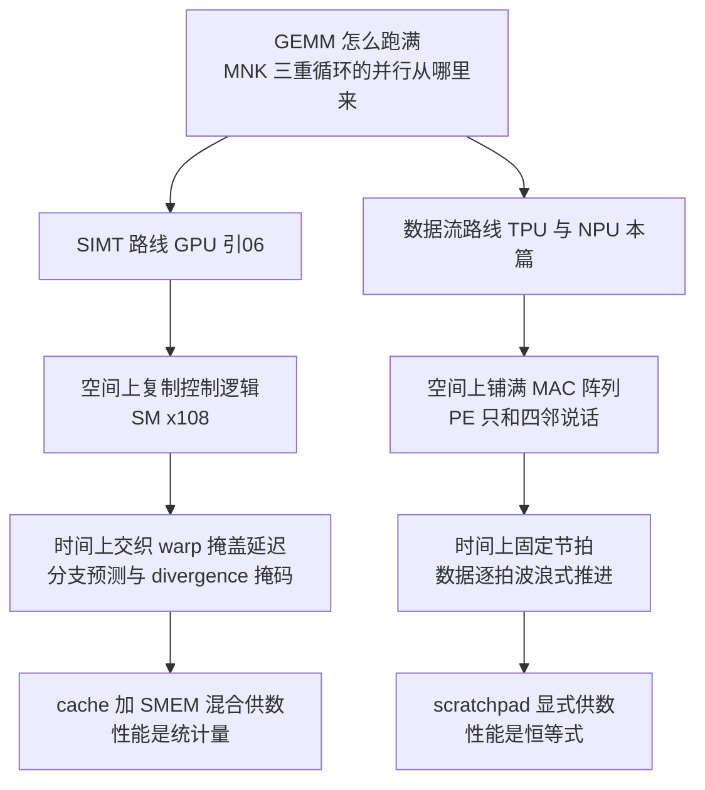
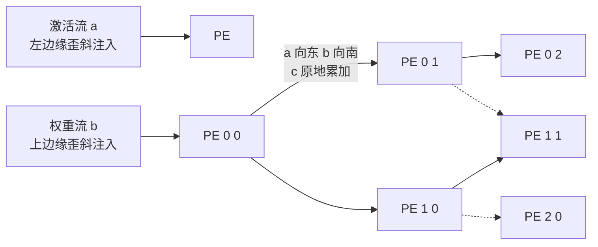
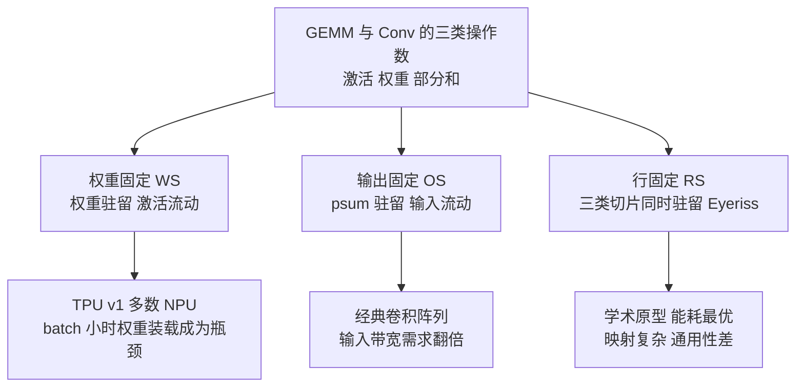
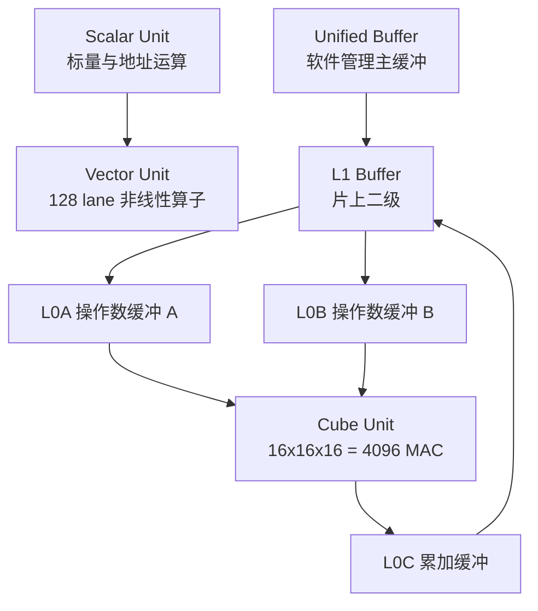
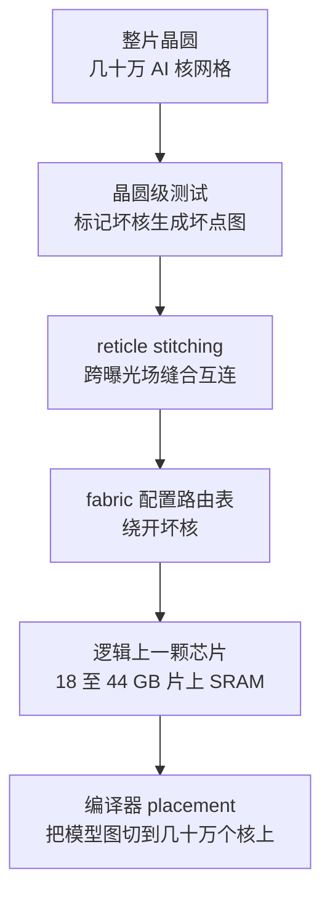

> **TL;DR**
>
> * **这是「给 AI 编译器工程师的芯片课」第七篇**。前六篇的主角都是“指令流”机器——CPU 用乱序窗口重排指令（05），GPU 用一千个 warp 抢同一套流水线（06）。本篇换成另一条路线：**让指令退居节拍器，让数据像心脏泵血一样波浪式流过计算阵列**。主线一句话——**脉动阵列把“复用”从 cache 的概率游戏变成导线上的确定连接 → 256×256 这个形状是带宽、良率、张量形状三条曲线的交点 → 权重固定/输出固定/行固定的数据流之争决定哪个操作数驻留在 PE 里 → 昇腾 3D Cube 把矩阵块压成立方体指令 → scratchpad＋确定性执行让性能从统计量变成恒等式 → Groq 与 Cerebras 把这条路线的逻辑推向两个极端**。
> * **三个对编译器最值钱的结论**：1 脉动阵列的内部算术强度随边长线性增长——每拍 $O(n)$ 个数进边界、$O(n^2)$ 次乘加在阵列里发生，这是“面积换带宽”的极致形态；但代价是 tile 形状被钉死在阵列边上，batch=1 的 decode 在 256×256 阵列上利用率不足 0.4%，continuous batching 不是服务层玄学而是阵列几何的直接后果；2 数据流风格（权重固定/输出固定/行固定）不是学术分类游戏，它是 Target 契约的一部分——GPU 上 swizzle 还有得挑，权重固定阵列上 layout 只有“对齐/不对齐”两种命运；3 scratchpad＋确定性执行消灭了 cost model 里全部的期望与方差——AMAT 变常数、执行时间变恒等式，编译器从“赌性能”升级为“证明性能”，代价是动态 shape 与分支表达力的崩塌。
> * **本篇动手实验**：纯 Python 手搓一个脉动阵列波前模拟器和一个 MXU 利用率计算器（无需任何硬件），再写一个数据流搬运量对比脚本，最后用 JAX 的 XLA dump 认一认编译器如何围绕这些硬约束做出 layout 决策。

---

## 1. 从 SIMT 到数据流：另一种回答“怎么并行”

第 01 篇的四层契约里，Layer 3 问的是同一个问题：“怎么并行”。第 06 篇给出了 GPU 的答案：**空间上复制控制逻辑**（108 个 SM）、**时间上交织 warp** 掩盖延迟，并行度是运行时的属性——调度器每拍重新挑人。本篇给出另一条路线的答案，它把两个维度恰好对调：**空间上铺满 MAC 阵列、时间上排出固定节拍**。指令流退化成节拍器（TPU v1 全部指令只有 12 条），数据沿着 PE 之间的短导线逐拍移动——延迟不需要“藏”，因为它被写进了时刻表。



两条哲学的对偶可以钉成一张表：

| 维度 | SIMT（06 篇） | 脉动/数据流（本篇） |
|:---|:---|:---|
| 并行的来源 | 千级 warp 抢一套流水线 | 十万级 PE 各自原地重复一件事 |
| 延迟的处理 | 运行时切换 warp 掩盖 | 编译期排进时刻表 |
| 控制流的代价 | divergence 两路串行 | 几条指令循环播放，几乎无分支 |
| 存储哲学 | 多级 cache ＋ SMEM 混合 | 大块 scratchpad，基本无 cache |
| 性能的可复现性 | 统计量（受交织与命中率影响） | 恒等式（同输入同输出同周期） |
| 编译器的重心 | tiling ＋线程映射＋occupancy | 形状对齐＋layout＋全量排程 |

> 💡 **编译器关联**：这张表就是 01 篇“调度责任轴”的右半段展开。CPU 硬件自己调度（编译器轻松、性能不可预测）；GPU 半推半就（SASS 序即最终时序，但 warp 交织仍由硬件仲裁）；Groq 一类确定性机器干脆把每一拍都交给编译器（性能完全确定、编译器极重）。**AI 编译器的复杂度，本质上是调度责任从硬件转移到软件的代价**——本篇的任务是把这条轴右端的物理地基挖开。

## 2. 脉动阵列：让数据流动而不是让指令流动

### 2.1 出发点：复用不该靠猜

第 03 篇算过 GEMM 的算法下限：$2n^3$ FLOPs 对 $6n^2$ 字节，算术强度 $n/3$ FLOPs/byte——每个输入字节天生值得被复用几十上百次。问题是**谁来保证复用真的发生**：

* CPU/GPU 的答案是 cache：赌局部性，赌对了白赚，赌错了付缺失（03 篇 AMAT 公式的期望思维）；
* 脉动阵列的答案是结构：**把复用直接焊进 PE 之间的连线里，“赌错”这个选项不存在**。

“脉动”（systolic）一词来自心脏泵血：数据被泵入阵列后，在相邻单元之间有节奏地流动，每经过一个单元就被利用一次（Kung & Leiserson，1978 年原始文献口径）。它的三条设计铁律：

1. **PE 只和四邻说话**——没有全局总线，导线长度与阵列规模无关，时钟频率不被布线拖垮；
2. **每个 PE 只做一件小事**——一次乘加加几个寄存器，控制开销被几万个副本摊薄到近零；
3. **数据按时钟节拍同步推进**——相邻 PE 之间隔一级流水寄存器（02 篇的 D 触发器），波浪以每拍一格的速度传播。

### 2.2 波前推导：一张时空表看懂脉动

以 $n\times n$ 阵列计算两个 $n\times n$ 矩阵相乘为例（输出固定形态）：每个 PE 驻留一个累加器 $c_{ij}$；激活 $a_{ik}$ 从左边缘流入向东走，权重 $b_{kj}$ 从上边缘流入向南走。为了让 $a_{ik}$ 与 $b_{kj}$ 恰好在同一拍抵达同一个 PE，输入按对角线歪斜注入——第 $i$ 行的第 $k$ 个激活推迟 $i$ 拍进场，第 $j$ 列的第 $k$ 个权重推迟 $j$ 拍进场。于是第 $(i,j)$ 号 PE 处理第 $k$ 项乘加的时刻是：

$$t(i,\,j,\,k) \;=\; i + j + k$$

**变量映射表**：

| 符号 | 含义 | 示例取值 | 维度/单位 |
|:---:|:---|:---|:---|
| $n$ | 阵列边长 | 教学取 4；TPU v1 为 256 | 个 |
| $i,\ j$ | PE 的行列坐标 | 0 到 $n-1$ | 无量纲 |
| $k$ | 归约维下标 | 0 到 $n-1$ | 无量纲 |
| $t(i,j,k)$ | 该项乘加发生的拍号 | 见下方首拍矩阵 | 拍 |

同一时刻开始工作的 PE 恰好构成一条反对角线——这就是**波前（wavefront）**，以每拍一格的速度扫过阵列。$n=4$ 时每个 PE 的首拍号排成一张表：

| PE(i,j) ↓ / 首拍 → | j=0 | j=1 | j=2 | j=3 |
|:--|:--:|:--:|:--:|:--:|
| i=0 | 0 | 1 | 2 | 3 |
| i=1 | 1 | 2 | 3 | 4 |
| i=2 | 2 | 3 | 4 | 5 |
| i=3 | 3 | 4 | 5 | 6 |

沿反对角线读这张表：0 号拍只有 (0,0) 在干活，3 号拍四条对角线同时满载——填充完成；6 号拍之后进入对称的排空。整个 tile 的总时长由三段构成：

$$T_{tile} = \underbrace{(n-1)}_{\text{填充}} + \underbrace{K}_{\text{稳态}} + \underbrace{(n-1)}_{\text{排空}} = K + 2n - 2$$

**变量映射表**：

| 符号 | 含义 | 示例取值（$n{=}4,\ K{=}4$） | 维度/单位 |
|:---:|:---|:---|:---|
| $T_{tile}$ | 一个 tile 的总周期 | 10 | 拍 |
| $K/(K+2n-2)$ | 阵列利用率上限 | 4/10 = 40% | 无量纲 |
| 理想周期 $n^3/n^2=n$ | 若零开销应只要 4 拍 | 差距即填充税 | 拍 |

两个直接推论。其一，**单发利用率只有约三分之一**（大 K 时趋近 $K/(K+2n)$）——所以脉动阵列必须连续喂问题：上一个问题的排空与新问题的填充在硬件里重叠，稳态下每个 PE 每拍都在干活，利用率逼近 100%。其二，**边界流量账**：稳态每拍从左边缘进 $n$ 个激活、上边缘进 $n$ 个权重，阵列内发生 $n^2$ 次乘加——供数 $O(n)$、计算 $O(n^2)$，每个进入阵列的字节被 $n$ 个 PE 先后使用。**阵列边长就是复用次数，这就是脉动结构绕开内存墙的第一性解释**。



> 💡 **编译器关联**：波前的方向就是 layout 的方向。激活沿行流入意味着 A 必须按行主序供给，B 按列主序——如果权重矩阵天然是转置存放的（比如训练里的 $\partial L/\partial W$），要么在片上做一次显式 transpose pass，要么维护双份布局。GPU 上这是 swizzle 可调的小事，脉动阵列上是“能跑”与“不能跑”的区别。

### 2.3 TPU v1：256×256 是怎么算出来的

先摆事实。[TPU v1 论文](https://arxiv.org/abs/1704.04760)（ISCA'17 口径）给出的核心规格：

| 参数 | 数值 | 备注 |
|:---|:---|:---|
| MAC 阵列 | 256×256 = 65,536 个 INT8 MAC | die 上最大的单一单元（floorplan 口径） |
| 主频 / 峰值 | 700 MHz / 92 TOPS（INT8） | 65,536 × 2 × 700 MHz |
| 统一缓冲 | 24 MiB 片上 SRAM | 软件管理的 scratchpad，非 cache |
| 累加器 | 4 MiB（4,096 行 × 32 bit） | 与缓冲分开的专用 SRAM |
| 片外内存 | 8 GiB DDR3，约 34 GB/s | 供数靠缓冲蓄水，见下文推导 |
| 制程 / die / 功耗 | 28 nm / 约 306 mm² / 约 75 W | 2015 年设计定点的时代背景 |
| 指令集 | 12 条 CISC 指令 | 读内存、读权重、乘加、激活、写内存等五类动作 |

为什么偏偏是 256×256？官方论文没有给出完整的设计推导，下面是工程界的共识性反推（教学口径），四条约束各卡一头：

**约束一：带宽下限——阵列必须自带算术强度放大器。** 92 TOPS 若直接从 34 GB/s 的 DDR 进料，需要算术强度 $92\times10^{12}/34\times10^{9}\approx 2700$ FLOP/byte——没有任何算子做得到（03 篇 Roofline 直接判死刑）。解法是把复用搬进结构：权重驻留后每拍只需约 256 字节激活，却产出 131,072 次 FLOP——**阵列内部等效强度 512 FLOP/byte，DDR 缺口由 24 MiB 统一缓冲垫平**（tile 一次、反复喂）。边长翻一倍，放大倍数跟着翻倍。

**约束二：面积上限——MAC 数量随边长平方涨。** 65,536 个 PE（每个含一只 INT8 乘法器和局部累加入口，04 篇 Booth/Wallace 树的最小配置）加上 28 MiB SRAM，已经吃掉 306 mm² die 的大头。边长翻倍等于四倍 PE，良率（02 篇 §8.1 的缺陷密度公式）立刻恶化。

**约束三：填充税下限——小矩阵的悬崖。** 波前要 $2(n-1)$ 拍才能填满又排空（§2.2），推理侧全是小矩阵，边长越大这笔固定开销越疼。256 是“训练大矩阵吃得饱、推理小矩阵不至于全空转”的折中点。

**约束四：张量形状匹配。** 主流网络的隐藏维普遍是 256 的整数倍（768、1024、3072、4096……都是 2 的幂或其倍数），方形阵列让 M/N 两侧供数对称，tile 切分几乎零 padding 浪费。**契约一旦定点，整个软件生态就围着它生长——这也是六代 TPU 到 B200 时代各家 MXU 边长几乎不动的原因**。

把利用率写成公式，就能看到这条契约对编译器的真实约束力。M×N×K 的 GEMM 铺到 256×256 阵列上：

$$U(M,N) = \frac{M \times N}{\lceil M/256\rceil \times \lceil N/256\rceil \times 256^2}, \qquad T \approx \left\lceil \frac{M}{256}\right\rceil\left\lceil \frac{N}{256}\right\rceil K + 2\times 256$$

**变量映射表**：

| 符号 | 含义 | 示例取值 | 维度/单位 |
|:---:|:---|:---|:---|
| $M$ | 输出行数（batch×seq 或 batch） | 1 到数千 | 行 |
| $N$ | 输出列数（隐藏维） | 典型 4096 | 列 |
| $K$ | 归约维 | 典型 4096 | 个 |
| $U$ | MXU 利用率 | 见下表 | 无量纲 |
| $T$ | 总周期（教学近似，忽略权重装载重叠） | -- | 拍 |

代入三组典型 shape（N=K=4096，示意计算）：

| 场景 | M | 利用率 U | 结论 |
|:---|:---:|:---:|:---|
| decode 单请求 GEMV | 1 | ≈0.39% | 六万个 PE 只有一行在干活 |
| decode batch=64 | 64 | 25% | 连续 batching 把利用率拉回来 |
| prefill 长 chunk | 2048 | ≈100% | tile 完美对齐，满速 |

> 💡 **编译器关联**：这张表解释了两件行业大事。其一，**continuous batching／speculative decoding 不是服务层技巧，是阵列几何的直接后果**——decode 的 M 维太小，唯一出路是把多个请求拼成一行送进阵列；其二，**XLA 对 TPU 的 layout/padding 决策必须以 128/256 为粒度**，shape 不对齐时的 padding 开销会直接吃掉理论算力，cost model 里必须显式建模这个量化效应。第 09 篇案例研究还会回到这张表。

## 3. 三种数据流风格：谁驻留、谁搬家

脉动阵列只回答了“数据怎么流动”，还有一个更上游的问题：**三类操作数（输入激活、权重、输出部分和）中，哪一类驻留在计算单元附近不动，哪两类在搬运**？这就是数据流（dataflow）分类学，出处是 Sze 等人的教科书体系与 Eyeriss 论文的能耗分析框架（ISCA'16/JSSC'17 口径）。三种主流风格：

**权重固定（Weight Stationary，WS）**：权重驻留在 PE 或紧邻缓冲里，激活流入、部分和流出。最大化权重复用——适合 FC/GEMM 这类权重被大量激活共享的层，TPU v1 是代表。软肋：batch=1 时每个权重只用一次就要换下一批，驻留红利瞬间清零，权重装载反而成了关键路径。

**输出固定（Output Stationary，OS）**：部分和驻留在本地累加器里不动，两路输入轮流流过。彻底消灭部分和的搬运——适合归约维 K 很长、部分和写回昂贵的场景，经典二维卷积阵列和 TPU 累加器的分层思想都属于这一系。软肋：两路输入都要反复供给，输入带宽需求翻倍。

**行固定（Row Stationary，RS）**：Eyeriss 提出的精细折中——一个 PE 同时驻留一行滤波器系数、一行激活切片和对角线方向的部分和，三类数据的复用在同一时间发生，卷积滑窗的局部性被吃到极致。代价是映射复杂、近邻布线开销大，且这套精心设计的几何对非卷积负载会退化。Eyeriss 论文实测：相对无数据流优化的基线，数据移动能耗降低了一个数量级以上（具体倍数以原文为准）。

| 维度 | 权重固定 WS | 输出固定 OS | 行固定 RS |
|:---|:---|:---|:---|
| 驻留者 | 权重 | 输出部分和 | 三类切片同时驻留 |
| 流动者 | 激活入、psum 出 | 两路输入 | 少量中间结果沿近邻传递 |
| 最大复用对象 | 权重 | 部分和（免写回） | 三者兼顾 |
| 典型瓶颈 | batch 小时权重复用崩塌 | 输入带宽压力最大 | 映射复杂度与通用性 |
| 代表硬件 | TPU v1、多数 NPU | 经典卷积阵列 | Eyeriss（学术原型） |
| 编译器的关键路径 | 权重装载调度 | 输入预取深度 | layout 映射本身即算法 |

为什么业界愿意为一个“驻留位置”的选择较劲到论文级？答案还是能量。45 nm 工艺的经验数字（Horowitz ISSCC'14 口径，量级参考）：一次 DRAM 访问的能耗约是一次 FP32 乘法的一两百倍，一次片上 SRAM 读约等于几次乘法。**数据流优化的本质，是把每一次操作数的移动压到尽可能低的存储层级**——WS 把权重钉在最底层，OS 把 psum 钉在最底层，RS 干脆让三类数据都不出近邻连线。



> 💡 **编译器关联**：三层。1 **dataflow 是 Target 描述的一部分，不是可选项**——GPU 上 swizzle/layout 还有挑选余地（06 篇），权重固定阵列上 layout 只有“对齐/不对齐”两种命运，MLIR 的 lowering spec 第一步就是把目标 dataflow 写进去；2 buffer 分配策略跟着 dataflow 走：WS 要给权重装载留双缓冲（呼应 06 篇 `num_stages`），OS 要给累加器留整块地皮；3 不同厂商工具链的差异根源在此：XLA 围绕 TPU 的 WS 契约生长，昇腾 CANN 围绕 cube 契约生长（§4），换一家芯片等于换一套 layout 规则——这就是“编译器可移植性”的真实成本所在。

## 4. 3D Cube：昇腾 DaVinci 的第三条路

二维脉动阵列把 K 维循环在时间里展开成一个波浪。华为昇腾的 DaVinci 架构问了一句：能不能把 K 维也搬进空间？于是矩阵块变成了立方体——**Cube Unit 用一条指令完成一个 16×16×16 立方体的乘加**（v1/v2 代口径，4096 次 FP16 MAC；后续代际形状有变，以华为官方文档为准）。

DaVinci AI Core 的分工是三层单元＋多级缓冲：

* **Scalar Unit**：标量运算与地址计算，相当于传统 CPU 的整数部件；
* **Vector Unit**：128 lane 的向量运算，负责 softmax、LayerNorm 这类非线性/归约算子；
* **Cube Unit**：立方体矩阵引擎，只干矩阵乘这一件事；
* 存储层次 **L0A/L0B（cube 操作数缓冲）→ L0C（累加结果）→ L1 → Unified Buffer → L2/HBM**，全程软件管理，没有硬件 cache——scratchpad 家族的忠实成员。



cube 指令的操作数要求按 **16×16 分形块（fractal，Z 字形扫描）** 排布——这个术语是不是很眼熟？它与第 06 篇 Tensor Core 的 fragment 契约完全同构：硬件规定“我吃的矩阵块长什么样、元素按什么次序摆放”，编译器的 layout pass 负责把张量扭成这个形状，swizzle/分形布局就是两家各自的开票单位。区别只在粒度：Tensor Core 的 mma 吃 $16\times8\times16$，DaVinci 的 cube 吃 $16\times16\times16$，MXU 则干脆藏在一个 256×256 的整体波后面——三种粒度对应三种 ISA 抽象层级。

| 维度 | NVIDIA Tensor Core（06 篇） | TPU MXU（本篇 §2） | 昇腾 Cube（本节） |
|:---|:---|:---|:---|
| 空间形态 | 每 SM 内宽阵列流水 | 整芯一片二维波前 | 粗粒度三维立方 |
| 一条指令的计算量 | 2048 MAC（m16n8k16） | 65,536 MAC/拍（整阵持续） | 4096 MAC（FP16 口径） |
| 累加发生地 | fragment 寄存器 | 专用累加器 SRAM | L0C 专用缓冲 |
| ISA 抽象层级 | warp 级指令，细节半透明 | 五类 CISC，细节全隐藏 | tensor 级指令，布局全暴露 |
| 编译器原语 | tensorize ＋ ldmatrix/swizzle | XLA layout ＋ padding | tensorize ＋ fractal 布局 pass |

> 💡 **编译器关联**：DaVinci 把布局义务最彻底地暴露给了软件——CANN/TBE 工具链的调度原语（分形布局、L0→L1→UB 的显式搬运、cube/vector 双引擎切分）本质上是一份“手写的 schedule 契约”；昇腾 C 编程模型则把它包装成流水线 stage 抽象。给这类目标写编译器时，**shape 合法性检查的第一条就是维度对齐 16 的倍数**，padding 策略与 TPU 的 256 对齐同理但粒度不同。第 09 篇案例研究会把三家工具链并排比较。

## 5. Scratchpad 与 Cache：确定性的价格标签

第 03 篇讲 SMEM 时留了一句话：“cache 由硬件决定数据放哪，SMEM 由软件显式决定。” 本篇把它推到整机尺度：TPU v1 的 24 MiB 统一缓冲、昇腾的 Unified Buffer、Groq 的全片 SRAM——**DSA 阵营集体选择了 scratchpad，并且顺手扔掉了 cache、分支预测和乱序机制**。TPU v1 论文把这列为明确的设计决策：省下的控制逻辑面积全部换成 MAC 和缓冲，而且确定性执行简化了性能分析与调试（ISCA'17 论文讨论节口径）。

凭什么敢扔？因为 DNN 的访存模式是编译器完全可知的：形状静态、访问稠密规则、复用关系在图 IR 里写得明明白白。cache 解决的问题是“运行时才知道谁会被复用”——而这个问题对 DNN 根本不存在。于是 tag 阵列、替换状态机、预取器全是纯开销。用 03 篇的 AMAT 公式说清楚这件事：

$$AMAT_{cache} = T_{hit} + R_{miss}\times T_{miss}\quad(\text{随机变量，方差}\neq 0) \qquad vs.\qquad T_{scratchpad} = \text{常数}$$

cache 给你的是**期望值**，scratchpad 给你的是**常数**。差别的威力不在均值，在方差：方差为零意味着 DMA、计算、写回可以被排成一串严丝合缝的时间表——这正是 §6 确定性执行的物质基础。反过来，确定性也是一把刀：动态 shape、指针追逐、递归数据结构这些访存模式不可预测的负载，scratchpad 一概伺候不了。**这就是 DSA 的能力边界：它只服务编译器看得懂访存模式的程序**。

| 维度 | Cache（03 篇） | Scratchpad（本篇） |
|:---|:---|:---|
| 数据放哪 | 硬件 tag 匹配＋替换策略 | 编译器静态规划 |
| 访问延迟 | AMAT 期望式，受缺失率波动 | 固定常数，零方差 |
| 面积开销 | tag/比较器/替换状态机 | 全部给数据本体 |
| 软件义务 | 几乎为零 | 生命周期分析＋DMA 排程全包 |
| 适用负载 | 访存模式不可预测的通用代码 | DNN 这类可预测负载 |

> 💡 **编译器关联**：扔掉 cache 不是甩锅，是换债主——硬件不管了，软件全包。这份债务清单包括：buffer 生命周期分析（live range 计算）、静态内存规划（区间着色/装箱，XLA 的 BufferAssigner、TVM 的 storage_rewrite、MLIR 的 bufferization 都是它的实现）、double/multi-buffer DMA 调度（06 篇 `num_stages` 的显式版）。好处也明码标价：cost model 里不再有命中率假设，每一个字节的地址和到达时刻都编译期已知——性能模型第一次有机会做到“精确”。

## 6. Groq：时序决定论与编译器的终极接管

05 篇 §7 埋过一个伏笔：“Groq 一类确定性架构干脆把‘编译器排出每一个周期’推到极致。” 现在兑现。Groq 的 LPU 基于 Tensor Streaming Processor（TSP）架构，它的激进之处不在某个数字，而在一条铁律：**时序决定论（temporal determinism）**——同样的程序＋同样的输入 ⇒ 同样的周期级行为。没有乱序、没有投机执行、没有 cache、没有运行时仲裁，每条指令在哪个功能单元、第几拍发射、数据在第几拍到达，全部由编译器在编译期写死（Abts et al., IEEE Micro 2020 及官方技术资料口径）。

形式化一下。普通机器上，一条指令的结果何时可用的完整表达式充满未知量；Groq 上它是纯函数：

$$t_{ready}(v) = c_{issue}(op_v) + L_{unit}, \qquad c_{issue}(op_{consumer}) \geq t_{ready}(v) + d_{route}$$

**变量映射表**：

| 符号 | 含义 | CPU/GPU 上的取值 | Groq 上的取值 |
|:---:|:---|:---|:---|
| $c_{issue}$ | 指令发射的绝对拍号 | 运行时仲裁决定，不可知 | 编译期常量 |
| $L_{unit}$ | 功能单元延迟 | 微基准测出来的统计量 | 数据手册常量 |
| $d_{route}$ | 数据路由延迟 | 受竞争影响而波动 | 编译期常量（含跨芯片链路） |
| $t_{ready}$ | 结果就绪时刻 | 随机变量 | 精确整数 |

对照第 06 篇：GPU 的 warp 调度器每拍在十几个就绪 warp 里挑人，$c_{issue}$ 只有硬件知道，编译器只能给建议（SASS 序）；Groq 把这个选择权整个收走，编译器输出的不只是指令序列，而是一张**精确到拍的课程表**——包括数据跨芯片传输的时刻。多颗 LPU 组成流水线时不需要任何运行时同步协议：相邻芯片的时刻表像齿轮一样预先咬合。

收益与代价同样极端：

| 维度 | 收益 | 代价 |
|:---|:---|:---|
| 性能模型 | cost model 从估计变成精确计算 | 调度是 NP-hard 级约束求解，编译时间长 |
| 多芯片组合 | 零运行时同步开销，时刻表天然咬合 | 拓扑变化触发全量重编译 |
| 可复现性 | 位级重现，调试与回归测试极友好 | 动态 shape、数据依赖分支几乎不可表达 |
| 服务质量 | 延迟 SLA 可以严格证明而非压测估计 | 负载灵活性整体让位给确定性 |

> 💡 **编译器关联**：Groq 是 05 篇模调度逻辑的极限推演——modulo scheduling 用 II ≥ max(ResMII, RecMII) 保证一个循环的资源不打架，Groq 的调度器把这个约束求解推广到整个网络：每个功能单元的每一拍都要填上正确的内容，否则停顿甚至死锁。**调度正确性升级为程序正确性的一部分**。这也解释了为什么 Groq 必须自研全栈编译器：第三方工具链无法插手一张它看不见的时刻表。顺带一提，确定性让 serving 层敢于承诺严格延迟 SLA——“可预测”在这个语境下本身就是产品特性，而不只是好听的工程词汇。

## 7. Cerebras：晶圆级的极端路线

第 03 篇说过 HBM 带宽追不上算力，第 02 篇说过 die 面积被良率锁死。两条物理定律夹出来的结论是：片上 SRAM 永远不够大，权重永远要往片外放。Cerebras 的回应简单粗暴：**别切了，整片晶圆就是芯片**。

晶圆级引擎（Wafer Scale Engine）的公开规格（官方发布口径，迭代快，以 datasheet 为准）：

| 参数 | WSE-1（2019） | WSE-3（2024） | 对照：A100 die |
|:---|:---|:---|:---|
| 面积 | 46,225 mm² | 同尺寸晶圆 | 约 826 mm² |
| 晶体管 | 1.2 万亿 | 约 4 万亿 | 542 亿 |
| AI 核 | 40 万个 | 90 万个 | 108 个 SM |
| 片上 SRAM | 18 GB | 44 GB | 40 MB L2 ＋ 27.6 MB SMEM/RF 合计 |

三个关键工程解，每个都能在前六篇找到伏笔：

**良率：冗余核＋绕行**。整片晶圆不可能无缺陷（02 篇 §8.1 的缺陷密度公式），Cerebras 的做法是晶圆测试时标记坏核、互连 fabric 自动绕行——这与 GPU binning（屏蔽坏 SM 保良率卖低档 SKU，02 篇 §8.2）是同一思想的空间版：binning 屏蔽坏块继续卖 die，Cerebras 屏蔽坏核继续卖 wafer。历史上 1980 年代的晶圆级集成尝试（如 Trilogy 公司）正倒在良率与互连上，冗余核＋可配置路由是这次成功的关键增量（公开史料口径）。

**拼接：跨曝光场缝合**。光刻机的单次曝光场盖不住整片晶圆，Cerebras 用 reticle stitching 把相邻曝光场的互连精确对接——制造流程上的小改动，换来“逻辑上连续的一颗芯片”。

**互连：核间网格直送**。每个 AI 核自带路由器，组成片上网格（Swarm fabric），激活值点对点直送邻居，权重从片外 MemoryX 池流式灌入。注意这恰好是权重固定哲学的晶圆级版本：权重本来就是要流过的，那就让它从片外一路流进来，途中被每个核消费。



> 💡 **编译器关联**：晶圆级把两个老问题变成了新问题。其一，**placement 成为一等公民**——把一张几千个算子的图切到几十万个核上，切分质量直接决定近邻通信量；这不再是 GPU 上“选个 grid 维度”的量级，而是图划分问题的原生战场。其二，**融合经济学被改写**：03 篇说融合的本质是省“数据移动的距离”，而当片内带宽以 PB/s 计、44 GB SRAM 装得下大部分模型的权重与激活时，batch=1 推理也能跑满带宽——Little 定律要求的在飞字节（03 篇：HBM 场景约 1 MB）在片内网格里几乎免费。代价同样明显：成本、生态封闭、以及巨大的故障域（一颗核的状态可能牵连整片拓扑），这些留到第 09 篇批判性地对比。

## 8. 编译器启示汇总

把本篇十个硬件事实与对应的编译器决策钉在同一张表上：

| 硬件事实 | 电路根源 | 编译器决策 |
|:---|:---|:---|
| 波前按反对角线推进 | PE 只连四邻＋逐拍流水寄存器 | tile 尺寸对齐阵列边长；layout 沿波前方向排布 |
| O(n) 供数喂 O(n²) 乘加 | 近邻复用链焊进连线 | 转置/布局变换必须在进阵列前完成 |
| 256×256 形状契约 | 带宽-面积-填充税三角平衡 | padding 到 256 倍数；量化损耗进 cost model |
| 单发利用率约三分之一 | 填充排空 2(n−1) 拍固定开销 | 连续喂问题；decode 拼 batch 是几何必需 |
| 权重固定数据流 | 驻留换带宽 | 权重装载流水线化；batch 小时警惕装载成为关键路径 |
| 行固定的能耗优势 | 三类数据同时驻留 | conv 映射专用 schedule；通用 GEMM 未必占优 |
| cube 指令 16³ 粒度 | DaVinci 的分形契约 | 维度对齐 16；fractal 布局 pass；tensorize 即 cube |
| scratchpad 零方差 AMAT | 无 tag 无替换电路 | 静态内存规划替代运行时管理；时间表可排 |
| 时序决定论 | 无乱序无投机无仲裁 | cost model 变精确计算；调度正确性＝程序正确性 |
| 晶圆级集成 | 冗余核＋stitching＋网格互连 | placement 图划分成为一等公民问题 |

一句话收束：**SIMT 用一千个 warp 在时间里找并行，数据流架构用十万只 PE 在空间里铺计算——前者把调度责任交给运行时的优先编码器，后者把它整个押给编译器。脉动阵列、cube 指令、scratchpad、时序决定论、晶圆级集成，全是同一句话的不同音节：凡是编译器能提前知道的，就不要让硬件再猜一遍。**

## 9. 收官小结与局限

**带走四句话**：

1. 脉动阵列把复用从概率游戏变成导线连接：每拍 $O(n)$ 供数喂 $O(n^2)$ 乘加，阵列边长就是复用次数；代价是 tile 形状被钉死，decode 小矩阵的利用率悬崖逼出了 continuous batching。
2. 256×256 是带宽下限、面积上限、填充税、张量形状四条曲线的交点——Target 描述里的每个魔法数字都是一份物理账单的落款。
3. 数据流风格（WS/OS/RS）定义 layout 的目标形态，scratchpad 定义内存管理的义务归属——两者都不是优化项，而是 Target 契约的本体。
4. 确定性执行的真正红利是 cost model 的质变：期望变常数、估计变恒等式；Groq 与 Cerebras 分别把“接管一切节拍”和“接管一切存储”推到极端，共同验证了 01 篇那句话——AI 编译器的复杂度，是调度责任转移到软件的代价。

**本篇的局限**：TPU v1 数字以 ISCA'17 论文为准；DaVinci 各代 cube 形状与缓冲层次差异较大，本文以早期代际为例，最新规格以华为官方文档为准；Groq/Cerebras 的具体吞吐与容量数字迭代极快，文中只保留架构原则并标注官方发布口径，未验证处需在引用前核对 datasheet；256×256 的成因反推是教学口径，官方从未公布完整设计文档；脉动利用率模型忽略了权重装载与 tile 切换的重叠，真实机器表现更好。展望：数据在 PE 之间流完了，还要流出 die——NoC 的路由电路上限在哪里？NVLink 为什么比 PCIe 快一个数量级？chiplet 的 NUMA 拓扑怎么改写 placement？第 08 篇《互连》接着拆。

## 动手实验(Lab)

读者可以自己跑以下三个小实验验证本篇观点（全部不需要任何硬件）：

### Lab 1：纯 Python 手搓脉动阵列模拟器

```python
# 环境:任意 Python3。模拟 n x n 输出固定脉动阵列做 n x n x n 矩阵乘,
# 验证总周期 = K + 2*(n-1),并打印波前推进过程。
def systolic(A, B, verbose=False):
    n, K = len(A), len(B)
    acc = [[0] * n for _ in range(n)]
    total = K + 2 * (n - 1)                    # 填充 n-1 + 稳态 K + 排空 n-1
    for t in range(total):
        busy = []
        for i in range(n):
            for j in range(n):
                if 0 <= t - i - j < K:         # 歪斜注入后恰在本拍相遇
                    k = t - i - j
                    acc[i][j] += A[i][k] * B[k][j]
                    busy.append((i, j))
        if verbose:
            print(f"t={t:>2} 活跃 {len(busy):>2} 个 PE -> {busy[:4]}")
    return acc, total

import random
A = [[random.randint(-9, 9) for _ in range(4)] for _ in range(4)]
B = [[random.randint(-9, 9) for _ in range(4)] for _ in range(4)]
acc, T = systolic(A, B, verbose=True)
naive = [[sum(A[i][k] * B[k][j] for k in range(4)) for j in range(4)]
         for i in range(4)]
print("结果一致:", acc == naive, " 总周期:", T)
# 观察:活跃 PE 数 1,2,3,4,3,2,1 —— 反对角波前先涨后落;
# 再试试 n=8:填充税 14 拍占总周期的比例怎么变?
# 这就是正文"单发利用率三分之一"的代码版。
```

### Lab 2：MXU 利用率计算器

```python
# 环境:任意 Python3。输入 GEMM 形状,输出铺到 256x256 阵列上的利用率。
from math import ceil

def mxu_util(m, n, P=256):
    tiles = ceil(m / P) * ceil(n / P)
    ideal = m * n / (P * P)                    # 完美对齐需要的 tile 数
    return ideal / tiles

print("decode 各 batch 在 N=4096 时的 MXU 利用率:")
for b in (1, 8, 32, 64, 128, 256):
    print(f"  batch={b:>3}: {mxu_util(b, 4096):7.2%}")
# 对照正文表格:batch=1 应约 0.39%,batch=64 应 25%。
# 试试你的模型真实的 M 和 N,看看哪些层在"白烧"阵列。
```

### Lab 3：数据流搬运量对比与 XLA dump

```python
# 环境:pip install jax(CPU 版即可)。估算 WS 数据流下权重装载次数随 batch 的变化。
def weight_reloads(m, n, k, P=256):
    tiles_m, tiles_n = max(1, m // P if m % P == 0 else m // P + 1), -(-n // P)
    return tiles_m * tiles_n                   # 每个 tile 都要装一份权重

for b in (1, 32, 256):
    print(f"batch={b:>3}: 4096x4096 GEMM 需装载权重 {weight_reloads(b, 4096, 4096)} 份")
# batch=1 与 batch=32 的装载次数相同 -> 权重复用率差 32 倍,
# 这就是 WS 架构偏爱大 batch 的定量出处。
```

```bash
# 环境:任意安装了 JAX 的环境。dump XLA 编译产物,亲眼看 layout 决策:
cat > mm.py <<'EOF'
import jax, jax.numpy as jnp
f = jax.jit(lambda a, b: a @ b)
print(f.lower(jnp.ones((2048, 512)), jnp.ones((512, 4096))).as_text())
EOF
python mm.py | grep -iE 'custom-call|layout|operand'
# 观察:JAX 为 matmul 选择的 layout 参数与 fusion 边界,
# 对照正文:这些决策正是在满足"波前方向/分形布局/对齐"之类的硬约束。
```

## 参考文献

| 主题 | 链接 |
|:---|:---|
| Kung & Leiserson, "Systolic Arrays (for VLSI)"（1978，脉动阵列原始文献） | 可搜标题获取 |
| Kung, "Why Systolic Architectures?"（IEEE Computer, 1982，脉动哲学的经典综述） | 可搜标题获取 |
| Jouppi et al., "In-Datacenter Performance Analysis of a Tensor Processing Unit"（ISCA'17，TPU v1 全部数字的官方出处） | [arXiv:1704.04760](https://arxiv.org/abs/1704.04760) |
| Sze, Chen, Yang & Suleiman, *Efficient Processing of Deep Neural Networks*（数据流分类学的教科书体系） | 可搜书名获取 |
| Chen et al., "Eyeriss: A Spatial Architecture for Energy-Efficient Dataflow for Convolutional Neural Networks"（ISCA'16，行固定数据流出处） | 可搜标题获取 |
| Horowitz, "Computing's Energy Problem"（ISSCC'14，操作数移动能耗层级的经验数字） | 可搜标题获取 |
| Abts et al., "Think Fast: A Tensor Streaming Processor for Accelerating Deep Neural Network Training"（IEEE Micro 2020，Groq 时序决定论口径） | 可搜标题获取 |
| Groq 官方文档与技术博客（TSP 架构与编译器调度的权威出处） | <https://groq.com> |
| Cerebras Wafer-Scale Engine 白皮书（WSE 规格、冗余核与 stitching 口径） | <https://www.cerebras.ai> |
| 华为昇腾 DaVinci 白皮书与 CANN 文档（cube 指令、fractal 布局、Ascend C 编程模型口径） | <https://www.hiascend.com> |
| Hennessy & Patterson, "A New Golden Age for Computer Architecture"（领域专用架构的系统论述，含 TPU 分析） | [ACM CACM 2019](https://cacm.acm.org/research/a-new-golden-age-for-computer-architecture/) |
| TVM storage_rewrite 与 MLIR bufferization 文档（scratchpad 内存规划的编译器实现） | <https://tvm.apache.org/docs/> |
| 中文社区解读 | 知乎站内搜「脉动阵列」「TPU 架构」「昇腾达芬奇架构」「Groq LPU」有多篇图解文章（质量参差，建议对照本文公式阅读） |

> 下一篇：[《互连：NoC、NVLink/NVSwitch、RDMA 与 Chiplet》](08_interconnect_chiplet.md)——单颗芯片内部的数据流讲完了，镜头拉远：die 与 die 之间怎么通信？NoC 的路由电路上限在哪，NVLink 为什么比 PCIe 快一个数量级，chiplet 的 NUMA 拓扑如何改写编译器的放置决策。
