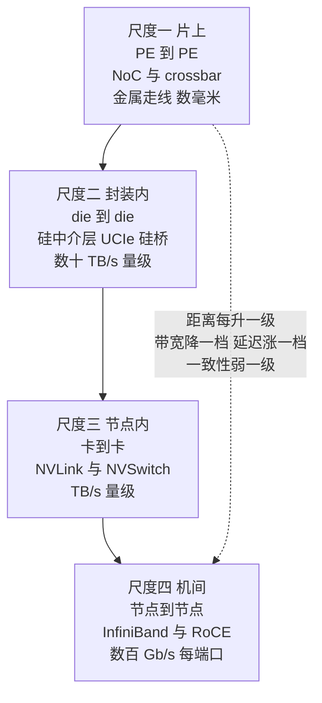
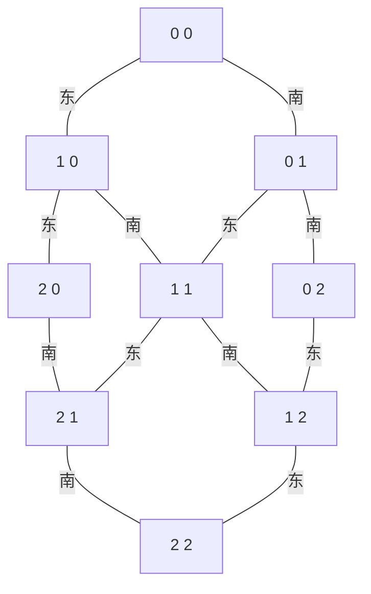
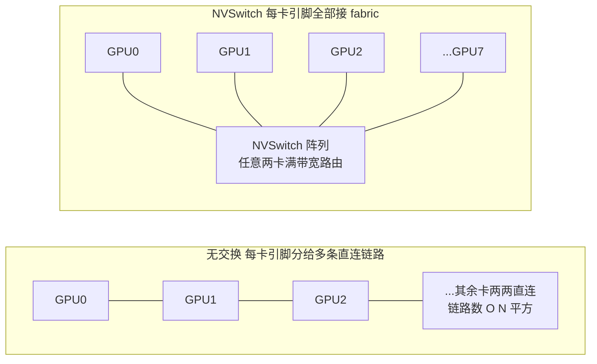
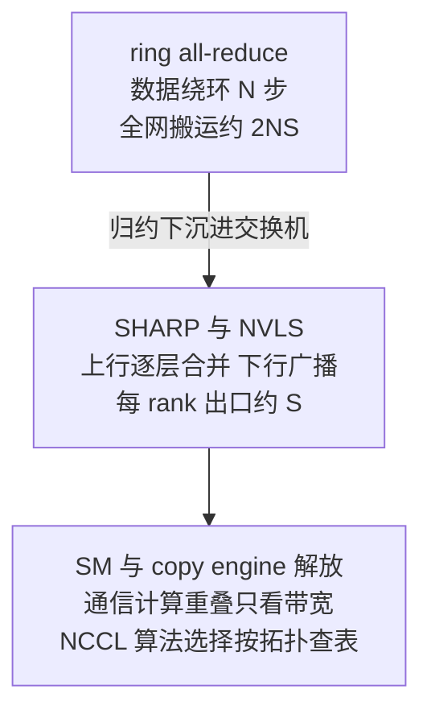
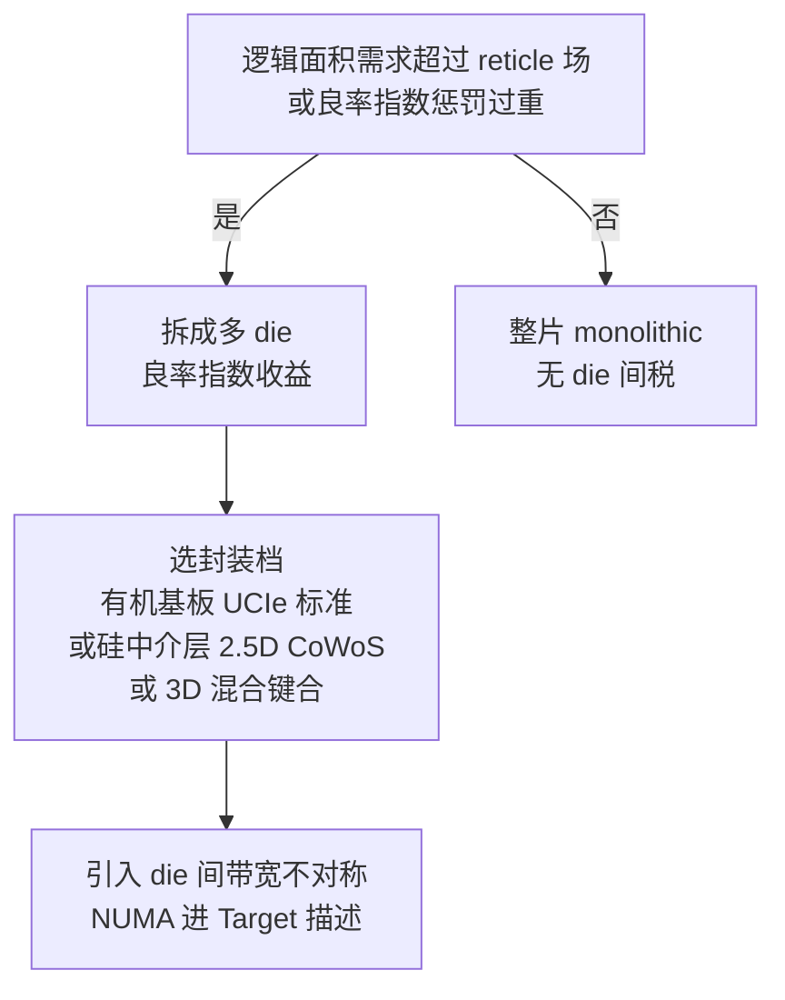
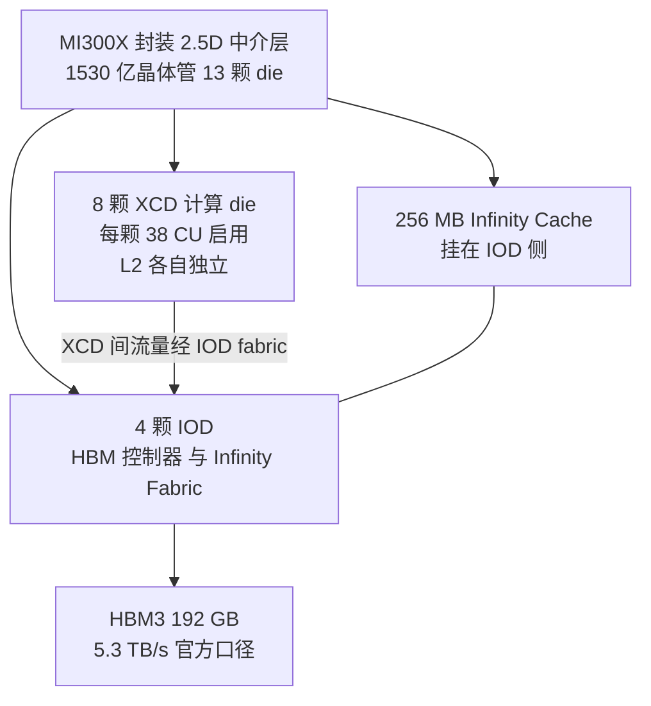

> **TL;DR**
>
> * **这是「给 AI 编译器工程师的芯片课」第八篇**。前七篇的镜头始终锁在一颗 die 内部——数据流到 PE 为止（07）。本篇把镜头抬起来，沿四个尺度重走一遍「数据移动的距离」：**片上网络（NoC）→ 封装内的 die 间互连（CoWoS/UCIe）→ 卡间（PCIe/CXL/NVLink/NVSwitch）→ 机间（RDMA/InfiniBand）**。主线一句话——**片上互连三代（bus→crossbar→NoC）是面积换扩展性的三幕剧 → NVLink 比 PCIe 快一个数量级靠的是把互连当第一性设计而非 IO 外挂 → 集合通信硬件卸载（SHARP/NVLS）改写 overlap 经济学 → chiplet 化把良率的指数惩罚换成封装税 → MI300X/B200 的多 die 架构让 NUMA 正式写进 Target 描述**。
> * **三个对编译器最值钱的结论**：1 NoC 的二分带宽只有注入能力的 $1/k$——全网随机通信必然塌方，placement 把通信重的计算块放成网格近邻不是优化项，而是正确性级别的约束；2 集合通信的时间模型一行公式算尽——ring all-reduce 是 $2\frac{N-1}{N}\cdot\frac{S}{b}$，SHARP 把每 rank 出口流量从 $2\frac{N-1}{N}S$ 压到 $S$，归约搬进交换机后通信与计算的重叠从「抢资源」变成「只看带宽」；3 chiplet 的本质是一笔交易：用良率的指数收益换封装税和 die 间带宽不对称——ISA 里看不见 die 边界，cost model 里必须看得见，MI300X 的八个 XCD 与 B200 的十 TB/s 硅桥就是 Target 描述里新增的两行参数。
> * **本篇动手实验**：纯 Python 手搓一个 NoC 平均跳数/二分带宽计算器和 ring all-reduce 时间模型计算器（无需任何硬件），再用良率模型算一笔 chiplet 拆分账，最后用 `nvidia-smi topo -m` 把真实机器的互连拓扑读出来认一认。

---

## 1. 四个尺度：数据移动的距离阶梯

第 01 篇解剖 AI 芯片时，右下角 IO 区画过三个方块——Crossbar/NoC、NVLink PHY、PCIe——当时它们只是占位符。七篇过去，计算、存储、指令集、数据流都拆完了，本篇轮到它们：**互连是「数据移动的距离」这条主线（01 篇开篇）的最终章**。同一份数据，在 PE 寄存器之间、die 与 die 之间、卡与卡之间、机柜与机柜之间移动，价格完全不同——把四个尺度排成一张阶梯表：



| 尺度 | 物理介质 | 代表协议 | 带宽口径（量级） | 延迟口径（量级） | 一致性语义 |
|:---|:---|:---|:---|:---|:---|
| 片上（SM↔L2、核间） | 金属走线 | crossbar / NoC | 数十 TB/s 全片 | ~200 cycle（引 03） | 物理共享内存 |
| 封装内（die↔die） | 硅中介层 / 硅桥 / RDL | UCIe、NV-HBI、Infinity Fabric | 每 bridge 5~10 TB/s（官方口径） | 约百 ns（公开口径，未验证） | 可缓存一致（协议可选） |
| 节点内（卡↔卡） | 铜缆 / PCB | NVLink5 + NVSwitch | 每卡 1.8 TB/s 双向聚合（官方口径） | 约数百 ns（公开口径，未验证） | load/store 直达远端显存 |
| 节点内兜底 | PCB | PCIe 5.0 x16 | 63 GB/s 每方向（PCI-SIG 口径） | ~µs（公开口径，未验证） | 无硬件一致性（CXL 可选） |
| 机间 | 光纤 / DAC | InfiniBand NDR、RoCEv2 | 400 Gb/s 每端口（IBTA 口径） | ~µs（公开口径，未验证） | 消息传递，无共享内存 |

三条规律贯穿全表。**其一，带宽逐级跳水**：从片上数十 TB/s 到机间每端口 50 GB/s（400 Gb/s 折字节），四个数量级——这就是为什么分布式编译器把张量并行塞进 NVLink 域、把流水线并行丢给机间（§6.3）。**其二，延迟逐级抬升**：从片上百拍量级到机间微秒量级，Little 定律（03 篇）跟着涨价——IB 链路 50 GB/s 配 1 µs 往返延迟，在飞字节就要 100 KB 量级，长肥管道全靠批量消息灌满。**其三，语义逐级降档**：片上是物理共享内存，卡间 NVLink 还能 load/store 直达，机间只剩显式消息传递——并行策略的切分位置本质上是在选语义档位。

## 2. 片上三代记：bus、crossbar 与 NoC

### 2.1 bus：一根线的独木桥

最原始的答案：所有主设备挂同一组共享线缆，仲裁器每周期放行一个。面积 $O(1)$（一套线缆）、协议极简，但**聚合带宽恒等于单线带宽**——$N$ 个主设备分抢一份，人均 $b/N$；仲裁排队还让延迟随 $N$ 线性恶化。AMBA 一类总线至今统治外设与配置通路（时钟控制器、寄存器配置面），但计算主干的门槛在十几个主设备就到了头。

### 2.2 crossbar：全连接的面积税

第二步：给每对输入输出一个专用交叉点。$M$ 输入对 $N$ 输出的 crossbar 需要 $M \times N$ 个交叉点，外加 $M+N$ 条**横穿整个 die 的全局总线**：

$$A_{xbar} \approx M \cdot N \cdot a_{cp} + (M+N) \cdot C_{wire} \cdot d_{die}$$

**变量映射表**：

| 符号 | 含义 | 示例取值（量级示意） | 维度/单位 |
|:---:|:---|:---|:---|
| $M$ | 主设备数（SM、请求方） | 上百 | 个 |
| $N$ | 从设备数（L2 bank、内存控制器） | 数十 | 个 |
| $a_{cp}$ | 单交叉点面积（传输门＋控制） | 工艺相关 | μm² |
| $d_{die}$ | die 对角线跨度 | ~30 mm | mm |
| $C_{wire}$ | 单位长度走线电容 | 工艺相关，未验证 | fF/mm |

两项代价都随规模恶化：交叉点数按 $M \cdot N$ 涨；更隐蔽的是第二项——全局走线又长又宽，电容 $C$ 巨大，代回 01 篇的 $P = \alpha C V^2 f$，**长线既是面积税也是功耗税，还是关键路径税**（02 篇：长走线直接拖垮 $f_{max}$）。所以 crossbar 的舒适区是 $N$ 在几十以内：SM↔L2 的供数干道（06 篇）、寄存器堆的 operand collector（03 篇，一个把 bank 读出路由到 32 个 lane 的小 crossbar）都是这个量级。

### 2.3 NoC：把网络搬上芯片

规模再往上，全连接付不起，只能学互联网：**把全局线切成一跳一跳的局部链路，中间垫 router**。每个 router 五个端口（本地核＋东南西北四个方向），内部是输入缓冲＋路由计算＋仲裁＋交叉开关的流水线；相邻 router 之间是短走线——导线长度第一次与芯片规模解耦。

路由最常见的选择是 **XY 维序路由**：先沿 X 方向走完，再沿 Y 方向走。它单调有序，天然不成环，因此**无死锁**（死锁的电路根源是缓冲区循环等待，维序路由从拓扑上排除了环；虚通道 VC 是工程上的补丁，把一条物理通道拆成多个队列再破一次环）。一跳的代价由 router 流水线与链路传播构成，一个报文的端到端延迟（教学近似，cut-through 会消去串行化的累积项）：

$$T_{pkt} \approx \underbrace{\frac{L}{W}}_{\text{串行化}} + H \times \big(t_r + t_{link}\big)$$

**变量映射表**：

| 符号 | 含义 | 示例取值（教学口径） | 维度/单位 |
|:---:|:---|:---|:---|
| $L$ | 报文长度 | 1~16 | flit |
| $W$ | 链路带宽 | 每拍 1 flit | flit/拍 |
| $H$ | 跳数 | 见下文平均跳数 | 跳 |
| $t_r$ | 单 router 流水线延迟 | 2~4 | 拍 |
| $t_{link}$ | 链路传播 | ~1 | 拍 |
| $T_{pkt}$ | 端到端延迟 | -- | 拍 |

延迟公式里的 $H$ 是主角。在 $k \times k$ 的 mesh 上取两个均匀随机节点，一维上的期望距离是经典等差求和（$P(|\Delta x|=d)=2(k-d)/k^2$）：

$$\mathbb{E}|\Delta x| = \frac{2}{k^2}\sum_{d=1}^{k-1} d(k-d) = \frac{k^2-1}{3k} \approx \frac{k}{3} \quad\Rightarrow\quad \mathbb{E}H = \frac{2(k^2-1)}{3k} \approx \frac{2k}{3}$$

平均跳数随**边长线性增长**——芯片规模翻四倍（$k$ 翻倍），平均延迟翻倍，这是 NoC 用延迟换扩展性的第一笔账。第二笔更疼：**二分带宽**。沿中线把 mesh 一刀两断，只有 $k$ 条链路（单向）穿过切口，而全网注入能力是 $k^2$ 条链路——

$$\frac{BB}{\text{注入能力}} = \frac{k \cdot b}{k^2 \cdot b} = \frac{1}{k}$$

含义直白：**全网均匀随机通信时，每个节点平均只能拿到自身注入带宽的 $1/k$**。$k=16$ 时只剩 6%。这不是实现瑕疵，是 mesh 拓扑的数学性质（torus 把切口翻倍成 $2k$ 条，也只是缓解）。NoC 的全部性能哲学由此一句话定死：**让通信发生在近邻**—— locality 不是优化建议，是数学前提。



> 图：3×3 mesh。从 (0,0) 到 (2,2) 的 XY 路由先横后纵（沿上边缘到 (2,0) 再南下），跳数即曼哈顿距离。

三代互连钉成一张对照表：

| 维度 | 共享总线 | crossbar | NoC（mesh 例） |
|:---|:---|:---|:---|
| 面积/布线复杂度 | $O(1)$ 线缆＋仲裁器 | $O(MN)$ 交叉点＋全局长线 | $O(N)$ router＋局部短线 |
| 聚合带宽 | 全员共享一份 | 理论全员对全员（受功耗/布线封顶） | 注入 $k^2 b$，二分仅 $kb$ |
| 延迟特性 | 仲裁排队，随 $N$ 恶化 | 一拍直达，恒定 | 跳数主导，平均 $\approx 2k/3$ 跳 |
| 舒适规模 | 十几个主设备 | 几十个端口 | 千级节点 |
| AI 芯片里的实例 | AMBA 外设/配置面 | SM↔L2 干道、operand collector | manycore 网格、Cerebras Swarm（07 篇）、GPU 片上互连 |

> 💡 **编译器关联**：NoC 正在从「实现细节」升级为「编程契约」——Hopper 起 CUDA 的 thread block cluster 把一小片 SM 间互连网络和分布式共享内存（DSMEM）写进了编程模型（官方 CUDA 文档口径，09 篇展开）；Groq 把多芯片时刻表排到拍（07 篇）、Cerebras 把图切到几十万个核（07 篇），都是「通信重的计算块放成近邻」这一条 mesh 数学的工程化。给这类目标做 mapping 时，通信图的最小切割与网格坐标的匹配质量，直接决定你吃得到注入带宽的几分之几。

## 3. 卡间代差：PCIe、CXL 与 NVLink/NVSwitch

### 3.1 PCIe：一切互连的下限基准

PCIe 是主机世界的通用货币：PCIe 5.0 每 lane 32 GT/s，x16 合计约 63 GB/s 每方向（128b/130b 编码后，PCI-SIG 口径；datasheet 常四舍五入写作 64 GB/s）。它为「主机挂外设」设计：分层协议（事务层/数据链路层/物理层）层层封装，跨卡通信要么经 host 内存中转（两次 DMA＋一次系统总线），要么走 P2P（需要平台与驱动支持，且常被 root complex 的拓扑位置卡住）。延迟在微秒量级（公开微基准口径，未验证精确值）——比 NVLink 慢一个数量级的原因不在 PHY，在**它把互连当 IO，而不是当内存**。

### 3.2 CXL：在 PCIe 物理层上加回缓存一致性

CXL 建在 PCIe PHY 之上，补的正是语义：三个子协议各管一摊——**CXL.io**（兼容 PCIe 的 IO 与配置）、**CXL.cache**（设备按 cacheline 粒度参与主机缓存一致性，Type-1/2 设备用）、**CXL.mem**（主机把设备侧内存映射进自己的物理地址空间，Type-3 内存扩展/池化的根基）。于是「内存」第一次可以住在加速器机箱的另一台机器里：内存池化、内存分层、跨主机共享全部成为协议合法操作。

代价同样明码标价：一致性报文往返让访问延迟比本地内存多出一两百 ns 量级（公开实测口径不一，未验证），带宽也要打折扣。**语义升级、价格分级**——这正是 03 篇展望的兑现：「HBM3e/CXL 内存池化落地后，数据移动的距离正在被重新定价」。对编译器，这意味着 Target 描述里「内存」不再是单一常数：attach 内存与 native HBM 要配两套 roofline，NUMA 距离表多出一列，cost model 的边权从标量升级成矩阵。

### 3.3 NVLink：为什么能比 PCIe 快一个数量级

NVLink 五代的官方账本（双向聚合口径，以各代官方发布为准）：

| 代际 | 首发芯片 | 每卡链路数 | 每卡双向带宽 | 同期 PCIe 基准 | 倍差 |
|:---|:---|:---:|:---:|:---:|:---:|
| NVLink1 | P100（2016） | 4 | 160 GB/s | PCIe3 x16 ≈ 16 GB/s | ~10× |
| NVLink2 | V100（2017） | 6 | 300 GB/s | PCIe3 x16 ≈ 16 GB/s | ~19× |
| NVLink3 | A100（2020） | 12 | 600 GB/s | PCIe4 x16 ≈ 32 GB/s | ~19× |
| NVLink4 | H100（2022） | 18 | 900 GB/s | PCIe5 x16 ≈ 63 GB/s | ~14× |
| NVLink5 | B200（2024） | 18 | 1.8 TB/s | PCIe5 x16 ≈ 63 GB/s | ~29× |

07 篇留的问题——「NVLink 为什么比 PCIe 快一个数量级」——答案拆成四条，每条都是设计取舍而非黑魔法：

1. **距离预算不同**：NVLink 只服务机柜内几十厘米的铜缆/基板，SerDes 可以堆每 lane 速率与均衡复杂度；PCIe 要兼容各种背板与线缆质量，速率档位保守（Gen6 的 PAM4 也在追，以 PCI-SIG 路线图为准）。
2. **lane 预算不同**：18 条 NVLink 链路全部用于 GPU↔GPU；PCIe 的 16 lane 还要分给网卡、存储、主机。
3. **拓扑不同**：点对点直连，无仲裁、无共享介质。
4. **协议栈不同**：NVLink 把远端显存映射进本地的 load/store 地址空间，报文格式贴着 GPU 内存语义裁剪，没有通用 IO 协议的事务层开销——**延迟数百 ns 量级（公开口径，未验证），比 PCIe 的 µs 级低一个数量级**。

一句话：**PCIe 把互连当外设接口，NVLink 把互连当内存系统**——这是「语义定价」最直白的行业案例。

### 3.4 NVSwitch：从环到全交换

链路快了还不够，拓扑也得跟上。8 张卡两两直连需要 28 对链路，每卡要留 7 个链路的引脚预算——引脚是芯片最贵的地皮之一。NVSwitch 的解法是把「两两直连」换成「全部接交换阵列」：每张卡的 NVLink 引脚固定接 NVSwitch ASIC，任意两卡之间的流量在 fabric 内部路由，**任意一对卡之间都维持接近线速的带宽**。DGX-2（2018，第一代 NVSwitch）第一次把 16 张 GPU 连成单一全互联域；HGX H100 用 4 颗第三代 NVSwitch 承载 8 卡 900 GB/s 无阻塞互联，且这代交换芯片引入了 **NVLink SHARP（NVLS）在网归约**（官方文档口径）——§4.3 的主角之一。B200 的 NVLink5 域进一步扩展到 72 卡（NVL72，官方口径）。



> 💡 **编译器关联**：NVLink 域是并行策略的第一道分界线。经验法则（[Megatron-LM 系列论文](https://arxiv.org/abs/2104.04473)的系统分析口径）：**张量并行（TP）的通信发生在每一层、双向、不可回避，必须锁在 NVLink 域内；流水线并行（PP）只在 stage 边界传激活，跨机也扛得住；数据并行（DP）的梯度归约可以后台化**。NCCL 在运行时做同样的事——它启动时探测 PCIe/NVLink/IB 拓扑树，按链路类型选算法选通道（官方文档口径）。编译器与运行时的分工：编译期决定「谁跟谁通信」，运行时决定「走哪条路」。

## 4. 机间互连：RDMA、InfiniBand 与集合通信卸载

### 4.1 协议栈的税与 RDMA 的免税单

传统 TCP/IP 收三层税：数据在内核缓冲区与用户态之间拷贝、上下文切换与中断、协议逐层解析——端到端延迟几十 µs 量级（公开口径）。RDMA（远程直接内存访问）的免税单三行：**注册内存区域**（提前把虚拟地址锚定成物理页，NIC 拿到直接访问权）、**kernel bypass**（用户态直接下发射队列，不进内核）、**零拷贝**（NIC DMA 在两端内存间直取直写，CPU 全程不碰数据）。延迟压到 µs 量级、单 NIC 双向带宽到 400 Gb/s（InfiniBand NDR 口径）甚至更高。载体两种：InfiniBand 专用网络（IBTA 规范，交换机原生支持在网归约）与 RoCEv2（RDMA over Converged Ethernet，跑在以太网上）。再叠一层 **GPUDirect RDMA**：NIC 直接读写 GPU 显存，host staging buffer 整个消失——机间链路第一次与卡间链路直通。

### 4.2 集合通信的算法账：一行公式算尽 ring

分布式训练的通信大头是集合通信，其中 all-reduce（梯度归约）最重。经典 **ring all-reduce** 把 $N$ 个 rank 排成环，分两阶段：先 scatter-reduce（每步向右传 $S/N$，$N-1$ 步），再 all-gather（再传一圈）。每 rank 的总发送量与总时间：

$$T_{ring} = 2 \cdot \frac{N-1}{N} \cdot \frac{S}{b}$$

**变量映射表**：

| 符号 | 含义 | 示例取值 | 维度/单位 |
|:---:|:---|:---|:---|
| $N$ | rank 数 | 8（节点内）到数千 | 个 |
| $S$ | 归约张量大小 | 1（GB） | 字节 |
| $b$ | 每 rank 链路带宽 | 450（NVLink4 单向口径） | GB/s |
| $T_{ring}$ | 完成时间 | -- | 秒 |

两个推论值得背下来。**其一**：$N\to\infty$ 时 $T_{ring} \to 2S/b$——环算法对规模几乎免疫，这是它统治机间的理由。**其二**：换算成 NCCL 的两种口径（官方文档定义）——算法带宽 $algbw = S/T$，总线带宽 $busbw = 2\frac{N-1}{N} \cdot algbw$；理想 ring 下 $busbw$ 恒等于链路带宽 $b$，而 $algbw$ 上限只有 $b/2$。**nccl-tests 报的 busbw 接近链路规格、algbw 只有它一半，不是性能 bug，是定义**。

### 4.3 SHARP：把归约搬进交换机

ring 的隐藏成本：数据在网络里被搬了 $N$ 遍——全网总搬运量约 $2NS$ 字节，每个中间交换机都在转发别人的完整数据。**SHARP（Scalable Hierarchical Aggregation and Reduction Protocol）** 的思路：交换机 ASIC 里放归约引擎（aggregation manager），数据上行途中**每经过一层就合并一次**，到根只剩一份结果再下行广播。每 rank 出口流量从 $2\frac{N-1}{N}S$ 降到约 $S$，全网搬运量按树的扇出逐层收缩（教学近似：一层 $f$ 叉聚束约省一半以上，层数 $\log_f N$）；NVSwitch 的 NVLS 是同一思想在节点内的实现，NCCL 对应提供 `nvls` 算法（官方文档口径）。

| 算法 | 每 rank 出口流量 | 全网搬运量 | 延迟量级 | 硬件要求 |
|:---|:---|:---|:---|:---|
| ring all-reduce | $2\frac{N-1}{N}S$ | $\approx 2NS$ | $O(N)$ 步流水 | 无 |
| double-tree | $\approx \frac{N-1}{N}S$ | $\approx NS$ | $O(\log N)$ | 无 |
| SHARP / NVLS | $\approx S$ | 逐层收缩，$\ll 2NS$ | $O(\log N)$ 跳 | 交换机归约引擎 |



> 💡 **编译器关联**：归约卸载改写 overlap 经济学。软件执行的集合通信要占用 SM 或 copy engine——与计算抢资源，overlap pass 必须做时间表错峰（07 篇 Groq 的时刻表思维在这里同样适用）；**在网归约把计算从端点挪进交换机，端点只剩收发，通信与计算的重叠退化为纯带宽约束**。分布式编译器（如 [Alpa](https://arxiv.org/abs/2201.12020) 的两级搜索、Megatron 的并行配置）把「通信量×链路带宽」当 cost model 输入时，还需要知道目标域是否支持在网归约——同一个 all-reduce，两种硬件、两套时间常数。另外注意表达力边界：SHARP 只会做协议内置的归约（sum/min/自定义算子族），任意 elementwise 融合进通信是软件层的事——**通信融合（reduce+scatter 拼接）是编译器还能赚的部分，算子级归约已经是硬件的地盘**。

## 5. 封装内的互连：CoWoS、UCIe 与良率经济学

### 5.1 HBM 为什么必须住在隔壁

01 篇埋的伏笔：「HBM 在 die 旁边而非 die 上面——DRAM 工艺和逻辑工艺不兼容」。展开说：逻辑工艺（FinFET、多层金属布线）与 DRAM 工艺（电容阵列）在晶圆制造层面互斥（02 篇），两者只能各自流片、在**封装层**合体。HBM 的 1024-bit 超宽接口（03 篇）用传统 PCB 走线根本接不动——引脚数太多、走线太长、速率上不去。唯一解是把 HBM 与 GPU 同时贴在一块**硅中介层（silicon interposer）**上，用亚微米级布线完成超宽互连——这就是 TSMC 的 CoWoS（Chip on Wafer on Substrate）2.5D 封装，A100/H100/B200 与 MI300X 全部采用（官方口径）。中介层布线密度比有机基板高两个数量级（量级示意），但面积受光刻 reticle 场限制（单场约 26×33 mm ≈ 858 mm²，工艺常识口径）——**CoWoS 产能与中介层面积，是过去两年整个 AI 芯片行业的物理产能瓶颈**（公开报道口径）。

### 5.2 良率的指数账单：为什么大芯片必须切碎

02 篇给过良率模型 $Y \approx e^{-AD}$（泊松近似，$D=0.1/\text{cm}^2$ 教学口径）。现在把 02 篇承诺的账算出来。300 mm 晶圆可用面积约 7 万 mm²（粗估），对比整片大 die 与拆成两半：

| 方案 | 单 die 面积 | 良率 $Y=e^{-AD}$ | 每晶圆 die 位 | 等效好硅面积 |
|:---|:---:|:---:|:---:|:---:|
| 整片 | 800 mm² | $e^{-0.8} \approx 45\%$ | ~87 | ~31,400 mm² |
| 双 die | 400 mm² ×2 | $e^{-0.4} \approx 67\%$ | ~175 | ~46,900 mm²（**+49%**） |

**同样的晶圆面积，拆两半多产出近一半的好硅**——指数的威力。支出侧要减三笔税：硅中介层/基板成本（随总面积涨）、已知良好 die（KGD）测试费、组装良率（die 贴装与键合的失配损耗）。chiplet 化的经济学判据一行：**良率收益 > 封装税**。而对 B200 这个量级还有一条更硬的理由——**两颗 compute die 的合计面积已经超过光刻 reticle 场，整片方案在物理上不存在**（公开工艺口径）。chiplet 从「选择题」变成「必答题」。



### 5.3 UCIe 与各家 die 间接口

die 拆开后需要 die 间的「USB 标准」。**UCIe（Universal Chiplet Interconnect Express）** 联盟 2022 年成立，把 die 间互连标准化为 PHY＋协议栈两层，协议层可选缓存一致性（与 CXL 思路同源），封装档位两档：标准档跑有机基板（bump 密度与速率保守）、先进档跑硅中介层/硅桥（宣称带宽密度 TB/s/mm 量级、能耗低于 0.5 pJ/bit，规范宣传口径，未验证，以 uciexpress.org 白皮书为准）。私有方案在标准之前就已铺开：NVIDIA 的 **NV-HBI**（B200 两颗 die 之间 10 TB/s 全一致性互连，官方口径）、AMD 的 **Infinity Fabric**（MI300 系列的 die 间与卡间统一 fabric）、Intel 的 EMIB 硅桥。共同点：**die 间接口开始携带内存语义甚至一致性语义**——04 篇展望的兑现：「ISA 契约正被 UCIe 一类 die 间协议重新谈判」——「指令从哪片硅上来」对软件不可见，但「数据从哪片硅上来」正在变成可见的性能参数。

| 封装选项 | 互连介质 | 带宽密度（量级） | 延迟 | 成本 | 代表 |
|:---|:---|:---|:---|:---|:---|
| monolithic | 片内金属线 | 最高 | 最低 | 良率风险全担 | 传统单 die GPU |
| MCM 有机基板 | 基板走线（UCIe 标准档） | 低（量级示意） | 较高 | 低 | 部分 CPU 多 die |
| 2.5D CoWoS | 硅中介层 | 高 | 低（约百 ns 量级，未验证） | 高（产能紧张） | A100/H100/B200/MI300X |
| 3D 混合键合 | TSV 直接堆叠 | 最高 | 最低 | 最高 | HBM 堆栈、先进 cache 堆叠（探索期） |

> 💡 **编译器关联**：die 边界不出现在 ISA 里，却出现在带宽与延迟的不对称里。Target 描述需要新增一类参数：**die 间带宽矩阵**（谁和谁之间多宽、多延迟）——它决定「同一张 GPU 图」里哪些算子对可以自由交换数据、哪些要按 NUMA 对齐。§6 把这件事推到极致。

## 6. 多 die 与 NUMA：放置问题正式登场

### 6.1 MI300X：13 颗 die 的拼图

AMD MI300X 的公开架构（AMD 技术日口径）：**13 颗 chiplet 贴在 CoWoS 中介层上——9 个 5nm 计算 die（XCD，MI300X 启用其中 8 个，每颗 40 个 CU 中启用 38 个，合计 304 CU）＋ 4 个 6nm I/O die（IOD，承载 HBM 控制器与 Infinity Fabric），合计 1530 亿晶体管**。显存 192 GB HBM3、峰值 5.3 TB/s，另配 256 MB Infinity Cache（官方口径；冗余 XCD 位点是 02 篇 binning 思想的封装级重演）。



NUMA 结构藏在「单 device」抽象之下：**L2 是每 XCD 一份的私有缓存**，XCD 之间不直连——跨 XCD 的数据一致性流量全部经 IOD fabric 中转（公开架构口径）。同一个 GPU 内部，实际存在「本 XCD 快、跨 XCD 慢」的两档访问价格；workgroup 调度到哪个 XCD、数据落在哪个 L2/Infinity Cache 切片，直接决定实际带宽（公开评测口径，量级未验证）。

### 6.2 B200：两颗 reticle die 假装一颗 GPU

NVIDIA Blackwell B200 走了另一条路：**两颗 reticle 尺寸的 compute die（合计 2080 亿晶体管）经 NV-HBI 互连成一颗「逻辑 GPU」**——10 TB/s、带一致性、对 CUDA 软件栈呈现为单个 device（官方口径）。显存 192 GB HBM3e、约 8 TB/s，NVLink5 对外 1.8 TB/s（01 篇表格的数字在此归位）。

| 维度 | MI300X（AMD） | B200（NVIDIA） |
|:---|:---|:---|
| die 拓扑 | 8 XCD ＋ 4 IOD，异构分工 | 2 颗对称 compute die |
| die 间互连 | Infinity Fabric（经 IOD 中转） | NV-HBI 直连硅桥，10 TB/s |
| 软件可见性 | 单 device，NUMA 藏在性能里 | 单 device，NUMA 被硬件抹平 |
| 一致性策略 | XCD 私有 L2，显式同步为主 | 全一致性域（官方口径） |
| 编译器要付的账 | workgroup/XCD 放置与数据局部性 | die 间流量挤占 10 TB/s 桥的带宽预算 |

两条路线殊途同归于同一个编译器问题：**抽象层说「这是一颗 GPU」，物理层说「这是带宽不对称的多节点系统」**。NVIDIA 用 10 TB/s 的暴力带宽把 NUMA 藏进硬件（代价是桥成为新的争用点）；AMD 把 fabric 拓扑留给软件优化（代价是 kernel 调度与数据放置要感知 XCD）。无论哪条路，**cost model 里没有 die 拓扑，性能预测就会系统性偏差**——这正是第 10 篇 cost model 参数清单要收编的内容。

### 6.3 放置问题的形式化

把本篇所有尺度收进一个目标函数。给定计算图 $G=(V,E)$（$V$ 是算子，$e \in E$ 带通信量 $f_e$）和硬件拓扑 $T$（节点间代价函数 $c(i,j)$：同 XCD 最低、跨 XCD 次之、跨卡 NVLink 再次、跨机 IB 最高），求放置 $\pi: V \to T$：

$$\min_{\pi} \sum_{e=(u,v)} f_e \cdot c\big(\pi(u), \pi(v)\big) \qquad \text{s.t.} \quad \text{容量、亲和性、同步语义约束}$$

**变量映射表**：

| 符号 | 含义 | 示例取值 | 维度/单位 |
|:---:|:---|:---|:---|
| $V, E$ | 算子图与依赖/通信边 | 数千算子 | 个 |
| $f_e$ | 边上通信量（激活/梯度字节数） | shape 决定 | 字节 |
| $c(i,j)$ | 拓扑代价（带宽倒数或延迟） | 按阶梯表分层 | s/byte |
| $\pi$ | 放置映射（算子→物理位置） | 待求解 | -- |
| 约束 | 显存容量、TP 组同域、stage 顺序 | -- | -- |

这是图划分问题（NP-hard，METIS 一类多层划分算法是标准启发式，Karypis & Kumar 口径）。工程界的答案是一张「并行维度 × 拓扑层级」的映射表——通信越重的维度放得越近（Megatron 系列与 Alpa 的系统化结论）：

| 并行维度 | 通信模式 | 放置偏好 | 互连依据 |
|:---|:---|:---|:---|
| 张量并行 TP | 每层前反向各 2 次 all-reduce，最重 | 锁死 NVLink 域内 | §3.3/3.4：卡间带宽高、延迟低 |
| 流水线并行 PP | 仅 stage 边界传激活，最轻 | 跨机也扛得住 | §4：IB 带宽低但 PP 通信量小 |
| 数据并行 DP | 每步一次梯度 all-reduce，可后台 | 最宽松，可跨机 | §4.3：SHARP/在网归约减负 |
| 专家并行/MoE | all-to-all，突发且重 | NVLink 域内优先 | all-to-all 对二分带宽最敏感 |

> 💡 **编译器关联**：这张表是「互连阶梯决定并行策略」的总纲。自动化路线（Alpa 的两级搜索、Pathways 的异步集合调度）本质是把这张手工表变成带 cost model 的搜索问题——而 cost model 的每一项带宽/延迟常数，都来自本篇 §1 那张阶梯表。**第 01 篇说「编译器改变数据移动的距离」，本篇给出了距离的完整价目表**。

## 7. 编译器启示汇总

把本篇十个硬件事实与对应的编译器决策钉在同一张表上：

| 硬件事实 | 电路/拓扑根源 | 编译器决策 |
|:---|:---|:---|
| NoC 二分带宽 = 注入/k | mesh 切口只有 k 条链路 | mapping 让通信图匹配网格近邻；全局随机通信直接放弃 |
| NoC 平均跳数 ≈ 2k/3 | 均匀随机距离的等差期望 | 延迟敏感的算子链排成相邻坐标；流水化掩盖跳数延迟 |
| crossbar 面积 O(MN) | 交叉点＋全局长线 | 端口规模进 Target 常数；operand collector 的 replay 是它的账单（03 篇） |
| PCIe 与 NVLink 差一个数量级 | 语义定价：IO 外挂 vs 内存系统 | 跨卡 load/store 只在 NVLink 域内做；PCIe 域走批量搬运 |
| CXL 一致性加价百 ns 量级 | 一致性报文往返（未验证） | attach 内存单独配 roofline；NUMA 距离表多一列 |
| ring 时间 = 2(N−1)/N·S/b | 环流水两阶段 | busbw/algbw 双口径写进 perf model；别把 algbw 当链路带宽 |
| SHARP/NVLS 在网归约 | 交换机归约引擎 | 归约卸载域内 overlap 只看带宽；通信融合留给软件、算子归约交给硬件 |
| 良率指数惩罚 | Y=e^(−AD) | 大模型芯片必然多 die——Target 描述默认含 die 拓扑 |
| die 间带宽不对称 | NV-HBI 10 TB/s vs 片内数十 TB/s | die 感知 tiling：K 维切分对齐 die 归属；桥带宽进 cost model |
| 并行维度×拓扑层级映射 | 通信重近放 | TP 锁 NVLink 域、PP/DP 跨 IB；自动搜索以阶梯表为边权 |

一句话收束：**前七篇回答「数据在芯片里怎么流」，本篇回答「数据在芯片之间怎么流、多少钱一字节」——NoC 的 1/k、NVLink 的十倍差、SHARP 的一次上行、良率的指数、die 间的桥，全是价目表上的行项。编译器的并行策略、放置与 overlap，本质是对这张价目表的一次联合优化。**

## 8. 收官小结与局限

**带走四句话**：

1. 片上三代互连是面积换扩展性的三幕剧：bus 共享一份带宽、crossbar 付 $O(N^2)$ 面积税、NoC 用 $2k/3$ 跳延迟和 $1/k$ 二分带宽换千级规模——locality 从此是数学前提而非优化建议。
2. 卡间互连的代差是语义的代差：NVLink 把互连当内存系统（load/store 直达、数百 ns），PCIe 把互连当外设（协议分层、µs 级），CXL 在 PCIe 上加回一致性但按 ns 收费——Target 描述的带宽常数必须按语义分层。
3. 集合通信一行公式算尽：ring 是 $2\frac{N-1}{N}S/b$，SHARP/NVLS 把出口流量压到 $S$——归约进交换机后，通信与计算的重叠从抢资源变成只看带宽；NCCL 的算法选择是拓扑查表，不是黑魔法。
4. chiplet 用良率指数收益换封装税与 NUMA：800 mm² 整片拆双 die 好硅 +49%，代价是 die 间带宽不对称——MI300X 的 8 个 XCD 与 B200 的 10 TB/s 硅桥，是「单 device」抽象下的两套真实拓扑，placement 从此是编译器的一等公民 pass。

**本篇的局限**：NVLink/CXL/UCIe 的带宽与延迟数字均为官方发布或公开资料的量级口径，代际迭代极快，引用前以对应 datasheet 与规范原文为准；SHARP 的全网搬运量模型是教学近似，实际取决于聚合树深度、扇出与并发集合通信的干扰；MI300X 的 XCD/启用数与 B200 的内部互连细节以厂商白皮书为准（部分标注未验证）；放置问题的目标函数忽略了显存容量约束下的联合调度（通信-显存-计算三维权衡），完整建模见第 10 篇。展望：当互连从「板级铜」走向「机柜光」（CPO 共封装光学）与「跨机一致性」（CXL memory fabric、NVLink 跨机箱），§1 阶梯表的行数还会增加——价目表越长，编译器的联合优化空间越大，这正是第 09 篇用真实芯片案例、第 10 篇用 cost model 收编它们的原因。

## 动手实验(Lab)

读者可以自己跑以下三个小实验验证本篇观点（前三个不需要任何硬件）：

### Lab 1：纯 Python 验证 NoC 的平均跳数与二分带宽

```python
# 环境:任意 Python3。k x k mesh:平均跳数模拟 vs 解析式,二分带宽占比。
from itertools import product

def sim_avg_hops(k):
    ds = [abs(a - c) + abs(b - d)
          for a, b, c, d in product(range(k), repeat=2)]
    return sum(ds) / len(ds)                     # XY 路由跳数=曼哈顿距离

def theo_avg_hops(k):
    return 2 * (k * k - 1) / (3 * k)             # 正文推导式

for k in (4, 8, 16, 32):
    print(f"k={k:>2} 模拟={sim_avg_hops(k):6.3f}  解析={theo_avg_hops(k):6.3f}"
          f"  均匀通信人均带宽=注入/{k}")
# 观察:模拟值与解析式完全吻合;k 越大平均跳数线性涨、人均带宽反比例跌。
# 试试把曼哈顿距离改成 torus(带绕回)的距离:平均跳数降多少?
# 这就是正文"placement 让通信变近邻"的全部数学。
```

### Lab 2：ring all-reduce 时间模型与 busbw 双口径

```python
# 环境:任意 Python3。对照 NCCL 口径:algbw=S/t,busbw=2(N-1)/N*algbw。
def ring_allreduce(S_gb, n, bw_gbps):
    b = bw_gbps / 8                              # GB/s
    t = 2 * (n - 1) / n * S_gb / b
    algbw = S_gb / t
    return t, algbw, 2 * (n - 1) / n * algbw

for n in (2, 4, 8, 16, 64, 512):
    t, alg, bus = ring_allreduce(1.0, n, 450)    # 1 GB,每卡 450 GB/s 单向口径
    print(f"N={n:>3}: {t*1e3:8.2f} ms  algbw={alg:6.1f}  busbw={bus:6.1f} GB/s")
# 观察:busbw 恒等于链路带宽(理想 ring 的定义),algbw 随 N 逼近一半。
# nccl-tests 输出的正是这两个口径;再试试把 450 换成 PCIe 的 63 或 IB 的 50,
# 感受 §1 阶梯表的价格差;有集群的话跑 nccl-tests 对照实测。
```

### Lab 3：chiplet 良率经济学计算器

```python
# 环境:任意 Python3。整片 vs 拆分的等效好硅账(泊松模型,02 篇口径)。
import math

def good_area(wafer_mm2, die_mm2, D=0.001):      # D=0.1/cm2 教学口径
    slots = wafer_mm2 / die_mm2                   # 忽略边缘损失的教学近似
    return slots * math.exp(-die_mm2 * D) * die_mm2

WAFER = 70000                                     # 300mm 晶圆可用面积粗估 mm2
mono = good_area(WAFER, 800)
split = 2 * good_area(WAFER, 400)
print(f"整片 800 mm2 : 等效好硅 {mono:8.0f} mm2")
print(f"双 die 400 mm2: 等效好硅 {split:8.0f} mm2  (+{(split/mono-1)*100:.0f}%)")
for a in (100, 200, 400, 800):
    print(f"  die={a:>3} mm2 良率={math.exp(-a*0.001):5.1%}")
# 对照正文:双 die 方案好硅 +49%。试试四拆、八拆,收益曲线怎么走;
# 记住这只是收入侧,支出侧还有中介层、KGD 测试、组装良率三笔税。
```

### Lab 4：读出真实机器的互连拓扑（需 NVIDIA 机器，可选）

```bash
# 环境:NVIDIA GPU 机器。把本篇术语对号入座:
nvidia-smi topo -m
# 输出矩阵里:NV# 是 NVLink 交换,PIX/PHB/PXB 是 PCIe 树内不同深度,
# NODE 隔一条 root complex,SYS 表示跨 CPU NUMA 域。
# 再让 NCCL 打印自己的拓扑探测与算法选择(调试日志口径):
NCCL_DEBUG=INFO nccl-tests/build/all_reduce_perf -b 8 -e 512 -g 8 2>&1 \
  | grep -iE "topo|algo|nvls|channel"
# 对照正文:它选了 ring 还是 nvls?busbw 离链路规格多远?
```

## 参考文献

| 主题 | 链接 |
|:---|:---|
| Dally & Towles, *Principles and Practices of Interconnection Networks*（NoC 数学的主要出处：跳数、二分带宽、死锁） | 可搜书名获取 |
| Dally, "Route Packets, Not Wires: On-Chip Interconnection Networks"（DAC 2001，片上网络宣言） | 可搜标题获取 |
| Dally & Seitz, "Deadlock-Free Message Routing in Multiprocessor Interconnection Networks"（死锁与维序路由的理论出处，1987） | 可搜标题获取 |
| NVIDIA NVLink / NVSwitch 官方页（五代带宽与 NVLS 口径） | <https://www.nvidia.com/en-us/data-center/nvlink/> |
| NVIDIA Blackwell 架构官方页（B200 双 die、NV-HBI 10 TB/s、NVL72 口径） | <https://www.nvidia.com/en-us/data-center/blackwell-architecture/> |
| NCCL 官方仓库与文档（算法选择、busbw/algbw 定义、NVLS 支持） | <https://github.com/NVIDIA/nccl> |
| NVIDIA SHARP 官方页（InfiniBand 在网归约口径） | <https://www.nvidia.com/en-us/networking/sharp/> |
| InfiniBand Trade Association 规范（NDR 400 Gb/s 等链路口径） | <https://www.infinibandta.org/> |
| PCI-SIG 官方页（PCIe 5.0/6.0 速率口径） | <https://pcisig.com/> |
| CXL Consortium 规范（CXL.cache/CXL.mem 与 Type-1/2/3 语义） | <https://computeexpresslink.org/> |
| UCIe Consortium 规范（die 间 PHY/协议栈与封装档位） | <https://www.uciexpress.org/> |
| AMD Instinct MI300X 官方页与技术日材料（13 chiplet、XCD/IOD、Infinity Fabric 口径） | <https://www.amd.com/en/products/accelerators/instinct/mi300.html> |
| Shoeybi et al., "Megatron-LM: Training Multi-Billion Parameter Language Models Using Model Parallelism"（TP 通信结构出处） | [arXiv:1909.08053](https://arxiv.org/abs/1909.08053) |
| Narayanan et al., "Efficient Large-Scale Language Model Training on GPU Clusters Using Megatron-LM"（并行维度×拓扑映射的系统论述，SC'21） | [arXiv:2104.04473](https://arxiv.org/abs/2104.04473) |
| Zheng et al., "Alpa: Automating Inter- and Intra-Operator Parallelism for Distributed Deep Learning"（放置的两级自动搜索） | [arXiv:2201.12020](https://arxiv.org/abs/2201.12020) |
| Rajbhandari et al., "ZeRO: Memory Optimizations Toward Training Trillion Parameter Models"（DP 侧通信优化） | [arXiv:1910.02054](https://arxiv.org/abs/1910.02054) |
| Karypis & Kumar, "A Fast and High Quality Multilevel Scheme for Partitioning Irregular Graphs"（METIS，图划分启发式出处） | 可搜标题获取 |
| Hennessy & Patterson, *Computer Architecture: A Quantitative Approach*（互连网络章节的系统教材） | 可搜书名获取最新版 |
| 本系列前篇 | 《给 AI 编译器工程师的芯片课》01~07（01 四层契约、02 良率模型、03 HBM、07 脉动阵列与晶圆级） |
| 中文社区解读 | 知乎站内搜「NVLink 原理」「RDMA 与 InfiniBand」「SHARP 在网计算」「Chiplet 与 UCIe」有多篇图解文章（质量参差，建议对照本文公式阅读） |

> 下一篇：[《案例研究：A100→H100→B200 进化史与 TPU/昇腾/新势力》](09_case_studies.md)——四个尺度的互连价目表铺完了，镜头对准真实芯片：A100→H100→B200 每一代新增的互连与执行能力如何改写编译器策略，昇腾/寒武纪与新势力在同一个问题上交出的不同答卷。
