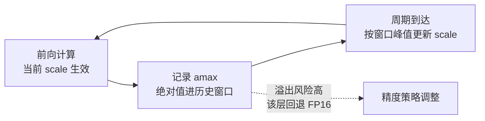
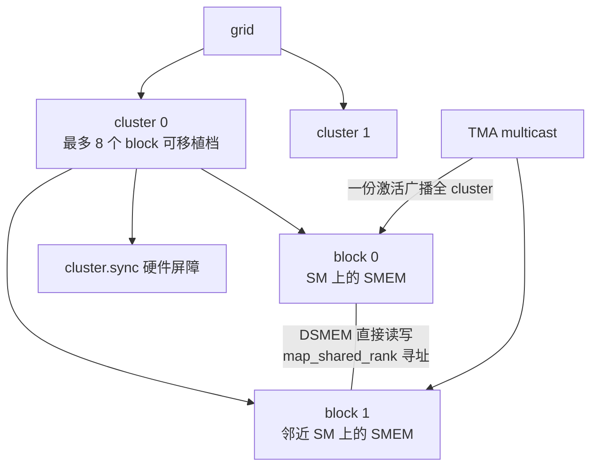
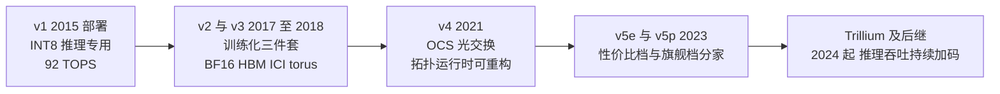
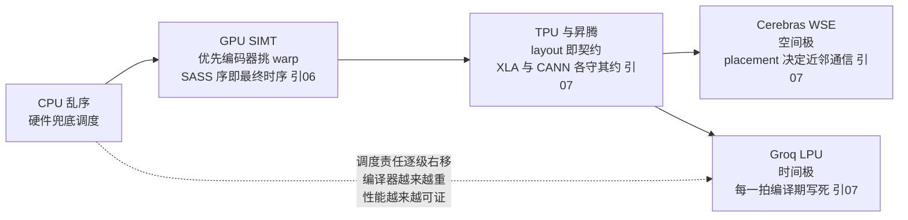

> **TL;DR**
>
> * **这是「给 AI 编译器工程师的芯片课」第九篇，也是系列的综合应用篇**。前八篇攒齐了一整套电路机制——数据类型谱系（01）、良率与 binning（02）、存储层次与 Little 定律（03）、ISA 与算术树（04）、流水线与 II 公式（05）、warp/Tensor Core/异步队列（06）、脉动阵列与确定性执行（07）、互连阶梯与 NUMA（08）——但机制都长在抽象的 die 上。本篇把镜头对准真实产品，主线一句话——**每一代新硬件能力，都是把上一代软件生态最大的痛点做成这一代的硬件原语：Ampere 把访存调度做成 cp.async，Hopper 把 kernel 重构成 producer/consumer 两班倒，Blackwell 把量化塞进 mma 本体；TPU 六年不换阵列边长、昇腾把 scratchpad 义务写成编程语言、Groq 与 Cerebras 把两个极端卖成产品——同一句话在不同厂商口中的方言**。
> * **三个对编译器最值钱的结论**：1 读 datasheet 的正确姿势是三步翻译法——新名词翻译回前八篇的某块电路、电路翻译成 Target 描述的新参数、参数翻译成编译器的新义务；本篇用 A100→H100→B200 逐项示范（TF32→精度策略、cp.async→`num_stages`、TMA/wgmma→warp 特化、cluster→第三根 tiling 轴、FP4→量化进指令集）；2 代际进化的固定剧本是「软件痛点硬件化」，所以编译器的工作量从不减少只会搬家——从手工 schedule 技巧搬进 IR pass，再搬进运行时反馈闭环（Transformer Engine 的 delayed scaling 是量化决策从编译期常量变成运行时变量的标志）；3 四层契约的每一格都存在多种合法答案——同一份 GEMM 在六家芯片上是六个不同的编译问题，可移植性的真实成本等于重写 layout 规则＋重写 cost model 常数＋重写调度合法性判据之和。
> * **本篇动手实验**：纯 Python 手搓一个数据类型谱系的面积-带宽账计算器和一个 FP8 delayed scaling 模拟器（无需任何硬件），再用 PyTorch 把真实机器的四层契约参数读出来对号入座。

## 1. 为什么需要案例研究：给机制库做一次产品化验收

前八篇建立了一个完整的机制库，但它有一个隐藏的缺陷：所有 die 都是抽象的。TF32 在 04 篇只是「尾数砍半」的一行公式，脉动阵列在 07 篇只是一个 256×256 的教学阵列——它们没有出厂日期、没有功耗预算、没有软件生态。案例研究的任务就是补上这一课：**把每个机制放回它真实的工程与商业语境，检验前八篇的翻译词典是否真的能读懂一份 datasheet**。

读法只有一条主线：**每一代旗舰发布会上的每个新名词，都是对上一代软件生态某个痛点的回应**。把它翻译回电路（前八篇），再翻译成 Target 描述参数，最后翻译成编译器的新义务——三步之后，「营销 PPT」就变成了「编译器 changelog」。先给一张总翻译表：

| 发布会名词 | 前文的电路机制 | 出处 | 本篇落点 |
|:---|:---|:---|:---|
| TF32／BF16／FP8／FP4 | 数据类型谱系、尾数位宽与压缩树面积 | 01 篇 §5、04 篇 §7 | §2.2～§4.3 |
| cp.async／TMA | 异步拷贝队列与 `num_stages` 下界 | 06 篇 §6 | §2.2、§3.2 |
| wgmma | Tensor Core 多周期流水与依赖环 | 06 篇 §5.3 | §3.3 |
| thread block cluster／DSMEM | NoC 局部性数学写进编程模型 | 08 篇 §2.3 | §3.4 |
| 双 die 单 device | 良率指数与 die 间带宽不对称 | 02 篇 §8、08 篇 §5～6 | §4.1 |
| MXU 256×256 | 波前推导与四条约束反推 | 07 篇 §2.3 | §5 |
| Cube 16³／fractal | 3D 立方指令与分形布局契约 | 07 篇 §4 | §6 |
| 时序决定论／晶圆级集成 | 确定性调度与冗余核绕行 | 07 篇 §6～7、05 篇 §7 | §8 |

方法论一句话：**读芯片发布的正确顺序，是先问「这个新原语把哪条旧痛点做进了硬件」，再问「编译器的哪个 pass 因此要重写」**。痛点清单是现成的：访存调度太手工（cp.async 的动机）、kernel 形态太僵（TMA/wgmma 的动机）、跨 block 复用太贵（cluster 的动机）、单 die 装不下（双 die 的动机）。下面沿产品线逐项验收。

## 2. NVIDIA 三代旗舰进化史

### 2.1 三代规格总表

先把 01 篇那张晶体管预算表升级成完整版，每一行都能在前文找到解读机制：

| 维度 | A100（2020，Ampere） | H100（2022，Hopper） | B200（2024，Blackwell） |
|:---|:---|:---|:---|
| 制程 | TSMC 7nm | TSMC 4N | TSMC 4NP |
| 晶体管 | 542 亿 | 800 亿 | 2080 亿（双 die） |
| SM 数（启用） | 108（物理 128） | 132（物理 144） | 双 die（官方未突出 SM 数，以白皮书为准） |
| L2 | 40 MB | 50 MB | 以官方白皮书为准 |
| 显存 | HBM2e 80 GB | HBM3 80 GB | HBM3e 192 GB |
| 显存带宽 | 2.04 TB/s | 3.35 TB/s | 约 8 TB/s |
| 卡间互连 | NVLink3 600 GB/s | NVLink4 900 GB/s | NVLink5 1.8 TB/s |
| 功耗档 | 400 W | 700 W | 约 1000 W |
| 关键新原语 | TF32/BF16、cp.async、2:4 稀疏 | FP8/TE、TMA、wgmma、cluster/DSMEM | 双 die/NV-HBI、FP4/MX、tcgen05/TMEM |

> 以上均为官方发布口径的量级参考，SKU 间有差异，引用前以对应 datasheet 为准。

表格的行项全是老朋友：制程对应 02 篇的设计流程，SM/L2 对应 03 篇的面积账，HBM 对应 03 篇的堆叠术，NVLink 对应 08 篇的价目表。真正的新信息只有最后一行——**关键新原语**。它才是每一代的灵魂，也是接下来三节的目录。

### 2.2 Ampere（2020）：异步化的起点与新类型的入场

Ampere 在 H100 的光环下常被低估，但回望过去五年 kernel 形态的演变，起点在这里。

**其一，TF32：一次「静默换挡」的精度事件。** TF32 是 19 位内部格式（1 符号＋8 指数＋10 尾数）：存取仍是 FP32，只在 Tensor Core 的乘法内部截断（Ampere 白皮书口径）。它踩中的正是 04 篇 §7.3 的杠杆：指数位照抄 FP32 所以动态范围不打折；尾数砍到 10 位后 Booth 数字减半、Wallace 压缩树按平方缩水——同样的硅面积换来约 8 倍于 FP32 CUDA Core 的矩阵吞吐（156 对 19.5 TFLOPS，官方稠密口径）。但对软件生态这是一次罕见的静默换挡：cuBLAS 默认用 TF32 跑 FP32 GEMM（cuBLAS 文档口径），PyTorch 的 `allow_tf32` 开关一度默认开启、又在社区争议后改回默认关闭（版本行为以官方文档为准）——同一个模型没改一行代码，误差谱系和性能双双改变。这正好落进 05 篇 §6.2 的数值语义框架：中间截断改变了舍入次数，fast-math 的合法性边界从编译器选项升级成了框架公共政策。

> 💡 **编译器关联**：三层。1 精度不再是「编译前定死的 dtype」，而是图级策略——现代编译栈把它做成了 pass 参数与 autotuner 的搜索维度；2 cost model 必须知道「FP32 GEMM 在这张卡上实际跑的是 TF32 吞吐」，否则 Roofline 直接算错一倍（03 篇拐点公式的输入被污染）；3 数值回归测试要区分「算法换了精度」与「硬件悄悄降了精度」两种误差来源。

**其二，BF16 入列：数据类型谱系是行业合谋。** BF16 由 Google 为 TPU 定义推广（Google Cloud 博客口径，§5），Ampere 是第一个跟进的 NVIDIA 代际——01 篇 Layer 1 的类型谱系从来不是一家闭门造车，而是整个行业围绕「指数保动态范围、尾数省面积」这条曲线的共同收敛。BF16 比 TF32 更激进的地方在于它是显式类型：dtype 从此成为 IR 里的一等公民，转换节点插入、累加精度保持 FP32、loss scaling 策略全部进入编译器的管辖范围。

**其三，2:4 结构化稀疏：稀疏第一次写进 ISA 契约。** 每 4 个权重剪掉 2 个、硬件跳过零值、吞吐翻倍（Ampere 白皮书口径）——这就是 01 篇说峰值算力要区分「稠密/稀疏两种口径」的出处。代价是 pattern 合法性成了硬约束：剪枝必须满足 2:4 形状（工业界标准流程是先按重要性剪、再重排列满足 pattern 的两步法，NVIDIA ASP 工具链口径），压缩后的索引布局也要专门排布。通用编译器大多选择把这一步交给 cuSPARSELt 一类专家库——**ISA 给了折扣，兑现折扣的人力成本留给了软件**。

**其四，cp.async：把 load 摘出指令流的第一步。** 06 篇 §6 已经拆完电路：全局内存数据直达 SMEM、不过 RF、不占目的寄存器，配套 `commit_group`/`wait_group` 两级语义（PTX ISA 官方口径；SASS 名 LDGSTS 为社区口径，06 篇 Lab 可自验）。产品视角只需钉住一件事：**`num_stages` 多级流水从此有了硬件抓手**——06 篇那条下界公式 \(N_{stages} \geq 1+\lceil BW_{share}\cdot L_{mem}/B_{stage}\rceil\) 从 A100 开始才真正可执行，Little 定律（03 篇）要求的在飞字节第一次可以由后台队列而非驻留 warp 来凑。

### 2.3 Hopper（2022）：异步化完成，并行层级＋1

如果说 Ampere 改的是「搬数的姿势」，Hopper 改的就是 kernel 的组织方式本身——四项新能力，每一项都在 06 篇埋过伏笔。

**其一，FP8 与 Transformer Engine：量化从推理技巧变成训练内建。** FP8 两个变体由 NVIDIA/Arm/Intel 联合定义（[arXiv:2209.05433](https://arxiv.org/abs/2209.05433)）：E4M3 尾数多三位适合前向激活，E5M2 指数多一位适合反向梯度——一个格式家族按训练阶段分工，这是 04 篇「位宽预算在尾数与指数间分配」的产品级注脚。真正的难点不在乘法器（面积继续按平方缩），在 scale 管理：FP8 动态范围小，直接缩放必然溢出或下溢，于是 Transformer Engine 把「统计 amax → 选 scale → cast → 计算 → 记录 amax」做成在线循环，scale 按历史窗口周期性更新（delayed scaling，官方文档口径）：



这圈反馈环的意义远超一个库：**量化决策从编译期常量变成了运行时变量**。图 IR 里从此必须能表达 cast/amax 统计/scale 更新这类带状态的节点，融合 pass 不能跨越它们乱合并，autotuner 的精度维度也从静态枚举变成动态策略空间。

**其二，TMA：异步拷贝的第二形态。** 06 篇 §6.3 的伏笔在此兑现：一张 tensormap 描述张量的形状、步长、box，单线程即可发射整块 bulk 拷贝，完成后经 mbarrier 通知（官方 CUDA 文档口径）。对比 cp.async 的进步有三处（06 篇已列）：发射开销从「32 线程各发一条」降到「1 线程发一张单子」；边界越界由硬件按 map 自动处理；完成通知从轮询 wait_group 升级为屏障事件。编译器侧的新义务随之升级：构建 tensormap 描述符、编排 producer/consumer warp 特化、证明 mbarrier 序列的死锁自由。06 篇 §7 的 occupancy 三约束公式本身没变，但记账方式变了——\(s_b\) 与 \(r_t\) 要按角色分开算：producer warp 吃 SMEM buffer 预算但不吃多少寄存器，consumer warp 反之，**角色化 occupancy 成为 Hopper kernel 的标准算法**（CUTLASS Hopper pipeline 口径）。

**其三，wgmma：tensorize 的单位从 warp 升级为 warpgroup。** 06 篇 §5.3 明确留过话：「Hopper 把这条路走到了下一个台阶……案例对比留待第 09 篇」。现在兑现：wgmma 让 4 个 warp 成组协作执行一条矩阵乘（sm_90a 特性，PTX ISA 官方口径），操作数 A 可以直接从 SMEM 流入阵列、跳过寄存器 fragment 中转，累加器仍可留在寄存器或 SMEM。两笔连锁账：其一，fragment 契约搬家——从「每个线程抱哪几个寄存器」变成「SMEM 里这块矩阵按什么 swizzle 摆放」（03 篇 gcd 公式的主战场扩大），ldmatrix 往返被消掉；其二，注意那个后缀 **a**——sm_90a 表示该特性属于特定架构实现、不保证向前兼容（PTX ISA 口径），下一代可能改语义。这是 ISA 契约观的一次微妙变化：**当硬件迭代快到 ISA 都来不及稳定时，编译器必须在「追新特性」与「保持可移植」之间做显式取舍**（04 篇契约论的续篇）。累加依赖环依旧且常数更大，05 篇拆多份累加器的结论原样适用。

**其四，Thread Block Cluster 与 DSMEM：NoC 写进编程模型。** 08 篇 §2.3 留的伏笔——「Hopper 起 CUDA 把一小片 SM 间互连网络和分布式共享内存写进了编程模型，09 篇展开」——现在兑现。机制一句话：最多 8 个 block（可移植档；非可移植档上限 16，CUDA 官方口径）绑成一个 cluster，硬件保证它们落在邻近的 SM 上，cluster 内任意 block 可以直接读写邻居的 SMEM（DSMEM，`cluster.map_shared_rank` 寻址）、用 `cluster.sync` 组同步、共享一次 TMA multicast 广播：



这正是 08 篇 NoC locality 数学（二分带宽 \(1/k\)、平均跳数 \(2k/3\)）的编程模型化：**「把通信重的 tile 放成近邻」从编译器的祈祷升级成了 API 保证**。编译器侧的变化：并行层级从 grid/block/warp/thread 四层变五层；K 维切片的 multicast 复用成为新的 tiling 决策维度（多个 block 共享同一份激活，07 篇权重复用的近亲）；同步分析新增 cluster 级死锁检查；autotuner 的搜索空间多了 cluster dims 这根轴。

> 💡 **编译器关联**：Hopper 四连击合起来是一次 kernel 架构范式转移——producer/consumer warp 特化＋TMA 队列＋wgmma 直供＋cluster multicast，四个特性互相咬合成一套「流水线工厂」模板（CUTLASS Hopper GEMM 是它的参考实现）。通用编译器逐步把这些特性吸收为自动生成目标，但**吸收的速度差就是手写库的性能窗口**——这个窗口在每一代新卡发布时都会重新打开一次。

### 2.4 Blackwell（2024）：reticle 场逼出来的双芯与压到底的精度

**其一，双 die 与 NV-HBI：08 篇 NUMA 的正面案例落地。** 为什么必须切两半？02 篇的良率指数与 08 篇 §5.2 的 reticle 场上限已经给出答案：两颗 compute die 的合计面积超过光刻单场，整片方案物理上不存在。于是 B200 用 10 TB/s 全一致性 NV-HBI 把两颗 die 粘成一颗逻辑 GPU，对软件呈现单 device（官方口径）。08 篇的结论原样生效：NUMA 被 10 TB/s 的暴力带宽抹平，但抹平的账单写在功耗表上，桥本身成为新的争用点——die 感知 tiling（K 维切分对齐 die 归属）与桥带宽预算仍是 cost model 该填的两行参数。

**其二，FP4/FP6 与块缩放：量化搬进 mma 本体。** 微缩格式的思想：每 k 个元素共享一个 scale，硬件在 mma 内部完成反量化——MX 标准取 32 元素一档（[arXiv:2310.10537](https://arxiv.org/abs/2310.10537) 口径），NVFP4 采用 16 元素块加两级 scale（官方口径，细节未验证）。有效位宽一行公式算尽：

$$b_{eff} = b_{x} + \frac{b_{s}}{k}$$

**变量映射表**：

| 符号 | 含义 | FP4＋MX 取值 | 维度/单位 |
|:---:|:---|:---|:---|
| \(b_{x}\) | 数据元素位宽 | 4（E2M1） | bit |
| \(b_{s}\) | 共享 scale 位宽 | 8（E8M0 纯指数量纲） | bit |
| \(k\) | 每 scale 覆盖的元素数 | 32（MX 口径） | 个 |
| \(b_{eff}\) | 每元素有效均摊位宽 | \(4+8/32=4.25\) | bit |

妙处在动态范围：scale 是纯指数量纲，覆盖的数值范围几乎等于 FP32——**用约 4.25 bit 的均摊宽度买到 FP16 级的动态范围**。这是 04 篇「位宽预算怎么切」的第三代答案：第一代砍尾数即 BF16，第二代按阶段分工双格式即 FP8，第三代把 scale 从张量级降到块级。编译器义务随之质变：量化 pass 的输出不再是显式 dequant 算子序列，而是带 scale 操作数的特殊 mma 调用——scale 成为 GEMM ABI 的一部分，scale 张量自己的 layout 也成了新的 layout 问题，KV cache 量化与权重量化的粒度可以解耦配置。

**其三，tcgen05/TMEM：累加器离开寄存器堆。** 第五代 Tensor Core 的公开形态（PTX ISA 新增指令族与 CUDA 文档口径）：mma 由单线程发出、异步执行，累加结果落入专用的 Tensor Memory 而非寄存器 fragment。这是对 03 篇 RF 地皮模型的又一次松绑——acc 不占寄存器堆，同样的 \(r_t\) 预算能养更深的流水或更多在飞 warp；同时「单线程发射」意味着 warp 特化进一步加深。生态现状是这套指令族主要由 CUTLASS/CuDNN 一类专家库先行消费，主流编译器正在跟进——**从新 ISA 出现到编译器普遍消化之间的时间差，本身就是这个职业存在的理由**。

**其四，NVL72：机柜级单一 NVLink 域。** 72 卡经第五代 NVSwitch 连成一个域（08 篇 §3.4 的延伸），MoE 的 all-to-all 与专家并行的放置空间从 8 卡扩大到 72 卡——08 篇那张「并行维度 × 拓扑层级」映射表的行数又长了一行。

### 2.5 三代进化总表：每一步都对应编译器账本的一行新增

| 能力 | 首发 | 前文机制出处 | 编译器义务增量 |
|:---|:---|:---|:---|
| TF32 | A100 | 04 篇尾数经济学、05 篇舍入语义 | 精度策略 pass；cost model 精度感知 |
| BF16 | TPU 先行，A100 跟进 | 01 篇类型谱系、04 篇位宽经济学 | dtype 一等公民化；转换节点管理 |
| 2:4 稀疏 | A100 | 01 篇稠密/稀疏双口径 | pattern 合法性检查；压缩布局 pass |
| cp.async | A100 | 06 篇异步队列、03 篇 Little 定律 | `num_stages` 解析下界；commit/wait 序列生成 |
| FP8＋TE | H100 | 04 篇格式分工、05 篇舍入语义 | 在线 scaling 反馈环；cast 边界约束融合 |
| TMA | H100 | 06 篇 §6.3 | tensormap 构建；角色化 occupancy；死锁自由证明 |
| wgmma | H100 | 06 篇 §5.3 依赖环 | warpgroup 级 tensorize；swizzle 契约搬家 |
| cluster/DSMEM | H100 | 08 篇 NoC 数学、03 篇 SMEM | 并行层级＋1；multicast tiling；cluster 同步分析 |
| 双 die 单 device | B200 | 02 篇良率、08 篇 §6 | 桥带宽预算；die 感知 tiling |
| FP4/MX | B200 | 01/04 篇位宽平方曲线 | 量化进指令 ABI；scale layout |
| tcgen05/TMEM | B200 | 03 篇 RF 地皮模型 | acc 出 RF 后的 occupancy 重算 |

顺手把 03 篇的拐点公式沿三代跑一遍（峰值取官方稠密口径，B200 为公开报道口径）：

| 配置 | 峰值 TFLOPS | 带宽 TB/s | 拐点 FLOPs/byte |
|:---|:---:|:---:|:---:|
| A100 FP16 TC | 312 | 2.04 | ≈153 |
| H100 FP16 TC | 989.5 | 3.35 | ≈295 |
| H100 FP8 | 1979 | 3.35 | ≈591 |
| B200 FP16 | ≈2250 | 8 | ≈281 |
| B200 FP8 | ≈4500 | 8 | ≈562 |
| B200 FP4 | ≈9000 | 8 | ≈1125 |

一个值得停一下的现象：FP16 拐点从 153 到 295 翻倍之后，到 B200 首次横盘（≈281）——**带宽增速首次追平了同精度的算力增速**；但精度每降一档，拐点继续翻倍。「硬件越来越挑食」（03 篇）的压力没有消失，只是换了载体：从频率转移到了精度谱系——你的算子要么提高计算强度，要么接受更低的数值精度。

一句话收束：**三代旗舰的进化轴只有一条——把上一代编译器最贵的那个动作做成这一代的硬件原语。访存贵，就做异步队列；同步贵，就做屏障事件；布局贵，就把 swizzle 写进 tensormap；量化贵，就把反量化焊进 mma。而每一次「硬件接管」，都以 Target 描述多几行参数、编译器多几个 pass、程序员少背几条玄学的形式结算。**

## 3. Google TPU：六年不换阵列边长的连续剧

### 3.1 各代要点：训练化三件套与光交换伏笔

07 篇已经把 v1 拆到波前级（92 TOPS INT8、256×256 阵列、24 MiB 统一缓冲、DDR3 约 34 GB/s，ISCA'17 论文口径）。从产品线视角补齐后续各代的骨架：



三条主线展开。**其一，训练化三件套**恰好一一对应前三篇的机制课：BF16 对应 04 篇（8 位指数照抄 FP32，互转只是截断尾数、无对阶溢出风险，训练里连 loss scaling 都省了）；HBM 上板对应 03 篇（34 GB/s 的 DDR3 只够推理权重的口粮，喂梯度必须有 HBM）；ICI 环面互连对应 08 篇（all-reduce 沿 torus 近邻流动，集合通信算法与拓扑匹配的经典范本）。**其二，v4 的 OCS 光交换**把 08 篇展望里「机柜光」提前部分兑现：Palomar 光交换机让 4096 芯 Pod 的拓扑可以在毫秒级重构（论文口径，[arXiv:2304.01433](https://arxiv.org/abs/2304.01433)）——拓扑第一次成为运行时可调参数，编译器的 placement 决策与集群的网络配置从此共演化。**其三，embedding 类负载的硬件卸载单元**（v4 论文标题自带 hardware support for embeddings；v5e 世代官方称 SparseCore）意味着一颗 TPU 内部出现了「哪种算子去哪个引擎」的放置问题——这与昇腾 Cube/Vector 分工（§6）是同一问题的两种解法。

各代规格随统计口径浮动（每芯片/每板卡/每 Pod 差异很大），具体数字以 Google Cloud 官方文档为准；本文只保留架构事实，不做数字竞赛。

### 3.2 不变的才是重点：边长契约与利用率悬崖

TPU 产品线最反直觉的事实：**MXU 的核心几何从 v1 用到今天几乎未动**（各代细节有演进，以官方文档为准）。07 篇 §2.3 反推的四条约束——带宽下限、面积上限、填充税、张量形状匹配——在七代产品的跨度里全部成立，于是「不改边长」就成了理性选择：Target 描述十年不动，软件生态的迁移成本趋近于零，XLA 的 layout 规则可以一直有效。对照 NVIDIA 每一代都要加新指令、改 kernel 形态的做法，这是两种截然不同的进化策略：**GPU 用 ISA 快速迭代换性能上限，TPU 用架构长期稳定换生态复利**。

07 篇 §2.3 留过一句「第 09 篇案例研究还会回到这张利用率表」——现在回来结账：decode 场景 batch=1 的 GEMV 在 256×256 阵列上利用率约 0.39%，batch=64 也只拉回到 25%（07 篇表格的教学口径）。continuous batching 不是服务层的工程技巧，**是阵列几何的直接后果**：decode 的 M 维太小，唯一出路是把多个请求拼成一行送进阵列。TPU 上的 serving 栈全力拼 batch，因为几何不给第二条路；GPU 上同样的问题以更隐蔽的方式出现（Tensor Core 的 tile 利用率同理），解法殊途同归——小 batch decode 的性能问题本质上是「二维阵列如何伺候一维向量」，答案都在批处理方向上找。

XLA 侧还有三条坚持值得点名，每一条都是 07 篇 §5 scratchpad 债务清单的实现：layout/padding 以固定粒度对齐（shape 不对齐时 padding 开销直接进 cost model）；静态 shape 编译（dynamic dimension 用 padding 加 mask 模拟）；buffer assignment 全静态规划（区间着色式的内存复用）。再加上 GSPMD 式的 sharding 注解传播——分布式版本的 layout pass——TPU 的编译器故事本质上是一个把 07 篇所有义务自动化到极致的故事。

## 4. 华为昇腾：Cube/Vector/Scalar 分工与 scratchpad 的程序化

### 4.1 架构速览：一颗 AI Core 就是一个小型异构系统

07 篇 §4 已经拆过 DaVinci 的核心机制（Cube Unit 的 16³ 分形契约、fractal Z 字形布局、L0A/L0B/L0C→L1→UB 的多级软件管理缓冲）。本篇补上产品视角的两块拼图。

第一块是三层单元的分工哲学。DaVinci 的 AI Core 内部常住三类引擎——Scalar Unit 管标量运算与地址计算（传统 CPU 整数部件的角色）、Vector Unit 管 128 lane 向量运算（softmax/LayerNorm 这类非线性算子的家）、Cube Unit 只管矩阵乘（04 篇 Booth/Wallace 树的大规模复制）——外加 MTE 专职 DMA 搬运（华为官方文档口径，层次划分以各代白皮书为准）。这个分工的本质是把 06 篇 producer/consumer 的角色特化焊进了硬件结构：三种引擎各自独立发射、靠片上缓冲解耦，一颗 AI Core 内部就存在算子级的任务调度问题。

第二块是代际演化。DaVinci 1.0 以 Ascend 310（推理，瓦级功耗档，官方发布口径）与 Ascend 910（训练，FP16 256 TFLOPS @ 310W，官方发布口径）落地；910B 一代（2023，Atlas 900 系列口径）扩展了矩阵单元的精度档位与规模，公开评测口径 FP16 峰值在数百 TFLOPS 量级（各家口径不一，未验证，以华为官方文档为准）；后续代际走向双 die 封装与机柜级扩展（公开报道口径，未验证）——08 篇「chiplet 从选择题变必答题」的判断，在太平洋两岸同时兑现。

### 4.2 CANN 与 Ascend C：scratchpad 义务的程序化

07 篇说过 DaVinci 把布局义务最彻底地暴露给了软件。工具链的演化史就是这个暴露程度的管理史：早期 TBE 用类 TVM 的 DSL 描述算子（Tensor Boost Engine，官方口径），编译器负责 fractal 布局与搬运插入——思路接近 TVM 的 tensorize 加 storage_rewrite（07 篇债务清单）；2023 年起的 Ascend C 用类 CUDA 的 C++ 编程模型把 scratchpad 义务程序化——语言原生提供多级缓冲抽象（Pipe/TQue/TBuf 一族原语）与事件同步，开发者显式声明哪段缓冲、几级流水、谁生产谁消费（官方文档口径）。这等于把 06 篇 CUTLASS 手搓的 double buffer 流水线做成了语言设施：生命周期分析、double buffer、DMA 排程这些 scratchpad 债务不再藏在编译器 pass 里，而是被提升为一等公民语法。配套全家桶：CNNL 算子库对应 cuBLAS/cuDNN，HCCL 集合通信库对应 NCCL（08 篇的算法菜单两家都有），MindSpore/torch_npu 负责前端接入；CANN 近年逐步开源（公开宣布口径）。

兑现 07 篇「三家工具链并排比较」的承诺（Groq/Cerebras 见 §8）：

| 维度 | NVIDIA（CUDA 栈） | Google（XLA 栈） | 昇腾（CANN 栈） |
|:---|:---|:---|:---|
| 手写层 | Triton/CUDA C 加 PTX 内联 | JAX 图加 sharding 注解 | Ascend C 算子加图引擎 |
| 自动层 | ptxas 加编译器 pass | XLA 全托管 layout/buffer | GE 图优化加算子调度 |
| 布局契约 | fragment/swizzle（半透明） | padding 对齐（全自动） | fractal 分形（完全显式） |
| 精度策略位置 | 框架 flag 加 TE | 编译期 dtype 加自动混合精度 | 框架加算子级指定 |
| 哲学 | 硬件快跑，软件追赶 | 编译器全包，用户极简 | 结构暴露，语言兜底 |

> 💡 **编译器关联**：三家对照暴露一个规律——硬件契约越「分形」（cube/fractal），软件义务越显式；硬件契约越「整体」（MXU 波前），编译器托管越彻底。Tensor Core 介于两者之间：fragment 半透明、swizzle 由编译器插。这就是 07 篇「ISA 抽象层级」对照表的产品化续篇。

## 5. 寒武纪与新势力：学院派血统与两个极端的商业化

### 5.1 寒武纪 MLU：ISA 先行的学院派简评

寒武纪的独特之处在于血统：它可能是唯一一家先发整套体系结构论文、再做芯片的公司。DianNao 家族（ASPLOS/MICRO 2012～2015 年间的一系列工作）系统探索了 DNN 加速器的存储分层与数据流设计空间——07 篇 §3 的 WS/OS/RS 分类学，学术源头一半在 Eyeriss、另一半就在这里。随后的 Cambricon ISA 论文（ISCA'16 最佳论文口径）更进一步：把 DNN 算子集合形式化为一条流式 ISA——这是 04 篇「ISA 即算子集合的形式化」命题最直接的行业实证：当负载域足够窄，ISA 可以窄到一条指令一种卷积。

产品线（思元 MLU 系列，公开报道口径，规格迭代快不展开）延续同一哲学：指令集驱动的向量加矩阵混合单元、多核集群、片上共享存储；软件栈 NeuWare 提供 BANG C 编程语言、CNNL 算子库、MagicMind 推理编译器与框架适配层（官方文档口径）。MLU370 起采用多芯粒封装（公开报道口径，未验证），再次与 08 篇 chiplet 大趋势合流。简评的落点不在某个数字，而在一条行业规律：DSA 竞争的护城河从来不是峰值算力（那只是 01 算力公式里的一个因子），而是四层契约中最软的那一层——运行时与工具链生态的厚度。这也是为什么各家芯片公司的投入重心都在编译器与算子库上。

## 6. 新势力两极：Groq 的时间与 Cerebras 的空间

07 篇 §6/§7 拆过 Groq 的时序决定论与 Cerebras 的晶圆级集成，本篇看它们作为产品各自的押注与账单：

| 维度 | Groq LPU（时间极） | Cerebras WSE（空间极） |
|:---|:---|:---|
| 押注什么 | 确定性时刻表：编译期排满每一拍（07 篇 §6） | 片上容量：整片晶圆 44 GB SRAM（WSE-3 官方口径） |
| 片上存储 | 每芯数百 MB 级 SRAM（07 篇口径） | 90 万 AI 核分布全片（官方发布口径） |
| 权重的命运 | 每次推理从片外流入，途中被消费 | 常驻片内；超限走 MemoryX 流式灌入 |
| 性能性质 | 恒等式：延迟 SLA 可数学证明 | 高确定性数据流，非严格恒等式 |
| 编译器重心 | 全局模调度（05 篇 II 公式的整机版） | placement 图划分（08 篇放置问题的原生战场） |
| 擅长的负载 | 小批量低延迟推理流（token 流水线，公开演示口径为单流每秒数百 token 量级，迭代快以官网为准） | 大模型的批内并行与单系统容纳 |
| 主要代价 | 大模型需数百颗芯串联拼时刻表（公开报道口径）；封闭生态 | 成本高企、故障域大、自研栈封闭 |

两条极端路线在 LLM 时代的重新定位耐人寻味：Groq 把「确定性」卖成了延迟 SLA——07 篇收益表里「服务质量可以严格证明」那一栏，在推理服务市场上真的变成了商业卖点；Cerebras 把「容量」卖成了简化——44 GB 片上 SRAM 装得下大多数模型的权重与激活，batch=1 推理也能跑满带宽（03 篇 Little 定律要求的在飞字节在片内网格里几乎免费）。共同教训也共同验证了 07 篇结语：**极端硬件必然配同等极端的编译器投入**——时刻表和 placement 都无法外包给第三方工具链，自研全栈不是选择而是必然。

## 7. 全景横评：同一份 GEMM，五个编译问题

把本篇所有主角钉回 01 篇的四层契约，就得到全系列的收官对照表：

| 契约层 | NVIDIA SIMT | TPU MXU | 昇腾 Cube | Groq TSP | Cerebras WSE |
|:---|:---|:---|:---|:---|:---|
| Layer 1 计算原语 | mma 约 2048 MAC/warp 指令 | 整阵 65536 MAC/拍 | cube 指令 4096 MAC | 功能单元槽位流 | 每核本地 MAC |
| Layer 2 存储层次 | RF＋SMEM＋L2＋HBM 混合 | 统一缓冲 scratchpad | L0/L1/UB scratchpad | 全片 SRAM | 晶圆级 SRAM |
| Layer 3 执行模型 | SIMT＋warp 交织＋异步队列 | 固定波前节拍 | 三引擎异构核 | 全局确定性时刻表 | 核网格空间计算 |
| Layer 4 运行时 | CUDA 图/stream | XLA 服务 | CANN runtime | 时刻表咬合零同步 | 权重流式调度 |
| tensorize 粒度 | warp/warpgroup | 整阵 | cube 指令 | 编译期全排 | 编译期划分 |
| layout 契约 | fragment＋swizzle | 对齐 128/256 | fractal Z 形 | 编译器全排 | 近邻映射 |
| cost model 形态 | 统计量（occupancy/命中率） | 半确定（padding 已知） | 显式搬运时间表 | 精确恒等式 | 通信图划分质量 |
| 工具链 | CUDA/Triton/CUTLASS | XLA/JAX | CANN/Ascend C | 自研全栈 | 自研全栈 |

调度责任轴上的位置（01 篇 §6 轴的收官点名）：



三条规律收束全篇。其一，**四层契约的每一格都有多种合法答案**——没有唯一正确的架构，只有一组组自洽的取舍。其二，**契约越显式，编译器越重但性能越可预测**——调度责任轴是行业多样性的第一解释变量，也是 01 篇「编译复杂度＝调度责任转移代价」命题的全景注脚。其三，**所有厂商殊途同归的方向是把软件痛点硬件化**——NVIDIA 的异步队列、Google 的可重构光路、华为的语言设施、Groq 的时刻表、Cerebras 的容量，都是同一句话的不同方言。

## 8. 编译器启示汇总

把本篇十四个产品事实与对应的编译器决策钉在同一张表上：

| 产品事实 | 机制出处 | 编译器决策 |
|:---|:---|:---|
| TF32 静默换挡 | 04 篇尾数经济学、05 篇舍入 | 精度策略 pass；数值审计区分来源 |
| cp.async | 06 篇异步队列、03 篇 Little 定律 | `num_stages` 下界；commit/wait 生成 |
| BF16 跨厂合谋 | 01 篇类型谱系 | dtype 一等公民；转换节点插入 |
| 2:4 稀疏 | 01 篇双口径 | pattern 合法性检查；压缩布局 |
| FP8＋TE | 04 篇位宽、05 篇舍入 | 在线 scaling；精度策略整图一致 |
| TMA | 06 篇 §6.3 | tensormap 构建；mbarrier 死锁证明 |
| wgmma | 06 篇 §5.3 | warpgroup tensorize；fragment 搬家 |
| cluster/DSMEM | 08 篇 NoC、03 篇 SMEM | 五层并行；multicast 复用；cluster 同步 |
| 双 die 单 device | 08 篇 §6、02 篇良率 | die 感知 tiling；桥带宽进 cost model |
| FP4/MX | 04 篇位宽极限 | 块缩放量化；scale 成为 GEMM ABI 一部分 |
| tcgen05/TMEM | 03 篇 RF 地皮 | acc 出 RF 后 occupancy 重算 |
| MXU 边长不变 | 07 篇 §2.3 | 契约稳定即生态红利；padding 粒度恒定 |
| OCS 光交换 | 08 篇展望 | 拓扑成为编译输入；placement 与网络共演化 |
| 时序决定论/晶圆级 | 07 篇 §6/§7 | 调度正确性即程序正确性；placement 一等公民 |

一句话收束：**案例研究的价值不在记住参数，而在验证规律——每一代芯片都是对上一代软件痛点的回信，每一封回信都要求编译器重写一部分自己。读 datasheet 的能力，本质是新名词→电路机制→Target 参数→编译器义务的三级翻译能力。**

## 9. 收官小结与局限

**带走四句话**：

1. NVIDIA 三代的进化轴是异步化＋并行层级：cp.async 摘 load、TMA/wgmma 重构 kernel 形态、cluster 把 NoC 写进编程模型、双 die 把 NUMA 藏进单 device 抽象——每代新原语都对应 Target 描述新增的行与编译器新增的 pass。
2. 数据类型谱系是跨厂商合谋演化：BF16 由 TPU 推广、FP8 三家联合定义、FP4/MX 行业共签标准——量化粒度从 per-tensor 走到 per-block，每一步都是位宽平方经济学的新档位。
3. TPU 与昇腾验证契约先行的红利：边长与分形形状多年不变，工具链围绕契约生长，换代成本被锁死在 layout 规则里；代价是契约一旦定型，修改就是生态级手术。
4. Groq 与 Cerebras 把调度责任轴推到两端并各自商业化存活——极端硬件必然配极端编译器，而芯片动物园的终局是生态位分化而非赢家通吃（01 篇动物园的收官观察）。

**本篇的局限**：所有规格数字均为官方发布或公开报道口径的量级参考，代际迭代极快，引用前以对应厂商最新 datasheet 为准；昇腾 910B/后续代际与寒武纪 MLU 的内部细节官方公开有限，多处标注未验证；tcgen05/TMEM 以 CUDA 12.8 PTX ISA 文档口径为准，编译器生态支持状态随版本快速变化；工具链比较基于公开文档的架构定位，不构成性能评价；AMD MI300X 未在本篇展开（其 chiplet 架构已在 08 篇 §6 作为 NUMA 案例分析）。展望：产品目录铺完，第 10 篇《编译器×芯片协同设计与性能建模》回答最后一个问题——这些 Target 参数从哪里来、cost model 如何为多家芯片写出统一模型、ncu 计数器如何映射回前八篇的电路单元，给整个系列收口。

## 动手实验(Lab)

读者可以自己跑以下三个小实验验证本篇观点（前两个不需要任何硬件）：

### Lab 1：数据类型谱系的面积-带宽账计算器

```python
# 环境:任意 Python3。输入格式参数,算有效均摊位宽与相对压缩率。
def fmt(name, bits, scale_bits=0, k=1):
    eff = bits + scale_bits / k          # 有效均摊位宽(正文 b_eff 公式)
    print(f"{name:<14} {bits:>2}bit 有效均摊 {eff:5.2f}bit"
          f"  vs FP32 存储 {32/eff:4.1f}x")

fmt("FP32", 32)
fmt("TF32(TC 内)", 19)                   # 1+8+10, 存取仍是 FP32
fmt("BF16", 16)
fmt("FP8 E4M3", 8)
fmt("FP4+MX", 4, scale_bits=8, k=32)     # 32 个元素共享一个 8bit scale
# 观察:压缩率每上一档,04 篇说的乘法器面积按平方缩、带宽需求等比降,
# 但动态范围与舍入谱系也在换挡(正文 2.2/2.3 节)。试试把 k 改成 16(NVFP4 口径)。
```

### Lab 2：FP8 delayed scaling 模拟器

```python
# 环境:任意 Python3。玩具版 Transformer Engine:维护 amax 历史,
# 周期性更新 scale,观察 overflow 与 underflow 的权衡。
import random
random.seed(0)
FP8_MAX = 448.0                          # E4M3 最大值(官方口径)

def te_simulate(values, window=4, interval=2):
    history, scale = [], 1.0
    stats = {"overflow": 0, "underflow": 0}
    for i, v in enumerate(values):
        q = abs(v) * scale
        if q > FP8_MAX:
            stats["overflow"] += 1       # 该层溢出 -> scale 应减/回退精度
        elif q < 2 ** -6:
            stats["underflow"] += 1      # 亚正常区 -> 精度浪费
        history.append(abs(v))
        if i % interval == interval - 1:              # 更新周期到达
            amax = max(history[-window:])
            scale = FP8_MAX / amax if amax else scale # 按 amax 重选 scale
    return stats

vals = [random.gauss(0, 10) * random.choice([0.01, 1, 100]) for _ in range(50000)]
print(te_simulate(vals))
# 试改 window 与 interval:窗口越长越稳,但对突发幅值变化反应慢 --
# 这就是 TE 把两者做成超参的原因(官方文档口径)。overflow 高说明该回退 FP16,
# 正文的反馈环就是围绕这两个计数器转的。
```

### Lab 3：读出真实机器的契约参数并实测 TF32 换挡

```python
# 环境:NVIDIA GPU + PyTorch。把本篇契约参数读出来对号入座:
import torch
p = torch.cuda.get_device_properties(0)
print(p.name, f"CC {p.major}.{p.minor}",
      p.multi_processor_count, "SM,", round(p.total_memory / 2**30), "GiB")
# CC 8.0=A100(sm_80 有 cp.async);CC 9.0=H100(sm_90 有 TMA/wgmma/cluster)。
# 再实测 TF32 的静默换挡(正文 2.2 节):
a = torch.randn(4096, 4096, device="cuda")
b = torch.randn_like(a)
torch.backends.cuda.matmul.allow_tf32 = False
ref = a @ b
torch.backends.cuda.matmul.allow_tf32 = True
print("最大绝对差:", (a @ b - ref).abs().max().item())
# 同一行代码两种误差谱系 -- 这就是 allow_tf32 这个开关存在的理由;
# 顺便计时对比两种模式的吞吐差,感受 156 vs 19.5 TFLOPS 的折扣力度。
```

## 参考文献

| 主题 | 链接 |
|:---|:---|
| NVIDIA Ampere GA100 白皮书（TF32/cp.async/2:4 稀疏口径） | <https://images.nvidia.com/aem-dam/en-zz/Solutions/data-center/nvidia-ampere-architecture-whitepaper.pdf> |
| NVIDIA H100 产品页（FP8/TMA/wgmma/cluster 发布口径） | <https://www.nvidia.com/en-us/data-center/h100/> |
| NVIDIA Blackwell 官方页（双 die/NV-HBI/NVL72/FP4 发布口径） | <https://www.nvidia.com/en-us/data-center/blackwell-architecture/> |
| CUDA C++ Programming Guide（cluster/DSMEM/cooperative groups 官方出处） | <https://docs.nvidia.com/cuda/cuda-c-programming-guide/> |
| PTX ISA 文档（cp.async/wgmma/mbarrier/tensormap/tcgen05 语义权威出处） | <https://docs.nvidia.com/cuda/parallel-thread-execution/> |
| cuBLAS 文档（TF32 默认行为口径） | <https://docs.nvidia.com/cuda/cublas/> |
| Micikevicius et al., FP8 Formats for Deep Learning（NVIDIA/Arm/Intel 联合定义 E4M3/E5M2） | [arXiv:2209.05433](https://arxiv.org/abs/2209.05433) |
| Rouhani et al., Microscaling Data Formats for Deep Learning（MX 块缩放标准） | [arXiv:2310.10537](https://arxiv.org/abs/2310.10537) |
| NVIDIA Transformer Engine 文档（delayed scaling/amax 历史窗口口径） | <https://docs.nvidia.com/deeplearning/transformer-engine/> |
| CUTLASS 文档与源码（Hopper producer/consumer pipeline 参考实现） | <https://github.com/NVIDIA/cutlass> |
| Jouppi et al., In-Datacenter Performance Analysis of a TPU（ISCA'17，v1 全部数字出处） | [arXiv:1704.04760](https://arxiv.org/abs/1704.04760) |
| Jouppi et al., TPU v4: An Optically Reconfigurable Supercomputer（OCS/4096 Pod 口径） | [arXiv:2304.01433](https://arxiv.org/abs/2304.01433) |
| Google Cloud 博客：BFloat16 的定义与推广（可搜标题获取） | <https://cloud.google.com/blog/products/ai-machine-learning/bfloat16-secret-sauce-high-performance-deep-learning-computing> |
| XLA 官方文档与 GSPMD（layout/padding/分片传播口径） | <https://openxla.org/xla> |
| 华为昇腾 DaVinci 白皮书与 CANN/Ascend C 文档（Cube/Vector/Scalar、Pipe/TQue 口径） | <https://www.hiascend.com> |
| Liu et al., Cambricon: An Instruction Set Architecture for Neural Networks（ISCA'16，ISA 先行路线实证） | 可搜标题获取 |
| Chen et al., DianNao 系列（ASPLOS/MICRO 2012~2015，dataflow 设计空间探索源头） | 可搜标题获取 |
| Abts et al., Think Fast: A Tensor Streaming Processor（IEEE Micro 2020，Groq 口径） | 可搜标题获取 |
| Groq 官方文档（LPU 架构与推理定位） | <https://groq.com> |
| Cerebras WSE 发布材料（WSE 规格/权重流式/MemoryX 口径） | <https://www.cerebras.ai> |
| Megatron-LM 系列（并行维度与 NVLink 域映射的系统论述） | [arXiv:2104.04473](https://arxiv.org/abs/2104.04473) |
| 本系列前篇 | 《给 AI 编译器工程师的芯片课》01~08（01 类型谱系与四层契约、02 良率、03 Roofline、04 位宽经济学、05 模调度、06 异步队列、07 数据流、08 互连价目表） |
| 中文社区解读 | 知乎站内搜「Hopper TMA」「thread block cluster」「昇腾达芬奇架构」「TPU OCS」「Groq LPU 原理」有多篇文章（质量参差，建议对照本文机制阅读） |

> 下一篇：[《编译器×芯片协同设计与性能建模》](10_codesign_perf_modeling.md)——产品目录铺完，最后一篇回答收口之问：Target 描述的每个参数从哪里来、cost model 如何为多家芯片写出统一的性能预测、ncu 计数器如何映射回前八篇的电路单元——Roofline 实战与 Triton 后端移植案例，给整个系列画上句号。
