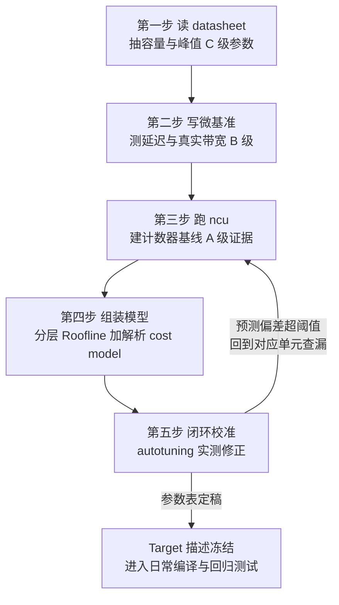
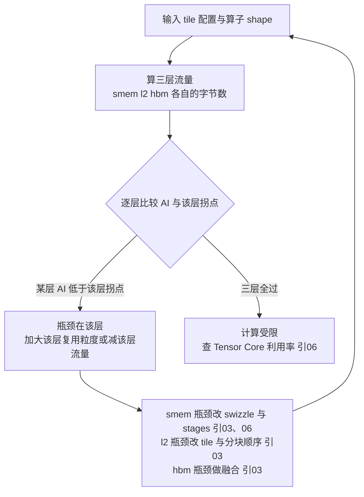
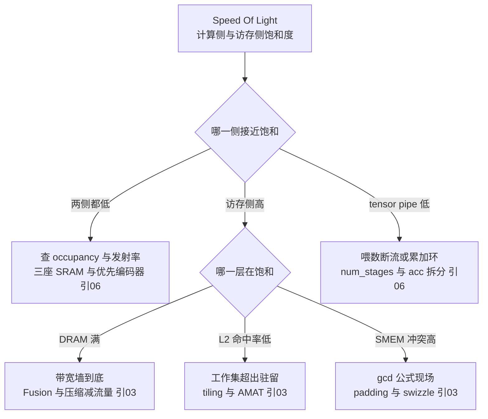
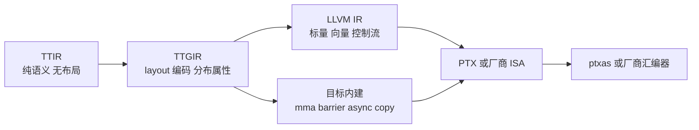

> **TL;DR**
>
> * **这是「给 AI 编译器工程师的芯片课」第十篇，也是全系列的收官压轴**。前九篇把四层契约之下的电路机制逐一拆开——PPA 三角与类型谱系（01）、SRAM 与良率 binning（02）、存储层次与 Little 定律（03）、ISA 编码与算术树（04）、流水线冒险与 II 公式（05）、warp/Tensor Core/异步队列（06）、脉动阵列与确定性执行（07）、互连阶梯与 NUMA（08）、真实产品验收（09）。本篇回答系列规划清单的最后一个问题：**这些硬件知识如何变成编译器里可计算的数字**——Target 描述参数从哪里来、Roofline 怎么用真实带宽数据算、cost model 吃哪些特征、ncu 计数器如何映射回前文的电路单元。
> * **三个对编译器最值钱的结论**：1 参数有三个来源，可信度必须分级——datasheet 只给上界与容量（C 级），微基准给延迟与真实带宽（B 级），ncu 计数器给瓶颈归因（A 级）；混用口径（boost 对基频、稠密对稀疏、标称对实测）是 cost model 最常见的系统性翻车原因。2 Roofline 是 cost model 的第一块积木但不是全部——单层版两个常数给算子分流，分层版把 SMEM/L2/HBM 的供价画成阶梯；同一个 GEMM 不分块时卡死在 L2 墙下、分块后三层全部翻越拐点，一行流量账就能看见 tiling 的定价。3 ncu 计数器 ↔ 硬件单元映射表是校准 cost model 的对照词典——achieved occupancy 读的是 06 篇的三座 SRAM，bank conflict 读的是 03 篇的 gcd 公式，tensor pipe 利用率读的是 06 篇的多周期流水与累加环；每个异常计数器都有一条回指前文某节的修复路径。
> * **叙事落点是给读者一套可复用的方法论**：拿到一块陌生芯片，标准动作只有五步——读 datasheet 抽 C 级参数、写微基准补 B 级参数、跑 ncu 建 A 级证据、组装分层 Roofline 与解析 cost model、用 autotuning 闭环校准。本篇动手实验：纯 Python 手搓三层 Roofline 计算器与 GEMM cost model 特征表生成器（无需任何硬件），再用 ncu 把一台真实机器的计数器逐个翻译回前九篇的电路单元。

---

## 1. 收官之问：拿到一块陌生芯片，标准动作是什么

前九篇是一本机制词典：四层契约给了要填的空格定义（01 篇），电路给出了每个空格背后的物理来源（02～08 篇），产品案例演示了怎么把发布会名词翻译回这些空格（09 篇）。但词典不等于操作手册——真正上手一块新芯片时，工程师面对的问题是：**先填哪个空、数字从哪来、填错了怎么发现**。

先把前九篇交给本篇的可建模资产盘点成一张表，它就是「Target 描述」这个概念的完整素材库：

| 出处 | 交给本篇的可建模结论 |
|:---|:---|
| 01 篇 | 四层契约的空格定义；算力分解公式；内存墙与拐点概念 |
| 02 篇 | 关键路径决定延迟；DVFS 教训——测量前必须锁频；良率 binning 导致 SKU 差异——参数必须运行时探测 |
| 03 篇 | 分层容量与延迟量级；Little 定律在飞下限；单层 Roofline 拐点；bank 冲突 gcd 公式；AMAT 公式 |
| 04／05 篇 | FMA 延迟＝算术树被切成四段（依赖链约 4 cycle）；延迟与吞吐是两个独立参数；模调度 II 下界公式 |
| 06 篇 | occupancy 三约束最小值函数；mma 多周期流水与累加环；`num_stages` 下界公式 |
| 07 篇 | 阵列利用率公式 U(M,N)；scratchpad 零方差——确定性目标的性能是恒等式而非估计 |
| 08 篇 | 四尺度互连价目表；die 间带宽矩阵；ring all-reduce 时间公式 |
| 09 篇 | 三代旗舰拐点表（153→295→1125）；三步翻译法——新名词到参数行的路径 |

把这些资产串成一个工作流，就是本篇的方法论总纲——**五步标准动作，首尾闭环**：



一句话方法论：**Target 描述不是一次读完文档抄出来的表格，而是「上界 → 实测 → 归因」三级证据逐步逼近出来的模型**。下面按这五步展开，每一步都把前文对应的机制钉回来。

## 2. Target 描述参数从哪里来：三个来源与可信度分级

### 2.1 来源一：datasheet 与白皮书（C 级：上界与容量）

官方文档是最容易拿到的一手材料，但要清楚它能承诺什么。峰值算力存在 boost 频率与基频两种口径、稠密与稀疏两种口径（01／09 篇反复强调）；标称带宽是接口理论速率而非可达值；容量类数字（SM 数、SMEM 上限、L2、HBM 容量）则是最可靠的部分。归纳成一张能／不能表：

| datasheet 能给（可靠） | datasheet 不能给（要靠实测） |
|:---|:---|
| 各层容量：SM 数、RF 总量、SMEM 上限、L2、显存 | 各层真实可达带宽（标称只是上界） |
| 峰值算力（注意 boost／稠密口径标注） | 指令延迟（FMA 约 4 cycle 这类数字文档不写） |
| 支持的指令与数据类型清单（ISA 承诺层） | 发射规则、双发射配对、replay 触发条件（微架构灰色地带，04／06 篇） |
| compute capability 特性表（warp 尺寸、线程槽位上限） | cache 命中行为、DRAM row buffer 表现 |
| 异步原语的语义（cp.async／TMA 的 PTX ISA 定义） | `num_stages` 该取几（下界可以推导，最优点靠实测） |

C 级参数的正确用法是**当下界约束和合法性判据**：SMEM 容量决定 tile 的硬上限（06 篇 occupancy 公式的 $C_{smem}$ 项），特性表决定 tensorize 合法性检查查哪张表——而不是当预测值用。

### 2.2 来源二：微基准（B 级：延迟与真实带宽）

ISA 只承诺语义不承诺时序（04 篇第一张表），所以延迟与吞吐必须自己测。方法在 05 篇拆 II 公式时已经用过，这里把它正式化为两个标准实验：

**测延迟用依赖链法。** 让 n 条同种指令首尾依赖（$r_1 \leftarrow f(r_1)$ 循环），流水线无法重叠，总时间就是纯链长：

$$T(n) \approx T_0 + n \cdot lat \quad\Rightarrow\quad lat = \frac{T(n_2) - T(n_1)}{n_2 - n_1}$$

**变量映射表**：

| 符号 | 含义 | 示例取值 | 维度/单位 |
|:---:|:---|:---|:---|
| $T(n)$ | n 条依赖指令的总耗时 | 由计时循环测得 | cycle 或 ns |
| $T_0$ | 固定开销（循环维护、取指） | 与 n 无关的截距 | 同上 |
| $lat$ | 单条指令延迟（回归斜率） | FFMA 实测约 4 | cycle/条 |
| $n_1, n_2$ | 两次链长（差分消掉 $T_0$） | 如 1000 与 2000 | 条 |

**测吞吐用独立链交织法。** 发射 c 条互不依赖的链轮转执行，当 $c \geq lat/II$ 时每条链的推进斜率就是 II——这正是 05 篇「喂饱 FP32 流水线只需 $\lceil 4/2 \rceil = 2$ 条独立链」的测量版。FFMA 延迟约 4 cycle、吞吐每分区每拍 16 lane 这些前文引用的数字，全部出自这类微基准的系统测量（[arXiv:1804.06826](https://arxiv.org/abs/1804.06826) 的 Volta 实证与 [arXiv:2208.11174](https://arxiv.org/abs/2208.11174) 的 Ampere 实证是两份范本）。

**测带宽要注意 Little 定律的下限。** 03 篇算过：A100 上要把 HBM 喂到满速，任意时刻需约 1 MB 数据在飞——所以 stream 类 kernel 必须数组足够大、grid 打满全部 SM，否则测出来的是延迟不是带宽。测出的「真实带宽 ÷ datasheet 标称带宽」这个比值本身就是一条 B 级参数（典型在八成上下浮动，具体以实测为准），cost model 里应该用它而非标称值。

### 2.3 来源三：ncu 计数器（A 级：瓶颈归因）

前两级来源回答「多快」，只有计数器回答「**卡在哪**」。一个 kernel 跑了 10 ms，Roofline 告诉你理论上限 3 ms，微基准告诉你各部件的裸性能——但「差的 7 ms 里访存占多少、Tensor Core 占多少、发射口占多少」，只有硬件计数器能给出归因。§5 给出完整的计数器 ↔ 电路单元映射表。

使用纪律三条（每条都有前文的血泪出处）：**其一，锁频**——DVFS 直接改写频率项，02 篇警告过不锁频的 autotuning 学到的是噪声；**其二，区分口径**——ncu 的指令计数对应 SASS 而非 PTX（04／06 篇），百分比指标的分母有 elapsed／active 之分，混用会差一整个 occupancy 因子；**其三，名称随版本浮动**——本文所有计数器名都是常用写法，实际以本地 `ncu --query-metrics` 输出为准（[Nsight Compute 官方文档](https://developer.nvidia.com/nsight-compute)）。

### 2.4 三级来源合成的 Target 参数清单

把四层契约的每个空格配上推荐来源与前文出处，就得到本篇的第一份交付物——**Target 描述该填什么的答案表**：

| 契约层 | 参数 | 推荐来源 | 前文出处 |
|:---|:---|:---|:---|
| L1 计算原语 | 数据类型集合与 mma shape 清单 | C 级：PTX ISA／厂商 ISA 文档 | 01／04 篇 |
| L1 计算原语 | 峰值算力（分精度） | C 级：datasheet，标注稠密／稀疏口径 | 01／09 篇 |
| L1 计算原语 | FMA／mma 延迟与 II | B 级：依赖链＋交织法微基准 | 04／05／06 篇 |
| L1 计算原语 | 舍入语义（fma contract 行为） | C 级：ISA 文档 | 05 篇 |
| L2 内存层次 | 各层容量（RF／SMEM／L2／HBM） | C 级：官方表 | 02／03 篇 |
| L2 内存层次 | 各层真实带宽 | B 级：stream 微基准，记录与标称比 | 03 篇 |
| L2 内存层次 | 各层延迟量级 | B 级：指针追逐／依赖链变体 | 03 篇 AMAT |
| L2 内存层次 | bank 数与宽度、sector 大小 | C 级：文档＋gcd 微实验验证 | 03 篇 |
| L3 执行模型 | warp 尺寸、warp slot 上限、block 上限 | C 级：compute capability 表 | 06 篇三约束 |
| L3 执行模型 | divergence 代价分布 | A 级：ncu 活跃线程比 | 06 篇掩码机制 |
| L3 执行模型 | 异步队列语义与粒度 | C 级：PTX ISA | 06 篇 §6 |
| L4 运行时 | launch 开销、graph 收益 | B 级：空 kernel 计时 | 01 篇 Lab |
| L4 运行时 | 卡间拓扑与带宽矩阵 | B 级：`nvidia-smi topo`＋nccl-tests | 08 篇阶梯表 |

> 💡 **编译器关联**：这张表就是 09 篇「三步翻译法」的落地形态——新名词翻译回电路、电路翻译成本表的某一行、每一行注明证据等级。LLVM 的 `SchedMachineModel`、Triton 后端的 target 元数据、各家 NPU 工具链的配置文件，本质都是在维护这张表的不同子集。

## 3. Roofline 实战：用 03 篇的数据把真实算子算一遍

### 3.1 两堵墙与拐点的复习

沿用 03 篇口径：算术强度 AI ＝ 总 FLOPs ÷ 总访存字节，可达性能受两堵墙夹制：

$$P_{achieved} = \min\big(P_{peak},\ AI \times BW\big), \qquad AI^* = \frac{P_{peak}}{BW}$$

代入 03／09 篇积累的常数（峰值取官方稠密口径，B200 为公开报道口径）：

| 配置 | 峰值 TFLOPS | 带宽 TB/s | 拐点 FLOPs/byte |
|:---|:---:|:---:|:---:|
| A100 FP32 CUDA Core | 19.5 | 2.04 | ≈9.6 |
| A100 FP16 TC | 312 | 2.04 | ≈153 |
| H100 FP16 TC | 989.5 | 3.35 | ≈295 |
| B200 FP8 | ≈4500 | ≈8 | ≈562 |
| B200 FP4 | ≈9000 | ≈8 | ≈1125 |

这张表的读法在 09 篇已经示范过：精度每降一档拐点翻倍，「硬件越来越挑食」（03 篇）。本篇补上它的另一半——**拐点是芯片属性，AI 是算子属性，两者的比较才是编译决策**。

### 3.2 算子的 AI 账本：从公式到四个真实算子

GEMM 的 AI 有通式。设元素宽 $w$ 字节，三个矩阵各至少读写一遍：

$$AI_{GEMM} = \frac{2mnk}{w\,(mk + kn + mn)} \;\xrightarrow{\;m=n=k=L\;}\; \frac{2L}{3w}$$

**变量映射表**：

| 符号 | 含义 | 示例取值 | 维度/单位 |
|:---:|:---|:---|:---|
| $m, n, k$ | GEMM 三维尺寸 | 4096 | 个 |
| $w$ | 单元素字节数（FP16 取 2） | 2 | 字节/元素 |
| $2mnk$ | 总浮点运算数（乘加各计一次） | $1.37\times10^{11}$ | FLOP |
| $w(mk+kn+mn)$ | compulsory 流量下限 | 约 $1.0\times10^{8}$ 字节 | 字节 |
| $AI$ | 算术强度 | FP16 下 $\frac{2L}{3w}\approx 1365$ | FLOP/byte |

四个算子当场分类（A100 FP16 拐点 153 为参照；attention 为教学近似，忽略 softmax 内部多趟扫描）：

| 算子 | FLOPs | 流量账 | AI | 判定与方向 |
|:---|:---|:---|:---:|:---|
| saxpy（FP32，n 元素） | $2n$ | $12n$ 字节 | 1/6 | 深度内存受限——只值得做访存合并 |
| naive softmax（FP32 四趟） | ~$5n$ | ~$20n$ 字节 | ~1/4 | 融合成单趟后流量减半以上（03 篇结论） |
| GEMM 4096³ FP16 | $2n^3$ | $6n^2 w$ 字节 | ≈1365 | 远超拐点——tensorize 与降精度才有钱赚 |
| attention n=4096，d=128，naive | $4n^2 d$ | $w(4nd+4n^2)$ ≈138 MB | ≈62 | **低于拐点**——内存受限 |
| 同上，FlashAttention 化 | $4n^2 d$ | $cw\cdot 3nd$（c 为分块重读系数，取 2）≈6 MB | ≈1365 | **翻越拐点**——计算受限 |

最后一行是全系列最有戏剧性的一笔账：**同一个注意力数学，fusion 把它从墙的这一边搬到那一边**——naive 版喂不满 Tensor Core 不是算得不够快，而是中间张量 $n^2$ 矩阵把带宽吃光了（[FlashAttention 论文](https://arxiv.org/abs/2205.14135)的 IO 视角）。这也再次验证 03 篇那句话：实测 AI 与算法下限的差额，就是编译器的盈利空间。

### 3.3 多层 Roofline：把供价画成阶梯

单层 Roofline 隐含假设「所有数据都从 HBM 来」，而 tiling 之后大部分复用发生在 SMEM 和 L2。把 03 篇的分层结构接上流量模型，得到多层版：

$$P \leq \min\Big(P_{peak},\ \min_\ell \; AI_\ell \times BW_\ell\Big), \qquad AI_\ell = \frac{\text{总 FLOPs}}{\text{第 } \ell \text{ 层实际搬运的字节数}}$$

关键在于 $AI_\ell$ 由 tile 配置决定。教学版的分块流量账（方 tile 边长 b）：数据每换一层存储，就要按该层的复用粒度重新付一遍搬运费：

$$B_{smem} \approx \frac{2mnk\,w}{b}, \qquad B_{l2} \approx \frac{2mnk\,w}{b}, \qquad B_{hbm} \approx w\,(mk+kn+mn)$$

即 **SMEM/L2 流量随 tile 边长线性下降、HBM 只付 compulsory 下限**——这就是「tile 越大越省供数」的定量出处，也是 07 篇 MXU 复用论证的 GPU 版。把三层各自的 $AI_\ell$ 与各自拐点比较，就能定位 kernel 到底贴着哪堵墙：



[Roofline 原始论文](https://crd.lbl.gov/departments/computer-science/PAR/research/roofline/)提出的就是这个框架的多层形态；今天 ncu 的 Speed Of Light 与 Memory Workload Analysis 分节，本质上把这个分析自动化成了两张百分比报表（官方文档口径）。

### 3.4 Roofline 的诚实边界

三条边界决定了它只能当 cost model 的第一块积木：**只含带宽不含延迟**——Little 定律的在飞要求（03 篇）要另算；**不含并发限制**——occupancy 三约束（06 篇）可能让理论带宽根本凑不出来；**不含同步与尾效应**——barrier 开销、wave quantization（尾部不满波）都在模型之外。补齐这三块，就是下一节的 cost model。

## 4. cost model 的特征工程

### 4.1 特征清单：三类特征与它们的来源

cost model ＝ f(硬件特征，算子特征，配置特征)。三类特征的来源正好走 §2 的三级供应链：

| 特征类 | 具体项 | 来源 |
|:---|:---|:---|
| 硬件静态 | 每 cycle 峰值 FLOPs（分精度）、各层每 cycle 供给字节、各层容量、延迟量级 | §2.4 清单 |
| 算子静态 | FLOPs、compulsory 流量、shape 维度比（M/N/K）、精度 w、归约维长度 | 图 IR 推导（03 篇算法下限） |
| 配置动态 | tile 形状、stages、num_warps、每线程寄存器、layout 选择 | autotuner 搜索空间（01 篇 schedule ↔ 电路对照表） |

### 4.2 解析骨架：一个 GEMM 时间模型的推导

把各资源的时间账都折成周期数，kernel 时间由最长的那条短板决定：

$$T \gtrsim \max\Big(T_{comp},\ T_{smem},\ T_{l2},\ T_{hbm}\Big), \qquad T_{comp} = \frac{\text{FLOPs}}{f \cdot P_{pc} \cdot U}, \qquad T_\ell = \frac{B_\ell}{BW_\ell^{cyc}}$$

**变量映射表**：

| 符号 | 含义 | A100 示例取值 | 维度/单位 |
|:---:|:---|:---|:---|
| $f$ | 核心频率（锁频后的实测值） | 1.41 GHz | 周期/秒 |
| $P_{pc}$ | 每 cycle 峰值 FLOPs（按精度取表） | CUDA Core 约 1.38 万；TC 场景每 SM 约 2048 | FLOP/cycle |
| $U$ | 阵列利用率（tile 形状决定） | 见下方公式 | 无量纲 |
| $BW_\ell^{cyc}$ | 第 ℓ 层每周期供给字节（标称×实测折扣） | HBM≈1450；L2≈3200；SMEM≈13500（聚合÷频率的示意换算） | 字节/cycle |
| $B_\ell$ | 第 ℓ 层流量（§3.3 分块账） | 随 b 变化 | 字节 |

利用率项 $U$ 是 07 篇 MXU 公式的直接推广，decode 小矩阵的悬崖在这里进模型：

$$U = \frac{m \cdot n}{\lceil m/b_m \rceil \cdot \lceil n/b_n \rceil \cdot b_m \cdot b_n}$$

这个骨架的价值不在精度而在**可解释性**：每一项都能追溯到一个物理部件，预测偏差大的时候能定位到「哪一项算错了」——是 $BW_\ell^{cyc}$ 的折扣系数没校准，还是 $U$ 被 padding 吃掉了，或是同步开销没建模。对 scratchpad 确定性架构（07 篇），这套骨架进一步退化为精确求和：没有 AMAT 期望、没有 cache 干扰，max 变成排好的时刻表，**cost model 从估计变成恒等式**——这正是确定性硬件给性能建模的最大红利。

### 4.3 归一化：让同一组参数跨芯片可用

学习式 cost model（AutoTVN/MetaSchedule 用 XGBoost 吃提取特征，[Ansor](https://arxiv.org/abs/2006.06762) 用代价模型剪枝搜索空间，均见 [TVM 官方文档](https://tvm.apache.org/docs/)）要在不同芯片间迁移，特征必须无量纲化。实用原则是把每个绝对量除以它的同类容量，变成「比例」：

* 吞吐类：$\text{FLOPs}/(f \cdot P_{pc})$ —— 占峰值的比例，A100 和 H100 可比；
* 强度类：$AI / AI^*$ —— 相对拐点的位置，直接编码「该做融合还是做 tensorize」（03 篇分流判据）；
* 地皮类：$s_b/C_{smem}$、$32 r_t/W_{slot}$、stages×$B_{stage}/C_{smem}$ —— 06 篇三约束的逐项占比；
* 几何类：$U(M,N)$、$\lceil m/b\rceil b - m$ 的 padding 比例 —— 07 篇阵列契约的对齐损耗；
* 拓扑类：边通信量 × 链路单价 —— 08 篇价目表的直接乘积。

相对特征的另一个好处是对「未验证」参数鲁棒：折扣系数错了只会整体缩放，排序往往不变——autotuner 关心排序远胜于绝对值。

### 4.4 校准闭环与已知失效模式

解析骨架给形状，少量实测点修系数：跑 K 个代表性配置 → 实测时间 → 对 $BW^{cyc}$ 折扣与固定开销做最小二乘 → 回归测试守护。校准数据本身用 §5 的计数器做归因（比如实测低于预测时，先看是 dram 吞吐没到还是 tensor pipe 没到）。已知失效模式清单，每条都能在前文找到根源：锁频失败引入 DVFS 噪声（02 篇）；PTX 层估算与 SASS 实际发射的系统性偏差（04／06 篇双发射不可见）；L2 在多 block 间的干扰使分块流量账失真（03 篇，干扰幅度未验证）；wave quantization 在 grid 不整除时的尾波损失（06 篇 tail effect，量级随 shape 浮动）。

## 5. ncu 计数器 ↔ 硬件单元映射表

### 5.1 对照词典：十二个核心指标的回链

这是本篇的第二份交付物。左列是 ncu 常用指标名（名称随架构与版本浮动，以 `--query-metrics` 为准），右列是它在系列里对应的那块电路——**每个异常读数都有一条回指前文的修复路径**：

| ncu 指标（常用名） | 读数含义 | 对应硬件单元／机制 | 低值或高值的修复路径 |
|:---|:---|:---|:---|
| sm__warps_active.avg.pct_of_peak_sustained_active | achieved occupancy：实际驻留 warp ÷ 槽位 | 06 篇三座 SRAM 最小值函数 | 低则查 $r_t$/spill、$s_b$、block 数三约束谁封顶 |
| smsp__issue_active.avg.pct_of_peak_sustained_active | 发射口每拍选出就绪 warp 的比例 | 06 篇优先编码器 | 低且 occupancy 高：依赖链过深，指令重排 |
| smsp__average_warps_issue_stalled_long_scoreboard_* | 停顿原因：等 global load 返回 | 05 篇 load-use 死角、03 篇在飞不足 | load 提前发射、加深 num_stages、异步拷贝 |
| smsp__average_warps_issue_stalled_short_scoreboard_* | 停顿原因：等 SMEM／短依赖 | 05 篇 forwarding 视角的短缝 | 依赖拆分、累加器轮转 |
| l1tex__data_bank_conflicts_pipe_lsu_mem_shared_op_ld/st | SMEM bank 排队重放次数 | 03 篇 gcd(s,32) 冲突公式 | padding／swizzle／layout pass |
| l1tex__average_t_sectors_per_request_pipe_lsu_mem_global_op_ld | 每请求 sector 数（越接近理想越连续） | 03 篇 32B sector 与 coalescing | 向量化加载、线程映射重排 |
| lts__t_sector_hit_rate.pct | L2 命中率 | 03 篇 tag/index/offset 与 AMAT | 加大 tile 让工作集驻留；分块顺序优化 |
| dram__throughput.avg.pct_of_peak_sustained_elapsed | HBM 供给利用率 | 03 篇 Roofline 底座与 Little 定律 | 高＝带宽墙已到底；低而慢＝在飞不足 |
| sm__pipe_tensor_cycles_active / inst_executed_pipe_tensor | Tensor Core 流水占用 | 06 篇 mma 多周期流水与累加环 | 拆累加器 fragment、调 block_m/n、验 swizzle |
| smsp__thread_inst_executed_per_inst_executed.ratio | 平均每指令活跃线程数（满 32 为无发散） | 06 篇活跃掩码两路串行 | 数据重排消除嵌套发散；if-conversion |
| launch__registers_per_thread / launch__occupancy_limit_* | ptxas 分配结果与封顶原因标注 | 03 篇 RF 地皮模型 | maxrregcount／launch_bounds 权衡 spill |
| gpu__time_duration 换算实测 FLOPS | 与 §3 Roof 上界的差值 | 本篇校准点 | 差值进 autotuner 目标函数与回归基线 |

### 5.2 判读流程：从两张报表到一节课文

实战判读的标准入口是 Speed Of Light（计算侧、访存侧两条饱和度）加上 stall 原因分解。把判读树画出来，每个叶节点都落在前面某一篇：



### 5.3 三个典型病例

**病例一：DRAM 吞吐低 ＋ occupancy 正常 ＋ sector/request 偏高。** 访存请求在打碎成零散 sector（03 篇：跳着读时有效带宽最多跌到 1/32），修复在线程映射与向量化宽度——这是 layout 问题不是并行度问题。

**病例二：tensor pipe 利用率低 ＋ long_scoreboard 停顿高。** 喂数断流：K 切片的异步预取深度不够（06 篇 $N_{stages} \geq 1+\lceil BW_{share}\cdot L_{mem}/B_{stage}\rceil$ 的下界没达到），或者 swizzle 缺失导致 ldmatrix 前 bank 排队。先验 stages 是否撞 SMEM 容量天花板，再验 layout。

**病例三：issue_active 低 ＋ achieved occupancy 低 ＋ launch__registers_per_thread 贴近 255。** 寄存器地皮封顶（03 篇平方诅咒），unroll 与 stages 推高的寄存器压力反噬了驻留 warp 数。解法是三旋钮联动收缩（`__launch_bounds__`、减 stage、减 tile），必要时接受 spill 换 occupancy 并用计数器验证哪种更亏。

## 6. Co-design 案例：把一块新芯片接进 Triton

### 6.1 为什么 Triton 是协同设计的教科书现场

[Triton](https://github.com/triton-lang/triton) 的中间层把「硬件相关决策」集中在一个位置：TTGIR 的 layout 编码（数据在各线程/各缓冲上的分布方式）。上层用户只写块状程序，下层 lowering 负责把 layout 映射到具体硬件的 SMEM swizzle、mma fragment、barrier 原语——**这条 pipeline 就是「Target 描述 → 编译决策」的最小完备样本**：



### 6.2 移植五步：套用第 1 节的标准动作

给一个新加速器写 Triton 后端（或任何编译器后端），就是把五步标准动作逐项落地：

1. **抽 C 级参数**：内存层次容量与分层（scratchpad 还是 cache？）、支持的矩阵指令形状、同步原语集合——填出 §2.4 的表。这一步决定 TTGIR 里合法 layout 的候选集。
2. **补 B 级参数**：对新指令跑依赖链与交织微基准（§2.2），拿到延迟与 II；对各级存储跑 stream 微基准拿真实带宽。没有这两个数，后面的 cost model 全是猜。
3. **建 A 级基线**：用厂商 profiler（或自埋性能计数器）建立「第一个 GEMM 跑通」的基线快照——哪怕慢十个倍数，有了计数器才有归因起点。
4. **组装模型**：把 §4.2 骨架里的常数换成新芯片的实测值；mma 形状对齐约束写成 tensorize 合法性检查（07 篇 fractal 契约的同款逻辑）；`num_stages` 下界公式换成新芯片的带宽延迟积。
5. **闭环验收**：autotuner 搜 tile/stages/layout，每组候选先用 cost model 排序再实测 top-K，偏差大的回到第 3 步看计数器——直到 §5.2 判读树上找不到明显病叶。

### 6.3 编译器 flag 暴露硬件能力的边界

co-design 的最后一课是知道**什么能通过 flag 交给用户，什么不能**。flag 是 Target 描述的用户界面，但界面能暴露的只有 ISA 承诺过的东西：

| 适合做成 flag／旋钮 | 为什么可以 | 不适合做成 flag | 为什么不行 |
|:---|:---|:---|:---|
| num_warps / num_stages | 映射 SMEM 分割与流水深度，语义清晰（06 篇公式可推导合理范围） | 双发射配对与 reuse cache | ptxas 内部灰色地带，SASS 层才可见（04／06 篇） |
| allow_tf32 类精度开关 | 改变的是数值语义档位，ISA 明文承诺（09 篇静默换挡教训） | RF bank 映射规避 | 社区逆向口径，无契约保证（03／06 篇） |
| maxrregcount / launch_bounds | RF 地皮的显式租户管理（03 篇） | 运行时统计反馈 | delayed scaling 这类动态策略属于运行时变量（09 篇 TE 案例） |
| 向量化宽度 hint | 对齐 coalescing 分析（03 篇 sector 模型） | 拓扑重构感知 | NUMA/OCS 拓扑是运行时可变输入，应进 placement pass 与 runtime（08 篇） |

一句话收束：**flag 能暴露「契约内」的能力，pass 能推导「契约外可静态判定」的选择，runtime 才能响应「运行时才知道」的状态——三者划不清边界，工具链就会把微架构玄学泄漏成用户选项**（fast-math 类开关的正确性争议正是这种泄漏的标本，05 篇舍入语义节）。

## 7. 编译器启示汇总

把本篇的方法论事实与对应的工程动作钉在同一张表上：

| 方法论事实 | 机制出处 | 工程动作 |
|:---|:---|:---|
| datasheet 只给上界与容量 | 01／02 篇口径问题 | C 级参数只作约束与合法性判据，不作预测值 |
| ISA 不承诺时序 | 04 篇契约表 | 延迟与 II 一律微基准实测，入库带环境标签 |
| 测量受 DVFS 污染 | 02 篇功耗公式 | 锁频是所有 benchmark 的前置条件 |
| 带宽可达值 ≠ 标称值 | 03 篇 Little 定律 | 记录「实测÷标称」折扣系数并进 cost model |
| 拐点比较才是编译决策 | 03 篇 Roofline | 以 AI/AI* 作为第一分流特征 |
| 分层供价随 tile 变化 | 03／06 篇 | 多层流量账作为 tile 搜索的解析剪枝 |
| 三约束封顶驻留数 | 06 篇 occupancy | 三地皮占比作为归一化特征组 |
| 计数器是唯一归因证据 | 06 篇执行引擎 | 建立「异常计数器 → 修复路径」词典（§5.1） |
| 确定性目标无估计噪声 | 07 篇 scratchpad | 面向 DSA 的 cost model 直接排时刻表 |
| 拓扑是运行时可变输入 | 08 篇 NUMA | 带宽矩阵进模型边权，放置留给求解器 |
| 新特性消化有时间差 | 09 篇生态窗口 | 移植五步＋计数器验收是标准抢跑姿势 |
| flag 只能暴露契约内能力 | 04／05 篇边界讨论 | 灰色地带进 pass，动态状态进 runtime |

## 8. 收官小结与局限

**带走四句话**：

1. Target 描述是三级证据逼近出来的模型：datasheet 给约束（C 级）、微基准给时序（B 级）、计数器给归因（A 级）——混用口径是一切 cost model 事故的第一案发现场。
2. Roofline 从单层用到多层：拐点表回答「芯片挑食到什么程度」，分块流量账回答「我的 tile 每层付多少运费」，两者相除就是每个 tile 配置的瓶颈定位——FlashAttention 一例证明 fusion 可以把算子搬过墙。
3. cost model 的特征工程是无量纲化：占峰值的比例、相对拐点的位置、三块地皮的占比、padding 的损耗率——跨芯片可迁移的从来不是周期数，而是比例。
4. ncu 判读树的每个叶子都通向前文某节课：低 occupancy 查三座 SRAM、高冲突查 gcd、断流查 stages 下界——**性能调优在这个系列里的终极形态，是拿着计数器词典做电路级归因**。

**全系列收口**：十篇走完，那条主线可以最后一次复述——编译器几乎不改变计算量，它改变的是数据移动的距离和等待的时间（01 篇开篇）；而这个「距离×时间」的价目表，从晶体管的 $CV^2$（02 篇）一路铺到机柜间的光与铜（08 篇），被真实产品验收（09 篇），最终在本篇收拢成一套可执行的建模方法论。拿到下一块陌生芯片时，愿你做的第一件事，是想起这份五步清单。

**本篇的局限**：文中所有带宽/延迟/利用率的示例数字均为公开资料的量级示意（A100 口径为主），不同 SKU 与频率档差异显著，引用前以官方 datasheet 为准；分块流量账忽略替换策略干扰、多 kernel 共享 L2 的争用与 wave quantization 的精确刻画（干扰幅度未验证）；学习式 cost model 的工程细节（特征抽取实现、回归策略）以 TVM/MLIR 各自文档为准；Triton 后端移植步骤基于其公开架构文档的通用流程，具体接口随版本快速演进。计数器名称均为常用写法，实际采集以目标机器 `--query-metrics` 输出为准。

## 动手实验（Lab）

读者可以自己跑以下三个小实验验证本篇观点（前两个不需要任何硬件）：

### Lab 1：三层 Roofline 计算器

```python
# 环境:任意 Python3。常数取 A100 口径(第 01/03 篇,示意):FP32 峰值 19.5 TFLOPS,
# HBM 2.04 TB/s,L2 聚合约 4.5 TB/s,SMEM 聚合约 19 TB/s,频率 1.41 GHz。
FREQ = 1.41e9
PEAK_PC = 19.5e12 / FREQ                      # 每 cycle 峰值 FLOPs(CUDA Core FP32)
LEVELS = {"SMEM": 19e12 / FREQ,               # 每 cycle 供给字节
          "L2":   4.5e12 / FREQ,
          "HBM":  2.04e12 / FREQ}

def roofline(name, flops, moved):
    """moved: dict,各层实际搬运字节数(由 tile 配置决定)。"""
    print(f"{name}:  FLOPs={flops:.2e}")
    for lvl, b in moved.items():
        ai = flops / b
        ridge = PEAK_PC / LEVELS[lvl]         # 该层拐点 = 峰值/供给
        cap = min(PEAK_PC, ai * LEVELS[lvl]) * FREQ
        tag = "计算受限" if ai > ridge else "内存受限"
        print(f"  经 {lvl:<4}: AI={ai:>9.1f}  拐点={ridge:>6.2f}"
              f"  性能上界={cap/1e12:6.1f} TFLOPS  {tag}")

n = 4096
roofline("saxpy(FP32)", 2 * n, {"HBM": 12 * n})
roofline("GEMM 不分块(FP16)", 2 * n**3,
         {"L2": 2 * n**3 * 2, "HBM": 2 * n**3 * 2})          # 每次乘加都从下层取数的教学上界
b = 64                                                        # tile 边长
roofline("GEMM tile=64(FP16)", 2 * n**3,
         {"SMEM": 2 * n**3 * 2 / b, "L2": 2 * n**3 * 2 / b,
          "HBM": 6 * n * n * 2})
# 观察:不分块的 GEMM 在 L2 层就内存受限(AI=0.5 < 拐点);
# tile=64 后三层全部翻越拐点——tiling 的定价一目了然。
# 试试把 b 改成 32 或 128,看 SMEM/L2 流量怎么随复用粒度线性变化(正文 3.3 节)。
```

### Lab 2：GEMM cost model 特征表生成器

```python
# 环境:任意 Python3。输出一组归一化特征(正文 4.3 节),对比 decode 与 prefill 两种 shape。
import math

def features(M, N, K, w=2, bm=128, bn=128, bk=64, stages=3,
             regs=168, smem_cap=164 * 1024, warp_slots=64, threads=256):
    flops = 2 * M * N * K
    util = (M * N) / (math.ceil(M / bm) * math.ceil(N / bn) * bm * bn)
    pad_ratio = 1 - util                       # padding 损耗(07 篇对齐税)
    per_stage = (bm + bn) * bk * w
    smem_frac = min(1.0, stages * per_stage / smem_cap)
    lim_reg = 65536 // (regs * 32)             # 06 篇三约束(A100 常数)
    blocks = min(smem_cap // (stages * per_stage), 2048 // threads)
    occ = min(lim_reg, blocks * (threads // 32), warp_slots) / warp_slots
    ai_norm = (flops / ((M*K + K*N + M*N) * w)) / (312 / 2.04)   # AI/AI*(FP16 TC)
    print(f"M={M:>5} util={util:6.1%} pad={pad_ratio:5.1%} "
          f"smem_frac={smem_frac:4.0%} occ={occ:5.0%} AI/AI*={ai_norm:8.1f}")

features(1,    4096, 4096)      # decode:utilization 悬崖(07 篇同款)
features(2048, 4096, 4096)      # prefill:完美对齐
features(64,   4096, 4096)      # decode batch=64:拼批把阵列拉回来的过程
# 试试改 regs 与 stages,观察 occupancy 与 smem_frac 的跷跷板(正文 4.2/4.3 节):
# 这组无量纲特征就是学习式 cost model 的输入行。
```

### Lab 3：用 ncu 把计数器词典跑一遍（需 NVIDIA GPU）

```bash
# 环境:NVIDIA GPU + ncu。对任意 GEMM kernel 采集正文 5.1 节的核心指标:
ncu --metrics \
sm__warps_active.avg.pct_of_peak_sustained_active,\
smsp__issue_active.avg.pct_of_peak_sustained_active,\
smsp__average_warps_issue_stalled_long_scoreboard_per_issue_active.ratio,\
l1tex__data_bank_conflicts_pipe_lsu_mem_shared_op_ld,\
lts__t_sector_hit_rate.pct,\
dram__throughput.avg.pct_of_peak_sustained_elapsed python bench.py
# 判读练习(正文 5.2 节判读树):先看 SOL 两侧谁饱和;
# 再把每个读数翻译回电路单元——低 occupancy 查三约束,
# bank conflict 高回去改 layout,long_scoreboard 高回去加深 num_stages。
# 计数器名随架构与 ncu 版本浮动,以本地 ncu --query-metrics 输出为准。
```

## 参考文献

| 主题 | 链接 |
|:---|:---|
| Williams et al., Roofline: An Insightful Visual Performance Model（ISCA'09/CACM，多层 Roofline 原始出处） | <https://crd.lbl.gov/departments/computer-science/PAR/research/roofline/> |
| NVIDIA Nsight Compute 文档（SOL/Memory Workload Analysis/指标体系官方出处） | <https://developer.nvidia.com/nsight-compute> |
| CUDA C++ Programming Guide（compute capability 表与占用计算官方出处） | <https://docs.nvidia.com/cuda/cuda-c-programming-guide/> |
| PTX ISA 文档（mma/cp.async/TMA/barrier 语义权威出处） | <https://docs.nvidia.com/cuda/parallel-thread-execution/> |
| Dissecting the NVIDIA Volta GPU Architecture via Microbenchmarking（依赖链测延迟的方法论范本） | [arXiv:1804.06826](https://arxiv.org/abs/1804.06826) |
| Demystifying the Nvidia Ampere Architecture（Ampere 微基准与吞吐口径） | [arXiv:2208.11174](https://arxiv.org/abs/2208.11174) |
| Zheng et al., Ansor: Generating High-Performance Operators with Search Space Tiering（OSDI'20，学习式代价模型与搜索） | [arXiv:2006.06762](https://arxiv.org/abs/2006.06762) |
| TVM 官方文档（MetaSchedule/cost model/autotuning 实现） | <https://tvm.apache.org/docs/> |
| Triton 官方仓库与文档（TTGIR layout 与后端移植口径） | <https://github.com/triton-lang/triton> |
| Dao et al., FlashAttention: Fast and Memory-Efficient Exact Attention（IO 视角融合的代表作） | [arXiv:2205.14135](https://arxiv.org/abs/2205.14135) |
| CUTLASS 文档与源码（Hopper pipeline/swizzle/warp specialization 的工业参考实现） | <https://github.com/NVIDIA/cutlass> |
| NVIDIA A100 白皮书/H100 产品页/B200 官方页（三代峰值与带宽口径） | <https://www.nvidia.com/en-us/data-center/h100/> |
| Jouppi et al., In-Datacenter Performance Analysis of a TPU（ISCA'17，确定性架构的性能分析视角） | [arXiv:1704.04760](https://arxiv.org/abs/1704.04760) |
| Ivanov et al., AI and Memory Wall（Roofline 拐点恶化的量化更新） | [arXiv:2406.01828](https://arxiv.org/abs/2406.01828) |
| MLIR 文档（Target 信息抽象与 lowering spec 的另一种组织方式） | <https://mlir.llvm.org/docs/> |
| 本系列前篇 | 《给 AI 编译器工程师的芯片课》01～09（01 四层契约、02 锁频教训、03 Roofline 与 Little 定律、04/05 延迟与 II、06 三约束与异步队列、07 利用率与确定性、08 互连价目表、09 拐点表与三步翻译法） |
| 中文社区解读 | 知乎站内搜「Roofline 模型」「Nsight Compute 指标解读」「Triton 后端」「cost model 自动调优」有多篇文章（质量参差，建议对照本文词典阅读） |

> （全系列完）十篇正章到此收官。建议回到[第一篇《总览：编译器眼中的芯片与四层契约》](01_overview_four_contracts.md)重读一遍开篇那张抽象栈——带着后面九篇的电路细节回头看，同一张图会呈现出完全不同的密度。目录级的阅读指南与本系列的延伸材料将在本目录 README.md 中整理发布。
