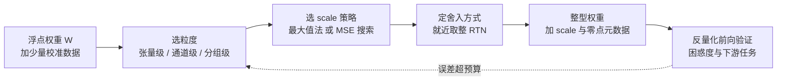

> **TL;DR**
>
> * **核心结论**：所有后训练量化（PTQ）算法其实都在解同一个损失函数 $\min_{\hat{W}} \mathbb{E}_x\lVert Wx-\hat{W}x\rVert^2$。本篇把这个损失的最简情形——固定均匀网格、就近取整（RTN）、启发式 scale——的数学彻底拆开：**scale 决定格距有多细，粒度决定 scale 有多少个，clipping 决定 scale 和分布尾部怎么折衷**。这三个自由度就是后面十几篇算法各自发力的地方。
> * **反直觉发现**：① 教科书里"$6.02b$ dB"是满幅均匀信号的**天花板而不是承诺**——高斯型权重在 4-bit 下用最常见的 max-scale 实测只有 **14.35 dB**，离天花板差 11.4 dB；② 主动裁掉分布尾部（最优裁剪比例 $\alpha^*\approx 0.5$）反而比"一个都不裁"白捡约 **5 dB**；③ 样本最大值随数据量按 $\sqrt{2\ln n}$ 漂移——校准集从一万条扩到一百万条，max-scale 会自己变大，这就是"换个校准集、精度就变了"的数学根源。
> * **系列定位**：这是「大模型量化算法」系列的地基篇（系列规划见同目录 ROADMAP）。后续每一篇算法都可以看作对本篇 RTN 基线的一个自由度做改造：GPTQ 改舍入策略、AWQ/SmoothQuant 改等效变换下的 scale、QuIP#/QuaRot 改权重分布本身。把对照组立稳，每一步改进才有的放矢。配套实验全部真实可跑（纯 numpy，几秒出图）：quantizer_granularity。

---

## 1. 为什么是量化：推理侧的三堵墙

大模型推理对量化有刚性需求，原因可以归结为三堵墙：

**显存墙**。70 亿参数模型以 FP16 存放权重要 14 GB，INT4 只要约 3.5 GB（加上 scale 元数据的开销，见 §7.2）——量化直接决定模型能不能装进目标显卡。更关键的是，LLM 解码阶段是典型的访存受限（memory-bound）负载：每生成一个 token 都要把全部权重从显存过一遍，位宽砍一半，解码吞吐就近似翻倍。这是 llama.cpp 这类项目能在笔记本上跑起大模型的前提[arXiv:2305.14314]。

**算力墙**。NVIDIA Ampere 及之后的 Tensor Core 上，INT8 吞吐是 FP16 的两倍；Hopper 之后 FP8 又在此基础上翻倍。prefill 阶段的批量矩阵乘是算力受限负载，低位宽直接兑换成算力[NVIDIA A100 datasheet]。

**能耗墙**。一次 DRAM 访问的能耗比一次浮点加法高两个数量级以上（Horowitz 的经典测量，ISSCC 2014）。权重从 FP16 变 INT4，搬运的比特数变成四分之一，能效账比算力账更好看。

这三堵墙决定了量化的评价体系永远是三元权衡：**精度损失 ↔ 位宽 ↔ 工程开销**（kernel 兼容性、元数据、异常分支）。本系列关心的数学，都发生在这个三角形的内部。

整个 PTQ 流水线的决策空间可以先画成一张总览图——本篇只展开其中"粒度""scale 策略""就近取整"三个节点，其余节点是后面各篇的主题：

## 2. 符号字典（全系列约定）

数学类系列最容易死于一词多义。这里把全系列的符号一次性锁定；后续各篇只允许**新增**行，不允许改义。凡与文献撞车的记号，在此声明本系列的取舍。

### 2.1 张量与网格

| 符号 | 含义 | 易混淆提示 |
|---|---|---|
| $x$ | 激活张量（浮点） | 区别于整数码 $q$ |
| $W$ | 权重矩阵 $W\in\mathbb{R}^{m\times n}$，$m$ 为输出通道数，$n$ 为输入通道数 | 行 = 输出通道，列 = 输入通道 |
| $q$ | 量化后的整数码，$q\in[q_{\min},q_{\max}]$ | **存在显存里的就是它**，不是 $\hat{x}$ |
| $\hat{x}$ | 反量化恢复的浮点值 $\hat{x}=s\,(q-z_p)$ | 与 $q$ 相差仿射变换，别混写 |
| $s$ | 步长（scale），$s>0$ | 本系列用 $s$ 不用 $\Delta$，$\delta$ 留给扰动小量 |
| $z_p$ | 整数零点（zero-point），元数据里实际存储的整数 | 区别于实数零点 $z_r=s\cdot z_p$（只出现在推导中，不存储） |
| $\epsilon$ | 量化误差 $\epsilon = x - \hat{x}$ | 分解为舍入误差 + 裁剪误差，见 §3.2 |
| $b$ | 位宽；带符号网格 $q_{\min}=-2^{b-1}$，$q_{\max}=2^{b-1}-1$ | 网格共 $2^b$ 个码字，但相邻码距只有 $2^b-1$ 格 |

### 2.2 粒度参数

| 符号 | 含义 | 易混淆提示 |
|---|---|---|
| $g$ | 分组长度（group size），沿输入通道轴切分 | GGUF/AWQ/GPTQ 默认常用 $g=128$ |
| axis | 参数共享轴：per-tensor 全局一套参数；per-channel 沿输出通道每个通道一套；per-group 每 $g$ 列一套 | AWQ/GPTQ 的"channel-wise"指每个**输出通道**独立 scale |
| $b_{\mathrm{eff}}$ | 有效位宽 $b + \dfrac{\text{bits}(s)}{g}\;(+\dfrac{\text{bits}(z_p)}{g})$ | 见 §7.2，group 不是免费的 |

### 2.3 误差度量

| 符号 | 含义 | 易混淆提示 |
|---|---|---|
| MSE | $\frac{1}{N}\sum_i (x_i-\hat{x}_i)^2$ | 本篇默认对元素求平均 |
| SNR | $10\log_{10}(\sigma_x^2/\mathrm{MSE})$，单位 dB | 是**方差比**不是峰值比；峰值比叫 PSNR |
| $\alpha$ | 裁剪比例，scale $=\alpha\cdot\max\lvert x\rvert/q_{\max}$，$\alpha\in(0,1]$ | **全系列专用记号**，不要挪用作学习率 |
| $M$ | 可表示的最大幅值 $M = s\cdot q_{\max}$ | 裁剪阈值的绝对值 |
| $u$ | 归一化裁剪点 $u = M/\sigma$（高斯场景） | 只依赖分布形状，不依赖样本量 |
| $t$ | 覆盖率 $t = M/a$（均匀分布 $U(-a,a)$ 场景） | 仅 §4.1 使用 |

### 2.4 后续篇章预留

为避免跨篇冲突，提前占用以下记号：$H$ 与 $C=\mathbb{E}[xx^\top]$ 分别留给 Hessian 与激活二阶矩（GPTQ/OBS 篇）；$\rho$ 留给旋转矩阵（QuaRot/SpinQuant 篇）；$\lambda$ 留给 LSQ 的步长梯度系数（QAT 篇）。本系列**不使用** $\Delta$ 表示步长。

## 3. 均匀量化器：定义与两条误差来源

### 3.1 仿射量化器

均匀（uniform）量化器把连续值映到 $2^b$ 个等间距电平上。最一般的仿射形式分两步：

$$
\underbrace{q = \mathrm{clip}\Big(\mathrm{round}\big(\tfrac{x}{s}\big) + z_p,\; q_{\min},\, q_{\max}\Big)}_{\text{量化：浮点} \to \text{整数}}
\qquad
\underbrace{\hat{x} = s\,(q - z_p)}_{\text{反量化：整数} \to \text{浮点}}
$$

引入**实数零点** $z_r = s\cdot z_p$ 可以看得更清楚：因为 $z_r/s=z_p$ 恰好是整数，编码式等价于

$$
q \;=\; \mathrm{clip}\Big(\mathrm{round}\big(\tfrac{x+z_r}{s}\big)\Big),
$$

也就是说：**先给分布整体平移 $z_r$，再以格距 $s$ 取整栅格**。平移负责"对齐分布的位置"，格距负责"分辨率"。这两个自由度分别由非对称量化的 zero-point 和 scale 控制——这就是为什么 affine 量化天然分成两件事来优化。

**zero-point 的闭式解**。非对称量化要求网格两端恰好罩住数据范围 $[x_{\min}, x_{\max}]$。把两个端点条件联立：

$$
\frac{x_{\max}}{s} + z_p = q_{\max}, \qquad \frac{x_{\min}}{s} + z_p = q_{\min}
$$

两式相减消掉 $z_p$：

$$
\frac{x_{\max}-x_{\min}}{s} = q_{\max}-q_{\min} = 2^{b}-1
\;\;\Longrightarrow\;\;
\boxed{\,s = \frac{x_{\max}-x_{\min}}{2^{b}-1}\,}
$$

代回任意一式得 $z_p = q_{\min} - x_{\min}/s$。注意这里有个隐藏动作：$z_p$ 必须**存成整数**（否则元数据吃掉省下来的位宽），所以实际取 $z_p = \mathrm{round}(q_{\min} - x_{\min}/s)$，这个取整会带来最多 $s/2$ 的**零点误差**——实数 $0$ 可能不再被精确表示。这对一般分布无害，但对依赖"精确零"的运算（卷积的 zero padding）是正确性问题，TensorFlow Lite 规范专门要求零点必须可精确表示[TFLite quant spec]；ONNX Runtime 同样提供对称模式规避此问题[onnxruntime quant]。**对称量化就是强制 $z_r=0$ 的特例**，代价是放弃一半负半轴或正半轴的表达范围。

### 3.2 对称还是非对称

| 维度 | 对称（$z_p=0$） | 非对称（$z_p\in\mathbb{Z}$） |
|---|---|---|
| 编码式 | $q=\mathrm{round}(x/s)$ | $q=\mathrm{round}(x/s)+z_p$ |
| scale | $\max\lvert x\rvert/q_{\max}$ | $(x_{\max}-x_{\min})/(2^b-1)$ |
| 元数据 | 只有 $s$ | $s$ 加 INT32 的 $z_p$ |
| 反量化乘法 | $\hat{x}=sq$ | $\hat{x}=s(q-z_p)$，多一次减法 |
| 适用分布 | 近似零对称（LLM 权重通常如此） | 明显偏斜（ReLU 后的激活全为正） |

经验法则来自分布形状：权重被训练的正则化拉向零附近、左右大致对称，用对称量化省掉 zero-point 的算术；激活经 ReLU/GELU 后单边偏斜，非对称能多榨出接近一位的有效精度。LLM 部署的主流配置因此是**权重对称 + 激活视情况**。§7.3 的实验会给一组同口径对比数字。

### 3.3 两条误差来源与变量映射

反量化值与原值的差 $\epsilon = x-\hat{x}$ 有两种来源：

1. **舍入误差（granular error）**：$x$ 落在网格内，被就近取整到相邻电平，$\epsilon\sim U(-s/2, s/2)$，方差 $s^2/12$；
2. **裁剪误差（saturation error）**：$x$ 超出 $[\,s(q_{\min}-z_p)+z_r,\; s(q_{\max}-z_p)+z_r\,]$ 被 clip 成边界电平，误差无界且由尾部质量决定。

理解"误差 = 舍入 + 裁剪"的二分，几乎所有 PTQ 算法的动机都能一句话说清：**减小 $s$ 让舍入误差变小、但更多点撞上边界被裁剪；增大 $s$ 反之**。scale 的选择就是这个折衷的定价问题（§4），而粒度决定这个定价被重复使用多少次（§7）。

把上面所有记号和配套实验代码钉在同一张映射表里（代码位于 `experiments/quantizer_granularity/run.py`）：

| 数学符号 | 代码变量 | Shape / 类型 | 说明 |
|---|---|---|---|
| $x,\;W$ | `x`, `W` | `(n,)`, `(m,n)` float64 | 被量化对象 |
| $s$ | `s` | 标量或可广播数组 | `sym_scale_minmax()` / `asym_params()` 产出 |
| $z_p$ | `zp` | 标量或可广播整数 | 对称时恒为 `0.0` |
| $q$ | （中间量） | int64 | `np.clip(np.round(x/s)+zp, qmin, qmax)` |
| $\hat{x}$ | `affine_quantize(...)` 返回值 | 同 `x` | 直接返回反量化结果 |
| $q_{\min},q_{\max}$ | `QMIN(b)`, `QMAX(b)` | int | $-2^{b-1}$，$2^{b-1}-1$ |
| $\alpha$ | `alphas` / 返回的 `alpha_opt` | `(71,)` 网格 / float | `mse_clipping_search()` |
| $M$ | `block_max` | 标量或逐行 `(m,1)` | `mse_clipping_search` 内部 `m` 变量 |

## 4. scale 的最优选择：从 min-max 到 MSE 最优裁剪

给定网格与舍入规则后，唯一待定的参数就是 scale。本节按"从可解到不可解"的顺序给三个层级：均匀分布的闭式解、高斯分布的数值解、以及任意真实分布的搜索法——它们分别对应工程里的三种做法：直接公式、按分布查表、校准集搜索。

### 4.1 均匀分布：闭式解完整推导

设 $x\sim U(-a, a)$，对称量化，可表示的最大幅值 $M = s\cdot q_{\max}$。定义**覆盖率** $t = M/a \in (0, 1]$，把 MSE 拆成舍入与裁剪两块。

**舍入项**。$\lvert x\rvert \le M$ 的概率为 $t$，这部分样本只承受舍入误差。高分辨率假设下（$2^b$ 足够大），舍入误差近似 $U(-s/2, s/2)$、方差 $s^2/12$，贡献

$$
\mathrm{MSE}_{\mathrm{round}} = t \cdot \frac{s^2}{12}.
$$

**裁剪项**。$\lvert x\rvert > M$ 的概率为 $1-t$，这部分样本被钉在边界 $M$ 上，误差为 $x - M$。对单侧尾部精确计算二阶矩：

$$
\mathbb{E}\big[(x-M)^2 \,\big|\, x>M\big]
= \frac{1}{a-M}\int_M^a (x-M)^2\,\mathrm{d}x
= \frac{1}{a-M}\cdot\frac{(a-M)^3}{3}
= \frac{(a-M)^2}{3},
$$

贡献 $(1-t)\cdot\frac{(a-M)^2}{3}$。代入 $s = at/q_{\max}$ 并归一化：

$$
\frac{\mathrm{MSE}(t)}{a^2}
= \frac{t^3}{12\,q_{\max}^2} + \frac{(1-t)^3}{3}.
$$

对 $t$ 求导、令其为零（中间步不跳）：

$$
\frac{\mathrm{d}}{\mathrm{d}t}\left[\frac{t^3}{12q_{\max}^2} + \frac{(1-t)^3}{3}\right]
= \frac{t^2}{4q_{\max}^2} - (1-t)^2 = 0
\;\Longrightarrow\;
\frac{t}{2q_{\max}} = 1-t
\;\Longrightarrow\;
t^* = \frac{2q_{\max}}{2q_{\max}+1} = \frac{2^b-2}{2^b-1}.
$$

代回 $s^* = a\,t^*/q_{\max}$：

$$
\boxed{\,s^* = \frac{2a}{2^b - 1}\,}
\qquad\text{vs. folklore 公式}\qquad
s_{\mathrm{folk}} = \frac{\max\lvert x\rvert}{q_{\max}} = \frac{a}{2^{b-1}-1} \approx \frac{2a}{2^b}.
$$

三个值得停下来的结论：

1. **最优解居然要裁剪**：$t^* = (2^b-2)/(2^b-1) < 1$，即使数据是均匀分布、根本不存在"离群值"，最优 scale 也应该牺牲最外侧 $1-t^*\approx 2^{-b}$ 的概率质量换取更细的格距。"一个都不裁"从来不是最优。
2. folklore 与闭式最优在 8-bit 只差 $2^b/(2^b-1)\approx 0.4\%$，4-bit 差 $16/15\approx 6.7\%$——**位宽越低，scale 公式的选择越重要**。
3. folklore 公式里藏着样本量：$\max\lvert x\rvert$ 是随机变量，见 §4.3 的漂移分析。

### 4.2 高斯分布：截断矩与数值最优

权重与激活都不是均匀分布，而是近似零均值、**重尾**的钟形。设 $x\sim N(0,\sigma^2)$，对称量化，$u = M/\sigma$ 为归一化裁剪点。先推导一个反复要用到的恒等式——标准正态的截断二阶矩。利用 $x\,\varphi(x) = -\varphi'(x)$ 分部积分：

$$
\mathbb{E}[X^2; X>u] = \int_u^{\infty} x^2\varphi(x)\,\mathrm{d}x
= -\int_u^{\infty} x\,\varphi'(x)\,\mathrm{d}x
= \underbrace{\big[-x\varphi(x)\big]_u^{\infty}}_{=\;u\varphi(u)} + \int_u^{\infty}\varphi(x)\,\mathrm{d}x
= u\varphi(u) + \big(1-\Phi(u)\big).
$$

裁剪项需要的是 $\mathbb{E}[(X-M)^2; X>M]$，把平方展开、逐项代入（标准正态下 $\mathbb{E}[X;X>u]=\varphi(u)$）：

$$
\mathbb{E}[(X-u)^2; X>u]
= \underbrace{\mathbb{E}[X^2;X>u]}_{(1-\Phi)+u\varphi} - 2u\underbrace{\mathbb{E}[X;X>u]}_{\varphi} + u^2\underbrace{\mathbb{P}(X>u)}_{1-\Phi}
= (1+u^2)\big(1-\Phi(u)\big) - u\varphi(u).
$$

双侧尾部乘 2。舍入项则是"落在网格内的质量"乘舍入方差，其中 $s=u\sigma/q_{\max}$。合并：

$$
\boxed{\;
\frac{\mathrm{MSE}(u)}{\sigma^2}
= \underbrace{\frac{u^2\,\big(2\Phi(u)-1\big)}{12\,q_{\max}^2}}_{\text{舍入项}}
+ \underbrace{2\Big[(1+u^2)\big(1-\Phi(u)\big) - u\varphi(u)\Big]}_{\text{裁剪项}}
\;}
$$

这个函数没有闭式根，数值求根得：$b=4$ 时 $u^*\approx 2.50$（$s^*\approx 0.36\sigma$），$b=8$ 时 $u^*\approx 4.0$。对照 folklore：$n=5\times10^5$ 个高斯样本的 $\max\lvert x\rvert\approx 4.7\sigma$，折算 $s_{\mathrm{folk}}\approx 0.67\sigma$——**比最优 scale 大约 89%**。位宽越低、分布越重尾，folklore 偏得越离谱。

### 4.3 实验：MSE 随裁剪比例的完整曲线

解析推导只给了两个分布的答案；真实分布（校准集直方图）走搜索路线——对候选 $\alpha$ 网格逐点量化、算 MSE、取最小。这正是 `run.py` 里 `mse_clipping_search()` 做的事，也是 GGUF 的 imatrix、TensorRT 的 entropy/MSE 校准的共同骨架（目标函数不同，后面各篇展开）。

**这张图回答四个问题**：

1. **内部最优点为什么存在**：$\alpha$ 变小时舍入项 $\propto\alpha^2$ 变小、裁剪项变大，两者此消彼长——高斯最优点 $\alpha^*=0.50$（即 $M^*=2.36\sigma$），拉普拉斯 $\alpha^*=0.35$（$M^*=3.23\sigma$）。
2. **裁剪到底值多少 dB**：高斯从 $\alpha=1$ 移到 $\alpha^*$，MSE 从 $0.0380\,\sigma^2$ 降到 $0.0120\,\sigma^2$，**白捡 5.02 dB**；拉普拉斯更夸张，**7.26 dB**。
3. **重尾分布的谷更宽**：拉普拉斯曲线在谷底附近平缓（$\alpha$ 在 0.32–0.40 之间 MSE 变化不到 3%），高斯更尖——重尾分布对裁剪点选偏更鲁棒，这是"百分位裁剪"在重尾激活上还能用的原因。
4. **实测与解析的差距有多诚实**：实测 $M^*=2.36\sigma$ vs 解析 $2.50\sigma$，差 5.6%。来源有三：有限样本（$n=5\times10^5$，实测 $\max=4.72\sigma$ 比理论典型值重）、$\alpha$ 网格分辨率（$\Delta M\approx 0.05\sigma$）、蒙特卡洛噪声。方向上实测更激进，因为经验尾部比拟合的高斯更重。

**样本 max 的漂移定律**。folklore 公式最大的隐患是 $\max\lvert x\rvert$ 随样本量增长。$n$ 个独立高斯样本的最大值近似为 $\sigma\sqrt{2\ln n}$（极值理论的启发式公式）：

| $n$ | $10^4$ | $10^5$ | $5\times10^5$ | $10^6$ |
|---|---|---|---|---|
| $\sqrt{2\ln n}\cdot\sigma$ | $3.85\sigma$ | $4.29\sigma$ | $4.66\sigma$ | $4.86\sigma$ |
| 实测（本实验） | — | — | **4.72σ** ✓ | — |

公式与实测吻合。这解释了一个工程现象：**换一个更大的校准集，max-scale 会自己变大、精度反而掉**——不是玄学，是极值统计。也解释了为什么百分位裁剪（如 99.99%）本质上是把"样本量的函数"换成"分布分位数的函数"，向 §4.2 的 $u^*$ 靠拢。

> **Lab 1（动手）**：把 `run.py` Demo C 的分布换成自由度 df=2 的学生氏 t 分布（`rng.standard_t(2, n)`），观察 $\alpha^*$ 向哪边移动、谷底变宽还是变尖；再把 `alphas` 网格从 71 点粗化到 11 点，看 $M^*$ 的测量值偏移多少——亲手复现"网格分辨率"这项误差。

## 5. SNR = 6.02b dB 的来历与三个陷阱

### 5.1 推导：三个信号模型，三条线

**均匀满幅信号**（$x\in[-V,V]$）：信号方差 $V^2/3$，无裁剪、$s = 2V/2^b$，噪声方差 $s^2/12$：

$$
\mathrm{SNR} = \frac{V^2/3}{(2V/2^b)^2/12} = \frac{V^2/3}{4V^2/(2^{2b}\cdot 12)} = 2^{2b}
\;\;\Longrightarrow\;\;
\boxed{6.02\,b\ \text{dB}}
$$

**满幅正弦**（峰值 $V$）：同样无裁剪，但正弦方差是 $V^2/2$，相对均匀信号多 $3/2$ 倍功率：

$$
\mathrm{SNR}_{\mathrm{sine}} = 6.02\,b + 10\log_{10}\tfrac{3}{2} = 6.02\,b + 1.76\ \text{dB}.
$$

**高斯 + 最优裁剪**：直接用 §4.2 的公式，SNR 就是 $\sigma^2/\mathrm{MSE}(u^*)$ 的对数——$b=4$ 解析值约 18.9 dB。注意它**不是** $6.02b$ 减个常数：$u^*$ 依赖 $b$，裁剪惩罚随位宽非线性变化。

### 5.2 实验：实测曲线对齐理论

`run.py` Demo A 在 $n=4\times10^5$ 样本上实测四种配置的 SNR：

**这张图回答四个问题**：

1. **6.02b 是真的吗**：均匀满幅实测 b=4→8 为 23.52→48.13 dB，斜率 6.15 dB/bit，渐近逼近 6.02——高分辨率假设在 b≥4 后成立。
2. **b=2 为什么掉线**：实测 9.55 dB，比理论 12.0 低 2.5 dB。只有 4 个电平时，量化噪声不再是"独立均匀"的白噪声，$s^2/12$ 假设失效。**2-bit 均匀量化在数学上就撑不住**，这是 QuIP#/AQLM 转向向量量化与码本的根因（08 篇伏笔）。
3. **scale 优化值多少钱**：高斯信号下 max-scale 与 MSE 最优 scale 的差距在 b=4 撕开到 **4.89 dB**（14.35 vs 19.24），b=8 收窄到 1.28 dB。**位宽越低，scale 选择越是一门大生意**——这就是 AWQ/OmniQuant 等算法在 4-bit 时代爆发的定量背景。
4. **天花板与现实的鸿沟**：4-bit 高斯实测 19.24 dB，离正弦天花板 25.8 差 6.6 dB，离均匀天花板 24.1 差 4.9 dB。**裁剪是低位宽不可回避的代价**。

### 5.3 三个陷阱清单

1. **把天花板当承诺**。$6.02b$ 属于满幅均匀/正弦信号；真实权重激活是重尾分布，4-bit 起步先扣 5–7 dB，再谈算法增益。
2. **误抄 +1.76 dB**。这个常数只是正弦信号的方差优势（$\log_{10} 1.5$），与量化器无关。语音/LLM 场景照抄它，会高估 1.76 dB 的理论上限。
3. **忽略样本量**。理论线假设"精确已知分布"；工程里的 max 来自有限校准集，按 $\sqrt{2\ln n}$ 漂移（§4.3）。校准集大小与组成，本身就是 scale 的超参数。

> **Lab 2（动手）**：把 Demo A 里高斯的分布换成 `rng.laplace(0, 0.25, n)`，看 4-bit 的 max-scale SNR 掉到多少（提示：重尾让裁剪惩罚更重）；再观察 b=7, 8 时实测斜率是否回到 6.02——验证"高分辨率渐近"与分布无关。

## 6. RTN：一切 PTQ 算法的对照组

### 6.1 定义与逐元素最优性

Round-to-Nearest（RTN）是量化器定义的直接执行：给定 scale 与粒度，

$$
\hat{W} = s \odot \mathrm{round}\big(W/s\big),
$$

每个元素独立地取最近的网格电平。逐元素看 RTN 是无可争议的最优：在所有可选电平中，最近的电平同时最小化绝对误差和平方误差，且误差被夹在 $\lvert\epsilon_i\rvert \le s/2$。

但**逐元素最优 ≠ 层最优，更 ≠ 任务最优**。这句话值得展开，因为后面所有算法都建立在对它的反驳上。

### 6.2 输出误差分析：白噪声假设的成立与破裂

层输出误差 $\Delta y = (W-\hat{W})\,x = \epsilon_W x$，其中 $\epsilon_W$ 是权重误差矩阵。对第 $i$ 个输出通道：

$$
\Delta y_i = \sum_{j=1}^{n} \epsilon_{ij}\, x_j
\;\;\xrightarrow{\;\epsilon \text{ 独立零均值}\;}\;\;
\mathbb{E}\big[\Delta y_i^2\big] = \sum_j \mathbb{E}[\epsilon_{ij}^2]\, x_j^2 = \frac{s^2}{12}\,\lVert x\rVert_2^2.
$$

整个层的期望输出误差就是 $m\cdot s^2\lVert x\rVert^2/12$——**期望意义上与权重内容无关，只由格距和输入能量决定**。这就是 RTN 在 8-bit 时代"够用"的数学解释：噪声是白噪声，能量可控，逐层平均后互相抵消。

把视角抬高一层，PTQ 真正想最小化的层损失是（$C=\mathbb{E}[x x^\top]$ 为激活二阶矩，全系列统一记号）：

$$
\boxed{\;\mathcal{L}(\hat{W}) = \mathbb{E}_x\big\lVert Wx - \hat{W}x\big\rVert^2 = \mathrm{tr}\big((W-\hat{W})\,C\,(W-\hat{W})^\top\big)\;}
$$

RTN 隐含地用 $\sigma_x^2 I$ 替换了 $C$——即假设误差与输入方向无关。这个假设在 LLM 上以两种方式破裂：

1. **误差与输入相关**：outlier 行的 $\epsilon$ 大，而 LLM 激活能量又恰好集中在少数方向——大误差撞上大输入，期望分析的低阶矩掩盖了高阶灾难；
2. **误差非白**：同一行的舍入误差在列间有结构（尤其分组共享 scale 时），无法逐层平均抵消。

GPTQ（04 篇）的第一性原理就藏在这个损失里：既然 $\mathcal{L}$ 有显式的 $C$ 加权，就不该逐元素独立取整，而应该**让后面列的量化误差去主动补偿前面列已经产生的误差**——把"白噪声"变成"受控抵消"。AWQ/SmoothQuant（02/03 篇）则是另一条路：先做等效变换改变 $W$ 与 $x$ 的分布形状，让 RTN 的假设重新成立。

### 6.3 为什么 8-bit 够用、4-bit 崩

每丢 1 bit，格距翻倍，噪声方差变四倍——**每 bit 恰好 −6.02 dB**，这就是 6.02b 斜率的工程含义。但 Demo A 的高斯曲线显示，低位的实际损失超过线性：max-scale 配置从 b=8 到 b=4 掉了 24.8 dB，比 $4\times 6.02=24.1$ 还多 0.7 dB——多出来的正是随位宽恶化的裁剪惩罚。

数字感受一下：8-bit 高斯实测 39.19 dB，相对均方误差 $\mathrm{MSE}/\sigma^2\approx 1.2\times10^{-4}$（RMS 相对误差约 1.1%），逐层平均后对困惑度的影响在噪声水平以下（LLM.int8() 论文的实证：INT8 与 FP16 输出几乎不可区分[arXiv:2208.07339](https://arxiv.org/abs/2208.07339)）。4-bit 即使做到 MSE 最优 scale 也只有 19.24 dB，相对均方误差约 1.2%、RMS 相对误差约 11%——**单层看不大，几十层乘性累积后就是灾难**。结论：8-bit 时代 RTN + max-scale 是合理的默认；4-bit 时代，scale 优化（本篇 §4）、粒度细化（§7）、舍入补偿（04 篇）、分布变换（02/03 篇）全部被迫上场。

## 7. 粒度：per-tensor → per-channel → per-group

### 7.1 形式化定义

设 $W\in\mathbb{R}^{m\times n}$（$m$ 输出通道 × $n$ 输入通道）。三种粒度就是"多少个元素共享一组 $(s, z_p)$"：

| 粒度 | 参数组数 | 共享范围 | 典型用户 |
|---|---|---|---|
| per-tensor | 1 | 全矩阵 | 早期 INT8 部署、动态激活量化 |
| per-channel | $m$ | 每个输出通道一整行 | ONNX Runtime、TensorRT 权重量化 |
| per-group($g$) | $m\cdot n/g$ | 每行每 $g$ 个输入通道 | GGUF k-quants、AWQ、GPTQ（$g=128$ 主流） |

per-group 的实现就是一次 reshape：$W$ 变形为 $(m,\, n/g,\, g)$，在最后一维上做 max/分位数统计，得到形状 $(m, n/g, 1)$ 的 scale 张量，量化后 reshape 回去——`run.py` 的 `demo_b()` 逐行可查。

### 7.2 存储开销：group 不是免费的

scale 通常存 FP16，zero-point 存 INT32。有效位宽：

$$
b_{\mathrm{eff}} = b + \frac{16}{g}\;\left(+\,\frac{32}{g}\ \text{若非对称}\right)
$$

| 配置（对称） | $b_{\mathrm{eff}}$ | 元数据税 |
|---|---|---|
| per-tensor（$g=\infty$） | $4.000$ | 0 |
| per-group $g=256$ | $4.063$ | +1.6% |
| per-group $g=128$ | $4.125$ | +3.1% |
| per-group $g=64$ | $4.250$ | +6.3% |
| per-group $g=32$ | $4.500$ | +12.5% |

$g=128$ 的元数据税只有 3%，换来的是 §7.3 里 9 dB 量级的精度收益——这是"分组量化成为现代默认"的定价逻辑。非对称再加 0.25 bit 的 $z_p$ 税，所以工程上"权重对称 + 分组"是最常见的组合。

### 7.3 实验：outlier 权重上的粒度阶梯

合成一个 $2048\times2048$ 权重矩阵：基底 $N(0, 0.02^2)$，注入 16 个整体 $\times 8$ 的"热行"（模拟系统性大动态范围通道）与 0.048% 的 $\times 30$ 散点（模拟局部极端权重），行间动态范围 P99/中位数达 7.6 倍。INT4 对称量化六种配置：

| 方法 | 权重 SNR (dB) | 相对输出误差 (%) | 说明 |
|---|---|---|---|
| per-tensor 对称 | **0.97** | **89.4** | 全局 max 被热行撑大 7.6×，普通行格距被绑架 |
| per-tensor 非对称 | 1.39 | 86.0 | 平移救不了格距问题 |
| per-channel 对称 | 5.80 | 51.4 | 隔离行间 outlier，行内散点仍拖累 |
| per-channel + MSE 裁剪 | 7.12 | 44.3 | $\alpha^*=0.44$：行内重尾仍值得裁 |
| **per-group(128) 对称** | **15.25** | **17.4** | 散点被关进 128 列的小格子 |
| per-channel 非对称 | 7.86 | 40.9 | 平移自由度 +2.06 dB（散点注入使行分布略偏） |

**这张表回答三个问题**：

1. **粒度阶梯为什么存在**：outlier 的空间局部性决定粒度收益。行间 outlier（热行）被 per-channel 解决，行内散点要 per-group 才能隔离——每细一级，就把一部分 outlier 关进更小的格子，让其余元素的格距回归正常。
2. **下游误差比权重 SNR 更残酷**：per-group 与 per-channel 的权重 SNR 差 9.4 dB，下游输出误差却差 3 倍（17.4% vs 51.4%）。矩阵乘对大误差行是凸放大的——这预告了用激活二阶矩 $C$ 加权的损失（§6.2）比裸权重 MSE 更接近真实伤害，GPTQ/AWQ 都在这个加权上下手。
3. **非对称的收益依赖分布偏斜程度**：本实验 +2.06 dB，真实权重上通常更小（分布更对称）——为 §3.2 的"权重对称默认"提供了数字支撑。

**诚实注脚**：本实验的散点 outlier（×30）比真实 LLM 权重更极端，绝对数字夸大了粒度差距；真实权重上 per-channel 与 per-group 的差距通常更温和。但**排序方向**与文献一致：AWQ 论文报告 group-wise 显著优于 per-tensor[arXiv:2306.00978](https://arxiv.org/abs/2306.00978)，GPTQ 的默认配置同样是 $g=128$ 分组[arXiv:2210.17323](https://arxiv.org/abs/2210.17323)，GGUF 的 k-quants 更是把"分组 + 变步长"做成了位布局设计（10 篇展开）。

> **Lab 3（动手）**：把 `make_weight_matrix()` 里 `hot_rows` 从 16 改到 256，看 per-channel 相对 per-tensor 的优势怎么变；再把散点注入关掉（`mask` 那两行），看 per-group 是否还领先 per-channel——预期领先幅度大幅缩水，验证"group 主要隔离的是行内局部 outlier"。

## 8. 批判与展望：Takeaway 与下一篇

**本篇解决了什么**：立起了量化器的完整数学底座——affine 量化与 zero-point 闭式解（§3）、scale 的三层最优选择与裁剪定价（§4）、6.02b dB 标尺及其三个陷阱（§5）、RTN 的期望误差分析与白噪声假设（§6）、粒度的形式化与定价（§7）。全部结论有配套实验背书，`run.py` 四秒复现。

**致命局限**：RTN 的三个假设在 4-bit LLM 上全部破裂——权重重尾让 folklore scale 偏差近一倍（§4.3）、误差与输入相关让白噪声分析失效（§6.2）、逐元素最优不等于层最优（§6.1）。而真正的风暴还在激活侧：LLM 激活存在系统性的 emergent outlier 通道，少数维度的幅值可达其余的 20 倍，且跨层固定位置出现[arXiv:2208.07339](https://arxiv.org/abs/2208.07339)——权重量化得再干净，矩阵乘撞上一个激活大数就前功尽弃。

**下一篇预告**：《大模型量化算法（01）：LLM.int8()——outlier 分解的数学与代价》。拆解混合精度分解 $Y = W_{I}x_{I} + W_{\bar{I}}\,\mathrm{quant}(x_{\bar{I}})$ 的阈值选择、为什么分解能精确恢复 FP16 语义，以及它为正确性付出的带宽代价——以及这个代价如何催生了 SmoothQuant 的"迁移"思想。

## 参考清单

**论文（ID 已逐一核验）**

- Nagel et al., *A White Paper on Neural Network Quantization*, [arXiv:2106.08295](https://arxiv.org/abs/2106.08295) —— 本篇 scale/clipping/粒度框架的规范出处
- Jacob et al., *Quantization and Training of Neural Networks for Efficient Integer-Arithmetic-Only Inference*, [arXiv:1712.05877](https://arxiv.org/abs/1712.05877) —— affine 量化器与 zero-point 的原始工程定义
- Dettmers et al., *LLM.int8(): 8-bit Matrix Multiplication for Transformers at Scale*, [arXiv:2208.07339](https://arxiv.org/abs/2208.07339) —— 01 篇主角，激活 outlier 的系统实证
- Frantar et al., *GPTQ: Accurate Post-Training Quantization for Generative Pre-trained Transformers*, [arXiv:2210.17323](https://arxiv.org/abs/2210.17323) —— 04 篇主角，$C$ 加权损失的逐列补偿
- Lin et al., *AWQ: Activation-aware Weight Quantization*, [arXiv:2306.00978](https://arxiv.org/abs/2306.00978) —— 03 篇主角，激活感知的 scale 与裁剪
- Dettmers et al., *QLoRA: Efficient Finetuning of Quantized LLMs*, [arXiv:2305.14314](https://arxiv.org/abs/2305.14314) —— NF4 非均匀格子的信息论动机（10 篇展开）

**代码与规范**

- 本篇配套实验：`technology/quantization/llm_quant_series/experiments/quantizer_granularity/`（numpy，4 秒复现全部图表）
- [llama.cpp](https://github.com/ggerganov/llama.cpp) —— k-quants 分组量化的工程标杆
- [mobiusml/hqq](https://github.com/mobiusml/hqq) —— data-free 解析 scale（§4.2 思想的工程化）
- [TensorFlow Lite 量化规范](https://www.tensorflow.org/lite/performance/quantization_spec) —— 零点精确表示要求
- [ONNX Runtime 量化文档](https://onnxruntime.ai/docs/performance/model-optimizations/quantization.html) —— per-channel 与对称模式的工程默认
- [NVIDIA A100 Datasheet](https://www.nvidia.com/content/dam/en-zz/Solutions/Data-Center/a100/pdf/nvidia-a100-datasheet-us-nvidia-1758950-r4-web.pdf) —— INT8/FP16 吞吐比

**系列导航**

- 系列规划：[ROADMAP.md](ROADMAP.md)（11 篇 PTQ 核心 + 4 篇 QAT）
- 上一篇：无（本篇为系列起点）｜下一篇：《01 LLM.int8()：outlier 分解的数学与代价》
- 交叉引用：本站《AI 编译器量化综述》提供编译器视角的互补叙述

**中文社区**：知乎与掘金上关于 LLM.int8() outlier 现象的复现讨论较多，本篇未能核验到稳定直链，暂不列出——后续各篇补齐（诚实标注：本节为占位，非完整来源）。
