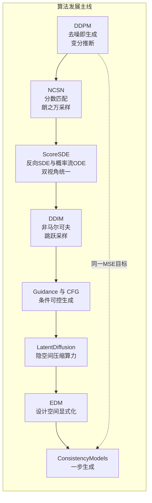
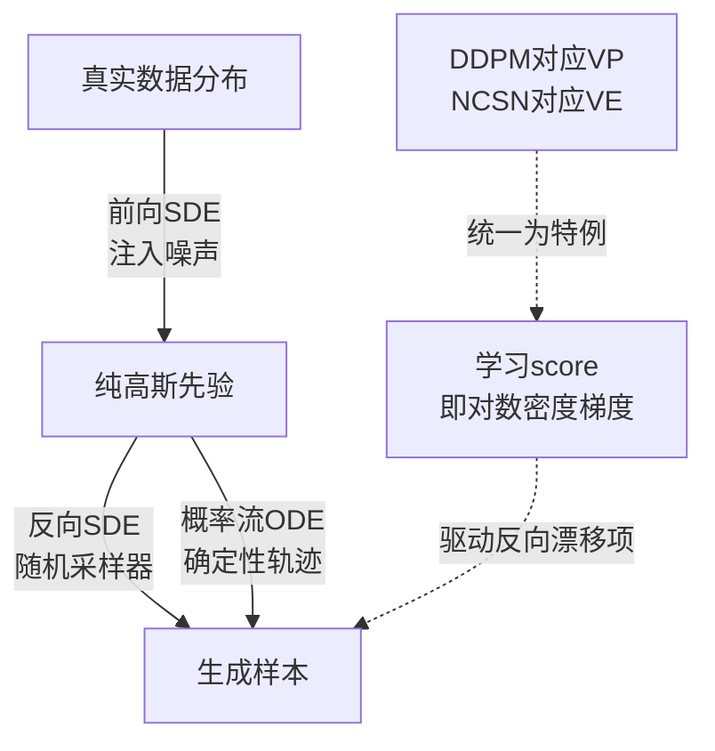

> **TL;DR 三连**
>
> - **核心结论**：扩散模型十年主线是"一个 MSE 目标函数的三次换装"——DDPM 把生成写成逐步去噪的变分推断（[arXiv:2006.11239](https://arxiv.org/abs/2006.11239)），score matching 从朗之万动力学另一侧抵达同一损失（[arXiv:1907.05600](https://arxiv.org/abs/1907.05600)），Score-SDE 用反向 SDE 与概率流 ODE 双视角把两条路焊成一套连续时间理论（[arXiv:2011.13456](https://arxiv.org/abs/2011.13456)）。
> - **反直觉发现**：采样加速（DDIM）、条件控制（guidance/CFG）、算力压缩（Latent Diffusion）、少步化（Consistency Models）没有一项来自新目标函数——全是同一去噪 MSE 之下的调度、参数化与表示空间工程；甚至 DALL·E 3 根本没有 arXiv 论文，任务流传的 arXiv:2310.16825 实为开源复现 CommonCanvas，本文按核实结果勘误标注。
> - **定位**：本篇是"算法发展 × 应用落地"双板块综述：前半程逐阶段给出核心公式推导，后半程覆盖图像、视频、音频、分子科学四大应用区，收尾给出扩散 vs 流匹配对峙表并挂接本站 FM 系列互链。



**阅读路线**：赶时间只读 TL;DR 加 §13 的对峙表；做系统研究按顺序精读 §2 至 §8 的推导并对照代码；关心落地直接跳到 §9 至 §12 的应用板块。所有引用论文均经 arXiv 摘要页逐条核实，工业产品（DALL·E 3、Sora）明确标注为非论文来源。

## 1. 问题设定：生成模型的三难困境

2015 到 2020 年，深度生成模型被一个三难困境卡住：**GAN 训练不稳定**（模式坍缩、对抗博弈需要精细的超参舞蹈），**自回归模型慢**（像素逐个生成，1000 步才能出一张图），**VAE 输出模糊**（高斯似然假设把误差平均化）。扩散模型给出的答案出人意料地简单：把"一步生成"这个难题拆成一千个"小幅去噪"的简单问题——加噪是容易的物理过程，去噪虽然难，但每一步只需要预测一点点噪声，而神经网络最擅长的恰恰就是回归这种均值为零的小残差。这个思路最早可追溯到 2015 年的 Sohl-Dickstein 等人（非平衡热力学生成建模），真正引爆则要等到 DDPM 在 CIFAR-10 上把 FID 打进 3.17（[arXiv:2006.11239](https://arxiv.org/abs/2006.11239)）。

## 2. 奠基：DDPM 的变分之路与 NCSN 的分数之路

### 2.1 前向过程：闭式加噪

DDPM 定义前向马尔可夫链，逐步给数据加高斯噪声：

$$
q(x_t \mid x_{t-1}) = \mathcal{N}(x_t;\, \sqrt{1-\beta_t}\, x_{t-1},\, \beta_t I), \quad t = 1,\dots,T
$$

令 \(\alpha_t = 1-\beta_t\)、\(\bar\alpha_t = \prod_{s=1}^t \alpha_s\)，利用高斯分布的可加性可以把任意步长的边缘分布写成**一步闭式解**——这是整座大厦最重要的工程性质：

$$
q(x_t \mid x_0) = \mathcal{N}(x_t;\, \sqrt{\bar\alpha_t}\, x_0,\, (1-\bar\alpha_t) I), \qquad x_t = \sqrt{\bar\alpha_t}\, x_0 + \sqrt{1-\bar\alpha_t}\, \epsilon, \; \epsilon \sim \mathcal{N}(0, I)
$$

训练时随机抽一个时刻 \(t\) 就能直接跳到 \(x_t\)，完全不必沿链模拟 \(T=1000\) 步。

### 2.2 反向过程与 ELBO 塌缩成 MSE

反向 \(p_\theta(x_{t-1}\mid x_t)=\mathcal{N}(\mu_\theta(x_t,t),\Sigma_\theta(x_t,t))\) 无法直接解析，但当前向固定时存在精确后验：

$$
q(x_{t-1}\mid x_t, x_0) = \mathcal{N}\!\left(\tilde\mu_t(x_t,x_0),\, \tilde\beta_t I\right), \quad \tilde\mu_t = \frac{\sqrt{\bar\alpha_{t-1}}\,\beta_t}{1-\bar\alpha_t} x_0 + \frac{\sqrt{\alpha_t}\,(1-\bar\alpha_{t-1})}{1-\bar\alpha_t} x_t
$$

对 \(\log p_\theta(x_0)\) 做 ELBO 分解，得到三项结构——重构项、各步去噪 KL、以及先验匹配项：

$$
-\log p_\theta(x_0) \leq \underbrace{\mathbb E_q\big[-\log p_\theta(x_0 \mid x_1)\big]}_{L_0} + \sum_{t=2}^{T} \underbrace{\mathbb E_q\big[D_{KL}\big(q(x_{t-1} \mid x_t, x_0)\,\|\,p_\theta(x_{t-1} \mid x_t)\big)\big]}_{L_{t-1}} + \underbrace{D_{KL}\big(q(x_T \mid x_0)\,\|\,\mathcal N(0,I)\big)}_{L_T}
$$

每一项都是两个高斯之间的 KL，全部可解析写出。关键操作是**重参数化**：由 \(x_0 = (x_t - \sqrt{1-\bar\alpha_t}\,\epsilon)/\sqrt{\bar\alpha_t}\) 把均值改写为噪声预测形式 \(\mu_\theta = \frac{1}{\sqrt{\alpha_t}}\big(x_t - \frac{\beta_t}{\sqrt{1-\bar\alpha_t}}\epsilon_\theta(x_t,t)\big)\)，代入后所有系数相消，损失塌缩成一个不带权重的朴素 MSE：

$$
L_{\text{simple}}(\theta) = \mathbb{E}_{t,\,x_0,\,\epsilon}\Big[\big\|\epsilon - \epsilon_\theta\big(\sqrt{\bar\alpha_t}\,x_0 + \sqrt{1-\bar\alpha_t}\,\epsilon,\; t\big)\big\|^2\Big]
$$

**推导的戏剧性在于：辛辛苦苦推出来的变分下界，最后只剩一句"预测你加进去的那个噪声"。** 复杂度全被藏进了网络训练里，这正是它后来能无限扩展的根本原因。DDPM 用这套极简目标在无条件 CIFAR-10 上拿到 Inception Score 9.46、FID 3.17，并在 LSUN 256 上追平 ProgressiveGAN（[arXiv:2006.11239](https://arxiv.org/abs/2006.11239)）。

### 2.3 训练循环代码骨架

```python
import torch
import torch.nn.functional as F

T = 1000
betas = torch.linspace(1e-4, 0.02, T)                # beta_t 线性调度
alphas_bar = torch.cumprod(1 - betas, dim=0)         # alpha_bar_t 前缀积

def q_sample(x0, t, noise):
    """前向闭式加噪: x_t = sqrt(abar)*x0 + sqrt(1-abar)*eps"""
    abar = alphas_bar[t].view(-1, 1, 1, 1)
    return abar.sqrt() * x0 + (1 - abar).sqrt() * noise

def train_step(model, x0, opt):
    B = x0.size(0)
    t = torch.randint(0, T, (B,), device=x0.device)          # 随机时刻
    eps = torch.randn_like(x0)                               # 真实噪声
    xt = q_sample(x0, t, eps)                                # 加噪样本
    loss = F.mse_loss(eps, model(xt, t))                     # 预测噪声的 MSE
    opt.zero_grad(); loss.backward(); opt.step()
    return loss
```

##### 变量映射表（数学符号 ↔ 代码）

| 数学符号 | 代码变量 | Shape / 类型 | 含义 |
|---|---|---|---|
| \(\beta_t,\ \bar\alpha_t\) | `betas`, `alphas_bar` | `(T,)` | 噪声强度与其累积乘积 |
| \(x_t\) | `xt` | `(B,C,H,W)` | 加噪后的样本 |
| \(\epsilon \sim \mathcal N(0,I)\) | `eps` | `(B,C,H,W)` | 被预测的目标噪声 |
| \(t \sim U[1,T]\) | `t` | `(B,)` | 随机时间步索引 |
| \(\epsilon_\theta(x_t,t)\) | `model(xt, t)` | `(B,C,H,W)` | 网络输出的噪声估计 |
| \(L_{\text{simple}}\) | `F.mse_loss(...)` | 标量 | 简化后的训练目标 |

### 2.4 另一条路：NCSN 的分数匹配与退火朗之万

几乎同时， score-based 路线完全不谈变分推断：学数据分布对数梯度（score）\(\nabla_x \log p(x)\)，再用朗之万动力学沿分数爬回数据流形（[arXiv:1907.05600](https://arxiv.org/abs/1907.05600)）。直接在真实数据上做分数匹配会因低维流形问题失准，NCSN 的解法是用多档高斯噪声扰动数据，再联合估计各噪声水平下的分数。Denoising Score Matching 给出了可回归的目标：若 \(p_\sigma(\tilde x) = \int p(x)\,\mathcal N(\tilde x; x, \sigma^2 I)\,dx\)，则

$$
\nabla_{\tilde x}\log p_\sigma(\tilde x)\Big|_{\tilde x = x + \sigma z} = -\frac{z}{\sigma}
\;\Longrightarrow\;
L = \sum_{i=1}^L \lambda(\sigma_i)\,\mathbb E\Big[\big\| s_\theta(x + \sigma_i z,\; i) + \tfrac{z}{\sigma_i} \big\|^2\Big]
$$

采样用退火朗之万动力学：从最大噪声档开始，每档迭代 \(x_k \leftarrow x_k + \eta_i\, s_\theta(x_k, i) + \sqrt{2\eta_i}\,z\)，逐档降低 \(\sigma_i\) 直到逼近数据流形。NCSN 在 CIFAR-10 上拿到当时最优的 Inception Score 8.87，且不需要对抗训练（[arXiv:1907.05600](https://arxiv.org/abs/1907.05600)）。

两条路线表面无关，实则同源：把 DDPM 的 \(\epsilon_\theta\) 除以 \(-\sqrt{1-\bar\alpha_t}\) 就是该噪声水平下的 score 估计。**DDPM 是离散时间的 VP-SDE，NCSN 是 VE-SDE 的特例**——这层窗户纸由 Score-SDE 捅破。

| 维度 | DDPM 视角 | NCSN 视角 |
|---|---|---|
| 理论框架 | 变分自编码器 / ELBO | 分数匹配 + 朗之万动力学 |
| 学习目标 | 预测加入的噪声 \(\epsilon\) | 估计 \(\nabla_x \log p_\sigma(x)\) |
| 采样方式 | 反向马尔可夫链逐步解码 | 多噪声档退火朗之万迭代 |
| 噪声参数化 | 离散 \(t=1..T\) 固定调度 | 连续多档 \(\sigma_1>\dots>\sigma_L\) |
| 缺点 | 采样需完整 \(T\) 步、似然不可算 | 超参敏感、无精确似然 |

## 3. 统一：Score-SDE 的 SDE / ODE 双视角

### 3.1 一支 SDE 统一两家

Song et al. 把前向加噪升级为连续时间的随机微分方程（[arXiv:2011.13456](https://arxiv.org/abs/2011.13456)）：

$$
dx = f(x, t)\,dt + g(t)\,dw
$$

VE 与 VP 只是漂移项 \(f\) 的两种取法：VP 对应 DDPM（\(f=-\tfrac12\beta(t)x\)），VE 对应 NCSN（\(f=0,\ g=\sqrt{d\sigma^2/dt}\)）。Anderson 1982 的经典结论给出**反向时间 SDE**：

$$
dx = \big[f(x,t) - g(t)^2\, \nabla_x \log p_t(x)\big]\,d\bar t + g(t)\,d\bar w
$$

注意反向漂移只依赖未知量 \(\nabla_x \log p_t(x)\)——恰好就是 score。于是"生成 = 学好分数 = 解反向 SDE"，DDPM 与 NCSN 从此成为同一框架的离散化特例，论文原话是"creating data from noise is generative modeling"，并用 predictor-corrector 采样器纠正数值误差（[arXiv:2011.13456](https://arxiv.org/abs/2011.13456)）。



### 3.2 概率流 ODE：确定性的孪生兄弟

同一分数还能构造一个**概率流 ODE**，其解轨迹的边缘分布与反向 SDE 完全一致但路径确定：

$$
dx = \Big[f(x,t) - \tfrac12 g(t)^2\, \nabla_x \log p_t(x)\Big] dt
$$

这个 ODE 化身带来三个礼物：其一，可用现成黑箱 ODE 求解器采样；其二，通过瞬时变量替换公式可**精确计算似然**；其三，把生成过程变成一条连续轨迹——后面 DDIM 的确定性采样和 Consistency Models 的轨迹压缩全都站在这条 ODE 上。双视角的价值在于：SDE 支路负责"怎么走得更准"（corrector），ODE 支路负责"怎么走得更省"（predictor）。

似然计算的具体形态值得单独写出来。沿概率流 ODE 的解轨迹，对数密度随时间的变化率等于速度场的散度：

$$
\frac{d}{dt}\log p_t(x_t) = -\nabla_x \cdot v(x, t), \qquad v(x,t) = f(x,t) - \tfrac12 g(t)^2 \nabla_x \log p_t(x)
$$

于是 \(\log p_0(x_0) = \log p_T(x_T) + \int_0^T \nabla_x \cdot v(x_t, t)\, dt\)，高维下散度用 Hutchinson 随机投影估计即可，无需构造雅可比矩阵——这让扩散模型第一次拥有了可与自回归模型对表的 bits/dim 指标。

## 4. 加速：DDIM 的非马尔可夫采样

DDPM 的痛点是采样必须走完整条马尔可夫链（CIFAR-10 上 20 小时才出一个 batch）。DDIM 的洞察是：**训练目标只依赖每一步的边缘分布 \(q_\sigma(x_t \mid x_0)\)，不依赖条件路径的马尔可夫性**。于是可以构造一族非马尔可夫前向过程——只要边缘分布保持 \(\mathcal N(\sqrt{\bar\alpha_t}x_0, (1-\bar\alpha_t)I)\) 不变，同一个训好的模型就能直接服务于一族新的推理过程（[arXiv:2010.02502](https://arxiv.org/abs/2010.02502)）。

在这族过程中取 \(\sigma_t = 0\) 得到确定性采样规则：

$$
x_{t-1} = \underbrace{\frac{\sqrt{\bar\alpha_{t-1}}}{\sqrt{\bar\alpha_t}}}_{\text{指向 } x_0 \text{ 的分量}}\, x_t \;+\; \sqrt{\bar\alpha_{t-1}\left(\tfrac{1}{\bar\alpha_t}-1\right) - 0}\; \epsilon_\theta(x_t, t) + \sigma_t z
$$

它的几何解释非常干净：把 \(x_t\) 投影到"预测的 \(x_0\)"方向再重新加噪到 \(t-1\) 时刻。由此获得三个能力：其一，**时间步跳跃**——只在子序列 \(\{\tau_1, ..., \tau_S\}\) 上迭代，10 到 50 倍墙钟提速且质量几乎不掉；其二，计算量与质量的显式权衡旋钮；其三，因为轨迹确定，不同初始噪声之间的插值具有语义连贯性（[arXiv:2010.02502](https://arxiv.org/abs/2010.02502)）。DDIM 是后来一切少步数蒸馏（渐进蒸馏、Consistency Models）的直接前身。

确定性 DDIM 采样循环只需十几行，与 §2.3 的训练骨架共享同一组 `alphas_bar`：

```python
@torch.no_grad()
def ddim_sample(model, shape, steps=50):
    """sigma=0 的确定性采样: 只在等距子序列上迭代"""
    x = torch.randn(shape)                          # 从先验 N(0, I) 出发
    taus = torch.linspace(T - 1, 0, steps).long()   # 999, 979, ... , 0 跳步序列
    for i in range(steps):
        t_now = taus[i]
        eps = model(x, t_now.expand(shape[0]))      # 复用 DDPM 训好的网络
        x0 = (x - (1 - alphas_bar[t_now]).sqrt() * eps) / alphas_bar[t_now].sqrt()
        if i == steps - 1:
            return x0                               # 最后一步直接输出预测的 x0
        t_next = taus[i + 1]
        abn = alphas_bar[t_next]
        x = abn.sqrt() * x0 + (1 - abn).sqrt() * eps   # 朝 x0 方向重加噪
    return x
```

## 5. 控制：从 classifier guidance 到 classifier-free guidance

### 5.1 Classifier Guidance：借分类器的梯度导航

Dhariwal & Nichol 用一组架构消融证明扩散模型可以在 ImageNet 128/256/512 全面超过 BigGAN-deep（FID 2.97 / 4.59 / 7.72），而超越的关键武器是 classifier guidance（[arXiv:2105.05233](https://arxiv.org/abs/2105.05233)）。贝叶斯分解给出条件分数：

$$
\nabla_{x_t} \log p(x_t \mid y) = \nabla_{x_t} \log p(x_t) + \nabla_{x_t} \log p(y \mid x_t)
$$

第一项是训练好的无条件 score，第二项用一个额外训练的噪声感知分类器 \(p_\phi(y\mid x_t)\) 提供梯度，并引入缩放系数 \(\gamma\) 控制引导强度：\(\tilde s = s_\theta + \gamma\, \nabla_{x_t}\log p_\phi(y \mid x_t)\)。\(\gamma>1\) 时相当于在分数场上做"外推"，用多样性换保真度——这是生成模型里第一次出现如此干净的"温度旋钮"等价物。

### 5.2 CFG：把分类器塞回生成模型自己

classifier guidance 的麻烦显而易见：要额外训练一个必须在带噪数据上鲁棒的分类器，且引导与生成两套网络互相牵制。Ho & Salimans 的解法堪称化繁为简的典范（[arXiv:2207.12598](https://arxiv.org/abs/2207.12598)）：训练时以概率 \(p_{\text{uncond}}\) 把条件 \(y\) 替换成空标记 \(\varnothing\)，让**同一个网络同时学会条件与无条件两种 score**；推理时对两者做线性外推：

$$
\tilde\epsilon_\theta(x_t, y) = \epsilon_\theta(x_t, \varnothing) + w\,\big(\epsilon_\theta(x_t, y) - \epsilon_\theta(x_t, \varnothing)\big), \quad w \geq 1
$$

当 \(w=1\) 退化为标准条件生成；\(w>1\) 则放大"条件减无条件"的方向，效果等价于一个隐式的、由生成模型自身充当的分类器梯度。CFG 免掉外挂分类器后立刻成为文生图的默认配置——Imagen、Stable Diffusion、DiT 全系标配，直到今天所有主流产品的 prompt 遵循度都建立在它之上。

```python
# CFG 只需三行：一次无条件前向 + 一次条件前向 + 线性外推
eps_uncond = model(xt, t, cond=None)          # 空条件分支
eps_cond   = model(xt, t, cond=text_emb)      # 条件分支
eps_hat    = eps_uncond + w * (eps_cond - eps_uncond)   # w: 引导强度
```

| 维度 | Classifier Guidance | Classifier-Free Guidance |
|---|---|---|
| 额外模型 | 需独立训练噪声鲁棒分类器 | 无，复用同一生成网络 |
| 训练改动 | 无 | 以约 10% 概率随机丢弃条件 |
| 推理开销 | 每步多一次分类器前向 | 每步多一次生成网络前向 |
| 引导强度 | 缩放系数 γ | 外推权重 w |
| 域泛化 | 受限于分类器类别集 | 任意条件模态（文本/布局/类别） |
| 历史地位 | 首次击败 GAN 的关键组件 | 现代文生图事实标准 |

## 6. 压缩：Latent Diffusion 把算力搬进隐空间

像素空间的扩散太贵：512×512 图像的去噪 U-Net 要在百万级维度上跑几百步，训练动辄数百 GPU 天。Rombach et al. 的方案是两段式：先用预训练自编码器把图像压成 8 倍下采样的隐表示（KL 正则或 VQ 正则均可），再把整个扩散过程搬到隐空间进行（[arXiv:2112.10752](https://arxiv.org/abs/2112.10752)）：

$$
z = \mathcal E(x), \quad \hat x = \mathcal D(z), \qquad L_{LDM} = \mathbb E_{\mathcal E(x),\, \epsilon,\, t}\Big[\big\|\epsilon - \epsilon_\theta(z_t, t, c)\big\|^2\Big]
$$

感知压缩（细节纹理）交给自编码器，语义组合（画什么）交给扩散模型——各干各的擅长事。条件注入通过 **cross-attention** 完成：query 来自隐特征展平，key 和 value 来自文本编码等条件序列 \(c\)，这让模型天然支持任意序列型条件而不必改架构。效果上 LDM 在大幅降低算力的同时保持质量，其开源版本就是 Stable Diffusion，直接引爆了开源文生图生态（[arXiv:2112.10752](https://arxiv.org/abs/2112.10752)）。

## 7. 理清：EDM 把设计空间摊开成旋钮

Karras et al. 对扩散模型做了系统性的祛魅：各家论文里看似不同的公式，很多只是**等价重参数化**，真正影响结果的只有预处理、网络参数化、加权与采样器几个正交选择（[arXiv:2206.00364](https://arxiv.org/abs/2206.00364)）。核心动作是把去噪函数写成标准化外壳包住任意网络：

$$
D_\theta(x;\sigma) = c_{\text{skip}}(\sigma)\, x + c_{\text{out}}(\sigma)\, F_\theta\big(c_{\text{in}}(\sigma)\, x;\; c_{\text{noise}}(\sigma)\big)
$$

\(c_{\text{skip}}, c_{\text{out}}, c_{\text{in}}, c_{\text{noise}}\) 四个函数把"输入输出该有什么尺度、噪声水平该怎么喂给网络"变成显式设计项，例如取 \(c_{\text{in}}(\sigma)=1/\sqrt{\sigma^2+\sigma_d^2}\) 保证输入方差与噪声无关。论文给出的参考取法（\(\sigma_d\) 为数据标准差）：

| 预处理函数 | 参考取法 | 设计意图 |
|---|---|---|
| \(c_{\text{skip}}(\sigma)\) | \(\sigma_d^2 / (\sigma^2 + \sigma_d^2)\) | 低噪声时输出趋近恒等，稳定小 σ 区间 |
| \(c_{\text{out}}(\sigma)\) | \(\sigma \cdot \sigma_d / \sqrt{\sigma^2 + \sigma_d^2}\) | 输出幅度随噪声水平缩放 |
| \(c_{\text{in}}(\sigma)\) | \(1 / \sqrt{\sigma^2 + \sigma_d^2}\) | 归一化网络输入方差 |
| \(c_{\text{noise}}(\sigma)\) | \(\ln(\sigma) / 4\) | 噪声条件压缩到 O(1) 尺度 |

训练损失相应变为按信噪比加权的去噪误差；采样侧改用 \(\sigma\) 单调调度配合二阶 Heun 修正，每步只需两次网络评估——先走一步欧拉预测，再用同一时间步长做一次校正评估取平均。合计改进后：CIFAR-10 条件生成 FID 1.79（35 次网络评估），ImageNet 64 重训后 FID 1.36，全部 SOTA（[arXiv:2206.00364](https://arxiv.org/abs/2206.00364)）。EDM 的最大遗产是思维方式：**别再发明新公式了，先说清楚你拧的是哪个旋钮。**

## 8. 提速到一步：Consistency Models

即便 DDIM 跳步，高质量生成仍要几十次网络评估。Song et al. 的 Consistency Models 直接攻击 NFE 下限（[arXiv:2303.01469](https://arxiv.org/abs/2303.01469)）。利用概率流 ODE 的性质——同一条轨迹上任意点 \((x_t, t)\) 沿 ODE 都汇到同一个起点 \(x_\epsilon\)——定义自洽性约束：

$$
f_\theta(x_t, t) = x_\epsilon \quad \text{对轨迹上所有 } t \in [\epsilon, T] \text{ 成立}
$$

满足约束的 \(f_\theta\) 就是一张"任意时刻一步跳回数据"的地图，天然支持一步生成。实现上有两个难点：边界条件用可微的外壳 \(f_\theta(x,t) = c_{\text{skip}}(t)\,x + c_{\text{out}}(t)\,F_\theta(x,t)\) 处理；训练分两种模式——一致性蒸馏（CD）用预训练扩散模型的 ODE 单步解 \(\hat x^\phi_{t_n}\) 作目标，一致性训练（CT）则靠自动微分估计 ODE 切向（省教师但更吃内存）。结果：一步生成 FID 3.55（CIFAR-10）、6.20（ImageNet 64），显著超过此前所有一步非对抗生成模型，还免费支持修复、上色、超分等零样本编辑（[arXiv:2303.01469](https://arxiv.org/abs/2303.01469)）。它宣告了扩散家族的终点形态：训练像扩散一样稳定，采样像 GAN 一样一步到位。

## 9. 应用一：图像生成——从骨干网革命到产品级闭环

### 9.1 DiT：把 U-Net 换成 Transformer

Peebles & Xie 回答了一个当时很自然却没人做干净的问题：扩散模型的去噪骨干能不能完全 Transformer 化？DiT 把隐空间切成 patch 序列，用标准 ViT 式 Transformer 做去噪，条件信息通过 adaLN-Zero（自适应层归一化加零初始化的门控）注入（[arXiv:2212.09748](https://arxiv.org/abs/2212.09748)）。核心发现是**可扩展性规律**：以 Gflops 衡量的前向复杂度越高（加深加宽或增多 token），FID 单调下降——这与 LLM 的 scaling law 遥相呼应。DiT-XL/2 在 ImageNet 256 类条件生成上拿到 FID 2.27 的 SOTA。更深远的影响在架构之外：DiT 证明了"扩散 + Transformer"组合可以无修改地扩展到任意模态序列，它因此成为 Sora、PixArt 等视频/文生图系统的直接骨架。

### 9.2 Imagen：语言模型比图像模型更重要

Google 的 Imagen 只用一个轻量级扩散 U-Net，却拿到了 COCO 上 FID 7.27 的零样本 SOTA——秘密全在文本侧：**预训练大语言模型（T5-XXL）的文本嵌入远比 CLIP 更能编码复杂语义，扩大语言模型带来的收益显著大于扩大图像模型**（[arXiv:2205.11487](https://arxiv.org/abs/2205.11487)）。系统采用级联结构（64→256→1024 逐级超分），配合动态阈值化抑制高引导强度下的饱和伪影；配套的 DrawBench 基准在人工评测中胜过 VQ-GAN+CLIP、LDM 与 DALL·E 2。"文本编码器决定上限"这一发现重塑了此后所有文生图系统的资源分配。

### 9.3 DALL·E 3：没有论文的产品与一次必要勘误

DALL·E 3（OpenAI，2023 年 9 月）是工业产品的里程碑：其系统报告《Improving Image Generation with Better Captions》公开的核心经验是**用高质量合成描述重写训练语料的 caption**，从而根治了图文对齐数据里"描述偷懒"的老毛病，大幅提升 prompt 遵循度。需要明确勘误的是：**DALL·E 3 本身没有 arXiv 论文**，任务链中流传的 arXiv:2310.16825 实为 MosaicML 的 CommonCanvas——该工作经摘要核实是用约七千万张 Creative-Commons 图片配合成式 caption 训练的开源扩散模型族，仅用 SD2 所需 LAION 数据量约 3% 的成本拿到可比质量（[arXiv:2310.16825](https://arxiv.org/abs/2310.16825)）。两者在"合成 caption 重写数据"这条技术路线上互相印证，但一个是闭源产品报告、一个是开源复现研究，引用时不可混为一谈。

## 10. 应用二：视频生成——时间轴上的扩散

视频扩散的第一性难题是把图像 U-Net 扩到时空四维后算力爆炸。三条代表性路径给出了不同答案。Ho et al. 的 Video Diffusion Models 用**图像视频联合训练**降低小批量梯度方差加速优化，配合基于重建的预训练目标，首次在大规模文本条件视频生成上给出可信结果（[arXiv:2204.03458](https://arxiv.org/abs/2204.03458)）。Make-A-Video 则证明**不必依赖成对的文本-视频标注**：视觉概念学自图文对，运动规律学自无监督视频片段，再用分解式的时空模块插进时间轴（[arXiv:2209.14792](https://arxiv.org/abs/2209.14792)）。Imagen Video 把级联推到极致：基础模型加空间/时间超分级联生成高清视频，采用 v-prediction 参数化稳定训练，并用渐进蒸馏配合 CFG 实现快速采样（[arXiv:2210.02303](https://arxiv.org/abs/2210.02303)）。

Sora（OpenAI，2024 年 2 月）必须单独说明：它是**技术报告而非同行评审论文**。报告展示的核心思路是在 DiT 骨架上处理时空 latent patch，统一可变分辨率、时长与画幅，并强调"视频压缩器 + Transformer 扩展律"的组合。由于无公式细节、无消融实验，学术引用时应标注为工程报告。

## 11. 应用三：音频——波形与潜空间两条战线

音频扩散有两条战线。波形侧的 DiffWave 是非自回归波形生成模型，通过常数步数的马尔可夫链把白噪声整形成结构化波形，在 mel 谱图条件的神经声码器任务上 MOS 达 4.44、追平强基线 WaveNet 的 4.43 且快几个数量级，在无条件波形生成这类困难任务上则显著超过自回归与 GAN 方法（[arXiv:2009.09761](https://arxiv.org/abs/2009.09761)）。潜空间侧的 AudioLDM 把 LDM 思想平移到声音：用对比语言-音频预训练（CLAP）提供连续音频表示，在其潜空间上训练扩散模型，单卡在 AudioCaps 上训练即达当时最优的文本到音频指标，并首个支持零样本文本引导的声音风格迁移（[arXiv:2301.12503](https://arxiv.org/abs/2301.12503)）。语音合成、歌声转换、音乐生成等后续系统几乎都是这两条路线的排列组合。

## 12. 应用四：分子与科学计算——对称性即先验

科学计算里扩散模型的最大优势是可以把领域约束写成前向过程的几何。分子生成的 E(3) Equivariant Diffusion Model 同时对**连续特征（原子坐标）与离散特征（原子类型）**做联合去噪，网络对平移、旋转、反射等欧氏变换保持等变性，使"物理合法构型"成为归纳偏置而非事后过滤，还给出分子的似然计算方法，样本质量与训练效率全面超过此前 3D 分子生成方法（[arXiv:2203.17003](https://arxiv.org/abs/2203.17003)）。药物设计侧的 DiffDock 把分子对接重构为**非欧流形上的生成问题**：将对接自由度分解为平移、旋转、扭转角三者的乘积空间并在其上定义扩散过程，PDBBind 上 top-1 成功率 38%，显著超过传统搜索方法（23%）与深度学习回归方法（20%）；面对计算折叠出的蛋白结构也保持 21.7% 的精度，而旧方法跌至约 10%（[arXiv:2210.01776](https://arxiv.org/abs/2210.01776)）。蛋白设计方向还有 RFdiffusion（Watson et al., Nature 2023）等里程碑——注意它发表于期刊而非 arXiv，本节仅作背景提及。这些工作共同宣告：扩散不只是画图的玩具，而是可微物理先验的载体。

| 应用板块 | 代表工作 | 核心技巧 | 关键数字 |
|---|---|---|---|
| 图像 | DiT / Imagen / DALL·E 3（非论文） | Transformer 骨干 / 大文本编码器 / 合成 caption | FID 2.27 IN256 / 7.27 COCO |
| 视频 | VDM / Make-A-Video / Sora（非论文） | 图像视频联合训练 / 免文本视频对 / 时空 patch | 首批大规模 T2V 结果 |
| 音频 | DiffWave / AudioLDM | 波形马尔可夫链 / CLAP 潜空间 | MOS 4.44 / 单卡 SOTA |
| 分子科学 | E(3) EDM / DiffDock | E(3) 等变去噪 / 非欧流形扩散 | 对接 top-1 38% |

## 13. 对峙与合流：扩散 vs 流匹配

### 13.1 流匹配在学什么

Flow Matching 从连续归一化流（CNF）出发，但绕开了模拟训练的昂贵瓶颈：直接回归**固定条件概率路径的向量场**。取高斯路径 \(x_t = (1-t)\,x_0 + t\,\epsilon\)，最优速度场就是两端点之差，于是训练目标退化为又一个 MSE：

$$
L_{FM} = \mathbb E_{t,\,x_0,\,\epsilon}\Big[\big\| v_\theta(x_t, t) - (\epsilon - x_0) \big\|^2\Big], \qquad x_t = (1-t)\,x_0 + t\,\epsilon
$$

它证明这样训练的 CNF 与扩散路径兼容——扩散只是其路径族的一个子集，而最优传输（OT）位移插值等非扩散路径能带来更快的训练与采样、更好的泛化，ImageNet 上似然与样本质量全面占优（[arXiv:2210.02747](https://arxiv.org/abs/2210.02747)）。Rectified Flow 用几乎相同的公式从"拉直路径"角度切入：学习连接两分布的最直 ODE，递归地做 reflow 可以让少步甚至一步采样成为可能（[arXiv:2209.03003](https://arxiv.org/abs/2209.03003)）。

参数化之间的互换也只是一行线性代数。一般路径写成 \(x_t = \alpha_t x_0 + \sigma_t \epsilon\)，则速度目标为 \(\dot\alpha_t x_0 + \dot\sigma_t \epsilon\)；rectified flow 取 \(\alpha_t = 1-t,\ \sigma_t = t\) 就退化为 \(\epsilon - x_0\)；Imagen Video 采用的 v-prediction 则定义 \(v = \alpha_t \epsilon - \sigma_t x_0\)，三者都是 \(x_0, \epsilon\) 的线性组合、已知其一即可换算——**公式之争从来是路径与数值稳定性的争论，不是目标的争论**。工业界的裁决来自 Stable Diffusion 3：大规模对照实验表明对时间步分布做感知相关的偏置（logit-normal）后，rectified flow 公式在高分辨率文生图上稳定优于既有扩散参数化，配套的 MM-DiT 双权重架构呈现可预测的 scaling 曲线（[arXiv:2403.03206](https://arxiv.org/abs/2403.03206)）。

### 13.2 对峙表：同一枚硬币的两面

| 维度 | 扩散模型（DDPM 谱系） | 流匹配 / Rectified Flow |
|---|---|---|
| 回归目标 | 噪声 \(\epsilon\) 或速度 \(v\)（等价参数化之一） | 条件速度场 \(\epsilon - x_0\) |
| 训练理论 | 变分推断 ELBO / score matching | CNF 向量场回归（免模拟） |
| 概率路径 | VP/VE 固定加噪路径，曲率大 | 可选直线、OT 位移插值等 |
| 采样动力学 | 反向 SDE（随机）+ 概率流 ODE（确定） | 纯 ODE（也可加随机性扩展） |
| 少步能力 | 需蒸馏（DDIM 跳步、Consistency Models） | 直线路径天然利于少步求解 |
| 似然计算 | Score-SDE 支路可精确计算 | ODE 瞬时变量替换原生支持 |
| 工业采用 | SD1/2、DALL·E 系列、Imagen、Sora | SD3、Flux、电影级视频管线 |
| 关系定位 | 历史主线，工程生态最厚 | 统一框架的现役形态 |

一句话总结：**流匹配不是扩散的替代品，而是把扩散吸收为特例之后的更一般语法；2024 年之后的新系统默认用流匹配的语言说话，但它们共享同一个 MSE 灵魂与本节之前的一切工程遗产（CFG、隐空间、蒸馏、scaling law）。** 本站 FM 系列深入解读占位：《[流匹配入门](./fm-series-entry)》《[Rectified Flow 与再流](./fm-series-reflow)》（待发布互链）。

## 14. 批判与展望

**算力税仍然存在。** 即便 EDM 把 NFE 压到 35、Consistency Models 压到 1，多步采样的推理成本仍是 GAN 类单次前向的数十倍；一致性训练对内存与超参的要求又把门槛转移回了训练侧。"一步生成 + 高保真"目前仍是在质量上让步换来的近似解，而非免费午餐。

**评估体系失真。** FID 依赖 Inception 网络的特征分布假设，对模式坍缩不敏感、与人眼偏好相关性有限；人工评测则昂贵且不可复现。整个领域的论文对比建立在一个所有人都知道有问题的指标上，这是比模型缺陷更深的方法论风险。

**失败模式未被根治。** 复杂组合指令（数量、空间关系、文字渲染）依然是重灾区；DALL·E 3 的合成 caption 与 Imagen 的大语言编码器都在缓解而非解决语义鸿沟。深伪滥用、训练数据版权争议（LAION 语料法律诉讼）、水印与内容溯源则是悬在整个行业头上的合规之剑。

**合成数据回路是双刃剑。** DALL·E 3 式的合成 caption 重写已经是"模型生成数据训练模型"的雏形，视频与 3D 领域正在复制这条路线；但生成数据回流训练会放大模型自身偏置并侵蚀分布尾部，长期效应尚无定论。如何在工程收益与分布坍缩风险之间设卡，是未来两年必须补上的方法论缺口。

**三个开放前沿值得下注。** 其一是统一多模态的生成骨架——DiT 式 patch 化已经让图像视频共享一套 Transformer 语言，音频与 3D 正在路上；其二是世界模型方向，视频生成的下一步是可控、可交互的物理仿真环境；其三是科学计算的深化，当等变性先验遇上更大的算力，蛋白质、材料、分子的逆向设计可能比像素艺术更早产生不可替代的现实价值。

## 结语

回头看这条十年主线，最有启发性的不是任何单篇论文，而是一个反复出现的模式：**理论给出一个足够简单的目标，工程在目标不动的前提下持续榨出十倍收益**。DDPM 的 MSE 没变，DDIM 换了采样路径、CFG 换了条件注入方式、LDM 换了表示空间、EDM 换了公式组织法、Consistency Models 换了轨迹利用法；流匹配登场后连框架都统一了，训练目标依然是那个 MSE。对读者的实操建议浓缩成三句话：读懂 §2 的推导就掌握了全领域的一半；把 §5 的 CFG 权重和 §4 的跳步序列当成日常旋钮去建立手感；评估新论文时先问一句——它拧的是哪个旋钮，还是真的换了目标。

## 附：三个高频误区

**误区一："扩散模型是马尔可夫链，所以必须逐步采样。"** 马尔可夫性只是 DDPM 选择的前向构造，训练目标只约束边缘分布 \(q(x_t \mid x_0)\)；DDIM 正是利用这一点换掉条件路径、保留边缘分布，从而获得跳步与确定性采样。链是手段，边缘分布才是契约。

**误区二："CFG 权重越大，图越符合 prompt。"** 外推在放大条件方向的同时也在放大 OOD 方向：\(w\) 过大会出现高饱和、过曝与构图坍缩（Imagen 为此发明动态阈值化），多样性同步下降。工程上 \(w\in[3,8]\) 是文生图的常见舒适区，超出即进入收益递减区。

**误区三："流匹配是新目标函数，取代了扩散。"** 两者的损失同属"回归一个高斯路径派生的目标场"家族，扩散参数化可视为速度场的等价重写；差别在于路径族选择与由此带来的曲率、少步友好度。SD3 的对照实验比较的是同一目标下的不同公式配置，而非两个不相干的目标。

## 参考与延伸阅读

### 算法发展主线

- DDPM 奠定去噪即生成的范式，简化损失至今未变（[arXiv:2006.11239](https://arxiv.org/abs/2006.11239)）；NCSN 从分数匹配与朗之万动力学另一侧抵达同一目标（[arXiv:1907.05600](https://arxiv.org/abs/1907.05600)）；Score-SDE 以反向 SDE 与概率流 ODE 完成大一统（[arXiv:2011.13456](https://arxiv.org/abs/2011.13456)）。
- DDIM 用非马尔可夫前向打开跳步采样的大门（[arXiv:2010.02502](https://arxiv.org/abs/2010.02502)）；classifier guidance 首度让扩散击败 GAN（[arXiv:2105.05233](https://arxiv.org/abs/2105.05233)）；CFG 则以极简改动统治了此后所有条件生成（[arXiv:2207.12598](https://arxiv.org/abs/2207.12598)）。
- Latent Diffusion 重定义了算力预算与开源生态（[arXiv:2112.10752](https://arxiv.org/abs/2112.10752)）；EDM 把设计空间摊开成正交旋钮（[arXiv:2206.00364](https://arxiv.org/abs/2206.00364)）；Consistency Models 给出一步生成的终点形态（[arXiv:2303.01469](https://arxiv.org/abs/2303.01469)）。

### 应用落地

- 图像：DiT 确立 Transformer 骨干与 scaling 规律（[arXiv:2212.09748](https://arxiv.org/abs/2212.09748)）；Imagen 证明文本编码器决定上限（[arXiv:2205.11487](https://arxiv.org/abs/2205.11487)）；CommonCanvas 是 DALL·E 3 路线的开源印证（[arXiv:2310.16825](https://arxiv.org/abs/2310.16825)），DALL·E 3 与 Sora 本体为工业产品技术报告、非论文。
- 视频：VDM 的联合训练配方（[arXiv:2204.03458](https://arxiv.org/abs/2204.03458)）、Make-A-Video 免文本视频对（[arXiv:2209.14792](https://arxiv.org/abs/2209.14792)）、Imagen Video 级联高清化（[arXiv:2210.02303](https://arxiv.org/abs/2210.02303)）。
- 音频：DiffWave 波形声码器（[arXiv:2009.09761](https://arxiv.org/abs/2009.09761)）与 AudioLDM 文本到音频（[arXiv:2301.12503](https://arxiv.org/abs/2301.12503)）。
- 分子科学：E(3) 等变分子扩散（[arXiv:2203.17003](https://arxiv.org/abs/2203.17003)）与 DiffDock 对接生成（[arXiv:2210.01776](https://arxiv.org/abs/2210.01776)）。

### 流匹配延伸

- Flow Matching 免模拟训练 CNF 的原始提案（[arXiv:2210.02747](https://arxiv.org/abs/2210.02747)）；Rectified Flow 拉直路径与 reflow（[arXiv:2209.03003](https://arxiv.org/abs/2209.03003)）；SD3 的工业级验证（[arXiv:2403.03206](https://arxiv.org/abs/2403.03206)）。

### 中文社区与博客

- 苏剑林的《生成扩散模型漫谈》系列（科学空间 kexue.fm）是中文世界最系统的逐篇精读，知乎上有大量转载与讨论，适合与本文互相校对推导细节。
- Lilian Weng 的综述博文 What are Diffusion Models?（lilianweng.github.io）覆盖 SDE 推导与引导采样；掘金与知乎上关于 Stable Diffusion 源码拆解的专栏文章适合补齐工程视角。

> 🧪 **动手练习**
>
> - **练习一**：用本文 §2.3 的代码骨架在 MNIST 上跑通一个最小 DDPM（约 30 行即可收敛到可辨认样本）。试试把 \(T\) 从 1000 改到 100、把线性 \(\beta\) 调度换成 cosine 调度，观察样本质量与训练稳定性的变化，并解释为什么损失曲线几乎不变。
> - **练习二**：加载任意开源文生图权重，把 CFG 权重 \(w\) 从 1.0 扫描到 12.0 各生成一组图。动手整理一条"多样性—保真度—prompt 遵循度"随 \(w\) 变化的权衡曲线，再用 DDIM 把采样步数压到 20 步以下，检验权衡曲线是否整体左移。
