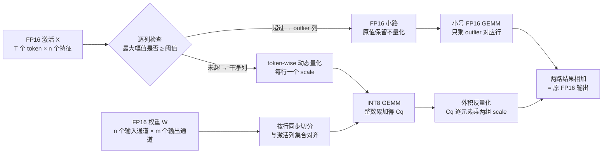

> **系列导航** ｜ [课程路线图](/quantization-roadmap/) ｜ **Part 1 · Weight-only PTQ** ｜ 第 02 篇 / 共 26 篇
>
> [← 01 量化器数学地基与 RTN](/2026/08/23/llm-quant-00-quantizer-fundamentals-rtn/) ｜ [03 GPTQ →](/2026/08/24/ptq-02-gptq/)

> **TL;DR**
>
> * **核心结论**：LLM.int8() 的全部数学是一个严格等式——把激活矩阵按列拆成「干净列」集合 $$I$$ 与 outlier 列集合 $$\bar{I}$$，GEMM 随之拆成 INT8 主路与 FP16 小路：$$XW = X_I W_I + X_{\bar{I}}W_{\bar{I}}$$。**分解零近似，近似只发生在 INT8 路径的 RTN 上**。outlier 必须拆的原因藏在 scale 的 max 绑定机制里：一个约 130 的尖峰把正常值的有效位宽压到实测 2.98 bit（分解后恢复至 7.80 bit）——本篇实测，粒度细化只能收回三成误差（31.4%），物理分离才能回到基线（相对朴素 RTN 改善 792 倍）。
> * **反直觉发现**：① INT8 失败是相变不是渐变——论文观察 ≤2.7B 无碍、6.7B 出现系统性 outlier、175B 直接崩溃[arXiv:2208.07339](https://arxiv.org/abs/2208.07339)；② 本篇阈值扫描显示失效是跳变式的：$$\tau$$ 在 [6,120] 平台内误差纹丝不动（恒为 $$2.562\times10^{-6}$$），越过 160 一列都拦不住、误差瞬间跳回 token-wise 水平——没有温和退化区；③ FP16 小路在数学上几乎免费（FLOPs 占比 ≈ outlier 列占比 0.4%，GEMM 层访存只多 0.4%），真正的代价在工程端——串行 kernel、物化中间张量、反量化 epilogue，让大模型端到端延迟不降反升。
> * **系列定位**：这是 01 篇结尾埋的雷「激活侧 emergent outlier」的正式拆弹。01 篇证明权重量化的白噪声假设在 8-bit 下成立；本篇证明它对激活不成立，并给出第一代解法「绕开」（FP16 小路）。09 篇 SmoothQuant 将给出第二代解法「搬走」——用等效变换把 outlier 迁进权重，重新合并两条路径。配套实验真实可跑（纯 numpy，几秒出图）：llmint8_mixture。

---

## 1. 从 01 篇的裂缝说起：INT8 在 LLM 上的相变式失败

### 1.1 规模阈值现象

01 篇 §6.3 给出的结论是「8-bit RTN + max-scale 是合理默认」，证据来自白噪声期望分析：误差能量 $$m\cdot s^2\lVert x\rVert^2/12$$ 可控、逐层平均后互相抵消。但那套分析有个隐含前提——**scale 本身是正常的**。LLM.int8()（Dettmers et al., NeurIPS 2022）用一组跨规模的对照实验击碎了这个前提[arXiv:2208.07339](https://arxiv.org/abs/2208.07339)：

| 模型规模（OPT 系列） | 激活侧观察 | 朴素 INT8 RTN 表现 |
|---|---|---|
| ≤ 2.7B | 无破坏性 outlier | 困惑度基本无损 |
| 6.7B 起 | 出现幅值异常大的特征维度（emergent outliers） | 开始劣化 |
| ≥ 13B | outlier 数量增多、向 FFN 中间层扩散 | 明显劣化 |
| 175B | outlier 几乎遍布各层、强度更大 | 完全崩溃、输出失去连贯性 |

*表 1：朴素 INT8 随模型规模的劣化路径（均为论文观察，arXiv:2208.07339）*

两个细节值得停下来想：

1. **相变不是渐变**。「劣化」不是随参数量平滑增长的曲线，而是在 6.7B 附近突然出现、随后迅速失控的开关。这暗示背后是一个结构性机制被跨过临界规模后激活，而不是数值精度不足的累积效应。
2. **emergent 的含义**。outlier 不是数据噪声，而是训练动力学留下的固定通路：位置跨 token、跨 batch 稳定复现，幅值随规模增长。这直接排除掉一类局部修复——换更好的舍入规则、加更细的时间轴粒度，都动不了「特征轴上固定几个维度幅值失控」这个事实。

### 1.2 论文的三级设计阶梯

LLM.int8() 论文内部的推进路线本身就是一部微型教材——每一级都在修补上一级的失效模式[arXiv:2208.07339](https://arxiv.org/abs/2208.07339)：

| 设计层级 | scale 方案 | 谁来救 outlier | 失效模式 |
|---|---|---|---|
| 一级：tensor-wise | 全局一个 ABSMAX scale | 无 | 全局格距被尖峰撑大，正常值集体失效 |
| 二级：vector-wise | 激活逐 token、权重逐输出通道 | 只隔离「行间」差异 | 同一行内的 outlier 依旧绑架该行全部列 |
| 三级：混合精度分解 | 二级基础上按特征轴切分 | FP16 小路物理移走 outlier 列 | 阈值 τ 成为新的经验超参（表 5） |

*表 2：从 tensor-wise 到混合分解的递进关系*

二级到三级的跨越正是本篇要论证的核心：**粒度（时间轴）与分解（特征轴）是两个正交的自由度，前者永远替代不了后者**。§3.5 的实验里，「token-wise 但不拆 outlier」这一对照就是二级设计的复现——它比一级好三成，但离可用差三个数量级。

### 1.3 本篇的三件事与总览

本篇覆盖三件事：outlier 长尾的实证刻画（§2）、混合精度分解为什么严格等价于原 GEMM（§3）、INT8 GEMM 的显存带宽账（§4）。先给整篇的数据流总览：

图里唯一需要提前解释的是「同步切分」：激活切的是**列**（特征维），权重切的是**行**（同为特征维）——因为收缩维必须是同一个索引集，这在 §3.2 的证明里会看得更清楚。

## 2. 激活 outlier 的长尾画像

先按系列惯例登记本篇新增符号（沿用 01 篇字典，只增不改义）：

### 2.1 符号字典增量表（本篇新增）

| 符号 | 含义 | 易混淆提示 |
|---|---|---|
| $$T$$ | token 数，激活矩阵的行数 | 区别于权重形状的 $$m$$（输出通道数）；$$X\in\mathbb{R}^{T\times n}$$，$$W\in\mathbb{R}^{n\times m}$$ |
| $$\tau$$ | outlier 绝对幅值阈值（论文记作 $$\alpha=6.0$$） | **$$\alpha$$ 已被 01 篇占用为裁剪比例**，全系列阈值一律用 $$\tau$$ |
| $$I,\;\bar{I}$$ | 干净列 / outlier 列的索引集，$$\bar{I}=\{j:\max_i\lvert x_{ij}\rvert\ge\tau\}$$ | 是**指标集**不是矩阵；对应矩阵块写作 $$X_I$$、$$W_{\bar{I}}$$ |
| $$R$$ | 张量级动态范围 $$R=\max_{t,k}\lvert x_{tk}\rvert$$ | 数据属性；区别于 01 篇 $$M=sq_{\max}$$（量化器可表示幅值） |
| $$x_{\mathrm{ref}}$$ | 正常值的参考幅值（高斯场景取 $$3\sigma$$） | 仅用于有效位宽估算的经验锚点，不是严格统计量 |
| $$\tilde{b}$$ | 正常值实际可用的有效位宽 $$\log_2 L$$ | 与 01 篇 $$b_{\mathrm{eff}}$$ 方向相反：$$b_{\mathrm{eff}}$$ 是元数据税做加法，$$\tilde{b}$$ 是被 outlier 吃掉后的剩余位宽 |
| $$X_q,\;W_q$$ | INT8 码字矩阵 | 01 篇标量码字 $$q$$ 的矩阵推广，元素仍记作 $$q$$ |
| $$C_q$$ | INT8 GEMM 的整数累加结果（int32） | 中间量；不乘回 scale 就不是合法输出 |
| $$s_x,\;s_w$$ | token-wise / per-output-channel scale 向量 | 仍是字典里的 $$s$$，只是带方向下标：$$s_x[t]$$ 第 $$t$$ 行、$$s_w[o]$$ 第 $$o$$ 个输出通道 |
| $$\odot,\;\otimes$$ | Hadamard 积（逐元素乘）/ 外积 | 全系列仅这两个含义 |
| $$\mathcal{B}$$ | 访存字节数 | 下标区分口径：tok 每 token、fp16、int8、mix 三种 GEMM 配置 |

### 2.2 四个经验事实

LLM.int8() 论文对 OPT 与 BLOOM 系列做了逐层、逐特征维度的统计[arXiv:2208.07339](https://arxiv.org/abs/2208.07339)，结论可以压缩成四条：

1. **稀少**：破坏性 outlier 约占全部特征维度的 0.1%（175B 上至多约 0.1%）；
2. **能量集中**：这 0.1% 的维度贡献了约 30% 的 hidden state 总范数；
3. **幅值悬殊**：outlier 维度的幅值比其余维度大一个数量级以上（20 倍起步）；
4. **系统性**：位置跨 token 稳定复现；小模型集中在 attention 输出附近的归一化输出上，13B 以上扩散到 FFN 中间激活（OPT-175B 配置口径：hidden 12288 → FFN 中间维 49152）。

用数学语言重述第 1、2 条：设激活矩阵 $$X\in\mathbb{R}^{T\times n}$$（$$T$$ 个 token、$$n$$ 个特征），outlier 列集合 $$\bar{I}$$ 满足

$$
\frac{\lvert\bar{I}\rvert}{n} \approx 0.1\%,
\qquad
\frac{\sum_{j\in\bar{I}}\sum_i \lvert x_{ij}\rvert}{\sum_{j}\sum_i \lvert x_{ij}\rvert} \approx 30\%
\;\;\Longrightarrow\;\;
\underbrace{\frac{30\%/n}{0.1\%}}_{\text{逐列平均密度比}} = 300\times.
$$

即平均每个 outlier 列的能量密度是普通列的数百倍。§2.5 的合成实验会造出一个同构但更平缓的版本（0.39% 列占 33% 范数、密度比 85 倍），以便在可控条件下复现全部机制。

### 2.3 尖峰绑架 scale：有效位宽坍塌的推导

符号沿用 01 篇字典（$$s$$ 为 scale、$$q_{\max}=2^{b-1}-1$$、$$\epsilon$$ 为量化误差），新增记号见 §2.1 增量表。动态对称量化的 scale 由每行自己的最大绝对值决定：

$$
s_x[t] = \frac{\max_k \lvert x_{tk}\rvert}{q_{\max}}.
$$

关键在于这个 max 是**对全部列扫描的**——包括 outlier 列。设张量级动态范围 $$R=\max_{t,k}\lvert x_{tk}\rvert$$，正常值的典型幅值为 $$x_{\mathrm{ref}}$$（高斯场景取 $$3\sigma$$），则正常值可分辨的电平数为（中间步：先算单侧电平数，再乘二加一）：

$$
L = 2\left\lfloor\frac{x_{\mathrm{ref}}}{s_x[t]}\right\rfloor + 1
= 2\left\lfloor q_{\max}\cdot\frac{x_{\mathrm{ref}}}{R}\right\rfloor + 1,
\qquad
\boxed{\;\tilde{b} = \log_2 L = \log_2\!\Big(1 + 2\Big\lfloor q_{\max}\,\frac{x_{\mathrm{ref}}}{R}\Big\rfloor\Big)\;}
$$

代入数字感受一下：$$q_{\max}=127$$，注入强度使 $$x_{\mathrm{ref}}/R\approx 3/100=0.03$$：

$$
L = 2\lfloor 127\times 0.03\rfloor + 1 = 2\lfloor 3.81\rfloor+1 = 7
\;\;\Longrightarrow\;\;
\tilde{b} = \log_2 7 \approx 2.81\ \text{bit}.
$$

**这就是「8-bit 被 outlier 偷走 5 个 bit」的数学形态**：坍塌程度完全由比值 $$x_{\mathrm{ref}}/R$$ 决定，而 $$q_{\max}$$ 是硬件常数。任何不动这个比值的手段——比如把 scale 做得更细——都是无效药方，§3.5 的实验会定量验证这一点。实测部分：不拆 outlier 时全张量正常值有效位宽均值 **2.98 bit**，分解后恢复到 **7.80 bit**（恢复 2.61 倍）；7.80 略小于 8 是因为干净行的 max（约 $$4.7\sigma$$）仍高于参考幅值 $$3\sigma$$——max-scale 的固有浪费，01 篇 §4 已给它定过价。

### 2.4 为什么权重没事、激活崩

01 篇 §6 的白噪声分析对权重依然成立，问题全在激活侧。把两者的量化友好性摆在一起看：

| 维度 | 权重 $$W$$ | 激活 $$X$$ |
|---|---|---|
| 分布形态 | 近似高斯，通道间方差接近 | 重尾；少数特征列幅值可达其余列 20 倍以上 |
| outlier 来源 | 无系统性 outlier 列 | emergent outlier 通道，位置固定、跨 token 复现 |
| 可达粒度 | 离线任意细：per-channel / per-group 都行 | 在线受限：per-tensor 或 per-token（per-channel 需每次前向做全列归约） |
| scale 计算时机 | 离线一次，折叠进 kernel 载荷 | 每次前向现算（动态量化） |
| INT8 RTN 后果 | 精度损失在噪声水平（01 篇 §6.3） | 6.7B 起劣化、175B 崩溃（表 1） |

*表 3：权重与激活的量化友好性对比*

核心差异一句话：**权重是静态张量，可以离线沿任意轴切出小格子把 outlier 关进去；激活是每次前向新生成的矩阵，per-token 粒度作用在时间轴（行）上，而 outlier 生活在特征轴（列）上——轴不对，药不对症。**这就是为什么 LLM.int8() 的解法必须换轴：直接在特征轴上动刀。

### 2.5 实验 A：合成数据的长尾复现

配套实验 `experiments/llmint8_mixture/run.py` 的 `make_synth()` 构造 $$T=256$$、$$n=1024$$ 的激活矩阵：基底 $$N(0,1)$$，随机选 4 列（占比 0.391%）注入 $$N(100,\,10^2)$$ 的持久 outlier，权重 $$W\in\mathbb{R}^{1024\times128}$$ 取 $$N(0,1)$$：

**这张图回答两个问题**：

1. **绝对阈值为什么可行**：左图直方图显示干净列的最大幅值中位数 3.03、P99 为 4.11、全张量干净列最大 4.73；outlier 列最小 123.62——两族之间隔着约 26 倍的空带，阈值线 $$\tau=6$$ 正落在空带中央。只要空带存在，一个手调常数就能完美分类；这也是论文敢用全局统一 $$\tau$$ 的几何前提。
2. **长尾有多陡**：右图以双对数坐标画「top 列占比 → 累计范数占比」，top 0.391% 列贡献 **33.0%** 的总范数，逐列平均密度约为全体均值的 **85 倍**。论文口径是 0.1% 占 30%、密度比约 300 倍——我们的注入更平缓，但集中结构同构。

诚实注脚：合成注入强度（均值 100 对 σ=1，约百倍）比论文观察（≥20 倍）更极端，且真实模型的 outlier 幅值随层数增长而非恒定；绝对数字不可外推，但四种方案的**排序**与机制（§3.5）与文献一致[arXiv:2208.07339](https://arxiv.org/abs/2208.07339)。

## 3. 混合精度分解：把一个 GEMM 拆成两半

### 3.1 outlier 集合的定义与三条切分规则

给定阈值 $$\tau$$（论文取 $$\tau=6.0$$；注意本系列 01 篇已把 $$\alpha$$ 专用作裁剪比例，故此处改用 $$\tau$$ 记阈值），outlier 列集合定义为：

$$
\bar{I}(X) = \big\{\, j \in [n] \;:\; \max_i \lvert x_{ij}\rvert \ge \tau \,\big\},
\qquad I = [n]\setminus\bar{I}.
$$

围绕这个集合有三条切分规则，每条都有明确的工程理由：

1. **按列切，不按元素切**。收缩维（$$n$$）上的指标集一旦确定，$$X$$ 的列与 $$W$$ 的行可以整体搬移，两条路径都是稠密 GEMM；若按元素切会得到非结构化稀疏矩阵，GEMM 接口直接失效。
2. **整列连坐**。只要某列在任意一个 token 上越线，整列进 FP16 路。这保证 INT8 路径的所有列都「干净」，token-wise scale 不再被任何尖峰污染——检测成本也被摊销成一次列扫描。
3. **权重同步切行**。$$W_{\bar{I}} = W[\bar{I},:]$$ 由激活的 outlier 集合决定（不是权重自己的统计），因为两条路径的收缩维必须对齐到同一指标集。

关于阈值的形态再补一句：这里用**绝对幅值**而不是 z-score 这类相对统计量，是因为 emergent outlier 的幅值本身极端且跨层可比（§2.5 左图的空带结构）；代价是这个常数与模型族、训练配置耦合——§3.5 的扫描会展示这种耦合失效时的形状。

### 3.2 等价性证明：分解是恒等式，不是近似

这是全篇最重要的定理级论断，值得把中间步写全。矩阵乘法可以按收缩维展开为列向量外积之和：

$$
Y = XW = \sum_{j=1}^{n} x^{(j)}\,\big(w^{(j)}\big)^{\top},
$$

其中 $$x^{(j)}$$ 是 $$X$$ 的第 $$j$$ 列、$$\big(w^{(j)}\big)^{\top}$$ 是 $$W$$ 的第 $$j$$ 行。把求和指标按 $$I$$ 与 $$\bar{I}$$ 分割——由于二者互斥且并为全集，这一步既不遗漏也不重复：

$$
Y = \underbrace{\sum_{j\in I} x^{(j)}\big(w^{(j)}\big)^{\top}}_{\text{恰为 } X_I W_I}
\;+\;
\underbrace{\sum_{j\in\bar{I}} x^{(j)}\big(w^{(j)}\big)^{\top}}_{\text{恰为 } X_{\bar{I}} W_{\bar{I}}},
$$

于是：

$$
\boxed{\;Y = XW = X_I W_I + X_{\bar{I}}\,W_{\bar{I}},\qquad X_I = X\big[:,I\big],\;\; X_{\bar{I}} = X\big[:,\bar{I}\big]\;}
$$

**严格等式，零近似。**所以「为什么分解能精确恢复 FP16 语义」的答案要分两层说：

- **结构层**：上面是恒等式，分割方式不影响总和；
- **数值层**：FP16 小路对 outlier 列原样保留浮点表示，一个比特都不丢；唯一的近似来源是 INT8 路径内部的 RTN 舍入（其噪声水平由 01 篇 §6 分析过，$$\mathbb{E}[\Delta y_i^2]=s^2\lVert x\rVert^2/12$$）。

这也解释了论文的核心消融：只移除 outlier（全部走 FP16）就能让 175B 恢复零损失——病因不在 INT8 本身，而在 INT8 的 scale 被 outlier 劫持[arXiv:2208.07339](https://arxiv.org/abs/2208.07339)。

### 3.3 双路径的 scale 设计与外积反量化

INT8 路径的 scale 方向选择是精心设计的：激活走 **token-wise（逐行）**、权重走 **per-output-channel（逐列）**。两者方向互相垂直，恰好让反量化退化成外积——逐元素展开第 $$(t,o)$$ 个输出（中间步不跳）：

$$
Y_{\mathrm{int8}}[t,o]
= \sum_{k\in I} \big(s_x[t]\,X_q[t,k]\big)\cdot\big(W_q[k,o]\,s_w[o]\big)
= s_x[t]\,s_w[o]\sum_{k\in I} X_q[t,k]\,W_q[k,o],
$$

其中整数累加结果 $$C_q = X_q W_q\in\mathbb{Z}^{T\times m}$$ 正是 Tensor Core INT8 指令的输出形态。写成矩阵形式就是**外积吸收**：

$$
\boxed{\;Y_{\mathrm{int8}} = C_q \odot \big(s_x \otimes s_w\big)\;}
$$

反量化的成本从「每个元素一次乘加」的 $$O(Tm)$$ 降到「每行乘一次 + 每列乘一次」的 $$O(T+m)$$，且不需要物化任何中间浮点矩阵。这个性质是 per-row / per-channel scale 能进推理 kernel 的入场券，后续 GPTQ、AWQ 的 kernel 全部继承这套 epilogue 结构。

FP16 小路则是一次小号稠密 GEMM：$$Y_{\mathrm{out}} = X_{\bar{I}}W_{\bar{I}}$$，尺寸 $$(T\times\lvert\bar{I}\rvert)(\lvert\bar{I}\rvert\times m)$$。它的 FLOPs 占比等于收缩维里的列占比 $$\lvert\bar{I}\rvert/n$$——本实验 0.391%，论文口径约 0.1%。最后两路相加 $$Y = Y_{\mathrm{int8}} + Y_{\mathrm{out}}$$，对应总览图的合并节点。

**INT8 路径自己引入多少误差**？把它也写成可分析的形式。记 RTN 反量化值为 $$\hat{x}_{tk} = x_{tk} + \epsilon^{x}_{tk}$$（$$\lvert\epsilon^{x}\rvert \le s_x[t]/2$$）、$$\hat{w}_{ko} = w_{ko} + \epsilon^{w}_{ko}$$（$$\lvert\epsilon^{w}\rvert \le s_w[o]/2$$），则 INT8 路径的输出误差展开到一阶（中间步）：

$$
Y_{\mathrm{int8}}[t,o] - Y_I[t,o]
= \sum_{k\in I}\Big( x_{tk}\,\epsilon^{w}_{ko} + w_{ko}\,\epsilon^{x}_{tk} + \epsilon^{x}_{tk}\,\epsilon^{w}_{ko} \Big)
\approx \sum_{k\in I}\Big( x_{tk}\,\epsilon^{w}_{ko} + w_{ko}\,\epsilon^{x}_{tk} \Big),
$$

二阶交叉项 $$\epsilon^{x}\epsilon^{w}\sim s_xs_w/4$$ 相对前两项可以忽略。套用 01 篇 §6.2 的白噪声期望（$$\mathbb{E}[\epsilon]=0$$、$$\mathrm{Var}(\epsilon)=s^2/12$$）：

$$
\mathbb{E}\big[\Delta Y^2[t,o]\big] \approx \sum_{k\in I}\Big( w_{ko}^2\,\frac{s_x^2[t]}{12} + x_{tk}^2\,\frac{s_w^2[o]}{12} \Big).
$$

这个式子把「分解为什么有效」翻译成了误差语言：两项分别携带 $$s_x^2$$ 与 $$s_w^2$$，而 $$s_x \propto R$$——不拆时被撑大约 $$R/x_{\mathrm{ref}}\approx 110/3.5\approx 31$$ 倍，方差层面放大约 $$31^2\approx 990$$ 倍；拆后回落到干净值。实测的朴素对混合改善倍数是 **792 倍**，与 990 的理论量级同阶（差异来自权重项两路共享、干净行 max 的离散性与裁剪效应）——机制与数字互相印证。

### 3.4 先分解、后量化：顺序不能交换

一个反事实实验能说明「分解」和「粒度」的依赖关系。假如不拆 outlier 直接做 token-wise 动态量化：outlier 列跨所有 token 稳定出现，每行的 max 都被撑到同一量级——实测行 max 分布在 97.1 到 134.2 之间（均值 110.5），于是每行 scale 约 0.87，正常值 $$\pm 3$$ 只剩约 **3.4 个电平**可用。做完分解再量化：干净列的行 max 回落到约 3.5，scale 缩小到约 0.027，正常值可用约 **110 个电平**。

$$
\text{不拆：}\; s_x \approx \frac{110}{127}\approx 0.87 \;\to\; \tilde{b}\approx 2.98\ \text{bit}
\qquad\text{vs}\qquad
\text{拆后：}\; s_x \approx \frac{3.5}{127}\approx 0.027 \;\to\; \tilde{b}\approx 7.80\ \text{bit}.
$$

结论值得加粗：**分解不是一种精度优化技巧，而是动态量化的可行性前提。**时间轴上再细的粒度也救不了特征轴上的尖峰——这就是 §2.4「轴不对症」的定量版。

把本篇全部新记号与实验代码钉在同一张映射表里（代码位于 `experiments/llmint8_mixture/run.py`）：

| 数学符号 | 代码变量 | Shape / 类型 | 说明 |
|---|---|---|---|
| $$X$$ | `x` | `(256, 1024)` float64 | 含 outlier 的浮点激活（T×n） |
| $$W$$ | `w` | `(1024, 128)` float64 | 权重（n 个输入通道 × m 个输出通道） |
| $$\tau$$ | `tau` | 标量，默认 6.0 | outlier 绝对幅值阈值 |
| $$\bar{I}$$ | `out_cols` | `(4,)` int | `np.where(col_max >= tau)[0]` |
| $$X_{\bar{I}}$$ | `x_out` | `(256, 4)` | 支撑集外全零的 FP16 切片 |
| $$X_I$$ | `x_int8` | `(256, 1024)` | `x - x_out` |
| $$s_x$$ | `sx` | `(256, 1)` | `sym_scale_per_row(x_int8)`，token-wise |
| $$s_w$$ | `sw` | `(1, 128)` | `sym_scale_per_col(w)`，per-output-channel |
| $$X_q,\,W_q$$ | `xq`, `wq` | int8 同形 | `quant_int8(...)`，对称网格 $$[-128,127]$$ |
| $$C_q$$ | `cq` | `(256, 128)` int32 | `xq.astype(int32) @ wq.astype(int32)` 整数累加 |
| $$Y_{\mathrm{int8}}$$ | `y_int8` | `(256, 128)` float64 | `cq * sx * sw` 外积广播 |
| $$\tilde{b}$$ | `bits_full` / `bits_split` | 标量 | `effective_bits()`，不拆 / 拆后的有效位宽 |
| $$\mathcal{B}$$ | `bandwidth_bytes()` 返回值 | 字节 | 三种配置的 GEMM 输入访存账 |

### 3.5 实验 B：双路径数值验证与阈值鲁棒性

同一组 $$X,W$$ 上跑四个方案，输出相对 MSE 以 FP32 全精度为参考：

| 方案 | 激活 scale 粒度 | 相对 MSE（实测） | 相对 FP16 访存 | 一句话诊断 |
|---|---|---|---|---|
| FP32 基线 | — | 0 | 1.000× | 参照系 |
| 朴素 per-tensor RTN | 全局 1 个 | $$2.030\times10^{-3}$$ | 0.500× | 格距被 outlier 撑大约 30 倍 |
| token-wise（不拆） | 干净与否不论，每行 1 个 | $$1.393\times10^{-3}$$ | 0.500× | 时间轴粒度救不了特征轴 |
| **LLM.int8() 混合** | 干净列每行 1 个 | $$\mathbf{2.562\times10^{-6}}$$ | 0.504× | 回到基线的三个数量级以内 |

*表 4：四方案对照（seed=0 实测，`results/stdout.txt` 可复现）*

再把阈值 $$\tau$$ 从 2 扫到 200（跨越整个「空带」两侧）：

| $$\tau$$ 取值 | 判定为 outlier 的列数 | 相对 MSE | 所处状态 |
|---|---|---|---|
| $$\tau=2$$ | 1024（全部） | 0 | 全杀：退化为纯 FP16，准但白干 |
| $$\tau=4$$ | 19 | $$2.486\times10^{-6}$$ | 过杀边缘：多拦了 15 个假阳性 |
| $$\tau\in[6,120]$$ | 4 | 恒为 $$2.562\times10^{-6}$$ | 平台期：精确拦住注入的 4 列 |
| $$\tau\ge 160$$ | 0 | $$1.393\times10^{-3}$$ | 漏杀：退化回 token-wise 水平 |

*表 5：阈值 τ 扫描（同 seed 实测）*

**这张图回答四个问题**：

1. **分解到底值多少**：朴素 RTN 的 $$2.030\times10^{-3}$$ 对混合分解的 $$2.562\times10^{-6}$$，改善 **792 倍**——误差水平回到「INT8 路径自身 RTN 噪声」的理论位置（01 篇 §6.3：8-bit 高斯相对均方误差约 $$10^{-4}$$ 量级，再经 $$m$$ 维求和平均稀释）。
2. **粒度细化为什么不够**：token-wise 不拆只比朴素好 **31.4%**（$$1.393\times10^{-3}$$ vs $$2.030\times10^{-3}$$），离基线还差近三个数量级。§2.3 的预言被精确兑现：不动 $$x_{\mathrm{ref}}/R$$ 的方案全是无效药方。
3. **τ 的鲁棒区间在哪**：$$[6,120]$$ 的宽平台上 relMSE 恒为 $$2.562\times10^{-6}$$——因为合成数据两族幅值之间有空带，只要阈值落在带内结果就一模一样。这对应论文「对阈值选择不敏感」的报告[arXiv:2208.07339](https://arxiv.org/abs/2208.07339)。
4. **失效是什么形状**：没有温和退化区。$$\tau$$ 越过下界是「全杀」（纯 FP16，慢但不准不到哪去），越过上界是「漏杀」（relMSE 跳回 $$1.393\times10^{-3}$$，一步从最优跌回最差）——**相变式失效**。工程推论：阈值要往保守方向偏置，宁可过杀进 FP16（代价线性小），不可漏杀（代价数量级大）。

> **Lab 1（动手）**：把 `make_synth()` 里 outlier 注入均值从 100 改成 20 和 10，重跑 τ 扫描，找出 $$\tau=6$$ 开始漏杀的临界注入强度——亲手体会「τ 与分布耦合」：论文的 6.0 是按 OPT/BLOOM 真实幅值校准的，换个分布就要重新校准。
>
> **Lab 2（动手）**：把 `sym_scale_per_col(w)` 换成全局标量 scale（权重 per-tensor），保持其余不变，看混合路径的 relMSE 变成多少——回答「INT8 路径内部权重为什么也坚持 per-output-channel」。

## 4. INT8 GEMM 的显存带宽账

### 4.1 解码侧：每 token 字节账

01 篇 §1 说过，解码阶段是访存受限负载：单流贪码每生成一个 token，都要把全部权重从显存过一遍（忽略 KV cache 与激活，这是理论下界的口径）：

$$
\mathcal{B}_{\mathrm{tok}} \approx N_{\mathrm{param}}\times\text{bytes\_per\_param}.
$$

以 A100 80GB SXM 的 HBM 带宽 2039 GB/s 为基准（NVIDIA 白皮书口径）：7B 模型 FP16 权重 14 GB，下界 $$14/2039\approx 6.9$$ ms/token；INT8 减半到约 3.4 ms。175B 模型 FP16 约 350 GB——单台 8×A100 服务器的显存上限是 640 GB，装是装得下，但论文报告 INT8 可以把 175B 推理所需的 GPU 数量砍半[arXiv:2208.07339](https://arxiv.org/abs/2208.07339)。位宽减半直接兑换解码吞吐，这是 INT8 路径存在的第一理由；第二理由才是 Tensor Core 的算力差价（Ampere 上 INT8 吞吐为 FP16 两倍）。

注意这条账只在**解码阶段**成立。prefill 阶段一次性吞下整个 prompt，矩阵乘规模大、算术强度高，负载落在算力受限一侧——那里兑现的是 INT8 Tensor Core 两倍吞吐的算力账；解码阶段每步只算一个 token 的 $$T=1$$ 矩阵乘，权重读取占绝对主导，负载回到访存受限一侧——那里兑现的才是本节的字节账。KV cache 是两阶段共同的额外开销，随序列长度线性增长且不被 LLM.int8() 量化，故严格说 $$\mathcal{B}_{\mathrm{tok}}$$ 是下界口径。

### 4.2 GEMM 层访存三分账

落到单个 GEMM 的输入访存（不含 scale 元数据），三种配置的字节构成可以逐项写出：

$$
\mathcal{B}_{\mathrm{fp16}} = 2(Tn + nm),\qquad
\mathcal{B}_{\mathrm{int8}} = Tn + nm,
$$

$$
\mathcal{B}_{\mathrm{mix}} = \underbrace{Tn + nm}_{\text{INT8 全量}}
+ \underbrace{2\big(T\lvert\bar{I}\rvert + \lvert\bar{I}\rvert\,n\big)}_{\text{outlier 切片保 FP16}}.
$$

代入本实验尺寸（$$T n + n m = 393216$$ 个元素，$$\lvert\bar{I}\rvert=4$$）：

| 配置 | 字节 | 相对 FP16 | 构成明细 |
|---|---|---|---|
| FP16 全精度 | 786432（768 KB） | 1.000× | $$(Tn+nm)\times 2$$ B |
| 朴素 INT8 | 393216（384 KB） | 0.500× | $$(Tn+nm)\times 1$$ B |
| **LLM.int8() 混合** | **396288（387 KB）** | **0.504×** | INT8 全量 + outlier 切片 $$2\times(2048+1024)=3072$$ B |

*表 6：GEMM 输入访存三分账（实测）*

**这张图回答两个问题**：

1. **正确性的存储价格是多少**：左图里混合配置与朴素 INT8 的柱子几乎等高——outlier 切片只带来 **+0.4%** 访存（3072 B）。在这个 toy 尺度上，「把 0.4% 的列保成 FP16」买回 792 倍误差改善，是一笔极其便宜的保险。
2. **恢复后的 7.80 bit 为什么不满 8**：右图显示分解后仍有 0.2 bit 缺口——干净行的 max（约 $$4.7\sigma$$）高于正常值参考幅值 $$3\sigma$$，max-scale 天生要为一个用不上的头部范围买单。这正是 01 篇 §4 裁剪分析的回声，也是后续算法继续压榨的空间。

### 4.3 存储端与延迟端：钱到底省在哪、亏在哪

**存储账**。权重侧的部署形态是：INT8 主路径 1 B/参数 + outlier 行 FP16 切片（占比 $$\lvert\bar{I}\rvert/n\approx 0.1\%$$，可忽略）+ per-channel scale 元数据。合计约 $$0.51\times$$ FP16，与表 6 的 GEMM 层账一致。论文据此报告 175B 推理显存需求约减半[arXiv:2208.07339](https://arxiv.org/abs/2208.07339)。这里要澄清一个流传甚广的说法：「LLM.int8() 需要保留完整 FP16 权重副本、实际显存约 2 倍」。它与论文及 bitsandbytes 的实现不符——`load_in_8bit` 把线性层权重转为 INT8 存储，仅为 outlier 特征维保留少量 FP16 与 scale 元数据；本系列以论文口径为准（各版本实现细节未逐一核验，标注为未验证）。

**延迟账**。分三层拆：

1. **数学层（几乎免费）**：FP16 小路 FLOPs 占比 $$=\lvert\bar{I}\rvert/n = 0.391\%$$；即使 FP16 吞吐只有 INT8 的一半，理想并行下的时间占比也在 1% 以下。两路在数学上是并列的两个矩阵乘，不存在顺序依赖。
2. **工程层（真正的税）**：实现里两条路径串行执行、中间有同步点；outlier 集合依赖当前输入，切片 $$X_{\bar{I}}$$ 每次前向都要现场 gather，无法预编译进图；$$C_q$$（int32，$$T\times m$$）还要额外过一遍反量化 epilogue 才变成 FP16 输出；早期 cuBLASLt 的 INT8 接口还要求特定布局转换。bitsandbytes 为此写了自定义 CUDA kernel[arXiv:2208.07339](https://arxiv.org/abs/2208.07339)。
3. **结论层**：论文明确该方法的目标是省显存而非加速，大模型上端到端速度持平或略慢于 FP16 基线（社区复现口径约慢 15–20%，原始统计口径未验证）[arXiv:2208.07339](https://arxiv.org/abs/2208.07339)。

一句话记账：**省的是字节，亏的是时钟。**这句话是理解后续所有 W8A8 算法动机的钥匙——09 篇 SmoothQuant 的全部努力，就是把这两条账同时抹平。

### 4.4 与论文口径的对照（诚实注脚）

本实验是 toy 规模的机制复现：合成 outlier 强度约百倍、无多层堆叠、无 kernel 开销测量。与论文不可直接对比的部分：绝对误差数字（论文测困惑度与零样本任务）、延迟结论（toy 无法复现 kernel 串行开销）、outlier 幅值随层数的增长行为。可直接迁移的部分：分解恒等式、外积反量化、有效位宽坍塌公式、阈值空带结构带来的鲁棒平台与相变式失效。凡引用具体数字处均已标注口径或未验证。

## 5. 批判与展望：Takeaway 与下一篇

**本篇解决了什么**：用消融实验锁定了 INT8 失败的病因——不是整数量化本身，而是 scale 被 emergent outlier 劫持（移除 outlier 后 175B 零损失，充分必要意义上成立）；给出了可测量的病灶定义（绝对阈值 $$\tau=6.0$$、占比约 0.1%、能量份额约 30%、跨 token 稳定）；验证了 INT8 Tensor Core 路径的正确性可行；留下了外积反量化这套至今仍在服役的 kernel 公共设施。

**致命局限**：
1. **正确性靠 FP16 小路兜底**——kernel 串行、无法融合、反量化多一趟，端到端延迟不降反升（§4.3）；
2. **切分依赖运行时检测**——outlier 集合是输入的函数，图编译与算子融合不友好；
3. **$$\tau$$ 是经验超参**——本篇 τ 扫描显示失效是相变式（表 5），跨模型族、跨训练配置迁移时风险不可控；
4. **只救 INT8**——4-bit 时代激活侧的问题原封不动，QLoRA 的对策干脆是不量化激活（NF4 只压权重、计算保持 bf16）[arXiv:2305.14314](https://arxiv.org/abs/2305.14314)。

**下一篇预告**：《大模型量化算法（02）：SmoothQuant——把 outlier 搬走的等效变换》。既然「绕开」的代价是两条路径，那就让 outlier 根本不出现在激活里：找一个逐特征的等效缩放 $$X\,\mathrm{diag}(d^{-1})\cdot\mathrm{diag}(d)\,W = XW$$，把激活的量级迁进权重，使两条路径重新合并为一条 INT8 主路。迁移比例怎么定、为什么「量化难度守恒」、激活统计量怎么估——09 篇展开[arXiv:2211.10438](https://arxiv.org/abs/2211.10438)。

**遗留问题清单**（供读者带去后面各篇）：① τ 相变式失效能否被「按层校准」缓解？（SmoothQuant 用每层统计量回答）② FP16 小路的访存税在 W4A8 下会变成什么样？（AWQ/GPTQ 的 kernel 策略回答）③ 如果干脆不量化激活，只压权重能走多远？（QLoRA 与 15 篇数值格式回答）

## 参考清单

**论文（ID 已逐一核验）**

- Dettmers, Lewis, Belkada, Zettlemoyer, *LLM.int8(): 8-bit Matrix Multiplication for Transformers at Scale*, [arXiv:2208.07339](https://arxiv.org/abs/2208.07339) —— 本篇主角：outlier 实证、vector-wise 量化、分解数学与显存结论的全部出处
- Xiao et al., *SmoothQuant: Accurate and Efficient Post-Training Quantization for Large Language Models*, [arXiv:2211.10438](https://arxiv.org/abs/2211.10438) —— 09 篇主角，等效变换迁移 outlier 的原始提案
- Nagel et al., *A White Paper on Neural Network Quantization*, [arXiv:2106.08295](https://arxiv.org/abs/2106.08295) —— 01 篇框架出处，RTN 噪声模型沿用至此
- Frantar et al., *GPTQ*, [arXiv:2210.17323](https://arxiv.org/abs/2210.17323) —— 03 篇主角；其 kernel 继承本篇的外积反量化结构
- Lin et al., *AWQ: Activation-aware Weight Quantization*, [arXiv:2306.00978](https://arxiv.org/abs/2306.00978) —— 04 篇主角，激活感知 scale 是对本篇「轴不对症」诊断的另一条回应
- Dettmers et al., *QLoRA: Efficient Finetuning of Quantized LLMs*, [arXiv:2305.14314](https://arxiv.org/abs/2305.14314) —— 4-bit 时代「只量化权重」路线的参照

**代码与规范**

- 本篇配套实验：`technology/quantization/llm_quant_series/experiments/llmint8_mixture/`（numpy，几秒复现全部图表与表格）
- [bitsandbytes](https://github.com/TimDettmers/bitsandbytes) —— LLM.int8() 的官方实现（自定义 INT8 kernel 与 outlier 处理）
- [HuggingFace Transformers `load_in_8bit` 文档](https://huggingface.co/docs/transformers/quantization) —— 部署形态参考
- [NVIDIA A100 白皮书](https://www.nvidia.com/content/dam/en-zz/Solutions/Data-Center/a100/pdf/nvidia-a100-datasheet-us-nvidia-1758950-r4-web.pdf) —— HBM 带宽与 INT8/FP16 吞吐口径

**系列导航**

- 系列规划：见站内 [模型量化课程路线图](/quantization-roadmap/)（全 26 篇目录与阅读路径）
- 上一篇：《00 量化器数学地基与 RTN 基线》｜下一篇：《02 SmoothQuant：把 outlier 搬走的等效变换》
- 交叉引用：本站《AI 编译器量化综述》提供编译器视角的互补叙述

**中文社区**：知乎与掘金上关于 LLM.int8() outlier 现象与 bitsandbytes 显存行为的讨论较多，本篇未能核验到稳定直链，暂不列出——后续各篇补齐（诚实标注：本节为占位，非完整来源）。
