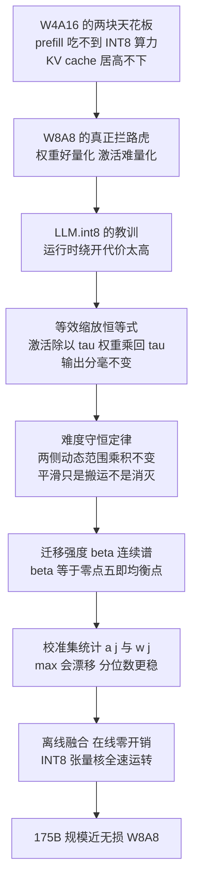
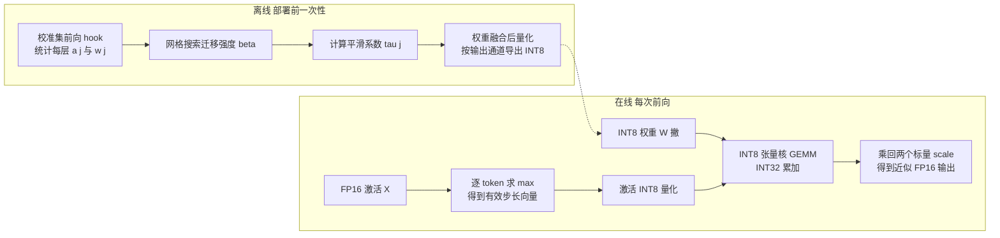

> **系列导航** ｜ [课程路线图](/quantization-roadmap/) ｜ **Part 2 · Activation PTQ** ｜ 第 09 篇 / 共 26 篇
>
> [← 08 SqueezeLLM/VPTQ/CLAQ](/2026/08/24/ptq-09-squeezellm-vptq-claq/) ｜ [10 ZeroQuant →](/2026/08/24/ptq-06-smoothquant-zeroquant/)

> **TL;DR**
>
> * **核心结论**：W8A8（权重、激活都压到 8-bit）的难点从来不在权重，而在激活——权重可以 per-channel 量化，激活只能 per-token/per-tensor，于是常驻 outlier 通道把激活 scale 拉爆而拿权重毫无办法。SmoothQuant 用一条严格恒等式 $XW=\big(X\,\mathrm{diag}(\boldsymbol{\tau})^{-1}\big)\big(\mathrm{diag}(\boldsymbol{\tau})\,W\big)$ 把量化难度按迁移强度 $\beta$ 在两侧之间搬运：$\tau_j=a_j^{\beta}/w_j^{\,1-\beta}$。本篇推导出这条变换为什么输出分毫不变、为什么"难度守恒"、为什么默认 $\beta=0.5$ 恰是两端动态范围的均衡点；配套实验实测直接 W8A8 的层输出 MSE 是平滑后的 **10.7 倍**，且 U 形曲线谷底精确落在 $\beta^{*}=0.50$。
> * **反直觉发现**：① 平滑不消灭难度、只搬运难度——逐通道动态范围乘积 $\max|X'_{:j}|\cdot\max|W'_{j:}|$ 在变换前后最大相对偏差 **$2.4\times10^{-16}$**，机器精度级的守恒；② 权重被放大 $\tau_j$ 倍并不受伤：per-channel scale 精确地跟着乘 $\tau_j$，整数量码一个不变，相对误差分毫不动；③ 校准集从 256 token 扩到 65536，outlier 通道的 max 统计估计从 45.1 单调漂到 70.0（+55%）——01 篇的极值漂移定律在 SmoothQuant 上有了真实后果，而 99.9% 分位数估计的波动只有 max 估计的约 60%，代价是留下截断误差。
> * **系列定位**：01 篇立起 RTN 对照组，02 篇 LLM.int8() 用混合精度分解"绕开"outlier，本篇第一次正面回答"能不能让激活本身变得可量化"。等效变换思想是本系列的第二条主线：AWQ（04 篇）换目标函数、OmniQuant（05 篇）把变换参数学化、QuaRot/SpinQuant（12 篇）把逐通道缩放升级为正交旋转。全部结论有配套实验背书：smoothquant_alpha_sweep。

---

## 1. W8A8 的难点：量化世界的不对称性

### 1.1 从 W4A16 到 W8A8：为什么要激活也上 8-bit

系列前几篇的主线是 W4A16：权重压到 4-bit、激活保持 FP16。这条路线吃满了 decode 阶段的红利——解码是访存受限负载，权重位宽砍半，带宽账直接减半。但它有两块绕不过去的天花板：

**prefill 吃不到算力**。处理整段 prompt 的 prefill 是算力受限负载，而 W4A16 的 GEMM 本质仍是 FP16 计算——权重先反量化再相乘，INT8 Tensor Core 的双倍吞吐一分没赚着。长 prompt 场景（Agent、RAG、代码补全）下 prefill 才是延迟大头。

**KV cache 管不着**。长上下文里 KV cache 随序列长度线性膨胀，动辄数十 GB，而它在 W4A16 里以 FP16 存储——权重的 4-bit 省下的显存会被它一点点吃回去。

W8A8 是另一条路线：GEMM 整体落到 INT8 Tensor Core（吞吐约为 FP16 的两倍，A100 起即如此[NVIDIA A100 datasheet]），权重、激活、KV cache 全部 8-bit，prefill 与 decode 同时受益。它的代价只有一个，却极其致命——**激活必须量化，而激活恰恰是 LLM 里最难量化的张量**。

历史注脚：2022 年之前，"激活 8-bit 量化对 LLM 不可行"接近学界共识，主流做法要么只量化权重、要么像 LLM.int8() 那样混合精度绕路[arXiv:2208.07339](https://arxiv.org/abs/2208.07339)。SmoothQuant 是第一个在 175B 规模上证明全量化 W8A8 可以近无损的工作[arXiv:2211.10438](https://arxiv.org/abs/2211.10438)——它把"不可能"变成了"工程问题"，这也是它成为 W8A8 时代引用锚点的原因。

### 1.2 不对称性的数学：同一套量化器，两种命运

先把"难"字数学化。对称 $b$-bit 均匀量化的步长由动态范围决定（01 篇 §3.2）：

$$
s \;=\; \frac{\max\lvert x\rvert}{q_{\max}}, \qquad q_{\max}=2^{b-1}-1 .
$$

高分辨率假设下舍入误差方差为 $s^2/12$，相对误差正比于动态范围本身：

$$
\frac{\sqrt{\mathbb{E}[\epsilon^2]}}{\sqrt{\mathbb{E}[x^2]}} \;\propto\; \frac{s}{\sigma_x} \;\sim\; \frac{\max\lvert x\rvert}{q_{\max}\,\sigma_x},
$$

也就是说：**同样 8 bit，动态范围被撑得越大的张量，正常数值的有效精度越低**。现在对照权重和激活：

| 维度 | 权重 $W$ | 激活 $X$ |
|---|---|---|
| 分布形态 | 近高斯，无极端离群通道 | 重尾，少数通道幅值达其余几十倍 |
| 可用粒度 | per-channel（每个输出通道一个 scale） | 只能 per-token 或 per-tensor |
| scale 来源 | 静态、离线可精确定 | 动态，且被 outlier 主导 |
| 误差去向 | 本层一次线性变换，可被后续吸收 | 直接污染下一层输入，经 LayerNorm 与 softmax 放大 |

决定性差异在第二行。权重做 per-channel 量化时，$m$ 个输出通道各有各的 scale，通道间的幅值差异被各自的 scale 吸收；激活侧 per-token 量化只有一行一个 scale——**同一行里跨通道的幅值差异没有任何自由度去吸收**。

一个数字例子：设某层激活除一个幅值为 100 的 outlier 通道外全部落在 $[-1,1]$。per-token 步长 $s = 100/127\approx 0.79$，于是 $[-1,1]$ 区间只摊到 $2/0.79\approx 2.5$ 个格距，折合有效位宽 $\log_2 2.5\approx 1.3$ bit——**花 8-bit 的显存和带宽，办 1.3-bit 的事**。这就是"激活之痛"的定价。

还要补一刀：per-token 已经比 per-tensor 好（不同 token 幅值不同的问题解决了），但**同 token 内跨通道的 outlier 无解**——outlier 通道照样抬高这一行的 scale，把同行正常通道压碎。这正是 SmoothQuant 论文 Figure 1 的核心观察：无论怎么选粒度，激活都是 not smooth 的[arXiv:2211.10438](https://arxiv.org/abs/2211.10438)。

顺带回答一个自然疑问：**这些 outlier 是从哪来的？** 主流归因有三：embedding 与第一层 LayerNorm 产出的少数高幅值语义方向；残差流把每层的贡献逐层累加、越深越粗；以及部分激活函数（如 GELU 正区间、attention logits）无上界，给个别通道留出了被放大的通道。它们不是数值噪声而是模型学到的功能结构，所以会跨 token、跨样本稳定复现[arXiv:2208.07339](https://arxiv.org/abs/2208.07339)——这既是灾难（压不随机），也是机会（可离线统计）。

### 1.3 符号字典（本篇增量）

全部沿用 01 篇约定：$s$ 永远是量化步长、$\hat{\cdot}$ 永远是反量化值、$W\in\mathbb{R}^{m\times n}$ 行为输出通道列为输入通道、$C=\mathbb{E}[xx^\top]$ 沿用 01 篇预留。本篇只新增以下记号：

| 符号 | 含义 | 易混淆提示 |
|---|---|---|
| $\boldsymbol{\tau}$，$\tau_j$ | SmoothQuant 平滑系数向量及其第 $j$ 个分量，$\tau_j>0$ | 论文原文记 $s_j$；本系列 $s$ 已被 01 篇占用，故改记 $\tau$ |
| $\beta$ | 迁移强度，$\tau_j(\beta)=a_j^{\beta}/w_j^{\,1-\beta}$ | 论文原文记 $\alpha$；$\alpha$ 已被 01 篇专用为裁剪比例，全系列不得挪用 |
| $a_j$ | 激活第 $j$ 输入通道在校准集上的幅值统计量 $\max_t\lvert X_{tj}\rvert$ | 带下标的通道统计量；与 01 篇 §4.1 均匀分布半宽 $a$（无下标标量）同名不同物 |
| $w_j$ | 权重第 $j$ 输入通道对应行的幅值统计量 $\max_i\lvert W_{ji}\rvert$ | 左乘 diag 时行指标即输入通道；别与 per-channel 量化的输出通道 scale 相混 |
| $X'$，$W'$ | 平滑后的激活批次与权重 | 撇号专指平滑变换；反量化恢复值仍用帽子 $\hat{X}$（01 篇定义） |
| $T$ | 激活批次的 token 数，$X\in\mathbb{R}^{T\times n}$ | 新增维度记号 |
| $\tilde{s}_{tj}$ | 并入 $\tau_j$ 后的有效激活步长（仅 §4 出现） | 仍是步长家族：$\tilde{s}_{tj}=s'_t\,\tau_j$ |

引用 SmoothQuant 论文图表时请做换算：论文的 $s_j$ 即本文 $\tau_j$，论文的 $\alpha$ 即本文 $\beta$。配套代码变量名刻意保留论文原记号（`alpha`、`s`），对照关系见 §2.4 的变量映射表。

### 1.4 02 篇的教训与本篇的总路线

LLM.int8()（02 篇）给了两个事实：其一，outlier 是结构性现象——少数通道幅值可达中位数的 20 倍以上，位置跨 token 稳定、随深度系统性存在[arXiv:2208.07339](https://arxiv.org/abs/2208.07339)；其二，混合精度分解（outlier 通道走 FP16、其余走 INT8）数学精确但工程昂贵，双路 GEMM 与合并的开销让加速比随 outlier 增多而递减。

把两件事并排放，问题第一次可以被正面提出：outlier 既然**稳定存在、可被统计**，能不能不做运行时分解，而是**预先改变张量的分布形状，让激活自己变得可量化**？这就是 SmoothQuant 的总路线。本篇的结构如下：

## 2. 等效缩放：一条恒等式与它的全部魔法

### 2.1 变换定义：先写下不变性

沿用 §1.3 的记号：$W\in\mathbb{R}^{m\times n}$（$m$ 输出通道、$n$ 输入通道），一批 $T$ 个 token 的激活 $X\in\mathbb{R}^{T\times n}$，层输出 $Y=XW$。取一列**正数** $\tau_j>0$，$j\in[n]$。矩阵乘法结合律给出：

$$
XW
= X\,\underbrace{\mathrm{diag}(\boldsymbol{\tau})^{-1}\mathrm{diag}(\boldsymbol{\tau})}_{=\;I_n}\,W
= \big(X\,\mathrm{diag}(\boldsymbol{\tau})^{-1}\big)\big(\mathrm{diag}(\boldsymbol{\tau})\,W\big).
$$

定义平滑后的激活与权重：

$$
X' = X\,\mathrm{diag}(\boldsymbol{\tau})^{-1}, \qquad
W' = \mathrm{diag}(\boldsymbol{\tau})\,W,
$$

则 $X'W'=XW$ **严格成立**——没有近似、没有假设，浮点上甚至只需注意 $\tau_j$ 别溢出。几何直观：$\tau_j$ 把第 $j$ 个输入通道的激活整体缩小 $\tau_j$ 倍，再把 $W$ 对应的第 $j$ 行放大回来，一进一出恰好抵消。

两个立即可见的性质。第一，这是**逐通道**操作：$n$ 个通道各自独立搬运，互不串扰，所以它能精准打击"通道级"的 outlier 结构。第二，$\tau_j$ 是**静态**超参：只依赖分布统计而不依赖具体 token，因此可以离线定好、在线白嫖（§4）。

### 2.2 为什么权重扛得住：量化与正数缩放可交换

直觉上"放大权重"是危险的——GPTQ 们费尽心思才把权重压进低比特，凭什么还能往里灌幅度？答案藏在 per-channel 量化的一个精确性质里。对第 $j$ 行（输入通道维）放大 $\tau_j$ 后按输出通道量化，新的 per-channel 步长是

$$
s'_i \;=\; \frac{\max_j\lvert \tau_j W_{ji}\rvert}{q_{\max}}
\;=\; \frac{\tau_j\,\max_i\lvert W_{ji}\rvert}{q_{\max}}
\;=\;\tau_j\, s_i ,
$$

中间一步用到了 $\tau_j>0$ 可以从 max 里提出来。于是整数量码完全不变：

$$
\mathrm{round}\Big(\frac{\tau_j W_{ji}}{s'_i}\Big) = \mathrm{round}\Big(\frac{W_{ji}}{s_i}\Big),
\qquad
\widehat{W'}_{ji} = s'_i\,q = \tau_j\,\hat{W}_{ji}.
$$

也就是说 **quantize$(\tau_j\cdot\text{row})=\tau_j\cdot$quantize$(\text{row})$**：行内分布形状没变、整数码没变、相对误差一个字没变——变的只是元数据里那个 scale。权重侧对放大的容忍度几乎是无限的（只要 $\tau_j$ 不至于让 FP16 中间量溢出）。

激活侧则完全相反。per-token 量化每行只有一个标量 scale，outlier 通道把 $\max_t\lvert X'\rvert$ 抬多高，同行的正常通道就被压多惨（§1.2 的 1.3-bit 定价）。**同一个"难度"，放在权重端免费，放在激活端天价**——这组不对称性就是整个方法的经济学的根基，也是量化文献白皮书里"权重易、激活难"论断的最锐利形式[arXiv:2106.08295](https://arxiv.org/abs/2106.08295)。

平滑给激活侧赚回多少有效精度？可以算一笔干净的微观账。设某 token 上 outlier 通道幅值为 $A$、正常通道幅值为 $B\le A$，则 per-token 步长由 outlier 决定，正常通道摊到的格数是

$$
\text{有效格数} \;=\; \frac{2B}{A/q_{\max}} \;=\; 2\,q_{\max}\cdot\frac{B}{A} .
$$

一切由**幅值比** $B/A$ 决定。未平滑时 $B/A=10^{-2}$（100 比 1），有效格数 $2.54$，折合 1.3 bit；平滑把比压到 10 比 1 后，同一公式给出 $25.4$ 格、折合 $\log_2 25.4\approx4.7$ bit。注意这笔账同时解释了两件事：为什么削平 outlier 是唯一正道（精度只认比值不认绝对幅值——全体等比例缩放毫无用处）；以及为什么 §2.4 的守恒律里乘积不变而误差仍能暴跌（守恒的是难度总量，不是两侧的比值结构）。

### 2.3 难度守恒：平滑是搬运，不是消灭

现在定量回答"$\tau_j$ 到底改了什么"。记激活第 $j$ 通道的幅值统计量 $a_j=\max_t\lvert X_{tj}\rvert$、权重第 $j$ 行的幅值统计量 $w_j=\max_i\lvert W_{ji}\rvert$（均来自校准集）。平滑后：

$$
a'_j = \max_t\Big\lvert\frac{X_{tj}}{\tau_j}\Big\rvert = \frac{a_j}{\tau_j},
\qquad
w'_j = \max_i\lvert \tau_j W_{ji}\rvert = \tau_j\, w_j .
$$

两式相乘，$\tau_j$ 精确消去：

$$
a'_j\cdot w'_j = \frac{a_j}{\tau_j}\cdot \tau_j w_j = a_j\cdot w_j ,
$$

乘积与 $\tau_j$ 无关——**每通道的"量化难度总量"是守恒量，$\tau_j$ 只是决定它在激活侧与权重侧之间的分配比例**。SmoothQuant 全部的魔法，就是把守恒量从"激活独占"重新分配成"两边分担"，利用 §2.2 的不对称性赚差价。这也立刻给出一条边界：如果权重也要压到很低比特（如 4-bit），权重侧的容错余量收缩，可迁移的空间随之收窄——这个张力在 AWQ（04 篇）会成为主角。

**这张图回答四个问题**：

1. **守恒是精确的还是近似的？** 上图两条曲线肉眼不可分；数值核验逐通道乘积的最大相对偏差为 $2.4\times10^{-16}$——不是"大致守恒"，是机器精度级的恒等式。
2. **平滑到底动了谁？** 下图显示 outlier 通道（红色尖峰）从约 $25\sim72$ 被削到约 $1.7\sim3.1$，正常通道中位数从约 1.02 微移到 0.36——所有通道都被缩放，但 outlier 被削得深得多。
3. **削平的倍数是多少？** 激活峰谷比（outlier 中位数比正常中位数）从约 50:1 压到约 7:1。每通道被缩放的倍数正是 $\tau_j^{-1}=\sqrt{w_j/a_j}$：$a_j$ 越大削得越狠。
4. **权重侧付出了什么？** 下图看不到权重，但守恒律替它记账：激活每降一份，权重对应行精确涨同一份乘积份额——右侧跷跷板（§2.4 图）会把这笔账画出来。

### 2.4 迁移强度 β：连续谱上的均衡点

剩下的唯一问题是 $\tau_j$ 怎么选。论文把它参数化为一条从"不动激活"到"抹平激活"的连续谱（原文记号 $\alpha$，本系列因 01 篇已把 $\alpha$ 占用为裁剪比例，改记 $\beta$）：

$$
\boxed{\;\tau_j(\beta) \;=\; \frac{a_j^{\,\beta}}{w_j^{\,1-\beta}}, \qquad \beta\in[0,1]\;}
$$

在对数域里这是一次线性插值：

$$
\log \tau_j(\beta) = \beta\log a_j - (1-\beta)\log w_j
\;\;\Longrightarrow\;\;
\underbrace{\frac{\partial\log\tau_j}{\partial\log a_j}=\beta}_{\text{激活统计的杠杆}}，
\quad
\underbrace{\frac{\partial\log\tau_j}{\partial\log w_j}=-(1-\beta)}_{\text{权重统计的杠杆}}.
$$

这两个偏导数后面 §3 还要用——它们同时说明 $\beta$ 控制着"校准噪声的分配"。三个端点与中点的语义：

| $\beta$ | $\tau_j(\beta)$ | 平滑后两侧范围 | 语义 |
|---|---|---|---|
| $0$ | $1/w_j$ | $a'_j=a_j w_j$，$w'_j=1$ | 权重归一化，激活原样——放弃平滑 |
| $0.5$ | $\sqrt{a_j/w_j}$ | $a'_j=w'_j=\sqrt{a_j w_j}$ | 两端范围相等：均衡点 |
| $1$ | $a_j$ | $a'_j=1$，$w'_j=a_j w_j$ | 激活彻底抹平，权重全额吞下难度 |

均衡点的推导值得走一遍。令两侧平滑后范围相等：

$$
\frac{a_j}{\tau_j} = \tau_j\,w_j
\;\Longrightarrow\;
\tau_j^2 = \frac{a_j}{w_j}
\;\Longrightarrow\;
\tau_j^{*} = \sqrt{\frac{a_j}{w_j}} \;=\; \tau_j\!\left(\beta=\tfrac{1}{2}\right).
$$

为什么"相等"是好目标？在守恒律 $a'_j w'_j = a_j w_j$ 约束下，两侧较大者的最小值由均值不等式给出：$\max(a'_j,w'_j)\ge\sqrt{a'_j w'_j}=\sqrt{a_j w_j}$，等号当且仅当 $a'_j=w'_j$。也就是说 **β=0.5 使两侧中最差的那一侧尽可能好**——论文默认 $\beta=0.5$ 不是拍脑袋，是 min-max 意义下的均衡解[arXiv:2211.10438](https://arxiv.org/abs/2211.10438)。

一个具体数字过一遍公式：设 $a_j=80$、$w_j=0.4$，则 $\tau_j^{*}=\sqrt{200}\approx14.1$，平滑后两端范围同为 $\sqrt{32}\approx5.66$；若 $\beta=0$，激活范围仍是 80（outlier 原封不动）；若 $\beta=1$，权重行被放大 80 倍。$\beta$ 就是在"激活的 80"与"权重的 80"之间挑一个双方都能接受的中间点。

当然，min-max 均衡只是启发式——真实的层损失是 01 篇那条 $\mathcal{L}=\mathrm{tr}\big((W-\hat{W})\,C\,(W-\hat{W})^\top\big)$（$C=\mathbb{E}[xx^\top]$），两侧误差如何进入 $C$ 加权的输出误差才是最终裁判。所以均衡点到底是不是实测最优，要靠实验说话：

**这张图回答四个问题**：

1. **U 形是真的吗？** 左图实测 MSE 从 β=0 的 $2.43\times10^{-3}$ 一路降到谷底 $2.31\times10^{-4}$ 再对称爬回 β=1 的 $2.44\times10^{-3}$——两端几乎等高，说明这套合成设定下"激活烂"与"权重烂"的伤害相当。
2. **谷底在哪？** 实测最优 $\beta^{*}=0.50$，与 min-max 均衡点严丝合缝。谷底还很宽：β∈[0.4, 0.6] 内偏离最优不超过 11%，β∈[0.3, 0.7] 内不超过 53%——这解释了论文"β 在 0.2~0.5 间不敏感"的经验说法。
3. **跷跷板怎么转？** 右图：平均激活范围随 β 从 0.41 升到 1.00（各通道被推向统一幅值），平均权重范围镜像地从 1.00 降到 0.41，两线恰在 β=0.5 处相交于 0.462——守恒律的几何形状。
4. **不做变换有多惨？** 同一数据上 naive W8A8（不平滑）MSE 为 $2.47\times10^{-3}$，是 β=0.5 平滑后的 **10.7 倍**；相对输出误差从 2.38% 降到 0.73%。顺带一提，naive（2.468e-3）与 β=0（2.435e-3）几乎一样差——β=0 只归一化了权重、没碰激活，救不了局面，符合预期。

完整的扫描数字如下（seed=0，`results.json` 逐位可查）：

| $\beta$ | 层输出 MSE | 相对谷底 |
|---|---|---|
| 0.0（权重归一化） | $2.4346\times10^{-3}$ | ×10.5 |
| 0.1 | $1.1358\times10^{-3}$ | ×4.91 |
| 0.2 | $5.8472\times10^{-4}$ | ×2.53 |
| 0.3 | $3.5283\times10^{-4}$ | ×1.53 |
| 0.4 | $2.5648\times10^{-4}$ | ×1.11 |
| **0.5（默认）** | $\mathbf{2.3133\times10^{-4}}$ | ×1.00 |
| 0.6 | $2.5687\times10^{-4}$ | ×1.11 |
| 0.7 | $3.5113\times10^{-4}$ | ×1.52 |
| 0.8 | $5.8259\times10^{-4}$ | ×2.52 |
| 0.9 | $1.1378\times10^{-3}$ | ×4.92 |
| 1.0（激活抹平） | $2.4372\times10^{-3}$ | ×10.5 |
| 不做变换（naive） | $2.4676\times10^{-3}$ | ×10.7 |

把本节全部记号与实验代码钉在同一张映射表里（代码位于 `experiments/smoothquant_alpha_sweep/run.py`；代码变量名 `alpha`/`s` 刻意沿用论文原记号以便对照，读时按本表换算）：

| 数学符号 | 代码变量 | Shape / 类型 | 说明 |
|---|---|---|---|
| $X$ | `X` | `(T, d_in)` float64 | 校准激活批次，$T=1024$ |
| $W$ | `W` | `(d_in, d_out)` float64 | 实验采用 $X@W$ 布局，输入通道在前 |
| $\boldsymbol{\tau}$ | `s`（`smooth_scale()` 返回值） | `(d_in,)` | 论文记 $s_j$；分母加 1e-8 防除零 |
| $\beta$ | `alpha`（函数入参） | 标量 | 论文记 $\alpha$ |
| $a_j$ | `ax` | `(d_in,)` | `np.max(np.abs(X), axis=0)` |
| $w_j$ | `aw` | `(d_in,)` | `np.max(np.abs(W), axis=1)` |
| $X'$ | `Xp = X / s` | `(T, d_in)` | 逐元素除以 $\tau_j$ |
| $W'$ | `Wp = W * s[:, None]` | `(d_in, d_out)` | 逐行乘 $\tau_j$ |
| $\hat{X}'$ | `Xq`（`quant_per_token` 返回值） | `(T, d_in)` | per-token 对称量化 |
| $\hat{W}'$ | `Wq`（`quant_per_outchannel` 返回值） | `(d_in, d_out)` | per-输出通道对称量化 |

> **Lab 1（动手）**：把 `make_data()` 里 outlier 倍数从 `uniform(20, 80)` 提到 `uniform(200, 800)` 重跑扫描——观察 U 形是否变得更深更窄、$\beta^{*}$ 向哪边移动；再把 outlier 通道从 12 个砍到 2 个（模拟小模型），看平滑收益缩水多少——亲手复现"模型越小越不需要平滑"的论文经验规律。

## 3. 激活统计量的估计：校准、漂移与稳健性

### 3.1 统计量从哪来：校准集前向钩子

$\tau_j$ 依赖 $a_j$ 与 $w_j$。$w_j$ 是权重自身的属性，离线精确可得；$a_j$ 则是**数据的函数**——只能拿一小批代表性文本（几百条足矣）跑前向，在每个线性层的输入挂 hook，沿 token 维取最大绝对值。这里埋着两个统计学问题：**用什么统计量**（max 还是分位数），以及**校准集多大才够**。

### 3.2 max 的漂移定律与 β 的降噪杠杆

01 篇 §4.3 讲过：样本最大值随样本量按 $\sqrt{2\ln n}$ 漂移。SmoothQuant 把这个纯统计现象变成了部署风险：$a_j$ 漂，$\tau_j$ 跟着漂，平滑就失准。漂移被传导多少，由 §2.4 的杠杆公式决定：$a_j$ 高估 10%，$\tau_j$ 就偏 $(1.1^{\beta}-1)$——$\beta=0.3$ 时只偏 2.9%，$\beta=0.5$ 偏 4.9%，$\beta=0.9$ 偏 9.0%。**β 小不仅意味着少搬难度，还意味着校准噪声被指数衰减掉大半**；反之越激进的平滑越依赖校准质量。

实测这两件事（构造 $10^6$ token 的"无限"激活池，其中 12 个 outlier 通道 ×20~80）：

**这张图回答四个问题**：

1. **漂移有多快？** 校准集 N 从 256 扩到 65536，outlier 通道的 max 估计单调上涨 45.1 → 50.3 → 59.3 → 63.8 → 70.0，累计 +55%——与 01 篇 $\sqrt{2\ln n}$ 律方向一致，且没有饱和迹象。
2. **max 有多不稳？** 固定 N=4096、重采 30 个子集，max 估计的 std 为 3.62；99.9% 分位数估计 std 为 2.19，稳定性约为 max 的 1.65 倍。
3. **正常通道呢？** 无重尾的正常通道 max 估计 std 仅 0.067——比 outlier 通道稳 54 倍。**漂移与不稳都是重尾专属**：outlier 越极端的通道，其统计量越像彩票。
4. **分位数的代价是什么？** 99.9% 分位数天然截掉了最尾部 0.1% 的质量——换成量化语言，就是 01 篇 §4 分析过的裁剪误差：换稳健性，付截断税。β 越大（激活被削得越狠），这笔税越不能免。

### 3.3 三种估计方式的取舍

| 估计方式 | 定义 | 优点 | 代价与风险 |
|---|---|---|---|
| max（论文原始） | $a_j=\max_t\lvert X_{tj}\rvert$ | 与对称量化的 scale 公式同构，无截断误差 | 极值敏感、随 N 漂移（+55% 实测）；单个坏样本即可带偏 |
| 分位数（如 99.9%） | $a_j=\lvert X\rvert$ 的样本分位数 | 对重采样稳定（std 低 39%）、抗脏数据 | 留截断误差；分位点选择又是一个超参 |
| 调小 β | $\tau_j=a_j^{\beta}/w_j^{1-\beta}$ | 不换统计量，直接用杠杆 $\partial\log\tau/\partial\log a=\beta$ 衰减噪声 | 治标：outlier 压不下去，激活侧残余难度仍在 |

三条路线并不互斥：工程实践常是"分位数统计 + 中等 β"的组合拳；论文原文用 max + β∈[0.5 默认]，并在更大规模上验证了近无损[arXiv:2211.10438](https://arxiv.org/abs/2211.10438)，说明在足够干净的数据上 max 的漂移尚可容忍。但校准集与线上分布一旦偏移（多语言混排、代码、极端长尾生成），静态 $\tau_j$ 就可能失效——这是它结构性软肋，ZeroQuant 一系干脆用动态量化绕开校准依赖[arXiv:2206.01861](https://arxiv.org/abs/2206.01861)（10 篇展开）。

静态与动态其实各守半壁江山：静态 $\tau_j$ 管"通道间"的幅值失衡（它跨 token 稳定，适合离线统计），动态 per-token scale 管"token 间"的整体涨落（它逐 token 变化，必须现算）。SmoothQuant 的默认配方本来就是两者叠加——先平滑再 per-token 动态量化；后来生产引擎的 W8A8/FP8 数据流（权重 per-channel 静态 scale + 激活 per-token 动态 scale）正是这套组合的直接后裔。

> **Lab 2（动手）**：在 `exp_activation_stat()` 里把 max 统计换成 `np.percentile(np.abs(...), 99.9)` 重算 $\tau_j$ 并重跑 α 扫描——观察 U 形谷底是否变浅、$\beta^{*}$ 是否移动；再人为往校准集注入 1 条幅值 ×1000 的脏样本，对比两种统计量算出的 $\tau_j$ 差多少倍——亲手体验"一个坏样本带偏 max"。

## 4. 工程落地：离线把脏活干完，在线零开销

先看全景：SmoothQuant 把全部复杂度锁在部署前，推理时的数据流里找不到任何为它新设的算子——

### 4.1 运行时免费的关键：τ 并入量化 scale

SmoothQuant 最优雅的性质是**在线部分什么都没多干**。关键在于把平滑除法合并进量化步长。平滑后激活的 per-token 量化是

$$
q_{tj} = \mathrm{round}\Big(\frac{X'_{tj}}{s'_t}\Big), \qquad s'_t=\frac{\max_j\lvert X'_{tj}\rvert}{q_{\max}},
$$

代入 $X'_{tj}=X_{tj}/\tau_j$ 并定义**有效步长** $\tilde{s}_{tj}=s'_t\,\tau_j$：

$$
q_{tj} = \mathrm{round}\Big(\frac{X_{tj}}{s'_t\,\tau_j}\Big) = \mathrm{round}\Big(\frac{X_{tj}}{\tilde{s}_{tj}}\Big).
$$

也就是说：根本不需要物化 $X'$，只需要让激活量化的 scale 从标量 $s'_t$ 变成向量 $\tilde{s}_t$——一次逐通道乘法，而这步本来就要做。反量化侧同理，GEMM 的 INT32 累加结果只乘两个标量：

$$
\hat{Y}_{ti} = s'_t\, s^W_i \sum_j q_{tj}\, q^W_{ji},
\qquad
q^W_{ji}=\mathrm{round}(W'_{ji}/s^W_i),
$$

昂贵的矩阵乘全部落在 INT8 Tensor Core，反量化只是一次 elementwise 标量乘——W8A8 高速的全部秘密。离线侧则把 $W'=\mathrm{diag}(\boldsymbol{\tau})W$ 直接烧进权重 checkpoint，运行时看到的就是一个普通的 INT8 权重张量，平滑对 kernel 完全透明。

### 4.2 部署流水线与覆盖清单

| 步骤 | 操作 | 产物 |
|---|---|---|
| 1 | 选校准集（几百条覆盖目标领域的文本） | 前向语料 |
| 2 | hook 统计每个线性层的 $a_j$、读取 $w_j$ | 幅值统计表 |
| 3 | 小网格搜索 $\beta$（全局统一或分层） | 最优 $\beta$ |
| 4 | 计算 $\boldsymbol{\tau}$，离线融合 $W'$ 并按输出通道量化导出 | INT8 权重文件 |
| 5 | 把 $1/\tau_j$ 写入激活量化 kernel 的 scale 通路 | 推理图 |
| 6 | 加载验证困惑度与下游任务 | 上线 |

三个容易踩坑的覆盖细节：**所有线性层都要平滑**——attention 的 Q/K/V/O 投影、MLP 的 gate/up/down 一个都不能漏，漏一层，outlier 就从那层原样漏进下一层；softmax 输出（概率分布）与 LayerNorm 输出通常保持 FP16 不动；KV cache 若一并压到 8-bit，K 投影的 outlier 对 attention 最致命（K 进softmax 的指数），需要更保守的 β——论文验证 KV8 配合平滑仍近无损，这让长上下文的 KV 显存同步砍半[arXiv:2211.10438](https://arxiv.org/abs/2211.10438)。

数值防护也值得单列一笔（工程经验，未在论文正文系统讨论）：$\tau_j$ 与 per-token scale 合并时可能下溢或上溢，合并后的有效步长要做 clamp 防护；动态量化的 scale 建议用 FP32 计算再回写，大 batch 下这点精度直接决定稳定性；多卡流水并行时每层的 $\tau_j$ 要随权重一起分发，保证各副本一致——否则不同 rank 对同一通道做不同的缩放，输出会静默发散。

### 4.3 精度与收益：论文口径

论文在 OPT、BLOOM、GLM 等系列上的系统评测结论（口径：论文报告，本篇未逐表复验）：OPT-175B、BLOOM-176B 上平滑 W8A8 的困惑度与 FP16 差距在 0.1 以内；**模型越大平滑越必要**——6.7B 以下不平滑尚可一战，13B 以上不平滑则困惑度急剧恶化，与 outlier 随规模增长互为因果；硬件收益最高约 1.56× 加速与 2× 内存缩减（同为论文报告口径）。配置定位的横向对比：

| 维度 | FP16 基线 | W4A16（GPTQ/AWQ） | W8A8（SmoothQuant） |
|---|---|---|---|
| 权重内存 | 1× | 0.25× | 0.5× |
| 激活/KV 内存 | 1× | 1× | 0.5× |
| GEMM 计算 | 基线 | FP16 反量化后计算（无加速） | INT8 Tensor Core（约 2× 吞吐） |
| 最优阶段 | —— | decode（访存受限） | prefill + decode 通吃 |
| 精度风险 | 无 | 低（权重 per-channel 兜底） | 中（激活是难点，需平滑） |

一句话定位：W4A16 与 W8A8 不是替代关系而是互补关系——decode 省带宽靠前者，prefill 提算力与 KV 压缩靠后者；2026 年的主流推理引擎是两者的场景化混用。

## 5. 批判与展望：Takeaway 与下一篇

**本篇解决了什么痛点**：W8A8 卡在"激活不可量化"整整一年，LLM.int8() 的运行时分解决定了它的高成本。SmoothQuant 用一条零成本的恒等式把症结卸掉：难度守恒（§2.3）保证了变换无害，不对称性（§2.2）保证了搬运稳赚，均衡点推导（§2.4）给出了默认 β=0.5，实验 U 形曲线（10.7 倍差距、谷底 0.50）闭环验证。训练无关、校准几分钟、在线零开销——这是"预处理换部署"思路的教科书示范。

**致命局限**：其一，静态假设——$\boldsymbol{\tau}$ 由校准集冻结，而 §3 实测 max 统计天然漂移（N 扩 256 倍涨 55%），分布一旦偏移平滑就可能帮倒忙；其二，逐通道对角变换只能**重分配**能量、不能**消灭**能量，outlier 的幅值被原样塞进了权重——权重侧还有 4-bit 任务时（AWQ 场景），迁移空间被两头挤压；其三，β 是新超参，分层调 β 又是一轮搜索成本；其四，激活 scale 从标量变向量，kernel 层面并非绝对零开销（论文 1.56× 的加速已含这部分优化的抵偿）。

**如何引出下一篇**：同样的"等效变换"武器库，AWQ（04 篇）换了目标函数——不再问"两端动态范围怎么均衡"，而是问"哪些通道对输出误差重要"，用激活二阶矩加权去搜缩放因子，把 4-bit 权重量化的重构误差直接压下去[arXiv:2306.00978](https://arxiv.org/abs/2306.00978)；OmniQuant（05 篇）把变换参数全部梯度化学出来；QuaRot/SpinQuant（12 篇）则更进一步——用正交旋转取代逐通道缩放，把 outlier 能量均匀摊到所有维度上，连"谁迁谁"都不用决定了[arXiv:2404.00456](https://arxiv.org/abs/2404.00456)。平滑的极限，正是旋转的起点。

**遗产**：硬件从 INT8 走向 FP8（Hopper 起），但 SmoothQuant 的遗产没有过时反而更深——FP8 的 E4M3 尾数只有 3 bit，对激活幅值失衡更敏感，"难度迁移"的需求不减反增；vLLM、TensorRT-LLM 的 FP8 部署沿用的正是"权重 per-channel 静态 scale + 激活 per-token 动态 scale"这套 SmoothQuant 数据流（口径：社区公开实现惯例，未逐一核验版本）。一句话定位它的历史角色：它没发明新指令也没发明新格式，只发明了"难度搬运"这个视角——而此后所有 W8A8/FP8 部署的数据流设计都活在这个视角里。

## 参考清单

**论文（ID 已逐一核验）**

- Xiao et al., *SmoothQuant: Accurate and Efficient Post-Training Quantization for Large Language Models*, [arXiv:2211.10438](https://arxiv.org/abs/2211.10438) —— 本篇主角，NeurIPS 2023；等效变换、β 谱、175B 近无损与 1.56× 加速均出自此文
- Dettmers et al., *LLM.int8(): 8-bit Matrix Multiplication for Transformers at Scale*, [arXiv:2208.07339](https://arxiv.org/abs/2208.07339) —— 02 篇主角；outlier 结构性现象的实证来源
- Yao et al., *ZeroQuant: Efficient and Affordable Post-Training Quantization for Large-Scale Transformers*, [arXiv:2206.01861](https://arxiv.org/abs/2206.01861) —— "无校准集"的另一条路，10 篇主角
- Nagel et al., *A White Paper on Neural Network Quantization*, [arXiv:2106.08295](https://arxiv.org/abs/2106.08295) —— 权重易/激活难不对称性的规范表述
- Lin et al., *AWQ: Activation-aware Weight Quantization*, [arXiv:2306.00978](https://arxiv.org/abs/2306.00978) —— 04 篇主角，同族等效变换的另一种目标函数
- Ashkboos et al., *QuaRot: Outlier-Free 4-Bit Inference via Rotations*, [arXiv:2404.00456](https://arxiv.org/abs/2404.00456) —— 12 篇预告：旋转版"彻底平滑"

**代码与规范**

- 本篇配套实验：`technology/quantization/llm_quant_series/experiments/smoothquant_alpha_sweep/`（numpy，十余秒复现全部图表与 `results.json`）
- [mit-han-lab/smoothquant](https://github.com/mit-han-lab/smoothquant) —— 论文官方实现（INT8 GEMM kernel 与校准流水线）
- [vLLM quantization 文档](https://docs.vllm.ai/en/latest/quantization/) —— 生产引擎中 W8A8/FP8 的 per-channel 权重 + per-token 激活标配
- [NVIDIA A100 Datasheet](https://www.nvidia.com/content/dam/en-zz/Solutions/Data-Center/a100/pdf/nvidia-a100-datasheet-us-nvidia-1758950-r4-web.pdf) —— INT8/FP16 吞吐比口径

**系列导航**

- 系列规划：见站内 [模型量化课程路线图](/quantization-roadmap/)（全 26 篇目录与阅读路径）
- 上一篇：《00 量化器数学地基与 RTN 基线》（已发布）｜《01 LLM.int8()》施工中｜下一篇：《03 AWQ：激活感知的权重缩放搜索》
- 交叉引用：01 篇 §4.3 的极值漂移定律在本篇 §3 落地为部署风险；01 篇 §6.2 的 $C$ 加权损失是理解 §2.4"均衡为何只是启发式"的钥匙

**中文社区**：知乎与掘金上关于 SmoothQuant 平滑实现与 vLLM/TensorRT-LLM 部署实践的讨论较多，本篇未能核验到稳定直链，暂不列出——后续各篇补齐（诚实标注：本节为占位，非完整来源）。
