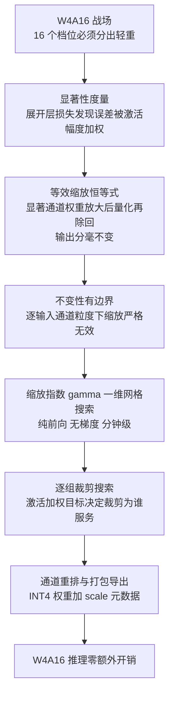
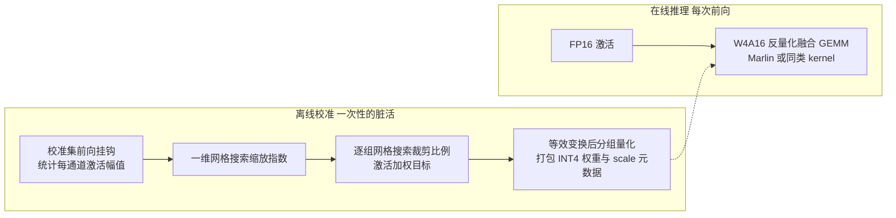

> **系列导航** ｜ [课程路线图](/quantization-roadmap/) ｜ **Part 1 · Weight-only PTQ** ｜ 第 04 篇 / 共 26 篇
>
> [← 03 GPTQ](/2026/08/24/ptq-02-gptq/) ｜ [05 OmniQuant →](/2026/08/24/ptq-03-awq-omniq/)

> **TL;DR**
>
> * **核心结论**：W4A16 的层损失 $$\mathcal{L}=\mathrm{tr}\big((W-\hat{W})\,C\,(W-\hat{W})^\top\big)$$（01 篇 §6.2）里早就写好了答案——误差被激活二阶矩 $$C$$ 加权，所以"哪些权重重要"必须问激活，而不是问权重自己。AWQ 的全部数学是一件事：用一条严格恒等式把显著输入通道的权重放大 $$\kappa_j$$ 倍后量化、再除回来，等效于在固定网格下给它们更细的格距；再把搜索空间压缩成单参数族 $$\kappa_j=a_j^{\gamma}$$，对 $$\gamma$$ 做一维网格搜索即完成校准——全程纯前向、零梯度。配套实验（合成 LLM 型激活，动态范围 49.6 倍）：保护最关键的 1% 通道，按激活幅度选能回收 **56%** 的输出误差、按权重幅度选只回收 **0.5%**；$$\gamma$$ 谷底落在 0.25，收益 1.67 倍；缩放叠加激活加权的裁剪搜索后，输出 MSE 压到 RTN 基线的 **0.553 倍**。
> * **反直觉发现**：① **权重 SNR 会说谎**——仅缩放就让权重重建质量变差（18.59 → 17.74 dB），层输出 MSE 却下降 40%：量化的最终裁判是激活加权的输出损失，不是权重自身的失真度；② **缩放的收益严格依赖量化粒度**——group=32 时收益 2.85 倍，而逐输入通道粒度下缩放严格无效（扫描曲线逐点完全相同，std=0，机器精度级的平直）：AWQ 的本质是"组内量化资源再分配"，没有组，就没有资源可分；③ 激活幅度 top-1% 与权重幅度 top-1% 的通道**重叠数为 0**，按权重保护的效果（0.995）和随机保护（0.984）几乎没差别。
> * **系列定位**：三条路线都在治 outlier，药方不同——02 篇 LLM.int8() 用混合精度分解在运行时"绕开"，09 篇 SmoothQuant 用等效缩放把难度"搬运"给权重，本篇 AWQ 用激活统计回答"**把精度分配给谁**"。09 篇证明了权重对放大的容忍近乎无限（整数量码一个不变），本篇将证明那个结论依赖粒度条件——条件一旦换成组共享 scale，数码必然改变，而这个"改变的方向"正是 AWQ 全部的杠杆。OmniQuant（05 篇）会把 $$\gamma$$ 和裁剪边界变成可学习参数。

---

## 1. 三条路线的汇合点

### 1.1 从"绕开""搬运"到"分配"

系列走到第三篇，outlier 问题换了三次药方：

- **02 篇（LLM.int8()）**：少数激活通道幅值可达其余的 20 倍且位置跨 token 稳定[arXiv:2208.07339](https://arxiv.org/abs/2208.07339)。解法是运行时分解——outlier 通道走 FP16、其余走 INT8，数学精确，但双路 GEMM 的代价让加速比随 outlier 增多而递减；
- **09 篇（SmoothQuant）**：既然 outlier 可离线统计，就用等效缩放把激活的难度按强度 $$\beta$$ 搬给权重，W8A8 近无损[arXiv:2211.10438](https://arxiv.org/abs/2211.10438)。它的隐含前提是**权重侧有余粮**——per-channel 量化每个输出通道独享 scale，吃下迁移来的难度几乎免费；
- 但 W4A16 把余粮吃光了：4-bit 网格只有 16 个档位，权重侧自己的容错已经捉襟见肘（09 篇 §5 埋下的伏笔在此兑现）。这时该问的问题不再是"难度往哪搬"，而是——**权重这 16 个档位，到底应该优先分给谁？**

AWQ（Activation-aware Weight Quantization）的回答分两层：先用激活统计找出"牵一发而动全身"的少数显著通道（论文观察约 0.2%～1%，保护它们即可回收大部分量化损失[arXiv:2306.00978](https://arxiv.org/abs/2306.00978)）；再用一条零成本的等效缩放，在不引入混合精度 kernel 的前提下"软保护"这些通道。校准只需少量校准文本的前向统计加一维网格搜索，7B 规模分钟级完成（论文口径）。

### 1.2 战场设定：为什么是 W4A16

8-bit 权重量化今天已近"免费"——256 个档位足以罩住重尾分布的主体，RTN 加上基本裁剪就能接近无损（01 篇 §5.3：b=8 时 scale 选择只值 1.28 dB）。真正的战场在 4-bit，三个原因：

1. **档位数骤降**：格距比 8-bit 大 16 倍，舍入噪声方差大 256 倍。RTN 开始肉眼可见地崩坏：LLaMA-7B 上 WikiText-2 困惑度从 FP16 的 5.68 涨到 6.29（口径：AWQ 论文报告，本篇未复验[arXiv:2306.00978](https://arxiv.org/abs/2306.00978)）；
2. **内存收益的分水岭**：7B 模型权重从约 14 GB（FP16）压到约 3.5 GB，这是单卡部署的分水岭；decode 阶段访存受限，权重位宽砍四分之三，带宽账同步受益；
3. **精度余量极小**：每个档位都弥足珍贵，"哪些权重配得到更好的档位"第一次成为生死攸关的问题——这正是激活感知思想的用武之地。

一句话概括战场哲学的转变：**8-bit 时代误差被档位数淹没，4-bit 时代档位数被误差淹没**。GPTQ 与 AWQ 都是"16 个档位怎么分"这个问题上的不同答案——前者逐列补偿误差（03 篇），后者预先改写误差的分布（本篇）。

### 1.3 符号字典（本篇增量）

沿用 01 篇全部约定：$$s$$ 永远是量化步长、$$\alpha$$ 是裁剪比例专用记号、$$\epsilon$$ 是量化误差、$$\hat{W}$$ 是反量化恢复值、$$W\in\mathbb{R}^{m\times n}$$ 行为输出通道列为输入通道、$$g$$ 为分组长度；沿用 09 篇的 $$X\in\mathbb{R}^{T\times n}$$（$$T$$ 个 token）与激活幅值统计量 $$a_j=\max_t\lvert X_{tj}\rvert$$。本篇只新增：

| 符号 | 含义 | 易混淆提示 |
|---|---|---|
| $$\boldsymbol{\kappa}$$，$$\kappa_j$$ | AWQ 逐**输入通道**缩放因子，$$\kappa_j>0$$ | 论文原文记 $$s_j$$；本系列 $$s$$ 已被 01 篇占用为步长，故改记 $$\kappa$$。别与步长混写 |
| $$\gamma$$ | 缩放指数，$$\kappa_j(\gamma)=a_j^{\gamma}$$，$$\gamma\in[0,1]$$ | 论文原文记 $$\alpha$$；$$\alpha$$ 已被 01 篇专用为裁剪比例，全系列不得挪用 |
| $$w_j$$ | 权重第 $$j$$ 输入通道对应**列**的幅值统计量 $$\max_i\lvert W_{ij}\rvert$$ | 09 篇为左乘布局（行统计）；本篇右乘 $$W\,\mathrm{diag}(\boldsymbol{\kappa})$$，故取列统计——同一概念在不同布局下的形式 |
| $$\tilde{\epsilon}$$ | 缩放坐标系里的量化误差 $$\tilde{\epsilon}_{ij}=Q(W_{ij}\kappa_j)-W_{ij}\kappa_j$$ | 原坐标误差是 $$\tilde{\epsilon}_{ij}/\kappa_j$$，§4.2 的列权换算全靠这一步 |
| $$S$$ | 显著通道集合（按激活幅值排序的前 $$k$$ 名） | 论文的 salient channels；"保护"指保持 FP16 不量化 |
| $$\pi$$ | 输入通道置换（§5.2 kernel 重排用） | 只在工程节出现，别与概率测度混淆 |

引用 AWQ 论文图表时请做换算：论文的 $$s_j$$ 即本文 $$\kappa_j$$，论文的 $$\alpha$$ 即本文 $$\gamma$$。配套代码变量名与之对齐（`kappa`、`gamma`），对照关系见 §4.4 变量映射表。

### 1.4 本篇路线图

## 2. 显著性度量：误差分解告诉我们要保护谁

### 2.1 层损失的通道分解：中间一步不跳

01 篇 §6.2 给出了 PTQ 的母体损失（$$C=\mathbb{E}[xx^\top]$$ 为激活二阶矩）：

$$
\mathcal{L}(\hat{W}) \;=\; \mathbb{E}_x\big\lVert Wx-\hat{W}x\big\rVert^2 \;=\; \mathrm{tr}\big((W-\hat{W})\,C\,(W-\hat{W})^\top\big).
$$

现在把它按**输入通道**拆开。一批 $$T$$ 个 token 的输出误差为 $$\Delta Y=X(W-\hat{W})^\top$$，逐元素写开：

$$
\Delta Y_{ti} \;=\; \sum_{j=1}^{n} X_{tj}\,\epsilon_{ij},
\qquad \epsilon_{ij}=W_{ij}-\hat{W}_{ij}.
$$

两边取平方并对 $$t,i$$ 求期望，得到双重和：

$$
\mathbb{E}\lVert\Delta Y\rVert_F^2
=\sum_{t,i}\;\sum_{j}\sum_{k}\;
\mathbb{E}\big[X_{tj}X_{tk}\,\epsilon_{ij}\,\epsilon_{ik}\big].
$$

做两个标准假设：量化误差 $$\epsilon$$ 与激活独立、且不同通道间互不相关（组内共享 scale 会带来轻微相关，先忽略，§3.3 再捡回来）。于是 $$j\ne k$$ 的交叉项全部消失：

$$
\mathbb{E}\lVert\Delta Y\rVert_F^2
=\sum_{j}\underbrace{\Big(\tfrac{1}{T}\sum_{t}X_{tj}^2\Big)}_{\text{第 } j \text{ 通道激活能量}}
\cdot\underbrace{\Big(\sum_{i}\mathbb{E}\big[\epsilon_{ij}^2\big]\Big)}_{\text{第 } j \text{ 列误差功率}}
\;\approx\;\sum_j \mathbb{E}\big[x_j^2\big]\cdot m\cdot\tfrac{s^2}{12}.
$$

最后一步用了高分辨率假设 $$\mathbb{E}[\epsilon^2]\approx s^2/12$$（01 篇 §3.3）。这个分解透露了一个常被忽略的事实：**在同一组量化器配置下，各列的误差功率几乎相同（都由共享的 $$s$$ 决定），真正把列与列区分开的量是激活能量 $$\mathbb{E}[x_j^2]$$**。换句话说：

> 量化误差不是均匀地伤害输出的——它按激活能量的比例伤害输出。激活幅度大的通道，哪怕权重平庸，其量化误差也会被放大成输出误差的主要来源；反之，一个激活常年沉寂的通道，权重再粗糙也无关痛痒。

这正是 09 篇 SmoothQuant 的出发点（outlier 通道让激活不可量化），也是本篇的出发点（outlier 通道让权重量化的代价分布极度不均）。同一个物理结构，两篇读出两个问题。

### 2.2 重要性的一阶代理：激活能量 × 误差功率

§2.1 的分解里，第 $$j$$ 通道的重要性是乘积 $$\mathbb{E}[x_j^2]\cdot\mathbb{E}[\epsilon_{:j}^2]$$。误差功率那一半并非与权重无关：分组量化下第 $$j$$ 列元素的误差被夹在 $$\lvert\epsilon_{ij}\rvert\le s_g/2$$，而组步长至少是 $$\max_{i,l\in g}\lvert W_{il}\rvert/q_{\max}$$——粗略地说，**列越"高"，它在组里掀起的格距就越大，误差功率上界越大**。代入得一阶近似：

$$
\text{通道重要性} \;\propto\; \mathbb{E}\big[x_j^2\big]\cdot O\big(w_j^2\big),
$$

排序意义下与乘积 $$a_j\cdot w_j$$ 高度相关（$$a_j$$ 主导激活能量项，$$w_j$$ 主导误差功率项）。这就回答了一个自然的问题——**为什么显著性指标是"激活幅度 × 权重幅度"的量级，而不是权重幅度自己**：权重幅度只是这个乘积的一半，另一半（激活能量）恰恰是 LLM 里动态范围最大的因子（emergent 通道几十倍于常态）；丢掉它，等于用一把没有刻度的尺子量重要性。纯按权重选显著通道，在权重各通道同分布时退化为随机抽签——§2.3 实验将给出定量版本。

AWQ 论文的 Figure 1 用真实模型验证了这个排序问题的答案：按**激活幅度**挑 1% 通道跳过量化，恢复绝大部分精度损失；按**权重幅度**挑，几乎没有恢复[arXiv:2306.00978](https://arxiv.org/abs/2306.00978)。至于为什么论文最终只用 $$a_j$$ 而不含 $$w_j$$ 因子——因为 AWQ 的缩放机制本身会响应 $$w_j$$（§3.3），把权重侧的信息隐式吸进了搜索目标里；官方实现的裁剪搜索则显式使用了激活加权（口径：AutoAWQ 实现描述，未逐行核验）。

### 2.3 实验 A：四种选择器同台

实验设定刻意复现论文观察的前提：权重各通道同分布 $$N(0,0.02^2)$$（**不注入任何权重 outlier**），激活通道幅值 = log-uniform 温和差异 × 8 个 emergent 通道放大 12 倍，总动态范围 49.6 倍；权重矩阵 $$512\times1024$$，校准 / 测试各 2048 token，INT4 对称量化，$$g=128$$。比较四种"保护 top-10（约 1%）输入通道"的选择器——被选中的列保持 FP16 不量化，看残余输出 MSE：

**这张图回答四个问题**：

1. **激活与权重差多少？** 按激活幅度选，残余 MSE 0.436（回收 56.4%）；按权重幅度选 0.995（回收 0.5%）——两者相差百倍以上，这就是论文 Figure 1 的数值重现。
2. **为什么按权重选≈随机？** 实测两组 top-10 的交集为 **0 个通道**：权重同分布时列最大值排序与误差贡献无关，0.995 对 0.984（随机）印证了这一点。权重幅度大 ≠ 重要。
3. **top-1% 到底承载多少误差？** 按"真实贡献"（激活能量 × 实际误差功率）排序，top-10 通道占全部输出误差能量的 **57.2%**；而按激活幅度排序选出的 top-10 恰好捕获 57.2%——**激活排序几乎完美复原了 oracle 集合**，这是"激活统计可以离线替代真值"的直接证据。
4. **乘积指标为什么和激活指标几乎一样？** 本数据集权重同分布，$$w_j$$ 近似常数，乘积排序退化为激活排序（0.4365 对 0.4364）。真实模型权重自带结构，乘积指标才有独立贡献——它是 §2.2 推导的完整形式，激活指标是它在"权重无结构"极限下的特例。

还有一笔账要算：保护（保持 FP16）是缩放能达到的上限。§3 将看到，纯缩放在 $$\gamma^{*}=0.25$$ 处拿到 0.600 的残余 MSE——**(1−0.600)/(1−0.436) ≈ 71%**：不动任何 kernel、不加一路 FP16 GEMM，缩放兑现了"保护"七成的收益。这是 AWQ 论文把缩放称为 soft protection 的定量含义。

> **Lab 1（动手）**：把 `make_data()` 里 `emerge_boost` 从 12 提到 40 重跑 Demo A——观察 top-1% 误差能量占比向哪边走、按权重选择是否更接近随机；再把 `n_emerge` 砍到 2 个（模拟小模型），看激活选择的回收率缩水多少——亲手复现"模型越小、outlier 结构越弱、激活感知越不重要"的经验规律。

## 3. 等效缩放：一条恒等式与它的适用边界

### 3.1 定义与不变性证明

取任意正向量 $$\boldsymbol{\kappa}\in\mathbb{R}^n_{>0}$$，定义等效变换（右乘布局）：

$$
W' = W\,\mathrm{diag}(\boldsymbol{\kappa}), \qquad X' = X\,\mathrm{diag}(\boldsymbol{\kappa})^{-1}.
$$

输出严格不变的证明只有三步：

$$
X'{W'}^\top
= X\,\mathrm{diag}(\boldsymbol{\kappa})^{-1}\big(W\,\mathrm{diag}(\boldsymbol{\kappa})\big)^\top
= X\,\mathrm{diag}(\boldsymbol{\kappa})^{-1}\,\mathrm{diag}(\boldsymbol{\kappa})\,W^\top
= XW^\top .
$$

几何直观：$$\kappa_j$$ 把第 $$j$$ 个输入通道的权重放大、激活缩小，一进一出恰好抵消——与 09 篇的 $$\boldsymbol{\tau}$$ 是同一条恒等式，只是布局从左乘换成了右乘。AWQ 是仅权重量化（W4A16），推理时激活侧**并不执行**，缩放被烘焙进权重：

$$
\hat{W} \;=\; Q_g\big(W\,\mathrm{diag}(\boldsymbol{\kappa})\big)\cdot\mathrm{diag}(\boldsymbol{\kappa})^{-1},
$$

其中 $$Q_g$$ 是分组 RTN（沿用 01 篇 §7 的对称网格与 $$g=128$$ 分组）。激活侧的 $$\mathrm{diag}(\boldsymbol{\kappa})^{-1}$$ 只活在推导里，用来保证"如果两边都变换则输出不变"；部署时省略它，引入的偏差就是权重量化误差本身。

### 3.2 不变性来自哪里、哪些算子不满足

恒等式的成立条件值得抠死，因为它决定了这套变换能在计算图里传播多远。来源只有一个：**矩阵乘对沿求和轴的逐通道正数缩放满足分配律**——$$\kappa_j$$ 可以从求和号里提出来再消掉。凡是不经过"共享同一求和轴的线性变换"就直接消费激活值的算子，都会打破等价性：

| 算子 | 成对缩放能否吸收 | 原因 |
|---|---|---|
| Linear / GEMM | ✅ 免费 | 求和轴上的分配律，§3.1 三步证明 |
| 卷积（输入通道维） | ✅ 免费 | 卷积就是局部求和，通道维同理 |
| 残差相加 | ⚠️ 有条件 | 要求相加两侧使用一致的缩放；两支 $$\boldsymbol{\kappa}$$ 不同则 $$(x/\kappa^{(1)}+z/\kappa^{(2)})$$ 无法还原 |
| LayerNorm | ❌ 破坏 | 除以标准差会吞掉缩放并改变下游统计，$$\mathrm{LN}(x/\kappa)\ne\mathrm{LN}(x)/\kappa$$ |
| 逐点非线性（ReLU/GELU/SiLU） | ❌ 破坏 | $$\phi(x/\kappa)\ne\phi(x)/\kappa$$，非线性不守缩放 |
| Softmax / 注意力指数 | ❌ 破坏 | 指数放大尺度差异，进 softmax 前必须停在原尺度 |

W4A16 下这些约束几乎无感——缩放只在离线权重上执行一次，不进在线计算图。但一旦想把变换推广到激活侧也量化的场景（W8A8/W4A4），约束立刻变成硬边界：变换链必须在 LayerNorm 后重估、在非线性处断开重算——这正是 09 篇 SmoothQuant 要逐层 hook 校准、05 篇 OmniQuant 要把变换参数化重训的原因。

### 3.3 缩放如何改写误差：两个竞争效应

09 篇 §2.2 证明过一件漂亮的事：per-channel 量化下，quantize$$(\tau\cdot\text{row})=\tau\cdot$$quantize$$(\text{row})$$——整数量码一个不变，权重对放大完全免疫。本篇的第一个关键转折是：**这个免疫性依赖粒度条件，而 AWQ 恰恰活在条件失效的地方**。分组量化共享 scale，缩放不再与量化交换。看两个效应：

**效应一（收益）**：缩放后量化的误差折算回原坐标要除回 $$\kappa_j$$：

$$
\big\lvert\hat{W}_{ij}-W_{ij}\big\rvert
=\frac{\big\lvert Q(W_{ij}\kappa_j)-W_{ij}\kappa_j\big\rvert}{\kappa_j}
\;\le\;\frac{s'_g}{2\,\kappa_j},
$$

$$s‘_g$$ 为缩放后该组的步长。显著通道（$$\kappa_j$$ 大）的误差上界被压低——这就是"更多档位"的代数形式。输出误差界随之变成 $$\lVert e_i\rVert\le\frac{s’_g}{2}\sum_j\lvert x_j\rvert/\kappa_j$$：**缩放把激活大的通道从分子上请了出去**。

**效应二（代价）**：组步长由组内最大值决定。只要缩放后的显著通道越过组内原有最大值，$$s'_g$$ 就被撑大：

$$
s'_g \;\approx\; s_g\cdot\max_{j\in g}\kappa_j
\quad(\text{缩放后的最大值主导组范围时}),
$$

组内**所有**通道的误差上界一起放大。两个效应方向相反，此消彼长：

| 效应 | 方向 | 作用对象 | 强度来源 |
|---|---|---|---|
| 显著通道误差 $$\div\,\kappa_j$$ | 减小误差 | 只有被放大的通道 | $$\kappa_j$$ 自身 |
| 组步长 $$\times\max\kappa$$ | 放大误差 | 组内全部通道 | 组内最大的那个 $$\kappa$$ |

$$\gamma$$ 从 0 往上调，效应一先行、效应二随后接管——这就是 §3.5 实测 U 形曲线的全部机理，也是"为什么不能简单把显著通道放大一百倍"的数学答案。

**一个锐利的推论**：把粒度细化到逐输入通道（每个通道独立 scale），缩放严格无效。证明只要一行：设列最大值 $$c_j=\max_i\lvert W_{ij}\rvert$$，则

$$
\mathrm{round}\Big(\frac{W_{ij}\,\kappa_j}{\kappa_j\,c_j/q_{\max}}\Big)=\mathrm{round}\Big(\frac{W_{ij}}{c_j/q_{\max}}\Big),
$$

整数码逐一相同，反量化后再除回 $$\kappa_j$$，输出与不缩放时**完全一致**。所以 AWQ 的收益本质上来自**组内量化资源的再分配**：$$g=128$$ 时一组 128 个通道共摊一个步长，缩放能让步长的"定价权"向显著通道倾斜；粒度细到没有"组"，就没有资源可分。这也解释了 AWQ 与 GPTQ 都锚定 $$g=128$$ 而不做逐通道的原因之一。

### 3.4 单参数族：$$\kappa_j=a_j^{\gamma}$$ 的来历

剩下的自由度是 $$\boldsymbol{\kappa}$$ 怎么选。第一步，把 $$s'$$ 视为常数的近似下最小化输出误差界：

$$
\min_{\boldsymbol{\kappa}}\;\sum_j\frac{c_j}{\kappa_j}
\quad\text{s.t.}\quad\prod_j\kappa_j=1,
\qquad c_j:=\mathbb{E}\big[x_j^2\big]^{1/2}\approx a_j,
$$

（几何均值归一化防止 $$\boldsymbol{\kappa}$$ 整体漂移，保证缩放只做通道间再分配。）拉格朗日乘子法，写出中间步：

$$
\mathcal{L}=\sum_j\frac{c_j}{\kappa_j}+\lambda\sum_j\ln\kappa_j
\;\Longrightarrow\;
\frac{\partial\mathcal{L}}{\partial\kappa_j}
=-\frac{c_j}{\kappa_j^2}+\frac{\lambda}{\kappa_j}=0
\;\Longrightarrow\;
\kappa_j^{*}\propto c_j\approx a_j .
$$

**最优缩放正比于激活幅度**——直觉自洽：激活越大的通道越值得保护。

第二步承认 $$s'$$ 不是常数。真实激活的动态范围达几十倍，全强度缩放（$$\gamma=1$$）会让组步长爆炸（§3.3 效应二）。AWQ 于是把搜索空间压成单参数族：

$$
\boxed{\;\kappa_j(\gamma)=a_j^{\,\gamma},\qquad\gamma\in[0,1]\;}
$$

对 $$\gamma$$ 做一维网格搜索，每次评估只是一次"缩放 → 伪量化 → 测逐层重构误差"的前向：

$$
\min_{\gamma}\;\mathbb{E}_{x\sim\mathcal{D}_{cal}}
\Big\lVert xW^\top-Q_g\big(x';W\,\mathrm{diag}(\boldsymbol{\kappa}(\gamma))\big)\,{\kappa}^{-1}\Big\rVert^2 .
$$

$$\gamma=0$$ 退化为 RTN，$$\gamma=1$$ 是全强度缩放，最优值居中。论文在 LLaMA/OPT 等多个模型上网格搜索的结果普遍落在 0.5 附近（论文报告口径，本篇未逐层核验[arXiv:2306.00978](https://arxiv.org/abs/2306.00978)）；我们的合成实验给出更小的谷底，见下一节的诚实对照。整个校准是一次一维搜索加若干次前向——比 GPTQ 的 Hessian 求逆便宜几个数量级，这是 AWQ 分钟级校准的来源。

### 3.5 实验 B：U 形曲线与粒度阶梯

固定 §2.3 的数据设定，对 $$\gamma\in[0,1]$$（步长 0.05）扫描，比较四种粒度下的输出 MSE（相对各自 RTN 基线归一化）：

**这张图回答四个问题**：

1. **U 形是真的吗，两端各有多惨？** group=128 曲线：$$\gamma=0$$ 为 1.000（RTN），谷底 $$\gamma^{*}=0.25$$ 处 0.600，$$\gamma=0.5$$ 回升到 0.854，$$\gamma=1$$ 冲到 **4.876**——全强度缩放比不缩放差近五倍，效应二的威力一目了然。
2. **谷底在哪，随粒度怎么动？** g256/g128 谷底 $$\gamma^{*}=0.25$$（0.737 / 0.600），g64 移到 0.30（0.467），g32 移到 0.35（0.352）。**粒度越细、谷底越靠右**：小组把 $$\max\kappa$$ 的波及范围限制在更少的通道里，效应二变弱，可以承担更激进的缩放。收益从 1.36 倍爬到 2.85 倍。
3. **逐通道粒度的"严格无效"验证得怎么样？** 黑色虚线在整个扫描区间 min=max=1.377、std=0——曲线逐点完全相同，机器精度级平直，§3.3 推论的实验版。注意它的绝对水位（1.377）高于 group=128 基线：每列 512 个元素共享一个 scale，粒度反而比 128 元素的组更粗——**平直性才是本图要验证的性质，水位只是粒度的注脚**。
4. **与论文 $$\gamma\approx0.5$$ 的口径差在哪？** 我们实测谷底 0.25–0.35，低于论文的 0.5 附近。差异来源：合成数据的激活与权重相互独立、emergent 通道放大 12 倍即把动态范围推到 49.6 倍，效应二来得更早；真实模型的权重与激活经训练耦合，分布形状不同。不变的是定性结构：U 形存在、$$\gamma=1$$ 必然过冲、最优值随粒度右移。

## 4. 裁剪搜索：同一套网格，两种裁判

### 4.1 RTN 隐含裁剪的盲区

01 篇 §4 的结论在这里回收：即使数据无离群点，最优 scale 也应主动裁掉尾部（高斯 4-bit 白捡约 5 dB）。RTN 的隐含裁剪边界是 $$[\pm\max\lvert W\rvert]$$——被组内最大值绑架。分组量化下每组 512 个元素（512 行 × 同组各列）的最大值本身已在 $$3.6\sigma$$ 量级（$$\sqrt{2\ln 512}$$ 律，01 篇 §4.3），把 $$\alpha$$ 压到 1 以下才有机会靠近最优裁剪点。但 01 篇的最优是**权重 MSE 意义下**的最优——它对"激活加权的世界"是盲的：哪个组的哪些列值得保留头部、哪些列该果断裁掉，权重 MSE 一概不知。

### 4.2 目标函数：权重 MSE vs 激活加权 MSE

把母体损失 $$\mathcal{L}=\mathrm{tr}\big((W-\hat{W})C(W-\hat{W})^\top\big)$$ 做对角近似 $$C\approx\mathrm{diag}(\mathbb{E}[x_j^2])$$（通道间相关性暂不计），得到逐列加权的可计算目标：

$$
\mathcal{L}_{act} \;=\; \sum_j \mathbb{E}\big[x_j^2\big]\cdot\mathbb{E}\big[\epsilon_{:j}^2\big],
\qquad\text{vs.}\qquad
\mathcal{L}_{w} \;=\; \sum_j \mathbb{E}\big[\epsilon_{:j}^2\big]\;\text{（权重 MSE）}.
$$

两者的差别只在列权。逐组网格搜索 $$\alpha$$ 时，$$\mathcal{L}_w$$ 让每一列平权，$$\mathcal{L}_{act}$$ 让激活大的列说了算。真正微妙的interaction发生在与缩放叠加时：反量化要除回 $$\kappa_j$$，缩放坐标系里的误差 $$\tilde{\epsilon}_{ij}$$ 折算到原坐标是 $$\tilde{\epsilon}_{ij}/\kappa_j$$，链式法则给出缩放后坐标系的正确列权：

$$
\mathcal{L}_{act}' \;=\; \sum_j \frac{\mathbb{E}\big[x_j^2\big]}{\kappa_j^{2}}\cdot
\mathbb{E}\big[\tilde{\epsilon}_{:j}^2\big],
\qquad
\omega_j=\frac{\mathbb{E}[x_j^2]}{a_j^{\,2\gamma}} .
$$

解读这枚列权：已被缩放保护的通道，其"名义误差"在缩放坐标系里贬值 $$1/a_j^{2\gamma}$$，裁剪预算自动让给未被保护的通道——**两个机制协同而不打架**。若忽略这一步换算（列权仍用 $$\mathbb{E}[x_j^2]$$ 甚至干脆用权重 MSE），裁剪就会去压缩刚被抬起来的显著通道头部，与缩放对着干。这个换算是本篇实现里最容易踩错的细节（本篇未对各开源实现做逐行普查，仅以自家实验为证，见 §4.3 第六行）。

AWQ 论文的做法与此同宗：auto_clip 对每个输入通道在收缩系数网格上搜索，目标函数带激活加权（口径：论文及官方实现描述，细节未逐行核验[arXiv:2306.00978](https://arxiv.org/abs/2306.00978)）；05 篇 OmniQuant 的 LWC 干脆把上下界变成可学习参数，用 STE 沿同一目标连续优化[arXiv:2308.13137](https://arxiv.org/abs/2308.13137)。网格搜索是这条演化线的起点。

### 4.3 实验 C：六配置总对决

同一套数据，两条目标函数曲线（逐组归一化到不裁剪的水位），加六种配置的完整管线对决（缩放固定用 Demo B 搜出的 $$\gamma^{*}=0.25$$；裁剪网格 $$\alpha\in[0.3,1.0]$$ 步长 0.025；评估一律在独立测试集上）：

| 配置 | 权重 SNR (dB) | 相对输出误差 (%) | 输出 MSE / RTN | 备注 |
|---|---|---|---|---|
| RTN（max-scale，基线） | 18.59 | 11.84 | 1.000 | 01 篇对照组 |
| 仅裁剪（目标 = 权重 MSE） | 19.63 | 10.51 | 0.788 | 平均 $$\alpha^{*}=0.82$$ |
| 仅裁剪（目标 = 激活加权） | 19.62 | 10.48 | 0.784 | 平均 $$\alpha^{*}=0.82$$ |
| 仅缩放（$$\gamma^{*}=0.25$$） | 17.74 | 9.17 | 0.600 | 不裁剪 |
| 缩放 + 裁剪（目标 = 权重 MSE） | 18.94 | 10.93 | 0.852 | 平均 $$\alpha^{*}=0.82$$ |
| **缩放 + 裁剪（目标 = 激活加权）** | 18.39 | **8.81** | **0.553** | 平均 $$\alpha^{*}=0.90$$ |

**这张图回答四个问题**：

1. **两种目标的逐组谷底为何几乎重合？** 都在 $$\alpha^{*}=0.825$$：本数据权重同分布，逐组裁剪的最优点由高斯尾形决定（01 篇 §4 的老朋友），列权改变曲线高低多于谷底位置。目标函数的分歧要到与缩放叠加时才爆发——见右图。
2. **权重 MSE 裁剪为什么在完整管线里倒退？** 单独使用 0.788 尚可，叠加缩放后恶化到 0.852（比仅缩放的 0.600 还差 42%）：它按权重空间失真最小来裁，恰好把刚被缩放抬起来的显著通道头部裁回去，与缩放正面冲突。
3. **激活加权目标赢在哪？** 0.553，全场最优；平均 $$\alpha^{*}$$ 从 0.82 升到 0.90——缩放已经照顾了显著通道，$$\S4.2$$ 的换算列权让裁剪敢于整体收得更紧。相对"保护上限"（0.436），纯缩放拿回 71% 的差距，缩放 + 正确目标的裁剪拿回 **79%**。
4. **权重 SNR 的谎言有多典型？** 仅缩放让权重 SNR 从 18.59 掉到 17.74 dB（−0.85 dB），输出误差却从 11.84% 降到 9.17%；全场最优配置的权重 SNR（18.39）依然低于什么都不做的 RTN（18.59）。**权重失真是手段，输出保真是目的**——评价仅权重量化时，任何不看激活分布的权重侧指标都可能指错方向。

### 4.4 符号—代码映射与复现指南

代码位于 `experiments/awq_scale_search/run.py`（纯 numpy + matplotlib，seed=0，数十秒复现全部图表与 `results.json`）。三个 Demo 与文章章节一一对应：Demo A ↔ §2.3，Demo B ↔ §3.5，Demo C ↔ §4.3。核心记号与代码变量的对照：

| 数学符号 | 代码变量 | Shape / 类型 | 说明 |
|---|---|---|---|
| $$W$$ | `W` | `(512, 1024)` float64 | 合成权重，各行 = 输出通道 |
| $$X$$ | `x_cal` / `x_test` | `(2048, 1024)` float64 | 校准 / 测试激活，搜索只见校准集 |
| $$a_j$$ | `act_max` | `(1024,)` | `np.max(np.abs(x_cal), axis=0)` |
| $$\boldsymbol{\kappa}$$ | `kappa`（`awq_scale()` 返回值） | `(1024,)` | 几何均值归一化后返回 |
| $$\gamma$$ | `gamma`（函数入参） | 标量 | Demo B 扫描 `(0, 1]` 共 21 点 |
| $$s$$（组步长） | `best_s`（`group_rtn` 内部） | `(m, 1)` | 每组一个标量，注意与本表 `kappa` 区分 |
| $$\alpha$$ | `alphas` | `(29,)` 网格 | 裁剪比例，沿用 01 篇专用记号 |
| $$\mathbb{E}[x_j^2]$$ | `act_energy` | `(1024,)` | 校准集口径；`apply_awq` 内换算为 `/kappa**2` |
| $$\hat{W}$$ | `What` 系列 | `(512, 1024)` float64 | 各配置的反量化恢复权重 |

> **Lab 2（动手）**：把 `apply_awq()` 里的 `clip_col_weight / kappa ** 2` 改回乘法 `* kappa ** 2`（列权方向写反的经典笔误），重跑 Demo C——观察"缩放 + 激活加权"是否从 0.553 倒退到不如仅裁剪；再把 `demo_c` 的 `act_energy` 从校准集换成测试集（制造信息泄漏），看成绩虚高多少——亲手体会"搜索与评估必须隔离"。

## 5. 工程落地与三条路线对比

### 5.1 离线把脏活干完，在线零开销

推理时的数据流里没有任何为 AWQ 新设的算子：缩放与裁剪全部烧进 INT4 权重和 scale 元数据，激活保持 FP16 原样进出。校准开销是一次前向统计加两次小规模网格搜索（$$\gamma$$ 一维、$$\alpha$$ 逐组一维），论文口径 7B 模型分钟级完成——与 GPTQ 的 Hessian 路线（小时级）相差一个数量级以上。

### 5.2 kernel 彩蛋：显著通道重排

AWQ 的工程贡献不止校准算法，还有一个访存优化（新符号 $$\pi$$：输入通道置换）。缩放后的显著通道在内存里仍是分散的，论文的 kernel 在导出时按激活幅度对输入通道做置换 $$\pi$$，让显著通道聚成连续块，对应的 scale 也连续存放；激活侧按同一 $$\pi$$ 重排——这步可以融合进前一个算子的输出，近乎免费[arXiv:2306.00978](https://arxiv.org/abs/2306.00978)。顺带的结构红利：高性能 W4A16 kernel（如 Marlin）要求 group=128 的分组与对称量化[arXiv:2402.17760](https://arxiv.org/abs/2402.17760)，AWQ 的默认配置天然兼容；GPTQ 的逐列补偿会打乱权重矩阵的规则性，做同类访存优化反而更费劲（口径：社区公开实现的通行说法，未做基准复验）。

### 5.3 三条路线同台：都在治 outlier，药方不同

| 维度 | 02 篇 LLM.int8() | 09 篇 SmoothQuant | 04 篇 AWQ（本篇） |
|---|---|---|---|
| 主战场 | W8A16 混合精度 | W8A8 全量化 | W4A16 仅权重 |
| 对 outlier 的动作 | 运行时**绕开**（分解） | 离线**搬运**（迁移强度 $$\beta$$） | 离线**分配精度**（缩放 $$\boldsymbol{\kappa}$$ + 裁剪 $$\alpha$$） |
| 数学内核 | 幅值阈值分解 $$S=\{\max\lvert x\rvert>\tau_d\}$$ | 恒等式 $$XW=(X\mathrm{diag}(\boldsymbol{\tau})^{-1})(\mathrm{diag}(\boldsymbol{\tau})W)$$ | 恒等式 $$X\,\mathrm{diag}(\boldsymbol{\kappa})^{-1}(W\mathrm{diag}(\boldsymbol{\kappa}))^\top=XW^\top$$ |
| 显著性判据 | 激活幅值超阈值即隔离 | 不判显著性，全体搬运 | 激活幅值排序 + 激活加权目标 |
| 校准成本 | 无校准（运行时阈值） | 前向统计 + 小网格，分钟级 | 前向统计 + 双网格，分钟级（更快） |
| 在线开销 | 双路 GEMM，outlier 越多越慢 | 近零（$$\boldsymbol{\tau}$$ 并入 scale 向量） | 零（纯权重烘焙） |
| 结构性失效 | outlier 通道占比升高后退化 | 静态统计漂移（校准分布偏移） | 逐通道粒度下严格无效；激活与权重 outlier 重合时收益消失 |
| 生态位 | 历史里程碑，已被平滑/旋转路线取代 | W8A8/FP8 数据流的直系祖先 | W4A16 部署主力之一 |

三者的组合拳在实践中常见：SmoothQuant 先把激活熨平（W8A8 场景），权重侧再叠加 AWQ 式缩放与裁剪；W4A16 场景下 AWQ 与 GPTQ 也经常串联——先缩放再逐列补偿（AutoAWQ 与 GPTQ 生态均有此类组合实践，口径：社区惯例，未逐一核验）。

## 6. 批判与展望：Takeaway 与下一篇

**本篇解决了什么痛点**：W4A16 下 RTN 被"误差均匀分布"的假设绑架——16 个档位人人有份，结果人人不够用。AWQ 用 §2.1 的误差分解把裁判权交给激活统计：top-1% 通道占据 57% 的误差能量，保护它们的上限收益是 56%，等效缩放免 kernel 地兑现其中 71%（叠加正确目标的裁剪后 79%）。全程零梯度、双一维网格、分钟级校准、在线零开销——"事前预防"路线的教科书示范。

**致命局限**：其一，表达力上限是对角变换——它能回答"保护哪个通道"，回答不了"通道内部哪个元素值得更好的档位"，逐元素的精细活只能靠二阶信息（03 篇 GPTQ 登场）；其二，粒度依赖是结构性的：逐输入通道量化下缩放严格无效（std=0 实测），已经在用极细粒度的项目从 AWQ 得到的边际收益有限；其三，激活 outlier 与权重 outlier 重合的通道会把组步长直接撑爆（$$\gamma=1$$ 实测劣化 4.9 倍的极端情形），此时缩放的收益消失甚至为负；其四，全局单一 $$\gamma$$ 太粗——每个层型、每层各有最优，05 篇 OmniQuant 把 $$\gamma$$ 与裁剪边界一并变成可学习参数，用梯度替掉网格。

**如何引出下一篇**：AWQ 回答了"保护谁"，留下"其余 99% 怎么量化更好"没有回答。GPTQ（03 篇）把 01 篇那条 $$C$$ 加权损失奉为第一性原理：既然损失里有显式的 $$C=\mathbb{E}[xx^\top]$$，就该用它——Hessian 逐列量化、逐列补偿，让后面的列替前面的列还债。事前预防与事后补偿，将在 W4A16 的战场上正面相遇[arXiv:2210.17323](https://arxiv.org/abs/2210.17323)。

## 参考清单

**论文（ID 已逐一核验）**

- Lin et al., *AWQ: Activation-aware Weight Quantization for LLM Compression and Acceleration*, [arXiv:2306.00978](https://arxiv.org/abs/2306.00978) —— 本篇主角，MLSys 2024；激活感知显著性、$$\kappa=a^{\gamma}$$ 搜索族、auto_clip 与通道重排 kernel 均出自此文
- Dettmers et al., *LLM.int8(): 8-bit Matrix Multiplication for Transformers at Scale*, [arXiv:2208.07339](https://arxiv.org/abs/2208.07339) —— 02 篇主角；emergent outlier 结构的实证来源
- Xiao et al., *SmoothQuant: Accurate and Efficient Post-Training Quantization for Large Language Models*, [arXiv:2211.10438](https://arxiv.org/abs/2211.10438) —— 09 篇主角；同一恒等式的左乘形态与 $$\beta$$ 谱
- Frantar et al., *GPTQ: Accurate Post-Training Quantization for Generative Pre-trained Transformers*, [arXiv:2210.17323](https://arxiv.org/abs/2210.17323) —— 03 篇主角，$$C$$ 加权损失的逐列补偿
- Shao et al., *OmniQuant: Omnidirectionally Calibrated Quantization for Large Language Models*, [arXiv:2308.13137](https://arxiv.org/abs/2308.13137) —— 05 篇预告：把 $$\gamma$$ 与裁剪边界变成可学习参数
- Nagel et al., *A White Paper on Neural Network Quantization*, [arXiv:2106.08295](https://arxiv.org/abs/2106.08295) —— 权重易 / 激活难不对称性与裁剪框架的规范出处
- Frantar et al., *Marlin: Mixed-Precision Auto-tuning Kernel Generation*, [arXiv:2402.17760](https://arxiv.org/abs/2402.17760) —— W4A16 高性能 kernel 的分组与对称性要求

**代码与规范**

- 本篇配套实验：`technology/quantization/llm_quant_series/experiments/awq_scale_search/`（numpy + matplotlib，seed=0，数十秒复现全部图表与 `results.json`）
- [mit-han-lab/llm-awq](https://github.com/mit-han-lab/llm-awq) —— 论文官方实现（校准流水线与 kernel）
- [casper-hansen/AutoAWQ](https://github.com/casper-hansen/AutoAWQ) —— 生产级封装，`auto_clip` 与 GEMM/GEMV kernel 在此维护
- [vLLM quantization 文档](https://docs.vllm.ai/en/latest/quantization/) —— `--quantization awq` 的生产引擎入口与格式约定

**系列导航**

- 系列规划：见站内 [模型量化课程路线图](/quantization-roadmap/)（全 26 篇目录与阅读路径）
- 上一篇：《02 SmoothQuant——W8A8 的等效缩放迁移》（已发布）｜下一篇：《04 GPTQ：二阶补偿的事后修正主义》（施工中）
- 交叉引用：01 篇 §6.2 的 $$C$$ 加权损失是本篇 §2.1 分解与 §4.2 列权的共同母体；09 篇 §2.2 的"权重扛得住放大"在本篇 §3.3 被给出粒度条件；09 篇 §5 埋的"权重侧余粮耗尽"伏笔在 §1.1 兑现

**中文社区**：知乎与掘金上关于 AWQ 缩放搜索与 AutoAWQ 部署实践的讨论较多，本篇未能核验到稳定直链，暂不列出——后续各篇补齐（诚实标注：本节为占位，非完整来源）。
