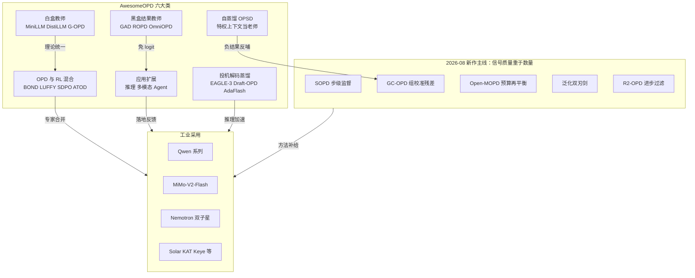
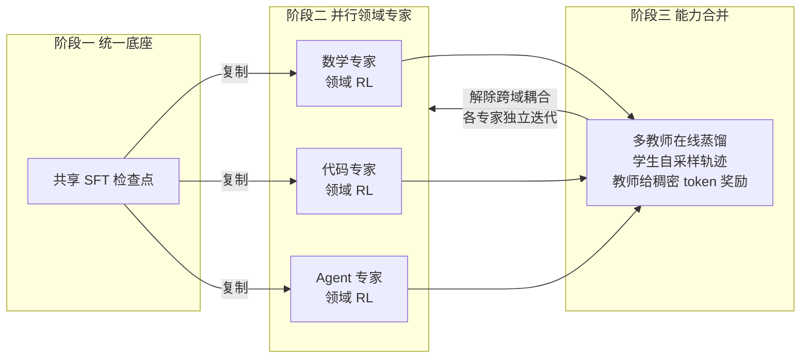

> **TL;DR 三连**
>
> - **核心结论**：一年前 OPD 还是"Qwen3 用过的一个配方"，如今已是一个带完整分类学的生态：AwesomeOPD 收录数百项工作，组织为六大类——白盒教师、黑盒/结果教师、OPSD 自蒸馏、OPD-RL 混合、推理·多模态·Agent 应用、投机解码蒸馏。工业侧，多教师在线蒸馏（MOPD）已成为旗舰模型后训练的标配阶段：MiMo-V2-Flash、Nemotron Cascade 2 / Nemotron 3 Ultra、Solar Open 2、KAT-Coder-V2.5、Kwai Keye-VL-2.0 等一长串生产报告都把"领域 RL 专家 → MOPD 合并"写进了官方管线。
> - **反直觉发现**：2026 年 8 月密集出现的五篇新作（SOPD / GC-OPD / Open-MOPD / 泛化双刃剑 / R2-OPD）共同指向同一件事——**信号质量与分配方式比信号数量更重要**：token 级修正修不好整条错误轨迹（要升级到 step 级）；老师似然会与验证器结果系统性背离（要组校准残差）；多教师合并的失败不是梯度冲突而是 token 预算错配（35.6% → 83.4% headroom）；老师的推理行为会跨域迁移成跷跷板；老师奖励甚至会惩罚真正的推理进步（要按 progress 过滤）。一句话：**什么时候不该听老师的话**，成了这个子领域新的主战场。
> - **定位**：本站已有两篇 OPD 文——《On-Policy Distillation 深度剖析》（方法与 agent 落地）与《在线蒸馏方法全景》（理论统一与工程实践）。本文是一年后的**生态重访**：分类学地图 + 最新一月新作 + 工业落地盘点，不重复方法推导；风格与结构延续本站深度文惯例。



---

## 1. 一年回望：从单一配方到带分类学的生态

先把时间线摆出来。OPD 不是 2025 年发明的新东西：MiniLLM 在 2023 年 6 月就给出了"反向 KL + on-policy 优化"的完整配方（比 GKD 早几天），两者一个走策略梯度、一个走插值旋钮，共同定义了这条主干道（[arXiv:2306.08543](https://arxiv.org/abs/2306.08543)、[arXiv:2306.13649](https://arxiv.org/abs/2306.13649)）。2024 年 Gemma 2 把知识蒸馏写进 2B/9B 档的官方训练配方，是工业界第一次大规模背书（[arXiv:2408.00118](https://arxiv.org/abs/2408.00118)）。真正的出圈发生在 2025 年：Qwen3 技术报告把 OPD 写成小模型的默认后训练路径，Thinking Machines Lab 的博客（非论文）用"把 RL 里的 reference model 换成更强老师"一句话配方和 Tinker 复现让它成为社区通用语。此后一年，工作密度指数级上升——以至于社区需要一个专门的 Awesome 列表来维持秩序，这就是 thinkwee 维护的 AwesomeOPD。

AwesomeOPD 当前的结构本身就是生态成熟度的证明：除综述/奠基区外，方法被切进六个应用大类（白盒教师、黑盒结果教师、OPSD 自蒸馏、OPD-RL 混合、推理·多模态·Agent、投机解码蒸馏），另有框架工具链区和 20 多条工业生产模型报告区。**当一篇博客级别的配方长出自己的分类学和工业追踪区，它就不再是技巧，而是一个子领域**。

两条佐证。其一是理论收敛：Tencent 的 OPD 综述把整个领域形式化为学生采样轨迹上的 f-散度最小化，沿"优化什么、信号从哪来、如何稳定训练"三条轴整理了 50 多种方法，并把 exposure bias 随序列长度平方放大的量化证据作为动机锚点（[arXiv:2604.00626](https://arxiv.org/abs/2604.00626)）；Decoupling KL 则证明 SFT / DAgger / 离线 RL 蒸馏 / OPD 可以统一放进"前缀来源 × KL 方向"四象限（[arXiv:2605.16826](https://arxiv.org/abs/2605.16826)）。其二是诊断转向：2026 年上半年集中出现了一批"不造方法、只回答何时有效"的论文——THUNLP 给出成功双条件（师生思考模式兼容 + 教师拥有真新能力）（[arXiv:2604.13016](https://arxiv.org/abs/2604.13016)）；CUHK/Tencent 的 Demystifying 把 OPD 定位为"探索催化剂"而非上限抬升器，并指出长度剥削与学生-教师失配两种病理（[arXiv:2607.13399](https://arxiv.org/abs/2607.13399)）；Apple 的 Unmasking 用理想梯度对齐分数做免训练逐 token 诊断（[arXiv:2605.10889](https://arxiv.org/abs/2605.10889)）；Geometry of OPD 在参数空间发现 OPD 更新有自己的"子空间锁定"几何，不是 SFT 和 RLVR 之间的简单中间点（[arXiv:2606.07082](https://arxiv.org/abs/2606.07082)）。**从造方法到理解方法，是一年后这个领域最重要的变化**。

## 2. AwesomeOPD 分类学地图：六大类巡礼

六类的划分轴心只有一个问题：**监督信号从哪来、以什么形态到达学生**。白盒类直接拿教师 logit；黑盒类只看教师的输出文本或结果判定；自蒸馏类不给外部教师，而是把特权上下文喂给自己的"高配版本"；混合类把教师信号嵌进 RL 目标内部；应用类把范式搬到多模态生成与 agent 交互；投机解码类则把它对准推理加速的 drafter。先上总表，再逐类拆解：

| 类别 | 教师信号形态 | 代表工作 | 一句话定位 |
|---|---|---|---|
| 白盒教师 OPD | 教师 logit（全词表或采样） | MiniLLM、GKD、G-OPD、TOP-D、KAT | 主干道：学生轨迹上的 dense 反向 KL |
| 黑盒 / 结果教师 | 教师文本输出或结果判定 | GAD、ROPD、OmniOPD | 免 logit：对抗判别、rubric 打分、chunk 级语义验证 |
| OPSD 自蒸馏 | 特权上下文条件化的自己 | OPSD、CRISP、CaOPD | 开卷的自己教闭卷的自己 |
| OPD-RL 混合 | 教师信号嵌入 RL 目标 | BOND、LUFFY、SDPO、ATOD | 用 dense 蒸馏信号补 RL 的稀疏信用分配 |
| 推理·多模态·Agent | 按应用域特化的同型结构 | VOLD、DiffusionOPD、TCOD、ReOPD | 范式外溢：VLM、扩散模型、多轮 agent、GUI |
| 投机解码蒸馏 | 目标模型监督 drafter | OSD、DistillSpec、EAGLE-3、Draft-OPD | 把 OPD 对准投机解码接受率 |

### 2.1 白盒教师 OPD：最拥挤的主干道

这是收录最密的一类，一年内从"选哪种散度"进化成"在轨迹的哪里、以什么粒度信任教师"。奠基性的 MiniLLM 用反向 KL 防止学生高估教师分布的低概率区域，并以策略梯度做 on-policy 优化（[arXiv:2306.08543](https://arxiv.org/abs/2306.08543)）；GKD 把"数据多 on-policy"变成显式旋钮并打通与 RLHF 的联合微调（[arXiv:2306.13649](https://arxiv.org/abs/2306.13649)）。2026 年的主旋律是**修信号**：Revisiting OPD 诊断出采样 token 监督失衡、学生前缀上教师不可靠、tokenizer 错配三种失败模式，并用教师 top-K 局部支撑匹配拿到 +19.8%（[arXiv:2603.25562](https://arxiv.org/abs/2603.25562)）；ESR 发现"离席教师衰减"后干脆只蒸前缀，反而更稳更快（[arXiv:2605.27028](https://arxiv.org/abs/2605.27028)）；KAT 识别低 KL 一致性陷阱——学生漂进坏前缀时教师会局部附和，KL 很低但毫无修正信号——于是用动态阈值提前终止（[arXiv:2606.09471](https://arxiv.org/abs/2606.09471)）；TOP-D 用近端教师构造把梯度方差压出严格界，零额外计算开销（[arXiv:2607.04751](https://arxiv.org/abs/2607.04751)）。理论侧 G-OPD 证明 OPD 是稠密 KL 约束 RL 的特例，且奖励外推系数大于 1 时学生能越过教师边界（[arXiv:2602.12125](https://arxiv.org/abs/2602.12125)）。

### 2.2 黑盒 / 结果教师：把"logit 特权"降级为"文本特权"

闭源前沿模型不给 logit，这一类的存在理由是：**只有教师文本也能做 on-policy**。GAD 把学生当生成器、训一个判别器区分学生与教师（如 GPT-5-Chat）的回答，极小极大博弈让判别器成为随学生共演化的 on-policy 奖励模型，Qwen2.5-14B-Instruct 学生的 LMSYS-Chat 自动评测已可比肩教师（[arXiv:2511.10643](https://arxiv.org/abs/2511.10643)）；ROPD 从师生对比中归纳 prompt 级 rubric 再给学生自己的 rollout 打分，多数场景胜过 logit 方案且样本效率提升至 10 倍（[arXiv:2605.07396](https://arxiv.org/abs/2605.07396)）；OmniOPD 干脆放弃 token 匹配，用蒙特卡洛 rollout 加语义相似度近似教师块级偏好，只在学生的高不确定性推理分叉处审计，数学任务最高 +28.64%，且从 Claude-4.5-Haiku、Gemini-2.5-Flash 这类黑盒教师身上再榨出额外收益（[arXiv:2606.01476](https://arxiv.org/abs/2606.01476)）。

### 2.3 OPSD 自蒸馏：特权上下文即教师

同一个模型扮演两个角色：教师侧看得到验证过的解答、参考线索等**特权信息**，学生侧只见题目，在学生自己的 rollout 上最小化两者的逐 token 散度。OPSD 原始论文证明这套"自己教自己"在数学推理上 token 效率优于 GRPO、效果优于离线蒸馏（[arXiv:2601.18734](https://arxiv.org/abs/2601.18734)），配套综述估计其显存开销比标准 OPD 低约 40%-60%（[arXiv:2605.18141](https://arxiv.org/abs/2605.18141)）。特权信息的设计空间极其灵活：CRISP 用一句"请简洁作答"当特权指令，把推理长度砍掉一半以上而不掉精度（[arXiv:2603.05433](https://arxiv.org/abs/2603.05433)）。但这一类也贡献了全年最锋利的负结果：Rethinking OPSD 发现在五个思考模型上特权自蒸馏一律劣化，AIME/HMMT 相对降幅最高 17%，机制是特权上下文压低了高熵分叉位置的分支率，惩罚了自我校正行为（[arXiv:2607.05184](https://arxiv.org/abs/2607.05184)）；CaOPD 则指出教师监督形成于训练期特权信息之下，会把模型锁进系统性过度自信，校准需要单独处理（[arXiv:2604.16830](https://arxiv.org/abs/2604.16830)）。**特权即偏置，是自蒸馏类必须随身携带的警示牌**。

### 2.4 OPD-RL 混合：稠密信号进 RL 目标

这一类不再单独谈蒸馏，而是问：把教师信号塞进 RL 目标的哪个位置？BOND 让策略分布去匹配 Best-of-N 分布，用 Jeffreys 散度平衡覆盖与收敛，是 Google DeepMind 给出的 RLHF 替代算法（[arXiv:2407.14622](https://arxiv.org/abs/2407.14622)）；LUFFY 在 GRPO 里混入 off-policy 教师轨迹并用正则化重要性采样防止僵硬模仿，弱模型场景下纯 RLVR 完全失效时仍能学到东西（[arXiv:2504.14945](https://arxiv.org/abs/2504.14945)）；SDPO 把"看到反馈的自己"当自教师，将文本反馈转成 dense 学习信号，无需外部教师（[arXiv:2601.20802](https://arxiv.org/abs/2601.20802)）；ATOD 显式调度两者——早期 OPD 主导逼近教师，后期逐渐交棒给 RL 探索，配合轮级不确定性重加权，在三个 agent 基准上平均超过 OPD 4.16 分、甚至反超教师 2.16 分（[arXiv:2606.27814](https://arxiv.org/abs/2606.27814)）。Sparse-to-Dense 原则给了这类混合一条资源分配定律：稀缺标注数据花在上游强教师的稀疏奖励探索上，再把行为以 dense 蒸馏桥接给部署学生，同一学生规模下 RL 教师桥接显著优于直接 GRPO（[arXiv:2605.12483](https://arxiv.org/abs/2605.12483)）。CPO 则从理论上把边界抹掉：token 级对比分歧可以做正确性感知的优势整形，而 OPD 正是其教师实例化的特例（[arXiv:2607.14614](https://arxiv.org/abs/2607.14614)）。

### 2.5 推理 · 多模态 · Agent OPD：范式外溢

第三条战线是把范式搬出纯文本 LLM。多模态方向，VOLD 解决"文本教师怎么教视觉学生"：GRPO 之上叠加 on-policy 蒸馏，并证明冷启动分布对齐缺位时蒸馏信号完全失灵（[arXiv:2510.23497](https://arxiv.org/abs/2510.23497)）；Vision-OPD 利用"同一模型看裁剪图比看全图准"的区域-全局差距，把裁剪条件的自己当特权教师（[arXiv:2605.18740](https://arxiv.org/abs/2605.18740)）；DiffusionOPD 把 OPD 从离散 token 升维到连续状态马尔可夫链，得到闭式逐步 KL，统一 SDE/ODE 两种精炼（[arXiv:2605.15055](https://arxiv.org/abs/2605.15055)）。Agent 方向的核心矛盾是多轮误差复合：TCOD 识别轨迹级 KL 不稳定并用时间课程从短到长扩展视野，最多 +18 分还能反超教师（[arXiv:2604.24005](https://arxiv.org/abs/2604.24005)）；ReOPD 用预收集教师轨迹做前缀重放，零环境交互、rollout 提速至少 4 倍（[arXiv:2607.04763](https://arxiv.org/abs/2607.04763)）；UI-MOPD 把多教师路由带进跨平台 GUI agent，桌面/移动专家各管各的约定互不平均（[arXiv:2607.04425](https://arxiv.org/abs/2607.04425)）。负面教训同样有价值：反馈增强自蒸馏在检索交错搜索 agent 上全面失效，根因是解码坍缩让 KL 信号失去信息量（[arXiv:2607.17558](https://arxiv.org/abs/2607.17558)）。

### 2.6 投机解码蒸馏：被重新发现的加速器配方

最容易被忽视、却离钱最近的一类：drafter 也是学生，目标模型的验证通过率就是它的"考试分数"。Online Speculative Decoding 用线上查询数据持续更新草稿模型，接受率提升 0.1-0.65，延迟降低 1.42-2.17 倍（[arXiv:2310.07177](https://arxiv.org/abs/2310.07177)）；DistillSpec 系统化了"按解码策略挑散度 + 草稿侧 on-policy 数据"两个设计点，拿到 10%-45% 额外加速（[arXiv:2310.08461](https://arxiv.org/abs/2310.08461)）；EAGLE-3 改直接 token 预测加多层特征融合，加速比最高 6.5 倍（[arXiv:2503.01840](https://arxiv.org/abs/2503.01840)）。2026 年的新进展是把标准 OPD 论证完整搬进来：Draft-OPD 指出 SFT 草稿模型在测试数据上接受长度早早平台化，因为训练在目标轨迹上、评估却在草稿自身策略诱导的状态上——于是用目标辅助 rollout 加错误位置重放，让 drafter 在 draft-induced states 上接受目标监督，思考模型实现 5 倍以上无损加速，超 EAGLE-3 达 23%（[arXiv:2605.29343](https://arxiv.org/abs/2605.29343)）；AdaFlash 进一步处理扩散 drafter 双向注意力的方差问题，反向 KL 蒸馏加自适应长度头，吞吐较此前最优高约 66%（[arXiv:2607.19223](https://arxiv.org/abs/2607.19223)）。

## 3. 2026-08 新作拆解：五篇论文读出一条主线

2026 年 8 月中旬一周之内挂出的这五篇新作（全部摘要经 arXiv citation_abstract 核实）不是孤立的刷点，它们分别攻击监督信号的五个正交维度：**粒度、校准、预算、范围、信任**。共同的潜台词是一年前那批配方默认的前提——"教师的 dense 信号天然等价于学习进度"——在长上下文、多教师、agent 场景下不再成立。

### 3.1 SOPD：粒度——token 补丁修不好整条错误轨迹

Step-Level OPD 的出发点是一个朴素的临床观察：标准 token 级 OPD 只能沿学生的错误轨迹打碎片化补丁，**无法展开一条完整且正确的修复路径**。SOPD 把监督粒度从 token 抬到 step：在学生自己生成的完整轨迹上，让教师在学生访问过的状态下给出步级补全，把 SFT 的长视野修正能力与 OPD 的 on-policy 状态对齐优势拼在一起（[arXiv:2608.16333](https://arxiv.org/abs/2608.16333)）。它有一个漂亮的理论性质：步长取不同极限时，SOPD 分别退化为 SFT 或逼近 OPD——两种老方法原来是同一个旋钮的两端；而相比 SFT，其教师响应以学生轨迹为条件，更贴合学生实际访问的状态。实验上推理与 agent 任务同时超过两个退化端点，ALFWorld 平均成功率比 vanilla OPD 高 13.4 个百分点。

### 3.2 GC-OPD：校准——教师似然与验证器结果的系统性背离

长上下文任务暴露了另一处裂缝：token 级的教师支持会偏好"局部通顺但漏掉散布全文的证据、或违反全局约束"的回答。作者在两个长上下文证据聚合任务上做了诊断：随输入变长，**轨迹级 OPD 分数与验证器奖励的错位持续加剧**——老师觉得好和学生真把事办成，是两件事（[arXiv:2608.19181](https://arxiv.org/abs/2608.19181)）。药方是组校准：在每个 rollout 组内分别归一化验证器奖励与轨迹级 OPD 分数，取差得到带符号的师生-验证器分歧残差

$$\Delta_g=\widetilde{R}^{\mathrm{ver}}_g-\widetilde{S}^{\mathrm{opd}}_g,\qquad A_t=A^{\mathrm{opd}}_t+\beta\cdot\mathrm{RACA}(\Delta_g,\;A^{\mathrm{opd}})$$

其中 RACA 按 token 的相对 OPD 优势把轨迹级残差摊回 token，同时保留原始 OPD 信号。五个长上下文基准上，Qwen3-4B 官方检查点均值从 29.08 提到 40.47，Qwen3-8B 从 35.12 到 44.65，同设置下 vanilla OPD 只到 39.31/43.56；消融显示带符号残差优于"再加一项 OPD 项"或直接加组归一化验证器奖励。这是第一篇把"验证器当裁判请进蒸馏室"做成长上下文配方的系统工作。

### 3.3 Open-MOPD：预算——多教师失衡不是梯度冲突，是预算错配

MOPD 一年之间成为工业标配（见 §4），但 Open-MOPD 给这份热闹泼了盆冷水：在 SmolLM3-3B-Base 上用 oracle 路由搭建受控基准、把能力整合与路由歧义解耦后，标准 M-OPD 相对领域路由 oracle 集成只吃到了 **35.6% 的可用 headroom**，短任务（指令遵循）严重退化并过早停滞（[arXiv:2608.19098](https://arxiv.org/abs/2608.19098)）。关键诊断是否定性的：失败**不来自梯度冲突**，而来自 token 级优化预算的严重错配，由三个正交因素驱动——跨领域序列长度结构性差异、非均匀学习率导致的动态收敛漂移、异步策略更新带来的多步奖励陈旧。修复三件套（token 份额均衡、差距感知动态预算分配、学生奖励刷新）把 headroom 回收率从 35.6% 拉到 83.4%，并且全流程开源在学术可负担的硬件预算上——对一窝蜂上 MOPD 的工业管线，这是一篇必读的体检报告。

### 3.4 泛化双刃剑：范围——迁移的是行为，跷跷板也是

这篇控制变量研究回答了一个此前没人认真拆过的问题：OPD 到底迁移什么？结论分三层：其一，OPD 迁移的是教师的**推理行为**而非针对具体题目的答案——训练难度几乎不影响，甚至教师从未解出的题目也有用；其二，迁移强烈依赖师生的"出身关系"：**同源配对**（同预训练血统）能把学生拉到教师附近，跨越语言、推理视野乃至其他领域，**跨源配对**则基本只在拟合训练分布（[arXiv:2608.16647](https://arxiv.org/abs/2608.16647)）；其三，这种广谱迁移是把双刃剑——路由机制无法圈住每位教师的影响半径，多教师合并时各领域能力出现**依赖混合配比的跷跷板**。这为 §4 里工业界普遍的多教师实践提供了理论注脚，也和 Open-MOPD 的预算错配诊断形成互补：一个说影响圈不住，一个说预算分不均，两条证据链指向同一病灶。

### 3.5 R2-OPD：信任——教师奖励会惩罚真正的进步

最后一篇捅破的是最底层假设：教师衍生的奖励真是"推理进度"的合格代理吗？作者观察到明确的反例——推理上有清晰进展的步骤，可能仅因偏离教师输出而拿到更低的蒸馏奖励，**教师奖励与真实推理进度系统性冲突**（[arXiv:2608.19408](https://arxiv.org/abs/2608.19408)）。R2-OPD 的做法克制而聪明：在同一条轨迹内给推理 span 建两份排名，一份来自教师衍生奖励，一份来自独立估计的进度奖励；两者排名冲突处选择性抑制蒸馏信号，其余原样保留。相当于给教师配了一位"进度监察"，只在监察与教师意见相左时消音。推理类任务上取得对标准 OPD 的一致改进。

### 3.6 合并视图：一块"信号整形"面板

五篇文章拆完，值得把它们焊回训练循环里看：它们都不动 OPD 的主干（学生 rollout + 教师 dense 信号），只在不同位置插入了信号整形钩子——SOPD 改粒度聚合、GC-OPD 加验证器残差、Open-MOPD 调 token 预算、R2-OPD 做 rank 冲突过滤。下面的骨架把四个钩子放进同一块可插拔面板：

```python
# opd_signal_board.py -- 五篇新作的信号整形钩子,统一进一个 OPD 训练步(骨架示意)
import torch
import torch.nn.functional as F

def opd_train_step(student, teacher, batch, cfg):
    # 1) 学生自采样轨迹: on-policy 是一切的前提
    roll = student.generate(batch.prompts, **cfg.rollout)          # 学生自己的轨迹
    ls = student(roll.tokens).logits                                # 学生逐 token 分布
    with torch.no_grad():
        lt = teacher(roll.tokens).logits                            # 白盒教师逐 token 分布
    r_opd = (ls.log_softmax(-1) - lt.log_softmax(-1)) \
             .gather(-1, roll.tokens.unsqueeze(-1)).squeeze(-1)     # token 级 log-ratio 奖励

    # 钩子A [SOPD] 步级聚合: 按步骤边界求均值,教师补全整步而非逐 token 打补丁
    if cfg.sopd:
        r_opd = seg_mean(r_opd, roll.step_bounds)                   # (B,T) -> (B,K) 再广播回 (B,T)

    # 钩子B [GC-OPD] 组校准残差: 教师轨迹分与验证器奖励各自组内归一化,符号差按相对优势摊回 token
    if cfg.gc_residual:
        delta = gnorm(r_opd.sum(-1)) - gnorm(batch.verifier_reward) # (G,) 带符号分歧残差
        r_opd = r_opd + cfg.beta * raca(delta, r_opd)               # 保持原始 OPD 信号不变

    # 钩子C [R2-OPD] 进度过滤: 教师排名与独立进度排名冲突的 span,抑制蒸馏奖励
    if cfg.r2_filter:
        mute = rank_conflict(r_opd, batch.progress_reward)          # (B,T) 布尔掩码
        r_opd = torch.where(mute, torch.zeros_like(r_opd), r_opd)

    # 钩子D [Open-MOPD] 多教师预算: 各领域教师按 token 份额均衡+差距感知预算分配加权
    if cfg.multi_teacher:
        w = token_share_balance(cfg.domain_budgets, roll.domain_id) # (T,) 每位置预算权重
        r_opd = w * mix_teacher_scores(lt, cfg.teacher_pool)

    # 反向 KL 的策略梯度形式: dense log-ratio 即 reward, stop-gradient 后回传学生
    return -(r_opd.detach() * logp(ls, roll.tokens)).sum(-1).mean()
```

##### 变量映射表（数学符号 ↔ 代码变量）

| 数学符号 | 代码变量 | Shape | 含义 |
|---|---|---|---|
| \(\hat{y}\sim\pi_\theta\) | `roll.tokens` | `(B, T)` | 学生自采样的轨迹 token 序列 |
| \(\log\frac{\pi_\theta(y_t)}{\pi_T(y_t)}\) | `r_opd` | `(B, T)` | token 级蒸馏奖励（反向 KL 的 PG 形式） |
| 步骤边界 \(b_k\) | `roll.step_bounds` | `(B, K)` | SOPD 的步骤切分索引 |
| \(\widetilde{R}^{\mathrm{ver}}_g-\widetilde{S}^{\mathrm{opd}}_g\) | `delta` | `(G,)` | GC-OPD 组内符号化分歧残差 |
| \(\beta\) | `cfg.beta` | 标量 | 残差混入强度 |
| \(m_t\in\{0,1\}\) | `mute` | `(B, T)` | R2-OPD 排名冲突抑制掩码 |
| \(w_t\) | `w` | `(T,)` | Open-MOPD 的每位置 token 预算权重 |

五篇新作放在同一张表里对比：

| 论文 | 攻击维度 | 诊断出的病灶 | 药方 | 关键数字 |
|---|---|---|---|---|
| SOPD | 粒度 | token 级修正碎片化，展不开完整修复路径 | 学生轨迹上的步级教师补全，粒度旋钮两端接 SFT/OPD | ALFWorld 超 vanilla OPD 13.4 分 |
| GC-OPD | 校准 | 长上下文中轨迹级 OPD 分与验证器奖励错位加剧 | 组内归一化带符号残差 + RACA 摊回 token | Qwen3-4B 均值 29.08→40.47 |
| Open-MOPD | 预算 | 多教师失衡源于预算错配而非梯度冲突 | token 份额均衡+动态预算+奖励刷新 | headroom 回收 35.6%→83.4% |
| 泛化双刃剑 | 范围 | 同源迁移广谱有效、跨源只拟合分布；多教师跷跷板 | 单因素控制变量研究 + 出身关系诊断 | 教师未解题目亦有用的反直觉结论 |
| R2-OPD | 信任 | 教师奖励惩罚真实推理进步 | 双排名冲突处抑制蒸馏信号 | 对标准 OPD 一致改进 |

共同点清晰可见：**都在给"无条件相信教师"这件事加装外部参照物**——SFT 的完整修复路径、任务验证器、路由 oracle、出身关系、独立进度估计。一年前的问题是"怎么高效听老师的话"，八月的新作把问题换成了"哪些话不该听"。

## 4. 工业采用现状：MOPD 成为旗舰后训练的标配阶段

把 AwesomeOPD 的工业报告区从头翻到尾，会看到一个高度收敛的模式：**"SFT 底座 → 各领域并行 RL 专家 → 多教师在线蒸馏合并"的三段式**，已经成为 2026 上半年旗舰模型的后训练默认模板：



这个配方的学术版就是小米团队提出、已部署进 MiMo-V2-Flash 后训练的 MOPD：先对同一共享检查点做各领域独立 RL 得到一组领域教师，再在学生自己的 rollout 上用密集 token 级奖励完成合并；Qwen3-30B-A3B 上对比 Mix-RL、Cascade RL、Off-Policy Finetune 与参数合并，MOPD 几乎完整继承每位教师的能力（[arXiv:2606.30406](https://arxiv.org/abs/2606.30406)）。工业侧的落地密度才是重点——下表挑出报告摘要中明确写出蒸馏阶段的代表（全部经 arXiv 摘要核实）：

| 模型 | 时间 | 蒸馏用法 | 报告中的关键表述 |
|---|---|---|---|
| Qwen3 | 2025-05 | 小模型 OPD 配方 | 用旗舰模型知识显著降低小模型训练算力 |
| MiMo-V2-Flash | 2026-01 | MOPD（309B-A15B MoE） | 以 DeepSeek-V3.2 的 1/2、Kimi-K2 的 1/3 总参对标两者 |
| Nemotron-Cascade 2 | 2026-03 | 级联 RL 中多领域在线蒸馏 | 从各领域最强中间教师蒸馏，回收基准回退 |
| Nemotron 3 Ultra | 2026-06 | SFT→RL→两轮 MOPD（550B-A55B） | 吞吐较同级公开模型最高约 6 倍 |
| Agents-A1 | 2026-06 | 多教师领域路由 OPD + 显著词表对齐 | 35B 在长程 agent 任务达到万亿参级表现 |
| KAT-Coder-V2 / V2.5 | 2026-03 / 07 | 五专家各自 SFT+RL 后在线蒸馏统一 | SWE-bench Verified 79.6%，V2.5 再以 MOPD 统三专家 |
| Solar Open 2 | 2026-07 | 十二个领域专家经 MOPD 合并（1M 上下文） | 迄今最详细的 MOPD 写作 |
| Kwai Keye-VL-2.0 | 2026-06 | 跨模态 MOPD 对抗多任务遗忘 | 30B-A3B 上蒸馏稠密反馈回仅激活 3B 的骨干 |
| Mach-Mind-4-Flash | 2026-07 | MOPD 路由式反向 KL 消除混合奖励跷跷板 | 后训练 alone 追平百亿级模型，推理链压缩 19-46% |
| Qwen-Image-2.0-RL | 2026-06 | 扩散模型上轨迹级速度匹配合并任务专家 | 图像生成也吃上了"RL 专家 + OPD 合并" |
| HY-MT1.5 | 2025-12 | 翻译管线含在线蒸馏阶段 | 1.8B 达到 Gemini-3-Pro 约 90% 表现 |
| OvisOCR2 | 2026-07 | 经典大→小压缩：4B 分支 RL 后蒸入 0.8B | MOPD 浪潮里的反例：文档解析仍走压缩路线 |

三个值得注意的结构性观察。**第一，MOPD 的卖点从"省算力"升级为"解耦工程"**：Agents-A1 说得最直白——领域级教师捕获专业能力、路由蒸馏统一六个异构域，让不同团队可以并行迭代互不阻塞；Nemotron-Cascade 2 则把蒸馏当成级联 RL 过程中的"回归回收器"，每个领域的最强中间教师随时往主线上回灌。**第二，模态全线扩散**：语言之外，代码（KAT）、多模态理解（Keye-VL）、图像生成（Qwen-Image-2.0-RL）、翻译（HY-MT）、文档解析（OvisOCR2）都出现了蒸馏阶段，其中图像生成那条用的是连续态的轨迹速度匹配——与 §2.5 的 DiffusionOPD 学术线正好呼应。**第三，采用模式开始分化**：多数新旗舰把多教师蒸馏当能力整合器，但 OvisOCR2 证明传统"大 RL 模型压小部署模型"的经典叙事仍然有效，Cursor 的 Composer 2.5 则走 RL 与 OPD 混训的生产 coding agent 路线——MOPD 是默认选项之一，而非唯一终点。

工具链侧同样完成了闭环。TRL 自称收录了最全的 OPD 训练器家族（gkd、sdft、sdpo 等）；verl 的 `recipe/on_policy_distill` 是目前最生产就绪的配方；NeMo-RL 原生支持学生 rollout 的 OPD；GLM 系列背后的 slime 也内置了相关能力（以上均为代码库/框架，非论文）。针对工程痛点的专项工作也在出现：KDFlow 把教师与学生后端解耦、以隐藏状态零拷贝传输砍通信开销；EasyOPD 把碎片化的方法版图整理成五个扩展点；AsyncOPD 则系统回答"流水线能容忍多陈旧"的问题（三者均为开源项目）。**当一类方法同时拥有专属 Awesome 列表、综述、统一框架和工业追踪区，它的基础设施期就算结束了——接下来拼的是信号质量，这正是 §3 那批新作的主战场**。

## 5. 批判与展望

**批判一：命名已经失控。** 一年之内缩写严重超载：COPD 同时是 Contrastive OPD 与另一篇宪法式安全蒸馏的工作；DOPD、d-OPSD、dOPSD 是三个毫不相干的研究；OPD²、OPD+、MOPD、M-OPD 边界全靠读者脑补。检索"OPD"还会撞上慢性阻塞性肺病。分类学出现了，命名规范没有——这是生态繁荣的副作用，也是新人入场的真实摩擦成本。

**批判二：评估内卷在系统性高估能力。** 大量方法挤在数学推理基准加同一族 Qwen 师生对上，且基准往往贴近训练分布。泛化双刃剑那篇恰好证明这种做法会高估迁移：同源配对的广谱迁移在换到跨源场景就大幅缩水。Open-MOPD 的 oracle 路由上界设计值得推广——没有上界锚点的"SOTA"声明很难判断还剩多少空间。

**批判三：可复现性债越欠越多。** 列表维护者已在多条目上标注疑点：有的项目主页 404，有的仓库长期空壳，还有工作被指 headline 表格疑似使用了未声明的轻量实现。开源框架虽多，方法与框架之间的映射仍未标准化——同一篇论文的配方在不同框架里可能对应不同的超参语义。教师权重不公开导致的"不可复现教师"问题，比数据不公开更隐蔽。

**批判四：dense 监督的成本账没人细算。** OPD 每 token 都要过一遍教师前向，长序列、多教师叠加后这笔账迅速膨胀；THUNLP 早在年初就质疑 dense token 级奖励能否扩展到长视野蒸馏。AsyncOPD 这类"能有多陈旧"的研究说明工业界已经在为这条成本曲线找补，但公开的端到端成本对比仍然稀缺。

展望未来十二个月，五条线最值得关注：**其一，蒸馏 scaling law**——Tencent 综述把它列为头号开放问题，师生规模差、数据量与最终能力之间至今没有可预测的定量关系。**其二，验证器进蒸馏室**——GC-OPD 开了组校准的头，不确定性感知反馈（综述开放问题之二）大概率沿这条路展开。**其三，agent 级蒸馏**——多轮环境的信用分配、turn 级信号整形刚刚起步，ReOPD/TCOD/ATOD 只是第一波。**其四，KD 与 RL 的形式合流**——G-OPD 证明 OPD 是稠密 KL 约束 RL 的特例，CPO 进一步证明 OPD 是其对比分歧的特例，两个社区正在收敛到同一个目标函数族。**其五，弱到强前沿**——W2S-OPD 用一对弱模型的 logit 差构造代理教师，让所有监督源都比学生弱时学生仍能变强（[arXiv:2607.26246](https://arxiv.org/abs/2607.26246)）；Direct-OPD 把小型模型的 RL 政策偏移当作隐式奖励转移给更强目标，8 卡 A100 四小时把 Qwen3-1.7B 的 AIME24 从 48.3% 提到 58.3%（[arXiv:2607.05394](https://arxiv.org/abs/2607.05394)）。当"没有更强老师"不再是天花板，这个子领域的故事才真正讲到深水区。

## 参考与延伸阅读

以下论文全部经 arXiv abs 页面 citation_abstract 核实后引用；博客、框架与产品类条目已单独注明非论文。本站前置阅读：《在线蒸馏方法全景》（理论统一视角）与《On-Policy Distillation 深度剖析》（agent 落地视角），本文与其互补而不重复。

#### 奠基与综述

- MiniLLM：反向 KL + on-policy 策略梯度的开山配方，比 GKD 早几天挂出 [arXiv:2306.08543](https://arxiv.org/abs/2306.08543)。
- GKD（Google DeepMind）：把 on-policy 程度做成旋钮、打通与 RLHF 联训的奠基论文 [arXiv:2306.13649](https://arxiv.org/abs/2306.13649)。
- A Survey of On-Policy Distillation（Tencent）：f-散度形式化 + 三设计轴 + 开放问题清单的领域综述 [arXiv:2604.00626](https://arxiv.org/abs/2604.00626)。
- A Brief Overview: On-Policy Self-Distillation：OPSD 子领域的入门综述 [arXiv:2605.18141](https://arxiv.org/abs/2605.18141)。
- When Does Online IL Help：以可实现性挑战"误差累积"叙事的理论位置论文 [arXiv:2606.30445](https://arxiv.org/abs/2606.30445)。
- Gemma 2 与 Qwen3 技术报告：工业界最早的两波官方背书 [arXiv:2408.00118](https://arxiv.org/abs/2408.00118)、[arXiv:2505.09388](https://arxiv.org/abs/2505.09388)。

#### 分类学与诊断线

- Decoupling KL and Trajectories：SFT/DAgger/离线 RL 蒸馏/OPD 四象限统一 [arXiv:2605.16826](https://arxiv.org/abs/2605.16826)。
- Rethinking OPD（THUNLP）：成功双条件与 token 级机制解剖 [arXiv:2604.13016](https://arxiv.org/abs/2604.13016)。
- Revisiting OPD：三种失败模式与教师 top-K 局部支撑匹配 [arXiv:2603.25562](https://arxiv.org/abs/2603.25562)。
- Demystifying OPD：探索催化剂定位与长度剥削病理 [arXiv:2607.13399](https://arxiv.org/abs/2607.13399)；Unmasking OPD：免训练梯度对齐诊断 [arXiv:2605.10889](https://arxiv.org/abs/2605.10889)；Geometry of OPD：参数空间子空间锁定 [arXiv:2606.07082](https://arxiv.org/abs/2606.07082)。
- 白盒信号修正三例：ESR 前缀截断 [arXiv:2605.27028](https://arxiv.org/abs/2605.27028)、KAT 低 KL 一致性陷阱终止 [arXiv:2606.09471](https://arxiv.org/abs/2606.09471)、TOP-D 近端教师方差控制 [arXiv:2607.04751](https://arxiv.org/abs/2607.04751)。
- 黑盒三例：GAD 对抗判别 [arXiv:2511.10643](https://arxiv.org/abs/2511.10643)、ROPD rubric 化 [arXiv:2605.07396](https://arxiv.org/abs/2605.07396)、OmniOPD 投机验证 [arXiv:2606.01476](https://arxiv.org/abs/2606.01476)。
- OPSD 正反两面：原始方法 [arXiv:2601.18734](https://arxiv.org/abs/2601.18734)、压缩应用 CRISP [arXiv:2603.05433](https://arxiv.org/abs/2603.05433)、思考模型劣化负结果 [arXiv:2607.05184](https://arxiv.org/abs/2607.05184)、校准陷阱 CaOPD [arXiv:2604.16830](https://arxiv.org/abs/2604.16830)。
- 混合方向：BOND [arXiv:2407.14622](https://arxiv.org/abs/2407.14622)、LUFFY [arXiv:2504.14945](https://arxiv.org/abs/2504.14945)、SDPO [arXiv:2601.20802](https://arxiv.org/abs/2601.20802)、ATOD [arXiv:2606.27814](https://arxiv.org/abs/2606.27814)、稀疏-稠密分配原则 [arXiv:2605.12483](https://arxiv.org/abs/2605.12483)、CPO 特例证明 [arXiv:2607.14614](https://arxiv.org/abs/2607.14614)、G-OPD 奖励外推 [arXiv:2602.12125](https://arxiv.org/abs/2602.12125)。
- 多模态与 Agent：VOLD [arXiv:2510.23497](https://arxiv.org/abs/2510.23497)、Vision-OPD [arXiv:2605.18740](https://arxiv.org/abs/2605.18740)、DiffusionOPD [arXiv:2605.15055](https://arxiv.org/abs/2605.15055)、TCOD 时间课程 [arXiv:2604.24005](https://arxiv.org/abs/2604.24005)、ReOPD 前缀重放 [arXiv:2607.04763](https://arxiv.org/abs/2607.04763)、UI-MOPD [arXiv:2607.04425](https://arxiv.org/abs/2607.04425)、搜索 agent 负结果 FA-SD [arXiv:2607.17558](https://arxiv.org/abs/2607.17558)。
- 投机解码：Online Speculative Decoding [arXiv:2310.07177](https://arxiv.org/abs/2310.07177)、DistillSpec [arXiv:2310.08461](https://arxiv.org/abs/2310.08461)、EAGLE-3 [arXiv:2503.01840](https://arxiv.org/abs/2503.01840)、Draft-OPD [arXiv:2605.29343](https://arxiv.org/abs/2605.29343)、AdaFlash [arXiv:2607.19223](https://arxiv.org/abs/2607.19223)。

#### 2026-08 新作（本文第③章主角）

- SOPD 步级在线蒸馏 [arXiv:2608.16333](https://arxiv.org/abs/2608.16333)；GC-OPD 组校准长上下文蒸馏 [arXiv:2608.19181](https://arxiv.org/abs/2608.19181)；Open-MOPD 多教师失衡诊治 [arXiv:2608.19098](https://arxiv.org/abs/2608.19098)；泛化双刃剑控制变量研究 [arXiv:2608.16647](https://arxiv.org/abs/2608.16647)；R2-OPD 推理进度过滤 [arXiv:2608.19408](https://arxiv.org/abs/2608.19408)。

#### 工业采用（MOPD 方法学 + 生产模型技术报告）

- MOPD 方法学论文（小米，已部署 MiMo-V2-Flash）[arXiv:2606.30406](https://arxiv.org/abs/2606.30406)。
- 生产报告：MiMo-V2-Flash [arXiv:2601.02780](https://arxiv.org/abs/2601.02780)、Nemotron-Cascade 2 [arXiv:2603.19220](https://arxiv.org/abs/2603.19220)、Nemotron 3 Ultra [arXiv:2606.15007](https://arxiv.org/abs/2606.15007)、Solar Open 2 [arXiv:2607.20062](https://arxiv.org/abs/2607.20062)、KAT-Coder-V2 [arXiv:2603.27703](https://arxiv.org/abs/2603.27703)、KAT-Coder-V2.5 [arXiv:2607.05471](https://arxiv.org/abs/2607.05471)、Kwai Keye-VL-2.0 [arXiv:2606.10651](https://arxiv.org/abs/2606.10651)、Agents-A1 [arXiv:2606.30616](https://arxiv.org/abs/2606.30616)、Mach-Mind-4-Flash [arXiv:2607.09375](https://arxiv.org/abs/2607.09375)、Qwen-Image-2.0-RL [arXiv:2606.27608](https://arxiv.org/abs/2606.27608)、HY-MT1.5 [arXiv:2512.24092](https://arxiv.org/abs/2512.24092)、OvisOCR2 [arXiv:2607.13639](https://arxiv.org/abs/2607.13639)。以上均为厂商技术报告而非同行评审论文，结论请按工程证据强度对待。

#### 弱到强前沿

- W2S-OPD：弱模型对比对构造代理教师 [arXiv:2607.26246](https://arxiv.org/abs/2607.26246)；Direct-OPD：小型 RL 政策偏移作为隐式奖励转移 [arXiv:2607.05394](https://arxiv.org/abs/2607.05394)。

#### 非论文资源

- AwesomeOPD（thinkwee 维护）：本文分类学地图的一手来源，GitHub 仓库 README，非论文。
- Thinking Machines Lab《On-Policy Distillation》博客与 tinker-cookbook 参考实现（2025-10）：一句话配方的大众化推手，非论文。
- TRL、verl、NeMo-RL、slime、KDFlow、EasyOPD、AsyncOPD、Spider：训练框架与工具链，均为开源代码库，非论文。
- 中文社区追踪入口：知乎与掘金上围绕"Qwen3 配方""Thinking Machines 在线蒸馏博客"的讨论帖是低成本跟进渠道，适合作为英文论文之外的二手信息源。

> 🧪 动手练习
>
> - **练习一（粒度旋钮）**：用 TRL 的 GKD 训练器或 verl 的 on_policy_distill 配方跑一个最小的 OPD 实验（比如 Qwen3 家族内大蒸小、GSM8K 子集），然后参照 §3.6 面板实现钩子 A——把 token 级奖励换成按步骤边界聚合的步级奖励（步骤边界可以用换行或"Wait/But"类转折词切），对比两种粒度的收敛速度与准确率，亲手验证 SOPD"碎片补丁 vs 完整修复"的诊断。
> - **练习二（校准诊断）**：挑一个长上下文证据聚合任务（多文档问答即可），冻结一组学生回答，分别计算轨迹级教师 log-ratio 分数与答案验证器得分，把两者的对齐程度按输入长度分桶画出来。如果分歧确实随长度加剧，你就独立复现了 GC-OPD 的核心动机；如果没加剧，想想是什么设置差异保护了教师信号——这本身就是一篇小实验报告的素材。
