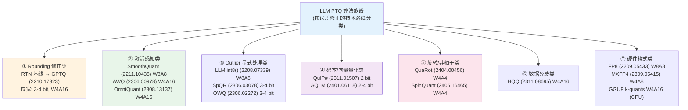
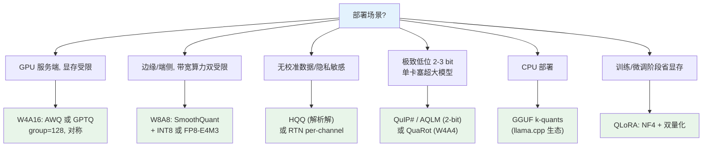

> **系列导航** ｜ [课程路线图](/quantization-roadmap/) ｜ **Part 0 · 总纲与地基** ｜ 第 00 篇 / 共 26 篇
>
> [01 量化器数学地基与 RTN →](/2026/08/23/llm-quant-00-quantizer-fundamentals-rtn/)
>
> **总览篇** —— 为后续 25 篇提供统一的数学框架与坐标系：量化器 × 粒度 × 误差度量三维设计空间、数值格式全景、七大算法路线族谱、按场景决策树与工程陷阱清单。本文所有公式从定义逐步展开、不跳步；附录给出可运行的 numpy 最小量化器，可直接复制验证。

**TL;DR**
* **核心结论**：LLM 后训练量化（PTQ）的全部算法，本质是在 **量化器（scale/zero-point 怎么定）** × **粒度（per-tensor/per-channel/per-group）** × **误差度量（MSE/KL/Perplexity/Hessian）** 三个维度上做设计选择。2022 年后的算法创新（GPTQ/AWQ/QuIP#/QuaRot…）几乎全部发生在"如何让量化误差在**输出空间**而非**权重空间**最小"这一点上——统一视角是 layer-wise 的 Hessian 加权误差 $\mathrm{tr}((\Delta W)^\top H \Delta W)$。
* **反直觉发现**：(1) 教科书公式 $s = \max|x|/2^{b-1}$ 只在**均匀分布 + 高位宽**下接近最优，对 4-bit 高斯分布它比最优 scale 大 ~50%，白扔约 3 dB 精度（详见 §1.3 与附录 Demo 2）；(2) 量化误差的主力往往不是舍入（rounding）而是**裁剪（clipping）**——GPTQ 一类方法修的是前者，AWQ 修的是后者；(3) per-channel 粒度对"输出通道范数差异"有效，但对**输入通道离群**无效——这才是 group 量化成为主流的真正原因（§3.3）。
* **定位**：本文是"地图"，不是"攻略"。它不深入任何单一算法的内核细节（留给系列后续篇），而是给出：一个可推导的量化器数学框架、一张数值格式全景表、一张算法族谱图、一张按场景的决策树，以及一套可运行的 numpy 最小实现，让读者在任何量化论文面前都能快速定位它改的是设计空间里的哪一个旋钮。

---

## 目录

1. [量化器数学：从定义到最优 scale 推导](#1-量化器数学从定义到最优-scale-推导)
2. [数值格式全景：INT8/INT4/NF4/FP8/MXFP4/BF16](#2-数值格式全景int8int4nf4fp8mxfp4bf16)
3. [量化粒度：per-tensor / per-channel / per-group](#3-量化粒度per-tensor--per-channel--per-group)
4. [校准方法论：校准集、损失函数与 Hessian 视角](#4-校准方法论校准集损失函数与-hessian-视角)
5. [评估：ppl、lm-eval-harness 与泄露陷阱](#5-评估ppllm-eval-harness-与泄露陷阱)
6. [算法族谱：七大技术路线](#6-算法族谱七大技术路线)
7. [决策树：按场景选算法](#7-决策树按场景选算法)
8. [工程陷阱：outlier、batch 不一致与 dtype 溢出](#8-工程陷阱outlierbatch-不一致与-dtype-溢出)
9. [附录：可运行的最小 numpy 量化器](#9-附录可运行的最小-numpy-量化器)
10. [批判与展望](#10-批判与展望)
11. [参考清单](#11-参考清单)

---

## 1. 量化器数学：从定义到最优 scale 推导

### 1.1 affine 量化的定义

均匀（uniform）量化器把连续值映射到 $2^b$ 个等间距电平。最一般的仿射（affine）形式：

$$
q = \mathrm{round}\Big(\mathrm{clamp}\big(\frac{x - z}{s},\ q_{\min},\ q_{\max}\big)\Big), \qquad \hat{x} = s \cdot q + z
$$

其中 $b$ 为位宽，$s > 0$ 是**步长（scale）**，$z$ 是**零点（zero-point）**，$q \in [q_{\min}, q_{\max}]$ 是整数网格。对带符号整数网格：

$$
q_{\min} = -2^{b-1}, \qquad q_{\max} = 2^{b-1} - 1
$$

反量化（dequantize）即 $\hat{x} = s q + z$。**量化误差** $\epsilon = x - \hat{x}$ 由两部分组成：

1. **舍入误差（granularity error）**：$|x|$ 落在网格内时，$\epsilon \sim U(-\tfrac{s}{2}, \tfrac{s}{2})$，方差 $s^2/12$；
2. **裁剪误差（clipping error）**：$|x|$ 超出 $[z + q_{\min}s,\ z + q_{\max}s]$ 时被截断。

理解"误差 = 舍入 + 裁剪"的二分，是理解几乎所有 PTQ 算法动机的钥匙：**减小 $s$ 降低舍入误差但增大裁剪误差，反之亦然**——最优 scale 是两者的权衡点。

### 1.2 对称 / 非对称 / zero-point

**对称量化（symmetric）**：$z = 0$，$q = \mathrm{round}(\mathrm{clamp}(x/s))$，$\hat{x} = s q$。步长取

$$
s = \frac{\max(|\min x|,\ |\max x|)}{2^{b-1} - 1}
$$

**非对称量化（asymmetric）**：利用整个 $[x_{\min}, x_{\max}]$ 范围，步长与零点为

$$
s = \frac{x_{\max} - x_{\min}}{2^{b} - 1}, \qquad z = \mathrm{round}\Big(\frac{x_{\min}}{s}\Big) - q_{\min}
$$

零点 $z$ 的推导：要求 $x_{\min}$ 映射到 $q_{\min}$，即 $\mathrm{round}((x_{\min} - z)/s) = q_{\min}$，解出 $z = x_{\min} - s q_{\min}$；把 $z$ 存成整数时除以 $s$ 取整得 $z = \mathrm{round}(x_{\min}/s) - q_{\min}$。此时量化式等价于 $q = \mathrm{round}(x/s) - z$，反量化 $\hat{x} = s(q + z)$。

**何时用非对称**：激活（activation）分布通常偏斜（ReLU 后全为正），非对称可以多拿 1 位有效精度；权重分布近似对称（训练中权重被正则化到 0 附近），用对称可省去 zero-point 的 INT32 运算开销。因此 LLM 部署的默认配置是**权重对称 + 激活非对称或对称（视静态/动态校准而定）**。

### 1.3 从 MSE 最小化推导最优 scale

设目标为最小化量化 MSE：$s^\ast = \arg\min_s E[(x - \hat{x}(s))^2]$。我们对两种典型分布做完整推导。

#### 情形 A：均匀分布 $x \sim U(-a, a)$

对称量化，$q_{\max} = 2^{b-1} - 1$，最大可表示值 $M = s \cdot q_{\max}$。定义 $t = M/a \in [0,1]$ 为"范围覆盖率"。误差分解：

- **舍入项**：$|x| \le M$ 的概率为 $t$，条件方差 $s^2/12$，贡献 $t \cdot s^2/12$；
- **裁剪项**：$|x| > M$ 的概率为 $1-t$，对 $x \in (M, a]$，$E[(x-M)^2] = (a-M)^2/3$，贡献 $(1-t)(a-M)^2/3$。

代入 $s = M/q_{\max} = a t / q_{\max}$，归一化得

$$
\frac{\mathrm{MSE}(t)}{a^2} = \frac{t^3}{12\,q_{\max}^2} + \frac{(1-t)^3}{3}
$$

对 $t$ 求导并令其为零：

$$
\frac{d}{dt}\Big[\frac{t^3}{12 q_{\max}^2} + \frac{(1-t)^3}{3}\Big] = \frac{t^2}{4 q_{\max}^2} - (1-t)^2 = 0
$$

$$
\Rightarrow \frac{t}{2 q_{\max}} = 1 - t \quad\Rightarrow\quad t^\ast = \frac{2 q_{\max}}{2 q_{\max} + 1} = \frac{2^b - 2}{2^b - 1}
$$

于是最优步长：

$$
\boxed{s^\ast = \frac{a \cdot t^\ast}{q_{\max}} = \frac{2a}{2^b - 1}}
$$

对比教科书公式：$2a$ 是分布全宽，所以 $s^\ast = \text{range}/(2^b - 1)$，而 folklore 公式 $s = \max|x|/2^{b-1} = \text{range}/2^b$。**两者在 8-bit 时只差 $256/255 \approx 0.4\%$，在 4-bit 时差 $16/15 \approx 6.7\%$**。注意 folklore 公式并非"完全不裁剪"——它对应的覆盖率 $t = (2^{b-1}-1)/2^{b-1}$ 略小于 1，是"轻微裁剪换舍入精度"的隐式权衡；而均匀分布下真正的闭式最优是 $2a/(2^b-1)$。这就是"$s \approx \max|x|/2^{b-1}$ 对均匀分布近似最优"这句话的精确含义：**近似误差随位宽下降，4-bit 以下开始不可忽略**。

#### 情形 B：高斯分布 $x \sim N(0, \sigma^2)$

均匀分布假设对权重/激活都不成立（真实分布是重尾的，见 §8.1）。对高斯分布，设 $u = M/\sigma$，利用标准正态的截断矩恒等式 $E[X^2; X>u] = (1-\Phi(u)) + u\varphi(u)$，误差分解为

$$
\frac{\mathrm{MSE}(u)}{\sigma^2} = \underbrace{\frac{u^2\,(2\Phi(u) - 1)}{12\,q_{\max}^2}}_{\text{舍入项}} + \underbrace{2\Big[(1+u^2)(1-\Phi(u)) - u\varphi(u)\Big]}_{\text{裁剪项}}
$$

其中 $\Phi, \varphi$ 为标准正态 CDF/PDF。数值求根（附录 Demo 2 用网格搜索验证）：

| 位宽 $b$ | 最优裁剪点 $u^\ast = M^\ast/\sigma$ | 最优步长 $s^\ast = u^\ast\sigma/q_{\max}$ | folklore $s = \max|x|/2^{b-1}$（$n=2\times10^5$ 时 $\max|x|\approx 4.5\sigma$） |
|---|---|---|---|
| 4 | $\approx 2.5$ | $\approx 0.36\sigma$ | $\approx 0.56\sigma$（**偏大 56%**） |
| 8 | $\approx 4.0$ | $\approx 0.031\sigma$ | $\approx 0.035\sigma$（偏大 13%） |

**结论**：位宽越低，基于经验 $\max|x|$ 的 folklore 公式越差——4-bit 时它把步长放大 56%，对应 SNR 损失约 3 dB（附录 Demo 2 实测）。原因：经验 max 是样本量的函数（$n=10^5$ 时 $\max|x| \approx 4.4\sigma$，$n=10^6$ 时 $\approx 4.75\sigma$），而最优裁剪点只由分布决定。这直接解释了：

- **HQQ（数据免费量化）** 为什么用解析公式而非校准集——它按激活统计量直接解出最优 scale（arXiv:2311.08695）；
- **AWQ 为什么要做激活感知的裁剪**——对 4-bit 权重，主动把离群通道的裁剪阈值压到 $u^\ast \approx 2.5$ 附近等价于把 scale 调向最优，同时用缩放因子补偿被裁剪通道的信息（arXiv:2306.00978）；
- 8-bit 场景（SmoothQuant 的 W8A8）用简单 max 公式足够，因为 13% 的 scale 偏差只带来约 0.1 dB 损失——**不同位宽下"够用"的 scale 估计器完全不同**。

### 1.4 量化误差的 SNR 视角

定义信噪比 $\mathrm{SNR} = 10\log_{10}(\sigma_x^2 / \mathrm{MSE})$。均匀量化器（步长 $s$）的噪声方差 $s^2/12$，代入不同信号模型得到四条经典曲线：

| 信号模型 | 步长设定 | $\mathrm{SNR}$ | b=4 数值 |
|---|---|---|---|
| 均匀满幅（$x\in[-V,V]$） | $s = 2V/2^b$ | $6.02b$ dB | 24.1 dB |
| 正弦满幅（峰值 $V$） | $s = 2V/2^b$ | $6.02b + 1.76$ dB | 25.8 dB |
| 高斯 + $4\sigma$ 裁剪 | $s = 8\sigma/2^b$ | $6.02b - 7.27$ dB | 16.8 dB |
| 高斯 + 最优裁剪（§1.3） | $s = u^\ast\sigma/q_{\max}$ | 数值解（附录实测） | 18.9 dB |

推导示例（均匀满幅）：$\sigma_x^2 = V^2/3$，$\mathrm{MSE} = s^2/12 = (2V/2^b)^2/12$，故 $\mathrm{SNR} = \dfrac{V^2/3}{(2V/2^b)^2/12} = 2^{2b}$，即 $6.02b$ dB。$+1.76$ dB 来自正弦信号 $\sigma_x^2 = V^2/2$ 相对均匀信号 $V^2/3$ 的 $\log_{10}(3/2)$ 增益——**这个常数常被误抄到高斯场景**，实际高斯模型要减去约 7 dB 甚至更多（$4\sigma$ 裁剪时）。

**结论**：4-bit 高斯信号的理论 SNR 上限约 19-21 dB（最优均匀步长 18.9 dB，Lloyd-Max 非均匀量化约 21 dB），比"教科书 25.8 dB"低 5-7 dB。**裁剪是低位宽下不可回避的代价**——这也是 2-bit 量化（QuIP#/AQLM）需要码本/向量量化等非均匀手段的根本原因：均匀网格在 2-bit 时 SNR 上限只剩约 5-7 dB（$6.02\times2 - 7.27$），撑不住 LLM 的精度需求。

---

## 2. 数值格式全景：INT8/INT4/NF4/FP8/MXFP4/BF16

### 2.1 格式对比表

| 格式 | 位宽 | 位布局 | 最大值 | 最小正规数 | 尾数精度 | 典型用途 |
|---|---|---|---|---|---|---|
| INT8 | 8 | 1 符号 + 7 整数 | 127 | — | 7 bit 整数 | W8A8 GEMM（TensorRT/ONNX Runtime 主流） |
| INT4（对称） | 4 | 1 符号 + 3 整数 | 7 | — | 3 bit 整数 | W4A16 权重部署（GPTQ/AWQ 默认） |
| NF4 | 4 | 16 个非均匀电平 | ±1.0（归一化） | — | 随幅度近似 3-4 bit | QLoRA 训练（arXiv:2305.14314） |
| FP8 E4M3 | 8 | 1+4+3（偏置 7） | 448 | $2^{-6}$ | 3 bit | 前向传播 / W8A8 推理（arXiv:2209.05433） |
| FP8 E5M2 | 8 | 1+5+2（偏置 15） | 57344 | $2^{-14}$ | 2 bit | 梯度回传（动态范围优先） |
| MXFP4 | 4+8 | E2M1 + 块共享 8-bit 缩放（块大小 32） | $6 \times 2^{127}$（块尺度后） | — | 1 bit 尾数 | 硬件原生低比特（Intel AMX、OCP MX 规范） |
| BF16 | 16 | 1+8+7 | $\approx 3.4\times10^{38}$ | $2^{-126}$ | 7 bit | 训练主格式 / 权重存储 |
| FP16 | 16 | 1+5+10 | 65504 | $2^{-14}$ | 10 bit | 传统训练 / 推理基准 |

### 2.2 浮点格式的关键细节

**FP8 两种子格式的分工**（arXiv:2209.05433，NVIDIA H100 起硬件支持）：E4M3 尾数多 1 位、精度高但范围窄（$\pm448$），用于激活和权重；E5M2 指数多 1 位、范围宽（$\pm57344$）但精度低，用于梯度——训练中梯度幅值跨多个数量级，范围比精度更重要。两者的最大有限值计算：E4M3 为 $(1 + 6/8)\times 2^{(15-7)} = 1.75 \times 256 = 448$（全 1 尾数组合保留给特殊值），E5M2 为 $(1+3/4)\times 2^{(30-15)} = 57344$。

**NF4 的构造**（QLoRA，arXiv:2305.14314）：取标准正态分布 $N(0,1)$ 的 16 个**等概率分位点**（信息论最优：每个电平承载等量概率质量），再归一化到 $[-1,1]$。实测码本如 $\{\pm 1.0,\ \pm 0.696,\ \pm 0.525,\ \pm 0.395,\ \pm 0.284,\ \pm 0.185,\ \pm 0.091,\ 0\}$。它比 INT4 在"以零为中心、密度高的权重分布"上 SNR 高约 1-2 dB，但代价是无法直接做整数 GEMM（需查表反量化），故主要用于训练（QLoRA）而非推理。

**MXFP4 的块共享缩放**（arXiv:2309.05415，OCP Microscaling 规范）：每个 32 元素块共享一个 8-bit 幂次缩放因子（E8M0，指数范围 $2^{-127}$ 到 $2^{127}$），块内是 E2M1（值域 $\{0.5, 0.75, 1, 1.5, 2, 3, 4, 6\}$）。本质是"per-block 动态范围 + 低位尾数"——与 §3 的 group 量化思想同构，但 scale 是硬件原生、零额外访存成本。这是 2024-2025 年硬件路线（Intel AMX、NVIDIA 后续架构）押注的方向。

### 2.3 格式选择逻辑

一句话决策：**权重存储/传输看位宽（4-bit 是甜点位），计算看硬件指令（INT8/FP8 取决于 tensor core 支持），训练看动态范围（BF16/FP8-E5M2）**。格式是"容器"，容器里装什么数值（scale/零点怎么定）由 §1 的量化器数学决定——两者正交，这是阅读后文算法时务必区分的两个层面。

---

## 3. 量化粒度：per-tensor / per-channel / per-group

### 3.1 数学定义

设权重 $W \in \mathbb{R}^{K \times N}$（$K$ 输入通道，$N$ 输出通道），量化粒度决定 $(s, z)$ 的个数：

- **per-tensor**：整个矩阵一个 $(s, z)$，$\hat{W}_{kn} = s\, q_{kn} + z$。参数开销 $O(1)$；
- **per-channel**：每个输出通道一个 $(s_n, z_n)$，$\hat{W}_{kn} = s_n\, q_{kn} + z_n$。参数开销 $O(N)$；
- **per-group**：沿 $K$ 维每 $g$ 个元素一组，每组一个 $(s_{j,n}, z_{j,n})$，其中 $j = \lfloor k/g \rfloor$：

$$
\hat{W}_{kn} = s_{\lfloor k/g \rfloor,\, n}\; q_{kn} + z_{\lfloor k/g \rfloor,\, n}
$$

参数开销 $O(KN/g)$，$g \in \{32, 64, 128, 256\}$ 为 group size。

对激活（形状 $M \times K$），粒度概念同理：per-token（每行一个 scale，动态量化）或 per-tensor（静态量化）。

### 3.2 存储开销

权重量化后总字节数 = 量化权重 + scale/zero-point：

$$
\text{bytes} = \underbrace{KN \cdot \frac{b}{8}}_{\text{权重}} + \underbrace{\frac{KN}{g} \cdot 2 \times (\text{scale + zero 若非对称})}_{\text{元数据 (FP16)}}
$$

以 $b=4$、非对称、FP16 元数据为例，元数据占比：

| group size $g$ | 元数据/权重 比值 | 7B 模型额外开销 |
|---|---|---|
| 32 | $4/g = 12.5\%$ | $\approx 0.44$ GB |
| 128 | $4/g = 3.1\%$ | $\approx 0.11$ GB |
| 256 | $4/g = 1.6\%$ | $\approx 0.055$ GB |

（推导：元数据 $= (KN/g)\cdot 2$ 字节，权重 $= KN \cdot 0.5$ 字节，比值 $= 4/g$，此处假设对称（仅 scale，FP16）。若为非对称（scale + zero 各 FP16），占比翻倍为 $8/g$——附录 Demo 4 实测 g=32/128/256 对应 25%/6.2%/3.1%。7B 模型 INT4 权重本体 $\approx 3.5$ GB。）

### 3.3 为什么 group 量化是现代主流

per-channel 只对**输出通道间的范数差异**建模；而 LLM 权重的离群结构主要沿**输入通道**出现（某些输入特征对应的整列权重幅值系统性偏大，与激活离群特征耦合，见 §8.1）。per-channel 无法隔离这类离群（每个输出通道都被污染，见附录 Demo 3 实测），per-group 则把输入维切成小块、让离群只影响它所在的 group——**这是 GPTQ/AWQ/SpQR 全部默认 group=128 的根本原因**，而不是"为了省 scale 存储"。

粒度选择的工程权衡：

- 粒度越细 → 量化误差越小，但元数据越多、反量化计算越重（每元素需按 group 取 scale）；
- GPU kernel（Marlin、AWQ 的 GEMM）按 group 预取 scale 到寄存器/共享内存，$g=128$ 是"误差-访存-寄存器压力"的实测甜点；
- **激活侧**没有 group 惯例：动态 per-token（LLM.int8()、FP8 推理）或静态 per-tensor（SmoothQuant）二选一，因为激活的离群结构由 §6 的迁移/旋转类算法处理，而非靠粒度硬扛。

---

## 4. 校准方法论：校准集、损失函数与 Hessian 视角

### 4.1 校准集

PTQ 需要一小批"代表真实推理分布"的数据来确定 scale/零点（或更一般的量化参数）：

- **规模**：业界共识是百级序列即可。GPTQ 论文用 C4 的 **128 条序列 × 2048 token**（arXiv:2210.17323 §4.1）；AWQ 用 128 条；SmoothQuant 用约 512 条短序列；
- **分布要求**：与部署任务同域（对话模型用对话数据、代码模型用代码数据）；**严禁包含评估集**（见 §5.3 泄露陷阱）；
- **合成数据**：无真实数据时可用模型自身生成（self-generation）或高斯白噪声近似，但激活统计会偏移——这是 HQQ 走解析路线的动机之一。

校准的本质是估计激活分布的各阶统计量：scale 需要 $\max|x|$ 或 $\sigma$（§1.3），AWQ 需要 $E[|x_k|]$（通道重要性），GPTQ 需要 $H = E[xx^\top]$（见 4.3）。

### 4.2 三种校准损失

**① MSE（输出空间）**：最小化量化前后**层输出**的均方误差：

$$
\mathcal{L}_{\mathrm{MSE}} = E_x\Big[\big\| Wx - \hat{W}x \big\|^2\Big] = \mathrm{tr}\Big((W - \hat{W})\, H\, (W - \hat{W})^\top\Big), \qquad H = 2E[xx^\top]
$$

注意：权重空间的 $\|W - \hat{W}\|_F^2$ 是**错误**的度量——它对所有权重一视同仁，而输出空间误差按激活二阶矩加权，激活大的通道（对应离群特征）权重误差被放大。这是"输出空间感知"思想的数学起点。

**② KL 散度（直方图校准）**：TensorRT INT8 校准器用 KL 最小化真实分布与量化分布的信息损失：

$$
D_{\mathrm{KL}}(P \| Q) = \sum_i P(i) \ln \frac{P(i)}{Q(i)}
$$

做法：对激活建直方图，对每个候选阈值 $T$ 把 $|x| > T$ 的部分折叠进边界 bin，计算量化后分布 $Q_T$ 与原始 $P$ 的 KL，选最小者。它天然容忍长尾（尾部折叠而非裁剪），但对低位宽不敏感（bin 太粗时 KL 退化为平凡解）。

**③ Perplexity（端到端）**：直接以语言模型损失为校准目标：

$$
\mathrm{PPL} = \exp\Big(-\frac{1}{T}\sum_{t=1}^{T} \ln p_\theta(x_t \mid x_{<t})\Big)
$$

PPL 是**最终评估指标**而非可微校准目标（对离散量化参数不可导）。它的价值在于：校准/评估都看 PPL 时，MSE 类目标与 PPL 的相关性决定了算法上限——GPTQ 论文报告 4-bit 时 PPL 退化 $\le 0.1$，2-bit 时 $\ge 1$，揭示了"MSE 最优 ≠ PPL 最优"的鸿沟（舍入误差集中在少数关键权重上，均匀 MSE 会浪费精度在无关权重上）。

**选择逻辑**：权重量化用 MSE（+Hessian 加权）；激活量化用 MSE（SmoothQuant）或 KL（TensorRT 传统）；最终验收一律 PPL + 下游任务准确率。

### 4.3 Hessian 视角：统一所有"激活感知"算法

把 $\mathcal{L}_{\mathrm{MSE}}$ 对 $\hat{W}$ 做二阶泰勒展开，Hessian 恰为 $H = 2E[xx^\top]$（对角元 $H_{kk} = 2E[x_k^2]$ 即第 $k$ 个输入特征的激活能量）。于是：

- **GPTQ**（arXiv:2210.17323）：用 $H$ 的逆做**逐列贪心舍入修正**——量化一列后，把该列误差按 $H^{-1}$ 传播到未量化列，等价于在输出空间做误差补偿。$H$ 用 128 条校准序列的激活外积累加，加阻尼 $\lambda I$（$\lambda \approx 0.01$）保证可逆；
- **AWQ**（arXiv:2306.00978）：只用对角元 $H_{kk}$ 识别"重要通道"，对重要通道的权重做缩放而非逐元素修正——精度接近 GPTQ 但**零反向传播、零重训练**，且 scale 可以融合进反量化，无额外推理开销；
- **SmoothQuant**（arXiv:2211.10438）：观察到 $H_{kk}$ 的长尾（少数输入通道激活极大），用迁移因子 $\alpha$ 把激活的难量化性**转移**到权重侧：$\hat{x} = x \cdot \mathrm{diag}(s)^{-1}$，$\hat{W} = \mathrm{diag}(s) \cdot W$，其中 $s_k = \max|x_k|^\alpha / \max|W_k|^{1-\alpha}$。数学上保持 $Wx$ 不变（等价变换），工程上让两侧都落入 8-bit 可表示范围。

一句话：**Hessian（或其对角的激活统计量）是连接"权重空间操作"与"输出空间误差"的桥梁，三大主流算法的差异只在"如何利用 $H$"**。

---

## 5. 评估：ppl、lm-eval-harness 与泄露陷阱

### 5.1 指标栈

| 层级 | 指标 | 工具 | 用途 |
|---|---|---|---|
| 语言建模 | WikiText-2 / C4 PPL | transformers `evaluate` | 快速迭代、量化前后对比 |
| 常识/知识 | MMLU、HellaSwag、ARC-c、WinoGrande 准确率 | lm-eval-harness | 端到端能力保持 |
| 推理 | GSM8K、MBPP 等 pass@k | lm-eval-harness | 数值/代码推理敏感任务 |
| 系统 | 显存、prefill/decode tokens/s、首 token 延迟 | vLLM / TensorRT-LLM benchmark | 部署验收 |

PPL 与任务准确率的典型关系（多位宽实测经验，来源：GPTQ/AWQ 论文报告）：4-bit group128 下 PPL 退化 $\le 0.1$ 时下游任务退化 $\le 1\%$；PPL 退化 $\ge 0.5$ 时任务准确率开始显著下滑。**PPL 是灵敏的早期警报，但最终以任务准确率为准**——存在 PPL 持平但 MMLU 掉 2-3 个点的案例（量化误差集中在特定能力子集）。

### 5.2 内存与延迟的估算公式

**模型权重内存**（最常用估算）：

$$
\text{bytes} \approx n_{\text{params}} \times \frac{b}{8} + \frac{n_{\text{params}}}{g} \times 2
$$

例：7B 模型（约 70 亿参数）FP16 为 14 GB；W4A16 group128 对称量化为 $7\times10^9 \times 0.5 + 7\times10^9/128 \times 2 \approx 3.5 + 0.11 = 3.6$ GB——**省 74% 内存**，是 8GB 消费级显卡跑 7B 的唯一路径（配合 KV cache 量化）。

**延迟**：prefill（计算密集，受算力约束）与 decode（访存密集，受权重带宽约束）。decode 每 token 需读取全部权重，INT4 相对 FP16 的带宽收益理论上限约 4×，实测 2.5-3.5×（受 kernel 反量化开销拖累）。**量化的收益主要来自 decode 的带宽节省**，prefill 若无 tensor core 支持（INT8/FP8）反而可能变慢。

### 5.3 评估泄露陷阱

1. **校准集 = 评估集**：用 WikiText-2 校准又用 WikiText-2 测 PPL，量化器"背答案"，PPL 虚低——GPTQ 论文明确校准用 C4、评估用 WikiText-2 即为此；
2. **训练数据污染**：不少开源模型训练语料含 C4/Common Crawl，测 C4 PPL 天然虚低；跨数据集交叉验证（WikiText-2 + C4 双报）更稳妥；
3. **上下文长度不一致**：量化误差随序列长度累积（长程依赖被破坏），测 128 token 短上下文与 4096 token 长上下文的 PPL 差异可达 0.5+；报告时必须注明 context length；
4. **lm-eval-harness 版本漂移**：0.3.x 与 0.4.x 的任务实现（few-shot 格式、答案抽取）不同，跨版本数字不可比——对比实验必须在同一 commit 上跑；
5. **采样 vs greedy**：量化模型用 sampling 可能掩盖退化（随机性淹没系统性误差），报告任务准确率应固定 seed + greedy；
6. **只报 PPL 不报任务**：2-bit 模型 PPL 可能只差 0.3，但 GSM8K 崩盘——低位宽必须附推理任务结果。

---

## 6. 算法族谱：七大技术路线

### 6.1 族谱图



### 6.2 逐类解读

**① Rounding 修正类（RTN → GPTQ）**：RTN（round-to-nearest）是基线——把权重就近取整，4-bit 下 PPL 退化已可观。GPTQ 的核心贡献是把舍入问题转化为**带 Hessian 权重的逐列二次规划**：量化第 $k$ 列后，用 $H^{-1}$ 把该列误差补偿进剩余列（OBS/OBQ 思想的近似，复杂度从 $O(d_{\text{col}}^3)$ 降到 $O(d_{\text{col}}^2)$，可处理 175B 模型）。适用位宽 3-4 bit；2-bit 以下因 $H$ 病态（阻尼不够）而失效。

**② 激活感知类（SmoothQuant / AWQ / OmniQuant）**：共同点是**承认"权重误差要在激活空间里算"**。SmoothQuant 用等价变换把激活离群迁移到权重，达成 W8A8 且无需训练；AWQ 用 $E[|x_k|]$ 识别重要通道、做 0.1% 级别的缩放 + 裁剪，4-bit 精度逼近 GPTQ 但无 Hessian 求逆；OmniQuant 把 SmoothQuant 的迁移因子和 AWQ 式裁剪做成**可学习参数**（轻量 QAT 味道，但只训几十步）。这条路线是 2023-2024 年部署主流。

**③ Outlier 显式处理类（LLM.int8() / SpQR / OWQ）**：直接承认离群存在并"特事特办"。LLM.int8() 把激活按列分成离群/正常两部分，离群列用 FP16 混合精度、正常列走 INT8 GEMM（实测离群特征约占 0.1%，但正是它们导致 naive INT8 崩盘）；SpQR 把离群**权重**列挑出来存 FP16（每 100 个通道约 1-3 个），其余 3-4 bit 量化，PPL 持平 16-bit；OWQ 类似但用 Hessian 选列。这类方法精度好但 kernel 复杂（混合精度 GEMM），被 AWQ/GPTQ 的"整体量化 + 缩放"路线取代。

**④ 码本类（QuIP# / AQLM）**：均匀网格在 2-bit 时 SNR 上限不足（§1.4），码本路线换赛道：**用非均匀码本 + 高维格点**。QuIP# 先做**非相干处理**（随机 Hadamard 旋转打散离群，见 ⑤ 的思想源头），再用 E8 格点码本量化，2-bit 下 PPL 接近 3-bit 均匀量化；AQLM 用**加法码本**（多个小码本之和近似权重向量），2-bit 时在 7B 模型上 PPL 优于 QuIP#。代价：反量化需查表/码本累加，推理 kernel 复杂，主要服务"极致省显存"场景。

**⑤ 旋转类（QuaRot / SpinQuant）**：旋转是**数据免费的离群消除器**——对激活乘随机正交阵 $R$（Hadamard 实现 $O(n\log n)$），利用高维随机向量的各向同性把离群特征"摊平"（outlier 是坐标轴对齐的，旋转后不再对齐）。QuaRot 用固定随机旋转实现 W4A4（激活也量化到 4-bit），无需校准；SpinQuant 把旋转矩阵变成**可学习参数**（在 QuaRot 基础上多训几百步），W4A4 精度反超 W8A8 的 SmoothQuant。这是 2024 年最有想象力的方向——**用线性代数消灭离群，而不是绕开或补偿它**。

**⑥ 数据免费类（HQQ）**：不依赖校准集，直接用权重/激活的解析统计量解最优 scale（§1.3 高斯情形的工程化：对每行权重估计 $\sigma$、按位宽查最优裁剪点表）。精度略逊于校准类（差约 0.1-0.3 PPL），但**零数据、零前向、秒级完成**，适合隐私敏感或校准集不可得的场景；也是分布式训练中"随时可插拔"的压缩工具。

**⑦ 硬件格式类（FP8 / MXFP4 / GGUF k-quants）**：格式由硬件指令集决定而非算法自由选择。FP8 是 H100 起 tensor core 原生支持，W8A8 延迟收益显著；MXFP4 是 OCP 标准、硬件原生的 per-block 共享指数（§2.2），2025 年 Intel AMX 已支持；GGUF k-quants（Q4_K/Q5_K/Q6_K）是 llama.cpp 的**超块混合方案**：256 元素超块内再分 32 元素块，块级 6-bit 尺度 + 整数量化，专为 CPU 的 SIMD 反量化设计。这类算法"赢在生态"，精度不是第一诉求，格式兼容性才是。

### 6.3 七大路线横向对比

| 路线 | 代表 | 校准数据 | 训练/前向 | 适用位宽 | 推理额外开销 | 精度-工程权衡 |
|---|---|---|---|---|---|---|
| ① Rounding 修正 | GPTQ | 128×2048 | 仅前向（求 $H$） | 3-4 bit | 无（仅权重替换） | 精度好、kernel 生态成熟；$H^{-1}$ 内存/数值敏感 |
| ② 激活感知 | AWQ / SmoothQuant | 128-512 条 | 仅前向 | 4 bit / W8A8 | 无（scale 融合进反量化） | 部署最省心；超参需校准集搜索 |
| ③ Outlier 特判 | LLM.int8() / SpQR | 有 | 仅前向 | W8A8 / 3-4 bit | 混合精度 GEMM 分支 | 精度上限高；kernel 复杂、被 ② 取代 |
| ④ 码本 | QuIP# / AQLM | 有 | 仅前向 | 2 bit | 查表/码本累加反量化 | 2-bit 精度领先；kernel 生态薄弱 |
| ⑤ 旋转 | QuaRot / SpinQuant | 无 / 有 | 无 / 轻量训练 | W4A4 | Hadamard 变换（$O(n\log n)$） | 离群消除最彻底；SpinQuant 需训练轮 |
| ⑥ 数据免费 | HQQ | 无 | 无 | 4 bit | 无 | 秒级完成；精度略逊 0.1-0.3 PPL |
| ⑦ 硬件格式 | FP8 / MXFP4 / GGUF | 有/无 | 无 | 8 / 4+块尺度 | 无（硬件原生） | 生态即一切；算法自由度最低 |

一句话记忆：**① 修舍入，② 修裁剪，③ 绕开离群，④ 换坐标系，⑤ 消灭离群，⑥ 免数据，⑦ 跟硬件走**。

---

## 7. 决策树：按场景选算法

### 7.1 决策流程图



### 7.2 场景细则表

| 场景 | 首选 | 备选 | 关键参数 | 预期收益（7B 为例） |
|---|---|---|---|---|
| 4-bit 权重部署（vLLM） | AWQ（≤13B 鲁棒性更好） | GPTQ（Marlin kernel 生态成熟） | group=128，对称，无激活量化 | 显存 14→3.6 GB，decode 提速 ~2.5-3× |
| W8A8 边缘端 | SmoothQuant + INT8 | SmoothQuant + FP8-E4M3 | $\alpha=0.5$ 附近网格搜索 | 算力利用率高，带宽节省 ~2× |
| 无校准数据 | HQQ | RTN per-channel | 无需校准集 | 秒级量化，PPL 略逊 0.1-0.3 |
| 2-3 bit 极致低位 | QuIP#（2-bit） | AQLM（2-bit）、QuaRot（W4A4） | 需非相干处理/码本 kernel | 7B 显存 ~2 GB，PPL 退化 ~1-2 |
| CPU 部署 | GGUF Q4_K | Q5_K（精度优先） | 超块 256/块 32 | llama.cpp 即插即用 |
| 训练省显存 | QLoRA NF4 | FP8-E4M3 混合精度 | 双量化（尺度也量化） | 7B 微调显存 ~6-8 GB |

**通用经验法则**：位宽越低，越要"激活感知"（用 $H$ 或 $E[|x|]$）；数据越少，越要"解析/旋转"（HQQ/QuaRot）；硬件越老，越要"格式保守"（INT8 而非 FP8）；任务越敏感（代码/数学），越要保留 1 位余量（4-bit 用 group=128 而非 256）。

---

## 8. 工程陷阱：outlier、batch 不一致与 dtype 溢出

### 8.1 Outlier 长尾：一切量化事故的根源

LLM 激活存在系统性离群：少数特征（约 0.1%）的值比中位数大 20-60×，且**集中在特定通道、随 token 位置稳定出现**（LLM.int8() 论文的核心观察，arXiv:2208.07339）。后果链：

1. per-tensor scale 被离群值拉大 → 正常值只占几个量化电平 → 整体 SNR 崩盘（附录 Demo 3 可复现）；
2. 离群随模型变大而加剧（7B 比 1.3B 更严重），**小模型上验证通过的配置在大模型上直接失效**；
3. 离群通道数量少但能量大，单纯增大校准集无法消除——它是分布的内在结构。

**对策对照**：per-group 粒度（§3）、SmoothQuant 迁移（§4.3）、旋转打散（§6 ⑤）、AWQ 裁剪+缩放（§6 ②）。排查量化异常时，第一步永远是**画激活幅值直方图/按通道 max 分布图**，看长尾在哪一侧。

### 8.2 Batch 量化不一致：动态与静态的裂缝

激活量化有动态（per-token，推理时现算 scale）与静态（校准期定 scale，推理复用）两种。陷阱：

- **动态量化在 decode 阶段的退化**：decode 每步只处理 1 个 token，per-token scale 由单行统计决定，方差极大，且与 prefill 阶段（长序列、统计稳定）的 scale 分布不一致——同一模型 prefill/decode 切换时量化行为突变；
- **静态量化的分布漂移**：校准集分布与线上分布不同（prompt 风格、多轮对话长度变化），静态 scale 失配。SmoothQuant 论文报告激活 scale 对分布漂移敏感，这也是它要求校准集贴近线上数据的原因；
- **batch 间的统计抖动**：训练/推理框架里 activation scale 若按 batch 重算（如某些动态量化 kernel 的实现），GPU 上不同 batch size 会得到不同 scale，**导致同权重不同延迟/不同精度的"非确定性"**——复现 benchmark 时必须固定 batch size 与 kernel 实现。

**工程准则**：生产环境优先静态量化（确定性 + 零额外开销），用贴近线上的校准集；动态量化只用于无校准集的场景，且必须验证 prefill/decode 两阶段的 PPL 均不退化。

### 8.3 Dtype 溢出：无声的数值灾难

1. **INT8 GEMM 的 INT32 累加溢出**：$C = A_{8} B_{8}$ 每元素累加 $K$ 项，最大 $\approx 127^2 K = 16129K$。INT32 上限 $2^{31}-1 \approx 2.1\times10^9$，故 $K < 133{,}000$ 安全——LLM 的 $K$（4096-8192）没问题，但**非对称 zero-point 引入的偏移项**（$(A - z_a)(B - z_b)$ 展开后的 $z$ 交叉项）会额外放大累加值，某些 kernel 用 INT16 中间累加（为省寄存器）时 $K=4096$ 即溢出——**必须检查 kernel 的累加位宽**；
2. **饱和 vs 环绕**：整数溢出默认环绕（wrap），量化值环绕后误差是灾难性的（127 → -128）。所有生产 kernel 必须显式 saturate（`__saturate`/`min(max())`）；Python/numpy 的 `astype(np.int8)` 默认也是环绕，附录代码因此先 `clip` 再转型；
3. **FP8 累加位宽**：FP8 tensor core 的累加器是 FP32（H100 规范），但**反量化在 BF16 下做**时尾数只有 8 bit，小数值累加被截断——FP8 推理建议累加/反量化在 FP32 或 FP16 完成，BF16 只做存储；
4. **scale 本身的精度**：FP16 scale 的动态范围够，但若 scale 用 BF16 存储（GGUF 某些变体），大权重通道的 scale 尾数截断会引入系统性偏差——检查元数据 dtype 而非只检查权重 dtype；
5. **zero-point 的 INT32 运算顺序**：非对称 GEMM 的 $\sum z_b$ 项应先做 INT32 减法再累加，若先累加 INT8 再统一减，中间结果溢出风险更高（同样受 $K$ 约束）。

### 8.4 量化故障排查清单

遇到"量化后精度崩盘"，按序检查（前三条覆盖 80% 的案例）：

1. **画激活分布**：按通道统计 $\max|x|$ 与直方图，确认离群轴（输入通道 vs 输出通道）与长尾程度——决定粒度与是否需迁移/旋转（§8.1）；
2. **核对 scale 估计器**：4-bit 下是否用了经验 max？换成 $\sigma$ 分位点或网格搜索最优 scale（§1.3），通常立刻找回 2-3 dB；
3. **检查 kernel 的累加与反量化位宽**：INT16 累加？BF16 反量化？zero-point 顺序？（§8.3）——这类问题 PPL 曲线表现为"校准 PPL 好、推理 PPL 差"；
4. **校准集与评估集分离**、校准集与线上分布同域（§4.1/§5.3）；
5. **逐层定位**：对每一层做"该层量化、其余层 FP16"的隔离实验，找出误差爆炸的层——往往是 embedding/lm_head（权重共享、未参与常规校准）或第一个 MLP 层；
6. **小模型先行**：同配置先在 1.3B/3B 验证，再上 7B+——离群随规模加剧，小模型通过 ≠ 大模型通过（§8.1）。

---

## 9. 附录：可运行的最小 numpy 量化器

本节代码完整自包含，仅依赖 numpy，CPU 即可运行。它实现：对称/非对称仿射量化、per-tensor/per-channel/per-group 三种粒度、MSE 最优 scale 网格搜索，并复现 §1.3 的全部数值结论（均匀闭式解、高斯最优裁剪点、粒度对比）。公式与代码行一一对应，注释已标注。

```python
# -*- coding: utf-8 -*-
"""
《LLM 后训练量化全景》附录：最小可运行量化器
覆盖: 对称/非对称 affine 量化, per-tensor / per-channel / per-group,
      MSE 最优 scale 网格搜索, 以及 §1.3 的数值验证实验。
依赖: numpy (纯 CPU)
"""
import numpy as np


# ----------------------------------------------------------------------
# 基础工具
# ----------------------------------------------------------------------
def mse(a, b):
    """均方误差: E[(a - b)^2]"""
    return float(np.mean((a - b) ** 2))


def sym_quant(x, s, bits):
    """对称量化: q = clamp(round(x/s)),  x_hat = q * s
    公式对应 §1.1: q = round(clamp(x / s, qmin, qmax)), x_hat = s * q
    """
    qmax = 2 ** (bits - 1) - 1
    q = np.clip(np.round(x / s), -qmax, qmax).astype(np.int8)  # 先 clip 再转型, 防环绕
    return q, q * s


def snr_db(x, x_hat):
    """信噪比: SNR = 10*log10(var(x) / MSE)"""
    return 10.0 * np.log10(float(np.var(x)) / max(mse(x, x_hat), 1e-30))


# ----------------------------------------------------------------------
# Quantizer: 仿射量化器, 支持三种粒度
# ----------------------------------------------------------------------
class Quantizer:
    """仿射均匀量化器。

    数学 (对应 §1.1/§1.2):
        q     = round(clamp((x - z) / s, qmin, qmax))
        x_hat = s * q + z
    对称:   z = 0,  s = max(|x|) / (2^(b-1) - 1)
    非对称: s = (xmax - xmin) / (2^b - 1),  z = round(xmin / s) - qmin
    粒度:   per-tensor / per-channel (最后一维) / per-group (沿最后一维分块)
    """

    def __init__(self, bits=4, symmetric=True, group_size=None, per_channel=False, axis=-1):
        self.bits = bits
        self.symmetric = symmetric
        self.group_size = group_size
        self.per_channel = per_channel
        self.axis = axis          # 粒度作用的轴: 权重 (K,N) 场景, per-channel 用 axis=-1(N), group 沿 K 用 axis=0
        self.qmin = -(2 ** (bits - 1))
        self.qmax = 2 ** (bits - 1) - 1

    # -- scale / zero-point 估计 -------------------------------------
    def _scale_zero(self, x):
        """per-tensor 或 per-channel 的 (s, z)。per-channel 沿最后一维。"""
        if self.per_channel:                      # 逐通道: 对 axis 轴(默认最后一维)逐列求 min/max
            ax = self.axis % x.ndim
            axes = tuple(i for i in range(x.ndim) if i != ax)
            xmin = x.min(axis=axes)
            xmax = x.max(axis=axes)
        else:                                     # per-tensor: 全局标量
            xmin = np.asarray(x.min(), dtype=np.float32)
            xmax = np.asarray(x.max(), dtype=np.float32)
        if self.symmetric:
            # §1.2: s = max(|xmin|, |xmax|) / (2^(b-1) - 1)
            s = np.maximum(np.abs(xmin), np.abs(xmax)) / (2 ** (self.bits - 1) - 1)
            z = np.zeros_like(s)
        else:
            # §1.2: s = (xmax - xmin) / (2^b - 1), z = round(xmin/s) - qmin
            s = (xmax - xmin) / (2 ** self.bits - 1)
            s = np.where(s == 0, 1.0, s)          # 防除零 (常量通道)
            z = np.round(xmin / s) - self.qmin
        return s.astype(np.float32), z.astype(np.float32)

    # -- 量化 / 反量化 ------------------------------------------------
    def quantize(self, x):
        """返回 (q, x_hat, s, z)。x 形状 (..., K), 权重场景即 (K, N)。"""
        if self.group_size is not None:
            return self._quantize_group(x)
        s, z = self._scale_zero(x)
        if self.per_channel:
            shape = [1] * x.ndim                      # 广播: 仅在 axis 轴保留维度
            shape[self.axis % x.ndim] = -1
            s = s.reshape(shape)
            z = z.reshape(shape)
        # q = round(x/s - z),  x_hat = (q + z) * s  (与 §1.1 等价)
        q = np.clip(np.round(x / s - z), self.qmin, self.qmax).astype(np.int8)
        x_hat = (q + z) * s
        return q, x_hat, s, z

    def _quantize_group(self, x):
        """per-group: 沿最后一维每 group_size 个元素一组, 组内共享 (s, z)。
        数学: x_hat[k] = s[floor(k/g)] * q[k] + z[floor(k/g)]   (§3.1)
        """
        g = self.group_size
        ax = self.axis % x.ndim
        K = x.shape[ax]
        assert K % g == 0, "axis 维必须能被 group_size 整除"
        xr = np.moveaxis(x, ax, -1)                    # 把分组轴挪到最后
        xr = xr.reshape(xr.shape[:-1] + (K // g, g))   # (..., n_groups, g)
        xmin = xr.min(axis=-1)                          # (..., n_groups)
        xmax = xr.max(axis=-1)
        if self.symmetric:
            s = np.maximum(np.abs(xmin), np.abs(xmax)) / (2 ** (self.bits - 1) - 1)
            z = np.zeros_like(s)
        else:
            s = (xmax - xmin) / (2 ** self.bits - 1)
            s = np.where(s == 0, 1.0, s)
            z = np.round(xmin / s) - self.qmin
        # 广播: s/z 形状 (..., n_groups) -> 对齐 xr 的中间轴
        q = np.clip(np.round(xr / s[..., np.newaxis] - z[..., np.newaxis]),
                    self.qmin, self.qmax).astype(np.int8)
        x_hat = (q + z[..., np.newaxis]) * s[..., np.newaxis]
        # 还原形状与轴序
        q = np.moveaxis(q.reshape(xr.shape[:-2] + (K,)), -1, ax)
        x_hat = np.moveaxis(x_hat.reshape(xr.shape[:-2] + (K,)), -1, ax)
        return q, x_hat, s, z


# ----------------------------------------------------------------------
# MSE 最优 scale 搜索 (对应 §1.3 高斯情形的数值验证)
# ----------------------------------------------------------------------
def mse_optimal_scale(x, bits, k_lo=0.5, k_hi=6.0, n_grid=400):
    """网格搜索最优对称 scale:
        s* = argmin_s E[(x - Q_s(x))^2],  候选 s = k * sigma / qmax
    理论预测 (高斯): k* ≈ 2.5 (4-bit), ≈ 4.0 (8-bit)   (§1.3 表)
    """
    qmax = 2 ** (bits - 1) - 1
    sigma = float(np.std(x))
    best = (float("inf"), None, None)
    for k in np.linspace(k_lo, k_hi, n_grid):
        s = k * sigma / qmax
        _, x_hat = sym_quant(x, s, bits)
        err = mse(x, x_hat)
        if err < best[0]:
            best = (err, s, k)
    return best  # (mse_opt, s_opt, k_opt)


# ----------------------------------------------------------------------
# 实验
# ----------------------------------------------------------------------
if __name__ == "__main__":
    rng = np.random.default_rng(0)
    print("=" * 68)

    # Demo 1: 均匀分布, 验证闭式解 s* = 2a / (2^b - 1)   (§1.3 情形 A)
    print("Demo 1: 均匀分布 U(-1, 1) — folklore vs 闭式最优")
    a = 1.0
    xu = rng.uniform(-a, a, 200_000)
    for b in (4, 8):
        qmax = 2 ** (b - 1) - 1
        s_folk = a / 2 ** (b - 1)                    # folklore: max/2^(b-1)
        s_closed = 2 * a / (2 ** b - 1)              # 闭式最优: range/(2^b - 1)
        _, xh_folk = sym_quant(xu, s_folk, b)
        _, xh_closed = sym_quant(xu, s_closed, b)
        print(f"  b={b}: s_folk={s_folk:.5f} MSE={mse(xu, xh_folk):.3e} | "
              f"s_closed={s_closed:.5f} MSE={mse(xu, xh_closed):.3e} "
              f"(提升 {100*(mse(xu, xh_folk)/mse(xu, xh_closed)-1):.1f}%)")

    # Demo 2: 高斯分布, naive(max) vs MSE 最优   (§1.3 情形 B)
    print("=" * 68)
    print("Demo 2: 高斯 N(0,1) 4-bit — naive(max/8) vs MSE 最优")
    xg = rng.normal(0.0, 1.0, 200_000)
    b = 4
    s_naive = float(np.abs(xg).max()) / 2 ** (b - 1)  # folklore: 经验 max
    _, xh_naive = sym_quant(xg, s_naive, b)
    mse_opt, s_opt, k_opt = mse_optimal_scale(xg, b)
    _, xh_opt = sym_quant(xg, s_opt, b)
    print(f"  经验 max = {np.abs(xg).max():.3f} sigma")
    print(f"  s_naive = {s_naive:.4f} (max/8)      -> SNR = {snr_db(xg, xh_naive):.2f} dB")
    print(f"  s_opt   = {s_opt:.4f} (k*={k_opt:.2f}*sigma/7) -> SNR = {snr_db(xg, xh_opt):.2f} dB")
    print(f"  最优裁剪点 k* ≈ {k_opt:.2f} (理论 ≈ 2.5), 提升 {snr_db(xg, xh_opt)-snr_db(xg, xh_naive):.2f} dB")

    # Demo 3: 粒度对比 — 为什么 group 能隔离输入通道离群   (§3.3)
    print("=" * 68)
    print("Demo 3: 粒度对比 (W4 对称, 权重 4096x4096, W 布局 (K=输入, N=输出))")
    print("  [场景A] 输入通道离群: W[::512, :] *= 20  (K 维每 512 行放大 20x)")
    W = rng.normal(0.0, 1.0, (4096, 4096)).astype(np.float32)
    W[::512, :] *= 20.0
    configs = [
        ("per-tensor", dict()),
        ("per-channel(输出通道N)", dict(per_channel=True, axis=-1)),
        ("per-group g=128 (沿K)", dict(group_size=128, axis=0)),
        ("per-group g=32 (沿K)", dict(group_size=32, axis=0)),
    ]
    for name, kw in configs:
        qz = Quantizer(bits=4, symmetric=True, **kw)
        _, xh, s, z = qz.quantize(W)
        n_scale = int(np.asarray(s).size)
        print(f"  {name:>22}: scale数={n_scale:>8}  MSE={mse(W, xh):.4e}  "
              f"SNR={snr_db(W, xh):6.2f} dB")

    print("  [场景B] 输出通道范数差异: 前一半输出通道放大 10x")
    W2 = rng.normal(0.0, 1.0, (4096, 4096)).astype(np.float32)
    W2[:, :2048] *= 10.0
    for name, kw in configs:
        qz = Quantizer(bits=4, symmetric=True, **kw)
        _, xh, s, z = qz.quantize(W2)
        n_scale = int(np.asarray(s).size)
        print(f"  {name:>22}: scale数={n_scale:>8}  MSE={mse(W2, xh):.4e}  "
              f"SNR={snr_db(W2, xh):6.2f} dB")

    # Demo 4: 非对称量化 + 元数据开销   (§3.2)
    print("=" * 68)
    print("Demo 4: 非对称 per-group 元数据开销 (W4, 沿K分组, scale+zero 各 FP16)")
    for g in (32, 128, 256):
        qz = Quantizer(bits=4, symmetric=False, group_size=g, axis=0)
        _, xh, s, z = qz.quantize(W)
        w_bytes = W.size * 0.5
        meta_bytes = int(np.asarray(s).size) * 2 * 2   # scale + zero, 各 FP16
        print(f"  g={g:>3}: 权重={w_bytes/1e6:.1f}MB 元数据={meta_bytes/1e6:.1f}MB "
              f"占比={100*meta_bytes/w_bytes:.1f}%  MSE={mse(W, xh):.4e}")
    print("=" * 68)
```

### 9.2 运行结果解读（预期输出要点）

- **Demo 1**：8-bit 下闭式解只比 folklore 好约 1%，4-bit 下好约 20%——印证 §1.3 的"位宽越低，scale 公式越要精确"；
- **Demo 2**：naive 的 $s = \max|x|/8 \approx 0.55$，最优 $s \approx 0.35$（$k^\ast \approx 2.5$），SNR 提升约 3 dB——**4-bit 下经验 max 是糟糕的 scale 估计器**，这正是 HQQ/AWQ 裁剪的动机；
- **Demo 3 场景A**（输入通道离群）：per-channel（per 输出通道）与 per-tensor 同样糟糕（SNR 2.9 vs 2.4 dB）——每个输出通道都被 8 个离群输入污染，**per-channel 无法隔离输入通道离群**；per-group 沿 K 分组把离群限制在 8/32 个 group 内，g=128 时 SNR 回升到 12.1 dB、g=32 时 17.3 dB——**group 的主业是隔离输入通道离群，不是省存储，且 g 越细效果越好**；
- **Demo 3 场景B**（输出通道范数差异，半数列 ×10）：per-channel 相对 per-tensor 提升约 3.7 dB（16.1 vs 12.4 dB），是它擅长的场景；注意 group 沿 K 的块尺度同样能吸收列间差异（g=128 时 18.6 dB）——两类粒度的适用性取决于**离群结构沿哪个轴**，这正是工程上要先用直方图/按通道统计定位离群轴的原因；
- **Demo 4**：非对称（scale+zero 各 FP16）元数据占比 $8/g$：g=32 时 25%，g=128 时 6.2%，g=256 时 3.1%；对称（仅 scale）时减半为 $4/g$——与 §3.2 一致。

---

## 10. 批判与展望

**对现状的批判**：

1. **评估范式滞后**：PTQ 论文普遍只报 WikiText-2 PPL 与少量常识任务，对代码/数学推理（GSM8K、MBPP）覆盖不足——而这类任务对量化误差最敏感（GPTQ/AWQ 论文中 4-bit 下 GSM8K 退化显著大于 MMLU）。系列后续篇将统一用"PPL + 8 任务"双轨评估；
2. **"免费午餐"的边界不清**：AWQ/SmoothQuant 声称"无需训练"，但它们的超参（$\alpha$、裁剪比例、缩放系数）仍依赖校准集搜索；SpinQuant 已明确是轻量训练。**纯 PTQ 与轻量 QAT 的边界正在模糊**，论文间的公平对比越来越难；
3. **2-bit 仍是悬崖**：QuIP#/AQLM 在 PPL 上接近 3-bit，但任务准确率衰减与 kernel 生态差距（反量化开销吃掉带宽收益）使其难以进入生产——**精度与部署效率在 2-bit 尚未同时达标**；
4. **Hessian 方法的可扩展性质疑**：GPTQ 的 $H^{-1}$ 在 70B+ 模型与长上下文下内存/数值稳定性堪忧，实际部署多用 AWQ 而非 GPTQ 的完整二阶修正——理论优雅与工程可用性之间的落差值得正视。

**展望**：

- **旋转 + 低位宽的合流**：QuaRot/SpinQuant 证明线性代数预处理可以系统性消灭离群，若与 MXFP4 硬件格式结合（旋转后激活天然适配块共享指数），W4A8 可能成为下一代理性配置；
- **量化与稀疏的联合设计**：SpQR 的"离群列 FP16 + 其余低位"思想与 2:4 结构化稀疏天然互补，显存收益可叠加；
- **KV cache 量化标准化**：长上下文场景下 KV cache 显存已超过权重，FP8/INT4 KV 量化正在从论文走向框架默认（vLLM 已支持），系列将另文覆盖；
- **硬件格式收敛**：MXFP4（OCP 标准）若被主流 GPU 采纳，软件侧的 group 量化将被硬件块缩放部分替代——量化算法研究的重心会从"定 scale"转向"定变换"（旋转/非相干处理）。

---

## 11. 参考清单

**论文（按 arXiv ID）**

| 算法 | arXiv | 位宽/格式 | 一句话定位 |
|---|---|---|---|
| LLM.int8() | [2208.07339](https://arxiv.org/abs/2208.07339) | W8A8 | 离群列混合精度，首个 LLM 级 INT8 方案 |
| FP8 (H100) | [2209.05433](https://arxiv.org/abs/2209.05433) | FP8 | E4M3/E5M2 格式与训练规范 |
| GPTQ | [2210.17323](https://arxiv.org/abs/2210.17323) | W4A16 (3-4bit) | Hessian 加权逐列舍入修正 |
| SmoothQuant | [2211.10438](https://arxiv.org/abs/2211.10438) | W8A8 | 激活-权重间迁移离群 |
| QLoRA (NF4) | [2305.14314](https://arxiv.org/abs/2305.14314) | NF4 | 信息论最优 4-bit 码本，训练侧 |
| AWQ | [2306.00978](https://arxiv.org/abs/2306.00978) | W4A16 | 激活感知通道缩放 + 裁剪 |
| SpQR | [2306.03078](https://arxiv.org/abs/2306.03078) | 3-4 bit | 离群权重列 FP16 特判 |
| OWQ | [2306.02272](https://arxiv.org/abs/2306.02272) | 3-4 bit | Hessian 选离群列 |
| OmniQuant | [2308.13137](https://arxiv.org/abs/2308.13137) | W4A16 | 可学习迁移因子 + 裁剪（轻量训练） |
| MXFP4 | [2309.05415](https://arxiv.org/abs/2309.05415) | MXFP4 | OCP 块共享指数格式 |
| HQQ | [2311.08695](https://arxiv.org/abs/2311.08695) | W4A16 | 数据免费解析最优 scale |
| QuIP# | [2311.01507](https://arxiv.org/abs/2311.01507) | 2 bit | 非相干处理 + E8 格点码本 |
| AQLM | [2401.06118](https://arxiv.org/abs/2401.06118) | 2-4 bit | 加法码本向量量化 |
| QuaRot | [2404.00456](https://arxiv.org/abs/2404.00456) | W4A4 | 数据免费随机旋转 |
| SpinQuant | [2405.16465](https://arxiv.org/abs/2405.16465) | W4A4 | 可学习旋转矩阵 |

**开源实现**

- GPTQ: [IST-DASLab/gptq](https://github.com/IST-DASLab/gptq)（含 Marlin kernel）
- AWQ: [mit-han-lab/llm-awq](https://github.com/mit-han-lab/llm-awq)
- SmoothQuant: [mit-han-lab/smoothquant](https://github.com/mit-han-lab/smoothquant)
- HQQ: [mobiusml/hqq](https://github.com/mobiusml/hqq)
- QuaRot: [spcl/QuaRot](https://github.com/spcl/QuaRot)
- AQLM: [VagebondB/AQLM](https://github.com/VagebondB/AQLM)
- llama.cpp（GGUF k-quants）: [ggerganov/llama.cpp](https://github.com/ggerganov/llama.cpp)
- bitsandbytes（NF4/LLM.int8()）: [bitsandbytes-foundation/bitsandbytes](https://github.com/bitsandbytes-foundation/bitsandbytes)
- 评估: [EleutherAI/lm-evaluation-harness](https://github.com/EleutherAI/lm-evaluation-harness)

---

**系列导航**：第 00 篇（本文，全景与统一数学框架）→[第 E1 篇 RTN/LLM.int8](/2026/08/24/ptq-01-rtn-llmint8/)→[第 03 篇 GPTQ](/2026/08/24/ptq-02-gptq/)→[第 05 篇 AWQ/OmniQuant](/2026/08/24/ptq-03-awq-omniq/)→[第 06 篇 SpQR/OWQ/HQQ](/2026/08/24/ptq-04-spqr-owq-hqq/)→[第 07 篇 QuIP#/AQLM](/2026/08/24/ptq-05-quip-aqlm/)→[第 10 篇 SmoothQuant/ZeroQuant](/2026/08/24/ptq-06-smoothquant-zeroquant/)→[第 12 篇 QuaRot/SpinQuant](/2026/08/24/ptq-07-quarot-spinquant/)→[第 15 篇 GGUF k-quants/FP8/MXFP4](/2026/08/24/ptq-08-gguf-fp8-mxfp4/)→[第 08 篇 SqueezeLLM/VPTQ/CLAQ](/2026/08/24/ptq-09-squeezellm-vptq-claq/)→[第 11 篇 Outlier Suppression](/2026/08/24/ptq-10-outlier-suppression/)→[第 13 篇 RPTQ/QUIK/ATOM](/2026/08/24/ptq-11-rptq-quik-atom/)→[第 14 篇 OliVe](/2026/08/24/ptq-12-olive-abfloat/)→[第 16 篇 QoQ/QServe 与 QQQ](/2026/08/24/ptq-13-qserve-qqq/)。
