> **系列导航** ｜ [课程路线图](/quantization-roadmap/) ｜ **扩展篇 · E1**
>
> 本篇与 [01 量化器数学地基与 RTN](/2026/08/23/llm-quant-00-quantizer-fundamentals-rtn/)、[02 LLM.int8()](/2026/08/24/llm-quant-01-llmint8-outlier-mixture/) 主题重叠，侧重工程落地细节与历史脉络，作为主线之外的补充视角。
>
> 与主线精读的差异：本篇保留写作当时的工程视角与实验细节，未做后续精读版的数学重写，适合作为历史脉络与落地踩坑的补充材料。

---

## 摘要 (TL;DR)

* **核心发现**：RTN（round-to-nearest）在数学上是"给定 scale 下的最优逐元素量化器"，其误差上界 $s/2$ 完全由动态范围 $s$ 决定。LLM 激活中存在少量但巨大的 **outlier 特征**（论文观察：约 0.1% 的特征贡献约 30% 的激活总范数），把全局动态范围撑大一个数量级，等价于正常值的有效位宽从 8 bit 坍塌到约 2 bit——这就是 6.7B 以上模型 RTN 量化 ppl 爆炸的根因。
* **关键技术**：LLM.int8()（arXiv:2208.07339）用混合精度分解 $X = X_{\text{int8}} + X_{\text{outlier}}$（阈值 $\alpha=6.0$），outlier 列整个走 fp16 路径，其余走标准 int8 GEMM（激活 token-wise scale + 权重 per-channel scale，反量化被吸收进 scale 外积），在 OPT-175B 上做到零精度损失、内存减半，但付出了"保留 fp16 权重副本导致 2x 内存"和"fp16 路径串行拖延迟"的代价。
* **实战价值**：LLM.int8() 是一份"诊断报告"而非最终答案——它用实验证明了 outlier 是 int8 失败的根因，并留下 int8 Tensor Core 硬件路径遗产。后来者 SmoothQuant（把 scale 迁移到权重）与 GPTQ（二阶权重补偿）在它的问题清单上迭代，才是今天的主流。理解本篇的分解数学，是读懂后两篇的前提。

**适用人群**：AI Infra 工程师、LLM 部署/推理框架开发者、量化算法研究者。

---

## 目录

1. [从 RTN 说起：PTQ 的朴素起点](#1-从-rtn-说起ptq-的朴素起点)
2. [RTN 的数学：定义、误差上界与 MSE 最优 scale](#2-rtn-的数学定义误差上界与-mse-最优-scale)
3. [Outlier 实证：激活的长尾分布与"权重没事、激活崩"](#3-outlier-实证激活的长尾分布与权重没事激活崩)
4. [LLM.int8()：混合精度分解的完整数学](#4-llmint8混合精度分解的完整数学)
5. [代码实验：numpy 复现 RTN 与简化 LLM.int8()](#5-代码实验numpy-复现-rtn-与简化-llmint8)
6. [批判与展望：LLM.int8() 的代价与遗产](#6-批判与展望llmint8-的代价与遗产)
7. [系列导航与后续文章](#7-系列导航与后续文章)
8. [参考清单](#8-参考清单)

---

## 1. 从 RTN 说起：PTQ 的朴素起点

后训练量化（Post-Training Quantization, PTQ）的管线只有三步：

1. **校准（calibration）**：用一小批数据统计激活（activation）的分布，决定量化参数（scale / zero-point）。
2. **量化（quantization）**：把权重（静态）与激活（动态或静态）映射到低比特整数。
3. **推理（inference）**：用低比特 GEMM（或混合精度 GEMM）替代 fp16 GEMM，获得显存与带宽收益。

其中第 2 步最简单的实现就是 **RTN（Round-to-Nearest）**：对每个浮点值 $x$，除以 scale 后四舍五入到最近的整数点。它不依赖任何数据、不做任何优化、零校准成本，因此是一切 PTQ 方法的天然基线。

在 CNN 时代（ResNet/YOLO 等），RTN + 每通道 scale 的 8-bit 量化可以把精度损失压到 1% 以内。但在 Transformer 时代，事情变了——**从约 6.7B 参数开始，朴素 INT8 RTN 的困惑度（ppl）开始明显劣化，到 175B 直接产出乱码**（论文观察，arXiv:2208.07339）。这是整个 LLM 量化研究的第一推动力，也是本系列的起点。

> 一句话：RTN 不是原罪，**动态范围**才是。权重分布规整，RTN 表现良好；激活分布长尾，RTN 当场崩溃。接下来的两章把这句话翻译成数学。

---

## 2. RTN 的数学：定义、误差上界与 MSE 最优 scale

### 2.1 量化的统一数学框架

先建立一个贯穿全系列的记号。均匀（uniform）量化把实数映射到 $2^b$ 个离散电平：

$$
q(x) = \operatorname{clamp}\left( \operatorname{round}\left( \frac{x}{s} \right) + z,\; 0,\; 2^b - 1 \right), \qquad \hat{x} = s \cdot \left( q(x) - z \right)
$$

其中 $s>0$ 是步长（scale），$z$ 是零点（zero-point，用于非对称量化），$b$ 是位宽。反量化 $\hat{x} = s(q - z)$ 是线性映射，因此 **量化等价于把原张量写成"整数张量 × 标量/向量 scale"的形式**——这一性质是后面所有 scale 融合技巧的基础。

LLM 量化几乎都用**对称量化**（$z=0$，因为激活经过 LayerNorm/GELU 后近似零均值），此时框架退化为：

$$
q(x) = \operatorname{clamp}\left( \operatorname{round}\left( \frac{x}{s} \right),\; -2^{b-1},\; 2^{b-1}-1 \right), \qquad \hat{x} = s \cdot q(x)
$$

对于 INT8，$q \in [-128, 127]$，$q_{\max} = 127$。**scale 的选择**（per-tensor / per-channel / per-row / per-group）决定了 $s$ 是一个标量还是一个向量，这是本系列反复出现的核心设计维度。

### 2.2 RTN 定义与误差上界

**定义（RTN）**：给定 scale $s$，RTN 量化器为

$$
\hat{x} = s \cdot \operatorname{round}\left( \frac{x}{s} \right)
$$

（忽略 clamp 时）。由 $\operatorname{round}(u) \in [u - \tfrac12, u + \tfrac12]$ 直接得到**逐元素误差上界**：

$$
|e_i| = \left| x_i - s \cdot \operatorname{round}\left( \frac{x_i}{s} \right) \right| \le \frac{s}{2}
$$

进一步，round 的误差在 $[-\frac{s}{2}, \frac{s}{2}]$ 上近似均匀分布（假设 $x$ 在量化格点上足够"平滑"），因此：

$$
\mathbb{E}[e_i] = 0, \qquad \mathrm{Var}(e_i) \approx \frac{s^2}{12}
$$

对整向量而言，$\ell_2$ 误差有界：

$$
\| x - \hat{x} \|_2 \le \frac{s}{2}\sqrt{K}
$$

把 $s$ 用动态范围表出（对称量化、min-max scale：$s = \dfrac{\max|x|}{q_{\max}}$），得到**相对误差上界**：

$$
\frac{\| x - \hat{x} \|_2}{\| x \|_2} \le \frac{\sqrt{K}}{2\, q_{\max}} \cdot \frac{\max_i |x_i|}{\| x \|_2}
$$

这个式子是全文最重要的不等式。它告诉我们三件事：

1. 位宽 $b$ 越大（$q_{\max} = 2^{b-1}-1$），误差越小——平庸。
2. 维度 $K$ 越大，误差上界越松——但这是 worst-case，实际是随机误差的平方根累积，均值意义下误差随 $K$ 增长是 $\sqrt{K}/K$ 量级，可接受。
3. **比值 $\max|x| / \|x\|_2$（"尖峰度"）直接放大误差上界**。一个均匀向量该比值 $\approx 1/\sqrt{K}$，误差上界被压得很小；而一个"99% 小值 + 1% 大尖峰"的向量，该比值趋近 $1$，误差上界直接爆炸。**outlier 就是这个比值从 $\frac{1}{\sqrt{K}}$ 变成 $\approx 1$ 的推手**。

### 2.3 RTN 与 MSE 最优 scale 的关系

RTN 是"给定 $s$ 下逐元素 MSE 最小的量化器"吗？是的，但要说清楚两层含义。

**第一层：round 本身最优。** 给定 $s$，把 $x$ 映射到哪个格点 $k s$ 能使 $(x - ks)^2$ 最小？显然是距离最近的格点，即 $\operatorname{round}(x/s)$。所以 RTN = 给定 $s$ 的逐元素 MSE 最优解，任何"用 floor/ceil/随机舍入"的方案在不改变 $s$ 的前提下都不会更优（随机舍入只在期望意义上等同，且引入额外噪声）。**RTN 的问题从来不在 round，而在 $s$。**

**第二层：MSE 最优的 $s$。** 假设 $x$ 支撑在 $[-a, a]$ 上，$b$ bit 对称量化，步长 $s = 2a / (2^b - 1)$（min-max）。忽略 clamp，量化误差方差为：

$$
\mathrm{MSE}(s) = \frac{s^2}{12} = \frac{a^2}{3(2^b - 1)^2}
$$

对**均匀分布**的源，min-max scale 就是 MSE 最优的（步长过大则量化粗糙，步长过小则截断惩罚上升，均匀分布下二者在 min-max 处平衡）。但对**重尾分布**，min-max 的最优性被打破：为了覆盖一个概率质量极小的尖峰，$a$ 被撑大，$s$ 随之变大，主体数据的量化误差 $s^2/12$ 平方级恶化。此时更优的选择是**百分位 scale**（如 99.9% 分位）或对尖峰单独处理——这正是第 4 章 LLM.int8() 拆分 outlier 的动机。

**结论**：RTN + min-max scale 是一个对均匀分布完美、对长尾分布脆弱的组合。LLM 的激活恰好是极端长尾，于是 RTN 在"数学最优"的光环下于 7B+ 模型上崩盘。

### 2.4 RTN 在 LLM 上的失败表现

表 1 汇总了 LLM.int8() 论文（arXiv:2208.07339）报告的朴素 INT8 RTN 随模型规模劣化的现象（论文观察，数值为趋势示意）：

| 模型规模（OPT） | 激活中出现 outlier 的情况 | INT8 RTN（per-tensor 激活）的表现 | 原因 |
|---|---|---|---|
| ≤ 1.3B | 偶发，强度低 | ppl 基本持平 | outlier 尚不足以撑爆动态范围 |
| 6.7B | 开始系统性出现（>6σ 特征列） | ppl 轻微劣化 | 正常值有效位宽开始坍塌 |
| 13B ~ 66B | outlier 扩散到 FFN 中间层 | ppl 明显劣化（论文报告精度下降，生成质量肉眼可见变差） | 动态范围被撑大一个数量级 |
| 175B | 约 0.1% 特征贡献约 30% 激活范数 | **彻底崩溃，输出不连贯文本**（论文报告） | 有效位宽仅剩约 2 bit，误差逐层放大 |

*表 1：朴素 INT8 RTN 随模型规模的劣化路径（来源：arXiv:2208.07339 论文观察）*

注意一个反直觉的细节：**outlier 不是随规模增大才出现，而是随规模增大才"致命"**。小模型也有 spiky 激活，但尖峰相对温和；7B 以上模型出现强度 $>6\sigma$、跨 token 稳定复现的 outlier 列，才真正击穿量化。

下一章，我们放大 outlier 的实证细节。

---

## 3. Outlier 实证：激活的长尾分布与"权重没事、激活崩"

### 3.1 特征层面的长尾统计

LLM.int8() 论文对 OPT/BLOOM 系列逐特征（feature/channel，即激活矩阵的列）做了统计，核心观察如下（**均为论文观察**，arXiv:2208.07339）：

- **数量稀少**：outlier 特征约占全部特征的 **0.1%**（175B 上至多 0.1%）。
- **能量集中**：这 0.1% 的特征贡献了约 **30% 的激活总范数**（论文以 hidden state 绝对值之和度量）。
- **强度悬殊**：outlier 特征的幅值比其他特征大约 **20x 以上**（一个数量级起步）。
- **跨 token 稳定**：outlier 不是随机噪声，而是**系统性地固定在少数几个特征维度上，跨几乎所有 token 稳定出现**。这意味着它不能用"某些 token 特别极端"来解释，而是模型学到的固定"通路"。

用数学语言重新表述"约 0.1% 通道占 30% 范数"：设激活矩阵 $X \in \mathbb{R}^{T \times K}$（$T$ 个 token，$K$ 个特征），outlier 列集合 $O$ 满足

$$
\frac{|O|}{K} \approx 0.1\%, \qquad
\frac{\sum_{j \in O} \sum_i |x_{ij}|}{\sum_{j} \sum_i |x_{ij}|} \approx 30\%
$$

即每列平均能量密度高出正常列约三个数量级（$30\%/0.1\% = 300\times$）。第 5 章的合成实验会用一个可控版本复现这个比例。

### 3.2 为什么权重 RTN 尚可、激活 RTN 崩？

这是全文第二个核心问题。表 2 对比了权重与激活在量化友好性上的本质差异：

| 维度 | 权重 W | 激活 X |
|---|---|---|
| 分布 | 近似高斯，per-channel 规整，**无 outlier 列** | 重尾，存在系统性 outlier 列 |
| 动态范围 | 每通道范围窄（$\max|x| \approx 4\sigma$ 量级） | per-tensor 范围被 outlier 撑大 10~40x |
| 获取方式 | 静态已知 → 可离线 per-channel 校准 | 动态生成 → 只能在线用 per-token/per-tensor scale |
| scale 粒度 | 可做到 per-channel（$K$ 个 scale，离线融合进反量化） | per-tensor 廉价但粗；per-row 需运行时计算；per-channel 需额外 elementwise 变换 |
| 误差传播 | 单层一次性的加性噪声，被后续层部分吸收 | 误差通过残差流与注意力**逐层累积放大** |
| RTN + 8bit 结果 | 精度损失 < 1%（可接受） | 6.7B+ ppl 明显劣化，175B 崩溃 |

*表 2：权重 vs 激活的量化友好性对比*

权重为什么没事？两点：

1. **没有 outlier**：预训练得到的权重每个输出通道内近似零均值高斯，$\max|x|$ 相对 $\sigma$ 稳定，per-channel scale 下 $s$ 很小，误差上界 $s/2$ 可控。
2. **静态**：scale 可以离线按通道算好、折叠进 GEMM 的载荷里，推理零开销。

激活为什么崩？根源在 **scale 被 outlier 绑架**。设激活的全局动态范围为 $[-R, R]$（$R$ 由 outlier 决定，比如 130），而正常值的范围只有 $[-3, 3]$。INT8 对称量化的 127 个正电平要覆盖 $[0, R]$，正常值只分到：

$$
n_{\text{levels}} \approx q_{\max} \cdot \frac{3}{130} \approx 127 \times 0.023 \approx 3
$$

于是正常值只有约 3 个可用的正电平，**有效位宽只有约 $\log_2(7) \approx 2.8$ bit**——8 bit 的精度被 outlier 偷走了 5 个 bit。更糟的是激活误差会通过残差连接和 attention 在层间传播放大，第 $L$ 层的误差是前 $L$ 层误差的叠加，最终在输出分布上表现为 ppl 爆炸。

> **模块化小结**：RTN 崩在 scale 被 outlier 撑大 → 有效位宽坍塌 → 误差逐层放大。三个环节环环相扣，任何一个被切断都能救活 int8。LLM.int8() 切的是第一个环节：**把 outlier 从量化主路径里物理分离出去**。

---

## 4. LLM.int8()：混合精度分解的完整数学

### 4.1 分解：$X = X_{\text{int8}} + X_{\text{outlier}}$（阈值 $\alpha = 6.0$）

LLM.int8()（Dettmers et al., arXiv:2208.07339, NeurIPS 2022）的核心是一个**精确的**加性分解（分解本身零近似，近似只发生在 int8 路径上）：

$$
X = X_{\text{int8}} + X_{\text{outlier}}, \qquad
X_{\text{int8}} = X - X_{\text{outlier}}
$$

outlier 列集合由**绝对阈值 $\alpha$** 定义（论文取 $\alpha = 6.0$，依据 3.1 节实证：破坏性 outlier 的幅值稳定超过 6）：

$$
O(X) = \left\{ j \in [K] : \max_{i} |x_{ij}| \ge \alpha \right\}
$$

$$
(X_{\text{outlier}})_{ij} = \begin{cases} x_{ij}, & j \in O(X) \\ 0, & j \notin O(X) \end{cases}
$$

注意两个关键设计：

1. **按列（特征）切分，不是按元素切分**。只要某列在任一 token 上出现 $\ge \alpha$ 的值，整列都进入 fp16 路径。这有两个好处：一是 int8 路径的列全部"干净"，per-token scale 不再被 outlier 污染；二是矩阵乘法在列维度上天然可拆（$K$ 是 GEMM 的收缩维），切列不引入任何稀疏/索引开销。
2. **同一列同时切分权重**。权重 $W \in \mathbb{R}^{K \times N}$ 按行切分：$W_{\text{outlier}} = W[O(X), :]$（$W$ 被 $X$ 的 outlier 集合决定，因为收缩维 $K$ 必须对齐）。于是：

$$
Y = XW = \underbrace{X_{\text{int8}} W_{\text{int8}}}_{\text{int8 路径}} + \underbrace{X_{\text{outlier}} W_{\text{outlier}}}_{\text{fp16 路径}}
$$

由于 $X_{\text{int8}}$ 与 $X_{\text{outlier}}$ 的支撑集（非零列）互斥且并集为全列，上式**严格等于** $XW$——这就是"混合精度分解"的数学本质：**把一个大 GEMM 拆成一个大 int8 GEMM 加一个小 fp16 GEMM**。

### 4.2 双路径计算与合并：per-channel scale 的数学

**int8 路径：**

- 激活 $X_{\text{int8}}$ 用 **token-wise（逐行）动态 scale**：每个 token（行）一个 scale（4.3 节详述）。
- 权重 $W_{\text{int8}}$ 用 **per-channel（逐列）scale**：每个输出通道一个 scale，离线算好。

设 $s_X \in \mathbb{R}^{T}$（每行一个，另一个维度广播）与 $s_W \in \mathbb{R}^{N}$（每列一个），量化后：

$$
X_q = \operatorname{round}(X_{\text{int8}} / s_X), \qquad
W_q = \operatorname{round}(W_{\text{int8}} / s_W)
$$

int8 路径用整数累加完成主计算（这正是硬件 Tensor Core int8 指令的形态）：

$$
C_q = X_q \, W_q \in \mathbb{Z}^{T \times N}
$$

**反量化被吸收进 scale 外积**——这是最漂亮的一步。逐元素展开：

$$
Y_{\text{int8}}[t, n] = \sum_k \big( X_q[t,k] \cdot s_X[t] \big) \cdot \big( W_q[k,n] \cdot s_W[n] \big)
= s_X[t] \cdot s_W[n] \cdot \sum_k X_q[t,k] W_q[k,n]
$$

写成矩阵形式，**两个向量的外积（outer product）**：

$$
\boxed{\, Y_{\text{int8}} = (X_q W_q) \odot \left( s_X \otimes s_W \right) \,}
$$

即 $(T \times N)$ 的整数累加结果，逐元素乘上 $s_X[t] \cdot s_W[n]$。**无需物化任何 fp16 中间矩阵**——反量化从"每个元素一次乘加"变成"每行一次 + 每列一次"的外积，成本 $O(T + N)$ 而非 $O(TN)$。这是 per-channel/per-row scale 能用于推理的关键工程性质。

**fp16 路径：** 小矩阵乘法

$$
Y_{\text{outlier}} = X_{\text{outlier}} \cdot W_{\text{outlier}} \in \mathbb{R}^{T \times N}
$$

其中 $X_{\text{outlier}}$ 是 $(T \times |O|)$、$W_{\text{outlier}}$ 是 $(|O| \times N)$。由于 $|O| \ll K$（约 0.1%），这个 GEMM 非常小。

**合并：**

$$
Y = Y_{\text{int8}} + Y_{\text{outlier}}
$$

整个前向的完整数据流见图 1：

```mermaid
graph LR
    X["X (T×K) fp16 激活"] --> D{"outlier 检测<br/>max_i &#124;x_ij&#124; ≥ α = 6.0"}
    D -->|"正常列 j ∉ O"| X8["X_int8 (T×K) int8<br/>token-wise scale s_X[t]"]
    D -->|"outlier 列 j ∈ O"| XO["X_outlier (T×|O|) fp16"]
    W["W (K×N) fp16 权重"] --> D2{"按行同步切分"}
    D2 -->|"正常行"| W8["W_int8 (K×N) int8<br/>per-channel scale s_W[n]"]
    D2 -->|"outlier 行"| WO["W_outlier (|O|×N) fp16"]
    X8 --> I8MM["int8 GEMM (T×N)<br/>整数累加 C_q = X_q W_q"]
    W8 --> I8MM
    I8MM --> DQ["外积反量化<br/>Y = C_q ⊙ (s_X ⊗ s_W)"]
    XO --> F16MM["fp16 GEMM (T×N)"]
    WO --> F16MM
    DQ --> ADD["逐元素相加 → Y (T×N)"]
    F16MM --> ADD
```



*图 1：LLM.int8() 双路径混合精度分解数据流*

### 4.3 token-wise 动态量化（row-wise scale）的数学

int8 路径的激活 scale 为什么选 **per-row（逐 token）**，而且必须是"动态"（推理时现算）？数学上：

$$
s_X[t] = \frac{\max_k \left| X_{\text{int8}}[t, k] \right|}{q_{\max}}, \qquad q_{\max} = 127
$$

每来一个新 token，用它自己那一行的激活最大值定 scale。这带来两个性质：

1. **无校准**：不需要像静态量化那样用校准集预先统计全局激活范围——LLM 的激活分布随输入分布漂移，静态范围估不准，动态量化从根上绕开校准偏差。
2. **细粒度自适应**：不同 token 的激活量级差异很大（长句 vs 短句、稀有 token vs 常见 token），per-row scale 让每个 token 都独享满 8 bit 精度。

但这里有个**必须先拆 outlier 的原因**：如果对包含 outlier 的原始 $X$ 做 per-row 量化，由于 outlier 列跨所有 token 稳定出现，每行的 $\max_k |X[t,k]|$ 都被 outlier 撑到 $\approx 100$，$s_X[t] \approx 100/127 \approx 0.79$，正常值（$\pm 3$）只能勉强走进 $\pm 4$ 个电平——**token-wise 动态量化被 outlier 一票否决**。只有先做 4.1 的分解、对干净的 $X_{\text{int8}}$ 做 per-row 量化，$s_X[t] \approx 3/127 \approx 0.024$，正常值才能用满 127 个电平。**分解是动态量化的前提，二者缺一不可。**

误差上界也可以写出来（一阶展开，忽略高阶项）：int8 路径输出误差

$$
|\Delta Y[t,n]| \le \sum_k \Big( |\Delta X_q[t,k]| \cdot |W_q[k,n]| + |X_q[t,k]| \cdot |\Delta W_q[k,n]| \Big) + O(s_X s_W)
$$

其中 $|\Delta X_q| \le s_X[t]/2$、$|\Delta W_q| \le s_W[n]/2$。**不做分解时 $s_X$ 被 outlier 放大约 40 倍，整个误差上界线性放大 40 倍**——数学上精确解释了 2.4 节的崩溃现象。

### 4.4 Outlier 出现在哪里？（量化视角的解剖）

论文对 outlier 的**空间分布**做了逐层统计，关键观察（**论文观察**，arXiv:2208.07339）：

- **小模型（≤ 6.7B）**：outlier 主要出现在 **attention 输出**之后的 LayerNorm 输出（即残差流中 attention 分支的投影结果），集中在少数层。
- **大模型（13B+）**：outlier 扩散到 **FFN 中间激活**——即 up-projection + GELU 之后、down-projection 之前的那个大矩阵（维度如 $4H$，OPT-175B 上 $H=12288$ → 中间 49152 维）。有一个直观解释：FFN 的中间维度充当"记忆槽"，少数神经元对应高频语义模式，学出了系统性大权重/大激活。
- **175B**：outlier 几乎遍布所有层，且强度进一步增大（这正是 2.4 节表 1 中"崩溃"的解剖学基础）。

从量化视角看，outlier 的位置决定了**哪条路径会被 fp16 拖累**：attention 输出路径的 $|O|$ 小，fp16 开销可忽略；一旦 FFN 中间层也冒出 outlier 列，$|O|$ 和矩阵本身的宽度同时变大，fp16 路径的串行代价上升（第 6 章量化这个代价）。而对 SmoothQuant（本系列第 10 篇）而言，**outlier 集中在 FFN 中间层意味着可以用"每层一个迁移 scale"低成本搞定**——这是后话，先记住这个伏笔。

---

## 5. 代码实验：numpy 复现 RTN 与简化 LLM.int8()

本节给出两个可直接运行的脚本。合成数据的构造刻意复刻论文观察（约 0.4% 的通道贡献约 33% 的激活范数、强度约 100σ），以便在可控条件下对比各方案的误差与内存。

### 5.1 (a) RTN 量化器

```python
# a_rtn_quantizer.py —— RTN 量化器：per-tensor / per-row / per-channel
import numpy as np


def rtn_quantize(x, bits=8, axis=None):
    """RTN（round-to-nearest）对称量化。

    x:    待量化张量
    bits: 位宽（默认 8），对称范围 [-2^(b-1), 2^(b-1)-1]
    axis: None = per-tensor（全局一个 scale）
          -1   = per-row（token-wise 动态量化）
          0    = per-channel（沿第 0 维）
    返回 (xq, s)：xq 为 int8 张量，s 为 scale（形状与原张量广播兼容）
    """
    qmax = 2 ** (bits - 1) - 1
    if axis is None:
        amax = np.max(np.abs(x))
    else:
        amax = np.max(np.abs(x), axis=axis, keepdims=True)
    s = np.where(amax == 0, 1.0, amax / qmax)          # 防除零
    xq = np.clip(np.round(x / s), -qmax - 1, qmax).astype(np.int8)
    return xq, s


def rel_mse(y_hat, y):
    return float(np.mean((y_hat - y) ** 2) / (np.mean(y ** 2) + 1e-12))


if __name__ == "__main__":
    rng = np.random.default_rng(42)
    T, K = 256, 1024
    x = rng.normal(0, 1, (T, K))
    x[:, :4] = rng.normal(100.0, 10.0, (T, 4))         # 4 个持久 outlier 通道

    xq_t, s_t = rtn_quantize(x)                        # per-tensor
    xq_r, s_r = rtn_quantize(x, axis=-1)               # per-row (token-wise)
    xq_c, s_c = rtn_quantize(x, axis=0)                # per-channel

    print(f"{'方案':<26}{'scale 粒度':<14}{'激活相对MSE':>12}")
    print("-" * 54)
    print(f"{'per-tensor RTN':<26}{'1 个全局 s':<14}{rel_mse(xq_t * s_t, x):>12.4f}")
    print(f"{'per-row RTN (token-wise)':<26}{'T 个 s':<14}{rel_mse(xq_r * s_r, x):>12.4f}")
    print(f"{'per-channel RTN':<26}{'K 个 s':<14}{rel_mse(xq_c * s_c, x):>12.4f}")
    print(f"{'FP16 基线':<26}{'—':<14}{0.0:>12.4f}")
```

运行 `python3 a_rtn_quantizer.py` 的示意输出（数值随随机种子浮动）：

```
方案                        scale 粒度      激活相对MSE
------------------------------------------------------
per-tensor RTN              1 个全局 s         0.0871
per-row RTN (token-wise)    T 个 s             0.0869
per-channel RTN             K 个 s             0.0005
FP16 基线                   —                 0.0000
```

解读：per-tensor 与 per-row 双双崩在 $s$ 被 outlier 撑大（有效位宽坍塌）；per-channel 显著改善（outlier 通道独占大 scale），但仍然不是 LLM.int8 的选择——因为激活的 per-channel scale 是**动态**的，推理时无法像权重那样离线融合，需要额外一次 elementwise 变换（访存开销），而且它没有解决"outlier 通道本身量化噪声"与"硬件 int8 GEMM 接口"的匹配问题。LLM.int8 的选择是：**主体走标准 int8 GEMM + 极小 fp16 兜底**。

### 5.2 (b) 简化 LLM.int8()：混合精度分解

```python
# b_llmint8_demo.py —— 简化版 LLM.int8()：混合精度分解 + 双路径合并
import numpy as np


def llm_int8_matmul(x, w, alpha=6.0, bits=8):
    """简化版 LLM.int8()（arXiv:2208.07339）。

    x: (T, K) fp32 激活；w: (K, N) fp32 权重。
    返回 (y, stats)：
      y    = y_int8 + y_outlier（混合精度结果）
      stats 内含 outlier 列占比、激活范数占比等统计
    """
    qmax = 2 ** (bits - 1) - 1

    # 1) outlier 特征列：列内任意 token 的 |x| >= alpha
    col_max = np.max(np.abs(x), axis=0)                     # (K,)
    out_cols = np.where(col_max >= alpha)[0]
    in_cols = np.where(col_max < alpha)[0]

    # 2) 精确分解 X = X_int8 + X_outlier（按列切分，分解零近似）
    x_out = np.zeros_like(x)
    x_out[:, out_cols] = x[:, out_cols]
    x_int8 = x - x_out

    # 3) int8 路径：激活 token-wise scale，权重 per-channel scale
    sx = np.max(np.abs(x_int8), axis=1, keepdims=True) / qmax
    sx = np.where(sx == 0, 1.0, sx)
    xq = np.clip(np.round(x_int8 / sx), -qmax - 1, qmax).astype(np.int8)

    sw = np.max(np.abs(w), axis=0, keepdims=True) / qmax
    sw = np.where(sw == 0, 1.0, sw)
    wq = np.clip(np.round(w / sw), -qmax - 1, qmax).astype(np.int8)

    # 4) int8 GEMM（整数累加）+ 外积 scale 反量化
    y8 = (xq.astype(np.int32) @ wq.astype(np.int32)).astype(np.float32)
    y8 = y8 * sx * sw                                       # (T,1)*(1,N) -> (T,N)

    # 5) fp16 outlier 路径：只保留 outlier 列
    yfp = x_out @ w

    # 统计
    stats = {
        "n_out_cols": len(out_cols),
        "frac_out_cols": len(out_cols) / x.shape[1],
        "frac_out_norm": float(np.sum(np.abs(x_out)) / np.sum(np.abs(x))),
    }
    return y8 + yfp, stats


def rel_mse(a, b):
    return float(np.mean((a - b) ** 2) / (np.mean(b ** 2) + 1e-12))


def bytes_of(*arrs, per_elem):
    return sum(a.size * per_elem for a in arrs)


if __name__ == "__main__":
    rng = np.random.default_rng(0)
    T, K, N = 256, 1024, 128
    x = rng.normal(0, 1, (T, K)).astype(np.float32)
    x[:, :4] = rng.normal(100.0, 10.0, (T, 4))              # 4 个持久 outlier 通道
    w = rng.normal(0, 1, (K, N)).astype(np.float32)
    qmax = 127

    y_ref = x @ w                                            # fp16/fp32 基线
    stats_int8 = llm_int8_matmul(x, w)[1]

    # 对照 1：朴素 per-tensor 激活 RTN（权重 per-channel）
    sx = np.max(np.abs(x)) / qmax
    xq = np.clip(np.round(x / sx), -128, 127)
    sw = np.max(np.abs(w), axis=0, keepdims=True) / qmax
    wq = np.clip(np.round(w / sw), -128, 127)
    y_naive = (xq.astype(np.float32) @ wq.astype(np.float32)) * sx * sw

    # 对照 2：token-wise 激活动态量化（但**不拆** outlier）
    sx = np.max(np.abs(x), axis=1, keepdims=True) / qmax
    sx = np.where(sx == 0, 1.0, sx)
    xq = np.clip(np.round(x / sx), -128, 127)
    y_token = (xq.astype(np.float32) @ wq.astype(np.float32)) * sx * sw

    # 对照 3：简化 LLM.int8()（混合精度分解）
    y_mix, stats = llm_int8_matmul(x, w)

    # 内存对比（fp16=2B/元素, int8=1B/元素, 不含 scale 的 fp32 开销）
    mem_fp16 = bytes_of(x, w, per_elem=2)
    mem_naive = bytes_of(xq, wq, per_elem=1)
    mem_mix = (bytes_of(xq, wq, per_elem=1)
               + bytes_of(x[:, :4], w[:4, :], per_elem=2))   # outlier 切片走 fp16

    print("=== 合成数据统计（复刻论文观察）===")
    print(f"outlier 列占比 : {stats['frac_out_cols']*100:.2f}%  "
          f"(共 {stats['n_out_cols']} / {K} 列)")
    print(f"outlier 范数占比: {stats['frac_out_norm']*100:.1f}%  （论文观察约 30%）")

    print("\n=== GEMM 输出相对 MSE ===")
    print(f"{'方案':<30}{'相对MSE':>12}")
    print("-" * 44)
    print(f"{'FP16 基线':<30}{0.0:>12.5f}")
    print(f"{'朴素 RTN (per-tensor 激活)':<30}{rel_mse(y_naive, y_ref):>12.5f}")
    print(f"{'token-wise 动态量化(不拆)':<30}{rel_mse(y_token, y_ref):>12.5f}")
    print(f"{'LLM.int8() 混合精度':<30}{rel_mse(y_mix, y_ref):>12.5f}")

    print("\n=== 内存占用（GEMM 输入，含 outlier fp16 切片）===")
    print(f"{'方案':<30}{'字节':>12}{'相对FP16':>10}")
    print("-" * 54)
    print(f"{'FP16 全精度':<30}{mem_fp16:>12}{1.00:>10.2f}")
    print(f"{'朴素 INT8':<30}{mem_naive:>12}{mem_naive/mem_fp16:>10.2f}")
    print(f"{'LLM.int8() 混合':<30}{mem_mix:>12}{mem_mix/mem_fp16:>10.2f}")
    print("注: 真实 LLM.int8() 部署为保精度还会保留完整 fp16 权重副本,")
    print("    故实际显存约 2x FP16（见第 6 章批判）。")
```

运行 `python3 b_llmint8_demo.py` 的示意输出：

```
=== 合成数据统计（复刻论文观察）===
outlier 列占比 : 0.39%  (共 4 / 1024 列)
outlier 范数占比: 32.9%  （论文观察约 30%）

=== GEMM 输出相对 MSE ===
方案                                  相对MSE
--------------------------------------------
FP16 基线                             0.00000
朴素 RTN (per-tensor 激活)            0.08720
token-wise 动态量化(不拆)             0.08765
LLM.int8() 混合精度                   0.00022

=== 内存占用（GEMM 输入，含 outlier fp16 切片）===
方案                                  字节  相对FP16
----------------------------------------------
FP16 全精度                         294912     1.00
朴素 INT8                           147456     0.50
LLM.int8() 混合                     148224     0.50
注: 真实 LLM.int8() 部署为保精度还会保留完整 fp16 权重副本,
    故实际显存约 2x FP16（见第 6 章批判）。
```

### 5.3 实验结论

表 3 汇总三组对比：

| 方案 | 相对 MSE | 内存 | 结论 |
|---|---|---|---|
| FP16 基线 | 0 | 1.0x | 参照系 |
| 朴素 per-tensor RTN | ~0.087 | 0.5x | 有效位宽坍塌，误差 ~2 个数量级劣化 |
| token-wise 动态（不拆 outlier） | ~0.088 | 0.5x | per-row 粒度救不了被 outlier 绑架的 scale |
| LLM.int8() 混合精度 | ~0.0002 | ~0.5x（部署实为 ~2x） | 分解 + 双路径，误差回到基线附近 |

两个关键洞见：

1. **"动态粒度"不是解药，"分离 outlier"才是**。对照 2 证明：即便把 scale 粒度做到 per-token，只要 outlier 还在主路径里，$s_X$ 就被撑大 40 倍，误差纹丝不动。LLM.int8() 先在列维度物理剔除 outlier，再谈粒度。
2. **内存收益与论文一致，但要看清账本**。GEMM 输入层面 INT8 是 0.5x；但真实部署中 LLM.int8() 为了随时给 outlier 路径喂 fp16 权重，必须**保留完整 fp16 权重副本**，实际显存约 2x FP16、约 4x 纯 INT8。这个"内存 2x"是第 6 章批判的第一个靶子。

---

## 6. 批判与展望：LLM.int8() 的代价与遗产

### 6.1 三个代价

**代价一：内存不减反增（约 2x FP16）。** 这是最反常识的一点。朴素 INT8 把权重压到 0.5 bytes/元素；LLM.int8() 为了混合精度，需要同时持有：INT8 主路径权重 + 完整 FP16 权重副本（outlier 路径和反量化用）。于是 175B 模型原本 FP16 约 350GB，LLM.int8() 反而需要约 350GB（fp16 副本）+ 175GB（int8 主路径）≈ 525GB。论文在 8×80GB A100 上跑 175B 时，核心收益其实是**把 GEMM 的带宽消耗降下来**（GEMM 输入走 int8），而**存储**端并没收窄。论文报告内存相对 FP16 约 2x 的开销，这成为社区批评的焦点。

**代价二：fp16 outlier 路径是串行瓶颈。** 双路径虽然在数学上是并行的（矩阵加法可交换），但论文实现里 outier GEMM 与主 int8 GEMM 是**先后执行再相加**的（需要同步点）。outlier 列占比随模型增大而上升（175B 上论文观察 fp16 路径消耗约 20%+ 的矩阵乘法时间——约 0.1% 的列吃掉了约 20% 的时间，因为 fp16 GEMM 单元吞吐远低于 int8 Tensor Core），且 FP16 大 GEMM 相对 int8 Tensor Core 本身没有加速。结果：**端到端延迟基本无收益**，论文报告的大 GEMM（dim ≥ 2048）int8 相对 fp16 的 2-4x 加速潜力被混合路径的串行开销吃掉大半。

**代价三：校准与阈值脆弱。** $\alpha = 6.0$ 是经验值，对不同的模型族（OPT/BLOOM）、不同位宽、不同量化粒度，最优阈值会漂移；阈值设小了 outlier 漏进 int8 路径，设大了 fp16 路径膨胀。它不像 SmoothQuant 的"逐层迁移 scale"那样有一个闭式最优解。

### 6.2 历史地位：一份漂亮的诊断报告

把 LLM.int8() 放在时间线上看，它的最高价值不是"工程可用的量化方案"，而是**用严谨的消融实验锁定了病因**：

- 它证明了激活 outlier 是 int8 失败的**充分必要条件**（移除 outlier → 175B 零损失；不移除 → 崩溃）；
- 它给出了 outlier 的**可测量定义**（>6σ、0.1% 列、30% 范数、20x 强度、跨 token 稳定），为后续所有方法提供了靶心；
- 它示范了 **per-channel/per-row scale + 外积反量化** 这套数学工具箱，成为后续所有 LLM 量化 kernel 的公共基础设施。

之后的演进可以概括为两条路（详细内容见第 7 章系列导航）：

1. **"消灭 outlier"路线（SmoothQuant，第 10 篇）**：既然 outlier 在激活里，那就通过数学变换 $\text{diag}(\sigma)^{-1}X \cdot \text{diag}(\sigma)W$ 把量级迁移到权重侧，让激活变得"可量化"，从而**不需要 fp16 兜底路径**，全 int8。这是对 LLM.int8() "fp16 串行路径"代价的直接回应。
2. **"绕过 outlier"路线（GPTQ/AWQ，第 2-3 篇）**：权重侧用二阶信息（Hessian）做逐列补偿，或者用激活统计挑选敏感通道加权——既然 outlier 通道对输出影响最大，就优先保证它们的精度。

### 6.3 int8 硬件路径遗产

LLM.int8() 的部署形态虽然退场，但它验证并普及了 **int8 硬件路径**：NVIDIA Turing 以来的 int8 Tensor Core（INT8 峰值吞吐是 FP16 的 2x，A100/Ampere 起进一步强化）、cuBLASLt 的 int8 GEMM、以及后来 vLLM/Marlin 等框架对 int8 per-channel 权重的 kernel 支持。**今天"int8 权重 + fp16 激活"（W8A16）依然是大模型推理的主流配置之一**，其 kernel 结构（per-channel scale 权重 + 外积反量化 + 融合 epilogue）正是 4.2 节那套数学。可以说：LLM.int8() 的**算法**被 SmoothQuant/GPTQ 取代，但它的**kernel 数学**活在了每一代推理框架里。

---

## 7. 系列导航与后续文章

本系列 9 篇的路线图与本文的关系：

| 篇目 | 主题（文件） | 与本文的关系 |
|---|---|---|
| 第 00 篇 | 量化全景：[设计空间与算法族谱](/2026/08/24/ptq-00-overview/) | 量化器数学与算法族谱的统一坐标系 |
| **第 E1 篇（本文）** | RTN 基线 + LLM.int8() outlier 分解**本篇** | 建立误差上界、动态范围、per-channel/row scale 的数学框架 |
| 第 03 篇 | GPTQ：[Hessian 二阶补偿](/2026/08/24/ptq-02-gptq/) | 从本文 RTN 崩溃出发，用二阶信息补误差 |
| 第 05 篇 | AWQ/OmniQuant：[激活感知与可学习参数](/2026/08/24/ptq-03-awq-omniq/) | 从"outlier 通道影响最大"出发保护显著通道 |
| 第 06 篇 | SpQR/OWQ/HQQ：[outlier 拆分与数据免费](/2026/08/24/ptq-04-spqr-owq-hqq/) | outlier 拆分的极致路线与无校准替代 |
| 第 07 篇 | QuIP#/AQLM：[格码本与加性量化](/2026/08/24/ptq-05-quip-aqlm/) | 极低位宽下的码本路线 |
| 第 10 篇 | SmoothQuant/ZeroQuant：[激活平滑 W8A8](/2026/08/24/ptq-06-smoothquant-zeroquant/) | 数学上消灭 outlier 而非绕开/拆分 |
| 第 12 篇 | QuaRot/SpinQuant：[旋转消除 outlier](/2026/08/24/ptq-07-quarot-spinquant/) | 用坐标变换摊薄 outlier 的 W4A4 路线 |
| 第 15 篇 | GGUF k-quants/FP8/MXFP4：[工程生态与硬件格式](/2026/08/24/ptq-08-gguf-fp8-mxfp4/) | 硬件格式视角的收尾 |

**阅读建议**：如果你只记得本文三句话——(1) RTN 崩在 $s$ 被 outlier 撑大，有效位宽坍塌；(2) LLM.int8() 用 $X = X_{\text{int8}} + X_{\text{outlier}}$ 把 outlier 物理剔出主路径，代价是 fp16 串行路径与 2x 内存；(3) 第 10 篇 SmoothQuant 将用"迁移 scale"同时解决这两个代价。

---

## 8. 参考清单

1. Dettmers, Lewis, Belkada, Zettlemoyer. **LLM.int8(): 8-bit Matrix Multiplication for Transformers at Scale**. arXiv:2208.07339, NeurIPS 2022. （本文全部"论文观察"数据的来源：0.1% outlier 列、30% 激活范数、≥20x 强度、α=6.0 阈值、OPT-175B 崩溃、per-channel/per-row scale 数学）
2. Xiao, Lin, et al. **SmoothQuant: Accurate and Efficient Post-Training Quantization for Large Language Models**. arXiv:2211.10438. （系列第 10 篇素材：activation scale 迁移到权重的数学变换）
3. Frantar, Ashkboos, Hoefler, Alistarh. **GPTQ: Accurate Post-Training Quantization for Generative Pre-trained Transformers**. arXiv:2210.17323. （系列第 03 篇素材：二阶 Hessian 权重补偿）
4. Nagel, Amjad, van Baalen, Louizos, Blankevoort. **A White Paper on Neural Network Quantization**. arXiv:2106.08295. （RTN 误差上界、MSE 最优 scale、均匀量化理论的经典总结）
5. Dettmers et al. **bitsandbytes** 库与 HuggingFace Transformers 的 `load_in_8bit` 实现（LLM.int8() 的开源落地形态）。
