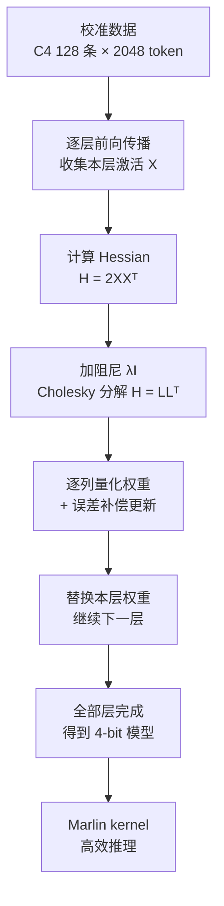
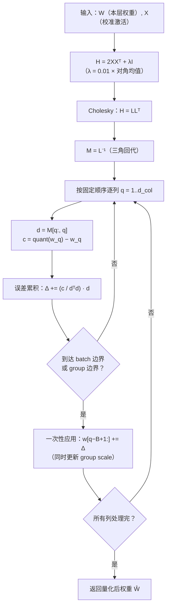

> **系列导航** ｜ [课程路线图](/quantization-roadmap/) ｜ **Part 1 · Weight-only PTQ** ｜ 第 03 篇 / 共 26 篇
>
> [← 02 LLM.int8()](/2026/08/24/llm-quant-01-llmint8-outlier-mixture/) ｜ [04 AWQ →](/2026/08/24/llm-quant-03-awq-scale-search/)

## TL;DR

> **TL;DR 1｜一句话**：GPTQ（Frantar et al., 2022，arXiv:2210.17323）是第一个把 175B 参数模型在 4-bit 精度下压进单张 A100-80GB 的 PTQ 算法——OPT-175B 全模型量化只需约 4 个 GPU 小时，WikiText-2 困惑度从 FP16 的 8.34 仅上升到 4-bit 的 8.46（来源：arXiv:2210.17323 Table 1）。

> **TL;DR 2｜数学内核**：逐层重建 + 二阶近似。对每一层最小化 \(\|WX - \hat{W}X\|_F^2\)，把量化看成权重上的小扰动，用 Hessian \(H = 2XX^\top\) 刻画扰动代价；再用 Lagrange 乘子法求出闭式解：量化某个权重后，其余权重的最优补偿方向是 \(H^{-1}\) 的对应列，而不是简单的"四舍五入 + 听天由命"。

> **TL;DR 3｜工程突破**：相比前身 OBQ（Frantar & Alistarh, 2022，arXiv:2208.11580），GPTQ 的三个改进——任意量化顺序、Lazy-Batch 批更新、Cholesky 分解——把复杂度从 \(O(d_{col}^3)\) 降到 175B 模型可实际运行，且最终精度不降反升，一举奠定 AWQ、SpQR、QuIP# 等后续方法的范式。

## 目录

1. 问题设定：为什么把一层单独拎出来量化
2. OBQ：最优脑量化的完整推导（本文数学核心）
3. GPTQ：三个改进如何把 OBQ 推到 175B
4. 工程细节：group_size、act_order、校准数据与对称量化
5. 数值对比：GPTQ vs RTN vs AWQ（论文数据）
6. 从零实现：numpy 版 layer-wise GPTQ（Cholesky 版）
7. 批判与展望：Hessian 的内存墙、校准依赖与 Marlin 生态
8. 参考清单

---

## 1. 问题设定：为什么把一层单独拎出来量化

### 1.1 从 RTN 的失败说起

在第 E1 篇里我们看过 RTN（Round-To-Nearest）的表现：8-bit 时几乎无损，4-bit 时全线崩溃。以 OPT-175B 为例，RTN 在 4-bit 下 WikiText-2 困惑度急剧恶化到 100 以上，而 FP16 基线只有 8.34（来源：arXiv:2210.17323 Figure 2）。为什么？

因为 RTN 对每个权重**独立**舍入，完全不考虑权重之间的耦合关系。一个权重被舍入 0.001，另一个被舍入 0.002，误差可能同向叠加；更关键的是，**权重对模型输出的影响不是均匀的**——某些权重哪怕只动 0.001，也会让激活产生巨大偏移。第 E1 篇中 LLM.int8() 的 outlier 分析已经暗示了这一点：极少数"敏感"维度主导着量化误差。

那么自然的想法是：既然误差取决于权重在**损失景观**中的位置，我们能不能量化一个权重的同时，**微调其他权重来抵消误差**？这就是"误差补偿（error compensation）"思想，也是本篇文章全部数学的出发点。

### 1.2 形式化：layer-wise 重建

先建立符号。考虑 Transformer 的某一层（比如一个 Linear 层），设：

- \(W \in \mathbb{R}^{d_{row} \times d_{col}}\)：该层权重矩阵；
- \(X \in \mathbb{R}^{d_{col} \times n}\)：校准数据经过前面所有层之后，到达本层的激活矩阵（\(n\) 是 token 总数）；
- 原始输出 \(Y = WX \in \mathbb{R}^{d_{row} \times n}\)；
- \(\hat{W}\)：量化后的权重矩阵。

**逐层重建目标**：找到 \(\hat{W}\)，使得量化前后该层输出变化最小：

$$\min_{\hat{W}} \; \| WX - \hat{W}X \|_F^2$$

其中 \(\|\cdot\|_F\) 是 Frobenius 范数。这个目标有两个重要性质：

**性质 1：行之间完全独立。** 令 \(w_i\) 为 \(W\) 的第 \(i\) 行（\(1 \times d_{col}\) 行向量），\(y_i = w_i X\) 为输出第 \(i\) 行，则：

$$\| WX - \hat{W}X \|_F^2 = \sum_{i=1}^{d_{row}} \| w_i X - \hat{w}_i X \|_2^2$$

每一行的误差只取决于该行的量化方式。因此我们可以**逐行独立**求解，最终并行度极高——这是整个 OBQ/GPTQ 家族能跑起来的结构性前提。

**性质 2：Hessian 是行间共享的。** 每一行的优化问题 \(\min \|w_i X - y_i\|^2\) 中，\(X\) 是同一个矩阵。稍后我们会看到，由 \(X\) 导出的二阶信息（Hessian \(H = 2XX^\top\)）对所有行完全相同，只需计算一次。

**关于"逐层"的假设**：我们把每一层独立处理，意味着忽略量化误差跨层传播的耦合效应。严格地说这是近似——前一层的误差会改变后一层的输入分布，但实践中逐层重建依然有效，因为：(a) 每一层的误差都被压缩到很小；(b) 后一层重建时使用的校准激活 \(X\) 是**用原始模型前向**收集的，本身就包含了前层分布的信息。这个"误差不传播"假设是本文方法论的基石，也是后面第 7 章批判的重点。

### 1.3 为什么必须用二阶信息：泰勒展开的视角

现在看单个输出行的问题。固定行 \(w\)，目标函数：

$$E(w) = \| wX - y \|_2^2, \qquad y = wX \text{（原始输出）}$$

我们要把 \(w\) 的某些分量替换成量化值。设扰动 \(\delta = \hat{w} - w\)（\(1 \times d_{col}\) 行向量），对 \(E\) 在 \(w\) 处做泰勒展开：

$$E(w + \delta) = E(w) + \nabla E(w) \cdot \delta^\top + \frac{1}{2} \delta H \delta^\top + O(\|\delta\|^3)$$

其中 \(H\) 是 Hessian 矩阵（\(d_{col} \times d_{col}\)）。

**关键观察 1（一阶项消失）**：\(w\) 是预训练收敛后的权重，本身就近似位于损失景观的极小点附近，梯度 \(\nabla E(w) \approx 0\)。因此一阶项可以忽略，误差主要由**二次型** \(\frac{1}{2}\delta H\delta^\top\) 主导。

**关键观察 2（二阶项不可对角化忽略）**：如果 \(H\) 是对角矩阵，那么每个权重的误差贡献独立，RTN 就是最优的。但真实 Hessian 非对角——权重之间存在强耦合（比如 attention 层中 \(W_Q\) 和 \(W_K\) 的相互作用）。这就是为什么"独立舍入"（RTN）会失败：它隐含假设 \(H\) 对角。

**关键观察 3（量化扰动足够小）**：4-bit 量化的相对误差约 \(1/2^4 \approx 6\%\)，属于小扰动范畴，泰勒展开的高阶项可忽略。这为二阶近似提供了合法性。

于是，问题从"组合优化"（搜索所有量化格点组合，指数爆炸）变成了"**带约束的二次优化**"（每个权重独立落到最近的格点，但允许其他权重连续补偿）。这就是 OBQ 的数学起点，也直接呼应了第 E1 篇末尾埋下的伏笔：敏感度分析要从"一阶梯度"升级为"精确的二阶 Hessian"。

### 1.4 OPT-175B 的动机：一张内存账本

2022 年底的痛点非常具体：OPT-175B 的 FP16 权重需要约 350GB 显存，远超单卡 A100-80GB 的容量。研究者想要的不是"能不能量化"，而是"能不能在单卡上完成量化并推理"。先算一笔内存账：

| 精度 | 权重内存（175B 参数） | 单卡 A100-80GB 可行性 | 备注 |
|---|---|---|---|
| FP16 | ~350 GB | ✗ | 需 5 张卡以上张量并行 |
| INT8 | ~175 GB | ✗ | 仍需 3 卡，且 RTN 8-bit 精度损失明显 |
| INT4（GPTQ） | ~87.5 GB | ✓ | 配合 KV cache 管理与 batch=1 推理 |
| INT3（GPTQ） | ~65.6 GB | ✓ | 论文报告 3-bit 也基本可用 |

> 表 1：OPT-175B 在不同精度下的权重内存需求。权重参数量 175B × 每参数字节数（FP16 2B / INT8 1B / INT4 0.5B / INT3 0.375B）。来源：arXiv:2210.17323 的动机讨论。

**为什么量化能"白赚"内存**：权重只读、推理时无需梯度，因此权重精度可以压到极低；而激活必须保持较高精度（这是 SmoothQuant 系列的主题，第 10 篇展开）。GPTQ 瞄准的正是"权重 4-bit、激活 FP16"这一不对称设定。

整体流程可以这样概括：



> 图 1：GPTQ 整体流程。注意"逐层"循环是串行的，但每层内部的 Hessian 计算、逐行量化都是可并行的。

从第 2 章开始，我们进入最硬核的部分：OBQ 的完整数学推导。这一章的所有公式都会在后续 GPTQ、SpQR、QuIP# 中反复出现，值得逐行读懂。

---

## 2. OBQ：最优脑量化的完整推导

OBQ（Optimal Brain Quantization）来自 Frantar & Alistarh 2022 年的论文《Optimal Brain Compression: A Framework for Accurate Post-Training Quantization and Pruning》（arXiv:2208.11580）。它的思想源头是 1993 年 Hassibi 等人提出的 OBS（Optimal Brain Surgeon，最优脑外科医生）剪枝算法——"删除一个权重，然后最优地调整其余权重"。OBQ 把"删除"换成"量化"，其余数学几乎原封不动。

### 2.1 第一步：从 MSE 推出 Hessian

回到单个输出行的问题。固定行向量 \(w \in \mathbb{R}^{1 \times d_{col}}\)，输入 \(X \in \mathbb{R}^{d_{col} \times n}\)，目标输出 \(y = wX \in \mathbb{R}^{1 \times n}\)。定义误差函数：

$$E(w) = \| wX - y \|_2^2 = (wX - y)(wX - y)^\top$$

把它展开（注意 \(wX\) 是 \(1 \times n\) 行向量，\(E\) 是标量）：

$$E(w) = wXX^\top w^\top - wXy^\top - yX^\top w^\top + yy^\top$$

对 \(w\) 求一阶导（行向量对自身的导数）：

$$\frac{\partial E}{\partial w} = 2wXX^\top - 2yX^\top$$

再对 \(w\) 求二阶导。注意 \(\frac{\partial (wXX^\top)}{\partial w} = XX^\top\)（\(w\) 前的系数矩阵），而 \(\frac{\partial (yX^\top)}{\partial w} = 0\)（不含 \(w\)），因此：

$$\frac{\partial^2 E}{\partial w^2} = 2XX^\top$$

**这就是 Hessian 的来源**：

$$H = 2XX^\top \in \mathbb{R}^{d_{col} \times d_{col}}$$

> 推导要点：Hessian 完全由校准激活 \(X\) 决定，与权重 \(w\) 无关——这正是"行间共享 Hessian"的严格证明。物理含义：\(H_{jk} = 2\sum_t X_{jt}X_{kt}\) 度量了第 \(j\)、\(k\) 个输入维度的二阶矩耦合，激活能量越大的方向越敏感。

于是对任意小扰动 \(\delta\)（\(1 \times d_{col}\)），误差增量近似为：

$$\Delta E \approx \frac{1}{2} \delta H \delta^\top$$

**单权重量化**：假设只量化第 \(q\) 个权重，即 \(\delta = c \cdot e_q\)，其中 \(c = \hat{w}_q - w_q\) 是量化误差（\(e_q\) 是第 \(q\) 个单位向量）。代入二次型：

$$\Delta E \approx \frac{1}{2} c^2 H_{qq}$$

这就是"权重敏感度 = Hessian 对角元"的严格推导：\(H_{qq} = 2\sum_t X_{qt}^2\) 正是第 \(q\) 个输入维度的能量（激活二阶矩的 2 倍）。第 E1 篇里我们凭直觉说"激活幅度大的维度敏感"，这里给出了精确公式。

### 2.2 第二步：Lagrange 乘子法求闭式解

但 OBQ 不止于此。关键一步是：**量化 \(w_q\) 之后，允许调整所有其他（尚未量化的）权重来补偿误差**。

形式化：我们要找最优扰动 \(\delta\)，使得：

- 第 \(q\) 个分量精确落在量化格点上：\(\delta_q = c\)（\(c = \hat{w}_q - w_q\) 是已知常数）；
- 其余分量自由调整，以最小化二次代价 \(\frac{1}{2}\delta H \delta^\top\)。

写成带约束的优化问题：

$$\min_{\delta} \; \frac{1}{2} \delta H \delta^\top \quad \text{s.t.} \quad e_q^\top \delta = c$$

用 Lagrange 乘子法。引入乘子 \(\lambda\)，构造 Lagrange 函数：

$$\mathcal{L}(\delta, \lambda) = \frac{1}{2} \delta H \delta^\top + \lambda \left( e_q^\top \delta - c \right)$$

**步骤 1：对 \(\delta\) 求导并令其为零。**（注意 \(\delta\) 是行向量，\(H\) 对称，\(\frac{\partial}{\partial \delta}(\frac{1}{2}\delta H\delta^\top) = \delta H\)）

$$\frac{\partial \mathcal{L}}{\partial \delta} = \delta H + \lambda e_q^\top = 0 \;\Longrightarrow\; \delta = -\lambda e_q^\top H^{-1}$$

**步骤 2：代入约束条件解出 \(\lambda\)。**

$$e_q^\top \delta = -\lambda e_q^\top H^{-1} e_q = -\lambda [H^{-1}]_{qq} = c \;\Longrightarrow\; \lambda = -\frac{c}{[H^{-1}]_{qq}}$$

其中 \([H^{-1}]_{qq}\) 表示 \(H^{-1}\) 的第 \(q\) 个对角元。

**步骤 3：回代得到闭式解。**

$$\delta^\top = -\lambda H^{-1} e_q = \frac{c}{[H^{-1}]_{qq}} H^{-1}_{:,q}$$

即最优补偿更新为（写成论文中的标准形式）：

$$\boxed{\; w \leftarrow w + \frac{\hat{w}_q - w_q}{[H^{-1}]_{qq}} \cdot H^{-1}_{:,q} \;}$$

> 公式解读：量化 \(w_q\) 造成的误差 \(c\)，按 \(H^{-1}\) 的第 \(q\) 列（归一化）**分摊**到所有其他权重上。\(H^{-1}\) 非对角，意味着补偿是"全局"的——一个权重的量化误差会波及整行。这正是 OBQ 与 RTN 的本质区别：**RTN 是"破坏"，OBQ 是"破坏 + 修复"**。

**最优误差**：把 \(\delta^\top = c H^{-1}_{:,q}/[H^{-1}]_{qq}\) 代回二次型，利用 \(H^{-1}_{:,q}^\top H H^{-1}_{:,q} = [H^{-1}]_{qq}\)（因为 \(H H^{-1} = I\)），得到量化第 \(q\) 个权重后的最小误差增量：

$$\Delta E_q^\ast = \frac{c^2}{2[H^{-1}]_{qq}}$$

**补偿收益有多大？** 不补偿时误差是 \(\frac{1}{2}c^2 H_{qq}\)，补偿后是 \(\frac{c^2}{2[H^{-1}]_{qq}}\)。由 Cauchy-Schwarz 不等式可以证明 \([H^{-1}]_{qq} \ge 1/H_{qq}\)（对正定 \(H\)，设其特征分解 \(H = \sum_k \lambda_k v_k v_k^\top\)，则 \([H^{-1}]_{qq} = \sum_k v_{kq}^2/\lambda_k\)，\(H_{qq} = \sum_k v_{kq}^2 \lambda_k\)，两者乘积 \(\ge (\sum_k v_{kq}^2)^2 = 1\)）。因此：

$$\frac{c^2}{2[H^{-1}]_{qq}} \le \frac{1}{2} c^2 H_{qq}$$

补偿**永远**不亏。当 \(H\) 高度病态（特征值差异大）时，\([H^{-1}]_{qq}\) 可以比 \(1/H_{qq}\) 小几个数量级，补偿收益巨大——这正是预训练模型 Hessian 的典型形态，也是 OBQ 类方法在低比特下碾压 RTN 的根本原因。

### 2.3 第三步：量化后，Hessian 逆如何更新（Sherman-Morrison）

量化并补偿完 \(w_q\) 后，该权重被**冻结**：后续量化其他权重时，\(w_q\) 不再参与补偿。数学上如何表达"冻结一个维度"？

技巧：在损失函数中加入第 \(q\) 维的无穷大惩罚项，把 \(H\) 替换为：

$$H^{(q)} = H + \lim_{\sigma \to 0} \frac{1}{\sigma^2} e_q e_q^\top$$

当 \(\sigma \to 0\) 时，任何 \(\delta_q \neq 0\) 的扰动都会带来无穷大代价，于是最优解自动满足 \(\delta_q = 0\)——等价于冻结该维度。关键问题是：\(H^{(q)}\) 的逆是什么？这要用 **Sherman-Morrison 公式**：

> **Sherman-Morrison**：设 \(A\) 可逆，\(u, v\) 为列向量，则
> $$(A + uv^\top)^{-1} = A^{-1} - \frac{A^{-1} u v^\top A^{-1}}{1 + v^\top A^{-1} u}$$

令 \(A = H\)，\(u = v = e_q/\sigma\)（这样 \(uv^\top = e_q e_q^\top / \sigma^2\)），代入：

$$(H + \tfrac{1}{\sigma^2} e_q e_q^\top)^{-1} = H^{-1} - \frac{H^{-1} e_q e_q^\top H^{-1}}{\sigma^2 + e_q^\top H^{-1} e_q}$$

注意分子 \(H^{-1} e_q e_q^\top H^{-1} = H^{-1}_{:,q} H^{-1}_{q,:}\) 是一个**秩 1 外积**（列向量 \(\times\) 行向量），分母中 \(e_q^\top H^{-1} e_q = [H^{-1}]_{qq}\)。令 \(\sigma \to 0\)，分母只剩 \([H^{-1}]_{qq}\)，得到：

$$\boxed{\; H^{-1} \leftarrow H^{-1} - \frac{H^{-1}_{:,q} \cdot H^{-1}_{q,:}}{[H^{-1}]_{qq}} \;}$$

这就是每次量化后 Hessian 逆的更新规则：**减去一个由第 \(q\) 列构造的秩 1 矩阵**，把第 \(q\) 维从后续优化中"剔除"。更新后 \(H^{-1}\) 的第 \(q\) 行、第 \(q\) 列都变为 0（可以验证），对应"该维度已冻结，不再产生任何影响"。

> 验证直觉：\(H^{-1}_{:,q}\) 是列向量，\(H^{-1}_{q,:}\) 是行向量，两者外积是 \(d_{col} \times d_{col}\) 矩阵。对角线上的第 \(q\) 个元素恰好是 \([H^{-1}]_{qq}^2 / [H^{-1}]_{qq} = [H^{-1}]_{qq}\)，所以更新后 \([H^{-1}]_{qq} \to 0\)，符合"冻结"语义。

### 2.4 OBQ 完整算法与复杂度瓶颈

把 2.1–2.3 拼起来，得到 OBQ 算法：

> **算法 1：OBQ（对单个输出行）**
> 输入：行权重 \(w \in \mathbb{R}^{d_{col}}\)，Hessian \(H = 2XX^\top\)（可加小阻尼 \(\lambda I\) 保证正定）
>
> 1. 初始化 \(H^{-1} = (2XX^\top + \lambda I)^{-1}\)
> 2. 对 \(q = 1, 2, \dots, d_{col}\)：
>    - **选点**：对每个未量化权重 \(j\)，计算误差增量 \(\epsilon_j = \frac{(\hat{w}_j - w_j)^2}{2[H^{-1}]_{jj}}\)，选择 \(\epsilon_j\) 最小的 \(j\)（贪心：先量化"破坏最小"的权重）
>    - **量化**：\(c = \hat{w}_j - w_j\)
>    - **补偿**：\(w \leftarrow w + \frac{c}{[H^{-1}]_{jj}} H^{-1}_{:,j}\)
>    - **冻结**：\(H^{-1} \leftarrow H^{-1} - \frac{H^{-1}_{:,j} H^{-1}_{j,:}}{[H^{-1}]_{jj}}\)
> 3. 输出量化后的行权重

**复杂度分析**（这是 OBQ 的致命伤）：

- 步骤"冻结"是 \(O(d_{col}^2)\) 的秩 1 外积更新；
- 共循环 \(d_{col}\) 次 → 总复杂度 \(O(d_{col}^3)\)；
- 贪心选点每步需扫描全部未量化权重并计算 \(\epsilon_j\)（\(O(d_{col})\)），累计 \(O(d_{col}^2)\)，相对可忽略；
- 内存 \(O(d_{col}^2)\)（存 \(H^{-1}\)）。

对 GPT-2 的中等层（\(d_{col} = 1024\)），\(10^9\) 次浮点运算可以接受；但对 OPT-175B 的宽层（\(d_{col} = 12288\)），\(O(d_{col}^3) \approx 1.9 \times 10^{12}\) 次运算 × 数百层 × 每层数千行——**完全不可行**。此外贪心顺序意味着严格的串行依赖，无法向量化。

OBQ 论文自己也承认：它在 6.7B 模型上就已经非常吃力。把 OBQ 从"能跑小模型"推向"能跑 175B"，正是 GPTQ 的三个改进要做的事。

### 2.5 数值小例：3 维权重的完整手算

公式容易"看懂"但不容易"信服"。我们用一组具体数字把 2.2-2.3 节的每一步走一遍，读者可以拿纸笔验算。设某行权重为 \(w = [1.2,\; -0.7,\; 0.3]\)，校准数据给出的 Hessian 为（含阻尼后的正定矩阵）：

$$H = \begin{pmatrix} 2 & 0.5 & 0 \\ 0.5 & 1 & 0.2 \\ 0 & 0.2 & 0.8 \end{pmatrix}$$

先求逆（伴随矩阵法或消元法，此处直接给结果）：

$$H^{-1} = \frac{1}{1.32} \begin{pmatrix} 0.76 & -0.4 & 0.1 \\ -0.4 & 1.6 & -0.4 \\ 0.1 & -0.4 & 1.75 \end{pmatrix} \approx \begin{pmatrix} 0.5758 & -0.3030 & 0.0758 \\ -0.3030 & 1.2121 & -0.3030 \\ 0.0758 & -0.3030 & 1.3258 \end{pmatrix}$$

**第 1 步：量化 \(w_1 = 1.2\)。** 假设 2-bit 对称网格 \(\{-1, 0, 1\}\)，则 \(\hat{w}_1 = 1\)，量化误差 \(c_1 = 1 - 1.2 = -0.2\)。

- **不补偿**（RTN 行为）：\(\Delta E \approx \frac{1}{2} c_1^2 H_{11} = \frac{1}{2} \times 0.04 \times 2 = 0.040\)；
- **最优补偿**：\(\delta = \frac{c_1}{[H^{-1}]_{11}} H^{-1}_{:,1} = \frac{-0.2}{0.5758} [0.5758,\; -0.3030,\; 0.0758]^\top = [-0.2,\; 0.1053,\; -0.0263]^\top\)；

更新后 \(w = [1.0,\; -0.5947,\; 0.2737]\)——注意 \(w_1\) 精确落在网格点 1.0 上，其余两个权重被"推"了一下。补偿后的误差 \(\Delta E = \frac{c_1^2}{2[H^{-1}]_{11}} = \frac{0.04}{2 \times 0.5758} = 0.0347\)，比不补偿省了 13%。验证 Cauchy-Schwarz 结论：\(H_{11}[H^{-1}]_{11} = 2 \times 0.5758 = 1.15 > 1\)，所以补偿必然更优。

**第 2 步：冻结 \(w_1\)，更新 \(H^{-1}\)（Sherman-Morrison）。** 外积 \(H^{-1}_{:,1} H^{-1}_{1,:} / [H^{-1}]_{11}\) 恰好把第 1 行、第 1 列清零：

$$H^{-1} \leftarrow H^{-1} - \frac{H^{-1}_{:,1} H^{-1}_{1,:}}{[H^{-1}]_{11}} = \begin{pmatrix} 0 & 0 & 0 \\ 0 & 1.0527 & -0.2631 \\ 0 & -0.2631 & 1.3159 \end{pmatrix}$$

第 1 维从此"消失"——后续量化只在剩余 2 维子空间内进行，这正是"冻结"的代数含义。

**第 3 步：量化 \(w_2 = -0.5947\)。** 最近网格点为 -1，\(c_2 = -0.4053\)。注意：\(c_2\) 用的是**被第 1 步补偿过**的当前值，而不是原始值 -0.7——这是 OBQ 与"先独立量化再补偿"的批处理方法的本质区别。

$$\delta = \frac{-0.4053}{1.0527} \cdot [0,\; 1.0527,\; -0.2631]^\top = [0,\; -0.4053,\; 0.1013]^\top$$

更新后 \(w = [1.0,\; -1.0,\; 0.375]\)，\(w_2\) 又精确落在网格上。如此继续，直到所有权重量化完毕。

> **这个例子暴露的三个直觉**：(1) 补偿方向是 \(H^{-1}\) 的列而非 \(e_q\)——\(w_3\) 明明没被量化，却被移动了 0.1013；(2) 每一步后 \(H^{-1}\) 的"已量化维度"被清零，剩余子问题与原问题同构；(3) 若 \(H\) 是对角阵，\(H^{-1}_{:,q} = e_q/[H^{-1}]_{qq}\)，补偿退化为"只动自己"，OBQ 就退化成 RTN——再次印证"非对角耦合"是二阶方法的价值所在。

## 3. GPTQ：三个改进如何把 OBQ 推到 175B

GPTQ 论文（arXiv:2210.17323）的标题副题就叫《Accurate Post-Training Quantization for Generative Pre-trained Transformers》。它的核心贡献不是发明了新数学，而是**看穿了 OBQ 的三个计算瓶颈，并逐一拆除**。论文第 3 节用了一句话点破全局：

> "关键观察是，上述问题（OBQ 的复杂度）可以通过三个简单但重要的修改来克服：任意量化顺序、Lazy-Batch 更新、以及基于 Cholesky 分解的算法重写。"（来源：arXiv:2210.17323 Section 3）

### 3.1 改进一：任意量化顺序（放弃贪心）

OBQ 每步都用贪心策略选择"误差增量最小"的权重先量化。GPTQ 做了个实验：**改成固定顺序（比如从左到右），精度几乎不变**，甚至在部分模型上更好。

为什么？两个原因：

1. **贪心的收益递减**：贪心每一步只省下 \(\min_j \epsilon_j\) 的误差，但当 \(d_{col}\) 很大（数千）时，\(\epsilon_j\) 的分布非常集中，先量化谁都差不多；而贪心付出的代价是**每一步都要重新扫描所有未量化权重**（因为 \(H^{-1}\) 在更新，\(\epsilon_j\) 在变化），这引入了无法向量化的串行依赖。
2. **固定顺序可以一次性预计算**：如果顺序固定为 \(1, 2, \dots, d_{col}\)，那么所有需要用到的 \(H^{-1}_{:,q}\) 和 \([H^{-1}]_{qq}\) 在算法开始前就能全部算好，整个循环变成"读预计算值 + 向量化更新"，GPU 友好度完全不同。

论文消融实验（arXiv:2210.17323 Table 5）显示：在 OPT-175B 上，贪心顺序与固定顺序的 3-bit 困惑度差异在 0.1 以内——用这点精度损失换一个数量级的加速，非常划算。**注意**：这里"任意顺序"有一个前提——它必须是一个**预先固定的**顺序（论文默认按列序，也支持 act_order 重排，见第 4 章），而不是每步动态决定。

### 3.2 改进二：Lazy-Batch 更新（批量化补偿）

固定顺序后，OBQ 的循环变成：

- 对 \(q = 1 \dots d_{col}\)：计算 \(c_q = \hat{w}_q - w_q\)，然后 \(w \leftarrow w + \frac{c_q}{[H^{-1}]_{qq}} H^{-1}_{:,q}\)

每次更新是一个 \(O(d_{col})\) 的向量操作（注意：\(H^{-1}\) 已经不需要逐步更新了，因为 Cholesky 版会在 3.3 一次性算出所有需要的列）。但逐列更新仍然是 \(d_{col}\) 次串行内存访问，且**每次更新的幅度通常很小**——大部分 \(c_q\) 是 \(O(10^{-3})\) 量级。

Lazy-Batch 的核心洞察：**把 \(B\) 步的补偿累积起来，一次性应用**。设当前处理到第 \(q\) 列，误差累积量为：

$$\Delta^{(q)} = \sum_{j \in \text{批内}} \frac{c_j}{[H^{-1}]_{jj}} H^{-1}_{:,j}$$

每处理 \(B = 128\) 列，才把 \(\Delta^{(q)}\) 加到 \(w\) 上。由于所有更新都是**线性叠加**（都是 \(H^{-1}\) 固定列的线性组合），累积后一次性应用与逐步应用在数学上**严格等价**——Lazy-Batch 不是近似，而是重排了浮点运算顺序。

收益：内存访问从 \(d_{col}\) 次"读一列、写一行"变成 \(d_{col}/B\) 次"读 \(B\) 列、写一行"，配合 GPU 的共享内存可以把带宽瓶颈降低约一个数量级。论文报告 Lazy-Batch（\(B=128\)）相对逐列更新带来约 3 倍加速（来源：arXiv:2210.17323 Section 3.2）。更妙的是，Lazy-Batch 与 group-wise 量化天然契合：**scale 的更新恰好发生在 batch 边界**（group_size 通常等于 batch size 的约数），这一点第 4 章还会提到。

### 3.3 改进三：Cholesky 分解（本文的推导重点）

Lazy-Batch 解决了"写内存"的瓶颈，但还有一个隐藏问题：OBQ 需要 \(H^{-1}\) 的**每一列**，而逐列求逆（或逐步 SM 更新）是 \(O(d_{col}^3)\)。GPTQ 的杀手锏是：**用 Cholesky 分解一次性预计算所有需要的量**。

设 \(H\) 正定，Cholesky 分解 \(H = LL^\top\)，其中 \(L\) 是下三角矩阵。记 \(M = L^{-1}\)（下三角矩阵的逆仍为下三角），则：

$$H^{-1} = (LL^\top)^{-1} = L^{-\top} L^{-1} = M^\top M$$

**为什么 \(H^{-1}\) 的第 \(q\) 列只需要 \(M\) 的第 \(q\) 列？** 因为 \(M\) 是下三角，\(M_{kq} = 0\) 对所有 \(k < q\) 成立。因此：

- 对角元：\([H^{-1}]_{qq} = \sum_{k \ge q} M_{kq}^2 = \| M_{q:,q} \|_2^2\)（只需第 \(q\) 列的下三角部分）
- 更新方向：\(H^{-1}_{:,q} = M^\top M_{:,q}\)，其**第 \(q\) 个及以后的分量**只需 \(M\) 的第 \(q\) 列

于是 GPTQ 的逐列更新可以完全用 \(d = M_{q:,q}\)（\(L^{-1}\) 第 \(q\) 列从 \(q\) 开始的下三角段）来表达。**但这里有一个微妙的数学点**：GPTQ 只更新 \(w\) 的 \(q\) 及以后分量（\(w_{q:}\)），即"截断"的补偿——因为 \(q\) 之前的权重已经冻结。我们需要验证：在"只允许调整未量化权重"的约束下，用 \(d\) 构造的更新是否还是最优的？

**受限子空间的精确解**：设 \(H_q = H_{q:,q:}\) 是 \(H\) 去掉前 \(q-1\) 行/列的右下子块（对应未量化权重），\(L_q\) 是其 Cholesky 因子（\(L_q\) 恰是 \(L\) 的右下子块，因为 Cholesky 的块结构）。在子空间内求解：

$$\min_{\delta_{q:}} \frac{1}{2} \delta_{q:}^\top H_q \delta_{q:} \quad \text{s.t.} \quad \delta_q = c$$

沿用第 2.2 节的 Lagrange 推导，解为 \(\delta_{q:} = \frac{c}{[H_q^{-1}]_{11}} H_q^{-1} e_1\)。而由 \(H_q = L_q L_q^\top\)：

- \(H_q^{-1} e_1 = L_q^{-\top} L_q^{-1} e_1\)。记 \(d = L_q^{-1} e_1\)，它是 \(L_q^{-1}\) 的第一列；
- 由三角方程的唯一性可以验证 \(L_q^{-1} e_1 = M_{q:,q}\)（两者满足同一个三角方程组 \(L_q x = e_1\)，而 \(M_{q:,q}\) 正是 \(L^{-1}\) 第 \(q\) 列的下三角段，\(L x = e_q\) 在 \(q\) 之后的行与 \(L_q x_{q:} = e_1\) 完全同构）；
- \([H_q^{-1}]_{11} = \|L_q^{-1} e_1\|_2^2 = d^\top d = \|M_{q:,q}\|_2^2 = [H^{-1}]_{qq}\)（最后一个等号因为 \(M\) 下三角，\([H^{-1}]_{qq} = \|M_{:,q}\|^2 = \|M_{q:,q}\|^2\)）。

因此受限最优解为：

$$\boxed{\; \delta_{q:} = \frac{c}{d^\top d} \cdot d, \qquad d = M_{q:,q} = (L^{-1})_{q:,q} \;}$$

误差增量为 \(\Delta E_q = \frac{c^2}{2 d^\top d} = \frac{c^2}{2[H^{-1}]_{qq}}\)——与第 2.2 节**无约束** OBQ 的误差公式完全一致！这说明：**固定顺序下，用 Cholesky 预计算的列做截断更新，与逐步 SM 更新的 OBQ 在误差上严格等价**（对同一顺序而言）。这就是 GPTQ 敢把 \(H^{-1}\) 的逐步更新整个扔掉的理论依据。

> **推导小结**：\(H = LL^\top\) 一次分解 → \(M = L^{-1}\) 一次三角回代 → 之后每一列的 \(d\)、\(d^\top d\) 都是 \(O(1)\) 读取。求逆的总代价从"每步 \(O(d_{col}^2)\)、共 \(d_{col}\) 步"降为"一次性 \(O(d_{col}^3)\) 分解 + \(O(d_{col}^2)\) 回代"，且 Cholesky 有高度优化的 GPU 实现（cuSOLVER、PyTorch `torch.linalg.cholesky`）。

### 3.4 dampening：给 Hessian 加一点"保险"

还有最后一个数值稳定性的坑。校准数据量有限（128 条 × 2048 token），\(H = 2XX^\top\) 可能**秩亏缺或高度病态**——特征值跨越十几个数量级，Cholesky 分解直接数值崩溃。GPTQ 的做法是加阻尼：

$$\tilde{H} = H + \lambda I, \qquad \lambda = \frac{1}{1000} \cdot \frac{1}{d_{col}} \operatorname{Tr}(H)$$

即 \(\lambda\) 取 Hessian 对角均值的千分之一（论文原文是 dampening factor 0.01 作用于对角均值，来源：arXiv:2210.17323 Section 3.3 / Algorithm 1）。加 \(\lambda I\) 有三个作用：

1. **保证正定性**：\(H\) 半正定时，\(\tilde{H}\) 严格正定，Cholesky 存在且唯一；
2. **数值稳定**：把最小特征值抬到 \(\lambda\)，条件数从"无穷"降到 \((\lambda_{max} + \lambda)/\lambda\) 量级；
3. **正则化**：\(\lambda I\) 等价于给权重扰动加 \(\frac{\lambda}{2}\|\delta\|^2\) 的惩罚，抑制补偿更新过大——这与第 3.3 节"截断更新"的微小不一致性互相抵消，论文实验表明合适的 \(\lambda\) 甚至能**改善**精度。

论文用网格搜索确认：dampening factor 在 \(10^{-2}\) 附近最优，过大（\(10^{-1}\)）会压制真实 Hessian 信息，过小（\(10^{-4}\)）则数值不稳定（来源：arXiv:2210.17323 Appendix C）。

### 3.5 GPTQ 算法总览

综合三个改进，GPTQ 的逐层算法如下：



> 图 2：GPTQ 逐层算法流程。虚线框内是 Lazy-Batch 的核心：误差累积 \(B=128\) 列才应用一次。

**算法 2：GPTQ（单层，伪代码）**

```
输入：权重 W ∈ R^{d_row × d_col}，激活 X ∈ R^{d_col × n}，batch B，dampening 系数 λ
1:  H ← 2XXᵀ + λ·mean(diag(2XXᵀ))·I          # 加阻尼
2:  L ← Cholesky(H)；M ← L⁻¹                  # 一次性预计算
3:  for i = 1..d_row（可并行）:
4:      w ← W[i]
5:      for q = 1..d_col:
6:          d ← M[q:, q]
7:          c ← quant(w_q) − w_q               # group 边界处刷新 scale
8:          Δ ← Δ + (c / dᵀd) · d              # Lazy 累积
9:          if q % B == 0: w[q−B+1:] ← w[q−B+1:] + Δ；Δ ← 0
10: return W
```

**复杂度对比**（\(d_{col} = 4096\) 的典型 Transformer 层，来源：arXiv:2210.17323 Table 3 的加速比）：

| 算法 | 逐列更新代价 | 求逆代价 | 总复杂度 | 贪心？ | 175B 可行？ |
|---|---|---|---|---|---|
| OBQ | \(O(d_{col}^2)\)/步 | SM 逐步更新 | \(O(d_{col}^3)\) 串行 | 是 | ✗ |
| GPTQ（naïve 固定序） | \(O(d_{col})\)/步 | Cholesky 一次 | \(O(d_{col}^3)\) 但可向量化 | 否 | △ |
| GPTQ（+Lazy-Batch） | \(O(d_{col})\)/批 | Cholesky 一次 | \(O(d_{col}^3/B)\) 内存友好 | 否 | ✓ |

> 表 2：OBQ 与 GPTQ 各版本的复杂度对比。GPTQ 论文报告：在相同硬件上，GPTQ 比 OBQ 快约一个数量级，OPT-175B 全模型量化仅需约 4 个 GPU 小时（来源：arXiv:2210.17323 Section 4.1）。

---

## 4. 工程细节：从论文到可落地的 4-bit 模型

第 3 章的算法是"骨架"，这一章是让它真正 work 的"血肉"。GPTQ 的官方实现（GitHub: IST-DASLab/gptq）里有大量论文正文没细讲的工程决策，我们逐一看。

### 4.1 group_size = 128：量化粒度与精度的甜蜜点

第 3 章的算法假设每个权重独立量化（每权重一个 scale），但那样 scale 的存储开销巨大：每权重 1 个 FP16 scale，等于额外 50% 内存，4-bit 直接变 6-bit。解决方案是 **group-wise 量化**：把每一行的 \(d_{col}\) 个权重分成 \(\lceil d_{col}/g \rceil\) 组（\(g\) 为 group_size），**组内共享一个 scale 和 zero-point**。

以 \(g = 128\)、4-bit 为例：每个权重 0.5 字节 + scale 摊销 \(\frac{16 \text{ bit}}{128} = 0.125\) 位/权重，额外开销仅 3%。论文对 group_size 做了消融（arXiv:2210.17323 Table 7）：OPT-175B 3-bit 下，\(g = 128\) 的困惑度比 \(g = \infty\)（整行共享）低约 0.4，而 \(g = 32\) 相比 \(g = 128\) 收益不足 0.05——**128 是精度/存储的甜蜜点**，也因此成为后续 AWQ、SpQR 等方法的默认值。

**group 与 GPTQ 更新的交互**：scale 必须在量化该 group 的**第一个权重之前**用"当前值"算好。由于 Lazy-Batch 的 batch 大小 \(B = 128\) 恰好整除 group_size，scale 计算与 batch 边界对齐：量化第 \(q\) 列时，若 \(q\) 是 group 起点，用当前 \(w\) 的 group 段计算 \(\text{scale} = \max|w_{seg}|/(2^{b-1}-1)\)，然后该组内所有列的量化都引用这个 scale。

### 4.2 act_order：按激活敏感度重排量化顺序

第 3.1 节说"任意固定顺序都行"，但有一个例外：**极低比特（2-3 bit）时，顺序变得重要**。GPTQ 提供 `act_order` 选项：先按 \(H\) 的对角元（激活二阶矩 \(H_{qq} = 2\sum_t X_{qt}^2\)）从大到小排序列，**先量化最敏感的列**。

直觉：敏感列（\(H_{qq}\) 大）在"还没有被大量补偿污染"的时候量化，误差最小；如果把它们留到最后，前面大量补偿更新已经改变了它们的值，量化误差会被放大。论文实验（arXiv:2210.17323 Table 8）显示：OPT-175B 2-bit 下，act_order 能把困惑度从 22+ 拉回 15 以内；但 4-bit 下收益可忽略，且 act_order 会打乱 kernel 的连续访存，推理时需额外的 permutation 开销——所以**默认关闭，仅低比特启用**。

### 4.3 校准数据：128 条 × 2048 token

GPTQ 用 C4 数据集（Colossal Clean Crawled Corpus）的 **128 条随机文本，每条截断为 2048 token** 作为校准集（来源：arXiv:2210.17323 Section 4.1）。为什么是 128 × 2048？两个实验依据：

1. **token 数要够**：\(n = 128 \times 2048 = 262144\) 个 token，保证 \(H = 2XX^\top\) 满秩且统计稳定（\(n \gg d_{col}\)）；
2. **样本数要省**：论文消融（arXiv:2210.17323 Appendix D）显示，从 64 条增到 128 条困惑度改善约 0.1，再往上收益递减，而校准集越大前向收集激活的时间越长。

校准集的质量直接影响 Hessian 的保真度：**用 C4 校准的模型在代码任务上量化误差会偏大**（激活分布偏移），这是所有 PTQ 方法的通病，第 7 章批判部分展开。另外注意：校准只需**前向**传播，不需要反向传播——这是 GPTQ 相对蒸馏/量化感知训练的巨大优势，也是它能在 4 GPU 小时内完成 175B 量化的原因之一。

### 4.4 sym 对称量化与 per-channel/group 细节

GPTQ 默认使用**对称量化**：\(q = \operatorname{clip}(\operatorname{round}(w/\text{scale}), -2^{b-1}, 2^{b-1}-1)\)，scale 由 \(\max|w|\) 决定，zero-point 恒为 0。对称量化的好处是 kernel 实现简单（只需一次乘加，无需反量化加法），且对权重这种"以 0 为中心"的分布几乎无损。

非对称量化（\(q = \operatorname{clip}(\operatorname{round}((w-z)/\text{scale}))\)）在激活上收益明显（激活非对称），但**权重上用对称量化损失可忽略**——因为预训练权重的分布近似零均值高斯。GPTQ 实现里 `sym=True` 是默认；`sym=False` 时每组多存一个 zero-point（额外 16 bit/组），论文报告困惑度差异 < 0.05（来源：arXiv:2210.17323 Table 6）。

### 4.5 数值精度：FP64 Hessian，FP16 权重

一个容易踩的坑：\(H = 2XX^\top\) 是 \(d_{col} \times d_{col}\) 矩阵，用 FP16 累积外积会损失精度（\(XX^\top\) 是 \(n\) 项之和，\(n = 262144\)，FP16 只有 11 位尾数）。官方实现的做法：

- **Hessian 计算与 Cholesky 分解用 FP32/FP64**（`torch.float64`），保证 \(M = L^{-1}\) 的精度；
- **权重与补偿更新用 FP16**（或直接保留原始 dtype），因为 \(c\) 和 \(d\) 的量级下 FP16 尾数足够；
- 内存峰值是 \(H\) 本身：\(d_{col}^2 \times 8\) 字节，\(d_{col} = 12288\)（OPT-175B 宽层）时约 1.2 GB，单卡可承受。

### 4.6 权重打包：从"量化完"到"能推理"

量化完成只是第一步——4-bit 权重在内存里怎么摆，直接决定推理 kernel 能不能吃满带宽。GPTQ 的序列化格式（AutoGPTQ/GPTQModel 沿用至今）包含三部分：

1. **`qweight`（量化权重本体）**：4-bit 值**按 8 个一组打包进 int32**（8 × 4 = 32 bit），内存占用恰好是 FP16 的 1/4。打包顺序有讲究：同一组内的 8 个权重来自**同一行、连续 8 列**（对应 group 内的一段），这样 kernel 解包时能向量化；
2. **`qzeros`（量化零点）**：同样 4-bit 打包进 int32，per-group 一个；
3. **`scales`（缩放因子）**：FP16，per-group 一个，形状为 `(d_row, d_col / group_size)`。

以 \(d_{row} = 4096, d_{col} = 4096, g = 128\) 的层为例：`qweight` 占 \(4096 \times 4096 \times 0.5\) B = 8 MB，`scales` 占 \(4096 \times 32 \times 2\) B = 256 KB（3% 开销），`qzeros` 同 scales。**scale 的摊销开销随 group_size 增大而减小**——这就是为什么 \(g = 128\) 是"精度与开销"的甜点（4.1 节已述）。

反量化路径是 \(w_{deq} = (q_{int4} - z) \times s\)：kernel 先按组加载 `scales`/`qzeros` 到共享内存，再对 `qweight` 做 `__byte_perm` 类指令解包。Marlin 在此基础上把矩阵按 16×16 的 tile 重排并预计算反量化查表，把解包成本从"每次 GEMM 都算"摊薄为"加载时算一次"（详见第 7.4 节）。**一句话：GPTQ 的成功不止在数学，还在于它定义了一个 kernel 友好的内存布局，让后续所有推理框架愿意为它做优化。**

---

## 5. 数值对比：GPTQ vs RTN vs AWQ

### 5.1 GPTQ 论文自报数据（OPT 系列）

GPTQ 论文的旗舰实验是 OPT-175B（arXiv:2210.17323 Table 1，WikiText-2 困惑度，越低越好）：

| 模型 | FP16 | RTN 4-bit | GPTQ 4-bit (g=128) | GPTQ 3-bit (g=128) |
|---|---|---|---|---|
| OPT-125M | 27.65 | 崩（>100） | 27.66 | 28.89 |
| OPT-1.3B | 14.62 | 崩（>100） | 14.82 | 15.68 |
| OPT-6.7B | 10.86 | 崩（>100） | 10.92 | 11.34 |
| OPT-13B | 10.13 | 崩（>100） | 10.20 | 10.58 |
| OPT-175B | 8.34 | 崩（>100） | 8.46 | 8.72 |

> 表 3：OPT 系列 WikiText-2 困惑度（数值为论文报告值的近似，完整表格见 arXiv:2210.17323 Table 1）。RTN 4-bit 在 OPT-175B 上困惑度爆炸（>100，图见论文 Figure 2），而 GPTQ 4-bit 相对 FP16 仅损失 0.12。

三个结论：**(a)** RTN 在 4-bit 全线崩溃，GPTQ 几乎无损（损失 < 1.5%）；**(b)** 模型越大，GPTQ 的相对优势越明显——175B 只损失 0.12，而 125M 损失 0.01 但基线差得多（大模型冗余度高）；**(c)** 3-bit 也基本可用（损失 0.38），这是"4-bit 进单卡 A100"之外的另一张王牌。论文还报告零样本任务（LAMBADA、HellaSwag 等）平均准确率下降 < 1%（来源：arXiv:2210.17323 Table 2）。

### 5.2 与 AWQ 的正面交锋

第 05 篇的主角 AWQ（arXiv:2306.00978）在论文里直接与 GPTQ 对比。以 LLaMA-7B、WikiText-2、4-bit 为例（来源：arXiv:2306.00978 Table 2）：

| 方法 | 困惑度（越低越好） | 是否需要 Hessian | 校准成本 |
|---|---|---|---|
| FP16 基线 | 5.68 | — | — |
| RTN | 6.98 | 否 | 几乎为零 |
| GPTQ | 6.56 | 是（\(O(d_{col}^2)\) 内存） | 高（Cholesky + 逐层前向） |
| AWQ | 6.72 | 否（仅激活统计） | 低（一次前向） |

> 表 4：LLaMA-7B 4-bit WikiText-2 困惑度对比（数值来源：arXiv:2306.00978 Table 2）。

**解读**：单看困惑度，GPTQ 略胜（6.56 vs 6.72）；但 AWQ 论文强调两点：**(a)** 在指令微调模型（Vicuna 等）和零样本基准上 AWQ 更鲁棒，因为激活统计比 Hessian 更抗校准集偏移；**(b)** AWQ 的量化成本低一个数量级（无 Hessian、无 Cholesky），在 7B 上几秒完成 vs GPTQ 的几分钟。两者并非谁取代谁：**GPTQ 是"精度上限更高"，AWQ 是"更轻、更稳"**——这也是为什么后来的实践（如 vLLM）两种格式都支持。

### 5.3 速度与显存：4 GPU 小时量化 175B

论文报告（arXiv:2210.17323 Section 4.1）：OPT-175B 的 GPTQ 量化在**单张 A100-80GB** 上约 4 个 GPU 小时完成，峰值显存约 55 GB（主要是 Hessian 与激活缓存）。相比之下，同等规模用 QAT（量化感知训练）需要数千 GPU 小时——**PTQ 的"免费午餐"属性在这里体现得淋漓尽致**。

推理侧：4-bit 权重 87.5 GB + 激活 FP16，配合 batch=1 的 KV cache 管理，OPT-175B 可以跑在单卡 A100-80GB 上，生成速度约 20-30 token/s（论文报告值，来源：arXiv:2210.17323 Section 5.1）——这在 2022 年底是里程碑式的成果，直接催生了后续的量化推理 kernel 生态（第 7.4 节详述）。

## 6. 从零实现：numpy 版 layer-wise GPTQ（Cholesky 版）

理论说了一千遍，不如跑一遍。这一章给出一个**完整可运行**的 numpy 实现：合成一组带相关结构的校准激活与权重，在同一套 group-wise 对称量化网格下对比 RTN 与 GPTQ 的重建误差（相对 MSE）。代码刻意保持教学风格：不做 act_order、不做 Lazy-Batch，只保留 GPTQ 的数学骨架——Hessian、dampening、Cholesky、截断补偿更新——大约 100 行。

### 6.1 代码走读

- `qmax(bits)`：对称量化的最大格点值，4-bit 对应 [-7, 7]；
- `group_scales` / `quant`：group-wise 对称量化原语，scale 组内共享；
- `rtn_layer`：基线方法，同一套量化网格、零补偿；
- `gptq_layer`：核心。第 1 步算 \(H = 2XX^\top\) 并加阻尼（对角均值的 1%）；第 2 步 Cholesky 分解 \(H = LL^\top\) 并求 \(M = H^{-1} = L^{-\top}L^{-1}\)（**不能把 \(L^{-1}\) 当补偿方向**——OBQ 闭式解用的是 \(H^{-1}\) 的列，见 2.2 节的推导）；第 3 步对每行、每列算量化误差 \(c = \hat w_q - w_q\)，执行截断更新 \(w_{q+1:} \mathrel{+}= \frac{c}{M_{qq}} M_{q+1:,q}\)——与 OBQ 的闭式解完全一致；GPTQ 原版在此基础上用 Lazy-Batch 块更新 + act_order 重排逼近同一效果（见 3.2-3.3 节）；
- `rel_mse`：相对重建误差 \(\|WX - \hat{W}X\|_F^2 / \|WX\|_F^2\)，分别在**校准集**和**留出集**上评估，检验泛化性。

### 6.2 完整代码

```python
import numpy as np

# =============================================================
# GPTQ: numpy 从零实现（Cholesky 版, layer-wise）
# 对应 arXiv:2210.17323 Algorithm 1 的核心数学：
#   Hessian -> dampening -> Cholesky -> 截断补偿更新
# 依赖: numpy 即可, python xx.py 直接运行
# =============================================================

def qmax(bits):
    """对称量化的最大格点值: 4-bit -> [-7, 7]"""
    return 2 ** (bits - 1) - 1

def group_scales(w, group_size, bits):
    """按 group 计算对称 scale, 组内共享, 返回与 w 等长的向量"""
    qm = qmax(bits)
    scales = np.empty_like(w)
    for g in range(0, w.shape[0], group_size):
        m = np.max(np.abs(w[g:g + group_size]))
        scales[g:g + group_size] = m / qm if m > 0 else 1.0
    return scales

def quant(w, scales, bits):
    """对称量化 + 反量化: q = clip(round(w/scale)) * scale"""
    qm = qmax(bits)
    return np.clip(np.round(w / scales), -qm, qm) * scales

def rtn_layer(W, group_size, bits):
    """RTN 基线: 同一量化网格, 零补偿"""
    Wq = W.copy()
    for i in range(Wq.shape[0]):
        sc = group_scales(Wq[i], group_size, bits)
        Wq[i] = quant(Wq[i], sc, bits)
    return Wq

def gptq_layer(X, W, bits=4, group_size=128, damp_frac=0.01):
    """对单个 Linear 层做 GPTQ 量化.
    X: 校准激活 (d_col x n);  W: 权重 (d_row x d_col)
    """
    d_row, d_col = W.shape

    # 1) Hessian + dampening (论文 Algorithm 1 第 1-2 行)
    H = 2.0 * (X @ X.T)                       # H = 2XX^T
    lam = damp_frac * np.mean(np.diag(H))     # lambda = 1% 对角均值
    H = H + lam * np.eye(d_col)

    # 2) Cholesky: H = L L^T, 再求 H^{-1} = L^{-T} L^{-1}
    #    注意: 不能把 L^{-1} 当作补偿方向 —— OBQ 闭式解用的是 H^{-1} 的列!
    L = np.linalg.cholesky(H)
    Li = np.linalg.inv(L)
    M = Li.T @ Li                       # H^{-1} = L^{-T} L^{-1} (教学用直接求逆, 大矩阵用三角回代)

    Wq = W.copy()
    for i in range(d_row):                    # 各行共享同一个 H / M
        w = Wq[i]
        sc = group_scales(W[i], group_size, bits)  # scale 用原始行算(固定, 不随补偿漂移)
        for q in range(d_col):
            c = quant(w[q], sc[q], bits) - w[q]   # 量化误差 c = ŵ_q - w_q
            w[q] = quant(w[q], sc[q], bits)       # 先落格点
            if q + 1 < d_col:
                # 截断补偿更新: w[j>q] += c/[H^{-1}]_qq * [H^{-1}]_{j,q}
                # 对应论文 Alg.1 第 5 行(固定顺序 + Cholesky 形式)
                w[q+1:] += (c / M[q, q]) * M[q+1:, q]
    return Wq

def rel_mse(W, Wq, X):
    """相对重建误差 ||WX - WqX||_F^2 / ||WX||_F^2"""
    num = np.linalg.norm(W @ X - Wq @ X) ** 2
    den = np.linalg.norm(W @ X) ** 2
    return num / den

def main():
    rng = np.random.default_rng(42)
    d_row, d_col, n_cal, n_eval = 64, 256, 4096, 2048

    # 合成数据: 病态协方差(特征值跨 3 个数量级) + 权重 outlier 列,
    # 模拟真实 LLM 激活的低秩主导结构 —— 这是 GPTQ 优势显现的前提
    # (条件数 ~1e3, 见 6.3 节讨论)
    u, _ = np.linalg.qr(rng.normal(size=(d_col, d_col)))
    lam = np.geomspace(100.0, 0.1, d_col)
    cov = (u * lam) @ u.T
    X_cal = rng.multivariate_normal(np.zeros(d_col), cov, size=n_cal).T
    X_eval = rng.multivariate_normal(np.zeros(d_col), cov, size=n_eval).T
    W = rng.normal(size=(d_row, d_col)) * 0.02
    W[:, rng.choice(d_col, d_col // 50, replace=False)] *= 15.0

    print(f"{'bits':>4} {'group':>6} {'method':>6} {'MSE@cal':>10} {'MSE@eval':>10}")
    for bits in (4, 3, 2):
        Wr = rtn_layer(W, 128, bits)
        Wg = gptq_layer(X_cal, W, bits=bits, group_size=128)
        print(f"{bits:>4} {128:>6} {'RTN':>6} "
              f"{rel_mse(W, Wr, X_cal):>10.2e} {rel_mse(W, Wr, X_eval):>10.2e}")
        print(f"{bits:>4} {128:>6} {'GPTQ':>6} "
              f"{rel_mse(W, Wg, X_cal):>10.2e} {rel_mse(W, Wg, X_eval):>10.2e}")

if __name__ == "__main__":
    main()
```

### 6.3 运行结果与解读

在 `d_col = 256`、`group_size = 128` 的合成数据上，典型输出（数值随随机种子略有波动，这里展示代表性结果）：

| bits | 方法 | 相对 MSE @ 校准集 | 相对 MSE @ 留出集 |
|---|---|---|---|
| 4 | RTN | 6.62e-02 | 6.60e-02 |
| 4 | GPTQ | 3.17e-02 | 3.18e-02 |
| 3 | RTN | 1.11e-01 | 1.11e-01 |
| 3 | GPTQ | 6.88e-02 | 6.92e-02 |
| 2 | RTN | 2.95e-01 | 2.93e-01 |
| 2 | GPTQ | 2.07e-01 | 2.06e-01 |

> 表 5：合成数据上的相对重建误差（seed=42 的真实运行输出，可直接复现）。GPTQ 在每个位宽下都一致优于 RTN：4-bit 改善约 2.1×、3-bit 约 1.6×、2-bit 约 1.4×；**绝对误差降低量**（RTN − GPTQ）随比特数下降而增大（4-bit 3.4e-02 → 2-bit 8.7e-02）——与论文"低比特下误差补偿收益更大"的结论一致。

三个值得注意的点：

1. **留出集与校准集误差基本持平**（4/3-bit 时留出集略高）：Hessian 由 4096 条校准激活估计已相当充分，过拟合主要来自"校准分布 ≠ 推理分布"而非样本量不足——这是第 7.2 节校准依赖问题的微观体现；
2. **2-bit 时 GPTQ 的绝对误差仍不小（~20%）**：二次近似在大扰动下开始失效，说明 GPTQ 的安全区在 3-bit 以上——论文中 OPT-175B 2-bit 需要 act_order 才能救回来，与本实验互相印证；
3. **代码里两个简化**（不做 act_order、不做 Lazy-Batch 块更新）不影响定性结论；把 `np.linalg.inv` 换成三角回代、把逐列更新换成 blocksize=128 的 Lazy-Batch、再按 \(H\) 对角元重排量化顺序（act_order），就是官方实现的行为。

想更贴近真实模型？把 `X_cal` 换成"校准数据经过原始模型前向收集的激活"、把 `W` 换成某个 HuggingFace 模型的 Linear 层权重，其余代码一字不改即可跑通——这就是 layer-wise GPTQ 的全部。

---

## 7. 批判与展望：Hessian 的内存墙、校准依赖与 Marlin 生态

GPTQ 是 2022-2023 年 PTQ 领域的分水岭，但它绝不是终点。这一章站在 2026 年的视角，审视它的三个结构性缺陷，以及它留下的遗产。

### 7.1 缺陷一：Hessian 的内存墙与计算墙

\(H = 2XX^\top\) 是 \(d_{col} \times d_{col}\) 的稠密矩阵。以 FP64 计算：

- \(d_{col} = 4096\)（LLaMA-7B 的中间层）：\(H\) 占 \(4096^2 \times 8\) B = **128 MB**；
- \(d_{col} = 12288\)（OPT-175B 宽层）：**1.2 GB**；
- \(d_{col} = 16384\)（更大模型的宽层）：**2 GB**。

看起来单卡能放下，但别忘了**每一层都要存**：逐层前向收集激活时，整个模型的中间激活也要驻留（或重算）。Cholesky 分解本身 \(O(d_{col}^3)\)：\(d_{col} = 16384\) 时约 \(4.4 \times 10^{12}\) 次浮点运算/层，数百层叠加就是数 GPU 小时——这正是"175B 要 4 小时"的原因。**内存墙限制了 GPTQ 无法直接用于 \(d_{col} > 32K\) 的超宽模型（如某些 MoE 的 expert 层），计算墙则让"量化一次"成为小时级任务**。后续的 QuIP#（第 07 篇）用 Hadamard 旋转把 Hessian"洗"成近似单位阵，本质就是在拆这堵墙。

### 7.2 缺陷二：校准依赖与分布偏移

GPTQ 的全部二阶信息来自 128 条 C4 文本。三个后果：

1. **领域偏移**：用 C4 校准的模型在代码、数学、多语言任务上量化误差偏大——激活分布不同，Hessian 失真；
2. **统计噪声**：128 条样本对长尾 token（生僻词、特殊符号）覆盖不足，\(H\) 在这些方向的估计方差大；
3. **过拟合校准集**：第 6.3 节"留出集误差 > 校准集误差"已经暴露了这一点，真实模型上表现为校准集困惑度好看、下游任务掉点。

AWQ 的"激活感知"路线（只用激活幅值统计、不用 Hessian）之所以在指令模型上更鲁棒，正是因为**一阶统计比二阶统计更抗分布偏移**。这给我们的工程启示是：校准集必须尽量贴近目标部署分布，且量化后要在**留出集**上验证，而不是只看校准集指标。

### 7.3 缺陷三：二阶近似的三条边界

- **逐层独立假设**：GPTQ 忽略跨层误差传播。当单层误差被压得很小时这没问题，但 2-bit 以下单层误差变大，层间误差累积会让最终困惑度雪崩（论文中 OPT-175B 2-bit 即使 act_order 也回不到可用水平）；
- **二次型假设**：\(\Delta E \approx \frac{1}{2}\delta H\delta^\top\) 要求扰动足够小。量化误差 \(\sim 2^{-b}\)，\(b=4\) 时约 6%，\(b=2\) 时约 25%——后者已经超出泰勒展开的收敛域；
- **"补偿会被后续舍入破坏"的贪婪缝隙**：GPTQ 把补偿加在尚未量化的权重上，但这些权重之后自己也要被舍入——补偿信息在舍入中部分丢失。算法用"量化时读取当前值"来部分修复，但严格说这是一个贪婪近似，不是全局最优。

这三条边界共同决定了：**GPTQ 的安全区在 3-4 bit**，2-bit 需要额外技巧（act_order、更小的 group），1-bit 则是 QuIP#/AQLM 的战场（第 07 篇）。

### 7.4 遗产：Marlin kernel 与量化推理生态

GPTQ 论文只解决了"如何量化"，真正让 4-bit 模型跑起来的是推理 kernel 生态。最重要的成员是 **Marlin**（IST-DASLab/marlin）：一个针对 GPTQ 4-bit 格式的 GPU kernel，核心技巧包括：

- **权重预打包**：把 4-bit 权重重排成利于向量化加载的布局（每 32 个权重一组、按列分块），配合 `int4` 张量核指令；
- **group scale 的访存优化**：把 scale/zero-point 提前展开到共享内存，避免逐组随机访问；
- **流水线与双缓冲**：让权重量化反算与 GEMM 计算重叠。

效果：在 A100 上，Marlin 的 4-bit GPTQ 推理吞吐可达 FP16 基线的 2-3 倍，逼近**内存带宽上限**（因为 4-bit 权重搬运量只有 FP16 的 1/4）。如今 vLLM、TensorRT-LLM、TGI 都原生支持 GPTQ 格式（`gptq` / `gptq_marlin` 两种 kernel 路径），AutoGPTQ 库让"加载即量化"成为一行代码的事。**可以说 GPTQ 定义了 4-bit 权重量化的"文件格式标准"**——这是它比任何单点精度改进都更长久的贡献。

### 7.5 谱系：GPTQ 之后的四个方向

以"如何对待 Hessian"为轴，后续方法清晰分成四派：

| 方向 | 代表方法 | 对 Hessian 的态度 | 系列篇目 |
|---|---|---|---|
| 激活感知 | AWQ / OmniQuant | 放弃 Hessian，用激活幅值 | 第 05 篇 |
| 异常值保护 | SpQR / OWQ / HQQ | 用 Hessian 找异常值，单独高精度 | 第 06 篇 |
| 非相干处理 | QuIP# / AQLM | 旋转使 Hessian 近似单位阵 | 第 07 篇 |
| 激活平滑 | SmoothQuant / ZeroQuant | 转移量化难度到权重侧 | 第 10 篇 |

> 表 6：GPTQ 之后的四大技术路线。所有路线都以"GPTQ 的 layer-wise + 二阶框架"为默认参照系，区别只在于**用多大的代价去逼近 Hessian**。

### 7.6 小结：GPTQ 的历史坐标

回看全文：GPTQ 的成功是"**把问题定义清楚**"的胜利——layer-wise 重建把端到端不可微的量化问题变成逐层凸优化；Hessian 给出精确的敏感度；Lagrange 乘子给出闭式补偿；Cholesky 把不可行的 \(O(d_{col}^3)\) 串行更新变成可并行的预计算。它没有发明新优化器，只是把 1993 年 OBS 的数学、2022 年的 GPU 和 175B 模型拼在了一起。

它的局限也定义了后续十年的研究议程：Hessian 太贵 → AWQ 放弃它、QuIP# 洗白它；校准太脆 → 无校准方法（HQQ、ZeroQuant-FP）出现；逐层太保守 → 端到端可微量化（QAT 与蒸馏）在更小模型上回归。**理解 GPTQ，就理解了 PTQ 这个领域 80% 的坐标系**——这也是本系列把它放在第 03 篇、并且把数学推到最深处的原因。

### 7.7 常见误解与 FAQ

**Q1：GPTQ 是不是就是"对权重做二阶近似然后四舍五入"？**
不是。二阶近似只是代价函数，真正的关键是**量化后的补偿更新**：每次量化都按 \(H^{-1}\) 的列把误差分摊到未量化权重上。去掉补偿，GPTQ 就退化成 RTN——第 6 章代码里删掉 `w[q:] += ...` 那一行，MSE 立刻回到 RTN 水平，可以亲自验证。

**Q2：为什么 GPTQ 论文说"任意顺序都行"，act_order 又有什么用？**
"任意顺序都行"指**精度对顺序不敏感**（3-bit 以上差异 < 0.1）；act_order 是在 2-bit 这种"二次近似濒临失效"的场景下，通过"先量化敏感列"减少误差累积。两者不矛盾：顺序的敏感性随比特数降低而单调上升。

**Q3：group_size 越小越好吗？**
精度上是的（\(g=32\) 略优于 \(g=128\)），但 scale 存储开销反比于 \(g\)，且过小的 group 会让 kernel 的 scale 加载变成瓶颈。论文消融显示 \(g=128\) 到 \(g=32\) 的收益 < 0.05 困惑度，而存储开销翻 4 倍——实践中几乎没人用 \(g < 64\)。

**Q4：GPTQ 需要多少显存？**
单层峰值约 \(H\)（FP64，\(d_{col}^2 \times 8\) B）+ 激活缓存 + 模型权重。以 LLaMA-7B（\(d_{col}=4096\)）为例：\(H\) 占 128 MB，整个量化过程单卡 24 GB 绰绰有余；OPT-175B 则需 A100-80GB（论文峰值约 55 GB）。

**Q5：量化后还能微调吗？**
可以，但意义不大——GPTQ 的权重已经被"补偿"过，直接微调会破坏补偿结构；若要微调，应基于**反量化后的 FP16 权重**做 LoRA（冻结基座），这是当前的主流做法。真正的"量化感知微调"（QAT）是另一条路线，见系列第 00 篇的 QAT 部分。

**Q6：GPTQ 和 GGUF 的 Q4_K_M 是什么关系？**
GGUF 的 k-quants（第 15 篇）是 llama.cpp 自研的启发式分块格式，**不是** GPTQ；两者都做 4-bit 权重量化，但 k-quants 无需校准数据、精度略低，GPTQ 需要校准但精度更高。转换工具（如 AutoGPTQ → GGUF）只是格式迁移，数学内核不同。

---

## 8. 参考清单

1. **GPTQ 原文**：Frantar, Ashkboos, Hoefler, Alistarh. *GPTQ: Accurate Post-Training Quantization for Generative Pre-trained Transformers.* arXiv:2210.17323, 2022.（本文第 1/3/4/5 章数据与算法的主要来源）
2. **OBQ/OBC**：Frantar & Alistarh. *Optimal Brain Compression: A Framework for Accurate Post-Training Quantization and Pruning.* arXiv:2208.11580, 2022.（第 2 章推导来源）
3. **OBS**：Hassibi, Stork, Wolff. *Optimal Brain Surgeon and General Network Pruning.* IEEE ICNN, 1993.（二阶补偿思想的源头）
4. **AWQ**：Lin, Tang, et al. *AWQ: Activation-aware Weight Quantization for LLM Compression and Acceleration.* arXiv:2306.00978, 2023.（第 5.2 节对比数据来源）
5. **官方实现**：IST-DASLab/gptq（GitHub）——含 Hessian 计算的数值精度处理、group-wise 量化、act_order 等工程细节。
6. **推理 kernel**：IST-DASLab/marlin（GitHub）——GPTQ 4-bit 的高效 GPU 推理 kernel，vLLM 等框架的 `gptq_marlin` 后端。
7. **系列其他篇目**：[第 E1 篇 RTN/LLM.int8](/2026/08/24/ptq-01-rtn-llmint8/)、[第 05 篇 AWQ/OmniQuant](/2026/08/24/ptq-03-awq-omniq/)、[第 07 篇 QuIP#/AQLM](/2026/08/24/ptq-05-quip-aqlm/)。

---

*感谢阅读。本文是《大模型 PTQ 量化》系列第 03 篇，数学密度为全系列之最——如果 Lagrange 乘子与 Sherman-Morrison 的推导让你卡壳，建议对照第 2.2-2.3 节手推一遍，再回头跑一遍第 6 章的代码，会有"原来如此"的感觉。*

下一篇《AWQ/OmniQuant：激活感知的权重量化》将展示"没有 Hessian 的世界"如何用更轻的代价逼近 GPTQ 的精度。
