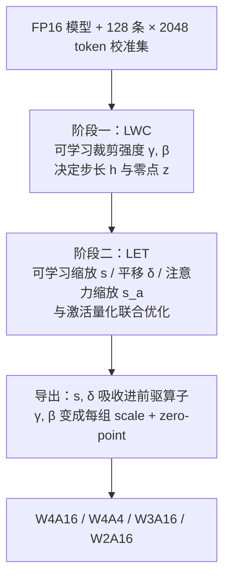

> **系列导航** ｜ [课程路线图](/quantization-roadmap/) ｜ **Part 1 · Weight-only PTQ** ｜ 第 05 篇 / 共 26 篇
>
> [← 04 AWQ（尺度搜索的数学篇）](/2026/08/24/llm-quant-03-awq-scale-search/) ｜ [06 SpQR/OWQ/HQQ →](/2026/08/24/ptq-04-spqr-owq-hqq/)
>
> **本文定位**：第 04 篇把 AWQ 的缩放当成"一条恒等式 + 一维搜索"讲透了数学；本篇讲 AWQ 作为**算法**的动机、判据、实现与生态，并把它与 OmniQuant 放进同一个目标函数里比较—— AWQ 是把解约束在一条一维曲线上做网格搜索，OmniQuant 是直接对同一个目标做梯度下降。所有论文数字均标注出处，所有合成实验均可复现。

---

## TL;DR

### 一句话

AWQ 用**激活幅度**（而不是权重幅度）找出模型中"牵一发动全身"的 0.1%~1% 显著通道，用一个逐输入通道的对角缩放把它们的量化误差压下去，全程只需前向统计、不需要任何梯度；OmniQuant 把同一套"等价变换"思路里的两个手工旋钮（缩放向量、裁剪边界）全部换成可学习参数，用不到模型 0.1% 的参数量 + STE（直通估计器）做块级重建，从而把这套思想推广到 AWQ 做不到的 **W4A4**。

### 三句话

1. **权重量化的误差不是均匀分布的**：输出误差 $$e_i = \sum_j X_j \, \varepsilon_{ij}$$ 被激活幅度加权。激活大的通道即使权重平庸，其误差也会被放大。所以"显著通道"必须由**激活统计**定义。AWQ 论文 Table 1 的实测证据（INT3-g128，OPT-6.7B）：把 1% 通道留在 FP16，按激活幅度选能把困惑度从 RTN 的 23.54 拉回 11.39（FP16 为 10.86），按权重幅度选只到 22.37，跟随机选差不多。
2. **缩放为什么有效，又为什么会失效**：均匀量化器的绝对误差上界 $$\Delta / 2$$ 与数值大小无关；把显著通道权重放大 $$s_j$$ 倍再量化、之后除回，等效误差上界变成 $$\Delta' / (2 s_j)$$。但 group-wise 量化下组步长 $$\Delta'_{ig} = \max_{k \in g} \vert W_{ik} \vert s_k / q_{\max}$$ 又随缩放增长——**"除 $$s_j$$" 与 "$$\Delta'$$ 变胖" 两个效应的竞争，就是 $$\alpha$$ 必须小于 1 的全部原因**。
3. **AWQ 与 OmniQuant 是同一个目标函数的两种解法**。把量化噪声建模为均匀噪声，层输出 MSE 可写成 $$\mathcal{L}(s) \approx \frac{1}{12}\sum_{i,g}\sum_{j \in g} \sigma_j^2 \big( \Delta'_{ig}(s) / s_j \big)^2$$。AWQ 把解约束在单参数族 $$s = s_X^{\alpha}$$ 上、用 20 点网格搜索；OmniQuant 直接对 $$s$$（以及裁剪边界）做块级梯度下降。前者分钟级、无梯度；后者小时级、能覆盖 W4A4。

### 五分钟

AWQ 是对 GPTQ"事后补偿"路线的正面反叛。GPTQ 用 Hessian 二阶信息逐列量化、逐列修补；AWQ 则**一个权重值都不改**，只做一次"事前预防"的坐标变换，让重要权重在量化网格里天然占据更精细的档位。整个校准是纯前向的：统计校准集激活 → 搜 $$\alpha$$ → RTN 量化，7B 模型分钟级完成。它在 W4A16-g128 上把 LLaMA-7B 的 WikiText-2 困惑度从 RTN 的 5.96 降到 5.78（FP16 5.68），且因为不需要混合精度 kernel，成了 vLLM / AutoAWQ / TensorRT-LLM 的事实标准格式。

OmniQuant 问了一个很自然的问题：既然 $$\alpha$$ 是搜出来的、clip 边界是 RTN 隐含的，为什么不直接让它们可学习？于是有了两个组件：**LWC** 把量化器的裁剪边界变成可学习参数（$$\gamma, \beta \in [0,1]$$ 经 sigmoid 参数化，决定步长与零点），**LET** 把 AWQ 的缩放向量变成可学习参数，并与**激活侧的平移 $$\delta$$** 和 **attention 里的缩放 $$s_a$$** 联合优化，从而第一次让 W4A4 变得"可用"。代价是要训练：128 条 × 2048 token、batch size 1、20 个 epoch，LLaMA-7B 在单张 A100-80G 上约 1.1 小时（仅权重量化）/ 1.6 小时（权重+激活）。

但必须诚实：**W4A4 远不是无损的**。OmniQuant 在 LLaMA-7B 上的 W4A4 WikiText-2 困惑度是 11.26，而 FP16 是 5.68，W4A16 是 5.86——激活压到 4bit 的代价仍然是两倍的困惑度。所谓"W4A4 追平 W4A16"是流传很广的误读（本文 §6.2 给出原始数字）。真正把 W4A4 拉近 W4A16 的是后来的旋转类方法（QuaRot / SpinQuant，系列第 12 篇）。

---

## 目录

- [1. 定位：误差补偿的两条路线](#1-定位误差补偿的两条路线)
- [2. AWQ 的核心观察：显著性由激活定义](#2-awq-的核心观察显著性由激活定义)
- [3. AWQ 的数学：一个目标函数，两种解法](#3-awq-的数学一个目标函数两种解法)
- [4. 可运行实验：numpy 复现 AWQ 与 OmniQuant 的两个组件](#4-可运行实验numpy-复现-awq-与-omniquant-的两个组件)
- [5. OmniQuant：把手工旋钮换成可学习参数](#5-omniquant把手工旋钮换成可学习参数)
- [6. 论文数据与工程生态](#6-论文数据与工程生态)
- [7. 批判、FAQ 与决策指南](#7-批判faq-与决策指南)
- [8. 参考清单](#8-参考清单)

---

## 1. 定位：误差补偿的两条路线

前几篇建立了两个坐标系：

- **RTN / LLM.int8()**：RTN 是最朴素的 round-to-nearest，对 outlier 极其敏感；LLM.int8() 用混合精度分解把 outlier 通道单独拎出来保持 FP16，代价是混合精度 kernel 与内存碎片。
- **GPTQ（第 03 篇）**：把量化看成逐列决策问题，用 Hessian（二阶信息）衡量每个权重对输出的敏感度，量化一列后用其余列补偿。这是**事后补偿**路线的巅峰：先量化、再修补。

到了 W4A16，GPTQ 已经做得相当好，但它有两个隐忧：

1. **校准开销与复杂度**：需要构造 Hessian、做 Cholesky 分解、逐列迭代更新，且对校准集分布敏感，有"过拟合校准集"的风险；
2. **补偿是被动的**：GPTQ 假设误差已经发生，然后尽量抹平。它没有回答一个更根本的问题——**能不能让误差根本不要发生在重要的地方？**

AWQ 选的是第二条路：**事前预防**。OmniQuant 则把这条路上的两个手工旋钮（缩放强度、裁剪边界）全部换成可学习参数。两种路线的哲学差异可以概括为：

> **GPTQ：误差已经发生了，我用二阶信息把它补回来。**
> **AWQ：误差还没发生，我先把重要的东西挪到安全的位置。**
> **OmniQuant：我不猜哪里安全，我让梯度告诉我。**

### 1.1 为什么战场是 W4A16

- **档位数骤降**：4bit 只有 16 个档位，步长 $$\Delta$$ 比 8bit 大 16 倍，均匀量化的噪声功率（$$\Delta^2/12$$）大 256 倍，RTN 开始肉眼可见地崩坏；
- **内存收益显著**：4bit 权重把模型内存压到原来的 1/4，7B 从约 14GB（FP16）降到约 3.5GB，这是单卡部署 7B/13B 的分水岭；8bit 只省一半，边际吸引力小得多；
- **精度余量极小**：4bit 下每个档位都弥足珍贵，"哪些权重值得更好的档位"这个问题第一次变得生死攸关。

换句话说：**8bit 时代误差被档位数淹没，4bit 时代档位数被误差淹没**。

---

## 2. AWQ 的核心观察：显著性由激活定义

### 2.1 权重量化的误差从哪来

线性层 $$y = X W^{\top}$$，其中 $$X \in \mathbb{R}^{T \times C_{in}}$$、$$W \in \mathbb{R}^{C_{out} \times C_{in}}$$。对输出第 $$i$$ 行：

$$y_i = \sum_{j=1}^{C_{in}} X_j \, W_{ij}$$

其中 $$X_j$$ 是激活的第 $$j$$ 个**输入通道**（长度为 $$T$$ 的向量）。权重被量化后引入误差 $$\varepsilon_{ij} = \hat{W}_{ij} - W_{ij}$$，输出误差为：

$$e_i = \sum_j X_j \, \varepsilon_{ij}$$

两个关键事实：

1. **误差被激活幅度加权**。同样大小的权重误差 $$\varepsilon$$，出现在 $$\vert X_j \vert$$ 大的通道上，破坏力远大于出现在小激活通道上。权重本身的幅度 $$\max_i \vert W_{ij} \vert$$ 在这个式子里**根本不出现**——它只通过 $$\varepsilon_{ij}$$ 间接起作用，而 $$\varepsilon_{ij}$$ 的上界对所有通道都差不多（都是 $$\Delta/2$$）。
2. **所以"显著通道"必须由激活定义**。权重幅度大的通道往往只是"数值大但没人用"；激活幅度大的通道才是"数值不大但人人都在乘"。

### 2.2 论文 Table 1 的原始证据

AWQ 论文 Table 1 用 INT3-g128 量化做了这个对照实验：把一部分通道留在 FP16，其余量化，比较三种挑选策略（按激活幅度 / 按权重 L2 范数 / 随机）。WikiText-2 困惑度（↓）：

| 模型 | FP16 | RTN（全量化） | 激活 0.1% | 激活 1% | 激活 3% | 权重 0.1% | 权重 1% | 权重 3% | 随机 1% |
| --- | --- | --- | --- | --- | --- | --- | --- | --- | --- |
| OPT-1.3B | 14.62 | 119.00 | 25.03 | 16.91 | 16.68 | 108.71 | 98.55 | 98.08 | 109.38 |
| OPT-6.7B | 10.86 | 23.54 | 11.58 | 11.39 | 11.36 | 23.41 | 22.37 | 22.45 | 24.23 |
| OPT-13B | 10.13 | 46.04 | 10.51 | 10.43 | 10.42 | 46.07 | 48.96 | 54.49 | 42.00 |

（数据来自 arXiv:2306.00978 Table 1，INT3 + group size 128。）

三点读法：

1. **0.1% 就够了**：OPT-6.7B 上，留 0.1% 通道就已经把 23.54 拉到 11.58，再往上加收益急剧递减（3% 只到 11.36）。误差是高度稀疏、高度集中的。
2. **按权重幅度选 ≈ 随机选**：OPT-6.7B 上从 23.41 到 22.37，几乎没动；OPT-13B 上甚至**变差**（46.04 → 48.96）。权重范数大的通道与误差贡献无关。
3. **1.3B 上留多少都救不回来**（119 → 16.91），说明小模型对量化的容错本来就低，AWQ 类的"保护"收益也有限——这在后面的模型规模对比里还会出现。

### 2.3 从"保护"到"缩放"

保护 1% 通道在工程上有个代价：被保护的通道要保持 FP16，推理时需要**混合精度 kernel**（99% 是 4bit、1% 是 FP16），GEMM 访存不规整、实现复杂。AWQ 的关键技巧是：**用缩放去逼近保护**——把显著通道的权重放大 $$s_j$$ 倍再量化，等效于给它们分配更多的量化档位，效果上近似"保护"，但推理时权重仍是纯 4bit。

下面进入数学。

---

## 3. AWQ 的数学：一个目标函数，两种解法

### 3.1 等效变换

对任意逐输入通道的缩放向量 $$s \in \mathbb{R}^{C_{in}}_{>0}$$：

$$W' = W \cdot \operatorname{diag}(s), \qquad X' = X \cdot \operatorname{diag}(s)^{-1}$$

输出严格不变：

$$X' {W'}^{\top} = X \operatorname{diag}(s)^{-1} \operatorname{diag}(s) W^{\top} = X W^{\top}$$

量化只作用在 $$W'$$ 上，于是：

$$\hat{W} = Q\big( W \cdot \operatorname{diag}(s) \big) \cdot \operatorname{diag}(s)^{-1}$$

**一个常见误解**：很多资料（包括本文的早期版本）说"W4A16 下激活侧不用真的执行 $$\operatorname{diag}(s)^{-1}$$"。严格说这是错的。官方实现（`llm-awq/awq/quantize/auto_scale.py`）是把 $$s$$ **吸收进前驱算子**：

| 前驱算子 | 吸收方式 | 成本 |
| --- | --- | --- |
| RMSNorm / LayerNorm | `ln.weight /= s`，`ln.bias /= s` | 零（离线改权重） |
| 前一层 Linear（如 `v_proj → o_proj`、`up_proj → down_proj`） | 前驱 `weight /= s`（带 bias 修正） | 零（离线改权重） |
| 无法吸收的位置（如 RoPE 之后、残差加之后） | 在线做一次逐通道 elementwise 乘 | 极小，但存在 |

也就是说，$$X \cdot \operatorname{diag}(s)^{-1}$$ **确实发生了**，只是被融合进了前一层而"免费"。同理，也可以选择不融合而把 $$s^{-1}$$ 直接除进反量化后的权重（$$\hat{W} = Q(W \operatorname{diag} s)\operatorname{diag}(s)^{-1}$$），两条路径在数学上完全等价。区别在于：前者保持权重是纯 int4（利于 kernel），后者把 $$s^{-1}$$ 烘焙进 FP16 权重。

### 3.2 为什么缩放后的量化误差更小

设量化步长 $$\Delta$$（对称均匀量化下 $$\Delta = \max \vert w \vert / q_{\max}$$，或 group-wise 下由组内最大值决定）。均匀量化器的关键性质是**绝对误差上界与数值大小无关**：

$$\big\vert Q(w) - w \big\vert \le \frac{\Delta}{2}, \qquad \forall w$$

一个 $$\vert w \vert = 0.01$$ 的小权重和一个 $$\vert w \vert = 1.0$$ 的大权重，误差上界都是 $$\Delta/2$$——小权重的**相对误差**可以高两个数量级。这就是 RTN 在重尾分布上吃亏的根本原因。

对第 $$j$$ 个通道缩放 $$s_j$$ 后，缩放域的误差上界仍是 $$\Delta'/2$$，但**除回 $$s_j$$ 后等效到原始尺度**变成：

$$\left\vert \frac{Q(W_{ij} s_j)}{s_j} - W_{ij} \right\vert = \frac{\big\vert Q(W_{ij} s_j) - W_{ij} s_j \big\vert}{s_j} \le \frac{\Delta'}{2 s_j}$$

于是输出误差的界为：

$$\vert e_i \vert \le \sum_j \vert X_j \vert \cdot \frac{\Delta'}{2 s_j} = \frac{\Delta'}{2} \sum_j \frac{\vert X_j \vert}{s_j}$$

**缩放把显著通道（$$\vert X_j \vert$$ 大）的误差贡献除以 $$s_j$$**。若 $$\Delta'$$ 不变，$$s_j$$ 越大越好——$$s_j \to \infty$$ 就是"不量化"的极限。但 $$\Delta'$$ 不会不变：group-wise 量化（AWQ 默认 g128）下一个组共享一个步长，组内只要有一个通道被放大，组步长就被撑大：

$$\Delta'_{ig}(s) = \frac{1}{q_{\max}} \max_{k \in g} \big\vert W_{ik} \big\vert \, s_k$$

于是存在两个相互竞争的效应：

| 效应 | 方向 | 机制 |
| --- | --- | --- |
| 显著通道误差 $$\div s_j$$ | 减小误差 | 缩放把显著权重推到更多量化档位 |
| 组步长 $$\Delta'_{ig} \propto \max_k \vert W_{ik} \vert s_k$$ | 增大误差 | 组内所有通道共享的步长同步变胖 |

当后者增长得更快时，净效果为负。这就是"为什么不能简单地把显著通道放大 100 倍"的数学答案，也是 $$\alpha$$ 必须小于 1 的原因。

### 3.3 一个统一的目标函数（本篇的核心）

把量化噪声建模为均匀噪声（$$\varepsilon \sim \mathcal{U}[-\Delta/2, \Delta/2]$$，方差 $$\Delta^2/12$$），并假设噪声与激活独立，则层输出的期望 MSE 可以写成：

$$\boxed{\;\mathcal{L}(s) \; \approx \; \frac{1}{12} \sum_{i=1}^{C_{out}} \sum_{g} \; \sum_{j \in g} \sigma_j^2 \left( \frac{\Delta'_{ig}(s)}{s_j} \right)^2 \;+\; \text{裁剪项}, \qquad \Delta'_{ig}(s) = \frac{\max_{k \in g} \vert W_{ik} \vert \, s_k}{q_{\max}} \;}$$

其中 $$\sigma_j^2 = \mathbb{E}[X_j^2]$$ 是激活第 $$j$$ 通道的二阶矩（等价于 GPTQ 里 Hessian $$H = 2 X X^{\top}$$ 的对角元——见 §3.5）。

这个式子把 AWQ 与 OmniQuant 放在了同一张桌子上：

- **AWQ 的解法**：把 $$s$$ 约束在单参数族 $$s = s_X^{\alpha}$$ 上，把高维问题压成一条一维曲线，用 20 点网格搜索近似求解；
- **OmniQuant 的解法**：直接对 $$s$$（加上裁剪边界、激活平移）做块级重建的梯度下降（LET），不假设解落在哪条曲线上。

**忽略 $$\Delta'$$ 对 $$s$$ 的依赖（即令 $$\Delta'$$ 为常数）时，$$\mathcal{L}$$ 可以被解析最小化。** 用拉格朗日乘子法处理归一化约束 $$\prod_j s_j = 1$$（防止 $$s$$ 整体漂移）：

$$\min_s \sum_j \frac{\sigma_j^2}{s_j^2} \quad \text{s.t.} \quad \sum_j \ln s_j = 0
\;\Longrightarrow\;
\frac{\partial}{\partial s_j} \left[ \frac{\sigma_j^2}{s_j^2} + \lambda \ln s_j \right] = -\frac{2\sigma_j^2}{s_j^3} + \frac{\lambda}{s_j} = 0
\;\Longrightarrow\;
s_j^{\ast} \propto \sigma_j = \sqrt{\mathbb{E}[X_j^2]}$$

两个值得记住的结论：

1. **在"误差上界"判据下最优统计量是 $$\mathbb{E}\vert X_j \vert$$，在"均方误差"判据下是 $$\mathrm{RMS}(X_j) = \sqrt{\mathbb{E}[X_j^2]}$$。** 论文与官方实现用的是**平均绝对值**（`get_act_scale(x) = x.abs().mean(0)`）。对高斯激活二者只差常数 $$\sqrt{\pi/2}$$；但 LLM 激活是重尾的，某些通道的 RMS 与 mean-abs 会明显分叉——这也解释了为什么"用 $$\max \vert X \vert$$ 还是 $$\mathrm{mean} \vert X \vert$$"在实测里差别不大（本文 §4 实测：0.758x vs 0.759x），因为真正起决定作用的是 $$\alpha$$ 而不是统计量的选择。
2. **两种判据都给出"名义最优 $$\alpha = 1$$"**，而实测最优 $$\alpha$$ 在 0.25~0.5。**这个差额 100% 来自"$$\Delta'$$ 随 $$s$$ 增长"这一项**。换句话说，$$\alpha < 1$$ 不是经验拍脑袋的折中，而是组量化步长惩罚的定量后果。

### 3.4 $$\alpha$$ 的搜索：论文原式与工程实现

论文给出的搜索目标是量化前后**层输出的差**（arXiv:2306.00978 Eq.4）：

$$\mathbf{s}^{\ast} = \arg\min_{\mathbf{s}} \mathcal{L}(\mathbf{s}), \qquad
\mathcal{L}(\mathbf{s}) = \Big\Vert Q\big(\mathbf{W} \cdot \operatorname{diag}(\mathbf{s})\big) \big( \operatorname{diag}(\mathbf{s})^{-1} \mathbf{X} \big) - \mathbf{W}\mathbf{X} \Big\Vert$$

由于 $$Q$$ 不可导，论文把搜索空间限制为单参数族（Eq.5）：

$$\mathbf{s} = \mathbf{s}_{\mathbf{X}}^{\alpha}, \qquad \alpha^{\ast} = \arg\min_{\alpha} \mathcal{L}(\mathbf{s}_{\mathbf{X}}^{\alpha})$$

官方实现（`_search_module_scale`）的三个细节值得注意：

1. **网格 20 点**：`ratio ∈ {0, 0.05, ..., 0.95}`，每次评估只是一次前向 + 量化 + 比输出，所以比 GPTQ 的 Hessian 求逆便宜几个数量级；
2. **归一化**：$$s \leftarrow s / \sqrt{\max(s) \cdot \min(s)}$$（不是几何均值，但目的一样：防止整体漂移）；
3. **搜索是逐"层组"进行的**，不是全模型一个 $$\alpha$$：`q/k/v` 三个投影共享一个 $$\alpha$$（用整个 self-attention 的输出做判据）、`gate/up` 共享一个（用整个 MLP 的输出做判据）、`o_proj` 与 `down_proj` 各自搜。所以实践中的 AWQ 是"每层一个 $$\alpha$$"。

### 3.5 与 GPTQ / SmoothQuant 的关系

**与 GPTQ：一阶 vs 二阶。** GPTQ 用 Hessian $$H = 2 X X^{\top}$$ 度量敏感度，其**对角元**正是 $$H_{jj} = 2 \sum_t X_{tj}^2 = 2 T \sigma_j^2$$。所以 AWQ 的"激活幅度显著性"不是什么新信息，它就是 **GPTQ 的 Hessian 对角元**（开方后）；AWQ 丢掉的是非对角元（通道间相关性）。这个视角说明两件事：

- AWQ 的收益来源与 GPTQ 同源，都是"误差被激活二阶矩加权"；
- AWQ 用一阶信息换来了免 Hessian、免迭代、免过拟合校准集——代价是放弃了通道间的相关性补偿。这也预示了后续工作（如用 Hutchinson 估计 Hessian 对角、或用 $$H$$ 的完整信息给显著性加权）的改进方向。

一句话总结：**GPTQ 修正的是误差本身，AWQ 修正的是误差的分布。**

**与 SmoothQuant：同一族变换，不同目标。**

| 维度 | SmoothQuant | AWQ |
| --- | --- | --- |
| 目标精度 | W8A8（激活也要量化） | W4A16（仅权重量化） |
| 迁移目的 | 把激活的量化难度"熨平"给权重 | 只保护显著通道的权重精度 |
| scale 取值 | $$s_j = \max \vert X_j \vert^{\alpha} \, / \, \max \vert W_j \vert^{1-\alpha}$$（平衡两侧范围） | $$s_j = \big( \mathrm{mean}_t \vert X_{tj} \vert \big)^{\alpha}$$（只看激活） |
| 激活侧是否执行 | 是（必须，否则激活量化崩坏） | 是（但融合进前驱算子，零成本） |
| 是否加平移 | 否 | 否（OmniQuant 的 LET 加了 $$\delta$$） |

准确的说法是：**AWQ 是 SmoothQuant 的"单边版本"**——SmoothQuant 必须把激活范围压到可量化区间，所以 scale 要同时考虑 $$\max \vert X \vert$$ 和 $$\max \vert W \vert$$；AWQ 的激活不量化，scale 只需服从一个目标：让权重量化误差在激活大的通道上最小。

### 3.6 一个严格结论：逐输入通道量化时，缩放严格无效

这是个漂亮的、可证明的结论，值得单独强调。

设量化单元就是单个输入通道 $$j$$（即 per-input-channel 粒度）。缩放前：步长 $$\Delta_j = \max_i \vert W_{ij} \vert / q_{\max}$$；缩放后：

$$\Delta'_j = \frac{\max_i \vert W_{ij} s_j \vert}{q_{\max}} = s_j \Delta_j$$

量化时 round 的输入是：

$$\frac{W_{ij} s_j}{\Delta'_j} = \frac{W_{ij} s_j}{s_j \Delta_j} = \frac{W_{ij}}{\Delta_j}$$

**与 $$s_j$$ 无关。** 于是整数码不变、反量化后除回 $$s_j$$ 得到的 $$\hat{W}_{ij}$$ 也与 $$s_j$$ 无关——缩放前后每个权重的量化结果逐位相同，误差分布完全不变。

> **推论**：AWQ 的全部收益来自"**量化单元包含多于一个输入通道**"这一前提。单元里只要有两个通道，谁"浮"到组内最大值就变成了可以操纵的事，缩放才有意义。这个结论在 §4.4 的实验里会被数值验证到小数点后 4 位（1.0000）。

### 3.7 为什么"保护 1%"就够了：误差贡献的集中性

在 §3.3 的目标函数里，第 $$j$$ 通道的贡献正比于 $$\sigma_j^2 = \mathbb{E}[X_j^2]$$。LLM 的激活通道幅度是重尾的（近似对数正态 / 幂律），$$\sum_j \sigma_j^2$$ 被极少数通道主导。于是：

- **保护**（不量化）令该通道 $$\varepsilon_j = 0$$，把 $$\sigma_j^2$$ 这一项整个移除；
- **缩放**令该通道的有效噪声功率从 $$\Delta^2/12$$ 降到 $$\Delta^2 / (12 s_j^2)$$，把 $$\sigma_j^2$$ 这一项按 $$1/s_j^2$$ 衰减。

**保护就是 $$s_j \to \infty$$ 的极限**。AWQ 的缩放是"软保护"（soft protection）：用有限的 $$s_j$$ 逼近保护的收益，同时保住纯 4bit 推理。

这也解释了论文的另一个观察：**对 GPTQ 同样施加 1% 通道保护也能提升精度**——误差集中性是与补偿算法无关的客观结构，谁先保护显著通道谁受益。

---

## 4. 可运行实验：numpy 复现 AWQ 与 OmniQuant 的两个组件

下面用纯 numpy 复现本文的全部核心机制。合成数据刻意构造论文的两个前提：**权重逐元素 iid（没有权重 outlier）**、**激活通道幅度呈对数正态分布（动态范围约 40 倍）**——这样"显著通道"只能由激活定义。

代码只依赖 numpy，输出误差用激活二阶矩矩阵 $$G = X^{\top}X / T$$ 一次算清：

$$\big\Vert X (W_q - W)^{\top} \big\Vert_F^2 \big/ (T \cdot C_{out}) \;=\; \operatorname{tr}\!\big( \Delta W \, G \, \Delta W^{\top} \big) / C_{out}$$

```python
"""AWQ / OmniQuant 核心机制的最小可复现实现（纯 numpy）"""
import numpy as np

rng = np.random.default_rng(42)
C_OUT, C_IN, T, BITS, GROUP = 512, 1024, 2048, 4, 128
QMAX, NG = 2 ** (BITS - 1) - 1, C_IN // GROUP

# ---- 合成数据：权重 iid（无权重 outlier），激活通道幅度对数正态（重尾 ~40x）----
w = rng.standard_normal((C_OUT, C_IN)) * 0.02
sigma = np.exp(rng.normal(0, 0.75, size=C_IN))
x_calib = rng.standard_normal((T, C_IN)) * sigma      # 校准集：统计激活幅度
x_test = rng.standard_normal((T, C_IN)) * sigma       # 测试集：评估输出误差
G = x_test.T @ x_test / T                             # 激活二阶矩，O(1) 算输出 MSE


def out_mse(wq):                                      # ||X(Wq-W)^T||_F^2 / (T*C_out)
    d = wq - w
    return float(np.sum((d @ G) * d) / C_OUT)


def group_rtn(wt, group=GROUP, clip=None):
    """对称均匀 group-wise 量化：每个 (输出通道, group) 共用一个步长"""
    wv = wt.reshape(wt.shape[0], -1, group)
    amax = np.max(np.abs(wv), axis=2, keepdims=True)
    if clip is not None:
        amax = amax * clip
    sc = np.where(amax == 0, 1.0, amax) / QMAX
    return (np.clip(np.round(wv / sc), -QMAX - 1, QMAX) * sc).reshape(wt.shape)


mse_rtn = out_mse(group_rtn(w))
print(f"RTN 基线 MSE = {mse_rtn:.4e}\n")

# ================= 1. alpha 网格搜索 =================
a_mean = np.abs(x_calib).mean(0)          # 论文与官方实现：逐通道平均幅度
a_max = np.abs(x_calib).max(0)


def awq(alpha, stat=a_mean):
    s = stat ** alpha
    s = s / np.sqrt(s.max() * s.min())    # 官方实现的归一化，防止整体漂移
    return group_rtn(w * s[None, :]) / s[None, :]


print("=== 1. alpha 网格搜索（grid=20）===")
grid = np.arange(20) / 20
for name, stat in [("mean", a_mean), ("max ", a_max)]:
    ms = [out_mse(awq(a, stat)) for a in grid]
    b = int(np.argmin(ms))
    curve = "  ".join(f"{a:.2f}:{m/mse_rtn:.3f}" for a, m in zip(grid, ms) if round(a * 20) % 4 == 0)
    print(f"  {name}  最优 alpha={grid[b]:.2f} -> {ms[b]/mse_rtn:.3f}x   |  {curve}")

# ================= 2. 保护 top-k（论文 Table 1 的合成复现）=================
def protect(k, by):
    wq = group_rtn(w)
    score = a_mean if by == "act" else np.abs(w).mean(0)
    idx = np.argsort(score)[::-1][:k]
    wq[:, idx] = w[:, idx]                # 显著通道保持 FP16
    return wq


print("\n=== 2. 把 top-k 通道留在 FP16 ===")
for k in [1, 10, 20]:
    print(f"  top-{k:<3d}  按激活幅度 {out_mse(protect(k,'act'))/mse_rtn:.3f}x"
          f"      按权重幅度 {out_mse(protect(k,'w'))/mse_rtn:.3f}x")

# ================= 3. 误差集中度 =================
dw = w - group_rtn(w)
contrib = np.array([G[j, j] * np.mean(dw[:, j] ** 2) for j in range(C_IN)])
top1_act = contrib[np.argsort(a_mean)[::-1][:C_IN // 100]].sum()
top1_w = contrib[np.argsort(np.abs(w).mean(0))[::-1][:C_IN // 100]].sum()
print("\n=== 3. 误差集中度 ===")
print(f"  top 1% 通道的误差贡献：按激活幅度选 {top1_act/contrib.sum():.1%}"
      f"   按权重幅度选 {top1_w/contrib.sum():.1%}")

# ================= 4. 量化粒度 =================
print("\n=== 4. 量化粒度 vs AWQ 收益（alpha=0.25）===")
s = a_mean ** 0.25
s_star = s / np.sqrt(s.max() * s.min())
for gs in [2, 8, 32, 128, 1024]:
    m0 = out_mse(group_rtn(w, gs))
    m1 = out_mse(group_rtn(w * s_star[None, :], gs) / s_star[None, :])
    print(f"  group={gs:<5d}  AWQ/RTN = {m1/m0:.4f}x")


def per_in_channel(wt, s=None):
    """逐输入通道量化：每个输入通道独享步长（AWQ 缩放的理论失效点）"""
    ww = wt * s[None, :] if s is not None else wt
    a = np.max(np.abs(ww), axis=0, keepdims=True)
    sc = np.where(a == 0, 1.0, a) / QMAX
    q = np.clip(np.round(ww / sc), -QMAX - 1, QMAX) * sc
    return q / s[None, :] if s is not None else q


m0 = out_mse(per_in_channel(w)); m1 = out_mse(per_in_channel(w, s_star))
print(f"  per-input-channel  AWQ/RTN = {m1/m0:.4f}x   <- 理论值 1.000")

# ================= 5. 裁剪：网格搜索 vs 可学习（LWC）=================
print("\n=== 5. 权重裁剪：网格搜索(AWQ auto_clip 口径) vs 可学习裁剪(OmniQuant LWC) ===")


def blocks(scale=None):
    """进入缩放坐标系：W~ = W·diag(s)，激活 Gram 相应变成 diag(s)^-1 G diag(s)^-1"""
    ws = w if scale is None else w * scale[None, :]
    bv = ws.reshape(C_OUT, NG, GROUP)
    amax = np.max(np.abs(bv), axis=2, keepdims=True)
    if scale is None:
        Gb = np.stack([G[g*GROUP:(g+1)*GROUP, g*GROUP:(g+1)*GROUP] for g in range(NG)])
    else:
        inv = (1.0 / scale).reshape(NG, GROUP)
        Gb = np.stack([G[g*GROUP:(g+1)*GROUP, g*GROUP:(g+1)*GROUP]
                       * inv[g][:, None] * inv[g][None, :] for g in range(NG)])
    return ws, bv, amax, Gb


def dequant(c, bv, amax, scale):
    q = np.clip(np.round(bv / (amax * c / QMAX)), -QMAX - 1, QMAX) * (amax * c / QMAX)
    q = q.reshape(C_OUT, C_IN)
    return q if scale is None else q / scale[None, :]


def grid_clip(scale=None, n_grid=20, max_shrink=0.5):
    ws, bv, amax, Gb = blocks(scale)
    best = np.full((C_OUT, NG, 1), np.inf); best_c = np.ones_like(best)
    for i in range(int(max_shrink * n_grid) + 1):
        c = np.full((C_OUT, NG, 1), 1 - i / n_grid)
        sc = amax * c / QMAX
        d = np.clip(np.round(bv / sc), -QMAX - 1, QMAX) * sc - bv
        err = np.einsum("ogc,gcd,ogd->og", d, Gb, d)[..., None]   # 逐组重建误差
        upd = err < best
        best = np.where(upd, err, best); best_c = np.where(upd, c, best_c)
    return out_mse(dequant(best_c, bv, amax, scale)), best_c.mean()


def lwc(scale=None, steps=200, lr=2e-2):
    """OmniQuant 式可学习裁剪：每 group 一个收缩比 c，STE 回传 + Adam"""
    ws, bv, amax, Gb = blocks(scale)
    c = np.ones((C_OUT, NG, 1)); m = np.zeros_like(c); v = np.zeros_like(c)
    for step in range(1, steps + 1):
        sc = amax * c / QMAX
        r = bv / sc
        q = np.clip(np.round(r), -QMAX - 1, QMAX)
        d = q * sc - bv
        g_wq = 2 * np.einsum("ogc,gcd->ogd", d, Gb) / C_OUT          # dL/dW_q
        rt = np.round(r)
        inr = (rt > -QMAX - 1) & (rt < QMAX)                          # 未被裁剪的权重
        dL_dsc = np.sum(g_wq * ((q - r) * inr + q * (~inr)), axis=2, keepdims=True)
        dL_dc = dL_dsc * amax / QMAX                                  # STE: dW_q/dΔ
        m[:] = 0.9 * m + 0.1 * dL_dc
        v[:] = 0.999 * v + 0.001 * dL_dc ** 2
        c -= lr * (m / (1 - 0.9 ** step)) / (np.sqrt(v / (1 - 0.999 ** step)) + 1e-8)
        c[:] = np.clip(c, 0.2, 1.0)
    return out_mse(dequant(c, bv, amax, scale)), c.mean()


m_g, cg = grid_clip()
m_l, cl = lwc()
print(f"  网格搜索 clip（逐组 11 档）  {m_g/mse_rtn:.3f}x   平均收缩比 {cg:.3f}")
print(f"  LWC（STE，逐组，200 步）     {m_l/mse_rtn:.3f}x   平均收缩比 {cl:.3f}")
m_g2, cg2 = grid_clip(s_star)
m_l2, cl2 = lwc(s_star)
print(f"  网格 clip + AWQ scale        {m_g2/mse_rtn:.3f}x   平均收缩比 {cg2:.3f}")
print(f"  LWC       + AWQ scale        {m_l2/mse_rtn:.3f}x   平均收缩比 {cl2:.3f}")
print(f"  （参考）仅 AWQ scale         {out_mse(group_rtn(w*s_star[None,:])/s_star[None,:])/mse_rtn:.3f}x")
```

### 4.1 实际输出（seed=42，可直接复现）

```
RTN 基线 MSE = 1.7478e-02

=== 1. alpha 网格搜索（grid=20）===
  mean  最优 alpha=0.25 -> 0.758x   |  0.00:1.000  0.20:0.761  0.40:0.845  0.60:1.213  0.80:2.097
  max   最优 alpha=0.25 -> 0.759x   |  0.00:1.000  0.20:0.765  0.40:0.845  0.60:1.194  0.80:2.034

=== 2. 把 top-k 通道留在 FP16 ===
  top-1    按激活幅度 0.933x      按权重幅度 0.998x
  top-10   按激活幅度 0.770x      按权重幅度 0.986x
  top-20   按激活幅度 0.687x      按权重幅度 0.980x

=== 3. 误差集中度 ===
  top 1% 通道的误差贡献：按激活幅度选 23.0%   按权重幅度选 1.4%

=== 4. 量化粒度 vs AWQ 收益（alpha=0.25）===
  group=2      AWQ/RTN = 0.5874x
  group=8      AWQ/RTN = 0.6236x
  group=32     AWQ/RTN = 0.6937x
  group=128    AWQ/RTN = 0.7577x
  group=1024   AWQ/RTN = 0.8570x
  per-input-channel  AWQ/RTN = 1.0000x   <- 理论值 1.000

=== 5. 权重裁剪：网格搜索(AWQ auto_clip 口径) vs 可学习裁剪(OmniQuant LWC) ===
  网格搜索 clip（逐组 11 档）  0.584x   平均收缩比 0.796
  LWC（STE，逐组，200 步）     0.665x   平均收缩比 0.761
  网格 clip + AWQ scale        0.574x   平均收缩比 0.873
  LWC       + AWQ scale        0.610x   平均收缩比 0.854
  （参考）仅 AWQ scale         0.758x
```

### 4.2 结果解读：三条与直觉相符、两条与直觉相悖

**相符的：**

1. **$$\alpha$$ 曲线呈 U 形**：$$\alpha = 0$$（RTN）→ $$\alpha = 0.25$$ 误差降到 0.758x，$$\alpha = 0.6$$ 开始反弹到 1.213x，$$\alpha = 0.8$$ 直接崩到 2.097x。过冲机制就是 §3.2 的第二个效应：显著通道被放大后越过组内原最大值，组步长被撑大，全组一起遭殃。
2. **激活 ≫ 权重**：保护 top-10 通道，按激活幅度选砍掉 23% 误差，按权重幅度选只砍 1.4%——因为权重 iid 时"权重最大的通道"是随机的。这是论文 Table 1 观察的数值重现（真实 LLM 上的差距更大，见 §2.2）。
3. **误差高度集中**：1024 个通道里 top 1%（10 个）贡献了 23% 的输出误差。

**相悖的（也是本文最想强调的两点）：**

4. **AWQ 的相对收益随 group 变小而变大，而不是变小。** 很多资料（包括本文旧版）声称"组越小、可再分配的量化资源越少、AWQ 收益越缩水"，实测恰好相反：group=1024 时只有 0.857x，group=2 时高达 0.587x。机制在 §3.2 的公式里写得很清楚——惩罚项 $$\Delta'_{ig} = \max_{k \in g} \vert W_{ik} \vert s_k / q_{\max}$$ 是**在组内取最大值**，组越大，越容易出现"某个通道的 $$\vert W \vert$$ 恰好也大"从而把步长撑爆，抵消收益。收益项 $$\sigma_j^2 / s_j^2$$ 则与组大小无关。**所以：组越大，惩罚增长得越快，净收益越小。** 真正决定 group size 的是 scale 存储开销与 kernel 支持（见 §7.4），不是 AWQ 的收益。
5. **在"每组只有一个可调参数"的裁剪问题上，网格搜索打不过 STE 梯度下降——反而是梯度输了。** 逐组穷举最优收缩比得到 0.567x，网格搜索（11 档）0.584x，而 STE 学习只有 0.665x。诊断显示：STE 从不同初始化（$$c_0 \in \{0.7, 0.8, 0.85, 0.9, 1.0\}$$）都收敛到同一个点 $$c \approx 0.762$$，而真实最优是 $$c \approx 0.794$$——**这是一个有偏估计，不是初始化问题**。把 STE 梯度与"大步长有限差分"的真实梯度对比，符号一致率只有 68%、相关系数 0.69。这是 §7.2 里"STE 偏差"批评的定量证据。

**综合起来**：在这个合成设定下，完整配方（scale + 逐组裁剪）把输出 MSE 压到 RTN 的 **0.574x**，其中裁剪贡献了大部分（0.584x），缩放贡献较小（0.758x）——这与"AWQ 的两个 trick 都很重要、且 auto_clip 常被低估"的工程经验一致。

---

## 5. OmniQuant：把手工旋钮换成可学习参数

OmniQuant（arXiv:2308.13137，ICLR 2024）的出发点很自然：AWQ 留下两个手工旋钮——**$$\alpha$$**（网格搜出来的标量）和 **clip 边界**（RTN 隐含的 $$[\min W, \max W]$$）。既然它们都是"让重建误差最小"的参数，为什么不直接用梯度求？



两个阶段共享同一个优化范式：**块级重建**——把模型切成 Transformer block，对每个 block 最小化量化前后输出之差：

$$\min_{\Theta} \; \sum_{x \in \mathcal{C}} \big\Vert f_{\mathcal{B}}(x; W) - f_{\mathcal{B}}\big(x; \hat{W}(\Theta)\big) \big\Vert_2^2$$

其中 $$\Theta$$ 是全部可学习参数（不到模型参数量的 0.1%），原始权重全程冻结。round 不可导，梯度通过 **STE（直通估计器）** 回传。

### 5.1 LWC：可学习权重裁剪

**动机**：均匀量化的步长由权重动态范围决定，而 LLM 权重是重尾的，极少数 outlier 会把步长撑大、让绝大多数正常权重的相对误差变大。RTN 的隐含边界是 $$[\min W, \max W]$$——被 outlier 绑架了。主动裁剪掉这些 outlier（让它们饱和到边界上）能显著缩小步长。

论文的原式（Eq.2）用两个 sigmoid 参数化的裁剪强度 $$\gamma, \beta \in [0,1]$$：

$$\mathbf{W}_q = \operatorname{clamp}\Big( \big\lfloor \mathbf{W} / h \big\rceil + z,\; 0,\; 2^{N} - 1 \Big), \qquad
h = \frac{\gamma \max(\mathbf{W}) - \beta \min(\mathbf{W})}{2^{N} - 1}, \qquad
z = -\Big\lfloor \frac{\beta \min(\mathbf{W})}{h} \Big\rceil$$

- $$h$$ 是步长，$$z$$ 是零点，$$\lfloor \cdot \rceil$$ 是 round-to-nearest；
- **$$\gamma = \beta = 1$$ 时退化为 vanilla MinMax**，所以 LWC 是 MinMax 的严格超集；
- 学习的是 $$\gamma, \beta$$ 的 sigmoid 参数，梯度经 STE 回传（round 的梯度透传为 1，clamp 的梯度是指示函数）；
- **粒度跟随量化粒度**：per-channel 权重量化时每个输出通道一对 $$(\gamma, \beta)$$，group-wise（g128）时每个组一对。论文附录观察到：per-channel 下学到的裁剪尺度近似正态分布，group-wise 下呈长尾分布。

**与 AWQ 的关系**：AWQ 的官方实现其实**也搜裁剪**（`auto_clip_layer`，对每个 group 在 $$[0.5, 1.0]$$ 上搜 11 档收缩比，判据是逐组输出 MSE）。所以严格说，LWC 相对 AWQ 的增量不是"引入了裁剪"，而是"**把裁剪从网格搜索换成了梯度优化**"。区别在 §7.2 讨论。

### 5.2 LET：可学习等价变换

**动机**：AWQ 的 $$s = s_X^{\alpha}$$ 有两个局限——$$\alpha$$ 是标量、$$s$$ 是激活统计的固定函数。OmniQuant 直接把变换参数化，并额外引入**平移**（这是 AWQ 完全没有的自由度）：

$$\mathbf{Y} = \mathbf{X}\mathbf{W} + \mathbf{B}
= \underbrace{(\mathbf{X} - \boldsymbol{\delta}) \oslash \mathbf{s}}_{\tilde{\mathbf{X}}}
\cdot \underbrace{\mathbf{s} \odot \mathbf{W}}_{\tilde{\mathbf{W}}}
+ \underbrace{\mathbf{B} + \boldsymbol{\delta}\mathbf{W}}_{\tilde{\mathbf{B}}}$$

$$\mathbf{Y} \approx Q_a(\tilde{\mathbf{X}}) \, Q_w(\tilde{\mathbf{W}}) + \tilde{\mathbf{B}}$$

其中 $$\mathbf{s} \in \mathbb{R}^{1 \times C_{in}}$$ 是通道级缩放、$$\boldsymbol{\delta} \in \mathbb{R}^{1 \times C_{in}}$$ 是通道级平移，$$Q_w$$ 就是带 LWC 的量化器。

**Attention 里的额外变换**（这是 OmniQuant 相对 AWQ 的另一个独立增量）：

$$\mathbf{P} = \operatorname{Softmax}(\mathbf{Q}\mathbf{K}^{\top})
= \operatorname{Softmax}\Big( \underbrace{\mathbf{Q} \oslash s_a}_{\tilde{\mathbf{Q}}} \; \underbrace{s_a \odot \mathbf{K}^{\top}}_{\tilde{\mathbf{K}}^{\top}} \Big)$$

$$s_a \in \mathbb{R}^{1 \times C_{out}}$$ 是注意力分数矩阵上的通道级缩放（只用缩放、不用平移）。

**哪些层用 LET？** 论文的做法是：**除 FFN 的第二个线性层外，所有线性层都用**。理由是"非线性层之后的特征高度稀疏，加可学习等价变换会让梯度不稳定"。具体映射（论文 Table A5）：

| 位置 | 前驱算子 | 被变换的层 |
| --- | --- | --- |
| Attention 输入 | `ln1`（第一个 LayerNorm / RMSNorm） | `q_proj`, `k_proj`, `v_proj` |
| Attention 输出 | `v_proj` | `o_proj` |
| FFN 第一层 | `ln2` | `gate_proj`, `up_proj`（LLaMA）/ `fc1`（OPT） |
| FFN 第二层 | — | **不用 LET**（论文明确排除） |
| Attention 内部 | — | $$\mathbf{Q}\mathbf{K}^{\top}$$ 上的 $$s_a$$ |

对比一下很有意思：**AWQ 的官方实现恰恰给 FFN 第二层（`down_proj`）也搜了 scale**（用 `up_proj` 作为前驱，把 $$s$$ 除进 `up_proj` 的权重、乘进 `down_proj` 的权重）。两篇论文在这个位置上的选择是相反的，实践中两种都能用。

**融合（absorb）——推理零开销的关键**：

- $$\tilde{\mathbf{X}}$$ 里的 $$-\boldsymbol{\delta}$$ 与 $$\oslash \mathbf{s}$$ 可以吸收进前一个归一化层或线性层（改权重与 bias）；
- $$\tilde{\mathbf{W}}$$ 里的 $$\mathbf{s} \odot \mathbf{W}$$ 直接融合进原权重；
- $$s_a$$ 吸收进 `q_proj` / `k_proj` 的权重；
- $$\mathbf{V}$$ 不需要单独处理，因为它的通道分布已经被 `o_proj` 对应的逆变换改过了。

所以 OmniQuant 推理时不引入任何额外参数或算子——它只是换了一套更好的量化参数。

### 5.3 初始化与训练配置

| 项目 | 设定 | 出处 |
| --- | --- | --- |
| 初始化 LET 的 $$s$$ | **SmoothQuant** 的解 | 论文 §4.1 |
| 初始化 LET 的 $$\delta$$ | **Outlier Suppression+** 的解 | 论文 §4.1 |
| 初始化 LWC | $$\gamma = \beta = 1$$（即 MinMax） | 论文：$$\gamma=\beta=1$$ 退化为 MinMax |
| 校准集 | WikiText-2 里随机 128 段，每段 **2048** token | 论文 §4.1 |
| batch size | 1（128 步/epoch） | 论文 §4.1 |
| epoch | 20（W2A16 用 40） | 论文 §4.1 / Table A9 |
| 优化器 | AdamW，weight decay = 0 | 论文 §4.1 |
| 学习率 | LWC $$5 \times 10^{-3}$$，LET $$1 \times 10^{-2}$$ | 论文 §4.1 |
| 硬件与耗时 | 单卡 A100-80G：LLaMA-7B 权重量化 **1.1 h**，权重+激活 **1.6 h**；LLaMA-2 7B~70B 在单卡 A100-40G 上 1~16 h | 论文 Table A12 / 摘要 |

（对比：GPTQ 是分钟到十几分钟级；本节开头说的"AWQ 分钟级"是纯前向搜索。OmniQuant 论文自己估计其开销约为 GPTQ 的 5 倍，但比 QAT 的数百 GPU 小时低两个数量级。）

### 5.4 与 LoRA 的关系

OmniQuant 论文明确表示受 PEFT（尤其 LoRA）启发。两者共享"冻结主干、只学少量参数"的哲学，但本质不同：

| 维度 | LoRA | OmniQuant |
| --- | --- | --- |
| 目标 | 下游任务微调（**改变**模型行为） | 量化误差重建（**保持**模型行为） |
| 参数形式 | 低秩增量 $$\Delta W = BA$$ | 裁剪强度（每量化单元 2 个）+ 对角缩放/平移（每通道 $$2 C_{in}$$ 个）+ $$s_a$$ |
| 是否改变权重值 | 是（$$W + BA$$） | 否（权重值不变，只改变量化方式） |
| 训练信号 | 任务损失 + 全量反向传播 | 块级重建损失 + STE |
| 参数量（7B） | 约 $$10^6 \sim 10^7$$（$$r = 8 \sim 64$$） | 约 $$10^5 \sim 10^6$$（< 0.1%） |
| 推理开销 | 需合并或额外计算 $$BA$$ | 零（全部吸收进权重） |

更深一层：LoRA 的假设是"微调增量低秩"，OmniQuant 的假设是"量化误差补偿可以用逐通道的对角变换表达"——前者是秩约束，后者是对角约束（更极端，但恰好匹配量化误差的结构）。另外 LET 与 LoRA 在形式上有亲缘：取对数后，$$W \cdot \operatorname{diag}(s)$$ 是 $$W$$ 在"乘性对角子空间"里的扰动，LoRA 是"加性低秩子空间"里的扰动。

---

## 6. 论文数据与工程生态

### 6.1 W4A16：三篇论文的数字（注意口径）

**AWQ 论文 Table 4**（INT4-g128，WikiText-2 困惑度 ↓）：

| 方法 | Llama-2-7B | Llama-2-13B | Llama-2-70B | LLaMA-7B | LLaMA-13B | LLaMA-30B | LLaMA-65B |
| --- | --- | --- | --- | --- | --- | --- | --- |
| FP16 | 5.47 | 4.88 | 3.32 | 5.68 | 5.09 | 4.10 | 3.53 |
| RTN | 5.73 | 4.98 | 3.46 | 5.96 | 5.25 | 4.23 | 3.67 |
| GPTQ | 5.69 | 4.98 | 3.42 | 6.22 | 5.23 | 4.24 | 3.66 |
| GPTQ-R（重排） | 5.63 | 4.99 | 3.43 | 5.83 | 5.20 | 4.22 | 3.66 |
| **AWQ** | **5.60** | **4.97** | **3.41** | **5.78** | **5.19** | **4.21** | **3.62** |

**OmniQuant 论文 Table 1**（WikiText-2 困惑度 ↓，AWQ/GPTQ 为作者重跑）：

| 配置 | 方法 | LLaMA-7B | LLaMA-2-7B | LLaMA-2-13B |
| --- | --- | --- | --- | --- |
| FP16 | — | 5.68 | 5.47 | 4.88 |
| W4A16（per-channel） | RTN | 6.43 | 6.11 | 5.20 |
| W4A16 | GPTQ | 6.13 | 5.83 | 5.13 |
| W4A16 | AWQ | 6.08 | 6.15 | 5.12 |
| W4A16 | **OmniQuant** | **5.86** | **5.74** | **5.02** |
| W4A16g128 | RTN / GPTQ / AWQ | 5.96 / 5.85 / 5.81 | — | — |
| W4A16g128 | **OmniQuant** | **5.77** | 5.58 | 4.95 |

**怎么读这两张表：**

1. **绝对差距很小**。W4A16-g128 上，LLaMA-7B 从 RTN 5.96 到 AWQ 5.78，只差 0.18 ppl（FP16 是 5.68）。所谓"AWQ 显著优于 GPTQ"要打折扣：两篇论文对同一方法的重跑结果就不一致（LLaMA-7B 上 GPTQ 有 6.22 与 5.85 两个版本，AWQ 有 5.78 与 5.81 两个版本）。**在 W4A16 上选 GPTQ 还是 AWQ，工程因素（kernel、格式、速度）比这 0.05~0.3 ppl 重要得多。**
2. **OmniQuant 确实是最强的**，但增量约 0.1~0.3 ppl，代价是从分钟级变成小时级。
3. **模型越大、量化越便宜**：65B/70B 上量化几乎无损（3.53 → 3.62），1.3B/7B 上损失明显。这是所有 PTQ 方法的共同规律。

### 6.2 W4A4：必须诚实地看数字

这是本文最想纠正的一个流传很广的误读。OmniQuant 论文里 **W4A4 的 LLaMA-7B WikiText-2 困惑度是 11.26**，而 FP16 是 5.68、W4A16 是 5.86：

| 方法（LLaMA-7B, W4A4） | WikiText-2 ppl ↓ | 出处 |
| --- | --- | --- |
| FP16（参考） | 5.68 | Table 1 |
| OmniQuant（W4A16，参考） | 5.86 | Table 1 |
| MinMax 基线（$$\gamma = \beta = 1$$） | 14.49 | Table A14 |
| PACT（替换 LWC） | 18.25 | Table A14 |
| LSQ（替换 LWC） | 15.03 | Table A14 |
| **OmniQuant（LET + LWC，20 epoch）** | **11.26** | Table A9 / A14 |
| OmniQuant（40 epoch） | 11.23 | Table A9 |

论文 Table A2 还给出了 WikiText-2 + C4 的平均困惑度与平均准确率：

| 变体 | 平均 ppl ↓ | 平均 acc ↑ |
| --- | --- | --- |
| SmoothQuant | 28.78 | 38.41% |
| 仅 LET | 16.97 | 48.83% |
| LET + 网格搜索裁剪 | 15.82 | 49.59% |
| SmoothQuant + LWC | 15.80 | 50.15% |
| **LET + LWC（OmniQuant）** | **12.87** | **52.65%** |

**结论要这么说才准确**：OmniQuant 让 W4A4 从"完全不可用"（SmoothQuant 28.78）变成"勉强可用"（11.26），是当时 W4A4 的 SOTA；但它离 W4A16（5.86）仍然差了一倍困惑度，**绝不是无损**。真正把 W4A4 拉近 W4A16 的是后续的旋转类方法（QuaRot / SpinQuant，系列第 12 篇）——它们用正交变换把 outlier 摊平，从源头上降低了激活量化的难度，而不是靠学习去补偿。

从消融表还能读出一个关键信息：**LET 是 W4A4 的生死线**（单独 LET 就能把 28.78 拉到 16.97），**LWC 是叠加收益**（再降到 12.87）。这印证了 §5 的分工：LWC 管权重、LET 管激活。

### 6.3 工程生态

**AWQ 是 W4A16 部署的事实标准之一：**

```python
from awq import AutoAWQForCausalLM
from transformers import AutoTokenizer

model = AutoAWQForCausalLM.from_pretrained("meta-llama/Llama-2-7b-hf")
tokenizer = AutoTokenizer.from_pretrained("meta-llama/Llama-2-7b-hf")
model.quantize(tokenizer, quant_config={
    "zero_point": True, "q_group_size": 128, "w_bit": 4, "version": "GEMM",
})
model.save_quantized("llama2-7b-awq-w4")
```

- **vLLM**：原生支持（`--quantization awq`），AWQ 与 GPTQ 都走 Marlin kernel（要求 g128 + 对称量化，AWQ 默认配置恰好满足）；
- **SGLang / TensorRT-LLM / llama.cpp**：均支持加载 AWQ 格式；
- **TinyChat**：论文配套的推理引擎，把"缩放融合进前驱算子 + 通道重排 + 4bit GEMM"三件事一起做了，在 4090 与 Jetson Orin 上有数倍加速；
- **通道重排（reorder）**：论文的工程贡献之一。量化时按激活幅度对输入通道排序，让显著通道在内存里聚成连续块，改善 GEMM 访存局部性。重排是离线一次性的（权重与 scale 一起重排），推理时零开销。AutoAWQ 的 `version="GEMM"` / `GEMM_v2` 就是这条路线。

**OmniQuant 的生态是它的短板**：以研究代码为主，未被 vLLM / llama.cpp 一等支持；W4A4 的部署还需要专门的 W4A4 GEMM kernel（激活也走 4bit 访存）。学术价值高、工程采用率低，这是最主要原因。

---

## 7. 批判、FAQ 与决策指南

### 7.1 对 AWQ 的批判

1. **缩放的表达力只有一个对角矩阵**。显著通道**内部**的差异它无法区分——同一通道里哪些权重值得保护？对角变换给不出答案。相比之下 GPTQ 的逐元素补偿精细得多（代价是复杂度与过拟合风险）。
2. **$$\alpha$$ 仍是调参**。虽然论文说 0.5 附近稳健，但最优值随模型、层类型（attention vs MLP）、校准集漂移；官方实现实际是逐层搜，意味着更多校准集依赖。
3. **一个未充分讨论的失败模式**：当激活 outlier 与权重 outlier 落在同一通道时，缩放会直接撑大组步长，收益消失甚至为负（§4.2 里 $$\alpha = 0.8$$ 崩到 2.097x 就是这个机制的极端版）。论文的"1% 保护"叙事隐含假设两类 outlier 不重合。
4. **理论是上界/均匀噪声分析**。$$\Delta$$ 恒定、噪声与激活独立、无裁剪——三个假设在真实 LLM 上都只是近似。这不妨碍它好用，但意味着 AWQ 没有 GPTQ 那种"在二次近似下最优"的保证。
5. **W4A16 的带宽天花板**：只压权重，激活仍以 FP16 全量读取。decode 阶段的加速主要来自权重带宽，激活带宽与 KV cache 带宽仍是瓶颈——这正是 W4A4 路线的动机。

### 7.2 对 OmniQuant 的批判

1. **STE 的偏差是可测量的**（本文 §4.2 给出了定量证据）：在逐组裁剪这个一维问题上，STE 从不同初始化都收敛到 $$c \approx 0.762$$，而真实最优是 $$c \approx 0.794$$；与有限差分梯度的符号一致率仅 68%、相关系数 0.69。round 的阶梯型 loss 让梯度又噪又偏，对学习率、步数、初始化都敏感。
2. **"可学习"在低维问题上未必优于搜索**。§4.2 的实验显示：每组 1 个参数时，网格搜索 0.584x / 穷举 0.567x 都优于 STE 0.665x。**梯度法的真正优势要在"参数维度高到无法网格搜索"时才兑现**——也就是 LET 与激活量化联合优化的场合。这既是 OmniQuant 的价值所在，也意味着它的优势无法在低维消融里被干净地证明。
3. **块级误差累积**：逐块重建只保证局部最优，误差沿层深累积。这是所有 layer-wise / block-wise 方法的通病（GPTQ 也有，AWQ 的纯统计路线反而天然免疫）。
4. **"轻量训练"仍是训练**：需要反向传播、激活显存、多轮迭代；7B 单卡 1.1~1.6 小时、70B 多卡数小时。对"只想快速压个模型"的场景，AWQ 分钟级的体验优势明显。
5. **生态缺失**：无 vLLM 一等支持、无统一模型格式、W4A4 kernel 稀缺，精度优势难以直接转化为部署收益。

### 7.3 展望

- **把 Hessian 的对角用起来**：AWQ 用一阶矩、GPTQ 用完整二阶信息。用 $$H$$ 的对角元（就是 $$\sigma_j^2$$）替代 "mean $$\vert X \vert$$" 作为显著性统计量，是自然的改进方向；
- **联合优化 $$s$$ 与 group 划分**：既然 $$\mathcal{L}(s)$$ 有显式形式（§3.3），完全可以一起搜"每个组多大"与"每个通道缩放多少"；
- **W4A4 的 kernel 补课**：OmniQuant 证明了 W4A4 的精度可行性，但部署需要高效的 W4A4 GEMM（激活 4bit 访存、混合粒度分解）；
- **旋转优于学习的可能性**：QuaRot / SpinQuant 用固定的正交变换（Hadamard）消除 outlier，不需要训练就拿到了比 OmniQuant 更好的 W4A4——这暗示"学习量化参数"可能是在补偿一个本可以用坐标变换消掉的问题。

### 7.4 常见问题速查

**Q：group size 到底选多大？**

A：128 是 AWQ/GPTQ 的事实默认。group 越小 RTN 本身就越准，但每个 group 要存一个 scale（4bit 权重 + 16bit scale 的存储占比上升），且高性能 kernel（Marlin）只认 g128。注意：**AWQ 的相对收益随 group 变小而变大**（§4.2），所以别用"给 AWQ 留空间"当理由去选更大的 group。

**Q：对称还是非对称量化？**

A：AutoAWQ 默认非对称（`zero_point=True`），对偏置分布更友好；但 Marlin 等高性能 kernel 要求对称。追求 kernel 性能用对称，追求极限精度用非对称，W4A16 下差距通常小于 0.1 ppl。

**Q：校准集要多大？分布有要求吗？**

A：AWQ/GPTQ 常用 128 条 × 512~2048 token；OmniQuant 用 128 条 × 2048 token。分布上尽量贴近部署输入（代码模型就别用纯 Wikipedia 校准）。AWQ 对校准集比 GPTQ 稳健——因为它只有一两个自由度，过拟合风险低。

**Q：$$\alpha$$ 需要逐层调吗？**

A：官方实现就是逐"层组"搜的。全局 0.5 在多数模型上够用；逐层搜一般能再挤 0.02~0.05 ppl，代价是校准时间从分钟级变小时级。MLP 与 attention 的激活分布不同，区别对待是合理的。

**Q：AWQ 和 GPTQ 能叠加吗？**

A：能，而且有收益。先做 AWQ 缩放（改善权重在量化网格里的条件数），再走 GPTQ 的 Hessian 逐列补偿，混合方案在不少模型上优于两者。工程上两者格式不兼容，需要自己串 pipeline。

**Q：什么时候才值得上 W4A4？**

A：当瓶颈是"激活带宽 + 权重带宽"而不只是权重带宽时——长上下文（KV cache 巨大）与边缘设备。但请先接受代价：LLaMA-7B 上 W4A4 的困惑度是 11.26，而 W4A16 是 5.86。建议先把 W4A16 + KV cache INT8 的收益榨干，再考虑 W4A4（并优先考虑旋转类方案）。

### 7.5 实践决策指南

| 你的场景 | 推荐方案 | 理由 |
| --- | --- | --- |
| 快速压模型、要现成生态 | **AWQ**（AutoAWQ + vLLM） | 分钟级校准、Marlin kernel、社区支持最全 |
| 追求 W4A16 极限精度、模型 ≤ 13B | GPTQ，或 AWQ + 逐层 $$\alpha$$ + auto_clip | 二阶补偿在小模型上优势更明显；但差距 < 0.3 ppl |
| 需要 W4A4 / 边缘部署 | 先看 QuaRot / SpinQuant，再看 OmniQuant | 旋转方案免训练且精度更好（系列第 12 篇） |
| 权重 + 激活都要 8bit | SmoothQuant（系列第 10 篇） | W8A8 是它的主场 |
| 既要精度又不想训练 | AWQ + 逐组裁剪搜索 | 本文 §4.2 显示裁剪的贡献（0.584x）比缩放（0.758x）还大 |

### 7.6 术语对照表

| 术语 | 英文 | 本文含义 |
| --- | --- | --- |
| 显著通道 | salient channel | 激活幅度大的输入通道，其权重量化误差对输出影响最大 |
| 等效变换 | equivalent transformation | 权重 × $$s$$、激活 ÷ $$s$$，输出严格不变的坐标变换 |
| 软保护 | soft protection | 用有限缩放 $$s_j$$ 逼近"不量化"效果的 AWQ 机制 |
| 组量化 | group-wise quantization | 连续 $$g$$ 个输入通道共享一个量化 scale |
| 直通估计器 | STE（Straight-Through Estimator） | round 不可导时令其梯度近似为 1 的梯度估计方法 |
| 块级重建 | block-wise reconstruction | 以 Transformer block 为单位的量化前后输出误差最小化 |
| 可学习权重裁剪 | LWC | 把量化裁剪边界变成可学习参数的 OmniQuant 组件 |
| 可学习等价变换 | LET | 把 AWQ 缩放因子（并加平移）变成可学习参数的 OmniQuant 组件 |
| 吸收 / 融合 | absorb / fuse | 把缩放、平移合并进前驱算子的权重，使推理零开销 |
| W4A16 / W4A4 | — | 权重 4bit 激活 16bit / 权重 4bit 激活 4bit |

---

## 8. 参考清单

1. Ji Lin, Jiaming Tang, Haotian Tang, Shang Yang, Wei-Ming Chen, Wei-Chen Wang, Guangxuan Xiao, Xingyu Dang, Chuang Gan, Song Han. **AWQ: Activation-aware Weight Quantization for LLM Compression and Acceleration.** arXiv:2306.00978, MLSys 2024.（Table 1 显著性对照、Table 4 困惑度、Eq.4/5 搜索目标）
2. Wenqi Shao, Mengzhao Chen, Zhaoyang Zhang, Peng Xu, Lirui Zhao, Zhiqian Li, Kaipeng Zhang, Peng Gao, Yu Qiao, Ping Luo. **OmniQuant: Omnidirectionally Calibrated Learning for Large Language Models.** arXiv:2308.13137, ICLR 2024.（Eq.2 LWC、Eq.3–5 LET、Table 1 / A2 / A9 / A12 / A14 / A5）
3. Elias Frantar, Saleh Ashkboos, Torsten Hoefler, Dan Alistarh. **GPTQ: Accurate Post-Training Quantization for Generative Pre-trained Transformers.** arXiv:2210.17323, ICLR 2023.（本系列第 03 篇）
4. Guangxuan Xiao, Ji Lin, Mickael Seznec, Hao Wu, Julien Demouth, Song Han. **SmoothQuant: Accurate and Efficient Post-Training Quantization for Large Language Models.** arXiv:2211.10438, ICML 2023.（本系列第 10 篇，也是 OmniQuant LET 的初始化来源）
5. Xiuying Wei 等. **Outlier Suppression（arXiv:2209.13325, NeurIPS 2022）及 Outlier Suppression+**——OmniQuant 中通道平移参数 $$\delta$$ 的初始化来源。
6. Tim Dettmers, Mike Lewis, Younes Belkada, Luke Zettlemoyer. **LLM.int8(): 8-bit Matrix Multiplication for Transformers at Scale.** arXiv:2208.07339, NeurIPS 2022.（本系列第 02 篇）
7. Edward J. Hu, Yelong Shen, Phillip Wallis, et al. **LoRA: Low-Rank Adaptation of Large Language Models.** arXiv:2106.09685, ICLR 2022.
8. 官方代码：`mit-han-lab/llm-awq`（`awq/quantize/auto_scale.py` 的 `get_act_scale` / `_search_module_scale`，`awq/quantize/auto_clip.py` 的 `auto_clip_layer`）。
9. 本系列第 00 篇：[量化全景](/2026/08/24/ptq-00-overview/)；第 04 篇：[AWQ 尺度搜索的数学](/2026/08/24/llm-quant-03-awq-scale-search/)。

---

*本文为 LLM 量化系列第 05 篇。上一篇：[AWQ 尺度搜索的数学](/2026/08/24/llm-quant-03-awq-scale-search/)；下一篇：[SpQR / OWQ / HQQ](/2026/08/24/ptq-04-spqr-owq-hqq/)。*
