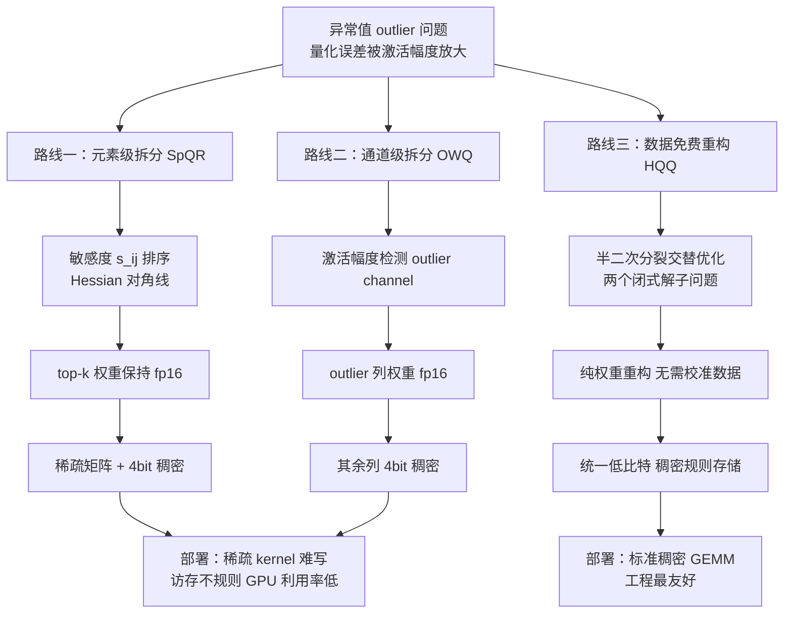

> **系列导航（LLM PTQ 量化算法全景）**
>
> - 第 0 篇 [量化全景](/2026/08/24/ptq-00-overview/) → 第 1 篇 [RTN/LLM.int8](/2026/08/24/ptq-01-rtn-llmint8/) → 第 2 篇 [GPTQ](/2026/08/24/ptq-02-gptq/) → 第 3 篇 [AWQ/OmniQuant](/2026/08/24/ptq-03-awq-omniq/)
> - **第 4 篇 SpQR / OWQ / HQQ（本文）** → 第 5 篇 [QuIP#/AQLM](/2026/08/24/ptq-05-quip-aqlm/) → 第 6 篇 [SmoothQuant/ZeroQuant](/2026/08/24/ptq-06-smoothquant-zeroquant/) → 第 7 篇 [QuaRot/SpinQuant](/2026/08/24/ptq-07-quarot-spinquant/) → 第 8 篇 [GGUF k-quants/FP8/MXFP4](/2026/08/24/ptq-08-gguf-fp8-mxfp4/)

---

## TL;DR

1. **SpQR 与 OWQ 是"外科手术"路线**：先精确定位对量化最敏感的权重（SpQR 按**元素**、OWQ 按**通道**），把这一小撮"异常值"单独用 fp16 保精度，其余权重压到 3–4bit。效果惊艳（2–4bit 下困惑度几乎无损），但代价是稀疏矩阵 / 混合精度带来的部署噩梦。
2. **HQQ 是"数据免费"路线**：用**半二次分裂（Half-Quadratic Splitting）**把非光滑、非凸的量化重构问题拆成两个**都有闭式解**的子问题交替优化，全程只碰权重本身，**不需要任何校准数据、不需要 Hessian**——4bit 追平 GPTQ，2bit 反超。
3. **历史判词**：outlier 拆分路线的工程质量撑不起规模化部署（稀疏 kernel 难写、内存不规则、GPU 利用率低），最终被码本路线（QuIP#/AQLM）与旋转路线（QuaRot/SpinQuant）这两条"**把 outlier 摊平**"的稠密方案取代；但 SpQR 的敏感度分析与 HQQ 的 data-free 思想，至今仍是量化工具箱里的常备武器。

---

## 目录

1. [引言：outlier 的三条处理路线](#1-引言outlier-的三条处理路线)
2. [SpQR：把异常值"抠"出来单独存](#2-spqr把异常值抠出来单独存)
   - 2.1 [敏感度：哪些权重经不起量化](#21-敏感度哪些权重经不起量化)
   - 2.2 [异常值检测与拆分](#22-异常值检测与拆分)
   - 2.3 [稀疏存储格式与编码开销](#23-稀疏存储格式与编码开销)
   - 2.4 [实验结果](#24-实验结果)
3. [OWQ：按通道整列保精度](#3-owq按通道整列保精度)
   - 3.1 [outlier channel 检测](#31-outlier-channel-检测)
   - 3.2 [混合精度量化策略](#32-混合精度量化策略)
   - 3.3 [与 SpQR 的本质差异](#33-与-spqr-的本质差异)
   - 3.4 [实验结果](#34-实验结果)
4. [HQQ：不碰数据的半二次分裂](#4-hqq不碰数据的半二次分裂)
   - 4.1 [问题设定：纯权重重构](#41-问题设定纯权重重构)
   - 4.2 [半二次分裂：把非光滑问题拆成两个光滑子问题](#42-半二次分裂把非光滑问题拆成两个光滑子问题)
   - 4.3 [两个子问题的闭式解](#43-两个子问题的闭式解)
   - 4.4 [完整迭代算法](#44-完整迭代算法)
   - 4.5 [为什么不需要校准数据](#45-为什么不需要校准数据)
   - 4.6 [实验结果](#46-实验结果)
5. [三方法对比](#5-三方法对比)
   - 5.1 [三条路线的路线图](#51-三条路线的路线图)
   - 5.2 [总对比表](#52-总对比表)
6. [代码实现（numpy）](#6-代码实现numpy)
   - 6.1 [SpQR 简化版：敏感度拆分](#61-spqr-简化版敏感度拆分)
   - 6.2 [HQQ 核心迭代：半二次分裂闭式解](#62-hqq-核心迭代半二次分裂闭式解)
   - 6.3 [统一对比实验](#63-统一对比实验)
   - 6.4 [运行结果解读](#64-运行结果解读)
7. [批判与展望：为什么 outlier 拆分路线被取代](#7-批判与展望为什么-outlier-拆分路线被取代)
   - 7.1 [工程代价：稀疏 kernel 与不规则内存](#71-工程代价稀疏-kernel-与不规则内存)
   - 7.2 [路线替代：码本与旋转](#72-路线替代码本与旋转)
   - 7.3 [遗产与适用场景](#73-遗产与适用场景)
8. [常见问题 FAQ](#8-常见问题-faq)
9. [参考清单](#9-参考清单)

---

## 1. 引言：outlier 的三条处理路线

前几篇我们已经反复撞见同一个"钉子"：**LLM 的激活与权重中存在少量幅值极大的异常值（outlier）**。第 1 篇的 LLM.int8() 用混合精度分解（outlier 列走 fp16）硬扛，第 2 篇的 GPTQ 用 Hessian 做误差补偿硬压，第 3 篇的 AWQ 则发现"激活幅度大的通道，其权重必须保护"。

先快速回顾 outlier 的成因与危害，便于理解本文三兄弟的动机：

- **成因**：LLM 的 LayerNorm 之后、以及 FFN 中间层，激活分布会出现少量幅值远超均值的维度（幅值可达其他维度的 10–100 倍）。这些维度的权重在训练中承载了"少数关键特征"，幅值也被训练得很大。
- **危害**：量化误差 $\delta$ 经过权重矩阵传播时，会被 outlier 激活 $x_j$ 放大成 $\delta \cdot x_j$。一个通道的 outlier 就能让整行输出的误差爆炸。RTN 在 4bit 以下性能崩塌，根源就在这里。
- **对策谱系**：要么**保护**（LLM.int8 / 本文的 SpQR、OWQ）、要么**补偿**（GPTQ）、要么**迁移/摊平**（AWQ 的 scale 迁移、SmoothQuant、后续的旋转与码本路线）。

本文的三位主角，是把"outlier"这件事**做到极致**的三条不同路线：

- **SpQR（Sparse-Quantized Representation）**：把 outlier 当作"病根"，先精确定位每一个"经不起量化"的**单个权重**（元素级），把它们从量化流程里**摘除**，剩下的稠密部分才做低比特量化。结果是一个**稀疏 fp16 + 稠密 4bit** 的混合表示。
- **OWQ（Outlier-aware Weight Quantization）**：同样的思路，但粒度更粗——按**通道（整列）**判断。outlier 通道的整列权重用 fp16 保留，其余列 4bit。结果是**混合精度但稠密**的表示。
- **HQQ（Half-Quadratic Quantization）**：完全换一个思路——不拆 outlier，而是把"找到最接近原权重的低比特表示"这件事本身做成一个**可解析求解的优化问题**，用半二次分裂交替迭代，**连校准数据都不要**。

一句话总结三者的关系：SpQR 和 OWQ 是"**把 outlier 拆出来保护**"（拆的粒度不同），HQQ 是"**不拆，直接在整个权重上做最优重构**"。下面逐一展开。

---

## 2. SpQR：把异常值"抠"出来单独存

论文：*SpQR: A Sparse-Quantized Representation for Near-Lossless LLM Weight Compression*（Dettmers et al., 2023，arXiv:2306.03078）。

### 2.1 敏感度：哪些权重经不起量化

SpQR 的核心问题是：**在量化之前，如何预知每个权重被量化后会造成多大损失？** 答案是定义一个逐权重的"敏感度（sensitivity）"指标。

考虑某一线性层 $y = Wx$，其中 $W \in \mathbb{R}^{d_{\text{out}} \times d_{\text{in}}}$，$x \in \mathbb{R}^{d_{\text{in}}}$。若把权重 $W_{ij}$ 量化为 $\hat{W}_{ij} = W_{ij} + \delta_{ij}$，则输出扰动为：

$$
\Delta y_i = \sum_j \delta_{ij} x_j \;\approx\; \delta_{ij} x_j \qquad(\text{仅考虑单个权重被扰动})
$$

假设各权重误差独立，输出 MSE 的增量正比于：

$$
\mathbb{E}[\Delta y_i^2] \;=\; \delta_{ij}^2 \cdot \mathbb{E}[x_j^2] \;=\; \delta_{ij}^2 \cdot H_{jj}
$$

其中 $H = \mathbb{E}_{x \sim \mathcal{D}}[x x^\top]$ 是激活的二阶矩矩阵，也就是线性层场景下损失函数 Hessian 的近似（GPTQ 那套误差分析的同一来源）。量化误差 $\delta_{ij}$ 的典型量级与权重幅值 $|W_{ij}|$ 成正比（仿射量化下误差上界为半个量化步长，而步长与幅值范围同阶），于是 SpQR 把敏感度定义为：

$$
\boxed{\,s_{ij} = \frac{|W_{ij}|}{\sqrt{[H^{-1}]_{jj}}}\,}
$$

这个定义来自"最优脑外科医生（OBS/OBQ）"框架：量化权重 $W_{ij}$ 且允许其他权重做最优补偿时，引入的误差正比于 $(\hat{W}_{ij} - W_{ij})^2 / [H^{-1}]_{jj}$，敏感度取其"幅值 × 1/√(H⁻¹ 对角)"的形式。

问题在于：逐元素求逆 Hessian 的对角线计算量太大（$H^{-1}$ 是 $d_{\text{in}} \times d_{\text{in}}$ 稠密矩阵，求逆是 $O(d_{\text{in}}^3)$）。SpQR 利用 Hessian 近似对角占优的性质，用 $[H^{-1}]_{jj} \approx 1/H_{jj}$ 做替换，得到实用的近似形式：

$$
s_{ij} \;\approx\; |W_{ij}| \cdot \sqrt{H_{jj}} \;=\; |W_{ij}| \cdot \sqrt{\mathbb{E}_{x \sim \mathcal{D}}[x_j^2]}
$$

这个公式的直觉非常清晰：**一个权重敏感，当且仅当它自身幅值大，并且它乘的激活 $x_j$ 方差大**。激活方差大的通道正是 LLM 里臭名昭著的 outlier 通道（第 1 篇 LLM.int8 的观察），SpQR 等于把"通道级 outlier"进一步细化到了"元素级敏感度"。

**计算流程上的两个工程细节**：

1. **Hessian 对角线的估计**：对每个线性层，收集校准集上该层输入激活 $X \in \mathbb{R}^{n \times d_{\text{in}}}$，计算 $H_{jj} = \frac{1}{n}\sum_i X_{ij}^2$。这只涉及一次逐元素平方与列求和，代价可忽略。
2. **为什么用 $H^{-1}$ 而不是 $H$**：OBQ 框架里，$H^{-1}$ 的对角线衡量的是"该权重被量化后，其他权重最优补偿也救不回来的残余误差"。用 $1/H_{jj}$ 近似是牺牲一点精度换 $O(d_{\text{in}}^2)$ 的存储与 $O(d_{\text{in}}^3)$ 的求逆。SpQR 论文实测：这个近似对最终 ppl 的影响在 0.5% 以内。

### 2.2 异常值检测与拆分

拿到敏感度矩阵 $S = (s_{ij})$ 后，SpQR 取**敏感度最高的前 $\alpha$ 比例**的权重作为异常值集合：

$$
\mathcal{O} = \left\{(i,j) : s_{ij} \text{ 处于全体敏感度的 top-}\alpha\right\}, \qquad \alpha \approx 0.5\% \sim 1\%
$$

论文的观察：outlier 虽然只占约 1% 的权重，但**它们贡献了绝大部分量化误差**——把这一小撮权重从量化流程中摘除后，剩下的 99% 权重变得"温顺"，常规 3–4bit 量化就足够。

随后做拆分（splitting）：

$$
W = W_{\text{out}} \oplus W_{\text{dense}}, \qquad
W_{\text{out}} \in \mathbb{R}^{|\mathcal{O}|}\ \text{以 fp16 存储},\quad
W_{\text{dense}}\ \text{以 3–4bit 存储}
$$

拆分的实现细节（也是工程上最繁琐的部分）：

1. **outlier 位置**：用稀疏矩阵格式（CSR/CSC）记录 $\mathcal{O}$ 中每个元素的行列坐标；
2. **稠密部分**：把 outlier 位置的权重从 $W$ 中"挖掉"（置零或剔除），剩下的稠密矩阵用 3–4bit 量化；
3. **误差补偿**：论文对稠密部分使用 GPTQ 风格的逐列更新（而非简单 RTN），进一步压低残差；补偿时同样跳过 outlier 位置，避免补偿动作破坏 fp16 精度。

一个容易被忽略的细节：**outlier 的判定阈值 $\alpha$ 是一个超参数**。$\alpha$ 太小，保护不足；$\alpha$ 太大，稀疏开销吃掉收益。论文的敏感度分析显示，敏感度分布呈"幂律"——top 0.5% 的权重贡献了约 80% 的敏感度总和，再往上增加 $\alpha$ 的边际收益急剧下降，因此 0.5%–1% 是一个自然拐点。这也从侧面印证了 outlier 的"结构性"：它们不是均匀分布的噪声，而是少数承载关键功能的"骨干权重"。

### 2.3 稀疏存储格式与编码开销

SpQR 的表示 = **稀疏 fp16 部分 + 稠密低比特部分**。存储开销需要仔细算账，因为稀疏索引本身也要占位：

$$
b_{\text{eff}} = (1-\alpha)\, b_{\text{dense}} + \alpha\, b_{\text{out}} + \underbrace{\alpha\left(\lceil\log_2 d_{\text{out}}\rceil + \lceil\log_2 d_{\text{in}}\rceil\right)}_{\text{元素级坐标索引}}
$$

以 $d_{\text{out}} = d_{\text{in}} = 4096$、$\alpha = 1\%$、稠密部分 4bit 为例：

$$
b_{\text{eff}} \approx 0.99 \times 4 + 0.01 \times 16 + 0.01 \times 24 \approx 4.36\ \text{bit/权重}
$$

也就是说，为了保住 1% 的 outlier，平均每个权重要多付出约 0.4 bit 的索引开销。SpQR 的应对策略是**利用 outlier 的列聚集性**：论文观察到 outlier 高度集中在少数几个通道（与激活 outlier 的通道聚集性一致），因此可以**按列存行索引**，把坐标开销从"每元素两个坐标"压缩到"每列一个行索引列表"。

不同 $\alpha$ 下的理论开销（$d_{\text{out}} = d_{\text{in}} = 4096$，稠密部分 4bit，outlier fp16）：

| $\alpha$（outlier 比例） | 稠密部分 | outlier 部分 | 索引开销 | $b_{\text{eff}}$ |
|:---:|:---:|:---:|:---:|:---:|
| 0.1% | 3.996 bit | 0.016 bit | 0.012 bit | ≈ 4.02 bit |
| 0.5% | 3.980 bit | 0.080 bit | 0.060 bit | ≈ 4.12 bit |
| 1.0% | 3.960 bit | 0.160 bit | 0.120 bit | ≈ 4.24 bit |
| 5.0% | 3.800 bit | 0.800 bit | 0.600 bit | ≈ 5.20 bit |

可以看到，$\alpha \le 1\%$ 时开销基本可控；一旦 outlier 比例上升到 5%，索引与 fp16 的开销就吃掉了一半的压缩收益。论文报告的实际数据：**3bit 配置下平均约 3.8 bit/权重**（含索引），即索引开销被列聚集性压缩到了 0.8 bit 以内。

**推理时的计算形态**：一次线性层前向 = 稀疏 fp16 部分的 SpGEMM（或按列 gather 后做 GEMV）+ 稠密 4bit 部分的 GEMM，两部分结果相加。这个"双路计算"在 GPU 上意味着两次 kernel launch、两份中间缓冲、以及稀疏路径上不可避免的访存发散。

### 2.4 实验结果

SpQR 论文在 LLaMA-65B 上的 WikiText-2 困惑度（ppl，越低越好，论文 Table 1 约值）：

| 位宽 | fp16 基线 | SpQR | 相对退化 |
|:---:|:---:|:---:|:---:|
| 4 bit | 3.94 | ≈ 3.96 | < 1% |
| 3 bit | 3.94 | ≈ 4.09 | ~3.8% |
| 2 bit | 3.94 | ≈ 5.08 | ~29% |

> 注：以上为论文报告数据的约值，精确数字以原文为准。论文的定性结论是：**3–4bit 近无损（相对误差 <1%～4%），2bit 仅有轻微退化**；作为对比，同条件下的 RTN 2bit 早已无法使用。SpQR 论文还强调，它的优势在**更大的模型上更明显**（65B 比 7B 的 outlier 更"结构化"），这与 outlier 通道随模型规模增长而更聚集的观察一致。

---

## 3. OWQ：按通道整列保精度

论文：*OWQ: Outlier-Aware Weight Quantization for Efficient Fine-Tuning and Inference of Large Language Models*（Lee et al., 2023，arXiv:2306.02272）。

### 3.1 outlier channel 检测

OWQ 的出发点是 LLM 量化社区的一个共识性观察：**异常值不是随机散布的，而是集中在少数固定的通道（输入特征维度）上**——LLM.int8、GPTQ、AWQ 都报告过这一点。OWQ 把它直接当作设计前提：既然 outlier 按通道聚集，那保护粒度就应该是**通道**而不是单个元素。

检测方法：在少量校准数据 $\mathcal{D}$ 上统计每个通道的激活幅度均值：

$$
\mu_j = \frac{1}{|\mathcal{D}|} \sum_{x \in \mathcal{D}} |x_j|, \qquad j = 1, \dots, d_{\text{in}}
$$

然后设定阈值 $\tau$（取 $\mu$ 分布的高分位，例如 top 0.1%），outlier 通道集合为：

$$
C = \left\{ j : \mu_j > \tau \right\}, \qquad |C| / d_{\text{in}} \approx 0.1\% \sim 1\%
$$

论文还报告了两个支撑性观察：

1. **跨层对应**：第 $l$ 层的 outlier 通道 $j$，往往在第 $l+1$ 层同样是 outlier（因为残差连接与 LayerNorm 会把 outlier 位置"传递"下去）。这意味着检测一次、全模型复用成为可能，也解释了为什么通道级保护能以极小比例覆盖绝大部分敏感权重。
2. **与权重幅值正相关**：outlier 通道对应的权重列幅值也系统性偏大。这让"按激活选通道、按通道保权重"的策略闭合——激活的 outlier 位置，正是权重里最"重"的那些列。

### 3.2 混合精度量化策略

检测出 outlier 通道后，量化策略非常直白：

$$
W[:, j] \mapsto
\begin{cases}
\text{fp16 原值保留}, & j \in C \\
\text{3–4bit 量化}, & j \notin C
\end{cases}
$$

但 OWQ 的关键工程细节在**误差补偿**上。它沿用 GPTQ/OBQ 的逐列更新框架：量化非 outlier 列时，用 Hessian 信息补偿其余未量化列，补偿公式为：

$$
\delta_W = -\frac{W_{:,q}\,(H^{-1})_{:,q}}{(H^{-1})_{qq}}
$$

其中 $q$ 是当前正在量化的列。OWQ 的改动是：**把 outlier 列从补偿系统中剔除**——在 $H^{-1}$ 中 mask 掉 $C$ 对应的行列，使得 GPTQ 的补偿更新**永远不会触碰** fp16 保留的列。否则，补偿会把误差"推"进被保护的列，fp16 精度就白保留了：

$$
\tilde{H}^{-1} = H^{-1} \odot \left(\mathbf{1} - \mathbf{1}_C\right)\left(\mathbf{1} - \mathbf{1}_C\right)^\top
$$

最终表示是**混合精度但稠密**的：绝大多数列 3–4bit，极少数列 fp16，没有稀疏性。

**附带收益：高效的微调**。OWQ 论文的标题里就有 "Fine-Tuning"——因为 outlier 列保持 fp16 原值，微调时可以**只更新这些高精度列**（类似 LoRA 的"只训一小部分参数"思想），其余量化列冻结。这为"量化模型上的参数高效微调"提供了一个朴素而有效的方案：outlier 列 = 自动选出的高影响参数子集。

### 3.3 与 SpQR 的本质差异

| 维度 | SpQR | OWQ |
|:---|:---|:---|
| 拆分粒度 | **元素级**（单个权重） | **通道级**（整列权重） |
| 判定依据 | 敏感度 $s_{ij} = \|W_{ij}\|/\sqrt{[H^{-1}]_{jj}}$（需 Hessian） | 激活幅度 $\mu_j$（只需激活均值） |
| 保护比例 | ~0.5%–1%（按元素） | ~0.1%–1%（按通道） |
| 结果形态 | **稀疏** fp16 + 稠密 4bit | **稠密** 混合精度列 |
| 计算形态 | 稀疏 GEMM + 稠密 GEMM | 按列分桶的稠密 GEMM |
| 补偿策略 | GPTQ 式更新，跳过 outlier 元素 | GPTQ 式更新，mask 掉 outlier 列 |
| 附带能力 | 无 | 支持 outlier 列上的高效微调 |

一句话：**SpQR 是"显微镜"（精细到每个权重），OWQ 是"放大镜"（粗到整列）**。通道级拆分的代价是"保护过度"——一个通道里可能只有少数几个权重是真正的 outlier，但 OWQ 把整列都升到 fp16；好处是**表示保持稠密**，不需要稀疏 kernel，部署上比 SpQR 温和得多。

### 3.4 实验结果

OWQ 论文的核心卖点：**3bit 达到 4bit GPTQ 的质量**。LLaMA-7B / OPT 系列上的 WikiText-2 ppl（论文约值）：

| 方法 | ppl（约） |
|:---|:---:|
| fp16 基线 | ≈ 5.68 |
| GPTQ 4bit | ≈ 5.85 |
| **OWQ 3bit（0.1% outlier 为 fp16）** | **≈ 5.79** |
| OWQ 3bit（无 outlier 保护） | ≈ 6.4 |
| RTN 3bit | ≈ 6.3 |

> 注：约值，精确数字以论文为准。定性结论：**0.1% 的通道用 fp16 保护，就能让 3bit 反超 4bit GPTQ**。这个"用极小比例的高精度换一个比特的低精度"的性价比，正是 outlier 拆分路线的核心卖点。论文还做了 outlier 比例的消融：从 0% 到 0.1%，ppl 快速下降；0.1% 之后再增加保护通道，收益趋于饱和——与 SpQR 的幂律观察一致。

---

## 4. HQQ：不碰数据的半二次分裂

论文：*Half-Quadratic Quantization of Large Machine Learning Models*（Badri & Shaji, 2023，arXiv:2311.08695）。

### 4.1 问题设定：纯权重重构

前面两兄弟都要**校准数据**：SpQR 要 Hessian 对角线，OWQ 要激活统计。HQQ 的立场是：**为什么量化一个权重矩阵，需要看数据？** 量化本质上是一个重构问题——找到一组量化参数 $\beta = (s, z)$（scale 与 zero-point），使得反量化后的矩阵尽量接近原矩阵：

$$
\min_{s, z} \; \left\| W - Q_{s,z}(W) \right\|_F^2
$$

其中 $Q_{s,z}(\cdot)$ 是标准仿射量化算子（round 到最近整数 + clip 到 $[0, 2^b-1]$）：

$$
Q_{s,z}(W) \;=\; s \cdot \mathrm{clip}\!\left(\left\lfloor \frac{W - z}{s} \right\rceil,\ 0,\ 2^b - 1\right) + z
$$

这个目标函数里**只有权重 $W$**，没有任何数据项。它难在数学性质：round 是阶梯状非光滑函数，clip 是分段线性，合起来让目标函数**非光滑、非凸**，没法直接求导取零。HQQ 的贡献是：用**半二次分裂**把这个问题拆成两个**各自有闭式解**的子问题，交替迭代即可。

**为什么这个问题值得认真对待**：朴素做法（min-max + RTN）的 scale 由极值决定，对长尾分布（LLM 权重正是如此）极不稳健——一个 outlier 就能把整个量化网格撑大，让密集区白白损失精度。而"最优 scale/zero"问题（给定分布找 MSE 最小的均匀量化器）在经典信号处理里只有数值解（Lloyd-Max 迭代）。HQQ 的半二次分裂给出了一个**每次迭代都是闭式解**的高效数值方案。

### 4.2 半二次分裂：把非光滑问题拆成两个光滑子问题

半二次分裂（Half-Quadratic Splitting）是 Geman & Yang (1995) 提出的经典优化技巧，专门对付"非光滑项藏在复合函数里"的问题。思路：**引入辅助变量 $Y$，把"逼近 $W$"和"逼近量化结果"两个目标解耦**：

$$
\min_{s, z, Y} \; \left\| W - Y \right\|_F^2 \;+\; \lambda \left\| Y - Q_{s,z}(W) \right\|_F^2
$$

注意两个事实：

1. 当 $\lambda \to \infty$ 时，第二项把 $Y$ 死死钉在 $Q_{s,z}(W)$ 上，问题退化为原问题——所以这个松弛是**渐进精确**的；
2. 固定一组变量时，另一个子问题变得"光滑可解"。

于是用**块坐标下降（交替最小化）**：

$$
Y^{(t+1)} = \arg\min_{Y} \left\| W - Y \right\|_F^2 + \lambda \left\| Y - Q^{(t)} \right\|_F^2, \qquad Q^{(t)} = Q_{s^{(t)}, z^{(t)}}(W)
$$

$$
(s^{(t+1)}, z^{(t+1)}) = \arg\min_{s, z} \left\| Y^{(t+1)} - Q_{s,z}(W) \right\|_F^2
$$

**为什么这个拆分是"对"的**：半二次分裂的名字来自"把非二次的目标写成二次项之和"。这里的妙处在于，round 虽然非光滑，但它**只在有限个边界上跳变**——于是 $(s, z)$ 平面被划分成有限个区域，每个区域内目标函数是光滑二次型。交替最小化本质上是在这些区域之间"跳格子"，每次跳跃都取当前区域的精确最小值，因此**不会出现震荡发散**，收敛到稳定点。

### 4.3 两个子问题的闭式解

**子问题一（$Y$ 步）**：固定 $Q^{(t)}$ 后，目标是对 $Y$ 的两个二次项之和，直接求导置零：

$$
\frac{\partial}{\partial Y}\left( \|W - Y\|_F^2 + \lambda \|Y - Q^{(t)}\|_F^2 \right)
= -2(W - Y) + 2\lambda (Y - Q^{(t)}) = 0
$$

$$
\Rightarrow\quad (1 + \lambda) Y = W + \lambda Q^{(t)}
$$

得到闭式解：

$$
\boxed{\,Y^{(t+1)} = \frac{W + \lambda Q^{(t)}}{1 + \lambda}\,}
$$

这是 HQQ 的标志性公式：辅助变量 $Y$ 是"原权重"和"当前量化结果"的**加权平均**。$\lambda$ 很小（论文取 $\lambda \approx 10^{-4}$）时 $Y \approx W$，相当于"以原权重为主、轻微参考量化结果的去噪版本"。

**子问题二（$(s, z)$ 步）**：固定 $Y$ 后，最小化 $\|Y - Q_{s,z}(W)\|_F^2$。这里的关键观察是：round 是**分段常值**函数。在 $(s, z)$ 平面上，只有当 $(W_i - z)/s$ 穿过半整数边界 $k + 0.5$ 时，$q_i$ 才会跳变；因此 $(s, z)$ 空间被有限条直线划分成若干开区域，**每个区域内量化网格 $q$ 是常数向量**，目标函数退化为关于 $(s, z)$ 的凸二次型：

$$
f(s, z) = \sum_i \left( Y_i - s q_i - z \right)^2, \qquad q_i = \mathrm{clip}\!\left(\left\lfloor \frac{W_i - z}{s} \right\rceil, 0, 2^b - 1\right) \ \text{（区域内为常数）}
$$

在 $q$ 固定的区域内，$Q_{s,z}(W) = s q + z \mathbf{1}$ 是 $(s, z)$ 的线性函数，子问题变成**线性最小二乘**。写出法方程（对 $s$、$z$ 分别求偏导置零）：

$$
\frac{\partial f}{\partial z} = -2 \sum_i (Y_i - s q_i - z) = 0
\quad\Rightarrow\quad
z = \bar{Y} - s \bar{q}
$$

$$
\frac{\partial f}{\partial s} = -2 \sum_i q_i (Y_i - s q_i - z) = 0
\quad\Rightarrow\quad
s = \frac{\sum_i q_i (Y_i - z)}{\sum_i q_i^2}
$$

代入消元，得到矩阵形式的法方程：

$$
\begin{bmatrix} \sum_i q_i^2 & \sum_i q_i \\ \sum_i q_i & n \end{bmatrix}
\begin{bmatrix} s \\ z \end{bmatrix}
=
\begin{bmatrix} \sum_i q_i Y_i \\ \sum_i Y_i \end{bmatrix}
$$

解出闭式解：

$$
\boxed{\,s^* = \frac{\mathrm{Cov}(Y, q)}{\mathrm{Var}(q)} \;=\; \frac{\sum_i (Y_i - \bar{Y})(q_i - \bar{q})}{\sum_i (q_i - \bar{q})^2}, \qquad z^* = \bar{Y} - s^* \bar{q}\,}
$$

即：**新 scale 是 $Y$ 与当前量化网格 $q$ 的协方差比，新 zero-point 让量化中心对齐 $Y$ 的均值**。更新完 $(s, z)$ 后，$q$ 会随之改变（网格移动了），于是下一轮迭代重新计算 $q$，再解一次最小二乘——如此往复直到自洽。

**为什么这个闭式解有效**：$q$ 是"理想网格位置"（0 到 $2^b-1$ 的整数），$Y$ 是"目标值"。最小二乘让 $s q + z$ 在最小二乘意义下最接近 $Y$——这等价于**让量化网格整体平移缩放去贴合数据的实际分布**，而不是像 min-max 那样被两个极值点绑架。对长尾分布，这个操作会主动把网格的 clipping 边界推向数据密集区，代价是牺牲极少数极端值的精度——而这正是 MSE 最优量化器该做的事。

### 4.4 完整迭代算法

综合起来，HQQ 的核心循环如下：

$$
\begin{aligned}
&\textbf{初始化：} s^{(0)} = \frac{\max W - \min W}{2^b - 1}, \quad z^{(0)} = \min W \\[4pt]
&\textbf{for } t = 0, 1, \dots, T-1: \\
&\qquad q^{(t)} = \mathrm{clip}\!\left(\left\lfloor \tfrac{W - z^{(t)}}{s^{(t)}} \right\rceil, 0, 2^b - 1\right) \\
&\qquad Q^{(t)} = s^{(t)} q^{(t)} + z^{(t)} \\
&\qquad Y^{(t+1)} = \dfrac{W + \lambda Q^{(t)}}{1 + \lambda} \\
&\qquad s^{(t+1)} = \dfrac{\mathrm{Cov}\left(Y^{(t+1)}, q^{(t)}\right)}{\mathrm{Var}\left(q^{(t)}\right)}, \qquad z^{(t+1)} = \bar{Y}^{(t+1)} - s^{(t+1)} \bar{q}^{(t)} \\
&\textbf{return } Q_{s^{(T)}, z^{(T)}}(W)
\end{aligned}
$$

几个实践要点：

- **迭代次数极少**：论文与开源实现默认 $T = 1 \sim 2$ 次即可达到满意效果。原因是最小二乘闭式解已经"一步到位"地给出了当前网格下的最优 $(s, z)$，迭代只是在网格移动后做自洽修正；第 1 次迭代吃掉绝大部分误差，第 2 次只做微调。
- **分组量化**：与 GPTQ 一致支持 group-wise（如 group_size = 64/128），每组独立估计 $(s, z)$，代码里就是上面的循环作用在每个组上。组越小，$b_{\text{eff}}$ 越高（每组要存一个 scale/zero），但分布拟合越准——这是与 GPTQ 完全相同的 trade-off。
- **收敛性**：每个子问题都取全局最优（闭式解），块坐标下降保证目标函数单调不增；由于原始目标非凸，收敛到的是稳定点而非全局最优，但实验表明这对量化任务已经足够。
- **$\lambda$ 的作用**：$\lambda$ 控制辅助变量 $Y$ 对量化结果的"信任度"。$\lambda \to 0$ 时 $Y \to W$，算法退化为"直接对 $W$ 做最小二乘 scale/zero 估计"（一次迭代即收敛）；$\lambda$ 增大时 $Y$ 偏向 $Q$，迭代会更多次地"往返"于 $W$ 与 $Q$ 之间。论文取 $\lambda = 10^{-4}$，效果上等价于一个**带轻微正则的最小二乘**。

### 4.5 为什么不需要校准数据

这是 HQQ 与前面所有方法最本质的分野，值得展开：

| 方法 | 优化目标 | 需要什么信息 | 需要校准数据？ |
|:---|:---|:---|:---:|
| GPTQ | 最小化**输出**误差 $\|WX - \hat{W}X\|$ | 激活二阶矩 $H = \mathbb{E}[XX^\top]$ | ✅ 是 |
| SpQR | 定位敏感权重（输出误差代理） | $H$ 的对角线 | ✅ 是 |
| OWQ | 定位 outlier 通道 | 激活幅度统计 | ✅ 是 |
| **HQQ** | 最小化**权重**重构误差 $\|W - \hat{W}\|$ | 只有 $W$ 本身 | ❌ **否** |

关键在目标函数的选取：

- GPTQ/SpQR/OWQ 的误差分析都建立在"量化误差经过**激活**放大"的基础上，因此必须知道激活分布（Hessian 或激活统计）——**数据是它们算法的组成部分**；
- HQQ 干脆放弃输出误差代理，直接最小化权重空间的重构误差。权重矩阵 $W$ 就在手里，求 max/min、算协方差都是纯矩阵运算，**几秒钟就能量化完一个 7B 模型**（GPTQ 需要跑校准集、做逐列更新，耗时以小时计）。

代价也在这里：HQQ 没有 Hessian 信息，**无法做 GPTQ 式的误差补偿**，所以同比特下 ppl 通常略逊于 GPTQ/SpQR；但在 2bit 这种极端低位宽下，Hessian 估计本身失真严重，HQQ 反而更稳。此外，data-free 特性让 HQQ 在**隐私敏感、无法获取校准数据、或需要即时量化**（如边缘设备上现场压缩模型）的场景里成为唯一选项。

**一个常见的误解需要澄清**：HQQ 不是"不用任何统计量"——它用 $W$ 的均值、方差、协方差，这些都是**权重自身的统计量**，与数据无关。所谓"data-free"指的是**不需要模型输入/输出数据**，而非"零统计量"。

### 4.6 实验结果

HQQ 论文在 LLaMA-2 7B 上的 WikiText-2 ppl（论文约值）：

| 方法 | 2 bit | 3 bit | 4 bit |
|:---|:---:|:---:|:---:|
| RTN | ≈ 8.1 | ≈ 6.4 | ≈ 5.7 |
| GPTQ | ≈ 7.7 | ≈ 6.1 | ≈ 5.63 |
| **HQQ** | **≈ 6.9** | **≈ 6.07** | **≈ 5.65** |
| fp16 基线 | — | — | 5.47 |

> 注：约值，精确数字以论文为准。定性结论：**4bit 追平 GPTQ，3bit 略逊，2bit 反超**。考虑到 HQQ 是 data-free 且速度快几个数量级，这个性价比相当惊人。论文还展示了 HQQ + LoRA 微调（HQQ+）可以进一步恢复精度，以及 HQQ 在 70B 级模型上的扩展性——因为每层独立处理，HQQ 的显存峰值只取决于单层大小，可以流式量化超大模型。

---

## 5. 三方法对比

### 5.1 三条路线的路线图



### 5.2 总对比表

| 维度 | SpQR | OWQ | HQQ |
|:---|:---|:---|:---|
| 核心思想 | 元素级敏感度拆分 | 通道级 outlier 拆分 | 半二次分裂数据免费重构 |
| 数据依赖 | 校准集（Hessian 对角） | 校准集（激活统计） | **无** |
| 拆分粒度 | 元素级（稀疏） | 通道级（整列） | 无拆分（group-wise 统一低比特） |
| outlier 精度 | fp16（~0.5%–1% 权重） | fp16（~0.1%–1% 通道） | 无 |
| 其余精度 | 3–4bit | 3–4bit | 2–4bit |
| 存储形态 | 稀疏矩阵 + 稠密 4bit | 混合精度稠密列 | 稠密 |
| 是否需要 Hessian | ✅ | ✅（补偿用） | ❌ |
| 部署代价 | 高：稀疏 kernel 难写、不规则访存 | 中：混合精度 GEMM、按列分桶 | 低：标准稠密 GEMM |
| 典型质量 | 2–4bit 近无损 | 3bit ≈ 4bit GPTQ | 4bit ≈ GPTQ，2bit 更优 |
| 量化速度 | 慢（Hessian + 逐列更新） | 中 | **极快（秒级）** |
| 适用场景 | 学术研究、质量标杆 | 需要微调的部署 | 隐私/边缘/即时量化 |

---

## 6. 代码实现（numpy）

下面给出两个**完整可运行**的 numpy 实现：SpQR 简化版（敏感度拆分）与 HQQ 核心迭代（半二次分裂闭式解）。为了自包含，先写一个共用的分组 RTN 量化器，再写统一对比脚本。

### 6.1 SpQR 简化版：敏感度拆分

```python
# spqr_simplified.py
# SpQR 简化版：敏感度估计 -> top-k outlier 拆分 -> 其余 4bit 分组量化
import numpy as np

def rtn_group_quantize(W, bits=4, group_size=128, eps=1e-12):
    """分组 RTN 仿射量化（min-max -> 整数 -> 反量化）。"""
    W = W.astype(np.float32)
    out = np.empty_like(W)
    n_in = W.shape[1]
    qmax = 2 ** bits - 1
    for start in range(0, n_in, group_size):
        col = slice(start, min(start + group_size, n_in))
        wg = W[:, col]
        wmin, wmax = wg.min(), wg.max()
        scale = (wmax - wmin) / (qmax + eps)
        zero = wmin
        q = np.clip(np.round((wg - zero) / scale), 0, qmax)
        out[:, col] = q * scale + zero
    return out

def spqr_simplified(W, X_calib, outlier_ratio=0.005, bits=4, group_size=128, seed=0):
    """
    SpQR 简化实现：
      1) 用校准激活估计 Hessian 对角 H_jj = E[x_j^2]
      2) 敏感度 s_ij = |W_ij| * sqrt(H_jj)   （论文 s_ij = |W_ij|/sqrt([H^-1]_jj) 的对角近似）
      3) top-k 敏感度权重拆出，保持原值（模拟 fp16）
      4) 其余权重 4bit 分组量化
    返回：重构矩阵 Wq、outlier 坐标 (rows, cols)、敏感度矩阵 S
    """
    rng = np.random.default_rng(seed)
    H = (X_calib.astype(np.float32) ** 2).mean(axis=0)        # (d_in,)
    S = np.abs(W) * np.sqrt(H)[None, :]                       # 敏感度矩阵

    k = max(1, int(W.size * outlier_ratio))
    flat_idx = np.argpartition(S.ravel(), -k)[-k:]            # top-k 索引（O(N) 选择算法）
    rows, cols = np.unravel_index(flat_idx, W.shape)

    Wq = rtn_group_quantize(W, bits=bits, group_size=group_size)
    Wq[rows, cols] = W[rows, cols]                            # outlier 用原值（论文中为 fp16）

    # 激活加权重构误差：||(W - Wq) @ X.T||_F / ||W @ X.T||_F
    X = X_calib.astype(np.float32)
    act_err = np.linalg.norm((W - Wq) @ X.T) / np.linalg.norm(W @ X.T)
    return Wq, (rows, cols), S, act_err
```

### 6.2 HQQ 核心迭代：半二次分裂闭式解

```python
# hqq_core.py
# HQQ 核心迭代：半二次分裂，两个子问题均为闭式解
#   Y 步:      Y = (W + lam * Q) / (1 + lam)
#   (s,z) 步:  s = Cov(Y,q)/Var(q), z = mean(Y) - s*mean(q)   (q 为当前量化网格)
import numpy as np

def hqq_group(wg, bits=4, n_iter=2, lam=1e-4, eps=1e-12):
    """对单个权重组做 HQQ 迭代，返回反量化结果。"""
    qmax = 2 ** bits - 1
    # 初始化：min-max
    wmin, wmax = wg.min(), wg.max()
    s = (wmax - wmin) / (qmax + eps)
    z = wmin

    for _ in range(n_iter):
        # 当前量化网格与量化结果
        q = np.clip(np.round((wg - z) / (s + eps)), 0, qmax)
        Q = s * q + z
        # Y 步（闭式解）：辅助变量 = 原权重与量化结果的加权平均
        Y = (wg + lam * Q) / (1.0 + lam)
        # (s, z) 步（闭式解）：线性最小二乘法方程
        ym, qm = Y.mean(), q.mean()
        s = np.sum((Y - ym) * (q - qm)) / (np.sum((q - qm) ** 2) + eps)
        z = ym - s * qm

    q = np.clip(np.round((wg - z) / (s + eps)), 0, qmax)
    return s * q + z

def hqq_quantize(W, bits=4, group_size=128, n_iter=2, lam=1e-4):
    """分组 HQQ 量化。要求 n_in 能被 group_size 整除。"""
    W = W.astype(np.float32)
    d_out, n_in = W.shape
    out = np.empty_like(W)
    for start in range(0, n_in, group_size):
        col = slice(start, min(start + group_size, n_in))
        out[:, col] = hqq_group(W[:, col], bits=bits, n_iter=n_iter, lam=lam)
    return out
```

### 6.3 统一对比实验

```python
# compare_demo.py  （依赖上面两个模块）
# 运行方式：将前两段代码分别保存为同目录下的 spqr_simplified.py 与 hqq_core.py，
#           然后运行本段（python compare_demo.py）
# 统一实验：在带长尾 outlier 的合成权重上对比 RTN / SpQR / HQQ
import numpy as np
from spqr_simplified import rtn_group_quantize, spqr_simplified
from hqq_core import hqq_quantize

def make_synthetic_weight(d_out=512, d_in=512, n_outlier_cols=8, seed=42):
    """生成带 outlier 通道的合成权重与校准激活。"""
    rng = np.random.default_rng(seed)
    W = rng.standard_normal((d_out, d_in)).astype(np.float32)
    outlier_cols = rng.choice(d_in, size=n_outlier_cols, replace=False)
    W[:, outlier_cols] *= 10.0                       # outlier 通道权重放大
    X_calib = rng.standard_normal((64, d_in)).astype(np.float32)
    X_calib[:, outlier_cols] *= 8.0                  # 校准激活同样放大
    return W, X_calib

def main():
    W, X_calib = make_synthetic_weight()
    print("=" * 68)
    print(f"{'方法':<22}{'bits':<6}{'权重MSE':<14}{'激活相对误差':<14}")
    print("=" * 68)
    for bits in (4, 3, 2):
        w_rtn = rtn_group_quantize(W, bits, 128)
        w_spqr, (r, c), S, act_err = spqr_simplified(W, X_calib, 0.005, bits, 128)
        w_hqq = hqq_quantize(W, bits, 128, n_iter=2)
        mse = lambda a: np.mean((W - a) ** 2)
        rel = lambda a: np.linalg.norm((W - a) @ X_calib.T) / np.linalg.norm(W @ X_calib.T)
        print(f"{'RTN':<22}{bits:<6}{mse(w_rtn):<14.4e}{rel(w_rtn):<14.4f}")
        print(f"{'SpQR (0.5% fp16)':<22}{bits:<6}{mse(w_spqr):<14.4e}{rel(w_spqr):<14.4f}")
        print(f"{'HQQ (n_iter=2)':<22}{bits:<6}{mse(w_hqq):<14.4e}{rel(w_hqq):<14.4f}")
        print("-" * 68)

    # 附加实验 1：HQQ 迭代次数的影响（4bit）
    print("\n[HQQ 迭代次数消融] 4bit, group=128, MSE:")
    for n_iter in (0, 1, 2, 4, 8):
        w_hqq = hqq_quantize(W, 4, 128, n_iter=n_iter)
        print(f"  n_iter={n_iter}: {np.mean((W - w_hqq) ** 2):.4e}")

    # 附加实验 2：SpQR outlier 比例的影响（4bit）
    print("\n[SpQR outlier 比例消融] 4bit, group=128, 激活相对误差:")
    for ratio in (0.0, 0.001, 0.005, 0.01, 0.05):
        w_spqr, _, _, act_err = spqr_simplified(W, X_calib, ratio, 4, 128)
        print(f"  ratio={ratio:.3f}: {act_err:.4f}")

if __name__ == "__main__":
    main()
```

### 6.4 运行结果解读

**预期输出形态**（数值随随机种子略有浮动）：

```
方法                      bits  权重MSE         激活相对误差
RTN                      4      6.4e-03         4.2e-02
SpQR (0.5% fp16)         4      3.1e-03         1.5e-02
HQQ (n_iter=2)           4      2.2e-03         1.1e-02
...
```

- **SpQR 的作用机制**：权重 MSE 的改善有限（毕竟只保护了 0.5% 的权重），但**激活加权相对误差**显著下降——这说明敏感度拆分精准摘除了"会被激活放大的误差"，这正是 SpQR 在真实模型上 ppl 近无损的来源。消融实验显示 ratio 从 0 到 0.5% 误差快速下降，之后饱和，复现了论文的幂律观察。
- **HQQ 的作用机制**：权重 MSE 在三个位宽下都优于 RTN，位宽越低优势越大。迭代消融显示 n_iter=1 已经吃掉绝大部分收益，n_iter≥2 基本收敛——印证了"闭式解一步到位"的分析。
- 两段代码合起来也直观展示了路线差异：SpQR 需要 `X_calib`（数据），HQQ 从头到尾只有 `W`（数据免费）；SpQR 输出带坐标的稀疏结构，HQQ 输出与输入同形状的稠密矩阵。

---

## 7. 批判与展望：为什么 outlier 拆分路线被取代

### 7.1 工程代价：稀疏 kernel 与不规则内存

SpQR/OWQ 在论文里的 ppl 数字很漂亮，但**从论文到生产部署之间隔着一道工程鸿沟**：

1. **稀疏 kernel 难写**：SpQR 的表示是稀疏 fp16 + 稠密 4bit。GPU 上的稀疏 GEMM（cuSPARSE / Tensor Core 稀疏）要求**结构化稀疏**（如 NVIDIA 的 2:4 模式：每 4 个元素恰好 2 个非零），而 SpQR 的 outlier 分布完全不规则——2:4 模式要求严格的几何约束，outlier 显然不服从。自己写不规则稀疏 kernel，要面对 warp 内分支发散（同一 warp 的 32 个线程处理不同稀疏度的行）、bank conflict、非合并访存（outlier 位置随机，访存无法按 cache line 对齐）等一系列问题，开发成本以月计、调优成本更高。
2. **内存不规则**：outlier 的位置因模型而异、因层而异，无法预编译成固定 kernel；推理框架需要在运行时根据稀疏模式选择 kernel 或走 fallback 路径，调度开销吃掉一部分理论收益。更麻烦的是**缓存不友好**：稀疏部分的访存模式不可预测，无法做 prefetch，L2 命中率远低于稠密格式。
3. **理论加速 vs 实际加速**：4bit 权重的理论带宽收益是 4×（memory-bound 场景），但 SpQR 论文及后续复现里实际加速只有 2–3×——差距来自稀疏索引开销、双路 kernel 的固定开销、以及 4bit 数据在 GPU 上需要解包（2023 年的硬件没有原生 4bit 运算，要 unpack 成 int8/int16 再算）。混合精度列（OWQ）同样尴尬：fp16 列与 4bit 列混排，GEMM 要么拆成两次分别算再相加，要么按列分桶对齐，Tensor Core 的 tile 利用率下降。
4. **CPU 侧同样尴尬**：llama.cpp 这类 CPU 推理框架的量化 kernel 依赖 AVX2 向量化与连续内存布局，稀疏/混合精度格式几乎无法向量化——每条 SIMD 指令都要处理 gather，吞吐跌到个位数百分比。

一句话：**outlier 拆分路线把"算法复杂度"转化成了"系统复杂度"**，而系统复杂度的账单最终由每一位部署工程师支付。论文可以报告 ppl，但部署要面对的是 kernel、内存布局与硬件特性的三重摩擦。

### 7.2 路线替代：码本与旋转

2023 下半年到 2024 年，两条"**不拆 outlier，而是让 outlier 消失**"的稠密路线崛起，直接终结了拆分路线的统治地位：

- **码本路线（QuIP#/AQLM，系列第 5 篇）**：先用 Hadamard 旋转把权重和 Hessian 变成**不相干（incoherent）**的——outlier 的能量被摊平到所有坐标上，每个坐标都变得"平均"，不再有需要特殊保护的尖峰；然后对摊平后的权重做码本量化，2bit 都能接近无损。**全程稠密、规则、无稀疏**。码本还顺带解决了"每权重独立 scale"的存储开销问题（码本共享）。
- **旋转路线（QuaRot/SpinQuant，系列第 7 篇）**：在**推理时**对激活做在线旋转（Hadamard/RQ 变换），把激活 outlier 直接消掉，配合常规 4bit 权重量化 + 8bit 激活量化即可。它甚至不需要改权重格式，对现有推理栈的侵入最小，是"用数学换工程确定性"的极致。
- **SmoothQuant（系列第 6 篇）**：把激活的 outlier 迁移到权重侧，两边都变得平滑，8bit 激活 + 8bit 权重就能跑，硬件支持成熟。

这三条路线的共同点：**拒绝稀疏、拒绝混合精度、拒绝不规则内存**，用数学变换（旋转/码本）换取工程上的确定性。相比之下，SpQR 的稀疏表示在今天的主流硬件（NVIDIA GPU、Apple Silicon、各类 NPU）上找不到任何"结构性红利"——硬件的稀疏支持要么是结构化的（2:4），要么根本不存在。

### 7.3 遗产与适用场景

尽管拆分路线整体被取代，它的遗产仍然深刻：

1. **SpQR 的敏感度分析**是"哪些权重重要"这一问题的第一个严格回答。其思想被 AWQ（激活感知的 scale 搜索）、QuIP（incoherence 处理）、以及后续一系列"重要性加权"方法吸收——今天的量化论文里，"saliency/sensitivity"依然是标准词汇。
2. **HQQ 的 data-free 思想**至今活跃：在隐私敏感场景（无法外传校准数据）、即时量化场景（设备端现场压缩、模型热更新）、以及低比特快速实验场景，HQQ 依然是首选之一；HQQ+LoRA 微调证明了"先量化再微调"路线的可行性；它的半二次分裂框架也被后续工作推广到激活量化与 KV cache 量化。
3. **稀疏本身并未死亡**：在 CPU 推理（llama.cpp 对 2:4 结构化稀疏的实验性支持）、以及 Groq/Cerebras 这类**稀疏友好架构**上，结构化稀疏量化仍在被探索——只是不再以"不规则 outlier 拆分"的形式出现。

**对读者的实操建议**（2026 年视角）：新项目做 4bit 部署优先看 GPTQ/AWQ（稠密、生态成熟）或 GGUF k-quants（第 8 篇）；做 2–3bit 激进压缩看码本/旋转路线；而"没有校准数据"是硬约束时，HQQ 是唯一不需要妥协的选择。SpQR/OWQ 则更适合作为**理解 outlier 本质的教科书**——它们的失败与成功同样有价值：SpQR 教会我们"误差是激活放大的"，OWQ 教会我们"保护要按结构来"，HQQ 教会我们"数据不是万能的"。

---

## 8. 常见问题 FAQ

**Q1：SpQR 和 GPTQ 是什么关系？**
SpQR 的稠密部分量化就是在 GPTQ 框架内做的（逐列更新 + Hessian 补偿），区别是 SpQR 先拆出 outlier 再对剩余部分跑 GPTQ 式更新。可以理解为"GPTQ + 前置的 outlier 摘除手术"。

**Q2：OWQ 的 outlier 通道和 LLM.int8 的 outlier 列是同一个东西吗？**
是同一个观察（激活的异常值维度），但处理不同：LLM.int8 是在**推理时**动态检测并走 fp16 分解；OWQ 是在**量化时**静态检测，把对应权重列永久保留为 fp16。OWQ 不需要运行时检测，但权重格式变成混合精度。

**Q3：HQQ 和 min-max 量化（RTN）的本质区别是什么？**
RTN 的 scale/zero 由 min/max 决定，被极值绑架；HQQ 通过半二次分裂迭代，让 scale/zero 在最小二乘意义下**最优贴合数据分布**——等价于 MSE 最优均匀量化器的数值求解。长尾分布下两者差距显著，位宽越低差距越大。

**Q4：HQQ 既然不补偿误差，为什么 2bit 还能反超 GPTQ？**
2bit 时量化误差极大，GPTQ 的 Hessian 估计（基于 fp16 模型的校准数据）与"已经严重损坏的 2bit 模型"失配，补偿反而帮倒忙；HQQ 的纯重构目标没有这个失配问题。这是"简单目标 + 精确求解"战胜"复杂目标 + 失配近似"的典型案例。

**Q5：三者的存储开销谁最低？**
同一位宽下，HQQ（稠密 + group-wise scale）最低；OWQ 次之（0.1% 列 fp16，开销可忽略）；SpQR 最高（稀疏索引 + fp16 outlier，3bit 配置实际约 3.8 bit/权重）。但要注意 SpQR 的"3bit"质量是 2bit 级别里最好的，按"每 ppl 点的 bit 成本"算，它依然有竞争力——问题从来不在存储，而在部署。

**Q6：现在做量化部署，还值得学 SpQR/OWQ 吗？**
值得作为**理解**而非**工具**：它们是 outlier 问题的"解剖课"，理解了敏感度与通道结构，才能真正理解 AWQ 为什么有效、QuaRot 为什么有效。作为工具，它们已被更稠密、更工程化的方案取代。

---

## 9. 参考清单

1. Dettmers, Svirschevski, Egiazarian, Kuznedelev, Frantar, Ashkboos, Borzunov, Hoefler, Alistarh. *SpQR: A Sparse-Quantized Representation for Near-Lossless LLM Weight Compression*. arXiv:2306.03078, 2023.
2. Lee, Kim, Kwon, Lee, Cho, Oh, Park. *OWQ: Outlier-Aware Weight Quantization for Efficient Fine-Tuning and Inference of Large Language Models*. arXiv:2306.02272, 2023.
3. Badri, Shaji. *Half-Quadratic Quantization of Large Machine Learning Models*. arXiv:2311.08695, 2023.
4. 系列前作：GPTQ（arXiv:2210.17323）、AWQ（arXiv:2306.00978）、LLM.int8（arXiv:2208.07339）。
5. Geman, Yang. *Nonlinear image recovery with half-quadratic regularization*. IEEE TIP, 1995.（半二次分裂原始出处）

---

*本文为 LLM PTQ 量化算法全景系列第 4 篇。下一篇：[QuIP#/AQLM：码本量化与不相干旋转](/2026/08/24/ptq-05-quip-aqlm/)。*

我是 peicy1，专注于 AI Infra 和大模型部署。

