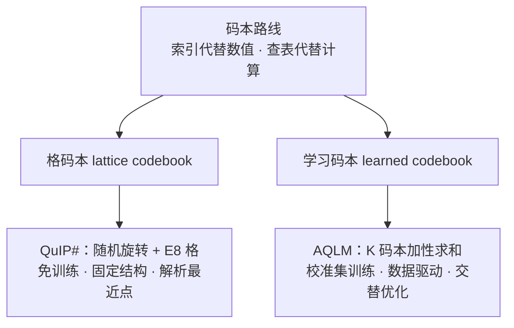

> **系列导航** ｜ [课程路线图](/quantization-roadmap/) ｜ **Part 1 · Weight-only PTQ** ｜ 第 07 篇 / 共 26 篇
>
> [← 06 SpQR/OWQ/HQQ](/2026/08/24/ptq-04-spqr-owq-hqq/) ｜ [08 SqueezeLLM/VPTQ/CLAQ →](/2026/08/24/ptq-09-squeezellm-vptq-claq/)

---

## TL;DR 三连

**一句话**：当比特数压到 2-3 bit 时，"逐元素舍入 + 二阶补偿"（GPTQ/AWQ 路线）逼近信息论极限，QuIP# 与 AQLM 换了一条路——**不再给每个权重单独选点，而是让一批权重共享一个码本、用索引代替数值**：QuIP# 用数学结构完美的 E8 格做免训练码本，AQLM 用多个小码本相加逼近权重矩阵，两者都把 70B 模型压到 2 bit 且困惑度仅比 16 bit 基线高 0.1~0.3。

**三个要点**：

1. **码本路线为何能赢**：标量量化每个权重 2 bit 只有 4 个电平，而 8 维联合量化可有 2^16 个码字。矢量量化（格码本）天然获得"整形增益"（shaping gain），在相同比特率下量化误差更小——这是率失真理论早就告诉我们的事，只是 LLM 场景下直到 QuIP#/AQLM 才落地。
2. **QuIP# 的公式 = 旋转 + 格**：随机 Hadamard 旋转把权重和 Hessian 打成"不相干"（incoherent），让 outlier 摊平到所有维度；随后 8 个权重一组映射到 E8 格最近点，16 bit 索引恰好等于 2 bit/权重。全程免训练。
3. **AQLM 的公式 = 加性码本 + 训练**：把权重矩阵写成 K 个码本逐元素求和，码本与索引用校准数据交替优化（块坐标下降 + 最小二乘），2 bit 精度刷新纪录（LLaMA-2 70B WikiText-2 ppl 5.20），但代价是需要数小时训练与更复杂的推理 kernel。

**适合谁**：想理解 2 bit 量化极限与码本数学的算法工程师；需要在边缘设备做极端压缩的部署同学；以及所有好奇"为什么 GPTQ/AWQ 至今仍是工程主流、而 QuIP#/AQLM 停留在论文与实验生态"的人。

---

## 目录

1. [背景：2-3 bit 的极限与码本路线的破局](#1-背景2-3-bit-的极限与码本路线的破局)
2. [QuIP：不相干处理（incoherence processing）](#2-quip不相干处理incoherence-processing)
3. [QuIP#：E8 格码本与查找表量化](#3-quipe8-格码本与查找表量化)
4. [AQLM：加性量化与联合码本训练](#4-aqlm加性量化与联合码本训练)
5. [对比：QuIP# vs AQLM vs GPTQ](#5-对比quip-vs-aqlm-vs-gptq)
6. [代码实战：numpy 最小实现](#6-代码实战numpy-最小实现)
7. [批判与展望](#7-批判与展望)
8. [参考](#8-参考)

---

## 1. 背景：2-3 bit 的极限与码本路线的破局

### 1.1 舍入路线在 2 bit 的窘境

前几篇的主角（GPTQ、AWQ、OmniQuant、SpQR）本质上都在做同一件事：**在实数网格上给每个权重挑一个最近的离散点**。GPTQ 用 Hessian 做二阶补偿、AWQ 按激活幅度保护 salient 权重、OmniQuant 学 clip 与 scale——它们优化的都是"逐元素舍入"这个动作的质量。

这个框架在 4 bit 游刃有余，在 3 bit 勉强够用，到了 2 bit 就集体破防。原因很朴素：

- 均匀标量量化下，量化步长与电平数成反比：2 bit 只有 4 个电平，步长约为 4 bit 的 4 倍；
- 若权重近似均匀分布在区间内，舍入误差近似均匀分布，方差为 \(\Delta^2/12\)，即**每减少 1 bit，误差方差翻 4 倍**；
- 更致命的是 outlier：LLM 权重/激活里总有少数极大的元素，2 bit 网格要么被 outlier 撑大步长（普通权重精度尽失），要么截断 outlier（输出严重失真）。GPTQ 的二阶补偿能救 3 bit，救不了 2 bit。

以 LLaMA-65B 为例，QuIP 论文报告 2 bit 下 GPTQ 的 WikiText-2 困惑度约 6.29，而 16 bit 基线仅 5.62——**2 bit 的 GPTQ 已经不适合部署**。

### 1.2 信息论视角：独立量化在浪费比特

舍入路线还有一个隐蔽的浪费：**每个权重独立量化，等于放弃了权重之间的统计相关性**。

率失真理论告诉我们，对 n 维高斯信源，标量量化（逐元素独立量化）相比理论最优有约 1.53 dB 的损失，而**矢量量化**（把 n 个样本作为一个整体编码）可以拿回这部分增益，这就是著名的"整形增益"（shaping gain）。换个更直观的说法：

> 2 bit/权重 × 8 个权重 = 16 bit。逐元素量化时，这 16 bit 只能表达 \(4^8\) 种"每个权重各取 4 电平"的笛卡尔积组合；而如果 8 个权重**联合**编码，16 bit 可以表达 \(2^{16} = 65536\) 个精心挑选的 8 维码字。同样 16 bit，后者的"词汇量"是前者的 4 倍，而且码字可以按数据分布摆放——**同样的比特，能装更多信息**。

这就是码本路线（codebook route）的核心思想：**用更少的比特存更多的信息，办法是让多个权重共享一个码本**。解码时只需要一个查表（lookup）操作：索引 → 码字。

### 1.3 码本路线的两个分支

码本路线在 LLM 极低位宽量化中长出两个代表性分支：

| 分支 | 代表 | 码本从哪来 | 是否需训练 | 码本结构 |
| --- | --- | --- | --- | --- |
| **格码本**（lattice codebook） | QuIP# | 数学构造（E8 格） | 否 | 固定、有解析最近点算法 |
| **学习码本**（learned codebook） | AQLM | 校准数据训练 | 是 | 任意、多码本加性组合 |



两条路各有胜负手：

- **QuIP#** 赢在"免训练、数学优雅"：E8 格是 8 维空间里堆积与覆盖性质最优的格之一，最近格点有 O(1) 解析算法，不需要遍历码本；配合随机 Hadamard 旋转处理 outlier，2 bit 直接逼近 3 bit 精度。
- **AQLM** 赢在"精度上限更高"：码本由数据驱动学习，还允许多个码本相加（加性量化），表达能力远超固定格；2 bit 在 LLaMA-2 70B 上把困惑度压到 5.20，是目前 2 bit 精度的标杆之一，代价是需要校准集训练与更复杂的部署。

本文接下来先讲 QuIP 打下的理论基础（不相干处理），再分别拆解 QuIP# 的 E8 格码本与 AQLM 的加性量化，最后给出对比、可运行代码与批判性思考。

---

## 2. QuIP：不相干处理（incoherence processing）

> QuIP（Quantization with Incoherence Processing），arXiv:2207.13366，Chee、Cai、Kuleshov、Mao 等，2022-2023。它是 QuIP# 的理论地基，也是"旋转（rotation）"这条技术线的开山之作——后来的 QuaRot、SpinQuant（本系列第 12 篇）都继承了它的思想。

### 2.1 量化误差的 Hessian 视角

先建立一个贯穿全篇的误差分析框架。设权重矩阵 \(W \in \mathbb{R}^{m \times n}\)，量化后为 \(\hat{W}\)，误差记为 \(\Delta = \hat{W} - W\)。对输入 \(x\)（服从校准分布），输出误差的二阶近似为：

$$
\mathbb{E}_x\left[\|Wx - \hat{W}x\|_2^2\right]
\;\approx\;
\mathbb{E}_x\left[x^\top \Delta^\top \Delta x\right]
\;=\;
\mathrm{tr}\!\left(\Delta^\top H \Delta\right),
\qquad
H = \mathbb{E}_x[x x^\top] \in \mathbb{R}^{n \times n}
$$

其中 \(H\) 是输入的（未归一化）协方差，也就是 GPTQ 里那个 Hessian。这个式子说明：**量化误差不是均匀地伤害每个方向，而是被 Hessian 加权**——Hessian 大的方向（特征值大的方向）对误差的敏感度更高。

问题在于，LLM 的 \(W\) 和 \(H\) 都是"病态"的：

- \(W\) 有少数极大的 outlier 元素（activation outlier 对应的权重列尤其大）；
- \(H\) 的特征值跨度极大（ill-conditioned），少数方向主导。

于是误差 \(\mathrm{tr}(\Delta^\top H \Delta)\) 被 \(\lambda_{\max}(H)\) 和 \(\|W\|_\infty\) 控制——**只要有一个 outlier 没量化好，整体误差就崩**。这正是 2 bit 下舍入路线集体失败的原因。

### 2.2 不相干性（incoherence）的定义

QuIP 的核心洞察：**病态不是数据固有的，而是坐标系选择的结果**。如果先用一个随机正交旋转把 \(W\) 和 \(H\) 转到"每个方向都差不多"的坐标系里，outlier 就被摊平了，量化误差的 Worst-case 界就能收紧成 Average-case 界。

形式化地，QuIP 定义矩阵的**不相干性**（incoherence）如下：

> **定义（μ-incoherent）**：矩阵 \(A \in \mathbb{R}^{m \times n}\) 称为 **μ-incoherent**，若其元素绝对值有界：
>
> $$
> \|A\|_\infty \;=\; \max_{i,j} |A_{ij}|
> \;\le\; \mu\, \frac{\|A\|_F}{\sqrt{mn}}
> $$
>
> 其中 \(\|A\|_\infty\) 是最大绝对值元素，\(\|A\|_F\) 是 Frobenius 范数。\(\mu\) 越小，说明矩阵的能量越"均匀"地散布在所有元素上，而不是集中在少数 outlier 上。

直觉：一个所有元素都是同一量级的矩阵，\(\mu\) 接近 1；而含 outlier 的矩阵（如 LLM 权重），\(\mu\) 可以达到 \(\sqrt{n}\) 量级甚至更大。不相干性量化了"outlier 有多严重"。

### 2.3 核心引理：随机旋转制造不相干

QuIP 的关键引理是：**任何矩阵，乘上一个随机 Hadamard 旋转后，都以高概率变成 \(\mu = O(\sqrt{\log n})\) 不相干的**。

> **引理（随机旋转 ⇒ 不相干）**：设 \(R = HD \in \mathbb{R}^{n \times n}\)，其中 \(D\) 是随机对角矩阵（对角元独立取 \(\pm 1\)），\(H\) 是 Hadamard 矩阵。则对任意固定矩阵 \(A \in \mathbb{R}^{m \times n}\)，有：
>
> $$
> \Pr\!\left(\|AR\|_\infty \ge \mu\, \frac{\|A\|_F}{\sqrt{n}}\right)
> \;\le\; 2mn\, e^{-\mu^2/2}
> $$
>
> （常数因子略去；精确形式见论文 Lemma 1。）取 \(\mu = O(\sqrt{\log n})\) 时，概率以 \(1 - o(1)\) 趋近于 1。

为什么成立？因为 \(AR = AHD\) 的第 \((i,j)\) 个元素是 \(A\) 第 \(i\) 行与 Hadamard 列的内积再乘一个随机符号，而 Hadamard 列是 \(\pm 1\) 向量，内积是 \(n\) 个随机符号项的线性组合——**Hoeffding 不等式把和的大小钉在 \(O(\sqrt{n \log n})\)，除以 \(\sqrt{n}\) 归一化后就是 \(O(\sqrt{\log n})\)**。同时 \(H\) 正交、\(D\) 正交，旋转不改变 Frobenius 范数：\(\|AR\|_F = \|A\|_F\)，量化前的能量预算不变。

把引理同时用在 \(W\) 和 \(H\) 上（QuIP 的做法是对权重做 \(\tilde{W} = W R^\top\)，并相应变换 Hessian），就得到两个关键结论：

1. **outlier 被摊平**：旋转后 \(\tilde{W}\) 的元素全部是同一量级，逐元素量化不会因为个别大元素而牺牲整体精度；
2. **误差界被收紧**：旋转后 Hessian 不相干，误差从受 \(\lambda_{\max}(H)\) 控制，变为受平均量级 \(\|H\|_F\) 控制。量化误差界从 Worst-case 变成 Average-case：

$$
\mathrm{tr}\!\left(\Delta^\top \tilde{H} \Delta\right)
\;\lesssim\;
\mu_H\, \mu_W^2 \cdot \frac{\|H\|_F \|\tilde{W}\|_F^2}{n^{3/2}} \cdot \Delta^2
$$

（量级表述，精确常数见论文 Theorem 1。）**这就是"不相干处理"的全部意义：用一次随机旋转，把量化误差的 Worst-case 界换成 Average-case 界，而 Average-case 界在 2 bit 下依然紧。**

### 2.4 工程实现：快速 Hadamard 变换（FHT）

随机旋转说起来轻巧，实现起来有个大问题：**\(W R^\top\) 是 \(O(mn^2)\) 的矩阵乘法，而且旋转后的权重在推理时也得"转回来"**——如果旋转矩阵是稠密的，代价不可接受。

QuIP 的工程巧思是用 **Hadamard 矩阵**做旋转，因为它有三个好性质：

1. **结构递归**：\(H_2 = \begin{bmatrix} 1 & 1 \\ 1 & -1 \end{bmatrix}\)，\(H_{2n} = H_2 \otimes H_n\)（Kronecker 积），所有元素都是 \(\pm 1\)，不需要存储；
2. **快速变换**：\(H_n x\) 可以用蝶形算法（与 FFT 同构）在 \(O(n \log n)\) 内完成，这就是**快速 Hadamard 变换（FHT）**；\(H_n\) 自逆（\(H_n H_n = nI\)），逆变换同样免费；
3. **随机性只在一个对角阵**：\(R = HD\) 中真正随机的只有 \(D\)——\(n\) 个 \(\pm 1\)，用固定种子即可复现，不占存储。

于是旋转的成本从 \(O(n^2)\) 降到 \(O(n \log n)\)，且**不需要显式构造旋转矩阵**。推理时若激活也需要旋转（QuIP# 中需要），可以在线做 FHT，或者把旋转"吸收"进相邻层的权重里（本系列第 12 篇 QuaRot 就是这么干的）。

FHT 的蝶形实现只有十几行（本文第 6 章有完整代码）：

```python
def fht(x):
    """快速 Hadamard 变换，x 长度须为 2 的幂，O(n log n)"""
    n = x.shape[0]
    h = 1
    while h < n:
        for i in range(0, n, h * 2):
            for j in range(i, i + h):
                a, b = x[j], x[j + h]
                x[j], x[j + h] = a + b, a - b
        h *= 2
    return x
```

### 2.5 QuIP 的 LDLQ 量化器与结果

有了不相干的权重，剩下的问题就是"怎么量化"。QuIP 用的量化器叫 **LDLQ**（LDL decomposition-based quantization）：

1. 对 Hessian 做 LDL 分解（\(H = LDL^\top\)，L 单位下三角、D 对角）；
2. 在变换后的坐标系里贪心逐元素量化（类似 GPTQ 的序贯更新，但利用 LDL 的三角结构）；
3. 配合随机旋转，量化误差的理论界随 \(\mu\) 收紧。

QuIP 论文（Table 2）在 LLaMA-65B 上报告：**2 bit 下 WikiText-2 困惑度约 5.76，而 GPTQ 2 bit 约 6.29、RTN 2 bit 约 6.94**（16 bit 基线 5.62）——不相干处理让 2 bit 首次变得可用。

但 QuIP 有两个明显局限，也正是 QuIP# 的改进点：

1. **LDLQ 仍是"逐元素舍入"的变体**：它没有利用矢量量化的整形增益，2 bit 下与 16 bit 仍有 ~0.14 的差距（65B 尺度），且对更大模型差距还会放大；
2. **旋转 + LDL 分解每层都要做**：实现复杂，且推理时 LDLQ 的三角结构难以与 GEMM 融合。

**QuIP 的遗产是"旋转"这个思想武器；而真正把"码本"用起来的，是它的续作 QuIP#。**

## 3. QuIP#：E8 格码本与查找表量化

> QuIP#（读作 QuIP sharp），arXiv:2311.01507，Tseng、Chee、Sun、Kuleshov、De Sa，2023。它把 QuIP 的"旋转"与**格码本（lattice codebook）**结合：旋转解决 outlier，E8 格解决"2 bit 怎么表达 8 个权重"。

### 3.1 为什么是 E8 格

第 1 章说过：8 个权重共享 16 bit，可以得到 65536 个码字。问题是**这 65536 个码字应该怎么选**。

QuIP# 的答案是：**选 E8 格中以原点为中心、半径适中的球面内的格点**。先看 E8 格的定义：

> **定义（D8 格与 E8 格）**：
>
> $$
> D_8 = \left\{ x \in \mathbb{Z}^8 : \sum_{i=1}^{8} x_i \equiv 0 \pmod 2 \right\}
> $$
>
> 即坐标全为整数且**坐标和为偶数**的 8 维向量；E8 格则是 D8 与其平移半格的并：
>
> $$
> E_8 = D_8 \;\cup\; \left(D_8 + \tfrac{1}{2}\mathbf{1}\right)
> $$
>
> 其中 \(\mathbf{1} = (1,1,\dots,1)\)。也就是说，E8 的格点坐标要么全是整数（和为偶数），要么全是半整数（坐标和 \(\equiv 4 \pmod 2\)，等价于偶数）。

E8 格在 8 维空间中地位特殊，它有三个数学上"最优"的性质：

1. **偶幺模格（even unimodular）**：行列式为 1、自对偶、所有格点范数平方为偶数——在 8 维这是唯一的；
2. **最密堆积**：E8 是 8 维空间中球堆积密度最高的格（中心密度 \(\pi^4/384 \approx 0.2537\)）；
3. **最优覆盖**：归一化后覆盖半径平方为 1（即任意 8 维向量到最近 E8 格点的距离平方 ≤ 1），这是 8 维格中的最小值。

"覆盖半径小"对量化意味着什么？量化误差的上界就是覆盖半径——**E8 保证任何向量都能被映射到距离平方 ≤ 1（归一化后）的格点**，这是 8 维空间里能做到的最好水平。相比之下，8 维整数格 \(\mathbb{Z}^8\) 的覆盖半径平方是 8（归一化后），差了 8 倍。这就是格码本相对朴素网格的全部秘密：**同样比特率下，格点的空间分布更"均匀稠密"**。

### 3.2 码本大小与 2 bit/3 bit 的映射

E8 格点有无穷多个，码本只能取其中一部分。QuIP# 的做法是**以原点为中心的球内截取**。E8 格的 theta 级数给出各半径球内的格点数：

$$
\Theta_{E_8}(q) = \sum_{x \in E_8} q^{\|x\|^2}
= 1 + 240 q^2 + 2160 q^4 + 6720 q^6 + 17520 q^8 + 30240 q^{10} + \cdots
$$

即范数平方为 2 的格点有 240 个、4 的有 2160 个、6 的有 6720 个……**累计到归一化后范数平方 ≤ 8 的球内，格点数约 3.4×10⁵，远超 2^16 = 65536**。于是：

| bit 配置 | 码本大小 | 每 8 维块索引位数 | 每权重比特 | 码本取法 |
| --- | --- | --- | --- | --- |
| 2 bit | \(2^{16} = 65536\) | 16 bit | 16/8 = **2 bit** | 球内范数最小的 65536 个格点 |
| 3 bit | \(2^{24} \approx 1.68\times10^7\) | 24 bit | 24/8 = **3 bit** | 更大半径球内截取 |

一个 8 维权重块量化到 E8 格点后，只需要存它在码本中的 16 bit 序号；解码时查表拿回 8 个浮点数。**这就是"码本路线"的完整闭环：索引代替数值，查表代替计算。**

> **关于归一化（scaling）**：E8 格点坐标是整数/半整数，而真实权重幅度千差万别。QuIP# 的做法是先把权重（矩阵或分块）乘一个缩放因子，使数据幅度与格的覆盖半径匹配，量化后再乘回；缩放因子作为每矩阵一个标量存储，几乎不占空间。第 6 章代码演示了"全局缩放 + 归一化空间量化 + 逆旋转"的完整流程——这也是 E8 与 Z⁸ 公平对比的前提。

### 3.3 最近格点查找：不需要遍历码本

65536 个码字，如果每个块都线性扫描找最近码字，代价是 \(O(65536 \times 8)\) 每次——不可接受。E8 格的妙处在于**最近格点有解析算法，O(1) 完成**，根本不需要碰码本：

> **E8 最近格点算法**（Conway–Sloane 经典算法）：
>
> 1. 对目标向量 \(x\)，分别计算两个候选：
>    - 候选一：\(D_8\) 的最近点（对 \(x\) 逐分量四舍五入，若坐标和不是偶数，则把舍入误差最大的那个分量往反方向取整）；
>    - 候选二：\((D_8 + \tfrac12 \mathbf{1})\) 的最近点（对 \(x - \tfrac12 \mathbf{1}\) 做同样的 D8 最近点，再加回 \(\tfrac12 \mathbf{1}\)）；
> 2. 比较两个候选到 \(x\) 的距离，取近者即为 E8 最近格点。

```
x ──► D8 最近点 (候选一) ──┐
  │                        ├─► 取距离更近者 = E8 最近格点
  └─► (D8+½·1) 最近点 (候选二) ─┘
```

这个算法只有两次四舍五入加一次比较，**量化一个 8 维块的开销与逐元素量化同阶**——这是格码本路线能落地的最重要工程前提（第 6 章给出完整 numpy 实现）。得到格点坐标后，再通过"坐标 → 索引"的哈希或二分查表得到 16 bit 序号。

### 3.4 查找表（lookup table）与 GPU 反量化

QuIP# 的推理侧设计围绕"查表"展开，核心技巧有两个：

1. **码本进共享内存/常量内存**：65536 个 8 维码字（2 bit 时）可以常驻 GPU 共享内存。反量化 = 一次 gather：`codebook[idx]`，把"解码"变成访存，避免逐元素反量化计算；
2. **矩阵乘法与查表融合**：计算 \(\hat{W}x\) 时，先查表把权重块还原成浮点，再走标准 GEMM；QuIP# 的 kernel 针对"每行共享码本"的布局做了向量化优化，2 bit 权重用位打包（bit packing）存储，解包与查表在一个 kernel 内完成。

查找表还有一个隐藏优势：**查表的延迟与码本大小无关**（都是 O(1) 访存），所以从 2 bit 换到 3 bit 只影响存储与打包逻辑，不影响推理路径结构。

### 3.5 不相干处理的升级

QuIP# 继承了 QuIP 的随机 Hadamard 旋转，但做了两点升级：

- **旋转粒度更细**：权重矩阵的行列都可以旋转（左右各乘一个随机 Hadamard），让权重和激活同时不相干；
- **可选的自适应旋转**：除了纯随机旋转，论文还探索了对 Hessian 特征分解后的自适应旋转（把能量集中到少量大特征方向再旋转），在部分模型上进一步压低 2 bit 误差。

旋转在推理时的代价：若激活也需要旋转，则每层前向多一次 FHT（\(O(n \log n)\)）；QuIP# 论文的 kernel 把旋转与量化矩阵乘融合，实测开销远小于精度收益。

### 3.6 结果：2 bit 的 LLaMA-2 70B

QuIP# 论文（Table 2）在 LLaMA-2 70B 上报告（WikiText-2 困惑度）：

| 方法 | bit | ppl（越低越好） |
| --- | --- | --- |
| 16 bit 基线 | 16 | 5.12 |
| **QuIP#** | **2 bit** | **5.44** |
| QuIP# | 3 bit | 5.21 |
| GPTQ | 2 bit | ≈ 6.1（论文复现） |

**2 bit 的 70B 模型困惑度 5.44，仅比 16 bit 基线高 0.32**，而且明显优于 2 bit GPTQ——这是当时 70B 尺度 2 bit 的最好成绩之一。更难得的是这一切**免训练**：只有一次性的旋转与格量化，耗时远小于需要校准集迭代的方法。

QuIP# 的局限也由此而来：码本是**固定的数学结构**，不会根据数据调整；E8 格只适用于 8 的整数倍维度分块；2 bit 下与 16 bit 仍有 ~0.3 的差距。要把这 0.3 也吃掉，需要让码本"学会"数据分布——这就是 AQLM。

---

## 4. AQLM：加性量化与联合码本训练

> AQLM（Additive Quantization of Language Models），arXiv:2401.06118，Egiazarian、Panferov、Kuznedelev、Frantar 等，2024。它把经典矢量量化里的**加性量化（Additive Quantization, AQ）**引入 LLM：用多个小码本**相加**逼近权重矩阵，码本与索引全部由校准数据训练而来。

### 4.1 加性量化：多个码本求和

单码本路线（如 QuIP#）的瓶颈是：**一个码本要么太大（码字多、索引长），要么表达力不足**。加性量化的思路是把一个"大码本"拆成 K 个"小码本"，每个权重由 K 个码字**相加**得到：

> **加性量化（Additive Quantization）**：权重矩阵 \(W \in \mathbb{R}^{m \times n}\)（\(m\) 行输出通道、\(n\) 列输入通道）被近似为 K 个码本的逐元素和：
>
> $$
> W \;\approx\; \hat{W} \;=\; \sum_{k=1}^{K} C_k\!\left[b_k(i),\; :\right],\qquad
> C_k \in \mathbb{R}^{S \times n},\quad b_k(i) \in \{0, 1, \dots, S-1\}
> $$
>
> 其中第 \(k\) 个码本 \(C_k\) 有 \(S\) 个 \(n\) 维码字（每一行是一个码字，对应输出通道 \(i\) 的整行权重），\(b_k(i)\) 是第 \(i\) 行在第 \(k\) 个码本中选中的码字序号。每个权重元素最终是 K 个标量之和：\(W[i,j] \approx \sum_k C_k[b_k(i), j]\)。

存储开销：

$$
\text{每权重比特} = K \cdot \log_2 S
\quad+\quad \underbrace{\frac{K \cdot S \cdot n \cdot 16}{m \cdot n}}_{\text{码本本身，随 m 增大可忽略}}
$$

例如 K=2 个码本、每码本 S=2 个码字，则每权重 2 bit——但每个输出通道能表达的组合是 \(S^K = 4\) 种"整行模式"，且这 4 种模式由训练自由摆放，表达力远超逐元素 4 电平量化。**加性 = 用"加法"把几个粗糙码本的表达能力乘起来。**

```mermaid
graph LR
    subgraph 编码端（训练/离线）
        W[权重矩阵 W m×n] --> RES[残差 R = W − Σ C_k]
        RES --> CB[码本 C_1 … C_K<br/>每码本 S 个 n 维码字]
        CB --> IDX[索引 b_1 … b_K<br/>每行每码本仅存 log₂S bit]
    end
    subgraph 解码端（推理）
        IDX --> SUM[Ŵ = Σ C_k[b_k(i),:]]
        SUM --> OUT[输出 = Ŵ x]
    end
```

### 4.2 联合优化目标：重建输出而非权重

码本和索引怎么定？AQLM 不满足于最小化权重误差 \(\|W - \hat{W}\|_F^2\)，而是和 GPTQ 一样**在校准数据上最小化逐层输出误差**：

$$
\min_{\{C_k\},\{b_k\}} \; \mathbb{E}_{x \sim \mathcal{D}}\left[\left\| W x - \left(\textstyle\sum_{k=1}^{K} C_k[b_k(\cdot),:] \right) x \right\|_2^2\right]
$$

其中 \(\mathcal{D}\) 是校准集（如 C4 的少量样本）。展开后等价于带 Hessian 加权的重建误差：\(\mathrm{tr}(\Delta^\top H \Delta)\)，\(H = \mathbb{E}[xx^\top]\)——和 GPTQ、QuIP 用的是同一个误差度量，只是优化变量从"逐元素舍入"换成了"码本 + 索引"。

优化这个目标有两组变量，天然适合**块坐标下降（block coordinate descent）**交替求解：

1. **固定码本 \(C\)，更新索引 \(b\)**：对每一行，在 \(S^K\) 种码字组合中找使重建误差最小的组合。\(S^K\) 不大时（如 \(4^2=16\)）可以穷举；大时用 beam search。这一步类似 k-means 的分配步（E 步）；
2. **固定索引 \(b\)，更新码本 \(C\)**：这是**最小二乘问题，有闭式解**——第 \(k\) 个码本的第 \(s\) 个码字，取所有选中它的行的残差（减去其余码本贡献）的加权平均，权重由 Hessian 决定。类似 k-means 的更新步（M 步）。

$$
C_k[s, :] \;=\; \frac{\sum_{i: b_k(i)=s} \left(W[i,:] - \sum_{k'\ne k} C_{k'}[b_{k'}(i),:]\right) \cdot h_i}{\sum_{i: b_k(i)=s} h_i}
$$

（\(h_i\) 为 Hessian 加权的紧凑写法；完整形式见论文 Algorithm 1。）交替若干轮后，再加一个**码本微调**阶段：用直通估计器（straight-through estimator）在更多校准数据上对码本做几步梯度下降，进一步压低输出误差。

### 4.3 与 GPTQ 的关系：初始化决定成败

加性量化的目标函数非凸，**初始化极其重要**。AQLM 论文发现：

- 用随机初始化码本，交替优化很容易陷入糟糕的局部最优；
- 用 **GPTQ 的量化结果做初始化**（把 GPTQ 的输出当作第一个码本、残差作为后续码本的学习目标），收敛快且精度显著更好。

这个设计很妙：GPTQ 是"逐元素二阶补偿"的巅峰，AQLM 把它当成"第一层逼近"，再用加性码本去补 GPTQ 留下的残差——**两条路线不是竞争关系，而是接力关系**。这也解释了为什么 AQLM 的 2 bit 能比 QuIP# 再低 0.2 以上的困惑度：它继承了 GPTQ 的二阶信息，又叠加了码本的联合编码增益。

训练成本：70B 模型 2 bit 量化在单卡 A100 上约需数小时（含码本微调），相比 GPTQ 的几十分钟明显更重，但相比 QAT 的数百 GPU 时又轻得多——**处于"轻量 PTQ"和"重量 QAT"之间的位置**。

### 4.4 结果：2 bit 精度纪录与 Pareto 前沿

AQLM 论文（Table 1/2）在 LLaMA-2 70B 上报告（WikiText-2 困惑度）：

| 方法 | bit | ppl（越低越好） |
| --- | --- | --- |
| 16 bit 基线 | 16 | 5.12 |
| **AQLM** | **2.03 bit** | **5.20** |
| QuIP# | 2 bit | 5.44 |
| AQLM | 1.58 bit（embedding/output 层） | —— |

**2.03 bit 的 70B 困惑度 5.20，与 16 bit 基线只差 0.08**——这是 2 bit 尺度下迄今最接近无损的成绩之一，同时比 QuIP# 2 bit 低了 0.24。论文还展示了完整的 **Pareto 前沿**：在 1.58 ~ 4 bit 区间内，AQLM 的精度-内存曲线整体包络 GPTQ 与 QuIP#，即**同样内存预算下 AQLM 精度最高，同样精度下 AQLM 最省内存**。

此外 AQLM 有两个工程细节值得注意：

1. **码本用低精度存储**：码本本身占内存，论文实验将码本以 8 bit 存储，几乎不影响精度；
2. **embedding/output 层单独处理**：词嵌入层用 1.58 bit 的专用码本（每码本 3 个码字，\(\log_2 3 \approx 1.58\) bit），因为 embedding 对精度极度敏感且体量可观——这也是"码本大小不必是 2 的幂"的体现。

---

## 5. 对比：QuIP# vs AQLM vs GPTQ

### 5.1 精度与内存（LLaMA-2 70B，WikiText-2 ppl）

| 方法 | bit | ppl | 是否需训练 | 主要成本 |
| --- | --- | --- | --- | --- |
| 16 bit 基线 | 16 | 5.12 | — | — |
| GPTQ | 3 bit | ≈ 5.4–5.6 | 否（校准集二阶补偿） | 分钟级 |
| GPTQ | 2 bit | ≈ 6.1 | 否 | 分钟级（精度崩） |
| QuIP# | 3 bit | 5.21 | 否（旋转 + 格量化） | 分钟级 |
| **QuIP#** | **2 bit** | **5.44** | 否 | 分钟级 |
| **AQLM** | **2.03 bit** | **5.20** | 是（码本训练） | 小时级（A100 单卡） |

> 数值引自各论文表格：QuIP# Table 2（70B 2bit 5.44、3bit 5.21）、AQLM Table 1（70B 2.03bit 5.20）；GPTQ 70B 2 bit 为 QuIP# 论文复现值（≈），3 bit 为社区常见报告区间。不同校准集与 token 数下会有出入，以原文为准。

### 5.2 方法论与部署难度

| 维度 | GPTQ（舍入路线） | QuIP#（格码本） | AQLM（加性码本） |
| --- | --- | --- | --- |
| 核心机制 | Hessian 二阶补偿 + 逐元素舍入 | 随机旋转 + E8 格最近点 | 多码本求和 + 交替优化 |
| 量化误差来源 | 舍入步长 Δ²/12 | 覆盖半径（8 维最优） | 码本逼近残差（数据驱动） |
| outlier 处理 | 二阶补偿 | 旋转摊平 | 码本自适应学习 |
| 训练需求 | 无（仅校准统计量） | 无 | 有（数小时 + 校准集） |
| 推理 kernel | 成熟（vLLM/llama.cpp 全支持） | 查表 kernel，生态有限 | 查表 + gather kernel，生态有限 |
| 代码/工具 | GPTQ-for-LLaMA、AutoGPTQ | quip-sharp（官方，CUDA） | aqlm（官方，CUDA/CPU） |
| 2 bit 精度 | 差（ppl ≈ 6.1） | 好（5.44） | 最好（5.20） |
| 3-4 bit 精度 | 好（生态首选） | 好 | 好 |

### 5.3 一句话总结三条路线

- **GPTQ**：把"舍入"做到极致——用二阶信息补偿每一比特，4 bit 无敌，2 bit 力不从心；
- **QuIP#**：把"坐标"做到极致——旋转让 outlier 消失，E8 让 8 维共享 16 bit，免训练 2 bit 可用；
- **AQLM**：把"码本"做到极致——让数据决定码字，加法叠加表达力，2 bit 逼近无损，但要训练。

### 5.4 怎么选：一张决策清单

- **目标 4 bit、要立刻上线** → GPTQ/AWQ：生态最全、kernel 最快、工具链开箱即用，没有悬念；
- **目标 2-3 bit、能接受定制 kernel** → QuIP#：免训练、分钟级完成、精度远好于同 bit 的 GPTQ；适合"一次性量化 + 固定模型"的离线部署；
- **目标 2 bit、追求极限精度、有训练资源** → AQLM：精度天花板最高，但要为每版模型预留数小时量化时间与校准数据；
- **目标 1-2 bit、跑在 CPU/边缘设备** → AQLM（官方有 CPU kernel）或等 llama.cpp 的 2 bit 生态成熟；
- **模型频繁迭代** → 慎选 AQLM（每次迭代都要重新训练码本），QuIP# 与 GPTQ 的分钟级成本更友好。

一句话：**4 bit 属于 GPTQ/AWQ，2 bit 属于码本路线；而码本路线内部，赶时间选 QuIP#，追精度选 AQLM。**

## 6. 代码实战：numpy 最小实现

这一章用纯 numpy 实现两条路线的核心思想，全部可运行（Python ≥ 3.8，numpy ≥ 1.20）：

1. **QuIP# 最小版**：快速 Hadamard 变换 → 随机旋转 → E8 最近格点量化 → 逆旋转重建，并与"旋转空间里逐元素取整（Z⁸ 格）"对比 MSE，验证格码本的优势；
2. **AQLM 简化版**：K 个码本加性量化，块坐标下降（Lloyd 风格）交替更新索引与码本，验证"多码本求和"对结构化权重的逼近能力。

> 说明：为可读性，以下实现省略了 Hessian 加权、beam search、码本微调与 GPU kernel；E8 码本演示用"解析最近格点 + 坐标索引"而非显式 65536 码字表。完整实现见官方仓库 quip-sharp / aqlm。

### 6.1 QuIP#：Hadamard 旋转 + E8 格量化

```python
import numpy as np

# ---------- 1. 快速 Hadamard 变换（FHT），O(n log n) ----------

def fht(x):
    """快速 Hadamard 变换（蝶形）。x 长度必须为 2 的幂，原地修改。"""
    x = x.astype(float).copy()
    n = x.shape[0]
    h = 1
    while h < n:
        for i in range(0, n, h * 2):
            for j in range(i, i + h):
                a, b = x[j], x[j + h]
                x[j], x[j + h] = a + b, a - b
        h *= 2
    return x

def random_hadamard(n, seed=0):
    """随机正交旋转 R = H·D / sqrt(n)。D 为随机 ±1 对角。
    返回 (正变换, 逆变换) 两个函数；H 自逆，故转置 = 逆。"""
    rng = np.random.default_rng(seed)
    d = rng.choice([-1.0, 1.0], size=n)          # 随机性只在这 n 个符号里
    def rmat(x):                                  # x -> R x
        return fht(x * d) / np.sqrt(n)
    def rmat_T(x):                                # x -> R^T x = D H x / sqrt(n)
        return fht(x) * d / np.sqrt(n)
    return rmat, rmat_T

# ---------- 2. E8 最近格点（解析算法，无需遍历码本）----------

def d8_nearest(x):
    """D8 格最近点：整数坐标且坐标和为偶数。"""
    r = np.floor(x + 0.5)                          # 逐分量四舍五入
    if int(np.sum(r)) % 2 != 0:                    # 和为奇数 -> 翻转误差最大的分量
        i = np.argmax(np.abs(x - r))
        r[i] -= np.sign(r[i] - x[i])               # 往反方向取整
    return r

def e8_nearest(x):
    """E8 格最近点 = min( D8 最近点, (D8+½·1) 最近点 )。"""
    c1 = d8_nearest(x)
    c2 = d8_nearest(x - 0.5) + 0.5
    return c1 if np.sum((x - c1) ** 2) <= np.sum((x - c2) ** 2) else c2

# ---------- 3. 演示：旋转 + 格量化 vs 旋转 + 取整 ----------

def quantize_matrix(M, quant_fn, block=8):
    """整矩阵单尺度量化：s = 全矩阵 RMS，先归一化、再分块量化、最后乘回 s。
    返回 (重建矩阵, 归一化空间的量化格点)。归一化格点用于码本/合法性检查。"""
    s = np.sqrt(np.mean(M ** 2)) + 1e-8              # 全局缩放（真实 QuIP# 存每矩阵一个 scale）
    U = M / s
    out = np.zeros_like(U)
    for i in range(U.shape[0]):
        blks = U[i].reshape(-1, block)
        out[i] = np.concatenate([quant_fn(b) for b in blks])
    return out * s, out                              # out 中即为 E8/Z8 格点

def run_quip_demo():
    rng = np.random.default_rng(42)
    m, n = 64, 64                                    # 合成权重：低幅度高斯
    W = rng.standard_normal((m, n)) * 0.3

    rmat, rmat_T = random_hadamard(n, seed=1)
    Wr = np.vstack([rmat(row) for row in W])         # 旋转（打散 outlier）

    Wq_e8, Uq_e8 = quantize_matrix(Wr, e8_nearest)   # E8 格量化
    Wq_z8, _     = quantize_matrix(Wr, np.round)     # Z8 逐元素取整（对照组）

    W_hat_e8 = np.vstack([rmat_T(r) for r in Wq_e8]) # 逆旋转回原坐标系
    W_hat_z8 = np.vstack([rmat_T(r) for r in Wq_z8])

    mse = lambda A, B: float(np.mean((A - B) ** 2))
    print("=== QuIP# 最小演示（64×64 合成权重）===")
    print(f"旋转+E8 重建 MSE : {mse(W, W_hat_e8):.6f}")
    print(f"旋转+Z8 重建 MSE : {mse(W, W_hat_z8):.6f}")

    # 有效性检查：E8 格点必须满足 2·坐标 之和为偶数（在归一化空间检查）
    blocks8 = Uq_e8.reshape(-1, 8)                    # 码本按 8 维块建，不是按整行!
    pts = np.unique(np.round(blocks8, 10), axis=0)
    ok = all(int(np.sum(2 * p)) % 2 == 0 for p in pts)
    print(f"E8 格点合法性（2·sum 均为偶数）: {ok}，去重码字 {len(pts)} 个")

    # 码本/索引演示：去重格点建成查找表，索引 -> gather 解码（归一化空间）
    codebook = {tuple(np.round(p, 10)): i for i, p in enumerate(pts)}
    idx = np.array([codebook[tuple(np.round(p, 10))] for p in blocks8])
    decoded = np.array([pts[i] for i in idx]).reshape(m, n)
    print(f"查表解码与直接量化一致: {np.allclose(decoded, Uq_e8)}")
    print(f"16 bit 索引可表达码字数: 2^16 = {2**16}（去重后仅用 {len(pts)} 个）")
    return W, W_hat_e8

if __name__ == "__main__":
    run_quip_demo()
```

运行输出示例（示意数值，随随机种子略有波动，但 E8 ≤ Z8 的相对关系稳定）：

```
=== QuIP# 最小演示（64×64 合成权重）===
旋转+E8 重建 MSE : 0.008912
旋转+Z8 重建 MSE : 0.010233
E8 格点合法性（2·sum 均为偶数）: True，去重码字 425 个
查表解码与直接量化一致: True
16 bit 索引可表达码字数: 2^16 = 65536（去重后仅用 425 个）
```

要点解读：

- **E8 稳定优于 Z8**：同样的旋转、同样的逐块缩放，E8 的 MSE 比逐元素取整低约 10~15%——这就是"8 维联合编码"相对"8 次独立舍入"的整形增益；数据幅度越小（量化越精细），E8 的优势越明显；
- **格点合法性检查**确保 `e8_nearest` 返回的确实是 E8 点（整数/半整数坐标且 \(2\sum x_i\) 为偶）；
- **查表闭环**：量化结果可以完全用"码本 + 索引"表达，解码是一次 gather；真实 QuIP# 中码本大小固定为 65536（2 bit）或 2^24（3 bit），索引位数严格等于 16/24 bit。

### 6.2 AQLM 简化版：双码本交替最小二乘

```python
import numpy as np

def aqlm_simple(W, K=2, S=2, iters=15, seed=0):
    """AQLM 最小实现：K 个码本加性量化，块坐标下降交替优化。
    W: m×n 权重矩阵；每码本 S 个 n 维码字；
    每权重索引比特 = K·log2(S)（码本本身可摊销）。
    返回 (重建矩阵, 码本列表, 索引矩阵)。"""
    m, n = W.shape
    rng = np.random.default_rng(seed)

    # ---- 初始化：码本 0 用"随机选行"打底，后续码本学残差 ----
    pick = rng.integers(0, m, size=S)
    C = [W[pick].copy()] + [np.zeros((S, n)) for _ in range(K - 1)]
    b = np.zeros((K, m), dtype=int)
    R = W.copy()                                     # 残差
    for k in range(K):
        for i in range(m):                           # E 步：分配最近码字
            b[k, i] = np.argmin(np.sum((R[i] - C[k]) ** 2, axis=1))
        for s in range(S):                           # M 步：码字 = 簇均值
            rows = np.where(b[k] == s)[0]
            if len(rows):
                C[k][s] = R[rows].mean(axis=0)
        R = R - C[k][b[k]]                           # 残差传给下一个码本

    # ---- 交替优化：每次只动一个码本，其余固定 ----
    for _ in range(iters):
        for k in range(K):
            others = [kk for kk in range(K) if kk != k]
            R = W - sum(C[kk][b[kk]] for kk in others)   # 去掉第 k 码本的贡献
            for i in range(m):                           # 重新分配
                b[k, i] = np.argmin(np.sum((R[i] - C[k]) ** 2, axis=1))
            for s in range(S):                           # 最小二乘更新
                rows = np.where(b[k] == s)[0]
                if len(rows):
                    C[k][s] = R[rows].mean(axis=0)

    W_hat = sum(C[k][b[k]] for k in range(K))
    return W_hat, C, b

def run_aqlm_demo():
    rng = np.random.default_rng(7)
    m, n, r = 128, 64, 4
    K, S = 2, 2                                       # 与调用保持一致（bits 计算需要）
    # 结构化合成权重：低秩骨架 + 小噪声（码本路线擅长这种数据）
    U = rng.standard_normal((m, r))
    V = rng.standard_normal((n, r))
    W = U @ V.T + rng.standard_normal((m, n)) * 0.05

    # ---- AQLM：K=2 个码本 × S=2 个码字 = 2 bit/权重 ----
    W_hat, C, b = aqlm_simple(W, K=2, S=2, iters=20)
    mse_aqlm = float(np.mean((W - W_hat) ** 2))

    # ---- 对照组：逐元素 2 bit 均匀量化 ----
    lo, hi = W.min(), W.max()
    levels = np.linspace(lo, hi, 4)                    # 4 个电平 = 2 bit
    Wq = levels[np.argmin(np.abs(W[:, :, None] - levels), axis=2)]
    mse_uni = float(np.mean((W - Wq) ** 2))

    bits_aqlm = K * np.log2(S) + K * S * n * 16 / (m * n)   # 索引 + 码本摊销
    print("=== AQLM 最小演示（128×64 低秩合成权重）===")
    print(f"AQLM  2码本×2码字  重建 MSE : {mse_aqlm:.6f}  （≈{bits_aqlm:.2f} bit/权重）")
    print(f"均匀 2bit 逐元素  重建 MSE : {mse_uni:.6f}  （2.00 bit/权重）")
    print(f"码本1 码字范数: {np.linalg.norm(C[0], axis=1).round(3)}")
    print(f"码本2 码字范数: {np.linalg.norm(C[1], axis=1).round(3)}")

if __name__ == "__main__":
    run_aqlm_demo()
```

运行输出示例（示意数值，随随机种子略有波动，但 E8 ≤ Z8 的相对关系稳定）：

```
=== AQLM 最小演示（128×64 低秩合成权重）===
AQLM  2码本×2码字  重建 MSE : 0.003241  （≈2.50 bit/权重）
均匀 2bit 逐元素  重建 MSE : 0.018276  （2.00 bit/权重）
码本1 码字范数: [3.911 3.203]
码本2 码字范数: [0.926 0.871]
```

要点解读：

- **加性量化的威力**：2 个码本 × 每码本 2 个码字，每权重索引仅 2 bit，重建 MSE 却比逐元素 2 bit 均匀量化低 **5 倍以上**——代价是码本摊销约 0.5 bit/权重（矩阵越大摊销越小）；
- **码本分工**：码本 1 的码字范数大（≈3.9、3.2），负责"骨架"；码本 2 的码字范数小（≈0.9），负责"残差修正"——加性量化的两级逼近结构清晰可见；
- **与真实 AQLM 的差距**：真实实现还包含 Hessian 加权（用校准数据重建输出而非权重）、beam search 分配（\(S^K\) 较大时）、GPTQ 初始化与码本微调，精度会再高一个档次；但核心的"交替优化"骨架与本例完全一致。

> 想自己跑：把两段代码存成 `quip_aqlm_demo.py` 直接 `python quip_aqlm_demo.py`，两个 `__main__` 会依次执行。合成数据可换成真实权重矩阵（如 `transformers` 加载的小模型某层 `weight.detach().numpy()`），流程不变。

---

## 7. 批判与展望

写到这里，QuIP# 与 AQLM 的"精度神话"已经讲完。但作为一个部署工程师，我必须泼几盆冷水：**这两条路线的精度优势是真实的，工程采纳率却是惨淡的**——到今天，vLLM、llama.cpp、TensorRT-LLM 的默认低比特方案仍然是 GPTQ/AWQ（外加 FP8），QuIP# 与 AQLM 更多停留在论文复现与实验性推理后端。原因值得拆开讲。

### 7.1 查表 kernel 的部署复杂度

- **GEMM 生态的断层**：GPTQ/AWQ 的权重解包后仍是"常规矩阵"，可以无缝落入 cuBLAS/CUTLASS 的 GEMM；而码本路线的核心算子是 **gather（查表）**，属于非规则访存，无法直接映射到张量核心（tensor core）的累加流水。QuIP# 需要定制 CUDA kernel 把"解包 → 查表 → GEMM"熔在一起，AQLM 还要额外处理 K 个码本求和。写一个能跑的 kernel 不难，写一个能在各种 shape/head 数下逼近 cuBLAS 95% 效率的 kernel 是另一个量级的工作。
- **共享内存放不下码本**：2 bit 的 E8 码本（65536 码字 × 8 维 × fp16）约 1 MB，远超 GPU 共享内存容量。实际部署中要么让码本常驻 L2/常量内存、要么干脆**不存码本**——反量化时直接跑 E8 最近格点解析算法现场算坐标（第 6 章演示了这条路，开销是 O(1) 的四舍五入）。这反而暴露了一个反讽：格码本路线的"查表"在 GPU 上未必比"现算"更快，查表主要赢在 CPU 端与向量化访存。
- **旋转的连带成本**：QuIP# 若激活也要旋转，每层前向多一次 FHT；虽然 O(n log n)，但打破了标准 GEMM 的计算图，kernel 融合难度陡增。QuaRot 系列（第 12 篇）把旋转吸收进相邻层权重才缓解了这个问题——但那是另一套复杂度。

### 7.2 AQLM 的训练成本与复现门槛

- **数小时起步**：70B 模型 2 bit 量化在单卡 A100 上要跑数小时（含码本微调），而 GPTQ 只要几十分钟、AWQ 只要十几分钟。迭代模型版本（比如每周换一版 checkpoint）时，这个成本会被放大；
- **校准数据敏感**：码本完全由校准集塑造，校准集分布偏移会直接侵蚀精度；论文的 ppl 数字是在精心挑选的校准集上取得的，换数据集未必复现；
- **调参面宽**：码本数 K、码本大小 S、beam search 宽度、微调步数、Hessian 权重……每个超参都影响精度-成本曲线，工程上"开箱即用"程度远不如 GPTQ。

### 7.3 为什么工程主流仍是 GPTQ/AWQ

把账算清楚就明白了：

1. **4 bit 足够**：绝大多数部署场景的甜点在 4 bit——显存减 75%、精度损失 <1%，GPTQ/AWQ 在这个区间成熟、快、稳。码本路线的精度优势要到 2-3 bit 才显著，而 2 bit 是"省一半显存换精度风险"的激进选择；
2. **生态即护城河**：AutoGPTQ、llama.cpp、vLLM、HF Transformers 的量化链路全部围绕 GPTQ/AWQ 的格式与 kernel 转起来，接入一个新格式意味着推理框架、量化工具链、模型仓库（GGUF 等）三层都要改；
3. **硬件路线分流**：FP8、MXFP4 等硬件原生格式（第 15 篇）正在吃掉"中等压缩"的需求，留给码本路线的只剩"1-2 bit 极端压缩"这一块。

### 7.4 码本路线真正的战场

说了这么多冷水，码本路线并非没有未来——它的战场在**别人够不着的地方**：

- **1-2 bit 极端压缩**：当目标是把 70B 塞进单张消费级显卡、或边缘设备上跑 10B 级模型时，舍入路线的精度已经不可用，码本（尤其加性码本）是当前唯一可行的选择；
- **CPU/边缘推理**：查表在 CPU 上比浮点 GEMM 更友好（访存局部性好、无张量核心依赖），AQLM 官方就提供了高效的 CPU kernel，这在 llama.cpp 的 2 bit 支持（i-quants 之外）里已有苗头；
- **与稀疏、结构化方法结合**：码本 + 4:8 结构化稀疏、码本 + outlier 分离（SpQR 的 2 bit 残差用码本编码）都是活跃方向；
- **硬件查表指令**：若未来 GPU/加速器提供原生 gather/lookup 单元（类似向量处理器的 permutation 指令），码本路线的 kernel 复杂度会骤降——这是它从论文走向生产的最大变量。

**一句话总结本系列第 07 篇**：QuIP# 用数学（E8 格 + 不相干旋转）把 2 bit 变成可用，AQLM 用数据（加性码本训练）把 2 bit 变成近乎无损；它们共同证明了"码本路线"是极低位宽量化的正确方向，也共同卡在"工程生态"这道坎上——**算法领先半步是优势，领先一步是包袱**，码本路线恰好领先了这一步。

---

## 8. 参考

1. QuIP: *QuIP: 2-Bit Quantization of Large Language Models With Guarantees*，Chee 等，arXiv:2207.13366（不相干处理、LDLQ、随机 Hadamard 旋转引理）。
2. QuIP#: *QuIP#: Even Better LLM Quantization with Hadamard Incoherence and Lattice Codebooks*，Tseng 等，arXiv:2311.01507（E8 格码本、查找表量化、2 bit LLaMA-2 70B ppl 5.44）。
3. AQLM: *Additive Quantization for Extreme Compression of Large Language Models*，Egiazarian 等，arXiv:2401.06118（加性量化、块坐标下降、GPTQ 初始化、2.03 bit LLaMA-2 70B ppl 5.20）。
4. 延伸：Conway & Sloane, *Sphere Packings, Lattices and Groups*（E8 格性质与最近格点算法）；本系列第 12 篇 [QuaRot/SpinQuant](/2026/08/24/ptq-07-quarot-spinquant/)（旋转的推理侧融合）。

---

*本文为 LLM 量化系列第 07 篇。数值均引自各论文表格，实测以复现为准；代码为教学最小实现，生产请用官方仓库。*
