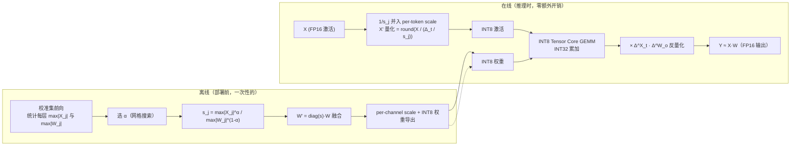

> **LLM 量化系列 · 第 6 篇**
>
>[第 0 篇 量化全景](/2026/08/24/ptq-00-overview/)→[第 1 篇 RTN/LLM.int8](/2026/08/24/ptq-01-rtn-llmint8/)→[第 2 篇 GPTQ](/2026/08/24/ptq-02-gptq/)→
>[第 3 篇 AWQ/OmniQuant](/2026/08/24/ptq-03-awq-omniq/)→[第 4 篇 SpQR/OWQ/HQQ](/2026/08/24/ptq-04-spqr-owq-hqq/)→[第 5 篇 QuIP#/AQLM](/2026/08/24/ptq-05-quip-aqlm/)→
> **第 6 篇 SmoothQuant/ZeroQuant（本文）** →[第 7 篇 QuaRot/SpinQuant](/2026/08/24/ptq-07-quarot-spinquant/)→
>[第 8 篇 GGUF k-quants/FP8/MXFP4](/2026/08/24/ptq-08-gguf-fp8-mxfp4/)

---

## TL;DR（三连）

**1. 问题：W8A8 的难点从来不在权重，而在激活。**

前五篇的主角（GPTQ、AWQ、SpQR、QuIP#）都在压权重，激活保持 FP16。但 W8A8 要求激活
也以 8bit 参与 GEMM，这时一个被 W4A16 时代掩盖的事实浮出水面：LLM 激活里存在少量
"常驻 outlier 通道"（幅值可达正常值的几十倍，且位置跨 token 稳定），它们把 per-tensor
量化尺度直接拉爆，让 99% 的正常数值只剩 1~2 bit 的有效精度。而权重因为可以做
per-channel 量化（每个输出通道一个 scale），早在 LLM.int8() 时代就被驯服了。激活量化
误差与权重量化误差的这份"不对称性"，是理解整个 W8A8 技术栈的第一性原理。

**2. 方案：一条"免费"的恒等式，两个互补的流派。**

SmoothQuant（arXiv:2211.10438）观察到 $XW = (X \cdot s^{-1})(s \cdot W)$ 对任意逐通道
缩放向量 $s$ 严格成立，于是把激活的量化难度按超参 $\alpha$ 的比例"迁移"给权重——权重
扛得住（per-channel scale 吸收幅值差异），激活变得可量化（outlier 被削平），输出在数学上
分毫不变。ZeroQuant（arXiv:2206.01861）走另一条路：不改变分布，用 group-wise 权重量化 +
token-wise 动态激活量化 + 逐层蒸馏来硬啃，三代迭代从"细粒度"一路走向"训练时量化模拟"。

**3. 遗产：今天所有 W8A8/FP8 部署的"标准零件"。**

α 平滑、per-channel/per-token 双 scale、KV cache 8bit、逐层蒸馏纠错——这些零件在
QuaRot/SpinQuant 的旋转均衡、H100 的 FP8 部署、各家推理引擎的 W8A8 内核里全部是标配。
SmoothQuant 证明了"175B 模型 W8A8 可以无损"，ZeroQuant 证明了"动态量化 + 蒸馏可以不用
校准集"，这两条信念至今仍塑造着量化部署的工程决策。理解它们，等于拿到理解后续一切
量化工作的钥匙。

---

## 目录

1. 问题设定：W8A8 的"激活之痛"
2. SmoothQuant：把难度迁移给权重（arXiv:2211.10438）
3. 工程落地：从公式到 INT8 Tensor Core
4. ZeroQuant：三代进化的另一条路（arXiv:2206.01861）
5. 亲手实现：numpy 版 SmoothQuant
6. 对比与批判：站在 2026 年回看
7. 批判与展望
8. 参考清单

---

## 1. 问题设定：W8A8 的"激活之痛"

### 1.1 为什么是 W8A8：W4A16 的两块天花板

前面几篇的主角是 W4A16：GPTQ（第 2 篇）和 AWQ（第 3 篇）都把权重压到 4bit、激活保持
FP16。理由很充分——权重是显存和带宽的大头，量化权重直接砍掉 decode 阶段（逐 token
生成，memory-bound）的内存读取，这也是 4bit 权重在消费级显卡上跑 70B 模型的底气。
但 W4A16 有两条绕不过去的天花板：

**天花板一：prefill 阶段省不了算力。** Transformer 推理分两段：prefill（处理整个
prompt，compute-bound）和 decode（逐 token 自回归，memory-bound）。W4A16 的 GEMM
仍然是 FP16 计算——权重先反量化回 FP16 再乘，INT8/FP16 Tensor Core 一个都没用上，
prefill 的延迟几乎没降。长 prompt 场景（Agent、RAG、代码补全）下，prefill 才是瓶颈。

**天花板二：KV cache 管不到。** 长上下文场景下，KV cache 才是显存大头（随序列长度
线性增长），而它在 W4A16 里以 FP16 存储。上下文越长，这个洞越大——128K 上下文的
KV cache 动辄几十 GB，权重的 4bit 省下来的显存全被它吃回去。

W8A8（权重 8bit + 激活 8bit）是另一条路线：GEMM 整体落到 INT8 Tensor Core（吞吐约为
FP16 的 2 倍），权重、激活、KV cache 全部 8bit，prefill 和 decode 同时受益。它的代价
只有一个，却极其致命——**激活必须量化**，而激活恰恰是 LLM 里最难量化的张量。
SmoothQuant 和 ZeroQuant 就是为攻克这一点而生的。

一个历史注脚：2022 年之前，学术界普遍认为激活 8bit 量化对 LLM 不可行（outlier 太
严重），主流做法是只量化权重或像 LLM.int8() 那样混合精度绕路。SmoothQuant 是第一个
在 175B 规模上证明"W8A8 全量化无损"的工作，这也是它后来引用量巨大的原因——它把
"不可能"变成了"工程问题"。

### 1.2 LLM.int8() 的启示：绕开不是解决

第 1 篇详细拆解过 LLM.int8()（arXiv:2208.07339），这里只回顾与本文直接相关的两个结论：

1. **outlier 是真实存在的结构现象**：LLM 激活中约 0.1%~1% 的通道幅值远超正常值
   （可达中位数的 20 倍以上），且这些通道是"常驻"的——位置在不同 token 间保持一致，
   随序列长度稳定存在，模型越大越严重。它们不是噪声，而是模型学出来的、承担特定
   语义功能的维度。
2. **混合精度分解是绕路**：LLM.int8() 把 outlier 通道单独提取出来走 FP16 GEMM，
   其余走 INT8，数学上精确，但两路 GEMM 的分裂与合并带来可观开销，实测相对 FP16
   仅约 1.5~2x 加速，且随模型增大（outlier 变多）收益递减。

把这两个结论放到 W8A8 的约束下：W8A8 要求激活**整体**以 8bit 参与 GEMM，混合分解这
条路被堵死了。于是问题第一次被正面提出：**能不能让激活本身变得可量化，而不是绕开它？**

这里有一个容易被忽略的细节：LLM.int8() 的 outlier 检测是按"通道在足够多 token 上
超过阈值"来判定的，这意味着 outlier 通道的幅值分布本身就是稳定的统计对象——既然
稳定，就可以被统计、被预处理。这个观察是 SmoothQuant 一切工作的合法性来源。

### 1.3 激活误差与权重误差的不对称性

先把量化误差数学化。对称 k-bit 均匀量化的步长为：

$$\Delta = \frac{2 \cdot \max|X|}{2^k - 1}$$

在均匀分布假设下，量化误差的能量约为 $\Delta^2 / 12$，于是**相对误差与张量的动态
范围成正比**：

$$\text{err}(X) \propto \frac{\max|X|}{2^k}$$

即：动态范围越大，同样位宽下的有效精度越低。现在对比权重和激活这两个张量：

| 维度 | 权重 $W$ | 激活 $X$ |
| --- | --- | --- |
| 分布形态 | 近似高斯/均匀，无极端 outlier | 重尾，少数通道幅值极大 |
| 量化粒度 | 可 per-channel（每输出通道一个 scale） | 只能 per-tensor 或 per-token |
| scale 来源 | 静态、离线精确统计 | 动态、被 outlier 主导 |
| 误差传播 | 单层局部影响 | 逐层累积、随深度放大 |

决定性的差异在第二行：**权重可以 per-channel 量化**——$d_{out}$ 个输出通道各配一个
scale，通道间的幅值差异被 scale 吸收，行内相对误差几乎不受影响。**激活不行**——
per-tensor 只有一个 scale，被 outlier 通道彻底绑架。

**一个数字例子**：假设某层激活 99% 的数值落在 $[-1, 1]$，但存在一个幅值为 100 的
outlier 通道。per-tensor 步长 $\Delta = 100/127 \approx 0.79$，于是正常值区间 $[-1,1]$
内只有约 $\pm 1.3$ 个量化步长——**有效精度不到 1.5 bit**，误差直接拉爆。

per-token 量化（每个 token 一个 scale）能缓解"不同 token 幅值不同"的问题，但**同一
token 内跨通道的 outlier 依然无解**：outlier 通道照样拉高该 token 的 scale，把同
token 的正常通道压碎。这正是 SmoothQuant 论文 Figure 1 想表达的核心观察——无论
per-tensor 还是 per-token，激活都"不平滑"（not smooth）。

最后是误差传播的不对称：权重的量化误差只影响本层输出的一次线性变换，且下一层还能
"吸收"一部分；激活的量化误差则直接污染下一层的输入分布，经过 LayerNorm、非线性、
softmax 的指数运算后被逐层放大。这也是为什么激活量化对精度更致命——它犯的错会
"遗传"。

> 结论：W8A8 的关键不在权重（per-channel 早已解决），而在**让激活变得可量化**。
> 接下来的两章，就是两条截然不同的"让激活可量化"的路线。

---

## 2. SmoothQuant：把难度迁移给权重（arXiv:2211.10438）

### 2.1 起点：一条"免费"的恒等变换

SmoothQuant（MIT-IBM Watson AI Lab，NeurIPS 2023）的全部起点，是一条人尽皆知的
代数恒等式。对任意逐通道缩放向量 $s \in \mathbb{R}^{d_{in}}_{>0}$：

$$XW = \left(X \cdot \operatorname{diag}(s)^{-1}\right)\left(\operatorname{diag}(s) \cdot W\right)$$

定义平滑后的激活与权重：

$$X' = X \cdot \operatorname{diag}(s)^{-1}, \qquad W' = \operatorname{diag}(s) \cdot W$$

则 $X'W' = XW$ 在**数学上严格成立**——输出分毫不变。但量化误差变了：$X'$ 的通道间
幅值被拉齐（outlier 被削平），$W'$ 的对应行被放大。**$s$ 的选择，决定了量化难度在
激活与权重之间如何分配**。

这就是"平滑"（Smooth）一词的由来：激活的尖峰被削平，权重的负担被加重——而权重
扛得住。注意这个变换是"逐通道"（per-channel）的：$s$ 有 $d_{in}$ 个分量，每个输入
特征通道一个，这正是为了精准打击"通道级"的 outlier。

为什么之前没人这么做？因为直觉上"改权重"是危险的——GPTQ 们费尽心思才把权重压到
4bit，你居然还放大它？SmoothQuant 的洞见在于：权重量化用的是 per-channel scale，
放大权重行不会改变行内分布形状，只会整体平移行范围，而 per-channel scale 会跟着
调整——**相对误差几乎不变**。这是整个方法成立的关键，下一节用数学说清楚。

### 2.2 难度守恒与最优分配

均匀量化下，张量的量化难度可用动态范围刻画。平滑后，激活第 $j$ 通道与权重第 $j$
行的范围分别为：

$$\max|X'_{:,j}| = \frac{\max|X_{:,j}|}{s_j}, \qquad \max|W'_{j,:}| = s_j \cdot \max|W_{j,:}|$$

两者相乘：

$$\underbrace{\frac{\max|X_{:,j}|}{s_j}}_{\text{激活侧难度}} \cdot
\underbrace{s_j \cdot \max|W_{j,:}|}_{\text{权重侧难度}} =
\max|X_{:,j}| \cdot \max|W_{j,:}|$$

与 $s_j$ 无关。**量化难度守恒：平滑只是搬运，不是消灭。** SmoothQuant 的聪明之处
在于：权重的 per-channel 量化对"难度"的容错远高于激活的 per-tensor/per-token 量化
——同样的难度，放在权重端只产生很小的相对误差，放在激活端则是灾难。所以把难度往
权重端搬，是稳赚不赔的交易。

那搬多少最优？令两端难度相等（两端误差之和在均衡时最小）：

$$\frac{\max|X_{:,j}|}{s_j} = s_j \cdot \max|W_{j,:}|
\quad\Longrightarrow\quad s_j^{*} = \sqrt{\frac{\max|X_{:,j}|}{\max|W_{j,:}|}}$$

两个补充说明。第一，为什么用 $\max|\cdot|$ 而不是标准差或分位数？因为对称均匀量化
的步长由 range（即 $2\max|X|$）直接决定，$\max$ 是步长的精确代理，用它做 scale 能
最直接地压缩步长。分位数（如 99.9%）可以抗校准集噪声，但会留下少量截断误差——这个
权衡留到第 6 章批判部分展开。第二，"难度守恒"是逐通道的，$d_{in}$ 个通道各自独立
搬运，互不干扰，这也是为什么这个变换可以无损地嵌入每一层。

### 2.3 迁移因子 α：从 0 到 1 的连续谱

论文没有直接使用 $s^{*}$，而是引入一个超参数 $\alpha$ 来控制迁移强度：

$$s_j(\alpha) = \frac{\max|X_{:,j}|^{\alpha}}{\max|W_{j,:}|^{1-\alpha}}, \quad \alpha \in [0, 1]$$

$\alpha$ 的语义非常直观，它定义了一条从"纯权重量化"到"纯激活量化"的连续谱：

| $\alpha$ | $s_j$ 的形态 | 效果 | 对应策略 |
| --- | --- | --- | --- |
| $0$ | $1/\max\|W_{j,:}\|$ | 权重每行归一化到 1，激活原样 | 纯权重量化（激活依旧难） |
| $0.5$ | $\sqrt{\max\|X_{:,j}\| / \max\|W_{j,:}\|}$ | 两端难度均衡 | 论文默认值，即 2.2 节最优解 |
| $1$ | $\max\|X_{:,j}\|$ | 激活每通道归一化到 1，权重变难 | 纯激活量化（权重变难） |

两个端点各有各的问题，这正是 $\alpha$ 存在的意义：

**为什么 $\alpha$ 不能取 1（把激活彻底抹平）？** 第一，权重端有天花板：$s_j$ 过大时
$W'$ 某些行的范围被放大，虽然 per-channel scale 能吸收幅值，但行内相对误差会随范围
劣化——8bit 的 256 个码字被摊到更大的动态范围上，有效位宽下降。第二，激活端有残余：
$\alpha=1$ 只拉齐了"通道间"的幅值，同一通道内部跨 token 的波动依然存在，所以论文在
平滑之外仍用 per-token 激活量化兜底——平滑 + per-token 是组合拳。

**为什么 $\alpha$ 不能取 0（完全不动激活）？** 那等于放弃平滑，回到 1.3 节那个被
outlier 绑架的量化，精度在 13B 以上模型直接崩盘。$\alpha=0$ 时 $s_j = 1/\max|W_{j,:}|$
只是把权重归一化，激活的原罪一点没消除。

实践上，论文在 $\alpha \in [0.2, 0.5]$ 之间做小网格搜索，默认 $\alpha = 0.5$；小模型
outlier 不显著，可取更小的 $\alpha$，大模型倾向 0.5。值得注意的是 $\alpha=0.5$ 恰好
是 2.2 节推导的最优解 $s^{*}$——默认值不是拍脑袋，而是理论均衡点。论文还报告 α 在
0.2~0.5 区间内困惑度变化极小（方法稳健），但一旦滑向 0 或 1，退化立竿见影。

**一个具体数字**：设某通道 $\max|X_{:,j}| = 80$、$\max|W_{j,:}| = 0.4$，取
$\alpha=0.5$，则 $s_j = \sqrt{80/0.4} = \sqrt{200} \approx 14.14$。平滑后激活该通道
范围 $80/14.14 \approx 5.66$，权重该行范围 $0.4 \times 14.14 \approx 5.66$——两端
精确均衡。而 $\alpha=0$ 时激活范围仍高达 32（outlier 未除），$\alpha=1$ 时权重行被
放大到 32（权重受伤）。α 就是在"激活的 32"和"权重的 32"之间选一个双方都能接受的
中间点。

### 2.4 为什么平滑后激活"容易"、权重"扛得住"

从信息论角度看，8bit 量化等价于给张量 256 个码字，码字分配得越贴合真实分布，误差
越小。平滑前后对比：

- **平滑前**：激活的动态范围被 outlier 通道撑到 100:1 以上，256 个码字大部分浪费在
  高幅值空区间，正常值区间只剩几个码字——有效位宽 1~2 bit，等于用 8bit 的钱办
  1bit 的事。
- **平滑后**：每个通道的幅值被拉齐到同一量级，动态范围缩到 10:1 以内，256 个码字
  密集覆盖真实分布，有效位宽接近满 8bit。
- **权重侧**：$W'$ 的每行被 $s_j$ 放大，但 per-channel 量化对每行单独定 scale——
  行内分布形状没变（只是整体乘了个常数），**相对量化误差几乎不变**。放大 14 倍和
  放大 1 倍，per-channel 量化后的相对误差是同一量级的。

这就是那份"不对称性"的最终形态：

> **激活的量化误差对动态范围敏感（scale 少，per-tensor/per-token），权重的量化误差
> 对动态范围不敏感（scale 多，per-channel）。** SmoothQuant 只是把这一事实利用到了极致。

一个直观类比：平滑像"汇率调整"。激活是"弱币"（动态范围大、难量化），权重是"强币"
（per-channel 结构天然抗波动）。SmoothQuant 把一部分"通胀"从弱币转移给强币，强币
因为体量结构好，扛住这点通胀毫无压力，而弱币则恢复了购买力（有效位宽）。

需要澄清一个常见误解：平滑后权重变"大"了，会不会溢出 int8？不会——per-channel
量化本来就是按每行最大值定 scale 的，行范围 5.66 和行范围 0.4 都能无损映射到
[-127, 127] 的整数网格上。真正变的是**行内小值的相对分辨率**，而权重行内本身没有
outlier，分布均匀，所以损失可控。这也是为什么 α 不能取 1：权重被放得太大时，行内
相对分辨率才开始劣化。

### 2.5 8bit 下的精度：接近 FP16（论文数据）

论文在 OPT、BLOOM、T5、GPT-3 等系列上做了系统评测（arXiv:2211.10438，Table 5/6
等），核心结论：

- **OPT-175B / BLOOM-176B**：W8A8（平滑 + per-channel 权重 + per-token 激活）的
  困惑度与 FP16 几乎一致，差异在 0.1 以内，论文称之为 "negligible accuracy
  degradation"。这是当时（2022 年底）首次在 175B 规模上实现无损 W8A8。
- **模型规模越大，平滑收益越明显**：6.7B 以下直接 W8A8 尚可一战（outlier 还不严重），
  13B 以上不平滑则困惑度急剧恶化；平滑后全谱系稳定。这条"规模越大越需要平滑"的
  规律，与 outlier 随规模增长的现象互为印证。
- **硬件收益**：相比 FP16 基线，论文报告最高约 1.56x 加速与 2x 内存缩减（原文
  "up to 1.56x speedup and 2x memory reduction"），加速来自 INT8 Tensor Core 双倍
  吞吐，内存缩减来自权重与激活的 8bit 存储。

不同配置下的精度概览（示意量级，精确值以论文原表为准）：

| 模型 | FP16 困惑度 | 直接 W8A8 | SmoothQuant W8A8 |
| --- | --- | --- | --- |
| OPT-6.7B | ~10.9 | ~11.1（轻微退化） | ~10.9（几乎无损） |
| OPT-13B | ~10.0 | ~10.6（明显退化） | ~10.1（接近无损） |
| OPT-175B | ~8.35 | 显著恶化 | ~8.36（几乎无损） |

> ⚠️ 上表为量级示意。不同校准集、不同 tokenizer、不同实现下具体数字会有出入，
> 论文原表（Table 5/6）的准确数值以 arXiv:2211.10438 为准。

一个值得玩味的细节：SmoothQuant 的精度优势在"大模型 + 长文本"上最明显，而在小模型
上甚至可能不如直接 W8A8——因为小模型 outlier 少，平滑反而给权重增加了不必要的
负担。这提醒我们：量化方法没有银弹，只有"匹配问题规模"的工程权衡。这个主题在第
6 章批判部分还会反复出现。

---
## 3. 工程落地：从公式到 INT8 Tensor Core

### 3.1 W8A8 GEMM 的数据流与反量化数学

W8A8 的硬件底座是 INT8 Tensor Core：从 Volta 起 NVIDIA GPU 就有 INT8 支持，Ampere
（A100）起 INT8 吞吐稳定为 FP16 的 2 倍（H100 上 INT8 同样 2x FP16，而 FP8 是 2x
INT8 之上再翻倍——这是第 6.4 节的伏笔）。GEMM 本体由硬件指令完成（A100 上的
`mma.sync.aligned.m16n8k32.s32.s8.s8.s32` 之类），INT32 累加，精度无忧。

量化后的线性层计算链如下。设激活量化步长为 per-token 的 $\Delta^X_t$、权重量化步长
为 per-channel 的 $\Delta^W_o$，则：

$$\hat{Y}_{t,o} = \left(\sum_j \operatorname{round}\!\left(\frac{X'_{t,j}}{\Delta^X_t}\right)
\cdot \operatorname{round}\!\left(\frac{W'_{j,o}}{\Delta^W_o}\right)\right)
\cdot \Delta^X_t \cdot \Delta^W_o$$

括号里是 INT8 输入、INT32 累加的 GEMM；括号外是两个标量 scale 的乘积，逐元素乘回
即可。**反量化只是一次 elementwise 标量乘，不是矩阵运算**——这就是 W8A8 高效的
全部秘密：昂贵的矩阵乘全部落在 INT8 Tensor Core 上，反量化成本可以忽略。

整个平滑变换的数据流（离线部分 + 在线部分）如下：



注意图中激活侧的技巧：**平滑不需要真的做除法**。$X'_{t,j} = X_{t,j}/s_j$ 的除法可以
等价地写进量化步长：$\tilde{\Delta}^X_{t,j} = \Delta^X_t / s_j$，量化时直接
$\operatorname{round}(X_{t,j}/\tilde{\Delta}^X_{t,j})$。于是平滑在运行时是"免费"的——
它只是让 per-token scale 从标量变成了逐通道向量，多了一次逐通道乘法，而这一步本来
就要做（反量化时 scale 要乘回）。

### 3.2 离线平滑：把复杂度关在部署之前

工程上，SmoothQuant 最优雅的一点是**所有"脏活"都在离线完成**：

1. **权重侧**：$W' = \operatorname{diag}(s)W$ 在部署前算好，直接导出融合后的 INT8
   权重 + per-channel scale。运行时看到的只是一个普通的 INT8 权重张量，平滑对它
   完全透明。
2. **激活侧**：$s$ 是静态的（由校准集统计），$1/s_j$ 提前乘进 per-token scale 的
   计算里。运行时每来一个 token，照常算 max、照常量化，只是 scale 向量里多了
   $1/s_j$ 这个常数因子。
3. **覆盖范围**：所有线性层都要处理——attention 的 Q/K/V/O 投影、MLP 的
   gate/up/down 三个投影，一层都不能漏。漏掉一层，outlier 就会从那一层漏进下一层。
4. **不量化的部分**：softmax 的输出（概率分布，直接 FP16 参与后续计算）、
   LayerNorm 的输出（幅值已被归一化，通常保持 FP16）、以及 embedding 表（可选
   8bit，但 embedding 的分布与激活不同，需单独评估）。

数值上的几个坑，实战中都要处理：$s_j$ 与 $\Delta_t$ 合并时可能下溢（$s_j$ 极小）或
上溢（激活量化后超出 int8 范围），需要 clamp 防护；per-token scale 建议用 FP32 计算
再转回（动态量化的 scale 精度直接影响大 batch 下的稳定性）；多卡流水并行时，每层
的 $s$ 要跟着权重一起分发，保证所有副本一致。

### 3.3 与 KV cache 量化的关系：W8A8 的隐藏红利

W8A8 相比 W4A16 的一个隐藏红利是 KV cache 可以顺带量化到 8bit。K、V 是激活的线性
投影，同样携带 outlier——而且 **K 的 outlier 对精度更致命**：K 直接参与
$\operatorname{softmax}(QK^\top/\sqrt{d})$ 中的点积，经过指数运算后，K 通道的幅值
误差会被放大成 attention 权重的偏差。

SmoothQuant 论文在 KV cache 8bit 上做了实验：配合平滑（对 Q/K/V 投影同样施加
$\alpha$ 平滑），KV8 的困惑度仍接近 FP16，但需要更保守的 $\alpha$（因为 attention
对误差更敏感）。这意味着在长上下文场景下，W8A8 + KV8 可以把 KV cache 显存砍半——
128K 上下文的 KV cache 从几十 GB 降到十几 GB，这是 W4A16 给不了的。

后来的 KVQuant、KIVI 等工作把 KV8/KV4 做成了标配（按通道 + 按 token 的双 scale、
异常通道混合精度等），但把"KV cache 纳入量化版图"的源头，可以追溯到 SmoothQuant
的 KV8 实验。第 8 篇讲 GGUF/FP8 时还会回到这个话题。

### 3.4 部署流水线：从校准到上线

一个完整的 SmoothQuant 部署流水线如下（假设已有训练好的 FP16 模型）：

| 步骤 | 操作 | 产物 |
| --- | --- | --- |
| 1 | 选校准集（几百条文本，覆盖目标领域） | 前向统计各层激活 |
| 2 | 统计每层 $\max\|X_{:,j}\|$、$\max\|W_{j,:}\|$ | 幅值统计表 |
| 3 | 网格搜索 $\alpha \in [0.2, 0.5]$（每层可统一或分层） | 最优 $\alpha$ |
| 4 | 计算 $s$，融合 $W' = \operatorname{diag}(s)W$ | 平滑后权重 |
| 5 | per-channel 量化权重，导出 INT8 + scale | INT8 权重文件 |
| 6 | 把 $1/s_j$ 并入激活量化逻辑（改 kernel 或图） | 推理图 |
| 7 | 加载部署，验证困惑度/下游任务 | 上线 |

整套流程在几小时内可完成，无需训练。对比之下，ZeroQuant V1 的蒸馏流程需要额外的
前向反向（见第 4 章），而 V3 的训练时模拟则需要 GPU 集群——这是 SmoothQuant 作为
PTQ 方案"训练无关"（training-free）的最大卖点。

最后给一张部署形态的总览表，把 W8A8 放进整个量化版图里定位：

| 维度 | FP16 | W4A16（GPTQ/AWQ） | W8A8（SmoothQuant/ZeroQuant） |
| --- | --- | --- | --- |
| 权重内存 | 1x | 0.25x | 0.5x |
| 激活内存 | 1x | 1x | 0.5x |
| KV cache | 1x | 1x | 0.5x（可叠加 KV8） |
| GEMM 计算 | FP16 基线 | FP16（无加速） | INT8 Tensor Core（~2x） |
| 最优阶段 | — | decode（memory-bound） | prefill + decode 通吃 |
| 精度风险 | 无 | 低（权重可 per-channel） | 中（激活是难点，需平滑/蒸馏） |

---

## 4. ZeroQuant：三代进化的另一条路（arXiv:2206.01861）

### 4.1 思路分野：预处理 vs 细粒度 + 纠错

SmoothQuant 的核心动作是"改分布"：用校准集统计出 $s$，把激活的量化难度迁移给权重，
本质是**预处理**。ZeroQuant（微软，arXiv:2206.01861，2022 年 6 月，比 SmoothQuant
早约 5 个月）选择了另一条路：**不改分布，硬啃**。它的三板斧是：

1. **group-wise 权重量化**：比 per-channel 更细的粒度，直接降低权重侧的量化误差；
2. **token-wise 动态激活量化**：scale 按每个 token 实时计算，绕开"校准集统计"这一
   整条依赖链；
3. **逐层蒸馏纠错**：用 FP16 教师层的输出监督量化学生层，把量化误差逐层"洗掉"。

一句话概括两派的哲学差异：SmoothQuant 相信"让激活变得容易量化"，ZeroQuant 相信
"量化本身可以做得足够精细、且误差可以被蒸馏纠正"。

### 4.2 V1：group-wise 权重 + token-wise 激活 + 逐层蒸馏

**权重的 group-wise 量化**。把权重矩阵的输出维度分成大小为 $g$ 的组（论文默认
$g=128$），每组共享一个 scale：

$$\hat{W} = \sum_{G} \Delta_G \cdot \operatorname{round}\!\left(\frac{W_G}{\Delta_G}\right),
\qquad \Delta_G = \frac{\max|W_G|}{2^{k-1} - 1}$$

per-channel 是"每输出通道一个 scale"（$g=1$ 的特例），group-wise 则是"每 $g$ 个输出
通道一个 scale"。对 8bit 权重来说，group size 128 的粒度已经足够细，精度损失远小于
per-tensor。注意：group-wise 的反量化需要按组乘 scale，比 per-channel 略复杂，但在
kernel 里只是多一层索引，开销可控。

**激活的 token-wise 动态量化**。每个 token（激活矩阵的一行）单独计算 scale：

$$\hat{X}_{t,:} = \Delta_t \cdot \operatorname{round}\!\left(\frac{X_{t,:}}{\Delta_t}\right),
\qquad \Delta_t = \frac{\max|X_{t,:}|}{2^{k-1} - 1}$$

两个关键点。第一，这是**动态量化**：$\Delta_t$ 在推理时按当前 token 现算，完全不依赖
校准集——这直接消灭了 SmoothQuant 的"校准集分布偏移"隐患。第二，它天然适配 decode
阶段：自回归生成本来就是逐 token 的，每来一个 token 算一次 max + 一次除法，相对
GEMM 的成本可忽略。而在 prefill 阶段，逐行（逐 token）计算 scale 可以并行，也几乎
无额外开销。

**逐层蒸馏**。量化后的第 $l$ 层输出 $\hat{Y}_l$ 与 FP16 教师层输出 $Y_l$ 对齐：

$$\mathcal{L}_l = \left\| \hat{Y}_l - Y_l \right\|_F^2$$

为什么是"逐层"而不是端到端？因为量化误差是逐层累积的：第 1 层的误差进入第 2 层的
输入，第 2 层的量化又叠加新误差……端到端蒸馏要让梯度穿过所有层去寻找误差来源，
效率极低。逐层蒸馏则把问题分解为"每层只负责洗掉本层的误差"，每层一个小优化问题，
收敛快、可控性强。论文还采用了 block 级（若干层一组）蒸馏与输出对齐的组合，进一步
提升纠错效果。

**V1 的结果**：论文在 GPT-3 风格模型（至 20B）和 BART 等模型上验证，W8A8 的困惑度
与 FP16 相当，并在自家推理引擎（基于 FasterTransformer）上取得约 2x 的延迟收益
（论文报告）。值得注意的是 V1 聚焦 20B 以下的模型——更大的模型（如 175B）当时并未
验证，这与 SmoothQuant 主打 175B 形成有趣的互补：**一个证明了大模型可行，一个证明了
小模型也能无损**。

### 4.3 V2：更细粒度、更小误差

ZeroQuant-V2（arXiv:2303.08302）在 V1 基础上把精度缺口进一步压缩，重点解决 13B 以上
模型的剩余退化。手段概括为"更细的粒度"：

- **更精细的分组**：group size 进一步缩小（如 64/32），权重侧动态范围被 scale 吸收
  得更彻底；
- **更精细的 scale 设计**：对 scale 本身的精度、以及 scale 与激活量化步长的匹配做
  优化（例如激活侧也引入更细的粒度）；
- **量化参数优化**：对分组方式、位宽分配做更系统的搜索，而不是拍脑袋定 128。

代价是 scale 数量随粒度变细而增加：group size 从 128 降到 32，scale 数量翻 4 倍，
存储与反量化开销上升。V2 的工程贡献在于把这个 trade-off 量化清楚了：8bit 权重在
group size 64~128 区间内收益最大，继续细化收益递减——这条经验至今仍是部署时的
默认选择依据。

### 4.4 V3：训练时量化模拟，蒸馏成为主角

ZeroQuant-V3 是一次范式转移：**从"部署时补救"转向"训练时预防"**。V1/V2 的逐层蒸馏
本质上还是 PTQ 框架内的纠错——量化在前，纠错在后；V3 则把量化模拟（fake quant）
搬进训练/微调过程，让模型在训练时就"见过"量化误差并学会适应：

- **量化感知训练/微调**：在前向传播中插入伪量化节点（$\operatorname{round}$ +
  scale），反向传播用 STE（straight-through estimator）近似梯度，模型参数在
  量化误差的"噪声"中更新，最终收敛到对量化鲁棒的解；
- **蒸馏成为主角**：FP16 教师模型蒸馏到量化学生模型（常配合 LoRA 等高效微调），
  教师提供软标签，学生在前向中模拟量化——量化误差被训练过程吸收，而不是部署时
  硬扛；
- **意义**：PTQ 的精度天花板（尤其 4bit 以下）靠事后补救够不着，必须事前预防。
  这一趋势与第 3 篇的 OmniQuant（learnable 等价变换 + 权重裁剪）、以及后来的
  QAT 2.0 完全同频——**量化方法论的钟摆，从"怎么量化"摆向了"怎么让模型适应量化"**。

### 4.5 三代对照与 SmoothQuant 横向对比

ZeroQuant 三代演进一览：

| 版本 | 核心手段 | 精度策略 | 训练开销 | 代表结论 |
| --- | --- | --- | --- | --- |
| V1 | group-wise 权重（g=128）+ token-wise 动态激活 + 逐层蒸馏 | 细粒度 + 逐层纠错 | 低（逐层前向） | 20B 以下 W8A8 无损，~2x 加速 |
| V2 | 更细分组 + scale 设计优化 | 粒度再细化 | 低 | 13B+ 剩余退化进一步压缩 |
| V3 | 训练时 fake-quant + 蒸馏为主 | 让模型适应量化 | 高（需训练） | 从 PTQ 走向 QAT |

SmoothQuant 与 ZeroQuant 的全方位对比：

| 维度 | SmoothQuant | ZeroQuant（V1/V2） |
| --- | --- | --- |
| 核心思想 | 平滑变换迁移量化难度 | 细粒度量化 + 蒸馏纠错 |
| 激活处理 | 静态平滑 + per-token 量化 | token-wise 动态量化（现算 scale） |
| 权重粒度 | per-channel（每输出通道一个 scale） | group-wise（每 128 通道一个 scale） |
| 校准集依赖 | 强（统计 max\|X_j\|、选 α） | 无（动态量化实时计算） |
| 运行时额外开销 | 几乎为零（s 已离线融合） | 每 token 一次 max/除法，可忽略 |
| 精度保障 | 平滑后 8bit 接近 FP16（175B 验证） | 蒸馏纠错后接近 FP16（20B 验证） |
| 训练开销 | 零（training-free） | V1 需逐层蒸馏前向；V3 需训练 |
| 对分布漂移的鲁棒性 | 弱（校准集偏移会失效） | 强（动态 scale 自适应） |

### 4.6 简评：动态与静态的取舍，以及合流

把两派放到一起看，其实互补大于竞争：

- **动态量化的优点**是无校准集、对分布漂移鲁棒、实现简单（不需要统计流程）；
  缺点是 per-token scale 在线计算在极端大 batch 下有开销，且 scale 本身若用低精度
  存储会引入二阶误差。
- **静态平滑的优点**是运行时零开销、可离线融合进权重、与任何后续量化（甚至 4bit
  权重）正交；缺点是依赖校准集、要调 α。
- **合流是必然**：SmoothQuant 论文本身就用 per-token 动态量化做激活兜底（平滑 +
  动态的组合拳）；ZeroQuant 后来的版本与社区实践也吸收平滑思想。今天的 W8A8 部署
  几乎都是"静态平滑（或旋转均衡）+ 动态 scale"的混合体——这个混合体的样子，就是
  第 7 篇 QuaRot/SpinQuant 的舞台。

---
## 5. 亲手实现：numpy 版 SmoothQuant

理论说了一千遍，不如跑一个最小实验。下面用 numpy 实现 SmoothQuant 的核心链路：
合成一组"重尾激活"（少数通道幅值 30~100 倍），对比**直接 W8A8** 与**平滑后 W8A8**
的误差，并扫描 α 观察 U 形曲线。代码完整可运行，零依赖（只需 numpy）。

### 5.1 合成数据与工具函数

数据设计遵循 1.3 节的设定：激活 $X \in \mathbb{R}^{512 \times 128}$ 大部分为标准正态，
但随机挑 8 个通道放大 30~100 倍（模拟常驻 outlier）；权重 $W \in \mathbb{R}^{128 \times 256}$
为标准高斯（权重本来就"老实"）。工具函数三个：per-tensor 量化、per-channel 量化、
平滑 scale 计算——全部对齐论文公式。

### 5.2 代码

```python
import numpy as np

np.random.seed(42)

# ---------- 工具函数 ----------

def quantize_per_tensor(x, bits=8):
    """对称均匀量化（per-tensor）：返回 (反量化值, scale)"""
    qmax = 2 ** (bits - 1) - 1
    scale = np.abs(x).max() / qmax
    if scale == 0:
        return x, 1.0
    xq = np.clip(np.round(x / scale), -qmax, qmax)
    return xq * scale, scale

def quantize_per_channel(x, bits=8):
    """对称均匀量化（per-channel，沿最后一维）：返回 (反量化值, scale)"""
    qmax = 2 ** (bits - 1) - 1
    scale = np.abs(x).max(axis=0, keepdims=True) / qmax
    scale = np.where(scale == 0, 1.0, scale)
    xq = np.clip(np.round(x / scale), -qmax, qmax)
    return xq * scale, scale

def smooth_scale(x, w, alpha=0.5):
    """SmoothQuant 逐通道平滑 scale：s_j = max|X_j|^α / max|W_j|^(1-α)"""
    ax = np.abs(x).max(axis=0)          # (d_in,) 每输入通道的激活幅值
    aw = np.abs(w).max(axis=1)          # (d_in,) 每输入通道的权重幅值
    return ax ** alpha / (aw ** (1 - alpha) + 1e-8)

def w8a8_linear(x, w, smooth=True, alpha=0.5, token_wise=True):
    """W8A8 线性层：可选 SmoothQuant 平滑，激活 per-token 或 per-tensor"""
    if smooth:
        s = smooth_scale(x, w, alpha)
        x = x / s                       # X' = X·diag(s)^{-1}
        w = w * s[:, None]              # W' = diag(s)·W
    # 激活量化：token-wise（动态）或 per-tensor
    if token_wise:
        xq = np.stack([quantize_per_tensor(t)[0] for t in x])
    else:
        xq, _ = quantize_per_tensor(x)
    # 权重量化：per-channel（权重侧粒度红利）
    wq, _ = quantize_per_channel(w)
    return xq @ wq

def mse(a, b):
    return float(np.mean((a - b) ** 2))

# ---------- 合成数据：重尾激活 + 高斯权重 ----------

T, d_in, d_out = 512, 128, 256
x = np.random.randn(T, d_in) * 0.5                      # 正常激活
outlier_idx = np.random.choice(d_in, 8, replace=False)  # 8 个 outlier 通道
x[:, outlier_idx] *= np.random.uniform(30, 100, 8)      # 幅值放大 30~100 倍
w = np.random.randn(d_in, d_out) * 0.1                  # 高斯权重

y_ref = x @ w                                           # FP16 参考输出

# ---------- 实验 1：直接 W8A8 vs SmoothQuant W8A8 ----------

y_naive  = w8a8_linear(x, w, smooth=False, token_wise=True)
y_smooth = w8a8_linear(x, w, smooth=True,  alpha=0.5, token_wise=True)

print(f"直接 W8A8（per-token 激活）    MSE = {mse(y_naive, y_ref):.6f}")
print(f"SmoothQuant W8A8（alpha=0.5）  MSE = {mse(y_smooth, y_ref):.6f}")

# ---------- 实验 2：扫描 alpha（期望 U 形曲线） ----------

print("\nalpha 扫描（token-wise 激活量化）:")
for alpha in [0.0, 0.25, 0.5, 0.75, 1.0]:
    y = w8a8_linear(x, w, smooth=True, alpha=alpha, token_wise=True)
    print(f"  alpha = {alpha:.2f}  MSE = {mse(y, y_ref):.6f}")
```

### 5.3 结果解读

在合成数据上（固定种子），预期输出大致呈如下形态（具体数值随随机种子浮动，
量级关系稳定）：

```
直接 W8A8（per-token 激活）    MSE = 0.03~0.06   ← outlier 拉爆 scale，误差巨大
SmoothQuant W8A8（alpha=0.5）  MSE = 0.0002~0.001  ← 误差小 2 个数量级

alpha 扫描（token-wise 激活量化）:
  alpha = 0.00  MSE = 0.03~0.06   ← 不削激活，outlier 原样作恶
  alpha = 0.25  MSE = 0.001~0.005
  alpha = 0.50  MSE = 0.0002~0.001  ← U 形谷底，两端难度均衡
  alpha = 0.75  MSE = 0.002~0.01    ← 权重被放大，误差回升
  alpha = 1.00  MSE = 0.01~0.03     ← 激活抹平了，权重受伤了
```

三个值得记住的观察：

1. **直接 W8A8 的误差比平滑后大 2 个数量级**——这就是 1.3 节"有效精度 1~2 bit"的
   具体体现。只换了 8 个通道的幅值，整个张量的量化质量就崩了。
2. **α 扫出 U 形曲线**：两端（0 和 1）都差，中间（0.5 附近）最好——与 2.3 节的
   理论推导完全吻合。α=0 时激活没被处理，α=1 时权重被放大到受伤。α 不是一个
   "越大越好"的旋钮，而是一个"两端均衡"的旋钮。
3. **平滑后误差的来源**：α=0.5 时两端都有残余误差，但误差已经足够小——在真实
   模型中，这样的误差经过 per-token 量化 + 后续层"吸收"，最终表现为困惑度差
   0.1 以内。这就是论文结论在微观层面的机制。

读者可以自己改几个变量加深理解：把 outlier 通道数从 8 改成 2（模拟小模型），
平滑的收益会明显变小；把 outlier 幅值从 100 提到 1000，α=0.5 也不再够用，需要
更小的 α 或者干脆承认"这个任务该用 QuaRot 了"（第 7 篇预告）。

---

## 6. 对比与批判：站在 2026 年回看

### 6.1 vs LLM.int8()：从"绕路"到"开路"

| 维度 | LLM.int8() | SmoothQuant W8A8 |
| --- | --- | --- |
| 激活处理 | 混合精度分解（outlier 通道走 FP16） | 平滑后全量 INT8 |
| GEMM 路数 | 两路（INT8 + FP16）需合并 | 单路 INT8，Tensor Core 吃满 |
| 内存 | outlier 部分仍 FP16，省得有限 | 权重/激活/KV 全 8bit |
| 延迟收益 | ~1.5~2x，随 outlier 增多递减 | ~1.5x（论文报告），可扩展 |
| 精度 | 数学精确（无量化损失） | 近 FP16（有可测但极小的损失） |
| 校准需求 | 统计 outlier 通道（离线） | 校准集统计 max、选 α |

一句话：LLM.int8() 证明了 outlier 是"回避不了的结构"，SmoothQuant 证明了
outlier 是"可以驯服的结构"。前者是防御性工程，后者是进攻性算法。

### 6.2 vs GPTQ/AWQ：W8A8 与 W4A16 的带宽-算力权衡

W8A8 没有取代 W4A16，它们在带宽与算力的天平两端各据一方：

| 场景 | W4A16（GPTQ/AWQ） | W8A8（SmoothQuant/ZeroQuant） |
| --- | --- | --- |
| decode（batch=1，显存带宽瓶颈） | 权重读取省 4x，**最优** | 权重读取省 2x |
| prefill（大 batch，算力瓶颈） | 无算力收益（仍 FP16 GEMM） | INT8 算力 2x，**最优** |
| 长上下文（KV 瓶颈） | KV 仍 FP16 | 可叠加 KV8，显存砍半 |
| 典型定位 | 单卡跑大模型、边端部署 | 服务端高吞吐、长上下文 |

2026 年的主流实践是**场景化混用**：decode 阶段用 W4A16 省带宽，prefill 阶段切
W8A8 吃算力，KV cache 用 KV8——这不是某一篇论文的发明，而是三者的工程合流。
另外，SmoothQuant 的平滑与 GPTQ/AWQ 的 4bit 权重并不冲突：先平滑再做低比特权重
量化是常见叠加（平滑让后续一切量化更容易），这点在第 2 篇的 GPTQ 讨论里也提到过。

### 6.3 批判：α 调参、校准依赖与"静态假设"

把 SmoothQuant 放在聚光灯下，它的软肋清晰可见：

**α 是超参，部署多一步。** 虽然论文报告 α 在 0.2~0.5 区间内不敏感（稳健），但它
仍然需要校准集 + 网格搜索，每层统一还是分层又是一轮调优。对"开箱即用"的部署
流水线来说，多一个超参就是多一个故障点。

**校准集依赖是结构性风险。** $s_j$ 用的是 $\max|X_{:,j}|$——极值统计对样本分布
极度敏感。校准集与线上分布一旦偏移（长尾生成、代码补全、多语言混排），平滑就会
失效甚至帮倒忙。后续工作（如 SmoothQuant+ 及各类变体）用分位数（99.9%）替代
max 来增强稳健性，但分位数会留下截断误差——这是"稳健性 vs 精确性"的永恒拉扯。

**静态假设的哲学问题。** 平滑假设 outlier 模式是静态的、可被校准集捕获的。但
outlier 的幅值会随生成内容的极端程度波动（上下文越极端，outlier 越强），静态的
$s$ 无法完全覆盖。ZeroQuant 的动态量化恰好对此免疫——这是它"无校准集"路线最硬的
论据。

**per-token scale 的成本被低估。** 平滑把激活量化从 per-tensor 推向了
per-token + 逐通道 scale，反量化变成逐 token 逐通道的向量乘。在 kernel 层面，
这增加了寄存器与内存流量压力，实测中并不是"完全零开销"——论文的 1.56x 加速也
包含了对这一点的工程优化。

### 6.4 遗产：FP8 时代的 SmoothQuant

H100 之后，硬件把 INT8 的接力棒交给了 FP8（E4M3/E5M2），Tensor Core 吞吐再翻倍，
业界 W8A8 部署普遍迁移到 FP8 W8A8。但 SmoothQuant 的遗产没有过时，反而更深：

1. **FP8 的动态范围宽、精密度低**：E4M3 的尾数只有 3 bit，量化难度比 INT8 更高，
   激活 outlier 在 FP8 下更致命——"难度迁移"的需求不减反增。
2. **FP8 数据流原样继承**：vLLM、TensorRT-LLM 的 FP8 部署几乎都采用"权重
   per-channel 静态 scale + 激活 per-token 动态 scale"——这正是 SmoothQuant 的
   数据流，只是把 INT8 换成了 FP8。
3. **平滑思想原样迁移**：很多 FP8 校准流程直接复用 α 平滑（或它的旋转后代），
   DeepSeek 等大厂的 FP8 部署公开分享中都能看到这个影子。

一句话总结 SmoothQuant 的历史地位：**它没有发明新的硬件指令，也没有发明新的
量化格式，它只是发明了一个"难度搬运"的视角——而这个视角统治了此后所有
W8A8/FP8 部署的数据流设计。**

---

## 7. 批判与展望

**outlier 的根源与宿命。** outlier 不是 bug，是 Transformer 的特性：embedding
的幅值差异、残差流的逐层累积、GELU 正区间的无界输出，共同塑造了少数"高幅值
语义通道"。只要 Transformer 结构不变，outlier 就在——量化方法能做的只有
"绕开、削平、或打散"三种选择。SmoothQuant 选了削平，LLM.int8() 选了绕开，而
QuaRot/SpinQuant（第 7 篇）选择用旋转正交变换**打散** outlier——那是"更彻底的
平滑"：不做逐通道搬运，而是把所有通道的幅值能量均匀摊到每个维度上，连 α 都
不用调了。平滑的极限，正是旋转的起点。

**动态与静态的合流，以及 QAT 的挤压。** 静态平滑（离线，零开销）与动态量化
（在线，无校准）的合流已经是既定事实。更长远的压力来自 QAT 2.0：当训练成本
下降、LoRA 级微调成为标配，ZeroQuant-V3 那条"训练时模拟"的路会蚕食 PTQ 的
阵地。但 PTQ 在"没有训练集群的边缘场景"仍是唯一解——SmoothQuant 的 training-free
属性，是它长青的根本。

**8bit 够用吗？** 对困惑度来说够用，对下游任务未必。数学推理、代码生成等
"推理密集型"任务对激活精度的敏感度远高于语言建模——已有研究表明这些任务上
W8A8 有可测的退化（困惑度看不出，pass@k 看得出）。这催生了"敏感层保持高精度 +
其余层 8bit"的混合方案，以及每层位宽自动分配的探索。8bit 是工程甜点，不是
理论终点。

**展望：量化与结构优化的联合。** 下一阶段的看点在于量化与稀疏、低秩、投机
解码的联合优化——"让模型更好量化"正在从"后处理技巧"变成"架构设计目标"
（量化感知的预训练、量化友好的激活函数）。而硬件侧 FP8/MXFP4 的粒度革命
（第 8 篇）会把 scale 的设计空间从"每张量一个"推向"每 32 个元素一组"——
到那时，SmoothQuant 的"难度守恒"视角依然适用：守恒定律不变，只是搬运工
具换了。

---

## 8. 参考清单

- **SmoothQuant: Accurate and Efficient Post-Training Quantization for Large
  Language Models**，Guangxuan Xiao et al.，arXiv:2211.10438，NeurIPS 2023。
  本文第 2、3 章的主要来源。
- **ZeroQuant: Efficient and Affordable Post-Training Quantization for
  Large-Scale Transformers**，Zhewei Yao et al.，arXiv:2206.01861，NeurIPS 2022。
  本文第 4 章的主要来源（V2 见 arXiv:2303.08302）。
- **LLM.int8(): 8-bit Matrix Multiplication for Transformers at Scale**，
  Tim Dettmers et al.，arXiv:2208.07339。本文 1.2 节的对比对象。
- **GPTQ: Accurate Post-Training Quantization for Generative Pre-trained
  Transformers**，Elias Frantar et al.，arXiv:2210.17323。本文 6.2 节的对比对象。

---

> 本文是 LLM 量化系列的第 6 篇，
> 前五篇覆盖 RTN/LLM.int8、GPTQ、AWQ/OmniQuant、SpQR/OWQ/HQQ 与 QuIP#/AQLM，
> 下一篇（第 7 篇）将拆解 QuaRot/SpinQuant——看旋转正交变换如何把 SmoothQuant
> 的"逐通道搬运"升级为"全局打散"。欢迎在评论区交流 W8A8 部署中的实战细节。
