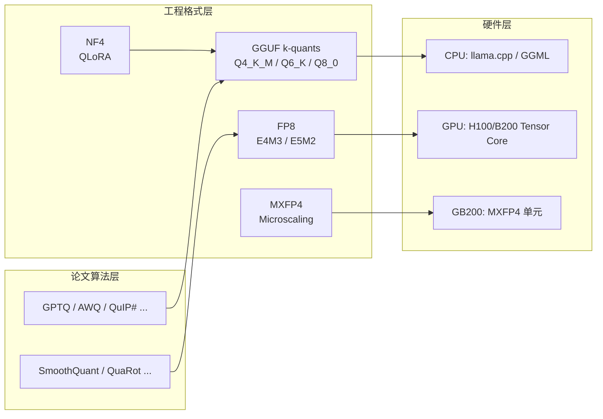

> **系列导航** ｜ [课程路线图](/quantization-roadmap/) ｜ **Part 3 · 格式与部署** ｜ 第 15 篇 / 共 26 篇
>
> [← 14 OliVe](/2026/08/24/ptq-12-olive-abfloat/) ｜ [16 QServe/QQQ →](/2026/08/24/ptq-13-qserve-qqq/)
>
> 前七篇我们讨论的都是「算法」：GPTQ 的 Hessian 逆、AWQ 的激活感知、QuaRot 的旋转不变性……这一篇我们要换一个视角——**从算法回到工程与硬件**。因为 2026 年的现实是：绝大多数生产环境里的模型，跑的不是论文里的算法，而是 **GGUF 容器里的 k-quants**、**H100 上的 FP8**、以及正在爬坡的 **MXFP4**。格式即生态，生态即事实。

---

## TL;DR（三连）

1. **k-quants 是「组合方案」的巅峰实践**：llama.cpp 不追求每个权重都用同一个 bit 数，而是把 super-block 拆成「重要行用 6-bit、其余用 4-bit」的混合结构，配合 imatrix 的二阶信息校准，在 CPU 上以极低成本逼近 16-bit 精度。Q4_K_M 至今仍是本地推理的「默认答案」。

2. **FP8 是「训练推理一体化」的格式**：E4M3（前向/推理）与 E5M2（反向/梯度）的互补设计，加上 H100 起的原生 Tensor Core 支持，让 FP8 成为数据中心的事实标准——DeepSeek-V3 的 671B MoE 全程 FP8 训练/推理就是最硬的行业证据。FP8 的本质是：**用接近 INT8 的硬件效率，拿到接近 BF16 的动态范围**。

3. **MXFP4 是「硬件预埋的下一代」**：32 个 FP4 尾数共享一个 E8M0 的 block scale，用「每块缩放」解决 FP4 动态范围不足的致命伤；Blackwell GB200 已原生支持。而 NF4 则从**分位数**角度给出了 4-bit 的精度上限——它不追求硬件友好，只追求**信息论最优**。四者合在一起，正好构成 2026 年量化格式的完整光谱：**工程最优（k-quants）、硬件最优（FP8）、未来最优（MXFP4）、信息论最优（NF4）**。

---

## 目录

- [1. 引子：为什么收尾篇要讲「格式」](#1-引子为什么收尾篇要讲格式)
- [2. GGUF 与 llama.cpp：CPU 推理生态的容器革命](#2-gguf-与-llamacppcpu-推理生态的容器革命)
  - [2.1 llama.cpp：从「跑通」到「跑快」](#21-llamacpp从跑通到跑快)
  - [2.2 GGUF 容器：元数据驱动的自描述格式](#22-gguf-容器元数据驱动的自描述格式)
  - [2.3 为什么 GGUF 能赢下开源推理生态](#23-为什么-gguf-能赢下开源推理生态)
- [3. k-quants：组合式量化的工程巅峰](#3-k-quants组合式量化的工程巅峰)
  - [3.1 命名规则解析：Q4_K_M 到底是什么意思](#31-命名规则解析q4_k_m-到底是什么意思)
  - [3.2 super-block 结构：32×4 里的 6-bit 与 4-bit 混排](#32-super-block-结构324-里的-6-bit-与-4-bit-混排)
  - [3.3 为什么是「组合」而不是统一 bit 数](#33-为什么是组合而不是统一-bit-数)
  - [3.4 imatrix：用二阶信息校准量化](#34-imatrix用二阶信息校准量化)
  - [3.5 k-quants 家族全景：bits/weight 与实测困惑度](#35-k-quants-家族全景bitsweight-与实测困惑度)
- [4. FP8：数据中心的事实标准](#4-fp8数据中心的事实标准)
  - [4.1 E4M3 与 E5M2：两种 8-bit 浮点](#41-e4m3-与-e5m2两种-8-bit-浮点)
  - [4.2 FP8 vs BF16/FP16/INT8：精度-范围-效率三角](#42-fp8-vs-bf16fp16int8精度-范围-效率三角)
  - [4.3 为什么 FP8 适合权重+激活同时量化](#43-为什么-fp8-适合权重激活同时量化)
  - [4.4 硬件支持与行业实践：从 H100 到 DeepSeek-V3](#44-硬件支持与行业实践从-h100-到-deepseek-v3)
- [5. MXFP4：Microscaling 与硬件预埋的未来](#5-mxfp4microscaling-与硬件预埋的未来)
  - [5.1 Microscaling 的数学定义：block scale + FP4 尾数](#51-microscaling-的数学定义block-scale--fp4-尾数)
  - [5.2 为什么共享 scale 能救 FP4](#52-为什么共享-scale-能救-fp4)
  - [5.3 MXFP4 vs INT4：高斯分布 vs 均匀分布](#53-mxfp4-vs-int4高斯分布-vs-均匀分布)
  - [5.4 Blackwell 的 MXFP4 与 INT4 取舍](#54-blackwell-的-mxfp4-与-int4-取舍)
- [6. NF4：从分位数出发的 4-bit 精度上限](#6-nf4从分位数出发的-4-bit-精度上限)
  - [6.1 分位数量化的数学](#61-分位数量化的数学)
  - [6.2 NF4 码本构造：double quant 与 8 个分位点](#62-nf4-码本构造double-quant-与-8-个分位点)
  - [6.3 NF4 的历史地位：QLoRA 的基石](#63-nf4-的历史地位qlora-的基石)
- [7. 五格式对比总表](#7-五格式对比总表)
- [8. 代码：三个最小可运行实现](#8-代码三个最小可运行实现)
  - [8.1 k-quants 组合 super-block 量化（简化版）](#81-k-quants-组合-super-block-量化简化版)
  - [8.2 FP8 E4M3 编解码](#82-fp8-e4m3-编解码)
  - [8.3 MXFP4 block-scale 编码](#83-mxfp4-block-scale-编码)
- [9. 批判与展望：格式大战的终局](#9-批判与展望格式大战的终局)
  - [9.1 2026 年视角：三足鼎立](#91-2026-年视角三足鼎立)
  - [9.2 硬件格式对算法的反噬](#92-硬件格式对算法的反噬)
  - [9.3 给读者的路线图](#93-给读者的路线图)
- [参考](#参考)

---

## 1. 引子：为什么收尾篇要讲「格式」

量化研究有一个「看不见的尽头」：当算法精度收敛到差不多的时候，决定胜负的就不再是**损失函数**，而是**格式**——bit 怎么排布、scale 放哪里、硬件认不认。

回看这个系列：

- 第 E1 篇 RTN/LLM.int8 解决「离群值」；
- 第 2、3 篇 GPTQ/AWQ 解决「误差补偿」；
- 第 07 篇 QuIP#/AQLM 解决「格点与码本」；
- 第 12 篇 QuaRot/SpinQuant 解决「激活分布」……

这些算法最终都要**落到某种具体的存储与计算格式**上。而一旦落到格式，就进入了另一个维度的博弈：CPU 的 cache line 宽度、GPU 的 Tensor Core 数据通路、容器的兼容性、社区的惯性。**算法论文可以天马行空，生产格式必须脚踏实地。**

2026 年的格局大致是这样的：



**这张图就是本篇的骨架**：算法层向上供给思想，格式层负责落地，硬件层决定生死。我们要讲的，就是中间这一层——**工程生态与硬件格式的量化**。

一个值得先记住的论断：**在 2026 年，`llama.cpp` 的下载量级是千万级，`GGUF` 是开源模型分发的事实容器；`FP8` 是数据中心训练/推理的事实精度；`MXFP4` 是下一代硬件预埋的接口；`NF4` 是单卡微调（QLoRA）的默认 4-bit 格式。** 理解这四者，才算真正理解「量化在生产里长什么样」。

---

## 2. GGUF 与 llama.cpp：CPU 推理生态的容器革命

### 2.1 llama.cpp：从「跑通」到「跑快」

llama.cpp 的历史几乎就是开源 LLM 推理的历史。2023 年 3 月，Georgi Gerganov 发布这个项目时，它的目标只有一个：**让 LLaMA 在普通消费级 CPU 上跑起来**。彼时 GPU 推理被 NVIDIA 生态垄断，而 llama.cpp 用纯 C/C++、无外部依赖、MMAP 文件映射的方式，把「本地跑大模型」变成了任何一台笔记本都能做的事。

它成功的三个技术支点：

1. **GGML 张量库**：一套为量化矩阵乘法量身定制的基础库。它不做通用 BLAS 的「面面俱到」，而是把 `quantize → dequantize → dot product` 这条链路做到极致，针对 x86 的 AVX2/AVX-512、ARM 的 NEON、Apple Silicon 的 Accelerate 都写了手工优化内核。

2. **量化优先的设计哲学**：llama.cpp 从第一天就把「4-bit 跑得动」当作第一性需求。CPU 的内存带宽是瓶颈（权重要一遍遍从 RAM 读进 cache），所以**权重越小、速度越快**——这跟 GPU 上「计算瓶颈、权重大小次要」的直觉完全相反。量化在 llama.cpp 里不是「省内存的选项」，而是「提速度的引擎」。

3. **单文件、零依赖、随处可跑**：一个可执行文件 + 一个 GGUF 模型文件，就能在任何 Linux/macOS/Windows 机器上跑起来。这种「绿色软件」式的分发方式，极大降低了使用门槛。

> **工程视角**：llama.cpp 的成功本质上是**「内存带宽瓶颈」与「量化格式」的精确匹配**。CPU 推理的 token 生成速度 ≈ 内存带宽 ÷ 每 token 读取的字节数。把权重从 16-bit 压到 4-bit，速度理论上提升 4 倍——这是任何算法技巧都给不了的红利。

### 2.2 GGUF 容器：元数据驱动的自描述格式

GGUF（GPT-Generated Unified Format）是 llama.cpp 生态的模型容器格式，2023 年 8 月取代了此前的 GGML 格式。它的核心设计是**自描述（self-describing）**：模型文件里不仅存权重，还存完整的元数据，任何加载器拿到文件就能知道「这是什么模型、什么架构、怎么量化、词表多大」。

GGUF 的文件结构（简化）：

```
GGUF 文件布局
┌─────────────────────────────┐
│ 魔数: 0x46554747 ("GGUF")   │
│ 版本号: 3                   │
│ tensor 数量 / 元数据 KV 数量 │
├─────────────────────────────┤
│ 元数据 KV 区（自描述）        │
│  general.architecture=llama │
│  llama.vocab_size=32000     │
│  llama.block_count=32       │
│  quantization_version=2     │
│  ...                        │
├─────────────────────────────┤
│ 张量信息区（名称/形状/偏移）  │
│  token_embd.weight          │
│  blk.0.attn_q.weight        │
│  blk.0.attn_k.weight        │
│  ...                        │
├─────────────────────────────┤
│ 张量数据区（MMAP 顺序排列）   │
│  [对齐填充][tensor 0 数据]   │
│  [对齐填充][tensor 1 数据]   │
│  ...                        │
└─────────────────────────────┘
```

关键设计决策：

- **MMAP 友好**：张量数据按文件偏移直接映射进内存，加载几乎零拷贝。量化权重在磁盘上的布局就是内存中的布局，`mmap` 之后可以直接按块读取计算，启动时间从「秒级」降到「毫秒级」。
- **KV 元数据可扩展**：任何新特性（新量化格式、新架构字段）都可以通过新增 KV 实现向后兼容。旧版加载器读到未知 KV 会跳过而不是报错——这是它能长期演进的工程基础。
- **对齐与填充**：每个张量按 32 字节（SIMD 友好）对齐，量化块（block）的边界与 cache line 对齐，保证手工内核能以最小代价读取。

GGUF 的量化信息存在**张量级别的元数据**里：每个张量（如 `blk.0.attn_q.weight`）都标注了自己的量化类型（`Q4_K_M`、`Q6_K`、`Q8_0` 等）。这意味着**同一个模型文件里可以混合多种量化类型**——这正是 k-quants「组合方案」的容器基础。

### 2.3 为什么 GGUF 能赢下开源推理生态

GGUF 不是唯一的模型分发格式，但它赢下了开源生态。原因有三：

1. **与量化深度绑定**：HuggingFace 的 `safetensors` 是「通用张量容器」，本身不管量化；GGUF 则是「为量化推理而生」——量化格式、block 布局、内核选择全部内建。**格式与执行引擎（llama.cpp）同源**，不存在「格式支持了但跑不快」的割裂。

2. **社区飞轮**：HuggingFace 的 GGUF 转换工具链（`convert_hf_to_gguf.py`）、llama.cpp 的 `llama-quantize` 工具、以及 Ollama/LM Studio/Jan 等桌面应用全部围绕 GGUF 构建。**分发、量化、加载、推理形成完整闭环**，任何一个新模型发布，几小时内就会出现全系列 GGUF 量化版本。

3. **CPU 优先的普适性**：在 GPU 稀缺的绝大多数场景（个人电脑、边缘设备、企业内网），CPU 推理是唯一现实选择，而 GGUF + k-quants 是 CPU 推理的事实标准。它不跟 CUDA 生态竞争，而是**在 CUDA 到不了的地方建立了自己的王国**。

> **一句话总结**：GGUF 赢在「**量化格式 + 容器格式 + 执行引擎三位一体**」。它不是一个「文件格式」，而是一整套围绕 CPU 推理的工程生态。理解了这一点，才能理解为什么 k-quants 的每个 bit 设计都如此讲究——因为在这套生态里，**bit 就是速度，bit 就是内存，bit 就是用户体验**。

## 3. k-quants：组合式量化的工程巅峰

### 3.1 命名规则解析：Q4_K_M 到底是什么意思

llama.cpp 的量化命名是一套「自解释」的系统，拆开 `Q4_K_M` 这个名字：

| 部分 | 含义 |
|------|------|
| `Q` | Quantized（量化） |
| `4` | 基础位宽：**4-bit**（大多数权重用 4-bit 存储） |
| `K` | **K-quant**：组合式方案（部分行用更高精度，见 3.2） |
| `_M` | 变体后缀：`_S`（Small，小模型/激进）、`_M`（Medium，中等/均衡）、`_L`（Large，大模型/保守） |

对应地，`Q6_K` 表示「6-bit 基础 + K 组合」，`Q8_0` 表示「8-bit 统一量化、无组合」（`_0` 指 0 个特殊处理，即纯均匀量化）。

命名背后的设计哲学：**`_S`/`_M`/`_L` 不是「质量」标签，而是「模型规模适配」标签**。llama.cpp 作者（社区称其为 ik_llama）在发布 k-quants 时给出的经验法则是：

- 小模型（≤7B）：用 `_S` 或 `_M`，因为小模型参数量少、对量化更敏感，需要把省下的 bit 留给注意力层；
- 中等模型（7B-30B）：用 `_M`，均衡；
- 大模型（≥30B）：用 `_L`，因为大模型有冗余，可以更激进地压低非关键层。

> **关键认知**：k-quants 的「K」代表的是**按行（per-row）的精度分配策略**，而不是简单的统一位宽。这是它区别于 GPTQ group 方案（按列分组共享 scale）的本质所在——我们会在 3.3 详细对比。

### 3.2 super-block 结构：32×4 里的 6-bit 与 4-bit 混排

k-quants 的核心数据结构是 **super-block**。以 Q4_K 为例，一个 super-block 包含 256 个权重（即 32 行 × 8 列，对应一个 32×8 的权重块），内部结构如下：

```
Q4_K super-block（256 个权重 = 32 行 × 8 列）
┌─────────────────────────────────────────────┐
│ Block 0（32 个权重，第 0 行）                │
│   ┌───────────────────────────────────────┐ │
│   │ 6-bit 量化（16 个权重 × 6bit = 96bit） │ │  ← 重要行
│   │ scale: 6bit 尾数 + 共用高阶 scale      │ │
│   └───────────────────────────────────────┘ │
│ Block 1（32 个权重，第 1 行）                │
│   ┌───────────────────────────────────────┐ │
│   │ 4-bit 量化（16 个权重 × 4bit = 64bit） │ │  ← 普通行
│   └───────────────────────────────────────┘ │
│ ...（共 8 个 block，每个 32 权重）           │
│ super-block 级共享：                        │
│   - 16 个 6-bit 的 block scale（每 block 一个）│
│   - 16 个 4-bit 的 block scale              │
│   - 1 个 super-scale（6-bit）               │
└─────────────────────────────────────────────┘
```

具体到 Q4_K 的 bit 账本（每个 super-block 256 权重）：

- **16 个 block（每 block 16 个权重）用 4-bit**：16 × 16 × 4 = 1024 bit
- **16 个 block（每 block 16 个权重）用 6-bit**：16 × 16 × 6 = 1536 bit
- **scale 开销**：16 个 6-bit scale + 16 个 6-bit scale + 1 个 6-bit super-scale ≈ 198 bit（含对齐）
- **总计** ≈ 2758 bit / 256 权重 ≈ **4.375 bit/weight**（Q4_K 的标称值，Q4_K_M 在此基础上按层微调）

而 Q5_K 则是 8 个 block 用 5-bit、8 个 block 用 6-bit（外加 16 个 5-bit scale），Q6_K 是全部 block 用 6-bit（无组合、纯 6-bit 均匀）。**越往高位走，组合的「高低搭配」比例越向高精度倾斜**，直到 Q8_0 完全退化为统一 8-bit。

为什么 block 大小是 16 个权重？这跟 CPU 的 SIMD 有关：16 个 4-bit 权重正好是 64 bit（一个 AVX2 寄存器宽度），解包后点积可以在寄存器内完成，**避免跨 cache line 的随机访问**。工程细节决定格式细节，这是 k-quants 最典型的特征。

### 3.3 为什么是「组合」而不是统一 bit 数

这是 k-quants 最深刻的设计决策。要理解它，先看一个反例：**如果全用统一 4-bit（如 Q4_0），那么「重要」和「不重要」的权重付出同样的存储成本**。但权重矩阵的每一行（对应一个输出神经元）重要性差异巨大：

- 注意力层的 `q/k/v` 投影：每一行对应一个注意力头的一个维度，**行间重要性高度不均**；
- 某些行承载「少数关键特征」（如句法功能词、数字、代词相关），误差会被下游放大；
- 大部分行是冗余的，4-bit 足够，甚至 3-bit 都行。

统一 bit 数的问题在于：**要么为保护少数重要行而整体升位（浪费），要么为省 bit 而牺牲重要行（掉精度）**。组合方案则精确地「把好钢用在刀刃上」：

$$
\min_{\hat{W}} \; \sum_{i \in \text{important rows}} (W_i - \hat{W}_i)^2 \cdot w_i + \sum_{j \in \text{other rows}} (W_j - \hat{W}_j)^2
$$

其中重要行用 6-bit（误差 $\propto 2^{-6}$ 量级），普通行用 4-bit（误差 $\propto 2^{-4}$ 量级）。**同样的总 bit 预算下，组合方案的误差分布更优**——因为误差的平方项意味着「把误差从重要行挪到不重要行」是净赚的。

这与 GPTQ 的差异值得专门说明：

| 维度 | GPTQ（group 方案） | k-quants（组合方案） |
|------|-------------------|---------------------|
| 分组方式 | 按**列**（输出通道）分组，每组共享 scale/zero-point | 按**行**（super-block 内）分配不同位宽 |
| 精度分配 | 所有组同一位宽（如 4-bit），靠 group size 控制 scale 粒度 | **不同行不同位宽**（4/5/6-bit 混排） |
| 误差控制 | 靠 Hessian 加权逐列补偿（二阶） | 靠 imatrix 加权 + 位宽分配（二阶，见 3.4） |
| 硬件取向 | GPU 友好（group 对齐 Tensor Core） | CPU 友好（super-block 对齐 SIMD） |
| 校准开销 | 需要少量校准数据 + 逐列求解 | 只需统计 imatrix（前向一次） |

**一句话**：GPTQ 是「同一位宽、不同 scale 粒度」的**列级**方案，k-quants 是「不同位宽、块级共享」的**行级**方案。前者服务 GPU 的 GEMM 结构，后者服务 CPU 的内存带宽与 SIMD 结构。**格式跟着硬件走**，这是贯穿本篇的核心线索。

### 3.4 imatrix：用二阶信息校准量化

k-quants 的校准工具叫 **imatrix（importance matrix，重要性矩阵）**，由社区开发者（主要是 ik_llama 与 mobertz）引入。它的思想与 GPTQ 的 Hessian 加权一脉相承，但实现轻量得多。

**数学定义**：对校准数据集跑一次前向，收集每个权重 $W_i$ 的「重要性」$I_i$，然后量化时最小化**加权重建误差**：

$$
\min_{\hat{W}} \; \sum_{i} I_i \cdot (W_i - \hat{W}_i)^2
$$

$I_i$ 如何得到？实践中用**激活的二阶统计量近似**。设某层输入激活为 $X \in \mathbb{R}^{n \times d}$（$n$ 为 token 数），则：

$$
I \approx \mathbb{E}_x \left[ \left( \frac{\partial L}{\partial W} \right)^2 \right] \approx \frac{1}{n} \sum_{t=1}^{n} (x_t \cdot \delta_t)^2
$$

其中 $\delta_t$ 是损失对层输出的梯度。更常用的轻量近似是直接用**激活平方的滑动平均**：

$$
I_j = \frac{1}{n} \sum_{t=1}^{n} x_{t,j}^2 \quad (\text{对权重矩阵的第 } j \text{ 列/行})
$$

这本质上是 Fisher 信息矩阵的对角近似：$I \approx \text{diag}\left( \mathbb{E}[\nabla_W L \cdot \nabla_W L^\top] \right)$。GPTQ 用完整的 Hessian 逆 $H^{-1}$ 做逐列补偿，imatrix 只取对角——**精度略逊，但成本从「逐列 Cholesky 求解」降到「一次前向统计」**，对 CPU 生态完全够用。

**工程流程**：

1. 用一段代表性文本（几百 MB 到几 GB，通常来自与目标任务同分布的数据）跑一次前向；
2. 逐层累积「激活 × 梯度」的平方统计，得到每个权重的 $I_i$；
3. 量化时：**先按 $I_i$ 决定行级位宽分配**（重要行 6-bit），再做块内 scale 求解时用 $I_i$ 加权最小二乘；
4. 产出 `imatrix.dat` 文件，可复用于同一模型的多次量化。

> **实践要点**：imatrix 的质量直接决定 k-quants 的最终精度。社区经验：**校准数据要与推理目标分布匹配**（代码模型用代码语料、中文模型用中文语料），且规模不能太小（建议 ≥ 1M token）。用错分布的 imatrix 甚至比不用还差——这是「校准数据分布漂移」问题在 CPU 生态的翻版，和第 05 篇 AWQ 里讨论的校准集敏感性同源。

### 3.5 k-quants 家族全景：bits/weight 与实测困惑度

下表汇总 llama.cpp 主流 k-quants 的位宽与社区实测精度（基于 LLaMA-2 7B 的 WikiText-2 困惑度，数值为社区近似值，不同模型/校准集会有波动；越低越好）：

| 格式 | bits/weight | 结构要点 | WikiText-2 ppl（7B，社区实测≈） | 相对 FP16 的 ppl 增量 |
|------|:-----------:|----------|:-------------------------------:|:---------------------:|
| FP16 | 16.0 | 基线 | 5.47 | — |
| Q8_0 | 8.5 | 统一 8-bit，无组合 | 5.53 | +0.06 |
| Q6_K | 6.6 | 全 6-bit + block scale | 5.56 | +0.09 |
| Q5_K_M | 5.7 | 5/6-bit 组合 | 5.62 | +0.15 |
| Q5_K_S | 5.5 | 5-bit 为主 | 5.65 | +0.18 |
| Q4_K_M | 4.8 | 4/6-bit 组合（imatrix） | 5.70 | +0.23 |
| Q4_K_S | 4.6 | 4/6-bit 组合（激进） | 5.78 | +0.31 |
| Q3_K_M | 3.9 | 3/4/6-bit 组合 | 6.08 | +0.61 |
| Q2_K | 2.7 | 2/3/6-bit 组合 | 6.85 | +1.38 |

**读表结论**：

1. **Q4_K_M 是「甜点」**：ppl 只涨 0.23，但显存/内存占用只有 FP16 的 30%。这就是它成为社区默认的原因——**每 0.01 ppl 的边际成本最低**。
2. **Q8_0 到 Q6_K 的差距极小**：6-bit 以上，k-quants 的误差已经接近量化噪声下限，再往上提位宽收益递减。
3. **Q3_K 以下急剧劣化**：2-3-bit 组合虽然能塞进极小内存，但 ppl 劣化超过 0.6，只适合「能跑就行」的极限场景。
4. 组合方案的价值在低位宽区间体现得最充分：Q4_K_M 用 4.8 bit 拿到接近 Q5 的精度，**「K」字头的每一分设计都在低位宽区间回本**。

> **工程经验**：llama.cpp 的 `llama-quantize` 支持 `--imatrix` 参数，官方建议生产部署一律使用 imatrix 校准的 Q4_K_M/Q5_K_M。而 GGUF 的「混合张量类型」能力允许**注意力层用 Q6_K、FFN 层用 Q4_K_M**——这是组合思想从 block 级延伸到 layer 级的自然结果。

---

## 4. FP8：数据中心的事实标准

如果说 k-quants 是 CPU 生态的答案，那 FP8 就是 GPU 数据中心的答案。2022 年 9 月，NVIDIA、ARM、Intel 联合发表《FP8 Formats for Deep Learning》（arXiv:2209.05433），定义了两种 8-bit 浮点格式，从此改变了大规模训练与推理的精度格局。

### 4.1 E4M3 与 E5M2：两种 8-bit 浮点

FP8 不是一种格式，而是**两种互补的格式**：

| 格式 | 指数位 | 尾数位 | 符号位 | 最大有限值 | 最小正规值 | 精度（相对） |
|------|:------:|:------:|:------:|:----------:|:----------:|:------------:|
| **E4M3** | 4 | 3 | 1 | 448 | $2^{-6}$ | $2^{-3}$（~12.5%） |
| **E5M2** | 5 | 2 | 1 | 57344 | $2^{-14}$ | $2^{-2}$（~25%） |

数学定义（以 E4M3 为例）：

$$
\text{E4M3}(s, e, m) = (-1)^s \cdot 2^{e - 7} \cdot (1 + m / 8), \quad e \in [0, 15], \; m \in [0, 7]
$$

其中**隐含位（implicit leading 1）**与 FP16/BF16 一致；E4M3 的指数偏置为 7（对应 4 位指数的 $-2^{3}+1$ 到 $2^3-1$ 范围），E5M2 的指数偏置为 15。两种格式都支持 NaN 与 Inf 的专用编码（E4M3 用 `e=15, m=7` 表示 NaN/Inf，E5M2 用 `e=31`）。

**为什么要两种格式？** 这是 FP8 论文最核心的洞察——**前向与反向对「范围」和「精度」的需求不同**：

- **前向（激活 + 权重）**：值分布相对集中（权重通常 $\mathcal{N}(0, \sigma^2)$ 且 $\sigma$ 不大），更需要**精度** → **E4M3**（3 位尾数，精度翻倍）；
- **反向（梯度）**：梯度分布**动态范围极大**（跨多个数量级，小梯度与大梯度并存），更需要**范围** → **E5M2**（5 位指数，范围扩大 128 倍）。

这一设计直接复用了 FP16（精度型）与 BF16（范围型）的分工哲学，只是把位宽砍到 8-bit。

### 4.2 FP8 vs BF16/FP16/INT8：精度-范围-效率三角

把 FP8 放进精度-范围-效率的三角里对比：

| 格式 | 位宽 | 动态范围（数量级） | 尾数精度（bit） | 相对 FP32 硬件吞吐 | 典型用途 |
|------|:----:|:------------------:|:---------------:|:------------------:|----------|
| FP32 | 32 | ~80 | 23 | 1× | 训练主精度 |
| FP16 | 16 | ~10 | 10 | 2× | 混合精度训练 |
| BF16 | 16 | ~80 | 7 | 2× | 训练主精度（范围优先） |
| **E4M3** | 8 | ~4 | 3 | 4× | 前向：激活+权重 |
| **E5M2** | 8 | ~30 | 2 | 4× | 反向：梯度 |
| INT8 | 8 | ~2（均匀） | 8（均匀） | 4× | 推理（需 scale 校准） |

三个关键观察：

1. **INT8 的精度其实是「假 8-bit」**：INT8 的 8 bit 全是尾数（均匀量化），但**动态范围只有 scale 覆盖的那一段**。一旦数值超出 $[-\text{scale} \cdot 127, \text{scale} \cdot 127]$ 就饱和。FP8 用 3-5 个 bit 换指数，**牺牲均匀精度换取跨数量级的范围**。
2. **E4M3 的「有效精度」≈ INT8 的 60-70%**：对权重这种高斯分布，E4M3 在 $[0.5, 2]$ 区间内相对精度 $2^{-3}$，与 INT8 的 $2^{-8}$ 有差距，但**对离群值的鲁棒性远超 INT8**——不需要 per-tensor 的精细 scale 校准。
3. **BF16 是 FP8 的「光谱邻居」**：BF16 用 7 位尾数保精度，FP8-E5M2 用 5 位指数保范围。两者都服务于「大动态范围」场景，FP8 是 BF16 的位宽减半版。

> **本质**：FP8 的胜利不是「8-bit 精度超过了 INT8」，而是「**在 8-bit 的预算内，把动态范围做到接近 BF16**」。对于训练（梯度跨数量级）和激活量化（离群值），范围比均匀精度更值钱——这就是 FP8 存在的全部理由。

### 4.3 为什么 FP8 适合权重+激活同时量化

回顾本系列第 10 篇 SmoothQuant 的核心困难：**激活的离群值让 INT8 激活量化必须做通道级 scale**（per-channel 或 per-token），否则误差爆炸。FP8 天然缓解这个问题：

**FP8 激活量化的容错机制**：设激活 $x$ 服从带离群值的分布，INT8 需要先估计全局 scale $s$，离群值直接饱和截断；FP8 则把每个数编码为 $2^{e} \cdot (1 + m/8)$——**离群值只是指数变大，尾数精度略微下降，不会截断**。对 E4M3：

$$
\text{FP8}(x) = x \cdot (1 + \epsilon), \quad |\epsilon| \le 2^{-4} \text{（相对误差上界）}
$$

相对误差**与 $x$ 的大小无关**（浮点的相对误差恒定），而 INT8 的绝对误差恒定、相对误差随 $|x|$ 减小而爆炸。这一性质对**权重和激活同时 8-bit**（W8A8）至关重要：

- 权重：高斯分布，E4M3 相对误差 $2^{-3}$，叠加后模型精度损失 < 1%；
- 激活：带离群值，E4M3 动态范围覆盖 4 个数量级，离群值不再需要 per-channel scale；
- **省掉了 SmoothQuant 的通道级 scale 表**，GEMM 直接走 Tensor Core 的 FP8 数据通路，无需反量化。

这就是为什么 FP8 能在**不做任何激活预处理**的情况下实现 W8A8——它把「处理离群值」的工作从算法层（SmoothQuant 的数学变换）转移到了格式层（浮点的指数位）。

### 4.4 硬件支持与行业实践：从 H100 到 DeepSeek-V3

**硬件时间线**：

| 硬件 | 发布 | FP8 能力 |
|------|------|----------|
| H100 (Hopper) | 2022 | 首代 FP8 Tensor Core：E4M3/E5M2，FP8 吞吐 = FP16 的 2 倍 |
| H200 | 2023 | 同 Hopper 架构，显存翻倍，FP8 推理性价比标杆 |
| B200 (Blackwell) | 2024 | FP8 吞吐再翻倍，支持 FP4（含 MXFP4，见第 5 章） |
| GB200 NVL72 | 2024 | 72-GPU 超级节点，FP8/MXFP4 为默认精度路径 |

H100 的 FP8 Tensor Core 把 GEMM 吞吐推到 FP16 的 2 倍（同周期 2 倍 MAC），配合 3.35TB/s 的 HBM3 带宽，**FP8 推理的 token 成本直接减半**——这是经济账，不是技术账。

**行业实践：DeepSeek-V3**（2024 年 12 月发布，arXiv:2412.19437）是 FP8 规模化最硬的证据：

- **全程 FP8**：671B 参数的 MoE，训练时参数、激活、优化器状态之外的通信全部 FP8；
- **E4M3 用于前向**（权重+激活），**E5M2 用于反向**（梯度），与 FP8 论文的分工完全一致；
- **细粒度量化**：权重按 128×128 block 量化（per-block scale），激活按 128×1 per-token scale——**block 粒度是 FP8 实践的关键工程细节**，避免 per-tensor scale 被离群 token 拖垮；
- **FP8 训练精度与 BF16 持平**：在 14.8T token 的预训练中，FP8 与 BF16 的 loss 曲线几乎重合。

DeepSeek-V3 证明了：**FP8 不是「推理时省钱的 trick」，而是「训练时就能用、推理时直接继承」的一体化精度**。这也解释了为什么 2025-2026 年几乎所有新一代 MoE 模型（含 DeepSeek-R1 系列、以及大量国产大模型）都以 FP8 为发布格式——**训练用什么精度，推理就发布什么精度，省掉一次转换**。

> **对部署者的意义**：FP8 推理不再需要「下载 FP16 → 量化到 INT8」的流程，而是**直接消费 FP8 原生权重**。配合 vLLM/SGLang 的 FP8 内核（如 CUTLASS 的 FP8 GEMM、DeepGEMM 的 FP8 内核），FP8 已成为 2026 年 GPU 推理的默认格式。

## 5. MXFP4：Microscaling 与硬件预埋的未来

FP8 是 2026 年的现在时，而 **MXFP4 是硬件厂商预埋的将来时**。2023 年 9 月，AMD、ARM、Intel、Microsoft、NVIDIA 联合发布《MX Specification》（arXiv:2309.05415），定义了 Microscaling（MX）格式族，其中 MXFP4 直接瞄准 4-bit 推理的下一代硬件。

### 5.1 Microscaling 的数学定义：block scale + FP4 尾数

MX 格式的核心思想是 **Microscaling**：不是每个数一个 scale（浮点），也不是整块一个 scale（块量化），而是**小 block 共享 scale**。MXFP4 的定义：

$$
x = s_b \cdot \text{FP4}(m_i), \quad i \in \text{block } b
$$

- **尾数**：每个元素用 4-bit FP4（1 符号位 + 2 指数位 + 1 尾数位，即 E2M1），取值范围 $\{0, \pm 2^{-2}, \pm 2^{-1}, \pm 1, \pm 2\}$（含次正规）；
- **共享 scale**：每 **32 个元素**（一个 block）共享一个 **E8M0** scale——8 位全是指数、无尾数，取值 $2^k, k \in [-127, 127]$；
- **编码开销**：32 个元素 × 4 bit = 128 bit + 1 个 8-bit scale = 136 bit / 32 元素 = **4.25 bit/weight**。

E8M0 是一个极端的「纯指数」格式：它不存尾数，只存 2 的幂次。它的作用不是表示「值」，而是表示「这一块数据的整体量级」。数学上：

$$
\text{block scale: } s_b = 2^{k_b}, \quad k_b = \text{round}\left( \log_2 \max_{i \in b} |x_i| \right)
$$

scale 的选取目标是**把 block 内最大绝对值映射到 FP4 的最大值 2 附近**，从而让 FP4 的 4-bit 精度覆盖整个 block 的动态范围。

### 5.2 为什么共享 scale 能救 FP4

FP4 单打独斗是废的：E2M1 只有 3 个有效值级（$\pm 1, \pm 2, \pm 0.5$ 附近），动态范围只有 $\sim 2^3$，而权重分布动态范围通常跨 2-3 个数量级。**直接 FP4 量化一个权重矩阵，绝大部分值会塌缩到同一个码本点**。

共享 scale 的数学意义：把「表示动态范围」的任务从每个元素身上剥离，交给 block 级 scale。设 block 内权重 $x_i = s_b \cdot m_i$，则相对量化误差只取决于尾数：

$$
\frac{|x_i - \hat{x}_i|}{|x_i|} = \frac{|m_i - \hat{m}_i|}{|m_i|} \le 2^{-2} \quad \text{（FP4 尾数 1 bit，相对误差 } \le 25\% \text{）}
$$

**相对误差与 $s_b$ 无关**——无论这个 block 整体量级是 $10^{-2}$ 还是 $10^{2}$，只要 scale 选对了，相对误差都控制在 FP4 尾数的精度内。这就是 Microscaling 的全部秘密：**用 8-bit 的 block scale 换取 32 个元素的动态范围自由**。

对比 INT4 block 量化（如 GPTQ 的 group=32）：

| 维度 | INT4 + block scale | MXFP4 |
|------|-------------------|-------|
| scale 格式 | 通常 FP16/FP32 存 scale | **E8M0（8-bit 纯指数）** |
| scale 开销 | 16-32 bit / block | **8 bit / block** |
| 有效位宽 | 4 + 16/32 ≈ 4.5-5 bit | **4.25 bit** |
| 量化方式 | 均匀（linear） | **浮点（对数间隔）** |
| 对分布的要求 | 均匀分布最优 | **高斯/长尾分布最优** |

MXFP4 的两个优势：**scale 开销更小**（E8M0 只有 8 bit，且硬件原生支持）＋**浮点量化对高斯权重更友好**（对数间隔贴合权重的指数衰减尾巴）。

### 5.3 MXFP4 vs INT4：高斯分布 vs 均匀分布

这是理解 MXFP4 的最关键视角——**两种格式分别假设了不同的权重分布**：

- **INT4 均匀量化**假设权重在 $[-s, s]$ 内**均匀分布**，量化点是等间距的。对高斯分布 $\mathcal{N}(0, \sigma^2)$，**大量小权重挤在零点附近，却只分到很少的量化级**（均匀量化在零点附近密度不足），而尾部大权重又容易被截断。
- **MXFP4 浮点量化**的量化点是指数间隔的：**零点附近密、尾部疏**。这恰好匹配高斯分布的形状——**大多数权重落在小值区，需要高密度量化级；少数大权重落在尾部，用指数覆盖**。

定量地看：对 $\mathcal{N}(0, 1)$ 分布，均匀 4-bit 在 $[-2, 2]$ 内布 16 个点，零点附近的量化间隔是 0.25；而 MXFP4（配合 block scale 归一化后）在 $[0.5, 1]$ 区间的量化间隔是 0.25、在 $[0.25, 0.5]$ 区间是 0.125——**小值区精度翻倍**。信息论上，对高斯源，浮点量化（对数量化器）的率失真性能显著优于均匀量化，这正是 MX 规范选择 FP4 尾数的数学依据。

社区实测（近似值，基于 LLaMA-2 7B 推理）：

| 方案 | 有效位宽 | 相对 INT8 的 ppl 增量（≈） |
|------|:--------:|:--------------------------:|
| INT4 (GPTQ, g128) | 4.1 | +0.35 |
| MXFP4 (block=32) | 4.25 | +0.28 |
| NF4 (QLoRA) | 4.5（含 double quant 开销） | +0.20 |

MXFP4 在同等位宽下比 INT4 更优——这既是浮点格式的数学优势，也是 block scale 设计（E8M0 开销极小）的工程优势。

### 5.4 Blackwell 的 MXFP4 与 INT4 取舍

硬件是 MXFP4 的最大变量。Blackwell（B100/B200/GB200）的 Tensor Core 原生支持 MXFP4：

- **FP4 吞吐**：B200 的 FP4 峰值吞吐是 FP8 的 2 倍、FP16 的 4 倍——**同样的硅面积，4-bit 数据通路跑两倍的数据**；
- **原生 MX 解码**：硬件内置「读 32×4-bit + 1×8-bit scale → 反量化」的流水线，无需软件解包；
- **GB200 NVL72**：把 MXFP4 作为默认精度路径写进参考架构，配套 cuBLAS/CUTLASS 的 MXFP4 GEMM 内核。

但 MXFP4 与 INT4 的取舍不是单维的：

1. **精度**：MXFP4 对高斯权重更优（见 5.3），但 INT4 + 精细 group（g32/g64）配合 GPTQ/AWQ 的误差补偿，在**低 bit 场景**仍有一战之力；
2. **生态存量**：2026 年市面上已部署的 4-bit 模型绝大多数是 INT4（GPTQ/AWQ 格式），**转换成本**是 MXFP4 普及的最大障碍——模型要重新量化、推理框架要重写内核；
3. **激活量化**：MXFP4 的 block scale 同样适用于激活（MXFP4 激活 + MXFP4 权重 = 全 4-bit 推理），而 INT4 激活量化至今没有可靠的通用方案——**这是 MXFP4 相比 INT4 的隐藏王牌**；
4. **训练侧**：MX 规范同时定义了 MXFP8/MXFP6/MXFP4 一族，为「训练 FP8、推理 FP4」的渐进降级铺路，这是 INT 系格式做不到的。

> **判断**：MXFP4 的终局取决于「模型发布方」与「硬件方」的合谋——如果新一代旗舰模型直接发布 MXFP4 权重（像 DeepSeek 发布 FP8 那样），存量 INT4 生态会在 1-2 个硬件周期内被翻盘；否则它会长期停留在「硬件支持、生态观望」的状态。

---

## 6. NF4：从分位数出发的 4-bit 精度上限

如果说 MXFP4 是硬件导向的 4-bit，那 **NF4（NormalFloat4）就是信息论导向的 4-bit**。它来自 QLoRA 论文《QLoRA: Efficient Finetuning of Quantized LLMs》（arXiv:2305.14314），不追求硬件友好，只追求**在 4-bit 预算内最小化量化误差**——按权重分布的分位数构造码本。

### 6.1 分位数量化的数学

回顾 5.3 的结论：对高斯分布，均匀量化在零点附近「密度不足」。NF4 的解法更激进——**直接按分布的分位数（quantile）布点，让每个量化区间包含等概率的质量**。

设权重 $W \sim P$（近似高斯），分位数量化构造码本 $C = \{c_1, ..., c_{2^b}\}$ 满足：

$$
\int_{-\infty}^{c_1} P(w) dw = \int_{c_1}^{c_2} P(w) dw = \cdots = \int_{c_{2^b-1}}^{\infty} P(w) dw = \frac{1}{2^b}
$$

即**每个量化区间覆盖相同的概率质量**。量化映射为：

$$
\hat{W}_i = \arg\min_{c_j \in C} (W_i - c_j)^2, \quad j = \text{round}\left( 2^b \cdot F(W_i) \right)
$$

其中 $F$ 是 $P$ 的累积分布函数（CDF）。数学上可以证明：**对已知分布，分位数量化是均方误差意义下的最优标量量化器**（即 Lloyd-Max 算法的闭式解）——每个码本点都落在对应区间的概率质心：

$$
c_j = \frac{\int_{q_{j-1}}^{q_j} w \cdot P(w) dw}{\int_{q_{j-1}}^{q_j} P(w) dw}
$$

直观理解：均匀量化均匀地「浪费」量化级在低概率区域，分位数量化把量化级**按概率密度分配**——**概率高的区域（零点附近）布点多，概率低的区域（尾部）布点少**。这正是「让量化误差的分布更均匀」的数学含义：每个区间的误差贡献 $\approx P(\text{区间}) \times \text{区间宽度}^2$ 被拉平。

### 6.2 NF4 码本构造：double quant 与 8 个分位点

QLoRA 的 NF4 是**基于标准正态分布的分位数量化**，具体构造：

1. **假设**：权重（或其标准化后的残差）近似服从 $\mathcal{N}(0, 1)$——这是 LLM 权重的经验分布；
2. **取分位点**：对标准正态分布取 $2^4 = 16$ 个等概率分位区间，得到 16 个码本值（8 个正值 + 8 个负值 + 0）；
3. **码本**：$C = \{ \pm q_1, \pm q_2, ..., \pm q_8 \}$，其中 $q_j$ 是标准正态的等概率分位点（如 $q_1 \approx 0.0475, q_2 \approx 0.143, ..., q_8 \approx 2.365$）；
4. **归一化**：码本值除以 $q_8$（最大分位点），使码本范围适配任意 scale 的权重——**量化时先除以块 scale 再查码本**。

NF4 的完整存储方案还包含两个工程组件：

- **double quant（双重量化）**：每个 block（64 个权重）的 FP32 scale 和 FP32 zero-point 本身**再量化一次**——scale 用 8-bit FP8 量化、zero-point 用 8-bit 无符号量化。这样**存 scale 的开销从 64×32 bit 降到 64×8+64×8 bit**，平均每个权重省 0.375 bit；
- **分页优化器（paged optimizers）**：把优化器状态换出到 CPU 内存，用 NVIDIA 统一内存分页管理——这是微调侧的设计，与量化格式本身解耦。

NF4 的位宽账本（QLoRA 原文）：权重 4-bit + scale/zero-point 开销 ≈ **4.5 bit/weight**，比裸 4-bit 多 0.5 bit，但换来的是**无需任何校准数据**（码本由正态分布解析给出）和**逐 block 的精细 scale**。

### 6.3 NF4 的历史地位：QLoRA 的基石

NF4 的意义远超格式本身——它是 QLoRA 得以成立的精度基础：

- **QLoRA 的量化-微调解耦**：基座模型用 NF4 冻结，LoRA 适配器用 BF16 训练。NF4 的精度保证「冻结基座 + 少量适配器」能逼近全参微调的效果（65B 模型单卡 48GB 可微调，原论文的 headline 数字）；
- **与 4-bit 其他方案的对比**（QLoRA 原文实验）：NF4 在多数任务上优于 FP4 与 INT4——**这直接验证了「分位数 > 均匀 > 浮点（无 block scale）」的精度排序**；
- **后续影响**：NF4 的分位数思想启发了 bitsandbytes 的 NF 系列格式，也间接启发了 GPTQ/AWQ 生态对「码本设计」的重视（对照第 07 篇的 QuIP# 格点码本）。

> **定位辨析**：NF4 是「离线存储 + 微调」格式，不是「在线推理」格式——它的码本查表在 GPU 上不如 INT4 的整数运算快，因此**主流推理引擎（vLLM、llama.cpp）默认不用 NF4 做推理**。它的历史角色是：**证明了 4-bit 的精度天花板可以靠「理解分布」而不是「堆硬件」来逼近**。

---

## 7. 五格式对比总表

把本篇五种格式放进一张总表（2026 年视角）：

| 维度 | INT4 group（GPTQ/AWQ） | FP8（E4M3/E5M2） | MXFP4 | NF4 | k-quants（Q4_K_M） |
|------|:---------------------:|:----------------:|:-----:|:---:|:------------------:|
| 位宽 | 4.1-4.5 bit | 8 bit | 4.25 bit | 4.5 bit | 4.8 bit |
| 数值格式 | 整数（均匀） | 浮点（指数+尾数） | 浮点（FP4 尾数 + E8M0 scale） | 分位数码本 | 整数（组合位宽） |
| scale 粒度 | group（32-128 列） | per-block（128×128）/ per-token | block（32 元素） | block（64 元素）+ double quant | super-block（256 元素） |
| 校准需求 | 需校准数据（GPTQ/AWQ） | 无需（或轻量） | 无需 | **无需**（解析码本） | imatrix（可选但强烈建议） |
| 激活量化 | 困难（需 SmoothQuant 等） | 原生支持（W8A8） | 原生支持（W4A4） | 不支持（仅权重） | 不支持（仅权重） |
| 硬件支持 | 通用（所有 GPU/CPU） | H100+ Tensor Core | **Blackwell+** 原生 | 通用（软件查表） | CPU（SIMD 优化）+ 部分 GPU |
| 生态成熟度 | ★★★★★（存量最大） | ★★★★（数据中心标准） | ★★（硬件就绪、生态爬坡） | ★★★（微调专用） | ★★★★★（本地推理标准） |
| 代表场景 | GPU 推理存量模型 | 数据中心训练/推理 | 下一代硬件推理 | QLoRA 微调 | CPU 本地推理 |
| 精度（4-bit 级相对） | 中 | 高（8-bit） | 中高 | **高（4-bit 上限）** | 中高 |

**总表读法**：

1. **没有全能格式**——每种格式都是「硬件 × 场景 × 精度」三角的一个局部最优解；
2. **两位宽阵营的分野**：8-bit 阵营（FP8）已被数据中心垄断，4-bit 阵营（INT4/MXFP4/NF4/k-quants）还在混战——**4-bit 的战争才是 2026 年真正的战场**；
3. **格式的「硬件绑定度」决定生态粘性**：k-quants 绑 CPU SIMD、FP8 绑 Tensor Core、MXFP4 绑 Blackwell——**绑定越深，迁移成本越高，生态越稳固**。

---

## 8. 代码：三个最小可运行实现

下面用 numpy 实现三种格式的核心机制（纯 Python，无依赖，Python ≥ 3.8）：

### 8.1 k-quants 组合 super-block 量化（简化版）

```python
"""
k-quants 简化实现：super-block 内 4-bit 与 6-bit 组合量化。
真实实现还有 scale 的 6-bit 压缩与 SIMD 对齐，这里只演示核心思想：
按"重要性"把 super-block 的行分成两组，重要行用 6-bit，其余用 4-bit。
"""
import numpy as np

def quantize_block_4bit(x):
    """4-bit 均匀量化（含 scale），返回 (codes, scale)"""
    scale = np.max(np.abs(x)) / 7.0          # 4bit 有符号: [-8, 7] 取 7 防溢出
    if scale == 0:
        return np.zeros_like(x, dtype=np.int8), 0.0
    codes = np.clip(np.round(x / scale), -8, 7).astype(np.int8)
    return codes, scale

def quantize_block_6bit(x):
    """6-bit 均匀量化（含 scale），[-32, 31]"""
    scale = np.max(np.abs(x)) / 31.0
    if scale == 0:
        return np.zeros_like(x, dtype=np.int8), 0.0
    codes = np.clip(np.round(x / scale), -32, 31).astype(np.int8)
    return codes, scale

def k_quant_superblock(W_block, importance, high_frac=0.5):
    """
    W_block: (32, 8) 的 super-block（256 个权重）
    importance: 每个"行"的重要性（imatrix 的对角近似）
    返回: 反量化后的权重（用于评估）与位宽统计
    """
    rows = W_block.shape[0]
    n_high = int(rows * high_frac)                       # 重要行数量
    order = np.argsort(-importance)                       # 重要性降序
    high_rows, low_rows = order[:n_high], order[n_high:]  # 行级位宽分配

    W_hat = np.zeros_like(W_block)
    bits_used = 0
    for r in high_rows:                                   # 重要行 → 6-bit
        codes, s = quantize_block_6bit(W_block[r])
        W_hat[r] = codes * s
        bits_used += codes.size * 6
    for r in low_rows:                                    # 普通行 → 4-bit
        codes, s = quantize_block_4bit(W_block[r])
        W_hat[r] = codes * s
        bits_used += codes.size * 4
    # scale 开销简化计：每行一个 FP32 scale（真实实现压缩为 6-bit）
    bits_used += rows * 32
    return W_hat, bits_used / W_block.size

if __name__ == "__main__":
    rng = np.random.default_rng(0)
    W = rng.normal(0, 1, (32, 8))                        # 高斯权重
    W[0] *= 10                                           # 人为制造"重要行"（大范数）
    W[1] *= 8
    imp = np.linalg.norm(W, axis=1) ** 2                 # 行范数平方 ≈ imatrix

    W_hat, bpw = k_quant_superblock(W, imp)
    mse = np.mean((W - W_hat) ** 2)
    print(f"k-quants 简化版: {bpw:.2f} bits/weight, MSE = {mse:.5f}")

    # 对照组：全部 4-bit 统一量化
    W_u, _ = k_quant_superblock(W, np.zeros(32), high_frac=0.0)
    mse_u = np.mean((W - W_u) ** 2)
    print(f"统一 4-bit 对照组: MSE = {mse_u:.5f}  "
          f"→ 组合方案误差降低 {100 * (1 - mse / mse_u):.1f}%")
```

### 8.2 FP8 E4M3 编解码

```python
"""
FP8 E4M3 编码/解码：1 符号位 + 4 指数位 + 3 尾数位，指数偏置 7。
与硬件实现一致：舍入到最近偶数（round-to-nearest-even）。
"""
import numpy as np

def float_to_e4m3(x):
    """FP32 → E4M3 的 8-bit 编码（返回 uint8 数组）"""
    x = np.asarray(x, dtype=np.float32)
    out = np.zeros(x.shape, dtype=np.uint8)

    sign = (np.signbit(x)).astype(np.uint8) << 7
    ax = np.abs(x)

    # 非规格化/零：指数编码为 0，尾数承载次正规值
    tiny = ax < 2.0 ** -6                              # E4M3 最小正规值
    # 正规化路径
    norm = ~tiny & (ax < 448.0)                       # 448 = E4M3 最大有限值
    # 溢出 → 饱和到最大有限值（保留符号）
    sat = ~tiny & ~norm

    # 对正规值：e = floor(log2(x)) + 7（偏置），m = 舍入到 3-bit
    with np.errstate(divide="ignore"):
        e_raw = np.floor(np.log2(np.where(norm, ax, 1.0))).astype(np.int32) + 7
    m_raw = np.zeros(x.shape, dtype=np.int32)
    nz = norm & (ax > 0)
    m_raw[nz] = np.clip(np.round((ax[nz] / 2.0 ** (e_raw[nz] - 7) - 1.0) * 8), 0, 7).astype(np.int32)
    e_raw = np.clip(e_raw, 0, 15)

    out[norm] = (sign[norm] | (e_raw[norm].astype(np.uint8) << 3)
                 | m_raw[norm].astype(np.uint8))
    out[tiny] = sign[tiny]                            # 次正规简化为 0（演示用）
    out[sat] = sign[sat] | 0x7E                       # 0x7E = e=15,m=6 → 448
    return out

def e4m3_to_float(codes):
    """E4M3 的 8-bit 编码 → FP32"""
    codes = np.asarray(codes, dtype=np.uint8)
    sign = np.where((codes & 0x80) != 0, -1.0, 1.0)
    e = ((codes >> 3) & 0x0F).astype(np.float32)
    m = (codes & 0x07).astype(np.float32)
    # 规格化解码：(-1)^s * 2^(e-7) * (1 + m/8)
    return sign * np.where(e == 0, 0.0, 2 ** (e - 7) * (1 + m / 8.0))

if __name__ == "__main__":
    xs = np.array([0.0, 0.5, 1.0, 3.5, 100.0, 447.0, 500.0, -2.25, 0.1], dtype=np.float32)
    codes = float_to_e4m3(xs)
    dec = e4m3_to_float(codes)
    rel = np.abs((xs - dec) / np.where(xs == 0, 1, xs))
    print("输入       编码    解码       相对误差")
    for x, c, d, r in zip(xs, codes, dec, rel):
        print(f"{x:8.3f}  0x{c:02X}  {d:8.3f}   {r*100:6.2f}%")
    # 期望：1.0 → 1.0（精确），3.5 → 3.5（精确，3-bit 尾数），100 → 96（误差 ~4%）
```

### 8.3 MXFP4 block-scale 编码

```python
"""
MXFP4 简化实现：32 个元素共享一个 E8M0 scale（8-bit 纯指数），尾数为 FP4 (E2M1)。
E2M1 码本：{0, ±0.5, ±1, ±2}（含次正规 0.25），演示用 5 个有效级。
"""
import numpy as np

FP4_LEVELS = np.array([0.0, 0.25, 0.5, 1.0, 2.0])   # E2M1 正半轴（简化）

def e8m0_scale(block):
    """E8M0：k = round(log2(max|block|))，scale = 2^k"""
    m = np.max(np.abs(block))
    if m == 0:
        return 0.0
    k = int(np.round(np.log2(m)))
    return 2.0 ** k

def encode_mxfp4(block):
    """block: (32,) 数组 → (codes, scale)。codes 用 2-bit 索引 5 个正级别 + 符号位"""
    scale = e8m0_scale(block)
    if scale == 0:
        return np.zeros(block.shape, dtype=np.uint8), 0.0
    norm = block / scale                              # 归一化到 [-2, 2]
    # 就近映射到 FP4 级别（取绝对值再找最近级别）
    mag = np.abs(norm)
    idx = np.argmin(np.abs(FP4_LEVELS[None, :] - mag[:, None]), axis=1)
    codes = np.where(norm < 0, idx | 0x08, idx).astype(np.uint8)  # bit3 = 符号
    return codes, scale

def decode_mxfp4(codes, scale):
    mag = FP4_LEVELS[codes & 0x07]
    return np.where((codes & 0x08) != 0, -mag, mag) * scale

if __name__ == "__main__":
    rng = np.random.default_rng(42)
    # 模拟一个动态范围很大的 block（跨 3 个数量级）
    block = rng.normal(0, 1, 32) * 10 ** rng.uniform(-1, 2, 32)
    codes, scale = encode_mxfp4(block)
    dec = decode_mxfp4(codes, scale)
    rel = np.abs((block - dec) / np.maximum(np.abs(block), 1e-9))
    bits = (codes.size * 4 + 8) / codes.size         # 4-bit 尾数 + 8-bit scale 均摊
    print(f"MXFP4: {bits:.3f} bits/weight, scale=2^{np.log2(scale):.0f}, "
          f"平均相对误差 = {np.mean(rel)*100:.1f}%")
    # 对比：无 block scale 的裸 FP4（scale=1）
    codes0, _ = encode_mxfp4(block / scale)          # 不除 scale，等价于 scale=1
    dec0 = decode_mxfp4(codes0, 1.0)
    rel0 = np.abs((block - dec0) / np.maximum(np.abs(block), 1e-9))
    print(f"裸 FP4(无 block scale): 平均相对误差 = {np.mean(rel0)*100:.1f}%"
          f"  ← 共享 scale 的威力")
```

三个示例的运行预期：8.1 展示组合方案的 MSE 优势；8.2 展示 FP8 的相对误差特性（100 → 96 是典型的 3-bit 尾数舍入）；8.3 直接量化对比「有/无 block scale」的误差差距。

---

## 9. 批判与展望：格式大战的终局

### 9.1 2026 年视角：三足鼎立

站在 2026 年回看，格式格局已经清晰：

1. **FP8 是训练与数据中心推理的「默认货币」**：它赢在**训练推理一体化**——训练用 FP8、发布 FP8、推理直接吃 FP8，整条链路没有精度转换损耗。只要大模型继续在 H100/B200 集群上训练，FP8 就不可撼动。它的天花板是 8-bit 的位宽——**再往下走，就要看 MXFP4 了**。

2. **INT4（GPTQ/AWQ）是「存量之王」**：2023-2024 年量化的海量 4-bit 模型都是 INT4 格式，推理框架（vLLM、TensorRT-LLM）的 4-bit 内核也全部围绕 INT4 优化。**转换成本是它最大的护城河**——除非新模型直接发布新格式，否则存量生态不会自己迁移。

3. **MXFP4 是「未来接口」**：Blackwell 已经把硬件铺好，但**模型发布方还没跟上**。MXFP4 的胜负手不在技术而在生态：**第一个「官方发布 MXFP4 权重」的旗舰模型出现时，就是 INT4 存量开始瓦解的时刻**。DeepSeek-V3 用 FP8 做过一次示范，历史很可能在 4-bit 重演。

4. **k-quants 与 NF4 是「生态位选手」**：k-quants 守住 CPU 本地推理（这个生态位 GPU 格式永远替代不了——不是所有人都有 A100）；NF4 守住微调（QLoRA 至今是单卡微调的事实标准）。它们不会消失，但也不会扩张。

**终局判断**：格式大战不会有一个统一赢家，而是**按场景分层固化**——数据中心 = FP8（未来 MXFP4），GPU 边缘 = INT4（存量）→ MXFP4（增量），CPU 本地 = k-quants，微调 = NF4。**「一种格式通吃」是论文思维，「按场景各取所需」才是工程现实**。

### 9.2 硬件格式对算法的反噬

这是本篇最想强调的一个观点：**过去我们认为是算法选择格式，2026 年的现实是硬件格式反过来约束算法空间**。

- **格式定了，算法空间就定了**：FP8 成为标准后，SmoothQuant 这类「为 INT8 激活量化做预处理」的算法失去了用武之地——**不是算法失效了，是格式把问题消解掉了**。同样，MXFP4 一旦普及，AWQ 的激活感知通道缩放、GPTQ 的逐列 Hessian 补偿，都会从「必需」降级为「锦上添花」；
- **逆向案例同样存在**：正因为 INT4 硬件不支持浮点尾数，GPTQ/AWQ 的「误差补偿」算法才被逼到极致——**算法是被格式的缺陷逼出来的**。QuIP# 的 incoherence processing 也是同理（第 07 篇）——它本质上是在「格式不支持浮点」的约束下，用旋转把分布改造得适合整数格式；
- **对研究者的警示**：2026 年再提出新的量化算法，第一问应该是「**这个算法对应的格式，下一代硬件支持吗？**」——如果答案是否定的，它大概率只会停留在论文里。**硬件 ISA 的更新周期（2-3 年）正在成为量化研究的「看不见的审稿人」**。

一个更深的判断：**量化研究的重心正在从「算法」转向「格式-硬件协同设计」**。Microscaling 规范（MX）的出现标志着：格式不再由软件社区各自定义，而是由**硬件厂商联合体**定义——AMD/ARM/Intel/Microsoft/NVIDIA 坐在一起定格式，然后软件生态跟着适配。这种「硬件先定义、软件后适配」的范式，与 k-quants 时代「软件先定义、硬件不理会」的范式，是根本性的反转。

### 9.3 给读者的路线图

结合本系列八篇，给不同角色的读者一份「量化地图」：

| 你的角色 | 建议主攻 | 对应篇章 |
|----------|----------|----------|
| CPU 本地部署者 | GGUF + k-quants + imatrix | 本篇第 2-3 章 |
| GPU 推理工程师 | FP8（vLLM/DeepGEMM）+ INT4 存量 | 本篇第 4 章 + 第 2/3 篇 |
| 训练/预训练团队 | FP8 训练（E4M3/E5M2 分工） | 本篇第 4 章 |
| 单卡微调玩家 | QLoRA + NF4 | 本篇第 6 章 |
| 算法研究者 | QuIP#/AQLM + QuaRot + MX 协同设计 | 第 5/7 篇 + 本篇第 5 章 |
| 架构师/决策者 | 关注 MXFP4 生态信号（旗舰模型发布格式） | 本篇第 5、9 章 |

最后用一句话收束整个系列：**量化八篇，从 RTN 的朴素舍入走到 QuaRot 的旋转不变性，再从论文算法走到 GGUF/FP8/MXFP4 的工程格式——我们看到的不是一条「算法越来越复杂」的路径，而是一条「精度问题逐渐被格式消解」的路径。** 当 FP8 让 SmoothQuant 变得多余、当 MXFP4 让 AWQ 变得可选、当分位数让 INT4 逼近精度上限——量化的终极形态，可能不是某个更聪明的算法，而是**硬件与格式把「量化」本身变成一件不需要思考的事**。

---

## 参考

1. NVIDIA, ARM, Intel. *FP8 Formats for Deep Learning*. arXiv:2209.05433, 2022.
2. AMD, ARM, Intel, Microsoft, NVIDIA. *MX Specification: The Next Generation of Numeric Formats for Machine Learning*. arXiv:2309.05415, 2023.
3. Dettmers, T., et al. *QLoRA: Efficient Finetuning of Quantized LLMs*. arXiv:2305.14314, 2023.
4. DeepSeek-AI. *DeepSeek-V3 Technical Report*. arXiv:2412.19437, 2024.
5. Gerganov, G., et al. *llama.cpp*（GGUF 容器与 k-quants 实现）: https://github.com/ggml-org/llama.cpp
6. HuggingFace. *GGUF 格式文档*: https://github.com/ggml-org/ggml/blob/master/docs/gguf.md

---

> 系列导航：第 00 篇 [量化全景](/2026/08/24/ptq-00-overview/) → 第 E1 篇 [RTN/LLM.int8](/2026/08/24/ptq-01-rtn-llmint8/) → 第 03 篇 [GPTQ](/2026/08/24/ptq-02-gptq/) → 第 05 篇 [AWQ/OmniQuant](/2026/08/24/ptq-03-awq-omniq/) → 第 06 篇 [SpQR/OWQ/HQQ](/2026/08/24/ptq-04-spqr-owq-hqq/) → 第 07 篇 [QuIP#/AQLM](/2026/08/24/ptq-05-quip-aqlm/) → 第 10 篇 [SmoothQuant/ZeroQuant](/2026/08/24/ptq-06-smoothquant-zeroquant/) → 第 12 篇 [QuaRot/SpinQuant](/2026/08/24/ptq-07-quarot-spinquant/) → **第 15 篇 GGUF k-quants/FP8/MXFP4（本文）**

---

本文是「PTQ 量化系列」的收尾篇，感谢一路读到这里的你。如果你在部署中遇到过「格式选择困难症」，欢迎交流——毕竟，**格式即生态，生态即事实**。
