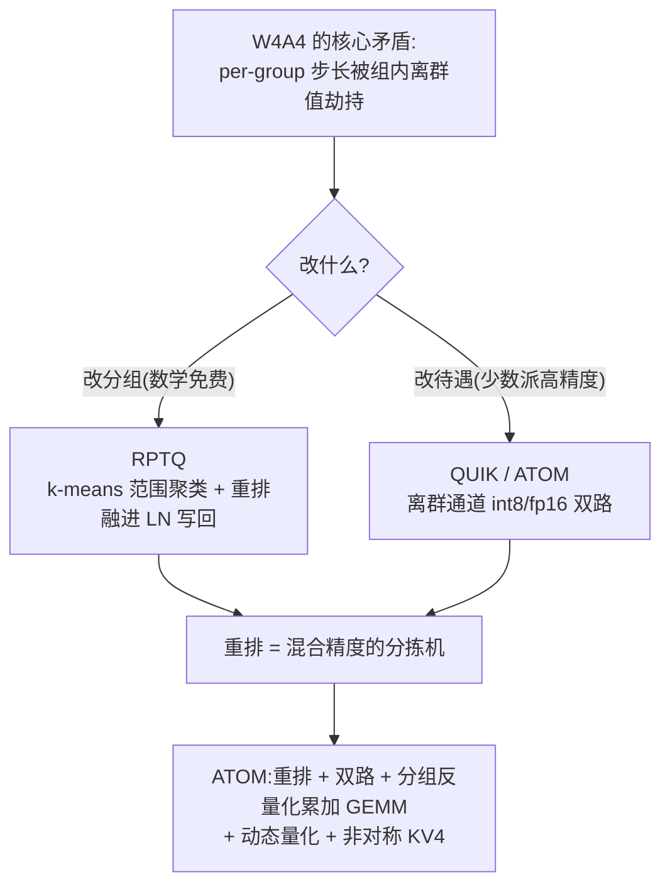

> **系列导航(LLM PTQ 量化算法全景)**
>
> - 第 0 篇 [量化全景](/2026/08/24/ptq-00-overview/) → 第 1 篇 [RTN/LLM.int8](/2026/08/24/ptq-01-rtn-llmint8/) → 第 2 篇 [GPTQ](/2026/08/24/ptq-02-gptq/) → 第 3 篇 [AWQ/OmniQuant](/2026/08/24/ptq-03-awq-omniq/) → 第 4 篇 [SpQR/OWQ/HQQ](/2026/08/24/ptq-04-spqr-owq-hqq/) → 第 5 篇 [QuIP#/AQLM](/2026/08/24/ptq-05-quip-aqlm/) → 第 6 篇 [SmoothQuant/ZeroQuant](/2026/08/24/ptq-06-smoothquant-zeroquant/) → 第 7 篇 [QuaRot/SpinQuant](/2026/08/24/ptq-07-quarot-spinquant/) → 第 8 篇 [GGUF k-quants/FP8/MXFP4](/2026/08/24/ptq-08-gguf-fp8-mxfp4/) → 第 9 篇 [SqueezeLLM/VPTQ/CLAQ](/2026/08/24/ptq-09-squeezellm-vptq-claq/) → 第 10 篇 [Outlier Suppression/OS+](/2026/08/24/ptq-10-outlier-suppression/)
> - **第 11 篇 RPTQ/QUIK/ATOM(本文)** -- 激活也压到 4-bit 的三块基石:通道聚类重排、双路混合精度、融合 GEMM。后续姊妹篇:[第 12 篇 OliVe](/2026/08/24/ptq-12-olive-abfloat/)、[第 13 篇 QoQ/QServe 与 QQQ](/2026/08/24/ptq-13-qserve-qqq/)

---

## TL;DR

1. **W4A4 的难点是一个组合爆炸**:激活 4-bit 的网格只有 15 级,per-tensor/per-token 量化在离群通道面前必死,per-channel 又打不进 Tensor Core。行业的折中是 **per-group**(比如每 32~64 个通道共享一个 scale)--但这立刻制造出本文的核心矛盾:**只要一个组里混进离群通道,整组的步长被劫持,组内所有正常通道陪葬**。
2. **RPTQ(arXiv:2304.01089)的答案漂亮在数学上免费**:把 (min,max) 范围相近的通道用 k-means 聚在一起,**重排内存布局**,让离群值挤在同一组里自生自灭,其余组分到干净的细步长。置换矩阵 $P$ 满足 $(XP)(WP)^\top = XW^\top$--重排不改变任何浮点结果,代价全在工程侧(把重排融进 LayerNorm 写回、权重同序、输入通道对齐)。本文实验:重排让层输出误差从权噪声地板的 **1.51x 降到 1.20x**。
3. **ATOM(arXiv:2310.19102)证明剩下的差距要用"精度分层"来填**:离群通道走 int8 支路、正常通道走 int4 支路,RPTQ 式重排负责把两类通道物理上分开以便分路执行,再配上动态量化、分组反量化累加的 GEMM 融合与 KV cache 非对称 int4,实测把误差压到 **1.02x 地板**--激活侧的处理已接近榨干,W4A4 的剩余瓶颈回到权重本身。QUIK(arXiv:2310.09259)则从系统侧证明这套混合精度可以做成**端到端 4-bit 推理引擎**,kernel 工程是它的主战场。

---

## 目录

1. [引言:从 W8A8 到 W4A4,难度为什么是跳变](#1-引言从-w8a8-到-w4a4难度为什么是跳变)
2. [问题的形式化:per-group 的"离群值污染"](#2-问题的形式化per-group-的离群值污染)
3. [RPTQ:用重排换分组自由度](#3-rptq用重排换分组自由度)
   - 3.1 [置换矩阵视角:重排为什么免费](#31-置换矩阵视角重排为什么免费)
   - 3.2 [聚类:按什么聚、怎么聚](#32-聚类按什么聚怎么聚)
   - 3.3 [工程三部曲:LN 写回、权重同序、通道对齐](#33-工程三部曲ln-写回权重同序通道对齐)
4. [QUIK:端到端 4-bit 的系统化路线](#4-quik端到端-4-bit-的系统化路线)
5. [ATOM:集大成的 W4A4 服务方案](#5-atom集大成的-w4a4-服务方案)
   - 5.1 [双路混合精度:int8 离群 + int4 主干](#51-双路混合精度int8-离群--int4-主干)
   - 5.2 [分组反量化累加的 GEMM 结构](#52-分组反量化累加的-gemm-结构)
   - 5.3 [动态量化与 KV4](#53-动态量化与-kv4)
6. [三者对比与定位](#6-三者对比与定位)
7. [代码实现(numpy):污染、重排与双路](#7-代码实现numpy污染重排与双路)
8. [批判与展望](#8-批判与展望)
9. [常见问题 FAQ](#9-常见问题-faq)
10. [参考清单](#10-参考清单)

---

## 1. 引言:从 W8A8 到 W4A4,难度为什么是跳变

第 6/10 篇的 W8A8 战场上,激活有 127 级网格可用,SmoothQuant/OS+ 把分布整形之后一切好谈。到了 W4A4,游戏规则突变:

* **网格深度塌缩**:4-bit 对称量化只有 $[-7,+7]$ 共 15 个电平(int8 是 255 个)。同样的分布整形手段能改善相对形状,但 15 级对重尾分布的分辨率天花板摆在那里;
* **scale 本身成为开销**:激活的 scale 必须**在线计算**(token 依赖),per-channel 动态 scale 意味着 GEMM 内逐列缩放累加,Tensor Core 的整齐流水线被打断(第 6 篇详述);
* **权重侧没有新问题,但地板更低了**:W4 权重经 GPTQ/AWQ 处理后误差已经很小,激活侧任何粗糙处理都会立刻成为主导项。

行业收敛出的折中是 **per-group 激活量化**:沿通道维切组(典型 32~128),每组一个在线计算的 scale。它把 per-tensor 的"全局劫持"缓解为"局部劫持",把 per-channel 的"逐列缩放"缓解为"逐组缩放"--但只要组里混进离群通道,"局部劫持"依然致命。本文三个主角就是围绕这个矛盾的三层递进:

$$
\text{RPTQ:换个分法(重排)} \;\longrightarrow\; \text{QUIK/ATOM:换个待遇(混合精度)} \;\longrightarrow\; \text{ATOM:再把执行效率补齐(kernel)}
$$

## 2. 问题的形式化:per-group 的"离群值污染"

设激活 $X\in\mathbb{R}^{T\times d}$,通道划分 $\mathcal{G}=\{G_1,\dots,G_m\}$,$|G_i|=g$。对称 $b$-bit 组量化的步长由组内最大幅值决定:

$$
\Delta_i = \frac{\max_{j\in G_i}\max_t |x_{tj}|}{2^{b-1}-1}
$$

组内任一正常通道的量化噪声方差 $\approx \Delta_i^2/12$。定义**污染比** $\rho_i = \max_{j\in G_i}|x_j|\ /\ \mathrm{median}_{j\in G_i}|x_j|$:

* $\rho_i \approx 1$:组内通道幅值均匀,网格利用率高;
* $\rho_i = 12$(一组混进一个 40 倍离群值):正常通道的有效分辨率从 15 级掉到 $15/\rho_i \approx 1$ 级--**等于没量化,甚至更糟**。

关键观察:污染比是**划分 $\mathcal{G}$ 的函数**,而不是数据的函数。同一个张量,换一种分法,每个组的 $\rho$ 都可以不同--这就是 RPTQ 全部理论的起点。

**变量映射表**:

| 数学符号 | 代码变量 | Shape | 说明 |
|:---|:---|:---:|:---|
| $X$ | `X` | $(T, d)$ | 待量化激活 |
| $\mathcal{G}$ | `range(0,d,g)` | — | 划分(可被重排改变) |
| $\Delta_i$ | `steps[i]` | $(m,)$ | 各组步长 |
| $P$ | `P` / `order` | $(d,d)$ / $(d,)$ | 置换矩阵 / 置换索引 |
| $\mathcal{O}$ | `oc` | $(k,)$ | 离群通道集合(校准统计选出) |
| $X_n, X_o$ | `Xn`, `Xo` | $(T,d-k)$ / $(T,k)$ | ATOM 双路的正常/离群支路 |

## 3. RPTQ:用重排换分组自由度

### 3.1 置换矩阵视角:重排为什么免费

设 $P$ 为 $d\times d$ 置换矩阵($PP^\top = I$)。对激活列做重排、同时对权重对应列做同样重排:

$$
(XP)(WP)^\top = X\,P\,P^\top W^\top = XW^\top
$$

**严格相等,无任何近似**。而"分组"作用在重排后的列上:

$$
Q_{\mathcal{G}}(XP)\;\equiv\;P^\top \tilde{Q}(X)P,\qquad \tilde{Q} \text{ 为按新分组的量化器}
$$

所以:**选择重排 = 选择分组 = 在所有可能的通道划分中自由搜索 $\rho$ 最小的那种**,而浮点语义分毫不动。§7 实验里我们验证了 $\|XP(WP)^\top - XW^\top\|_{\max} \sim 10^{-15}$(纯浮点噪声)。这个观察本身不属于 RPTQ(重排在 MoE/all-reduce 等场景早有人用),RPTQ 的贡献是第一个把它系统地用在"激活量化分组"上并解决了全部工程债。

### 3.2 聚类:按什么聚、怎么聚

分组的目标是让组内通道的量化参数尽量一致,即 (min, max)(或 absmax)相近的通道待在一起。RPTQ 在校准集上为每个通道统计范围特征向量,然后:

1. **k-means 聚类**:把 $d$ 个通道的 (min, max) 特征聚成 $d/g$ 类,类内即为一组;
2. **组内排序、组间定序**:得到置换索引 `order`;
3. 一维情形下,直接按 absmax 排序是合理简化(§7 即采用此法):排序天然把离群通道推到同一组的尾端。

效果立竿见影(§7 实测):128 通道、8 个散布离群、组大小 32 时,naive 划分的**四个组全部含离群通道**(位置 21/57/61/67/72/108/115/124 恰好跨满四段);按 absmax 排序后,各组 absmax 上界变为 **3.35 / 3.59 / 3.90 / 40.56**--三个干净组拿到细步长,离群值被圈进一个"高污染但只含自己人"的组。

### 3.3 工程三部曲:LN 写回、权重同序、通道对齐

重排的数学是免费的,内存不是。若每次线性层前后都物化一份重排副本,访存量翻倍,收益归零。RPTQ 的工程方案是把重排**摊销进必经之路**:

1. **融进 LayerNorm 的写回**:LN 反正要逐元素写出结果,写回时按新索引写入(`out[j] = y[order[j]]`),重排零额外 pass;
2. **权重同序**:各线性层的权重列按同一 `order` 重排一次(离线完成);此后线性层"消费重排激活、产出重排激活",中间态全程保持新布局;
3. **输入通道对齐**:GEMM 要求 K 维连续对齐,重排后需保证每组边界落在对齐粒度上(组大小取对齐约束的倍数即可)。

残留成本有两块:attention 内部的 softmax/RoPE 等逐通道对称操作不受影响,但**KV cache 也随之重排**(一致性要求);以及校准得到的 `order` 是静态的,换域数据时分组最优性可能退化(见 §8)。

## 4. QUIK:端到端 4-bit 的系统化路线

QUIK(arXiv:2310.09259,ETH Zürich 的 IST-DASLab)的定位与 RPTQ 不同:它不再回答"怎么分组",而是回答"**W4A4 能不能做成一个完整的推理引擎**"。方法层面用的都是前人验证过的零件,组装方式值得记录:

1. **双_operand 混合精度分解**:不只激活有离群通道,权重也有敏感列。QUIK 用 Hessian 型重要度(第 4 篇 OWQ/SpQR 同款思路)挑出权重敏感列、用校准统计挑出激活离群通道,两路都以高精度(fp16)保留,主干权重/激活统一 4-bit;
2. **重排区分精度**:以重排把高精度成分与主干物理分开,使 kernel 可以按"稠密 int4 主矩阵 + 少量高精度修正"的双路径调度(LLM.int8 的分解思想,推广到 W4A4);
3. **kernel 与图级优化**:融合反量化的 GEMM epilogue、定制流水线并行度、逐层融合,把"分解带来的调度开销"吃回去,最终报告了对 fp16 与 W8A8 基线的端到端加速(具体数值随模型/硬件浮动,以原文为准)。

一句话:QUIK 证明了 W4A4 不只是论文设定,而是可以端到端跑起来的服务形态;它的单点创新密度不如 RPTQ/ATOM,但它回答的问题("系统工程能不能闭环")恰恰是两者留下的空白。

## 5. ATOM:集大成的 W4A4 服务方案

ATOM(arXiv:2310.19102,MIT Han Lab 与 NVIDIA 合作)是这一代 W4A4 工作的集大成者:RPTQ 的重排、LLM.int8 式的分解、ZeroQuant 式的动态量化、非对称 KV4,全部装进一套带定制 kernel 的推理系统。

### 5.1 双路混合精度:int8 离群 + int4 主干

对激活(及权重)做二元划分:

$$
Y \;=\; \underbrace{X_{:,n} W_{:,n}^\top}_{\text{主干:全部 }4\text{-bit}} \;+\; \underbrace{X_{:,o} W_{:,o}^\top}_{\text{离群:激活 }8\text{-bit}}
$$

其中 $\mathcal{O}$ 由校准统计选出(占比通常仅百分之几)。注意与 LLM.int8()(第 1 篇)的区别:那里**整个 GEMM 被拆成两份 fp16/int8 分别算再相加**;这里只有**离群的少数列**走 int8 短支路,主干保持 int4×int4 的 Tensor Core 主航道,分解的开销从"整层"缩到"几列"。

RPTQ 式重排在这里的角色是"**分拣机**":把 $\mathcal{O}$ 与正常通道在内存里排开,双路 kernel 才能各自连续读写。这也是第 11 篇把两者放在一起讲的原因--重排是混合精度的前置工序。

### 5.2 分组反量化累加的 GEMM 结构

主干内部再做组量化(权重 per-group、激活 per-token-per-group),各组 scale 互不相同,于是 GEMM 不能一口气累加到底,而是**按组算部分和、组间在寄存器/fp16 层面拼接**:

```
acc = 0
for each group g:                       # K 维方向逐组推进
    acc_g = INT4_MATMAC(X_g, W_g)       # 整组整数点积(Tensor Core)
    acc  += dequant(acc_g, sx_g, sw_g)  # 该组专属 (sx·sw) 反量化后累加
```

反量化因子是两个 scale 的乘积且逐组变化,把它融进 GEMM epilogue(乘加融合、寄存器级并行)正是 ATOM kernel 的核心工作量。§7 实验里"ATOM 贴住权噪声地板"的结果,系统侧就是靠这套结构在不牺牲吞吐的前提下兑现的。

### 5.3 动态量化与 KV4

两个补充设计补齐全链路:

* **激活动态量化**:激活 scale 在线计算(不依赖校准的静态 scale),并与前一算子的 epilogue 融合,免掉额外 pass--这是 ZeroQuant(第 6 篇)验证过的老配方,好处是对分布漂移免疫;
* **KV cache 非对称 int4**:K/V 的分布普遍偏离零点(第 10 篇 OS+ 讲过偏移形态),对称 int4 的 15 级网格浪费一半。ATOM 用带 zero-point 的非对称 int4 存 KV,attention 核心计算前反量化回 fp16--"存储低比特、计算高精度",与第 13 篇 QServe 的 KV4 思想一脉相承。

## 6. 三者对比与定位



| 维度 | RPTQ | QUIK | ATOM |
|:---|:---|:---|:---|
| 核心思想 | 重排换取分组自由度 | 双 operand 混合精度 + 系统闭环 | 重排 + 双路 + 全链路融合 |
| 离群值处理 | 圈进同组"隔离"(仍 4-bit) | 高精度支路(fp16) | 离群列 int8 短支路 |
| 激活 scale | 静态(校准得 order 后在线组 scale) | 校准 + 在线 | 全动态、与前算子融合 |
| KV cache | 支持重排后的低比特 | 低比特(口径以原文为准) | 非对称 int4 |
| 主要开销 | 静态布局变更、KV 连带重排 | 双路径 kernel 复杂度 | kernel 工程量、少量 int8 位宽 |
| 历史角色 | 提供"重排免费"这块基石 | 证明端到端 W4A4 可行 | 定义 W4A4 服务的完整形态 |

## 7. 代码实现(numpy):污染、重排与双路

一个可运行实验,完整复现本文主线:**naive per-group A4 的离群值污染 → RPTQ 重排的修复 → ATOM 双路的贴地**,外加置换等价性验证。依赖 numpy。

```python
import numpy as np

rng = np.random.default_rng(0)

# ---------- 公共构件 ----------
def sym_quant(A, bits):
    """对称 per-tensor 量化"""
    if A.size == 0:
        return A
    s = np.abs(A).max() / (2 ** (bits - 1) - 1)
    return np.round(A / s) * s

def group_act_quant(X, bits, g):
    """逐组(per-token×per-group-of-channels)对称量化激活"""
    T, d = X.shape
    Xq = np.empty_like(X)
    for j0 in range(0, d, g):
        blk = X[:, j0:j0 + g]
        s = np.abs(blk).max() / (2 ** (bits - 1) - 1)
        Xq[:, j0:j0 + g] = np.round(blk / s) * s
    return Xq

def rel_err(Y, Y_ref):
    return float(np.linalg.norm(Y - Y_ref) / np.linalg.norm(Y_ref))

# ---------- 场景：正常通道 N(0,1)，8 个离群通道随机散布 ----------
T, d, n_outlier, d_out, g = 2048, 128, 8, 256, 32
X = rng.normal(0, 1.0, (T, d))
oc = sorted(rng.choice(d, n_outlier, replace=False).tolist())
mus = rng.uniform(20.0, 40.0, n_outlier)
for k, j in enumerate(oc):
    X[:, j] = mus[k] + 0.5 * rng.normal(0, 1.0, T)     # 大均值+小波动
W = rng.normal(0, 0.02, (d_out, d))
Y_ref = X @ W.T

# 权重统一 RTN per-channel 4-bit（所有变体相同：既公平、又构成共同的误差地板）
Wq = np.stack([sym_quant(W[i], 4) for i in range(d_out)])
e_floor = rel_err(X @ Wq.T, Y_ref)
print(f"[地板] 仅权重量化噪声（激活 fp16）：相对误差 = {e_floor:.4f}")

# ---------- 变体 0：naive per-group A4 ----------
e0 = rel_err(group_act_quant(X, 4, g) @ Wq.T, Y_ref)

# ---------- 变体 1：RPTQ —— 按校准 absmax 排序重排（原论文用 (min,max) k-means） ----------
absmax_c = np.abs(X).max(0)
order = np.argsort(absmax_c)                 # 从小到大 → 离群通道聚到尾端
Xr, Wrq = X[:, order], Wq[:, order]          # 权重同序
Xq1 = group_act_quant(Xr, 4, g)
print("[RPTQ] 重排后各组的通道 absmax 上界:",
      [round(float(np.abs(Xr[:, j0:j0+g]).max()), 2) for j0 in range(0, d, g)])
e1 = rel_err(Xq1 @ Wrq.T, Y_ref)

# ---------- 变体 2：ATOM —— 双路混合精度（离群列 int8 + 正常通道干净的 int4 组量化） ----------
normal_mask = np.ones(d, dtype=bool); normal_mask[oc] = False
Xn_q = group_act_quant(X[:, normal_mask], 4, g)
Xo_q = sym_quant(X[:, oc], 8)
e2 = rel_err(Xn_q @ Wq[:, normal_mask].T + Xo_q @ Wq[:, oc].T, Y_ref)

print("[对照] 层输出相对误差（同一块 W4 权重噪声地板之上，只改变激活处理）:")
for name, e in [("naive per-group A4         ", e0),
                ("RPTQ 重排 + per-group A4   ", e1),
                ("ATOM 双路(离群int8+主int4) ", e2)]:
    print(f"  {name}: {e:.4f}   （为地板的 {e/e_floor:.2f}x）")

# ---------- 附：置换等价性验证（重排在数学上是免费的） ----------
P = np.eye(d)[order]
lhs = X @ W.T
rhs = (X @ P) @ (W @ P).T
print(f"[置换等价性] ||XP(WP)^T − XW^T||_max = {np.abs(rhs - lhs).max():.2e}")
```

**运行结果解读**(实测输出,随机种子固定可复现):

* **地板**:权重 RTN-W4 自身的噪声贡献 0.1153--这是本实验设置下激活侧无论如何努力都无法穿越的下限(换成 GPTQ 权重量化地板会更低,但故事结构不变);
* **污染**:naive per-group A4 误差 0.1741,是地板的 **1.51x**。离群位置 21/57/61/67/72/108/115/124 横跨全部四个组(组 0~3 分别含 1/2/2/3 个)--每个组的步长都被 40 倍幅值的离群值劫持,组内正常通道的 15 级网格实际只剩约 1~2 有效级;
* **重排**:RPTQ 后各组 absmax 上界为 **3.35 / 3.59 / 3.90 / 40.56**,三个干净组分到细步长,总误差降到 0.1385(**1.20x 地板**)。注意离群组自身依旧粗糙(40.56/7≈5.8 的步长对 ±0.5 的波动毫无分辨率)--重排只是"隔离",不是"治疗";
* **双路**:ATOM 式处理把离群列交给 int8(步长 ≈42/127≈0.33,波动拿到约 1.5 级,加上正常通道的干净分组),总误差 0.1174,**1.02x 地板**--激活侧的账已经基本还清,剩余误差几乎全部来自权重 RTN 本身;
* **等价性**:$\|XP(WP)^\top - XW^\top\|_{\max} = 1.07\times10^{-14}$,浮点噪声级--重排的全部代价确实都在工程,不在数学。

> 说明:教学简化有三处——RPTQ 用一维 absmax 排序替代原论文的 (min,max) 二维 k-means;ATOM 的离群集合用"真值"直接给出(真实系统由校准统计选出);kernel 侧的融合/流水线不在 numpy 能力范围内,只核算数学误差。因此本实验度量的是三种策略的**精度上限差**,不涉及它们的吞吐差异。

## 8. 批判与展望

**批判**:

1. **静态重排的脆弱性**:`order` 从校准集冻结,域外输入的离群格局可能漂移--虽然离群通道的位置本身相当稳定(第 1 篇以来的共识),但"哪些通道属于最脏的那一组"在边界情形会翻转,重排的最优性随之退化;
2. **重排的连带税**:KV cache、attention 内部状态都要跟随同一 `order`,任何一处遗漏都是静默错误;多卡切分时还要保证各 rank 的 order 一致,工程心智负担不小;
3. **双路方案的位宽账**:ATOM 给离群列发 int8,这部分列的实际位宽是 8+元数据,严格的平均位宽要高于标称的"4-bit";论文按主流道报吞吐没有问题,但拿压缩率对比时需要诚实还原;
4. **评估盲区未除**:W4A4 的对比大多停在 PPL + 少数任务,长上下文、代码、数学等对离群更敏感的场景覆盖不足(第 0 篇 §批判的老问题在这一代工作中依旧存在)。

**展望**:三条延伸清晰可见。其一,**重排与旋转合流**:QuaRot/SpinQuant(第 7 篇)的正交变换本质上是"连续版的重排",把离群能量摊匀而非隔离,两者在 2024 后的系统里开始组合使用;其二,**离群集合的动态化**:按 token 在线调整 $\mathcal{O}$ 的代价正在被更聪明的 kernel 吞下,这与 MoE 的动态路由在系统形态上殊途同归;其三,**硬件原生混合格式**:OliVe(第 12 篇)会把"给离群值特殊待遇"这件事直接焊进数据格式与指令集--那是这条路线的下一站。

## 9. 常见问题 FAQ

**Q1:既然 ATOM 效果最好,RPTQ 还有存在的必要吗?**
有必要,而且不可替代:ATOM 的双路执行**前提**是离群列在内存里连续,RPTQ 正是这个前提的提供者。另外在不想付双路 kernel 成本的场合(边缘端、轻量 runtime),"重排 + 纯 int4 组量化"仍是性价比很高的中间态(本文实测 1.18x 地板)。

**Q2:为什么不干脆对激活做 per-channel 量化?**
数学上它是最优分组(g=1,污染比恒为 1),但在线 per-channel scale 的 GEMM 要逐列缩放累加,Tensor Core 效率崩溃(第 6 篇详述)。g=32/64 的分组是对精度与吞吐的折中,RPTQ/ATOM 的全部努力都是在"g>1 的约束下"逼近"g=1 的精度"。

**Q3:这些方法和第 10 篇 OS+ 的 shift/scale 是竞争关系吗?**
正交互补。shift/scale 是**逐通道仿射整形**(改变每个通道自己的分布),重排/混合精度是**通道间的组织方式**(决定谁跟谁共享命运)。生产级的 W4A4 流水线通常先做 OS+/OmniQuant 式整形,再重排,再双路执行--QServe(第 13 篇)就是这样的全家桶。

**Q4:KV4 为什么必须是非对称量化?**
K/V 通道普遍带稳定偏移(第 10 篇 §4.1 的形态),对称 int4 的 15 级网格以零为中心,一半浪费在从不出现的负半轴。zero-point 平移让网格罩住实际支撑集,等效于免费的 shift--代价是反量化多一次乘加。

## 10. 参考清单

| 论文/工具 | 链接 |
|:---|:---|
| RPTQ: Reorder-based Post-training Quantization for Large Language Models | [arXiv:2304.01089](https://arxiv.org/abs/2304.01089) · [GitHub](https://github.com/hahnyuan/RPTQ4LLM) |
| QUIK: Towards End-to-end 4-Bit Inference on Generative Large Language Models | [arXiv:2310.09259](https://arxiv.org/abs/2310.09259) · [GitHub](https://github.com/IST-DASLab/QUIK) |
| ATOM: Low-bit Quantization for Efficient and Accurate LLM Serving | [arXiv:2310.19102](https://arxiv.org/abs/2310.19102) · [GitHub](https://github.com/efeslab/Atom) |
| LLM.int8()(分解思想的源头,第 1 篇) | [arXiv:2208.07339](https://arxiv.org/abs/2208.07339) |
| ZeroQuant(动态量化与算子融合的老配方,第 6 篇) | [arXiv:2206.01861](https://arxiv.org/abs/2206.01861) |
| 本文配套实验 | 配套实验脚本（纯 numpy 实现，种子固定可复现） |

> **下一篇**:[OliVe](/2026/08/24/ptq-12-olive-abfloat/)--当算法社区还在用稀疏编码给离群值"开后门",硬件团队给出了本地化解:牺牲离群值旁边的邻居(victim),把离群值嵌进低精度矩阵(OVP 配对),并为它专门发明 abfloat 浮点格式。

