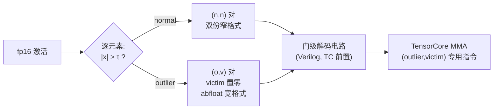

> **系列导航** ｜ [课程路线图](/quantization-roadmap/) ｜ **Part 2 · Activation PTQ** ｜ 第 14 篇 / 共 26 篇
>
> [← 13 RPTQ/QUIK/ATOM](/2026/08/24/ptq-11-rptq-quik-atom/) ｜ [15 GGUF/FP8/MXFP4 →](/2026/08/24/ptq-08-gguf-fp8-mxfp4/)
>
> - **第 14 篇 OliVe(本文)** -- 把"给离群值特殊待遇"从软件技巧下沉为数据格式与指令集:OVP 配对编码、abfloat 宽指数格式、TensorCore 级解码。后续姊妹篇:[第 16 篇 QoQ/QServe 与 QQQ](/2026/08/24/ptq-13-qserve-qqq/)

---

## TL;DR

1. **离群值处理的"稀疏编码税"**。LLM.int8()(第 E1 篇)、SpQR/SqueezeLLM(第 4/9 篇)、ATOM(第 13 篇)处理离群值的共同套路是**全局稀疏编码**:挑出离群值 → 记录位置索引 → 高精度另存 → 运行时 gather 回来。索引元数据、全局协调、双路径调度,每一项都是 kernel 的敌人。OliVe(arXiv:2304.07493)问了一个硬件工程师式的问题:**能不能不要索引、不要全局协调?**
2. **答案是"就地配对":离群值很重要,它旁边的邻居不重要**。把激活按固定步长两两配对,一对中若出现离群值,就让它的邻居"牺牲"(victim,置零腾出空间),整个槽位让给一份宽动态范围的 **abfloat** 编码--所有操作都是**本地**的:看自己这一对就能编解码,零索引、零 gather。本文实验:同样槽位预算下,OVP 编码比"全员共享窄网格"误差降低约四成;而"只牺牲邻居却不给离群值宽格式"的天真做法误差反而爆到 0.93--**victim 的意义必须由格式升级来兑现**,这是本篇最重要的机制性结论。
3. **这是系列里第一篇"格式-电路-指令集"三合一的工作**。abfloat 通过给指数加偏移让全部编码值跳过正常数值区间;解码器直接做成 TensorCore 前置的门级电路(Verilog 实现),并配套 (outlier,victim) 对专用的矩阵乘指令。它预示了后来一整类"硬件原生低比特格式"(FP8/MXFP,第 15 篇)的设计哲学:**量化的终点不是更聪明的算法,而是更聪明的数制**。

---

## 目录

1. [引言：稀疏编码税与本地化动机](#1-引言稀疏编码税与本地化动机)
2. [OVP：离群值-受害者配对](#2ovp离群值-受害者配对)
   - 2.1 [核心观察与配对策略](#21-核心观察与配对策略)
   - 2.2 [三种对的命运与槽位账](#22-三种对的命运与槽位账)
3. [abfloat：让编码跳过正常区间](#3abfloat让编码跳过正常区间)
   - 3.1 [指数偏移的数学](#31-指数偏移的数学)
   - 3.2 [为什么不能只用窄格式凑合](#32-为什么不能只用窄格式凑合)
4. [硬件协同设计：从格式到门电路](#4-硬件协同设计从格式到门电路)
5. [代码实现(numpy)：三种编码的同预算对比](#5-代码实现numpy三种编码的同预算对比)
6. [批判与展望](#6-批判与展望)
7. [常见问题 FAQ](#7-常见问题-faq)
8. [参考清单](#8-参考清单)

---

## 1. 引言：稀疏编码税与本地化动机

回顾系列前文处理激活离群值的三代方案,它们的共同结构是一张"全局登记表":

| 方案 | 离群值放哪 | 需要什么元数据 | kernel 代价 |
|:---|:---|:---|:---|
| LLM.int8()(第 E1 篇) | 整个 GEMM 拆成 fp16 支路 | 离群通道列掩码 | 双 GEMM + 合并 |
| SpQR/SqueezeLLM(第 4/9 篇) | fp16 CSR 稀疏矩阵 | 行列索引 + 数值 | 双路径 gather-add |
| ATOM(第 13 篇) | 重排后的 int8 短支路 | 重排表 + 通道集合 | 分路执行 |

这些方案在算法上都是成功的,但它们都要求**先知道"谁是谁"再动手**:检测、记录、分流,三个动作横跨整张张量。硬件视角下这叫"非局部性"--访存模式不规则、控制流分支多、SIMD 宽度对不齐。OliVe 的出发点是把这套逻辑压缩到**最小的局部单元**里:

> 固定步长地把相邻两个元素绑成一对(pair)。一对之内,要么两个都是正常值(各拿一份窄编码),要么有一个是离群值(它独占整个槽位的宽编码,邻居作为 victim 让位)。**编解码只依赖本对内的两个元素**,没有任何跨对信息。

代价是明确的:victims 被永久丢弃。支撑这个代价的是一条经验规律(第 E1 篇以来反复出现):离群值高度集中在少数固定通道上,**同一通道内相邻元素的幅值相关性很低**--一个 token 里某个元素爆表,不代表它旁边的元素也重要。用统计语言说:离群性是**低维(通道级)结构**,而 victim 的牺牲是**逐元素局部决策**,两者不冲突。

## 2. OVP：离群值-受害者配对

### 2.1 核心观察与配对策略

形式化:激活向量 \(x\in\mathbb{R}^{d}\)(\(d\) 为偶数),按固定步长切分:

$$
P_i = (x_{2i},\, x_{2i+1}),\qquad i = 0,1,\dots,d/2-1
$$

以阈值 \(\tau\)(校准统计确定)判定离群:\(|x_j| > \tau\)。每个对落入三类之一:

* **(normal, normal)**:两个元素各拿一份窄格式(如 int4),标准编码;
* **(outlier, victim)**:一个超阈、一个正常。victim 置零(信息丢弃),离群值独占槽位,用 abfloat 宽格式编码;
* **(outlier, outlier)**:罕见(离群值占比仅百分之几)。策略是仍选其一保留、另一牺牲,或以更高优先级双保(具体取舍属于工程参数)。

**变量映射表**:

| 数学符号 | 代码变量 | Shape | 说明 |
|:---|:---|:---:|:---|
| \(x\) | `x` | \((d,)\) | 待编码激活向量 |
| \(\tau\) | `is_out` 判定 | — | 离群阈值(校准得) |
| \(P_i\) | `pairs` | \((d/2, 2)\) | 相邻元素对 |
| \(v_i\) | `victim` 掩码 | \((d/2,)\) | 该对是否发生牺牲 |
| \(k\) | `k_normal` 等 | 标量 | 窄格式的共享指数 |
| \(z\) | abfloat 的 `z` | 标量 | abfloat 的偏移后指数 |
| \(\mathcal{L}_m\) | `LEVELS_M` | \((4,)\) | 迷你尾数电平表 |

### 2.2 三种对的命运与槽位账

配对编码的经济学在于**槽位(slot)预算守恒**。设基线是 fp16 存储,一对占 32 bit。OVP 的分配:

$$
\text{normal 对}:\ \underbrace{4\text{bit}}_{x_{2i}} + \underbrace{4\text{bit}}_{x_{2i+1}} = 8\text{bit}
\qquad
\text{离群对}:\ \underbrace{\text{victim 标记} + \text{abfloat}}_{\le 32\text{bit}}
$$

平均位宽 = 两类槽位按占比加权。离群占比 2%、victim 占比相近时,绝大多数槽位是 8-bit 的 normal 对,整体位宽逼近 8-bit/元素--但离群值的精度**没有**像普通 W8 方案那样受损,因为它们走了专用宽格式。对比第 13 篇 ATOM:ATOM 用重排把离群值物理聚拢后开 int8 支路(需要通道集合与重排表);OliVe 不聚拢、不重排,直接在原地用格式差异区分待遇--这就是"硬件友好"的全部含义。

> 💡 **为什么 victim 必须存在**:若不牺牲邻居而试图给每个元素都发宽格式,位宽立刻回到 fp16 水平;若不给离群值宽格式而硬塞进窄网格,则如 §3.2 所示误差爆炸。**牺牲邻居换来的槽位空间,正是宽格式的物理载体**--三者缺一不可。

## 3. abfloat：让编码跳过正常区间

### 3.1 指数偏移的数学

迷你浮点的一般形式:值 \(= \pm\, m \cdot 2^{z}\),\(m\) 从尾数电平表取(如 \(\{1, 1.25, 1.5, 1.75\}\)),\(z\) 是指数域整数。常规偏置下,\(z\) 的覆盖范围对称地包含正常数值区间;abfloat 的唯一改动是**把指数偏移加上一个大常数**,使可表示集合变为:

$$
\mathcal{V} = \{\pm\, m\cdot 2^{z}\ :\ m \in \mathcal{L}_m,\ z \in [z_{\min}, z_{\max}]\},\qquad 2^{z_{\min}} > \max|x_{\text{normal}}|
$$

即**最小可表示幅值高于全体正常值的上限**--低于 \(2^{z_{\min}}\) 的输入一律冲刷(flush)为 0。效果(§5 Demo B 实测):教学版 abfloat(z∈[3,10])的可表示范围 \([8, 1792]\),横跨约两个数量级,而区间 \((0,8)\) 无任何编码;落在 \([16,64]\) 的离群值平均表示误差仅 **4.8%**,而窄格式饱和方案是 **91.7%**。

直觉:normal 值有自己专属的细网格,根本不需要这个宽格式来服务;所以宽格式可以**浪费掉整个低端指数区间**换取高端覆盖。"浪费"在别处是贬义词,在格式设计里叫**范围裁剪(range pruning)**--MXFP/NF4(第 8/9 篇)里同样的思想以不同面目出现过。

### 3.2 为什么不能只用窄格式凑合

一个自然的质疑:既然离群值只占 2%,把它们饱和(saturate)到窄网格的最大电平不就行了?§5 Demo A 给出了反直觉的答案:**这是三种方案中最差的**(相对误差 0.93,几乎等于扔掉整个张量)。原因是能量分布的极端不均:

$$
\frac{\|x_{\text{out}}\|^2}{\|x\|^2} \approx \frac{0.02 \times 40^2}{0.02\times 40^2 + 1} \approx 97\%
$$

离群元素虽然数量少,却承载了绝大部分信号能量(这正是第 10/11 篇反复强调"它们重要"的能量解释)。饱和处理等价于把这 97% 的能量压成常数--victim 牺牲省下的槽位若不用宽格式兑现,就是纯粹的净损失。**这条结论对一切"离群值特殊待遇"方案成立:待遇必须是真的(更多位宽/更大范围),象征性的待遇不如不做。**

## 4. 硬件协同设计：从格式到门电路

OliVe 与前作的真正分野在第四层--它不只是提出格式,而是给出了从数据布局到门级电路的全栈方案:

1. **Encoder(可离线/融合)**:阈值判定、配对分拣、abfloat 编码。由于判定只依赖单元素、编码只依赖本对,可以完全流水化;
2. **Decoder 进 TensorCore 前置级**:解码被设计为常数时间的组合逻辑--查尾数表、指数移位、符号恢复,用 Verilog 综合成门级电路,延迟远低于一个乘法器;(normal,normal) 对走常规 int4 解码路径,(outlier,victim) 对走 abfloat 路径,两路在对粒子上汇合;
3. **专用矩阵乘指令**:为 (outlier,victim) 对设计了定制 MMA 指令形态,使牺牲语义(victim=0)天然吸收在乘加里,无需额外的掩码清零步骤;
4. **与现有加速器的接口**:整套方案不需要新的全局调度,只需在 SIMD 单元与寄存器堆之间插入解码级--这是它能以"模拟+综合"评估并声称可与 Tensor Core 集成的底气。

论文口径的结果(未逐一复验,以原文为准):在与 fp16 基线差距约 1 个点以内的精度损失下,相比此前的稀疏式离群处理方案(GPU 上的 CSR 双路径等)取得一致的吞吐优势;配合权重侧常规 int4 组量化,整体归入 W4A4 类(分类总表见参照文末表)。



## 5. 代码实现(numpy)：三种编码的同预算对比

一个可运行实验:**Demo A** 在同槽位预算下对比 全员共享窄网格 / victim+饱和 / OVP 三种编码;**Demo B** 展示 abfloat 的指数偏移如何制造"跳过正常区间"的覆盖空洞。依赖 numpy。

```python
import numpy as np

rng = np.random.default_rng(0)

LEVELS_M = np.array([1.0, 1.25, 1.5, 1.75])      # 迷你浮点尾数(m2)

def e2m1_shared(x):
    """4-bit E2M1 思想：±{0,.5,1,1.5,2,3,4,6} × 2^k，k 由全体元素 absmax 决定"""
    levels = np.array([0, .5, 1, 1.5, 2, 3, 4, 6])
    k = int(np.floor(np.log2(np.abs(x).max() / 6)))
    grid = levels * 2.0 ** k
    return grid[np.argmin(np.abs(x[:, None] - grid[None, :]), axis=1)]

def narrow_saturate(x, k_normal):
    """窄格式(与正常值同一网格)，超界即饱和——'没有宽格式'的近似"""
    levels = np.array([0, .5, 1, 1.5, 2, 3, 4, 6])
    grid = levels * 2.0 ** k_normal
    return np.clip(grid[np.argmin(np.abs(x[:, None] - grid[None, :]), axis=1)],
                   -grid[-1], grid[-1])

def abfloat(x, z_lo=3, z_hi=10):
    """教学版 abfloat(s1,z4,m2)：可表示幅值 = {1,1.25,1.5,1.75}×2^z, z∈[z_lo,z_hi]
       关键性质：幅值 < 2^z_lo 一律冲刷为 0 —— 编码区间整体跳过正常数值范围"""
    xq = np.zeros_like(x)
    nz = np.abs(x) > 0
    a = np.abs(x[nz])
    z = np.clip(np.floor(np.log2(a)), z_lo, z_hi).astype(int)
    scale = 2.0 ** z
    m = LEVELS_M[np.argmin(np.abs(a / scale - LEVELS_M[:, None]), axis=0)]
    xq[nz] = np.sign(x[nz]) * m * scale
    return xq

def rel_err(a, b):
    return float(np.linalg.norm(a - b) / np.linalg.norm(b))

# ---------- 场景：正常值 N(0,1) + 2% 的 16~64 倍离群值 ----------
n = 4096
x = rng.normal(0, 1.0, n)
pos = rng.choice(n, int(n * 0.02), replace=False)
x[pos] = rng.uniform(16.0, 64.0, len(pos))
is_out = np.abs(x) > 8.0
k_normal = int(np.floor(np.log2(np.abs(x[~is_out]).max() / 6)))   # 正常值自己的指数

# ---------- 三种编码 ----------
q1 = e2m1_shared(x)                                    # 方案1：全员共享网格(被劫持)
q2 = x.copy()                                          # 方案2：victim 置零 + 窄格式饱和
q2[~is_out] = narrow_saturate(x[~is_out], k_normal)
q2[is_out] = narrow_saturate(x[is_out], k_normal)
q3 = x.copy()                                          # 方案3：OVP
q3[~is_out] = e2m1_shared(x[~is_out])                  #   正常对：干净的细网格
q3[is_out] = abfloat(x[is_out])                        #   离群值：宽格式
n_victim = 0
for a_ in range(0, n, 2):                              # 固定步长相邻配对
    b_ = a_ + 1
    if is_out[a_] != is_out[b_]:                       #   (outlier, victim) 对
        q2[b_ if is_out[a_] else a_] = 0.0             #   两方案的 victim 同样牺牲
        q3[b_ if is_out[a_] else a_] = 0.0
        n_victim += 1

print(f"[DemoA] 同槽位预算下的重构相对误差（离群 {is_out.mean()*100:.0f}%，"
      f"victim 约 {n_victim/n*100:.1f}%；k_normal={k_normal} vs 共享 k="
      f"{int(np.floor(np.log2(np.abs(x).max()/6)))}）")
print(f"  方案1 全员共享窄网格            : {rel_err(q1, x):.4f}")
print(f"  方案2 victim置零+窄格式饱和     : {rel_err(q2, x):.4f}")
print(f"  方案3 OVP(细网格+abfloat+victim): {rel_err(q3, x):.4f}")

# ---------- Demo B: 范围覆盖对比 ----------
print("\n[DemoB] 可表示范围对比")
print(f"  abfloat(z∈[3,10]) 覆盖 : [{LEVELS_M[0]*2**3:.1f}, {LEVELS_M[-1]*2**10:.0f}]，"
      f"且 (0,{2**3}) 区间无任何编码 —— '跳过'正常区间")
v_test = rng.uniform(16.0, 64.0, 200)
errs_ab = [rel_err(abfloat(np.array([v])), np.array([v])) for v in v_test]
errs_sat = [rel_err(narrow_saturate(np.array([v]), k_normal), np.array([v])) for v in v_test]
print(f"  离群值(16~64)平均表示误差 : abfloat={np.mean(errs_ab)*100:.1f}%  "
      f"窄格式饱和={np.mean(errs_sat)*100:.1f}%")
```

**运行结果解读**(实测输出,随机种子固定可复现):

* **方案 1(全员共享窄网格)误差 0.2215**:离群值把共享指数从 \(k_{\text{normal}}=-1\) 撑大到 \(k=3\),正常值面前只剩 \(\{4,6,8,\dots\}\) 起步的粗电平--第 2/11 篇的"absmax 劫持"在浮点格式下的再现;
* **方案 2(victim+饱和)误差 0.9319,全场最差**:离群元素承载了约 97% 的信号能量,饱和把它们压成常数,victim 的牺牲完全没能兑换成精度。**这是本篇的核心反例:没有格式升级的"特殊对待"是净损失**;
* **方案 3(OVP)误差 0.1329**:正常对拿回干净细网格(k=-1,覆盖 [0.25,3]),离群值由 abfloat 服务(表示误差 4.8%),victim 只损失 1.9% 的近零元素--同预算下比方案 1 降低约 40%;
* **Demo B**:abfloat 的可表示集 \([\,8,\,1792\,]\) 且 \((0,8)\) 开区间无任何编码--"跳过正常区间"不是比喻,是该数制下字面上不存在编码值。

> 说明:教学简化有三处——真实 OliVe 的槽位宽度/victim 标记位/abfloat 位宽有多种配置(原文给出 abfloat7/abfloat11 等变体),此处统一用"一对 ≤32bit 预算"的粗粒度对照;阈值 τ 用真值 8.0(实际由校准统计);门级电路与 MMA 指令不在 numpy 能力范围内。因此实验度量的是**编码格式本身的精度潜力**,不包含硬件实现的吞吐收益。

## 6. 批判与展望

**批判**:

1. **复现门槛极高**:方法的价值一半在 Verilog 门级设计与指令集成,软件社区无法直接验证;公开的模拟结果与真实流片/RTL 性能之间的差距,论文之外无从检验。这也是它影响力停留在"路线启示"而非"落地默认项"的原因;
2. **victim 丢弃是硬损失**:第 13 篇 ATOM 的 int8 支路是**无损保留**离群值,OliVe 的 (outlier,victim) 对则真的扔掉了邻居。当离群占比升高或阈值设松时,victim 能量损失上升,精度对 \(\tau\) 的敏感性论文着墨不多;
3. **固定步长配对的机会主义**:离群值的位置是随机的,可能与另一个离群值相邻((o,o) 对,处理起来最尴尬),也可能恰好落在奇偶边界上--固定配对只能保证"期望意义上"的高效,最坏情形需要退化策略兜底;
4. **生态位被时代挤压**:OliVe 设想的"定制解码级 + 专用指令"需要有人真金白银造芯片;产业界的答案最终是 FP8/MXFP 这类标准化格式(第 15 篇)+ 现有 Tensor Core 的原生支持。OliVe 的 abfloat 思想以某种形式活在"为特定分布定制数制"这个方向里,但其载体不再是学术加速器。

**展望**:回头看,OliVe 是 2023 年那波"算法-硬件协同设计"浪潮(OSDI/MICRO 上的一批工作)的代表样本:它把量化问题翻译成了数制设计问题。这个翻译本身比任何单一设计都持久--今天讨论 FP4/FP6 原生支持、块缩放微缩格式时,论证框架(exponent bias 的取舍、range pruning、flush 语义)与 OliVe 给出的完全同构。下一个自然的问题是:**能不能让格式随分布自适应**?校准期选择指数偏移、运行期只读一个配置寄存器--这在今天的硬件上已经不难做到,算是留给读者的练习题。

## 7. 常见问题 FAQ

**Q1:OliVe 和 ATOM(第 13 篇)都是"给离群值特殊待遇",本质区别是什么?**
组织方式不同。ATOM 是**空间维度**的重排+分流:先把离群列聚拢,再让它们走独立的 int8 GEMM 支路,离群值无损保留;OliVe 是**格式维度**的就地编码:不移动任何元素,靠"对槽位"里的格式差异区分待遇,离群值高精度保留、邻居被丢弃。前者吃重排表的元数据成本,后者吃 victim 的信息损失成本。

**Q2:为什么牺牲邻居是合理的?万一邻居也重要呢?**
经验依据是离群性的通道级结构:重要性由"所属通道"决定而非"相邻元素"决定,同一对内两个元素来自不同通道,幅值/重要性近似独立。若某层出现"成对离群"的结构性模式(如交错排列的特殊通道),(o,o) 对比例上升,牺牲效率下降--这也是校准阶段要统计对类型分布的原因。

**Q3:abfloat 和第 15 篇的 FP8(E4M3/E5M2)是什么关系?**
同一个设计空间的不同点位。FP8 用更多总位数换取通用覆盖;abfloat 用更少位数 + 激进的范围裁剪服务已知分布的特定区间。可以说 abfloat 是"知道答案的浮点":它把"离群值在 16~64 这个段位"这个先验焊死在了指数偏移里,而 FP8 必须为未知分布保持全 range。

**Q4:这套思路今天还有实用价值吗?**
直接照搬(自研芯片)的概率不高;但两个衍生问题很现实:(a) 在 MXFP 块缩放框架里,块内出现极端值时的格式降级/升级策略,本质就是 OVP 问题的标准化版本;(b) KV cache 量化中"少数 token 携带大幅值"的处理,同样适用"局部牺牲+宽格式"的组合。思想已沉淀,载体在更替。

## 8. 参考清单

| 论文/工具 | 链接 |
|:---|:---|
| OliVe: Accelerating Large Language Models via Hardware-friendly Outlier-Victim Pair Quantization(OSDI'23) | [arXiv:2304.07493](https://arxiv.org/abs/2304.07493) |
| LLM.int8()(离群值分解的开山作,第 E1 篇) | [arXiv:2208.07339](https://arxiv.org/abs/2208.07339) |
| SpQR(全局稀疏编码的代表作,第 06 篇) | [arXiv:2306.03078](https://arxiv.org/abs/2306.03078) |
| ATOM(空间维度混合精度的集大成者,第 13 篇) | [arXiv:2310.19102](https://arxiv.org/abs/2310.19102) |
| FP8 Formats for Deep Learning(arXiv:2209.05433,标准化数制的对照面,第 15 篇) | [arXiv:2209.05433](https://arxiv.org/abs/2209.05433) |
| 本文配套实验 | 配套实验脚本（纯 numpy 实现，种子固定可复现） |

> **下一篇**:[QoQ/QServe 与 QQQ](/2026/08/24/ptq-13-qserve-qqq/)--W4A8 作为部署甜点的收束之作:渐进式量化、SmoothAttention、低秩补偿,以及美团把 SOTA 技术熔于一炉的工程答卷。

