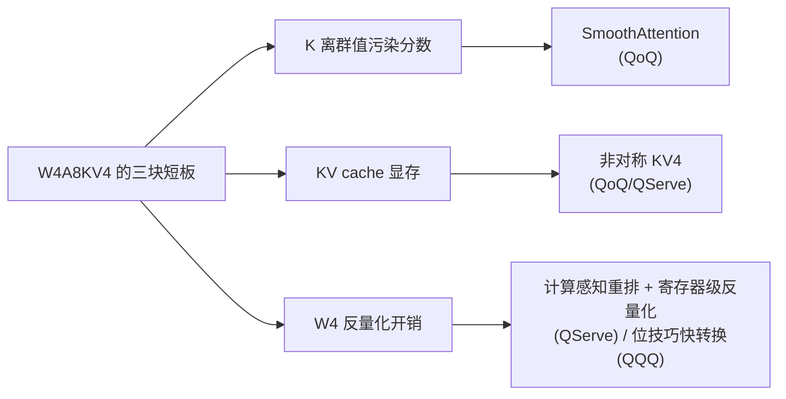

> **系列导航(LLM PTQ 量化算法全景)**
>
> - 第 0 篇 [量化全景](/2026/08/24/ptq-00-overview/) → 第 1 篇 [RTN/LLM.int8](/2026/08/24/ptq-01-rtn-llmint8/) → 第 2 篇 [GPTQ](/2026/08/24/ptq-02-gptq/) → 第 3 篇 [AWQ/OmniQuant](/2026/08/24/ptq-03-awq-omniq/) → 第 4 篇 [SpQR/OWQ/HQQ](/2026/08/24/ptq-04-spqr-owq-hqq/) → 第 5 篇 [QuIP#/AQLM](/2026/08/24/ptq-05-quip-aqlm/) → 第 6 篇 [SmoothQuant/ZeroQuant](/2026/08/24/ptq-06-smoothquant-zeroquant/) → 第 7 篇 [QuaRot/SpinQuant](/2026/08/24/ptq-07-quarot-spinquant/) → 第 8 篇 [GGUF k-quants/FP8/MXFP4](/2026/08/24/ptq-08-gguf-fp8-mxfp4/) → 第 9 篇 [SqueezeLLM/VPTQ/CLAQ](/2026/08/24/ptq-09-squeezellm-vptq-claq/) → 第 10 篇 [Outlier Suppression/OS+](/2026/08/24/ptq-10-outlier-suppression/) → 第 11 篇 [RPTQ/QUIK/ATOM](/2026/08/24/ptq-11-rptq-quik-atom/) → 第 12 篇 [OliVe](/2026/08/24/ptq-12-olive-abfloat/)
> - **第 13 篇 QoQ/QServe 与 QQQ(本文)** -- 系列收束:W4A8KV4 作为部署甜点的两条实现路径,以及前十二篇技术零件的最终组装形态

---

## TL;DR

1. **W4A8 是精度-性能曲线上的甜点位**:权重 4-bit 拿满带宽红利,激活 8-bit 避开 W4A4 的精度悬崖(第 11 篇),还恰好落进 GPU INT8 Tensor Core 的原生档位。剩下的短板只有两个--attention 对 K 的离群值极端敏感,以及 KV cache 在大 batch/长上下文下的显存占比。**QoQ(arXiv:2405.04532,MIT Han Lab×NVIDIA)对这两个短板分别给出 SmoothAttention 与 KV4**,再配上低秩补偿和一套把前人技术各取所长的组合拳。
2. **本篇实验验证了三个可复用的独立零件**(numpy 实测):SmoothAttention 型 K 通道平滑把 attention 分数的 int8 重构误差降低 **70.4%**;LoRC 式 rank-r 低秩补偿在残差谱集中度仅 0.12 时仍能以 3~12% 存储开销换取个位数百分点的误差改善(并解释了**为什么它的收益在不同论文里时好时坏**);KV cache 的逐通道非对称 int4 比对称方案误差降低 **39.7%**--这是第 10 篇 OS+ 的 shift 思想在 KV 上的免费重演。
3. **QServe 与 QQQ 代表两种工程哲学**:前者是"为一种量化规格定制整套 runtime"(计算感知重排、寄存器级反量化、服务级调度),后者是"把 SOTA 零件熔进现有推理引擎"(adaptive smoothing + GPTQ 类 W4 + 快速类型变换,vLLM 直接可用)。加上 QoQ 本身对 SmoothQuant/GPTQ/QuaRot/RPTQ 的集成,**这一篇里没有新数学,只有组装学--而这恰恰是量化技术从论文走向生产的最后一公里**。

---

## 目录

1. [引言：W4A8 为什么是甜点位](#1-引言w4a8-为什么是甜点位)
2. [QoQ：离线量化算法侧](#2qoq离线量化算法侧)
   - 2.1 [全家桶的组合表](#21-全家桶的组合表)
   - 2.2 [SmoothAttention：给 attention 分数做通道平滑](#22-smoothattention给-attention-分数做通道平滑)
   - 2.3 [低秩补偿：LoRC 的机制与局限](#23-低秩补偿lorc-的机制与局限)
   - 2.4 [KV4：非对称 zero-point 的必然性](#24-kv4非对称-zero-point-的必然性)
3. [QServe：在线服务系统侧](#3qserve在线服务系统侧)
4. [QQQ：另一种工程哲学——熔进 vLLM](#4qqq另一种工程哲学熔进-vllm)
5. [三者对比与系列收官定位](#5三者对比与系列收官定位)
6. [代码实现(numpy)：三个可复用零件](#6-代码实现numpy三个可复用零件)
7. [批判与展望](#7-批判与展望)
8. [常见问题 FAQ](#8-常见问题-faq)
9. [参考清单](#9-参考清单)

---

## 1. 引言：W4A8 为什么是甜点位

把本系列出现过的激活位宽摆到同一张坐标系上:

| 规格 | 权重带宽 | 激活难度 | 硬件路径 | 主要牺牲 |
|:---|:---|:---|:---|:---|
| W4A16 | ✓ 最优 | 无 | dequant 后走 fp16 GEMM | 计算受限于反量化/fp16 吞吐 |
| W4A8 | ✓ 最优 | 中(OS+/ATOM 已解) | INT8 Tensor Core 原生 | 几乎无 |
| W4A4 | ✓ 最优 | 极高(第 11 篇全篇) | 需要 int4 MMA/定制 kernel | 精度 + kernel 复杂度 |

W4A8 的位置近乎完美:**权重的访存红利拿满(W4),激活的计算走 INT8 Tensor Core(通常比 fp16 路径翻倍),而激活侧的离群值问题在 A8 的 255 级网格下已被 OS+(第 10 篇)、ATOM(第 11 篇)的手段驯服**。它不是学术上最激进的规格,却是工程上边际收益最高的规格--QServe 论文的核心主张正是"W4A8KV4 在真实服务负载下打平甚至超越更激进/更保守的方案"(具体数字随模型/硬件浮动,以原文为准)。

剩下的问题清单很短:① K 的离群值会污染 attention 分数(softmax 对 logit 误差不宽容);② 大 batch 长上下文下 KV cache 显存占比反超权重;③ W4 反量化本身的开销需要被 kernel 吃掉。QoQ/QServe 与 QQQ 分别交出了自己的答卷。

## 2. QoQ：离线量化算法侧

### 2.1 全家桶的组合表

QoQ 的第一层身份是**集成者**。它把系列前文的零件按"各自最强的战场"组装进一条 W4A8KV4 流水线:

| 零件 | 出处 | 在 QoQ 中的角色 |
|:---|:---|:---|
| 等效缩放迁移 | SmoothQuant(第 6 篇)/OS+(第 10 篇) | 激活侧 W8 的基础整形 |
| 二阶补偿量化 | GPTQ(第 2 篇) | W4 权重的重构误差控制 |
| 正交旋转 | QuaRot(第 7 篇) | 进一步摊平残存的离群能量 |
| 通道重排 | RPTQ(第 11 篇) | 为混合处理与 kernel 效率整理布局 |
| 渐进式量化 | QoQ 新增 | 先高比特锚定、再逐级细化,兼顾精度与运行开销(具体机制以原文为准) |

这种"不发明新轮子,只负责总装"的取向在第 12 篇批判过一次(易用性决定推广面),但放在部署语境下恰恰是美德:每个零件都有独立论文背书,失效模式已知,组合的消融可以逐项归因。

### 2.2 SmoothAttention：给 attention 分数做通道平滑

Transformer 里有一处对量化误差格外敏感的位置:**attention 分数** $S = QK^\top/\sqrt{d}$。原因有二:一是 softmax 会放大 logit 的绝对误差(大 logit 附近的斜率虽小,但跨 token 的相对序极易被翻转);二是 K 的离群通道形态(第 10 篇讲过的"大均值+小波动")在 $K^\top$ 的内积里被逐 token 累加,误差不抵消反而累积。

SmoothAttention 的处方是把第 6 篇的缩放迁移精确地施用在 K 上。对任意正的逐通道向量 $\lambda$:

$$
S = \frac{(Q\,\mathrm{diag}(\lambda))\,(K\,\mathrm{diag}(1/\lambda))^\top}{\sqrt{d}}
$$

浮点意义下严格相等;$\lambda$ 取 $K$ 各通道幅值统计的幂($\lambda_j = \max|K_{:,j}|^{\alpha}$,$\alpha\in(0,1)$,校准集估计)。于是 K 侧被削平、可以安心低比特,Q 侧吸收 $\lambda$(fp16 路径,便宜);实际系统中这一步还会进一步迁入 RoPE 的旋转矩阵(细节以原文为准)。§6 Demo A 实测:K 侧 per-tensor int8 下,直接量化的分数矩阵相对误差 0.0135,SmoothAttention 后 **0.0040(-70.4%)**。

值得注意的定位:这与 AWQ(第 3 篇)是同一个数学动作的不同靶位--AWQ 保护的是"权重的重要输入通道",SmoothAttention 保护的是"分数的重要贡献通道"。系列至此应该已经看穿:**所有"平滑/缩放/迁移"类方法共享一个恒等式模板,差别只在把它套在哪个乘法、哪一侧、用什么统计量**。

### 2.3 低秩补偿：LoRC 的机制与局限

W4 权重量化的残差 $\Delta W = W-\hat{W}$ 可以用一份极小的 fp16 低秩修正来部分回收:

$$
\Delta W \approx U_r \Sigma_r V_r^\top,\qquad \tilde W = \hat W + U_r \Sigma_r V_r^\top
$$

存储开销 = $r(M+N)/(MN)$:$r=8$、$M=N=256$ 时仅 6.25%,且修正矩阵可与 $\hat W$ 同驻显存、融合进反量化 epilogue。这套思想最早由 ZeroQuant-V2(第 6 篇)以 LoRC 之名提出,QoQ 将其纳入质量回收工具箱。

但 §6 Demo B 揭示了一个论文们很少明说的机制:**低秩补偿的收益取决于残差的谱集中度**。RTN/GPTQ 的量化残差近似逐元素独立的舍入噪声时,其奇异谱接近平坦(Demo B 实测 top-8 奇异值能量占比仅 0.12),rank-r 修正在单层只能拿到个位数百分点的误差改善;而当残差因 Hessian 加权或结构化权重而呈现谱集中时,同样的 rank 能吃掉更多能量。这解释了文献中 LoRC 效果"时好时坏"的观感--**它不是稳定的增益项,而是对残差结构的杠杆押注**。全网视角下,几十个线性层的单层小收益按层叠加,才是论文口径 PPL 改善的真实来源。

### 2.4 KV4：非对称 zero-point 的必然性

KV cache 的低比特化在大 batch/长上下文下是刚需:此时 KV 显存占用可与权重比肩,W4 的红利会被 FP16 的 KV 吃掉一半。而 KV 的分布形态(少数通道带稳定偏移,第 10 篇 §4.1)决定了**对称 int4 必然吃亏**--15 级网格以零为中心,一半浪费在不存在的负半轴。

带 zero-point 的非对称量化等价于内置了一个 shift(第 10 篇 OS+ 的老朋友):

$$
\tilde{x} = z_p + s\cdot\mathrm{round}\big((x-z_p)/s\big),\qquad z_p = \tfrac{1}{2}(\min_j + \max_j)
$$

§6 Demo C 实测:V cache 逐通道 4-bit 下,对称方案误差 0.0643,非对称 **0.0387(-39.7%)**。代价只是每组多存一个 zero-point 与反量化时一次乘加。QoQ/QServe 对 K 与 V 分别采用逐通道/逐 token 的非对称变体(具体配置以原文为准),attention 核心计算前反量化回高精度。

## 3. QServe：在线服务系统侧

QServe 的第二层身份是**为 W4A8KV4 规格定制的完整 serving 栈**。算法侧(QoQ)解决"量化成什么样",QServe 解决"怎么跑得快",三件事最有代表性:

1. **计算感知的权重重排(compute-aware reordering)**:反量化要读 scale/zero-point 并做整数-浮点变换,布局决定一切。权重按 GEMM 内部的访问模式重新排列索引,使每组量化参数的读取合并、bank 冲突最小;
2. **寄存器级的并行反量化**:把 INT4→可用算术格式的变换拆成位运算与查表,在寄存器层面与 MMA 指令交错流水,让反量化"藏"在张量核计算的延迟阴影里;
3. **服务级协同**:KV4 与分页缓存管理配合,量化感知的批处理调度,使端到端吞吐(而非孤立 GEMM 峰值)成为优化目标。

论文口径的结果(未逐一复验):在 A100 等硬件上,W4A8KV4 相较 W4A16 基线取得显著的服务吞吐提升,并在多负载下优于主流引擎的同档配置(具体倍数随设置浮动,以原文为准)。方法论上,QServe 与第 11 篇 QUIK/ATOM 一脉相承--**量化系统的竞争力最终兑现为 kernel 工程的深度**。

## 4. QQQ：另一种工程哲学——熔进 vLLM

QQQ(Quality Quattuor-bit Quantization,arXiv:2406.09904,美团×浙大)选择了另一条路:不自建 runtime,而是**作为量化方案进入现有引擎**(已集成进 vLLM)。方法上没有单点突破,但集成度打磨得相当细:

* **激活侧 adaptive smoothing**:延续 SmoothQuant/OS+ 思想,但缩放因子不再靠人工调 α,而是以类似 OmniQuant(第 3 篇)的方式在校准目标上学出来;
* **权重侧 GPTQ 类方法**:4-bit 权重沿用二阶补偿框架,保证 W4 的下限;
* **kernel 侧的实用主义**:W4A8 GEMM 分 per-channel 与 per-group 两档;快速类型变换借鉴 AWS 的 MoE 服务经验(arXiv:2211.10017)--INT4→FP16 用位技巧批量完成,FP16→INT8 反向应用同款思路,再整体融入反量化 epilogue。

对比第 3 篇的判词("AWQ 赢在效果不错且简单"),QQQ 的赌注是:**赢在生产环境的零摩擦接入**。它不要求用户更换 serving 框架、不需要专用 kernel 编译链,量化后的模型即插即用--这在"大多数团队只想把模型跑起来"的世界里,往往比 0.5 个点的 PPL 优势更有价值。

## 5. 三者对比与系列收官定位



| 维度 | QoQ/QServe | QQQ |
|:---|:---|:---|
| 一句话定位 | 为 W4A8KV4 定制全套 serving 栈 | 把 SOTA 零件熔进 vLLM |
| 激活整形 | SmoothAttention + 缩放迁移家族 | adaptive smoothing(学习式) |
| 权重 | GPTQ 类 + 渐进量化 | GPTQ 类 |
| KV | KV4 非对称(K/V 区别对待) | 主攻 W4A8(KV 口径以原文为准) |
| 接入成本 | 自有 runtime | 即插即用(vLLM) |
| 系列角色 | 组装学的正面示范 | 生产主义的正面示范 |

作为系列收束篇,它们的共同启示是:**2024 年之后,量化创新的单位经济性已经从"发明新算法"转向"组合已有零件+补齐最后一块短板+把 kernel 写到位"**。前十二篇的所有数学--量化器框架、二阶补偿、等效变换、旋转、重排、配对编码--在这两套系统里全部到场,无一缺席。

## 6. 代码实现(numpy)：三个可复用零件

三个可运行实验,分别对应 QoQ 工具箱的三件套:**Demo A** SmoothAttention 的分数误差收益;**Demo B** LoRC 低秩补偿及其谱集中度诊断;**Demo C** KV4 的非对称优势。依赖 numpy。

```python
import numpy as np

rng = np.random.default_rng(0)

def sym_quant(A, bits):
    s = np.abs(A).max() / (2 ** (bits - 1) - 1)
    return np.round(A / s) * s

def asym_quant_cols(A, bits):
    """逐通道非对称量化：zero-point 平移 + 均匀网格"""
    lo, hi = A.min(0), A.max(0)
    zp = (lo + hi) / 2
    s = np.where(hi > lo, (hi - lo) / (2 ** bits - 1), 1.0)
    return zp + s * np.round((A - zp) / s)

def sym_quant_cols(A, bits):
    out = np.empty_like(A)
    for j in range(A.shape[1]):
        out[:, j] = sym_quant(A[:, j], bits)
    return out

def rel_err(a, b):
    return float(np.linalg.norm(a - b) / np.linalg.norm(b))

# ---------- Demo A: SmoothAttention ----------
T, d = 1024, 128
Q = rng.normal(0, 1.0, (T, d))
K = rng.normal(0, 1.0, (T, d))
oc = rng.choice(d, 6, replace=False)
for j in oc:                                      # K 的离群通道：大均值+小波动
    K[:, j] = rng.uniform(20, 40) + 0.5 * rng.normal(0, 1, T)

S_ref = (Q @ K.T) / np.sqrt(d)
S_naive = (Q @ sym_quant(K, 8).T) / np.sqrt(d)    # 直接对 K 做 per-tensor int8
lam = np.abs(K).max(0) ** 0.6                     # SmoothAttention 型逐通道缩放
K_s, Q_s = K / lam, Q * lam                       # 等效迁移：λ 折到 Q 一侧
S_smooth = (Q_s @ sym_quant(K_s, 8).T) / np.sqrt(d)
print("[DemoA] attention 分数矩阵的重构相对误差（K 侧 per-tensor int8）")
print(f"  直接量化 K      : {rel_err(S_naive, S_ref):.4f}")
print(f"  SmoothAttention : {rel_err(S_smooth, S_ref):.4f}"
      f"   （降低 {(1-rel_err(S_smooth,S_ref)/rel_err(S_naive,S_ref))*100:.1f}%）")

# ---------- Demo B: LoRC 低秩补偿 ----------
M = N = 256
W = rng.normal(0, 0.02, (M, N))
X = rng.normal(0, 1.0, (2048, N))
Y_ref = X @ W.T
Wq = np.stack([sym_quant(W[i], 4) for i in range(M)])     # RTN-W4 权重
delta = W - Wq                                            # 量化残差
sv = np.linalg.svd(delta, compute_uv=False)
print("\n[DemoB] W4(RTN) 层输出误差 + rank-r fp16 低秩补偿")
print(f"  补偿前          : {rel_err(X @ Wq.T, Y_ref):.4f}")
print(f"  （残差 top-8 奇异值能量占比 = {(sv[:8]**2).sum()/(sv**2).sum():.2f}，"
      f"越低则低秩可压缩性越差）")
for r in [4, 8, 16]:
    U, s, Vt = np.linalg.svd(delta, full_matrices=False)
    corr = U[:, :r] @ np.diag(s[:r]) @ Vt[:r]
    overhead = r * (M + N) / (M * N) * 100                # 相对权重量的 fp16 参数占比
    print(f"  rank-{r:<2d} 补偿后 : {rel_err(X @ (Wq + corr).T, Y_ref):.4f}"
          f"   （存储开销 {overhead:.2f}%）")

# ---------- Demo C: KV cache 非对称 int4 ----------
Vc = rng.normal(0, 1.0, (2048, d))
occ = rng.choice(d, 10, replace=False)
for j in occ:                                             # 少数通道带稳定正偏移
    Vc[:, j] = rng.uniform(6, 14) + rng.normal(0, 0.8, 2048)
v_sym, v_asym = sym_quant_cols(Vc, 4), asym_quant_cols(Vc, 4)
print("\n[DemoC] KV cache(V) 的 4-bit 重建相对误差")
print(f"  逐通道对称 int4   : {rel_err(v_sym, Vc):.4f}")
print(f"  逐通道非对称 int4 : {rel_err(v_asym, Vc):.4f}   "
      f"（降低 {(1-rel_err(v_asym,Vc)/rel_err(v_sym,Vc))*100:.1f}%）")
```

**运行结果解读**(实测输出,随机种子固定可复现):

* **Demo A(-70.4%)**:直接量化 K 时,离群通道的大均值在内积中逐 token 累积,分数矩阵相对误差 0.0135;SmoothAttention 用 $\lambda=\max|K_{:,j}|^{0.6}$ 削峰并把 $\lambda$ 迁到 Q 侧后降到 0.0040。注意这个收益是在**只动了一个乘法的一侧**的情况下取得的--等效变换的性价比在此展现得淋漓尽致;
* **Demo B(-3%~-12%)**:rank-4 以 3.12% 开销换 0.1249→0.1209,rank-16 以 12.5% 开开销换 0.1103。收益不大的原因印在了诊断行里:残差 top-8 奇异值能量占比仅 0.12,舍入噪声谱接近平坦,低秩杠杆无处发力。**这正是 LoRC 类方法应当先做谱诊断再决定启用的原因**;
* **Demo C(-39.7%)**:同样 4-bit,zero-point 平移把网格罩住实际支撑集,误差 0.0643→0.0387。十个带偏移通道只占 8%,却主导了对称方案的误差预算--第 10 篇"shift 是离群通道自身的救赎"在 KV 场景的原样重演。

> 说明:教学简化有三处——SmoothAttention 的 $\alpha$ 固定取 0.6 且未迁入 RoPE(原系统迁入旋转矩阵);LoRC 的对照基线用 RTN(GPTQ 基线下残差更小、补偿收益比例相近);KV 分布的偏移幅度做了教学化夸张。三个 Demo 彼此独立,可单独摘用。

## 7. 批判与展望

**批判**:

1. **评估口径的老问题**:W4A8 系统的对比多以吞吐为主角、精度为门槛(PPL + 少数任务),长上下文检索、代码生成等对量化更敏感的能力覆盖不足(第 0 篇提出的老毛病,收束篇仍在);
2. **组合的可归因性**:全家桶式流水线里各零件的贡献纠缠(SmoothAttention 与缩放迁移、旋转与重排互相改变彼此的工作分布),消融实验做得再细也只能给出条件性的结论,"哪个零件在什么前提下必要"缺乏普适答案;
3. **QServe 的移植税**:为特定规格定制的 kernel 栈在新架构(Hopper 之后的 Tensor Core 代际、FP8/FP4 原生路径)面前需要重写,定制深度与生命周期成本成正比;QQQ 的"熔进现有引擎"路线则受制于宿主引擎的抽象边界;
4. **KV4 的长上下文真实性**:KV 分布随上下文长度与内容漂移,静态 per-channel 参数在超长上下文下的稳健性,公开证据仍然有限。

**展望**:站在系列终点回望,三条主线清晰可见。其一,**数制标准化压倒算法精巧**:FP8 已成训练标配,MXFP4/NVFP4 在推理侧复制同一剧本,学术界的 abfloat/OVP 式精巧设计让位于产业界的统一格式;其二,**量化与投机解码/稀疏化/MoE 路由在同一层 kernel 里融合**,单独评价"量化 kernel"的时代正在过去;其三,**校准数据的法律与分布问题**浮出水面--量化即压缩,压缩即记忆,校准集选择对模型行为的影响开始被认真对待。这些方向都不再是"更好的 round-to-nearest",而是整个推理栈的系统性命题。

## 8. 常见问题 FAQ

**Q1:W4A8 和 W4A16 到底差多少,值得为 A8 折腾吗?**
计算侧:A8 让 GEMM 走 INT8 Tensor Core,吞吐通常是 fp16 路径的约 2 倍,W4A16 的 dequant-fp16 路径享受不到;精度侧:激活 8-bit 配合平滑/迁移手段后损失很小(本篇 Demo A 的分数误差 0.004 就是 A8 可达水平的直观展示)。服务负载下这笔账几乎总是划算的。

**Q2:SmoothAttention 和 SmoothQuant 名字像,关系是什么?**
同一个恒等式模板 $(XL)(YL^{-1})^\top$ 的不同靶位:SmoothQuant 作用在线性层的 $XW^\top$ 上保护 W8A8,SmoothAttention 作用在 $QK^\top$ 上保护分数计算,并额外考虑了 softmax 的敏感性。理解了模板,两者就是同一行公式的两次实例化。

**Q3:LoRC 应该默认开吗?**
先做诊断再看:对每层残差做 SVD,谱集中度高(top-r 能量占比大)的层开补偿、低的层省下开销。本篇 Demo B 给出了完整的诊断代码。全网无脑开,大概率是白花 6~12% 的显存。

**Q4:系列 14 篇读完,该按什么顺序实践?**
生产建议路径:先用成熟工具链(AWQ/GPTQ 的 W4A16 或 QQQ/vLLM 的 W4A8)拿到基线;遇到精度问题回到对应篇章定位病灶--权重敏感看第 2/3/9 篇,激活离群看第 10/11 篇,KV 看第 13 篇,格式选型看第 8/12 篇;确需极限压缩再看码本路线(第 5/9 篇)。理论地图已在第 0 篇,实践路标散落在各篇"批判与展望"--两者合起来,就是这个领域的全部。

## 9. 参考清单

| 论文/工具 | 链接 |
|:---|:---|
| QServe: W4A8KV4 Quantization and System Co-design for Efficient LLM Serving(含 QoQ 算法) | [arXiv:2405.04532](https://arxiv.org/abs/2405.04532) · [GitHub](https://github.com/mit-han-lab/qserve) |
| QQQ: Quality Quattuor-Bit Quantization for Large Language Models | [arXiv:2406.09904](https://arxiv.org/abs/2406.09904) · [GitHub](https://github.com/HandH1998/QQQ) |
| Who Says Elephants Can't Run(MoE 服务的 INT8 工程实践,QQQ 类型变换引用) | [arXiv:2211.10017](https://arxiv.org/abs/2211.10017) |
| ZeroQuant-V2(LoRC 低秩补偿的出处,第 6 篇) | [arXiv:2303.08302](https://arxiv.org/abs/2303.08302) |
| SmoothQuant / OS+ / ATOM / RPTQ(被集成的核心零件,第 6/10/11 篇) | 见各篇参考清单 |
| 本文配套实验 | 配套实验脚本（纯 numpy 实现，种子固定可复现） |

> **系列完**。从第 0 篇的量化器数学,到第 13 篇的服务系统,14 篇文章构成一张完整的 PTQ 地图:每一个"新"算法都能在图上找到它的坐标--改的是量化器的哪个旋钮、迁移的是哪份统计量、兑现的是哪段 kernel。愿读者下次面对任何一篇量化论文时,都能在十分钟内说出它的祖先、它的增量与它的代价。

