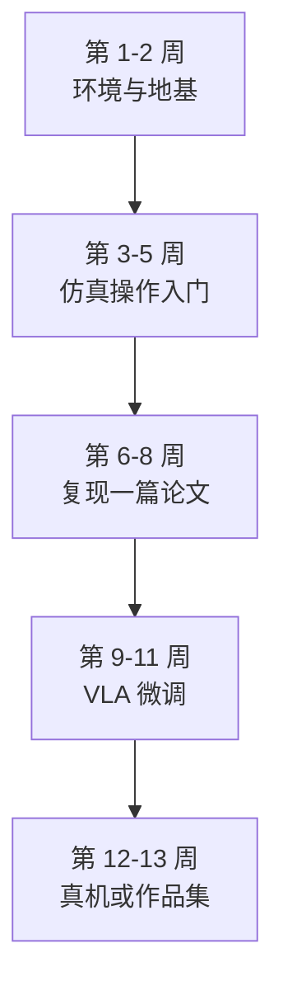

> **系列导航**：终章。前七篇完成了从控制论到 VLA 的技术纵深，本篇回答两个现实问题：这个产业的钱和人在哪里流动？一个学习者如何用最短路径做出第一个拿得出手的项目？

## TL;DR

> **TL;DR 1｜硬件的胜负手是执行器**：人形机器人 60% 以上的成本与失效集中在关节执行器。准直驱（QDD）以低减速比换回透明性与抗冲击，正在取代谐波减速器方案成为人形主流；灵巧手则是尚未收敛的最大变量。

> **TL;DR 2｜产业三种活法**：卖本体（宇树/智元）、只做大脑（Physical Intelligence/银河通用）、垂直整合（Tesla/Figure）。中国供应链优势在"本体+数据工厂"，美国优势在大模型底座与资本密度——2025 年后的竞争本质是**数据引擎效率**的竞争。

> **TL;DR 3｜个人最优上手动线已收敛**：LeRobot 开源生态 + SO-ARM100 低成本臂（千元级物料）+ Push-T/LIBERO 练手 + OpenVLA/SmolVLA 微调——90 天可以走完"跑通 → 复现 → 微调 → 部署"全链路。

## 1. 硬件解剖五分钟

### 1.1 执行器：一关节一马达的世界

| 方案 | 原理 | 代表 | 优 | 劣 |
|------|------|------|-----|-----|
| 谐波减速器 | 波发生器柔轮变形传动 | ASIMO 时代人形、多数工业臂 | 精度高、力矩密度大 | 柔轮疲劳、刚性碰撞易损、"不透明"难力控 |
| 准直驱 QDD | 低减速比(6~10:1)行星 + 大扭矩永磁电机 + 电流环力矩控制 | MIT Cheetah 系、宇树四足/人形 | 反驱动性→天然力控、抗冲击、便宜 | 力矩密度上限低、需要更大电机 |
| 液压 | 泵-阀-缸 | 老 Atlas(2024 已退役转电驱) | 功率密度之王 | 漏油、噪音、控制带宽难做 |

Boston Dynamics 2024 年将 Atlas 从液压转向全电动执行器，被广泛解读为行业路线的分水岭事件（官方博客宣布，未本地验证直链）。QDD 的物理内核正是第 01 篇讲的阻抗控制——硬件让"软件弹簧"变得透明。

### 1.2 灵巧手：没有共识的战场

Shadow Hand（20 DoF，气动肌腱时代遗老）、Inspire/因时（连杆商用方案）、OpenAI Dactyl 时代的自研三指……核心矛盾是 **DoF × 耐久 × 触觉 × 成本** 四者不可兼得。触觉阵列（第 03 篇 AnySkin 等）+ 腱绳传动的组合被视为潜在答案但寿命仍差工业级 2~3 个数量级。

### 1.3 算力与传感

机载算力主流为 NVIDIA Jetson Orin（275 TOPS）到 Thor 量级，VLA 推理普遍需要量化/蒸馏（可参考本站《大模型量化》系列的 W4A8 服务端部署技术[1](/2026/08/24/ptq-13-qserve-qqq/)——机器人端侧正是这些技术的下一个战场）。传感标配：多目 RGB + IMU + 关节编码器/电流环，头部公司加深度与 F/T。

## 2. 公司棋局（截至 2025 年中）

| 战略类型 | 公司 | 护城河逻辑 | 公开技术锚点 |
|---------|------|-----------|-------------|
| 垂直整合 | Tesla Optimus | 车规供应链+FSD 数据管线复用 | 无论文，demo 驱动 |
| 垂直整合 | Figure AI | 家政场景先落地 + 自研 VLA | Helix 双系统[2](https://www.figure.ai/news/helix) |
| 只做大脑 | Physical Intelligence | 跨本体通用策略授权模式 | π0/π0.5[3](https://arxiv.org/abs/2410.24164)[4](https://arxiv.org/abs/2504.16054) |
| 平台型 | NVIDIA | Isaac/Cosmos/GR00T 全栈工具链锁定开发者 | GR00T N1[5](https://arxiv.org/abs/2503.14734)、Cosmos[6](https://arxiv.org/abs/2501.03575) |
| 本体出货 | 宇树 Unitree | 四足出货量摊薄研发成本→人形价格战 | G1 定价 9.9 万元起[7](https://www.unitree.com/cn/g1) |
| 本体+数据工厂 | 智元 AgiBot | 百台级真机数据集群 | AgiBot World[8](https://arxiv.org/abs/2503.06669) |
| 大脑+合成数据 | 银河通用 Galbot | 抓取垂类十亿合成数据 | GraspVLA[9](https://arxiv.org/abs/2505.03233) |
| 学术开源 | Stanford/Berkeley/清华系 | 论文+代码影响力飞轮 | ALOHA/OpenVLA/RDT/LeRobot |

三条公开的技术路线辩论（每家公司嘴上都全都要，身体却很诚实）：

1. **纯端到端 VLA vs 分层系统**：PI/Figure 押前者，多数中国团队选后者（可控性+落地节奏）；
2. **真机数据 vs 合成数据**：AgiBot 押真机工厂，GraspVLA/NVIDIA Cosmos 押合成；
3. **通用 vs 垂直切入**：家政/物流分拣/汽车厂质检各有先行案例，"先在窄场景闭环盈利再谈通用"是务实派共识。

## 3. 岗位技能矩阵

| 角色 | 核心技能栈 | 本系列对应篇 | 典型背景 |
|------|-----------|-------------|---------|
| 运动控制算法工程师 | MPC/WBC/阻抗控制 + C++ 实时编程 | 01/02 | 机械/自动化/ aerospace |
| RL/locomotion 研究员 | Isaac Lab + PPO 调参 + sim-to-real 工程 | 02 | CS/自动化硕士+ |
| 感知算法工程师 | 点云/位姿估计/标定 + TensorRT 部署 | 03 | CV 转型友好 |
| 操作/VLA 研究员 | Diffusion Policy/ACT/VLA 微调 + LeRobot | 04/05 | CV/NLP 转 robotics 的主通道 |
| 数据工程师 | 遥操系统运维 + 数据清洗管线 + VLM 自动标注 | 07 | 后端工程转型 |
| 系统集成/整机 | 电气/嵌入式/故障诊断 | 08 | 机械电子复合 |

薪资与热度仅供参考的观察（非权威统计）：VLA 与 locomotion 两类岗位供需缺口最大；纯 SLAM 岗位增长放缓（行业模块化成熟所致）。

## 4. 课程与资料地图（全部亲验可达或经典公认）

| 资源 | 类型 | 为什么值得 | 入口 |
|------|------|-----------|------|
| MIT *Underactuated Robotics* | 课程+书 | 控制理论最佳现代讲义 | [underactuated.mit.edu](https://underactuated.mit.edu) ✅ |
| *Modern Robotics* | 教材+视频 | 运动学动力学标准教材，免费电子版 | 官网 ✅（ Northwestern 页面） |
| Berkeley CS285 | 课程 | Deep RL 权威课 | B 站有历年搬运 |
| LeRobot 文档 | 开源库 | 一站式 IL/VLA 工具链 | GitHub: `huggingface/lerobot` ⚠️未本地验证 |
| Lilian Weng 博客 | 博客 | RL/Diffusion 数学补丁 | [lilianweng.github.io](https://lilianweng.github.io) ✅ |
| 《视觉 SLAM 十四讲》 | 书 | 中文感知入门标准教材 | 各大书店 |

## 5. 你的 90 天上手动线

| 阶段 | 任务 | 交付物 |
|------|------|--------|
| 周 1–2 | PyTorch 复习 + MuJoCo 安装跑 demo + 读本系列 01/02 篇推导 | 手搓 cart-pole LQR（01 篇 Lab） |
| 周 3–5 | 装 LeRobot → 在内置仿真环境训 Diffusion Policy 于 Push-T | 成功率曲线 + 复现报告 |
| 周 6–8 | 选定方向深潜：locomotion 走 legged_gym；操作走 LIBERO+ACT | 复现一篇 RSS/CoRL 论文的主表 |
| 周 9–11 | 用 BridgeData 子集 LoRA 微调 SmolVLA/OpenVLA | 一个能听指令的小模型 checkpoint |
| 周 12–13 | 可选：SO-ARM100/SO-101 物料约 ¥1500 组装遥操作采自己的数据 | 真机演示视频 + GitHub 作品集 |

预算敏感版：全程无真机也可完成 80%（所有环节均有仿真替代），总花费 ≈ 电费。

## 6. 十大开放问题（研究选题雷达）

1. **数据瓶颈**：遥操作成本能否降到"视频级"？世界模型合成数据的保真度天花板在哪？
2. **泛化的度量学**：如何定义并测出"对未见物体的成功率"而不作弊（训练集泄漏）？
3. **长时程可靠性**：连续数小时任务的误差恢复架构尚无定式；
4. **接触密集技能**：拧螺丝/系鞋带级别的任务仍无 scaling 证据；
5. **双系统接口**：System1/2 之间的信息瓶颈该是什么（语言子目标？图像目标？潜向量？）
6. **跨本体迁移**：OXE 式拼盘的正迁移为何在小本体上失效？
7. **安全认证**：学习型控制器无法给出解析稳定性证明，法规如何接纳？（ISO 10218 更新版正在路上）
8. **能耗与续航**：人形整机续航 2–4 小时的电池墙；
9. **评测科学**：SimplerEnv 式"仿真校准真机"的方法论还太粗糙；
10. **经济性证明**：哪个场景的 ROI 能先打平人力？这决定行业融资的下一章。

## Lab Exercises

1. **写一份"路线辩护词"**：从第 2 节三条辩论中选一条站队，用本系列引用的论文作为证据写 800 字备忘录（例如："我支持分层系统，因为 Helix 自己也承认 S2 无法直接输出高频动作……"）。这是把知识内化为观点的最快方式。
2. **成本模型练习**：假设遥操作一条 30 秒轨迹的综合成本 ¥15（人力+设备折旧），估算训练一个 π0 规模模型（需 ~1 万小时级数据）的数据预算，对比其公开融资额——你会理解为什么所有人都在押注合成数据。
3. **启动你的项目**：今天就 clone LeRobot 并跑通安装（`pip install lerobot`），遇到环境问题记录成文——这份踩坑笔记本身就是社区需要的贡献。

## 参考文献与延伸阅读

- 系列内交叉引用：执行器与阻抗控制的物理原理见 [01 篇](/2026/08/25/embodied-ai-01-control-foundations/)；sim-to-real 工程细节见 [02 篇](/2026/08/26/embodied-ai-02-rl-il-sim2real/)；数据战略定量证据见 [07 篇](/2026/08/31/embodied-ai-07-data-sim-benchmark/)。
- 行情类信息时效性强：本篇所有公司动态均建议以官方渠道二次核实（官网链接均已给出，标注 ⚠️ 者为本地网络不可达但地址规范）。
- 中文产业分析：《机器之心》《量子位》具身智能专题、甲子光年/信通院年度报告（检索标题获取最新版本）。

*全系列完。回顾一下你走过的路：控制论的数学地基（01）→ 让机器人在仿真里进化（02）→ 给它眼睛和皮肤（03）→ 教会它双手（04）→ 装上大模型的脑子（05）→ 规划它的行动（06）→ 喂饱它的燃料库（07）→ 最后看清整个棋局（08）。接下来，轮到你动手了。*
