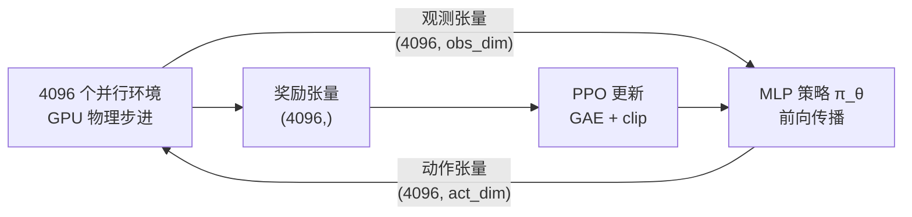
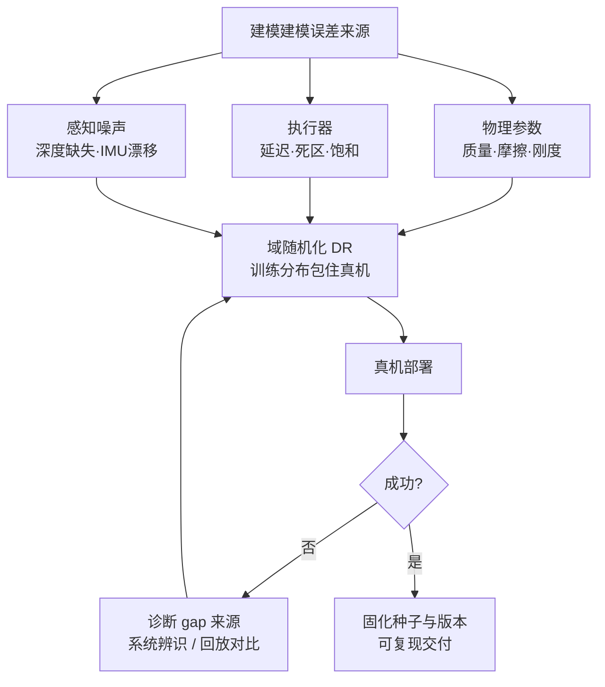

> **系列导航**：上一篇的 MPC/WBC 在结构化场景里所向披靡（[01 控制地基](/2026/08/25/embodied-ai-01-control-foundations/)），但四足机器人踩进草地、人形被撞了一下，解析模型立刻失灵。本篇讲"让机器人自己学"的两条路线：强化学习（试错）与模仿学习（照抄），以及把仿真策略搬上真机的 sim-to-real 工程学。RL 数学基础强烈建议先读本站《从 MDP 到 GRPO》系列第一篇[1](/2026/08/21/mdp-to-grpo-01-mdp-bellman-foundation/)，本篇直接复用其记号。

## TL;DR

> **TL;DR 1｜路线分工**：locomotion（走路、跑酷、抗冲击）已被 **PPO + 大规模并行仿真** 范式基本解决；manipulation（操作）因为接触动力学难仿真+数据贵，主流走 **模仿学习**。两条路线的分界不是玄学而是物理：自由空间的动力学好仿真，接触的动力学难仿真。

> **TL;DR 2｜Sim-to-Real 的本质是分布匹配**：域随机化把"训练一个鲁棒策略"转化为"在增广后的仿真分布上做期望优化" $\min_\theta\ \mathbb{E}_{\xi\sim p(\xi)}[L(\pi_\theta;\xi)]$。它有效的前提是真机参数落在随机化范围内；范围太大策略变平庸、太小则迁移失败——调这个范围就是调"方差换偏差"。

> **TL;DR 3｜模仿学习的阿喀琉斯之踵**：BC 只见过专家状态分布 $d^{\pi^*}$，自己跑偏后无人纠错，误差以二次速度复合（Ross 的协变量偏移定理）。DAgger 用"专家在线纠偏"修复，VLA 时代用 action chunking 缓解——这是贯穿第 04/05 篇的主线。

## 1. 为什么运动控制选择了 RL

第 01 篇的模型驱动方法有一个隐含假设：$f(x,u)$ 写得出来。现实中：

| 未建模效应 | 对解析方法的杀伤 |
|-----------|----------------|
| 沙地/草地/湿地反力 | 摩擦锥假设失效 |
| 减速器间隙与传动柔性 | 关节刚度模型失准 |
| 电机温升导致的力矩衰减 | 力矩限位漂移 |
| 足底磨损 | 接触几何改变 |

这些效应共同写不出来、但**仿真+真实混合下能被试错捕捉**。RL 直接优化累积回报：

$$
\max_\theta\ J(\theta) = \mathbb{E}_{\tau\sim \pi_\theta}\left[\sum_t \gamma^t r(s_t,a_t)\right]
$$

策略梯度定理给出无梯度优化路径（推导见本站 RL 系列第二篇）：$\nabla_\theta J = \mathbb{E}_{\pi}\left[\nabla_\theta \log \pi_\theta(a|s)\, A^\pi(s,a)\right]$。工程标配 PPO：裁剪重要性比率 $\min(r_t A_t,\ \mathrm{clip}(r_t, 1\pm\epsilon)A_t)$ 把每次更新的信任域限制住[2](https://arxiv.org/abs/1707.06347)。选 PPO 的理由朴素而充分：一阶方法、易并行、对超参不敏感。

## 2. GPU 并行仿真：范式革命的引擎

Isaac Gym（NVIDIA, 2021）把物理步进和渲染整体搬进 CUDA，避免了 CPU-GPU 数据往返，单卡同时模拟 4096~16384 个环境，端到端吞吐提升 2~3 个数量级[3](https://arxiv.org/abs/2108.10470)。Rudin et al. 用它在 20 分钟内训出 ANYmal 四足行走策略（此前同类工作要数天）[4](https://arxiv.org/abs/2109.11978)：

Math-Code 绑定（并行采样的张量化视角）：

| 符号 | 代码变量 | Shape | 说明 |
|---:|:---|:---:|:---|
| $o_t$ | `obs_buf` | `(N_env, n_obs)` | 观测批 |
| $a_t$ | `actions` | `(N_env, n_act)` | 策略输出批 |
| $r_t$ | `rewards` | `(N_env,)` | 奖励批 |
| done | `time_out_buf` | `(N_env,)` | 终止掩码 |

开源生态：`legged_gym`（ETH Zurich，基于 Isaac Gym）与后继者 Isaac Lab（NVIDIA 官方，GitHub: `isaac-sim/IsaacLab`，未本地验证）已成为事实标准。PyTorch 侧等价物还有 Brax/MJX（JAX 版 MuJoCo）。

## 3. Locomotion 标准配方（2024 共识版）

一个能过审顶会的四足策略，配方大致如下（以 legged_gym 风格为例）：

### 3.1 奖励函数设计表

$$
r = w_{lin} r_{vel} - w_{ang} r_{ang} + w_{alive} - \sum_j w_j c_j
$$

| 奖励项 | 方向 | 典型权重直觉 |
|--------|------|-------------|
| 线速度跟踪 $r_{vel}=\exp(-\|v^{cmd}-v\|^2/\sigma)$ | 正 | 主导项 |
| 角速度跟踪 | 正 | 次主导 |
| 存活奖励 | 正 | 小常数，防止自杀式摆烂 |
| 关节力矩 $\|\tau\|^2$ | 负 | 能耗惩罚 |
| 动作变化率 $\|a_t-a_{t-1}\|^2$ | 负 | 平滑，抑制抖动 |
| 关节加速度 / 接触力 | 负 | 保护硬件 |
| 非站立姿态（如腹部朝下） | 负 | 语义约束 |

**经验法则**：正奖励用 $\exp(-\|\cdot\|^2/\sigma)$ 形式（处处可导、有界），负惩罚用二次形式。权重每改一次都要重训——所以 Eureka 让 GPT-4 写奖励代码再自动迭代，在旋转笔任务上超过人类工程师设计[5](https://arxiv.org/abs/2310.12931)，本质是把"炼丹"变成了程序合成搜索。

### 3.2 地形课程学习

把地形难度做成阶梯（平地→缓坡→台阶→碎石），策略在简单关卡达标后解锁下一关。这是课程学习（curriculum learning）最成功的落地场景之一，Rudin 论文的核心贡献之一即此[4](https://arxiv.org/abs/2109.11978)。

### 3.3 Teacher-Student 特权蒸馏

训练时给教师策略"上帝视角"（真实摩擦系数、地形高程图），部署时学生只能用本体传感器（IMU+关节编码器+触地信号）模仿教师的隐层。Lee et al. 用这套方法让 ANYmal 盲走碎石陡坡，登上 Science Robotics[6](https://arxiv.org/abs/2010.11251)。为什么有效？特权信息相当于给了一个更平滑的优化目标面，学生的模仿过程本身就是一种正则化。

### 3.4 风格化：AMP 与"像不像"

纯任务奖励常产出"癫痫式"步态。AMP（Adversarial Motion Priors）引入判别器区分"真狗运动片段"与"策略生成的运动"，把判别器输出作为风格奖励加进总回报[7](https://arxiv.org/abs/2104.02180)：

$$
r = r_{task} + w_s \cdot r_{style}, \qquad r_{style} = -\log D(s,s') 
$$

这本质是 GAIL 思想在 locomotion 的移植，也是后来人形机器人"拟人步态"研究的起点。

## 4. Sim-to-Real 工程学

### 4.1 域随机化的数学表述

设真机参数为向量 $\xi^\star$（摩擦、质量、PD 增益、延迟……），未知但固定。DR 在训练时从区间采样 $\xi \sim p(\xi)$：

$$
\max_\theta\ J(\theta) = \mathbb{E}_{\xi\sim p(\xi),\, \tau\sim\pi_\theta(\cdot|\xi)}\big[R(\tau)\big]
$$

Tobin et al. 在视觉版本中证明：对足够多样的渲染随机化，真机图像近似落在训练分布支撑内，策略无需知道真实外观即可泛化[8](https://arxiv.org/abs/1703.06907)。OpenAI 的 Dactyl 则展示了极限操作：随机化上百个参数 + LSTM 记忆在线适应，单手解魔方[9](https://arxiv.org/abs/1808.00177)。

**失效边界**（社区共识，多来自复现经验而非论文结论）：

1. 随机化范围 ⊅ 真机值 → 迁移必败；范围过大 → 策略过度保守。正确姿势是先做**系统辨识**收窄范围；
2. **接触动力学不可靠随机**：MuJoCo/PhysX 的软接触求解器行为随求解器参数剧变，随机化 solver 参数可能学到"利用求解器 bug"的策略；
3. 执行器建模单独处理：用实测数据拟合**执行器网络（actuator net）**（小 MLP 输入位置历史输出力矩），比手写摩擦模型保真得多——Hwangbo et al. Science Robotics 2019 的关键贡献（期刊页见 [6] 同组工作）。

### 4.2 Locomotion vs Manipulation 的 gap 不对称

| 维度 | 四足/人形行走 | 手臂操作 |
|------|--------------|---------|
| 接触复杂度 | 点/面接触，法向为主 | 多指包裹，摩擦锥内滑动 |
| 视觉依赖 | 弱（可盲走） | 强（抓取=视觉定位问题） |
| 仿真保真度 | 高（刚体近似够用） | 低（形变、绳、流体更糟） |
| 主流方案 | RL + DR 直迁 | 模仿学习为主，仿真只做预训练 |

这张表解释了为什么第 04 篇的主角是 Diffusion Policy 而不是 PPO。

## 5. 模仿学习：从 BC 到 DAgger

### 5.1 行为克隆及其致命伤

BC 就是监督学习：$\min_\theta\ \mathbb{E}_{(s,a)\sim d^{\pi^*}}\left[\|\pi_\theta(s)-a\|^2\right]$。便宜有效，但有**协变量偏移**：专家只在"好状态"附近给标签，策略一旦犯错进入未见状态，错误滚雪球。Ross & Bagnell 给出定量刻画：BC 误差 $O(T\epsilon^2)$ 随时间平方复合，而存在算法可达 $O(T\epsilon)$[10](https://arxiv.org/abs/1011.0686)。

### 5.2 DAgger：请专家上车纠错

DAgger（Dataset Aggregation）循环：当前策略开环跑 → 专家对**策略访问到的状态**重新标注 → 数据集合并重训。理论保证误差线性复合[10](https://arxiv.org/abs/1011.0686)。代价：部署期需要专家随时接管标注——真机上昂贵，于是衍生出 BC-Z（共享技能空间的多任务 BC，2202.02005）等折中。VLA 时代实际采用的是它的"穷人版"：action chunking（一次预测未来 k 步动作降低决策频率）+ 海量多样化演示压制偏移，详见第 04 篇 ACT 分析。

### 5.3 从 GAIL 到离线 RL（一瞥）

- GAIL：用对抗训练直接匹配专家状态-动作分布，免显式奖励[11](https://arxiv.org/abs/1606.03476)；AMP 是其 locomotion 特化。
- 离线 RL（CQL 等）：只有静态数据集、不能探索的场景，保守 Q 学习压低分布外动作的 Q 值[12](https://arxiv.org/abs/2006.04779)；它是理解 VLA 微调为何常退化为"加权 BC"的背景知识。

## 6. 人形机器人的 RL：2024–2025 进展速记

| 工作 | 核心贡献 | 引用 |
|------|---------|------|
| Expressive Whole-Body Control | 用人类运动片段（AMASS）做 AMP 风格参考，上半身可表达手势 | [13](https://arxiv.org/abs/2402.16796) |
| HumanPlus（Stanford） | 人形影子模式：RGB 估计人体姿态→实时遥操人形→收集数据→RL 模仿 | [14](https://arxiv.org/abs/2406.10454) |
| OmniH2O | 全身遥操 + 自主策略双模态，强调 sim-to-real 全链路 | [15](https://arxiv.org/abs/2406.08858) |
| Robot Parkour Learning | 极限地形课程+记忆模块，四足跑酷出圈 demo | [16](https://arxiv.org/abs/2309.05665) |

共同趋势：**人类视频成为运动风格的免费数据源**，遥操作系统（HumanPlus/OmniH2O/DexCap）成为数据飞轮的入口——这条线索在第 07 篇数据篇汇合。

## Lab Exercises

1. **最小可行实验**：`pip install "gymnasium[classic-control]" stable-baselines3`，用 PPO 训 CartPole-v1 和 Pendulum-v1 各 20 万步，绘制 episode reward 曲线；然后人为把 `masscart` 改成 2 倍再测策略，体会"没做 DR 的策略有多脆"。
2. **感受大规模并行**：按 legged_gym README（GitHub: `leggedrobotics/legged_gym`，需 NVIDIA GPU）跑通 `python legged_gym/scripts/train.py task=anymal_c_flat`，记录 4096 并行环境下 20 分钟内的 reward 曲线，与你在 CartPole 上串行采样的吞吐量对比。
3. **DAgger 思想验证**：写一个"完美专家"（用解析解控制小车），先收集 1000 条专家轨迹训 BC，再实现一轮 DAgger（新状态由学生生成、标签由专家给），对比两次训练的轨迹误差随时间增长曲线，亲手复现平方 vs 线性复合。

## 参考文献与延伸阅读

- 本站系列：《从 MDP 到 GRPO》（MDP/贝尔曼方程 → 策略梯度 → TRPO/PPO → GRPO 五篇），与本篇记号互通。
- [2] Schulman et al., *Proximal Policy Optimization Algorithms*. [arXiv:1707.06347](https://arxiv.org/abs/1707.06347)
- [3] Makoviychuk et al., *Isaac Gym*. [arXiv:2108.10470](https://arxiv.org/abs/2108.10470)
- [10] Ross et al., *A Reduction of Imitation Learning...*（DAgger）. [arXiv:1011.0686](https://arxiv.org/abs/1011.0686)
- 博客推荐：Lilian Weng《Policy Gradient Algorithms》《Exploration in Deep RL》[链接](https://lilianweng.github.io)；OpenAI Spinning Up 教程（GitHub: `openai/spinningup`，未本地验证）。
- 课程：Berkeley CS285（Sergey Levine，B 站有搬运）；ETH Zurich《Robot Dynamics»系列讲座。

*下一篇：《03 感知》——策略再好，看不见世界一切都是零。点云网络为什么用 max-pooling？FoundationPose 如何零样本估计新物体 6D 位姿？*
